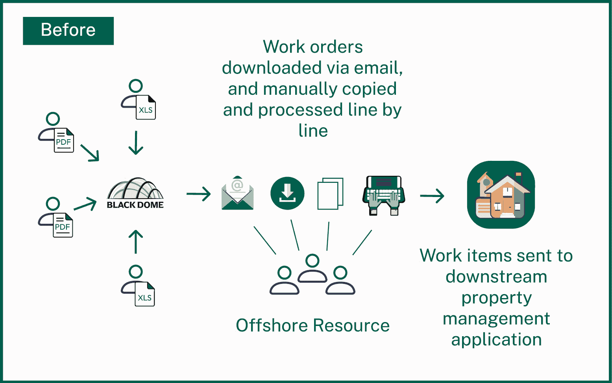
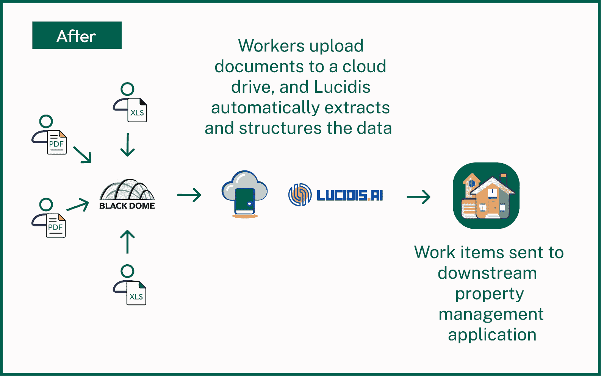
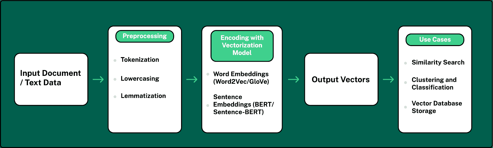
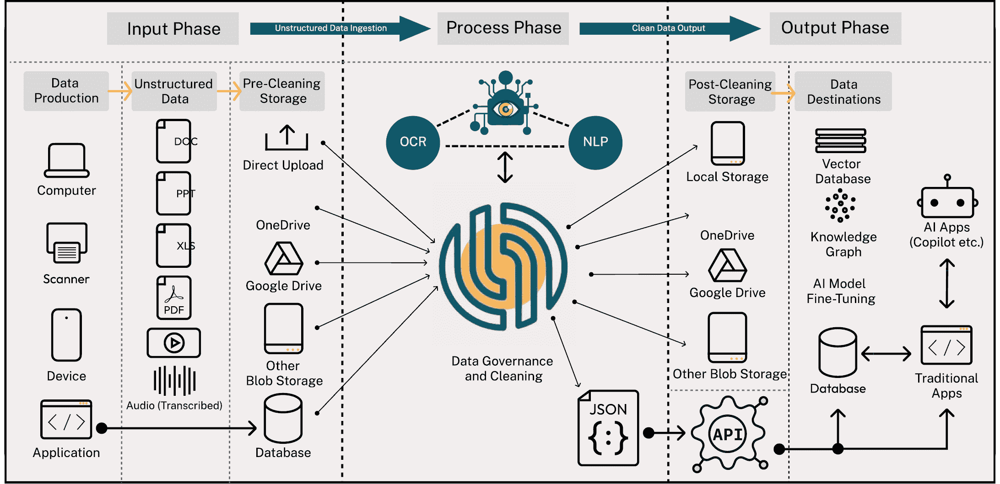
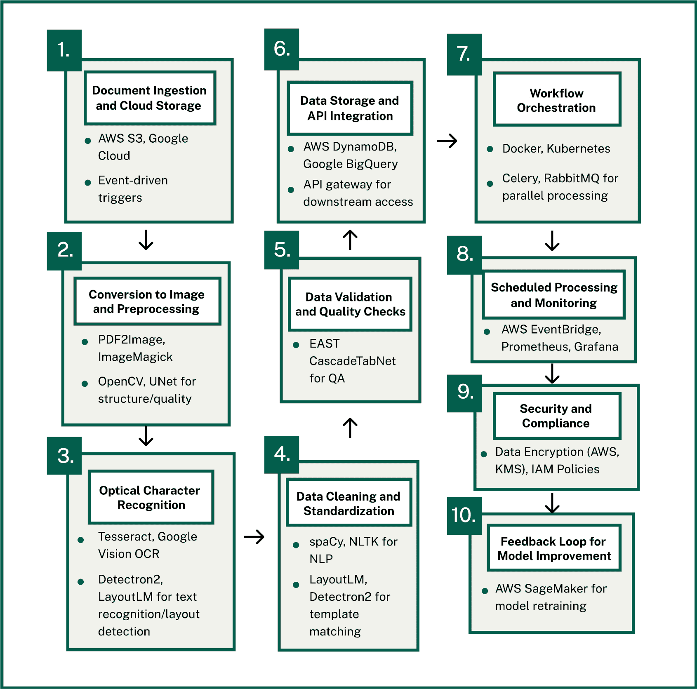
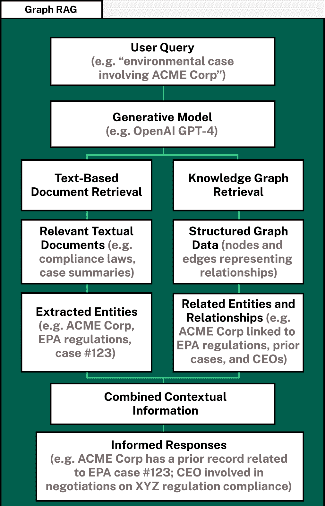
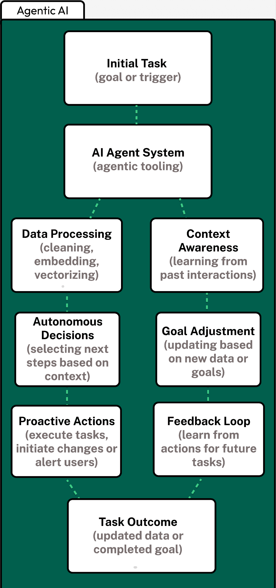

# 第五章

数据混乱问题

非结构化数据的普遍性

非结构化数据是跨行业的一个持续问题，是数字化转型倡议的重大障碍。与结构化数据不同，后者整齐地存储在数据库或电子表格中，非结构化数据以各种格式出现——PDF、DOCX、PowerPoint 演示文稿和图像——这使得其难以处理、分析和有效利用。

即使是传统的结构化格式，如 XLS 和 CSV，也常常包含自由形式的文本、图像和不一致的格式，这些对大规模数据处理构成了挑战。据估计，一个组织的数据中有 80%是非结构化的([自动化智能，2023](https://automated-intelligence.com/news-and-insights/articles/navigating-unstructured-data-challenges-in-a-growing-data-landscape-5-insights-to-consider/))，这使得问题普遍存在且日益复杂。

为什么在人工智能时代这是一个问题

非结构化数据提出的一个关键挑战是其与自动化系统和 AI 处理的兼容性问题。PDF 等格式通常包含嵌入的图像、图表和表格，这些无法轻易转换为可用的结构化数据。这迫使团队求助于手动过程，例如从文档中复制和粘贴数据，导致效率低下并引入了高人为错误的风险。

当企业依赖 AI 系统来自动化流程和生成见解时，输入数据的质量和结构至关重要。AI 系统需要结构化、组织良好的数据才能有效运行。复杂或格式不佳的非结构化数据在输入 AI 系统时可能导致不准确的结果。

例如，AI 模型可能会误解或无法处理关键信息，导致错误的见解或错误的建议。

长期影响

无法管理非结构化数据的后果不仅限于立即的运营效率低下。处理不当的数据可能导致错误的 AI 输出，在整个组织中造成系统性问题。随着时间的推移，这会导致技术债务的积累——一个不断增长的负担，就像财务债务一样，会累积并变得越来越难以解决。

由非结构化数据引起的技术债务会减缓创新，增加成本，并阻碍组织扩展的能力。不完整或错误的数据输入可能导致次优的 AI 驱动决策，降低 AI 项目的整体有效性。随着组织越来越依赖 AI 进行自动化和战略决策，在流程早期解决非结构化数据问题至关重要，以避免长期低效。

通过实施结构化数据解决方案、AI 驱动的流程和一致的预处理策略，企业可以减少技术债务，为可扩展、高效的 AI 系统打下基础。

当源数据已经是数字化的——比如电子表格或数据库——转换和增强过程、报告和分析相对容易管理。

然而，真正的挑战来自于非结构化数据，这些数据通常以各种格式和不同的交付方式到来。

我们称这个问题为数据混乱。所有这些非结构化数据的不同格式都在阻碍公司实现其数字化转型努力。”

--Binni Skariah

Black Dome 案例研究

谁是 Black Dome？

[Black Dome Property Services](https://www.blackdomeservices.com/)专注于为抵押贷款公司和金融机构提供财产保护。这些机构通常通过抵押权、破产或违约来获取财产，并负责在可以将其出售给新业主之前维护这些财产。Black Dome 负责从草坪护理和除雪到更广泛的维修等一系列任务，确保在整个抵押权过程中财产保持良好状态。

Black Dome 面临了哪些问题？

格式不一致：Black Dome 面临的主要挑战来自他们收到的各种格式的工作订单数据。正如 Binni 解释的那样，“他们从各个供应商那里收到的数据格式不同，因为每个供应商和客户都有自己的系统来生成住房数据。”这种不一致性造成了一个重大的障碍，因为 Black Dome 不得不管理来自不同来源的多种格式，这复杂了他们高效处理数据的能力。

手动数据录入及其后果：由于数据格式的不统一，Black Dome 的员工被迫将每份文档中的信息手动输入到他们的财产和工作订单管理系统。这个过程既繁琐又浪费时间，对公司的几个方面产生了不利影响：

+   效率和吞吐量降低：正如 Binni 所指出的，“员工需要打开文档，逐行剪切和粘贴到他们的应用程序中，该应用程序管理工作订单并与现场代表沟通。”这种手动方法严重限制了 Black Dome 在特定时间内可以处理的工作订单数量。瓶颈使得跟上工作量变得具有挑战性，有时会导致处理延迟。

+   人类错误的风险增加：手动重新输入数据总是存在出错的风险。员工可能会误读数据、输入错误或把信息输入到错误的字段中。这通常会导致不准确的工作订单，这可能会进一步延迟甚至导致损坏财产的错误。

+   外包成本：为了管理大量工作订单，Black Dome 不得不外包一些数据录入工作，从而产生了额外的费用。

具体的痛点

每个物业多个工作订单：Black Dome 经常管理需要多个工作订单的物业，这些工作订单涉及不同的任务，如草坪护理、维修或清洁。正如 Binni 解释的那样，“一个物业可能有多个工作订单，每个订单可能有 40 项。”这大大增加了需要手动处理的数据量，进一步减缓了运营速度。

每个工作订单耗时数据录入：每个工作订单的处理都需要相当多的时间，员工每个订单可能需要花费多达 40 分钟手动输入数据。“这是一个耗时过程，”Binni 说，“工人们必须打开附件，然后在另一台显示器上打开他们的应用程序，通常使用多个屏幕。对于每栋房子，他们必须手动将维修、服务类别和位置等详细信息从文档复制粘贴到各个屏幕上的应用程序中。这是一个繁琐的手动过程。”这个低效的系统给 Black Dome 的员工带来了负担，降低了他们处理不断增长的工作量的能力。

在此之前：Black Dome 的工作订单处理工作流程，在 AI 和自动化解决方案之前

图 1 展示了在将 AI 和自动化解决方案引入其工作流程之前，Black Dome 如何处理工作订单管理流程。这通常需要外包以跟上需求，并且可以大致分为八个步骤。

第一步：员工收到来自客户的电子邮件，其中包含不同物业的工作订单附件。

第二步：工人们打开附件，这些附件通常是未结构化的文档，如 PDF 文件。

第三步：工人在另一台显示器上打开 Black Dome 管理工作订单的应用程序。

第四步：对于每个物业，工人们从文档中复制维修、服务类别和位置等详细信息。

第五步：工人们将复制的详细信息粘贴到 Black Dome 订单管理应用程序的各种屏幕中，即 [Property Preservation Wizard](https://home.propertypreswizard.com/)。

第六步：这个过程会针对工作订单上的每一项重复，这些项目可能包含 30 到 40 项。

第七步：一旦工作订单被输入到应用程序中，就可以分配了。

第八步：指定的现场代表前往物业并完成工作。

图 1：展示在将 AI 技术添加到其运营之前，Black Dome 如何处理工作订单的图表。

之后：AI 和自动化如何改变 Black Dome 处理工作订单管理的方式

图 2 展示了自实施本报告将讨论的技术以来，Black Dome 的工作订单管理流程如何发生变化。

数据混乱：Black Dome 仍然从供应商那里以各种未结构化的格式接收工作订单数据。

Google Drive 上传：员工将工作订单文档放入指定的 Google Drive 文件夹。

数据摄取：Lucidis 自动使用先进的 OCR、机器视觉和 AI 等技术摄取、转换、提取、清洗和结构化数据，这些技术将在以下章节中详细讨论。这一步骤完全取代了手动复制粘贴的过程。

发送到工作订单管理应用的数据：清洗后的数据自动转换为机器可读格式（在这种情况下为 JSON），并通过 Property Preservation Wizard 公开的 API 发送，然后自动填充应用中的字段。

工作完成：指定的现场代表前往物业并完成工作。

丰富的数据洞察：清洗后的数据被矢量化并发送到矢量数据库，以供未来的 AI 处理（例如，工人可以用自然语言与数据交互）。

如您将在下一页看到的那样，这一变化对 Black Dome 的运营产生了重大影响。

图 2：展示 Black Dome 现在如何处理工作订单处理的流程图。

结果：掌握数据对 Black Dome 的影响

自动化数据清洗和处理的实施改变了 Black Dome 的运营，解决了关键的低效问题，并显著提高了生产力。通过消除手动数据录入并将自动化集成到现有的工作流程中，Black Dome 能够简化工作订单处理，提高准确性，并降低成本。以下是这一变革的关键成果。

消除手动数据录入：以前，Black Dome 的员工花费大量时间从非结构化格式中手动提取数据——这是一个容易出错且效率低下的过程。现在，这一过程大部分已经自动化，将手动步骤从八个减少到仅仅两个。员工现在只需下载电子邮件附件并将文件上传到云端驱动器。

消除了人为错误：自动化消除了人为错误，导致工作订单的准确性显著提高。

效率和速度显著提高：通过将自动化添加到他们的工作订单管理中，工作订单的处理时间减少了 80%——从每个订单 30-40 分钟减少到只需上传文档。这种自动化：

+   每个工作订单的处理时间减少，使员工能够专注于更高层次的任务。

+   提高吞吐量，使 Black Dome 能够在不增加人员或资源的情况下处理显著更高的工作订单量。

+   提高可扩展性，为公司未来的增长定位。

内部工作订单管理：以前，由于数据录入量高，Black Dome 不得不外包部分数据录入工作。现在，公司已经重新获得了 100%的工作订单处理控制权，消除了外包的需求。

显著降低成本：运营成本降低了 80%，这得益于外包成本的消除、生产力的提高以及零数据录入错误。

最大的改进在于效率。我无法强调他们通过消除手动剪切和粘贴节省了多少时间。”

-- Tobalo Torres

一目了然的要点

+   工作订单处理时间减少 80%

+   数据处理 100%准确，消除手动错误

+   由于外包消除和效率提高，净成本节省 80%

+   更高的生产力：Black Dome 可以利用现有资源处理更大的工作量，使员工能够专注于更有价值的任务

反馈接触点 1：

我们重视尖锐的反馈。

对本节的快速想法？](https://forms.office.com/e/4a01JLkbhd)

为您的业务提供数据处理自动化

在前面的章节中，我们讨论了非结构化数据及其对组织效率和 AI 驱动流程的影响。我们展示了如何解决这个问题为 Black Dome 带来了变革性的收益。在本节中，我们介绍了在您自己的公司中实施类似解决方案所涉及的概念，并概述了一些常用的工具。

任何处理非结构化数据的组织都可以采用结构化方法来自动化大规模数据处理，并确保他们的数据管道清洁、准确，并与现有系统集成。通过利用人工智能技术、光学字符识别（OCR）、机器视觉和自动化，公司可以大幅提高效率并降低成本。

核心步骤

1.  文档摄取：第一步是建立一个能够自动摄取非结构化格式数据的系统。这可以通过使用各种工具或平台来实现，这些工具或平台利用[光学字符识别](https://aws.amazon.com/what-is/ocr/)（OCR）、[机器视觉](https://www.cognex.com/what-is/machine-vision)和[自然语言处理](https://www.ibm.com/topics/natural-language-processing)（NLP）来捕捉和解释这些不同文件类型中的内容。[智能文档处理](https://www.microsoft.com/en-us/power-platform/products/power-automate/topics/business-process/intelligent-document-processing)（IDP）和[机器人流程自动化](https://www.ibm.com/topics/rpa)（RPA）解决方案通常用于自动化文档摄取并简化跨部门的流程。

1.  文档清理和标准化：一旦数据被摄取，下一个挑战就是清理它。这涉及到将各种非结构化格式转换为图像和标准化的、机器可读的格式。机器视觉可以分析文档或图像布局，并检测复杂元素，如表格、嵌入的图像和图表，确保它们被准确捕获。随后，光学字符识别（OCR）可以提取文本、图像和表格，并将它们转换为可管理的基于文本的格式。这一步骤减少了噪声，并确保数据可以被下游系统使用。[数据去重](https://learn.microsoft.com/en-us/windows-server/storage/data-deduplication/overview)也可能在这一阶段发生，以删除冗余数据，降低存储和处理成本。在文档使用多种语言或包含复杂格式的情况下，使用[多语言处理](https://fastdatascience.com/natural-language-processing/multilingual-natural-language-processing/)和[规范化](https://developers.google.com/machine-learning/crash-course/numerical-data/normalization)来确保一致性。

1.  数据提取和转换：在标准化之后，公司应专注于从文档中提取最相关的数据点。这包括识别关键字段，如发票号码、日期或特定指标，并将它们转换为结构化数据格式。这确保了仅保留对进一步处理至关重要的数据。根据业务需求，这一步骤确保了数据可以被后续系统使用。

基于人工智能的提取工具，通常基于自然语言处理（NLP）和实体识别模型，可以用来自动检测和提取关键字段。这些模型可以随着时间的推移学习和适应，使用得越多越高效。对于处理高度特定或复杂的文档类型，如法律合同或财务报表，可能需要定制构建的 AI 模型。

光学字符识别（OCR）将非结构化文档（如 PDF 或扫描图像）中的文本转换为机器可读格式，使数据可搜索和可编辑。

机器视觉通过分析图像或文档布局、识别模式和识别文本、表格和图像等组件来补充 OCR。

它们共同实现了从复杂格式中准确提取数据，将非结构化文档转换为可用于进一步处理的可用结构化信息。

1.  数据结构和序列化：一旦提取了相关数据，必须以允许其轻松集成到其他系统的方式进行结构化。这通常意味着将数据序列化为 JSON、XML 或 YAML 等格式，这些格式在现代[API](https://aws.amazon.com/what-is/api)和系统集成中广泛使用。这些格式确保数据可以无缝流入企业系统，如[ERP](https://www.sap.com/products/erp/what-is-erp.html)或[CRM](https://www.techtarget.com/searchcustomerexperience/definition/CRM-customer-relationship-management)工具。对于关系型数据存储，可能会使用[SQL](https://www.mongodb.com/resources/basics/databases/nosql-explained/nosql-vs-sql)数据库，而对于灵活的非结构化数据，则更倾向于使用[NoSQL](https://www.ibm.com/topics/nosql-databases)系统。[序列化期间的架构验证](https://www.packetcoders.io/what-is-schema-validation/)确保结构化数据与下游系统所需的格式相匹配，从而减少集成错误。

1.  数据集成和工作流程自动化：将清洗和结构化的数据集成到现有工作流程中是真正提高效率的地方。工作流程自动化工具，如 RPA 平台或[集成平台即服务](https://www.ibm.com/topics/ipaas)（iPaaS）解决方案，可以自动将结构化数据填充到运营系统中。这消除了手动数据输入，大幅减少了错误，提高了吞吐量，并导致显著的时间和成本节约。先进的基于 AI 的自动化可以通过根据实时分析和预定义的业务规则调整数据路由和处理来进一步增强这些工作流程。对于需要大规模数据需求的组织，使用事件驱动架构（例如，[Kafka](https://kafka.apache.org/)或[Amazon Kinesis](https://aws.amazon.com/kinesis/））来处理企业内部实时数据流。

1.  AI 驱动的洞察和交互：一旦数据被集成和结构化，公司可以利用 AI 驱动的洞察来增强决策。AI 模型可以分析趋势，预测未来结果，并根据提取的数据提供可操作的见解。例如，企业可以部署 AI 驱动的聊天机器人界面，允许员工通过自然语言查询与结构化数据交互，使数据更易于访问，并实现更快的决策。除了聊天机器人之外，[预测分析](https://online.hbs.edu/blog/post/predictive-analytics)、[智能代理](https://www.gartner.com/en/articles/intelligent-agent-in-ai)和基于数据的自动化决策工具可以进一步增强数据可用性。这些工具可以触发诸如订购库存、向用户发出异常警报或基于过去数据模式提供建议等操作。

解决数据混乱问题的关键考虑因素

可扩展性：解决方案必须随着数据量的增长而扩展。[云原生架构](https://aws.amazon.com/what-is/cloud-native)对于可扩展性至关重要，它允许公司在数据需求增加时弹性扩展。[微服务](https://aws.amazon.com/microservices/)、[容器化](https://www.ibm.com/topics/containerization/) ([Docker](https://www.docker.com/)、[Kubernetes](https://kubernetes.io/)) 和 [无服务器架构](https://www.datadoghq.com/knowledge-center/serverless-architecture/) 使灵活的按需扩展成为可能。公司应考虑使用无服务器平台 ([AWS Lambda](https://aws.amazon.com/lambda/), [Microsoft Azure Functions](https://learn.microsoft.com/en-us/azure/azure-functions/functions-overview?pivots=programming-language-csharp), [Google Cloud Functions](https://www.pluralsight.com/resources/blog/cloud/google-cloud-functions-explained)) 来处理事件驱动的工作负载，从而实现无缝处理，无需管理基础设施的开销。

安全性和合规性：随着公司向人工智能驱动的自动化转变，确保遵守[GDPR](https://gdpr-info.eu/)、[HIPAA](https://www.hhs.gov/hipaa/index.html) 和 [CCPA](https://oag.ca.gov/privacy/ccpa) 等法规至关重要。实施强大的加密、[访问控制机制](https://www.techtarget.com/searchsecurity/definition/access-control) 并确保数据主权（将数据保留在特定的地理区域内）有助于维护数据安全。此外，[数据血缘](https://www.ibm.com/topics/data-lineage) 和 [审计跟踪](https://www.auditboard.com/blog/what-is-an-audit-trail/) 允许组织跟踪数据的使用和处理方式，确保透明度和问责制。

数据治理和质量：强大的[数据治理](https://www.ibm.com/topics/data-governance)框架确保组织内部数据的一致性、所有权和质量控制。这包括实施主数据管理 (MDM) 来管理核心数据实体，并使用 [数据目录](https://www.alation.com/blog/what-is-a-data-catalog/) 来提高透明度。如果没有适当的治理，数据会随着时间的推移而退化，导致效率低下并产生[技术债务](https://agiledata.org/essays/datatechnicaldebt.html)，这可能会阻碍未来的自动化和人工智能努力。

人工智能系统的向量化

使非结构化数据可用于 AI 驱动工作流程的关键方面是向量化。一旦数据被清理和结构化，就必须将其转换为向量——AI 模型可以处理的数值数据表示。这种转换使 AI 能够通过将其转换为算法可以分析的形式来理解和处理文本或图像数据。向量化支持诸如文档分类、语义搜索和自然语言理解等任务。此外，向量化数据可以存储在向量数据库中，以实现高效的查询和检索，使 AI 模型能够在实时交互中提供上下文相关的结果。

向量化工作流程

1.  输入文档/文本数据：从一个文本文档开始，这可能是从 PDF、网页或原始文本文件中提取的。此文本可以包括段落、句子或以原始、未处理的形式出现的单个单词。

1.  预处理：原始文本经过预处理。这包括：

    +   分词：将文本分割成标记，通常是单词或子词。

    +   小写化和停用词去除：将文本转换为小写并移除不相关的词，如“the”、“is”和“and”。

    +   词形还原/词干提取：将单词还原为其基本/根形式（例如，“running”到“run”）。

1.  使用向量化模型进行编码：预处理后的标记通过向量化模型传递以创建数值表示（向量）：

    +   词嵌入：Word2Vec 或 GloVe 等模型生成密集向量，根据上下文捕获词义。

    +   句子嵌入：BERT 或 Sentence-BERT 等模型用于生成整个句子或短语的嵌入，捕捉单词和句子之间的细微关系。

    +   向量维度：结果是高维向量（例如，300 或 768 维），代表每个标记或句子。

1.  输出向量：文本现在表示为一个向量（或一系列向量）。每个向量都有数值，这些数值封装了文本中的意义、上下文和关系，允许进行相似度比较和机器学习应用。

1.  应用：这些向量现在可用于各种应用，例如相似度搜索（比较向量以找到语义相似的文档或句子）、聚类和分类（使用向量作为机器学习模型的输入以分类或聚类数据），或存储在向量数据库中（向量可以存储在 Pinecone 等专用数据库中，以实现高效的检索和查询）。

图 3：展示向量化过程的图示。

在 Lucidis 的上下文中的工作原理

图 4 说明了 Lucidis 解决方案的数据处理流程。以下是正在发生的事情：

1.  输入阶段：非结构化数据产生并送入预清理存储，然后再由 Lucidis 摄取。

1.  处理阶段：文档被摄取并转换为图像。然后，OCR、机器视觉和 NLP 被用于清洗数据，使其对下游应用程序和 AI 系统更易于访问和更有价值。

    +   预处理：机器视觉标准化文档并增强图像可读性。它调整亮度、对比度和对齐，并分割文本、图像和表格。

    +   文本提取（OCR）：OCR 将文本区域转换为数字格式，适应混合内容如褪色文本或手写，并忽略由机器视觉识别的非文本元素。

    +   OCR 后布局结构化：机器视觉细化文本结构以识别段落分隔、对齐和布局提示，有助于保持文档的原始组织。

    +   语义分析：NLP 通过识别标题、提取实体和分类内容来组织文本。它检测模式并分析上下文，有助于情感检测、主题识别和摘要，有助于为不同的 AI 模型塑造数据。

    +   反馈循环：NLP 标记任何无意义的文本以供 OCR 重新处理，同时机器视觉检查并抑制错误文本检测，提高准确性。

1.  输出阶段：数据清洗后，根据用例和业务需求被导向不同的目的地。清洗后的数据可以被输入到不同类型的数据库或后清洗存储中，或发送到 AI 应用程序如[RAG](https://blogs.nvidia.com/blog/what-is-retrieval-augmented-generation/)模型、传统应用程序或知识图谱。然后，它可以用于微调 AI 模型或增强应用程序的智能。

1.  API 链接：如果清洗后的数据需要与下游系统集成，它将被转换为标准格式如 JSON、XML 或 YAML，以便与 API 一起使用。这允许数据被企业应用程序如 ERP 或 CRM 系统使用，确保在不同软件平台间实现顺畅的互操作性。

图 4：展示 Lucidis 解决方案中数据处理流程的图示。

技术栈

Lucidis AI 解决方案的骨干在于一个架构良好的技术栈。本节深入探讨了用于驱动 Lucidis AI 的技术细节。

后端技术

[Node.js](https://nodejs.org/en)和[Python](https://www.python.org/)是驱动 Lucidis 后端的主要编程语言。这些工具提供了强大的功能，用于处理后端逻辑、API 请求和大规模数据处理任务。Python 凭借其成熟的 AI 和数据科学库，实现了高效的 AI 模型集成，而 Node.js 则支持快速且可扩展的后端服务。

[Docker](https://www.docker.com/)用于容器化解决方案，使得在不同环境中轻松部署成为可能。Docker 确保无论基础设施如何，Lucidis 都能运行。

Lucidis 高度依赖亚马逊网络服务([AWS](https://aws.amazon.com/))进行云基础设施。使用[S3](https://aws.amazon.com/s3/)进行安全且可扩展的数据存储，而[EC2](https://aws.amazon.com/ec2/)提供处理资源密集型人工智能工作负载所需的计算能力。

前端技术

[Vue.js](https://vuejs.org/)构成了 Lucidis 用户界面的基础，提供了一个现代、轻量级的框架，用于创建响应式和直观的基于 Web 的平台。它允许用户无缝地与 Lucidis 系统交互，同时后端在幕后处理数据处理。

数据处理、自然语言处理(NLP)和机器视觉

Lucidis 的优势在于其摄取、清洗和加工非结构化数据的能力，例如 PDF 文件、DOCX 文件、电子表格和图像。这是通过一系列先进的 AI 工具和技术实现的。

OCR（光学字符识别）：该平台利用 OCR 技术，如[Tesseract](https://github.com/tesseract-ocr/tesseract)和[PaddleOCR](https://paddlepaddle.github.io/PaddleOCR/main/en/index.html)，从复杂的文档中准确提取文本。这些工具在处理高度格式化的 PDF 时特别有效，确保数据被准确且高效地捕获。

机器视觉：一旦文档被转换为图像，Lucidis 会采用包括[OpenAI 的](https://platform.openai.com/docs/guides/vision)视觉模型在内的多种模型，用于分析和提取图像中的信息，以及执行图像理解和从视觉内容中提取数据等任务。当处理包含嵌入式图表、表格和图像的 PDF 或其他格式时，这一步骤至关重要，因为这些内容使用传统的基于文本的提取方法可能难以解释。机器视觉对这些文档进行净化，提取干净、可用的数据，然后对其进行结构化以便进一步处理。

向量化和嵌入：数据清洗后，使用[Pinecone](https://www.pinecone.io/)进行向量存储，允许大量文档数据被高效地索引和查询。[LLaMA Index](https://www.llamaindex.ai/)和[LLaMA Parse](https://docs.llamaindex.ai/en/stable/llama_cloud/llama_parse/)支持平台的嵌入和索引功能，使数据能够以自然语言进行交互。

模型集成的人工智能网关

Lucidis 使用一个 AI 网关，使他们能够集成最新的 AI 模型，并跟上该领域的新发展。这使得 Lucidis 能够适应市场需求和行业标准的变化，支持各种增强 Lucidis 知识库和文档处理能力的模型，并允许他们针对不同任务最大化各种模型的优势。以下是 Lucidis 目前使用的一些模型。

Claude Sonnet：一种以强大的指令遵循、文档理解和视觉数据提取而闻名的视觉模型。[Claude Sonnet](https://www.anthropic.com/news/claude-3-5-sonnet)在自动化重复性任务、与计算机界面交互以及从文档和视觉中分析数据方面表现出色。它非常适合自动化需要从复杂文档或 PDF 内容中提取数据的工作流程。

GPT Vision 模型：擅长处理多模态任务，如从图像生成描述、回答关于视觉的问题以及增强响应的上下文深度。这使得它们非常适合需要视觉和文本洞察的文档密集型工作流程。

LLaMA 3.1：一个适合通用文本处理任务（如嵌入、分类和摘要）的开源 NLP 模型。其灵活性允许进行定制微调，使其适用于广泛的 NLP 应用，特别是那些需要特定适应的应用。

Salesforce Gen 系列：专注于企业应用，[Gen 系列](https://www.salesforce.com/artificial-intelligence/)利用 CRM 特定的洞察力，并易于集成到 Salesforce 的生态系统中，优化客户支持、线索生成和营销内容，以及符合企业数据处理的规范。

可扩展性和云无关性

Lucidis 旨在跨不同环境进行扩展，这对于经常处理数百万份文档的企业客户来说是一个关键特性。

云原生架构：虽然 Lucidis 利用了 AWS 等云技术，但它[云无关](https://www.vmware.com/topics/cloud-agnostic)，这意味着它可以在各种环境中部署，包括私有云或企业防火墙后面。由 Docker 支持的容器化特性确保它可以在任何基础设施设置中安全高效地运行。

水平扩展：基础设施针对[水平扩展](https://www.digitalocean.com/resources/articles/horizontal-scaling-vs-vertical-scaling)进行了优化，允许 Lucidis 通过在多个云区域分配工作负载来处理不断增长的数据量。这确保了即使在需求增长的情况下，也能保持高可用性和性能。

安全和合规性

在处理如此多的内部文档时，数据隐私和安全至关重要，Lucidis 采用严格的以安全为首要的方法。

零信任模型：通过零信任安全模型将安全性深度嵌入平台，确保每个交互，无论是内部还是外部，都在最细粒度级别上进行身份验证和授权。数据在传输和静止状态下都使用 AWS 强大的加密协议进行加密。

数据治理和合规性：Lucidis 遵守关键行业标准，如 HIPAA、GDPR 和[SOC 2](https://soc2.co.uk/)，确保其满足企业客户的合规性要求。

认证：Lucidis 致力于追求认证，以确保安全的环境并向客户提供安心。

软件组成分析：这包括跟踪使用的库和包，将它们与漏洞数据库如 [OWASP](https://owasp.org/) 和 [CVE](https://cve.mitre.org/) 进行比较，以确保软件符合安全实践并保持最新。

ISACA 认证团队成员：Whiteglove，Lucidis 的母公司，雇佣了 [ISACA](https://www.isaca.org/) 认证人员，这确保了遵守高标准的安全规范。

数据存储

Lucidis 支持一系列定制的存储解决方案，以满足不同客户的需求，确保高效的数据处理和检索。

正如所述，Pinecone 用于管理大量矢量化数据，在人工智能驱动的文档交互中实现快速和高效的检索。其强大的索引能力针对实时查询进行了优化，即使在大量数据集的情况下也能确保无缝的性能。

[MongoDB](https://www.mongodb.com/) 提供了一种灵活的解决方案，用于处理结构化和半结构化数据，如 JSON 文件，这对于需要可扩展性和灵活性的应用程序来说非常理想。MongoDB 的 ACID 兼容性和强大的索引功能使 Lucidis 能够维护可靠的数据一致性，这对于在需求量大的环境中管理复杂的数据关系至关重要。

对于有特定隐私需求的客户，[ChromaDB](https://www.trychroma.com/) 提供了一个安全、本地化的存储选项，确保敏感数据始终保持在私有网络中。此解决方案支持需要增强数据控制能力的客户，同时仍能启用 Lucidis 全套人工智能驱动的文档处理功能。

适应性和集成

Lucidis 设计为可适应的，通过 API 和工作流程自动化与各种外部系统集成。

API 和工作流程集成：Lucidis 是 API 驱动的，能够无缝集成到客户的下游系统，如 Property Preservation Wizard (PPW) 和定制的内部文档管理系统。这种灵活性确保 Lucidis 可以根据每个客户的特定业务需求进行定制，而无需进行重大的重新设计。

评估技术时，我的主要思考过程围绕企业规模和公司安全。虽然短期内使用轻量级和简单的 SaaS 解决方案或 API 集成很容易，但长期愿景则关注我们如何在高度安全、真空密封的企业环境中运作。

这是我决定技术时的关键因素——超越即时用例的思考，并确保我们的解决方案具有可扩展性、安全性，并适合企业级需求。”

-- Tobalo Torres

流程的每个部分都有流行的工具

到目前为止，你应该已经很好地理解了自动化数据清理计划中涉及的技术。现在，我们将讨论在处理过程的每个阶段使用的工具，为您提供资源库，以便您决定实施内部解决方案。

文档摄取和云存储

云存储设置：使用 AWS S3、Google Cloud Storage 或 Azure Blob Storage 等云存储解决方案来存储传入的文档。每个文档都可以上传到特定的文件夹或存储桶，触发处理管道。基于文件夹的触发器还可以帮助按文档类型或优先级进行排序，以在更大的工作流程中实现更好的组织。

事件驱动触发：配置触发器（例如，AWS Lambda，Google Cloud Functions），当新文件上传时自动启动处理。这些触发器在文档放置在指定的存储中时立即启动自动化工作流程。

转换为图像和预处理

PDF 到图像转换：使用[pdf2image](https://github.com/Belval/pdf2image)或[ImageMagick](https://imagemagick.org/index.php)等工具将 PDF 转换为图像文件。这些工具对于处理大型 PDF 或高分辨率的文档也非常有效，允许 OCR 和视觉模型处理复杂、高度格式化的文档。

用于文档结构和质量提升的机器视觉：机器视觉算法检测文档结构，例如页眉、页脚和表格，帮助分割文档以实现更精确的 OCR。像[OpenCV](https://opencv.org/)这样的工具可以检测基本的文档结构（边缘、线条）以识别文本块。

对于高级分割和图像增强，可以使用[UNet](https://github.com/milesial/Pytorch-UNet)或[Faster R- CNN](https://mathworks.com/help/vision/ug/getting-started-with-r-cnn-fast-r-cnn-and-faster-r-cnn.html)等模型检测特定的文档区域或提取表格。

图像预处理：使用 OpenCV 和[PIL](https://github.com/python-pillow/Pillow)（Python 图像库）清理图像，以进一步优化 OCR 的准确性。像[EAST](https://github.com/foamliu/EAST)（高效且准确的场景文本检测器）这样的机器视觉模型也可以改善文本块的分割，增强 OCR 结果。

光学字符识别

OCR 引擎：利用 Tesseract、PaddleOCR 或商业选项（[Google Vision OCR](https://cloud.google.com/use-cases/ocr?hl=en)，[AWS Textract](https://aws.amazon.com/textract/））从图像中提取文本。

区域和布局检测的机器视觉：[Detectron2](https://github.com/facebookresearch/detectron2) 或 [LayoutLM](https://huggingface.co/docs/transformers/en/model_doc/layoutlm) 可用于布局分析，识别文档区域（文本、表格、图像），并允许 OCR 聚焦于文本区域。[YOLO](https://pjreddie.com/darknet/yolo/)（You Only Look Once）可以检测需要单独处理的特定文档元素，如徽标、邮票或印章。

定制 OCR 模型：对于复杂的文档布局，考虑使用 [TensorFlow](https://www.tensorflow.org/) 或 [PyTorch](https://pytorch.org/) 训练定制的 OCR 模型。像 [CascadeTabNet](https://github.com/DevashishPrasad/CascadeTabNet) 这样的机器视觉模型可以帮助准确识别结构化数据，如表格、发票和表格。

数据清理和标准化

文本解析和清理：使用正则表达式 ([regex](https://www.regular-expressions.info/)) 和 NLP 工具，如 [spaCy](https://spacy.io/) 或 [NLTK](https://www.nltk.org/)，来解析和清理提取的文本。

基于模板的数据结构化：LayoutLM 和 Detectron2 可以识别常见文档格式中的特定布局。使用 [布局分析](https://paperswithcode.com/task/document-layout-analysis) 来匹配预定义的提取模板，将数据映射到结构化格式，如 JSON。

模板匹配：[OpenCV 的模板匹配函数](https://docs.opencv.org/4.x/d4/dc6/tutorial_py_template_matching.html)可以通过识别视觉线索和对齐数据字段来自动化结构化任务。模板匹配还可以检测标准形式的更改，标记出与预期格式不符的偏差，以便进行质量检查。

数据验证和质量检查

自动化质量检查：运行质量保证流程以验证提取数据的准确性。OpenCV 可以通过确认与文档结构的对齐来验证预期视觉元素（如徽标或验证标记）的存在和清晰度。像 EAST 或 CascadeTabNet 这样的模型可以标记表格和文本块中的结构差异，这些差异与预期格式不匹配。

人工验证：使用基于网络的界面将标记的数据路由到手动验证。该界面可以显示 OCR 或机器视觉模型的置信度分数，指导人工审查员关注需要更仔细检查的区域。机器视觉通过标记不符合结构预期的元素来协助，从而提高质量控制流程。

数据存储和 API 集成

数据库选择：将结构化数据存储在云数据库中（例如，MongoDB、[Google BigQuery](https://cloud.google.com/bigquery?hl=en) 或 [Azure Cosmos DB](https://azure.microsoft.com/en-us/products/cosmos-db)）。BigQuery 和 Cosmos DB 可以实现高可用性扩展，使它们非常适合可靠地处理大量数据集。

API 开发：使用如 [AWS API Gateway](https://aws.amazon.com/api-gateway/) 或 [Google Cloud Endpoints](https://cloud.google.com/endpoints/docs) 这样的云托管服务构建 [RESTful APIs](https://aws.amazon.com/what-is/restful-api)，以促进数据向下游系统的传输。

工作流程编排

容器化和微服务：使用 Docker 对工作流程组件（例如，摄取、OCR、解析）进行容器化，以实现模块化，允许独立更新和简化部署。

与 Kubernetes 的编排：使用如 [AWS EKS](https://aws.amazon.com/eks/)、[GCP GKE](https://cloud.google.com/kubernetes-engine?hl=en) 或 [Azure AKS](https://azure.microsoft.com/en-us/products/kubernetes-service) 这样的托管 Kubernetes 服务来管理容器化服务，并实现水平扩展。

并行处理：使用如 [Celery](https://docs.celeryq.dev/en/stable/) 这样的任务队列，配合 [RabbitMQ](https://www.rabbitmq.com/) 或 [Redis](https://redis.io/) 实现并行处理，以同时处理多个文档，这对于高效处理大量数据至关重要。Redis 还可以作为 Celery 的消息代理，帮助管理任务队列。

定期处理和监控

任务调度：使用如 [AWS EventBridge](https://aws.amazon.com/eventbridge/) 或 [Google Cloud Scheduler](https://cloud.google.com/scheduler/docs) 这样的调度器，定期自动化文档的摄取和处理。

监控和日志记录：使用 [Prometheus](https://prometheus.io/) 和 [Grafana](https://grafana.com/) 等工具设置监控，以跟踪系统健康和处理时间。使用如 [AWS CloudWatch](https://aws.amazon.com/cloudwatch/) 或 [GC Operations](https://cloud.google.com/products/operations?hl=en) 这样的日志服务进行实时故障排除和分析。

安全性和合规性

数据加密：使用如 [AWS KMS](https://docs.aws.amazon.com/kms/latest/developerguide/overview.html) 或 [Google Cloud KMS](https://cloud.google.com/security/products/security-key-management?hl=en) 这样的云原生密钥管理服务对静态数据进行加密。对传输中的数据进行 [SSL/TLS](https://www.digicert.com/what-is-ssl-tls-and-https) 加密，以保护敏感信息。

访问控制和审计日志：使用 IAM 策略（例如，[AWS IAM](https://aws.amazon.com/iam/) 或 [Google IAM](https://cloud.google.com/iam/docs/overview)）实现基于角色的访问控制（RBAC），并启用审计日志，以确保符合 HIPAA 或 GDPR 等标准。

改进模型的反馈循环

持续模型更新：将反馈和错误数据存储在云数据库中，使用计划好的机器学习工作流程自动重新训练模型（例如，[AWS SageMaker](https://aws.amazon.com/sagemaker/) 或 [Google AI Platform](https://cloud.google.com/ai-platform/docs/)）。

EAST 和 Detectron2 用于布局更新：如果出现新的文档布局或结构，机器视觉模型可以在反馈的基础上重新训练，使系统能够随着时间的推移适应布局变化。

反馈触点 2：

您对这个部分有什么快速的想法？](https://forms.office.com/e/4a01JLkbhd)

图 5：在流程的每个阶段都有有用的工具。

挑战与解决方案

挑战 #1：资源密集型文档处理

挑战：处理大型和复杂的 PDF 文档可能非常资源密集，即使文件大小相对较小。挑战源于将 PDF 转换为图像、使用 API 进行清理和数据提取以及处理涉及的所有子过程的高能耗过程。正如 Tobalo 解释的那样：

在数据世界中，你通常通过大数据来衡量——数以千兆字节的数据——但与 PDF 打交道时，你处理的是不同的事物。一个 10 MB 或 30 MB 的 PDF 可能看起来很小，但处理它可能比你预期的要花费更多时间。挑战源于需要将 PDF 转换为图像、进行 API 调用以进行清理和数据提取以及处理涉及的所有子过程。因此，这不仅仅是处理兆字节的问题——有很多网络穿越和需要基础设施来处理提取数据的视觉模型。这比仅仅衡量数据大小要复杂得多。”

-- Tobalo Torres

解决方案：Lucidis 依靠云解决方案进行 GPU 密集型任务，尤其是 AWS。这使得他们可以通过互联网访问强大的 GPU，而无需在本地部署物理硬件。像[AWS](https://docs.aws.amazon.com/dlami/latest/devguide/gpu.html)、[Google Cloud](https://cloud.google.com/gpu/) [平台 (GCP)](https://cloud.google.com/gpu/) 和 [Microsoft Azure](https://learn.microsoft.com/en-us/azure/virtual-machines/sizes/gpu-accelerated/nc-family) 这样的公司提供专门针对机器学习、深度学习、数据处理和高性能计算 (HPC) 的 GPU 实例。

挑战 #2：将 Lucidis 与 Property Preservation Wizard 集成

在 Lucidis 与 Property Preservation Wizard (PPW) 集成过程中，Lucidis 遇到了需要战略调整和协作才能解决的几个挑战。这些挑战突显了将先进的自动化解决方案与现有系统和流程对齐的复杂性。

挑战：主要挑战之一是 PPW API 的初始版本并未完全支持 Lucidis 所需的所有数据字段和功能。这种限制意味着某些必要的数据点无法访问或缺失，这可能在数据处理中造成潜在差距，并限制了 Lucidis 能够提供的自动化能力。

解决方案：Lucidis 通过有效的协作和清晰的沟通解决了这些集成挑战。幸运的是，PPW 对 Lucidis 的反馈持开放态度，双方合作增强了 API，增加了所需字段和功能。这一改进实现了无缝的数据交换，并使 Lucidis 能够实现所需的自动化水平和数据准确性。Lucidis 强调与客户持续沟通，这种做法促进了与 PPW 的顺利集成过程。通过建立清晰的沟通渠道，Lucidis 和 Black Dome 能够共同识别早期挑战，对齐目标，并确保集成高效且满足客户需求。

Lucidis 的下一步计划

Lucidis 正在积极探索和整合新技术以增强其平台。

图 RAG

我们正在关注的崛起领域之一是企业知识库的知识图谱。这不仅关乎使企业数据能够进行聊天，还关乎改善我们处理特定文档的调查、分析或评估的方式。”

--Tobalo Torres

图 RAG 代表了检索增强生成（RAG）的演变，其中生成模型如 GPT 检索相关外部信息以支持其响应。与传统 RAG 仅依赖于基于文本的文档检索不同，图 RAG 将知识图谱纳入检索过程。

知识图谱以节点和边的形式结构化信息，代表实体及其关系。这种结构化方法使模型不仅能理解孤立的数据片段，还能理解它们之间的上下文关系。例如，在法律或合规环境中，知识图谱可以映射各种法律、先例、法规和涉及实体（公司、个人）之间的联系，创建一个丰富互联的数据景观。

图 6 在虚构的律师事务所 ACME Corp 的背景下说明了这一点。当律师发起查询——例如“涉及 ACME Corp 的环境案件”——系统利用生成模型来解释关键词并识别相关上下文，如环境法规和像 EPA 这样的实体。这种初步处理将搜索引导到知识图谱中的相关文档和关系，使检索过程与查询的上下文相一致。

图 RAG 的双重检索方法结合了基于文本的文档检索和知识图谱检索。虽然文档检索捕捉上下文细节，但知识图谱则抽取结构化数据以映射关系，例如以下连接：

+   ACME 公司

+   相关合规框架

+   先前案例法

系统从两个来源中提取和合并实体和关系，对案例形成全面的认识。

这种综合信息使 Graph RAG 能够生成上下文丰富且精确的响应，提供通常需要大量手动研究的细微见解。

图 6：展示 Graph RAG 过程的示意图。

代理工具

Lucidis 计划通过整合代理工具超越数据清理、嵌入和向量化的范畴。

我们目前正在探索代理工具，将 AI 的应用扩展到仅仅清理、嵌入和向量化数据之外。我们已经看到 Property Preservation Wizard 作为工具的成功，现在正致力于在我们解决方案中扩展这些代理方法。”

-- 托巴洛·托雷斯

代理工具指的是能够独立行动的系统，它们根据对数据和上下文的理解采取主动行动。这种方法超越了基本的自动化，其中 AI 执行诸如清理、嵌入和向量化数据等任务，并朝着 AI 代理自主执行具有预定义目标和从交互中学习的更复杂任务的方向发展。

以 Black Dome 案例为例，代理工具可以实现以下功能：

主动数据处理：目前，Lucidis 处理非结构化数据并将其清理以供下游使用。借助代理 AI，系统可以采取下一步，根据任务要求自主决定将清理后的数据路由到何处以及如何路由。例如，如果一份工作订单涉及常见的维护请求，代理可以根据以往的表现自动将其分配给适当的承包商。

自主任务管理：在 Property Preservation Wizard 中，AI 可以超越生成工作订单和发票，通过自主安排维修、更新时间表并向客户发送状态更新。这将使系统成为一个动态的任务管理器，减少员工的工作量并提高整体效率。

增强决策：Lucidis 可以利用代理 AI 分析历史数据并优化工作流程。例如，通过学习以往的工作订单，AI 可以推荐或甚至启动节省成本的措施，如根据效率或历史表现数据调整供应商分配。

与外部工具的集成：扩展代理方法也可能涉及通过 API 将 Lucidis 连接到第三方工具，其中 AI 可以自主地与外部系统进行交互。例如，基于其工作流程中的实时数据，Lucidis 可以触发自动供应订单或通知承包商当一项物业任务需要紧急关注时。

图 7：展示代理 AI 处理过程的图表。

跨行业用例和数据治理的未来

尽管 Lucidis 的主要关注点在于抵押贷款领域的服务，但其技术对于任何与“数据混乱”作斗争的行业都拥有巨大的潜力。他们的长期愿景包括扩展到具有复杂文档和监管要求的领域，利用 AI 驱动的解决方案来简化工作流程并提高数据准确性。

数据混乱无处不在

尽管数字化转型取得了进展，但许多行业仍在使用遗留系统或以不一致的格式处理数据，这使得高效的数据管理变得具有挑战性。Binni 和 Tobalo 指出，任何管理大量文档的组织都可以从 AI 驱动的文档清理和结构化中受益。

法律行业：法律专业人士面临着审查大量合同、案件文件和合规文件的艰巨任务，这些文件通常以 PDF 和扫描图像等非结构化格式存在。机器视觉和高级 OCR 技术可以自动化关键数据的摄入和提取，例如条款、日期和条款，减少手动审查时间并最小化错误。

+   用例：文档审查。律师事务所可以使用这些技术自动标记相关条款或从合同中提取关键日期和条款。自然语言查询允许专业人士快速搜索数千份文档，提高审查效率并确保没有关键细节被忽略。

如 Tobalo 所解释，这些解决方案的应用范围更广，不仅限于单一企业：

存在着像法律辩护基金和其他三级组织这样的团体，它们需要导航各种法律代码，更不用说在立法会议期间可能整合的新法律代码了。拥有像我们正在构建的企业知识库解决方案，将使他们能够更有效地访问和管理所有这些信息。”

--Tobalo Torres

金融：金融机构处理诸如贷款申请、财务报表和监管文件等文档，通常以各种格式到达。传统的处理需要手动数据提取和验证，这既耗时又容易出错。使用 OCR 和 NLP，金融机构可以自动化文档处理，加速贷款审批、审计和合规检查，同时减少人为错误。

+   用例：贷款处理和审计。一个 AI 系统可以扫描贷款申请，提取相关信息（信用评分、收入数据、债务义务），并将其输入到内部系统中。与现有工作流程的 API 集成允许金融机构在不进行大量系统修改的情况下提高运营效率。

医疗保健：医疗保健机构管理大量非结构化数据，包括患者记录、保险索赔和实验室报告。手动输入电子健康记录（EHR）系统会减慢操作并引入错误，影响患者护理。通过使用机器视觉、OCR 和 NLP，医疗保健提供者可以自动化数据提取，使关键信息易于获取。

+   用例：患者记录管理和保险索赔。OCR 功能使系统能够从患者记录、实验室结果和保险索赔中提取数据，将其结构化以无缝集成到 EHR 系统中。这加快了记录处理速度，通过提供更快的医疗信息访问，改善了患者结果。在保险领域，索赔处理速度更快，减少了患者和提供者的周转时间。

公共部门：政府机构管理大量公共记录、法律文件和监管文件，通常以非结构化或纸质格式存在。手动处理劳动密集，延误服务交付，并增加了错误风险。AI 驱动的文档数字化和自然语言搜索能力使公共记录更易于访问和管理。

+   用例：公共记录和合规。AI 工具将使政府机构能够自动摄取和组织公共记录，通过自然语言搜索实现快速、可靠的访问。这加快了决策过程，提高了透明度，并通过使官员能够在立法文件、合规报告和公共记录中定位相关信息，从而提高了公共服务效率。

能源和公用事业：能源和公用事业公司负责广泛的文档，包括检查报告、安全审计和合规文件。这些文件通常是非结构化的，以各种格式存在，需要大量时间和精力进行处理。使用 OCR 和机器视觉，能源公司可以自动化数据提取，提高合规性和资产跟踪。

+   用例：检查和合规。AI 工具可以扫描检查报告，提取合规数据，并将其输入到资产管理系统中，从而能够快速响应维护需求并遵守安全标准。例如，自动系统可以标记安全违规并优先处理紧急维护行动。

制造业：制造商，特别是在汽车和航空航天等受监管领域，面临着质量控制和管理合规的复杂文档。AI 驱动的文档处理使他们能够简化审计并确保每份文件都包含必要的合规细节。

+   用例：质量控制文档。机器视觉和 OCR 可以检查检查记录中的关键信息，标记任何不一致之处。这使质量经理能够主动解决合规性问题，在它们影响生产之前，确保平稳运营并降低监管风险。

交通运输和物流：交通运输和物流需要大量的文档管理，如提单、货运发票和海关申报。人工处理会减慢运输速度并增加监管风险。

+   用例：货运和海关处理。人工智能工具可以扫描并从提单和海关表格中提取关键货运细节，如货物内容、原产地和目的地。提取的数据可以与物流系统集成，实现实时货运跟踪和简化的海关处理，减少运输时间。

零售和电子商务：零售商处理大量的供应商合同、库存清单和客户退货，通常以各种格式。手动处理这些文件既费时又减慢库存管理。

+   用例：供应商合同和库存管理。光学字符识别（OCR）和自然语言处理（NLP）可以自动化从供应商合同中提取数据，捕获产品规格、条款和续订日期。这些结构化数据可用于优化库存水平并简化供应商协调，减少缺货并提高客户满意度。

行业间的可扩展性

这些人工智能技术的适应性使得它们可以在不同的行业中进行可扩展的应用，从法律和金融到医疗保健和物流。通过 API 集成，组织可以在对现有工作流程造成最小干扰的情况下实施这些解决方案，使每个行业都能有效地解决其特定的数据挑战。

企业数据治理即将发生的转变

人工智能和数据治理的新安全标准：新的安全标准可能即将出现，特别是针对人工智能和数据治理实践。

我预计将出现新的安全标准，特别是针对人工智能和数据治理。这些标准可能要求组织遵守更严格的法规并获得认证以证明其合规性。我们需要为这些变化做好准备。”

--Binni Skariah

这种转变反映了人们对人工智能中数据安全和隐私日益增长的担忧，推动公司采用与新兴标准（如[ISO 47001](https://www.iso.org/standard/81230.html)）相一致的做法——这是一个专注于负责任人工智能合规性和安全性的新标准。除了 ISO 标准之外，行业特定的法规变化也将发挥作用，例如医疗保健数据的 HIPAA、国防数据的 ITAR 以及一般消费者数据隐私的 PII 法规。

向战略数据本体论的转变：数据治理领域的一个新兴趋势是采用数据本体论方法——一种对数据如何在组织内部流动的结构化理解。这种转变将数据治理从纯粹的操作或财务焦点转向更战略性的框架，使组织能够实时映射、分类和理解其数据资产。

一方面，这关乎了解实际效益——清理数据使流程更顺畅，提高生产力，并使员工的工作更轻松。但同时也发生着更广泛的战略转变。我们正在帮助 C 级高管为他们的组织构想数据本体论，这意味着理解他们的数据如何在企业内部流动，并确保他们有适当的结构来有效管理它。这种本体论方法代表了从纯粹基于财务的思考到更全面、战略视角的转变。从长远来看，有效地治理数据将导致更高的效率、增强的实时智能和全面的决策能力。我相信这种思维方式将在未来几年内更广泛地被高级管理人员所接受。”

-- Tobalo Torres

这种本体论方法增强了决策能力、实时智能和效率。对于高级管理人员来说，一个明确的数据本体论可以阐明企业的数据生态系统，支持全面的结果。 

反馈触点 3：

你觉得这一部分怎么样？](https://forms.office.com/e/4a01JLkbhd)

DIY 与一站式解决方案

从前面的部分，你现在应该对自动化数据处理管道的核心概念和技术有一个扎实的理解，这些技术用于为下游应用和人工智能项目清理数据。

对于公司来说，一个关键的决定是是否在内部构建和维护解决方案，或者像 Black Dome 使用 Lucidis 那样采用一站式解决方案。这个选择涉及成本效益分析，并将取决于贵公司的资源和专业知识。以下是一些关键考虑因素。

DIY 方法的缺点

技术复杂性：开发一个强大的数据治理人工智能系统需要机器视觉、NLP 和云基础设施等领域的显著专业知识。在内部构建和维护这样一个系统需要一支熟练的工程团队和持续的基础设施投资。

保持最新：人工智能是一个快速发展的领域，新的模型和技术不断涌现。DIY 方法需要持续的研究、开发和集成进步，以保持竞争力和有效性。

安全与合规：确保数据隐私和安全，尤其是在处理敏感信息时，至关重要。构建一个安全且合规的系统需要遵守行业标准，进行渗透测试、漏洞评估以及持续监控——所有这些对于缺乏专业知识的组织来说都可能需要大量资源。

一站式解决方案的优势

专业知识与经验：一站式解决方案附带一支由 AI 和数据管理专家组成的团队。这些提供商了解处理特定业务需求的不结构化数据的细微差别，清理和提取信息，以及与各种系统和 API 集成，有效地解决可能压倒内部团队的挑战。

专注于核心业务：外包数据治理使组织能够专注于核心业务运营，而不是将资源用于构建和管理复杂的 AI 系统。这使内部团队能够专注于其主要职责，可能带来净效率和生产力的提升。

成本节约潜力：构建内部解决方案可能涉及在基础设施、人才获取和持续维护方面的重大前期投资。一站式解决方案提供了一种可能更具成本效益的替代方案，尤其是对于资源有限或寻求避免长期资本支出的组织。

更快的价值实现时间：一站式解决方案提供了一种预构建的可定制解决方案，可以相对快速地部署。这使得组织能够比进行漫长的内部开发过程更早地实现 AI 驱动数据治理的好处。

DIY 方法的优势

完全定制化：使用 DIY 解决方案，组织可以完全控制系统，从数据处理工作流到特定功能。这可以实现高度定制化的解决方案，与独特的业务需求完美契合，尤其是对于需要定制配置的具有特定流程的公司。

内部专业知识发展：内部培养可以在组织内部培养深厚的专业技术。随着时间的推移，这种内部知识可以导致创新和效率的提升，这些可能通过外部解决方案无法实现。

对数据和安全的更大控制：对于处理高度敏感数据，DIY 方法允许数据完全保留在内部。这可以促进特定的安全协议、数据隐私要求以及对行业标准的直接监督。

长期成本效益潜力：虽然需要大量的前期投资，但对于具有稳定数据处理需求的组织来说，DIY 方法在长期可能更具成本效益。这种方法可以消除与基于订阅的平台相关的重复费用，并使组织能够控制更新和扩展的预算分配。

供应商和工具选择的灵活性：DIY 方法允许组织根据其需求选择最佳的单个工具、供应商和技术组件，而不是局限于一站式解决方案的技术堆栈。

谁应该考虑每种方法？

一站式解决方案：适用于以下组织：

+   优先考虑快速上市。

+   缺乏广泛的 AI 和数据处理专业知识。

+   倾向于将资源集中在核心业务功能上，而不是内部开发。

一站式解决方案对于需要快速实现可扩展、安全自动化的公司特别有益，而无需投入大量资本或时间进行开发。

DIY 解决方案：适用于以下组织：

+   预建解决方案可能无法满足的特定需求。

+   能够管理持续系统更新的强大内部 AI 和数据工程团队。

寻求对其数据治理基础设施进行完全定制和控制的公司可能会发现 DIY 解决方案更可取，尽管这需要相关的资源需求。

技术领导者需要仔细思考的一个问题是，是管理自己的基础设施还是依赖 SaaS 解决方案。许多人意识到，只要满足合规性和安全标准，SaaS 就足够好了。这也关乎战略思考。你是如何投资资源来解决技术债务的？这与数据治理相关——数据是如何在财务、销售或人力资源等部门之间共享的？

通常，这需要手动处理，但更程序化地思考并拥有 API，由强大的数据管道和本体论支持，这是至关重要的。”

-- Tobalo Torres

关键要点

虽然对于一些组织来说，在内部构建 AI 数据治理解决方案可能很有吸引力，但技术复杂性、资源需求以及对不断发展的技术的持续适应需求可能带来重大挑战。每个组织都应该进行成本效益分析，以确定哪条路径更适合其需求，同时考虑到一站式解决方案提供了一个快速实施和增长的专家引领的替代方案。

结论

非结构化数据（通常称为“数据混乱”）的挑战随着组织旨在充分利用 AI 驱动的转型而日益显著。在房地产保护、金融、医疗保健和政府等各个领域，管理 PDF、电子邮件和图像等非结构化文档的传统做法涉及密集的手动处理，导致效率低下、成本高昂，并最终成为真正的数字化转型道路上的障碍。

Lucidis 与 Black Dome Property Services 的合作展示了由人工智能驱动的自动化的变革力量。通过在可扩展、云无关的架构中应用光学字符识别、机器视觉和自然语言处理，Lucidis 实现了运营效率的提升和成本的节约。Black Dome 实现了工作订单处理时间减少 80%，净成本节约 80%，以及数据准确率达到 100%——这些成果使公司能够消除外包，更好地利用其内部资源，确保其下游数据管理应用和人工智能系统能够以最高效的方式运行。

技术领导者的关键要点

数据是战略资产：数据的价值不仅在于其数量，还在于其质量和可用性。干净、结构化的数据对于任何成功的 AI 应用都是必不可少的。

领导者应优先考虑对数据质量和结构进行投资，将其视为 AI 项目的根本，认识到这一基础影响从分析到决策的每个下游应用。

可扩展、云无关的解决方案推动未来增长：正如 Lucidis 所展示的，云无关、模块化的方法使公司能够无缝扩展，处理不断增长的数据量，而不会牺牲性能或安全性。

对于技术领导者来说，这意味着确保其基础设施具有前瞻性，并在不同的云环境或本地部署中保持灵活性。

自动化基础工作，以便专注于战略举措：通过自动化常规数据处理任务，公司可以将工作重点从重复性任务转移到增值活动，如决策和战略。这创造了一个更令人满意的员工体验，并为更快、数据驱动的增长奠定了基础。

人工智能在文档处理中的跨行业潜力：尽管 Lucidis 最初的用途在于财产保护，但其方法在各个行业中具有广泛的应用性。对于面临非结构化数据低效性的组织，Lucidis 的模型展示了人工智能如何推动准确度、合规性和速度方面的可衡量改进。

结束语

对于在当今数字景观中航行的组织，数据混乱不仅是一个运营障碍，还是一个竞争劣势。Lucidis 的方法和成果强调了这样一个信息：投资于数据清理、结构化和自动化数据处理的公司可以实现 AI 的完整潜力。在一个干净数据驱动干净 AI 的世界里，技术领导者必须超越短期解决方案，为智能、可扩展和弹性的数据管理奠定坚实的基础。

今天的科技领导者不能脱离这些问题。现在是 2025 年，我们正处于信息时代。在整个组织中没有理由没有数据导向的思维。”

--Tobalo Torres

战略家的下一步

+   [告诉我们](https://forms.office.com/e/ksmikjUeuF)：你是如何优先考虑数据质量而又不阻碍创新的？

+   告诉我们：你在哪里最不同意[Binni](https://www.linkedin.com/in/bskariah/)和[Tobalo](https://www.linkedin.com/in/tobalo/)？

+   为你自己解答：哪些团队将最能从你组织的生成式 AI 转型中受益，哪些团队将最少受益？

视野家的下一步

+   [告诉我们](https://forms.office.com/e/ksmikjUeuF)：哪些关于数据混乱的遗留模式还需要被打破？

+   告诉我们：[Binni](https://www.linkedin.com/in/bskariah/)和[Tobalo](https://www.linkedin.com/in/tobalo/)能帮助你解决哪些问题？

+   为你自己解答：你目前在你组织中最有可能带来高风险、高回报的赌注是什么？

参考文献

+   Lucidis。（2024）Lucidis AI。可在：[https:/](https://lucidis.ai/)（访问日期：2024 年 11 月 7 日）。

+   白手套 AI。（2024）白手套 AI。可在：[`www.whitegloveai.com/`](https://www.whitegloveai.com/)（访问日期：2024 年 11 月 7 日）。

+   黑穹服务。（2024）黑穹服务。可在：[`www.`](https://www.blackdomeservices.com/)（访问日期：2024 年 11 月 7 日，2024 年）

+   自动智能。（2024）在日益增长的数据景观中导航非结构化数据挑战：5 个需要考虑的洞见。可在：[`automated-intelligence.com/news-`](https://automated-intelligence.com/news-)（访问日期：2024 年 11 月 7 日）。

+   属性预设向导。（2024）属性预设向导。可在：[`home.`](https://home.propertypreswizard.com/)（访问日期：2024 年 11 月 7 日）。

+   亚马逊网络服务。（2024）什么是光学字符识别？可在：[`aws.amazon.com/what-`](https://aws.amazon.com/what-is/ocr/) [is/ocr/](https://aws.amazon.com/what-is/ocr/)（访问日期：2024 年 11 月 7 日）。

+   Cognex。（2024）什么是机器视觉？可在：[`www.cognex.com/what-`](https://www.cognex.com/what-is/machine-vision)（访问日期：2024 年 11 月 7 日）。

+   IBM。（2024）什么是自然语言处理？可在：[`www.ibm.`](https://www.ibm.com/topics/natural-language-processing)（访问日期：2024 年 11 月 7 日）。

+   微软。（2024）数据去重概述。可在：[`learn.`](https://learn.microsoft.com/en-us/windows-server/storage/data-deduplication/overview)（访问日期：2024 年 11 月 7 日）。

+   FastDataScience。（2024）多语言自然语言处理。可在：[https://](https://fastdatascience.com/natural-language-processing/multilingual-natural-language-processing/)（访问日期：2024 年 11 月 7 日）。

+   Google 开发者。（2024）数值数据归一化。可在：[https://](https://developers.google.com/machine-learning/crash-course/numerical-data/normalization)（访问日期：2024 年 11 月 7 日）。

+   Confluent。（2024）数据序列化。可在：[`www.confluent.io/learn/`](https://www.confluent.io/learn/data-serialization/)（访问日期：2024 年 11 月 7 日）。

+   亚马逊网络服务. (2024) 什么是 API？可在以下链接获取：[`aws.amazon.com/what-is/api/`](https://aws.amazon.com/what-is/api/) (访问日期：2024 年 11 月 7 日).

+   SAP. (2024) 什么是 ERP？可在以下链接获取：[`www.sap.com/products/erp/what-is-erp.html`](https://www.sap.com/products/erp/what-is-erp.html) (访问日期：2024 年 11 月 7 日).

+   TechTarget. (2024) 什么是 CRM？可在以下链接获取：[`www.techtarget.com/searchcustomerexperience/definition/CRM-customer-relationship-management`](https://www.techtarget.com/searchcustomerexperience/definition/CRM-customer-relationship-management) (访问日期：2024 年 11 月 7 日).

+   Apache 软件基金会. (2024) Apache Kafka。可在以下链接获取：[`kafka.apache.org/`](https://kafka.apache.org/) (访问日期：2024 年 11 月 7 日).

+   亚马逊网络服务. (2024) Amazon Kinesis。可在以下链接获取：[`aws.amazon.com/kinesis/`](https://aws.amazon.com/kinesis/) (访问日期：2024 年 11 月 7 日).

+   Gartner. (2024) 人工智能中的智能代理。可在以下链接获取：[`www.gartner.com/en/articles/intelligent-agent-in-ai`](https://www.gartner.com/en/articles/intelligent-agent-in-ai) (访问日期：2024 年 11 月 7 日).

+   亚马逊网络服务. (2024) 什么是微服务？可在以下链接获取：[`aws.amazon.com/microservices/`](https://aws.amazon.com/microservices/) (访问日期：2024 年 11 月 7 日).

+   IBM. (2024) 什么是容器化？可在以下链接获取：[`www.ibm.com/topics/containerization`](https://www.ibm.com/topics/containerization) (访问日期：2024 年 11 月 7 日).

+   Docker. (2024) Docker。可在以下链接获取：[`www.docker.com/`](https://www.docker.com/) (访问日期：2024 年 11 月 7 日).

+   Kubernetes. (2024) Kubernetes。可在以下链接获取：[`kubernetes.io/`](https://kubernetes.io/) (访问日期：2024 年 11 月 7 日).

+   Datadog. (2024) 什么是无服务器架构？可在以下链接获取：[`www.datadoghq.com/knowledge-center/serverless-architecture/`](https://www.datadoghq.com/knowledge-center/serverless-architecture/) (访问日期：2024 年 11 月 7 日).

+   亚马逊网络服务. (2024) AWS Lambda。可在以下链接获取：[`aws.amazon.com/lambda/`](https://aws.amazon.com/lambda/) (访问日期：2024 年 11 月 7 日).

+   Microsoft. (2024) Azure Functions 概述。可在以下链接获取：[`learn.microsoft.com/en-us/azure/azure-functions/functions-overview?pivots=programming-language-csharp`](https://learn.microsoft.com/en-us/azure/azure-functions/functions-overview?pivots=programming-language-csharp) (访问日期：2024 年 11 月 7 日).

+   Pluralsight. (2024) Google Cloud Functions 解释。可在以下链接获取：[`www.`](https://www.) (访问日期：2024 年 11 月 7 日).

+   GDPR 信息. (2024) GDPR。可在以下链接获取：[`gdpr-info.eu/`](https://gdpr-info.eu/) (访问日期：2024 年 11 月 7 日).

+   HHS. (2024) HIPAA。可在以下链接获取：[`www.hhs.gov/hipaa/index.html`](https://www.hhs.gov/hipaa/index.html) (访问日期：2024 年 11 月 7 日).

+   加利福尼亚州总检察长办公室. (2024) CCPA。可在以下链接获取：[`oag.ca.gov/privacy/ccpa`](https://oag.ca.gov/privacy/ccpa) (访问日期：2024 年 11 月 7 日).

+   TechTarget. (2024) 什么是访问控制？可在以下链接获取：[`www.techtarget.com/searchsecurity/definition/access-control`](https://www.techtarget.com/searchsecurity/definition/access-control) (访问日期：2024 年 11 月 7 日).

+   IBM. （2024）数据血缘。可在以下链接找到：[`www.ibm.com/topics/data-lineage`](https://www.ibm.com/topics/data-lineage) （访问日期：2024 年 11 月 7 日）。

+   AuditBoard. （2024）什么是审计跟踪？可在以下链接找到：[`www.auditboard.com/blog/what-is-an-audit-trail/`](https://www.auditboard.com/blog/what-is-an-audit-trail/) （访问日期：2024 年 11 月 7 日）。

+   IBM. （2024）数据治理。可在以下链接找到：[`www.ibm.com/topics/data-governance`](https://www.ibm.com/topics/data-governance) （访问日期：2024 年 11 月 7 日）。

+   Gartner. （2024）主数据管理（MDM）。可在以下链接找到：[`www.gartner.com/en/information-technology/glossary/master-data-management-mdm`](https://www.gartner.com/en/information-technology/glossary/master-data-management-mdm) （访问日期：2024 年 11 月 7 日）。

+   Alation. （2024）什么是数据目录？可在以下链接找到：[`www.alation.com/blog/what-is-a-data-catalog/`](https://www.alation.com/blog/what-is-a-data-catalog/) （访问日期：2024 年 11 月 7 日）。

+   AgileData. （2024）数据技术债务。可在以下链接找到：[`agiledata.org/essays/datatechnicaldebt.html`](https://agiledata.org/essays/datatechnicaldebt.html) （访问日期：2024 年 11 月 7 日）。

+   Neptune.ai. （2024）自然语言处理中的向量化技术。可在以下链接找到：[`neptune.ai/blog/vectorization-techniques-in-nlp-guide`](https://neptune.ai/blog/vectorization-techniques-in-nlp-guide) （访问日期：2024 年 11 月 7 日）。

+   Medium. （2024）什么是文档分类？可在以下链接找到：[`medium.com/%40klear-stack/what-is-document-classification-a-complete-overview-ba771814ac12`](https://medium.com/%40klear-stack/what-is-document-classification-a-complete-overview-ba771814ac12) （访问日期：2024 年 11 月 7 日）。

+   Google Cloud. （2024）什么是语义搜索？可在以下链接找到：[`cloud.google.com/discover/what-is-semantic-search`](https://cloud.google.com/discover/what-is-semantic-search) （访问日期：2024 年 11 月 7 日）。

+   IBM. （2024）什么是知识图谱？可在以下链接找到：[`www.ibm.com/topics/knowledge-graph`](https://www.ibm.com/topics/knowledge-graph) （访问日期：2024 年 11 月 7 日）。

+   OpenCV, 2024\. 模板匹配。可在以下链接找到：[`docs.opencv.org/4.x/d4/dc6/tutorial_py_template_matching.html`](https://docs.opencv.org/4.x/d4/dc6/tutorial_py_template_matching.html) （访问日期：2024 年 11 月 8 日）。

+   Google Cloud. （未注明日期）。BigQuery。可在以下链接找到：[`cloud.google.com/bigquery?hl=en`](https://cloud.google.com/bigquery?hl=en) （访问日期：2024 年 11 月 13 日）。

+   Microsoft Azure. （未注明日期）。Azure Cosmos DB。可在以下链接找到：[`azure.microsoft.com/en-us/products/cosmos-db`](https://azure.microsoft.com/en-us/products/cosmos-db) （访问日期：2024 年 11 月 13 日）。

+   Amazon Web Services (AWS). （未注明日期）。什么是 RESTful API？可在以下链接找到：[`aws.amazon.com/what-is/restful-api/`](https://aws.amazon.com/what-is/restful-api/) （访问日期：2024 年 11 月 13 日）。

+   Amazon Web Services (AWS). （未注明日期）。Amazon API Gateway。可在以下链接找到：[`aws.amazon.com/api-gateway/`](https://aws.amazon.com/api-gateway/) （访问日期：2024 年 11 月 13 日）。

+   Google Cloud. （未注明日期）。云端点文档。可在以下链接找到：[`cloud.google.com/endpoints/docs`](https://cloud.google.com/endpoints/docs) （访问日期：2024 年 11 月 13 日）。

+   Amazon Web Services (AWS). （未注明日期）。Amazon EKS。可在以下链接找到：[`aws.amazon.com/eks/`](https://aws.amazon.com/eks/) （访问日期：2024 年 11 月 13 日）。

+   Google Cloud。(n.d.). Google Kubernetes Engine。可在：[`cloud.google.com/`](https://cloud.google.com/kubernetes-engine?hl=en) (访问日期：2024 年 11 月 13 日).

+   微软 Azure。(n.d.). Azure Kubernetes 服务（AKS）。可在：[`azure.`](https://azure.microsoft.com/en-us/products/kubernetes-service) (访问日期：2024 年 11 月 13 日).

+   RabbitMQ。(n.d.). RabbitMQ。可在：[`www.rabbitmq.com/`](https://www.rabbitmq.com/) (访问日期：2024 年 11 月 13 日).

+   亚马逊网络服务（AWS）。(n.d.). 亚马逊事件桥。可在：[`aws.amazon.`](https://aws.amazon.com/eventbridge/) (访问日期：2024 年 11 月 13 日).

+   Prometheus。(n.d.). Prometheus。可在：[`prometheus.io/`](https://prometheus.io/) (访问日期：2024 年 11 月 13 日).

+   Grafana Labs。(n.d.). Grafana。可在：[`grafana.com/`](https://grafana.com/) (访问日期：2024 年 11 月 13 日).

+   Google Cloud。(n.d.). Google Cloud 运营。可在：[`cloud.google.com/`](https://cloud.google.com/products/operations?hl=en) (访问日期：2024 年 11 月 13 日).

+   亚马逊网络服务（AWS）。(n.d.). AWS 密钥管理服务。可在：[`docs.`](https://docs.aws.amazon.com/kms/latest/developerguide/overview.html) (访问日期：2024 年 11 月 13 日).

+   Google Cloud。(n.d.). Google Cloud 安全密钥管理。可在：[`cloud.`](https://cloud.google.com/security/products/security-key-management?hl=en) (访问日期：2024 年 11 月 13 日).

+   DigiCert。(n.d.). 什么是 SSL、TLS 和 HTTPS？可在：[`www.digicert.com/what-is-`](https://www.digicert.com/what-is-ssl-tls-and-https) (访问日期：2024 年 11 月 13 日).

+   Auth0。(n.d.). 基于角色的访问控制（RBAC）。可在：[`auth0.com/docs/`](https://auth0.com/docs/manage-users/access-control/rbac) (访问日期：2024 年 11 月 13 日).

+   亚马逊网络服务（AWS）。(n.d.). AWS 身份和访问管理（IAM）。可在：[`aws.amazon.com/iam/`](https://aws.amazon.com/iam/) (访问日期：2024 年 11 月 13 日).

+   Google Cloud。(n.d.). 身份和访问管理文档。可在：[`cloud.google.com/iam/docs/overview`](https://cloud.google.com/iam/docs/overview) (访问日期：2024 年 11 月 13 日).

+   亚马逊网络服务（AWS）。(n.d.). 亚马逊 SageMaker。可在：[`aws.amazon.`](https://aws.amazon.com/sagemaker/) (访问日期：2024 年 11 月 13 日).

+   Google Cloud. (n.d.). AI 平台文档。可在：[`cloud.`](https://cloud.google.com/ai-platform/docs) (访问日期：2024 年 11 月 13 日).

+   国际标准化组织（ISO），2023\. ISO/IEC 42001:2023 信息技术 — 人工智能 — 管理系统。可在：[`www.`](https://www.iso.org/standard/81230.html) (访问日期：2024 年 11 月 13 日).
