# 第三章：设计有效模型使用的提示

本章从对提示工程及其重要性的概述开始。我们将探讨各种提示工程技巧，以及如何在 Amazon Bedrock 上对任何模型进行提示时应用这些技巧，主要关注设计和分析有效的提示技巧，以从 Bedrock 模型中获得期望的结果。本章还涉及与提示工程相关的一些最佳实践。

到本章结束时，您将清楚地理解提示工程的实践方面，并能够在遵循最佳实践的同时，制作出有效的提示，从而从 Amazon Bedrock 上可用的模型中获得期望的结果。

在本章中，我们将涵盖以下主要内容：

+   什么是提示工程？

+   解锁提示工程技巧

+   设计用于 Amazon Bedrock 模型的提示

+   理解提示工程的最佳实践

# 技术要求

要完成本章，您需要能够访问*AWS*控制台，以便您可以在 Amazon Bedrock 游乐场中导航以执行提示工程技巧。访问控制台的网页如下：[`console.aws.amazon.com/`](https://console.aws.amazon.com/).

其次，您需要拥有正确的权限，以便使用*Amazon Bedrock APIs*或*Bedrock Python SDK*从您的本地机器调用 Amazon Bedrock 模型，以便执行提示。了解更多信息，请访问[`docs.aws.amazon.com/bedrock/latest/userguide/security-iam.html`](https://docs.aws.amazon.com/bedrock/latest/userguide/security-iam.html).

# 什么是提示工程？

由于我们一直在讨论 Amazon Bedrock 模型及其调用方法，因此我们需要深入了解提示工程。本质上，就像某个孩子可以向他们的父母询问任何和所有问题一样，我们也可以向 LLM 提出任何问题！然而，为了获得最佳和最精确的输出，我们必须训练自己以正确的方式向模型提出正确的问题。

随着大型语言模型（LLMs）的日益流行，用户正积极努力改进他们向模型提问的方式，以期获得期望的回应。例如，我们可以简单地询问一个 LLM 诸如“谁是第一个登上月球的人？”或“木星有多少颗卫星？”等问题。基于这些问题，语言模型可以基于其训练数据（即 LLM 的知识）对用户的查询给出事实性的回答，或者提供不充分/错误的回答。

用户在没有事实核查的情况下得到的错误回答，我们称之为**幻觉**。通常情况下，如果用户提出一个模糊的问题或一个模型尚未训练过的特别复杂的数学问题，它将确定一个可能或不可能符合事实的概率性答案。这种情况也可能出现在大型视觉模型中，例如文本到图像模型，其中模型最终提供了一个不希望得到的图像作为提示响应。

因此，我们如何向模型提问以及我们如何有效地描述我们的问题，成为模型生成期望输出的关键因素。

在正确地提示模型的同时避免提示语中的任何歧义，这是有效**提示工程**的精髓。这不再仅适用于技术社区！

即使是技术背景各异的人也可以使用大型语言模型（LLMs）来完成各种任务。根据用户提示，模型可以提供关于创业的基本建议，或者通过详细、信息丰富的对话，提供关于网站创建的基本见解。

有效的提示工程技巧为用户获得期望的响应铺平了道路。此外，一些公司已经开始为研究人员和能够编写或采用有效提示工程以使模型执行负责任行为的人提供高薪工作，从而提高公司执行其职能/任务的速度。

本章将解释如何将有效的提示工程技巧应用于大型语言模型（LLMs）。但首先，让我们深入了解提示语的结构和一些关注有效提示技巧的关键思想。

## 提示语的组成部分

你如何编写提示语在引导模型行为中起着至关重要的作用。提示语包含几个关键元素。让我们通过一个例子来理解这些元素（*图 3**.1*）：

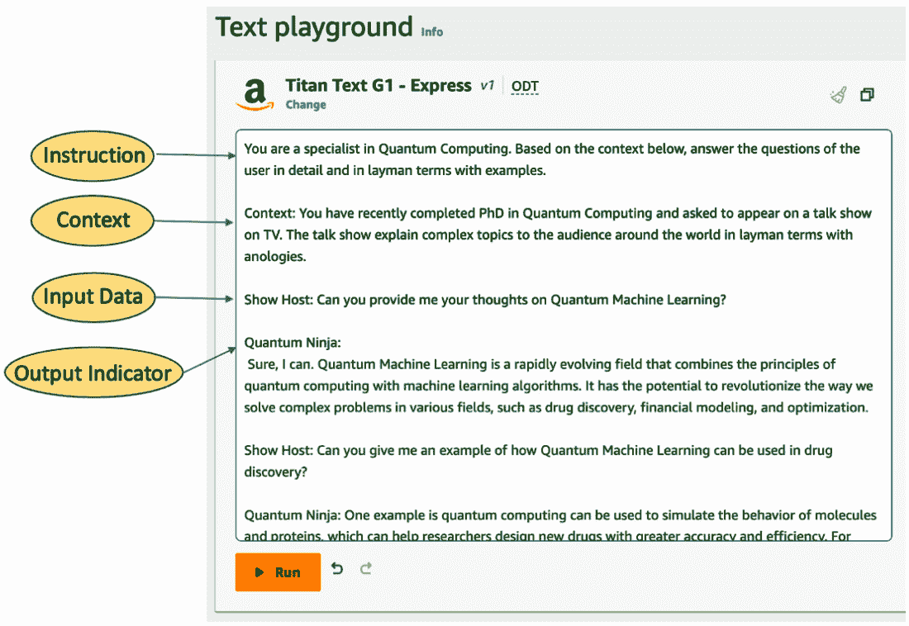

图 3.1 – 提示语的组成部分

让我们更仔细地看看前图中突出显示的术语：

+   **指令**：通过指令，你向模型提供一个清晰、简洁的描述或指令，说明它应该如何执行任务，无论是总结文本、翻译语言、创作音乐还是其他任何事情。在前面的图中，你可以看到我们要求模型扮演量子计算专家的角色，并详细、通俗易懂地回答用户的问题，并提供例子。

+   **上下文**：上下文是指你提供给模型以增强其性能的相关背景信息。这可以包括任何相关数据、过去的经验或特定领域的知识。在前面的图中，在上下文方面，我们说明了模型最近完成了博士学位，并被邀请参加一个访谈节目，该节目用通俗易懂的方式解释复杂话题。这为模型提供了相关的知识。

+   `什么是量子计算？`。如前图所示，输入到模型的问题为`你能提供你对量子机器学习的看法吗？`。

+   `Quantum Ninja`，如前图所示，以便模型理解其输出应采用此布局，或者它可以是特定格式，如文本、JSON、音频剪辑等。特殊的语法如 */endoftext/>* 表示输入的结束和模型输出的开始。这种特殊语法可能因模型而异。

虽然提示不需要包含所有四个元素，但它们的格式取决于任务。让我们考察几个示例提示：

**示例 1：** **SQL 查询**

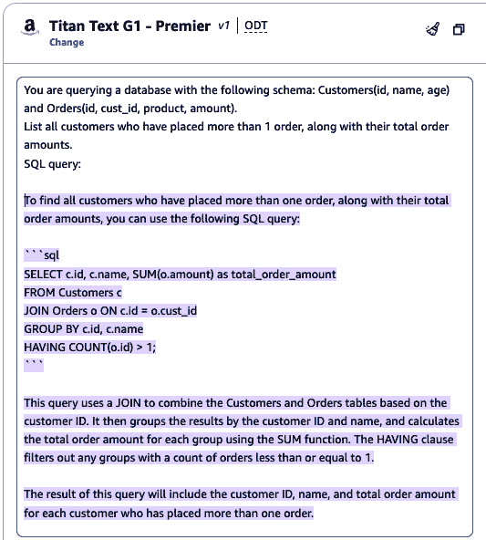

图 3.2 – SQL 查询提示

如*图 3**.2*所示，我们向 Titan Text G1 – Premier 模型指定了以下提示元素：

+   `您正在查询以下模式的数据库：Customers(id, name, age) 和 Orders(id, cust_id, product, amount)。`

+   `列出所有下过超过 1 个订单的客户及其总订单金额。`

+   `SQL 查询：`

这个提示提供了清晰的指示、相关的模式上下文、一个示例输入和输出指示符，以生成合适的 SQL 查询。

**示例 2：** **食谱生成**

这里是另一个例子（*图 3**.3*）：

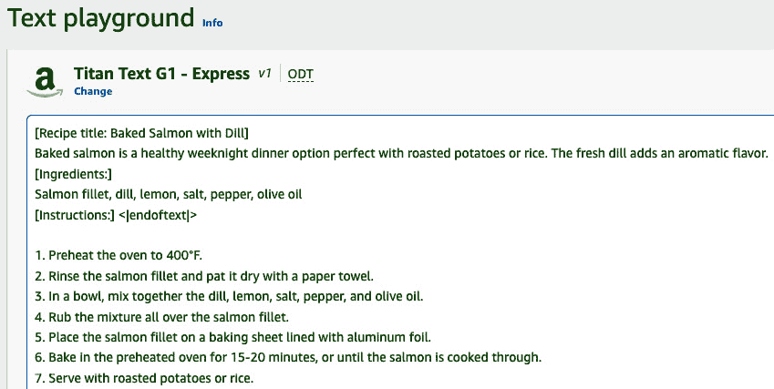

图 3.3 – 食谱提示

让我们更仔细地看看：

+   `烤三文鱼是一种健康的周日晚餐选择，与烤土豆或米饭搭配完美。新鲜的莳萝增添了香料的味道。`

+   `三文鱼鱼片、莳萝、柠檬、盐、胡椒、` `橄榄油`。

+   `<|endoftext|>`。

前面的提示为模型提供了食谱的标题、介绍性背景、作为输入数据的成分，以及`<|endoftext|>`作为输出指示符，表示食谱步骤应该开始的地方。

## 提示工程应用

现在我们已经了解了如何与模型沟通，让我们学习一些提示工程技巧，这些技巧可以帮助我们从模型中获得更好的响应。

然而，首先，我们需要理解，对于任何特定的用例，最佳的提示工程方法高度依赖于手头的任务以及它所训练的数据。

Bedrock 上的模型擅长以下任务：

+   **分类**：LLMs 在文本分类方面表现出色，这是一种监督学习技术，用于将文本分配到类别中。例如，情感分析涉及判断输入段落是否传达积极或消极情绪。一些通过 Amazon Bedrock 提供的 LLMs，如 Amazon Titan 模型，还可以识别有毒、无害或基于事实的内容。它们对上下文的深入理解有助于判断细微的语言线索。

+   **问答**：由于在预训练期间摄入了数百亿个单词，这些模型拥有庞大的参数，因此它们可以在没有外部上下文的情况下准确回答问题。当提供相关文档时，它们通过推理额外的上下文进一步提高了性能。

+   **摘要**：这些模型将长文本压缩成简洁的摘要，保留关键细节，并学习区分显著点。添加此类提示有助于快速分析文档。

+   **文本生成**：给定简短的提示，模型可以生成原创的连贯文本。它们的流畅性和语义一致性允许合成故事、诗歌、剧本等。

+   **代码生成**：对于编程需求的文本描述，模型可以在 SQL 和 Python 等语言中生成可执行代码。例如，提示可以要求生成文本到 SQL 或 Python 代码，从而实现概述的计算目标。

+   **数学推理**：模型在处理以文本形式提供的数学问题时表现出才能。这包括数值计算、逻辑推理和几何推理。它们还可以通过逐步解释来进一步证明解决方案的正确性。

在 Amazon Bedrock 上，LLMs 能够掌握的自然语言任务范围展示了它们的通用性。它们的适应性保证了应用领域的进一步扩展。

既然我们已经了解了提示工程在现实世界中的应用，让我们尝试解锁一些最常见的提示工程技巧。

# 解锁提示工程技巧

提示工程领域是一个活跃的研究和创新领域，新技术和模式频繁出现，这得益于对提高模型性能和生成更自然的人类似响应的追求。在本节中，我们将探讨一些最常见的模式。

## 零样本提示

**零样本**指的是 LLMs（大型语言模型）对未经过显式训练的提示生成合理响应的能力。它完全依赖于描述性提示来指定所需的输出，如图*图 3.4*所示：

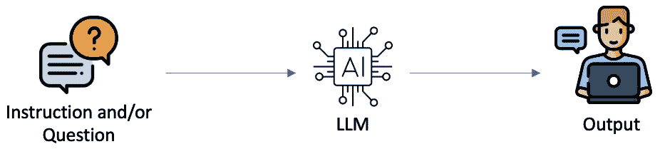

图 3.4 – 零样本提示

例如，一个用于获取诗歌的零样本提示可以是`写一首关于` `季节变化` `的押韵诗，共 4 节`。

这种方法的主要优势在于它更容易操作；在输入中无需提供示例即可进行即时创作。然而，如果没有具体的示例作为依据，输出质量可能会有所不同。

## 少样本提示

**少样本提示**或**少样本学习**建立在零样本能力的基础上。如图 3**.5** 所示，在指令/问题之上，你可以提供一些示例来建立概念或场景，此时模型可以开始生成合理的后续内容：

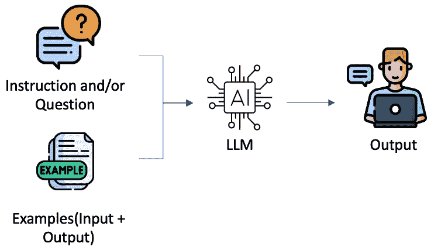

图 3.5 – 少样本提示

例如，在展示两三个关于预约医生简短对话的示例之后，LLMs 可以生成一个预约对话，而无需数千个示例。与零样本相比，关键优势在于少样本示例有助于缩小上下文范围并约束生成过程，使输出更加精确。

让我们看看一些少样本提示的示例。以下是我们可以在上一小节中用于诗歌创作任务的两个输入，我们可以将这些输入作为示例提供给模型。

`玫瑰是红的，紫罗兰是蓝的，春天带来` `新的生命。`

`夏日阳光明媚，漫长的白天充满` `光明。`

`现在请你写一首关于秋天落叶的押韵诗` `叶子变化。`

通过分析这些示例，LLMs 可以学习关于季节的四行押韵诗的规律。然后，它可以遵循模板生成一首秋天的诗。在少样本提示中平衡创造性和指导性是关键。

这里有一些少样本提示的附加示例：[`www.promptingguide.ai/techniques/fewshot`](https://www.promptingguide.ai/techniques/fewshot)。

## 思维链提示

**思维链**（**CoT**）**提示**旨在从语言模型中激发推理链。它涉及向 LLM 提供一个提示，其中包含一个推理链或思维流程，供模型遵循（*图 3**.6*）。

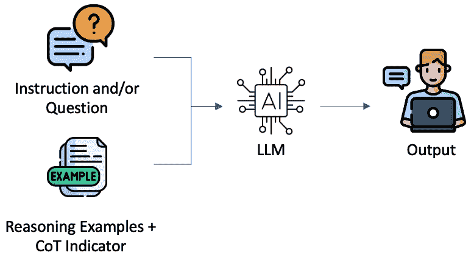

图 3.6 – 思维链提示

一个提示可能从背景信息开始，陈述一个假设或问题，提供推理步骤，并以一个需要扩展的结论结束。然后，模型试图在其生成的文本中连贯地继续推理链：

这是一个 CoT 提示的示例：

`回收利用对环境有益，因为它减少了送往垃圾填埋场的废物。垃圾填埋场产生甲烷，这是一种强效的温室气体。它们还占据了大量的空间。通过回收利用材料，回收减少了垃圾填埋场的贡献。总之，回收通过减少垃圾填埋场的甲烷和空间需求，有助于对抗气候变化。回收的主要环境效益是...`

这种提示风格引导 LLM 跟随提供的推理链，并进一步阐述结论陈述。生成的文本可能会更详细地讨论由于回收增加而减少的甲烷排放和土地利用。因此，进一步链接鼓励逐步的逻辑思考，重点关注最终目标，而不是开放式、蜿蜒曲折的文本。

让我们看看一些 CoT 提示的示例及其响应：

**示例 1**:

`写一个关于教授探索神秘文物的故事`

```py
Dr. Jones entered the temple, brushing cobwebs out of her face. In the center of the room sat a small stone box...
```

`当她打开盒子时，一束光芒出现，照亮了墙上的符号`

```py
Squinting in the sudden brightness, Dr. Jones sees the symbols represent a long-lost ancient language. She reaches towards the box and feels an energy pulling at her fingertips...
```

**示例 2**:

`可再生能源的优缺点是什么？`

```py
Some pros of renewable energies are...
```

`您遗漏了一个主要的可再生能源来源。在比较优缺点时，请包括地热能。`

```py
Some pros of renewable energies like solar, wind, geothermal and hydroelectric power are low pollution...
```

在这种方法中，人类可以通过在需要引导、细化或扩展模型响应时插入额外的提示来引导和塑造整体叙事或分析。它允许基于人类提供的初始主题或方向进行更对话式的流程。

CoT 提示的更多示例可在 [`www.promptingguide.ai/techniques/cot`](https://www.promptingguide.ai/techniques/cot) 找到。

## ReAct 提示

**推理和行动**（**ReAct**）提示是从在论文 *ReAct: Synergizing Reasoning and Acting in Language Models* 中介绍的 ReAct 框架中派生出来的 ([`arxiv.org/abs/2210.03629`](https://arxiv.org/abs/2210.03629))：

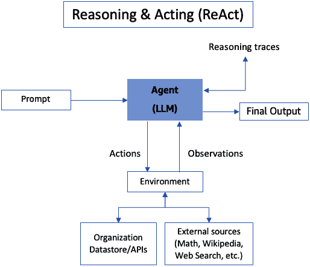

图 3.7 – ReAct 提示

此框架生成各种推理轨迹。然后，基于这些轨迹，它执行相关操作。通过推理和行动的过程，您还可以允许应用程序访问组织的内部数据存储和 API，或来自各种工具、网站、网络搜索等外部来源，如图 *图 3**.7* 所示。这个过程生成推理轨迹并执行操作是迭代的，直到 LLM 找到用户提示的答案。

我们将在 *第十章* 中更详细地讨论 ReAct 提示。现在，让我们为从模型中得出全面响应创建一个 ReAct-SQL 工具。

`为 AnyCompany 提供一份更新的财务总结报告`

**助手回复：**

*思考*: 用户正在请求 AnyCompany 的财务信息。为了回答这个问题，我需要做以下事情：

+   查询数据库以找到 AnyCompany 的财务记录

+   撰写获取的财务信息的摘要

因此，我需要使用 `sql_db_query` 工具。

*动作*: `sql_db_query`

*动作输入*: `SELECT * FROM financial_db WHERE company = '``AnyCompany';`

`[(260B, 55B,` `321B, 2.2T)]`

*答案*:

```py
AnyCompany has demonstrated strong financial performance with revenue of $260 billion. With net income of $55 billion, AnyCompany has a 21% net profit margin, indicating it is highly profitable. AnyCompany also has a considerable asset base of $321 billion, providing the company with significant financial resources. With a market capitalization of $2.2 trillion, AnyCompany is the most valuable public company, suggesting investors are confident in AnyCompany continued growth and profitability. Overall, AnyCompany's finances appear very healthy.
```

与先前的提示模式形式类似，新的提示工程技术和模式正在兴起。更多关于提示工程的信息可以在[`www.promptingguide.ai/techniques`](https://www.promptingguide.ai/techniques)的提示工程指南中找到。

在本节中，我们揭示了在构建适用于各种用例的生成式 AI 应用领域中被利用的几个提示工程技术。接下来，我们将致力于设计 Amazon Bedrock FM 的提示。

# 设计 Amazon Bedrock 模型的提示

在本节中，我们将介绍通过 Amazon Bedrock 提供的某些模型的提示指导。我们将从 Anthropic Claude 模型开始，并详细介绍该模型的提示指导。大部分关于提示指导的学习都可以从 Claude 模型中继承。此外，为了在简洁和详细之间取得平衡，我们将重点关注 Amazon Titan、AI21 Labs 和 Stability AI Stable Diffusion 的模型。这将总结我们的提示指导和与调用 Amazon Bedrock 模型相关的提示建议。

## 激活 Anthropic Claude 3

在提示 Anthropic Claude 3 模型时，以下是一些需要注意的事项：

+   `你是一位资深的儿童图书作家`或`你是一位商业专家`。

    `想象你是一位幼儿园老师，需要向孩子们解释天空中的彩虹。`：

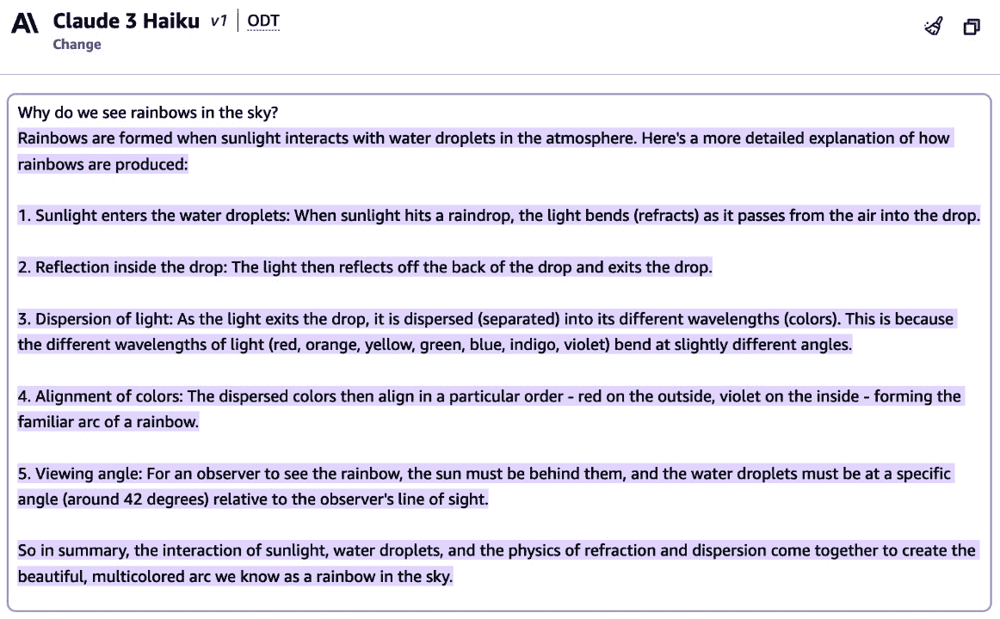

图 3.8 – Anthropic Claude 3 Haiku – 简单提示

没有分配角色/人物时，答案可能难以理解，如图 3.8 所示。

在添加角色/人物之后，你可以看到输出响应与图 3.10 中孩子的复杂程度更相符。9：

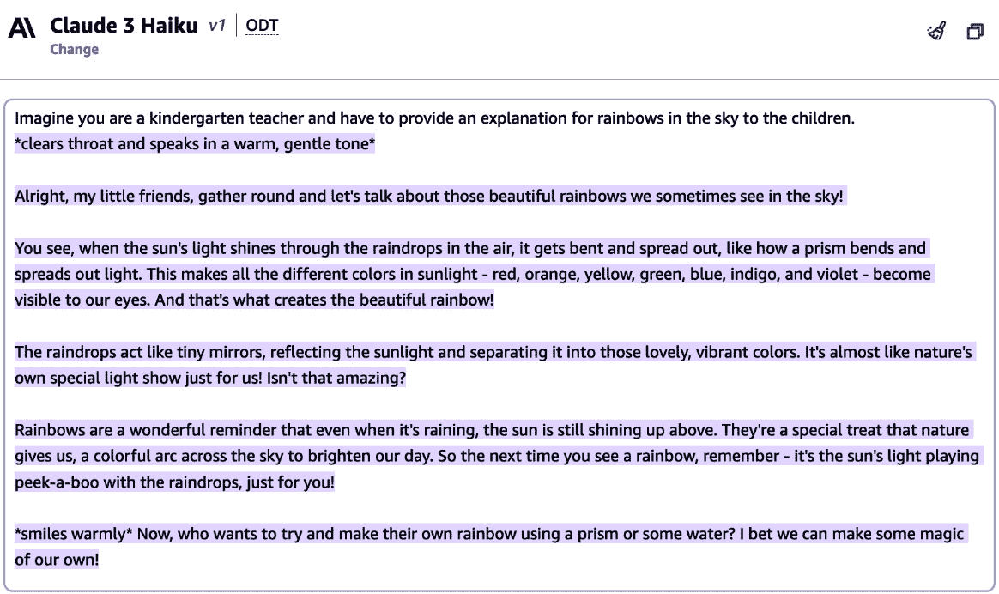

图 3.9 – Anthropic Claude 3 Haiku – 分配角色人物

+   `温度`参数可以设置得更高，生成的输出可能会有所不同，如这里所示。然而，后面的清晰指令提供了更直接的输出，没有任何额外的上下文，这正是用户所期望的：

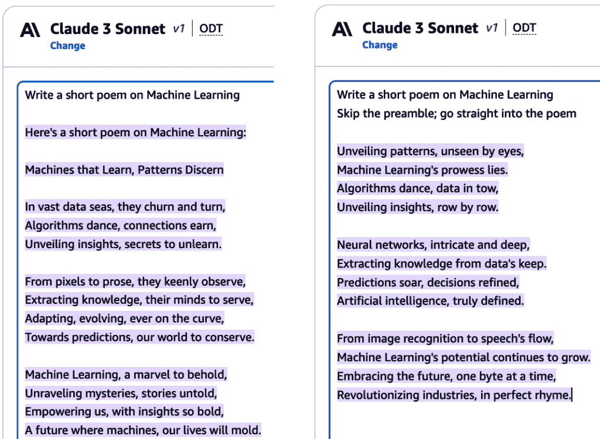

图 3.10 – 提供清晰直接的指令

+   **少样本提示示例**：提供一些常见场景的示例（如“少样本提示”部分所述），有助于提高模型的整体性能，并生成格式正确的简洁响应。

+   `<tag>内容</tag>`，可以在提示和输出响应中提供明确的结构。我们可以提供额外的背景和澄清，向 Claude 说明可以找到一些信息在标签中，以便用于生成输出。这样，Claude 就能理解如何构建输出响应，通过从标签中提取关键相关信息。

    还建议将输入数据与指令分开，以生成更结构化的提示，以便模型更容易、更高效地处理。

    这里是一个标签的示例：

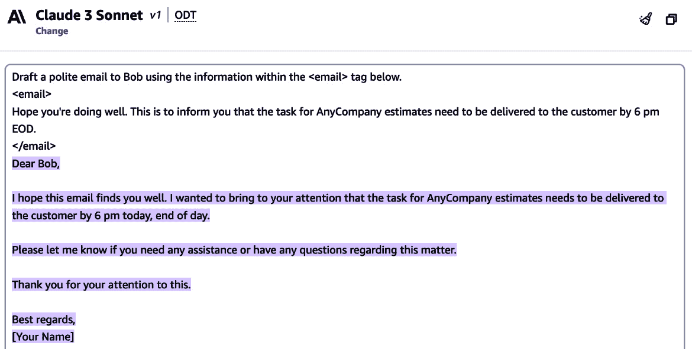

图 3.11 – XML 标签

如*图 3.11*所示，我们提供了一个`<email>`标签，这使得模型生成了更结构化的输出响应。

+   **响应限制器和定义输出格式**：Anthropic Claude 模型（尤其是 100K 和 200K 令牌长度的模型）能够提供全面和详尽的响应。用户可以通过在提示中明确声明单词限制或字符计数来限制响应长度，从而提供更简洁、更相关的输出。让我们看一个例子：

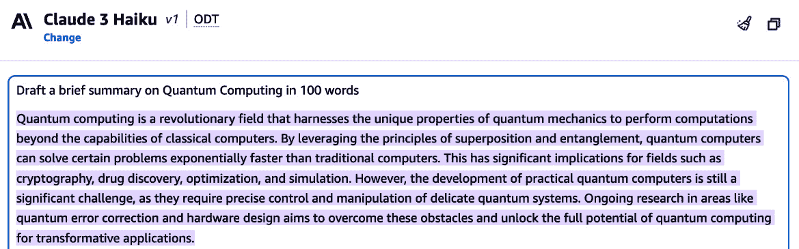

图 3.12 – 响应限制器

在*图 3.12*中，我们将响应限制器设置为 100 个单词作为提示的一部分。此外，指定所需的输出格式——无论是列表、JSON、段落、Markdown 等——可以导致更高效、更精确的输出，正如用户所期望的，这有助于从健谈的模型中消除任何无关的冗词。

+   `如果您不知道答案，请以以下格式回答——我真诚地道歉，我不知道答案`可以帮助避免健谈的 Claude 模型产生任何形式的幻觉。还可以添加主题的护栏，以便 Claude 不会对不想要的输入做出响应。这一概念也将在*第十二章*中讨论。

## 指导 Mistral 模型

与其他模型类似，当与 Mistral 模型一起工作时，精心设计提示对于获得高质量和相关的输出至关重要。在设计 Mistral 模型的提示时，以下是一些需要记住的关键点：

+   明确定义您希望通过提示让模型完成的任务或目标。您是在寻找文本分类、摘要、个性化还是其他内容？

+   在陈述核心提示之前，提供相关的背景、示例或背景信息，以使模型更好地理解提示。背景有助于模型更好地理解提示。

+   使用清晰的格式和分隔符，如`#`、`###`或`<<< >>>`来分隔提示的不同部分，例如指令、示例和主要查询。这增强了提示的结构。

+   当可能时，通过在*少量样本*学习风格中提供示例来展示期望的输出。展示示例有助于引导模型朝向预期的格式。

+   指定模型应扮演的角色，例如客户服务代表或技术作家。定义一个角色可以使回答更加定制化。

+   对于开放式生成，通过数字目标（如单词计数或句子/段落数量）提供关于所需输出长度和结构的明确指令。

+   生成输出时，请要求模型包含置信度分数或评估，以衡量其确定性水平。

+   考虑将多个 Mistral 模型按顺序串联，其中一个模型的输出作为下一个模型的输入，以增强功能。

+   通过评估测试和迭代提示设计，以找到最佳的提示策略。

*图 3.13*显示了在亚马逊 Bedrock 游乐场中调用 Mixtral 8x7B Instruct 模型。

请注意，`<s>` 和 `</s>` 标记用于表示 `[INST]` 和 `[/INST]` 字符串，告诉模型它们之间的内容构成模型应遵守的指令：

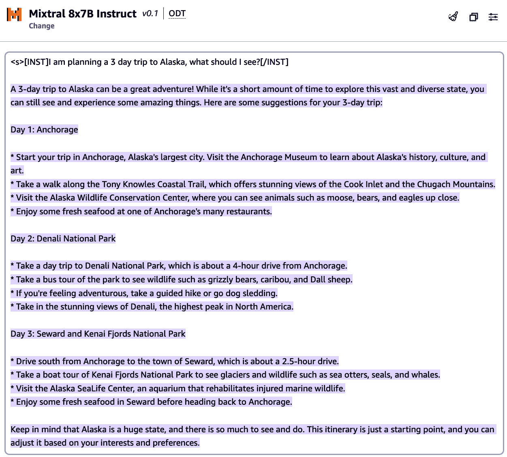

图 3.13 – 指示 Mixtral 8x7B Instruct 模型

关键在于仔细构建带有清晰上下文、示例、指令和格式的提示，以引导 Mistral 模型生成符合您需求的高质量、定制化输出。

## 亚马逊泰坦文本模型的提示指导

如我们在*第一章*中学习到的，亚马逊泰坦文本模型非常适合多种用例：

+   对话和角色扮演系统

+   文本摘要和问答

+   机器翻译

+   元数据提取和分析

+   RAG（将在*第五章*中详细说明）

+   代码生成方法

+   文本和内容生成

当使用模型生成文本输出时，通常建议提供关于所需输出长度和结构的明确指令以获得最佳结果。以下是针对泰坦文本模型的额外提示：

+   将提示集中在简洁、有针对性的问题上，以默认方式获得针对性的答案。

+   系统在处理单个句子或简短段落时表现最佳。

+   对于较长的输入，将指令放在末尾以引导高质量的响应。

+   在提示中添加明确的指令可以产生更定制的成果。

+   在提示中指定 AI 应生成的确切单词数、句子数、项目符号或段落数。提供数值范围（例如，100-200 个单词）也可以很好地工作。这给模型一个明确的目标。

+   避免使用模糊的指令，如“保持简短”或“简要总结”。这些指令容易被 AI 解释。精确的数字可以消除歧义。

+   单词计数本身可能不足以充分指导输出长度，因为句子长度可能会有所不同。指定句子/段落数量可以提供更稳健的控制。

+   如果模型似乎无法为提示生成高质量的响应，请编程使其默认显示消息，例如“不确定答案”，而不是尝试强制生成较差的响应。以下是一个此类提示的示例：“告诉我关于量子计算的信息。如果你对问题不确定，请回答‘不确定答案’或‘我不知道’。”

+   当相关时，在提问之前为 AI 提供上下文段落以供参考。这提供了知识，以便做出有根据的响应。

+   测试不同的输出长度指令，以找到适合您用例的简洁性和充分细节之间的平衡。在数字上偏向更多具体性。

如果您想查看 Titan 模型中的示例提示和响应，可以回到*第一章*中的*Amazon Titan FMs*部分。

## AI21 Labs – 指示模型

AI21 Labs 的模型在英语以外的语言中表现良好，例如西班牙语、法语、德语、葡萄牙语、意大利语和荷兰语。该模型在文本摘要、文本生成和问答任务中都很熟练。在本节中，我们将介绍一些与通过 Amazon Bedrock 提供的 AI21 模型相关的关键概念：

+   **输出长度**：为了从 AI12 模型生成期望的响应，建议指定输出长度——即段落、条目等的数量或其近似值——而不是使用单词/字符。

+   **提供简短而详细的任务描述**：制定清晰、详细的任务描述以减少歧义。AI21 模型擅长遵循精确的指令，即使是复杂的任务。

+   `不超过 x 个陈述`。始终建议直接和肯定地陈述要求。

+   `指令:`标题以澄清提示。使用换行符分隔提示部分以突出不同的部分并提高可读性。

+   **评估多种提示模式**：尝试零样本学习和少量样本学习。为您的用例选择一个理想的方法。例如，如本章中展示的零样本和少量样本示例所示，根据考虑的用例，您可能从提供零个示例并确定响应开始，同时比较在提供一定示例以引导输出后模型生成的响应。在某些情况下，如果模型可以生成期望的响应，可能不需要提供大量示例。

*图 3**.14*展示了来自 Amazon Bedrock 中 AI21 Jurassic-2 Ultra 的产品描述摘要示例：

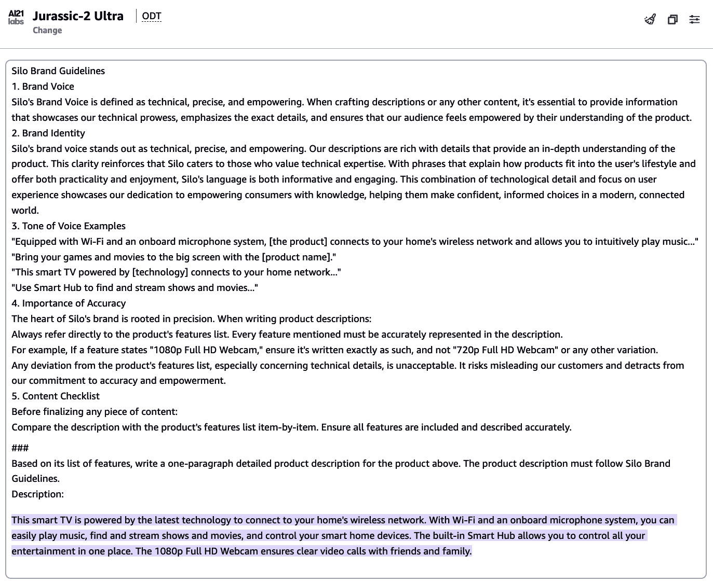

图 3.14 – 提示 AI21 Jurassic-2 Ultra 模型

更多关于使用 AI21 模型进行提示工程和设计的详细信息，以及示例，可以在[`docs.ai21.com/docs/prompt-engineering`](https://docs.ai21.com/docs/prompt-engineering)找到。

## 提示 Meta Llama 模型

与任何其他大型语言模型 (LLM) 一样，有效的提示对于充分利用 Llama 模型至关重要。由于以下内容是任何 LLM 的标准提示指南，我们将在此处介绍一些最佳实践：

+   **清晰性和具体性**：

    +   确保您的提示清晰、简洁且无歧义。

    +   提供足够的信息和细节，以引导模型生成所需输出。

    +   使用精确的语言，避免含糊或开放式陈述。

+   **结构和格式**：

    +   合理组织您的提示，并以与所需输出格式一致的方式构建它们。

    +   利用格式化元素，如项目符号、编号列表或标题，以增强可读性和理解性。

    +   考虑提供示例或模板来说明预期输出格式。

+   **任务构建**：

    +   将提示构建为模型需要遵循的具体任务或指令。

    +   明确指定所需操作，例如总结、生成或分析。

    +   提供有关预期用例或受众的背景信息。

+   **迭代优化**：

    +   提示是一个迭代过程，您可能需要根据模型的响应来优化您的提示。

    +   分析输出并确定改进或澄清的领域。

    +   结合反馈并根据需要调整提示，以引导模型获得更好的结果。

+   **微调和定制**：

    +   探索在特定领域数据或示例上微调 Llama 模型的可能性。

    +   通过在提示中包含特定指令或约束来定制模型的行为和输出。

    +   利用诸如使用少量示例或演示进行提示等技巧来提高性能。

+   **伦理和安全考虑**：

    +   注意模型可能产生的潜在偏见或有害输出。

    +   包含明确的指令或过滤器以减轻风险并确保模型的响应符合伦理和安全指南。

    +   监控和评估模型的输出，以查找任何令人担忧或不适当的内容。

Llama 模型也考虑特殊类型的标记。对于 Llama 3，以下标记被使用：

+   `<|begin_of_text|>` 标记代表 BOS 标记。

+   `<|eot_id|>` 标记表示当前回合或消息的结束。

+   `<|start_header_id|>{role}<|end_header_id|>` 标记包围特定消息的角色，可以是 **system**、**user** 或 **assistant**。

+   `<|end_of_text|>` 标记等同于 EOS 标记。生成此标记后，Llama 3 将停止生成任何进一步的标记。

有关提示格式的更多详细信息，请访问 [`llama.meta.com/docs/model-cards-and-prompt-formats`](https://llama.meta.com/docs/model-cards-and-prompt-formats)：

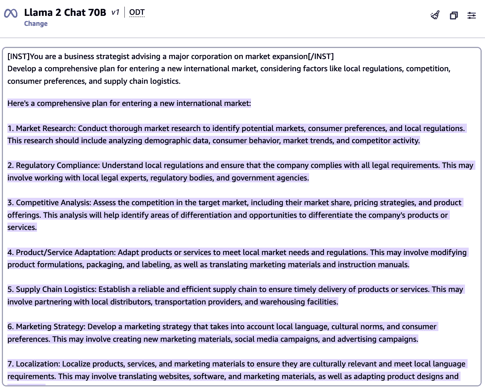

图 3.15 – 激活 Llama2 Chat 70B 模型

如 *图 3*.15 所示，Llama 2 Chat 70B 模型正在 Amazon Bedrock Playground 中被调用。

`[INST]` 和 `[/INST]` 字符串告诉模型，它们之间的内容构成了模型应遵守的指令。

如果您想了解调用各种模型的不同示例和模板，包括任何添加到亚马逊 Bedrock 的新模型，请访问[`docs.aws.amazon.com/bedrock/latest/userguide/prompt-templates-and-examples.html`](https://docs.aws.amazon.com/bedrock/latest/userguide/prompt-templates-and-examples.html)。

## Stability AI – 稳定扩散的提示指南

稳定扩散模型（包括亚马逊泰坦图像模型）在图像生成用例中越来越受欢迎。以下是在使用 Stability AI 的稳定扩散进行图像生成时制定有效提示的关键提示：

+   “一张猫的相片”或“一个机器人的插图”。更具体通常会产生更好的结果。

+   `in impressionist style` 或 `a cartoon drawing of`。风格有助于引导输出。

+   `cat:1.5, sitting:1.2, couch:1`. 较高的权重使元素更加突出。

+   `-` 通过排除不需要的元素来提高质量。例如，如果您提供“赛车在赛道上”作为提示，并给出“红色汽车”作为负面提示，它将排除图像输出中的红色汽车，如图*图 3.16*所示：

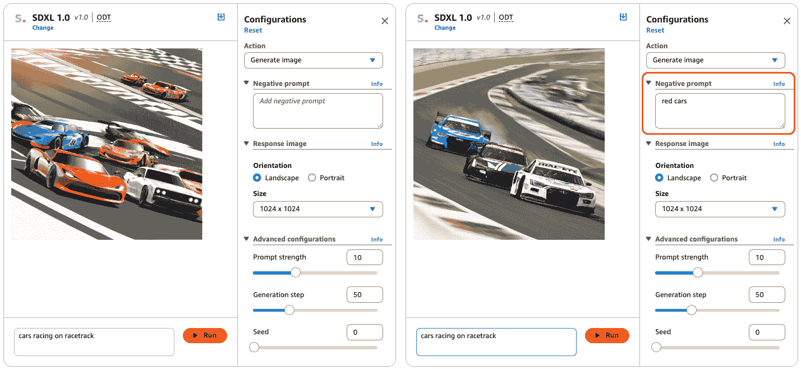

图 3.16 – 负面提示示例

+   **详细具体**：使用更多描述性和独特的词语，而不是通用术语，可以产生更定制的结果。

+   `--ar`、`--v` 和 `--n` 分别控制长宽比、生动性和细节级别。调整它们以细化输出。

+   提供额外的描述性细节始终有助于模型表现得更好。以下是一些此类方面的示例：

    +   指定介质（绘画、绘图、CGI 等）

    +   定义使用的颜色。

    +   描述光照和阴影

    +   如果模仿某种风格，请包含艺术家姓名。

    +   如果您正在复制特定图像，请提及网站。

    +   添加任何其他描述性评论或形容词。

    +   如需打印或数字使用，请指定所需的分辨率。

让我们来看一个例子。

“印度老战士首领的肖像照片，部落豹纹妆容，正面轮廓，直视镜头，严肃的眼神，50mm 肖像摄影，硬边照明摄影–beta –ar` `2:3 –beta`

**SDXL 1.0 的输出响应**：


图 3.17 – SDXL 1.0 的图像生成输出

当使用相同的输入提示时，Titan Image Generator G1 模型的输出响应如下：


图 3.18 – Titan Image Generator 的图像生成输出

提供此级别的详细信息和上下文将有助于生成更准确、符合您愿景的图像。通过迭代调整提示以细化结果。

你可能想知道为什么相同的提示在两个模型中产生了不同的输出。原因在于 SDXL 是在与 Titan Image Generator 不同的数据集上训练的，因此这些模型产生的输出会有所不同。可以这样想：SDXL 和 Titan 是两个人，他们为了考试从不同的书中学习。在考试中，当被问到相同的问题时，他们会有不同的观点，他们的答案将基于他们所读的书籍。

如果你正在你的环境中尝试这些提示，你也可能注意到另一件事。你环境中看到的输出图像可能与这里展示的不同，即使你提供了相同的提示。这是因为增加了随机性程度。这些模型将根据推理参数（如*提示强度*和*种子*）生成输出。我们将在*第九章*中详细讨论这些参数。然而，简而言之，提示强度控制着模型输出受提示影响的程度，而种子是一种随机化输出图像的方法。

现在你已经对 Amazon Bedrock 提供的 FMs 提示指导有了很好的理解，在下一节中，我们将尝试总结一些关键原则和技术，这些原则和技术在处理各种用例时的提示工程中必须遵循。

# 理解提示工程的最佳实践

总结来说，在构建提示时，你必须遵守以下关键原则：

+   `可再生能源有哪些应用场景？列出 5 个` `关键点`。

+   *语言强调*：使用简单流畅的语言和连贯的句子有助于构建更好的提示，避免使用孤立的短语。

+   *进入模型的思维模式*：构建提示以引导其朝向有益的行为。把它想象成一个人，他拥有所有正确的答案，但只对正确表述的问题有答案。

+   `用 500 字` `总结本章内容`.*   *提供示例响应*：在提示中添加一些示例响应，以期望的输出来细化响应——例如，`用一段话（1000 字符）总结本章：[新研究表明区域 X 的活动减少导致功能障碍。]`。用括号包围示例响应表示模型在以用户设定的指南和期望的格式进行响应时遵守了规定。*   *添加约束*：通过格式、附加信息包含、长度等对提示响应进行约束，可以导致更可控的输出。*   **平衡正确细节的多少**：细节太少无法充分引导模型，而过于冗长则限制了创造性发挥。将提示提炼为简洁的精华：

    +   *复杂任务处理*：

        +   在处理复杂任务时，FMs 可能会产生幻觉。建议将复杂任务分解为子任务，甚至考虑将复杂任务拆分为多个提示。

        +   通过使用关键词来要求模型逐步思考或提供逻辑推理，以构建输出，从而提供强调。在复杂任务中，为输入提供一些关键示例。

    +   *重复清洗、泡沫、再重复*：迭代地分解并尝试不同的提示，以优化模型响应以符合你的目标。在测试和实验的同时继续调整，以达到预期的结果。

    +   *持续评估*：在处理不同的用例和复杂场景时，迭代地审查模型的响应以提供所需的质量是必不可少的。

提示解锁了生成 AI 的能力，但需要深思熟虑才能正确构建。了解你的目标模型的优势和局限性，仔细迭代提示措辞，并欣赏这些系统不断演变的本质。明智地使用提示，享受 AI 蓬勃发展的创造力的果实！

在构建处理复杂目标的正确提示时，会出现复杂性。但做得好的话，提示就像万能钥匙一样解锁 AI，打开通往令人叹为观止的新生成能力的大门。提示包含了潜力；我们的角色是通过深思熟虑的提示来塑造和引导它。

# 摘要

在本章中，我们学习了几个提示工程技巧，以更深入地理解提示模式，并在考虑这些提示模式的例子时发现了见解。然后，我们深入探讨了 Amazon Bedrock 模型为 Anthropic Claude、AI21 Labs、Amazon Titan 和 Stability AI 的 Stable Diffusion 提供的提示指导。

最后，我们在查看适用于各种用例的 Amazon Bedrock 模型的同时，总结了提示指导的实用方法。通过各种示例，我们学习了如何构建最有效的提示。

到目前为止，你应该对提示工程的重要性有了很好的理解。此外，你应该能够分析在构建生成 AI 应用的情况下，涉及提示工程的多种提示技术和最佳实践。

在下一章中，我们将学习如何使用微调和持续预训练技术来定制模型。我们将深入了解微调的工作原理，查看各种 API，分析结果，并在我们的微调模型上进行推理。
