# 第六章：使用 Amazon Bedrock 生成和总结文本

在本章中，我们将探讨使用 Amazon Bedrock 生成和总结文本的架构模式。您将了解文本生成的应用以及文本生成如何与 Amazon Bedrock 合作。然后，我们将使用一些提示工程技术，包括上下文提示和 LangChain 的编排。之后，我们将探索使用短文本/文件进行文本摘要、总结长篇文章和书籍，并发现文本摘要的使用案例和模式。

到本章结束时，您将能够理解和实现使用 Amazon Bedrock 在实际用例中的文本生成和总结。

本章将涵盖以下关键主题：

+   生成文本

+   总结文本

+   创建安全的无服务器解决方案

# 技术要求

本章要求您拥有 AWS 账户访问权限。如果您还没有，可以访问 [`aws.amazon.com/getting-started/`](https://aws.amazon.com/getting-started/) 并创建一个。

其次，您需要安装和配置 AWS CLI ([`aws.amazon.com/cli/`](https://aws.amazon.com/cli/))。您将使用它从您的本地机器访问 Amazon Bedrock FMs。由于我们将要执行的多数代码单元都是基于 Python 的，此时设置 AWS Python SDK (Boto3) ([`docs.aws.amazon.com/bedrock/latest/APIReference/welcome.html`](https://docs.aws.amazon.com/bedrock/latest/APIReference/welcome.html)) 将非常有帮助。您可以通过任何方式执行 Python 设置：在您的本地机器上安装它，使用 AWS Cloud9，利用 AWS Lambda，或者利用 Amazon SageMaker。如果您使用带有 AWS Python SDK 的 Jupyter Notebook 与 Amazon Bedrock 交互，请确保在笔记本中运行以下代码单元以导入必要的库并创建 Bedrock 运行时客户端：

```py
#Ensure you have the latest version of boto3 & langchain
!pip install -U boto3 langchain-community
#import the main packages and libraries
import boto3
import json
#Create bedrock runtime client
bedrock_client = boto3.client('bedrock-runtime') #Select the desired region
```

注意

调用和定制 Amazon Bedrock 的 FMs 将产生相关费用。请参阅 [`aws.amazon.com/bedrock/pricing/`](https://aws.amazon.com/bedrock/pricing/) 了解更多信息。

# 生成文本

文本生成在各个领域都发挥着至关重要的作用，从市场营销和广告到新闻业和创意写作。这种技术的意义在于其能够简化内容创作流程，提高生产力，并开启新的创意领域。

文本生成的一个关键优势是其能够节省宝贵的时间和资源。传统的内容创作方法可能耗时且劳动密集，通常需要大量的研究、写作和编辑工作。但通过使用生成式 AI 模型，企业和个人可以快速生成初稿、大纲或完整的内容，从而为其他任务腾出宝贵的时间。

此外，文本生成赋予内容创作者探索新的叙事途径和拓展其创造力的边界。通过提供起点或框架，这些工具可以激发新想法，并促进非传统叙事技巧或独特写作风格的探索。这种能力在原创性和独特性被高度重视的行业中尤其有价值，例如小说写作、广告活动或品牌故事讲述计划。

除了创意应用外，文本生成在需要大量信息和事实性内容的领域也具有巨大的潜力。例如，新闻报道、科学出版物、技术文档和文本生成可以帮助快速传播准确和最新的信息。通过利用庞大的数据存储库和专业知识，这些工具可以生成全面的报告、摘要或文章，确保相关信息能够迅速提供给目标受众。

此外，文本生成提供了令人兴奋的个性化和定制机会。通过分析用户偏好、人口统计信息和上下文数据，这些工具可以定制内容，使其与特定目标受众产生共鸣，增强参与度并加强与读者或客户的联系。

让我们详细看看文本生成在现实世界中的应用。

## 文本生成应用

虽然文本生成的应用无限，以下是一些示例以供参考：

+   **生成产品描述**：Amazon Bedrock 的文本生成能力可以被用于为营销团队自动化创建产品描述。通过输入产品的特性、规格和关键优势，FM 可以生成引人入胜且 SEO 优化的描述，突出产品的独特卖点。这可以显著简化创建产品描述的过程，为营销团队节省时间和资源。

    生成的描述可以根据不同的目标受众、语气和风格偏好进行定制，确保在各种渠道上保持一致且引人入胜的品牌声音。此外，FM 可以定制现有的产品描述，使其能够学习和模仿期望的写作风格和格式。

+   **媒体文章和营销活动生成**：Amazon Bedrock 的文本生成能力可用于创建媒体文章、博客文章和营销活动的高质量内容。通过提供相关信息、数据和指南，FM 可以生成结构良好且连贯的文章，可用于内容营销、思想领导或新闻传播。

    FM 可以在现有内容上进行训练，使其能够理解和模仿特定出版物或品牌的语气、风格和格式偏好。它还可以为营销活动生成吸引注意力的标题、引人入胜的引言和引人注目的**行动号召**（CTAs）。

+   **个性化电子邮件和消息撰写**：Amazon Bedrock 可用于撰写个性化的电子邮件、消息和其他书面沟通，用于客户联系、营销活动，甚至内部沟通。通过利用客户数据和偏好，FM 可以生成高度定制和引人入胜的内容，提升客户体验并增加品牌忠诚度。

+   **医疗保健**：临床文档是医疗保健的一个关键方面，但它可能耗时且容易出错。Bedrock 可以通过根据患者接触期间的对话或口述生成准确和全面的临床笔记来协助医疗保健专业人员简化笔记和文档过程。Amazon 还提供另一种名为*AWS HealthScribe*的服务，该服务由 Amazon Bedrock 提供支持，专门为此目的而设计。要了解更多关于 AWS HealthScribe 的信息，请访问[`aws.amazon.com/healthscribe/`](https://aws.amazon.com/healthscribe/)。

    Bedrock 可用于生成针对个人独特健康状况、生活方式和偏好的个性化健康和福祉建议。通过分析来自各种来源的数据，例如**电子健康记录**（EHRs）、可穿戴设备和自我报告信息，Bedrock 可以提供针对饮食、锻炼、压力管理和预防保健的定制建议。

## Amazon Bedrock 文本生成系统

如果您已经阅读了前面的章节，您可能已经尝试在 Amazon Bedrock 上生成文本。但为了提醒，一个简单的文本生成系统看起来是这样的：

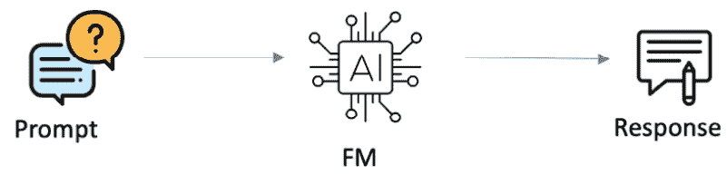

图 6.1 – 简单文本生成系统

您向模型提供提示并说类似于“为客服团队撰写一封电子邮件”的话。即使您没有提供任何上下文，模型也会为您生成一个示例电子邮件（如图*6.2*所示）：

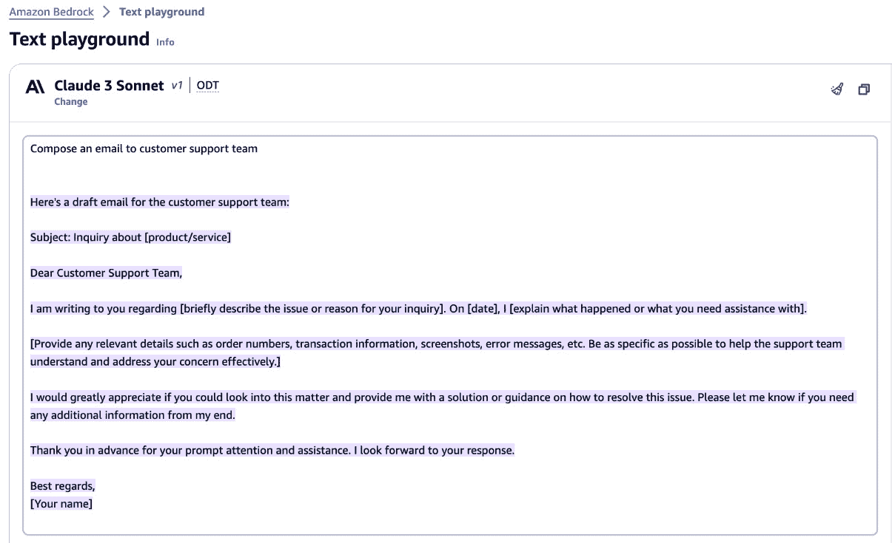

图 6.2 – 生成电子邮件

在您的 Jupyter Notebook 环境中使用 AWS Python SDK，运行以下示例脚本以调用 AI21 Jurassic 模型。请确保您首先导入必要的库并创建 Bedrock 运行时客户端，如*技术要求*部分所述：

```py
prompt_data = """Human: Compose an email to a customer support team.
Assistant:
"""
body = json.dumps({"prompt": prompt_data, "maxTokens": 200})
modelId = "ai21.j2-mid-v1"  # change this to use a different version from the model provider
accept = «application/json»
contentType = «application/json»
response = bedrock_client.invoke_model(body=body, modelId=modelId, accept=accept, contentType=contentType)
response_body = json.loads(response.get("body").read())
print(response_body.get("completions")[0].get("data").get("text"))
```

现在，根据您选择的模型，响应的结构和输出可能会有所不同。*图 6.3*显示了 AI21 Jurassic 模型的响应：

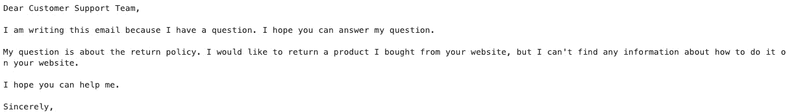

图 6.3 – AI21 Jurassic 输出

在这里，我们提供了一个简单的提示，没有提供任何上下文或信息。现在，让我们继续探讨文本生成的先进架构模式，并了解上下文提示。

## 使用提示工程生成文本

在上一节中，我们查看了一种文本生成模式，我们没有向模型提供任何上下文或信息。让我们使用我们在 *第三章* 中了解到的某些提示工程技巧：

+   **零样本上下文提示**：在这里，我们将以零样本的方式在提示中提供详细上下文：

    ```py
    prompt = """
    
    Human: Write a descriptive and engaging travel guide section about a lesser-known but beautiful destination, capturing the local culture, cuisine, and must-see attractions in a way that inspires wanderlust.
    
    Assistant:"""
    
    body = json.dumps({"prompt": prompt,"max_tokens_to_sample": 500})
    
    modelId = "anthropic.claude-v2"  # change this to use a different version from the model provider
    
    accept = «application/json»
    
    contentType = «application/json»
    
    response = bedrock_runtime.invoke_model(body=body, modelId=modelId, accept=accept, contentType=contentType)
    
    response_body = json.loads(response.get("body").read())
    
    print(response_body.get("completion"))
    ```

    运行前面的代码将生成类似于 *图 6.4* 中所示的一个响应：


图 6.4 – 零样本上下文提示响应

在前面的场景中，我们使用了 Amazon Bedrock API – `invoke_model` – 并传递了提示、配置参数和模型 ID。如果您想了解更多关于可用的各种 Bedrock API，请鼓励您重新阅读 *第二章*。

+   **少样本上下文提示**：在这里，我们将在提示中提供一些示例，以便模型可以开始生成合理的延续：

    ```py
    prompt = """
    
    Human: Here are some examples of product descriptions:
    
    Example 1:
    
    Product: Apple iPhone 13 Pro
    
    Description: The iPhone 13 Pro is a smartphone designed and manufactured by Apple Inc. It features a 6.1-inch Super Retina XDR display, a powerful A15 Bionic chip, and an advanced triple-camera system with improved low-light performance and 3x optical zoom. The phone also boasts 5G connectivity, longer battery life, and a durable Ceramic Shield front cover.
    
    Example 2:
    
    Product: Sony WH-1000XM4 Noise Cancelling Headphones
    
    Description: Experience exceptional audio quality with the Sony WH-1000XM4 Noise Cancelling Headphones. These over-ear headphones feature industry-leading noise cancellation technology, allowing you to immerse yourself in your music without distractions. The responsive touch controls and long-lasting battery life make them ideal for everyday use, while the comfortable design ensures hours of listening pleasure.
    
    Example 3:
    
    Product: Instant Pot Duo Crisp + Air Fryer
    
    Description: The Instant Pot Duo Crisp + Air Fryer is a versatile kitchen appliance that combines the functions of an electric pressure cooker, air fryer, and more. With its EvenCrisp technology, you can achieve crispy, golden results using little to no oil. The easy-to-use control panel and 11 built-in smart programs allow you to cook a wide variety of dishes with ease, making it a must-have for any modern kitchen.
    
    Your task: Generate a product description for the following product:
    
    Product: Sony A7 III Mirrorless Camera
    
    Assistant:"""
    
    body = json.dumps({"prompt": prompt, "max_tokens_to_sample": 500})
    
    modelId = "anthropic.claude-v2"
    
    accept = "application/json"
    
    contentType = "application/json"
    
    response = bedrock_runtime.invoke_model(body=body, modelId=modelId, accept=accept, contentType=contentType)
    
    response_body = json.loads(response.get("body").read())
    
    print(response_body.get("completion"))
    ```

在这里，我们在提示中提供了三个示例，以告诉模型我们的响应应该是什么样子。然后，我们调用了模型来为 `Sony A7 III 无反相机` 生成产品描述。我们收到了 *图 6.5* 中所示的响应：

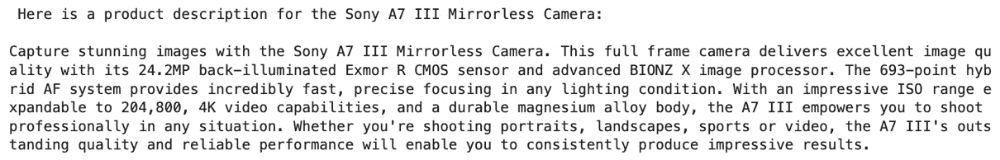

图 6.5 – 少样本上下文提示响应

+   在此情况下，使用 `invoke_model` API):

注意

在撰写本文时，我们使用了 `langchain_community.llms` 库来导入 *Bedrock*。然而，根据 LangChain 社区的更新，它可能容易发生变化。有关导入 LangChain 包的最新信息，请访问 [`python.langchain.com/v0.2/docs/integrations/platforms/`](https://python.langchain.com/v0.2/docs/integrations/platforms/)。

```py
from langchain_community.llms import Bedrock
inference_modifier = {"max_tokens_to_sample": 4096, "temperature": 0.5, "top_k": 250, "top_p": 1, "stop_sequences": ["\n\nHuman"],}
llm = Bedrock(model_id="anthropic.claude-v2",  client=bedrock_client, model_kwargs=inference_modifier,)
response = llm("""
Human: Write a descriptive and engaging travel guide section about a lesser-known but beautiful destination, capturing the local culture, cuisine, and must-see attractions in a way that inspires wanderlust.
Assistant:""")
print(response)
Figure 6*.6*):
```


图 6.6 – 使用 LangChain 的零样本提示

+   **使用 LangChain 的上下文生成**：在这里，我们在将提示发送到模型之前，将在我们的提示中提供指令和上下文：

    ```py
    from langchain_community.llms import Bedrock
    
    inference_modifier = {'max_tokens_to_sample':4096, "temperature":0.5, "top_k":250, "top_p":1, "stop_sequences": ["\n\nHuman"]}
    
    llm = Bedrock(model_id = "anthropic.claude-v2", client = boto3_bedrock, model_kwargs = inference_modifier)
    
    from langchain.prompts import PromptTemplate
    
    product_description_prompt = PromptTemplate(   input_variables=["product_name", "product_category", "key_features"],
    
        template="""
    
    You are a professional copywriter tasked with creating an engaging and informative product description for a new Amazon product.
    
    Product Name: {product_name}
    
    Product Category: {product_category}
    
    Key Features: {key_features}
    
    Write a compelling product description that highlights the key features and benefits of the product, while keeping the tone engaging and persuasive for potential customers.
    
    Product Description:
    
    «»»
    
    )
    
    prompt = product_description_prompt.format(
    
        product_name="Smart Home Security Camera",
    
        product_category="Home Security",
    
        key_features="- 1080p HD video recording\n- Motion detection alerts\n- Two-way audio communication\n- Night vision capabilities\n- Cloud storage for recorded footage")
    
    response = llm(prompt)
    
    product = response[response.index('\n')+1:]
    
    print(product)
    ```

    在这个场景中，我们使用了 Bedrock 的 LangChain 实现。我们定义了一个用于创建产品描述的提示模板，并调用了 Anthropic Claude 模型来生成智能家用安全摄像头的描述。提示模板本质上是一个可重复使用的模板，用于构建提示。在提示模板中，您可以提供上下文、输入变量、任务以及一些少样本示例供模型参考。要了解更多关于提示模板的信息，请访问 [`python.langchain.com/v0.2/docs/concepts/#prompt-templates`](https://python.langchain.com/v0.2/docs/concepts/#prompt-templates)。

    下图显示了提供前面代码片段的响应：


图 6.7 – 使用 LangChain 的上下文生成

现在我们已经探讨了各种文本生成模式，让我们看看如何使用 Amazon Bedrock 进行摘要。

# 摘要文本

文本摘要是一项高度需求的能力，在各个领域都具有巨大的价值。它涉及将长文本文档浓缩成简洁且连贯的摘要的复杂任务，这些摘要旨在保留最显著的信息，同时省略冗余或不相关的细节，从而实现高效的数据消费和理解。

文本摘要广泛应用于各个领域，从研究、学术界到新闻、商业智能和法律文件。随着每天产生的文本数据的指数级增长，对有效摘要技术的需求变得越来越迫切。想象一下，在大量的报告、新闻文章或法律文件中筛选——文本摘要成为提炼核心信息的有力工具，为专业人士和研究人员节省时间和认知努力。

让我们看看文本摘要的一些实际应用：

+   **内容整理**：在当今信息丰富的世界中，文本摘要技术在整理和浓缩大量数据方面发挥着关键作用。这使得用户能够快速抓住长篇文章、报告或在线内容的精髓，而无需阅读每个单词。

+   **新闻聚合**：新闻聚合器和媒体平台可以利用文本摘要技术提供突发新闻故事的简洁摘要，使用户能够了解最新的发展，而不会因详尽细节而感到困扰。

+   **研究辅助**：研究人员和学者可以从文本摘要技术中受益，以快速从大量文献中识别最相关的信息，从而节省他们宝贵的时间和精力。

+   **客户服务**：文本摘要可以通过自动生成长客户咨询或反馈的简洁摘要来增强客户服务，使支持代理能够快速理解问题的核心并提供及时响应。

+   **法律和金融领域**：在准确呈现原始文本至关重要的行业，如法律或金融部门，文本摘要技术可以用于生成合同、协议或报告的摘要，确保关键信息不会被忽视。

+   **电子邮件管理**：电子邮件客户端或生产力工具可以利用文本摘要技术提供长电子邮件线程或对话的简洁概述，帮助用户快速抓住要点，而无需阅读每条消息。

+   **会议回顾**：文本摘要可以应用于会议记录或笔记，生成简洁的摘要，捕捉最重要的讨论、决策和行动项目，使参与者能够快速回顾并跟进关键点。

+   **社交媒体监控**：企业和组织可以利用文本摘要来分析和总结大量的社交媒体数据，如客户反馈、产品评论或品牌提及，使他们能够了解公众情绪并迅速做出回应。

+   **知识提取**：文本摘要技术可以用于从大型数据集或知识库中提取和总结相关知识，使其更容易访问和利用有价值的信息，用于各种应用，如决策或知识管理系统。

+   **教育资源**：文本摘要技术可以应用于教育材料，如教科书或在线课程，以生成简洁的摘要或学习辅助工具，帮助学生更有效地掌握关键概念并准备考试。

虽然应用范围无限，涵盖了各行各业，但让我们看看摘要系统如何与 Amazon Bedrock 协同工作。我们将了解两种方法：

+   小文件的摘要

+   大文件的摘要

我们所说的“小文件”，是指可以适应模型上下文长度的文本片段。这可以是从几句话到几段文字不等。另一方面，“大文件”则是指那些信息量巨大，无法适应模型上下文长度的文档或书籍。需要注意的是，没有一种适用于所有模型的万能解决方案。每个模型及其不同版本可能具有不同的上下文长度。例如，Cohere Command R+的上下文长度为 128K 个标记，而 Cohere Command Light 的上下文长度为 4,000 个标记。

## 小文件的摘要

小文件可以包括会议记录、博客文章、新闻文章、电子邮件和通话记录。这些文件随后被用作提示的上下文并发送给模型。这里的提示可能非常简单，例如“摘要内容”。然后，模型将处理文件并提供摘要响应。*图 6.8*展示了小文件摘要的过程：

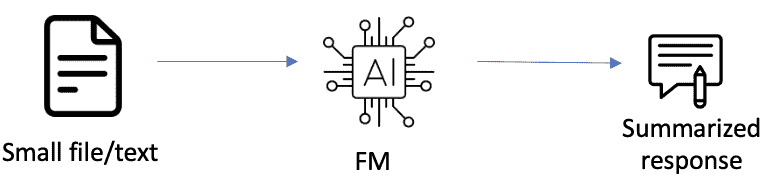

图 6.8 – 小文件摘要

让我们以 Yahoo! Finance 的新闻文章为例。由于新闻文章可以适应模型的上下文长度，我们将将其作为提示中的上下文，即“摘要以下新闻文章”，并将其发送给模型。然后，模型将处理请求并提供摘要响应，如图*6.9*所示。

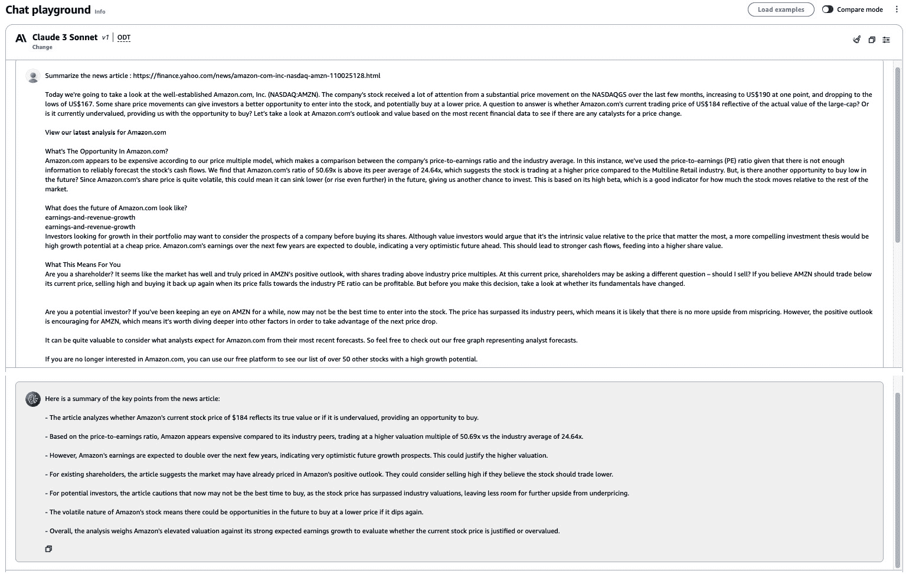

图 6.9 – 新闻文章的摘要

在 Bedrock 中总结小文件有几种方法。如果你使用 AWS Python SDK，可以直接将小文件文本传递到提示中，如下面的代码所示。然而，如果你想总结几段文字，你可以利用 *提示模板* 将文本动态地放置在提示中，并使用 LangChain 调用模型：

```py
prompt = """
Today we're going to take a look at the well-established Amazon.com, Inc. (NASDAQ:AMZN). The company's stock led the NASDAQGS gainers with a relatively large price hike in the past couple of weeks. The recent jump in the share price has meant that the company is trading at close to its 52-week high. With many analysts covering the large-cap stock, we may expect any price-sensitive announcements have already been factored into the stock's share price. But what if there is still an opportunity to buy? Let's take a look at Amazon.com's outlook and value based on the most recent financial data to see if the opportunity still exists.
Check out our latest analysis for Amazon.com
What's The Opportunity In Amazon.com?
Great news for investors – Amazon.com is still trading at a fairly cheap price. According to our valuation, the intrinsic value for the stock is $238.66, but it is currently trading at US$174 on the share market, meaning that there is still an opportunity to buy now. What's more interesting is that, Amazon.com's share price is quite volatile, which gives us more chances to buy since the share price could sink lower (or rise higher) in the future. This is based on its high beta, which is a good indicator for how much the stock moves relative to the rest of the market.
Can we expect growth from Amazon.com?
earnings-and-revenue-growth
earnings-and-revenue-growth
Future outlook is an important aspect when you're looking at buying a stock, especially if you are an investor looking for growth in your portfolio. Buying a great company with a robust outlook at a cheap price is always a good investment, so let's also take a look at the company's future expectations. With profit expected to more than double over the next couple of years, the future seems bright for Amazon.com. It looks like higher cash flow is on the cards for the stock, which should feed into a higher share valuation.
What This Means For You
Are you a shareholder? Since AMZN is currently undervalued, it may be a great time to accumulate more of your holdings in the stock. With a positive outlook on the horizon, it seems like this growth has not yet been fully factored into the share price. However, there are also other factors such as financial health to consider, which could explain the current undervaluation.
Are you a potential investor? If you've been keeping an eye on AMZN for a while, now might be the time to enter the stock. Its buoyant future outlook isn't fully reflected in the current share price yet, which means it's not too late to buy AMZN. But before you make any investment decisions, consider other factors such as the strength of its balance sheet, in order to make a well-informed investment decision.
Diving deeper into the forecasts for Amazon.com mentioned earlier will help you understand how analysts view the stock going forward. Luckily, you can check out what analysts are forecasting by clicking here.
If you are no longer interested in Amazon.com, you can use our free platform to see our list of over 50 other stocks with a high growth potential.
"""
body = json.dumps({"inputText": prompt,
                   "textGenerationConfig":{
                       "maxTokenCount":4096,
                       "stopSequences":[],
                       "temperature":0,
                       "topP":1
                   },
                  })
modelId = 'amazon.titan-tg1-large' # change this to use a different version from the model provider
accept = 'application/json'
contentType = 'application/json'
response = bedrock_client.invoke_model(body=body, modelId=modelId, accept=accept, contentType=contentType)
response_body = json.loads(response.get('body').read())
print(response_body.get('results')[0].get('outputText'))
```

响应在 *图 6.10* 中显示：

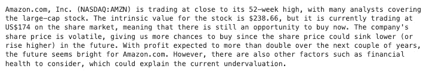

图 6.10 – 小文件总结响应

我们已经将一篇新闻文章（[`finance.yahoo.com/news/us-174-time-put-amazon-110026932.html`](https://finance.yahoo.com/news/us-174-time-put-amazon-110026932.html)）从 Yahoo! Finance 解析出来，作为提示的样本上下文，并调用了 Titan 文本模型来生成总结的响应，如图中所示。

现在，让我们看看总结大文件的技术。

## 大文件的总结

大文件可以包括大量文档或书籍的信息，这些信息不适合模型的上下文长度。当我们说大文档时，这包括 10-K 报告、**联邦公开市场委员会**（**FOMC**）报告、公共卫生报告、临床试验报告、电子杂志、服务文档等等。亚马逊的 10-K 报告就是一个大文件的例子：[`www.sec.gov/Archives/edgar/data/1018724/000101872424000008/amzn-20231231.htm`](https://www.sec.gov/Archives/edgar/data/1018724/000101872424000008/amzn-20231231.htm)。

当处理用于总结文本的大文件时，会涉及几个挑战：

+   **上下文长度限制**：所有 FM，例如在 Amazon Bedrock 中使用的 FM，都有一个它们可以一次性处理的最大上下文长度或输入大小。这个限制因模型而异，但通常在几千个标记（单词或词片段）的范围内。例如，你可以找到具有 200k 标记的 Anthropic Claude 3 系列的 FM。当处理超过这个上下文长度的文档时，就变得不可能准确和连贯地总结整个文档。模型可能会错过重要信息，或者无法捕捉到原始文本中存在的整体上下文和细微差别。

+   **幻觉**：幻觉是一种现象，其中模型生成的输出不是基于输入数据，或者包含事实上的不一致。当处理大文档时，这个问题可能会更加普遍，因为模型可能难以保持连贯性和对原始文本的忠实度。随着输入大小的增加，模型可能会开始生成听起来合理但实际上错误的信息，这可能导致总结不准确。

+   **内存和计算限制**：总结大文档可能非常耗费计算资源，并且可能需要大量的内存资源。生成式 AI 模型需要处理和存储整个输入文本，以及中间表示和生成的输出。当处理非常大的文档时，如果没有使用专门的计算能力来处理，可能会因为高计算需求而出现性能下降（参见*第十二章*中的*配置吞吐量架构*部分）。

+   **上下文理解**：大文档通常包含复杂的结构，如章节、子章节和交叉引用。生成式 AI 模型可能难以准确捕捉和理解文档不同部分之间的关系和依赖。这可能导致摘要缺乏连贯性或无法准确代表原始内容的整体结构和流程。

+   **主题漂移和连贯性**：随着输入文本长度的增加，模型在摘要过程中保持关注和连贯性变得更加困难。模型可能会偏离主要主题，或者无法正确连接和过渡到文档的不同方面，导致摘要缺乏连贯性或清晰度。

为了应对这些挑战，让我们看看如何使用 LangChain 来总结大文件。

### 使用 LangChain 的摘要链进行文本摘要

使用 LangChain，我们将大文件分解成更小、更易于管理的块，并按顺序处理它们。*图 6.11*展示了使用 LangChain 进行大文本摘要的架构：

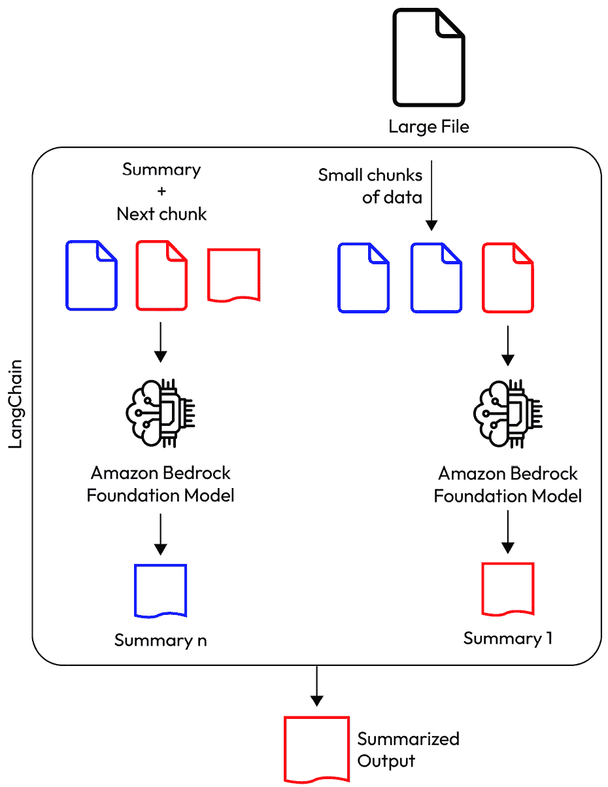

图 6.11 – LangChain 中的大文件摘要

这里是这个过程的工作原理：

1.  **数据摄取**：这个过程的第一步是将一个大文档或文件加载到系统中。这涉及到从 Amazon S3 存储桶中加载文件或直接从互联网下载。您可以提供的文件可以是文本、PDF、Word 文档等多种形式。

1.  根据 LangChain 文档的建议，`RecursiveCharacterTextSplitter` 适用于通用文本：[`python.langchain.com/v0.2/docs/how_to/recursive_text_splitter/`](https://python.langchain.com/v0.2/docs/how_to/recursive_text_splitter/).

    它递归地将文本分割成更小的块，直到每个块的大小低于指定的阈值。分割过程利用分隔符（`"\n\n"`，`"\n"`），确保单个段落保持完整，而不是被分割到多个块中。

1.  `stuff`：正如其名所示，这个链将所有块填充到一个单独的提示中。

1.  `map_reduce`：map-reduce 链是一个强大的模式，允许您将一个大任务分解成更小的子任务，独立处理它们，然后将结果合并。在文本摘要的上下文中，这种链类型用于将长文本文档分解成更小的块，独立使用 LLM 对每个块进行摘要，然后将摘要合并成最终的摘要输出。

1.  `refine`：这个链首先对第一个块进行摘要。然后，`refine`将这个摘要与第二个块结合，生成一个新的摘要，包含这两部分信息。这个过程继续进行，最新的摘要与下一个块结合，生成一个新的摘要。这种迭代方法一直重复，直到所有块都被纳入最终的摘要中。

要加载这些摘要链中的任何一个，您可以调用`load_summarize_chain`并提供链类型：

```py
from langchain.chains.summarize import load_summarize_chain
```

```py
summary_chain = load_summarize_chain(llm=llm, chain_type="map_reduce", verbose=False)
```

1.  **最终摘要**：基于您选择的摘要链，一旦所有块都已处理，最终的摘要代表了整个原始文档的浓缩版本。

在[`github.com/aws-samples/amazon-bedrock-workshop/blob/main/06_OpenSource_examples/00_Langchain_TextGeneration_examples/05_long-text-summarization-titan%20Langchain.ipynb`](https://github.com/aws-samples/amazon-bedrock-workshop/blob/main/06_OpenSource_examples/00_Langchain_TextGeneration_examples/05_long-text-summarization-titan%20Langchain.ipynb)的笔记本中展示了使用 LangChain 进行长文本摘要的使用示例。在这个例子中，它使用`map_reduce`作为链类型。我们建议您尝试不同的链类型，并提供任何博客文章、文件或新闻文章作为提示。

现在我们已经使用 LangChain 链类型对大文件进行了摘要，假设我们想要摘要一本书或多本书的信息。在这种情况下，当需要总结大量手稿或书籍时，RAG 方法可能具有潜在的好处。但是请注意，摘要的响应可能不包含书籍的一些基本元素——换句话说，可能会有信息丢失。可以使用各种高级 RAG 技术，如查询细化，来检索摘要响应和文本中的基本元素。要了解更多关于 RAG 查询细化的信息，请参阅论文*RQ-RAG: Learning to Refine Queries for Retrieval Augmented* *Generation* ([`arxiv.org/html/2404.00610v1`](https://arxiv.org/html/2404.00610v1))。

要了解更多关于 RAG 如何工作以及一些高级 RAG 技术，请参阅*第五章*。

接下来，我们将通过 Amazon Bedrock 知识库查看文本摘要。

### Amazon Bedrock 知识库

在*第五章*中，我们探讨了 Amazon Bedrock 知识库的工作原理以及如何设置它。让我们看看使用知识库进行摘要的示例。

我们已经将 *Attention is All You Need* 研究论文放入我们的数据存储 Amazon S3 存储桶，并将其与我们的 Bedrock 知识库同步，如图 *图 6*.12* 所示：

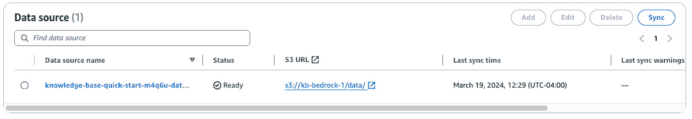

图 6.12 – 知识库数据源

选择模型并提供一个提示来总结内容。您将看到 LLM 的响应，如图 *图 6*.13* 所示：

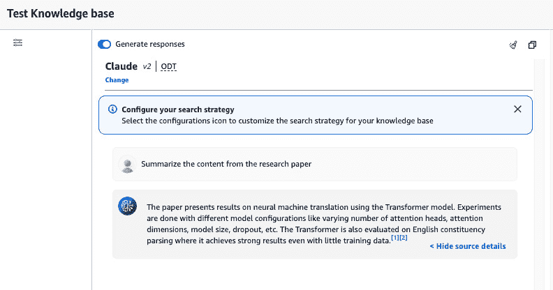

图 6.13 – 测试知识库

如果您想通过 API 尝试，您可以调用 **Retrieve** API 或 **RetrieveAndGenerate** API。Retrieve API 访问并从知识库检索相关数据，而 RetrieveAndGenerate API 除了检索数据外，还根据检索到的结果生成响应。有关 Amazon Bedrock 知识库的更多详细信息，请参阅 *第五章*。

在本节中，我们讨论了如何利用 Amazon Bedrock 中的文本摘要系统。总结小文件很简单，涉及利用模型的上下文长度。然而，总结大文件需要分块和专门的技巧，如 LangChain 的摘要链、RAG 或 Amazon Bedrock 知识库来处理上下文长度限制、幻觉、计算约束和连贯性问题。

既然我们已经了解了如何使用 Amazon Bedrock 生成和总结文本，那么让我们看看组织如何使用这些技术并创建一个涉及其他 AWS 服务的安全无服务器解决方案。

# 创建一个安全无服务器解决方案

当与 Amazon Bedrock 的生成式 AI 模型一起工作时，组织可以开发一个既安全又无服务器的应用程序。他们不必直接使用 SDK 与 Amazon Bedrock 交互，而是可以拥有一个交互式聊天机器人，该机器人抽象出任何复杂性，提供丰富的客户体验，并提高整体生产力。

*图 6*.14* 展示了用户如何通过 AWS Amplify 开发的基于 Web 的聊天机器人进行交互，进行对话，生成各种形式的文本，并执行语言翻译、文本摘要等操作：

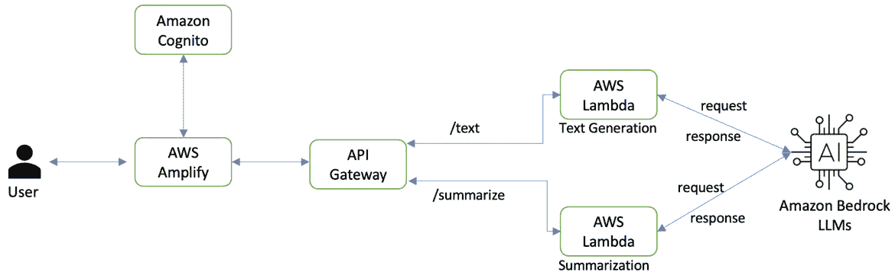

图 6.14 – 基于 Amazon Bedrock 的无服务器企业应用程序

让我们更仔细地看看这个过程：

1.  **用户与 AWS Amplify 中的聊天机器人交互**：AWS Amplify 是一套全面的工具和服务，用于简化全栈云驱动型 Web 和移动应用程序的开发和部署。用户通过与使用 AWS Amplify 开发的 Web 应用程序中集成的聊天机器人交互来启动工作流程。

1.  **使用 Amazon Cognito 进行用户身份验证和授权**：Amazon Cognito 是 AWS 提供的一项强大的用户身份管理服务。当用户与聊天机器人交互时，AWS 会与 Amazon Cognito 通信以执行用户身份验证和授权。Amazon Cognito 支持各种身份验证方法，包括传统的用户名/密码组合、社交身份提供者（例如，Google 或 Facebook）和多因素身份验证。它还提供用户注册、账户恢复和用户数据安全存储的功能。

1.  **API 网关作为集中入口点**：一旦用户经过身份验证和授权，他们的请求将通过 API 网关路由，该网关充当 API 的集中入口点。API 网关是一项完全托管的服务，简化了创建、发布、维护、监控和保障 API 的过程。

1.  将请求发送到执行对 Amazon Bedrock LLMs 调用操作的 AWS Lambda 函数（例如，`/text`）：

    1.  此 Lambda 函数将用户的输入或提示传递给 Amazon Bedrock LLMs 以生成相关且连贯的文本。例如，用户可以要求生成一封电子邮件或为特定目的地准备旅行行程。

    1.  一旦 Amazon Bedrock LLMs 生成了所需文本，Lambda 函数接收响应并通过 API 网关将其发送回用户。在这里，API 网关充当中介，促进客户端（即聊天机器人）与后端服务（Lambda 函数和 Amazon Bedrock LLMs）之间的通信。

1.  将请求发送到专门设计用于执行对 Amazon Bedrock LLMs 总结任务调用操作的另一个 AWS Lambda 函数（例如，`/summarize`）：

    1.  此 Lambda 函数执行对 Amazon Bedrock LLMs 的调用，根据用户的输入或提示和提供的上下文（小或大文件）总结文本。

    1.  在 Amazon Bedrock LLM 生成总结文本后，Lambda 函数接收响应并通过 API 网关将其发送回用户。

通过将文本生成和总结任务分别分配给不同的 Lambda 函数和 API 网关路由，应用程序可以高效地处理不同类型的请求，并利用 Amazon Bedrock LLMs 在每个任务中的专业能力。

此工作流程突出了 AWS 服务的灵活性和模块化特性，允许集成多个组件以构建复杂的应用程序。AWS Lambda 函数作为计算引擎，向 Amazon Bedrock LLMs 发起调用以执行文本生成和总结。

通过将应用程序分解为更小、更独立的组件，开发者可以轻松维护、更新和扩展系统的各个部分，而不会影响整个应用程序。

如果你好奇想要尝试使用 Amazon Bedrock 的无服务器聊天机器人，请查看[`github.com/aws-samples/amazon-serverless-chatbot-using-bedrock`](https://github.com/aws-samples/amazon-serverless-chatbot-using-bedrock)。

到目前为止，你应该能够理解和实现使用 Amazon Bedrock 在实际用例中进行文本生成和总结。

# 摘要

在本章中，我们探讨了使用 Amazon Bedrock 生成和总结文本的架构模式。本章的第一部分涵盖了文本生成。我们通过提示工程技术、内联上下文训练和与 LangChain 的编排来探讨文本生成的根本原理。然后，我们探讨了可以应用于实际场景的各种文本生成用例和模式。

本章的第二部分涵盖了文本摘要。我们讨论了提取式和抽象式摘要方法及其相应的应用。此外，我们还考察了可以使用 Amazon Bedrock 进行文本摘要的系统和技术。

在下一章中，我们将探讨构建问答和对话界面的方法。
