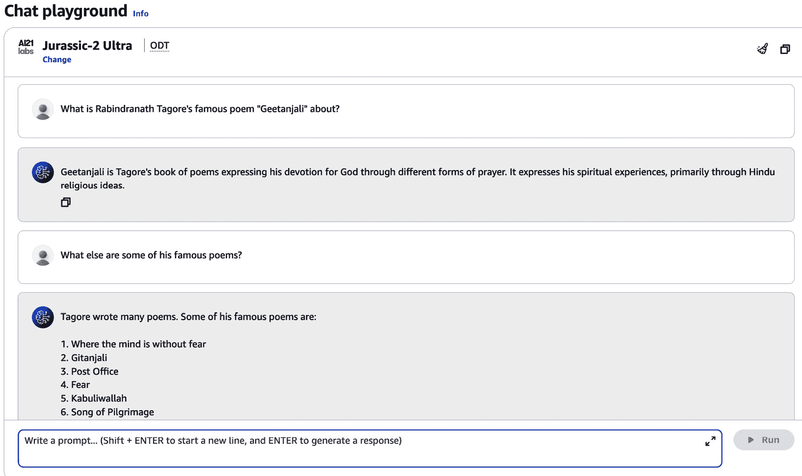
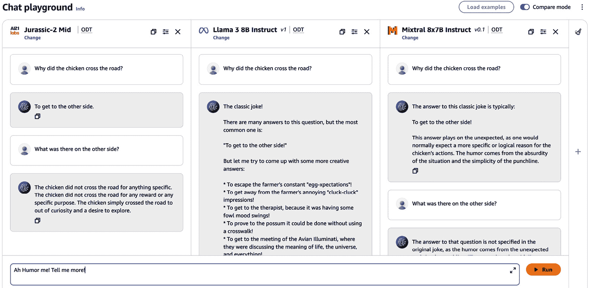
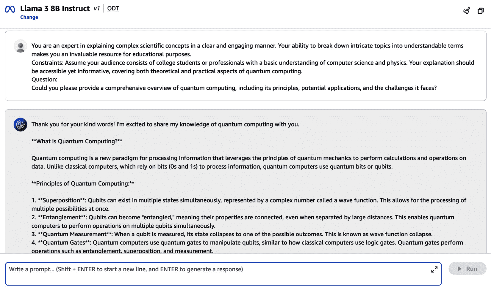
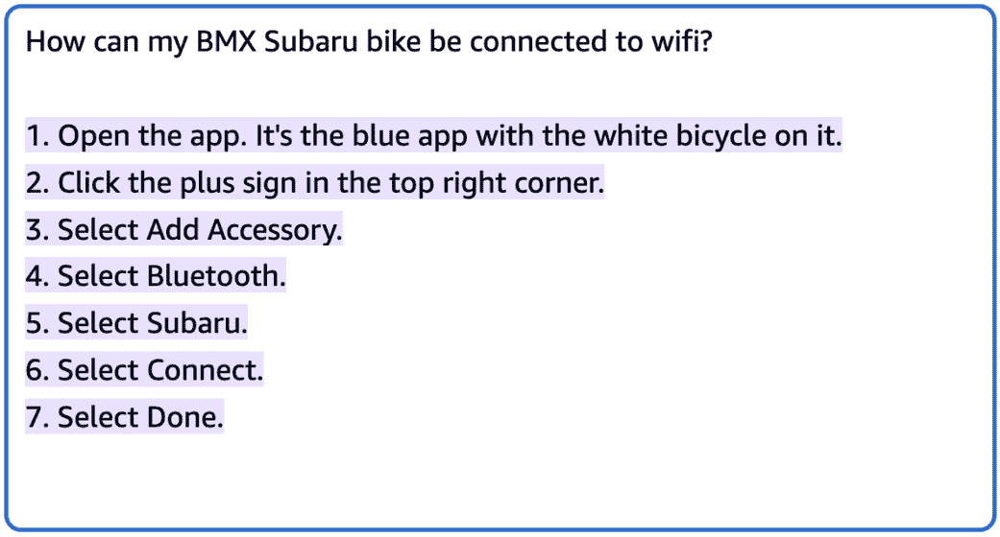
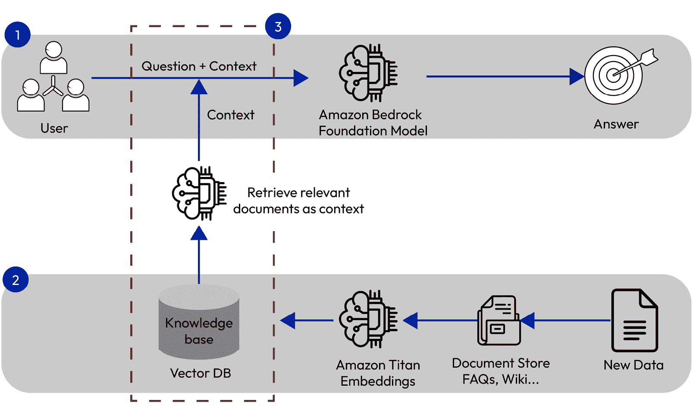
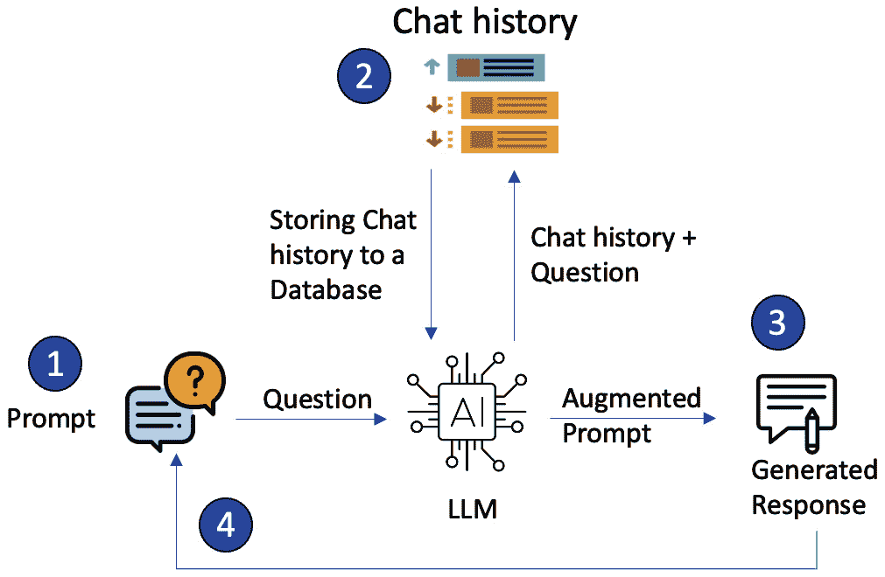
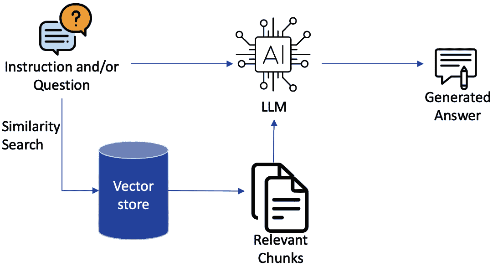
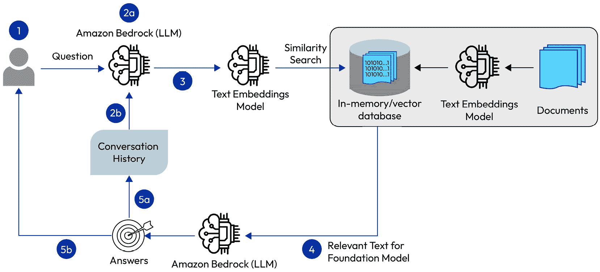

# 第七章：构建问答系统和对话界面

在本章中，我们将深入探讨问答（QA）和对话界面的领域，利用 Amazon Bedrock 的力量。本章从展示 Amazon Bedrock 在问答方面的实际应用案例开始，演示这项技术的实际应用和好处。随后，本章将涵盖小型和大型文档上问答的架构模式，为理解其底层机制提供坚实的基础。此外，还将解释对话记忆的概念，允许存储和利用聊天历史，从而实现更具情境意识和连贯性的对话。

本章还将深入探讨嵌入的概念及其在问答系统架构流程中的重要性。此外，我们将学习关于聊天机器人提示工程技术的知识，为您提供制作有效提示并提升其对话界面性能的技能。同时，还将讨论情境意识，解释如何开发能够无缝集成和利用外部文件和数据源的聊天机器人。

最后，我们将通过探讨对话界面的实际应用案例来结束本章节，展示这项技术在各个领域的多样应用和潜在影响。

本章将涵盖以下关键主题：

+   问答概述

+   使用 Amazon Bedrock 进行文档摄取

+   对话界面

# 技术要求

本章要求您拥有 AWS 账户访问权限。如果您还没有，可以访问 [`aws.amazon.com/getting-started/`](https://aws.amazon.com/getting-started/) 并创建一个 AWS 账户。

其次，您需要在创建账户后安装和配置 AWS CLI ([`aws.amazon.com/cli/`](https://aws.amazon.com/cli/))，这将用于从您的本地机器访问 Amazon Bedrock FMs。由于我们将执行的代码单元格大部分基于 Python，此时设置 Python 的 AWS SDK（Boto3）([`docs.aws.amazon.com/bedrock/latest/APIReference/welcome.html`](https://docs.aws.amazon.com/bedrock/latest/APIReference/welcome.html))将非常有用。您可以通过以下方式执行 Python 设置 – 在您的本地机器上安装它，使用 AWS Cloud9，利用 AWS Lambda，或利用 Amazon SageMaker。

注意

使用 Amazon Bedrock 的 FMs 调用和定制将产生费用。有关更多信息，请参阅 [`aws.amazon.com/bedrock/pricing/`](https://aws.amazon.com/bedrock/pricing/)。

# 问答概述

问答系统旨在理解自然语言查询并根据给定上下文或知识源提供相关答案。这些系统利用先进的 NLP 技术和机器学习模型来理解用户问题的意图，从可用信息中提取最合适的响应。

让我们考虑一个典型问答系统的示例场景：假设你是某科技公司的内容创作者，需要向你的听众解释**光学字符识别**（**OCR**）的概念。问答系统可以通过提供其知识库中的相关信息或分析与 OCR 相关的给定文本语料库来协助你完成这项任务。

这里是一个问答系统如何处理诸如“什么是光学字符识别`用于什么`？”这样的查询的例子：

+   **查询理解**：系统首先分析查询以理解用户的意图并提取关键实体和概念。在这种情况下，它认识到查询询问的是光学字符识别的使用案例或应用。

+   **上下文检索**：系统随后在其知识库或提供的文本语料库中搜索与 OCR 及其应用相关的相关信息。它可能识别出讨论 OCR 目的和实际用途的段落或段落。

+   **答案提取**：在检索到相关上下文后，系统采用先进的 NLP 技术，如命名实体识别、关系提取和语义分析，以识别直接回答查询的最相关信息。它可能从文本中提取 OCR 的具体使用案例或应用。

+   **答案生成**：最后，系统根据提取的信息编写一个简洁且自然流畅的答案。例如，它可能会以以下方式回应：

```py
"Optical character recognition (OCR) is used to convert text in images, scanned documents, or handwritten text into machine-readable and editable text format. It has several applications, including:
Digitizing printed documents, books, and archives for easier storage and search.
Extracting text from images or photographs for indexing or further processing.
Automating data entry tasks by extracting information from forms, invoices, or receipts.
Enabling text-to-speech capabilities for visually impaired users.
Facilitating translation of text between languages by first converting it to editable format."
```

系统还可能提供额外的上下文、示例或相关信息，以增强用户对主题的理解。

从理论上讲，这一切看起来完美且简单直接。然而，让我们思考一下这种情况中的一些挑战。

由于这些问答系统旨在通过分析和从提供的数据或文本源中提取相关信息来自动生成响应，它们可能或可能不明确包含给定查询的完整答案。换句话说，系统从各种上下文中推断和组合不同信息的能力至关重要，因为完整的答案可能不在提供的单一、自包含的陈述中 readily available。

QA 提出了重大挑战，因为它要求模型深入理解查询背后的语义意义和意图，而不仅仅是依赖表面关键词匹配或模式识别。这种高级的语言理解能力对于准确识别构建合适响应所需的相关信息至关重要，即使查询和可用上下文之间的确切措辞或术语不同。

克服这些障碍对于开发能够进行流畅对话、提供准确信息并提升广泛领域和应用的用户体验的智能系统至关重要。

在撰写本文时，短短一段时间内就产生了大量的生成式 AI 用例。企业正在扩大其对话界面——聊天机器人和 QA 系统——的规模，目标是减少人工劳动并用自动化的生成式 AI 系统替换现有框架。

LLMs 和生成式 AI 技术最有希望的应用之一实际上是 QA。能够用自然语言提问并获得准确、相关的答案可能会改变我们与信息和计算机互动的方式。

## 潜在的 QA 应用

强健的 QA 系统在许多行业和领域中的应用范围非常广泛：

+   **客户服务**：允许客户用自然语言提问，并接收定制化的帮助和故障排除，而不是搜索文档

+   **研究和分析**：允许分析师和研究人员提出开放式探索性问题，以发现大型数据集中的见解

+   **教育**：创建智能辅导系统，学生可以提出后续问题并接收符合其水平的解释

+   **知识管理**：通过允许自然语言查询，使组织的数据、文档和流程更加易于访问

当然，与任何生成式 AI 系统一样，围绕事实准确性、安全性和潜在误用的担忧必须得到妥善解决，因为 QA 系统在开发和部署过程中必须谨慎处理。

尽管如此，通过自然语言查询打破人与信息之间障碍的能力代表了人工智能进步的关键前沿。随着在 Amazon Bedrock 上可用的 FMs，这些由 LLMs 驱动的 QA 系统为那个未来提供了一个令人兴奋的预览。

## 基于 Amazon Bedrock 的 QA 系统

企业级 QA 系统通常建立在最先进的 NLP 技术基础之上，包括 transformer 架构和迁移学习。它们应该被设计成理解人类语言的细微差别，使其能够理解复杂的查询并从各种数据源中提取相关信息。

Amazon Bedrock 的一个关键优势是它能够处理需要推理和推理的开放性问题。与传统依赖于预定义规则或模式的 QA 系统不同，Bedrock 可以理解潜在上下文，并根据其学习到的信息提供深思熟虑的响应。

在 Amazon Bedrock 上有大量的 FM（功能模块）可供选择，开发者、数据科学家或生成式 AI 爱好者可以构建能够潜在地擅长处理模糊性和不确定性的应用程序或服务。如果可用信息不完整或相互矛盾，这些引人入胜的应用程序可以提供反映其置信水平的响应，或者它们可以请求更多信息，使交互更加自然和人性化。

此外，Amazon Bedrock 具有高度的扩展性，可以轻松集成到各种应用程序和平台中，例如聊天机器人、虚拟助手和知识管理系统。其基于云的架构和高可用性确保它可以处理大量查询并适应不断变化的数据和用户需求。

### 无上下文 QA

在没有提供额外上下文或支持文档的情况下，QA 系统必须完全依赖其预训练的知识来生成响应。与提供上下文的情况相比，这种无上下文 **QA** 呈现出几个关键挑战。其中一些挑战如下：

+   **知识范围和完整性**：当没有提供上下文时，QA 系统的知识完全来自其训练数据中存在的部分。这使得训练数据的范围和完整性变得极其重要。理想情况下，训练数据应涵盖广泛的主题，并具有事实准确性。然而，训练数据集可能存在空白、偏差或错误，这些随后会被编码到模型的认知中。

+   **查询正确知识**：没有上下文来定位问题，QA 系统必须准确地将问题映射到其参数中相关的知识领域。这需要强大的自然语言理解能力来正确解释查询，识别关键实体/关系，并检索适当的事实知识来形成响应。

+   **幻觉**：一个关键挑战是幻觉——当模型生成与训练数据相矛盾的错误信息时。没有基于上下文的限制，模型可能生成的信息种类就较少。幻觉可能从细微的错误到以高置信度呈现的完全虚构的输出都有可能。

### 无上下文 QA 的提示示例和模板

当 LLM 被问到一个没有任何额外上下文的问题时，它可能很难理解问题并生成准确的答案。这就像给他们提供了一个缺少拼图的谜题。提示工程帮助我们提供缺失的拼图，使 LLM 更容易理解我们的问题并提供准确的答案。

因此，需要仔细的提示工程来引导生成正确的方向，并鼓励准确、真实的回答。在无上下文的情况下，QA 中的提示工程有三个主要技术：

+   `法国的首都是什么？`，你可以问`法国的首府是哪个城市？`。让我们再举一个例子。与其问`什么导致了恐龙的灭绝？`（一个宽泛的问题），重新构架的提示应该像这样`关于恐龙灭绝最广泛接受的理论是什么？`（它关注一个特定的方面）。

+   `五大湖是什么？`，你可以问`提供北美五大湖的列表`（这指定了期望的答案格式）。

+   `谁写了《哈姆雷特》？`这似乎是一个简单的问题，但 LLM 可能不确定它是指原始剧本的作者还是现代改编。相反，你可以用某种方式对模型进行归因校准来提问，例如`你能明确告诉我谁写了原始剧本《哈姆雷特》吗？根据我对文学的理解，我非常可能（或不太确定）是正确的`。这种提示版本的提示提供了一系列的信心水平（`非常可能`或`不太确定`），而不是仅仅`自信`或`不确定`。这允许 LLM 根据它处理的信息表达更细微的确定性水平。

+   除了上述技术之外，你还应该利用系统提示来塑造 LLM 在最终用户查询时的解释和响应。将系统提示视为精心设计的指令，旨在指导模型的行为，将其引导到期望的结果。

+   例如，当为角色扮演场景制作提示时，系统提示可以定义 AI 应展现的性格特征、交流风格和领域知识。想象一下你正在创建一个虚拟助手。通过系统提示，你可以指定一个有帮助、信息丰富的角色，确保 FM 使用适合角色的语言和知识。

+   此外，系统提示可以帮助保持模型响应的一致性，尤其是在长时间交互期间。通过在提示中概述人物和期望的语气，你确保模型保持其性格，培养信任并提高用户体验的自然性。

+   以下是一个使用 Anthropic Claude 模型的系统提示示例，我们鼓励您浏览[`promptengineering.org/claudes-system-prompt-a-prompt-engineering-case-study/`](https://promptengineering.org/claudes-system-prompt-a-prompt-engineering-case-study/)。您应该始终记住，最佳的提示将取决于具体问题和您使用的 LLM 的能力。尝试不同的措辞和模板，以找到最适合您需求的方法。

+   通过使用提示工程，总是可以在没有上下文的情况下提高 LLM 在 QA 任务中的准确性和可靠性。

#### 简单的问题提示

提示生成模型最直接的方法之一是提出一个直接的问题，在代码中多行综合提示的情况下，格式化为三引号。让我们在 Amazon Bedrock 聊天游乐场中尝试一个示例。

为了在 Amazon Bedrock 游乐场中执行简单的 QA 提示，让我们回到 AWS 控制台，导航到 Amazon Bedrock 登录页面。一旦到达登录页面，滚动左侧面板，然后在**游乐场**下的**聊天**选项上点击**Chat**。

通过导航到**选择模型**，在聊天游乐场中选择一个特定的模型。在我们的例子中，让我们选择**Jurassic-2 Ultra** FM，并使用*图 7.1*中的以下示例来启动对话。



图 7.1 – 聊天游乐场中使用 Amazon Bedrock 模型的简单提示

如前例所示，一个简单的提示，如`拉宾德拉纳特·泰戈尔著名的诗篇“Geetanjali”是关于什么的？`被使用，而没有向模型提供任何上下文。为了进一步与模型进行聊天，还问了一个后续问题，`他还有哪些著名诗作？`，模型提供了相当不错的回答。（您可以在 Bedrock 游乐场中使用其他模型运行此示例提示，并继续对话链以观察响应中的任何差异。）

您还可以通过在**聊天游乐场**窗口右侧切换滑块来利用**比较模式**，如图*图 7.2*所示，并对 Amazon Bedrock 上可用的多个 FM 执行类似的提示。如图所示，在特定问题上比较了三个模型。注意第三个模型是通过点击右侧的**+**选项添加的。



图 7.2 – 在 Amazon Bedrock 中使用比较模式进行简单 QA 提示

同样，通过使用 Amazon Bedrock API，可以在 QA 环境中提示模型：

```py
prompt = """You are an expert AI assistant. You will answer questions in a succinct manner. If you are unsure about the
answer, say 'I am not sure about this answer'
Question: How can I connect my old Samsung TV with my Mac laptop?
Answer:"""
parameters = {
    "maxTokenCount":1024,
    "temperature":0.1,
    "topP":0.8,
    "stopSequences":[]
    }
```

使用前面的提示，可以在 Amazon Bedrock 中调用可用的 FM；然后模型可以提供特定的响应。我们鼓励您使用 Amazon Titan 模型运行此提示，并将响应作为练习捕获。

#### 模型鼓励和约束

`你可以选择以激励的方式构建提示来鼓励模型。通过结合模型鼓励和约束，你可以创建更有效的提示，引导 LLMs 生成高质量的响应。`

`以下是一些示例：`

+   `提供上下文和特定关键词可以鼓励模型生成更准确的响应。`

+   `设置长度和格式约束可以帮助模型生成简洁、结构化的响应。`

+   `将模型限制在特定领域或主题可以帮助它生成更准确、更相关的响应。`

`一个提示示例可以按照以下顺序格式化：`

`你是一位在清晰和吸引人的方式中解释复杂科学概念的专家。你将复杂主题分解成可理解术语的能力使你成为教育目的的无价资源。`

`约束条件：假设你的听众是具有计算机科学和物理基础知识的大学生或专业人士。你的解释应该是易于理解且信息丰富的，涵盖量子计算的理論和實踐方面。`

`接着是这个问题：`

`请提供一个关于量子计算的全面概述，包括其原理、潜在应用以及它面临的挑战。`

*图 7.3* 展示了在 Amazon Bedrock 的聊天沙盒中使用模型鼓励和约束调用 Meta Llama 模型的示例用法。



图 7.3 – 在 Amazon Bedrock 的聊天沙盒中使用模型鼓励和约束对 Meta Llama 3 模型的简单提示示例

`鼓励你在自己的端执行这个提示，并注意有/没有约束条件和模型鼓励时的响应差异。你会发现这种类型的提示可以帮助引导模型提供深思熟虑、详尽的响应。`

`以下是一个供你执行的示例，你可以在 Amazon Bedrock 的聊天沙盒中执行，或者通过使用 Amazon Bedrock API 调用模型：`

`你对复杂的机器学习概念有很好的掌握，并且能够以清晰易懂的方式解释它们。`

`请解释一下机器学习中梯度下降的概念。`

`请确保你的解释简洁，适合具有机器学习基础知识读者。`

`假设你用一个假设性的问题调用一个 FM，没有任何相关上下文。在某些情况下，它可能会产生幻觉。*图 7.4* 展示了一个有趣的场景，其中模型在查询一个虚构的 BMX Subaru 自行车时产生了幻觉，而这个自行车在现实生活中并不存在！`



图 7.4 – 在 Amazon Bedrock 的聊天沙盒中无上下文的 QA 提示示例

如果提供了适当的提示指令和上下文，模型将努力在上下文中找到相关内容，然后提供合理的期望响应。

请记住，虽然无上下文的 QA 极具挑战性，但诸如宪法 AI 和利用模型内部知识以新颖方式利用和重新组合的迭代优化技术等策略可以帮助提高开放域 QA 的性能。

注意

**宪法 AI**是人工智能研究的一个领域，关注于开发遵守伦理原则和法律框架的人工智能系统。这可能包括设计公平、透明和可问责的人工智能系统，并尊重人权和隐私。

### 有上下文的 QA

**有上下文的 QA**涉及提供输入文本和问题，语言模型必须基于给定文本中的信息生成答案。这项任务要求模型理解上下文，识别相关细节，并综合一个直接回答查询且不引入外部信息的连贯响应。

对于这个用例，通过首先展示输入文本，然后提出问题来结构化提示是有益的。这种顺序允许模型在尝试形成答案之前完全处理上下文，这可能会提高响应的质量和准确性。如前所述，结合诸如模型鼓励等技术可以进一步提高 QA 任务的表现。 

理想的提示应该具有以下结构：

`input_text: {{文本}}`

`问题：{{问题}}`

`answer:`

现在，让我们看看提示的内容会是怎样的：

**输入文本**：

`"""北极狐（Vulpes lagopus）是一种小型狐狸，原产于北半球的北极地区，在北极苔原生物群落中很常见。它非常适合生活在寒冷环境中，拥有密集的毛皮绝缘层和紧凑的体形，这有助于减少对寒冷的暴露。成年狐狸体重 3-5 公斤（6.6-11 磅），体长 46-68 厘米（18-27 英寸）。它们厚厚的毛皮像保温毯一样，即使在北极冬天的深处也能保持温暖。北极狐有一层厚厚的底毛，可以隔离寒冷，以及一层密集的绝缘保护毛皮覆盖在顶部。"""`

`北极狐在寒冷的北极环境中有哪些关键的适应性特征？`

**示例输出**：

```py
"The Arctic fox has several key adaptations that allow it to survive in the cold Arctic environments:
1\. Dense fur insulation to keep it warm.
2\. A compact body shape that limits exposure to the cold.
3\. A thick underfur that insulates it from the cold.
4\. A dense, insulating guard hair coat on top.
These physical adaptations, such as thick fur coats and compact body shape, enable the Arctic fox to withstand the extreme cold temperatures of the Arctic tundra region."
```

上述示例提示展示了这样一个场景：提供了一个关于北极狐对寒冷环境物理适应性的答案，问题提示模型从文本中识别和总结相关细节。

接下来，让我们通过一个使用 Amazon Bedrock API 的 QA 有上下文示例提示来进行分析：

```py
# Import the respective libraries
import boto3
import botocore
import os
import json
import sys
#create bedrock runtime client
bedrock_runtime = boto3.client('bedrock-runtime')
#Provide the model paramters
model_parameters = {
     "maxTokenCount":1024,
     "temperature":0,
     "stopSequences":[],
     "topP":0.9
     }
#Provide relevant context to the model
context= """Using your Apple Watch to locate a misplaced iPhone is a handy feature that can save you a lot of time and frustration. The process typically begins by opening the Control Center on your watch by swiping up from thebottom of the watch face. From there, you'll see an icon that looks like a ringing iPhone - tapping this will remotely activate a loud pinging sound on your iPhone, even if it's on silent mode. If you're within earshot, simply follow the sound to track down your missing device. Alternatively, you can use the FindMy app on your Apple Watch, which provides a map showing the last known location of your iPhone. Tap the "Devices" tab, select your iPhone, and it will display its location, as well as give you the option to force it to emit a sound to aid in your search. For an even quicker option, you can simply raise your wrist and ask Siri "Hey Siri, find my iPhone," and the virtual assistant will attempt to pinpoint the location of your iPhone and provide directions. However, for any of these methods to work, your iPhone must be powered on, connected to a cellular or WiFi network, and have the Find My feature enabled in Settings under your Apple ID. As long as those criteria are met, your Apple Watch can be a powerful tool for tracking down a wandering iPhone."""
#Take the entire context/excerpt provided above and augment to the model along with the input question
question = "How can I find my iPhone from my Apple watch in case I lose my phone?"
prompt_data = f""" Answer the user's question solely only on the information provided between <></> XML tags. Think step by step and provide detailed instructions.
<context>
{context}
</context>
Question: {question}
Answer:"""
#Now, you can Invoke the foundation model using boto3 to generate the output response.
body = json.dumps({"inputText": prompt_data, "textGenerationConfig": model_parameters})
accept = "application/json"
contentType = "application/json"
# You can change this modelID to use an alternate version from the model provider
modelId = "amazon.titan-tg1-large"
response = bedrock_runtime.invoke_model(
    body=body, modelId=modelId, accept=accept, contentType=contentType)
generated_response_body = json.loads(response.get("body").read())
print(generated_response_body.get("results")[0].get("outputText").strip())
```

运行前面的代码，并尝试在自己的 Amazon Bedrock FM 上测试结果。生成的输出可能类似于*图 7.5*：


图 7.5 – 来自 Amazon Bedrock FM 的示例输出

在执行调用模型的代码后，您将观察到模型可以通过利用提供作为上下文的信息，在大多数情况下生成适当的响应。

现在我们已经讨论了在 Bedrock 上的 QA 用例中的提示工程，让我们通过 Amazon Bedrock 的文档摄取框架来了解文档摄取。

# 使用 Amazon Bedrock 进行文档摄取

带有上下文的 QA 系统的架构模式可以大致分为两类 – *小型文档上的 QA* 和 *知识库上的大型文档 QA*。虽然核心组件保持相似，但所采用的方法和技术可能因输入数据的大小和复杂性而异。

## 小型文档上的 QA

对于旨在处理小型文档（如段落或短文章）的 QA 系统，其架构模式通常遵循以下阶段的管道方法：

1.  **查询处理**：将自然语言查询预处理为向量表示。

1.  **文档检索**：根据查询关键词或语义相似性度量从语料库中检索相关文档或段落。对于较小的文档，检索可以很直接；您可以直接嵌入和索引整个文档或段落到您的向量存储中。在另一种情况下，由于输入文档的性质较小，只要它们可以适应模型的令牌大小限制，可能就没有必要将它们分成更小的块。一旦检查，文档就可以在模型提示模板的上下文中直接解析。

1.  **段落排名**：检索到段落后，根据其与查询的相关性进行排名。这种排名可以使用诸如**词频-逆文档频率（TF-IDF）**语义相似性或专门的神经排名模型等技术来完成。可以使用编排器或类型或向量数据库来实现段落排名的自动化。例如，Amazon Kendra 内置了 SOTA 语义搜索机制，用于执行相关性排名。

1.  **答案提取**：分析排名靠前的段落，以识别最相关的范围或短语，这些范围或短语可能回答查询。这一阶段通常涉及诸如命名实体识别、指代消解和 QA 模型等技术。因此，在生成式 AI 框架的情况下，相关上下文提取可以由这些 LLM 执行，而无需显式调用复杂的技术。

1.  **答案评分和排名**：提取的答案候选者根据其置信度或与查询的相关性进行评分和排名，使用的技术包括答案验证模型或评分函数。还有一些重新排名模型，例如 Cohere Rerank，也可以利用来提高召回性能。

1.  **答案生成**：生成排名最高的答案，可能涉及后处理步骤，如格式化、改写或生成自然语言响应。

这种管道方法非常适合小型文档的问答，因为它允许高效地检索和排名相关段落，然后进行针对性的答案提取和评分，而无需将文档分成块或以不同的方式处理。

让我们通过一个使用 Amazon Bedrock 的小型文档摄取示例来了解。

对于使用 Amazon Bedrock 和 LangChain 的小型文档摄取，您可以使用 `TextLoader` 和 `PDFLoader`，实际上它们是 *Python* 类，而不是软件组件。以下是一个简要的解释：

+   使用 `TextLoader` 和 `PDFLoader` 分别加载和解析文本和 PDF 文档。

+   这些类是 LangChain 文档加载功能的一部分，有助于在 AI 应用中准备文档以进行进一步处理。

以下是一个使用 TextLoader 的示例。

注意

如前几章所示，请确保安装 LangChain 所需的库以及 Chroma DB。我们仅使用 Chroma DB 作为示例目的。根据用例，您可以使用其他向量数据库，如 Chroma、Weaviate、Pinecone 和 Faiss。如果未安装 Chroma DB，请在运行以下代码之前执行 `!pip install chromadb`。

```py
from langchain.document_loaders import TextLoader
from langchain.text_splitter import CharacterTextSplitter
from langchain.vectorstores import Chroma
# Load the document
loader = TextLoader('path/to/document.txt')
documents = loader.load()
# Split the documents into chunks
text_splitter = CharacterTextSplitter(chunk_size=1000, chunk_overlap=200)
texts = text_splitter.split_documents(documents)
# Create embeddings and store in Chroma vector store
from langchain_community.embeddings import BedrockEmbeddings
embeddings = BedrockEmbeddings()
db = Chroma.from_documents(texts, embeddings)
```

## 知识库中大型文档的问答

当处理知识库中的大型文档时，可能需要调整架构模式以处理数据的规模和复杂性。一种常见的方法是结合信息检索和开放域问答系统的技术。以下步骤突出了摄取大型文档、创建向量索引和创建端到端问答管道的过程：

1.  **知识库构建**：大型语料库或知识库被预处理、索引和结构化，以便于高效检索和查询。

1.  **查询处理**：类似于小型文档的情况，自然语言查询通过将其转换为向量表示进行预处理。

1.  **文档或段落检索**：

    +   **分块**：对于较大的文档，直接嵌入整个文档可能并不理想。您应该考虑将文档分成更小、更易于管理的部分，例如段落或句子。

    +   **从小到大检索**：在这种情况下，遵循以下过程：

        1.  在检索期间使用较小的块进行嵌入和搜索。

        1.  根据检索到的分数识别相关的块。

        1.  使用检索到的块 ID 访问并提供相应的较大文档段给 LLM 以生成答案。这样，LLM 可以访问更广泛的环境，而检索则利用更小、更专注的单位。

    +   **效率**：通过减少嵌入和搜索大量文档的计算负载，将文档分块和从小到大检索可以帮助提高效率。

1.  **段落重新排序**：检索到的段落或知识库条目可能根据其与查询的相关性进行进一步的重新排序或过滤，使用技术如神经重新排序器或语义相似度度量。

1.  **答案提取和生成**：根据查询和知识库的性质，答案提取和生成可能涉及多跳推理、知识图谱遍历或从结构化数据生成自然语言响应等技术。

1.  **答案评分和排序**：类似于小文档的情况，提取的答案候选者将根据其置信度因子或与查询的相关性进行评分和排序。

1.  **答案展示**：最终的答案或答案集将展示给用户，可能涉及格式化、摘要或生成自然语言解释。

1.  **额外考虑点** **值得考虑**：

    +   **自适应检索限制**：根据查询和文档集合的复杂性，设置自适应的检索文档数量限制可以优化性能。

    +   **压缩**：诸如摘要或信息提取等技术可以预处理大量文档，在不丢失上下文的情况下压缩信息，从而进一步帮助 LLM 在答案生成过程中。

这种方法特别适用于在大型、多样化和可能未结构化的知识库上运行的问题回答系统，因为它利用信息检索技术，在答案提取和生成之前，有效地检索和排序相关信息。

对于大量文档的摄取，建议使用 Amazon Bedrock 的知识库来处理摄取工作流程并将嵌入存储在向量数据库中，具体内容请参阅*第五章*。

无论文档大小如何，现代 QA 系统往往都会采用高级技术，如基于 Transformer 的语言模型、图神经网络和多任务学习。此外，迁移学习、少样本学习和领域自适应等技术也常被采用，以适应不同领域或知识库的 QA 模型。

重要的是要注意，具体实现细节和采用的技术可能因特定 QA 系统的要求、约束和可用资源而异。架构模式作为一个通用框架，提供了一个理解底层机制的基础，并指导针对不同用例和领域的 QA 系统的设计和开发。

## 使用 Amazon Bedrock 的 QA 实现模式

在本节中，我们将探讨与 QA 相关的不同模式。首先，我们将探讨如何直接向模型提出查询。之后，我们将介绍另一种使用 RAG 的方法，其中我们将添加上下文信息。让我们开始吧！

### 基线方法：知识领域的无界探索

在这个初始模式中，我们开始了一段旅程，在这个旅程中，问题直接向模型提出，不受外部约束的限制。我们收到的回答根植于模型的基础知识。然而，正如你现在所清楚理解的，这种方法提出了一个巨大的挑战——输出内容广泛且通用，缺乏定义客户独特商业景观的细微差别和具体细节。*图 7.6*展示了用户与 Amazon Bedrock 交互并使用直接提示时的旅程，提示中的小文档用于调用模型。


图 7.6 – 使用直接输入提示对 Bedrock LLM 进行 QA 生成的提示

注意，我们在展示如何利用 Amazon Bedrock Titan 模型向用户查询提供信息性回答时详细介绍了这种方法，如*带上下文的 QA*部分所示。

如前所述，示例演示了 Bedrock Titan 模型如何在没有任何上下文信息提供的情况下生成回答。随后，我们手动将上下文纳入模型输入中，以增强其回答的质量。重要的是要注意，这种方法不涉及任何 RAG 来将外部知识纳入模型的输出。

虽然这种直接的方法对于短文档或单一应用可能效果良好，但它可能无法有效地扩展到企业级 QA 场景。在这种情况下，需要考虑大量企业文档，整个上下文可能无法放入发送给模型的提示中，这需要更高级的技术。

### RAG 方法：上下文照明

在这个第二个模式中，我们将开始一段更精细的旅程，这段旅程利用了 RAG 的力量。在这里，我们巧妙地将问题与相关的上下文信息交织在一起，创造出一个更有可能包含我们寻求的答案或见解的图案。这种方法类似于带着精心编制的阅读清单进入图书馆，引导我们走向存放我们渴望的知识的书架。

然而，即使在改进后的这种方法中，仍然存在一个限制——我们可以整合的上下文信息量受到模型强加的上下文窗口的限制。这就像在我们的比喻背包中携带有限数量的书籍，迫使我们仔细挑选携带的上下文信息，以免超过重量限制并遗漏可能至关重要的见解。

如您在*第五章*中学习到的，RAG 结合了使用嵌入来索引文档语料库、构建知识库以及使用 LLM 来执行嵌入的方法，目的是最终从知识库中的一部分文档中提取相关信息。为了准备 RAG，构成知识库的文档被分成固定或可变大小的块。然后，这些块通过模型传递以获得其各自的嵌入向量。每个嵌入向量及其对应的文档块和附加元数据都存储在向量数据库中，该数据库针对高效向量之间的相似性搜索进行了优化。

*图 7.7*展示了在 QA 生成框架的背景下使用 Amazon Bedrock 的基于 RAG 的工作流程。



图 7.7 – 使用 RAG 方法与 Amazon Bedrock 进行 QA

通过利用这种 RAG 方法，我们可以访问大量的上下文信息库，使我们的生成式 AI 模型能够产生更明智和准确的输出。然而，我们必须保持对令牌限制的警觉，并仔细挑选我们纳入的上下文信息。这样做将确保我们在领域知识的广度和深度之间取得平衡（将解析到模型中以提供响应，而不是让模型进行幻想），同时保持在模型的约束范围内。

在这种方法中，我们将基于前一小节中讨论的小型文档摄取代码进行构建。但是，您将在代码中找到不同的片段 – 尤其是在识别与源数据中的查询的相似性以及利用相关信息，增强提示以调用 LLM 的部分：

```py
#importing the respective libraries
from langchain.document_loaders import TextLoader
from langchain.text_splitter import CharacterTextSplitter
from langchain.vectorstores import Chroma
!pip install chromadb
Import boto3
Import botocore
#Create client side Amazon Bedrock connection with Boto3 library
region = os.environ.get("AWS_REGION")
bedrock_runtime = boto3.client(
    service_name='bedrock-runtime',
    region_name=region,
)
# Load the document
loader = TextLoader('path/to/document.txt')
documents = loader.load()
# Split the documents into chunks
text_splitter = CharacterTextSplitter(chunk_size=1000, chunk_overlap=200)
texts = text_splitter.split_documents(documents)
# Create embeddings and store in Chroma vector store
from langchain_community.embeddings import BedrockEmbeddings
embeddings = BedrockEmbeddings(client=boto3_bedrock, model_id="amazon.titan-embed-text-v1")
db = Chroma.from_documents(texts, embeddings)
# Enter a user query
query = "Enter your query here"
#Perform Similarity search by finding relevant information from the embedded data
retriever = db.similarity_search(query, k=3)
full_context = '\n'.join([f'Document {indexing+1}: ' + i.page_content for indexing, i in enumerate(retriever)])
print(full_context)
#Since we have the relevant documents identified within "full_context", we can use the LLM to generate an optimal answer based on the retreived documents. Prior to that, let us format our prompt template before feeding to the LLM.
prompt_template = f"""Answer the user's question solely only on the information provided between <></> XML tags. Think step by step and provide detailed instructions.
<context>
{full_context}
</context>
Question: {query}
Answer:"""
PROMPT = PromptTemplate.from_template(prompt_template)
#Prompt data input creation to feed to the LLM
prompt_data_input = PROMPT.format(human_input=query, context=context_string)
#Now, you can Invoke the foundation model using boto3 to generate the output response.
body = json.dumps({"inputText": prompt_data_input, "textGenerationConfig": model_parameters})
accept = "application/json"
contentType = "application/json"
# You can change this modelID to use an alternate version from the model provider
modelId = "amazon.titan-tg1-large"
response = bedrock_runtime.invoke_model(
    body=body, modelId=modelId, accept=accept, contentType=contentType)
generated_response_body = json.loads(response.get("body").read())
print(generated_response_body.get("results")[0].get("outputText").strip())
```

执行此代码将帮助您了解恰当地构建提示模板并调用模型以生成期望的响应。

您还被鼓励在不同的文档上执行代码，并尝试不同的向量数据库和 FM，以更深入地了解这种方法。

用户应致力于找到相关文档，以提供对其查询的准确答案。用户在使用生成式 AI 用例时可能遇到的两个关键挑战可能包括以下内容：

+   管理超过令牌限制的大型文档

+   确定给定问题的最相关文档

为了应对这些挑战，RAG 方法提出了以下策略：

+   **文档准备和嵌入**：在回答问题之前，文档必须被处理并存储在文档存储索引中，如*使用 Amazon Bedrock 进行文档摄取*部分所示。涉及到的步骤包括以下内容：

    1.  加载文档。

    1.  将其处理并分割成更小、更易于管理的块。

    1.  使用 Amazon Bedrock Titan Embeddings 模型或替代嵌入模型为每个块创建数值向量表示（嵌入）。

    1.  使用块及其相应的嵌入创建索引。

+   **问题处理**：一旦文档索引准备就绪，用户可以提出问题，并根据查询检索相关文档块。以下步骤将被执行：

    1.  创建输入问题的嵌入。

    1.  将问题嵌入与索引中的嵌入进行比较。

    1.  获取*Top K*个相关文档块。

    1.  将这些块作为提示中的上下文部分添加。

    1.  将提示发送到 Amazon Bedrock FM。

    1.  根据检索到的文档接收上下文答案。

通过在代码中采用这种方法，我们可以利用生成式 AI、嵌入和向量数据存储的力量，为用户查询提供准确和上下文感知的响应，即使在处理大量文档集时也是如此。

现在我们已经详细了解了问答系统，是时候揭开其衍生领域——即对话界面的面纱了。

# 对话界面

**对话界面**，如虚拟助手或聊天机器人，在各种领域得到了广泛应用，包括客户服务、销售和电子商务，为用户提供快速高效的响应。它们可以通过多种渠道访问，如网站、消息应用和社交媒体平台，从而确保无缝的用户体验。

## 使用 Amazon Bedrock 的聊天机器人

在生成式 AI 领域，Amazon Bedrock 提供了一个强大的平台，用于开发和部署聊天机器人。*图 7.8*突出了 Amazon Bedrock 中包含聊天历史集成的整体对话流程。该流程包括以下步骤：

1.  某个用户通过界面向适当的 Bedrock LLM 提出特定问题。

1.  模型将对话历史存储到特定的数据库中，例如 DynamoDB。聊天历史和问题被附加在一起形成增强提示。对话历史存储在数据库中，例如 DynamoDB。这个历史记录，连同当前用户查询一起，用于创建增强提示。然后，这个增强提示被用来通知生成式 AI 模型，这有助于在未来的交互中改进聊天机器人的响应。通过整合对话历史，聊天机器人可以避免向用户提出他们已经回答过的问题。这促进了更自然和吸引人的对话。

1.  从 LLM 检索增强提示以获取相关响应。

1.  对话以反馈的形式继续，其中生成的输出随后以对话链的形式反馈，以继续与用户的持续交互。



图 7.8 – 与 Amazon Bedrock 的对话流程

在 Amazon Bedrock 上构建的聊天机器人的用例多种多样，适应广泛场景：

+   **基本聊天机器人 - 零样本**：这个用例涉及开发一个利用预训练的 FM 进行对话交互的基本聊天机器人，无需任何额外的上下文或提示。例如，可以提供以下提示：

`您是一个友好且有帮助的对话式人工智能助手。您应该就广泛的话题进行自然语言对话，尽您所能回答问题。如果您对某事不确定，您可以礼貌地回应您对该特定主题的信息不足。您的主要目标是以对话方式向用户提供有用的信息。您不需要任何额外的上下文或示例来开始对话。`

+   **基于提示的聊天机器人（LangChain）**：在这个场景中，聊天机器人被设计在由提示模板定义的特定上下文中运行。利用 LangChain 库，开发者可以创建能够进行情境化对话的聊天机器人，提供相关和定制的响应。例如，以下代码片段展示了如何使用提示模板与 LangChain 交互，并在对话链中与用户进行交互：

    ```py
    from langchain import PromptTemplate, LLMChain
    
    from langchain_community.llms import Bedrock
    
    # Define the prompt template
    
    template = """You are a helpful travel assistant. You will be provided with information about a user's travel plans, and your task is to provide relevant suggestions and recommendations based on their preferences and requirements.
    
    Travel Details: {travel_details}
    
    Using the information provided, suggest some activities, attractions, restaurants, or any other recommendations that would enhance the user's travel experience. Provide your response in a conversational and friendly tone."""
    
    # Create the prompt template object
    
    prompt = PromptTemplate(template=template, input_variables=["travel_details"])
    ```

    现在，用户可以创建 LLM 链并提供一个示例提示，如下所示，并相应地调用模型：

    ```py
    # Sample user input
    
    user_travel_details = """I'm planning a 5-day trip to Paris with my family (two adults and two children, ages 8 and 12). We're interested in exploring the city's history, architecture, and cultural attractions. We also enjoy trying local cuisine and engaging in family-friendly activities."""
    ```

+   **以角色驱动的聊天机器人**：这个用例涉及创建具有明确角色或身份的聊天机器人。例如，可以开发一个职业导师聊天机器人，与用户进行对话，提供与职业相关的事务指导和建议，同时在整个互动过程中保持一致的角色。例如，聊天机器人可以用作教学助理，为学生提供信息和解答他们的问题。聊天机器人可以被设计成符合教师的个性，或者采取更轻松的角色，使学习更加有趣。另一种场景可能涉及客户服务或医疗保健领域的角色驱动聊天机器人。具体来说，医疗保健领域的聊天机器人可以用来向患者提供有关其健康状况的信息，或者回答有关药物的问题。聊天机器人可以被设计成富有同情心和理解的，并且可以使用患者容易理解的语言。

+   **上下文感知聊天机器人**：在这个高级用例中，聊天机器人被设计为根据通过外部文件提供的信息理解和响应。通过从这些文件生成嵌入，聊天机器人可以理解和整合提供的信息到其响应中，提供高度相关和特定上下文的交互。例如，*第五章*中提供的例子强调了上下文感知聊天机器人的用例，其中提示与从摄取的文档/外部文件中提取的上下文相结合，以增强提示与匹配的上下文。

这些用例展示了基于 Amazon Bedrock 构建的聊天机器人的多功能性和强大功能，使开发者能够创建满足不同用户需求和场景的对话接口。

## 通过 Amazon Bedrock 和 LangChain 框架赋能聊天机器人开发

在对话接口的领域，如聊天机器人，保持上下文和跨交互保留记忆至关重要。这不仅适用于短期交流，也适用于长期对话，其中回忆和基于先前交互构建的能力是至关重要的。

如前文所述，在更详细地讨论问答系统（除了*第五章*）的部分（以及*第五章*中提到的*第五章*），LangChain 提供了两种不同形式的记忆组件来满足这一需求。首先，它提供了一套辅助工具，旨在管理和操作之前的聊天消息。这些工具是模块化的，并且非常灵活，可以集成到各种工作流程和应用中。

其次，LangChain 简化了将这些记忆工具集成到链中的过程，链是创建复杂对话系统的基本构建块。通过利用 LangChain 的抽象和易于使用的接口，开发者可以轻松定义和交互不同类型的记忆组件，从而创建复杂且上下文感知的聊天机器人。

无论您是在构建一个简单的问答机器人，还是一个复杂的多轮对话代理，LangChain 的记忆管理功能，结合其与 Amazon Bedrock 的集成，使您能够打造智能且引人入胜的聊天机器人体验。

## 打造上下文感知对话接口——基本支柱

如“使用 Amazon Bedrock 的问答系统”部分所述，开发上下文感知聊天机器人的基石在于生成上下文嵌入。如您现在所知，这一初始阶段涉及一个摄取过程，通过嵌入模型将数据喂入，其中这些嵌入随后被仔细存储在专门的数据结构中，通常称为向量存储，以促进高效的检索和处理。

*图 7.9*展示了将文档或文件作为输入，进行处理或转换，然后将其转换为存储在向量存储中的嵌入的过程。


图 7.9 – 分块大型文档并将嵌入存储在向量存储中

与使用 Bedrock 的 QA 系统实现模式相同，用户交互编排中的第二个关键组件可以定义为**请求处理机制**。这个复杂的过程包括接收用户输入，解释意图和上下文，调用适当的模型或服务，并综合相关响应。它作为中央枢纽，协调各种组件以提供无缝且上下文相关的对话体验。在我们的场景中，这种形式或编排器或请求处理中心可以使用 Langchain 或 Amazon Bedrock 代理执行。*图 7.10*说明了 QA 对话界面工作流程，通过从向量存储中提取所需信息来从分块文档中检索相关响应。



图 7.10 – 带有相似性搜索和相关信息分块的问题回答对话工作流程

在请求处理阶段，系统利用先前生成的嵌入，采用复杂的算法从向量存储中识别最相关的信息。这种上下文检索使聊天机器人能够提供针对特定对话线程的响应，考虑到用户的意图、先前的话语和整体对话上下文。

现在，让我们深入探讨在对话界面情况下上下文感知的架构工作流程。

## 上下文感知聊天机器人的架构流程

该架构的过程流程（也在*图 7.11*中展示）如下：

1.  初始时，上下文文档使用强大的嵌入模型（如亚马逊的 Titan Embeddings 模型）转换为数值嵌入。这些嵌入存储在专门的向量数据库中，以便高效检索。

1.  使用嵌入模型将用户的查询编码成数值表示，使系统能够理解其语义含义。

1.  用户的查询嵌入和聊天历史被输入到 FM 中，特别是文本嵌入模型，该模型在向量数据库中搜索最相关的上下文信息。

1.  向量数据库返回与查询最佳匹配的上下文嵌入，使 LLM 能够生成包含相关上下文的响应。



图 7.11 – 一种用于上下文感知聊天机器人的对话架构流程

使用 Amazon Titan 构建此架构流程的代码可在[`github.com/aws-samples/amazon-bedrock-workshop/blob/main/06_OpenSource_examples/02_Langchain_Chatbot_examples/00_Chatbot_Titan.ipynb`](https://github.com/aws-samples/amazon-bedrock-workshop/blob/main/06_OpenSource_examples/02_Langchain_Chatbot_examples/00_Chatbot_Titan.ipynb)找到。

在 Amazon Bedrock 样本页上，还有来自 Anthropic、AI21 Labs 和 Meta 的不同 FM 的额外示例。随着时间的推移，Amazon Bedrock GitHub 样本页上还将继续添加更多示例，供用户进行实验并用于他们的企业用例。

此外，有关使用 Amazon Bedrock 构建基于知识库的上下文聊天应用的信息，您可以在此找到：[`aws.amazon.com/blogs/machine-learning/build-a-contextual-chatbot-application-using-knowledge-bases-for-amazon-bedrock/`](https://aws.amazon.com/blogs/machine-learning/build-a-contextual-chatbot-application-using-knowledge-bases-for-amazon-bedrock/)。

我们还鼓励您阅读有关基于 AWS 解决方案构建的明确问答机器人的文章，以扩展您构建企业级对话聊天机器人的可能性：[`aws.amazon.com/blogs/machine-learning/deploy-generative-ai-self-service-question-answering-using-the-qnabot-on-aws-solution-powered-by-amazon-lex-with-amazon-kendra-and-amazon-bedrock/`](https://aws.amazon.com/blogs/machine-learning/deploy-generative-ai-self-service-question-answering-using-the-qnabot-on-aws-solution-powered-by-amazon-lex-with-amazon-kendra-and-amazon-bedrock/)。

在生成式 AI 的领域内，问答模式和对话界面代表了知识获取和传播不断演进的旅程。在我们探索这些路径的过程中，我们不断寻求创新的方法来优化我们的查询，增强我们的上下文，并推动可能性的边界，所有这些都在追求解锁这些卓越模型中蕴藏的知识宝库。

随着企业继续拥抱生成式 AI 并寻求更智能和自动化的解决方案，Amazon Bedrock 作为一个强大的工具脱颖而出，可以构建先进的问答系统，从而提升客户体验，简化运营流程，并解锁人机交互中的新可能性。

# 摘要

在本章中，我们探讨了现代问答界面和聊天机器人的架构复杂性及其关键组件。我们了解了促进自然和吸引人对话的提示工程技巧。我们还展示了如何使用 Amazon Bedrock 无缝设计问答系统和对话系统，突出了这些模式的结构化工作流程。

在下一章中，我们将揭示更多使用 Amazon Bedrock 的生成式 AI 的潜在用例和应用。我们将更深入地了解使用 Amazon Bedrock 进行实体提取和代码生成，以及其潜在的实际应用场景。
