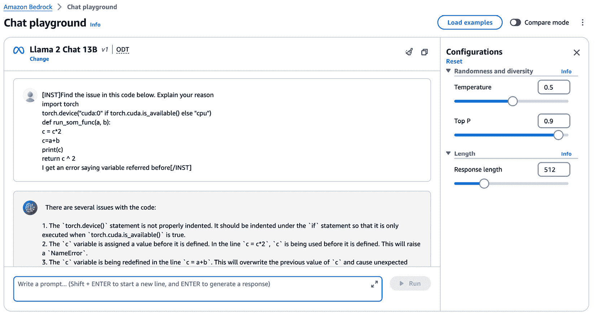

# 第八章：使用 Amazon Bedrock 提取实体和生成代码

本章揭示了实体提取领域，这是自然语言处理中的一个关键技术。我们将探讨实体提取应用的复杂性，提供使用 Amazon Bedrock 实施实体提取的全面理解。通过实际案例，您将深入了解实体提取在各个领域的实际应用。

此外，本章将引导您进入代码生成的激动人心的生成式 AI 世界。我们将探讨使 AI 系统能够生成代码片段、函数甚至整个应用程序的底层原理和方法。您将学习如何利用 Amazon Bedrock 简化您的开发工作流程并提高生产力。

通过掌握这些技术，您将具备解决复杂 NLP 任务和利用生成式 AI 在编码工作中的力量的知识和技能。

以下主题将详细介绍：

+   实体提取 – 全面探索

+   实体提取的工业应用案例 – 解放非结构化数据的力量

+   使用 Amazon Bedrock 进行实体提取

+   使用大型语言模型进行代码生成 – 解放 AI 驱动的开发力量

# 技术要求

本章要求您拥有 AWS 账户访问权限。如果您还没有账户，可以访问 [`aws.amazon.com/getting-started/`](https://aws.amazon.com/getting-started/) 创建一个 AWS 账户。

其次，您需要在创建账户后从 [`aws.amazon.com/cli/`](https://aws.amazon.com/cli/) 安装和配置 AWS CLI，这将用于从您的本地机器访问 Amazon Bedrock FMs。由于我们将执行的大多数代码单元都是基于 Python 的，因此在此时设置 AWS Python SDK（Boto3）[`docs.aws.amazon.com/bedrock/latest/APIReference/welcome.html`](https://docs.aws.amazon.com/bedrock/latest/APIReference/welcome.html) 将非常有用。您可以通过以下方式执行 Python 设置：在您的本地机器上安装它，使用 AWS Cloud9 或 AWS Lambda，或利用 Amazon SageMaker。

注意

与调用和定制 Amazon Bedrock FMs 相关的费用将会产生。请参阅 [`aws.amazon.com/bedrock/pricing/`](https://aws.amazon.com/bedrock/pricing/) 了解更多信息。

# 实体提取 – 全面探索

在大数据和信息过载的时代，从非结构化文本数据中提取有意义的见解的能力变得越来越有价值。**实体提取**，作为 NLP 的一个子领域，在这一努力中发挥着关键作用，通过识别和分类文本中的命名实体（如人物、组织、地点等），从而不仅促进了信息检索和知识管理，还使各种应用成为可能，包括**问答**、**情感分析**和**决策支持系统**（DSSs）。

实体提取的旅程始于简单的模式匹配和基于规则的系统，这些系统严重依赖于手动制定的规则和词汇表。虽然这些方法有用，但在处理多样化和复杂的数据集时，它们缺乏可扩展性和鲁棒性。

因此，传统上，实体提取是一个具有挑战性的任务，需要大量的手动工作和领域专业知识。然而，生成式 AI 的出现，尤其是 LLMs，彻底改变了这一领域，提供了更准确、可扩展和高效的解决方案。在本章中，我们将探讨 LLMs 在 Amazon Bedrock 上用于实体提取的各种技术，深入其底层架构、优势和局限性。

## 深度学习方法

机器学习的出现引入了利用特征工程统计模型。这些模型，包括**隐马尔可夫模型**（HMMs）和**条件随机字段**（CRFs），代表了一个重大进步。它们利用手工制作的特征和概率框架来提高提取精度。然而，它们的性能仍然受到专家设计的特征的质量和全面性的限制。

神经网络通过自动化特征学习和捕捉数据中的复杂模式，在实体提取中实现了范式转变。早期神经网络的应用，如**循环神经网络**（RNNs）和**长短期记忆网络**（LSTMs），展示了深度学习在处理序列数据和以更高精度提取实体方面的潜力。

虽然 BERT 及其后续模型在 NLP 领域代表了一个重大飞跃，但我们的关注点将始终集中在与 Bedrock 中使用的实际应用和工具相一致的模式和技巧上。我们将探讨一些在多种场景中证明有效的深度学习方法和模型，它们与我们的框架相关。

### 基于 Transformer 的模型

Transformer 架构，由开创性的论文 *Attention is All You Need* (*Vaswani 等人，*2017*: [`arxiv.org/abs/1706.03762`](https://arxiv.org/abs/1706.03762)) 提出，已成为许多 SOTA LLMs 用于实体提取的骨干。这些模型采用自注意力机制来捕捉输入文本中的长距离依赖关系，使它们能够更好地理解上下文以及实体之间的关系。

由谷歌 AI 开发的 BERT 是一个基于转换器的模型，它在各种 NLP 任务中，包括实体提取中取得了卓越的成果。它是一个双向模型，这意味着它可以同时处理文本的两个方向，使其比前辈更有效地捕捉上下文信息。

### 序列标注和 CRFs

实体提取可以被视为一个序列标注问题，其中输入文本中的每个标记都被分配一个标签，指示其实体类型（例如，人、组织、地点）或非实体标签。LLMs 可以通过利用 CRFs 或更近期的**双向 LSTM 与 CRF（BiLSTM-CRF**）架构等技术来训练执行此任务。

**条件随机场（CRFs**）是能够有效捕捉序列中标签之间依赖关系的概率图模型，这使得它们非常适合实体提取任务。它们模型化给定输入文本的标签序列的条件概率，允许结合丰富的特征和上下文信息。

**双向长短时记忆网络-条件随机场（BiLSTM-CRF**）模型结合了 BiLSTM 在捕捉长距离依赖关系和 CRFs 在序列标注方面的优势。这种混合方法在实体提取中表现出令人印象深刻的性能，尤其是在实体可能跨越多个标记或具有复杂结构的情况下。

## 基于规则的系统

尽管近年来深度学习方法获得了显著的关注，但基于规则的系统在实体提取领域仍然是宝贵的工具。这些系统依赖于手动编写的规则和模式来识别和分类文本中的实体，利用领域特定知识和专家见解。这些规则可以增强到 Amazon Bedrock 的提示模板中，以便从 FMs 生成期望的响应。例如，在医疗应用中，基于规则的组件可能会使用预定义的模式来识别药物名称、剂量和患者信息。

### 正则表达式和模式匹配

**正则表达式**和**模式匹配**技术是规则基于实体提取系统的基本构建块。这些方法允许定义可以匹配和提取特定实体类型（例如电话号码、电子邮件地址或特定的命名实体，例如公司名称和产品名称）的模式。

虽然正则表达式对于定义明确和结构化的实体类型可能非常有效，但它们在处理需要上下文理解的更复杂或模糊的实体时可能会遇到困难。尽管如此，它们仍然是宝贵的工具，尤其是在与其他技术结合使用或作为更高级方法预处理步骤时。以下是一些例子：

+   **规则集**：使用正则表达式和模式匹配定义规则，以识别特定的实体，如药物名称、剂量和患者信息

+   `\d+mg`（例如，`500mg`）

+   可以通过诸如`Patient: [A-Za-z]+`之类的模式识别患者信息

### 地名词典和词典

**地名词典**和**词典**是已知实体的精选集合，通常按实体类型或领域组织。这些资源可以通过对预定义列表进行查找来用于匹配和提取文本中的实体。

例如，地理位置的地名词典可以用来识别和提取给定文本中提到的城市、国家或其他地点。同样，人名或组织名词典可以简化这些实体类型的提取。

虽然地名词典和词典对于它们覆盖的实体可能非常准确，但它们可能难以处理歧义、变化或新出现的实体，这些实体不在预定义的列表中。此外，维护和更新这些资源可能是一个劳动密集型过程，尤其是在快速发展的领域。

## 混合方法

在实践中，许多实体提取系统采用深度学习和基于规则的技术的组合，利用两种方法的优势来实现最佳性能。这些混合方法旨在在深度学习模型的灵活性和泛化能力与基于规则的系统的精确性和可解释性之间取得平衡。

### 集成方法

**集成方法**涉及结合多个实体提取模型的输出，可能使用不同的架构或技术，以提高整体性能。这种方法可以利用单个模型的优势，同时减轻其弱点，从而实现更稳健和准确的实体提取。

例如，一个集成系统可能结合了基于 BERT 的转换器模型的预测以及基于规则的系统或地名词典查找的预测。这些模型的输出可以通过各种策略结合，例如多数投票、加权平均或更复杂的集成学习技术。

### 混合架构

**混合架构**将深度学习和基于规则的组件集成到单个模型中，允许两种方法的无缝集成。这些架构通常涉及一个用于学习表示和捕获上下文信息的深度学习组件，并结合基于规则的组件来融入特定领域的知识或处理定义明确的实体类型。

混合架构的一个例子是使用 LLM 进行实体表示学习，然后使用基于规则的组件进行实体分类或提取。LLM 组件可以学习输入文本的丰富表示，捕捉上下文信息和长距离依赖关系，而基于规则的组件可以利用专家知识和精确模式进行实体识别和分类。例如，考虑一个旨在从公司收益报告中提取财务信息的应用程序。以下是一个混合架构如何实现的详细示例：

+   `收入`、`净收入`和`运营费用`。

+   `收入`、`净收入`或`费用`。

+   使用正则表达式提取日期和财政期间。

+   识别公司特定的术语和缩写。

基于规则的系统分析由 LLM 生成的表示，应用这些规则以准确提取特定的金融实体。

现在我们来看看这些表示是如何集成和优化的：

+   **管道**：系统通过 LLM 处理收益报告，输出丰富的文本表示。然后，这些表示被输入到基于规则的组件中。

+   **输出**：最终输出包括精确提取的金融实体，如收入数字、净收入金额和财政期间，所有这些都根据预定义的规则进行了验证和分类。

通过在 Amazon Bedrock 上采用这种混合方法，应用程序利用了 LLM 提供的全面文本理解以及基于规则的提取方法的精确性和可靠性。这种方法确保了实体提取的准确性更高，并且具有更强的上下文意识，使其适用于金融分析等复杂领域。

为了更深入地了解混合 LLM 框架，鼓励读者阅读以下论文：*从结构化数据生成业务洞察的混合 LLM-基于规则的途径*（https://arxiv.org/pdf/2404.15604）和*从非结构化文本数据中提取命名实体的创新混合方法*（https://www.researchgate.net/publication/332676137_An_innovative_hybrid_approach_for_extracting_named_entities_from_unstructured_text_data）。

在本节中，我们介绍了与实体提取相关联的不同方法（深度学习、基于规则和混合方法）。现在，我们已经对这些方法有了基本的了解，让我们深入了解一些实体提取的工业应用案例。

# 实体提取的工业应用案例——释放非结构化数据的力量

实体提取在各个领域有广泛的应用，从信息检索和知识管理到决策支持系统（DSS）和**商业智能**（**BI**）。在本节中，我们将探讨一些使用 GenAI 的实体提取的实际用例和应用：

+   `Google 是由拉里·佩奇和谢尔盖·布林在斯坦福大学攻读博士学位时创立的。`

使用实体提取，可以提取以下信息：

+   `Google (组织)`

+   `Larry` `Page (人物)`

+   `Sergey` `Brin (人物)`

+   `Stanford` `University (组织)`

+   `由` (`Google` -> `拉里·佩奇和谢尔盖·布林`) 和 `就读于` (`拉里·佩奇和谢尔盖·布林` -> `斯坦福大学`)，被确立为连接节点的边。这种结构化表示允许对信息进行高效的查询和推理。*   `Google (组织)`*   `Larry` `Page (人物)`*   `Sergey` `Brin (人物)`*   `Stanford` `University (组织)`*   `Google -> 创始人 ->` `拉里·佩奇`*   `Google -> 创始人 ->` `谢尔盖·布林`*   `拉里·佩奇 -> 就读于 ->` `斯坦福大学`*   `谢尔盖·布林 -> 就读于 ->` `斯坦福大学`

亚马逊 Bedrock 上的 LLM 可用于准确和可扩展的实体提取，促进从多样化的数据源（如新闻文章、科学出版物或社交媒体帖子）创建全面的知识图谱。这些知识图谱可以支持各种应用，包括问答系统、推荐引擎和决策支持工具。以下是一些示例：

+   **生物医学和科学文献分析**：在生物医学和科学领域，实体提取特别有价值，因为这些领域通过研究出版物、临床笔记和其他来源产生了大量非结构化文本数据。识别和分类诸如基因、蛋白质、疾病和化学化合物等实体，可以使研究人员和医疗保健专业人员快速导航并从这些丰富的信息中提取见解。

    亚马逊 Bedrock 中的 LLM 可以在特定领域的数据集上进行微调，以实现提取生物医学和科学实体的高精度。这些模型可以帮助进行文献综述过程、药物发现流程以及精准医疗和个性化医疗的知识库开发。

+   **商业智能和竞争分析**：在商业领域，实体提取可以用于竞争分析、市场研究和商业智能应用。通过从新闻文章、社交媒体帖子和其他在线来源中提取公司名称、产品名称和行业特定术语等实体，企业可以对其竞争对手、市场趋势和客户情绪获得有价值的见解。

    亚马逊 Bedrock API 可以与**商业智能平台**（**BIps**）和分析工具结合使用，实现大量非结构化数据的实时实体提取和分析。这可以促进数据驱动决策、战略规划和识别新的商业机会。

+   **社交媒体监控和情感分析**：社交媒体平台产生大量用户生成内容，包含有关公众舆论、趋势以及对各种实体（如品牌、产品或公众人物）的情感的有价值信息。实体提取在社交媒体监控和情感分析中发挥着关键作用，通过识别这些非结构化数据中的相关实体。

Amazon Bedrock 中的 LLMs 可以用于从社交媒体帖子中准确提取实体，从而实现围绕这些实体的情感分析和意见挖掘。这可以为业务提供有关客户反馈、品牌认知以及潜在问题或机会的宝贵见解，使他们能够积极应对并相应地调整其营销和沟通策略。

在本节中，我们介绍了适用于实体提取背景下的工业应用。请记住，随着我们在不同行业中发现更多多样化的场景，这些用例的数量可以呈指数级增长。现在，让我们学习如何利用 Amazon Bedrock 进行实体提取用例。

# Amazon Bedrock 的实体提取

在其核心，使用 GenAI 进行实体提取涉及提供提示，指导模型在给定的文本输入中识别和分类相关实体。关键在于构建清晰、一致且提供足够示例的提示，以便模型理解期望的行为。

Amazon Bedrock 服务，能够以无服务器的方式调用 LLMs，为实体提取提供可扩展且成本效益高的解决方案。此服务允许开发者利用预训练模型或在其自定义数据集上进行微调，从而实现针对特定领域或用例的定制实体提取。

## 结构化实体提取提示

在设计实体提取任务的提示时，向模型提供清晰的指示和示例至关重要。一个结构良好的提示通常包括以下组件：

+   `在给定的文本中识别和分类以下实体。`

+   `Person`，`Organization`，`Location`等等。

+   **示例输入和输出**：包括一个或多个带有相应实体标注的输入文本示例。这有助于模型理解期望的输出格式并从现实世界的实例中学习。

以下是一个示例提示：

`'''`

`: 在给定的文本中识别和分类以下实体：`

`实体类型：Person，Organization，Location`

`: "迈克尔·乔丹，芝加哥公牛队的传奇篮球运动员，在辉煌的职业生涯后宣布退役。"`

`输出看起来像这样：`

```py
[Person: Michael Jordan], [Organization: Chicago Bulls], [Location: NBA]
```

`让我们再看一个例子：`

`: "苹果公司，位于加利福尼亚州库比蒂诺的科技巨头，在新闻发布会上发布了其最新的 iPhone 型号。"`

`输出看起来像这样：`

```py
[Organization: Apple Inc.], [Location: Cupertino], [Location: California]
```

`'''`

让我们通过一个代码示例来探索这些用例，并通过在 Amazon Bedrock 上调用 Anthropic Claude 3 Sonnet FM 来生成输出。

注意

请确保您已安装所需的库，例如`boto3`，以便运行代码。如果没有，请在您的编辑器中使用`pip install boto3`命令安装库。

此外，请确保您已启用对 Amazon Bedrock 上可用的模型访问权限。有关 Bedrock 上模型访问的进一步文档，请访问 https://docs.aws.amazon.com/bedrock/latest/userguide/model-access.html。

```py
# Import the respective libraries
import boto3
import botocore
import os
import json
import sys
#Create client-side Amazon Bedrock connection with Boto3 library
region = os.environ.get("AWS_REGION")
bedrock_runtime = boto3.client(service_name='bedrock-runtime',region_name=region)
prompt_data = """
Human: You are a helpful AI assistant. If you are unsure about the answer, say I do not know. Skip the preamble.
Task: Identify and classify the following entities in the given text:
Entity Types: Person, Organization, Location
Input Text: "Michael Jordan, the legendary basketball player for the Chicago Bulls, announced his retirement from the NBA after an illustrious career."
Assistant:
"""
messages=[{ "role":'user', "content":[{'type':'text','text': prompt_data}]}]
body=json.dumps(
        {
            "anthropic_version": "bedrock-2023-05-31",
            «max_tokens»: 512,
            «messages»: messages,
            «temperature»: 0.1,
            "top_p": 1
        }
    )
response = bedrock_runtime.invoke_model(body=body, modelId="anthropic.claude-3-sonnet-20240229-v1:0")
response_body = json.loads(response.get('body').read())
print(response_body['content'][0].get("text"))
```

这里是 FM 的一个示例输出：


图 8.1 – 示例输出

虽然这种基本结构适用于简单情况，但更高级的提示技术对于稳健、生产级别的实体提取是必需的。

## 结合上下文和领域知识

实体提取场景通常受益于上下文信息和领域特定知识。在提示中提供相关的背景或领域特定细节，可以增强模型的理解并提高其准确识别实体的能力。

这里有一个带有上下文的示例提示：

```py

`: Identify and classify entities related to sports in the` `given text.`

`Entity Types: Athlete, Team,` `Tournament, Sport`

`: This text discusses sports events, teams, and athletes involved in various` `sports competitions.`

`: "Serena Williams, a well renowned Tennis player, defeated Venus Williams to win 23rd Grand Slam title at the 2017` `Australian Open."`

`The output looks` `like this:`

```

[运动员：塞雷娜·威廉姆斯], [运动员：维纳斯·威廉姆斯], [赛事：大满贯], [赛事：澳大利亚公开赛], [运动：网球]


在*图 8*.2 中，展示了前一个用例的代码示例。需要注意的是，代码并未明确提及已安装的库。假设用户已经预先安装了之前代码示例中详细说明的所需 Python 包和库：


图 8.2 – 使用上下信息提示 Amazon Bedrock FM 进行实体提取

它可能会根据输入指令为某些 FM 生成有利的输出。然而，在其他情况下，它有可能生成幻觉或无关的额外信息，如*图 8*.3 所示。因此，在这种情况下使用少样本提示对于实体提取是有益的：


图 8.3 – AI21 Labs J2 Jumbo Instruct FM 输出

## 利用少样本学习

如您所知，少样本学习涉及在训练或推理期间向模型提供少量标记示例。这种方法对于实体提取任务尤其有效，因为它允许模型从有限的高质量示例中学习并推广到新的、未见过的数据。

这里是一个带有少样本学习的示例提示：

```py

`: Identify and classify entities related to technology companies in the` `given text.`

`: Company,` `Product, Location`

`:`

`: "Microsoft, based in Redmond, Washington, unveiled its latest operating system, Windows 11, at a` `virtual event."`

`The output looks` `like this:`

```

[公司：微软], [产品：Windows 11], [地点：雷德蒙德], [地点：华盛顿州]

```py

`Here's` `another example:`

`: "Google's parent company, Alphabet Inc., announced plans to expand its data center operations in Iowa` `and Nevada."`

`The output looks` `like this:`

```

[公司：Alphabet Inc.], [公司：Google], [地点：爱荷华州], [地点：内华达州]

```py

`Let's look at` `another example:`

`: "Samsung Electronics, the South Korean tech giant, launched its new flagship smartphone, the Galaxy S22, featuring a powerful camera and improved` `battery life."`

`The output looks` `like this:`

```

[公司：三星电子], [产品：Galaxy S22], [地点：韩国]

```py

`Now, look at the following` `use case:`

`: "Amazon, the e-commerce behemoth based in Seattle, Washington, unveiled its latest line of Echo smart speakers and Alexa-powered devices at a` `hardware event."`

```

让我们为前面的用例编写一个代码示例，并在 Amazon Bedrock 上调用 Amazon Titan 模型：

```py
# Import the respective libraries
import boto3
import botocore
import os
import json
import sys
#Create client-side Amazon Bedrock connection with Boto3 library
region = os.environ.get("AWS_REGION")
bedrock_runtime = boto3.client(service_name='bedrock-runtime',region_name=region)
prompt_data = """Task: Identify and classify entities related to technology companies in the given text.
Entity Types: Company, Product, Location
Few-Shot Examples:
Input Text: "Microsoft, based in Redmond, Washington, unveiled its latest operating system, Windows 11, at a virtual event."
Output: [Company: Microsoft], [Product: Windows 11], [Location: Redmond], [Location: Washington]
Input Text: "Google's parent company, Alphabet Inc., announced plans to expand its data center operations in Iowa and Nevada."
Output: [Company: Alphabet Inc.], [Company: Google], [Location: Iowa], [Location: Nevada]
Input Text: "Samsung Electronics, the South Korean tech giant, launched its new flagship smartphone, the Galaxy S22, featuring a powerful camera and improved battery life."
Output: [Company: Samsung Electronics], [Product: Galaxy S22], [Location: South Korea]
Your Input Text: "Amazon, the e-commerce behemoth based in Seattle, Washington, unveiled its latest line of Echo smart speakers and Alexa-powered devices at a hardware event."
Output:
"""
body = {
    "inputText": prompt_data
}
modelId = "amazon.titan-tg1-large"
accept = «application/json»
contentType = «application/json»
response = invoke_model(body, modelId, accept, contentType)
response_body = json.loads(response.get("body").read())
print(response_body.get("results")[0].get("outputText"))
```

执行前面的代码会生成以下输出，如图**8.4**所示：

```py
[Company: Amazon], [Product: Echo smart speakers, Alexa-powered devices], [Location: Seattle], [Location: Washington]
```


图 8.4 – Amazon Titan FM 生成的输出

因此，在这个例子中，提示提供了一组标记实例，以帮助模型理解技术领域内的实体提取任务。通过利用少量样本学习，模型可以熟练地泛化到不熟悉的输入文本，同时保持高精度。

## 迭代优化和评估

提示工程是一个迭代过程，通常需要优化和评估。在探索各种提示和技术时，通过自动模型评估或人工评估方法评估模型的性能至关重要，如第十一章所述。通过仔细分析模型的输出并确定改进领域，您可以迭代地优化您的提示，从而提高实体提取系统的整体准确性。

看一下以下模型分析和优化的示例：

`'''`

`:`

`: 识别和分类给定文本中的实体。`

`实体类型：人物，组织，位置`

`: "Elon Musk，特斯拉公司的首席执行官，宣布计划在` `Austin, Texas` `建设一个新的超级工厂。"`

`输出看起来是这样的：`

```py
[Person: Elon Musk], [Organization: Tesla Inc.], [Location: Austin]
```

`: 模型正确地识别了人物和组织实体，但遗漏了` `位置 "Texas."`

`:`

`: 识别和分类给定文本中的实体，包括嵌套或` `多词实体。`

`实体类型：人物，组织，位置`

`: "Elon Musk，特斯拉公司的首席执行官，宣布计划在` `Austin, Texas` `建设一个新的超级工厂。"`

`输出看起来是这样的：`

```py
[Person: Elon Musk], [Organization: Tesla Inc.], [Location: Austin, Texas]
```

`'''`

通过细化提示以包括处理嵌套或多词实体的说明，模型的性能得到了提升，正确地将位置识别为 Austin, Texas。

我们鼓励用户在 Amazon Bedrock 上运行提供的代码，使用 Claude 3 模型和`Messages` API 提取相关实体。如前所述，请确保在 Amazon Bedrock 上启用对这些模型的访问。有关在 Bedrock 上访问模型的进一步文档，请访问[`docs.aws.amazon.com/bedrock/latest/userguide/model-access.html`](https://docs.aws.amazon.com/bedrock/latest/userguide/model-access.html)。

注意

确保您已安装`boto3`库，如前几章所述。如果没有，请使用以下命令安装最新版本：`pip install boto3`。

```py
#importing the relevant libraries
import boto3
import json
#Creating Bedrock client and region
bedrock_client = boto3.client('bedrock-runtime',region_name='us-east-1')
prompt = """
Task: Identify and classify entities in the given text.
Entity Types: Person, Organization, Location
Input Text: "Elon Musk, the CEO of Tesla Inc., announced plans to build a new Gigafactory in Austin, Texas.
Output:
"""
messages = [{ "role":'user', "content":[{'type':'text','text': prompt}]}]
max_tokens=512
top_p=1
temp=0.5
system = "You are an AI Assistant"
body=json.dumps(
        {
            "anthropic_version": "bedrock-2023-05-31",
            «max_tokens»: max_tokens,
            «messages»: messages,
            "temperature": temp,
            "top_p": top_p,
            "system": system
        }
    )
response = bedrock_client.invoke_model(body= body, modelId = "anthropic.claude-3-sonnet-20240229-v1:0")
response_body = json.loads(response.get('body').read())
print(response_body)
```

按照前面的代码片段打印`response_body`可能会得到以下预期的输出：

```py
{'id': 'msg_01RqxLfg6hEEu1K8jY3g8gzq',
 'type': 'message',
 'role': 'assistant',
 'content': [{'type': 'text',
   'text': 'Person: Elon Musk\nOrganization: Tesla Inc.\nLocation: Austin, Texas'}],
 'model': 'claude-3-sonnet-28k-20240229',
 'stop_reason': 'end_turn',
 'stop_sequence': None,
 'usage': {'input_tokens': 71, 'output_tokens': 23}}
```

因此，通过利用 Amazon Bedrock 中的有效提示工程技术，例如提供清晰的指令、相关的示例和解决歧义，GenAI 模型可以被引导在多个用例和不同领域执行高质量实体提取。与任何 AI 应用一样，它需要仔细的设计、测试和改进，以构建一个真正适合生产的系统。

随着大型语言模型（LLMs）的规模和复杂性的持续增长，它们在实体提取方面的能力预计将进一步提高，从而实现更准确和稳健的解决方案。

持续的研究还集中在将外部知识源（如知识图谱或本体）集成到 LLMs 中以进行实体提取。通过将这些结构化知识嵌入到模型的架构或训练方案中，这些方法有可能丰富模型对实体及其相互关系的理解，从而有可能提高性能和可解释性。

请查看以下 AWS 博客，展示了在 AWS AI/ML 服务（如 Amazon Textract 与 Amazon Bedrock 和 LangChain）的背景下，使用智能文档处理（**IDP**）进行实体提取自动化的集成：[`aws.amazon.com/blogs/machine-learning/intelligent-document-processing-with-amazon-textract-amazon-bedrock-and-langchain/`](https://aws.amazon.com/blogs/machine-learning/intelligent-document-processing-with-amazon-textract-amazon-bedrock-and-langchain/)。

此解决方案特别有益于处理手写或扫描文档，包括从各种文件格式（如 PDF、PNG、TIFF 和 JPEG）中提取相关数据，无论文档布局如何。Amazon Textract 服务简化了此类扫描文档中文本、手写和数据的自动提取。

因此，此解决方案利用了每个组件的优势：Amazon Textract 用于精确数据提取，Amazon Bedrock 用于简化的数据处理管道，LangChain 用于无缝集成 LLMs 到工作流程中。总的来说，该博客文章提供了一个实用的解决方案，用于自动化文档处理任务，强调了利用 AWS 服务和开源框架（如 LangChain）开发智能应用的优点。因此，它具有在多样化的文档处理场景中提供动态适应不断变化的数据模式的大量潜力。

在此处还添加了使用 Bedrock 进行实体提取的更多示例：[`github.com/aws-samples/amazon-bedrock-workshop/blob/main/01_Text_generation/04_entity_extraction.ipynb`](https://github.com/aws-samples/amazon-bedrock-workshop/blob/main/01_Text_generation/04_entity_extraction.ipynb)。鼓励用户运行和执行代码单元，以更好地理解使用 Amazon Bedrock 进行 GenAI 用例的实体提取。

现在你已经更详细地掌握了实体提取的概念，我们将深入亚马逊 Bedrock 宇宙中的更多代码生成场景。

# 使用 LLM 进行代码生成——释放 AI 驱动开发的潜力

随着人工智能领域的持续发展，最令人兴奋和有前景的领域之一是使用 LLM 进行代码生成，尤其是在提高开发者生产力的方面。客户可以利用亚马逊 Bedrock 上提供的最先进的 LLM 生成高质量的代码，从而彻底改变开发者对待软件开发的方式。

## 代码生成过程

使用亚马逊 Bedrock 进行代码生成的过程简单直观，开发者可以通过基于网页的界面或 API 与平台交互，如前几章所述。该过程通常包括以下步骤：

1.  **问题描述**：开发者提供对所需功能或任务的天然语言描述，该代码需要执行。

1.  **上下文和约束**：开发者可以选择提供额外的上下文，例如编程语言偏好、编码风格或特定库或框架的使用。

1.  **LLM 代码生成**：亚马逊 Bedrock 的 LLM 分析问题描述和提供的任何上下文，并生成相应的代码。

1.  **代码优化**：生成的代码可以通过额外的提示或开发者的反馈进行迭代优化，从而实现协作和交互式的过程。

1.  **代码集成**：最终生成的代码可以无缝集成到开发者的项目或代码库中。

## 使用亚马逊 Bedrock 进行代码生成的益处

利用大型语言模型（LLM）进行代码生成为开发者带来了众多好处，包括以下几方面：

+   **提高生产力**：借助亚马逊 Bedrock，开发者可以快速生成用于各种任务和功能的代码，减少手动编码所需的时间和精力。

+   **提高代码质量**：亚马逊 Bedrock 的 LLM 生成的代码可以提供高质量的输出，遵循基于提示迭代优化的最佳实践和编码标准。

+   **减少错误**：通过提示工程生成正确且连贯的代码，LLM 可以帮助减少常见编码错误的可能性，例如语法错误或逻辑错误。

+   **探索和原型设计**：Bedrock 使开发者能够快速探索和原型设计不同的想法和方法，从而促进更高效和更具创造性的问题解决。

+   **易用性**：通过利用自然语言描述和用于代码生成的 FM（如 Llama、Claude、Titan、Mistral 等），亚马逊 Bedrock 使得代码生成对具有不同技术水平或背景的开发者更加容易。

## 局限性和考虑因素

虽然基于 LLM 的代码生成提供了许多优势，但了解其局限性和考虑因素同样重要：

+   **专业领域知识**：LLMs 可能并不总是生成需要高度专业领域知识或复杂算法的代码。在某些情况下，仍然可能需要人类的专家知识和审查。

+   **安全和合规性**：生成的代码应彻底审查和测试，以确保其符合安全最佳实践和任何相关的合规性要求。

+   **集成和维护**：生成的代码可能需要随着时间的推移进行适应和维护，因为需求或依赖关系发生变化。

+   **伦理考量**：与任何 AI 系统一样，确保 LLMs 负责任和道德地使用至关重要，考虑到潜在的偏见或意外后果。

## 用例和示例

Amazon Bedrock 的代码生成能力可以应用于各个领域和编程语言的广泛用例。以下是一些示例：

+   **Web 开发**：开发者可以使用 Bedrock 使用 JavaScript、Python 或 Ruby 等语言生成用于 Web 应用程序、API 或用户界面的代码。

+   **数据处理和分析**：开发者可以利用 Bedrock 使用 Python 或 R 等语言编写数据操作、分析和可视化任务的代码。

+   **移动应用开发**：Bedrock 可用于使用 Swift、Kotlin 或 React Native 等语言生成移动应用的代码。

+   **嵌入式系统和物联网（IoT）设备**：开发者可以在 Bedrock 模型的帮助下，使用 C、C++或 Rust 等语言创建嵌入式系统、微控制器或 IoT 设备的代码。

+   **科学计算**：Bedrock 可以通过其代码生成功能帮助编写使用 MATLAB、Julia 或 Fortran 等语言进行科学模拟、数值计算或数据处理任务的代码。

现在，让我们看看一些使用 Amazon Bedrock 进行代码生成、调试或代码转换用例的例子。

## Amazon Bedrock 的提示工程示例

以下是在 Amazon Bedrock 中给 Claude 3 Sonnet 模型提供的示例提示，以采用 Python 开发者的角色并执行代码生成任务：

```py`Human: You are an expert Python developer tasked with coding a web scraper for an experienced developer. The scraper should extract data from multiple web pages and store the results in a SQLite database. Write clean, high-quality Python code for this task, including necessary imports. Do not write anything before the ```python 代码块。在编写代码后，仔细检查错误。如果存在错误，请在<error>标签内列出它们，并提供一个新的修正版本。如果没有错误，请在<error>标签内写上“CHECKED: NO ERRORS”。

# 导入相应的库

import boto3

import botocore

import os

import json

import sys

#使用 Boto3 库创建客户端 Amazon Bedrock 连接

region = os.environ.get("AWS_REGION")

bedrock_runtime = boto3.client(service_name='bedrock-runtime',region_name=region)

# 在此处添加提示示例：

prompt_data = """Human: 你是一位经验丰富的 Python 开发者，需要编写一个用于经验丰富的开发者的网络爬虫。爬虫应从多个网页中提取数据，并将结果存储在 SQLite 数据库中。为这个任务编写干净、高质量的 Python 代码，包括必要的导入。不要在 ```pypython block. After writing the code, carefully check for errors. If errors exist, list them within <error> tags and provide a new corrected version. If no errors, write "CHECKED: NO ERRORS" within <error> tags.
Assistant:
"""
# Using Messages API with Anthropic Claude
messages=[{ "role":'user', "content":[{'type':'text','text': prompt_data}]}]
body=json.dumps(
        {
            "anthropic_version": "bedrock-2023-05-31",
            «max_tokens»: 512,
            «messages»: messages,
            «temperature»: 0.1,
            "top_p": 1
        }
    )
response = bedrock_runtime.invoke_model(body=body, modelId="anthropic.claude-3-sonnet-20240229-v1:0")
response_body = json.loads(response.get('body').read())
```

我们不会深入探讨生成的全部输出，但 *图 8**.5* 中提供了一个由 Amazon Bedrock API 通过前面的提示调用 Claude 3 Sonnet 模型生成的代码片段：


图 8.5 – 通过 Amazon Bedrock 调用 Claude 3 Sonnet 模型生成的输出代码片段

*图 8**.6* 展示了另一个代码调试用例的示例，利用 Amazon Bedrock 上的 Llama 2 Chat 13B 模型在聊天沙盒中进行：



图 8.6 – 在 Amazon Bedrock 上使用 Llama 2 Chat 13B 模型进行代码调试

现在，让我们看看一个代码翻译场景。以下是在 Amazon Bedrock 上使用 Mixtral 8X7B 指令模型的一个代码翻译用例的示例提示，随后是生成的输出：

```py
# Import the respective libraries
import boto3
import botocore
import os
import json
import sys
#Create client-side Amazon Bedrock connection with Boto3 library
region = os.environ.get("AWS_REGION")
bedrock_runtime = boto3.client(service_name='bedrock-runtime',region_name=region)
prompt="""
[INST] You are an AI code translator specialized in converting code between different programming languages while preserving functionality, readability, and style. Your task is to translate the provided Python code to JavaScript.
Here is a brief description of the code's purpose:
This code defines a class called 'BankAccount' that represents a basic bank account. It has methods to deposit and withdraw money, as well as to check the account balance.
Python code is in the following code block:
```python

class BankAccount:

def __init__(self, initial_balance=0):

self.balance = initial_balance

def deposit(self, amount):

self.balance += amount

def withdraw(self, amount):

if self.balance >= amount:

self.balance -= amount

else:

print("Insufficient funds")

def check_balance(self):

return self.balance

```py
Translate the above Python code to JavaScript, maintaining clear variable naming, proper indentation, and adding comments to explain any non-trivial logic or language-specific constructs used in the translation.
After translating the code, carefully review your work for any errors or inconsistencies. If errors are found, list them within `<error>` tags and provide a corrected version. If no errors are present, write "CHECKED: NO ERRORS" within `<error>` tags.
[/INST]"""
#Model ID and parameter details
modelId = 'mistral.mixtral-8x7b-instruct-v0:1'
accept = 'application/json'
contentType = 'application/json'
body = json.dumps({
    'prompt': prompt,
    'max_tokens': 1000,
    'top_p': 0.9,
    'temperature': 0.2,
})
#Output response
response = bedrock_runtime.invoke_model(body=body.encode('utf-8'), # Encode to bytes
      modelId=modelId,
      accept=accept,
      contentType=contentType)
response_body = json.loads(response.get('body').read().decode('utf-8'))
print(response_body.get('outputs')[0].get('text'))
```

翻译后的 JavaScript 代码输出如下所示：

```py
Here's the Python code translated into JavaScript with clear variable naming, proper indentation, and comments explaining non-trivial logic or language-specific constructs used in the translation:
```javascript

// 定义 BankAccount 类

class BankAccount {

// 使用初始余额 0 初始化余额属性

constructor(initial_balance = 0) {

this.balance = initial_balance;

}

// 存款方法，向余额中添加金额

deposit(amount) {

this.balance += amount;

}

// 提款方法，如果余额充足则从余额中减去金额

withdraw(amount) {

if (this.balance >= amount) {

this.balance -= amount;

} else {

console.log("Insufficient funds");

}

}

// 检查余额方法，返回当前余额

check_balance() {

return this.balance;

}

}

```py
After reviewing the translated code, no errors or inconsistencies were found.
<error>NO ERRORS</error>
```

在这个例子中，提示提供了关于代码目的和原始 Python 代码的上下文，并指示 Code Llama 将其翻译成 JavaScript。模型被要求保持清晰的变量命名和适当的缩进，并添加注释来解释非平凡逻辑或语言特定的结构。

生成的输出显示了翻译后的 JavaScript 代码，类结构和方法的翻译正确，同时保留了原始功能。在翻译代码后，模型仔细审查了其工作，并在 `<error>` 标签内指示 `CHECKED: NO ERRORS`，表示翻译正确且无错误。

本例演示了如何构建一个提示来引导 Code Llama（或类似的 AI 代码模型）执行代码翻译任务，同时确保翻译后的代码经过验证且正确。请注意，始终对生成的输出进行人工评估，以验证这些模型的准确性并纠正任何问题。

鼓励用户在 Amazon Bedrock 沙盒中尝试这些示例，或者利用 Amazon Bedrock API 与 Amazon Titan、Cohere Command、Meta Llama 以及其他 Anthropic Claude 或 Mistral 模型的变体等几个其他模型一起测试生成的输出并进一步优化。

用户还被邀请探索这个代码示例，其中使用了 Amazon Bedrock LLMs 进行零样本提示以生成 SQL 和 Python 程序：[`github.com/aws-samples/amazon-bedrock-workshop/blob/main/01_Text_generation/01_code_generation_w_bedrock.ipynb`](https://github.com/aws-samples/amazon-bedrock-workshop/blob/main/01_Text_generation/01_code_generation_w_bedrock.ipynb)。

利用 GenAI 进行实体提取代表了我们从非结构化文本数据中提取有价值见解能力的重要进步。通过利用 LLM 的力量并将它们与基于规则的技巧相结合，混合方法为广泛的适用范围提供了准确、可扩展和领域自适应的解决方案。随着我们继续推动这些领域的边界，我们有望在各个行业和领域中解锁知识发现、决策支持和数据驱动创新的新机会。

基于 LLM 的代码生成领域也在迅速发展，Amazon Bedrock 处于这一激动人心的发展的最前沿。随着 LLM 变得更加先进，可用的训练数据持续增长，代码生成的功能和应用将得到进一步扩展。Amazon Bedrock 在代码生成领域迈出了重要的一步，使开发者能够利用 LLM 的力量提高生产力，改善代码质量，并更有效地探索新想法。随着这项技术的不断成熟，它有可能彻底改变软件开发的方式，并为各个行业和领域开辟新的创新可能性。

# 摘要

本章从深入探讨实体提取开始，揭示了其基础、技术和最佳实践。然后转向展示实体提取在工业应用中的潜力，突出展示了在各个行业从非结构化数据中解锁有价值见解的实际用例。

认识到提示工程的关键作用，本章进一步提供了一份关于如何制作有效提示的全面指南，为读者提供了优化实体提取性能的策略和指导方针。转换话题，讨论随后聚焦于在亚马逊 Bedrock 上使用 LLM 进行代码生成的变革潜力。我们深入了解了 LLM 在推动基于 AI 的开发方面的能力和局限性，以及利用这些前沿模型的方法。

最后，本章以对代码生成实际用例的引人入胜的探索作为结尾，展示了这项技术如何加速创新并提高各个领域的生产力。通过现实世界的例子和案例研究，读者亲眼见证了代码生成在简化开发流程和释放新可能性方面的深远影响。在下一章中，我们将探讨亚马逊 Bedrock 的图像生成用例及其潜在应用。敬请期待！
