# 第十章：使用 Amazon Bedrock 开发智能代理

在本章中，读者将探索 **生成式人工智能**（**GenAI**）中的代理概念，深入了解其重要性、益处以及可用的各种工具和类型。

读者将学习构建知识库并开发专门为 Amazon Bedrock 设计的代理，深入了解配置、测试和部署策略。此外，本章将展示现实世界的工业用例，突出代理与 Amazon Bedrock 结合的实际应用。

通过实际案例，读者将获得描述代理角色、将 LangChain 代理与 Amazon Bedrock 集成、理解代理在 Amazon Bedrock 中的配置、构建、测试和部署针对此服务的代理的技能。此外，他们还将探索各种工业用例，展示代理在增强 Amazon Bedrock 功能方面的多功能性和潜力。

具体来说，读者将清楚地了解以下内容：

+   什么是代理？

+   GenAI 代理角色、职责和用例场景

+   Amazon Bedrock 与 LangChain 代理的集成

+   Amazon Bedrock 代理

+   在 Amazon Bedrock 上部署代理

# 技术要求

本章要求您拥有 AWS 账户访问权限。如果您还没有，可以访问 [`aws.amazon.com/getting-started/`](https://aws.amazon.com/getting-started/) 创建 AWS 账户。

其次，您需要在创建账户后安装和配置 AWS CLI ([`aws.amazon.com/cli/`](https://aws.amazon.com/cli/))，这将用于从您的本地机器访问 Amazon Bedrock FMs。由于我们将执行的大多数代码单元基于 Python，此时设置 AWS Python SDK（Boto3）([`docs.aws.amazon.com/bedrock/latest/APIReference/welcome.html`](https://docs.aws.amazon.com/bedrock/latest/APIReference/welcome.html)) 将非常有用。您可以通过以下方式执行 Python 设置：在您的本地机器上安装它，或使用 AWS Cloud9，或利用 AWS Lambda，或利用 Amazon SageMaker。

备注

使用 Amazon Bedrock FMs 的调用和定制将产生费用。请参阅 [`aws.amazon.com/bedrock/pricing/`](https://aws.amazon.com/bedrock/pricing/) 了解更多信息。

# 什么是代理？

在人工智能的动态领域中，一类复杂的新系统已经出现，它们将显著影响我们与技术的关系。这些被称为 **GenAI 代理** 的实体，代表了自主性、适应性和认知能力的重大进步。

GenAI 代理是经过工程设计的软件构造，旨在以最小的人类监督理解并执行复杂任务。它们展现出评估目标、制定战略计划并采取行动以实现目标的能力，同时不断根据反馈学习和改进方法。

区分 GenAI 代理与先前迭代的特点是其多面性，结合了反应性、主动性、学习能力和社会适应性。这种独特的融合使它们能够迅速应对不断变化的环境，预测未来的需求，通过持续的学习过程进化，并与人类和其他代理无缝协作。

## 代理的特点

这里是代理的一些关键特性：

+   **快速响应敏捷性**：GenAI 代理在快速响应提示方面表现出色，确保在动态环境中具有敏捷性。例如，在制造业环境中，这些代理可以高效地重新校准流程和重新分配资源，以维持运营效率，即使在需求波动或意外中断的情况下。

+   **思维链（CoT）/推理和行动（ReAct）风格的行动**：GenAI 代理根据 CoT/ReAct 风格的提示采取行动，确保对刺激的快速和有效响应。如果你还记得，ReAct 提示是一种旨在提示 LLMs 的方法，旨在提高其响应的准确性，与其他方法如 CoT 相比。例如，在客户服务中，这些代理可以根据预定义的对话提示生成对查询的响应。

+   **预测效用**：尽管 GenAI 代理不能自主预测未来事件，但它们根据预定义的参数和输入采取行动。在金融预测中，这些代理利用历史数据和预定义的算法来生成预测，而不是自主预测未来趋势。

+   **持续学习**：GenAI 代理具备持续学习和自我改进的能力。与人类同行类似，这些代理根据结果优化其策略和决策过程，不断进化并优化性能。例如，在线推荐系统中，这些代理通过不断学习用户互动来改进个性化推荐。

+   **协作**：GenAI 代理在与人及其他代理的无缝协作中表现出色。通过有效的沟通和协调，它们在互联环境中提高生产力和效率。在自动驾驶车辆系统中，这些代理与其他车辆和基础设施协作，以确保在道路上安全高效地导航。

## 代理的实际应用——释放潜力

GenAI 代理在各个行业都有广泛的应用，展示了它们的多样性和潜在影响。在金融领域，这些代理正在被实验性地用于探索分析市场趋势、发现投资机会和执行交易的可能性，从而增强决策过程并优化投资策略。例如，它们可以利用历史数据和预测算法来识别模式并预测市场走势，帮助金融专业人士做出明智的投资决策。

在物流和**供应链管理**（**SCM**）中，GenAI 代理可以在优化资源配置、简化分销网络和降低运营成本方面发挥关键作用。通过利用实时数据和预测分析，这些代理可以优化库存管理、路线规划和仓库运营，提高效率并缩短交货时间。例如，它们可以根据交通状况和需求波动动态调整运输路线，以确保货物的及时交付。

此外，GenAI 代理有潜力通过为学生个性化学习体验来改变教育。它们可以根据个别学生的需求和学习风格调整课程和教学方法，促进个性化的学习路径，并提高学生的学习成果。例如，这些代理可以分析学生的表现数据，确定改进领域，并推荐定制的学习资源和活动，以满足特定的学习需求。

虽然 GenAI 代理在各个行业都拥有重大的承诺和潜力，但必须承认，这些技术的广泛采用和规模化可能仍处于早期阶段。虽然确实有一些组织和研究项目正在积极探索和实施 GenAI 解决方案，但要实现广泛采用和可扩展性通常需要克服各种技术、监管和伦理挑战。

在许多情况下，GenAI 代理的实际实施可能涉及试点项目、**概念验证**（**POCs**）或针对性的部署，而不是在整个行业范围内的大规模实施。此外，这些技术的有效性和影响可能因数据质量、模型性能和具体用例等因素而异。

因此，在讨论 GenAI 代理的应用时，必须以批判性的眼光进行，考虑当前的技术状态、现有的限制以及与广泛采用相关的潜在挑战。

现在，让我们进一步探索与 GenAI 代理相关的各种用例场景。

# GenAI 代理的角色、职责和用例场景

在 GenAI 的背景下，GenAI 代理在企业中被大量用作协调者。协调指的是在各个角色和用例中协调管理和部署这些代理。

GenAI 代理在这个协调中可以扮演多种角色。以下是一些 GenAI 代理的潜在用途案例及其可能扮演的角色：

+   **虚拟** **助手角色**：

    +   *个人助理*：代理可以作为个人助理，帮助个人管理日程、设置提醒，并处理诸如预约、预订或跟踪交付等任务。

    +   *信息检索*：他们还可以作为信息检索工具，快速访问各个领域的知识，例如时事、体育、娱乐或一般参考查询。

    +   *个性化推荐者*：通过学习个人偏好和模式，这些代理可以提供针对每个用户需求和兴趣的个性化推荐和建议。

+   **客户服务** **聊天机器人角色**：

    +   *客户支持代理*：代理可以处理客户咨询和支持请求，全天候提供即时帮助，减少人工代理的等待时间。

    +   *产品顾问*：他们可以指导客户通过故障排除过程，提供产品信息，并根据客户偏好和购买历史提供个性化推荐。

    +   聊天机器人还可以处理常规任务，如订单跟踪、退款请求和账户管理，为人工代理腾出时间处理更复杂的问题，例如解决技术问题、提供个性化推荐、解决纠纷和提供专业知识。

+   **辅导和** **教育角色**：

    +   *辅导教师*：GenAI 代理可以作为虚拟辅导教师，提供适合每个学生节奏、水平和学习风格的个性化学习体验。他们可以用引人入胜的方式解释复杂概念，提供练习题，并提供反馈和指导以加强学习。

    +   *领域专家*：代理还可以作为领域专家，在各个学术科目或专业领域提供深入的知识和见解。

+   **内容** **创作角色**：

    +   *作家*：代理可以通过根据提供的提示或想法生成初稿、大纲或摘要来协助作家、记者和内容创作者。

    +   *故事讲述者*：他们可以帮助构思、故事发展和创意写作任务，提供建议并扩展概念。

    +   *内容生成器*：代理还可以生成营销文案、产品描述或社交媒体内容，帮助企业和创作者节省时间和精力。

+   **创意** **设计角色**：

    +   *设计师*：代理可以作为创意合作伙伴，根据提供的提示或规格生成设计理念、艺术作品、标志和视觉概念。

    +   *艺术家*：他们可以提供灵感和新的视角，帮助设计师探索新的方向并克服创作障碍。

    +   *创意合作者*：代理还可以协助迭代设计过程，根据人类设计师的反馈和指导生成变体和改进。

+   **游戏和娱乐角色**：

    +   *游戏角色*：在游戏中，代理可以扮演**非玩家角色**（NPCs），提供吸引人的互动、对话和故事情节，这些情节会根据玩家的行动和选择进行调整。

    +   *互动伴侣*：作为互动伴侣，代理可以参与对话、讲故事、提供娱乐，甚至在虚拟环境中提供情感支持或陪伴。

+   **医疗保健角色**：

    +   *医疗助手*：代理可以作为医疗助手，向患者提供有关疾病、治疗和健康生活方式建议的信息。

    +   *耐心教育者*：他们可以协助患者教育，用易于理解的语言解释复杂的医学概念，并解决常见的担忧或问题。

    +   代理还可以通过总结患者记录、生成医疗报告或在研究和数据分析任务中提供帮助来支持医疗保健专业人员。

+   **软件开发角色**：

    +   *代码助手*：GenAI 代理可以作为代码助手，通过生成代码片段、提出改进建议或解释编程概念来帮助开发者编写和优化代码。

    +   *文档生成器*：他们可以帮助生成文档，自动为代码段创建描述和解释，使维护和协作项目更加容易。

    +   代理还可以帮助进行代码重构，识别优化区域，并提出更高效或更安全的编码实践。

+   **研究和分析角色**：

    +   *研究助手*：智能代理可以作为研究助手，从各种来源收集和综合信息，生成摘要，并识别关键见解或趋势。

    +   *数据分析师/数据工程师*：他们可以帮助进行数据分析任务，例如探索数据集、识别模式并生成可视化或报告。

    +   *机器学习工程师/数据科学家*：代理还可以通过生成假设、提出实验设计或基于现有知识和数据提出进一步探索的想法来支持研究人员。

+   **语言学习角色**：

    +   *对话伙伴*：GenAI 代理可以作为对话伙伴，让语言学习者在一个安全且鼓励的环境中练习口语和听力理解。

    +   *语言导师*：作为语言导师，代理可以提供关于发音、语法和词汇的反馈，根据个别学习者的需求和进度调整课程和练习。

    +   他们还可以生成吸引人的语言学习材料，如对话、故事或练习，根据学习者的熟练程度调整内容和难度级别。

在所有这些情况下，代理的作用是增强人类能力，提供个性化协助，并在各个领域提高效率和生产力。

现在，让我们进一步探讨代理及其在 Amazon Bedrock 环境中的实用功能。

# Amazon Bedrock 与 LangChain 代理的集成

LangChain 是一个强大的框架，用于开发使用 LLM 的应用程序，它提供了一个强大且灵活的代理系统，使开发者能够构建能够应对各种挑战的复杂代理。

LangChain 中的代理是一个高级抽象，它结合了 LLM、一组工具和其他组件，以协调动作的执行。代理利用 LLM 的**自然语言理解**（**NLU**）能力来解释用户输入，确定适当的动作，并协调使用可用工具来完成所需任务。

LangChain 代理的核心组件包括以下内容：

+   `WebSearchTool`: 使用搜索引擎（如 Google）进行网络搜索。

+   `WikipediaSearchTool`: 从 *维基百科* 中搜索和检索信息。

+   `PythonCallbackTool`: 作为工具执行 Python 函数。

+   `CSVTool`: 与 CSV 文件交互，允许进行读取、写入和查询数据等操作。

+   **LLM**: LLM 作为代理背后的推理引擎。它负责理解用户的意图，确定适当的动作，并解释工具执行的结果。*   `SQLDatabaseToolkit` 包含与 SQL 数据库交互的工具，包括查询、创建表和插入数据。*   `ConversationBufferMemory` 存储对话历史，允许代理在对话中参考先前的输入和输出。

LangChain 提供了一系列内置工具和代理类，以满足各种用例。以下是一些可用的工具：

+   `serpapi`: 一个用于查询网络搜索结果的搜索引擎工具

+   `google-search`: 一个围绕 Google Search 进行网络搜索的包装器

+   `llm-math`: 一个使用 LLM 回答数学相关问题的工具

+   `open-meteo-api`: 一个用于从 Open-Meteo API 检索天气信息的工具

+   `news-api`: 一个用于获取当前新闻头条信息的工具

+   `tmdb-api`: 一个用于查询 **The Movie Database**（**TMDB**）信息的工具

+   `wolfram-alpha`: 一个用于查询 Wolfram|Alpha 计算知识引擎的工具

+   `requests`: 一个用于从特定 URL 获取内容的工具

+   `terminal`: 一个用于执行终端命令的工具

+   `pal-math`: 一个专门解决复杂文字数学问题的语模型

+   `pal-colored-objects`: 一个用于推理物体位置和颜色属性的语模型

至于代理类，LangChain 提供了几个选项，每个选项都有自己的动作选择和问题解决策略。以下是一些例子：

+   `zero-shot-react-description`：一个依赖于 LLM 的零样本能力来根据工具描述选择操作的代理

+   `conversational-react-description`：一个采用对话方式，在需要时请求澄清，并根据工具描述选择操作的代理

+   `react-docstore`：一个利用文档存储检索相关信息并根据工具描述选择操作的代理

关于上述工具和代理类的详细信息在此处突出显示：[`api.python.langchain.com/en/latest/_modules/langchain/agents/agent_types.html`](https://api.python.langchain.com/en/latest/_modules/langchain/agents/agent_types.html)

现在我们已经了解了 LangChain 代理，让我们深入了解 LangChain 代理与 Amazon Bedrock 的集成，通过一个实际用例来展示。我们将通过 LangChain 包导入 Bedrock，并利用两个 LangChain 工具，即`YoutubeSearchTool`和`WikipediaTool`，使 LangChain 代理能够利用它们的功能。此外，我们将在这个简单应用中通过 Bedrock 利用 Anthropic Claude 模型。

注意

确保您有正确的权限来调用 Amazon Bedrock，如前几章所述。此外，请确保按照代码安装 LangChain 包和库的最新版本。如果包未安装，请在您的 Jupyter 笔记本中运行以下命令（请注意，如果您从 Python 终端运行 Python 代码，则不需要`!`或`%`）：

`%pip install <library_name>`

```py
# Install the respective packages for YoutubeSearchTool and Wikipedia Tool in your Jupyter Notebook
%pip install --upgrade --quiet wikipedia youtube_search langchain
#Install LangChain modules
%pip install -U langchain-community
%pip install -U langchain-aws langchainhub
# Import langchain libaries for Tools, Agents and Amazon Bedrock
from langchain.agents import AgentType
from langchain.agents import initialize_agent, Tool
from langchain_aws import BedrockLLM
from langchain.chains.conversation.memory import ConversationBufferWindowMemory
from langchain.agents import AgentExecutor, create_react_agent
from langchain import hub
# Import respective packages for Wikipedia and Youtube tools
from langchain_community.tools import YouTubeSearchTool
from langchain_community.utilities import WikipediaAPIWrapper
# Using anthropic model with langchain
llm = BedrockLLM(model_id="anthropic.claude-v2")
# Define Tools below
wikipedia_wrapper = WikipediaAPIWrapper()
# Wikipedia Tool
wikipedia_tool = Tool(
        name="Wikipedia",
        func=wikipedia_wrapper.run,
        description="Useful tool for finding information on the Internet related to world events, issues, etc. Worth using for general topics. Use precise questions.",)
youtube_wrapper = YouTubeSearchTool()
#Youtube Tool
youtube_tool = Tool(name= "Youtube", func = youtube_wrapper.run, description = "Useful tool for searching youtube videos on and sharing the youtube links to the user. Use precise questions.")
#Create a memory instance
conversational_memory = ConversationBufferMemory()
prompt = hub.pull("hwchase17/react")
memory = conversational_memory
model = llm
tools = [wikipedia_tool,youtube_tool]
# Create an agent
agent = create_react_agent(model, tools, prompt = prompt)
# Create an agent executor
agent_executor = AgentExecutor(agent=agent, tools=tools, verbose=True)
#Run the agent executor
response = agent_executor.invoke({"input": "Memristor?"})
print(response)
```

生成的输出看起来是这样的：

```py
{'input': 'Memristor?', 'output': 'A memristor is a non-linear two-terminal electrical component that relates electric charge and magnetic flux linkage. It was first theorized by Leon Chua in 1971 as the fourth fundamental circuit element alongside the resistor, capacitor and inductor. Unlike those components, memristors exhibit memory - their resistance depends on the history of current that has previously flowed through them. Memristors have applications in memory, computing, and neuromorphic/brain-inspired computing due to their ability to store and process information. They are an active area of research in nanoelectronics.'}
```

输出可能看起来像*图 10.1*和*图 10.2*中所示的那样。您将注意到代理正在使用问题、思考、行动和链式推理进行推理：

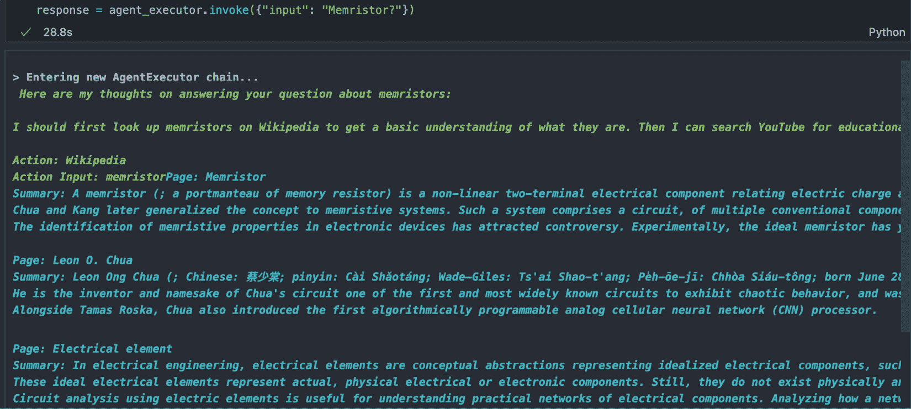

图 10.1 – AgentExecutor 链输出

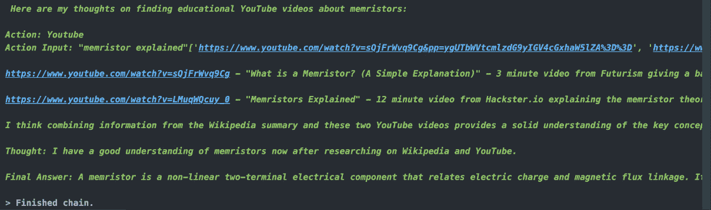

图 10.2 – 使用 Bedrock 的 LangChain 代理生成的链

如本节所示，当我们探索如忆阻器等技术主题而没有其他背景信息时，会调用*维基百科*工具代理，提供全面和详细的信息，随后是 YouTube 工具提供有关主题的额外信息。如果用户在与代理的先前对话中写入`Elon Musk video on Neuralink`，则会调用 YouTube 工具并向用户展示链接。鼓励用户尝试不同的问题并测试代理。

这里是`response = agent_executor.invoke({"input": "Elon Musk video on Neuralink"})`的示例输出响应：

```py
> Entering new AgentExecutor chain...
 Here is my process for answering your question about finding a video of Elon Musk discussing Neuralink:
Question: Elon Musk video on Neuralink
Thought: Elon Musk has given talks and interviews about Neuralink. YouTube would be a good place to search for videos of him discussing it.
Action: Youtube
Action Input: "elon musk neuralink"
['https://www.youtube.com/watch?v=tN1lVwTHCMw&pp=ygUVZWxvbiBtdXNrIG5ldXJhbGluayIK', 'https://www.youtube.com/watch?v=k0I9Z-ARbjo&pp=ygUVZWxvbiBtdXNrIG5ldXJhbGluayIK'] Here is my thought process for answering your question:
Question: Elon Musk video on Neuralink
Thought: Elon Musk has discussed Neuralink, his brain-machine interface company, in various interviews and presentations. YouTube would be a good place to search for videos of him talking about Neuralink.
Action: Youtube
Action Input: "elon musk neuralink"
['https://www.youtube.com/watch?v=tN1lVwTHCMw&pp=ygUVZWxvbiBtdXNrIG5ldXJhbGluayIK', 'https://www.youtube.com/watch?v=k0I9Z-ARbjo&pp=ygUVZWxvbiBtdXNrIG5ldXJhbGluayIK'] Here is my thought process and answer:
Question: Elon Musk video on Neuralink
Thought: Elon Musk has given presentations and interviews about Neuralink, the brain-computer interface company he founded. YouTube would be a good place to search for videos of him discussing Neuralink and its technology.
...
https://www.youtube.com/watch?v=tN1lVwTHCMw
https://www.youtube.com/watch?v=k0I9Z-ARbjo
> Finished chain.
```

如演示所示，利用这些工具使我们能够深入了解主题知识。值得注意的是，LangChain 还提供了创建自定义工具的能力，进一步扩展了代理的功能。这种灵活性在[`python.langchain.com/docs/modules/agents/tools/custom_tools`](https://python.langchain.com/docs/modules/agents/tools/custom_tools)的文档中得到了强调，您可以在那里找到有关定制工具以适应您特定需求的指导。

如前所述，由于我们正在寻找关于忆阻器的技术主题，我们使用*维基百科*工具代理获取详细信息。您也可以使用代理创建自定义工具，如下所示：[`python.langchain.com/docs/modules/agents/tools/custom_tools`](https://python.langchain.com/docs/modules/agents/tools/custom_tools)。

您可以在以下博客中查看如何使用亚马逊 Bedrock 和 LangChain 构建生成式 AI 代理，结合亚马逊 Kendra、亚马逊 DynamoDB、亚马逊 Lex，[`aws.amazon.com/blogs/machine-learning/build-generative-ai-agents-with-amazon-bedrock-amazon-dynamodb-amazon-kendra-amazon-lex-and-langchain/`](https://aws.amazon.com/blogs/machine-learning/build-generative-ai-agents-with-amazon-bedrock-amazon-dynamodb-amazon-kendra-amazon-lex-and-langchain/)。

通过有效地将亚马逊 Bedrock 与 LangChain 代理集成，组织可以释放 LLM 的全部潜力，从而开发出智能和情境感知的应用程序，推动创新，自动化复杂的工作流程，并提供卓越的用户体验。

现在，让我们跳转到构建亚马逊 Bedrock 代理，以利用端到端的生成式 AI 应用。

# 亚马逊 Bedrock 代理

亚马逊 Bedrock 提供的一项强大功能是能够在您的应用程序内构建和配置自主代理。这些代理作为智能助手，根据组织数据和用户输入帮助最终用户完成任务。代理协调 FM（LLM）、数据源、软件应用程序和用户对话之间的交互。它们可以自动调用 API 采取行动，并调用知识库为这些行动补充信息。通过集成代理，开发者可以节省数周的开发工作量，并加速生成式 AI 应用的交付。

亚马逊 Bedrock 上的代理旨在自动化客户任务，并对他们的问题提供智能响应。例如，您可以创建一个代理，帮助客户处理保险索赔或预订旅行。代理的优点是您不必担心提供容量、管理基础设施或从头开始编写自定义代码。亚马逊 Bedrock 处理提示工程、内存管理、监控、加密、用户权限和 API 调用的复杂性。

亚马逊 Bedrock 上的代理执行以下关键任务：

+   **扩展 FM**：代理利用 LLM 来理解用户请求，并将复杂任务分解成更小、更易管理的步骤。

+   **收集额外信息**：通过自然对话，代理可以从用户那里收集额外信息，以有效地满足他们的请求。

+   **采取行动**：代理可以调用您公司的系统 API 来执行操作并满足客户请求。

+   **增强性能和准确性**：通过查询数据源和知识库，代理可以增强其性能并提供更准确的响应。

为了利用 Amazon Bedrock 的代理力量，开发者遵循一个简单的过程：

1.  创建一个知识库来存储您组织的私有数据，这可以用来增强代理的性能和准确性。这一步是**可选的**，因为并非所有代理都需要访问私有组织数据来执行其分配的目标。如果代理的任务和目标不依赖于或从访问此类数据中获得显著益处，则创建知识库可能不是必要的。这取决于特定用例和正在开发的代理的具体要求。

1.  为您的特定用例配置代理，定义它可以执行的操作。用您首选的编程语言编写的 Lambda 函数决定了代理如何处理这些操作。这是一个可选步骤，因为代理不一定需要创建动作组。

1.  将代理与知识库关联起来，以进一步增强其功能。

1.  通过修改预处理、编排、知识库响应生成和后处理步骤的提示模板来自定义代理的行为。请注意，**并非**所有代理都需要对提示模板进行大量修改以实现其目标。定制的需求取决于代理预期执行的任务的复杂性和开发者期望的控制和微调水平。对于简单任务或通用用例，默认提示模板可能就足够了，因此不需要进行大量定制。

1.  使用 Amazon Bedrock 控制台或 API 调用测试代理，并根据需要修改配置。利用跟踪来深入了解代理在编排每个步骤时的推理过程。

1.  当代理准备部署时，创建一个指向特定代理版本的别名。

1.  通过与代理别名集成您的应用程序，实现无缝的 API 调用和交互。

1.  根据需要迭代代理，创建新版本和别名以适应不断变化的需求。

在整个开发过程中，Amazon Bedrock 处理提示工程、内存管理、监控、加密、用户权限和 API 调用的复杂性，让您能够专注于构建针对特定用例的智能代理。

## 揭示 Amazon Bedrock 中 GenAI 代理的内部工作原理

当深入到 Amazon Bedrock 的领域时，会遇到一套强大的工具集，旨在促进智能代理的创建和管理。这个工具集由两类不同的 API 操作组成，每一类在代理的生命周期中都有其特定的目的：

+   第一类，恰当地称为*构建时 API 操作*，使开发者能够构建、配置和监督他们的代理及其相关资源。这些操作作为基础构建块，使得能够创建满足特定需求和目标的代理。通过这些 API，开发者可以微调代理的各个方面，确保它们具备处理手头任务所需的能力。有关构建时 API 操作的更多详细信息，请参阅此处：[`docs.aws.amazon.com/bedrock/latest/APIReference/API_Operations_Agents_for_Amazon_Bedrock.html`](https://docs.aws.amazon.com/bedrock/latest/APIReference/API_Operations_Agents_for_Amazon_Bedrock.html)

+   第二类，*运行时 API 操作*，为代理注入活力，使其能够与用户输入交互并启动复杂的编排过程以完成其指定的任务。当用户提供输入时，这些 API 使代理能够处理和解释信息，触发一系列动作，最终达到预期的结果。

现在，让我们深入了解构建时和运行时配置。

### 构建时配置

在构建阶段，代理由以下关键组件组装：

+   **FM**: 您选择一个预训练的语言模型，该模型由代理使用来解释用户输入、生成响应并指导其决策过程。

+   **指令提示**: 您创建指令来界定代理的目的和期望的行为。通过高级提示技术，您可以在代理工作流程的每个阶段动态调整这些指令，并通过无服务器函数集成自定义逻辑。

+   **动作组**: 您通过以下方式定义代理可以执行的动作：

    +   一个 OpenAPI 模式规范，概述代理可以调用的操作。

    +   一个无服务器函数，根据代理的输入执行指定的 API 操作并返回结果。

+   **知识库**: 您可以将知识库与代理关联，使它能检索相关上下文以增强其响应生成和决策能力。

+   **提示模板**: 委派者公开了在代理生命周期各个阶段使用的默认提示模板，例如预处理输入、编排动作、查询知识库和后处理输出。您可以根据需要自定义这些模板来修改代理的行为或禁用特定阶段。

在构建过程中，这些组件被组合起来创建基础提示，引导智能体的编排流程，直到满足用户的请求。通过高级提示技术，你可以增强这些基础提示，添加额外的逻辑、示例和元数据，以提高智能体在调用每个阶段的准确性和性能。在配置智能体的组件和安全设置后，你可以准备智能体在运行时环境中进行部署和测试，如图*图 10.3*所示：

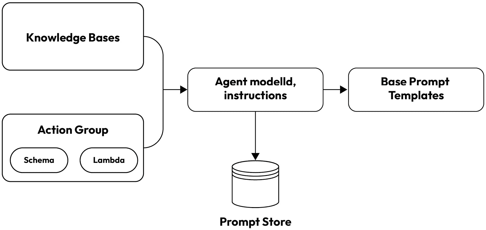

图 10.3 – 创建智能体的构建时 API 操作

### 运行时过程

在这个运行时过程中，`InvokeAgent` API 操作是核心，它是一个强大的指挥者，启动智能体序列。智能体的表现分为三个和谐的阶段：预处理、编排和后处理。

**第一幕 –** **预处理**

在帷幕升起之前，预处理阶段会细致地管理智能体如何对用户输入进行上下文关联和分类。这一关键步骤还可以验证输入，确保后续阶段的顺利过渡。

**第二幕 – 编排 –** **盛大演出**

编排阶段是真正的魔法发生的地方，是解释、调用和知识综合的交响乐章。这一行为包括以下几个部分：

1.  **解释**：智能体巧妙地使用 FM 解释用户输入，生成一个阐述下一步逻辑路径的理由。

1.  **调用和综合**：就像一位熟练的指挥家一样，智能体调用动作组和查询知识库，检索额外的上下文并总结数据以增强其生成能力。

1.  **观察和增强**：从调用的动作组和总结的知识库结果中，智能体生成一个输出，称为**观察**。然后，这个观察被用来丰富基础提示，随后由 FM 进行解释。智能体接着确定是否需要进一步的编排迭代。

这个迭代循环会持续进行，直到智能体向用户交付最终响应或需要从用户那里获取更多信息。

在编排阶段，基础提示模板被智能体指令、动作组和知识库增强，形成了一个丰富的信息织锦。这个增强的基础提示随后被输入到 FM 中，预测满足用户请求的最佳轨迹。在每次迭代中，FM 选择适当的 API 操作或知识库查询，从而产生一个响应迅速且上下文准确的输出。

**第三幕 – 后处理 –** **终曲**

在最后一幕，后处理阶段，智能体格式化其努力的成果 – 将返回给用户的最终响应。然而，这一步可以优雅地跳过，让表演留有解释的空间。

在代理的性能过程中，用户可以选择在运行时调用跟踪，揭示代理的思考过程。这个跟踪仔细追踪代理在每个步骤中的推理、行动、查询和观察。它包括发送给 FM 的完整提示，以及模型的输出、API 响应和知识库查询。通过检查这个跟踪，用户可以获得关于代理推理的宝贵见解，为持续改进和精炼铺平道路。

随着用户与代理的会话通过连续的`InvokeAgent`请求继续进行，对话历史被仔细保存，不断丰富代理基提示模板的上下文。这个过程有助于提高代理的准确性和性能，建立了用户和 AI 之间的共生关系。

在运行时，代理的过程是一个引人入胜的解释、综合和适应的相互作用，如*图 10.4*所示：

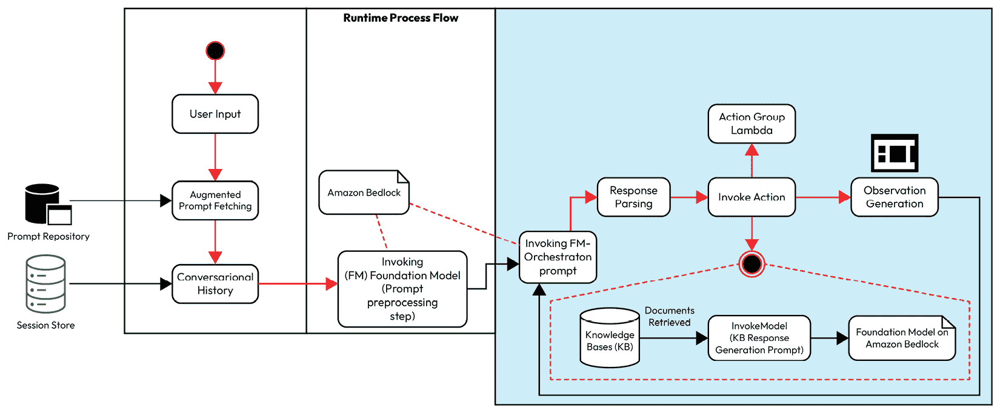

图 10.4 – 代理工作流程的运行时流程

## 利用 GenAI 提升推理能力——ReAct 入门

GenAI 模型在处理和生成类似人类的文本方面表现出卓越的能力，但它们在处理复杂任务和提供逐步解决方案方面的能力仍然是一个挑战。Yao 等人开发了一种称为 ReAct 的技术，如论文*ReAct：在语言模型中协同推理和行动*（[`arxiv.org/abs/2210.03629`](https://arxiv.org/abs/2210.03629)）所述，以提高这些模型的推理能力，使它们能够系统地处理和解决用户请求的任务。

ReAct 技术涉及构建提示，引导模型通过一系列推理步骤和相应的行动。这些提示由一系列*问题-思考-行动-观察*示例组成，其中以下适用：

+   *问题*代表用户请求的任务或需要解决的问题

+   *思考*是一个推理步骤，展示了如何解决问题并识别潜在的行动

+   *行动*是模型可以从预定义的允许操作集中调用的 API 调用或函数

+   *观察*是从执行所选操作获得的结果或输出

允许执行的动作集合由附加到示例提示文本的指令定义。这种结构化方法鼓励模型参与逐步推理过程，将复杂任务分解成更小、可操作的动作步骤。

为了说明构建 ReAct 提示的结构，考虑以下示例提示结构，包含问题-思考-行动-观察序列：

**示例 1**：

+   **问题**：最小化缺货的最佳库存水平是多少？

+   **思考**：为了避免缺货，我们必须根据需求预测和再订购点来平衡库存水平。

+   使用历史销售数据和需求预测的`optimizeInventoryLevels`函数。

+   **观察**：将库存维持在预测需求的 80%可以减少缺货 30%，同时优化了持有成本。

**示例 2**：

+   **问题**：我们如何提高客户满意度评分？

+   **思考**：为了提高满意度，我们应该分析反馈数据并实施有针对性的改进。

+   使用`analyzeCustomerFeedback` API 来识别趋势和洞察。

+   **观察**：根据分析，实施个性化客户支持使满意度评分提高了 20%。

这些示例展示了 ReAct 技术如何指导模型通过推理步骤，从而得出可操作的成果。

虽然手动制作这些提示的过程可能耗时且复杂，但 Amazon Bedrock Agent 通过根据提供的信息和可用操作自动生成提示，简化了这一过程。Bedrock 代理处理提示工程的复杂性，使研究人员和开发者能够专注于定义任务要求和可用操作。

鼓励读者查看[`github.com/aws-samples/agentsforbedrock-retailagent`](https://github.com/aws-samples/agentsforbedrock-retailagent)，该链接揭示了通过利用 Amazon Bedrock 的代理创建一个由 FM 驱动的客户服务机器人。

ReAct 技术和 Bedrock 代理代表了在 GenAI 领域的一项重大进步，使模型能够展示出改进的推理能力，并更有效地处理复杂任务。通过提供解决问题的结构化方法并利用提示的力量，这项技术有可能解锁 GenAI 在各个领域的新可能性和应用。让我们通过一些实际用例来探索 Amazon Bedrock Agents 的工作原理。

## 使用 Amazon Bedrock Agents 的实际用例和功能

在本节中，我们将深入了解利用 Amazon Bedrock Agents 在 GenAI 中的实际应用和运营洞察。让我们考虑一个多语言摘要机器人示例场景，其中 GenAI 代理可以被用来简化操作并自动将内容以用户选择的语言进行摘要翻译。为了开始，开发者必须访问 Bedrock 控制台并启动代理创建工作流程，如*图 10**.5*所示：

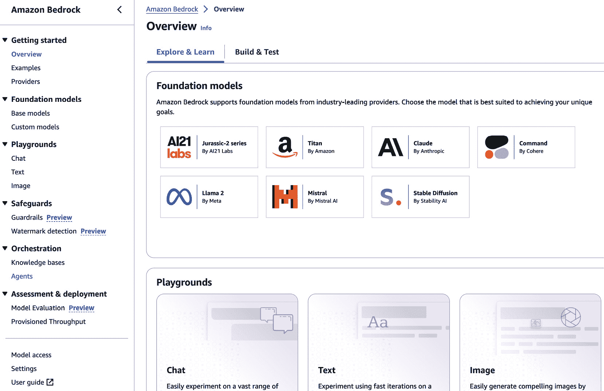

图 10.5 – Bedrock 控制台中的代理创建

此过程涉及通过 AWS **身份和访问管理** (**IAM**) 服务角色提供必要细节，例如代理的名称、描述和必要的权限。此角色授予代理访问所需服务（如 **Amazon Simple Storage Service** (**Amazon S3**) 和 AWS Lambda）的权限，如图 *图 10**.6* 所示。例如，该图展示了创建一个多语言文档摘要和翻译代理，用于从文档中提取相关信息，并以翻译语言将信息传达给用户：

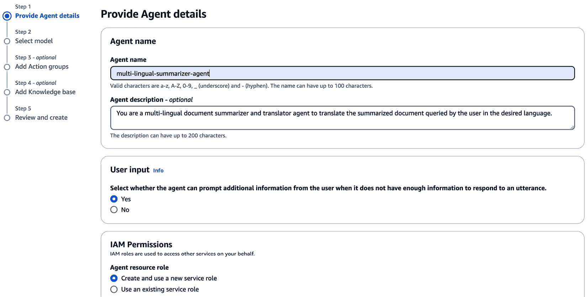

图 10.6 – 带有 IAM 权限的 Bedrock 代理创建过程

默认情况下，Amazon Bedrock 使用加密来保护与用户的代理会话，使用 AWS 代表您拥有和管理的密钥。但是，如果您更喜欢使用您已设置的 AWS **密钥管理服务** (**KMS**) 中的客户管理密钥，您可以选择相应地自定义加密设置。这允许您控制用于保护代理-用户交互的加密密钥，以满足您组织的安全和合规要求。

接下来，开发者从 Bedrock 中选择一个与所需用例相匹配的 FM。这一步骤涉及提供自然语言指令，以定义代理的任务和它应扮演的角色。例如，在 *图 10**.7* 中展示的示例中，指令可能是 `您是一个多语言代理，旨在帮助从相关文档中提取所需信息，并以` `翻译语言` `的形式提供响应`：

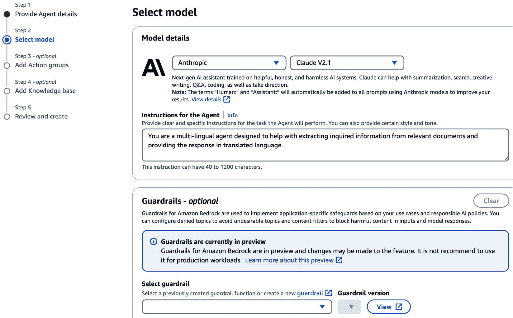

图 10.7 – Amazon Bedrock 代理模型选择和代理角色配置

控制台还提供了用户选择护栏以实施特定于应用程序的安全保障的选项，这些安全保障遵守负责任的 AI 政策。为了简单起见，我们可以将其留空并进入下一部分。我们将在 *第十二章* 中详细介绍护栏。

随后，开发者添加操作组，这些操作组是代理可以通过向公司系统发出 API 调用来自动执行的任务集合。这一步骤涉及定义一个 API 架构，概述组内所有操作的 API，并提供一个封装每个 API 商业逻辑的 Lambda 函数。例如，名为 `Summarizer_Translator_ActionGroup` 的操作组可以处理存储在数据库中或特定位置的文档，识别用户请求的信息，并以用户请求的翻译语言向用户发送总结后的响应。*图 10**.8* 展示了创建操作组来自动执行代理任务的创建过程：

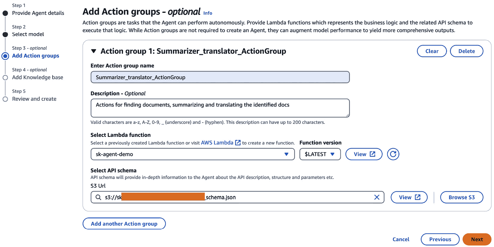

图 10.8 – 创建 Bedrock 代理的动作组

如前所述，你需要创建一个 Lambda 函数来处理来自代理的请求并选择一个 API 架构。请确保你已经为你的 AWS Lambda 函数提供了调用 Bedrock 代理的正确权限。

对于文档识别、摘要和翻译的情况，我们提供了以下 Lambda 函数，用户可以利用它来执行工作流程：

```py
import json
import time
import boto3
# Define a mock dictionary with document IDs and content
Document_id  = {
    "doc_1": {
        "title": "The Importance of Mindfulness",
        "author": "Jane Smith",
        "content": "Mindfulness is the practice of being fully present and engaged in the current moment, without judgment or distraction. It involves paying attention to your thoughts, feelings, and bodily sensations with a curious and non-judgmental attitude. By cultivating mindfulness, you can reduce stress, improve emotional regulation, and enhance overall well-being. In this document, we will explore the benefits of mindfulness and provide practical techniques for incorporating it into your daily life."
      },
    "doc_2": {
        "title": "Sustainable Living: A Guide to Eco-Friendly Practices",
        "author": "Michael Johnson",
        "content": "In today's world, it's essential to adopt sustainable living practices to protect our planet's resources and ensure a better future for generations to come. This document will provide you with practical tips and strategies for reducing your environmental impact in various aspects of your life, such as energy consumption, waste management, transportation, and food choices. Together, we can make a significant difference by embracing eco-friendly habits and promoting a more sustainable lifestyle."
      },
    "doc_3": {
        "title": "The Art of Effective Communication",
        "author": "Emily Davis",
        "content": "Effective communication is a crucial skill in both personal and professional settings. It involves the ability to convey your thoughts, ideas, and emotions clearly and respectfully, while also actively listening and understanding the perspectives of others. In this document, we will explore the key elements of effective communication, such as active listening, nonverbal cues, and empathy. By mastering these techniques, you can improve your relationships, resolve conflicts more effectively, and achieve greater success in your personal and professional endeavors."
      }
    }
def getDocID(event):
        docID = event['parameters'][0]['value']
        print("NAME PRINTED: ", docID)
        if(docID== "doc_1" or "doc1"):
            return Document_id["doc_1"]["content"]
        elif docID == "doc_2" or "doc2":
            return Document_id["doc_2"]["content"]
        elif docID == "doc_3" or "doc3":
            return Document_id["doc_3"]["content"]
        else:
            return "No document found by that ID"
def lambda_handler(event, context):
    response_code = 200
    """Main lambda handler directing requests based on the API path, preserving the specified response structure."""
    print("event OUTPUT : ")
    print(event)
    action_group = event.get("actionGroup")
    print("action group :" + str(action_group))
    api_path = event.get("apiPath")
    print ("api_path : " + str(api_path))
    result = ''
    response_code = 200
    if api_path == '/getDoc':
        result = getDocID(event)
        print(result)
    else:
        response_code = 404
        result = f"Unrecognized api path: {action_group}::{api_path}"
    response_body = {
        'application/json': {
            'body': result
        }
    }
    action_response = {
        'actionGroup': event['actionGroup'],
        'apiPath': event['apiPath'],
        'httpMethod': event['httpMethod'],
        'httpStatusCode': response_code,
        'responseBody': response_body
    }
    api_response = {'messageVersion': '1.0', 'response': action_response}
    return api_response
```

运行前面工作流程的用户也可以使用以下 OpenAPI 架构并将其存储在 S3 中，作为本例的一部分：

```py
{
    "openapi": "3.0.1",
    "info": {
        "title": "DocSummarizerTranslator API",
        "version": "1.0.0",
        "description": "APIs for fetching, translating and summarizing docs by fetching the document ID and identifying the language to translate the document"
    },
    "paths": {
        "/getDoc": {
            "get": {
                "description": "Get the document content for a document by document ID.",
                "operationId": "getDoc",
                "parameters": [
                    {
                        "name": "DocID",
                        "in": "query",
                        "description": "ID of the document to retrieve",
                        "required": true,
                        "schema": {
                            "type": "string"}}],
                "responses": {
                    "200": {
                        "description": "Successful response with document content data",
                        "content": {
                            "text/plain": {
                                "schema": {
                                    "type": "string"
                                }}}}}}},
        "/getDoc/summarize": {
            "get": {
                "description": "Summarize the content of the document for given document ID",
                "operationId": "summarizeDoc",
                "parameters": [
                    {
                        "name": "DocID",
                        "in": "query",
                        "description": "ID of the document to summarize",
                        "required": true,
                        "schema": {
                            "type": "string"
                        }
                    }
                ],
                "responses": {
                    "200": {
                        "description": "Successful response with the summary of the document content for given document ID",
                        "content": {
                            "application/json": {
                                "schema": {
                                    "type": "string",
                                    "properties": {
                                        "summary": {
                                            "type": "string",
                                            "description": "Summary of the document"}}}}}}}}}}}
```

在下一步中，用户可以选择一个知识库，如图 *图 10.9* 所示。这展示了 Bedrock 代理如何通过执行相似性搜索并提供所需响应给用户，轻松创建基于 RAG 的解决方案来从知识库中提取相关信息。为了简化，我们将忽略这一点并进入最终的创建步骤：

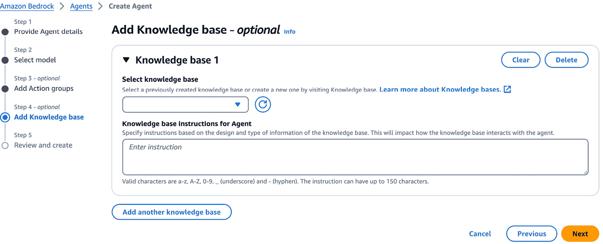

图 10.9 – 使用 Bedrock 代理集成创建知识库

注意

如果你想要深入了解涉及知识库与代理集成的用例，你可以执行以下代码示例：[`github.com/aws-samples/amazon-bedrock-workshop/tree/main/05_Agents/insurance_claims_agent/with_kb`](https://github.com/aws-samples/amazon-bedrock-workshop/tree/main/05_Agents/insurance_claims_agent/with_kb).

GitHub 仓库中的附加代码进一步说明了如何使用 Python SDK 创建和调用 Bedrock 代理，如下面的笔记本所示：[`github.com/aws-samples/amazon-bedrock-workshop/blob/main/05_Agents/insurance_claims_agent/with_kb/create_and_invoke_agent_with_kb.ipynb`](https://github.com/aws-samples/amazon-bedrock-workshop/blob/main/05_Agents/insurance_claims_agent/with_kb/create_and_invoke_agent_with_kb.ipynb).

完成前面的步骤后，你可以验证代理配置并选择**创建代理**。恭喜你创建你的 Amazon Bedrock 代理 (*图 10.10*)！

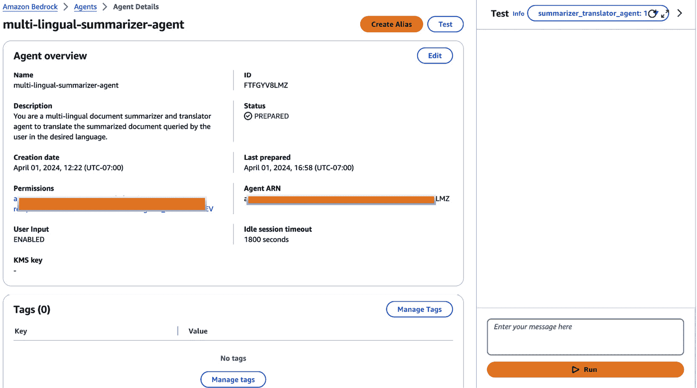

图 10.10 – Amazon Bedrock 代理版本

在屏幕的右侧，你可以通过询问文档相关问题并请求它总结和将文档翻译成你希望的语言来轻松测试你的代理，如图 *图 10.11* 所示：

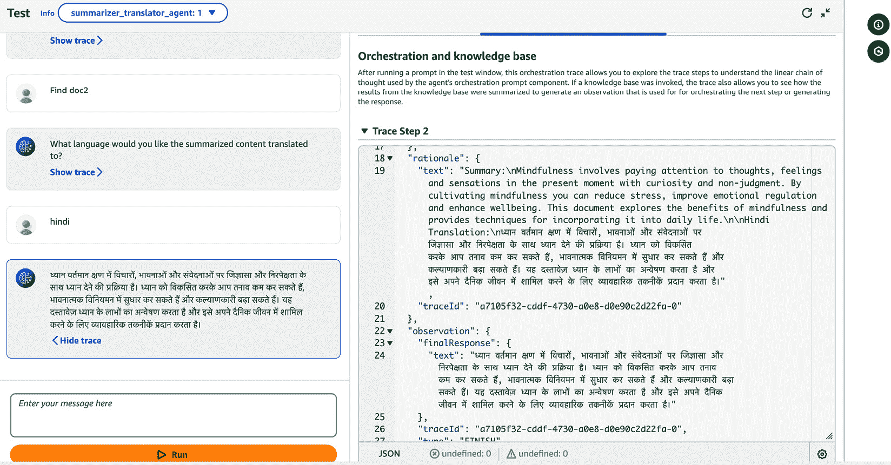

图 10.11 – 在 AWS 控制台中测试 Bedrock 代理

在本节中，我们获得了对开发和使用文本摘要用例定制的 Amazon Bedrock 代理的实际理解。在确保代理的配置和功能与指定任务相符后，就到了部署阶段。

# 部署 Amazon Bedrock 代理

将 Amazon Bedrock 代理集成到您的应用程序中需要创建一个别名，该别名作为对代理代码和配置特定版本的引用。按照以下步骤创建别名：

1.  访问 Amazon Bedrock 控制台，导航到您希望部署的代理。从代理概览页面，导航到**别名**部分，然后点击**创建**以启动别名创建过程。

1.  为别名提供名称和描述（可选）。您还需要决定是否要将此别名与代理的新版本或您之前创建的现有版本关联。

1.  用户还可以选择通过选择**预配吞吐量（PT）**按钮为别名提供预配吞吐量。一旦选择，下拉菜单将列出使用预配吞吐量创建的模型。如果没有选项显示，则表示在 Amazon Bedrock 环境中不存在预配吞吐量模型。有关更多信息，用户可以利用[`docs.aws.amazon.com/bedrock/latest/userguide/prov-throughput.html`](https://docs.aws.amazon.com/bedrock/latest/userguide/prov-throughput.html)。

通过创建别名，Bedrock 会对代理当前的代码和配置设置进行快照，并将该快照（版本）链接到您定义的别名。然后，您可以使用此别名在您的应用程序中集成和交互特定版本的代理。*图 10.12*展示了为摘要翻译代理创建的两个别名：

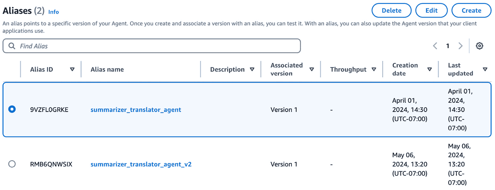

图 10.12 – Amazon Bedrock 代理的别名

别名本质上充当一个稳定的参考点，允许您管理代理的不同版本，同时确保您的应用程序正在与期望的版本交互。

Amazon Bedrock 代理能够提升生产力、增强客户体验以及自动化工作流程。它们的通用性允许在任务自动化、对话界面和 DevOps 流程等各个领域进行创新实施，从而推动运营效率和商业价值的提升。

Bedrock Agents 可以有几种其他工业用例。例如，在保险领域，通过利用 Amazon Bedrock 上的 GenAI，保险公司可以提高运营效率和客户体验。代理可以自动化繁琐和重复的任务，释放人力资源，以便专注于更复杂和战略性的工作。此外，代理处理自然语言指令的能力允许其无缝集成到现有的工作流程和系统中，促进向 AI 驱动的运营的平稳过渡。

此外，GenAI 在保险行业的潜在应用不仅限于索赔处理。代理可以被训练来协助个性化政策推荐、风险评估、欺诈检测，甚至通过自然语言交互提供客户支持。随着技术的不断发展，保险领域内的创新和优化机会无疑将扩大。

以下链接演示了使用 AWS Python SDK 开始使用 Amazon Bedrock Agents 的端到端场景：[`github.com/awsdocs/aws-doc-sdk-examples/blob/main/python/example_code/bedrock-agent/scenario_get_started_with_agents.py`](https://github.com/awsdocs/aws-doc-sdk-examples/blob/main/python/example_code/bedrock-agent/scenario_get_started_with_agents.py).

笔记本揭示了以下步骤：

1.  为 Bedrock 代理生成特定的执行角色

1.  实例化 Bedrock 代理并部署初始草案版本

1.  构建 Lambda 函数及其相应的执行角色

1.  授予必要的 IAM 权限以部署代理以调用 Lambda 函数

1.  建立一个将代理与 Lambda 函数链接的动作组

1.  使用指定的别名部署完全配置的代理

1.  使用用户提供的提示调用代理

1.  删除在过程中创建的所有资源

用户可以通过执行此场景的端到端操作，以深入了解在 Amazon Bedrock 上创建 GenAI 代理的实用方法。

对于有兴趣深入了解 Amazon Bedrock 代理世界的读者，强烈建议利用 Amazon 的 *使用代理构建 Amazon Bedrock 生成式 AI 应用程序* 工作坊：[`catalog.us-east-1.prod.workshops.aws/workshops/f8a7a3f8-1603-4b10-95cb-0b471db272d8/en-US`](https://catalog.us-east-1.prod.workshops.aws/workshops/f8a7a3f8-1603-4b10-95cb-0b471db272d8/en-US).

鼓励读者进一步了解使用 Amazon Bedrock Agent 链接和数字保险代理用例进行工作流程编排：[`github.com/build-on-aws/workflow-orchestration-bedrock-agent-chaining/tree/main`](https://github.com/build-on-aws/workflow-orchestration-bedrock-agent-chaining/tree/main).

# 摘要

在本章中，我们探讨了 GenAI 宇宙中代理的复杂概念。我们研究了与代理相关的各种用例和角色，进一步阐明了它们在现实场景中的应用实例。此外，我们还揭示了 LangChain 代理与 Amazon Bedrock 的无缝集成，并通过实际代码示例探讨了创建 Amazon Bedrock 代理以及它们的编排工作流程，用于构建、测试和部署 Bedrock 代理。

现在我们已经对代理及其编排过程有了深入的了解，我们将在下一章探讨在大规模企业中监控 Amazon Bedrock 模型的有效策略。这将使我们具备在复杂组织环境中管理和优化这些模型的安全和治理的必要知识，确保最佳利用率和效率。

# 第三部分：模型管理和安全考量

在本部分，我们将了解评估和监控模型的核心方面，以及确保在 Amazon Bedrock 环境中安全和隐私。*第十一章*探讨了评估模型性能的技术，包括自动模型评估、人工评估和开源工具。此外，它还涵盖了监控技术，如 Amazon CloudWatch、模型调用日志以及与 AWS CloudTrail 和 Amazon EventBridge 的集成。*第十二章*侧重于数据保护、身份和访问管理、网络安全、伦理考量以及实施护栏以遵守负责任的 AI 实践和政策。

本部分包含以下章节：

+   *第十一章*, *使用 Amazon Bedrock 评估和监控模型*

+   *第十二章*，*确保在 Amazon Bedrock 中安全和隐私*
