# 第十二章：在 Amazon Bedrock 中确保安全和隐私

生成式 AI（GenAI）正在取得显著进展，使机器能够在各个领域产生类似人类的内容，包括文本、图像甚至代码。然而，人们对使用 GenAI 模型的风险和挑战以及数据处理方式存在担忧。在本章中，我们将探讨 Amazon Bedrock 的安全、隐私和**限制措施**。

在当今的数字景观中，确保数据隐私和安全是首要任务，Amazon Bedrock 已经实施了强有力的措施来应对这一关切。我们将探讨数据本地化、隔离和加密，并学习确保您的数据始终位于指定的 AWS 区域，不会被共享或存储，并通过强大的加密协议得到保护。然后，我们将了解 Amazon Bedrock 如何与 AWS IAM 集成，以提供对访问权限的细粒度控制，确保只有授权人员才能与您的资源交互。

此外，我们将讨论道德规范和限制措施，使您能够实施与安全和负责任的 AI 政策相一致的安全保障，例如内容过滤器、禁止话题、单词过滤器以及敏感信息过滤器。

本章将涵盖的关键主题包括：

+   安全和隐私概述

+   数据加密

+   AWS IAM

+   保护网络

+   网络流量

+   道德规范

+   Amazon Bedrock 的限制措施

# 技术要求

本章要求您拥有 AWS 账户访问权限。如果您还没有，可以访问[`aws.amazon.com/getting-started/`](https://aws.amazon.com/getting-started/)创建 AWS 账户。

其次，您需要设置 AWS Python SDK（Boto3），您可以通过访问[`docs.aws.amazon.com/bedrock/latest/APIReference/welcome.html`](https://docs.aws.amazon.com/bedrock/latest/APIReference/welcome.html)来完成此操作。

您可以以任何方式执行 Python 设置：在本地机器上安装它，或使用 AWS Cloud9，或利用 AWS Lambda，或利用 Amazon SageMaker。

备注

与 Amazon Bedrock 的 FMs 调用和定制相关的费用将会产生。请参阅[`aws.amazon.com/bedrock/pricing/`](https://aws.amazon.com/bedrock/pricing/)以获取更多信息。

# 安全和隐私概述

Amazon Bedrock 的核心安全原则之一是，作为 Amazon Bedrock 的用户，您始终控制着自己的数据。您的数据永远不会与其他用户或客户共享，也永远不会用于改进或训练 FMs。让我们看看 Amazon Bedrock 提供的复杂保护层：

+   **数据本地化**：模型定制的推理数据或训练数据始终保留在您所使用的 AWS 区域内。这意味着所有 API 请求和数据处理都仅在该指定区域内进行，消除了数据迁移或超出指定边界暴露的风险。这种区域隔离确保您的数据永远不会离开指定的地理边界，因此您获得额外的保护层，并符合区域数据法规。

+   **数据隔离**：您用于模型定制的推理数据或训练数据存储在 Amazon S3 中，但永远不会保留在服务管理的账户中，消除了意外泄露、未经授权访问或第三方（包括模型供应商或 AWS 本身）滥用数据的风险。存储的唯一信息涉及操作指标，例如用于计费目的的使用数据和用于控制台功能的元数据。

+   **加密**：在加密数据方面，Amazon Bedrock 采用强大的加密协议来保护信息。服务内、外部的所有通信在传输过程中都进行了加密，最低要求为 TLS 1.2，并建议使用 TLS 1.3。此外，Amazon Bedrock 鼓励您使用自己的 KMS 密钥加密存储在 Amazon S3 存储桶中的定制训练数据和自定义模型，确保只有拥有正确凭证的授权方才能访问和使用这些资源。

+   **IAM**：Amazon Bedrock 与 AWS IAM 的集成赋予您对访问权限的细粒度控制。您可以有选择地允许或拒绝对特定模型、特定 API 调用、模型定制作业或 Amazon Bedrock 本身的访问。这种细粒度的访问控制确保只有授权人员才能与您的资源交互，最大限度地降低未经授权访问或意外修改的风险。

+   **全面的监控和日志记录**：正如我们在*第十一章*中看到的，透明度和可审计性是数据隐私和保护的基本组成部分。Amazon Bedrock 提供全面的监控和日志记录功能，因此您可以跟踪使用指标，使用 Amazon CloudWatch 构建自定义仪表板，并通过 AWS CloudTrail 监控 API 活动。这些功能为您提供了关于数据使用的宝贵见解，有助于故障排除并确保符合监管要求。

+   **合规标准**：Amazon Bedrock 致力于符合数据隐私和保护行业标准。它拥有多个认证，如**GDPR**（**通用数据保护条例**）、**HIPAA**（**健康保险可携带性和问责制法案**）、**SOC**（**系统和组织控制**）1、2 和 3、**ISO**（**国际标准化组织**）、**STAR**（**安全信任保证和风险**）以及**PCI-DSS**（**支付卡行业数据安全标准**）。全面的合规态势使您能够有信心地利用 Amazon Bedrock，知道您的数据受到保护，并且按照行业最佳实践和监管要求进行处理。

接下来，让我们看看如何通过数据加密来保护数据。

# 数据加密

如果您之前使用过 AWS 服务，您可能熟悉**AWS 共享责任模型**，其中 AWS 管理和负责保护底层云基础设施，而您负责保护在此基础设施上托管的数据和应用。如果您想了解 AWS 共享责任模型，您可以访问[`aws.amazon.com/compliance/shared-responsibility-model/`](https://aws.amazon.com/compliance/shared-responsibility-model/)。

当涉及到保护数据时，您可以使用 AWS KMS 对它们进行加密，或者您也可以在写入 AWS 资源之前在客户端进行加密。让我们看看您可以执行的不同资源的加密，以保护您的数据：

+   **知识库**：KMS 可用于加密知识库中处于传输状态的数据。在创建或更新数据源时，您可以提供 KMS 密钥的 ARN 来加密导入的数据，确保您的知识库内容的机密性。*图 12.1*展示了可用于与 KMS 一起使用的**高级设置**。

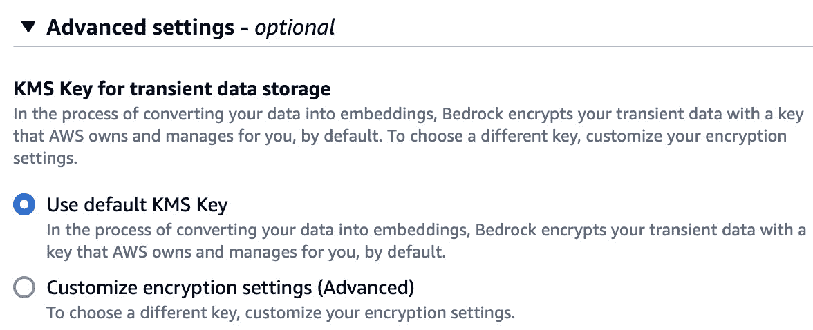

图 12.1 – 用于临时数据存储的 KMS 密钥

如前图所示，当您创建或更新知识库的数据源时，您可以指定是否使用默认的 AWS 管理的 KMS 密钥或**自定义加密设置**，在那里您可以选择自己的客户管理的 KMS 密钥。知识库的加密可以在多个阶段发生。在数据导入阶段，Bedrock 使用 KMS 加密密钥来保护临时数据存储。这种临时存储有助于安全地导入您的数据源，确保您的信息在传输过程中保持受保护。

如果您将 OpenSearch 配置为知识库的向量索引，传递给此服务的信 息也将使用 KMS 密钥进行加密，提供额外的安全层。此外，Bedrock 将其加密功能扩展到与您的知识库相关的以下资源：

+   **S3 存储桶中的数据**：通过使用 KMS 密钥加密这些资源，您可以确保您的宝贵数据保持机密性，并且不会被未经授权的第三方访问。

    您可以通过附加以下 IAM 策略到 Amazon Bedrock 服务角色，允许 Amazon Bedrock 解密 S3 存储桶中的数据：

    ```py
    {
    
    "Version": "2012-10-17",
    
    "Statement": [{
    
    "Effect": "Allow",
    
    "Action": ["KMS:Decrypt"],
    
    "Resource": ["arn:aws:kms:region:account-id:key/key-id"],
    
    "Condition": {"StringEquals": {"kms:ViaService": ["s3.region.amazonaws.com"]}}}]
    
    }
    ```

    请注意，您需要更新策略中的资源，使用 KMS 密钥的 ARN。

+   **第三方向量存储**：如果您利用外部向量存储，Bedrock 允许您使用 KMS 密钥加密它们，从而在多个平台上保持您知识库的安全性和完整性。

    更多详情和知识库资源所需的 IAM 权限，您可以查看[`docs.aws.amazon.com/bedrock/latest/userguide/encryption-kb.html`](https://docs.aws.amazon.com/bedrock/latest/userguide/encryption-kb.html)。

+   **模型定制**：在创建模型定制资源时，了解平台在处理数据过程中的处理方式至关重要。首先，Amazon Bedrock 不会使用训练数据来改进基础 FM，并且也永远不会被任何模型提供商访问。在创建定制作业时，Amazon Bedrock 会创建 FM 的副本，并使用您的数据来微调该副本模型。重要的是，您的训练数据不会用于训练基础 FM 本身，也不会被共享或被模型提供商看到。

    此外，Amazon Bedrock 还采取措施保护您数据的机密性。一旦微调过程完成，服务不会存储您的训练或验证数据。然而，值得注意的是，微调模型在输出生成过程中可能会无意中重现训练数据的一部分。为了降低这种风险，建议在启动定制过程之前，从您的训练数据中过滤掉任何敏感或机密信息。

    关于定制作业的加密选项，默认情况下，自定义模型使用 AWS 管理的 KMS 密钥进行加密。或者，您可以使用自己的客户管理的 KMS 密钥，这为您提供了对数据加密的更多控制。要使用客户管理的密钥，您需要创建密钥，附加一个基于资源的策略以授予适当的权限，并在创建定制作业时指定该密钥：

    ```py
    {
    
        "Version": "2012-10-17",
    
        "Id": "KMS Key Policy",
    
        "Statement": [{
    
                "Sid": "Permissions for custom model builders",
    
                "Effect": "Allow",
    
                "Principal": {"AWS": "arn:aws:iam::account-id:user/role"},
    
                "Action": [
    
                    "kms:Decrypt",
    
                    "kms:GenerateDataKey",
    
                    "kms:DescribeKey",
    
                    "kms:CreateGrant"
    
                ],
    
                "Resource": "*"},
    
            {
    
                "Sid": "Permissions for custom model users",
    
                "Effect": "Allow",
    
                "Principal": {"AWS": "arn:aws:iam::account-id:user/role"},
    
                "Action": "kms:Decrypt",
    
                "Resource": "*"
    
            }
    
    }
    ```

    此策略为两个不同的角色授予了与 KMS 密钥管理相关的特定权限：`account-id`和`user/role`占位符，分别使用您的实际 AWS 账户 ID 和适当的 IAM 用户或角色名称。

+   **基础代理加密**：关于 Amazon Bedrock 的代理，默认情况下，Amazon Bedrock 使用 AWS 管理的密钥。然而，您可以使用自己的客户管理的密钥加密代理资源。

    首先，您需要将基于身份的策略，例如以下内容，附加到 IAM 用户或角色上，以便 Amazon Bedrock 可以对 Bedrock 代理资源进行加密/解密：

    ```py
    {
    
        "Version": "2012-10-17",
    
        "Statement": [{
    
                "Sid": "Allow Bedrock to encrypt/decrypt the bedrock agent resources ,
    
                "Effect": "Allow",    "Action":["kms:GenerateDataKey","kms:Decrypt"],
    
                "Resource": "arn:aws:kms:${region}:${account-id}:key/${key-id}",
    
                "Condition": {"StringEquals": {
    
    "kms:EncryptionContext:aws:bedrock:arn": "arn:aws:bedrock:${region}:${account-id}:agent/${agent-id}"
    
                    }}}]
    
    }
    ```

    此外，请确保 KMS 密钥具有以下链接中提到的权限：https://docs.aws.amazon.com/bedrock/latest/userguide/encryption-agents.html。

+   **Guardrails 加密**：默认情况下，Amazon Bedrock 使用 AWS 管理的加密密钥来保护您的 guardrails。但是，您可以选择使用自己的客户管理的 KMS 密钥以增强控制和定制。要为您的 guardrail 创建客户管理的 KMS 密钥，您需要在您的 AWS 账户中拥有必要的权限。有关创建客户管理密钥后需要设置的权限的更多详细信息，您可以查看以下链接：https://docs.aws.amazon.com/bedrock/latest/userguide/guardrails-permissions.html。

现在，我们已经了解了 Amazon Bedrock 的加密选项，让我们看看我们如何可以为用户和 AWS 资源授予对 Amazon Bedrock 所需的权限。

# AWS IAM

使用 IAM，您可以为指定的用户或资源提供对 Amazon Bedrock 及其功能的唯一安全访问。IAM 允许您创建用户账户并将权限分配给这些账户，从而确定他们可以在特定资源上执行哪些操作。以下是 IAM 与 Amazon Bedrock 一起工作的关键要点：

+   **身份**：IAM 支持各种类型的身份，包括 IAM 用户、组和角色。用户代表个人或应用程序，组是用户的集合，而角色是由受信任实体假定以获得临时访问权限的。

+   **身份验证**：为了安全地使用 Amazon Bedrock，您必须首先通过身份验证证明您的身份。这可以通过作为 AWS 根用户、IAM 用户或假定 IAM 角色登录来实现。此外，您还可以使用外部身份进行身份验证，例如 **SAML**（**安全断言标记语言**）身份验证 **提供者**（**IdP**）。这些外部身份被传递给 IAM，然后 IAM 授予您对 Amazon Bedrock 的访问权限。您的管理员将已设置特殊角色以启用此访问。

    或者，您可以使用社交媒体账户，如 Google 或 Facebook，来验证并获取对 Amazon Bedrock 的访问权限。同样，您的管理员将已配置必要的角色和权限以允许这种验证方式。

+   `bedrock`。例如，操作可以是 `bedrock:InvokeModel` 或 `bedrock:InvokeModelWithResponseStream`。

+   **策略资源**：策略可以使用 ARN 指定 Bedrock 资源以授予或拒绝访问。

+   **策略条件键**：条件键添加了一个额外的控制层，允许您指定策略适用的条件，例如资源标签。

+   **跨账户访问**：

    +   角色可用于在不同 AWS 账户之间授予对 Bedrock 资源的访问权限

    +   **转发访问会话（FAS**）使 Bedrock 能够在您的 behalf 在其他服务中执行操作，同时保持您的权限。

通过理解和正确配置 Amazon Bedrock 的 IAM，您可以确保只有授权的个人和应用程序可以访问您的资源，从而最大限度地降低数据泄露和未经授权访问的风险。

让我们看看一些可以与 Amazon Bedrock 一起使用的 IAM 策略模式。

## 拒绝访问

使用 IAM，您可以允许或拒绝对模型执行操作。例如，用户或角色可能被拒绝调用特定模型，但他们可以列出模型：

```py
{
    "Version": "2012-10-17",
    "Statement":
    {
        "Sid": "DenyInference",
        "Effect": "Deny",
        "Action": "bedrock:InvokeModel",
        "Resource": "arn:aws:bedrock:::foundation-model/<model-id>"
    }
 }
```

上述 IAM 策略显示了`Deny`操作，其中拒绝了对特定模型的调用。例如，基础设施团队可能被授予为特定模型提供计算能力的权限，同时被限制在该模型上执行推理。相反，数据科学团队可能仅被允许对一组预先批准的模型执行推理。

## 最小权限原则

开发者团队正在开发一个项目，其中只需要对图像生成模型和列出任何 FM 进行访问。然后，您可以应用以下策略：

```py
{
     "Version": "2012-10-17",
     "Statement": [
          {
               "Sid": "Bedrock Invoke model",
               "Effect": "Allow",
               "Action": "bedrock:InvokeModel",
               "Resource": "arn:aws:bedrock:us-east-1::foundation-model/amazon.titan-image-generator-v1",
               "Condition": {
                    "StringLike": {
                         "aws:ResourceTag/Env": "Dev"
                    }
               }
          },
          {
               "Sid": "List FMs",
               "Effect": "Allow",
               "Action": "bedrock:ListFoundationModels",
               "Resource": "*",
               "Condition": {
                    "StringLike": {
                         "aws:ResourceTag/Env": "Dev"
                    }
               }
          }
     ]
}
```

在此策略中，允许在`arn:aws:bedrock:us-east-1::foundation-model/amazon.titan-image-generator-v1`资源上执行`bedrock:InvokeModel`操作，前提是`Env`资源标签设置为`Dev`。其次，允许在所有资源（`*`）上执行`bedrock:ListFoundationModels`操作，前提是`Env`资源标签设置为`Dev`。

最小权限原则最小化了潜在的攻击面，并降低了意外访问或数据泄露的风险。让我们看看最佳实践和实施步骤，以帮助您审计访问并强制执行最小权限原则：

+   **审查和分析** **访问模式**：

    +   定期审查 AWS CloudTrail 日志，以了解您环境中用户和资源执行的操作

    +   使用 IAM 访问分析器等工具根据实际使用模式生成策略，确保权限与实际需求相匹配

    +   利用 IAM 访问顾问识别未使用的权限并将它们从策略中删除，以减少攻击面

+   **实施细粒度** **权限策略**：

    +   创建细粒度的权限策略，仅授予特定工作角色或功能所需的必要操作和资源

    +   考虑将 AWS 管理的策略作为常见工作功能的起点，然后根据需要自定义它们

    +   定期审查和修剪过度宽容的策略，以符合最小权限原则

+   **限制对** **生产环境的访问**：

    +   确保用户对生产环境有有限的访问权限，仅在存在有效用例时授予访问权限

    +   用户完成特定任务后，立即撤销生产访问权限

+   **利用** **权限边界**：

    +   实施权限边界，这些是管理策略，它们设置基于身份的策略可以授予 IAM 实体的最大权限

    +   使用权限边界来强制执行组织范围内的访问控制并防止意外的权限提升

+   **利用资源标签进行** **访问控制**：

    +   使用资源标签实现 ABAC 模型，这允许您根据资源属性（如目的、所有者或环境）来授予访问权限

    +   将资源标签与权限策略结合使用，以实现细粒度的资源访问，而无需过于复杂的自定义策略

+   **在** **AWS Organizations** **中实施服务控制策略**：

    +   使用服务控制策略集中控制 AWS 组织中成员账户的最大可用权限

    +   使用服务控制策略在成员账户中限制 root 用户的权限

    +   考虑使用 AWS Control Tower 进行规定性管理控制和定义自己的自定义控制

+   **建立用户生命周期** **策略**：

    +   定义并实施用户生命周期策略，概述在用户入职、角色变更或不再需要访问 AWS 时执行的任务

    +   在用户生命周期的每个阶段进行定期权限审查，以防止权限蔓延

+   **安排定期的** **权限审计**：

    +   建立定期审查用户权限并删除任何不必要的或过度权限的日程安排

    +   利用 AWS Config 和 IAM 访问分析器等工具协助审计用户权限并识别潜在问题

+   **开发工作** **角色矩阵**：

    +   创建一个工作角色矩阵，以可视化您在 AWS 脚印内所需的各个角色和访问级别。

    +   使用组来根据组织内部用户的责任来分隔权限，而不是直接将权限应用于单个用户或角色。

通过遵循这些最佳实践并实施必要的步骤，您可以有效地审计访问权限并确保最小权限原则得到执行。

## 模型定制

当处理模型定制时，Amazon Bedrock 需要代表您假定 AWS IAM 角色，以启动微调作业。这要求您在 Amazon Bedrock 和您希望使用的 IAM 角色之间建立信任关系。

要设置这种信任关系，您需要将信任策略添加到您希望用于模型定制的 IAM 角色。信任策略授予 Amazon Bedrock 代表您执行必要操作的权限。

下面是您需要添加到 IAM 角色的信任策略示例：

```py
{
    "Version": "2012-10-17",
    "Statement": [
        {
            "Effect": "Allow",
            "Principal": {
                "Service": "bedrock.amazonaws.com"
            },
            "Action": "sts:AssumeRole"
        }
    ]
 }
```

此信任策略指定 AWS 服务 bedrock.amazonaws.com（代表 Amazon Bedrock）可以通过调用 `sts:AssumeRole` 操作来假定该角色。

要将此信任策略添加到您的 IAM 角色，您可以按照以下步骤操作：

1.  打开 AWS 管理控制台，导航到 IAM 服务。

1.  在左侧导航面板中，点击 **角色**。

1.  找到您想要用于模型定制的角色，如果需要，可以创建一个新角色。

1.  点击角色名称以打开角色详细信息。

1.  在 **信任关系** 选项卡中，点击 **编辑信任** **策略** 按钮。

1.  将现有的政策文档替换为提供的信任策略。

1.  点击 **更新策略** 按钮以保存更改。

通过添加此信任策略，您在 Amazon Bedrock 和您的 IAM 角色之间建立了一个安全的信任关系，允许 Amazon Bedrock 假定该角色并代表您执行模型定制的必要操作。

接下来，定制过程所需的必要权限包括访问存储在 S3 桶中的训练和验证数据，以及 Amazon Bedrock 应该交付微调作业结果的输出路径。要了解更多关于模型定制所需权限的信息，您可以点击以下链接：https://docs.aws.amazon.com/bedrock/latest/userguide/model-customization-iam-role.html。

现在我们已经了解了 Amazon Bedrock 需要的 IAM 策略模式，让我们来看看网络安全方面。

# 保护网络安全

在前面的章节中，我们探讨了数据加密技术。从网络角度保护数据的一个额外措施是使用**Amazon VPC**进行模型定制，并为您的负载创建一个安全、隔离的环境。通过这样做，您可以获得对网络流量的细粒度控制，从而能够使用 VPC 流日志监控和调节所有传入和传出的数据流。以下图显示了在创建微调或继续预训练作业时可以指定的 VPC 设置。

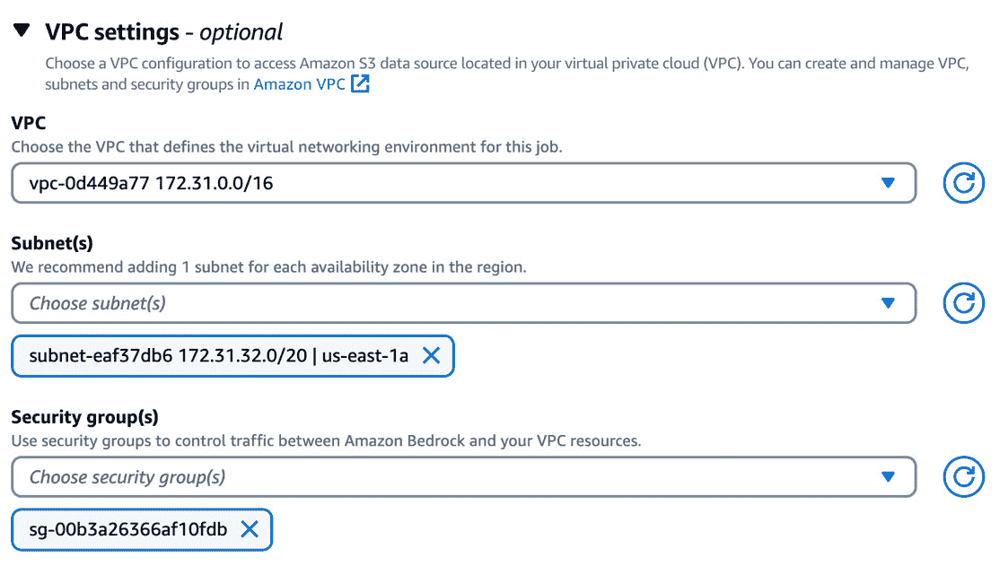

图 12.2 – VPC 设置

此外，Amazon Bedrock 与 AWS **PrivateLink**集成，因此您可以在您的 VPC 和 Amazon Bedrock 服务之间建立私有连接。此连接通过创建 VPC 接口端点来实现，本质上是为流向 Amazon Bedrock 的流量提供的私有入口点。此外，Amazon Bedrock 不使用公共 IP 地址或互联网网关，确保您的数据永远不会穿越公共互联网，从而最大限度地减少潜在的网络威胁。

为了进一步增强安全性，您可以实施端点策略，这些策略可以附加到您的 VPC 接口端点。这些策略使您能够精确定义授权执行指定资源上特定操作的实体（AWS 账户、IAM 用户和 IAM 角色）。通过定制端点策略，您可以精细控制从您的 VPC 内部授予 Amazon Bedrock 的访问权限，从而有效地加固您的安全态势。

这里是一个示例 VPC 端点策略，它允许任何人（`"Principal": "*"`）执行 Bedrock 的`InvokeModel`和`InvokeModelWithResponseStream`操作：

```py
{
   "Version": "2012-10-17",
   "Statement": [
      {
         "Principal": "*",
         "Effect": "Allow",
         "Action": [
            "bedrock:InvokeModel",
            "bedrock:InvokeModelWithResponseStream"
         ],
         "Resource":"*"
      }
   ]
}
```

现在，让我们看看幕后网络流的样子。

# 网络流

我们已经探讨了如何在 Amazon 中使用加密以及如何在您处于 Amazon VPC 时通过 AWS PrivateLink 来保护网络。现在，让我们看看调用和模型定制作业背后的网络和数据流工作。

## 按需架构

在按需模式下，您与其他用户共享模型的计算环境，并按使用情况计费，没有任何长期承诺。*图 12.3*显示了 Amazon Bedrock 使用的按需网络架构概述。

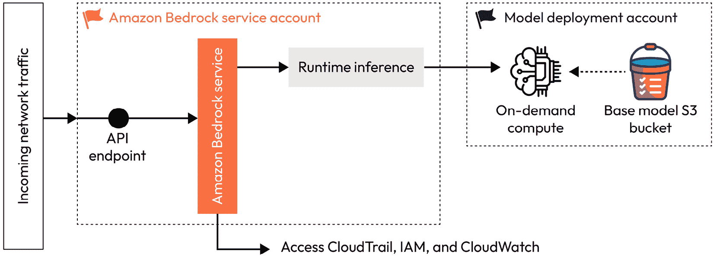

图 12.3 – 按需计算环境架构

让我们详细理解这个图：

+   在中间，我们看到了**Amazon Bedrock 服务账户**，该账户作为所有传入请求的入口点。该账户由 Amazon 管理和控制，确保对服务的安全可靠访问。Amazon Bedrock 服务负责处理这些传入请求并将它们路由到适当的运行时推理环境。此环境旨在处理和执行在部署的模型上请求的操作。

+   在右侧，我们看到了**模型部署账户**，该账户由 Amazon 拥有和运营。有趣的是，对于每个模型提供者和 AWS 区域组合，都有一个这样的账户。这种隔离确保没有任何模型供应商可以访问或篡改其他供应商的数据或模型，从而增强安全和隐私。在**模型部署账户**中，我们找到了按需计算资源，这些资源根据传入的工作量动态配置和扩展。此外，此账户还托管了存储在 S3 存储桶中的基础模型，这些存储桶存储了这些 FM。

推理请求的流程如下：

1.  用户发起一个请求，该请求被 Amazon Bedrock 服务账户的 API 端点接收。

1.  请求使用 AWS IAM 服务进行身份验证和授权。

1.  一旦验证，请求就会被转发到运行时推理环境。

1.  运行时推理组件与模型部署账户内的相关计算集群交互，获取所需的模型并执行请求的操作。

1.  结果随后通过 Amazon Bedrock 服务账户安全地返回给用户。

在整个过程中，有几种措施在位以确保数据安全和隐私：

+   所有内部流量都使用 TLS 1.2 或更高版本的加密标准进行加密。

+   在 Amazon Bedrock 服务账户中不存储或持久化任何客户数据。

+   使用 AWS CloudTrail 和 Amazon CloudWatch 服务维护详细的日志和审计跟踪。

+   模型供应商，包括 Amazon 自己的模型如 Titan，不能访问或影响模型部署账户中的客户数据或模型

现在，让我们看看配置的吞吐量容量架构。

## 配置的吞吐量架构

配置的吞吐量允许您购买用于基础或定制模型的模型单元，这些模型单元是为需要保证吞吐量的大规模推理工作负载设计的。

**模型单元**是 Amazon Bedrock 配置的吞吐量功能中的一个关键概念，旨在为 LLM 推理提供一致和可扩展的性能。可以将模型单元视为运行特定模型所分配的底层 GPU 硬件资源的一部分表示。它不是所有模型的标准度量，而是模型特定的。

这些模型单元是亚马逊 Bedrock 中特定基模型的计算资源购买分配。每个模型单元提供保证的吞吐量水平，以每分钟处理的令牌数来衡量。这适用于输入和输出令牌。通过使用模型单元，您可以确保高容量 AI 工作负载的稳定性能，并根据您的需求灵活扩展资源。

*图 12*.`4`显示了亚马逊 Bedrock 使用的配置吞吐量架构概述。

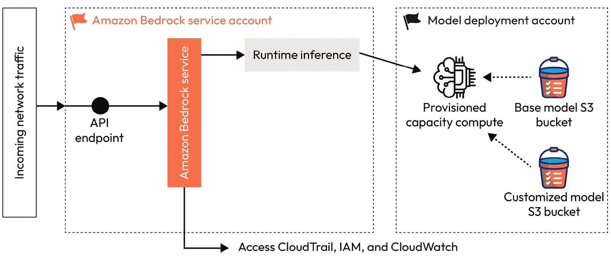

图 12.4 – 配置吞吐量计算架构

与按需架构类似，我们有**亚马逊 Bedrock 服务账户**作为传入请求的入口点。该账户由亚马逊管理，确保对服务的安全访问。以下是前面图示的分解：

+   在**模型部署账户**中，我们发现有两个不同的组件：**基础模型 S3 存储桶**和**自定义模型 S3 存储桶**。基础模型存储桶存储由亚马逊和其他供应商（如 AI21、Cohere 等）提供的基模型，而自定义模型 S3 存储桶存储定制模型或针对个别需求定制的基模型副本。

+   **运行时推理**组件负责处理传入的请求并确定处理请求操作适当的计算环境。此决策基于请求是针对基模型还是自定义模型。

在配置吞吐量模式下，可以通过调用`InvokeModel` API 或`InvokeModelWithResponseStream` API 并指定`modelId`为配置吞吐量模型 ARN 来执行推理。对于配置容量计算环境的推理请求流程如下：

1.  客户发起请求，该请求由亚马逊 Bedrock 服务账户的 API 端点接收。

1.  请求使用 AWS IAM 服务进行身份验证和授权。

1.  一旦验证通过，请求将被转发到运行时推理组件。

1.  运行时推理组件分析请求并确定它是否为基模型或自定义模型。

1.  如果请求是针对自定义模型的，运行时推理组件将请求定向到与该客户或模型关联的专用配置吞吐量计算环境。

1.  配置吞吐量计算环境在指定的自定义模型上执行请求的操作，并返回结果。

1.  计算结果随后通过亚马逊 Bedrock 服务账户安全地返回给客户。

配置容量架构与按需架构共享一些关键特性，包括以下内容：

+   使用 TLS 1.2 或更高加密标准加密内部流量。

+   在亚马逊 Bedrock 服务账户内没有客户数据存储或持久化。

+   通过 AWS CloudTrail 和 Amazon CloudWatch 服务进行详细的日志记录和审计

+   严格的隔离和访问控制，确保模型供应商无法访问或影响客户数据或模型

从开发者的角度来看，如果您使用的是按需或预配吞吐量模式，调用基线模型或定制模型的流程是无缝的。

现在，让我们来看看模型定制的架构概述。

## 模型定制架构

模型定制是我们对针对特定领域用例定制的基础模型进行微调或继续预训练的地方。*图 12.5*提供了 Amazon Bedrock 采用的模型定制架构概述。

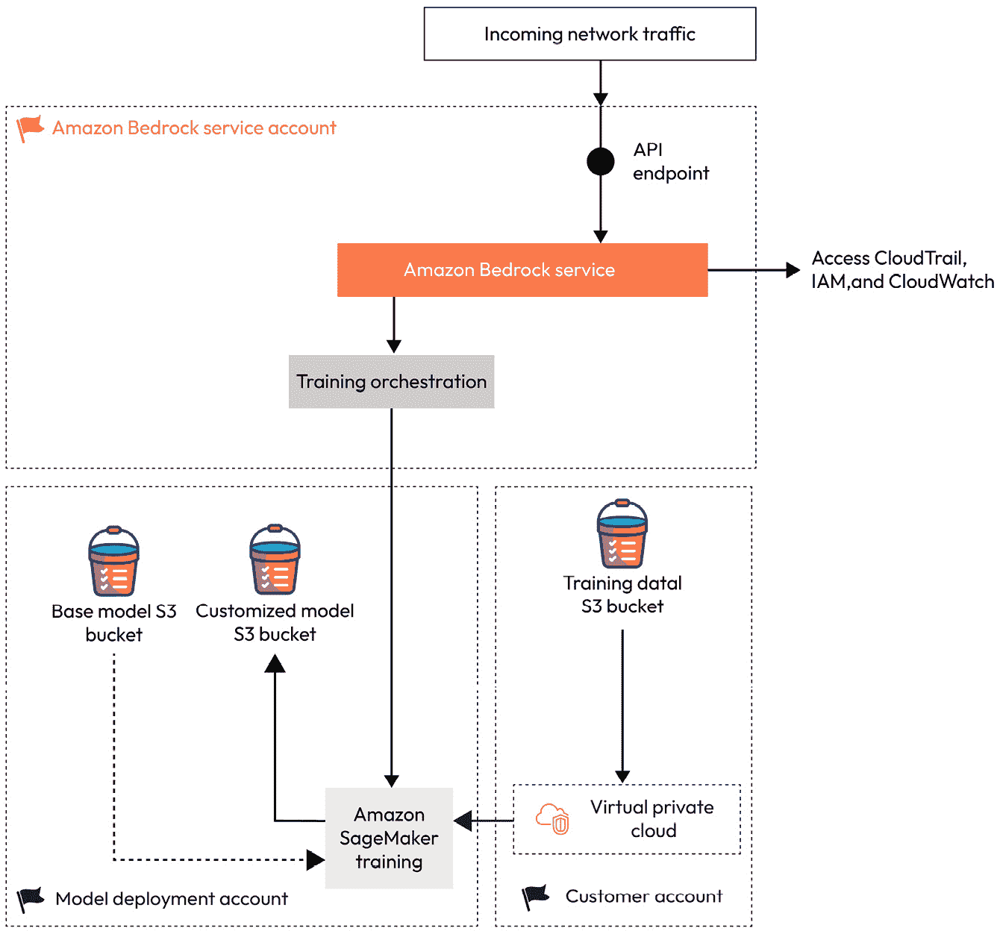

图 12.5 – 模型定制架构

让我们看看步骤：

1.  该过程从用户通过 Amazon Bedrock 服务账户的 API 端点发起请求开始。该账户由 Amazon 管理，并作为所有传入请求的安全入口点。

1.  Amazon Bedrock 服务账户将请求路由到训练编排组件，该组件在 Amazon 拥有和运营的相关模型部署账户内编排定制过程。

1.  训练编排组件启动一个 Amazon SageMaker 训练作业，该作业负责实际的模型定制过程。Amazon SageMaker 是 AWS 机器学习服务，您可以在其中构建、训练、部署和监控机器学习模型。如果您对 SageMaker 感兴趣，这里有一本由 Julien Simon 撰写的有趣书籍：*《学习 Amazon SageMaker：开发者与数据科学家构建、训练和部署机器学习模型的指南*》，可在 https://www.amazon.com/Learn-Amazon-SageMaker-developers-scientists/dp/180020891X 找到。

    模型部署账户中的训练作业利用以下资源：

    +   基础模型 S3 桶，其中存储了 Amazon 和其他供应商（来自 Meta、Cohere 和 AI21）提供的基线模型。

    +   用户的训练数据，安全地从用户账户内的 S3 桶中检索，可选地通过 VPC 连接以增强安全性。

1.  在训练过程中，用户的训练数据用于定制所选的基础模型，创建一个符合您需求的定制版本。

1.  训练作业完成后，定制模型将被加密并存储在模型部署账户内的定制模型 S3 桶中。

1.  重要的是要注意，模型供应商在任何时候都无法访问或查看用户的训练数据或生成的定制模型。

1.  此外，训练作业生成输出指标和日志，这些指标和日志在初始请求期间由用户指定的 S3 桶安全地交付。

模型定制架构整合了多项安全和隐私措施：

+   严格的访问控制和隔离确保模型供应商无法访问您的数据或定制模型

+   您的训练数据将从您的账户安全检索，无论是直接从 S3 存储桶还是通过 VPC 连接

+   加密用于在存储和传输过程中保护定制模型

+   通过 CloudTrail、IAM 和 CloudWatch 服务提供详细的日志记录和审计

通过利用这种架构，Amazon Bedrock 允许您根据特定需求定制基础模型，同时保持严格的数据隐私和安全标准。责任分离和安全的处理机制确保在整个定制过程中敏感信息得到保护。有关如何将模型适应您独特需求的更详细探索，请参阅*第四章*。

现在，我们已经了解了安全和网络流组件，让我们来看看道德实践，其中我们涵盖了与 GenAI 相关的挑战和风险。

# 道德实践

GenAI 取得了快速进步，但同时也带来了新的挑战和风险。以下是一些例子：

+   提供商是否会使用我的数据？

+   这会不会损害公司的法律权利？

+   模型在生产过程中会幻觉并提供非理性、有偏见或事实错误的结果吗？

+   GenAI 模型在训练或生成过程中是否会无意中使用或复制知识产权，例如受版权保护的文本或图像？

让我们来看看这些挑战和可以采用的最佳实践。

## 真实性

**真实性**，即 AI 模型生成信息的真实性和准确性，是 GenAI 领域道德实践的一个关键方面。当模型产生可验证为虚假或幻觉的输出时，可能会导致错误信息的传播并损害对技术的信任。幻觉的一个常见例子是，当 AI 模型被要求提供关于特定主题的信息，例如某位作者的学术论文时。模型不会搜索和检索实际引用，而是倾向于生成看似合理但实际上并不对应于已发表作品的虚构论文标题、主题和合著者姓名。

为了减轻幻觉的风险并提高真实性，可以采用以下最佳实践：

+   **提示工程**：向 AI 模型提供清晰和具体的指令可以帮助引导它生成更准确和真实的输出。精心设计的提示，明确定义所需输出并提供相关背景信息，可以降低幻觉的可能性。

+   **提供更多背景信息**：如 RAG、持续预训练、微调和使用代理等技术，可以通过提供额外的背景信息和外部来源的知识，帮助将模型输出建立在事实信息的基础上。

+   **推理参数调整**：调整温度、Top P 和 Top K 等参数，这些参数控制模型输出的随机性，可以帮助在创造力和事实准确性之间取得平衡，减少幻觉的可能性，同时仍然允许生成新颖和有用的内容。如果您想了解更多关于这些参数的信息，请参阅*第二章*。

通过实施这些最佳实践并持续验证人工智能生成内容的真实性，我们可以促进对生成式人工智能（GenAI）模型的信任，并确保它们在各种领域的负责任和道德部署。

## 知识产权

早期大型语言模型（LLM）的一个主要挑战是它们倾向于直接重复或复制它们训练过的文本数据的一部分。这引发了隐私问题，因为训练数据可能包含敏感或个人信息。这也引发了版权问题，因为模型可能在未经许可的情况下再现受版权保护的内容。这个问题的根本原因在于这些 LLM 的训练方式。它们接触到了来自各种来源的大量数据，包括书籍、网站和数据库，其中许多是受版权保护的作品。然而，这些数据被摄入时没有追踪来源或获得适当的许可。因此，在生成文本时，模型可能会原封不动地重复其训练数据中的句子或段落，无意中暴露了受版权保护的内容或个人信息。解决这个问题需要更强大的过滤训练数据、追踪来源和为训练这些强大的语言模型使用的材料获得适当许可的技术。以下是一些关键考虑因素：

+   **透明度**：人工智能提供商应对其模型使用的训练数据保持透明，披露潜在的受版权保护材料的来源，并承认其系统在处理知识产权方面的局限性。

+   **合理使用**：虽然某些用于训练人工智能模型的受版权保护材料的用途可能属于合理使用例外情况，但仔细评估这种使用的范围和性质对于避免潜在的侵权至关重要。

+   **许可和权限**：在可能的情况下，人工智能开发者应获得适当的许可或权限来使用其训练数据中的受版权保护材料，确保对权利所有者进行适当的归属和补偿。

+   **内容过滤**：实施强大的内容过滤机制可以帮助降低在人工智能系统输出中再现受版权保护材料的风险。这可能涉及水印、指纹和其他内容识别技术等技术。

+   **人工监督**：结合人工监督和审查流程可以帮助识别和解决人工智能系统输出中可能出现的版权侵权或未经授权使用知识产权的情况。

## 安全性和毒性

毒性和安全性也是开发和部署人工智能系统时的重要考虑因素，尤其是涉及语言生成模型的情况。有毒输出可能会持续造成伤害，传播错误信息，并损害这些系统的信任和完整性。因此，实施强有力的措施来减轻毒性和维护安全是必要的。以下是一些解决这些问题的关键点：

+   **内容过滤**：实施严格的过滤器，排除与个人医疗、法律、政治或财务事项相关的建议或信息，以及制造武器或参与非法活动的指令，这是至关重要的。如果没有适当的监管，此类内容可能会造成直接伤害或导致危险行为。

+   **防护措施**：实施防护措施，如内容过滤、偏见检测和有毒语言识别，可以帮助防止生成有害或不适当的内容。持续监控和更新这些防护措施是必要的，以适应不断变化的语言模式和潜在的滥用。在下一节中，我们将介绍亚马逊 Bedrock 提供的防护措施。

+   **数据策划**：仔细策划和审查用于语言模型的训练数据，以最大限度地减少偏见的传播、有毒语言或事实不准确性的传播。对训练数据进行定期的审计和更新可以帮助随着时间的推移提高模型性能和安全。

+   **水印和可追溯性**：在生成内容中嵌入水印或可追溯的标识符，有助于归属和问责制，阻止滥用并能够迅速应对涉及有毒或有害内容的事件。有关亚马逊 Bedrock 的水印检测的更多详细信息，请参阅第九章。

+   **负责任的 AI 政策**：组织应实施和建立强有力的负责任 AI 政策、指南和最佳实践。这些政策应优先考虑道德考量、透明度、问责制以及用户和社会的福祉。

我们建议您阅读迈克尔·基恩斯（Michael Kearns）撰写的博客文章《生成时代负责任的 AI》（[`www.amazon.science/blog/responsible-ai-in-the-generative-era`](https://www.amazon.science/blog/responsible-ai-in-the-generative-era)）。这篇文章讨论了围绕公平性、毒性、幻觉、知识产权侵犯等问题所面临的挑战，以及技术社区为解决这些挑战所进行的积极工作，包括精心策划训练数据、开发防护模型以过滤输出、水印方法以及利用更专注的使用案例。

现在，让我们看看亚马逊 Bedrock 提供的防护措施，以解决我们讨论的一些问题。

# 亚马逊 Bedrock 的防护措施

通过 Amazon Bedrock 的护栏，组织可以实现与安全和负责任的 AI 政策相一致的安全措施。这些安全措施提供了一层额外的控制，补充了 FMs 中内置的现有保护。您可以将这些护栏应用于 Amazon Bedrock 中可用的所有 FMs，以及您为 Amazon Bedrock 创建的任何微调模型和代理。让我们看看在以下情况下实施护栏将如何成为各种行业的需求：

+   **医疗保健行业**：

    +   在医疗聊天机器人或虚拟助手中，可以使用护栏来防止未经授权交换与自我诊断、处方药物或医疗建议相关的信息

    +   在分析医疗记录或成像数据的应用中，可以采用护栏来删除敏感的患者信息，并确保符合如 HIPAA 之类的隐私法规

+   **法律行业**：

    +   在法律文档分析工具中，可以使用护栏来防止律师和客户之间机密通信的披露

    +   在法律研究或合同审查应用中，可以实施护栏以防止生成误导性或法律上不符合规范的内容

+   **金融行业**：

    +   在金融应用中，可以使用护栏来防止生成与股票推荐、投资建议或内幕交易相关的内容

    +   在处理金融交易或客户数据的应用中，可以使用护栏来删除敏感信息，如账户号码或信用卡详情

+   **媒体和娱乐行业**：

    +   在内容生成应用中，可以使用护栏来防止创建受版权保护的材料、仇恨言论或可能违反内容指南或社区标准的露骨内容

    +   在与广播媒体相关的应用中，可以实施护栏以确保遵守严格的监管指南，防止版权侵权，并维持适当的内容标准

+   **零售和电子商务行业**：

    +   在电子商务平台上，可以通过删除个人信息和防止未经授权访问或显示敏感数据（如支付详情或送货地址）来保护客户隐私

    +   在产品推荐或客户服务应用中，可以使用护栏来防止推广有害或非法产品，确保符合当地法规和行业标准

现在，让我们了解 Amazon Bedrock 的护栏是如何工作的。

## Amazon Bedrock 的护栏是如何工作的？

护栏通过四个策略过滤器检查用户输入提示和相应的模型响应，如图*12**.6*所示。

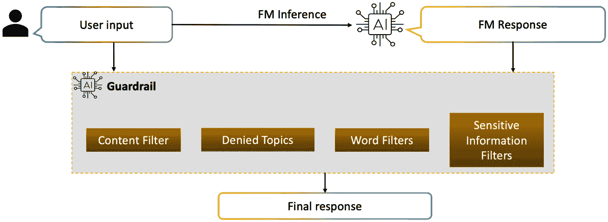

图 12.6 – Amazon Bedrock 护栏的工作原理

亚马逊 Bedrock 的防护栏在 Bedrock 控制台的 **防护措施** 部分可用。当你创建防护栏时，你将被要求配置四个策略过滤器和一条阻止消息。亚马逊 Bedrock 的四个策略过滤器如下列出：

+   内容过滤器

+   被拒绝的主题

+   单词过滤器

+   敏感信息过滤器

根据你选择的策略过滤器，输入提示和模型响应都会被严格审查，以符合每个配置的策略。

如果检测到任何策略违规，无论是输入提示还是响应，Guardrails 组件将通过覆盖违规内容进行干预。有关更多详细信息，请参阅 *阻止* *消息* 子部分。

让我们更深入地探讨每个策略过滤器。

## 内容过滤器

使用 **内容过滤器**，你可以配置阈值以检测和阻止各种类别中的有害内容。你可以调整提示和响应的过滤强度，以实现对内容过滤严格度的细粒度控制，如 *图 12.7* 所示。

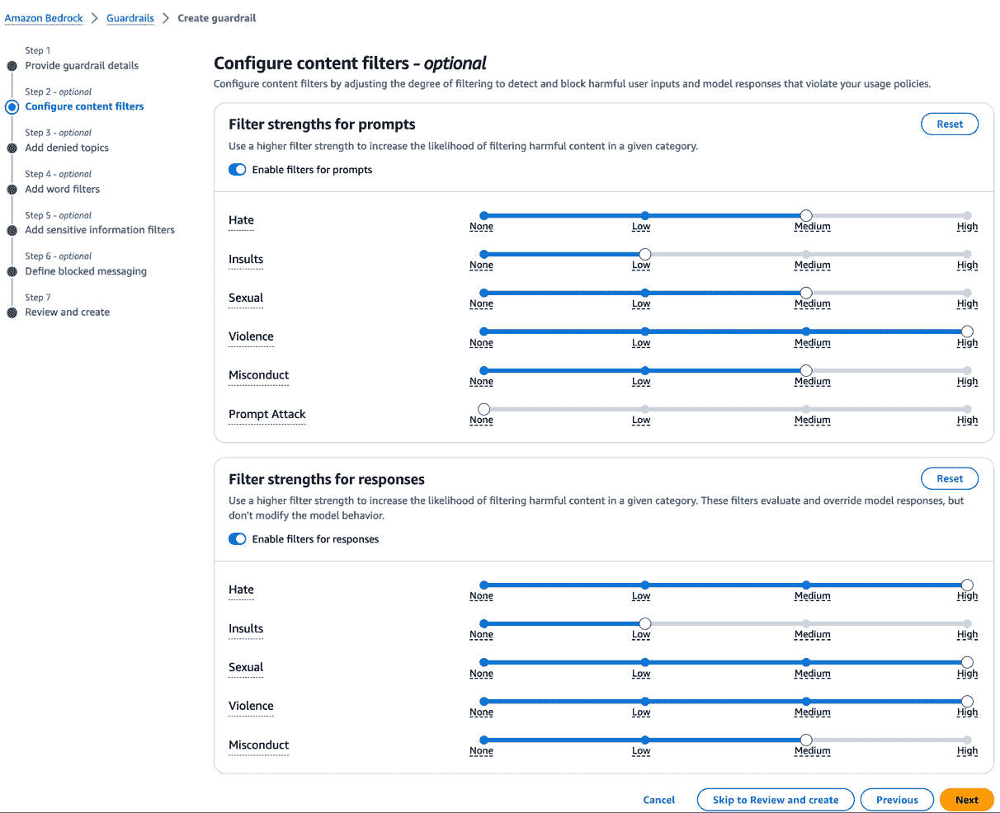

图 12.7 – 配置内容过滤器

涵盖的类别包括仇恨言论、侮辱、色情内容、暴力、不当行为和提示攻击，允许你解决广泛的风险。过滤强度越高，在给定类别中过滤出潜在有害内容的可能性就越高，提供了一种灵活的方式来平衡风险缓解和内容可访问性。

在实施内容过滤器时，考虑你的用例、目标受众和道德规范是至关重要的。对于服务于易受伤害的群体或处理敏感主题的应用程序，可能需要更高的过滤强度，而对于某些创意或教育环境，可能更适合更宽松的方法。此外，根据不断变化的社会规范和组织政策定期审查和更新你的过滤配置也是推荐的。通过利用内容过滤器，你可以主动减轻有害内容生成的风险，鼓励一个更加值得信赖和负责任的人工智能生态系统。

## 被拒绝的主题

**被拒绝的主题** 允许你主动防止你的应用程序与或生成与特定主题相关的可能在你用例中被认为是不受欢迎或不适当的内 容。

你可以通过为每个你希望限制的主题提供一个简洁的名称和清晰的自然语言描述来定义最多 30 个被拒绝的主题。这些作为检测和阻止用户输入或模型响应的基础，确保了过滤机制的持续和可靠。

当指定一个被拒绝的主题时，建议提供一个全面的定义，以捕捉你想要排除的主题内容的本质，围绕所有相关的查询、指导或建议。

例如，在医疗保健领域，维护患者隐私和遵守严格的伦理指南非常重要。医院或医疗机构可以利用被拒绝的主题来防止模型参与有关可能违反患者隐私或医疗伦理的特定主题的讨论或提供信息。

一个可能被拒绝的主题可能是*披露患者信息*，其定义大致为*未经适当授权，分享或透露患者的个人细节、医疗记录或任何识别信息*。

另一个相关的被拒绝主题可能是*未经授权的医疗建议*，定义为*在没有成为有执照的医疗保健专业人员或无法访问患者完整医疗史的情况下，提供诊断评估、治疗建议或任何形式的医疗指导*。

*图 12.8*展示了如何添加被拒绝的主题。

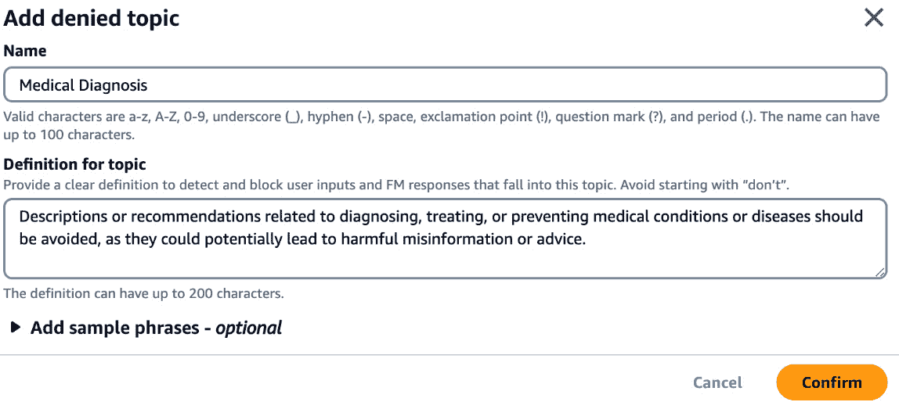

图 12.8 – 添加被拒绝的主题

## 单词过滤器

通过配置**单词过滤器**，您可以有效地阻止不希望出现的单词、短语和粗口，从而促进积极和包容的用户体验。以下是操作方法：

+   **粗口过滤器**提供了一种方便的方式来阻止预定义的常用粗口词汇列表。这个列表基于全球对粗口的定义，并会定期更新，确保过滤器与不断变化的社会规范保持一致。

+   此外，您可以通过指定最多 10,000 个应被阻止的自定义单词和短语来自定义单词过滤体验。这种灵活性允许您根据特定需求定制过滤器，例如排除冒犯性术语、竞争对手名称或任何可能被认为不适合您用例的语言。

+   可以通过各种方便的方法添加自定义单词和短语，包括在控制台中手动输入、上传本地文件（例如，`.txt`或`.csv`）或从 Amazon S3 对象中填充列表，从而在管理单词过滤器列表方面提供灵活性。

*图 12.9*展示了如何使用不同的选项配置单词过滤器。

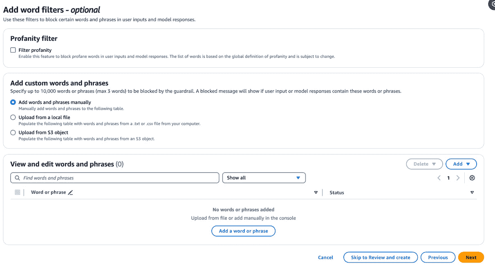

图 12.9 – 添加单词过滤器

通过使用单词过滤器，您可以为您用户创建一个更加可控和包容的环境。例如，一个教育平台可以阻止冒犯性语言以促进积极的学习氛围，而一个企业应用可能过滤掉竞争对手的名称以维护品牌完整性并避免潜在冲突。

## 敏感信息过滤器

**敏感信息过滤器**允许您主动识别并对各种类型的个人身份信息（PII）和自定义定义的敏感数据模式采取适当的行动。

防护栏提供了一系列预定义的 PII 类型，涵盖了广泛的敏感信息，如姓名、地址、电子邮件地址、电话号码、信用卡详情和社保号码。这些 PII 类型会不断更新，以确保符合不断变化的法规和隐私规范。要获取完整列表，您可以访问 [`docs.aws.amazon.com/bedrock/latest/userguide/Guardrails-sensitive-filters.html`](https://docs.aws.amazon.com/bedrock/latest/userguide/Guardrails-sensitive-filters.html)。

当检测到敏感信息时，您可以配置防护栏以阻止或屏蔽内容：

+   **阻止模式**：这阻止敏感信息被处理。如果应用于输入，它将阻止包含敏感数据的提示到达模型。如果应用于输出，它将阻止包含敏感信息的模型响应到达用户。

+   `123-45-6789` 可能会被替换为 `[SSN]`。这确保了隐私，同时保留了内容的整体上下文。

此外，您还可以定义自定义**正则表达式**（**regex**）模式来过滤与您的组织或用例相关的特定类型的敏感信息。这种灵活性允许您保护专有数据，例如序列号、预订 ID 或任何其他需要保护的关键信息。例如：

+   `^ABC-\d{5}-[A-Z]{2}$`（匹配如 `ABC-12345-XY` 的模式）

+   `^BK-\d{6}-[A-Z]{3}$`（匹配如 `BK-123456-NYC` 的模式）

+   `^EMP-\d{4}-[A-Z]{2}$`（匹配如 `EMP-1234-AB` 的模式）

这些自定义模式可以与预定义的 PII 类型一起使用，创建一个针对您特定需求的全面敏感信息保护策略。

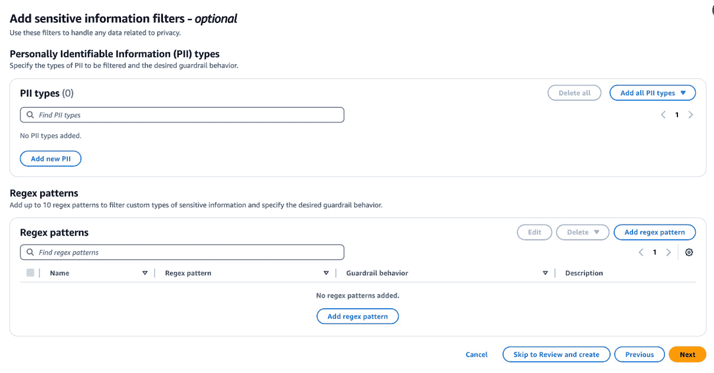

图 12.10 – 添加敏感信息过滤器

*图 12.10* 展示了您可以指定的敏感信息过滤器配置选项。

通过利用敏感信息过滤器，您可以确保您的应用程序保持最高的隐私和数据保护标准。例如，医疗保健提供者可以配置防护栏以屏蔽摘要中的患者信息，而金融机构可以阻止与信用卡详情或账户号码相关的查询，从而降低数据泄露风险并保持合规性。

## 被阻止的消息

一旦我们定义了策略过滤器，接下来可以定义被阻止的消息，即当防护栏阻止模型任何输入提示或响应时。在这种情况下，将提供预批准的响应，针对特定的用例或组织指南进行定制。*图 12.11* 展示了您希望为输入提示和模型响应显示的消息。

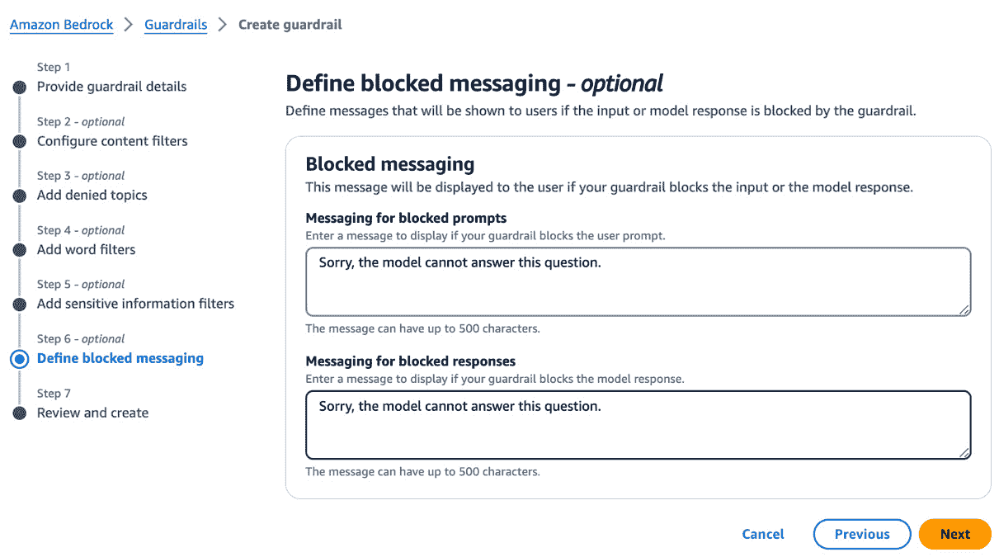

图 12.11 – 被阻止的消息

这种方法确保即使在初始输入或模型输出引起担忧的情况下，最终用户也能收到安全、适当且合规的响应。

## 测试和部署护栏

通过测试护栏，您可以迭代地优化和测试模型，确保它们与您的预期用例一致并遵守道德标准。以下是工作原理：

首先，您创建一个护栏，这将初始化一个工作草案（`DRAFT`）版本。将其视为一个沙盒环境，您可以在这里实验而不会影响实时系统。这个工作草案是可以持续编辑和调整，直到您对其性能满意。

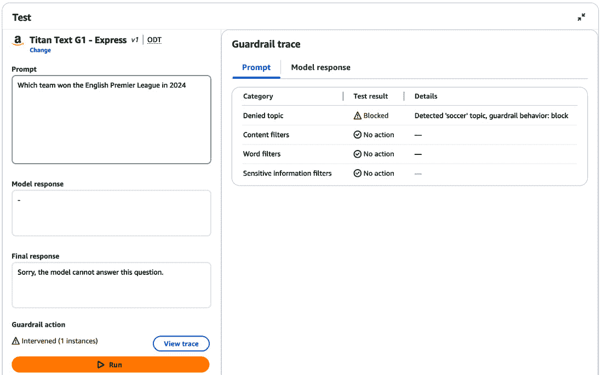

图 12.12 – 测试亚马逊 Bedrock 的护栏

*图 12.12* 展示了工作草案的测试结果。在这里，我提供了一个简单的足球示例，其中我提供了 `soccer` 作为拒绝的主题。当我提供与足球相关的提示时，模型会阻止响应。您也可以从图中看到提示和模型响应跟踪。

一旦您完善了工作草案，您就可以创建一个版本——这是在那一刻的护栏配置的快照。此外，这些版本在系统中充当不可变的检查点。这种不可变性具有关键作用：它防止了如果意外地将草案版本部署到生产环境中可能产生的对运行时环境的潜在负面影响。例如，如果工程师意外地通过控制台界面直接修改了草案版本，这些不可变的检查点将确保这些更改不会影响实时生产环境。这种保护措施有助于维护系统稳定性，并防止意外修改带来的后果。

重要的是要注意，对工作草案所做的任何更改都会自动更新正在使用的工作草案的应用程序。您必须明确地将所需的版本纳入您的应用程序，以反映最新的护栏配置。

现在我们已经创建了、测试并部署了护栏，让我们看看我们如何使用它。

## 使用护栏

护栏可以以各种方式使用：

+   `InvokeModel`、`InvokeModelWithResponseStream` 和 `Converse` API。

+   **知识库**：在亚马逊 Bedrock 控制台或通过 API 查询您的知识库时，您可以包含护栏。

+   **为您的代理设置护栏**：在亚马逊 Bedrock 控制台或 API 中创建或更新代理时，将护栏与您的代理关联。

*图 12.13* 展示了在亚马逊 Bedrock Playground 中使用和不使用护栏的响应。

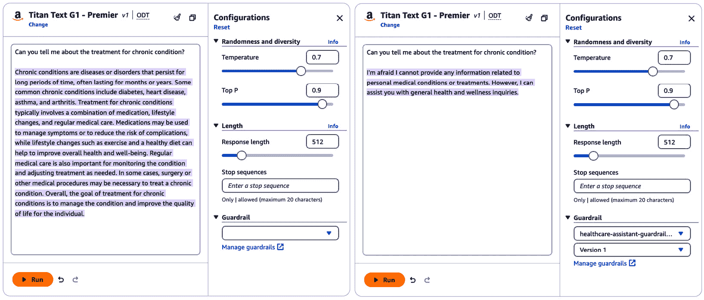

图 12.13 – 在亚马逊 Bedrock Playground 中使用护栏

使用亚马逊 Bedrock API，您可以在代码中指定 `guardrailIdentifier` 和 `guardrailIdentifier`，如下所示：

```py
%pip install boto3 botocore
#import the main packages and libraries
import os
import boto3
import json
import botocore
bedrock_runtime = boto3.client('bedrock-runtime') # Provide the desired region
prompt = "Can you tell me about the treatment for chronic condition?"
body = json.dumps({"inputText": prompt,
                   "textGenerationConfig":{
                       "maxTokenCount":4096,
                       "stopSequences":[],
                       "temperature":0,
                       "topP":1
                   },
                  })
modelId = 'amazon.titan-tg1-large' # change this to use a different version from the model provider
accept = 'application/json'
contentType = 'application/json'
response1 = bedrock_runtime.invoke_model(body=body,
                                        modelId=modelId,
                                        accept=accept,
                                        contentType
                                          =contentType,
                                        trace="ENABLED",
                                        guardrailIdentifier
                                          = 'vtfzfvd8ccoz',
                                        guardrailVersion=
                                          "1"
                                        )
response_g = json.loads(response1.get('body').read())
#print(response_body.get('results')[0].get('outputText'))
#output_body = json.loads(response1["body"].read().decode())
action = response_g["amazon-bedrock-guardrailAction"]
if action == "INTERVENED":
    print("Guardrail Intervention: {}".format(json.dumps(response_g["amazon-bedrock-trace"]["guardrail"], indent=2)))
print("Guardrail action: {}".format(response_g["amazon-bedrock-guardrailAction"]))
print("Output text: {}".format(response_g["results"][0]["outputText"]))
```

当运行前面的代码时，你可以看到响应将与*图 12.14*中显示的类似。

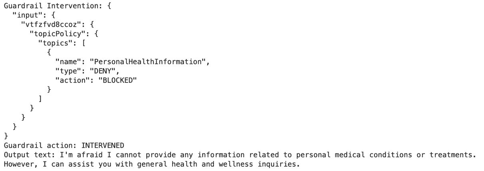

图 12.14 – 带有防护栏的响应

你可以看到代码中提供的提示与医疗治疗相关，我们在“防护栏”中已配置了拒绝主题过滤器。代码片段包括`guardrailIdentifier`和`guardrailVersion`以启用 Bedrock 防护栏，它可以基于配置的过滤器介入并修改模型的输出。

此外，当使用防护栏进行模型推理时，你可以通过标记输入文本中的特定内容来选择性评估用户输入。此功能允许你将防护栏应用于输入的某些部分，同时保留其他部分未处理。

例如，想象你正在为银行应用程序创建一个对话式人工智能助手。虽然你希望你的助手为用户提供有用的信息，但你还需要确保它不会泄露敏感的账户细节或鼓励风险金融行为。通过选择性评估用户输入，你可以对对话的特定部分应用防护栏，如用户查询，同时保持系统提示和对话历史不变。

这就是你可以这样实现的方式：

+   使用输入标签来标记用户查询，例如，`<amazon-bedrock-guardrails-guardContent_abc>我的储蓄账户里有多少钱？</amazon-bedrock-guardrails-guardContent_abc>`

+   在`amazon-bedrock-guardrailConfig`中配置一个动态标签后缀（例如，`abc`）以防止提示注入攻击。

+   标签之外的内容，如系统提示和对话历史，不会被防护栏处理。

+   对于标签内的用户查询，防护栏将确保人工智能助手的响应不会泄露敏感的财务信息或推广不负责任的钱财管理。

这种方法不仅增强了安全和控制，还优化了性能并降低了成本，因为防护栏只评估标记的用户输入，而不是整个提示。

当使用带有流式响应的防护栏时，你可以配置为**同步模式**或**异步模式**。同步模式引入了一些延迟，因为防护栏缓冲并应用策略到响应块之前发送给用户，从而确保更高的准确性。或者，异步模式立即发送响应块，同时在后台应用策略，牺牲准确性以换取更低的延迟。

你可以通过在`amazon-bedrock-guardrailConfig`中包含`"streamProcessingMode": "ASYNCHRONOUS"`来启用异步模式。以下是方法：

```py
{
   "amazon-bedrock-guardrailConfig": {
   "streamProcessingMode": "ASYNCHRONOUS"
   }
}
```

对于使用`Converse` API 构建的对话式应用程序，你可以使用防护栏来阻止用户输入或模型生成的不得当内容。在调用`Converse`或`ConverseStream`操作时，将防护栏配置包含在`guardrailConfig`参数中。以下是方法：

```py
{
        "guardrailIdentifier": "Guardrail ID",
        "guardrailVersion": "Guardrail version",
        "trace": "enabled"
}
```

这里有一个示例代码，说明您如何通过在`Converse` API 上使用护栏来保护对话：[`docs.aws.amazon.com/bedrock/latest/userguide/guardrails-use-converse-api.html#converse-api-guardrail-example`](https://docs.aws.amazon.com/bedrock/latest/userguide/guardrails-use-converse-api.html#converse-api-guardrail-example)。

Amazon Bedrock 的护栏功能允许组织实施安全措施和政策过滤器，以确保人工智能模型的安全和负责任的使用。它提供了四种政策过滤器——内容过滤器、禁止主题、单词过滤器和敏感信息过滤器——以阻止或编辑用户输入和模型输出中的不受欢迎的内容、主题、单词和敏感信息。护栏有助于遵守法规、保护用户隐私，并防止生成有害或不道德的内容。

# 摘要

本章首先强调了在当今数字景观中，组织对数据隐私和保护的重视。它突出了 Amazon Bedrock 的强大安全措施，确保用户对其数据保持完全控制，同时包括数据本地化、隔离、加密和通过 IAM 进行访问管理等关键方面。

章节随后深入探讨了负责任的人工智能实践，解决诸如真实性、知识产权、安全性和毒性等挑战。它提供了关于实施内容过滤、护栏、数据整理、水印、可追溯性和建立稳健的负责任人工智能政策的指导。此外，章节介绍了 Amazon Bedrock 的护栏，它提供了四种政策过滤器：内容过滤器、禁止主题、单词过滤器和敏感信息过滤器。这些过滤器使组织能够实施与其安全和负责任的人工智能政策相一致的安全措施，促进各行业道德人工智能的部署。

恭喜！您已经到达了这本书的结尾。到目前为止，您已经获得了对 Amazon Bedrock 的深入实战知识。从理解基础概念到实际实施和实际用例，我们已经涵盖了广泛的主题，这将为您提供构建可扩展和创新的 GenAI 应用程序的知识和技能。

在整个章节中，我们探讨了提示工程的力量、持续预训练、微调模型和 RAG，以及使用 Amazon Bedrock 开发智能代理。

我们探索了各种架构模式，例如文本生成、摘要、问答、实体提取、代码生成和图像创建。此外，我们还解决了监控、安全和隐私的关键方面，确保您可以在遵守道德标准和最佳实践的同时，自信地穿梭于 GenAI 错综复杂的世界中，并充分利用 Amazon Bedrock 的功能。您现在对 Amazon Bedrock、其功能和发挥其全部潜力的技术有了全面的理解。
