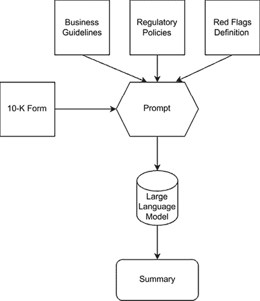
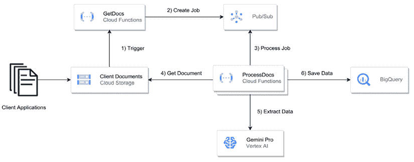

# 第六章：集成模式：批量摘要

在本章中，我们将探讨将**生成式人工智能**（**GenAI**）应用于总结文档的应用，这是跨行业中的一个非常有价值的特性。然而，在深入具体用例之前，我们必须认识到由生成式人工智能驱动的搜索智能支持多个超越文档摘要的用例。这些包括测试用例生成、支持基于文本、音频和视频数据的文档搜索，以及各种分析业务用例。然而，我们的重点将放在金融服务领域的一个引人入胜的用例上，其中文档摘要可以简化流程并加强合规性工作。

为了说明这个用例，让我们考虑一个场景，即一家金融服务公司面临着审查大量客户申请的艰巨任务。这些申请通常跨越多页，包含广泛的信息，包括个人详情、财务历史、投资目标和风险概况。

手动审查并提炼每个申请的关键点可能是一个耗时且易出错的过程，尤其是在处理大量提交时。这就是生成式人工智能驱动的摘要可以成为游戏改变者的地方，它能够有效地提取最显著的信息，同时通过提供不仅能够总结，还能遵循关于关注哪些方面的指南的能力，确保合规性，从而提供一种提升的体验。

通过利用生成式人工智能模型的自然语言理解和生成能力，公司可以开发一个系统，该系统能够智能地分析监管文件，识别关键细节，并生成简洁的摘要。

这些摘要可以无缝集成到下游流程中，例如风险评估、投资组合构建或客户入职工作流程。

需要注意的是，这个用例的目的不是为了取代合规官员的工作，而是通过生成式人工智能来增强他们的工作，同时优化他们在质量和效率方面的表现。

本章将基于示例，参考第四章中提出的生成式人工智能集成框架，即*第四章*，*生成式人工智能批量处理和实时集成模式*。它首先定义了在金融服务行业中总结客户申请的用例，以简化流程并加强合规性工作。然后，它提出了在谷歌云上为批量处理这些客户申请而设计的云原生、无服务器架构。

然后，我们将深入研究管道的入口点，这是一个在**谷歌云存储**（**GCS**）中创建的对象，触发云函数以启动摘要过程。它强调了提示预处理的重要性，将特定领域的知识和合规性指南纳入提示中。

我们将涵盖推理阶段，其中定制的提示和客户应用程序内容提交给 Vertex AI 上的 Google Gemini 以生成简洁的摘要。

我们将讨论结果后处理，将摘要导入数据库，以及展示摘要的各种方法，例如专用应用程序或与现有系统的集成。我们还将提供在 Google Cloud 上实施所提议解决方案的示例代码。

# 用例定义

在这个示例用例中，我们将专注于 10-K 表格摘要用例。10-K 表格旨在向投资者和监管机构提供公司财务状况、运营和风险因素的透明度。对于大型复杂公司，这些细节可能跨越数百页。

总结上市公司广泛的 10-K 年度报告可以为金融服务公司释放巨大价值。这些通常跨越数百页的冗长文件包含关于公司业务运营、财务表现、风险因素和策略的关键信息。然而，手动分析这些报告是一个极其耗时且低效的过程。通过利用先进的 AI 能力生成 10-K 的简洁摘要，金融机构可以加速其分析，同时确保一致地提取最相关的细节。这些摘要为投资专业人士提供快速访问关键财务指标、竞争洞察、潜在风险和未来展望，从而促进更明智的投资决策和投资组合监控。

此外，总结后的 10-K 表格可以无缝集成到现有研究工作流程、合规流程和金融机构内的决策支持系统中。这种自动化方法提高了可扩展性，允许分析师快速处理大量文件。它还降低了在手动分析过程中可能发生的人为错误或疏忽的风险。因此，金融服务公司可以利用 AI 驱动的 10-K 摘要来通过优化的投资分析、改进的风险管理实践和更明智的资本分配策略获得竞争优势——最终有助于提高其业务的回报率和运营效率。

手动审查这些表格可能是一个耗时且易出错的过程，尤其是在处理大量表格时。金融服务专业人士必须仔细分析每一部分，识别关键信息，并确保准确理解客户的需求和风险特征。

通过利用基于 GenAI 的总结方法，金融机构可以简化各种手动流程，从每个表格中提取最显著的信息，同时遵守监管合规标准。这些摘要可以随后使金融顾问和投资组合经理能够快速了解客户情况并做出明智的决策。以下图解通过解释设计提示时将使用的不同组件来捕捉这一点。



图 6.1：10-K 总结提示生成图

此外，这些摘要可以无缝集成到下游流程中，如风险评估、投资组合构建或客户入职工作流程，减少手动数据输入的需求并最小化错误的风险。

合规官员也可以通过将特定规则和指南纳入提示中，从 GenAI 驱动的总结中受益。例如，总结模型可以被指示突出潜在的红旗，如财务信息中的不一致性或声明的风险承受能力与投资目标之间的差异。通过及时揭示这些问题，合规团队可以主动解决这些问题，确保遵守监管要求并减轻潜在风险。

此外，由 GenAI 模型生成的摘要可以作为未来客户互动的有价值参考点，使金融顾问能够快速审查客户情况并提供个性化的建议或推荐，最终导致客户体验的改善和关系的加强。

# 架构

在*第五章*中讨论的架构基础上，对于第一个批量处理示例，我们将采用类似的云原生、无服务器方法在 Google Cloud 上处理客户端应用的总结批量处理。这种可扩展的设置利用了各种服务，使我们能够无缝集成 AI 模型并存储生成的摘要。

架构将包括以下组件：

+   **对象存储**（**Google Cloud Storage**）：这个高度可扩展且耐用的对象存储将被用于存储客户端应用，这些应用可以以各种格式存在，例如 PDF 文件、Word 文档或结构化数据文件。

+   **消息队列**（**Google Cloud Pub/Sub**）：将使用消息队列来协调数据流并管理客户端应用的加工。

+   **处理组件**（**Google Cloud Functions**）：云函数将作为处理组件，执行总结任务并调用 LLM。

+   **LLM**（**Google Gemini**）：我们将利用一个强大的 LLM，如 Google Gemini，托管在 Vertex AI 上，以执行实际的总结。

+   **数据库**（**Google BigQuery**或**Cloud Firestore**）：生成的摘要将以结构化格式存储，无论是关系数据库（BigQuery）还是文档数据库（Cloud Firestore），具体取决于具体要求。

这些组件之间的交互关系在以下图中表示：



图 6.2：批量摘要用例架构图

下面是架构流程的分解：

1.  客户端应用程序上传到 Google Cloud Storage，一旦文档进入存储桶，就会触发云函数。

1.  云函数从云存储中读取应用程序列表，并向 Pub/Sub 主题发布消息，从而有效地创建一个待处理应用程序的队列。

1.  另一个订阅了 Pub/Sub 主题的云函数将为队列中每个与特定应用程序相关的消息触发。

1.  第二个云函数调用托管在 Vertex AI 上的 LLM（例如，Google Gemini），将应用程序内容作为输入，并附带一个定制的提示。

1.  LLM 处理应用程序，利用其自然语言理解能力生成简洁的摘要，同时遵守任何指定的规则或指南。

1.  生成的摘要随后以结构化格式（例如，BigQuery 或 Cloud Firestore）存储，以便进行进一步的分析、集成和消费。

这种无服务器架构提供了几个好处，包括自动扩展、成本效益（按使用付费定价）以及与其他 Google Cloud 服务的无缝集成。此外，它还允许轻松集成现有工作流程，使金融机构能够在不显著干扰现有流程的情况下利用由 GenAI 驱动的摘要。

## 入口点

与上一章类似，我们批量处理流程的入口点将是一个在**Google Cloud Storage**（**GCS**）中创建的对象。当客户端应用程序上传到指定的 GCS 存储桶时，将触发一个云函数，从而启动摘要过程。

对于这个用例，我们将利用 Google Gemini 这一最先进的 GenAI 模型强大的功能，它以其自然语言理解和生成能力而闻名。Gemini 将分析上传的客户应用程序，智能地提取最显著的信息，并生成简洁的摘要。

为了确保符合监管规定和遵守特定指南，我们将把规则和说明纳入提供给 Gemini 的提示中。这些规则可能包括突出潜在的红灯，确保声明的风险承受能力与投资目标之间的一致性，或根据合规要求强调申请的具体部分。

通过结合 Gemini 的高级推理能力、定制提示和规则，我们可以生成摘要，不仅能够捕捉客户应用的精髓，还能促进高效的审查和决策过程，同时保持合规性。

## 提示预处理

我们将首先制定一个有效的提示，以指导 GenAI 模型生成准确且合规的摘要。在这种情况下，我们将利用合规官员和金融服务行业内的主题专家的见解，了解摘要中需要捕捉的关键信息。

重要的是要指出，这个提示背后的意图是提供一个合规指南的示例，但这绝不代表一个真实的合规示例，也不打算用来分析商业档案。

基于这些见解，我们将开发一个模板或一系列指南，概述摘要中应包含的关键部分和数据点。这个模板将作为我们提示的基础，确保由 GenAI 模型生成的摘要与金融服务公司的特定要求相一致。

此外，我们将纳入合规官员提供的规则和指南，以确保摘要符合相关法规和行业最佳实践。这些规则可能包括突出显示需要进一步审查或调查的潜在差异、不一致或关注区域。

如您所见，在设计我们的提示并融入特定领域知识和合规指南时，我们可以利用 GenAI 的力量生成既简洁又准确的摘要，同时提供与合规和监管要求相关的见解，从而简化应用审查流程，降低潜在风险。

```py
prompt_template_beggining = """
You are an expert compliance analyst.
Your task is to extract information from the sign up forms obtained.
1\. Carefully analyze the document provided as context.
2\. Write an intro paragraph for the company so the senior compliance analyst can quickly understand who the customer is.
3\. Following the guidance for approved businesses add a paragraph after the intro explaining why the business is supportable or not.
4\. Add another paragraph below explaining where the company is.
5\. Always think step by step.
<supportable_businesses>
Summary of Prohibited & Restricted Businesses
This document outlines the types of businesses and activities that are generally not allowed or require prior approval to use payment processing services. These restrictions exist due to legal requirements, financial partner rules, and compliance and risk management policies of payment processors.
Types of Businesses:
High-Risk Jurisdictions and Persons: Businesses operating in or dealing with sanctioned countries and individuals.
Prohibited Businesses: Activities involving illegal products or services, adult content, certain financial services, marijuana, unfair practices, weapons, etc.
Restricted Businesses: Activities requiring prior written approval from the payment processor, such as CBD, financial products, pharmaceuticals, non-fiat currency, and more.
Jurisdiction-Specific Prohibited Businesses: Additional restrictions based on specific countries, such as India, Japan, Malaysia, Mexico, Singapore, Thailand, UAE, and the US.
Prohibited Uses of Payment Processing Services:
Misrepresentation of identity or business.
Facilitating transactions for undisclosed merchants.
Using the service as a virtual terminal.
Processing without actual goods or services.
Evasion of chargeback monitoring.
Sharing cardholder information.
Misuse of intellectual property.
Prohibitions for Card Issuing Products:
Consumer use for personal expenses.
International use outside of the registered jurisdiction.
Lending without proper licensing and approval.
Abusive practices like free trial abuse and scalping.
Non-compliance with marketing and user experience guidelines.
Inactivity for 12 consecutive months.
Incorrect integration type for employee/contractor cards.
Business Analyst Recommendations:
Based on this information, a business analyst should pay close attention to the following types of businesses:
Financial Services: This is a broad category with many restrictions and nuances. It's crucial to understand the specific requirements for lending, crowdfunding, money transmission, etc.
Regulated Industries: Industries like CBD, pharmaceuticals, and tobacco require careful consideration of compliance and legal aspects.
High-Risk Businesses: Businesses prone to fraud or abuse, like travel reservation services and multi-level marketing, need thorough risk assessments.
Emerging Technologies: Activities involving cryptocurrency, NFTs, and other new technologies should be evaluated based on current regulations and the payment processor's policies.
Jurisdiction-Specific Restrictions: Businesses operating in or targeting specific countries need to be aware of additional prohibitions and requirements.
Additional Considerations:
Business Model: Restrictions often depend on the specific business model and how the service is used.
Compliance: Understanding and adhering to relevant regulations is essential to avoid account closure or other consequences.
Risk Management: Businesses should have robust risk management practices to mitigate potential financial and legal risks.
Transparency: Maintaining clear and accurate information about the business and its activities is crucial for approval and continued use of payment processing services.
By carefully considering these factors, a business analyst can help ensure that businesses comply with the payment processor's policies and operate successfully within the platform.
</supportable_businesses>
<document>
"""
prompt_template_end="""
</document>
Response:
""" 
```

## 推理

对于推理阶段，我们将提交我们的提示以及客户应用内容到通过 Vertex AI 提供的 Google Gemini 模型。Vertex AI 平台提供了一个强大且可扩展的环境，用于部署和管理 GenAI 模型，确保高性能和企业级安全。

在我们的示例中，我们使用的是一家虚构的金融服务公司注册公司的示例数据集。推理代码将在整个数据集上运行，同时会有延迟以防止消耗可用配额。根据您的云提供商或设置，您可能有不同的推理配额，这些配额通常与**QPS**（每秒查询数）或**QPM**（每分钟查询数）相关。在我们的示例中，我们有 6 QPM 的限制。

```py
text content. This can be further customized to evaluate safety attributes, for example, or to deal with empty results. For example, in the case of empty results, you could flag the doc and send it to a queue for further processing.
```

```py
import time
summaries = []
for doc in docs:
  result = generate(prompt_template_beggining,str(doc),prompt_template_end)
  #sleep 10 seconds to not exceed 6 QPM
  time.sleep(10)
  summaries.append(result.text)
  print(result.text) 
```

当思考一个更复杂的推理流程时，我们需要关注以下步骤：

1.  当新客户应用到达 GCS 时，云函数会检索应用内容和定制提示。

1.  云函数在 Vertex AI 上调用 Gemini 模型，将应用程序内容和提示作为输入。

1.  Gemini 通过利用其自然语言理解能力处理应用程序，生成简洁的摘要，同时遵守提示中概述的指定规则和指南。

1.  生成的摘要将被返回到云函数中进行进一步处理和存储。

通过利用 Gemini 的力量和 Vertex AI 的可扩展性，我们可以高效地处理大量客户应用程序，及时生成准确且合规的摘要。

## 结果后处理

一旦 LLM 处理完客户端应用程序，它将以结构化格式返回摘要，例如 JSON 或标记语言。我们管道中的下一步是将这些摘要摄取到数据库中，以实现高效的存储和检索。

具体的摄取策略将取决于我们选择的数据库类型。例如，如果我们选择使用像 BigQuery 这样的关系数据库，我们需要将摘要数据点映射到适当的表结构中，确保适当的归一化和遵守数据完整性原则。

或者，如果我们决定使用像 Cloud Firestore 这样的文档数据库，数据摄取过程将更加直接，因为这些数据库是设计用来原生存储层次数据结构的。在这种情况下，我们可以直接以原始格式摄取摘要，利用数据库高效存储和查询复杂数据结构的能力。

无论选择哪种数据库类型，设计一个确保数据一致性、可扩展性和性能的摄取策略至关重要。这可能涉及实施批量摄取、索引和分区等策略，以优化数据库性能并确保摘要的高效检索。

## 结果展示

当涉及到展示由客户端应用程序生成的摘要时，需要考虑几个因素，包括目标受众、预期用例以及与现有系统和工作流程的集成。

一种方法是为财务顾问、投资组合经理和合规官员开发一个专用应用程序或仪表板，使他们能够轻松访问和审查摘要。此应用程序可以提供过滤、排序和搜索功能，使用户能够根据特定标准快速定位和分析摘要，例如客户风险概况、投资目标或由 GenAI 模型识别出的潜在红旗。

此外，应用程序还可以提供可视化工具，以更直观和视觉吸引力的方式展示摘要数据。例如，图表和图形可以用来描绘客户的财务状况、风险承受能力和投资目标，为财务顾问提供一目了然的综合概述。

另一种方法是直接将摘要集成到现有的**客户关系管理**（**CRM**）系统或客户入职工作流程中。这种集成将允许财务顾问和合规官员在他们已经使用的工具和平台上无缝访问摘要，最小化对现有流程的干扰。

此外，摘要还可以用于自动化和决策支持目的。例如，基于规则的系统或机器学习模型可以被训练来分析摘要并提供建议或风险评估，进一步提高了客户入职和投资组合管理流程的效率和准确性。

无论选择哪种演示方法，确保摘要以安全且合规的方式呈现都是至关重要的，遵守行业法规和数据隐私标准。应实施访问控制和授权机制，以确保敏感的客户端信息仅对授权人员可访问。

在本章的 GitHub 目录中，您可以找到完整的代码以及如何将本章中描述的所有组件组合在一起的分析。请特别注意框架的每个组件如何相互交互。

# 摘要

在本章中，我们探讨了 GenAI 在金融服务行业用于总结客户端应用的应用。我们首先定义了问题陈述，即金融机构需要高效地审查和提炼冗长的客户端应用中的关键信息，同时确保符合监管要求。

我们强调了在此背景下，由 GenAI 驱动的摘要的价值，它能够提取关键细节，简化下游流程，并在遵守合规标准的同时，促进更明智的决策。

接下来，我们在谷歌云上提出了一种云原生、无服务器的架构，用于处理客户端应用摘要的批量处理。这个可扩展的设置利用了各种服务，包括云存储、发布/订阅、云函数以及像 BigQuery 或云 Firestore 这样的数据库，使得 AI 模型和生成的摘要的存储能够无缝集成。

我们随后深入探讨了提示预处理的流程，强调了将特定领域知识和合规指南纳入提示的重要性。通过与主题专家和合规官员合作，我们可以制定出指导 GenAI 模型生成准确且合规的摘要的提示。

推理阶段涉及将定制的提示和客户端应用内容提交到 Vertex AI 上的谷歌 Gemini。Gemini 的高级自然语言理解和生成能力，结合精心制作的提示，能够生成简洁且富有洞察力的摘要。

我们还涵盖了后处理步骤，例如将摘要导入数据库，并讨论了展示摘要的各种方法，包括专用应用程序、仪表板或与现有 CRM 系统和工作流程的集成。

总体而言，本章提供了一个实用的框架，用于利用 GenAI 的力量来简化金融服务行业客户应用的审查和分析，同时确保合规性并促进更高效、更明智的决策过程。

在下一章中，我们将探讨一个关注使用 GenAI 进行意图分类的实时用例。

# 加入我们的 Discord 社区

加入我们的社区 Discord 空间，与作者和其他读者进行讨论：

`packt.link/genpat`


