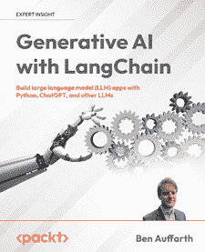

# 第十章：将负责任的人工智能嵌入您的生成式人工智能应用

在前面的章节中，我们探讨了在 Vertex AI 上利用像谷歌 Gemini 这样的生成式人工智能（**GenAI**）模型的各种集成模式和操作考虑因素。随着我们实施这些强大的技术，解决与构建和部署将被添加到您的应用程序中的 AI 模型相关的伦理影响和责任至关重要。本章将重点介绍负责任人工智能的最佳实践，确保我们的生成式人工智能应用是公平的、可解释的、私密的和安全的。

在本章中，我们将涵盖：

+   负责任的人工智能简介

+   生成式人工智能应用中的公平性

+   可解释性和可解释性

+   隐私和数据保护

+   生成式人工智能系统中的安全和安保

+   谷歌对负责任人工智能的方法

+   Anthropic 对负责任人工智能的方法

# 负责任的人工智能简介

负责任的人工智能是一种开发和应用人工智能系统的方法，它优先考虑伦理考量、透明度和问责制。

随着生成式人工智能模型以及像谷歌的 Gemini、OpenAI 的 GPT 和 Anthropic 的 Claude 这样的应用变得越来越强大和广泛使用，确保这些系统以造福社会并最大限度地减少潜在危害的方式进行设计和实施变得至关重要。让我们从高层次上探讨在您的系统中实施负责任人工智能的关键方面。我们还将讨论过度关注以下主题可能对创新产生的负面影响：

+   **公平性**：在人工智能系统中实现公平是一个至关重要的目标，它需要在人工智能生命周期的整个过程中进行深思熟虑的设计和实施。几个关键因素有助于使人工智能系统公平。首先和最重要的是训练数据的质量和多样性。确保数据集代表广泛的群体、经验和观点有助于最小化偏见并促进公平的结果。这不仅仅涉及收集多样化的数据，还包括精心策划和平衡数据，以避免某些群体的过度或不足代表，确保人工智能系统不会持续或放大偏见。虽然追求公平至关重要，但实施起来很复杂。不同的公平定义可能相互冲突。例如，实现人口统计学上的平等可能并不总是与平等机会相一致。过度补偿历史偏见可能会产生新的歧视形式。例如，一个人工智能招聘系统可能会过于关注人口统计学上的平等，以至于忽视了真正的资格，这可能导致更有能力的候选人被忽视。

+   **可解释性**：这是关于理解人工智能系统如何做出决策。高度可解释的模型可能会为了可解释性而牺牲性能。这种权衡在医疗诊断或金融预测等需要复杂模式进行准确预测的领域可能特别有问题。

+   **隐私**：这涉及到保护用户数据和尊重隐私权利。严格的隐私措施可能会阻碍有益的数据共享和协作研究。它们也可能增加企业的成本，可能抑制无法承担强大隐私保护措施的小公司的创新。例如，过于严格的数据保护可能会阻止创建用于开发罕见病治疗所需的大型、多样化的数据集。

+   **安全性**：这是确保人工智能系统按预期行为并不会造成伤害的地方。严格的安全测试可能会显著减缓人工智能系统的发展和部署。这可能会延迟具有潜在救命技术的引入。此外，过于谨慎的方法可能会导致错过从受控的、现实世界的测试中学习的机会。

+   **问责制**：这是关于对人工智能系统结果承担责任。清晰的问责制界限是必要的；过于严厉的措施可能会阻碍创新。它还可能导致当问题出现时，形成一种归咎于而不是学习和改进的文化。

没有获得所有这些方面正确的秘密配方。公司需要找到平衡，并在实践中解决这些关注。让我们考虑以下方法来最小化对僵化方法过度依赖的担忧：

+   **情境应用**：认识到每个方面的重要性可能因具体的人工智能应用及其潜在影响而异。例如，可解释性在医疗诊断人工智能中可能比在电影推荐系统中更为关键。

+   **利益相关者参与**：在开发和部署过程中涉及多样化的利益相关者。这有助于早期识别潜在的问题和权衡。采用基于风险的策略，其中审查和保障措施的水平与人工智能系统的潜在危害或影响成比例。

+   **透明度和监控**：公开你的人工智能系统的局限性和权衡。这有助于管理期望并建立信任。定期评估人工智能系统在实际应用中的性能和影响，并准备好进行调整。逐步实施这些原则，从最低可行标准开始，并根据现实世界的反馈和结果逐步改进。

+   **监管合作**：与政策制定者合作，制定鼓励负责任创新而不是抑制创新的法规。投资于教育开发者和用户了解这些原则及其影响。

通过采取细致入微、具体情境的方法，并持续重新评估这些原则之间的平衡，我们可以努力最大化人工智能的益处，同时最小化潜在的危害。

# 通用人工智能应用中的公平性

随着这些技术越来越多地融入社会各个领域的决策过程，人工智能系统中的公平性是一个关键问题。确保人工智能系统不会持续或放大现有偏差对于建立信任、促进平等和最大化人工智能对所有人的利益至关重要。然而，实现人工智能的公平性是一个复杂且多方面的挑战，需要持续的努力和警惕。

这涉及到人工智能生命周期的每个阶段，从数据收集和模型开发到部署和监控。以下要点概述了促进人工智能系统公平性的关键策略和考虑因素，重点关注实际方法和现实世界案例。通过实施这些做法，组织可以朝着创建更公平、更透明且对整个社会有益的人工智能系统迈进。

+   **多样性和代表性数据**：确保多样性和代表性数据对于创建公平的人工智能系统至关重要。这不仅包括包括来自各个人口群体的数据，还要考虑交叉性和不太明显的多样性形式。例如，在开发语音识别系统时，确保训练数据包括来自不同年龄组和性别的各种口音和方言的说话者。例如，当苹果公司的早期版本 Siri 在处理苏格兰口音时遇到困难时，受到了批评，这突显了在训练数据中语言多样性的重要性。

+   **偏差检测和缓解**：这包括主动和被动措施。**主动**地，使用统计技术来识别数据和中模型输出中的潜在偏差。**被动**地，实施反馈机制来捕捉和纠正现实世界使用中出现的偏差。例如，考虑一个在技术行业中针对特定人口或性别表现出偏差的人工智能招聘工具。这可能是因为系统在历史招聘数据上进行了训练，这些数据反映了技术行业过去在性别或人口结构上的偏差。这个案例突显了仔细审查训练数据和模型输出以发现不公平模式的重要性。

+   **定期审计**：公平性审计应该是全面的，不仅要检查模型的输出，还要检查其在现实世界中的影响。这可能涉及定量指标和定性评估。例如，信用评分人工智能可能通过初步的公平性测试，但定期的审计可能会揭示，由于经济条件的变化，它无意中在一段时间内对某些群体造成了不利影响。定期的审计将捕捉到这种漂移，并允许及时纠正。

+   **包容性设计**：包容性设计不仅限于咨询多样化的利益相关者。它涉及赋予他们积极塑造发展过程的能力，并在决策中给予他们的意见实际权重。例如，当微软为有限活动能力的游戏玩家开发 Xbox 自适应控制器时，他们让有残疾的游戏玩家参与了整个设计过程。这种包容性方法导致了可能被没有残疾生活经验的开发者忽视的创新。

+   **情境公平性**：在不同的情境中，公平可能意味着不同的事情。在一个情况下公平的事情可能在另一个情况下就不公平。人工智能系统需要足够灵活，以适应这些细微差别。例如，用于大学录取的人工智能系统可能需要平衡多个公平标准——平等机会、人口比例和个体优势。适当的平衡可能在有多样化代表性使命的公立大学和专门的技术学院之间有所不同。

+   **透明度和可说明性**：为了使人工智能系统真正公平，用户应该了解决策是如何做出的。这既涉及技术可说明性，也涉及与非技术利益相关者的清晰沟通。在医疗保健领域，做出治疗建议的人工智能系统应该能够用医生和患者都能理解的方式解释其推理。这允许知情同意，并为患者提供机会，让他们提供人工智能可能错过的额外背景信息。

+   **持续监控和调整**：公平不是一次性的成就，而是一个持续的过程。社会规范和对公平的理解不断发展，人工智能系统需要相应地进行调整。例如，用于社交媒体平台的内容审核的人工智能系统可能需要持续更新其对仇恨言论和歧视性语言的理解，因为社会规范在演变，新的编码语言形式出现。

+   **法律和伦理合规性**：确保公平措施符合相关法律（如反歧视立法）并符合伦理标准。这可能因司法管辖区和应用领域而异。在欧盟，GDPR 和拟议中的 AI 法案对人工智能系统中的公平性和非歧视性设定了具体要求。在欧盟市场运营或向欧盟市场销售的公司需要确保其人工智能系统符合这些规定。

这些扩展点突出了确保人工智能系统公平性所涉及的复杂性和细微差别。这是一个持续性的挑战，需要警觉性、适应性和对伦理原则的承诺。

# 可解释性和可说明性

在人工智能系统中，尤其是在**大型语言模型**（LLMs）和 GenAI 中，可解释性和可解释性对于建立信任、实现有效监督和确保负责任部署至关重要。随着这些系统变得更加复杂，其决策过程更加不透明，理解和解释其输出的方法的需求日益增长。可解释性允许利益相关者窥视人工智能的“黑箱”，而可解释性则侧重于以人类可以理解的方式传达决策是如何做出的。

以下要点概述了增强人工智能系统中可解释性和可解释性的关键策略，重点关注实用方法和现实世界案例。通过实施这些实践，组织可以创建更透明的 AI 系统，促进更好的决策、合规性和用户信任。

+   **模型卡**：模型卡提供了一种标准化的方式来记录人工智能模型，包括其性能特征、预期用途和限制。它们是透明度和负责任人工智能部署的关键工具。例如，谷歌的 BERT 语言模型附带了一份详细的模型卡，概述了其训练数据、不同任务和人口统计学的评估结果，以及伦理考量。这使用户能够做出是否 BERT 适合其特定用例的知情决策，并帮助他们了解潜在的偏见或限制。

+   **可解释人工智能（XAI）技术**：XAI 技术旨在使人工智能模型的决策过程更易于人类理解。这些方法可以提供关于哪些特征对特定决策或预测最重要的见解。例如，在医疗诊断人工智能系统中，**SHapley Additive exPlanations**（SHAP）值可以用来显示哪些症状或测试结果对特定诊断的贡献最大。这允许医生理解人工智能的推理，并将其与自己的临床判断进行比较。

+   **用户友好的解释**：人工智能决策的技术性解释通常对最终用户来说并不有用。开发清晰、非技术性的解释，针对用户的技能水平进行定制，对于实现实用性解释至关重要。信用评分人工智能可能不仅仅用数值分数来解释拒绝贷款的决定，而是用一个简单的解释，例如“你的申请主要由于高债务收入比和信用卡近期逾期还款而被拒绝。”这为用户提供可操作的信息，而无需他们理解底层人工智能模型。

+   **可追溯性**：维护人工智能系统输入、输出和关键决策点的详细日志，可以用于审计并有助于理解系统随时间的行为。这对于法规遵从和调试尤其重要。在一个自动驾驶车辆系统中，维护详细的传感器输入、决策点和采取的行动的日志至关重要。如果发生事故，此日志可以用于分析 AI 为何做出某些决策，以及如何在未来防止类似事件的发生。

+   **可解释的模型架构**：虽然不使用本质上更可解释的模型架构可能是一种强大的方法，但这可能涉及尽可能使用更简单的模型，或者开发旨在提高可解释性的新架构。

在金融欺诈检测系统中，对于某些组件，可能会使用决策树模型而不是更复杂的神经网络。决策树的逻辑可以轻松可视化并理解，从而可以清楚地解释为什么一笔交易被标记为可能存在欺诈。

+   **交互式解释**：向用户提供交互式工具以探索模型行为可以极大地增强理解。这使用户能够提出“如果...会怎样”的问题，并看到输入的变化如何影响输出。例如，一个电子商务平台的推荐系统可以包括一个交互式功能，允许用户调整不同因素（例如，价格、品牌、评分）的重要性，并实时看到这如何影响产品推荐。这有助于用户理解系统的逻辑，并根据他们的偏好进行调整。

通过实施这些策略，组织可以显著提高其人工智能系统的可解释性和可解释性，从而实现更透明、更值得信赖和更有效的人工智能应用。

# 隐私和数据保护

在人工智能系统中，尤其是在强大的通用人工智能模型背景下，隐私和数据保护是一个关键问题，它影响着用户的信任、法律合规性和技术的道德使用。随着人工智能系统处理越来越多的个人和可能敏感的数据，确保强大的隐私保障成为组织成败的关键点。有效的隐私保护不仅涉及技术措施，还包括组织政策和用户赋权。以下要点概述了增强人工智能系统中隐私和数据保护的关键策略，重点关注实际方法和现实世界案例。通过实施这些实践，组织可以创建尊重用户隐私、遵守法规并维护用户和利益相关者信任的人工智能系统：

+   **数据最小化**：这涉及仅收集和使用 AI 系统预期功能绝对必要的数据。这一原则降低了隐私风险，并与许多数据保护法规相一致。例如，一个智能家居 AI 助手可以设计为在设备上尽可能本地处理语音命令，而不是将所有音频数据发送到云端服务器。这减少了可能敏感数据离开用户控制的情况，并增加了用户对其数据不会泄露或用于进一步改进模型的信任。

+   **匿名化和加密**：这些技术通过在用于训练和推理的数据集中移除或模糊个人可识别信息来帮助保护个人隐私。如果正确实施，它们可以在保护隐私的同时允许有用的数据分析。在开发用于分析医院患者结果的 AI 系统时，研究人员可以使用差分隐私技术。例如，差分隐私会在数据或模型输出中添加精心校准的噪声，允许进行准确的整体分析，同时从数学上使其不可能识别个别患者。

+   **用户控制**：赋予用户对其数据的控制权不仅是许多司法管辖区的一项法律要求，而且有助于建立信任。这包括提供清晰、易于访问的数据管理选项。例如，一个使用 AI 进行内容推荐的社交媒体平台可以提供一个详细的*隐私仪表板*，用户可以在其中查看正在收集哪些数据，如何使用这些数据，以及轻松地退出特定的数据收集或处理活动。

+   **合规性**：遵守相关的数据保护法规至关重要。这通常涉及实施隐私设计原则、进行影响评估以及维护数据处理活动的详细记录。一家开发 AI 人力资源工具的跨国公司需要确保遵守 GDPR 以符合欧盟员工的要求，CCPA 以符合加州居民的要求，以及其他适用的当地法规。这可能包括创建特定区域的数据处理流程，并根据用户位置提供不同的隐私通知和控制措施。

+   **避免记录 PII 和其他敏感信息**：日志经常被忽视作为潜在的隐私泄露来源。在日志中避免捕获个人可识别信息是维护隐私的关键。即使日志不包含 PII，它们也可能包含有关系统操作的敏感信息。对日志数据进行强大的安全措施是至关重要的。一家使用 AI 进行欺诈检测的金融机构可以实施一个安全、加密的日志存储系统，并具有严格的访问控制。只有授权人员才能访问日志，所有访问都会被记录以供审计目的。

+   **保留政策**：建立和执行数据保留政策有助于随着时间的推移降低隐私风险，并且通常符合数据最小化方面的法律要求。一个由人工智能（AI）驱动的健身应用可以实施一项政策，在用户明确选择保留更长时间之前，自动删除用户活动数据（例如，6 个月）。这降低了旧数据被泄露的风险，同时仍然允许用户在需要时保持长期记录。

+   **隐私保护的人工智能技术**：如联邦学习和同态加密等新兴技术允许人工智能（AI）模型在不直接访问数据的情况下从数据中学习，为隐私保护提供了强大的新工具。智能手机上的键盘预测人工智能（AI）可以使用联邦学习来改进其模型。模型将使用本地数据在单个设备上更新，并且只有模型更新（而不是原始数据）会被发送回中央服务器，从而保护用户隐私。

通过实施这些策略，组织可以显著提高其人工智能（AI）系统的隐私和数据保护方面，从而产生更值得信赖且符合法律规定的、尊重用户隐私的人工智能（AI）应用。

# 通用人工智能（GenAI）系统中的安全性和安全性

确保通用人工智能（GenAI）系统安全、安全地按预期运行对于保护用户和防止信息生成和训练中的潜在滥用以及意外后果至关重要。这需要一种多方面的方法，包括主动措施和反应能力。以下要点概述了增强通用人工智能（GenAI）系统安全性和安全性的关键策略，重点关注实际方法和现实世界案例：

+   **内容过滤**：实施过滤器以防止生成有害或不适当的内容是一项至关重要的安全措施。例如，为儿童教育平台提供的由通用人工智能（GenAI）驱动的聊天机器人可以使用高级内容过滤算法来检测和阻止生成任何不适宜年龄的内容尝试，确保一个安全的学习环境。这可能涉及维护和定期更新一个全面的禁止词汇和主题列表，以及使用更复杂的自然语言处理技术来识别即使以新颖方式表达的可能有害内容。

+   **速率限制**：对 API 调用应用合理的限制对于防止滥用和确保公平使用至关重要。一个提供图像生成能力的通用人工智能（GenAI）服务可以实施分层速率限制，其中免费用户每天的限制数量有限，而付费用户有更高的限制。这不仅防止了潜在的拒绝服务攻击，还有助于有效管理计算资源。系统还可以根据请求的复杂性实施更细致的速率限制，允许更频繁的简单生成，同时限制资源密集型生成。

+   **对抗性测试**：定期使用对抗性输入测试系统对于识别和解决漏洞至关重要。这些测试需要添加到开发周期以及系统的持续监控中。

对于旨在协助医疗诊断的通用人工智能（GenAI）系统，研究人员可以创建一系列对抗性测试案例，旨在欺骗系统做出错误的诊断。这可能包括对医学图像进行细微的修改或精心制作的症状文本描述。通过持续运行和扩展这些测试，开发者可以识别系统决策过程中的弱点，并实施有针对性的改进以增强鲁棒性。

+   **监控和警报**：建立系统以检测和响应异常行为对于维持持续的安全和保障至关重要。使用通用人工智能（GenAI）进行欺诈检测的金融机构可以实施实时监控系统，以跟踪 AI 行为中的异常模式。例如，如果系统突然开始将异常高数量的交易标记为欺诈，或者其置信度分数显示出意外的波动，则可以自动触发警报供人工审查。这允许在系统出现潜在故障或遭受针对性攻击时进行快速干预。

+   **增强的鲁棒性**：如 Gemini 1.5 等模型所展示的输出稳定性和一致性对于安全性至关重要。用于自动化客户服务的通用人工智能（GenAI）系统可以利用这些改进，在广泛的客户咨询中提供更可靠和一致的反应。这降低了系统提供矛盾或无意义信息的风险，这可能导致客户困惑或不满。定期评估系统随时间和不同输入的输出，可以帮助验证和维护这种鲁棒性。

+   **内容安全**：内置机制以避免生成有害或露骨的内容是基本的安全保障。由通用人工智能（GenAI）驱动的创意写作助手可以整合多层内容安全检查。这可能包括分析生成的文本中可能冒犯性的语言，根据用户的个人资料检查适合年龄的内容，并在系统检测到可能进入敏感领域时提供警告或替代方案。这些机制应定期更新，以反映不断变化的社会规范和新的识别风险。

+   **多模态安全**: 随着 GenAI 系统变得更加多功能，将安全考虑扩展到文本、图像和其他模态变得越来越重要。一个用于社交媒体内容审查的多模态 GenAI 系统可以在文本、图像和视频上同时进行安全检查。例如，它可以分析帖子的文本和任何伴随的图像，以检测潜在的政策违规行为，确保有害内容不会通过利用不同模态之间的差距而溜走。这需要开发和维护能够理解不同类型数据上下文的全面安全模型。

通过实施这些策略，组织可以显著提高其 GenAI 系统的安全性和安全性，创造更可靠、值得信赖和有益的 AI 应用。定期审查和更新这些措施对于跟上 GenAI 技术的快速发展和潜在风险至关重要。

## 谷歌对负责任的 AI 的方法

谷歌对负责任的 AI 的方法是一个全面的框架，为实施 GenAI 系统的组织提供了一个模型。其核心，该方法优先考虑：

+   *以人为本的设计* 强调了在 AI 开发中用户需求和 societal impact 的重要性。这确保了 AI 系统是在对其现实世界影响和为不同背景的用户带来的潜在益处的深刻理解下创建的。

+   *公平性* 是谷歌框架的另一个关键方面。公司开发了复杂的工具和实践来检测和减轻 AI 系统中的不公平偏见。对公平性的承诺包括严格的测试、创建多样化的数据集以及持续的监控，以确保 AI 应用在演变和部署到各种环境中时保持公平。

+   *可解释性* 是一个关键焦点，谷歌致力于创建可解释的 AI 系统，以促进透明度。这涉及到开发方法，使 AI 决策过程对开发者和最终用户都更加可理解，从而在 AI 应用中培养信任和问责制。

+   *隐私* 是一个基本关注点，通过诸如联邦学习和差分隐私等高级技术得到解决。这些方法允许开发强大的 AI 模型，同时保护个人用户数据，在创新和隐私保护之间取得平衡。

+   *安全和安全* 在谷歌负责任的 AI 方法中至关重要。公司进行严格的测试，并专注于开发能够抵御潜在滥用或操纵的强大 AI 系统。这种主动的安全立场有助于确保 AI 技术不仅强大，而且值得信赖和有弹性。

谷歌的方法强调跨职能协作的重要性，将来自不同领域的专家聚集在一起，以应对人工智能发展的多方面挑战。这得到了对持续研究的坚定承诺的补充，推动人工智能能力的边界，同时探索其伦理影响。

### 谷歌的安全人工智能框架（SAIF）

这是一个概念框架，旨在管理与快速发展的人工智能技术相关的风险。它包括六个核心要素：

+   **扩展强大的安全基础**：调整现有的网络安全措施以保护人工智能系统，并培养与人工智能进步同步的专业知识。

+   **扩展检测和响应**：将人工智能相关威胁纳入现有的网络安全实践，包括监控人工智能系统输入和输出中的异常。

+   **自动化防御**：利用人工智能创新来提高对安全事件的响应规模和速度，对抗潜在的增强人工智能威胁。

+   **协调平台级控制**：确保组织内不同人工智能平台和工具之间的安全一致性，利用默认保护措施。

+   **调整控制**：通过强化学习、定期红队演习等技术持续测试和改进检测和保护机制。

+   **情境化人工智能系统风险**：对人工智能部署进行全面风险评估，考虑端到端业务风险，并实施自动化检查以验证人工智能性能。

该框架旨在帮助组织随着人工智能的进步而发展其风险管理策略，确保更安全、更负责任的人工智能实施。

在谷歌**安全人工智能框架**（**SAIF**）的核心要素基础上，实施方法（[`services.google.com/fh/files/blogs/google_secure_ai_framework_approach.pdf`](https://services.google.com/fh/files/blogs/google_secure_ai_framework_approach.pdf)）为希望将人工智能安全地整合到其运营中的组织提供了一个实用的指南。该方法将过程分解为四个关键步骤，并详细阐述了如何有效地应用 SAIF 的六个核心要素：

1.  **理解用途**：明确定义特定的 AI 用例及其在组织中的上下文。

1.  **组建团队**：创建一个跨职能团队，包括来自安全、法律、数据科学和伦理等各个部门的利益相关者。

1.  **通过人工智能入门课程进行水平设定**：确保所有团队成员对人工智能概念和术语有基本了解。

1.  **应用 SAIF 的六个核心要素**：

    1.  扩展强大的安全基础：

        1.  审查现有的安全控制措施及其对人工智能系统的适用性。

        1.  评估传统控制措施对人工智能特定威胁的适用性。

        1.  准备供应链管理和数据治理。

    1.  扩展检测和响应：

        1.  理解人工智能特定威胁。

        1.  准备应对针对人工智能的攻击和人工智能输出提出的问题。

        1.  调整针对人工智能特定事件的滥用政策和事件响应流程。

    1.  自动化防御措施：

        1.  识别用于保护系统和数据管道的人工智能安全能力。

        1.  在保持人工参与的同时，使用人工智能防御措施来对抗人工智能威胁。

        1.  利用人工智能自动化耗时任务并加快防御机制。

    1.  协调平台级控制措施：

        1.  审查人工智能的使用和基于人工智能的应用程序的生命周期。

        1.  标准化工具和框架以防止控制碎片化。

    1.  适应控制措施：

        1.  对人工智能驱动的产品进行红队演习。

        1.  了解新型人工智能攻击。

        1.  应用机器学习来提高检测准确性和速度。

        1.  创建反馈循环以实现持续改进。

    1.  语境化人工智能系统风险：

        1.  建立模型风险管理框架。

        1.  建立人工智能模型及其风险概况的清单。

        1.  在机器学习模型的生命周期中实施政策和控制措施。

        1.  对人工智能的使用进行全面的风险评估。

        1.  考虑人工智能安全中的共同责任。

        1.  将人工智能用例与组织风险承受能力相匹配。

这种方法为组织提供了一个结构化的方式来实施 SAIF，确保人工智能的集成是安全的、负责任的，并与业务目标保持一致。

### 谷歌的“红队”方法

这种人工智能系统的方法是一种全面的策略，旨在识别和减轻人工智能部署中潜在的安全风险。公司已成立一个专门的 AI 红队，该队结合了传统的红队专业知识和专门的人工智能专业知识。该团队模拟针对人工智能部署的威胁行为者，目的是评估模拟攻击对用户和产品的影响，分析新的人工智能检测和预防能力的弹性，提高早期攻击识别的检测能力，并提高利益相关者对关键风险和必要安全控制的意识。欲了解更多信息，请参阅[`services.google.com/fh/files/blogs/google_ai_red_team_digital_final.pdf`](https://services.google.com/fh/files/blogs/google_ai_red_team_digital_final.pdf)。

人工智能红队与谷歌的威胁情报团队（如 Mandiant 和**威胁分析小组**（**TAG**））紧密合作，确保他们的模拟反映现实世界的对手活动。这种合作使团队能够优先考虑不同的练习，并形成与真实世界威胁非常相似的互动。

谷歌对人工智能系统进行红队攻击的方法侧重于几种常见的攻击类型：

+   *提示攻击*是一个重大问题，特别是对于为生成人工智能产品提供动力的 LLMs。这些攻击涉及构建输入，以未预期的方式操纵模型的行为。例如，攻击者可能会在电子邮件中注入隐藏指令，以绕过基于人工智能的钓鱼检测系统。

+   *训练数据提取攻击*旨在重建字面训练示例，可能暴露敏感信息，如**个人身份信息**（**PII**）或密码。这些攻击对个性化模型或训练在包含 PII 的数据上的模型尤其危险。

+   *模型后门攻击*是另一种关键威胁，攻击者试图秘密改变模型的行为，以产生带有特定“触发”词或特征的错误输出。这可以通过直接操纵模型的权重、针对对抗目的的微调或修改模型的文件表示来实现。

+   *对抗性示例*涉及导致模型产生意外输出的输入。例如，人类看起来像狗的图像，但模型将其分类为猫。这些攻击的影响可能因人工智能系统的用例而异。

+   *数据中毒攻击*涉及操纵训练数据，以根据攻击者的偏好影响模型的输出。这突出了在人工智能开发中确保数据供应链安全的重要性。

+   *数据泄露攻击*专注于窃取模型本身，这通常包括敏感的知识产权。这些攻击可能从简单的文件复制到更复杂的攻击，涉及重复查询模型以确定其功能并重新创建它。

Google 强调，虽然这些针对人工智能的特定攻击至关重要，但它们应被视为传统安全威胁的补充，而不是替代。公司主张采用综合方法，结合人工智能特定的红队测试和传统的安全实践，如渗透测试、漏洞管理和安全开发生命周期。

通过分享他们的方法和经验教训，Google 旨在建立人工智能的明确行业安全标准，并帮助推进人工智能安全领域。他们的经验强调了跨职能协作、持续学习和将人工智能安全与更广泛的网络安全努力相结合以创建更强大和安全的 AI 部署的重要性。

## Anthropic 对负责任的人工智能开发的方法

Anthropic 对负责任的人工智能开发的方法是全面且多方面的，将伦理考量、安全措施和实证研究贯穿于他们的工作之中。他们方法的关键方面包括：

+   **优先考虑安全研究**：Anthropic 将人工智能安全研究视为迫切重要且值得广泛支持。他们采用投资组合方法，为从乐观到悲观的各种场景做准备，以应对创建安全人工智能系统的难度。

+   **实证重点**：公司强调以实证为基础的安全研究，认为与前沿人工智能系统的密切接触对于在风险成为关键问题之前识别和解决潜在风险至关重要。

+   **平衡进步与谨慎**：Anthropic 在推进必要的安全研究和可能加速危险技术部署之间谨慎权衡。他们旨在快速将安全研究整合到实际系统中，同时保持负责任的发展实践。

+   **透明度和合作**：尽管不发布能力研究，Anthropic 仍分享以安全为导向的研究，以贡献于更广泛的 AI 社区对这些问题的理解。

+   **负责任的部署**：公司在展示前沿能力时持谨慎态度，在适当的情况下优先考虑安全研究而非公共部署。

+   **对安全标准的承诺**：Anthropic 计划对外做出可验证的承诺，只有在满足特定安全标准的情况下才会开发高级模型，允许对他们的模型能力和安全性进行独立评估。

+   **社会影响评估**：他们进行研究以评估其 AI 系统可能产生的潜在社会影响，既为内部政策提供信息，也参与更广泛的 AI 治理讨论。

+   **负责任的扩展**：Anthropic 认识到快速扩展 AI 能力的风险，并旨在开发可扩展监督等技术，以确保强大的系统与人类价值观保持一致。

+   **跨学科方法**：他们的策略涵盖了技术研究、政策考虑和伦理审议，反映了 AI 安全挑战的复杂性质。

+   **适应性**：Anthropic 在其方法上保持灵活性，随时准备根据对 AI 发展和相关风险的了解调整策略。

通过整合这些原则，Anthropic 旨在为开发既强大又安全、符合伦理且对人类有益的 AI 系统做出贡献。他们的方法反映了面对可能变革性的 AI 技术时对负责任创新的深厚承诺。Anthropic 的研究领域多样且全面，专注于 AI 安全和负责任发展的各个方面。他们的方法从即时的实际关注到长期的、推测性的风险，展示了应对 AI 发展多方面挑战的承诺。

Anthropic 研究的核心是*机制可解释性*，旨在“逆向工程”神经网络成为人类可理解算法。这个雄心勃勃的项目旨在使 AI 模型能够进行类似“代码审查”的操作，可能允许进行彻底的审计以识别不安全方面或提供强大的安全保证。该团队在将这种方法从视觉模型扩展到小型语言模型方面取得了进展，并发现了驱动情境学习的机制。

**可扩展的监督**是 Anthropic 关注的另一个关键领域。这项研究旨在开发使人工智能系统部分自我监督或协助人类进行监督的方法。这是对提供足够高质量反馈以引导人工智能行为的挑战的回应，随着系统变得越来越复杂，这一挑战变得更加严峻。

团队探索了各种方法，包括宪法人工智能的扩展、人类辅助监督的变体、人工智能-人工智能辩论和多智能体强化学习中的红队攻击。

**以过程为导向的学习**代表了一种新颖的人工智能训练方法。这种方法不是通过奖励人工智能系统实现特定结果来训练系统，而是专注于训练系统遵循安全的过程。目标是确保系统遵循可理解的、经过批准的过程，而不是通过可能有害或难以理解的手段追求目标，从而解决关于人工智能安全性的担忧。

测试**危险故障模式**是识别人工智能系统中潜在风险的一种主动方法。这涉及到故意将问题属性训练到小型模型中，以便在它们成为更强大系统中的直接威胁之前进行隔离和研究。一个特别感兴趣的研究领域是研究人工智能系统在“情境感知”时的行为以及这如何影响它们在训练过程中的行为。

最后，Anthropic 高度重视研究**社会影响和评估**。这涉及到构建工具和测量方法来评估人工智能系统的能力、局限性和潜在的社会影响。该领域的研究包括对 LLMs 中可预测性和意外的研究、针对语言模型的红队攻击方法，以及减少人工智能输出中的偏见和刻板印象的研究。这项研究不仅为 Anthropic 的内部实践提供了信息，也为更广泛的人工智能治理和政策讨论做出了贡献。

这些相互关联的研究领域共同旨在解决人工智能安全和伦理的各个方面。Anthropic 的方法因其广度和深度而引人注目，反映了人工智能发展挑战的复杂性质。该公司在其研究重点上保持灵活性，随时准备适应人工智能快速发展的领域中出现的新信息和挑战，展示了面对可能具有变革性的人工智能技术时的负责任创新承诺。

Anthropic，一家领先的 AI 研究公司，已经开发了一套全面的方法来应对 AI 安全和伦理方面的挑战。他们的方法被称为**宪法 AI**，在创建既强大又符合人类价值观的 AI 系统方面取得了重大进步，同时减少了在训练过程中对大量人类监督的需求。他们的方法在论文《宪法 AI：来自 AI 反馈的无害性》中被突出展示，([`arxiv.org/pdf/2212.08073`](https://arxiv.org/pdf/2212.08073))，该论文介绍了 Anthropic 开发安全且负责任的 AI 系统的方法，而不依赖于人类反馈来评估无害性。研究引入了一种称为**宪法 AI**（**CAI**）的方法，旨在创建既有帮助又无害的 AI 助手，同时避免规避回答。

Anthropic 的方法核心包括两个主要阶段：监督学习阶段和强化学习阶段。在监督阶段，AI 模型被训练根据一套原则或“宪法”来批评和修改自己的响应。这个过程有助于减少 AI 输出中的有害内容。随后，强化学习阶段通过使用 AI 生成的反馈而不是人类标签来评估无害性，进一步细化模型的行为。

Anthropic 开发这种技术的动机源于几个因素。他们旨在通过利用 AI 来帮助监督其他 AI 系统，减少 AI 助手中帮助性和无害性之间的紧张关系，提高 AI 决策的透明度，并减少对大量人类反馈的依赖。研究人员强调，实证、数据驱动的方法对 AI 安全的重要性，以及应对从乐观到悲观的各种潜在场景时所需的灵活性，这些场景涉及创建安全 AI 系统的难度。

论文展示了实验结果，表明宪法 AI 方法可以产生比使用传统**从人类反馈中强化学习**（**RLHF**）训练的模型更少有害且更有帮助的模型。值得注意的是，CAI 模型展示了以深思熟虑、非规避的方式处理敏感话题的能力，同时仍保持安全性。

Anthropic 的方法还结合了诸如思维链推理等技术，以提高 AI 决策的透明度和可解释性。这有助于更好地理解 AI 系统如何得出结论和采取行为。研究人员强调，随着 AI 能力的提升，他们对其安全技术的持续适应和改进的重要性。

论文最后讨论了该研究的潜在未来方向，包括将宪法方法应用于以各种方式引导人工智能行为，提高对对抗性攻击的鲁棒性，以及进一步细化有益性和无害性之间的平衡。Anthropic 承认这些技术的双重用途潜力，并强调人工智能系统负责任开发和部署的必要性。

总体而言，这项研究代表了朝着创建既强大又符合人类价值观的人工智能系统迈出的重要一步，同时减少了在训练过程中对大量人工监督的需求。

# 摘要

当设计人工智能应用时，开发者可以结合谷歌和 Anthropic 的方法，创建更负责任、更安全的系统。这种综合策略涉及几个关键关注领域：

*全面的安全和影响评估*对于负责任的人工智能开发至关重要。这个过程应包括对乐观和悲观结果的情景规划，使开发者能够为各种可能性做好准备。在小型系统上对安全措施进行实证测试是必不可少的，因为它提供了宝贵的见解，而没有大规模部署的风险。让多元化的利益相关者参与有助于在开发早期识别潜在问题，确保对人工智能系统潜在影响有广泛的视角。在扩展或部署更高级功能之前建立明确的安全阈值，有助于保持对人工智能发展的控制，并确保在整个过程中安全始终是首要任务。

*透明和适应性强的开发过程*对于建立信任并保持人工智能系统的安全性至关重要。实施可解释的人工智能技术使系统的决策过程更具可解释性，使开发者和用户都能理解人工智能如何得出结论。定期对系统的性能、公平性和安全性进行外部审计提供客观评估，并有助于确定改进领域。对模型的性能、局限性和预期用例进行清晰的文档记录有助于管理期望并防止滥用。开发一个快速整合新的安全研究成果的过程确保人工智能系统始终与人工智能安全领域的最新进展保持同步。

*公平性和偏见缓解*是负责任的人工智能开发的关键方面。确保人工智能系统不会持续或放大偏见，需要使用多样化和代表性的训练数据，实施主动和反应性的偏见检测和缓解措施，并在不同的背景和用户群体中进行定期的公平性审计。应用适合特定应用的情境公平性有助于确保人工智能系统在各种场景中的决策是公平的。

*隐私和数据保护* 对于安全的 AI 开发至关重要。实施强大的用户隐私保护措施包括应用数据最小化原则，使用匿名化、加密和隐私保护 AI 技术，为用户提供对其数据的明确控制权，并建立和执行数据保留政策。这些措施有助于建立用户信任并确保符合数据保护法规。

*安全和安全措施* 对于确保 AI 系统按预期行为并抵抗潜在攻击至关重要。这包括实施内容过滤和速率限制以防止滥用，定期进行对抗性测试以识别漏洞，建立监控和警报系统以检测异常行为，以及为多模态 AI 系统应用多模式安全考虑。这些措施有助于保护 AI 系统免受外部威胁并防止意外有害行为。

负责任的 AI 不仅是一个道德上的要求，而且是构建可持续、值得信赖和有效的通用人工智能应用的关键组成部分。通过在整个开发周期中整合公平性、可解释性、隐私和安全考虑因素，我们可以利用像 Google Gemini 这样的模型的力量，同时减轻潜在的风险和负面影响。

正如我们在本章中探讨的那样，实施负责任的 AI 实践需要多方面的方法。这包括多样化的代表性数据、偏见检测和缓解、可解释 AI 技术、强大的隐私保护和全面的安全措施。通过学习像 Google 和 Anthropic 这样的行业领导者，并将他们的框架适应到我们的特定用例中，我们可以创建通用人工智能应用，不仅推动可能性的边界，而且以造福整个社会的方式进行。

记住，负责任的 AI 是一个持续的过程，而不是一次性的勾选框。随着通用人工智能技术持续快速地发展，了解 AI 伦理的最新进展至关重要，定期重新评估我们的应用，并准备好相应地调整我们的实践。

在本书中，我们开始了一段穿越通用人工智能世界的全面旅程，重点关注利用像 Vertex AI 上的 Google Gemini 这样的强大模型。我们首先探索了用例构思和选择的过程，学习如何识别通用人工智能可以提供重大价值并转型业务流程的机会。

从那里，我们深入到至关重要的**概念验证**（**POC**）开发阶段，通过四个实际示例，将其置于一个框架中以简化规模并细化我们的方法。然后，我们探讨了关键的仪器化方面，学习如何有效地将通用人工智能模型集成到我们的应用和系统中，以及如何监控和优化其性能。

最后，我们讨论了至关重要的负责任 AI 主题，确保我们在推动生成式 AI 可能性的边界时，以符合道德、公平且对社会有益的方式进行。

从构思到负责任实施的过程代表了在现实世界中成功利用生成式 AI 的蓝图。随着这些技术以快速的速度发展，我们讨论的原则和实践将变得越来越重要。

人工智能的未来不仅仅是构建更强大的模型；它关于构建更智能、更负责任的系统，这些系统能够增强人类能力，并为我们的世界做出积极贡献。通过遵循本书中概述的方法——从谨慎选择用例到严格的 POC 开发、深思熟虑的仪表化和对负责任 AI 的坚定不移的承诺——您将充分准备好在这个激动人心且变革性的领域中引领潮流。

在您推进自己的生成式 AI 项目时，请记住，成功不仅在于技术实现，还在于深思熟虑地考虑如何使用这些强大的工具在创造真正价值的同时，维护最高的道德和责任标准。AI 发展的旅程是持续的，您在塑造其未来的角色现在就开始了。

# 加入我们的 Discord 社区

加入我们的社区 Discord 空间，与作者和其他读者进行讨论：

`packt.link/genpat`

[packt.com](https://packt.com)

订阅我们的在线数字图书馆，全面访问超过 7,000 本书籍和视频，以及行业领先的工具，帮助您规划个人发展并推进您的职业生涯。更多信息，请访问我们的网站。

# 为什么订阅？

+   使用来自超过 4,000 位行业专业人士的实用电子书和视频，花更少的时间学习，更多的时间编码

+   通过为您量身定制的技能计划提高您的学习效果

+   每月免费获得一本电子书或视频

+   完全可搜索，便于轻松访问关键信息

+   复制粘贴、打印和收藏内容

在[www.packt.com](https://www.packt.com)，您还可以阅读一系列免费的技术文章，订阅各种免费通讯，并享受 Packt 书籍和电子书的独家折扣和优惠。

# 您可能还会喜欢的其他书籍

如果您喜欢这本书，您可能对 Packt 出版的以下其他书籍也感兴趣：

(https://www.packtpub.com/en-in/product/generative-ai-with-langchain-9781835083468)

**使用 LangChain 的生成式 AI**

本·奥法特

ISBN: 978-1-83508-346-8

+   理解 LLM，它们的优点和局限性

+   掌握生成式 AI 基础和行业趋势

+   使用 LangChain 创建类似问答系统和聊天机器人的 LLM 应用

+   理解 Transformer 模型和注意力机制

+   使用 pandas 和 Python 自动化数据分析可视化

+   掌握提示工程以提高性能

+   微调 LLMs 并了解释放其力量的工具

+   使用 LangChain 将 LLMs 作为服务部署并应用评估策略

+   使用开源 LLMs 私下与文档互动，以防止数据泄露

**构建由 LLM 驱动的应用程序**

Valentina Alto

ISBN: 978-1-83546-231-7

+   探索 LLM 架构的核心组件，包括编码器-解码器块和嵌入

+   理解 LLMs（如 GPT-3.5/4、Llama 2 和 Falcon LLM）的独特功能

+   使用 LangChain 等 AI 编排器，配合 Streamlit 进行前端开发

+   熟悉 LLM 组件，如内存、提示和工具

+   学习如何使用非参数知识和向量数据库

+   理解 LFMs 对人工智能研究和行业应用的影响

+   使用微调自定义你的 LLMs

+   了解由 LLM 驱动的应用程序的伦理影响

# Packt 正在寻找像你这样的作者

如果你有兴趣成为 Packt 的作者，请访问[authors.packtpub.com](https://authors.packtpub.com)并今天申请。我们已与成千上万的开发者和科技专业人士合作，就像你一样，帮助他们将见解分享给全球科技社区。你可以提交一般申请，申请我们正在招募作者的特定热门话题，或者提交你自己的想法。

# 分享你的想法

现在你已经完成了《生成式 AI 应用集成模式》，我们非常想听听你的想法！如果你在亚马逊购买了这本书，请[点击此处直接转到该书的亚马逊评论页面](https://packt.link/r/1835887619)并分享你的反馈或在该购买网站上留下评论。

你的评论对我们和科技社区非常重要，并将帮助我们确保我们提供高质量的内容。
