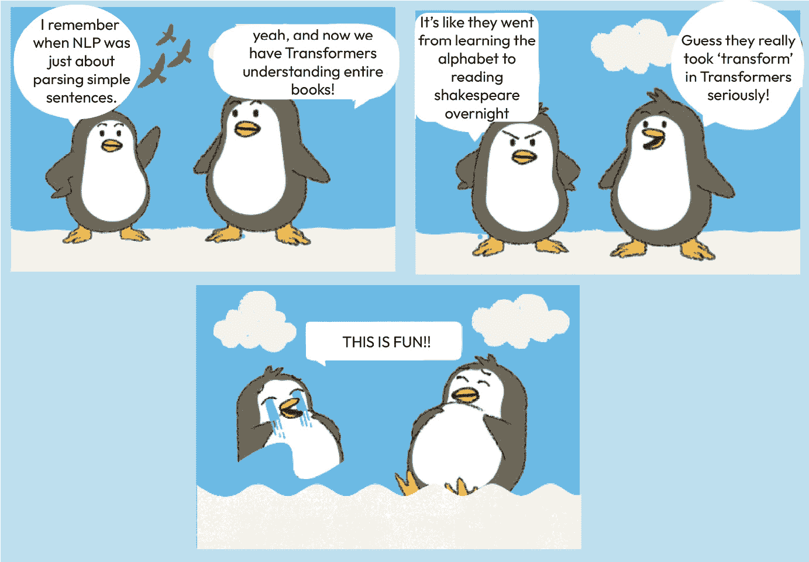
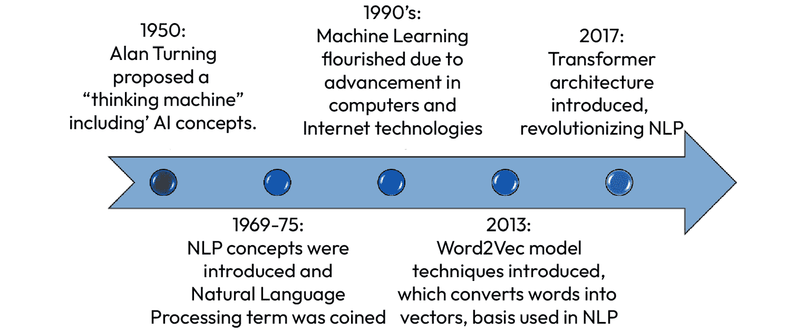
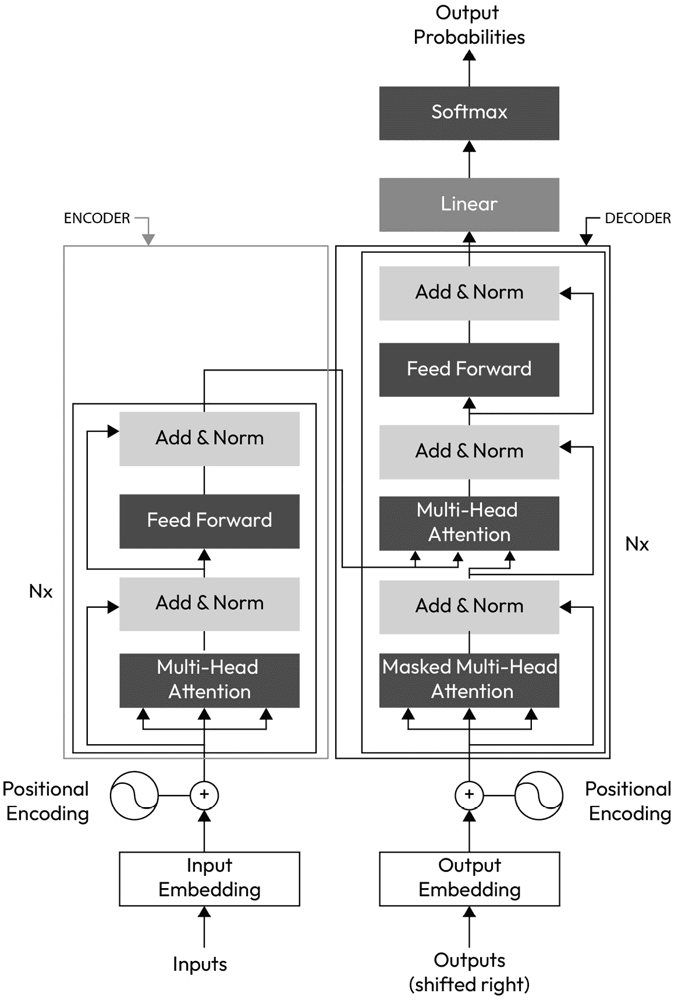
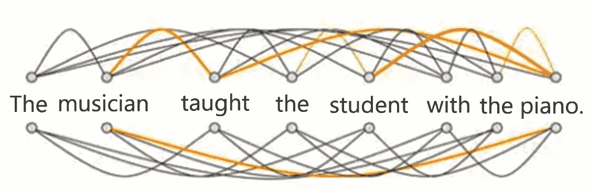
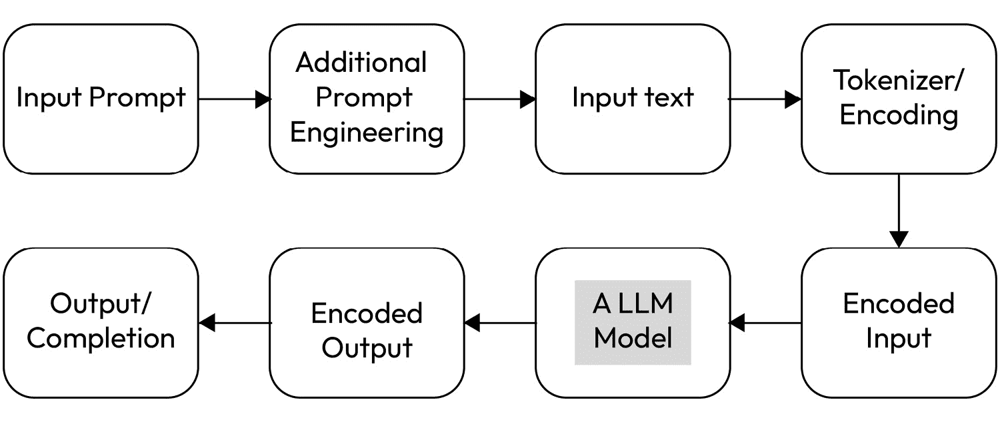

# 第二章：NLP 演变和 Transformer：探索 NLPs 和 LLMs

在前面的介绍性章节中，您对生成式 AI 有了基本了解，包括对生成式 AI 应用日益增长的复杂性的入门介绍，以及关于云计算的可扩展性和成本效益的简要介绍，以及数据存储、安全和协作的关键组件。您还了解到了生成式 AI 的一个更令人兴奋的方面，它也可能是一个障碍，那就是如何跟上像 GenAI 这样的尖端 AI 技术的最新发展。

在本章中，我们将探讨 ChatGPT 的能力，特别是关于其对话输入和响应能力。我们将深入探讨 LLMs 如何理解和响应用户查询，以及如何学习和适应新信息。提供的信息将有助于那些希望了解更多关于 AI 助手（如 ChatGPT）如何工作以及如何利用它们帮助人们更高效、更有效地找到信息的人；随后，我们将在此基础上扩展到第*第五章*中讨论的 NLP 和提示工程主题。在本章结束时，我们希望您通过探索各种基于文本的任务的能力，包括提示和响应、对话流程和集成，对 NLP 和生成式 AI 技术的进展有更深入的理解。

本章我们将涵盖以下主要内容：

+   NLP 演变和 Transformer 的兴起

+   对话提示和完成 – 内部机制

+   LLMs 的景观、进展和扩展

图 2.1 – Transformer 变得多么深刻

# NLP 演变和 Transformer 的兴起

NLP，或自然语言处理，是人工智能领域的一个分支，它使计算机能够使用常见的口语（或其他）语言来理解和操作人类语言，而不是像过去传统上给计算机作为输入的那样：计算机编程语言。在过去的几十年里，这些计算机编程语言变得更加“自然”，更加流畅：

图 2.2 – NLP 演变的简要时间线

随着时间的推移，在自然语言处理（NLP）领域取得了显著的进步，由于神经网络的出现，计算机在文本生成方面的能力不断提高。文本生成本身并不是一个新颖的想法，但 2017 年之前的早期语言模型主要利用了被称为**循环神经网络**（**RNNs**）和**卷积神经网络**（**CNNs**）的机器学习架构。

RNN 是一种擅长处理序列数据的神经网络架构。它们以顺序方式处理输入，将信息从一个序列步骤传递到下一个步骤。这使得它们在文本生成、翻译和情感分析等任务中非常有用。

CNN 是一种深度学习架构，它通过使用称为卷积层的专用层来处理和分析视觉数据，例如图像和视频。这些层应用过滤器从输入数据中提取相关特征，捕捉信息的模式和层次结构。CNN 主要用于计算机视觉中的图像分类、目标检测和图像分割等任务。在**自然语言处理**（**NLP**）中，CNN 也可以应用于文本分类和情感分析等任务，其中输入文本被转换为类似矩阵的结构，以捕捉词语或字符之间的局部模式和关系。

## RNN 和 CNN 的主要缺点

尽管 RNN 很复杂，但由于某些限制，它们的潜力无法完全发挥。RNN 在训练过程中经常遇到“梯度消失问题”，这阻碍了它们从长序列中学习和保留长期依赖关系的能力。

此外，RNN 固有的“顺序处理”不允许进行有效的并行化，这在深度学习模型中基于 GPU 的并行处理成为标准的时代，显著减慢了训练速度。

因此，RNN 在计算和内存方面有限。为了预测句子中的下一个词，模型需要知道不仅仅是前面的几个词；它们还需要理解句子、段落或整个文档中该词的上下文。

让我们通过使用以下句子来解释这个概念

“*海洋中的水含有大量的盐，有点波涛汹涌，而且* *尝起来* *很甜**。””

在前面的句子中，RNN 可能会生成一个延续，表明水是甜的而不是咸的。原因是它只考虑了最后几个词，而没有考虑整个句子的上下文。RNN 会忘记文本中较早的部分，这些部分可能表明来自海洋的水的味道。

同样，卷积神经网络通过自动通过卷积层学习层次特征，已经彻底改变了图像分析。尽管它们取得了成功，但 CNNs 在固定感受野大小和局部上下文中操作的限制，使得它们难以捕捉全局依赖关系和不同长度序列中存在的关联。例如，在图像分类中，虽然 CNNs 在识别局部模式方面表现出色，但它们难以把握图像的整体上下文，这阻碍了它们理解物体或区域之间复杂关系的能力。考虑一张猫追逐老鼠，狗在背景中观看的图片。CNN 可能会根据它们的局部特征有效地识别猫、老鼠和狗。然而，理解复杂的关联，例如猫在追逐老鼠，狗是一个被动的观察者，可能对 CNN 来说是一个挑战。

那么，我们是如何最终克服卷积神经网络（CNNs）的挑战的呢？这是通过使用一个被称为变换器模型架构及其“自注意力机制”的概念来实现的，这些内容将在下一节中描述。这不仅能够识别单个动物，还能捕捉到上下文交互，例如追逐序列和狗的被动姿态。

然而，在我们真正揭开变换器工作原理的层之前，以下是一个关于 NLP 结合 LLMs 优势的参考时间线。一旦你意识到好处和“为什么”，我们就可以深入探讨“如何”。

## NLP 和 LLMs 中生成式 AI 的优势

本节在下一节解释更多关于变换器的内容之前，提供了一个关于 NLP 与 LLMs 中生成式 AI 优势的概述：变换器是 LLMs 背后的强大引擎。

**大型语言模型**（**LLMs**）是极其强大的语言模型，正在改变我们对人类语言的理解和创造。但它们与自然语言处理（NLP）有什么联系呢？这是非常基础的。NLP 为解释和生成人类语言的结构和目标制定了框架，而 LLMs 则作为复杂的工具，在广泛规模上实现这些目标，以惊人的精确度处理复杂任务。

如前所述，自然语言处理（NLP）是机器学习的一个分支，它使计算机能够理解、处理和生成人类语言。它结合了计算机科学和语言学。例如，来自各种通信渠道的组织产生了大量的音频和文本数据。这些数据可以通过 NLP 模型进行处理，以自动处理数据、确定情感、总结，甚至找到关键主题或有效回应。

作为快速简单的例子，呼叫中心产生的音频数据可以被转换成文本，并通过 NLP 模型进行处理，以确定客户面临的问题以及客户的情感（无论是高兴、沮丧、冷漠等等）。

重要提示

自然语言处理（NLP）是搜索引擎（如 Bing 和 Google）、语音助手（如 Alexa 和 Siri）以及强大的对话代理（如 ChatGPT）背后的技术。

从这个角度来看，似乎自然语言处理技术应该满足我们的所有需求。那么，为什么我们还要处理 LLMs 和生成式 AI 呢？

通过简要回顾先前的演变时间线，我们可以将**高级 NLP**的诞生追溯到 2013 年，当时 Google 推出了 word2vec 模型，该模型基于上下文关系将单词转换成密集向量。向量被定义为具有大小和方向的物体，并以数值数组格式表示。

这是一项革命性的进步，因为它捕捉到了旧模型无法理解的语义细微差别。然而，它们无法专注于文本的不同部分以形成更全面的理解。例如，句子中的各种单词或多个句子不能相互关联，以全面理解句子或段落。这种局限性通过 2017 年论文《Attention Is All You Need》中引入的注意力机制得到了解决。这些机制导致了 Transformer 架构的出现，这是今天我们看到的基础 LLM 模型的骨干，它使模型能够形成对文本的理解，而不仅仅是单词和句子。关于这一点，我们稍后会详细讨论，但首先，让我们来看看为什么我们要使用 LLMs，以及 LLMs 可以增强 NLP 的哪些领域。

NLP 加上 LLMs 等于扩展的可能性：

+   **理解语言**：LLMs 擅长理解和处理各种语言输入，使它们在多种语言任务中非常有用。LLMs 可用于构建高级聊天机器人和虚拟助手。它们可以理解并回应客户咨询，提供信息并执行任务，提高客户服务的效率和品质。

+   **文本生成**：LLMs 可以生成连贯且上下文适当的文本，使聊天机器人、内容创作、文案撰写等应用成为可能。

+   大型语言模型（LLMs）可以通过推荐和建议单词或审查你的内容来提高内部和外部沟通的效率。

+   **语言翻译**：LLMs 可以直接在不同语言之间翻译文本，促进跨文化交流和语言学习。

+   由于 LLMs 可以提供多种语言之间的翻译，这可以帮助企业在全球化世界中更有效地运营，打破语言障碍。

+   **情感分析**：LLMs 可以分析文本以确定其情感（正面、负面或中性），为如客户反馈分析等应用提供有价值的见解。LLMs 可以分析客户反馈、评论或社交媒体帖子，以评估公众对一个品牌、产品或服务的看法。这有助于商业策略和决策过程。

+   **问答**：LLMs 可以理解和提供对广泛问题的准确答案，这使得构建特定组织的搜索引擎成为可能。

+   **文本摘要**：LLMs 可以将长篇文本压缩成更短的摘要，有助于信息处理和理解。LLMs 可以总结长文档、文章或报告，使得快速消化大量信息并识别关键区域或下一步行动变得更加容易。

+   **适应性**：LLMs 可以以各种风格、语气或格式生成文本，适应特定的用户需求或应用要求。例如，你可以要求 ChatGPT 以海盗风格为你的 6 岁孩子定义并描述植物的光合作用。与此相关的是，通过使用关于用户行为和偏好的数据，LLMs 可以生成个性化的内容或产品推荐，从而改善用户体验并可能增加零售企业的销售额。

+   **上下文维护**：尽管它们只有短期记忆，但通过适当的提示工程技巧，LLMs 可以在扩展交互中维持对话上下文，提高其回答的连贯性和相关性。我们将在本书的*第五章*中介绍提示工程技巧。

+   **创造力**：大型语言模型（LLMs）可以生成新颖的文本，为故事生成或诗歌创作等创意应用提供了更多可能性。从撰写文章、报告和营销文案到生成创意内容，LLMs 可以自动化并增强各种内容创作任务。

在这里，我们列出了一些大型语言模型增强自然语言处理功能性的领域。既然你已经认识到 LLMs 可以为任何 NLP 服务以及我们的日常生活提供增强，那么让我们继续下一步：深入探讨 Transformer 和注意力机制，这是 LLMs 运行生成式 AI 能力的来源。

## 变压器是如何工作的？

Transformer 架构的引入解决了 RNN 和 CNN 的先前不足。Transformers 使用注意力机制，这使得模型在生成输出中的每个单词时能够关注输入的不同部分。简单来说，注意力机制衡量句子、段落或部分中单词之间的关系。对于 LLMs，底层的 Transformer 是一组包含编码器组件和解码器组件的深度学习神经网络，这些组件存在于自注意力能力的概念中。在自注意力过程中，LLM 会根据当前正在处理的单词的相关性为不同的单词分配权重，这就是模型获得其力量的原因。这种注意力机制动态地使 LLMs 能够关注关键上下文信息，同时忽略不相关的项目/单词。换句话说，编码器和解码器组件从一系列文本中提取意义，并理解其中单词和短语之间的关系。

这使得 Transformer 相比于 RNN 和 CNN，能够更好地保持长期 **上下文** 的感觉。位置编码允许处理序列顺序，而 Transformer 允许序列的 **并行处理**，这使得 LLMs 的训练速度比 RNNs 快得多。支撑 ChatGPT 的基础模型，即 GPT 模型，采用了这种 Transformer 架构。

当首次引入时，Transformer 架构最初是为翻译设计的，并在谷歌现在著名的出版物《*Attention is All You Need*》中有描述（参见[`arxiv.org/abs/1706.03762`](https://arxiv.org/abs/1706.03762)以深入了解）。从这篇出版物中，我们展示了以下图像中的原始 Transformer 架构，并在左侧添加了编码器，在右侧添加了解码器，以便您从高层次理解：

图 2.3 – Transformer 模型架构

尽管前面的图像可能对一些人来说令人畏惧，尤其是对生成 AI 领域的新手来说，您并不一定需要像大多数人不需要了解汽车引擎的内部工作原理一样，对 Transformer 模型架构的每个子组件有深入的了解。我们只会涵盖 Transformer 架构的主要输入和输出，在本章的后面有一个简化的视图来描述一些内部工作原理和流程。我们将继续强调和重复 Transformer 模型的各个方面，因为这可能是一个难以理解的概念，尤其是对于初学者和 LLMs。

从 2017 年语言翻译的原始目的出发，Transformer 模型架构成为了未来生成式 AI 模型的底层框架，导致了 ChatGPT 的出现；GPT 中的字母 `T` 代表 **Transformer**（GPT）。

## 转换器的优势

如前所述，转换器是一种神经网络架构，它用完全基于注意力的机制取代了传统的 RNN 和 CNN。

但注意力机制是如何工作的呢？

注意力机制通过计算上下文窗口中每个词的“软”权重来实现这一点，在转换器模型中是并行进行的，而在 RNN/CNN 模型中是顺序进行的。这些“软”权重在模型运行时可以，并且经常发生变化。

转换器的优势如下：

+   它们可以高效地扩展以使用多核 GPU 和并行处理训练数据；因此，它们可以利用大得多的数据集。

+   它关注输入的意义。

+   它们学习每个词在句子/段落中的相关性和上下文，而不仅仅是像 RNN 和 CNN 那样学习邻近的词。

让我们看看从转换器的角度，句子“*The musician taught the student with the piano*”中的词是如何相互关联的视觉表示：

图 2.4 – 句子上下文关系

如前例所述，转换器能够连接每个词，确定输入中每个词之间的关系（即使它们是紧邻的词），并理解句子中词的上下文。在前面的图像中，彩色线条代表更强的关系。

因此，转换器使用现代数学技术，如注意力和自注意力，来确定数据元素之间的相互关系和依赖性，即使它们相隔很远。这使得模型能够学习谁教了学生以及用什么乐器等。

转换器深度学习架构中有多个层，如嵌入层、自注意力和多头注意力，以及多个编码器模型本身。虽然对转换器架构的深入了解对于成功的提示工程或理解生成式 AI 不是必需的，但了解转换器模型，这是 LLMs 和 ChatGPT 底层架构的关键方面，对于任何云解决方案设计都是重要的。

既然我们已经讨论了优势，让我们也提一下转换器的一个负面方面；它们有时会产生副产品，这也会影响 LLMs，我们在第一章中简要提到了这一点，但在这里再次提及，因为我们正在讨论转换器，那就是“幻觉”的概念。幻觉基本上是 LLM 模型返回的错误信息。这种幻觉是响应输出，与提示不一致，通常是由于几个原因，例如用于训练 LLM 模型的实际训练数据本身不完整或不准确。我们想在这里提一下，但将在后面的章节中讨论幻觉。

现在，让我们深入探讨 transformer 架构的内部工作原理，并通过一些示例更深入地探索 transformer 概念。

## 对话提示和完成 - 内部机制

提示，或者你或应用程序/服务输入的内容，在 NLP + LLMs 中起着至关重要的作用，因为它促进了人类与语言模型之间的交互。

如果你曾经有过与 GenAI 相关的经验，你可能已经在一个在线服务中输入过提示，例如 chat.bing.com。提示对于 LLM 来说，就像搜索词对于搜索引擎一样，但每个都可以接受提示输入并针对该输入执行一些操作。就像你会在搜索引擎中智能地输入搜索词来找到你想要的内容一样，同样，智能地输入提示也是一样的。这个概念被称为提示工程，我们将在本书后面的章节中专门讨论提示工程，其中将描述如何编写一个有效的提示以获得所需的结果。

对于那些刚接触生成式 AI 领域的人来说，可能会 wonder 为什么我们需要了解如何编写提示。让我们提供一个简单的类比：如果你想到一个**数据库管理员**（DBA），他需要从包含许多表（例如，典型的客户销售数据库）的大量数据库中提取（查询）特定数据，以便了解销售趋势和预测，确保有足够的产品，你必须分析历史数据。然而，如果 DBA 无法构建一个合适的查询来构建过去销售历史的报告，任何预测和未来趋势都将完全错误。

同样，一个构建不良的提示就像使用一把钝刀，你不太可能得到好的结果。因此，提示工程对于生成有用的响应至关重要。

现在，让我们更详细地看看 transformer 的输入。

# 提示和完成流程简化

已经有无数个 transformer 模型，例如**GPT**、**Llama 2**、**Dolly**、**BERT**、**BART**、**T5**等等。这些本质上都是 LLM，正如你从*第一章*中已经知道的，它们是以自监督的方式在大量无结构文本上训练的。在这种自监督学习中，训练目标自动从模型的输入中导出，消除了对人工标注标签或输入的需求（关于这一点，本节后面将详细介绍）。这使得 transformer 模型或 LLM 在参数方面变得巨大。GPT-4 alone 就有超过 1750 亿个参数。Sam Altman 表示，仅训练 GPT-4 的成本就超过 1 亿美元([`www.wired.com/story/openai-ceo-sam-altman-the-age-of-giant-ai-models-is-already-over/`](https://www.wired.com/story/openai-ceo-sam-altman-the-age-of-giant-ai-models-is-already-over/))！

这样的模型对其训练语言获得了统计上的理解。然而，它们对于特定的实际任务并不是特别有用。为了克服这一点，预训练模型经过了一个称为迁移学习的过程。在这一阶段，模型以监督的方式进行微调，这意味着它使用针对特定任务的标注数据。我们将在下一章更详细地介绍微调，但就目前而言，让我们看看简单任务的整体流程。这样的任务之一可能是阅读前 `n` 个单词后预测句子中的下一个单词。这被称为因果语言模型，因为输出依赖于过去和现在的输入，但不依赖于未来的输入。

让我们通过使用金融新闻文章作为输入，并使用摘要 LLM 模型总结文档，来看看这个简化的输入/输出流程，映射到变压器模型架构：

图 2.5 – 典型 LLM 中提示/补全工作简化的视觉表示

在前面的简化变压器架构中，交互是描述在白色框中的输入/输出。较大的灰色框是用户交互之外进行的全部处理。前面图像中提示和补全序列中的某些阶段包括以下内容：

+   **输入提示**：用户通过提供输入与系统交互。这种输入可以存在于各种形式，如文本、语音或其他模式。在我们的例子中，金融新闻文章是输入。

+   **额外的提示工程**：在总结新闻文章的情况下，通常我们不需要额外的提示工程。尽管我们将在后面的章节中专门介绍提示工程，但了解不同的提示会产生不同的结果/补全，提示本身也是一种技能就足够了。

+   **输入文本**：这是将最终输入以人类可读的形式接收并传递给计算机处理（分词器）的区域。例如，这可能包括原始用户输入和任何额外的输入，如数据集。在我们的例子中，我们使用了一篇金融新闻文章来总结；然而，这完全可以包括许多额外的数据点，例如金融平台的歷史数据集，如美国股市。

+   **分词器**：在这一层，新闻文章会被转换成标记并编码成向量化的服务（更多内容请参考*第四章*，RAGs to Riches）。

+   **编码输入**：编码器将每个标记化部分作为输入，并处理和准备 LLM 摘要模型的编码。

+   **总结模型（一个 LLM）**：这是最辛苦的一层，其中包含了 LLM 模型的深度学习神经网络。LLM 将为每个词添加关系权重，以生成相关上下文，在我们的金融新闻文章示例中，它将文章总结为简短、相关、上下文的概念。

+   **编码输出和解码器（编码器）**：解码器从编码器及其内部状态接收处理过的信息，以形成响应。这种响应可以表现为文本、音频，甚至用于下游使用的动作。在我们的例子中，输出是一个编码的文本摘要，它仍然以数值格式存在。

+   **输出/完成**：这是返回给您的信息，也称为输出。在我们的长金融新闻文章示例中，您现在拥有一个总结的、简短的文章。

如您在我们前面的简单示例中所见，将较长的文章（或任何其他文本输入）作为输入，会生成一个总结文章，其中所有显著点都以简短且易于消化的格式突出显示。这适用于许多相关商业和个人场景，我相信您能想到如何将其应用到您的日常任务中。这一切都归功于变换器架构！

除了前面的说明，如本节开头所述，提示也可以包括来自其他服务或 LLM 查询的输出，而不是直接的用户输入。换句话说，而不是人类与 LLM 模型互动并提问或给出提示，输入到 LLM 模型中的实际上是另一个完成的输出。这允许将一个模型的输出链接到另一个模型的输入，从而允许创建复杂和动态的交互、任务或应用。

# LLMs 的领域、进展和扩展

我们可以写很多章节来讲述现代 LLM 如何利用变换器模型架构，以及其爆炸性的扩展和几乎每天都有新模型被创建的情况。然而，在本节的最后部分，让我们提炼 LLM 的使用及其迄今为止的进展，并使用 AutoGen 添加一个令人兴奋的新层，以扩展 LLM 的功能。

## 探索变换器架构的领域

由于它们能够处理众多任务，变换器模型已经彻底改变了自然语言处理领域。通过调整其架构，我们可以创建不同类型的变换器模型，每种模型都有其独特的应用。让我们深入了解三种流行的类型：

+   **仅具有编码器的模型**：这些模型仅配备编码器，通常用于涉及理解输入上下文的任务，例如文本分类、情感分析和问答。一个典型的例子是谷歌的双向编码器表示（BERT）。BERT 因其能够理解双向上下文（从左到右和从右到左）的能力而脱颖而出，这得益于其在大量文本语料库上的预训练。这种双向上下文理解使 BERT 成为情感分析和命名实体识别等任务的流行选择。

+   **仅具有解码器的模型**：这些模型仅使用解码器，主要用于涉及生成文本的任务，如文本生成、机器翻译和摘要。GPT（生成式预训练变压器）是这类模型的典型例子。GPT 因其通过单向解码器实现的自回归语言建模的创造性文本生成能力而备受赞誉。这使得 GPT 特别擅长故事生成和对话补全等任务。

+   **同时具有编码器和解码器的模型**：这些模型结合了编码器和解码器，适合需要理解输入并生成输出的任务。这包括机器翻译和对话生成等任务。T5（文本到文本迁移变压器）是这一类别的代表。T5 提供了一个统一的框架，其中每个 NLP 任务都被视为一个文本到文本问题，同时使用编码器和解码器。这使得 T5 具有非凡的通用性，能够处理从摘要到翻译的广泛任务。

通过理解这些不同类型的变压器模型，我们可以更好地欣赏变压器架构在处理各种 NLP 任务时的灵活性和强大功能，这有助于我们选择最适合云解决方案用例的模型。

在后续章节中，当你了解更多关于 LLMs 以及它们未来发展方向时，请记住这些模型正在迅速演变，它们的支持服务和框架也在迅速演变。一个既在演变又在扩展的令人兴奋的领域是围绕 AutoGen 概念的应用。

## AutoGen

在撰写本文时，微软研究院正在对下一个重大突破进行重要研究：自主代理，或称为 AutoGen。AutoGen 的目标是将大型语言模型（LLMs）和变压器模型架构的演变提升到新的水平。微软 AutoGen 框架是一个开源平台，用于构建使用大型语言模型的多元代理系统；我们相信这将显著影响生成式人工智能领域。

因此，在*第六章*的后续部分，我们将描述由大型语言模型驱动的自主代理的概念和潜力，以及它们如何增强人类能力并解决复杂问题。我们还将展示使用 AutoGen 的 LLM 模型如何通过各种提示工程技术执行推理、规划、感知、自我改进、自我评估、记忆、个性化以及通信等任务。

如您可能已经得出的结论，一旦我们了解多个大型语言模型+AutoGen 如何以不同的方式协同工作，例如在层次结构、网络或群体中，以增加计算和推理能力并解决更复杂的问题，包括可能今天甚至不存在的问题，那么可能性将是无限的！

# 摘要

在本章中，我们介绍了生成式 AI 及其应用，如 ChatGPT，并概述了涉及的主要概念和组件，如云计算、NLP 和 Transformer 模型。自 2017 年引入以来，原始的 Transformer 模型已经扩展，导致模型和技术的爆炸性增长，这些模型和技术的应用范围已远远超出仅限于 NLP 类型的任务。

我们还简要回顾了 NLP 从 RNNs 和 CNNs 到 Transformer 模型的发展历程，并解释了 Transformer 如何通过使用注意力机制和并行处理来克服前者的局限性。我们涵盖了提示或用户输入如何被 Transformer 模型处理以生成响应或完成，使用各种变量和场景。

最后，我们简要概述了 LLM 领域的概览以及各种 Transformer 架构如何用于各种任务和不同的用例，包括它们的进展，以及它们如何扩展到 LLM 模型本身之外的不同领域，例如 AutoGen，我们将在*第六章*中深入探讨。

在下一章中，我们将讨论通过使用微调的概念来构建特定领域的 LLMs；然后，我们将讨论 LLM 模型管理中的下一个逻辑步骤，以及您在生成式 AI 工具箱中需要的重要工具！

# 参考文献

+   Transformer 论文：*Attention is All You Need*；[`arxiv.org/abs/1706.03762`](https://arxiv.org/abs/1706.03762)

+   *训练 GPT-4 的成本超过 1 亿美元*；[`www.wired.com/story/openai-ceo-sam-altman-the-age-of-giant-ai-models-is-already-over/`](https://www.wired.com/story/openai-ceo-sam-altman-the-age-of-giant-ai-models-is-already-over/)

+   *Transformer 架构：ChatGPT 背后的引擎*；[`tinyurl.com/6k99bw98`](https://tinyurl.com/6k99bw98)

# 第二部分：调整 LLMs 的技术

本节突出了近年来出现的关键技术，这些技术用于针对特定商业需求定制**大型语言模型**（**LLMs**），例如微调。它还讨论了当前挑战，包括减轻幻觉和延长训练截止日期，通过如**检索增强生成**（**RAG**）等方法来整合最新信息。此外，我们将探讨提示工程技术，以增强与人工智能的有效沟通。

本部分包含以下章节：

+   *第三章*, *微调：构建特定领域 LLM 应用*

+   *第四章*, *RAGs to Riches：利用外部数据提升人工智能*

+   *第五章*, *有效提示工程策略：通过人工智能开启智慧*
