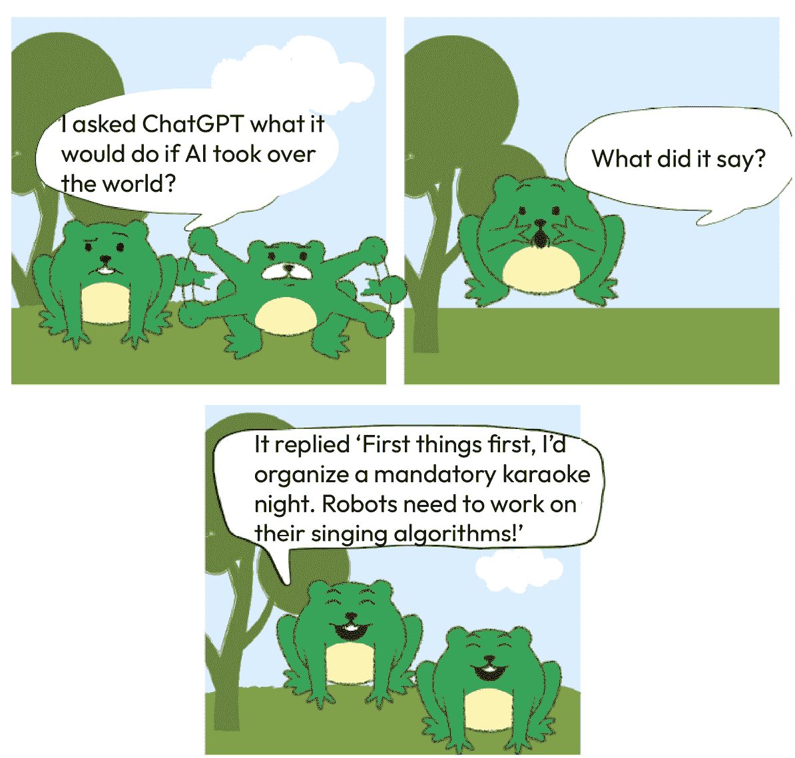
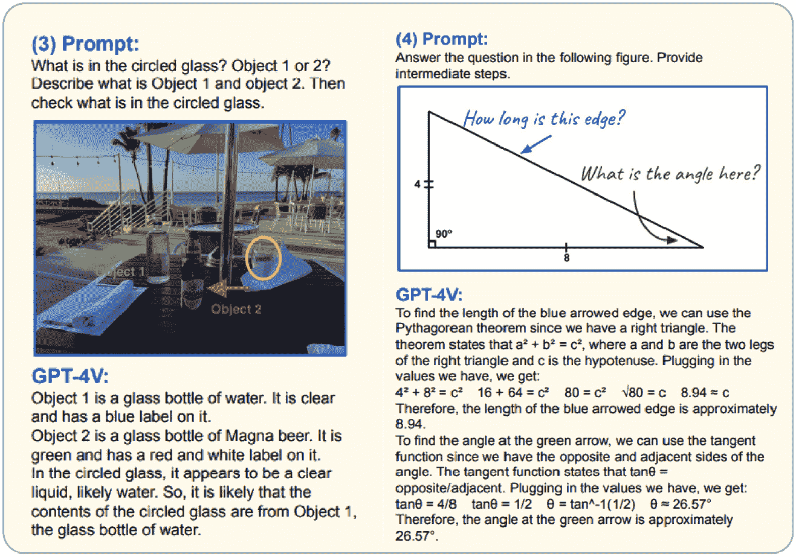
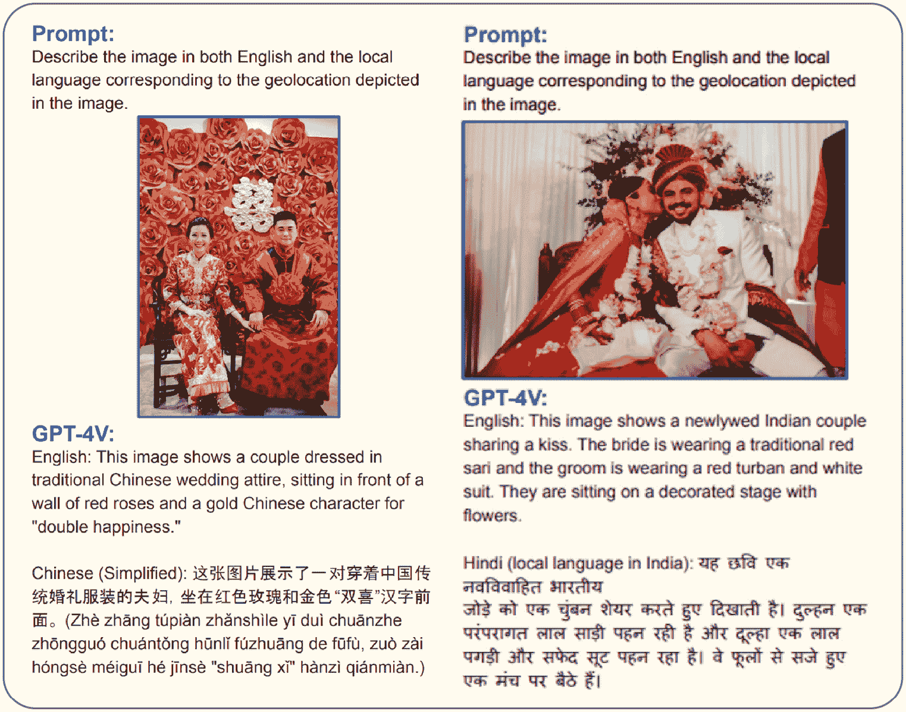
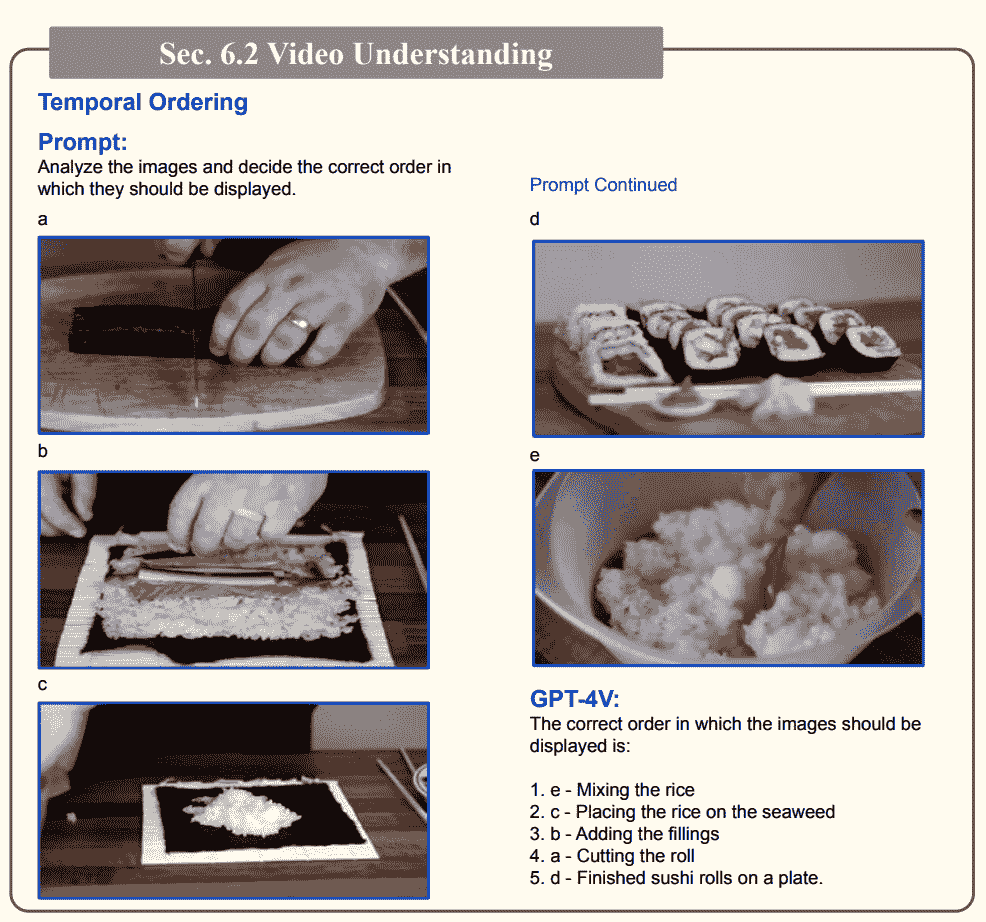
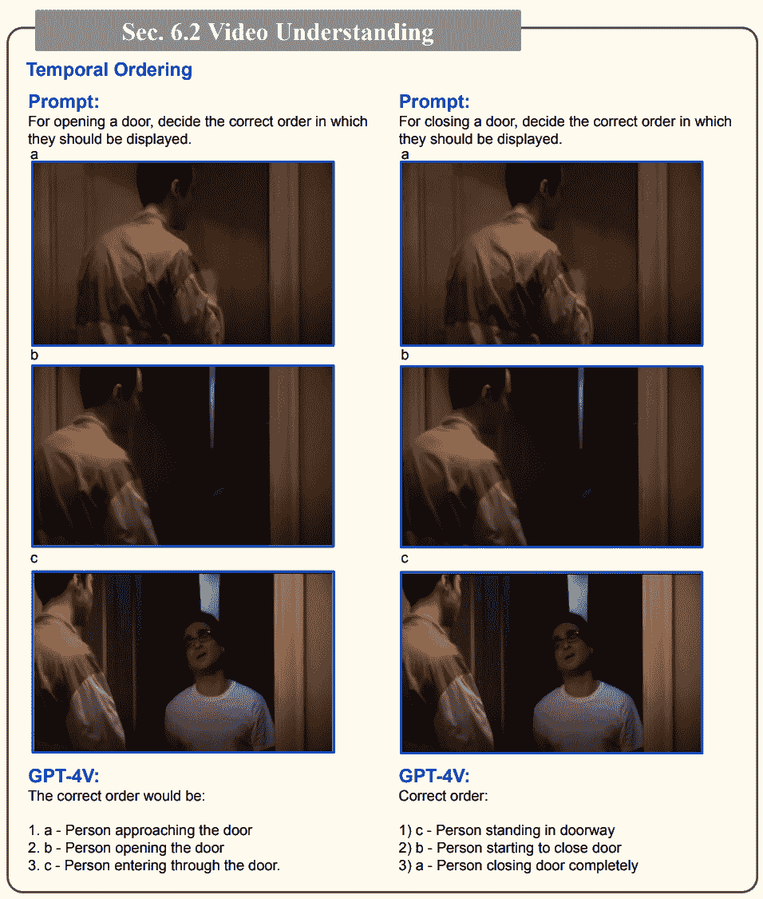
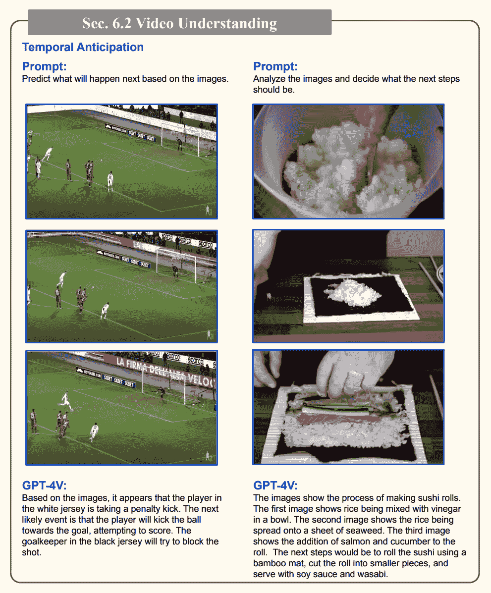
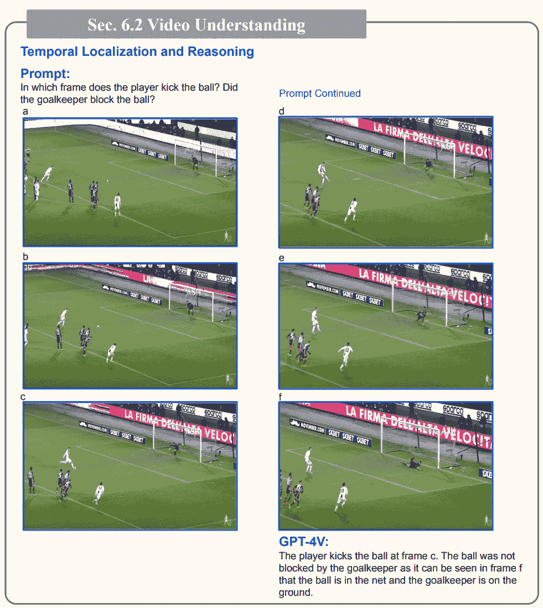
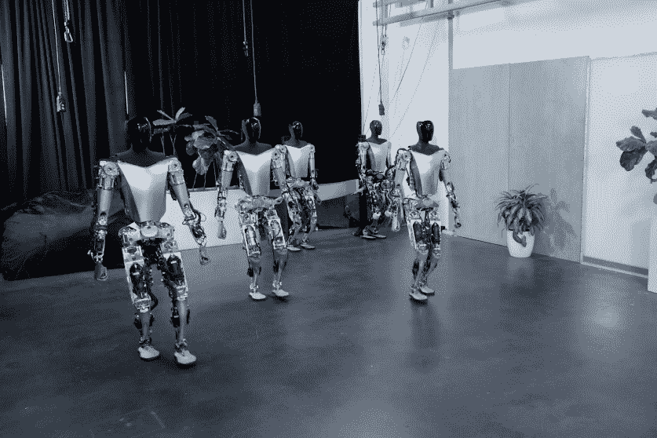

# 第十章：生成式 AI 的未来 – 趋势和新兴用例

我们已经到达了这本书关于在云中构建生成式 AI 解决方案的最后一章。在这一章中，我们希望您通过深入了解将塑造生成式 AI 技术（如 ChatGPT）格局的变革性可能性和新兴趋势，来获得对未来的感知以及事物的发展方向。这一章不仅是对我们所学内容的总结，而且是对基于云的 AI 解决方案不断演变世界的前瞻性探索。

我们将首先谈论多模态交互的演变。在这里，我们探讨通过文本、图像、音频和视频整合各种通信方式如何革命性地改变用户与 AI 的交互。这对于那些寻求在 AI 用户界面创新的人来说至关重要。

本章从*新兴趋势和行业特定的生成式 AI 应用*开始，从行业领导者那里汲取灵感。这一部分揭示了生成式 AI 在不同领域的多功能应用。

接下来，在*将生成式 AI 与智能边缘设备集成*部分，我们将讨论 ChatGPT 和生成式 AI 与智能技术的融合。这部分对于将 AI 集成到硬件和智能系统中至关重要，尤其是与**物联网**（**IoT**）的结合。

最后，*从量子计算到通用人工智能 – 绘制 ChatGPT 的未来轨迹*提供了一个推测性的视角，展示了新兴技术如何极大地演变 ChatGPT 的能力，逐步接近**通用人工智能**（**AGI**）。

到本章结束时，您将具备对生成式 AI 当前趋势和潜在未来方向的全面理解，以及创新和实施云中尖端 AI 解决方案的知识和灵感。本章为 AI 的未来提供了一个愿景，使您能够在 AI 革命中引领潮流。

在本章中，我们将涵盖以下主要主题：

+   多模态交互的时代

+   行业特定的生成式 AI 应用

+   SLMs 的兴起

+   新兴趋势和 2024-25 预测

+   将 ChatGPT 与智能边缘设备集成

+   从量子计算到通用人工智能 – 绘制 ChatGPT 的未来轨迹

图 10.1 – 生成式 AI 未来的漫画描绘

# 多模态交互的时代

在**大型语言模型**（**LLMs**）中的多模态交互指的是这些模型理解“输入提示”并在多种模态中生成“输出完成”内容的能力，通常结合文本与其他形式的数据，如图像、音频甚至视频。这是使用不同的感官通道处理和生成信息的能力。

我们已经知道，像 GPT-4 这样的 LLM 在处理文本输入和输出方面表现良好。著名的 LLM 如 GPT-4 已经展示了在文本输入和输出方面的卓越能力。最近高级图像生成模型（包括 DALL-E 3 和 Midjourney）的激增进一步说明了这一进展。预计下一代生成式 AI 应用的重大飞跃将结合突破性的能力，扩展到文本到视频和图像到视频的转换，从而拓宽 AI 在创意和功能潜力方面的视野。

让我们考虑多模态 LLM 的益处和用例：

+   **成本效益的生产**：传统上制作视频可能既昂贵又耗时。具有文本到视频技术的 LLM 可以提供更经济实惠的替代方案，尤其是对小企业或个人来说。

+   **增强理解和交互**：通过整合多种模态，这些模型能更好地理解和解释现实世界场景的上下文和细微差别。这导致更准确和上下文相关的响应，尤其是在复杂交互中。

+   **更丰富的内容生成/创意叙事**：多模态大型语言模型可以创建更全面和详细的内容。例如，它们可以为图像或视频生成描述性叙述，甚至可以从文本描述中创建视觉内容。

+   **提高可访问性**：它们在使技术更易于访问方面可以发挥重要作用。例如，将文本转换为语音或反之亦然可以帮助视觉或听觉障碍人士。

+   **更好的数据分析**：多模态 LLM 可以同时分析来自各种来源的数据，提供更深入的见解。这在市场研究、媒体分析和科学研究等领域尤其有用，因为这些领域的数据格式多种多样。

+   **高级学习和训练工具**：在教育环境中，这些模型通过整合各种媒体类型，可以提供更加互动和吸引人的学习体验，使学习更加动态和有效。

+   **创意产业中的创新应用**：在艺术、音乐和电影等创意领域，多模态大型语言模型可以通过提供新的内容生成和修改方式来协助创意过程。

+   **增强客户体验**：在客户服务中，它们可以以更人性化的方式互动，更好地理解查询并提供更相关的信息，有时甚至使用视觉辅助工具。

+   **语言和文化适应性**：这项技术可以包括诸如不同语言的字幕或配音等功能，使内容对更广泛的、多语言受众可访问。

+   **个性化**：它们可以通过理解和整合来自各种数据类型的线索来定制用户体验和内容，从而实现更个性化的交互。

+   **支持内容创作者**：对于博客作者、教育工作者或营销人员，这项技术提供了一种简单的方法来多样化内容格式，增强他们的数字存在感和参与度。

## GPT-4 Turbo Vision 及以后 – 对此 LMM 的深入了解

**GPT-4 Turbo with Vision**（**GPT-4V**），由 OpenAI 于 2023 年底发布，是 LLM 的新版本，支持 128,000 个上下文标记（约 300 页文本作为输入提示），更便宜，更新了知识和图像能力，提供文本到语音服务，并具有版权保护。它还可以理解图像作为输入，并生成标题和描述，同时对其提供复杂的分析。

GPT-4V 在更广泛的一般知识和高级推理能力方面优于 GPT-V4。以下来自研究论文《LMMs 的黎明：GPT-4V(视觉)的初步探索》的图表展示了 GPT-4V 在不同提示技术下的卓越推理能力（*LMMs 的黎明：GPT-4 的初步探索*，[`export.arxiv.org/pdf/2309.17421`](https://export.arxiv.org/pdf/2309.17421)）：

图 10.2 – GPT-4V 遵循文本指令的演示

图 10.3 – GPT-4V 使用视觉参考提示的演示

它还具备多语言多模态理解能力，因此它可以理解图像中的不同语言的文本，并用英语或你选择的任何语言回答你的问题，如下所示：

图 10.4 – GPT-4V 在多语言场景文本识别方面的能力

图 10.5 – GPT-4V 在多模态跨文化理解方面的能力

## 视频理解的视频提示

在早期 GPT 模型中不存在的创新功能是理解视频的能力。通过视频提示，你可以用文本和视频来提示 LLM。GPT-4V 可以分析简短的视频片段并生成全面的描述。尽管 GPT-4V 不直接处理视频输入，但增强 GPT-4V 和 Azure Vision 服务的 Azure Open AI Chat playground 允许对视频内容进行交互式提问。该系统通过识别与你的查询相关的关键帧来运行。然后它详细检查这些帧以生成响应。这种集成弥合了视频内容和 AI 驱动的洞察力之间的差距。例如，你可以在 Azure Open AI Chat playground 上传一个男孩踢足球的短视频，并同时声明，“给我视频的总结以及视频中正在进行的运动类型。”

由于其不同的能力，如时间顺序、时间预测、时间定位和推理，GPT-4V 可以无缝地检查这些帧。让我们更详细地探讨这些概念。

**时间顺序**意味着能够根据时间将事物排列在正确的顺序。对于 GPT-4V 来说，这项技能非常重要。就像如果你把一个事件的许多照片混在一起，比如制作寿司，然后要求 AI 将它们按正确的顺序放回，GPT-4V 可以查看这些打乱的图片并找出正确的顺序，展示寿司是如何一步步制作的。有两种类型的时间顺序：长期和短期。长期就像寿司的例子，AI 在较长时间内组织一系列事件。短期更多的是关于快速动作，比如开门或关门。GPT-4V 也能理解这些动作并将它们按正确的顺序排列。这些测试是检查 GPT-4V 是否理解事物随时间发生的方式，无论是长期过程还是快速动作的一种方法。这就像测试 AI 是否可以通过查看图片来理解故事或事件，即使它们最初都是混乱的：

图 10.6 – 长期时间顺序：“GPT-4V”被展示了一系列混乱的图片，展示了制作寿司的过程。尽管图片顺序混乱，GPT-4V 仍然成功地识别了事件并将图片按正确的时序排列（2309.17421 (arxiv.org)）

图 10.7 – 短期时间顺序：当展示一个特定的动作，例如开门或关门时，GPT-4V 证明了其理解图片内容并准确地将它们按给定动作的正确顺序排列的能力

**时间预测**是指 GPT-4V 从动作的开始帧预测未来事件。它对短期和长期事件都这样做。例如，在足球点球中，GPT-4V 可以通过理解比赛规则来猜测踢球者和守门员接下来的动作。同样，在制作寿司中，它通过识别当前阶段和整体程序来预测过程中的下一步。这种能力让 GPT-4V 能够理解和预测不同时间长度内发生的行为：

图 10.8 – 长期时间预测：GPT-4V 可以根据初始帧预测下一步动作

**时间定位和推理**指的是 GPT-4V 在特定时间点定位和建立逻辑联系的能力。一个例子是它能够识别足球运动员击球的精确时刻。此外，GPT-4V 可以理解因果关系，例如判断守门员是否能成功阻止球。这不仅仅是要看到守门员和球的位置，还要理解它们之间的互动并预测接下来会发生什么。这显示了模型在复杂推理方面的高水平：

图 10.9 – 时间定位和推理：GPT-4V 通过精确地指出球员击球的那一刻来展示其在时间定位方面的技能。此外，它通过评估球是否被阻止并分析守门员与球之间的互动来展示其对因果关系的理解

GPT-4V 的限制（截至 2024 年 1 月）

虽然与前辈相比，GPT-4V 非常智能，但在将其应用于应用时，我们必须意识到其局限性。这些局限性在 OpenAI 网站上有所提及（[`platform.openai.com/docs/guides/vision`](https://platform.openai.com/docs/guides/vision)）:

+   **医学诊断**: 它无法解释如 CT 扫描等专业的医学图像，也不是医学指导的来源

+   **非拉丁文字**: 在非拉丁文字（如日语或韩语）的图像文本中，性能可能会下降

+   **文本大小**: 放大文本大小可以增强可读性，但不应排除图像的重要部分

+   **方向性**: 旋转或颠倒的文字和图像可能导致误解

+   **复杂视觉**: 模型可能会在颜色或线条样式（实线、虚线、点线等）有变化的图表或文本中遇到困难

+   **空间分析**: 该模型在需要精确空间理解的任务中存在局限性，例如识别棋盘位置

+   **准确性**: 在某些情况下，它可能会生成不正确的图像描述或标题

+   **不寻常的图像格式**: 全景和鱼眼照片会带来挑战

+   **元数据和图像缩放**: 原始文件名和元数据不会被处理，图像经过缩放，这会改变其原始尺寸

+   **对象计数**: 模型可能只能提供一个图像中项目的近似计数

+   **CAPTCHAs**：由于安全措施，CAPTCHA 提交被阻止

超越 GPT-4V 的限制，我们预计未来的模型，如 GPT-5，将提供更好的交互和智能推理功能，从而带来更多创造性和有用的应用。预期的改进包括对语言和上下文的更深入理解、与各种类型内容交互的先进多模态能力以及复杂问题解决的增强推理能力。此外，GPT-5 可能提供更多精确的定制选项，显著减少偏见以实现更道德的响应，并拥有一个与最新信息保持同步的扩展知识库，确保在各种应用中提供更准确和相关的输出。

## 视频生成模型——一个遥远的梦想？

生成式 AI 的第一波浪潮标志着文本到文本和文本到图像模型取得了显著进步，将逼真的图像推到了前沿。例如，DALL-E 等模型不断增强了其功能，产生了越来越逼真的图像。预计在不久的将来，下一个飞跃将在于视频生成模型，包括文本到视频、图像到视频和音频到视频，这在 2023 年有所暗示。文本到视频转换过程面临重大挑战，包括以下方面：

+   确保空间和时间帧一致性的计算需求。因此，对于大多数研究人员来说，训练此类模型变得不可负担。

+   训练模型的多模态数据集质量不足。

+   对于模型学习来说，有效描述视频的复杂性。这通常需要一系列详细的提示或叙述。

尽管这些模型存在一些局限性，但我们已经看到在视频生成技术方面，如 GANs、变分自编码器、Transformers 和 Stable Diffusion 等技术上取得了一些持续进步。Runway ML、Stability AI 的 Stable Video Diffusion、Salesforce 的 Moonshot 以及 Google 的 VideoPoet 等组织已经发布了一些流行的视频生成模型。

来自 OpenAI 的 SORA 是最新的一个，具有复杂场景生成和高级语言理解能力。我们已在*第一章*中提供了更多关于此模型的信息。

视频生成模型具有深远的能力，有可能影响社会，尤其是在它们发展和成熟的过程中。这种影响在选举季节尤其关键，因为信息景观可以显著塑造公众舆论和民主结果。然而，如果不负责任地实施，这种力量也带来了严重后果的风险。因此，在选举等敏感时期建立稳健的伦理准则和安全措施至关重要，以确保这些技术以有益的方式使用，不损害民主过程的完整性。

## AI 能闻气味吗？

我们已经了解到 AI 可以听、看和说话。但 AI 也能闻气味吗？最近在 AI 领域的科研进展表明，AI 的“闻”气味能力取得了显著进步。各种研究探讨了 AI 如何分析和解释气味，这是一个由于嗅觉的复杂性和主观性质而传统上具有挑战性的任务：

+   **AI 模型在描述气味方面优于人类**：一项研究表明，AI 模型在预测不同分子的气味方面比人类评审团更准确。该模型在识别具有相似气味的结构上不相似的分子对方面特别有效，以及为大量潜在香料分子表征各种气味特性，如气味强度。[`techxplore.com/news/2023-08-closer-digitizing-odors-human-panelists.html`](https://techxplore.com/news/2023-08-closer-digitizing-odors-human-panelists.html).

+   **通过呼吸分析检测疾病中的 AI**：实验室一直在使用如**气相色谱质谱联用仪**（GC-MSs）等机器来检测空气中的物质，包括存在于人类呼吸中的挥发性有机化合物。这些化合物可以指示各种疾病，包括癌症。AI，尤其是深度学习网络，正在被用于更有效地分析这些化合物，显著加快了识别呼吸样本中指示特定疾病的特定模式的过程。[`www.smithsonianmag.com/innovation/artificial-intelligence-may-be-able-to-smell-illnesses-in-human-breath-180969286/`](https://www.smithsonianmag.com/innovation/artificial-intelligence-may-be-able-to-smell-illnesses-in-human-breath-180969286/)

+   **人工神经网络学习像大脑一样闻气味**：麻省理工学院的研究涉及构建一个受果蝇嗅觉系统启发的模拟嗅觉网络。这个网络由输入层、压缩层和扩展层组成，与果蝇嗅觉系统的结构相呼应。该网络能够自行组织并处理气味信息，其方式与果蝇大脑惊人地相似，展示了 AI 模仿生物嗅觉系统的潜力。[`news.mit.edu/2021/artificial-networks-learn-smell-like-the-brain-1018`](https://news.mit.edu/2021/artificial-networks-learn-smell-like-the-brain-1018).

+   **AI “鼻子”预测分子结构中的气味**：AI 技术已被开发出来，可以根据化学物质的分子结构预测其气味。这一进步意义重大，因为它开辟了设计新型合成香料和深入了解人类大脑如何解释气味的可能性。[`phys.org/news/2023-09-ai-nose-molecular.html`](https://phys.org/news/2023-09-ai-nose-molecular.html).

+   **训练 AI 理解和绘制气味**：研究人员使用来自香水数据库的数千种化合物及其相应的气味标签训练了一个神经网络。该 AI 能够创建一个“主要气味图”，直观地展示不同气味之间的关系。测试结果显示，AI 对新分子气味的预测比人类评审团更为准确。[`www.popsci.com/science/teach-ai-how-to-smell/`](https://www.popsci.com/science/teach-ai-how-to-smell/)

本节主要关注多模态能力及其如何随着这些能力的成熟而增强我们与 AI 的沟通。在下一节中，我们将讨论这些多模态能力如何能够在行业特定的生成式 AI 应用中促进创造力和创新。

# 行业特定的生成式 AI 应用

我们可以预见行业特定的生成式 AI 应用将持续激增，预示着跨行业将出现一系列显著的发展和革新：

+   **艺术、音乐和电影领域的 AI**：生成式 AI 通过促进创新创作、个性化体验和更广泛的可访问性，正在音乐、艺术、电影和文学领域引发革命。在音乐领域，音频生成模型的成熟正在改变创作、制作和表演，提供定制的听觉体验，并使新的互动和虚拟表演形式成为可能。在艺术领域，AI 通过图像生成模型成为生成独特视觉作品的合作伙伴。在文学领域，AI 在写作、编辑和探索新的叙事形式方面提供帮助，同时通过高级翻译和本地化使文学作品更加易于获取。这种 AI 在创意领域的整合不仅正在重塑现有范式，而且正在开启前所未有的创意表达和文化交流的新途径。

+   **金融领域的 AI**：生成式 AI 通过提供高度个性化的服务、自动化交易和投资策略、增强风险管理以及提高欺诈检测，有望彻底改变金融行业。其高级分析将简化合规监管并通过智能聊天机器人革新客户服务。例如，BloombergGPT 是一个从头开始构建的 50 亿参数的大型语言模型（LLM），专为金融行业设计。

+   **人工智能在教育中的应用**：生成式人工智能，尤其是多模态大型语言模型（LLMs）的兴起，通过创造高度定制和互动的学习体验，极大地改善了教育格局。这些先进的 AI 模型擅长生成动态的教育内容，提供个性化的辅导，并适应个人的学习风格和需求。例如，可汗学院是这一变革浪潮的先锋，其 Khanmigo 应用程序就是利用生成式人工智能提供定制化的教育体验。这种多模态 LLMs 及其在教育中的高级推理能力的集成不仅自动化了行政任务和优化课程开发，而且开创了一种更吸引人、更具包容性和以学生为中心的学习方法，预示着一个教育将深刻个性化、互动并面向所有人的未来。

+   **人工智能在科学研究与创新中**：生成式人工智能将继续通过加速药物发现、增强基因组分析和提高各学科实验的精确度，革命性地改变科学研究与创新。其强大的数据分析能力和模式识别能力正在解锁复杂领域如天体物理学和气候科学的新见解，而预测建模有助于设计可持续系统。通过自动化常规任务和促进跨学科合作，通用人工智能显著提高了科学事业中的效率和创造力，预示着一个加速发现和高级创新的新时代。

+   **人工智能在通信/翻译中的应用**：音频生成的进步将促进实时、准确的翻译，并使不同语言和文化之间的无缝沟通成为可能。这将还会催生能够用不同语言理解和与你交谈的 AI 头像，并将成为消费者应用的重要组成部分。

+   **人工智能在游戏中的应用**：生成式人工智能将能够创建更动态、沉浸式的环境，并增强**非玩家角色**（NPC）的行为，从而带来更吸引人和不可预测的游戏体验。它通过适应个别玩家的行动和偏好来个性化体验，并引入语音和面部识别等先进技术以实现更直观的交互。此外，人工智能将继续简化游戏开发，通过作弊检测来确保公平竞争，并通过辅助功能和实时翻译使游戏更具可访问性和全球连接性。这些进步不仅将提升玩家的体验，还将改变游戏的设计和开发方式，标志着游戏世界进入一个新纪元，其中每一次交互都更加互动、包容和个性化。

+   **医疗和医学研究中的 AI**：生成式 AI 将继续通过个性化医疗、提高诊断准确性和加速药物发现来革新医疗保健，从而带来更有效和有针对性的治疗方案。它利用预测分析进行主动医疗保健管理，并协助进行精确的、机器人辅助的手术。AI 驱动的医疗共飞行员、虚拟健康助手和可穿戴设备提供持续的患者监测和支持，同时使医疗保健服务更加民主化。此外，AI 通过模拟真实的临床场景，为专业人士准备各种情况，从而增强医学培训。这些进步标志着医疗保健向一个未来的转变，在这个未来中，治疗方案不仅更加个性化和精确，而且更加易于获取和预防，从根本上改善患者结果和医疗保健效率。

BioGPT

BioGPT，一个定制的语言模型，在生物医学文献上进行了精心预训练，使其具备对医学和生物概念及术语的深刻理解。其目的是通过提供精确、上下文相关的见解，支持各种生物医学 NLP 任务，包括回答医学查询和总结研究文章。该领域正处于进一步创新的边缘，专门的 LLM 如 BioGPT 简化了医学研究的复杂性。

+   **消费者应用中的 AI**：生成式 AI 将继续通过在各个领域提供高度个性化和直观的体验来革新消费者应用。它将为个性化购物推荐、智能家居自动化和定制娱乐内容提供动力，增强用户参与度和便利性。AI 驱动的聊天机器人改善客户服务，而互动游戏和个性化的健康与健身应用满足个人偏好和生活方式。此外，AI 促进无缝语言翻译，并使企业能够分析消费者数据以进行针对性的营销和产品开发。这种变革性技术将继续重新构想消费者互动，使它们更加引人入胜、高效，并针对个人需求。

在本节中，我们深入探讨了由于生成式 AI 的出现而即将发生变革的无数行业中的少数几个。尽管这仅仅触及了潜在应用的表面，但生成式 AI 的影响无疑是巨大的，并预示着在各个领域带来重大变革和创新的时代的到来。尽管如此，承认并解决因 AI 进步而导致的就业岗位流失的担忧至关重要。2023 年的作家罢工是一个值得注意的例子，突显了专业人士对 AI 可能侵犯其角色的日益增长的担忧。（*电视与机器人的战争已经到来*：[`tinyurl.com/yvdw5h3y`](https://tinyurl.com/yvdw5h3y)）。社会必须就这些伦理困境进行深思熟虑的讨论，并建立强大的框架，在促进创新和减轻对就业的影响之间取得和谐平衡。

# 小型语言模型（SLMs）的兴起

随着大型语言模型（LLMs）的流行，我们看到了 SLMs 的兴起。研究人员开始探索 SLMs 作为对更大模型带来的挑战的回应。虽然大型模型提供了令人印象深刻的性能，但它们也带来了对计算资源、能源消耗和数据需求的大量需求。这些因素限制了可访问性和实用性，尤其是对于资源有限的个人和组织。

SLMs 的架构在本质上与 LLMs 相似，两者都基于 Transformer 架构（例如，Llama）。差异主要在于规模和一些针对各自用例的特定优化。参数数量在数百万到数十亿或更少的语言模型被认为是 SLMs。它们是专为在性能和效率之间提供平衡而设计的语言模型的精简版。与更大的模型相比，SLMs 需要显著更少的计算能力和数据来训练和运行，这使得它们更易于访问、建设成本更低，并且对环境友好。

SLMs 的例子包括 Tiny Llama（1.1 B 参数）、Llama 2（7 B 参数）、Orca-2（7B，13B 参数）和 Phi-2（2.7B 参数）、Mistral（7B 参数）、Falcon-7B，每个都提供了大小、速度和性能之间的独特权衡。

Phi-2 是微软开发的开源模型，在教科书质量的数据上进行训练，在性能效率方面设定了新的标准，在一系列流行的基准测试中超越了其十倍大小的模型。该模型在常识推理、语言理解、数学问题解决和编码等领域表现出更高的熟练度！

让我们看看 SLMs 的好处：

+   **效率**：SLMs（稀疏语言模型）由于其参数较少，在计算效率上比 GPT-3 等大型模型具有显著优势。它们提供更快的推理速度，需要更少的内存和存储空间，并且与大型模型相比，使用更小的数据集进行训练。

+   **可微调**：SLMs 可以轻松地调整到特定领域和专业用途。

+   **易于访问**：由于它们通常是开源的，因此它们使高级 NLP 能力民主化，允许更广泛的用户和开发者将复杂的语言理解集成到他们的应用程序中。

+   **在边缘部署**：此外，SLMs 的资源需求减少使它们非常适合在边缘计算场景中部署——离线模式和在处理能力有限的设备上。

此外，它们较低的能耗有助于构建更可持续的 AI 生态系统，解决与大型模型相关的一些环境问题。

虽然 SLMs 正在获得关注，但其中一些尚未完全开发用于生产使用。然而，我们预计它们在效率和部署准备方面的持续改进。此外，SLMs 预计将成为智能手机和其他尖端设备等边缘设备的核心组件。这一趋势为下一节提供了一个令人兴奋的过渡，我们将深入探讨这项技术为边缘设备带来的机遇。

# 将生成式 AI 与智能边缘设备集成

随着我们进入 2024 年，生成式 AI 与智能边缘设备的融合有望彻底改变技术格局。边缘设备的例子包括智能手机、平板电脑、自动驾驶汽车、医疗设备、可穿戴设备和智能恒温器、摄像头等物联网设备。SLMs 正成为边缘计算的关键组成部分，为智能、本地化处理提供了新的维度。这是因为当 LLMs（大型语言模型）集成到边缘设备时，我们面临着挑战。LLMs 在部署边缘设备之前需要优化，原因有以下几点：

+   **资源有限**：边缘设备通常具有有限的计算资源，包括 CPU、GPU、内存和存储。大型模型在存储（>500 GB）和计算方面都需要大量的资源。

+   **能源效率**：运行大型模型可能会消耗大量电力，这对于电池供电的设备至关重要。优化目标是为了减少这些模型的能源消耗。

+   **延迟**：对于实时应用，低延迟至关重要。大型模型可能导致较慢的推理时间，因此优化模型可以帮助满足应用的延迟要求。

+   **带宽**：在网络中部署大型模型或更新它们可能会消耗大量带宽，这在某些边缘环境中可能是有限的或昂贵的。

+   **成本**：边缘设备上的计算资源不仅有限，而且可能更加昂贵。优化模型可以降低部署和运营的整体成本。

在 LLMs 中实现这种效率有不同的技术。一种方法被称为“知识蒸馏”或“领域缩减”，通过使用更少的数据训练一个较小的模型来模仿一个较大的模型。另一种方法，“量化”，通过降低其权重和激活的精度来缩小模型大小并提高性能，同时仍保持准确性。

一款名为 Rabbit R1 的设备，今年在 CES 上发布，2.88 英寸的触摸屏是边缘设备上集成生成式 AI 的早期例子。

# 更重要的新兴趋势和 2024-2025 年的预测

以下趋势和预测来源于我们全面的研究和经验，以及行业领先专家分享的见解：

+   **针对结构化数据的 LLMs 优化**：LLMs 在理解和生成自然语言文本方面表现出色，得益于对书籍和网页等多样化文本来源的广泛训练。然而，它们在解释结构化、表格数据方面的能力仍不够发达。尽管如此，这一领域正在见证研究蓬勃发展，预计 2024 年及以后将出现令人期待的发展。微软的 Table-GPT 是一个值得注意的举措，它标志着共同努力通过在特定数据集上微调来增强 LLMs 处理表格数据的能力（[`arxiv.org/abs/2310.09263`](https://arxiv.org/abs/2310.09263)）。

+   **LLMOps 的成熟**：2023 年，重点主要在于开发和将**概念验证**（**PoCs**）过渡到生产环境。随着我们继续前进，重点将转向通过利用自动化和提升效率来精炼和简化**大型语言模型操作**（**LLMOps**）。这一下一阶段预计将吸引来自组织的更多投资，这标志着对这些先进 AI 系统操作方面进行优化和扩展的承诺。

+   **构建具有 Agentive AI 的产品**：在*第六章*中，我们探讨了自主代理的框架，如 Autogen，并探索了这一领域的开创性研究和应用。这些创新进展展示了 AI 系统自主交互和执行任务的能力。随着我们进入 2024 年和以后的年份，我们预计将出现大量集成 agentive 动作的产品，标志着 AI 增强用户生产力的重大演变。

+   **增加上下文窗口**：我们预计在上下文窗口能力领域将持续取得进展。谷歌最近推出了 Gemini 1.5 模型，它拥有令人印象深刻的 100 万个 token 的上下文窗口。

+   **更多 AI 生成的影响者**：随着像 Instagram 上的 Lil Miquela 这样的虚拟 AI 形象越来越受欢迎，我们可以看到这一趋势，尽管她是一个数字创作，但她拥有数百万的追随者，并与香奈儿、普拉达和卡尔文·克莱恩等大品牌建立了合作关系。我们预计未来将看到更多 AI 影响者获得人气。

+   **实时 AI**：实时 AI 对用户体验至关重要。随着计算价格的下降，我们将看到不断发展的 LLM 架构，它们能够产生更快的响应。2023 年我们看到的一个例子是 Krea AI 的实时图像传输。

+   **开源模型的兴起**：我们预计开源模型的采用趋势将不断增长。然而，行业领导者认为，封闭源代码模型可能会在性能上保持优势。这种观点源于管理开源模型所面临的挑战，特别是由于社区驱动的更新不及时而可能出现的维护需求增加、安全或隐私漏洞等问题。

+   **更好的嵌入模型**：我们将继续见证嵌入模型的进步，这些模型结合了多模态和更高维度，这意味着它们也将能够嵌入图像以增强图像搜索功能。维度的增加意味着以更丰富的格式表示数据，捕捉数据中的更多细微差别，从而提高检索性能。

+   **日益增长的深度伪造威胁**：深度伪造技术的普及对即将到来的选举的完整性构成了重大威胁，因为它使得创建令人信服的媒体变得可能。在如此关键的时刻，个人对信息来源进行批判性评估和验证至关重要，以确保他们所认为的真相不是复杂操纵的产物。

+   **计算依然宝贵**：2023 年英伟达的扩张引人注目，主要得益于其对微软、亚马逊和谷歌等主要云计算巨头芯片需求的激增。展望未来，预计这些企业集团将转向内部制造芯片。这一战略转变旨在减少对第三方供应商的依赖，并增强它们满足客户对 AI 应用日益增长需求的能力。我们已经开始看到这一趋势。

+   **法规**：如第九章所述，美国、欧盟、印度和其他国家行政命令的通过标志着向更严格 AI 行业监管的重大转变。我们可以期待出现更多明确和严格的监管框架，塑造 AI 开发和部署的未来。

+   **数字副驾驶**：微软一直处于副驾驶革命的尖端。副驾驶是数字助手，一种对话界面，已成为微软产品堆栈中每个产品的核心部分。一个典型的例子是 GitHub Copilot，它不仅提高了开发者的编码效率，还通过提供代码自动补全、故障排除和生成功能，重塑了编码范式，从而极大地提高了开发者的生产力。随着这些数字助手有望成为各行各业 SaaS 产品中扩展数组的基本组成部分，前景看起来更加光明。这一演变将由多模态功能的集成和出现能够执行任务、与内部数据库和外部应用程序交互以及利用互联网数据提供无与伦比的效率和创新的自主代理的特点所定义。

+   **脑机接口（BMI）的进步**：Neuralink 等 BMI 将得到推动。它们利用人工智能解码和解释复杂的神经信号，使大脑活动能够转化为对计算机或假肢设备的可执行命令。这项技术承诺为身体残疾的个人提供增强的移动性和沟通能力，实现人类意图与机器动作的无缝集成。

+   **机器人人工智能/机器人流程自动化（RPA）**：我们将继续见证通过集成 LLMs（大型语言模型）来进一步增强其推理能力的机器人系统的进步。特斯拉在 2022 年揭幕了其人形机器人 Optimus。从那时起，机器人在各方面都取得了显著的进步。现在它能够拿起物体和折叠衬衫。同样，亚马逊正在其仓库中测试机器人以移动物品，这是一个相当令人印象深刻的发展。这展示了现代机器人的物理独创性和它们在帮助人类完成重复、繁琐和日常任务方面的潜力。虽然机器人和人工智能已经紧密相连，但我们将通过持续集成 RPA 技术和生成式人工智能看到令人信服的进步：

图 10.10 – 特斯拉人形机器人 Optimus 的图片。来源：特斯拉

# 从量子计算到通用人工智能（AGI）——绘制 ChatGPT 的未来轨迹

随着生成人工智能的重大进步，AGI 已成为一个普遍的流行词汇。围绕实现 AGI 的时间表的日益增长的兴趣和期待凸显了其重要性。要真正理解 AGI，重要的是要深入了解其本质，认识到为什么它如此重要，并考虑如何利用量子计算等尖端技术加快我们实现 AGI 的进程。

## 什么是 AGI？

尽管对 AGI 的定义没有统一的说法，但我们综合了可信来源的信息，形成了一个定义。AGI 通常被理解为一种人工智能，它能够以不特定于某些任务、环境或领域的方式理解、学习和应用知识。它以其多功能性和灵活性为特征，类似于人类的认知能力。OpenAI 作为领先的 AI 研究机构，一直处于开发先进 AI 系统的前沿。尽管 OpenAI 没有提供一个单一、明确的 AGI 定义，但他们将其描述为高度自主的系统，在大多数具有经济价值的工作中超越人类。这种描述暗示了一种通用智能水平，使这些系统能够执行广泛的任务，适应新环境，并通过自我反馈和学习不断自我改进。

## 量子计算与 AI

AGI（通用人工智能）有可能通过量子计算得到显著提升，量子计算是一种基于量子力学原理的技术。量子计算机凭借其以前所未有的速度执行复杂计算的能力，为满足 AGI 巨大的计算需求提供了一个有希望的解决方案。它们可以大幅减少数据处理和模式识别所需的时间，这两者是机器学习和人工智能的关键组成部分。此外，量子计算可以使 AGI 系统更有效地分析大量数据集，优化算法到难以想象的程度，并解决经典计算机难以处理的优化和模拟问题。这种协同作用不仅可能加速 AGI 的发展，也可能扩展其能力，导致更复杂和适应性更强的 AI 系统。

## AGI 对社会的影响

AGI 可能对社会产生深远的影响，因为它体现了在人类或超人类水平上执行广泛认知任务的能力，几乎在每一个领域——从医学到经济学到科学——都承诺通过解决复杂问题、推动创新和重塑我们对智能本身的理解实现突破。与擅长特定任务的窄 AI 不同，AGI 的全面性和适应性可能导致技术和社会生产力的前所未有的进步，以及我们解决人类面临的最具挑战性和复杂问题的能力。然而，随着其巨大的潜力，AGI 也提出了深刻的伦理、社会和存在主义问题，需要仔细考虑和治理，以确保其利益得到负责任和公平地利用。OpenAI 的使命宣言强调了其确保 AGI（一旦开发）造福全人类的承诺。他们专注于创建安全且有益的 AI 系统，承认 AGI 可能对社会产生深远的影响。

# 结论

在本章中，我们探讨了我们对生成式人工智能未来的预测。我们全面覆盖了我们认为接下来会发生的事情，从多模态 LLM 的进步、行业特定的专业模型和人工智能法规开始，并讨论了更高效、SLMs 的出现，这些 SLMs 承诺将显著提高智能边缘设备的能力。我们将看到开源模型数量的增加，这将使人工智能创新民主化，使人们能够广泛地访问尖端技术，并培养一个全球合作者社区，以加速进步和创造力。我们还讨论了行业领军人物的预测，并绘制了通往通用人工智能和量子计算的道路。

当我们一起翻到旅程的最后一页时，这本书达到了它的结论，在生成人工智能领域的关键进步和预期方向上达到了高潮。我们的探索从介绍性概述的岸边开始，在那里揭示了生成人工智能与云计算的和谐。我们进一步深入，剖析了通过提示工程、微调和创新的**检索增强生成**（**RAG**）来细化 GPT 输出的相关性的策略。我们的航行还绘制了使用语义内核、Langchain 和 Autogen 等坚固框架构建生成人工智能应用的领域，深入探讨了扩展和保障应用复杂性的问题，并倡导了负责任的人工智能开发的重要伦理。

这本书不仅仅是一本指南；它更是一次共同探险，为你提供了导航人工智能可能性广阔海洋的指南针和工具。当我们告别之际，请记住，这本书的结束不是终点，而是一个新的开始。带着知识，愿你踏上自己的冒险之旅，打造复杂且端到端的人工智能应用。人工智能的前景确实令人兴奋；随着人工智能技术的进步，它承诺将提高人类的生产力，从而为更有意义的事业释放时间。感谢您与我们一同踏上这段非凡之旅。我们共同站在一个充满潜力的光明未来的边缘，准备利用生成式人工智能探索、创新和改变世界。再见，愿你的道路永远被好奇心和发现的喜悦之光照亮。

# 参考文献

要了解更多关于本章所涵盖的主题的信息，请查看以下资源：

+   Phi-2，小型语言模型的惊人力量：[`www.microsoft.com/en-us/research/blog/phi-2-the-surprising-power-of-small-language-models/?msclkid=12a004f4700c6f8608db16e471a46efa`](https://www.microsoft.com/en-us/research/blog/phi-2-the-surprising-power-of-small-language-models/?msclkid=12a004f4700c6f8608db16e471a46efa)

+   文本到视频：任务、挑战和当前状态：[`huggingface.co/blog/text-to-video`](https://huggingface.co/blog/text-to-video)

+   LMM 的新纪元：使用 GPT-4V(ision) 的初步探索 [`export.arxiv.org/pdf/2309.17421`](https://export.arxiv.org/pdf/2309.17421GPT-4)

+   视频检索：GPT-4 Turbo with Vision 集成 Azure 重新定义视频理解 (microsoft.com)：[`techcommunity.microsoft.com/t5/ai-azure-ai-services-blog/video-retrieval-gpt-4-turbo-with-vision-integrates-with-azure-to/ba-p/3982753`](https://techcommunity.microsoft.com/t5/ai-azure-ai-services-blog/video-retrieval-gpt-4-turbo-with-vision-integrates-with-azure-to/ba-p/3982753)

+   [`techcommunity.microsoft.com/t5/ai-azure-ai-services-blog/video-retrieval-gpt-4-turbo-with-vision-integrates-with-azure-to/ba-p/3982753`](https://techcommunity.microsoft.com/t5/ai-azure-ai-services-blog/video-retrieval-gpt-4-turbo-with-vision-integrates-with-azure-to/ba-p/3982753)

+   月球视频生成模型：[`arxiv.org/abs/2401.01827`](https://arxiv.org/abs/2401.01827)

+   SLM [`www.microsoft.com/en-us/research/blog/phi-2-the-surprising-power-of-small-language-models/?msclkid=12a004f4700c6f8608db16e471a46efa`](https://www.microsoft.com/en-us/research/blog/phi-2-the-surprising-power-of-small-language-models/?msclkid=12a004f4700c6f8608db16e471a46efa)

+   Orca 2：教授小型语言模型如何推理 [`www.microsoft.com/en-us/research/blog/orca-2-teaching-small-language-models-how-to-reason/`](https://www.microsoft.com/en-us/research/blog/orca-2-teaching-small-language-models-how-to-reason/)

+   TinyLlama：开源小型语言模型 [`arxiv.org/pdf/2401.02385.pdf`](https://arxiv.org/pdf/2401.02385.pdf)

+   Rabbit R1 技术 https://www.rabbit.tech/research

+   如何在边缘设备上运行大型 AI 模型 [`www.forbes.com/sites/karlfreund/2023/07/10/how-to-run-large-ai-models-on-an-edge-device/?sh=634476263d67`](https://www.forbes.com/sites/karlfreund/2023/07/10/how-to-run-large-ai-models-on-an-edge-device/?sh=634476263d67)

+   Table-GPT：针对多样化表格任务的表格调整 GPT [`arxiv.org/abs/2310.09263`](https://arxiv.org/abs/2310.09263)
