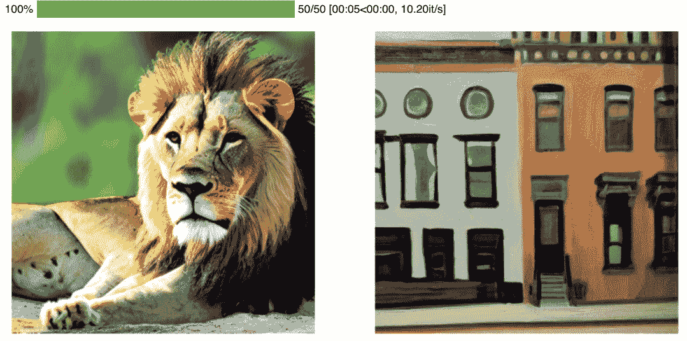
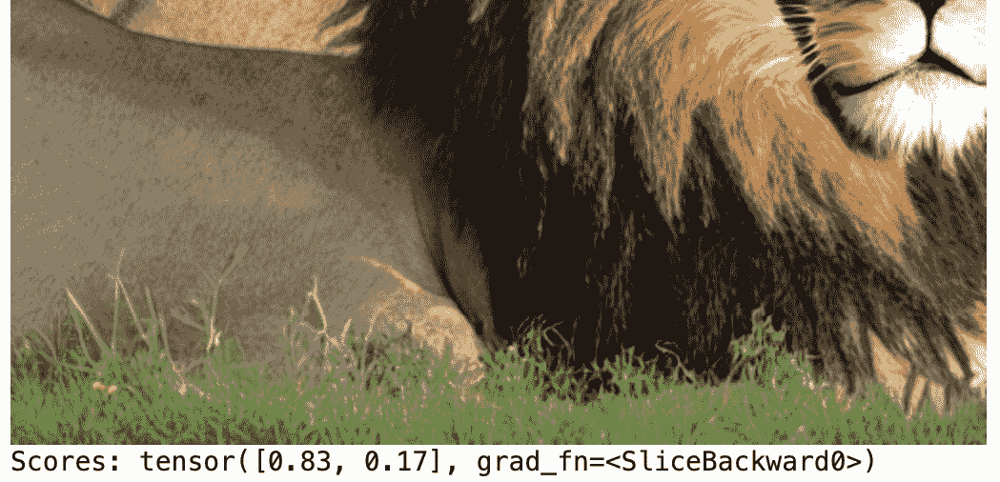

# 第二章：概述GenAI类型和模式：GANs、扩散器和Transformer概述

在上一章中，我们确立了生成模型和判别模型之间的关键区别。判别模型专注于通过学习`p(output|input)`，即给定输入或输入集的某些预期输出的条件概率来预测输出。相比之下，生成模型，如`p(next token|previous tokens)`，基于给定当前上下文的可能续集的概率。标记表示为包含嵌入的向量，这些嵌入通过大量训练捕获了潜在特征和丰富的语义依赖关系。

我们简要概述了领先的生成方法，包括**生成对抗网络（GANs**）、**变分自编码器（VAEs**）、扩散模型和自回归Transformer。每种方法都具有适合不同数据类型和任务的独特优势。例如，GANs通过对抗过程擅长生成高保真度的照片图像。扩散模型采用概率方法，通过迭代地向数据中添加和去除噪声来学习鲁棒的生成表示。自回归Transformer利用自注意力和大规模来实现令人瞩目的可控文本生成。

在本章中，我们将更深入地探讨这些技术的理论基础和实际应用。我们将进行直接比较，阐明随着时间的推移提高训练稳定性和输出质量的架构创新和改进。通过实际示例，我们将看到研究人员如何将这些模型应用于艺术、音乐、视频、故事等。

为了进行无偏比较，我们将主要集中研究图像合成任务。生成对抗网络（GANs）和扩散模型专门为图像数据设计，利用了卷积处理和计算机视觉方面的进步。由自注意力驱动的Transformer在语言建模方面表现出色，同时也能生成图像。这将使我们能够在共同的任务上对性能进行基准测试。

到本章结束时，我们将实现最先进的图像生成模型，并探讨这些核心方法如何相互增强和补充。 

# 理解通用人工智能（GAI）类型——GANs、扩散器和Transformer的区别特征

我们从通用人工智能（GAI）中体验到的常常令人惊叹的人类似质量可以归因于深度生成机器学习的进步。特别是，三种基本方法激发了众多衍生创新——生成对抗网络（GANs）、扩散模型和Transformer。每种方法都有其独特的优势，特别适合特定的应用。

我们简要介绍了 GANs，这是一种开创性的方法，它利用两个竞争性神经网络——生成器和判别器——之间的对抗性交互来生成超逼真的合成数据。随着时间的推移，GANs 已经取得了重大进展，在数据生成、图像保真度和训练稳定性方面取得了更大的控制。例如，NVIDIA 的 StyleGAN 创建了高度详细和逼真的人类面孔。GANs 的对抗性训练过程，其中一个网络生成数据而另一个网络评估它，允许你创建高度精细和详细的合成图像，并在每次训练迭代中增强逼真度。生成的合成图像可以应用于众多领域。在娱乐行业中，它们可以用于创建视频游戏或电影中的逼真角色。在研究方面，它们提供了一种扩充数据集的手段，特别是在真实数据稀缺或敏感的场景中。此外，在计算机视觉中，这些合成图像有助于训练和微调其他机器学习模型，推进如人脸识别等应用。

扩散模型，一种创新的生成建模替代方案，明确解决了某些 GAN 的局限性。如[*第一章*](B21773_01.xhtml#_idTextAnchor015)中简要讨论的，扩散模型采用独特的方法引入和系统地去除噪声，以较低的训练复杂度实现高质量的图像合成。在医学成像中，扩散模型可以通过生成高分辨率合成示例来训练其他机器学习模型，从而显著提高图像清晰度。引入噪声然后迭代去除噪声可以帮助从低质量输入中重建高保真图像，这在获取高分辨率医学图像具有挑战性的场景中非常有价值。

同时，最初为语言建模设计的生成式变压器已被用于多模态合成。如今，变压器不仅限于语言，还渗透到音频、图像和视频应用中。例如，OpenAI 的 GPT-4 在处理和生成文本方面表现出色，而 DALL-E 则能根据文本描述创建图像，这是方法之间交互的完美例子。当集成时，GPT-4 和 DALL-E 形成了一个强大的多模态系统。GPT-4 处理和理解文本指令，而 DALL-E 则根据解释后的指令生成相应的视觉表示。这种组合的实际应用可以是自动化数字广告创作。例如，给定产品的文本描述和期望的美学，GPT-4 可以解释这些指令，而 DALL-E 则可以相应地生成视觉上吸引人的广告。

# 解构 GAI 方法 - 探索 GANs、diffusers 和 transformers

让我们分解这些核心方法，以了解它们的独特特征，并展示它们在推进生成式机器学习方面的变革性作用。随着GAI不断前进，了解这些方法如何推动创新至关重要。

## 深入了解GANs

GANs由Goodfellow等人于2014年引入，主要由两个神经网络组成——**生成器（G**）和**判别器（D**）。G的目标是创建类似于真实数据的合成数据，而D的目标是区分真实数据和合成数据。

在这个设置中，以下情况发生：

1.  G从“潜在空间”接收输入，这是一个表示结构化随机性的高维空间。这种结构化随机性作为生成合成数据的种子，将其转化为有意义的信息。

1.  D评估生成数据，试图区分真实（或参考）数据和合成数据。

    简而言之，这个过程从G从潜在空间中提取随机噪声来创建数据开始。这些合成数据与真实数据一起提供给D，然后D试图区分这两者。D的反馈会告知G的参数以优化其数据生成过程。这种对抗性交互会持续进行，直到达到平衡。

1.  在GANs中，当D无法区分真实和合成数据，对两者都分配0.5的相等概率时，就会达到**平衡**。达到这种状态表明G产生的合成数据与真实数据无法区分，这是合成过程的核心目标。

最终，GANs的成功对各个行业产生了有意义的启示。在汽车行业中，GANs被用于模拟真实世界场景以进行自动驾驶车辆的测试。在娱乐行业中，GANs被部署用于生成电影制作和游戏设计中的数字角色和逼真环境。在艺术界，GANs实际上可以创造新的词汇。此外，GANs的发展在质量、控制和整体性能方面持续取得显著进步。

### GANs的进步

自其诞生以来，GAN技术已经发生了显著演变，取得了几个显著的进步：

+   **条件生成对抗网络（cGANs）**：由Mirza和Osindero于2014年引入，条件GANs在数据生成过程中加入了特定的条件，从而实现了更可控的输出。cGANs已被用于图像到图像翻译等任务（例如，将照片转换为画作）。

+   **深度卷积生成对抗网络（DCGANs）**：2015年，Radford等人通过整合卷积层增强了GANs，这有助于在小的、重叠的区域分析图像数据以捕捉精细粒度，从而显著提高了合成输出的视觉质量。DCGANs可以生成用于时尚设计等应用的逼真图像，其中模型从现有趋势中演变出新的设计。

+   **Wasserstein GANs (WGANs)**：由Arjovsky等人于2017年提出，Wasserstein GANs将Wasserstein距离度量应用于GANs的目标函数，从而促进了真实数据和合成数据之间差异的更精确测量。具体来说，该度量有助于找到使生成数据分布接近真实数据分布的最有效方法。这一小调整导致学习过程更加稳定，最小化了训练过程中的波动。WGANs有助于生成逼真的医学图像，以辅助训练诊断人工智能算法，提高模型从合成数据到实际数据的泛化能力。

随着Wasserstein GANs的出现，该领域经历了创新扩展的激增，每个扩展都是专门针对解决特定挑战或开辟合成数据生成的新途径而量身定制的：

+   **渐进式增长的GANs**在训练过程中逐步增加分辨率，从低分辨率图像开始，逐渐过渡到高分辨率。这种方法允许模型有效地学习从粗略到精细的细节，使训练更加容易管理，并生成高质量的图像（Karras等人，2017年）。这些高分辨率图像可以增强虚拟现实环境的真实感和沉浸感。

+   **CycleGANs**促进了图像到图像的转换，连接了领域适应任务（Zhu等人，2017年）。例如，CycleGAN可以将夏季场景转换为冬季场景，而无需在训练期间提供示例对（例如，夏季-冬季）。CycleGANs已被用于模拟自动驾驶汽车测试中的天气条件，评估系统在不同环境条件下的性能。

+   **BigGANs**在高质量图像生成方面推动了边界，展示了GANs在复杂生成任务中的多功能性。他们通过在训练过程中扩大模型的大小（更多层和每层的单元）以及批量大小，以及其他架构和训练创新（Brock等人，2018年）来实现这一点。BigGANs已被用于生成视频游戏中的逼真纹理，增强了游戏环境的真实感。

这些发展显著扩大了生成对抗网络（GANs）所能实现的范围，从高分辨率图像合成到领域适应和跨模态生成任务。然而，尽管取得了这些令人难以置信的进步，GANs仍然存在一些持续的局限性，这促使人们探索了如扩散等替代方法。

### GANs的局限性和挑战

GANs 的训练过程需要在 G 和 D 网络之间进行仔细的平衡。它需要大量的计算资源，通常需要强大的 GPU 和庞大的数据集才能实现理想的结果。此外，GANs 的训练中存在一些复杂性，这些复杂性源于诸如梯度消失和模式坍塌等挑战。虽然梯度消失问题是广泛影响深度神经网络的普遍问题，但模式坍塌是 GANs 训练中特有的挑战。让我们进一步探讨这些问题：

+   **梯度消失**：这个问题出现在神经网络训练阶段，当损失函数的梯度减小到一个点，导致学习速度急剧减慢或停止。GANs 的核心在于 G 和 D 模型之间学习的微妙平衡。不均衡的学习可能会阻碍整体训练过程。在实践中，梯度消失的问题可能导致训练时间更长，计算成本增加，这可能会使 GANs 对于时间敏感或资源受限的应用变得不切实际。

+   **模式坍塌**：这是 GANs 的固有特性，当 G 开始产生狭窄的样本种类时，就会发生模式坍塌，从而抑制输出多样性，损害网络的有效性。梯度惩罚和谱归一化等技术已经缓解了这些问题。这种现象可能会显著降低生成数据的质量，限制 GANs 在需要多样化输出的应用中的使用，例如机器学习中的数据增强或创意产业中生成多样化的设计替代方案。

当然，GANs 与任何最先进的生成合成一样，具有相同的伦理考量。例如，它们可以被用来创建深度伪造或生成具有社会偏见的输出。例如，当 GANs（常用于生成合成数据，例如人脸）未能充分代表某些群体时，下游应用可能会表现出性别或种族偏见（Kenfack 等人，2021 年）。

即使随着扩散模型和基于 Transformer 的图像生成器等其他生成模型的兴起，GANs 仍在塑造生成图像合成轨迹方面发挥了开创性的作用，展示了该领域潜力和一些固有的挑战。

现在我们已经更好地理解了在深度生成模型背景下 GANs，让我们将焦点转向图像生成领域的继任者，即扩散模型。

## 深入探讨扩散模型

探索了生成对抗网络（GANs）的动力学之后，让我们将注意力转向图像生成领域的后续创新——扩散模型。扩散模型最初由Sohl-Dickstein等人于2015年提出，它提供了一种新颖的方法，其中神经网络通过迭代地向数据中引入和随后移除噪声来生成高度精细的图像。与利用两个对比模型之间的对抗机制的GANs不同，扩散模型在数据中应用了一种更渐进、迭代的噪声操纵过程。

在实际应用中，GANs在艺术和设计领域显示出巨大的价值，可以创建逼真的面孔或从描述中生成清晰、高保真度的图像。它们还用于数据增强，通过生成逼真的合成数据来扩展数据集，以增强机器学习模型的训练。

相反，扩散模型在需要结构化方法进行图像生成的任务中表现出色，例如在医学成像中。它们的迭代过程可以提升医学图像的质量，如MRI或CT扫描，在这些图像中，噪声减少和清晰度至关重要。这使得扩散模型在临床环境中变得非常有价值，有助于更好的诊断和分析。此外，与GANs的对抗性和动态训练相比，它们的控制和渐进过程提供了一个更可预测或稳定的训练过程。

扩散模型的基础建立在两个主要过程之上：

+   (`x``₀`)并迭代地引入高斯噪声，类似于逐渐应用一种雾状过滤器，将数据转换为不可区分的噪声(`x``ₜ`)。

+   (`p``θ`)试图消除（或去雾）噪声数据(`x``ₜ`)中的噪声，旨在恢复到原始的干净状态(`x``ₜ₋₁`)。具体来说，这种恢复是通过估计从噪声状态回到清晰状态的概率来实现的，使用一个条件分布表示为`p``θ``(x``ₜ₋₁``|x``ₜ``)`。**条件分布**告诉我们，当我们知道另一个相关事件已经发生时，一个事件发生的可能性。在这种情况下，恢复估计了在给定一定量的噪声的情况下恢复到原始状态的可能性。

在关键工作《基于分数的生成模型通过随机微分方程》中，作者们提出了一种新颖的框架，通过使用`p``θ`将基于分数的生成模型和扩散概率建模统一起来。

反向模型（`p``θ`）使用卷积网络实现，以预测高斯噪声分布的变化——这是正向扩散中噪声引入过程中的一个关键组件。最初，这种方法的有效性在更简单的数据集上得到了验证。然而，该方法的应用性后来得到了显著提高，以处理更复杂的图像（Ho等人，2020）。这一扩展展示了扩散模型在生成具有更广泛复杂性的高度精细图像中的实际潜力。

### 扩散模型的进步

自从其诞生以来，扩散模型技术已经见证了关键进步，推动了其在图像生成方面的能力：

+   **简化的训练目标**：Ho等人提出了简化的训练目标，这些目标直接预测高斯噪声，消除了对条件均值的需求，并促进了其在更复杂数据集上的应用（Ho等人，2020）。这一进步有助于处理更复杂的数据集，可能有助于异常检测或复杂数据合成等任务，这些任务可能需要传统模型的大量资源。

+   **带有自注意力的UNet模块**：Ho等人还将带有自注意力的UNet模块纳入扩散模型架构中，受到Salimans等人（2017）的PixelCNN++的启发，增强了模型在复杂数据集上的性能（Ho等人，2020）。再次，提高复杂数据集上的性能有助于更好的图像恢复，这在医学成像或卫星图像分析等领域尤其有益，在这些领域中，高保真图像重建至关重要。

+   **与SDEs同步**：Song等人将扩散模型定义为SDEs的解，将分数学习与去噪分数匹配损失联系起来，并扩展了模型在图像生成、编辑、修复和着色等领域的应用（Song等人，2020）。

在这些基础进步之后，扩散模型见证了创新增强的浪潮，研究人员引入了新的方法来解决现有挑战并扩大模型在生成建模任务中的应用范围。这些进步包括以下内容：

+   **噪声条件和退火策略**：Song等人通过包括噪声条件和退火策略改进了基于分数的模型，在Flickr-Faces-HQ数据集（Song等人，2021）等基准数据集上实现了与GANs相当的性能，该数据集是一个高质量的人脸图像数据集，旨在衡量GANs的性能。实现与GANs相当的性能可以使扩散模型成为GANs传统应用领域内高保真图像生成任务的可行替代方案。

+   **潜在扩散模型（LDMs）**：Rombach等人通过提出LDMs来解决计算效率低下的问题，这些模型在自动编码器学习的压缩潜在空间中运行，使用感知损失来创建一个视觉上等效的、减少的潜在空间（Rombach等人，2021）。通过解决计算效率低下的问题，LDMs可以加速图像生成过程，使其适用于实时应用或计算资源有限的场景。

+   **无分类器引导**：Ho和Salimans引入了无分类器引导，以实现不受预训练网络依赖的受控生成，这标志着向更灵活的生成技术的迈进（Ho & Salimans，2022）。这一进步导致了更灵活的生成技术，使得在诸如设计、广告或内容创作等应用中，可以实现更受控和定制的图像生成，而不依赖于预训练网络。

扩散模型领域的后续探索扩展了其应用，展示了其多功能性：

+   **视频生成**：Ho等人将扩散模型应用于视频生成，证明了其在静态图像生成之外的实用性（Ho等人，2022）。

+   **3D数据处理**：Luo和Hu将应用扩展到3D数据处理，展示了扩散模型的灵活性（Luo & Hu，2021）。

扩散模型的演变导致了图像生成的增强以及在视频、3D数据处理和快速学习方法中的应用扩展。然而，该方法确实存在其挑战和局限性，以下章节将详细阐述。

### 扩散模型的局限性和挑战

尽管扩散模型具有明显的优点和显著的进步，但它们仍有一些独特的局限性，如下所述：

+   **采样速度**：扩散模型的一个显著局限性是缓慢的采样过程，尤其是在与GANs相比时。在此背景下，采样指的是从模型学习到的分布中生成新的数据点的过程。新样本生成的速度对于许多实时或准实时应用至关重要，而扩散模型的较慢采样速度可能是一个重大的缺点。

+   **大规模训练中的稳定性**：扩散模型在大规模训练过程中的稳定性是另一个需要进一步探索的领域。大规模训练指的是在大量数据上训练模型，有时会导致模型学习过程中的不稳定性。确保这一阶段的稳定性对于模型实现可靠和一致的性能至关重要。

仔细考察这些模型产生的媒体对社会的影响至关重要，尤其是在现在对生成内容可以进行精细控制的情况下。然而，扩散模型固有的简单性、灵活性和积极的归纳偏差预示着光明的未来。这些属性表明，在生成建模领域将出现快速发展的轨迹，可能将扩散模型作为各个学科（如计算机视觉和图形学）中的关键组成部分。

## 生成变压器的深入探讨

变压器模型革命性的出现对从文本描述生成高保真图像的任务产生了重大影响。如**CLIP**（**对比语言-图像预训练**）和DALL-E等显著模型以独特的方式利用变压器根据自然语言标题创建图像。本节将讨论基于变压器的文本到图像生成方法，其基础、关键技术、带来的好处以及一些挑战。

### 变压器架构的简要概述

Vaswani等人于2017年提出的原始变压器架构是许多现代语言处理系统的基石。事实上，变压器可能被认为是GAI领域最重要的架构，因为它构成了GPT系列模型和许多其他最先进生成方法的基础。因此，在我们的生成方法调查中，我们将简要介绍其架构，但将在专门的章节中详细解析和从头实现变压器。

变压器架构的核心是**自注意力机制**，这是一种独特的方法，能够捕捉有序数据序列中不同元素之间的复杂关系。这些元素被称为**标记**，根据选择的**标记化**粒度，代表句子中的词语或单词中的字符。

该架构中**注意力**原理使模型能够专注于输入数据的某些关键方面，同时可能忽略不那么重要的部分。这种机制增强了模型对上下文以及句子中词语相对重要性的理解。

变压器分为两个主要部分，即**编码器**和**解码器**，每个部分都包含多个自注意力机制层。编码器能够识别输入序列中不同位置之间的关系，而解码器则专注于编码器的输出，使用一种称为**掩码自注意力**的自注意力变体，以防止考虑它尚未生成的未来输出。

通过查询向量和键向量的缩放点积计算**注意力权重**在确定对输入不同部分的关注程度方面起着关键作用。此外，**多头注意力**允许模型同时将注意力导向多个数据点。

最后，为了保留数据的序列顺序，模型采用了一种称为**位置编码**的策略。这种机制对于需要理解序列或时间动态的任务至关重要，确保模型在整个处理过程中保留数据的初始顺序。

再次，我们将回顾[第3章](B21773_03.xhtml#_idTextAnchor081)中的转换器架构，以进一步巩固我们的理解，因为它对于生成AI的持续研究和演变是基础性的。然而，至少对转换器架构有一个基本的了解，我们就能更好地分析转换器驱动的生成建模范式在各个应用领域中的表现。

### 基于转换器的生成建模范式

在处理各种任务时，转换器采用与任务相匹配的不同训练范式。例如，分类等判别性任务可能使用掩码范式：

+   **掩码语言建模**（**MLM**）：MLM是**BERT**（**转换器双向编码器表示**）等模型使用的判别性预训练技术。在训练过程中，随机掩码掉一部分输入标记。然后模型必须根据周围未掩码的单词的上下文预测原始掩码词。这教会模型构建基于上下文的鲁棒表示，从而促进许多下游**自然语言处理**（**NLP**）任务。

在BERT中使用的MLM对于提高各个领域的NLP系统的性能至关重要。例如，它可以通过准确识别和分类临床笔记中的医疗术语来为医疗编码系统提供动力。这种自动编码可以节省大量时间并减少医疗文档中的错误，从而提高医疗数据管理的效率和准确性。

对于生成任务，重点转向创建新的数据序列，需要不同的训练范式：

+   **序列到序列建模**：序列到序列模型同时使用编码器和解码器。编码器将输入序列映射到一个潜在表示。然后解码器从这个表示中逐个生成目标序列的标记。这种范式对于翻译、摘要和问答等任务非常有用。

+   **自回归建模**：自回归建模通过仅根据前一个标记预测下一个标记来生成序列。模型逐个步骤地产生输出，每个新标记都依赖于前面的标记。GPT等自回归转换器利用这种技术进行可控文本生成。

变压器结合自注意力、预训练表示和自回归解码以适应判别性和生成性任务。

通过在不同架构之间进行权衡，可以在复杂度、可扩展性和专业化之间实现高级生成合成。例如，许多最先进的生成模型不是同时使用编码器和解码器，而是采用仅解码器或仅编码器方法。编码器-解码器框架通常是计算最密集的学习，因为它增加了模型大小。仅解码器架构利用强大的预训练语言模型（如GPT）作为解码器，通过权重共享来减少参数。仅编码器方法放弃了解码，相反，它们对输入进行编码，并在生成的嵌入上进行回归或搜索。每种方法都有其优势，适用于某些用例、数据集和计算预算。在以下章节中，我们将探讨采用这些衍生变压器架构进行创意应用的模型示例，例如图像生成和字幕。

### 仅编码器方法

在某些模型中，只有编码器网络将输入映射到嵌入空间。然后直接从这个嵌入生成输出，消除了对解码器的需求。虽然这种直接的架构通常在分类或回归任务中找到其位置，但最近的进展已将其应用扩展到更复杂的任务。特别是，为图像合成等任务开发的模型利用仅编码器设置来处理文本和视觉输入，创建了一个多模态关系，从而有助于从自然语言指令生成高保真图像。

### 仅解码器方法

类似地，一些模型仅使用解码器策略进行操作，其中单个解码器网络负责编码输入并生成输出。此机制首先将输入和输出序列连接起来，由解码器进行处理。尽管其简单且输入和输出阶段之间存在参数共享的特征，但该架构的有效性在很大程度上依赖于鲁棒解码器的预训练。最近，甚至更复杂的任务，如文本到图像合成，也成功部署了仅解码器架构，展示了其多功能性和对不同应用的适应性。

### 变压器的进步

使用其他新颖技术解决生成任务的变压器机制。这种演变导致了处理文本和图像生成的不同方法。在本节中，我们将探讨一些这些创新模型及其在推进GAI方面的独特方法。

### DALL-E的编码器-解码器图像生成

由Ramesh等人于2021年提出，DALL-E采用编码器-解码器框架以促进文本到图像的生成。此模型包含两个主要组件：

+   **文本编码器**：应用transformer的编码器，处理纯文本以推导出语义嵌入，作为图像解码器的上下文。

+   **图像解码器**：应用transformer的解码器以自回归方式生成图像，根据文本嵌入和先前预测的像素预测每个像素。

通过在图像-字幕数据集上训练，DALL-E改进了从文本到详细图像渲染的过渡。这种设置强调了专用编码器和解码器模块在条件图像生成中的能力。

### 使用CLIP进行仅编码器的图像字幕

CLIP由Radford等人于2021年提出，采用仅编码器的方法进行图像-文本任务。关键组件包括视觉编码器和文本编码器。

视觉编码器和文本编码器分别处理图像和候选字幕，根据编码表示确定匹配的字幕。

在广泛的电影-文本数据集上进行预训练使CLIP能够建立共享嵌入空间，从而促进基于检索的字幕的快速推理。

### 使用扩展的Transformer提高图像保真度（DALL-E 2）

Ramesh等人于2022年将DALL-E扩展到DALL-E 2，展示了提高视觉质量的技术：

+   **扩展的解码器**：通过将解码器扩展到35亿个参数，并在采样期间应用无分类器指导，显著提高了复杂图像分布（如人脸）中的视觉质量。

+   **用于高分辨率图像的分层解码（GLIDE）**：由Nichol等人于2021年提出，GLIDE采用分层生成策略。

+   **由粗到细的方法**：这包括初始的低分辨率图像预测，然后通过上采样和细化进行渐进式细化，捕捉全局结构和高频纹理。

### 使用GPT-4进行多模态图像生成

OpenAI开发的GPT-4是一个基于Transformer架构的强大多模态模型。GPT-4展示了在无需持续训练或微调的情况下进行条件图像生成的能力：

+   **预训练和微调**：GPT-4的巨大规模及其在多样化数据集上的预训练，使其能够对文本和视觉数据之间的关系有稳健的理解。

+   **多模态生成**：GPT-4可以根据文本描述生成图像。该模型使用深度神经网络将文本的语义意义编码为视觉表示。给定一个文本提示，GPT-4通过预测与提供的文本一致的视觉内容来生成图像。这涉及到通过连续的神经网络层处理高维文本嵌入，以生成相应的视觉表示。

使用预训练的多模态模型消除了为图像输入单独编码器模块的需求，从而促进了图像生成任务的快速适应。这种方法强调了Transformer架构在生成任务中的灵活性和强大功能，提供了一种将文本转换为高质量图像的简化方法。

与GANs相比，Transformer架构在可控图像生成方面提供了许多好处。它们的自回归特性确保了对图像构建的精确控制，同时允许您适应不同的计算需求和多样化的下游应用。然而，Transformer也引入了这一领域的新挑战。

### 基于Transformer的方法的局限性和挑战

一些基于早期Transformer的方法在采样速度和保真度方面比GANs慢，同时保持对图像中特定属性或特征的精确控制，在生成或操作图像时仍然具有挑战性。此外，训练能够克服这些挑战的大规模Transformer需要大量的计算资源。尽管如此，当前的多模态结果展示了一个快速发展和充满希望的局面。

我们还必须记住，在技术挑战的同时，还存在更广泛的社会技术影响和考虑因素。

### 生成模型中的偏差和伦理问题

生成模型（如GANs、diffusers和transformers）的显著进步需要认真思考潜在的偏差和伦理影响。

我们需要保持警惕，防止强化反映训练数据偏差的偏见和刻板印象。例如，在训练数据中过度代表特定人群的扩散模型可能会在其输出中传播这些偏差。类似地，在训练过程中接触到有毒或暴力内容的语言模型可能会生成类似的内容。

基于提示的生成指令性质，不幸的是，如果部署不当，也会打开滥用的大门。Transformer可能会促进模仿、错误信息和欺骗性内容的创建。GANs等图像合成模型可能被用于生成非同意的深度伪造或人工媒体。

此外，超逼真输出的可能性引发了关于同意、隐私、身份和版权的伦理困境。能够创建令人信服的虚构面孔或声音，使得真实与合成之间的区别变得复杂，需要仔细检查训练数据来源和生成能力。

此外，随着这些技术的普及，必须考虑其社会影响。随着真实和AI生成内容之间的区别变得越来越模糊，制定明确的政策将至关重要。坚持诚信、归属和同意的原则仍然至关重要。

尽管存在这些风险，生成模型潜在的好处是巨大的。随着技术的演变，积极应对偏见、倡导透明度、审计数据和模型以及实施保障措施变得越来越关键。最终，确保公平性、责任和道德实践的责任落在所有开发者和从业者身上。

# 应用GAI模型——使用GANs、diffusers和transformers进行图像生成

在本节实践环节中，我们将通过实际操作来巩固本章讨论的概念。你将获得第一手的经验，并深入探究生成模型的实际实现，特别是GANs、扩散模型和transformers。

提供的Python代码将指导你完成这个过程。操作并观察代码的实际运行将帮助你理解这些模型的复杂运作和潜在应用。这项练习将提供关于模型在生成艺术作品、从提示中生成以及合成超逼真图像等任务中的能力见解。

我们将利用功能强大的`PyTorch`库，这是机器学习从业者中流行的选择，以促进我们的操作。`PyTorch`提供了一组强大且动态的工具，用于定义和计算梯度，这对于训练这些模型至关重要。

此外，我们还将使用`diffusers`库。这是一个专门提供实现扩散模型功能的库。这个库使我们能够直接从我们的工作空间中重现最先进的扩散模型。它以前所未有的简单性支撑了去噪扩散概率模型创建、训练和使用的各个方面，同时不牺牲模型的复杂性。

通过这次实践课程，我们将探讨如何操作和集成这些库，并使用Python编程语言实现和操作GANs、diffusers和transformers。这种实践经验将补充我们在本章中获得的理论知识，使我们能够在现实世界中看到这些模型的实际应用。

到本节结束时，你不仅将对这些生成模型有一个概念性的理解，还将了解它们是如何实现、训练以及用于数据科学和机器学习中的多个创新应用的。你将更深入地理解这些模型的工作原理，并亲身体验到实现它们的过程。

## 使用Jupyter Notebook和Google Colab进行工作

Jupyter笔记本支持实时代码执行、可视化以及解释性文本，非常适合原型设计和数据分析。相反，Google Colab是Jupyter笔记本的云端版本，专为机器学习原型设计。它提供免费的GPU资源，并与Google Drive集成以实现文件存储和共享。我们将利用Colab作为后续的原型环境。

## 稳定扩散transformer

我们从预训练的稳定扩散模型开始，这是一个由 CompVis、Stability AI 和 LAION 的研究人员和工程师创建的文本到图像的潜在扩散模型（Patil 等人，2022 年）。扩散过程用于从复杂的高维分布中抽取样本，当它与文本嵌入交互时，它创建了一个强大的条件图像合成模型。

在这个上下文中，“稳定”一词指的是在训练过程中，模型保持某些属性以稳定学习过程的事实。稳定的扩散模型提供了丰富的潜力，可以从给定的数据分布中创建全新的样本，基于文本提示。

再次，为了我们的实际示例，我们将使用 Google Colab 来减轻许多初始设置。Colab 还提供了开始实验所需的全部计算资源。我们首先安装一些库，然后通过三个简单的函数，我们将使用稳定的扩散方法的成熟开源实现来构建一个最小的 `StableDiffusionPipeline`。

首先，让我们导航到我们的预配置的 Python 环境，Google Colab，并安装 `diffusers` 开源库，它将为我们实验提供大部分关键的基础组件。

在第一个单元格中，我们使用以下 `bash` 命令安装所有依赖项。注意行首的感叹号，它告诉我们的环境深入到底层进程并安装所需的软件包：

```py
!pip install pytorch-fid torch diffusers clip transformers accelerate
```

接下来，我们导入我们刚刚安装的库，使它们可供我们的 Python 程序使用：

```py
from typing import List
import torch
import matplotlib.pyplot as plt
from diffusers import StableDiffusionPipeline, DDPMScheduler
```

现在，我们已经准备好我们的三个函数，它们将执行三个任务——加载预训练模型、根据提示生成图像以及渲染图像：

```py
def load_model(model_id: str) -> StableDiffusionPipeline:
    """Load model with provided model_id."""
    return StableDiffusionPipeline.from_pretrained(
        model_id, 
        torch_dtype=torch.float16, 
        revision="fp16", 
        use_auth_token=False
    ).to("cuda")
def generate_images(
    pipe: StableDiffusionPipeline, 
    prompts: List[str]
) -> torch.Tensor:
    """Generate images based on provided prompts."""
    with torch.autocast("cuda"):
        images = pipe(prompts).images
    return images
def render_images(images: torch.Tensor):
    """Plot the generated images."""
    plt.figure(figsize=(10, 5))
    for i, img in enumerate(images):
        plt.subplot(1, 2, i + 1)
        plt.imshow(img)
        plt.axis("off")
    plt.show()
```

总结来说，`load_model` 函数将使用 `model_id` 识别的机器学习模型加载到 GPU 上以实现更快的处理。`generate_images` 函数接受这个模型和一系列提示来创建我们的图像。在这个函数中，你会注意到 `torch.autocast("cuda")`，这是一个特殊的命令，允许 PyTorch（我们的底层机器学习库）在保持准确性的同时更快地执行操作。最后，`render_images` 函数以简单的网格格式显示这些图像，利用 `matplotlib` 可视化库来渲染我们的输出。

定义了我们的函数后，我们选择我们的模型版本，定义我们的流水线，并执行我们的图像生成过程：

```py
# Execution
model_id = "CompVis/stable-diffusion-v1-4"
prompts = [
    "A hyper-realistic photo of a friendly lion",
    "A stylized oil painting of a NYC Brownstone"
]
pipe = load_model(model_id)
images = generate_images(pipe, prompts)
render_images(images)
```

*图 2.1* 的输出是一个生动的例子，展示了我们通常期望从人类艺术中得到的想象力和创造力，这些完全是由扩散过程生成的。但是，我们如何衡量模型是否忠实于提供的文本呢？



图 2.1：对提示“一张逼真的友好狮子照片”（左）和“一张纽约布朗石风格化的油画”（右）的输出

下一步是评估我们生成的图像与提示之间的质量和相关性。这正是 CLIP 发挥作用的地方。CLIP 通过分析它们的语义相似性来设计测量文本和图像之间的对齐程度，为我们提供了对合成图像与提示之间忠实度的真正定量度量。

## 使用 CLIP 模型评分

CLIP 通过学习在共享空间中将相似图像和文本放置在一起来训练理解文本和图像之间的关系。在评估生成的图像时，CLIP 会检查图像与提供的文本描述的匹配程度。分数越高表示匹配度越好，意味着图像准确地代表了文本。相反，分数较低则表明图像与文本存在偏差，表明质量或对提示的忠实度较低，提供了对生成的图像如何遵守预期描述的定量度量。

再次，我们将导入必要的库：

```py
from typing import List, Tuple
from PIL import Image
import requests
from transformers import CLIPProcessor, CLIPModel
import torch
```

我们首先加载 CLIP 模型、处理器和必要的参数：

```py
# Constants
CLIP_REPO = "openai/clip-vit-base-patch32"
def load_model_and_processor(
    model_name: str
) -> Tuple[CLIPModel, CLIPProcessor]:
    """
    Loads the CLIP model and processor.
    """
    model = CLIPModel.from_pretrained(model_name)
    processor = CLIPProcessor.from_pretrained(model_name)
    return model, processor
```

接下来，我们定义一个处理函数来调整文本提示和图像，确保它们以正确的格式适用于 CLIP 推理：

```py
def process_inputs(
    processor: CLIPProcessor, prompts: List[str],
    images: List[Image.Image]) -> dict:
"""
Processes the inputs using the CLIP processor.
"""
    return processor(text=prompts, images=images,
        return_tensors="pt", padding=True)
```

在此步骤中，我们通过将图像和文本提示输入到 CLIP 模型中来启动评估过程。这是在多个设备上并行进行的，以优化性能。然后，模型为每个图像-文本对计算相似度分数，称为 logits。这些分数表示每个图像与文本提示的对应程度。为了更直观地解释这些分数，我们将它们转换为概率，这表示图像与任何给定提示对齐的可能性：

```py
def get_probabilities(
    model: CLIPModel, inputs: dict) -> torch.Tensor:
"""
Computes the probabilities using the CLIP model.
"""
    outputs = model(**inputs)
    logits = outputs.logits_per_image
    # Define temperature - higher temperature will make the distribution more uniform.
    T = 10
    # Apply temperature to the logits
    temp_adjusted_logits = logits / T
    probs = torch.nn.functional.softmax(
        temp_adjusted_logits, dim=1)
    return probs
```

最后，我们显示图像及其分数，直观地表示每个图像如何遵守提供的提示：

```py
def display_images_with_scores(
    images: List[Image.Image], scores: torch.Tensor) -> None:
"""
Displays the images alongside their scores.
"""
    # Set print options for readability
    torch.set_printoptions(precision=2, sci_mode=False)
    for i, image in enumerate(images):
        print(f"Image {i + 1}:")
        display(image)
        print(f"Scores: {scores[i, :]}")
        print()
```

详细说明完毕后，让我们按照以下步骤执行管道：

```py
# Load CLIP model
model, processor = load_model_and_processor(CLIP_REPO)
# Process image and text inputs together
inputs = process_inputs(processor, prompts, images)
# Extract the probabilities
probs = get_probabilities(model, inputs)
# Display each image with corresponding scores
display_images_with_scores(images, probs)
```

现在我们有了基于 CLIP 模型的每个合成图像的分数，该模型将图像和文本数据解释为一种结合的数学表示（或几何空间），并可以测量它们的相似性。



图 2.2：CLIP 分数

对于我们的“友好狮子”，我们对每个提示计算了 83% 和 17% 的分数，我们可以将其解释为有 83% 的可能性图像与第一个提示相符。

在实际场景中，此指标可以应用于各个领域：

+   **内容审核**：通过将图像与一组预定义的描述性提示进行比较，自动审核或标记不适当的内容

+   **图像检索**：通过将文本查询与庞大的图像数据库匹配，从而缩小搜索范围，仅针对最相关的视觉内容进行搜索

+   **图像标题生成**：通过识别最相关的描述性提示来协助生成图像的准确标题

+   **广告**：根据网页上图像的内容定制广告以提高用户参与度

+   **无障碍性**：通过为视障人士提供图像的准确描述来增强无障碍功能

这种评估方法不仅加快了原本需要人工检查的过程，而且适用于许多可以从对视觉数据更深入理解和上下文分析中受益的应用。我们将在[*第4章*](B21773_04.xhtml#_idTextAnchor123)中回顾CLIP评估，在那里我们将模拟一个真实世界场景，以确定一组产品图像自动生成标题的质量和适宜性。

# 摘要

本章探讨了领先生成式人工智能（GAI）技术的理论基础和实际应用，包括生成对抗网络（GANs）、扩散模型和转换器。我们考察了它们的独特优势，包括GANs合成高度逼真图像的能力、扩散模型优雅的图像生成过程以及转换器卓越的语言生成能力。

使用基于云的Python环境，我们实现了这些模型以生成引人入胜的图像，并使用CLIP评估了它们的输出质量。我们分析了渐进式增长和分类器引导等技术如何随着时间的推移增强输出保真度。我们还考虑了社会影响，敦促开发者通过透明度和道德实践来应对潜在的伤害。

生成式方法释放了显著的创意潜力，但随着能力的提升，深思熟虑的监管至关重要。我们可以通过扎根于核心方法、审视它们的局限性并考虑下游用途，来引导这些技术走向广泛有益的结果。未来的道路将需要持续的研究和道德反思，以释放人工智能的创意潜力，同时减轻风险。

# 参考文献

本参考文献部分作为本书中引用的资源的存储库；您可以探索这些资源，以进一步加深对主题的理解和知识：

+   Kenfack, P. J., Arapov, D. D., Hussain, R., Ahsan Kazmi, S. M., & Khan, A. (2021). *关于生成对抗网络（GANs）的公平性*. [Arxiv.org](https://Arxiv.org)。

+   Goodfellow, I., Pouget-Abadie, J., Mirza, M., Xu, B., Warde-Farley, D., Ozair, S., Courville, A., & Bengio, Y. (2014). *生成对抗网络：神经信息处理系统进展*，第27卷。

+   Nichol, A., Dhariwal, P., Ramesh, A., Shyam, P., Mishkin, P., McGrew, B., Sutskever, I., & Chen, M. (2021). *GLIDE：使用文本引导的扩散模型实现逼真图像生成和编辑*. arXiv预印本 arXiv:2112.10741。

+   Radford, A., Kim, J. W., Hallacy, C., Ramesh, A., Goh, G., Agarwal, S., Sastry, G., Askell, A., Mishkin, P., Clark, J., Krueger, G., & Sutskever, I. (2021). *从自然语言监督中学习可迁移的视觉模型.* ArXiv. /abs/2103.00020.

+   Ramesh, A., Pavlov, M., Goh, G., Gray, S., Voss, C., Radford, A., Chen, M., & Sutskever, I. (2022). *分层文本条件图像生成与clip潜在*. arXiv预印本 arXiv:2204.06125.

+   Ramesh, A., Pavlov, M., Goh, G., Gray, S., Voss, C., Radford, A., Chen, M., & Sutskever, I. (2021). *零样本文本到图像生成. 国际机器学习会议论文集 (pp. 8821–8831). PMLR.* 

+   Vaswani, A., Shazeer, N., Parmar, N., Uszkoreit, J., Jones, L., Gomez, A. N., Kaiser, L., & Polosukhin, I. (2017). *注意力即所需. 神经信息处理系统进展*, 30.

+   Arjovsky, M., Chintala, S. & Bottou, L. (2017). *Wasserstein GAN. 在第31届国际神经网络信息处理系统会议 (NIPS) 上.* 

+   Brock, A., Donahue, J., & Simonyan, K. (2018). *BigGANs: 大规模GAN训练以实现高保真自然图像合成.* [https://arxiv.org/abs/1809.11096](https://arxiv.org/abs/1809.11096).

+   Karras, T., Aila, T., Laine, S., & Lehtinen, J. (2017). *GANs的渐进式增长以实现改进的质量、稳定性和多样性.* [https://arxiv.org/abs/1710.10196](https://arxiv.org/abs/1710.10196).

+   Mirza, M., & Osindero, S. (2014). *条件生成对抗网络*. [https://arxiv.org/abs/1411.1784](https://arxiv.org/abs/1411.1784).

+   Radford, A., Metz, L., & Chintala, S. (2015). *无监督表示学习与深度卷积生成对抗网络. 第三届学习表示国际会议.* 

+   Zhu, J.-Y., Park, T., Isola, P., & Efros, A. A. (2017). *使用循环一致对抗网络进行无配对图像到图像翻译. IEEE国际计算机视觉会议论文集 (ICCV).* 

+   Ho, J., & Salimans, T. (2022). *无分类器扩散引导. 神经信息处理系统进展*, 34.

+   Ho, J., Salimans, T., Gritsenko, A. A., Chan, W., Norouzi, M., & Fleet, D. J. (2022). *视频扩散模型*. arXiv预印本 arXiv:2205.10477.

+   Ho, J., Jain, A., & Abbeel, P. (2020). *去噪扩散概率模型. 神经信息处理系统进展*, 33, 6840–6851.

+   Luo, S., & Hu, W. (2021). *用于3D点云生成的扩散概率模型. IEEE/CVF计算机视觉与模式识别会议论文集*, 2837–2845.

+   Rombach, R., Blattmann, A., Lorenz, D., Esser, P., & Ommer, B. (2021). *使用潜在扩散模型进行高分辨率图像合成. IEEE/CVF计算机视觉与模式识别会议论文集*, 10684–10695.

+   Salimans, T., Karpathy, A., Chen, X., & Kingma, D. P. (2017). *PixelCNN++: 通过离散逻辑混合似然和其他修改改进PixelCNN*. arXiv预印本 arXiv:1701.05517.

+   Song, Y., Meng, C., & Ermon, S. (2021). *去噪扩散隐式模型*. arXiv预印本 arXiv:2010.02502.

+   Song, Y., & Ermon, S. (2021). *基于分数的生成模型训练改进技术. 神经信息处理系统进展*, 33, 12438–12448.

+   Sohl-Dickstein, J., Weiss, E. A., Maheswaranathan, N., & Ganguli, S. (2015). *使用非平衡热力学进行深度无监督学习*. arXiv预印本 arXiv:1503.03585.

+   Ho, J., Jain, A., & Abbeel, P. (2020). *去噪扩散概率模型. 神经信息处理系统进展*, 33, 6840–6851.

+   Ramesh, A., Pavlov, M., Goh, G., Gray, S., Voss, C., Radford, A., ... & Sutskever, I. (2022). *零样本文本到图像生成. 国际机器学习会议*, 8821-8831.

+   Brown, T., Mann, B., Ryder, N., Subbiah, M., Kaplan, J. D., Dhariwal, P., ... & Amodei, D. (2020). *语言模型是少样本学习者. 神经信息处理系统进展*, 33, 1877–1901.

+   Patil, S., Cuenca, P., Lambert, N., & von Platen, P. (2022). *使用扩散器进行稳定扩散*. Hugging Face博客. [https://huggingface.co/blog/stable_diffusion](https://huggingface.co/blog/stable_diffusion).

+   Boris Dayma, Suraj Patil, Pedro Cuenca, Khalid Saifullah, Tanishq Abraham, Phúc Lê, Luke, Ritobrata Ghosh. (2022, June 4). *DALL-E Mini 解释*. W&B; Weights & Biases, Inc. [https://wandb.ai/dalle-mini/dalle-mini/reports/DALL-E-Mini-Explained-with-Demo--Vmlldzo4NjIxODA](https://wandb.ai/dalle-mini/dalle-mini/reports/DALL-E-Mini-Explained-with-Demo--Vmlldzo4NjIxODA).
