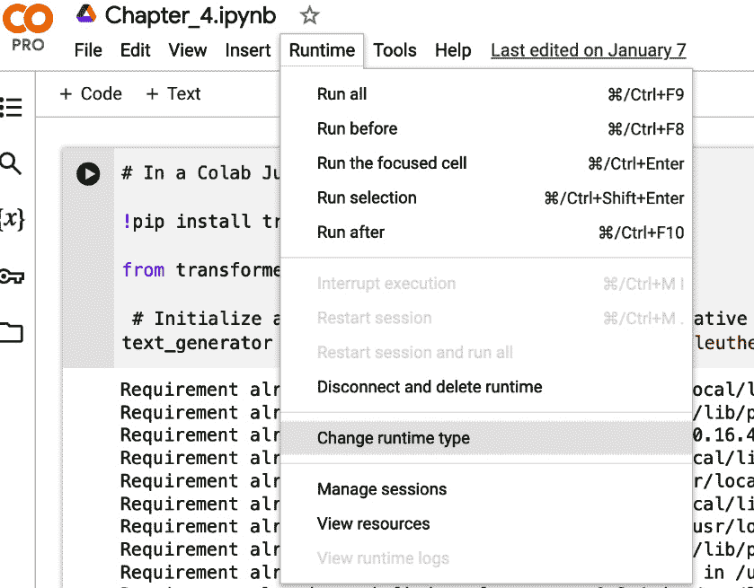
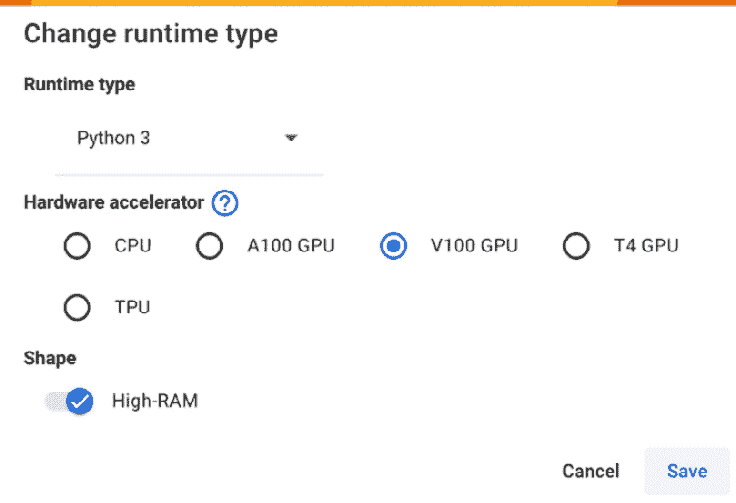

# 第四章：应用预训练生成模型：从原型到生产

在前面的章节中，我们探讨了生成式人工智能的基础，探讨了各种生成模型，例如**生成对抗网络**（GANs）、扩散器和转换器，并了解了**自然语言处理**（NLP）的变革性影响。随着我们转向应用生成式人工智能的实践方面，我们应该将我们的探索建立在实际例子之上。这种方法将提供一个具体的环境，使技术方面更加贴近实际，学习体验更加吸引人。

我们将介绍“StyleSprint”，这是一家希望增强其在线存在的服装店。实现这一目标的一种方式是为其各种产品编写独特且引人入胜的产品描述。然而，手动为大量库存创建吸引人的描述是具有挑战性的。这种情况是应用生成式人工智能的理想机会。通过利用预训练的生成模型，StyleSprint可以自动化制作引人入胜的产品描述，节省大量时间并丰富其客户的在线购物体验。

当我们步入预训练生成**大型语言模型**（LLM）的实际应用时，首要任务是建立一个有利于使用生成模型进行原型的Python环境。这个设置对于将项目从原型过渡到生产就绪状态至关重要，为StyleSprint实现其自动化内容生成目标奠定基础。

在第2章和第3章中，我们使用Google Colab进行原型设计，因为它易于使用且可访问的GPU资源丰富。它是一个快速测试想法的优秀平台。然而，当我们把重点转向在现实世界环境中部署我们的生成模型时，了解从原型环境（如Google Colab）到更稳健、生产就绪的设置的过渡至关重要。这种过渡将确保我们的解决方案可扩展、可靠，并且针对处理现实世界流量进行了优化。在本章中，我们将介绍设置生产就绪Python环境的步骤，强调从原型到生产的平稳过渡的关键考虑因素。

到本章结束时，我们将了解将生成应用程序从原型环境过渡到生产就绪设置的流程。我们将定义一个可靠且可重复的策略，用于评估、监控和部署模型到生产环境。

# 原型环境

Jupyter笔记本提供了一个交互式计算环境，可以将代码执行、文本、数学、图表和丰富媒体结合成一个单一的文档。它们非常适合原型设计和交互式开发，因此在数据科学家、研究人员和工程师中非常受欢迎。以下是它们提供的内容：

+   **内核**：Jupyter笔记本的核心是一个内核，它是一个计算引擎，负责执行笔记本中的代码。对于Python，这通常是IPython内核。当笔记本打开时，这个内核保持活跃并维护笔记本计算的状态。

+   **交互式执行**：代码单元格允许你交互式地编写和执行代码，检查结果并根据需要调整代码。

+   `pip`或`conda`命令。

+   **可视化**：你可以嵌入图表、图形和其他可视化内容，以交互式地探索数据和结果。

+   **文档**：将Markdown单元格与代码单元格结合使用，可以创建文档齐全、自包含的笔记本，解释代码及其输出。

Jupyter笔记本的一个缺点是它们通常依赖于个人电脑的计算资源。大多数个人笔记本电脑和台式机都没有优化或配备处理计算密集型过程的硬件。拥有足够的计算资源对于管理实验LLM的计算复杂性至关重要。幸运的是，我们可以通过提供计算加速器（如**图形处理单元**（**GPU**）和**张量处理单元**（**TPU**））的云平台来扩展Jupyter笔记本的功能。例如，Google Colab可以立即增强Jupyter笔记本，使其有利于计算密集型实验。以下是云笔记本环境（如Google Colab）的一些关键特性：

+   **GPU/TPU访问**：提供免费或负担得起的GPU和TPU资源访问，这对于处理要求高的机器学习模型至关重要。

+   **协作**：允许轻松共享和实时协作，类似于Google Docs。

+   **集成**：便于存储和访问笔记本和数据。

让我们考虑我们的StyleSprint场景。在决定最适合StyleSprint目标的一个模型之前，我们可能想要探索几个不同的模型来生成产品描述。我们可以在Google Colab中设置一个最小的工作原型来比较模型。再次强调，云平台提供了一个最优且易于访问的环境，用于初始测试、实验，甚至是一些轻量级的模型训练。以下是我们可以如何初步设置一个生成模型，开始为StyleSprint进行自动化产品描述生成的实验：

```py
# In a Colab or Jupyter notebook
!pip install transformers
# Google Colab Jupyter notebook
from transformers import pipeline
# Initialize a text generation pipeline with a generative model, say GPT-Neo
text_generator = pipeline(
    'text-generation', model='EleutherAI/gpt-neo-2.7B')
# Example prompt for product description generation
prompt = "This high-tech running shoe with advanced cushioning and support"
# Generating the product description
generated_text = text_generator(prompt, max_length=100, do_sample=True)
# Printing the generated product description
print(generated_text[0]['generated_text'])
```

**输出**：

```py
This high-tech running shoe with advanced cushioning and support combines the best of traditional running shoes and the latest technologies.
```

在这个简单的设置中，我们正在安装`transformers`库，它提供了一个方便的接口来访问各种预训练模型。然后，我们使用开源版本的GPT-Neo初始化一个文本生成管道，能够生成连贯且上下文相关的文本。这个设置作为StyleSprint在小型规模上实验生成创意产品描述的起点。

在本章的后面部分，我们将扩展我们的实验，评估和比较多个预训练的生成模型，以确定哪个最能满足我们的需求。然而，在我们进一步进行实验和原型设计之前，战略性地暂停并展望未来是至关重要的。这种深思熟虑的预见使我们能够考虑将实验有效过渡到生产环境所需的必要步骤。通过这样做，我们确保从端到端全面了解项目，以符合长期运营目标。


图4.1：从原型到生产的阶段

# 转向生产

在我们计划生产设置时，我们首先应该了解我们将要将其带入生产环境的原型环境的内在优势和功能。原型环境（如Google Colab）的许多功能都深度集成，并且可能很容易被忽视，因此重要的是要剖析和编制我们将需要的生产环境中的功能清单。例如，以下功能是Google Colab固有的，在生产环境中将至关重要：

+   `!pip install library_name`。在生产环境中，我们必须预先安装库或确保我们可以在需要时安装它们。我们还必须确保特定于项目的库不会干扰其他项目。

+   **依赖隔离**：Google Colab自动简化了依赖项的隔离，确保包安装和更新不会干扰其他项目。在生产环境中，我们也可能希望使用相同的架构部署各种项目。依赖隔离对于防止一个项目的依赖项更新影响其他项目至关重要。

+   **交互式代码执行**：代码单元格的交互式执行有助于测试单个代码片段、可视化结果和实时调试。这种便利性在生产环境中并非必需，但对于快速调试可能有所帮助。

+   **资源可访问性**：使用Colab，访问GPU和TPU变得简单，这对于运行计算密集型任务至关重要。对于生产环境，我们将想要检查我们的动态计算需求，并配置适当的架构。

+   **数据集成**：Colab为分析和建模提供了简单的数据源连接。在生产环境中，我们可以通过将数据直接部署到环境中来启动我们的环境，或者根据需要确保与远程数据源的连接。

+   **版本控制和协作**：使用 Google Colab 跟踪项目代码的版本很容易通过笔记本完成。此外，Colab 预配置为与 Git 交互。Git 是一个广泛用于在软件开发过程中跟踪源代码更改的分布式版本控制系统。在生产中，我们还将希望集成 Git 来管理我们的代码并将其与远程代码仓库（如 GitHub 或 Bitbucket）同步。远程版本控制确保我们的生产环境始终反映最新的更改，并允许持续的协作。

+   **错误处理和调试**：在 Colab 中，我们直接访问 Python 运行时，通常可以实时看到错误信息和回溯，以帮助识别和解决问题。我们希望在生产环境中通过适当的系统错误记录达到相同级别的可见性。总的来说，我们希望保留我们 Google Colab 原型环境中的便利性和简单性，但提供生产所需的鲁棒性和可扩展性。为此，我们将我们将我们提出的每个关键特性映射到相应的生产解决方案。这些关键特性应确保 StyleSprint 自动化产品描述生成模型的部署过程顺利。

# 将特性映射到生产设置

为了确保我们可以无缝地将我们的原型环境过渡到生产环境，我们可以利用 Docker，这是一个领先的容器化工具。**容器化**工具将应用程序及其依赖项打包，以确保在不同系统上的一致性能。容器化方法将帮助我们复制 Google Colab 的隔离、统一环境，确保可靠性并减少生产中的潜在兼容性问题。下表描述了如何将我们原型环境的每个好处映射到生产类似物：

| **特性** | **环境** |
| --- | --- |
|  | **原型设计** | **生产** |
| --- | --- | --- |
| 软件包管理 | 通过预安装的软件包管理器固有的 | Docker 简化了应用程序的部署，并在包括软件包管理器在内的环境中保持一致性。 |
| 依赖项隔离 | 通过笔记本固有的 | Docker 还可以确保项目被干净地隔离。 |
| 交互式代码执行 | 通过笔记本固有的 | Docker 通过默认提供交互式代码执行的 Python 版本来帮助维护版本。然而，我们可能希望将**集成开发环境（IDE**）连接到我们的生产环境，以便在需要时远程与代码交互。 |
| 资源可访问性 | 对于基于云的笔记本固有 | 具有GPU功能的 Docker 容器通过允许结构化 GPU 利用，增强了生产，允许可扩展、高效的模型性能。 |
| 数据集成 | 不是固有的，需要基于代码的集成 | 将 Docker 与远程数据源（如 AWS S3 或 Google Cloud Storage）集成，为导入和导出数据提供安全且可扩展的解决方案。 |
| 版本控制和协作 | 通过笔记本和预配置的 Git 实现 | 将 Docker 与 GitHub 或 GitLab 等平台集成，可以促进代码协作和文档编制。 |
| 错误处理和调试 | 通过直接交互式访问运行时实现 | 我们可以在 Docker 部署中嵌入 Python 库，如 `logging` 或 `Loguru`，以在生产中增强错误跟踪。 |

表 4.1：通过 Docker 从 Colab 到生产的过渡功能

在将我们的原型环境的功能映射到生产设置中相应的工具和实践之后，我们现在更好地准备在可生产环境中实施 StyleSprint 的生成模型。这一过渡包括设置一个稳定、可扩展和可重复的 Python 环境，这是将我们的生成模型部署到实际环境中自动化生成产品描述的关键步骤。正如所讨论的，我们可以利用 Docker 与 GitHub 及其 **持续集成/持续部署**（**CI/CD**）功能相结合，为这种生产部署提供一个强大的框架。CI 管道自动化了来自多个贡献者的代码更改的集成到一个共享仓库中。我们将 CI 与 CD 配对，以自动化将我们的代码部署到生产环境。

# 设置生产环境

到目前为止，我们已经讨论了如何弥合原型和生产环境之间的差距。基于云的环境，如 Google Colab，提供了在生产环境中本身不可用的丰富功能。现在，我们对这些特性有了更好的理解，下一步是实现一个健壮的生产设置，以确保我们的应用程序能够处理现实世界的流量，按需扩展，并保持稳定。

生产环境中的工具和实践与原型环境中的工具和实践有很大不同。在生产中，可扩展性、可靠性、资源管理和安全性变得至关重要，而在原型环境中，模型仅由少数用户用于实验。在生产中，我们可能期望来自组织各个部门的广泛消费。例如，在 StyleSprint 场景中，可能有多个部门或子品牌希望自动化他们的产品描述。

在 StyleSprint 项目的早期阶段，我们可以使用 Docker 和 GitHub 等免费和开源工具来执行容器化、版本控制和 CI 等任务。这些工具由用户社区提供和管理，为我们提供了一个成本效益高的解决方案。随着 StyleSprint 的发展，我们可能会考虑升级到提供高级功能和专业支持的付费或企业版。目前，我们的重点是利用开源版本的功能。接下来，我们将逐步介绍这些工具的实际应用。到那时，我们将准备好部署一个适用于自动产品描述的生产就绪的 **模型即服务**（**MaaS**）。

# 本地开发设置

我们首先确保我们可以远程连接到生产环境。我们可以利用一个集成开发环境（IDE），这是一种软件，使我们能够轻松组织代码并远程连接到生产环境。

## Visual Studio Code

首先安装 **Visual Studio Code**（**VS Code**），这是微软提供的一款免费代码编辑器。由于其集成的 Git 控制、终端和扩展市场，它被广泛使用。它提供了一个有利于编写、测试和调试代码的环境。

## 项目初始化

接下来，我们设置一个结构化的项目目录以保持代码模块化和有序。我们还将使用 Git 初始化我们的工作目录，这使得我们能够与远程仓库同步代码。正如之前提到的，我们利用 Git 来跟踪代码变更并与他人更顺畅地协作。在 Visual Studio 的终端窗口中，我们可以使用三个简单的命令来初始化项目。我们使用 `mkdir` 来创建或“制作”一个目录。我们使用 `cd` 命令来更改目录。最后，我们使用 `git init` 来使用 Git 初始化我们的项目。请注意，这假设 Git 已经安装。有关安装 Git 的说明可在其网站上找到（[https://git-scm.com/](https://git-scm.com/))。

```py
mkdir StyleSprint
cd StyleSprint
git init
```

## Docker 设置

现在，我们将继续设置 Docker 容器。Docker 容器是一个隔离的环境，封装了应用程序及其依赖项，确保在不同系统上的一致性操作。为了清晰起见，我们可以简要描述 Docker 的关键方面如下：

+   **容器**：这些是包含应用程序及其依赖的可移植单元。

+   **主机操作系统的内核**：当 Docker 容器在主机机器上运行时，它利用主机操作系统的内核和资源来操作，但它以隔离的方式操作，既不与主机系统也不与其他容器冲突。

+   **Dockerfiles**：这些是用于创建容器镜像的脚本。它们作为蓝图，包含运行应用程序所需的一切。这种隔离和打包方法防止应用程序冲突并促进资源的高效使用，简化了开发和部署。

容器化方法将有助于确保一致性和可移植性。例如，假设StyleSprint找到一个基于云的托管提供商，成本效益更高；迁移到新提供商就像迁移几个配置文件一样简单。

我们可以从官方网站安装Docker。Docker提供了易于遵循的安装指南，包括对各种编程语言的支持。

一旦安装了Docker，我们就可以在项目目录中创建一个Dockerfile来指定环境设置。对于GPU支持，我们希望从一个NVIDIA CUDA基础镜像开始。Docker，就像许多其他虚拟化系统一样，使用一个称为**镜像**的概念来运行。镜像是一个预配置环境的快照，可以用作新项目的起点。在我们的情况下，我们希望从一个集成了CUDA库的快照开始，CUDA是NVIDIA提供的并行处理库。这个库将使虚拟化环境（或容器）能够利用主机机器上安装的任何GPU。利用GPU将加速模型推理。

现在，我们可以继续创建一个具有我们应用程序规格的Dockerfile：

```py
# Use an official NVIDIA CUDA runtime as a base image
FROM nvidia/cuda:11.0-base
# Set the working directory in the container to /app
WORKDIR /app
# Copy the current directory contents into the container at /app
COPY . /app
# Install any needed packages specified in requirements.txt
RUN pip install --no-cache-dir -r requirements.txt
# Make port 80 available to the world outside this container
EXPOSE 80
# Run app.py when the container launches
CMD ["uvicorn", "app:app", "--host", "0.0.0.0", "--port", "80"]
```

此Dockerfile作为Docker构建我们的容器的蓝图。我们从官方的NVIDIA CUDA基础镜像开始，以确保GPU支持。容器中的工作目录设置为`/app`，然后我们复制项目的所有内容。之后，我们安装`requirements.txt`文件中列出的必要包。`端口80`对外部访问我们的应用程序开放。最后，我们指定启动应用程序的命令，该应用程序使用Python解释器运行`app.py`。这种设置封装了所有必要的组件，包括GPU支持，以确保我们的生成模型在类似生产的环境中高效运行。

## 需求文件

我们还需要一个方法来跟踪我们的Python特定依赖。容器将包含Python，但不会显示我们的Python应用程序有什么需求。我们可以在项目目录中定义一个`requirements.txt`文件，明确列出所有必要的Python包来指定这些依赖：

```py
fastapi==0.65.2
torch==1.9.0
transformers==4.9.2
uvicorn==0.14.0
```

## 应用程序代码

现在，我们可以为我们的应用程序代码创建一个`app.py`文件。这是我们编写生成模型代码的地方，利用PyTorch和Transformers等库。为了将我们的模型作为服务公开，我们将使用*FastAPI*，这是一个用于构建Web API的现代、高性能框架。Web API是一种协议，它使不同的软件应用程序能够通过互联网进行通信和交换数据，允许它们使用彼此的功能和服务。

以下代码片段创建了一个最小化的 API，该 API 将在另一个应用程序或软件请求 `/generate/` 端点时提供模型响应。这将使 StyleSprint 能够将其模型作为 Web 服务托管。这意味着其他应用程序（例如，移动应用程序、批处理过程）可以使用简单的 URL 访问模型。我们还可以添加异常处理以提供有关模型产生任何类型错误的 informative 错误消息：

```py
from fastapi import FastAPI, HTTPException
from pydantic import BaseModel
from transformers import pipeline
# Load the pre-trained model
generator = pipeline('text-generation', 
    model='EleutherAI/gpt-neo-2.7B')
# Create the FastAPI app
app = FastAPI()
# Define the request body
class GenerationInput(BaseModel):
prompt: str
# Define the endpoint
@app.post("/generate")
def generate_text(input: GenerationInput):
try:
    # Generate text based on the input prompt
    generated_text = generator(input.prompt, max_length=150)
    return {"generated_text": generated_text}
except:
    raise HTTPException(status_code=500,
        detail="Model failed to generate text")
```

现在我们已经设置了 Docker 环境，下一步是将应用程序部署到主机服务器。我们可以通过 CI/CD 管道来简化此过程。目标是完全自动化所有部署步骤，包括一系列测试以确保任何代码更改不会引入任何错误。然后我们利用 GitHub Actions 创建一个与代码仓库直接集成的工作流程。

## 创建代码仓库

在我们能够利用 GitHub 的自动化功能之前，我们需要一个仓库。创建 GitHub 仓库非常简单，按照以下步骤操作：

1.  **注册/登录 GitHub**：如果您还没有 GitHub 账户，请在 [github.com](http://github.com) 上注册。如果您已经有了账户，只需登录即可。

1.  **转到仓库创建页面**：点击 GitHub 主页右上角的 **+** 图标并选择 **新建仓库**。

1.  **填写仓库详情**：

    +   **仓库名称**：为您的仓库选择一个名称

    +   **描述**（可选）：添加您仓库的简要描述

    +   **可见性**：选择 **公开**（任何人都可以看到此仓库）或 **私有**（只有您和您邀请的协作者可以看到）

1.  `.gitignore` 文件或选择一个许可证。一个 `gitignore` 文件允许我们添加不应上传到仓库的路径或文件类型。例如，Python 会创建对应用程序不关键的临时文件。将 `` `__pycache__/` `` 添加到 `gitignore` 文件中将会自动忽略该目录下的所有内容。

1.  **创建仓库**：点击 **创建仓库** 按钮。

我们的仓库设置完成后，我们可以继续定义我们的 CI/CD 管道来自动化我们的部署。

## CI/CD 配置

要创建一个管道，我们需要一个配置文件，该文件概述了部署阶段并指导自动化服务器构建和部署我们的 Docker 容器。让我们看看步骤：

1.  在我们的 GitHub 仓库中，我们可以在 `.github/workflows` 目录下创建一个名为 `ci-cd.yml` 的新文件。GitHub 将自动查找此目录中的任何文件以触发部署。

1.  打开 `ci-cd.yml` 并定义以下工作流程：

    ```py
    name: CI/CD Pipeline
    
    on:
    
      push:
    
        branches:
    
          - main
    
    jobs:
    
      build-and-test:
    
        runs-on: ubuntu-latest
    
      steps:
    
        - name: Checkout code
    
          uses: actions/checkout@v4
    
        - name: Build Docker image
    
      # assumes the Dockerfile is in the root (.)
    
          run: docker build -t stylesprint .
    
        - name: Run tests
    
      # assumes a set of unit tests were defined
    
          run: docker run stylesprint python -m unittest discover
    
    deploy:
    
      needs: build-and-test
    
      runs-on: ubuntu-latest
    
      steps:
    
        - name: Checkout code
    
          uses: actions/checkout@v4
    
        - name: Login to DockerHub
    
          run: echo ${{ secrets.DOCKER_PASSWORD }} | docker login -u ${{ secrets.DOCKER_USERNAME }} --password-stdin
    
        - name: Push Docker image
    
          run: |
    
            docker tag stylesprint:latest ${{ secrets.DOCKER_USERNAME }}/stylesprint:latest
    
            docker push ${{ secrets.DOCKER_USERNAME }}/stylesprint:latest
    ```

在这个设置中，我们的工作流程由两个主要任务组成：构建和测试以及部署。构建和测试任务负责从代码库检出代码，构建Docker镜像，并执行任何测试。另一方面，依赖于构建和测试完成的部署任务，处理*DockerHub*登录并将Docker镜像推送到那里。DockerHub，类似于GitHub，是一个专门用于Docker镜像的仓库。

对于与DockerHub进行身份验证，建议将您的DockerHub凭据安全地存储在您的GitHub仓库中。这可以通过在GitHub上导航到您的仓库，点击`DOCKER_USERNAME`和`DOCKER_PASSWORD`作为新的仓库密钥来完成。

注意，我们不需要执行任何额外的步骤来执行管道。工作流程设计为在向主分支推送（或上传）时自动触发。回想一下，整个过程依赖于Git模式，其中新更改通过代码的`commit`或检查-入以及代码更改的`push`或上传来注册。每当有更改被推送时，我们都可以直接在GitHub仓库的**操作**选项卡中观察到整个管道的运行情况。

我们现在已经走过了部署我们的模型到生产所需的全部步骤。在所有这些关键的设置都完成之后，我们现在可以回到选择我们项目最佳模型的任务上。目标是找到一个能够有效地为StyleSprint生成吸引人的产品描述的模型。然而，可用的生成模型种类繁多，需要根据我们项目的需求和限制进行深思熟虑的选择。

此外，我们希望选择合适的评估指标，并讨论其他将指导我们为项目做出明智决策的考虑因素。这次探索将使我们具备选择一个不仅表现良好而且与我们的项目目标和已建立的技术基础设施相一致的模式所需的知识。

# 模型选择——选择合适的预训练生成模型

在上一节中建立了一个最小化生产环境之后，我们现在关注我们项目的关键方面——选择合适的生成模型来生成吸引人的产品描述。模型的选择至关重要，因为它显著影响我们解决方案的有效性和效率。目标是自动化生成StyleSprint各种零售产品的引人入胜且准确的产品描述。通过这样做，我们旨在丰富客户的在线购物体验，同时减轻手动编写独特产品描述的工作量。

我们的目的是选择一个能够熟练处理细微和复杂的文本生成，从而显著加快创建独特、吸引人的产品描述的过程的生成模型，为StyleSprint节省时间和资源。

在选择我们的模型时，重要的是要彻底评估影响其性能和适合项目的各种因素。

## 达成项目目标

在我们能够选择并应用评估方法到我们的模型选择过程中之前，我们首先应该确保我们理解了项目目标。这包括定义业务问题，识别任何技术限制，识别与模型相关的任何风险，包括模型结果的解释，以及确定任何潜在的不平等对待或偏见的考虑因素：

+   **问题定义**：在我们的场景中，目标是创建一系列零售服装的准确和吸引人的描述。随着StyleSprint的产品范围可能扩大，系统应无缝扩展以适应更大的库存，而不会显著增加运营成本。性能预期包括吸引潜在客户的引人入胜的描述，准确性以避免误代表，以及快速生成以保持在线目录的更新。此外，StyleSprint可能会根据用户的购物历史应用个性化的内容描述。这意味着模型可能需要几乎实时地提供产品描述。

+   **技术限制**：为了最大化效率，模型API的响应不应有任何明显的延迟（延迟）。系统应能够实时更新在线目录（如有需要），并且硬件应支持快速文本生成，同时不降低质量且保持成本效益，尤其是在产品范围扩大的情况下。

+   **透明度和开放性**：通常，来自披露架构和训练数据源的开发商的预训练模型更受欢迎，因为这种透明度使StyleSprint能够清楚地了解与模型使用相关的任何风险或法律影响。此外，使用作为API提供的模型时施加的任何使用限制，如请求或令牌限制，应被理解，因为它们可能会阻碍不断增长的目录的可扩展性。

+   **偏见和公平性**：识别和减轻模型输出中的偏见，以确保公平和中立的表现至关重要，尤其是在StyleSprint具有多样化的目标受众的情况下。确保生成的描述具有文化敏感性至关重要。公平的表现确保描述准确且公平地代表产品，无论潜在客户的个人特征或社会背景如何。

+   **预训练的适用性**：生成模型的基本预训练在其生成有意义和相关的文本的能力中起着重要作用。研究模型预训练或微调的领域和数据非常重要。在广泛数据集上预训练的模型可能具有多功能性，但可能缺乏特定领域的细微差别。对于StyleSprint来说，一个在时尚相关数据上微调或能够进行此类微调的模型将是最理想的，以确保生成的描述既相关又吸引人。

+   **定量指标**：评估StyleSprint生成的产品描述的质量需要结合词汇和语义指标。词汇重叠指标衡量生成文本与参考文本之间的词汇相似度。具体来说，**双语评估助手**（**BLEU**）强调n-gram精确度，**基于主旨的评估辅助工具**（**ROUGE**）侧重于n-gram召回率，而**具有显式排序的翻译评估指标**（**METEOR**）旨在通过考虑同义词和词干实现更平衡的评估。对于上下文和语义评估，我们使用相似性指标来评估生成描述的语义一致性和相关性，通常利用嵌入来表示文本，以捕捉其含义。

我们可以使用诸如**对比语言-图像预训练**（**CLIP**）等模型进一步细化我们对生成描述与产品图像之间对齐的评估。回想一下，我们在[*第二章*](B21773_02.xhtml#_idTextAnchor045)中使用了CLIP来评估字幕与合成图像之间的兼容性。在这种情况下，我们可以应用CLIP来衡量我们的生成描述是否准确地反映了产品的视觉方面。这些评估技术共同为StyleSprint创建有效的产品描述提供了客观的方法：

+   **定性指标**：我们引入定性评估来衡量描述的吸引力和创造性等细微差别。我们还希望确保在生成内容中考虑公平性和包容性，这对于避免可能使某些群体感到疏远或冒犯的语言或偏见至关重要。参与度评估的方法可能包括客户调查或A/B测试，这是一种测试两种竞争解决方案的系统方法。此外，让一个多元化的团队审查内容以确保公平性和包容性可以提供宝贵的见解。这些步骤有助于StyleSprint创建吸引人、尊重和包容的产品描述，为所有客户提供欢迎的环境。

+   **可扩展性**：运行模型所需的计算资源以及模型随着数据增加而扩展的能力是至关重要的考虑因素。需要大量计算能力的模型可能不适合实时生成产品描述，尤其是在产品系列扩大的情况下。在计算效率和输出质量之间取得平衡对于确保StyleSprint的成本效益和可扩展性至关重要。

+   **定制和微调能力**：在特定领域数据上微调或定制模型的能力对于更好地满足品牌特定要求至关重要。探索微调的可用性和易用性可以显著影响生成描述的相关性和质量，确保它们与StyleSprint的品牌身份和产品系列产生共鸣。在实践中，即使应用了高效的方法，一些模型也可能因为需要大量资源而无法进行微调。我们将在下一章中详细探讨微调的考虑因素。

现在我们已经仔细考虑了如何将模型与项目目标对齐，我们几乎准备好评估我们的初始模型选择与其他几个模型，以确保我们做出正确的选择。然而，在基准测试之前，我们应该花时间理解模型选择过程中的一个重要方面：模型大小和计算复杂度。

## 模型大小和计算复杂度

生成模型的大小通常由其参数数量来描述。模型中的参数是在训练过程中根据训练数据微调的内部变量。在生成模型中使用的神经网络背景下，参数通常指的是通过训练调整的权重和偏差，以最小化预测输出与实际目标之间的差异。

此外，具有更多参数的模型可以捕捉数据中的更复杂模式，通常在手头任务上表现更好。虽然较大的模型在生成文本的质量方面通常表现更好，但存在一个收益递减的点，超过这个点，增加模型大小只会带来微小的改进。此外，增加的大小也带来了一系列挑战：

+   **计算复杂度**：更大的模型在训练和推理阶段（模型用于根据学习到的参数进行预测或生成新数据）都需要更多的计算能力和内存。这可能会显著增加训练和使用模型的成本和时间，使其不太适合实时应用或资源受限的环境。

    模型中的参数数量显著影响模型的计算复杂度。模型中的每个参数都是一个变量，在计算过程中必须存储在内存中，无论是训练还是推理阶段。以下是关于计算需求的一些具体考虑因素：

    +   **内存和存储**：模型在内存中的总大小是参数数量和每个参数大小（通常是32位或64位浮点数）的乘积。例如，一个拥有1亿个参数的模型，每个参数由32位浮点数表示，将需要大约400MB的内存（1亿 * 32位 = 4亿位 = 400MB）。现在考虑一个更大的模型，比如说有100亿个参数；内存需求跃升至40GB（100亿 * 32位 = 400亿位 = 40GB）。这个需求仅针对参数，并不包括模型操作所需的其他数据和开销。

    +   **加载到内存中**：当模型用于推理时，其参数必须加载到运行该模型的机器的RAM中。对于一个拥有100亿个参数的大型模型，你需要一台具有足够RAM的机器来容纳整个模型，以及额外的内存来处理操作开销、输入数据和生成的输出。假设模型太大而无法装入内存。在这种情况下，可能需要将其**分片**或分布到多台机器上，或者分部分加载，这可能会显著增加模型的部署和操作复杂性，并增加生成输出的延迟。

+   **专用硬件需求**：较大的模型需要专用硬件，例如强大的GPU或TPU，这可能会增加项目成本。正如讨论的那样，具有大量参数的模型需要强大的计算资源来进行训练和推理。GPU和TPU等硬件加速器通常被用于满足这些需求。这些硬件加速器旨在处理神经网络计算中固有的矩阵乘法和其他操作所需的并行计算能力，与传统**中央处理单元**（**CPU**）相比，可以显著加快处理速度。

    基于云的基础设施可以减轻设置复杂性，但通常具有基于使用量的定价。在细粒度上理解基础设施成本对于确保StyleSprint保持在预算内至关重要。

+   **延迟**：我们简要讨论了延迟，但重要的是要重申，较大的模型通常具有更高的延迟，这可能会成为需要实时响应的应用程序的问题。在我们的案例中，我们可以异步处理描述作为批次。然而，StyleSprint可能有需要快速完成的项目，要求批次在数小时内而不是数天内完成。

在StyleSprint的情况下，必须仔细评估模型性能和大小之间的权衡，以确保最终模型满足项目的性能要求，同时保持在预算和硬件约束范围内。StyleSprint希望提供近乎实时的响应来提供个性化的描述，这通常意味着一个更小的模型，具有更低的计算复杂度。然而，模型保持高度准确并与品牌的声音和语气标准保持一致也很重要，这可能需要在一个更大的数据集上训练或微调更大的模型。在实践中，我们可以通过基准测试来评估模型相对于大小和复杂度的性能。

## 基准测试

基准测试是一种系统性的过程，用于评估不同生成模型相对于预定义标准的表现。这个过程涉及在多个指标上比较模型，以了解它们的优点、缺点以及适合项目的程度。这是一种基于观察的经验方法，用于获取模型在相似条件下表现的数据，提供可以指导模型选择决策过程的信息。

在StyleSprint场景中，基准测试可以是一项非常有价值的练习，帮助我们权衡模型大小、计算复杂度以及生成描述的准确性和创造力之间的取舍。

在我们的基准测试练习中，我们可以回到Google Colab原型环境，快速加载各种生成模型，并通过测试来评估它们的性能，这些测试是根据前几节中概述的考虑因素设计的，例如计算效率和文本生成质量。一旦我们完成了评估和比较，我们可以在我们的生产应用程序代码中进行一些简单的更改，它将自动重新部署。基准测试将在衡量描述质量相对于模型大小和复杂度的质量方面发挥关键作用。请记住，我们将从多个维度衡量质量和整体模型性能，包括与人类编写的“黄金标准”描述的词汇和语义相似性，以及由不同群体评审员进行的定性评估。

下一步是回顾并调整我们的原始原型代码，以包括一些挑战者模型并应用评估指标。

# 更新原型环境

对于我们的评估步骤，我们对原始的Google Colab实验设置进行了一些关键性的调整。首先，我们希望确保利用性能加速。Google Colab通过GPU或TPU环境提供加速。对于这次实验，我们将利用GPU。我们还将从Transformers库过渡到一个稍微更通用的库，例如Langchain，这样我们可以测试开源模型如GPT-Neo和商业模型如GPT-3.5。

## GPU配置

确保您启用了 GPU 以获得更好的性能。回到 Google Colab，我们可以按照以下步骤启用 GPU 加速：

1.  在顶部菜单中点击**运行时**（见*图 4.2*）：



图 4.2：运行时下拉菜单

1.  从下拉菜单中选择**更改运行时类型**，如图中所示。

1.  在弹出窗口中，从**硬件加速器**下拉菜单中选择**GPU**（见*图 4.3*）：



图 4.3：选择 GPU 并点击保存

1.  点击**保存**。

现在您的笔记本已设置好使用 GPU，以显著加快基准测试过程所需的计算。您可以使用以下代码片段来验证 GPU 的可用性：

```py
# Verify GPU is available
import torch
torch.cuda.is_available()
```

此代码片段将返回 `True` 如果有 GPU 可用，否则返回 `False`。此设置确保您拥有进行各种生成模型基准测试所需的计算资源。在处理大型模型和大量计算时，使用 GPU 将至关重要。

## 使用 LangChain 加载预训练模型

在我们的第一个简单实验中，我们依赖于 Transformers 库来加载 GPT 的开源版本。然而，对于我们的基准测试练习，我们希望评估 GPT 的零售版本以及开源模型。我们可以利用 LangChain，这是一个功能丰富的库，它提供了一个简化的接口，可以访问来自 Hugging Face 等提供商的开源模型以及 OpenAI 的 GPT-3.5 等封闭源模型。LangChain 提供了一个统一的 API，通过标准化简化了基准测试和比较。以下是完成此操作的步骤：

1.  **安装必要的库**：我们首先在我们的 Colab 环境中安装所需的库。LangChain 简化了与 OpenAI 和 Hugging Face 上托管的模型交互。

    ```py
    !pip -q install openai langchain huggingface_hub
    ```

1.  **设置凭据**：我们从 OpenAI 获取访问 GPT-3、GPT-4 或我们选择的任何封闭源模型所需的凭据。我们还提供 Hugging Face Hub 的凭据，该 Hub 托管着超过 350,000 个开源模型。我们必须安全地存储这些凭据，以防止任何未经授权的访问，尤其是在模型使用涉及成本的情况下。

    ```py
    import os
    
    os.environ['OPENAI_API_KEY'] = 'your_openai_api_key_here'
    
    os.environ['HUGGINGFACEHUB_API_TOKEN'] = 
    
        'your_huggingface_token_here'
    ```

1.  **加载模型**：使用 LangChain，我们可以快速加载模型并生成响应。以下示例演示了如何从 Hugging Face 加载 GPT-3 和 GPT-Neo：

    ```py
    !pip install openai langchain[llms] huggingface_hub
    
    from langchain.llms import OpenAI, HuggingFaceHub
    
    # Loading GPT-3
    
    llm_gpt3 = OpenAI(model_name='text-davinci-003',
    
                      temperature=0.9,
    
                      max_tokens = 256)
    
    # Loading Neo from Hugging Face
    
    llm_neo = HuggingFaceHub(repo_id=' EleutherAI/gpt-neo-2.7B',
    
                             model_kwargs={"temperature":0.9}
    
    )
    ```

注意，我们已经加载了两个在大小上显著不同的模型。正如模型签名所暗示的，GPT-Neo是在27亿个参数上训练的。同时，根据OpenAI提供的信息，Davinci是在1750亿个参数上训练的。正如讨论的那样，一个显著更大的模型预计会捕捉到更复杂的模式，并且可能会优于较小的模型。然而，这些非常大的模型通常由主要提供商托管，并且具有更高的使用成本。我们将在稍后重新审视成本考虑因素。现在，我们可以继续到下一步，即准备我们的测试数据。我们的测试数据应该为模型性能提供一个基准，这将告知成本与性能之间的权衡。

## 设置测试数据

在这个背景下，测试数据应包括来自StyleSprint网站的产品属性（例如，可用颜色、尺寸、材料等）以及StyleSprint团队编写的现有产品描述。人工编写的描述作为“真实情况”，或比较模型生成的描述的标准。

我们可以通过从电子商务网站抓取数据或使用StyleSprint数据库中的预收集数据集来收集产品数据。我们还应该确保收集到多样化的产品，以测试模型在不同类别和风格上的能力。根据共享特征将数据划分为不同的组或段的过程通常被称为分段。了解模型在各个段上的行为应该会给我们一个指示，即它在整个产品系列中表现如何。为了本例的目的，产品数据在本书的GitHub配套资源中提供（[https://github.com/PacktPublishing/Generative-AI-Foundations-in-Python](https://github.com/PacktPublishing/Generative-AI-Foundations-in-Python))。

让我们看看我们如何提取相关信息以进行进一步处理：

```py
import pandas as pd
# Assume `product_data.csv` is a CSV file with product data
# The CSV file has two columns: 'product_image' and 
# 'product_description' 
# Load the product data
product_data = pd.read_csv('product_data.csv')
# Split the data into testing and reference sets
test_data = product_data.sample(frac=0.2, random_state=42)
reference_data = product_data.drop(test_data.index)
# Checkpoint the testing and reference data
test_data.to_csv('test_data.csv', index=False)
reference_data.to_csv('reference_data.csv', index=False)
# Extract reference descriptions and image file paths
reference_descriptions = /
    reference_data['product_description'].tolist()
product_images = reference_data['product_image'].tolist()
```

我们还必须以使产品数据准备好输入到描述生成模型中的方式对其进行格式化。这可能是仅产品标题或产品属性的组合：

```py
# Assume `product_metadata` is a column in the data that contains the collective information about the product including the title of the product and attributes.
# Format the input data for the models
model_input_data = reference_data['product_metadata].tolist()
reference_descriptions = \
    reference_data['product_description'].tolist()
```

最后，我们将要求模型使用每个模型生成一批产品描述。

```py
from langchain import LLMChain, PromptTemplate
from tqdm.auto import tqdm
template = """
Write a creative product description for the following product: {product_metadata}
"""
PROMPT = PromptTemplate(template=template, 
    input_variables=["product_metadata"])
def generate_descriptions(
    llm: object, 
    prompt: PromptTemplate = PROMPT
) -> list:
    # Initialize the LLM chain
    llm_chain = LLMChain(prompt=prompt, llm=llm)
    descriptions = []
    for i in tqdm(range(len(model_input_data))):
        description = llm_chain.run(model_input_data[i])
        descriptions.append(description)
    return descriptions
gpt3_descriptions = generate_descriptions(llm_gpt3)
gptneo_descriptions = generate_descriptions(llm_neo)
```

现在，随着测试数据集的建立，我们有了结构化的产品信息、参考描述和图像数据集，这些数据集已准备好用于评估步骤。

# 定量指标评估

现在我们已经利用Langchain加载了多个模型并准备好了测试数据，我们准备开始应用评估指标。这些指标捕捉了准确度和与产品图片的匹配度，并将帮助我们评估模型生成产品描述与人类相比的效果如何。正如讨论的那样，我们专注于两个类别的指标，即词汇和语义相似度，这些指标提供了使用相同单词的数量以及人类和AI生成的产品描述中共同语义信息的度量。

在下面的代码块中，我们应用`BLEU`、`ROUGE`和`METEOR`来评估生成文本与参考文本之间的词汇相似度。每个指标都有基于参考的假设。这意味着每个指标都假设我们是在与人类参考进行比较。我们已经为各种产品预留了参考描述（或黄金标准），以便与生成描述进行并排比较。

```py
!pip install rouge sumeval nltk
# nltk requires an additional package
import nltk
nltk.download('wordnet')
 from nltk.translate.bleu_score import sentence_bleu
from rouge import Rouge
from sumeval.metrics.rouge import RougeCalculator
from nltk.translate.meteor_score import meteor_score
def evaluate(
    reference_descriptions: list, 
    generated_descriptions: list
) -> tuple:
    # Calculating BLEU score
    bleu_scores = [
        sentence_bleu([ref], gen) 
        for ref, gen in zip(reference_descriptions, generated_descriptions)
    ]
    average_bleu = sum(bleu_scores) / len(bleu_scores)
    # Calculating ROUGE score
    rouge = RougeCalculator()
    rouge_scores = [rouge.rouge_n(gen, ref, 2) for ref,
        gen in zip(reference_descriptions,
        generated_descriptions)]
    average_rouge = sum(rouge_scores) / len(rouge_scores)
    # Calculating METEOR score
    meteor_scores = [ meteor_score([ref.split() ],
        gen.split()) for ref,
        gen in zip(reference_descriptions,
        generated_descriptions)]
    average_meteor = sum(meteor_scores) / len(meteor_scores)
    return average_bleu, average_rouge, average_meteor
average_bleu_gpt3, average_rouge_gpt3, average_meteor_gpt3 = \
    evaluate(reference_descriptions, gpt3_descriptions)
print(average_bleu_gpt3, average_rouge_gpt3, average_meteor_gpt3)
average_bleu_neo, average_rouge_neo, average_meteor_neo = \
    evaluate(reference_descriptions, gptneo_descriptions)
print(average_bleu_neo, average_rouge_neo, average_meteor_neo)
```

我们可以使用句子嵌入来评估生成描述的语义连贯性和相关性：

```py
!pip install sentence-transformers
from sentence_transformers import SentenceTransformer, util
model = SentenceTransformer('paraphrase-MiniLM-L6-v2')
def cosine_similarity(reference_descriptions, generated_descriptions):
    # Calculating cosine similarity for generated descriptions
    cosine_scores = [util.pytorch_cos_sim(
        model.encode(ref), model.encode(gen)) for ref,
        gen in zip(reference_descriptions,
        generated_descriptions)]
    average_cosine = sum(cosine_scores) / len(cosine_scores)
    return average_cosine
average_cosine_gpt3 = cosine_similarity(
    reference_descriptions, gpt3_descriptions)
print(average_cosine_gpt3)
average_cosine_neo = cosine_similarity(
    reference_descriptions, gptneo_descriptions)
print(average_cosine_neo)
```

## 与CLIP的匹配

我们再次利用CLIP模型来评估生成产品描述与相应图像之间的匹配度，类似于我们在[*第二章*](B21773_02.xhtml#_idTextAnchor045)中的方法。CLIP模型擅长关联视觉和文本内容，对每个产品图像及其关联的生成和参考描述进行一致性评分。参考描述作为准确性的基准。这些分数为我们生成模型在生成与产品图像匹配良好的描述方面的有效性提供了定量度量。以下是从一个处理生成描述及其对应图像以生成CLIP分数的组件中摘录的一段代码。完整的组件代码（包括图像预处理）可在本书GitHub仓库的`第4章`文件夹中找到，网址为[https://github.com/PacktPublishing/Generative-AI-Foundations-in-Python](https://github.com/PacktPublishing/Generative-AI-Foundations-in-Python))。

```py
clip_model = "openai/clip-vit-base-patch32"
def clip_scores(images, descriptions,
                model=clip_model,
                processor=clip_processor
):
    scores = []
    # Process all images and descriptions together
    inputs = process_inputs(processor, descriptions, images)
    # Get model outputs
    outputs = model(**inputs)
    logits_per_image = outputs.logits_per_image # Image-to-text logits
    # Diagonal of the matrix gives the scores for each image-description pair
    for i in range(logits_per_image.size(0)):
        score = logits_per_image[i, i].item()
    scores.append(score)
    return scores
reference_images = [
    load_image_from_path(image_path) 
    for image_path in reference_data.product_image_path
]
gpt3_generated_scores = clip_scores(
    reference_images, gpt3_descriptions
)
reference_scores = clip_scores(
    reference_images, reference_descriptions
)
# Compare the scores
for i, (gen_score, ref_score) in enumerate(
    zip(gpt3_generated_scores, reference_scores)
):
    print(f"Image {i}: Generated Score = {gen_score:.2f}, 
        Reference Score = {ref_score:.2f}")
```

在使用CLIP模型评估产品描述时，为每个图像-描述对生成的匹配分数是相对于批次中的其他描述来计算的。本质上，CLIP评估特定描述（无论是生成的还是参考的）与给定图像相比，与其他批次内描述的匹配程度如何。例如，分数为33.79表示该描述与图像的匹配度比批次中其他描述与该图像的匹配度高出33.79%。在对比参考时，我们期望基于生成描述的分数应与基于参考描述的分数紧密匹配。

现在我们已经计算了与参考分数的词汇和语义相似性，以及图像与生成的描述相对于参考描述的对齐程度，我们可以全面评估我们的模型并解释定量评估的结果。

## 解释结果

我们从词汇相似性开始，这为我们提供了参考描述和生成的描述在措辞和关键词之间的相似性指示：

|  | **BLEU** | **ROUGE** | **METEOR** |
| --- | --- | --- | --- |
| GPT-3.5 | 0.147 | 0.094 | 0.261 |
| GPT-Neo | 0.132 | 0.05 | 0.059 |

表4.2：词汇相似性

在评估GPT-3.5和GPT-Neo模型生成的文本时，我们使用了几个词汇相似性指标：BLEU、ROUGE和METEOR。BLEU分数，评估匹配短语的精确度，显示GPT-3.5（0.147）略优于GPT-Neo（0.132）。ROUGE分数，侧重于内容的召回率，表明GPT-3.5（0.094）比GPT-Neo（0.05）更好地捕捉了参考内容。METEOR分数，结合了精确度和召回率以及同义词匹配，显示GPT-3.5（0.261）在GPT-Neo（0.059）之上具有显著优势。总体而言，这些指标表明，与GPT-Neo相比，GPT-3.5生成的文本在词汇选择和内容覆盖方面与参考标准更为接近。

接下来，我们评估语义相似性，这衡量了生成的文本的意义与参考文本的意义之间的接近程度。这种评估不仅超越了单纯的词对词匹配，还考虑了句子的上下文和整体意图。语义相似性评估了生成的文本在多大程度上捕捉到了参考文本中存在的细微差别、概念和主题，从而提供了对模型理解和复制更深层次语义意义的洞察：

| **模型** | **平均** **余弦相似度** |
| --- | --- |
| GPT-3.5 | 0.8192 |
| GPT-Neo | 0.2289 |

表4.3：语义相似性

平均余弦相似度分数揭示了两个模型在语义相似性方面的显著差异。GPT-3.5显示出与参考文本的高度语义一致性。GPT-Neo的显著较低分数表明相对较差的性能，这表明生成的描述与人类编写的描述在本质上存在差异。

最后，我们回顾CLIP分数，这些分数告诉我们生成的描述与相应图像在视觉上的对齐程度。这些分数来自一个训练有素以理解和关联视觉和文本数据的模型，提供了文本在代表视觉内容的相关性和准确性的度量。高CLIP分数表明文本与图像之间存在强烈的关联，这表明生成的描述不仅在文本上连贯，而且在上下文中适当且视觉描述性强：

| **模型** | **平均CLIP** | **参考delta** |
| --- | --- | --- |
| GPT-3.5 | 26.195 | 2.815 |
| GPT-Neo | 22.647 | 6.363 |

表 4.4：GPT-3.5 和 GPT-Neo 模型的比较 CLIP 分数分析

我们从参考描述中计算了 CLIP 分数，这些分数代表了一组基准描述与相应图像之间的平均对齐分数。然后我们为每个模型计算了 CLIP 分数并分析了差异。与我们的其他指标一起，GPT-3.5 在与 GPT-Neo 对齐方面具有明显优势，更接近参考描述。

总体而言，GPT-3.5 在所有定量指标上似乎都显著优于 GPT-Neo。然而，值得注意的是，GPT-3.5 的成本更高，通常比 GPT-Neo 的延迟更高。在这种情况下，StyleSprint 团队将进行定性分析，以准确确定 GPT-Neo 描述是否与品牌指南和期望不一致，从而使使用更好模型的成本变得值得。正如所讨论的，这里的权衡并不明显。StyleSprint 必须仔细考虑，尽管使用像 GPT-3.5 这样的商品不会直接产生计算成本，但随着模型使用量的增加，按需成本可能会显著增加。

两个模型的对比优势提出了一个决策挑战。虽然一个在性能指标和 CLIP 对齐方面明显优于另一个，这暗示着更高的准确性和语义正确性，而另一个在资源效率和可扩展性方面显著更高，这对于成本效益至关重要。在这个阶段，评估模型结果并进行利益相关者参与以帮助理解组织优先级变得至关重要。

考虑到这些因素，我们将重新审视定性考虑因素，如透明度、偏见和公平性，以及它们如何在部署负责任和有效的 AI 系统的更广泛画面中发挥作用。

# 负责任的 AI 考虑因素

解决 AI 系统中的隐含或隐蔽的社会偏见对于确保负责任的 AI 部署至关重要。尽管一个简单的产品描述如何引入偏见可能并不明显，但使用的语言可能会无意中强化刻板印象或排除某些群体。例如，那些持续将某些体型或肤色与某些产品关联的描述，或是不必要地使用性别语言，可能会无意中延续社会偏见。然而，通过结构化的缓解方法，包括算法审计、增加模型透明度和利益相关者参与，StyleSprint 可以确保其品牌促进公平和包容。

## 解决和缓解偏见

我们提出了几个考虑因素，如 Costanza-Chock 等人在 *谁审计审计员？算法审计生态系统现场扫描的建议* 中所建议的：

+   **专业环境考察**：创建一个支持性的专业环境对于解决算法公平性至关重要。实施举报人保护措施可以促进安全地报告偏见和不公平行为，同时建立个人报告伤害的过程，以确保这些担忧得到积极解决。

+   **定制与标准化审计框架**：虽然定制审计框架是预期的，但考虑标准化方法可能会增强偏见缓解工作的严谨性和透明度。与外部审计实体合作可能提供对StyleSprint的AI系统的无偏见评估，与Costanza-Chock等人（2022年）的观察结果相一致。

+   **关注公平而非仅仅平等**：公平观念承认不同的需求，这对于公平的全面方法至关重要。进行交叉和少数群体分析可以帮助你理解和解决超出法律保护类别之外的偏见。

+   **披露和透明度**：披露审计方法和结果可以培养透明度和持续改进的文化。官方发布的审计可以帮助你建立最佳实践并获得利益相关者的信任。

+   **混合方法分析**：正如所展示的，技术和定性分析的结合可以提供对系统公平性的全面视角。与非技术利益相关者合作可以强调定性分析。

+   **社区和利益相关者参与**：再次强调，在审计中涉及多样化的群体和领域专家可以确保在偏见缓解工作中考虑多样化的观点。与利益相关者建立反馈循环可以促进持续改进。

+   **持续学习和改进**：关注关于AI公平性的新兴标准和最佳实践对于持续改进至关重要。培养学习文化有助于适应不断变化的公平挑战和监管环境，从而确保StyleSprint的AI系统在一段时间内保持公平和负责任。

## 透明度和可解释性

通常，机器学习中的可解释性指的是理解模型内部机制的能力，阐明它是如何根据给定的输入做出决策或预测的。然而，在生成模型中实现可解释性可能要复杂得多。正如所讨论的，与判别性机器学习模型不同，生成模型没有学习决策边界的目标，它们也不反映特征或输入特征与预测之间的直接映射的明确概念。这种基于特征的决策缺失使得传统的可解释性技术对于GPT-4等生成基础模型无效。

或者，我们可以采用一些务实的透明度实践，例如制作清晰且对所有相关利益相关者可访问的文档，以促进对模型能力和使用的共同理解和期望。

可解释性的主题是一个需要关注的重点领域，尤其是在生成模型变得更加复杂，其结果越来越难以合理化时，这可能会带来未知的风险影响。

来自Anthropic、OpenAI和其他机构的令人有希望的研究表明，稀疏自动编码器——一次只激活几个神经元的神经网络——可以促进识别抽象和可理解的模式。这种方法可以通过突出与人类概念一致的特征来帮助解释网络的行为。

# 最终部署

假设我们已经仔细收集了关于最适合这项工作的模型的数量和质量反馈，我们可以选择我们的模型并更新我们的生产环境以部署和提供服务。我们将继续使用FastAPI来创建一个网络服务器以提供服务，并使用Docker来容器化我们的应用程序。然而，现在我们已经了解了LangChain的简单性，我们将继续利用其简化的接口。我们现有的CI/CD管道将确保流畅的自动部署和持续的应用程序监控。这意味着部署我们的模型就像检查我们的最新代码一样简单。我们首先更新我们的依赖项列表：

1.  在您的项目中的`requirements.txt`文件中包含必要的库：

    ```py
    fastapi==0.68.0
    
    uvicorn==0.15.0
    
    openai==0.27.0
    
    langchain==0.1.0
    ```

1.  **更新Dockerfile**：修改您的Dockerfile以确保安装更新的要求，并正确设置运行LangChain与FastAPI的环境：

    ```py
    # Use an official Python runtime as a base image
    
    FROM python:3.8-slim-buster
    
    # Set the working directory in the container to /app
    
    WORKDIR /app
    
    # Copy the current directory contents into the container at /app
    
    COPY . /app
    
    # Install any needed packages specified in requirements.txt
    
    RUN pip install --no-cache-dir -r requirements.txt
    
    # Make port 80 available to the world outside this container
    
    EXPOSE 80
    
    # Define environment variable
    
    ENV NAME World
    
    # Run app.py when the container launches
    
    CMD ["uvicorn", "app:app", "--host", "0.0.0.0", "--port", "80"]
    ```

1.  **更新FastAPI应用程序**：修改您的FastAPI应用程序以利用Langchain与GPT-3.5交互。确保您的OpenAI API密钥安全存储且可供应用程序访问：

    ```py
    from fastapi import FastAPI, HTTPException, Request
    
    from langchain.llms import OpenAI
    
    import os
    
    # Initialize FastAPI app
    
    app = FastAPI()
    
    # Setup Langchain with GPT-3.5
    
    llm = OpenAI(model_name='text-davinci-003',
    
                 temperature=0.7,
    
                 max_tokens=256,
    
                 api_key=os.environ['OPENAI_API_KEY'])
    
    @app.post("/generate/")
    
    async def generate_text(request: Request):
    
        data = await request.json()
    
        prompt = data.get('prompt')
    
        if not prompt:
    
            raise HTTPException(status_code=400,
    
                detail="Prompt is required")
    
        response = llm(prompt)
    
        return {"generated_text": response}
    ```

## 测试和监控

模型部署后，进行必要的测试以确保设置按预期工作。继续监控系统性能、错误和其他关键指标，以确保可靠运行。

到目前为止，我们已经更新了我们的生产环境以部署和提供GPT-3.5，这有助于根据通过FastAPI应用程序接收到的提示生成文本。这种设置确保了我们的新生成模型的可扩展性、可维护性和安全性部署。然而，我们也应该探索一些关于应用程序可靠性的最佳实践。

## 维护和可靠性

在StyleSprint部署中保持可靠性至关重要。随着我们使用Langchain、FastAPI、Docker和CI/CD，设置监控、警报、自动修复和故障转移机制是必不可少的。本节概述了一种可能的方案，以确保生产环境中的持续运行和稳健性：

+   **监控工具**：在CI/CD管道中集成监控工具，以持续跟踪系统性能和模型指标。这一步对于主动识别和纠正问题至关重要。

+   **警报机制**：建立警报机制，以便在检测到异常或问题时通知维护团队。准确调整警报阈值对于早期发现问题并最小化误报至关重要。

+   **自动修复**：利用Kubernetes的自愈功能和由某些警报触发的自定义脚本进行自动修复。这种设置旨在自主解决常见问题，减少对人工干预的需求。

+   **故障转移机制**：通过设置辅助服务器和数据库来实现故障转移机制。在主服务器故障的情况下，这些辅助设置接管以确保服务连续可用。

+   **通过CI/CD进行定期更新**：使用CI/CD管道来管理、测试和部署LangChain、FastAPI或其他堆栈组件的更新。此过程保持部署更新和安全，显著减少维护负担。

通过仔细处理这些领域的每一个，你将为可靠的StyleSprint部署打下坚实的基础。

# 摘要

本章概述了将StyleSprint生成式AI原型过渡到为电子商务平台创建引人入胜的产品描述的生产就绪部署的过程。它从使用Docker、GitHub和CI/CD管道设置一个健壮的Python环境开始，以实现高效的依赖管理、测试和部署。然后，重点转向选择合适的预训练模型，强调与项目目标的一致性、计算考虑因素和负责任的AI实践。此选择依赖于定量基准测试和定性评估。然后，我们概述了使用FastAPI和LangChain部署所选模型的过程，确保可扩展和可靠的生产环境。

按照本章概述的策略，将为团队提供必要的见解和步骤，以成功地将他们的生成式AI原型过渡到可维护且增值的生产系统。在下一章中，我们将探讨微调及其在LLMs中的重要性。我们还将权衡决策过程，讨论在何种情况下微调比零样本或少量样本提示更有益。

# 第二部分：生成式AI的实际应用

本部分重点介绍生成式AI的实际应用，包括针对特定任务微调模型、理解领域自适应、掌握提示工程以及处理伦理考量。它旨在提供实际见解和方法，以有效地在各种环境中实施和利用生成式AI，并重点关注负责任的采用。

本部分包含以下章节：

+   [*第5章*](B21773_05.xhtml#_idTextAnchor180), *针对特定任务微调生成模型*

+   [*第6章*](B21773_06.xhtml#_idTextAnchor211), *理解大型语言模型中的领域自适应*

+   [*第7章*](B21773_07.xhtml#_idTextAnchor225), *掌握提示工程的基本原理*

+   [*第8章*](B21773_08.xhtml#_idTextAnchor251), *处理伦理考量并规划通往可信生成式AI的道路*
