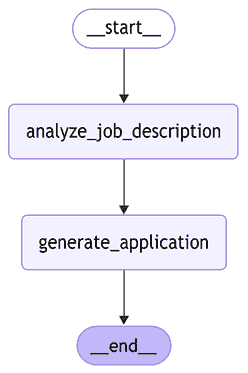
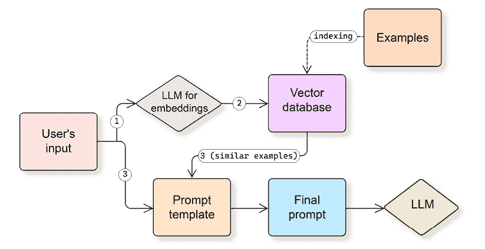
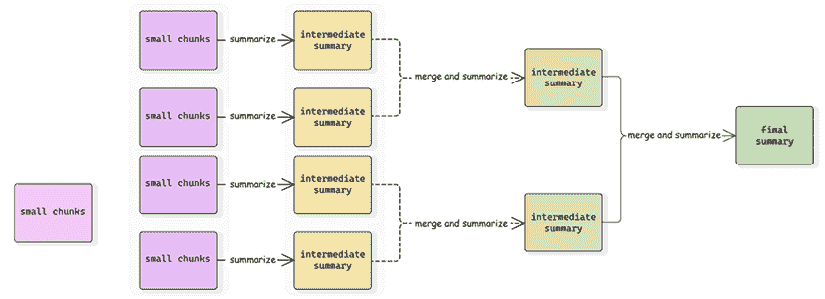

# 第四章：使用 LangGraph 构建工作流程

到目前为止，我们已经了解了 LLMs、LangChain 作为框架，以及如何在纯模式（仅基于提示生成文本输出）下使用 LangChain 与 LLMs 结合。在本章中，我们将从 LangGraph 作为框架的快速介绍开始，并探讨如何通过连接多个步骤来使用 LangChain 和 LangGraph 开发更复杂的工作流程。作为一个例子，我们将讨论解析 LLM 输出，并使用 LangChain 和 LangGraph 探讨错误处理模式。然后，我们将继续探讨开发提示的更高级方法，并探索 LangChain 为少样本提示和其他技术提供的构建块。

我们还将介绍如何处理多模态输入，利用长上下文，以及调整工作负载以克服与上下文窗口大小相关的限制。最后，我们将探讨使用 LangChain 管理内存的基本机制。理解这些基本和关键技术将帮助我们阅读 LangGraph 代码，理解教程和代码示例，并开发我们自己的复杂工作流程。当然，我们还将讨论 LangGraph 工作流程是什么，并在第五章和第六章中继续构建这一技能。

简而言之，在本章中，我们将涵盖以下主要主题：

+   LangGraph 基础知识

+   提示工程

+   与短上下文窗口一起工作

+   理解内存机制

如往常一样，您可以在我们的公共 GitHub 仓库中找到所有代码示例，作为 Jupyter 笔记本：[`github.com/benman1/generative_ai_with_langchain/tree/second_edition/chapter3`](https://github.com/benman1/generative_ai_with_langchain/tree/second_edition/chapter3)。

# LangGraph 基础知识

LangGraph 是由 LangChain（作为一家公司）开发的一个框架，它有助于控制和编排工作流程。为什么我们需要另一个编排框架呢？让我们把这个问题放在一边，直到第五章（E_Chapter_5.xhtml#_idTextAnchor231），在那里我们将触及代理和代理工作流程，但现在，让我们提到 LangGraph 作为编排框架的灵活性及其在处理复杂场景中的稳健性。

与许多其他框架不同，LangGraph 允许循环（大多数其他编排框架仅使用直接无环图），支持开箱即用的流式处理，并且有许多预构建的循环和组件，专门用于生成式 AI 应用（例如，人工审核）。LangGraph 还有一个非常丰富的 API，允许您在需要时对执行流程进行非常细粒度的控制。这在我们书中并未完全涵盖，但请记住，如果您需要，您始终可以使用更底层的 API。

**有向无环图（DAG**）是图论和计算机科学中的一种特殊类型的图。它的边（节点之间的连接）有方向，这意味着从节点 A 到节点 B 的连接与从节点 B 到节点 A 的连接不同。它没有环。换句话说，没有路径可以从一个节点开始，通过跟随有向边返回到同一个节点。

在数据工程中，DAG（有向无环图）通常用作工作流程的模型，其中节点是任务，边是这些任务之间的依赖关系。例如，从节点 A 到节点 B 的边意味着我们需要从节点 A 获取输出以执行节点 B。

目前，让我们从基础知识开始。如果你是框架的新手，我们强烈推荐参加一个免费的在线课程，该课程可在[`academy.langchain.com/`](https://academy.langchain.com/)找到，以加深你对 LangGraph 的理解。

## 状态管理

在现实世界的 AI 应用中，状态管理至关重要。例如，在一个客户服务聊天机器人中，状态可能会跟踪客户 ID、对话历史和未解决的问题等信息。LangGraph 的状态管理让你能够在多个 AI 组件的复杂工作流程中维护这个上下文。

LangGraph 允许你开发和执行复杂的称为**图**的工作流程。在本章中，我们将交替使用*图*和*工作流程*这两个词。一个图由节点及其之间的边组成。节点是工作流程的组成部分，而工作流程有一个*状态*。那是什么意思呢？首先，状态通过跟踪用户输入和之前的计算来使节点意识到当前上下文。其次，状态允许你在任何时间点持久化你的工作流程执行。第三，状态使你的工作流程真正交互式，因为一个节点可以通过更新状态来改变工作流程的行为。为了简单起见，可以把状态想象成一个 Python 字典。节点是操作这个字典的 Python 函数。它们接受一个字典作为输入，并返回另一个包含要更新工作流程状态的键和值的字典。

让我们用一个简单的例子来理解这一点。首先，我们需要定义一个状态的模式：

```py
from typing_extensions import TypedDict
class JobApplicationState(TypedDict):
 job_description: str
 is_suitable: bool
 application: str
```

`TypedDict`是一个 Python 类型构造函数，允许定义具有预定义键集的字典，每个键都可以有自己的类型（与`Dict[str, str]`构造相反）。

LangGraph 状态的模式不一定必须定义为`TypedDict`；你也可以使用数据类或 Pydantic 模型。

在我们定义了状态的模式之后，我们可以定义我们的第一个简单工作流程：

```py
from langgraph.graph import StateGraph, START, END, Graph
def analyze_job_description(state):
   print("...Analyzing a provided job description ...")
   return {"is_suitable": len(state["job_description"]) > 100}
def generate_application(state):
   print("...generating application...")
   return {"application": "some_fake_application"}
builder = StateGraph(JobApplicationState)
builder.add_node("analyze_job_description", analyze_job_description)
builder.add_node("generate_application", generate_application)
builder.add_edge(START, "analyze_job_description")
builder.add_edge("analyze_job_description", "generate_application")
builder.add_edge("generate_application", END)
graph = builder.compile()
```

在这里，我们定义了两个 Python 函数，它们是我们工作流程的组成部分。然后，我们通过提供状态的模式，在它们之间添加节点和边来定义我们的工作流程。`add_node`是一种方便的方法，可以将组件添加到您的图中（通过提供其名称和相应的 Python 函数），您可以在定义边时使用`add_edge`引用此名称。`START`和`END`是保留的内置节点，分别定义工作流程的开始和结束。

让我们通过使用内置的可视化机制来查看我们的工作流程：

```py
from IPython.display import Image, display
display(Image(graph.get_graph().draw_mermaid_png()))
```



图 3.1：LangGraph 内置可视化我们的第一个工作流程

我们的功能通过简单地从 LangGraph 自动提供的输入字典中读取来访问状态。LangGraph 隔离状态更新。当一个节点接收到状态时，它得到一个不可变的副本，而不是实际状态对象的引用。节点必须返回一个包含它想要更新的特定键和值的字典。LangGraph 然后将这些更新合并到主状态中。这种模式防止了副作用，并确保状态更改是明确和可追踪的。

节点修改状态的唯一方式是提供一个包含要更新的键值对的输出字典，LangGraph 将处理它。节点至少应该修改状态中的一个键。`graph`实例本身就是一个`Runnable`（更准确地说，它继承自`Runnable`），我们可以执行它。我们应该提供一个包含初始状态的字典，我们将得到最终状态作为输出：

```py
res = graph.invoke({"job_description":"fake_jd"})
print(res)
>>...Analyzing a provided job description ...
...generating application...
{'job_description': 'fake_jd', 'is_suitable': True, 'application': 'some_fake_application'}
```

我们使用一个非常简单的图作为示例。对于您的实际工作流程，您可以定义并行步骤（例如，您可以轻松地将一个节点与多个节点连接起来）甚至循环。LangGraph 通过所谓的*超级步骤*执行工作流程，这些步骤可以同时调用多个节点（然后合并这些节点的状态更新）。您可以在图中控制递归深度和总的超级步骤数量，这有助于您避免循环无限运行，尤其是在 LLMs 的输出非确定性时。

**LangGraph 上的超级步骤**代表对一或几个节点的离散迭代，它受到了 Google 构建的用于大规模处理大型图的系统 Pregel 的启发。它处理节点的并行执行和发送到中央图状态的状态更新。

在我们的示例中，我们使用了从节点到另一个节点的直接边。这使得我们的图与我们可以用 LangChain 定义的顺序链没有区别。LangGraph 的一个关键特性是能够创建条件边，这些边可以根据当前状态将执行流程导向一个或另一个节点。条件边是一个 Python 函数，它接收当前状态作为输入，并返回一个包含要执行节点的名称的字符串。

让我们来看一个例子：

```py
from typing import Literal
builder = StateGraph(JobApplicationState)
builder.add_node("analyze_job_description", analyze_job_description)
builder.add_node("generate_application", generate_application)
def is_suitable_condition(state: StateGraph) -> Literal["generate_application", END]:
 if state.get("is_suitable"):
 return "generate_application"
 return END
builder.add_edge(START, "analyze_job_description")
builder.add_conditional_edges("analyze_job_description", is_suitable_condition)
builder.add_edge("generate_application", END)
graph = builder.compile()
```

```py
from IPython.display import Image, display
display(Image(graph.get_graph().draw_mermaid_png()))
```

我们定义了一个边缘 `is_suitable_condition`，它通过分析当前状态来接收一个状态并返回一个 `END` 或 `generate_application` 字符串。我们使用了 `Literal` 类型提示，因为 LangGraph 使用它来确定在创建条件边缘时将源节点连接到哪些目标节点。如果你不使用类型提示，你可以直接向 `add_conditional_edges` 函数提供一个目标节点列表；否则，LangGraph 将将源节点连接到图中所有其他节点（因为它在创建图时不会分析边缘函数的代码）。以下图显示了生成的输出：


图 3.2：具有条件边缘的工作流程（用虚线表示）

条件边缘用虚线表示，现在我们可以看到，根据 `analyze_job_description` 步骤的输出，我们的图可以执行不同的操作。

## 还原器

到目前为止，我们的节点通过更新对应键的值来改变状态。从另一个角度来看，在每次超级步骤中，LangGraph 可以为给定的键生成一个新的值。换句话说，对于状态中的每个键，都有一个值的序列，并且从函数式编程的角度来看，可以将 `reduce` 函数应用于这个序列。LangGraph 上的默认还原器始终用新值替换最终值。让我们想象我们想要跟踪自定义操作（由节点产生）并比较三个选项。

第一种选择是，节点应该返回一个列表作为 `actions` 键的值。我们只提供简短的代码示例以供说明，但你可以从 Github 上找到完整的示例。如果这样的值已经存在于状态中，它将被新的一个所取代：

```py
class JobApplicationState(TypedDict):
   ...
   actions: list[str]
```

另一个选项是使用带有 `Annotated` 类型提示的默认 `add` 方法。通过使用此类型提示，我们告诉 LangGraph 编译器状态中变量的类型是字符串列表，并且它应该使用 `add` 方法将两个列表连接起来（如果值已经存在于状态中并且节点产生了一个新的值）：

```py
from typing import Annotated, Optional
from operator import add
class JobApplicationState(TypedDict):
   ...
   actions: Annotated[list[str], add]
```

最后一个选项是编写自己的自定义还原器。在这个例子中，我们编写了一个自定义还原器，它不仅接受来自节点的列表（作为新值），还接受一个将被转换为列表的单个字符串：

```py
from typing import Annotated, Optional, Union
def my_reducer(left: list[str], right: Optional[Union[str, list[str]]]) -> list[str]:
 if right:
 return left + [right] if isinstance(right, str) else left + right
 return left
class JobApplicationState(TypedDict):
   ...
   actions: Annotated[list[str], my_reducer]
```

LangGraph 有几个内置的还原器，我们还将演示如何实现自己的还原器。其中之一是 `add_messages`，它允许我们合并消息。许多节点将是 LLM 代理，而 LLM 通常与消息一起工作。因此，根据我们在第五章和第六章中将更详细讨论的对话编程范式，你通常需要跟踪这些消息：

```py
from langchain_core.messages import AnyMessage
from langgraph.graph.message import add_messages 
class JobApplicationState(TypedDict): 
  ...
  messages: Annotated[list[AnyMessage], add_messages]
```

由于这是一个如此重要的还原器，因此有一个内置的状态你可以继承：

```py
from langgraph.graph import MessagesState 
class JobApplicationState(MessagesState): 
  ...
```

现在，既然我们已经讨论了 reducers，让我们谈谈对任何开发者都非常重要的另一个概念——如何通过传递配置来编写可重用和模块化的工作流。

## 使图形可配置

LangGraph 提供了一个强大的 API，允许您使您的图形可配置。它允许您将参数与用户输入分离——例如，在不同的 LLM 提供商之间进行实验或传递自定义回调。一个节点也可以通过接受它作为第二个参数来访问配置。配置将以`RunnableConfig`实例的形式传递。

`RunnableConfig`是一个类型化字典，它让您可以控制执行控制设置。例如，您可以使用`recursion_limit`参数控制最大超步数。`RunnableConfig`还允许您在`configurable`键下作为单独的字典传递自定义参数。

让我们的节点在应用程序生成期间使用不同的 LLM：

```py
from langchain_core.runnables.config import RunnableConfig
def generate_application(state: JobApplicationState, config: RunnableConfig):
   model_provider = config["configurable"].get("model_provider", "Google")
   model_name = config["configurable"].get("model_name", "gemini-1.5-flash-002")
 print(f"...generating application with {model_provider} and {model_name} ...")
 return {"application": "some_fake_application", "actions": ["action2", "action3"]}
```

现在让我们使用自定义配置（如果您不提供任何配置，LangGraph 将使用默认配置）编译和执行我们的图形：

```py
res = graph.invoke({"job_description":"fake_jd"}, config={"configurable": {"model_provider": "OpenAI", "model_name": "gpt-4o"}})
print(res)
>> ...Analyzing a provided job description ...
...generating application with OpenAI and OpenAI ...
{'job_description': 'fake_jd', 'is_suitable': True, 'application': 'some_fake_application', 'actions': ['action1', 'action2', 'action3']}
```

既然我们已经建立了如何使用 LangGraph 构建复杂工作流的方法，让我们看看这些工作流面临的一个常见挑战：确保 LLM 的输出符合下游组件所需的精确结构。强大的输出解析和优雅的错误处理对于可靠的 AI 管道至关重要。

## 受控输出生成

当您开发复杂的工作流时，您需要解决的一个常见任务是强制 LLM 生成遵循特定结构的输出。这被称为受控生成。这样，它可以由工作流中更进一步的步骤以编程方式消费。例如，我们可以要求 LLM 为 API 调用生成 JSON 或 XML，从文本中提取某些属性，或生成 CSV 表格。有多种方法可以实现这一点，我们将在本章开始探索它们，并在第五章中继续讨论。由于 LLM 可能并不总是遵循确切的输出结构，下一步可能会失败，您需要从错误中恢复。因此，我们还将开始在本节中讨论错误处理。

### 输出解析

当将 LLM 集成到更大的工作流中时，输出解析至关重要，因为后续步骤需要结构化数据而不是自然语言响应。一种方法是向提示中添加相应的指令并解析输出。

让我们看看一个简单的任务。我们希望将某个工作描述是否适合初级 Java 程序员作为我们管道的一个步骤进行分类，并根据 LLM 的决定，我们希望继续申请或忽略这个具体的工作描述。我们可以从一个简单的提示开始：

```py
from langchain_google_vertexai import ChatVertexAI
llm = ChatVertexAI(model="gemini-1.5-flash-002")
```

```py
job_description: str = ...  # put your JD here
prompt_template = (
 "Given a job description, decide whether it suits a junior Java developer."
 "\nJOB DESCRIPTION:\n{job_description}\n"
)
result = llm.invoke(prompt_template.format(job_description=job_description))
print(result.content)
>> No, this job description is not suitable for a junior Java developer.\n\nThe key reasons are:\n\n* … (output reduced)
```

如您所见，LLM 的输出是自由文本，这可能在后续的管道步骤中难以解析或解释。如果我们向提示中添加一个特定的指令会怎样呢？

```py
prompt_template_enum = (
 "Given a job description, decide whether it suits a junior Java developer."
 "\nJOB DESCRIPTION:\n{job_description}\n\nAnswer only YES or NO."
)
result = llm.invoke(prompt_template_enum.format(job_description=job_description))
print(result.content)
>> NO
```

现在，我们如何解析这个输出？当然，我们的下一步可以是简单地查看文本并根据字符串比较进行条件判断。但这对于更复杂的使用案例不起作用——例如，如果下一步期望输出是一个 JSON 对象。为了处理这种情况，LangChain 提供了大量的 OutputParsers，它们可以接受 LLM 生成的输出并将其尝试解析为所需的格式（如果需要，则检查模式）——列表、CSV、枚举、pandas DataFrame、Pydantic 模型、JSON、XML 等等。每个解析器都实现了 `BaseGenerationOutputParser` 接口，该接口扩展了 `Runnable` 接口并添加了一个额外的 `parse_result` 方法。

让我们构建一个解析器，将输出解析为枚举：

```py
from enum import Enum
from langchain.output_parsers import EnumOutputParser
from langchain_core.messages import HumanMessage
```

```py
class IsSuitableJobEnum(Enum):
   YES = "YES"
   NO = "NO"
parser = EnumOutputParser(enum=IsSuitableJobEnum)
assert parser.invoke("NO") == IsSuitableJobEnum.NO
assert parser.invoke("YES\n") == IsSuitableJobEnum.YES
assert parser.invoke(" YES \n") == IsSuitableJobEnum.YES
assert parser.invoke(HumanMessage(content="YES")) == IsSuitableJobEnum.YES
```

`EnumOutputParser` 将文本输出转换为相应的 `Enum` 实例。请注意，解析器处理任何类似生成的输出（不仅仅是字符串），并且实际上它还会去除输出。

你可以在文档中找到完整的解析器列表，链接为 [`python.langchain.com/docs/concepts/output_parsers/`](https://python.langchain.com/docs/concepts/output_parsers/)，如果你需要自己的解析器，你总是可以构建一个新的！

作为最后一步，让我们将所有内容组合成一个链：

```py
chain = llm | parser
result = chain.invoke(prompt_template_enum.format(job_description=job_description))
print(result)
>> NO
```

现在，让我们将这个链作为我们 LangGraph 工作流程的一部分：

```py
class JobApplicationState(TypedDict):
   job_description: str
   is_suitable: IsSuitableJobEnum
   application: str
analyze_chain = llm | parser
def analyze_job_description(state):
   prompt = prompt_template_enum.format(job_description=state["job_description"])
```

```py
   result = analyze_chain.invoke(prompt)
 return {"is_suitable": result}
def is_suitable_condition(state: StateGraph):
 return state["is_suitable"] == IsSuitableJobEnum.YES
builder = StateGraph(JobApplicationState)
builder.add_node("analyze_job_description", analyze_job_description)
builder.add_node("generate_application", generate_application)
builder.add_edge(START, "analyze_job_description")
builder.add_conditional_edges(
 "analyze_job_description", is_suitable_condition,
    {True: "generate_application", False: END})
builder.add_edge("generate_application", END)
```

我们做出了两个重要的更改。首先，我们新构建的链现在是表示 `analyze_job_description` 节点的 Python 函数的一部分，这就是我们在节点内实现逻辑的方式。其次，我们的条件边函数不再返回一个字符串，而是我们在 `add_conditional_edges` 函数中添加了返回值到目标边的映射，这是一个如何实现工作流程分支的例子。

让我们花些时间讨论如果我们的解析失败，如何处理潜在的错误！

### 错误处理

在任何 LangChain 工作流程中，有效的错误管理都是必不可少的，包括处理工具故障（我们将在 *第五章* 中探讨，当我们到达工具时）。在开发 LangChain 应用程序时，请记住，失败可能发生在任何阶段：

+   调用基础模型的 API 可能会失败

+   LLM 可能会生成意外的输出

+   外部服务可能会不可用

可能的方法之一是使用基本的 Python 机制来捕获异常，将其记录以供进一步分析，并通过将异常包装为文本或返回默认值来继续你的工作流程。如果你的 LangChain 链调用某些自定义 Python 函数，请考虑适当的异常处理。同样适用于你的 LangGraph 节点。

记录日志是至关重要的，尤其是在你接近生产部署时。适当的日志记录确保异常不会被忽略，从而允许你监控其发生。现代可观察性工具提供警报机制，可以分组类似错误并通知你关于频繁发生的问题。

将异常转换为文本使您的流程能够在提供有关出错情况和潜在恢复路径的有价值上下文的同时继续执行。以下是一个简单的示例，说明您如何记录异常但通过坚持默认行为继续执行您的流程：

```py
import logging
logger = logging.getLogger(__name__)
llms = {
 "fake": fake_llm,
 "Google": llm
}
def analyze_job_description(state, config: RunnableConfig):
 try:
     llm = config["configurable"].get("model_provider", "Google")
     llm = llms[model_provider]
     analyze_chain = llm | parser
     prompt = prompt_template_enum.format(job_description=job_description)
     result = analyze_chain.invoke(prompt)
 return {"is_suitable": result}
 except Exception as e:
     logger.error(f"Exception {e} occurred while executing analyze_job_description")
 return {"is_suitable": False}
```

为了测试我们的错误处理，我们需要模拟 LLM 失败。LangChain 有几个 `FakeChatModel` 类可以帮助您测试您的链：

+   `GenericFakeChatModel` 根据提供的迭代器返回消息

+   `FakeChatModel` 总是返回一个 `"fake_response"` 字符串

+   `FakeListChatModel` 接收一条消息列表，并在每次调用时逐个返回它们

让我们创建一个每两次失败一次的假 LLM：

```py
from langchain_core.language_models import GenericFakeChatModel
from langchain_core.messages import AIMessage
class MessagesIterator:
 def __init__(self):
 self._count = 0
 def __iter__(self):
 return self
 def __next__(self):
 self._count += 1
 if self._count % 2 == 1:
 raise ValueError("Something went wrong")
 return AIMessage(content="False")
fake_llm = GenericFakeChatModel(messages=MessagesIterator())
```

当我们将此提供给我们的图（完整的代码示例可在我们的 GitHub 仓库中找到）时，我们可以看到即使在遇到异常的情况下，工作流程也会继续：

```py
res = graph.invoke({"job_description":"fake_jd"}, config={"configurable": {"model_provider": "fake"}})
print(res)
>> ERROR:__main__:Exception Expected a Runnable, callable or dict.Instead got an unsupported type: <class 'str'> occured while executing analyze_job_description
{'job_description': 'fake_jd', 'is_suitable': False}
```

当发生错误时，有时再次尝试可能会有所帮助。LLM 具有非确定性，下一次尝试可能会成功；此外，如果您正在使用第三方 API，提供商的侧可能会有各种失败。让我们讨论如何使用 LangGraph 实现适当的重试。

#### 重试

有三种不同的重试方法，每种方法都适合不同的场景：

+   使用 Runnable 的通用重试

+   节点特定的重试策略

+   语义输出修复

让我们逐一查看这些内容，从每个 `Runnable` 可用的通用重试开始。

您可以使用内置机制重试任何 `Runnable` 或 LangGraph 节点：

```py
fake_llm_retry = fake_llm.with_retry(
   retry_if_exception_type=(ValueError,),
   wait_exponential_jitter=True,
   stop_after_attempt=2,
)
analyze_chain_fake_retries = fake_llm_retry | parser
```

使用 LangGraph，您还可以为每个节点描述特定的重试。例如，让我们在发生 `ValueError` 的情况下重试我们的 `analyze_job_description` 节点两次：

```py
from langgraph.pregel import RetryPolicy
builder.add_node(
 "analyze_job_description", analyze_job_description,
  retry=RetryPolicy(retry_on=ValueError, max_attempts=2))
```

您正在使用的组件，通常称为构建块，可能有自己的重试机制，该机制通过向 LLM 提供有关出错情况的信息来尝试算法性地修复问题。例如，LangChain 上的许多聊天模型在特定的服务器端错误上具有客户端重试。

ChatAnthropic 有一个 `max_retries` 参数，您可以在每个实例或每个请求中定义。另一个更高级的构建块示例是尝试从解析错误中恢复。重试解析步骤通常没有帮助，因为通常解析错误与不完整的 LLM 输出有关。如果我们重试生成步骤并寄希望于最好的结果，或者实际上给 LLM 提供有关出错情况的提示呢？这正是 `RetryWithErrorOutputParser` 所做的。


图 3.3：向具有多个步骤的链添加重试机制

为了使用 `RetryWithErrorOutputParser`，我们首先需要用 LLM（用于修复输出）和我们的解析器来初始化它。然后，如果我们的解析失败，我们运行它并提供我们的初始提示（包含所有替换参数）、生成的响应和解析错误：

```py
from langchain.output_parsers import RetryWithErrorOutputParser
fix_parser = RetryWithErrorOutputParser.from_llm(
  llm=llm, # provide llm here
  parser=parser, # your original parser that failed
  prompt=retry_prompt, # an optional parameter, you can redefine the default prompt 
)
fixed_output = fix_parser.parse_with_prompt(
  completion=original_response, prompt_value=original_prompt)
```

我们可以在 GitHub 上阅读源代码以更好地理解发生了什么，但本质上，这是一个没有太多细节的伪代码示例。我们展示了如何将解析错误和导致此错误的原输出传递回 LLM，并要求它修复问题：

```py
prompt = """
Prompt: {prompt} Completion: {completion} Above, the Completion did not satisfy the constraints given in the Prompt. Details: {error} Please try again:
""" 
retry_chain = prompt | llm | StrOutputParser()
# try to parse a completion with a provided parser
parser.parse(completion)
# if it fails, catch an error and try to recover max_retries attempts
completion = retry_chain.invoke(original_prompt, completion, error)
```

我们在*第二章*中介绍了 `StrOutputParser`，用于将 ChatModel 的输出从 AIMessage 转换为字符串，这样我们就可以轻松地将它传递到链中的下一步。

另一点需要记住的是，LangChain 的构建块允许你重新定义参数，包括默认提示。你总是可以在 GitHub 上检查它们；有时为你的工作流程自定义默认提示是个好主意。

您可以在此处了解其他可用的输出修复解析器：[`python.langchain.com/docs/how_to/output_parser_retry/`](https://python.langchain.com/docs/how_to/output_parser_retry/)。

#### 回退

在软件开发中，**回退**是一个备选程序，允许你在基本程序失败时恢复。LangChain 允许你在 `Runnable` 级别定义回退。如果执行失败，将触发一个具有相同输入参数的替代链。例如，如果你使用的 LLM 在短时间内不可用，你的链将自动切换到使用替代提供者（可能还有不同的提示）的另一个链。

我们的假模型每秒失败一次，所以让我们给它添加一个回退。它只是一个打印语句的 lambda 函数。正如我们所看到的，每秒都会执行回退：

```py
from langchain_core.runnables import RunnableLambda
chain_fallback = RunnableLambda(lambda _: print("running fallback"))
chain = fake_llm | RunnableLambda(lambda _: print("running main chain"))
chain_with_fb = chain.with_fallbacks([chain_fallback])
chain_with_fb.invoke("test")
chain_with_fb.invoke("test")
>> running fallback
running main chain
```

生成可以遵循特定模板且可以可靠解析的复杂结果称为结构化生成（或受控生成）。这有助于构建更复杂的流程，其中 LLM 驱动的步骤的输出可以被另一个程序性步骤消费。我们将在*第五章*和*第六章*中更详细地介绍这一点。

发送到 LLM 的提示是您工作流程中最重要的构建块之一。因此，让我们接下来讨论一些提示工程的基本知识，并看看如何使用 LangChain 组织您的提示。

# 提示工程

让我们继续探讨提示工程，并探索与它相关的各种 LangChain 语法。但首先，让我们讨论提示工程与提示设计之间的区别。这些术语有时被互换使用，这造成了一定程度的混淆。正如我们在*第一章*中讨论的那样，关于 LLMs 的一个重大发现是它们具有通过*上下文学习*进行领域适应的能力。通常，仅用自然语言描述我们希望它执行的任务就足够了，即使 LLM 没有在这个特定任务上接受过训练，它也能表现出极高的性能。但正如我们可以想象的那样，描述同一任务的方式有很多种，LLMs 对这一点很敏感。为了提高特定任务上的性能而改进我们的提示（或更具体地说，提示模板）被称为提示工程。然而，开发更通用的提示，以引导 LLMs 在广泛的任务集上生成更好的响应，被称为提示设计。

存在着大量不同的提示工程技术。我们在这个部分不会详细讨论许多技术，但我们会简要介绍其中的一些，以展示 LangChain 的关键功能，这些功能将允许你构建任何想要的提示。

你可以在 Sander Schulhoff 及其同事发表的论文《提示报告：提示工程技术的系统调查》中找到一个关于提示分类学的良好概述：[`arxiv.org/abs/2406.06608`](https://arxiv.org/abs/2406.06608)。

## 提示模板

在*第二章*中我们所做的是被称为*零样本提示*的工作。我们创建了一个包含每个任务描述的提示模板。当我们运行工作流程时，我们会用运行时参数替换这个提示模板中的某些值。LangChain 有一些非常有用的抽象方法来帮助完成这项工作。

在*第二章*中，我们介绍了`PromptTemplate`，它是一个`RunnableSerializable`。记住，它在调用时替换一个字符串模板——例如，你可以基于 f-string 创建一个模板并添加你的链，LangChain 会从输入中传递参数，在模板中替换它们，并将字符串传递到链的下一步：

```py
from langchain_core.output_parsers import StrOutputParser
lc_prompt_template = PromptTemplate.from_template(prompt_template)
chain = lc_prompt_template | llm | StrOutputParser()
chain.invoke({"job_description": job_description})
```

对于聊天模型，输入不仅可以是一个字符串，还可以是`messages`的列表——例如，一个系统消息后跟对话的历史记录。因此，我们也可以创建一个准备消息列表的模板，模板本身可以基于消息列表或消息模板创建，如下例所示：

```py
from langchain_core.prompts import ChatPromptTemplate, HumanMessagePromptTemplate
from langchain_core.messages import SystemMessage, HumanMessage
msg_template = HumanMessagePromptTemplate.from_template(
  prompt_template)
msg_example = msg_template.format(job_description="fake_jd")
chat_prompt_template = ChatPromptTemplate.from_messages([
  SystemMessage(content="You are a helpful assistant."),
  msg_template])
chain = chat_prompt_template | llm | StrOutputParser()
chain.invoke({"job_description": job_description})
```

你也可以更方便地完成同样的工作，而不使用聊天提示模板，只需提交一个包含消息类型和模板字符串的元组（因为有时它更快更方便）：

```py
chat_prompt_template = ChatPromptTemplate.from_messages(
   [("system", "You are a helpful assistant."),
    ("human", prompt_template)])
```

另一个重要的概念是*占位符*。它用实时提供的消息列表替换变量。你可以通过使用`placeholder`提示或添加`MessagesPlaceholder`来将占位符添加到提示中。

```py
from langchain_core.prompts import ChatPromptTemplate, MessagesPlaceholder
chat_prompt_template = ChatPromptTemplate.from_messages(
   [("system", "You are a helpful assistant."),
    ("placeholder", "{history}"),
 # same as MessagesPlaceholder("history"),
    ("human", prompt_template)])
len(chat_prompt_template.invoke({"job_description": "fake", "history": [("human", "hi!"), ("ai", "hi!")]}).messages)
>> 4
```

现在我们的输入由四条消息组成——一条系统消息，两条我们提供的历史消息，以及一条来自模板提示的人类消息。使用占位符的最佳例子是输入聊天历史，但我们在本书后面的章节中将会看到更高级的例子，届时我们将讨论 LLM 如何与外部世界互动，或者不同的 LLM 如何在多智能体设置中协同工作。

## 零样本提示与少样本提示

正如我们之前讨论的，我们首先想要实验的是改进任务描述本身。没有解决方案示例的任务描述被称为**零样本提示**，你可以尝试多种技巧。

通常有效的方法是为 LLM 分配一个特定的角色（例如，“*你是为 XXX 财富 500 强公司工作的有用企业助理*”）并给出一些额外的指令（例如，LLM 是否应该具有创造性、简洁或事实性）。记住，LLM 已经看到了各种数据，它们可以执行不同的任务，从写奇幻小说到回答复杂的推理问题。但你的目标是指导它们，如果你想让他们坚持事实，你最好在它们的角色配置文件中给出非常具体的指令。对于聊天模型，这种角色设置通常通过系统消息完成（但请记住，即使是聊天模型，所有内容也是组合成单个输入提示，在服务器端格式化）。

Gemini 提示指南建议每个提示应包含四个部分：一个角色、一个任务、一个相关上下文和一个期望的格式。请记住，不同的模型提供商可能有不同的提示编写或格式化建议，因此如果你有复杂的提示，始终检查模型提供商的文档，在切换到新的模型提供商之前评估你的工作流程的性能，并在必要时相应地调整提示。如果你想在生产中使用多个模型提供商，你可能会拥有多个提示模板，并根据模型提供商动态选择它们。

另一个重大的改进是，可以在提示中为 LLM 提供一些这个特定任务的输入输出对作为示例。这被称为少样本提示。通常，在需要长输入的场景中（例如我们将在下一章中讨论的 RAG），少样本提示难以使用，但对于相对较短的提示任务，如分类、提取等，仍然非常有用。

当然，你总是可以在提示模板本身中硬编码示例，但这会使随着系统增长而管理它们变得困难。可能更好的方式是将示例存储在磁盘上的单独文件或数据库中，并将它们加载到提示中。

### 将提示链在一起

随着你的提示变得更加高级，它们的大小和复杂性也会增加。一个常见的场景是部分格式化你的提示，你可以通过字符串或函数替换来实现。如果提示的某些部分依赖于动态变化的变量（例如，当前日期、用户名等），则后者是相关的。下面，你可以在提示模板中找到一个部分替换的示例：

```py
system_template = PromptTemplate.from_template("a: {a} b: {b}")
system_template_part = system_template.partial(
   a="a" # you also can provide a function here
)
print(system_template_part.invoke({"b": "b"}).text)
>> a: a b: b
```

另一种使你的提示更易于管理的方法是将它们分成几部分并链接在一起：

```py
system_template_part1 = PromptTemplate.from_template("a: {a}")
system_template_part2 = PromptTemplate.from_template("b: {b}")
system_template = system_template_part1 + system_template_part2
print(system_template_part.invoke({"a": "a", "b": "b"}).text)
>> a: a b: b
```

你还可以通过使用`langchain_core.prompts.PipelinePromptTemplate`类来构建更复杂的替换。此外，你可以将模板传递给`ChatPromptTemplate`，它们将自动组合在一起：

```py
system_prompt_template = PromptTemplate.from_template("a: {a} b: {b}")
chat_prompt_template = ChatPromptTemplate.from_messages(
   [("system", system_prompt_template.template),
    ("human", "hi"),
    ("ai", "{c}")])
messages = chat_prompt_template.invoke({"a": "a", "b": "b", "c": "c"}).messages
print(len(messages))
print(messages[0].content)
>> 3
a: a b: b
```

### 动态少量提示

随着你用于少量提示的示例数量继续增加，你可能需要限制传递到特定提示模板替换中的示例数量。我们为每个输入选择示例——通过搜索与用户输入类似的内容（我们将在*第四章*中更多地讨论语义相似性和嵌入），通过长度限制，选择最新的等。



图 3.4：一个动态检索示例以传递给少量提示的工作流程示例

在`langchain_core.example_selectors`下已经内置了一些选择器。你可以在实例化时直接将示例选择器的实例传递给`FewShotPromptTemplate`实例。

## 思维链

2022 年初，谷歌研究团队引入了**思维链**（**CoT**）技术。他们展示了通过修改提示，鼓励模型生成逐步推理步骤，可以显著提高大型语言模型（LLM）在复杂符号推理、常识和数学任务上的性能。自那时以来，这种性能提升已被多次复制。

你可以阅读由 Jason Wei 及其同事发表的介绍 CoT 的原始论文，*Chain-of-Thought Prompting Elicits Reasoning in Large Language Models*：[`arxiv.org/abs/2201.11903`](https://arxiv.org/abs/2201.11903)。

CoT 提示有不同的修改版本，因为它有很长的输出，通常 CoT 提示是零样本的。你添加指令鼓励 LLM 首先思考问题，而不是立即生成代表答案的标记。CoT 的一个非常简单的例子就是在你的提示模板中添加类似“让我们一步步思考”的内容。

不同的论文中报告了各种 CoT 提示。你还可以探索 LangSmith 上可用的 CoT 模板。为了我们的学习目的，让我们使用一个带有少量示例的 CoT 提示：

```py
from langchain import hub
math_cot_prompt = hub.pull("arietem/math_cot")
cot_chain = math_cot_prompt | llm | StrOutputParser()
print(cot_chain.invoke("Solve equation 2*x+5=15"))
>> Answer: Let's think step by step
Subtract 5 from both sides:
2x + 5 - 5 = 15 - 5
2x = 10
Divide both sides by 2:
2x / 2 = 10 / 2
x = 5
```

我们使用了来自 LangSmith Hub 的提示——LangChain 可以使用的私有和公共工件集合。您可以在以下链接中探索提示本身：[`smith.langchain.com/hub.`](https://smith.langchain.com/hub. )

在实践中，您可能希望将 CoT 调用与提取步骤包装在一起，以便向用户提供简洁的答案。例如，让我们首先运行一个`cot_chain`，然后将输出（请注意，我们将包含初始`question`和`cot_output`的字典传递给下一个步骤）传递给一个 LLM，该 LLM 将使用提示根据 CoT 推理创建最终答案：

```py
from operator import itemgetter
parse_prompt_template = (
 "Given the initial question and a full answer, "
 "extract the concise answer. Do not assume anything and "
 "only use a provided full answer.\n\nQUESTION:\n{question}\n"
 "FULL ANSWER:\n{full_answer}\n\nCONCISE ANSWER:\n"
)
parse_prompt = PromptTemplate.from_template(
   parse_prompt_template
)
final_chain = (
 {"full_answer": itemgetter("question") | cot_chain,
 "question": itemgetter("question"),
 }
 | parse_prompt
```

```py
 | llm
 | StrOutputParser()
)
print(final_chain.invoke({"question": "Solve equation 2*x+5=15"}))
>> 5
```

尽管 CoT 提示似乎相对简单，但它非常强大，因为我们已经提到，它已被多次证明在许多情况下显著提高了性能。当我们讨论第五章和第六章中的代理时，我们将看到其演变和扩展。

这些天，我们可以观察到所谓的推理模型（如 o3-mini 或 gemini-flash-thinking）的 CoT 模式越来越广泛地应用。在某种程度上，这些模型确实做了完全相同的事情（但通常以更高级的方式）——它们在回答之前会思考，这不仅仅是通过改变提示，还包括准备遵循 CoT 格式的训练数据（有时是合成的）。

请注意，作为使用推理模型的替代方案，我们可以通过要求 LLM 首先生成代表推理过程的输出标记来使用 CoT 修改和附加指令：

```py
template = ChatPromptTemplate.from_messages([
    ("system", """You are a problem-solving assistant that shows its reasoning process. First, walk through your thought process step by step, labeling this section as 'THINKING:'. After completing your analysis, provide your final answer labeled as 'ANSWER:'."""),
    ("user", "{problem}")
])
```

## 自洽性

自洽性的理念很简单：让我们提高一个 LLM 的温度，多次采样答案，然后从分布中选取最频繁的答案。这已被证明可以提高基于 LLM 的工作流程在特定任务上的性能，尤其是在分类或实体提取等输出维度较低的任务上。

让我们使用前一个示例中的链并尝试一个二次方程。即使使用 CoT 提示，第一次尝试可能给出错误的答案，但如果我们从分布中进行采样，我们更有可能得到正确的答案：

```py
generations = []
for _ in range(20):
 generations.append(final_chain.invoke({"question": "Solve equation 2*x**2-96*x+1152"}, temperature=2.0).strip())
from collections import Counter
print(Counter(generations).most_common(1)[0][0])
>> x = 24
```

正如您所看到的，我们首先创建了一个包含由 LLM 为相同输入生成的多个输出的列表，然后创建了一个`Counter`类，使我们能够轻松地找到这个列表中最常见的元素，并将其作为最终答案。

**在模型提供者之间切换**

不同的提供者可能对如何构建最佳工作提示有略微不同的指导。始终检查提供者侧的文档——例如，Anthropic 强调 XML 标签在结构化您的提示中的重要性。推理模型有不同的提示指南（例如，通常，您不应使用 CoT 或 few-shot 提示与这些模型）。

最后但同样重要的是，如果您正在更改模型提供者，我们强烈建议运行评估并估计您端到端应用程序的质量。

现在我们已经学会了如何高效地组织你的提示，并使用 LangChain 的不同提示工程方法，让我们来谈谈如果提示太长而无法适应模型上下文窗口时我们能做什么。

# 与短上下文窗口一起工作

1 百万或 200 万个标记的上下文窗口似乎足够应对我们所能想象的大多数任务。使用多模态模型，你可以向模型提问关于一个、两个或多个 PDF、图像甚至视频的问题。为了处理多个文档（摘要或问答），你可以使用所谓的**stuff**方法。这种方法很简单：使用提示模板将所有输入组合成一个单一的提示。然后，将这个综合提示发送给 LLM。当组合内容适合你的模型上下文窗口时，这种方法效果很好。在下一章中，我们将讨论进一步使用外部数据来改进模型响应的方法。

请记住，通常情况下，PDF 文件会被多模态 LLM 当作图像处理。

与我们两年前使用的 4096 个输入标记的上下文窗口长度相比，当前的上下文窗口长度为 100 万或 200 万个标记，这是一个巨大的进步。但仍有几个原因需要讨论克服上下文窗口大小限制的技术：

+   并非所有模型都有长上下文窗口，尤其是开源模型或在边缘上提供的服务模型。

+   我们的知识库以及我们用 LLM 处理的任务复杂性也在扩大，因为我们可能面临即使是在当前上下文窗口下的限制。

+   较短的输入也有助于降低成本和延迟。

+   像音频或视频这样的输入越来越多，并且对输入长度（PDF 文件的总大小、视频或音频的长度等）有额外的限制。

因此，让我们仔细看看我们能做什么来处理一个比 LLM 可以处理的上下文窗口更大的上下文——摘要是一个很好的例子。处理长上下文类似于经典的 Map-Reduce（一种在 2000 年代积极发展的技术，用于以分布式和并行方式处理大型数据集的计算）。一般来说，我们有两个阶段：

+   **Map**：我们将传入的上下文分割成更小的部分，并以并行方式对每个部分应用相同的任务。如果需要，我们可以重复这个阶段几次。

+   **Reduce**：我们将先前任务的结果合并在一起。



图 3.5：一个 Map-Reduce 摘要管道

## 概括长视频

让我们构建一个 LangGraph 工作流程，实现上面提到的 Map-Reduce 方法。首先，让我们定义跟踪所讨论视频、在阶段步骤中产生的中间摘要以及最终摘要的图状态：

```py
from langgraph.constants import Send
import operator
class AgentState(TypedDict):
   video_uri: str
   chunks: int
   interval_secs: int
   summaries: Annotated[list, operator.add]
   final_summary: str
class _ChunkState(TypedDict):
   video_uri: str
   start_offset: int
   interval_secs: int
```

我们的状态模式现在跟踪所有输入参数（以便它们可以被各个节点访问）和中间结果，这样我们就可以在节点之间传递它们。然而，Map-Reduce 模式提出了另一个挑战：我们需要调度许多处理原始视频不同部分的相似任务以并行执行。LangGraph 提供了一个特殊的 `Send` 节点，它允许在具有特定状态的节点上动态调度执行。对于这种方法，我们需要一个额外的状态模式，称为 `_ChunkState`，来表示映射步骤。值得一提的是，顺序是有保证的——结果以与节点调度完全相同的顺序收集（换句话说，应用于主状态）。

让我们定义两个节点：

+   `summarize_video_chunk` 用于映射阶段

+   `_generate_final_summary` 用于归约阶段

第一个节点在主状态之外操作状态，但其输出被添加到主状态中。我们运行此节点多次，并将输出组合到主图中的列表中。为了调度这些映射任务，我们将创建一个基于 `_map_summaries` 函数的边缘，将 `START` 和 `_summarize_video_chunk` 节点连接起来：

```py
human_part = {"type": "text", "text": "Provide a summary of the video."}
async def _summarize_video_chunk(state:  _ChunkState):
   start_offset = state["start_offset"]
   interval_secs = state["interval_secs"]
   video_part = {
 "type": "media", "file_uri": state["video_uri"], "mime_type": "video/mp4",
 "video_metadata": {
 "start_offset": {"seconds": start_offset*interval_secs},
 "end_offset": {"seconds": (start_offset+1)*interval_secs}}
   }
   response = await llm.ainvoke(
       [HumanMessage(content=[human_part, video_part])])
 return {"summaries": [response.content]}
async def _generate_final_summary(state: AgentState):
   summary = _merge_summaries(
       summaries=state["summaries"], interval_secs=state["interval_secs"])
   final_summary = await (reduce_prompt | llm | StrOutputParser()).ainvoke({"summaries": summary})
 return {"final_summary": final_summary}
def _map_summaries(state: AgentState):
   chunks = state["chunks"]
   payloads = [
       {
 "video_uri": state["video_uri"],
 "interval_secs": state["interval_secs"],
 "start_offset": i
       } for i in range(state["chunks"])
   ] 
 return [Send("summarize_video_chunk", payload) for payload in payloads]
```

现在，让我们将所有这些放在一起并运行我们的图。我们可以以简单的方式将所有参数传递给管道：

```py
graph = StateGraph(AgentState)
graph.add_node("summarize_video_chunk", _summarize_video_chunk)
graph.add_node("generate_final_summary", _generate_final_summary)
graph.add_conditional_edges(START, _map_summaries, ["summarize_video_chunk"])
graph.add_edge("summarize_video_chunk", "generate_final_summary")
graph.add_edge("generate_final_summary", END)
app = graph.compile()
result = await app.ainvoke(
   {"video_uri": video_uri, "chunks": 5, "interval_secs": 600},
   {"max_concurrency": 3}
)["final_summary"]
```

现在，随着我们准备使用 LangGraph 构建我们的第一个工作流程，还有一个最后的重要主题需要讨论。如果您的对话历史变得过长，无法适应上下文窗口，或者它可能会分散 LLM 对最后输入的注意力怎么办？让我们讨论 LangChain 提供的各种内存机制。

# 理解内存机制

LangChain 链和您用它们包装的任何代码都是无状态的。当您将 LangChain 应用程序部署到生产环境中时，它们也应该保持无状态，以允许水平扩展（更多关于这一点在 *第九章*）。在本节中，我们将讨论如何组织内存以跟踪您的生成式 AI 应用程序与特定用户之间的交互。

## 剪切聊天历史

每个聊天应用程序都应该保留对话历史。在原型应用程序中，您可以在变量中存储它，但这对于生产应用程序是不适用的，我们将在下一节中解决这个问题。

聊天历史本质上是一系列消息，但在某些情况下，剪切这个历史变得有必要。虽然当 LLMs 有一个有限的范围窗口时，这是一个非常重要的设计模式，但如今，它并不那么相关，因为大多数模型（即使是小型开源模型）现在支持 8192 个标记甚至更多。尽管如此，了解剪切技术对于特定用例仍然很有价值。

剪切聊天历史有五种方法：

+   **根据长度丢弃消息**（如标记或消息计数）：你只保留最新的消息，以确保它们的总长度短于一个阈值。特殊的 LangChain 函数`from langchain_core.messages import trim_messages`允许你裁剪一系列消息。你可以提供一个函数或 LLM 实例作为`token_counter`参数传递给此函数（并且相应的 LLM 集成应支持`get_token_ids`方法；否则，可能会使用默认的分词器，结果可能与特定 LLM 提供商的标记计数不同）。此函数还允许你自定义如何裁剪消息 – 例如，是否保留系统消息，以及是否应该始终将人类消息放在第一位，因为许多模型提供商要求聊天始终以人类消息（或系统消息）开始。在这种情况下，你应该将原始的`human, ai, human, ai`序列裁剪为`human, ai`，而不是`ai, human, ai`，即使所有三条消息都适合上下文窗口的阈值。

+   **摘要之前的对话**：在每一轮中，你可以将之前的对话摘要为一条单一的消息，并将其前置到下一个用户的输入之前。LangChain 提供了一些用于运行时内存实现的构建块，但截至 2025 年 3 月，推荐的方式是使用 LangGraph 构建自己的摘要节点。你可以在 LangChain 文档部分的详细指南中找到：[`langchain-ai.github.io/langgraph/how-tos/memory/add-summary-conversation-history/`](https://langchain-ai.github.io/langgraph/how-tos/memory/add-summary-conversation-history/))。

在实现摘要或裁剪时，考虑是否应该在数据库中保留两个历史记录以供进一步调试、分析等。你可能希望保留最新的摘要的短期记忆历史以及该摘要之后的消息，以供应用程序本身使用，并且你可能希望保留整个历史记录（所有原始消息和所有摘要）以供进一步分析。如果是这样，请仔细设计你的应用程序。例如，你可能不需要加载所有原始历史和摘要消息；只需将新消息倒入数据库，同时跟踪原始历史即可。

+   **结合裁剪和摘要**：而不仅仅是简单地丢弃使上下文窗口太长的旧消息，你可以对这些消息进行摘要，并将剩余的历史记录前置。

+   **将长消息摘要为短消息**：你也可以对长消息进行摘要。这可能在下一章将要讨论的 RAG 用例中特别相关，当你的模型输入可能包括很多附加上下文，这些上下文是建立在实际用户输入之上的。

+   **实现自己的裁剪逻辑**：推荐的方式是实现自己的分词器，并将其传递给`trim_messages`函数，因为你可以重用该函数已经考虑到的很多逻辑。

当然，关于如何持久化聊天历史的问题仍然存在。让我们接下来探讨这个问题。

## 将历史记录保存到数据库

如上所述，部署到生产环境的应用程序不能在本地内存中存储聊天历史。如果你在多台机器上运行代码，无法保证同一用户的请求在下次轮次会击中相同的服务器。当然，你可以在前端存储历史记录并在每次来回发送，但这也会使会话不可共享，增加请求大小等。

不同的数据库提供商可能提供继承自`langchain_core.chat_history.BaseChatMessageHistory`的实现，这允许你通过`session_id`存储和检索聊天历史。如果你在原型设计时将历史记录保存到本地变量，我们建议使用`InMemoryChatMessageHistory`而不是列表，以便以后能够切换到与数据库的集成。

让我们来看一个例子。我们创建了一个带有回调的假聊天模型，每次调用时都会打印出输入消息的数量。然后我们初始化一个保持历史记录的字典，并创建一个单独的函数，根据`session_id`返回一个历史记录：

```py
from langchain_core.chat_history import InMemoryChatMessageHistory
from langchain_core.runnables.history import RunnableWithMessageHistory
from langchain_core.language_models import FakeListChatModel
from langchain.callbacks.base import BaseCallbackHandler
class PrintOutputCallback(BaseCallbackHandler):
 def on_chat_model_start(self, serialized, messages, **kwargs):
 print(f"Amount of input messages: {len(messages)}")
sessions = {}
handler = PrintOutputCallback()
llm = FakeListChatModel(responses=["ai1", "ai2", "ai3"])
def get_session_history(session_id: str):
 if session_id not in sessions:
       sessions[session_id] = InMemoryChatMessageHistory()
 return sessions[session_id]
```

现在我们创建了一个使用`len`函数和阈值`1`的裁剪器——即它总是移除整个历史记录，只保留一个系统消息：

```py
trimmer = trim_messages(
   max_tokens=1,
   strategy="last",
   token_counter=len,
   include_system=True,
   start_on="human",
)
raw_chain = trimmer | llm
chain = RunnableWithMessageHistory(raw_chain, get_session_history)
```

现在我们运行它并确保我们的历史记录保留了与用户的全部交互，但裁剪后的历史记录被传递给了 LLM：

```py
config = {"callbacks": [PrintOutputCallback()], "configurable": {"session_id": "1"}}
_ = chain.invoke(
   [HumanMessage("Hi!")],
   config=config,
)
print(f"History length: {len(sessions['1'].messages)}")
_ = chain.invoke(
   [HumanMessage("How are you?")],
   config=config,
)
print(f"History length: {len(sessions['1'].messages)}")
>> Amount of input messages: 1
History length: 2
Amount of input messages: 1
History length: 4
```

我们使用了一个`RunnableWithMessageHistory`，它接受一个链并使用装饰器模式将其包装（在执行链之前调用历史记录以检索并传递给链，以及在完成链之后添加新消息到历史记录）。

数据库提供商可能将他们的集成作为`langchain_commuity`包的一部分或外部提供——例如，在`langchain_postgres`库中为独立的 PostgreSQL 数据库或`langchain-google-cloud-sql-pg`库中为托管数据库。

你可以在文档页面上找到存储聊天历史的完整集成列表：[python.langchain.com/api_reference/community/chat_message_histories.html](https://python.langchain.com/api_reference/community/chat_message_histories.html)。

在设计真实的应用程序时，你应该小心管理对某人会话的访问。例如，如果你使用顺序的`session_id`，用户可能会轻易访问不属于他们的会话。实际上，可能只需要使用一个`uuid`（一个唯一生成的长标识符）而不是顺序的`session_id`，或者根据你的安全要求，在运行时添加其他权限验证。

## LangGraph 检查点

检查点是对图当前状态的快照。它保存了所有信息，以便从快照被捕获的那一刻开始继续运行工作流程——包括完整的状态、元数据、计划执行的任务节点以及失败的任务。这与存储聊天历史记录的机制不同，因为你可以在任何给定的时间点存储工作流程，稍后从检查点恢复以继续。这有多个重要原因：

+   检查点允许深入调试和“时间旅行”。

+   检查点允许你在复杂的流程中尝试不同的路径，而无需每次都重新运行它。

+   检查点通过在特定点实现人工干预并继续进一步，促进了人工介入的工作流程。

+   检查点有助于实现生产就绪的系统，因为它们增加了所需的持久性和容错级别。

让我们构建一个简单的示例，其中包含一个打印状态中消息数量并返回假`AIMessage`的单节点。我们使用一个内置的`MessageGraph`，它表示一个只有消息列表的状态，并初始化一个`MemorySaver`，它将在本地内存中保存检查点，并在编译期间将其传递给图：

```py
from langgraph.graph import MessageGraph
from langgraph.checkpoint.memory import MemorySaver
```

```py
def test_node(state):
 # ignore the last message since it's an input one
 print(f"History length = {len(state[:-1])}")
 return [AIMessage(content="Hello!")]
builder = MessageGraph()
builder.add_node("test_node", test_node)
builder.add_edge(START, "test_node")
builder.add_edge("test_node", END)
memory = MemorySaver()
graph = builder.compile(checkpointer=memory)
```

现在，每次我们调用图时，我们都应该提供一个特定的检查点或线程-id（每次运行的唯一标识符）。我们用不同的`thread-id`值调用我们的图两次，确保它们每个都以空的历史记录开始，然后检查当我们第二次调用它时，第一个线程有一个历史记录：

```py
_ = graph.invoke([HumanMessage(content="test")],
  config={"configurable": {"thread_id": "thread-a"}})
_ = graph.invoke([HumanMessage(content="test")]
  config={"configurable": {"thread_id": "thread-b"}})
_ = graph.invoke([HumanMessage(content="test")]
  config={"configurable": {"thread_id": "thread-a"}})
>> History length = 0
History length = 0
History length = 2
```

我们可以检查特定线程的检查点：

```py
checkpoints = list(memory.list(config={"configurable": {"thread_id": "thread-a"}}))
for check_point in checkpoints:
 print(check_point.config["configurable"]["checkpoint_id"])
```

让我们再从`thread-a`的初始检查点恢复。我们会看到我们从一个空的历史记录开始：

```py
checkpoint_id = checkpoints[-1].config["configurable"]["checkpoint_id"]
_ = graph.invoke(
```

```py
   [HumanMessage(content="test")],
   config={"configurable": {"thread_id": "thread-a", "checkpoint_id": checkpoint_id}})
>> History length = 0
```

我们也可以从一个中间检查点开始，如下所示：

```py
checkpoint_id = checkpoints[-3].config["configurable"]["checkpoint_id"]
_ = graph.invoke(
   [HumanMessage(content="test")],
   config={"configurable": {"thread_id": "thread-a", "checkpoint_id": checkpoint_id}})
>> History length = 2
```

检查点的一个明显用途是实现需要用户额外输入的工作流程。我们将遇到与上面完全相同的问题——当我们将我们的生产部署到多个实例时，我们无法保证用户的下一个请求击中与之前相同的服务器。我们的图是状态性的（在执行期间），但将其作为网络服务封装的应用程序应该保持无状态。因此，我们无法在本地内存中存储检查点，而应该将它们写入数据库。LangGraph 提供了两个集成：`SqliteSaver`和`PostgresSaver`。你可以始终将它们作为起点，并在需要使用其他数据库提供者时构建自己的集成，因为你需要实现的是存储和检索表示检查点的字典。

现在，你已经学到了基础知识，并且已经完全准备好开发你自己的工作流程。我们将在下一章继续探讨更复杂的一些示例和技术。

# 摘要

在本章中，我们深入探讨了使用 LangChain 和 LangGraph 构建复杂工作流程，超越了简单的文本生成。我们介绍了 LangGraph 作为一种编排框架，旨在处理代理工作流程，并创建了一个基本的工作流程，包括节点和边，以及条件边，允许工作流程根据当前状态进行分支。接下来，我们转向输出解析和错误处理，展示了如何使用内置的 LangChain 输出解析器，并强调了优雅错误处理的重要性。

然后，我们探讨了提示工程，讨论了如何使用 LangChain 的零样本和动态少样本提示，如何构建高级提示，如 CoT 提示，以及如何使用替换机制。最后，我们讨论了如何处理长和短上下文，探索了通过将输入拆分为更小的部分并按 Map-Reduce 方式组合输出来管理大上下文的技术，并处理了一个处理大型视频的示例，该视频不适合上下文。

最后，我们涵盖了 LangChain 中的内存机制，强调了在生产部署中保持无状态的需求，并讨论了管理聊天历史的方法，包括基于长度的修剪和总结对话。

我们将在这里学到的知识用于在 *第四章* 中开发 RAG 系统，以及在 *第五章* 和 *第六章* 中开发更复杂的代理工作流程。

# 问题

1.  LangGraph 是什么，LangGraph 工作流程与 LangChain 的标准链有什么不同？

1.  LangGraph 中的“状态”是什么，它的主要功能是什么？

1.  解释 LangGraph 中 *add_node* 和 *add_edge* 的作用。

1.  LangGraph 中的“supersteps”是什么，它们与并行执行有什么关系？

1.  与顺序链相比，条件边如何增强 LangGraph 工作流程？

1.  在定义条件边时，Literal 类型提示的作用是什么？

1.  LangGraph 中的“reducers”是什么，它们如何允许修改状态？

1.  为什么错误处理在 LangChain 工作流程中至关重要，以及实现它的策略有哪些？

1.  如何使用内存机制来修剪对话机器人的历史记录？

1.  LangGraph 检查点的用例是什么？

# 订阅我们的每周通讯

订阅 AI_Distilled，这是人工智能专业人士、研究人员和创新者的首选通讯，请访问 `packt.link/Q5UyU`。


