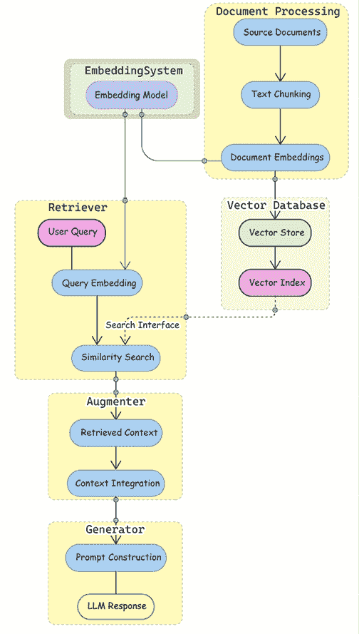

# 第五章：构建智能 RAG 系统

到目前为止，在这本书中，我们讨论了 LLMs、标记以及如何在 LangChain 中与他们一起工作。**检索增强生成**（**RAG**）通过在生成过程中动态地结合外部知识来扩展 LLMs，解决了固定训练数据、幻觉和上下文窗口的限制。简单来说，RAG 系统接收一个查询，直接将其转换为语义向量嵌入，运行搜索提取相关文档，并将这些文档传递给生成上下文适当的用户响应的模型。

本章探讨了 RAG 系统和 RAG 的核心组件，包括向量存储、文档处理、检索策略、实现和评估技术。之后，我们将通过构建聊天机器人来实践本书中迄今为止学到的许多内容。我们将构建一个生产就绪的 RAG 管道，以简化企业项目文档的创建和验证。这个企业用例展示了如何生成初始文档，评估其合规性和一致性，并整合人类反馈——所有这些都在一个模块化和可扩展的工作流程中完成。

本章包含以下部分：

+   从索引到智能检索

+   RAG 系统的组成部分

+   从嵌入到搜索

+   拆解 RAG 管道

+   开发企业文档聊天机器人

+   故障排除 RAG 系统

让我们先介绍 RAG、其重要性以及使用 RAG 框架时的主要考虑因素。

# 从索引到智能检索

信息检索自从有记录知识以来一直是人类的基本需求。在过去 70 年中，检索系统一直在同一个核心范式下运行：

1.  首先，用户将信息需求表述为一个查询。

1.  他们然后将这个查询提交给检索系统。

1.  最后，系统返回可能满足信息需求的文档引用：

    +   参考文献可能按相关性递减排序

    +   结果可能包含来自每个文档的相关摘录（称为片段）

虽然这个范式保持不变，但实现和用户体验已经经历了显著的转变。早期的信息检索系统依赖于人工索引和基本的关键词匹配。20 世纪 60 年代计算机化索引的出现引入了倒排索引——一种将每个单词映射到包含它的文档列表的数据结构。这种词汇方法推动了第一代搜索引擎，如 AltaVista（1996 年），其结果主要基于精确的关键词匹配。

然而，这种方法很快显现出局限性。单词可以有多个含义（多义性），不同的单词可以表达相同的概念（同义性），而且用户往往难以精确地表达他们的信息需求。

信息检索活动伴随着非货币成本：时间投入、认知负荷和交互成本——研究人员称之为“德尔菲成本”。用户对搜索引擎的满意度不仅与结果的相关性相关，还与用户提取所需信息的多容易程度相关。

传统检索系统旨在通过各种优化来降低这些成本：

+   在构建查询时通过同义词扩展来降低认知负荷

+   结果排序以减少浏览结果的时间成本

+   结果摘录（显示搜索结果的简短、相关摘录）以降低评估文档相关性的成本

这些改进反映了这样一个理解：搜索的最终目标不仅仅是找到文档，而是满足信息需求。

Google 的 PageRank 算法（20 世纪 90 年代末）通过考虑链接结构来改进结果，但即使是现代搜索引擎也面临着理解意义的基本局限性。搜索体验从简单的匹配文档列表发展到更丰富的呈现方式，包括上下文摘录（从 20 世纪 90 年代末 Yahoo 的高亮术语开始，发展到 Google 的动态文档预览，提取包含搜索词的最相关句子），但根本的挑战仍然存在：弥合查询术语与相关信息之间的语义差距。

传统检索系统的一个基本局限性在于它们对文档检索的词汇方法。在 Uniterm 模型中，查询术语通过倒排索引映射到文档，其中词汇表中的每个词都指向一个“位置列表”。这种方法有效地支持了复杂的布尔查询，但本质上忽略了术语之间的语义关系。例如，“乌龟”和“陆龟”在倒排索引中被视为完全不同的词语，尽管它们在语义上是相关的。早期的检索系统试图通过在查询中添加同义词来弥合这一差距，但根本的局限性仍然存在。

突破随着神经网络模型的发展而来，这些模型能够捕捉词语和文档的意义，作为密集向量表示——称为嵌入。与传统的关键词系统不同，嵌入创建了一个*语义地图*，其中相关概念聚集在一起——“乌龟”、“陆龟”和“爬行动物”在这个空间中会作为邻居出现，而“银行”（金融）会与“金钱”聚集在一起，但与“河流”相距甚远。这种意义的几何组织使得检索基于概念相似性而不是精确的词语匹配。

这种转换随着 Word2Vec（2013）和后来的基于 transformer 的模型如 BERT（2018）等模型的出现而加速，这些模型引入了上下文理解。BERT 的创新在于认识到同一个词在不同的上下文中可能有不同的含义——“银行”作为一个金融机构与“河流”的“河岸”。这些分布式表示从根本上改变了信息检索的可行性，使得能够开发出能够理解查询背后的意图而不是仅仅匹配关键词的系统。

随着基于 transformer 的语言模型规模的扩大，研究人员发现它们不仅学习了语言模式，还记住了训练数据中的事实知识。谷歌研究人员的研究表明，像 T5 这样的模型可以在没有外部检索的情况下回答事实问题，充当隐式知识库。这表明了一种范式转变——从检索包含答案的文档到直接从内部知识生成答案。然而，这些“闭卷”生成系统面临局限性：幻觉风险、知识截止到训练数据、无法引用来源以及复杂推理的挑战。解决方案在**RAG**中浮现，它将传统的检索系统与生成语言模型相结合，结合它们各自的优势同时解决各自的弱点。

# RAG 系统的组件

RAG 使语言模型能够将它们的输出建立在外部知识的基础上，为纯 LLM 所面临的局限性提供了一个优雅的解决方案：幻觉、过时信息和受限的上下文窗口。通过按需检索相关信息，RAG 系统有效地绕过了语言模型的上下文窗口限制，允许它们利用庞大的知识库，而无需将所有内容压缩到模型的固定注意力范围内。

与传统搜索引擎简单地检索文档供人类审查（或像纯 LLM 那样仅从内部知识生成答案）不同，RAG 系统检索信息以告知并支持 AI 生成的响应。这种方法结合了检索的可验证性与生成 AI 的流畅性和理解力。

在其核心，RAG 由以下主要组件协同工作：

+   **知识库**：外部信息的存储层

+   **检索器**：知识访问层，用于查找相关信息

+   **增强器**：整合层，用于准备检索到的内容

+   **生成器**：生成最终输出的响应层

从流程角度来看，RAG 通过两个相互连接的管道运行：

+   一个索引管道，用于处理、分块和存储知识库中的文档

+   一个查询管道，用于检索相关信息并使用这些信息生成响应

RAG 系统中的工作流程遵循一个清晰的顺序：当查询到达时，它被处理以进行检索；检索器随后在知识库中搜索相关信息；检索到的上下文通过增强与原始查询相结合；最后，语言模型生成一个基于查询和检索信息的响应。我们可以在以下图中看到这一点：



图 4.1：RAG 架构和工作流程

这种架构为生产系统提供了几个优点：模块化允许组件独立开发；可扩展性使资源可以根据特定需求分配；通过明确分离关注点来提高可维护性；灵活性允许根据需求的变化交换不同的实现策略。

在接下来的章节中，我们将详细探讨图 4.1 中的每个组件，从现代 RAG 系统的基本构建块开始：为知识库和检索器组件提供动力的**嵌入**和**向量存储**。但在我们深入之前，首先考虑实施 RAG 或使用纯 LLM 之间的决策非常重要。这个选择将从根本上影响你应用程序的整体架构和操作特性。让我们讨论一下权衡利弊！

## 何时实施 RAG

引入 RAG 带来了必须仔细权衡的架构复杂性，以符合你的应用程序需求。RAG 在当前或可验证信息至关重要的专业领域特别有价值。医疗应用程序必须处理医学图像和时间序列数据，而金融系统需要处理高维度的市场数据以及历史分析。法律应用程序得益于 RAG 处理复杂文档结构和维护来源归属的能力。这些特定领域的需求通常证明实施 RAG 的额外复杂性是合理的。

然而，RAG 的好处伴随着重大的实施考虑。系统需要高效的索引和检索机制来维持合理的响应时间。知识库需要定期更新和维护以保持其价值。基础设施必须设计得能够优雅地处理错误和边缘情况，特别是在不同组件交互的地方。开发团队必须准备好管理这些持续的操作需求。

另一方面，当这些复杂性超过其好处时，纯 LLM 实现可能更为合适。专注于创意任务、一般对话或需要快速响应时间的场景的应用通常在没有检索系统开销的情况下表现良好。当与静态、有限的知识库一起工作时，微调或提示工程等技术可能提供更简单的解决方案。

这项分析既来自研究，也来自实际实施，表明对于知识货币、准确性和领域专业知识的具体要求应指导 RAG 与纯 LLM 之间的选择，同时平衡组织管理额外架构复杂性的能力。

在 Chelsea AI Ventures，我们的团队观察到，在监管行业中的客户特别受益于 RAG 的可验证性，而创意应用通常在纯 LLM 上表现良好。

当开发团队的应用程序需要以下功能时，应考虑使用 RAG：

+   访问 LLM 训练数据中不可用的当前信息

+   领域特定知识整合

+   具有来源归属的可验证响应

+   处理专用数据格式

+   在监管行业中的高精度

因此，让我们探讨每个 RAG 组件的实现细节、优化策略和生产部署考虑因素。

# 从嵌入到搜索

如前所述，RAG 系统包括一个检索器，用于找到相关信息，一个增强机制，用于整合这些信息，以及一个生成器，用于生成最终输出。在构建使用 LLM 的 AI 应用程序时，我们通常关注令人兴奋的部分——提示、链和模型输出。然而，任何稳健的 RAG 系统的基石在于我们如何存储和检索我们的向量嵌入。想象一下，就像建造一个图书馆——在我们能够高效地找到书籍（向量搜索）之前，我们需要一个建筑来存储它们（向量存储）和一个组织系统来找到它们（向量索引）。在本节中，我们介绍了 RAG 系统的核心组件：向量嵌入、向量存储和索引策略以优化检索。

要使 RAG（Retrieval-Augmented Generation，检索增强生成）工作，我们首先需要解决一个基本挑战：我们如何帮助计算机理解文本的意义，以便它们能够找到相关信息？这正是嵌入技术发挥作用的地方。

## 嵌入

嵌入是捕获语义意义的文本的数值表示。当我们创建嵌入时，我们正在将单词或文本块转换为计算机可以处理的向量（数字列表）。这些向量可以是稀疏的（大部分为零，只有少数非零值）或密集的（大多数值非零），现代 LLM（Large Language Model，大型语言模型）系统通常使用密集嵌入。

嵌入的强大之处在于，具有相似意义的文本具有相似的数值表示，这使得通过最近邻算法进行语义搜索成为可能。

换句话说，嵌入模型将文本转换为数值向量。相同的模型用于文档以及查询，以确保向量空间的一致性。以下是您如何在 LangChain 中使用嵌入的方法：

```py
from langchain_openai import OpenAIEmbeddings
# Initialize the embeddings model
embeddings_model = OpenAIEmbeddings()
# Create embeddings for the original example sentences
text1 = "The cat sat on the mat"
text2 = "A feline rested on the carpet"
text3 = "Python is a programming language"
# Get embeddings using LangChain
embeddings = embeddings_model.embed_documents([text1, text2, text3])
# These similar sentences will have similar embeddings
embedding1 = embeddings[0] # Embedding for "The cat sat on the mat"
embedding2 = embeddings[1] # Embedding for "A feline rested on the
carpet"
embedding3 = embeddings[2] # Embedding for "Python is a programming
language"
# Output shows 3 documents with their embedding dimensions
print(f"Number of documents: {len(embeddings)}")
print(f"Dimensions per embedding: {len(embeddings[0])}")
# Typically 1536 dimensions with OpenAI's embeddings
```

一旦我们有了这些 OpenAI 嵌入（我们为上述示例句子生成的 1536 维向量），我们需要一个专门设计的系统来存储它们。与常规数据库值不同，这些高维向量需要专门的存储解决方案。

LangChain 中的`Embeddings`类为来自各种提供商（OpenAI、Cohere、Hugging Face 等）的所有嵌入模型提供了一个标准接口。它公开了两个主要方法：

+   `embed_documents`：接受多个文本并为每个文本返回嵌入

+   `embed_query`：接受单个文本（您的搜索查询）并返回其嵌入

一些提供商对文档和查询使用不同的嵌入方法，这就是为什么这些方法在 API 中是分开的。

这就引出了向量存储——专门针对高维空间中的相似度搜索进行优化的数据库。

## 向量存储

向量存储是专门设计的数据库，用于存储、管理和高效搜索向量嵌入。正如我们所看到的，嵌入将文本（或其他数据）转换为捕获语义意义的数值向量。

向量存储解决了如何持久化和高效地搜索这些高维向量的基本挑战。请注意，向量数据库作为一个独立的系统，可以：

+   独立于 RAG 组件进行扩展

+   独立维护和优化

+   可能在多个 RAG 应用程序之间共享

+   作为一项专用服务托管

当处理嵌入时，会出现几个挑战：

+   **规模**：应用程序通常需要存储数百万个嵌入

+   **维度**：每个嵌入可能包含数百或数千个维度

+   **搜索性能**：快速找到相似向量变得计算密集

+   **关联数据**：我们需要维护向量与其源文档之间的联系

考虑一个现实世界的例子，看看我们需要存储什么：

```py
# Example of data that needs efficient storage in a vector store
document_data = {
 "id": "doc_42",
 "text": "LangChain is a framework for developing applications powered by language models.",
 "embedding": [0.123, -0.456, 0.789, ...],  # 1536 dimensions for OpenAI embeddings
 "metadata": {
 "source": "documentation.pdf",
 "page": 7,
 "created_at": "2023-06-15"
    }
}
```

在其核心，向量存储结合了两个基本组件：

+   **向量存储**：实际持久化向量和元数据的数据库

+   **向量索引**：一种专门的数据结构，能够实现高效的相似度搜索

效率挑战来自**维度诅咒**——随着向量维度的增加，计算相似性变得越来越昂贵，需要 O(dN)操作，其中 d 是维度，N 是向量。这使得原始的相似度搜索对于大规模应用来说不切实际。

向量存储通过在多维空间中进行距离计算，实现了基于相似度的搜索。虽然传统数据库擅长精确匹配，但向量嵌入允许进行语义搜索和**近似最近邻**（**ANN**）检索。

与传统数据库的关键区别在于向量存储如何处理搜索。

**传统数据库搜索**：

+   使用精确匹配（相等，范围）

+   优化用于结构化数据（例如，“找到所有年龄大于 30 岁的客户”）

+   通常使用 B 树或基于哈希的索引

**向量存储搜索**：

+   使用相似度度量（余弦相似度，欧几里得距离）

+   优化用于高维向量空间

+   采用近似最近邻（ANN）算法

### 向量存储比较

向量存储管理高维嵌入以进行检索。以下表格比较了根据关键属性流行的向量存储，以帮助您选择最适合您特定需求的解决方案：

| **数据库** | **部署选项** | **许可** | **显著特性** |
| --- | --- | --- | --- |
| Pinecone | 仅云 | 商业 | 自动扩展，企业安全，监控 |
| Milvus | 云，自托管 | Apache 2.0 | HNSW/IVF 索引，多模态支持，CRUD 操作 |
| Weaviate | 云，自托管 | BSD 3-Clause | 图形结构，多模态支持 |
| Qdrant | 云，自托管 | Apache 2.0 | HNSW 索引，过滤优化，JSON 元数据 |
| ChromaDB | 云，自托管 | Apache 2.0 | 轻量级，易于设置 |
| AnalyticDB-V | 仅云 | 商业 | OLAP 集成，SQL 支持，企业功能 |
| pg_vector | 云，自托管 | 开源 | SQL 支持，PostgreSQL 集成 |
| Vertex Vector Search | 仅云 | 商业 | 易于设置，低延迟，高可扩展性 |

表 4.1：根据部署选项、许可和关键特性比较向量存储

每个向量存储在部署灵活性、许可和专用功能方面都有不同的权衡。对于生产级 RAG 系统，考虑以下因素：

+   您是否需要云托管或自托管部署

+   对特定功能的需求，如 SQL 集成或多模态支持

+   设置和维护的复杂性

+   预期嵌入体积的扩展需求

对于许多以 RAG 为起点的应用，ChromaDB 等轻量级选项提供了简单性和功能性的良好平衡，而企业部署可能从 Pinecone 或 AnalyticDB-V 的高级功能中受益。现代向量存储支持多种搜索模式：

+   **精确搜索**: 返回精确的最近邻，但随着大型向量集合的增大，计算成本变得过高

+   **近似搜索**: 使用 LSH、HNSW 或量化等技术以速度换取精度；通过召回率（检索到的真实最近邻的百分比）来衡量

+   **混合搜索**: 在单个查询中结合向量相似性和基于文本的搜索（如关键词匹配或 BM25）

+   **过滤向量搜索**: 在向量相似性搜索的同时应用传统的数据库过滤器（例如，元数据约束）

向量存储还处理不同类型的嵌入：

+   **密集向量搜索**: 使用连续嵌入，其中大多数维度具有非零值，通常来自神经网络模型（如 BERT、OpenAI 嵌入）

+   **稀疏向量搜索**: 使用高维向量，其中大多数值为零，类似于传统的 TF-IDF 或 BM25 表示

+   **稀疏-密集混合**: 结合两种方法以利用语义相似性（密集）和关键词精确度（稀疏）

它们还经常提供多种相似度度量选择，例如：

+   **内积**: 用于比较语义方向

+   **余弦相似度**：对向量大小进行归一化

+   **欧几里得距离**：在向量空间中测量 L2 距离（注意：对于归一化嵌入，这功能上等同于点积）

+   **汉明距离**：对于二进制向量表示

当为 RAG 应用实现向量存储时，第一个架构决策之一是使用本地存储还是基于云的解决方案。让我们探讨每种方法的权衡和考虑因素。

+   当你需要最大控制权、有严格的隐私要求，或在较小规模且工作负载可预测的情况下运营时，请选择本地存储。

+   当你需要弹性扩展、偏好管理服务或以可变工作负载运营分布式应用时，请选择云存储。

+   当你想平衡性能和可扩展性时，考虑混合存储架构，结合本地缓存和基于云的持久化。

### 向量存储的硬件考虑因素

无论你的部署方法如何，了解硬件要求对于最佳性能至关重要：

+   **内存需求**：向量数据库内存密集，生产系统通常需要 16-64GB RAM 来存储数百万个嵌入。本地部署应计划足够的内存余量以容纳索引增长。

+   **CPU 与 GPU**：虽然基本的向量操作可以在 CPU 上运行，但 GPU 加速显著提高了大规模相似度搜索的性能。对于高吞吐量应用，GPU 支持可以提供 10-50 倍的速度提升。

+   **存储速度**：在生产向量存储中，强烈建议使用 SSD 存储而不是 HDD，因为索引加载和搜索性能高度依赖于 I/O 速度。这对于本地部署尤为重要。

+   **网络带宽**：对于基于云或分布式设置，网络延迟和带宽成为影响查询响应时间的关键因素。

对于开发和测试，大多数向量存储可以在 8GB+ RAM 的标准笔记本电脑上运行，但生产部署应考虑专用基础设施或基于云的向量存储服务，这些服务可以自动处理这些资源考虑因素。

### LangChain 中的向量存储接口

现在我们已经探讨了向量存储的作用并比较了一些常见选项，让我们看看 LangChain 是如何简化与它们一起工作的。LangChain 提供了一个标准化的接口来处理向量存储，允许你轻松地在不同的实现之间切换：

```py
from langchain_openai import OpenAIEmbeddings
from langchain_chroma import Chroma
# Initialize with an embedding model
embeddings = OpenAIEmbeddings()
vector_store = Chroma(embedding_function=embeddings)
```

LangChain 中的`vectorstore`基类提供了这些基本操作：

1.  添加文档：

    ```py
    docs = [Document(page_content="Content 1"), Document(page_
    content="Content 2")]
    ids = vector_store.add_documents(docs)
    ```

1.  相似度搜索：

    ```py
    results = vector_store.similarity_search("How does LangChain work?", k=3)
    ```

1.  删除：

    ```py
    vector_store.delete(ids=["doc_1", "doc_2"])
    ```

1.  最大边际相关度搜索：

    ```py
    # Find relevant BUT diverse documents (reduce redundancy)
    results = vector_store.max_marginal_relevance_search(
     "How does LangChain work?",
     k=3,
     fetch_k=10,
     lambda_mult=0.5  # Controls diversity (0=max diversity, 1=max relevance)
    )
    ```

还重要的是简要概述向量存储除 RAG 以外的应用。

+   大数据集中的异常检测

+   个性化推荐系统

+   NLP 任务

+   欺诈检测

+   网络安全监控

然而，存储向量还不够。在处理查询时，我们需要快速找到相似向量。如果没有适当的索引，搜索向量就像试图在没有组织系统的图书馆中找到一本书 – 你不得不检查每一本书。

## 向量索引策略

向量索引是使向量数据库适用于现实世界应用的关键组件。在其核心，索引解决了基本性能挑战：如何高效地找到相似向量，而无需与数据库中的每个向量进行比较（暴力方法），这对于即使是中等规模的数据量也是计算上不可行的。

向量索引是专门的数据结构，以组织向量，使系统能够快速识别向量空间中最可能包含相似向量的部分。系统不必检查每个向量，而是首先关注有希望的区域。

一些常见的索引方法包括：

+   **基于树的结构**，按层次划分向量空间

+   **基于图的方法**，如**分层可导航小世界**（HNSW），创建连接向量的可导航网络

+   **哈希技术**将相似向量映射到相同的“桶”

前述每种方法都提供了在以下方面之间的不同权衡：

+   搜索速度

+   结果的准确性

+   内存使用

+   更新效率（添加新向量有多快）

当在 LangChain 中使用向量存储时，索引策略通常由底层实现处理。例如，当你创建 FAISS 索引或使用 Pinecone 时，这些系统会根据你的配置自动应用适当的索引策略。

关键要点是，适当的索引将向量搜索从 O(n) 操作（其中 n 是向量的数量）转变为更高效的操作（通常接近 O(log n)），这使得能够在毫秒内而不是秒或分钟内搜索数百万个向量。

下面是一个表格，概述不同的策略：

| **策略** | **核心算法** | **复杂度** | **内存使用** | **最佳用途** | **备注** |
| --- | --- | --- | --- | --- | --- |
| 精确搜索（暴力搜索） | 将查询向量与数据库中的每个向量进行比较 | 搜索：O(DN)构建：O(1) | 低 – 只存储原始向量 |
| · 小数据集 | · 实现最简单 |
| · 当需要 100%召回率时 | · 好的测试基线 |
| · 测试/基线 | |
| HNSW（分层可导航小世界） | 创建从底部到顶部连接度递减的分层图 | 搜索：O(log N)构建：O(N log N) | 高 – 存储图连接和向量 |
| · 生产系统 | · 行业标准 | 
| · 当需要高精度时 |  · 需要仔细调整 M（连接数）和 ef（搜索深度） | 
| · 大规模搜索 | |
| LSH（局部敏感哈希） | 使用将相似向量映射到相同桶的哈希函数 | 搜索：`O(N⁰)`构建：`O(N)` | 中等 – 存储多个哈希表 |
| · 流式数据 | · 适用于动态数据 |
| · 当更新频繁时 | · 可调精度与速度 |
| · 近似搜索可行 | |
| IVF（倒排文件索引） | 在相关簇内聚类向量和搜索 | 搜索：O(DN/k)构建：O(kN) | 低 – 存储簇分配 |

+   内存有限

+   速度/精度平衡

+   简单实现

|

+   k = 簇的数量

+   通常与其他方法结合使用

|

| 产品量化（PQ） | 通过将向量分割到子空间并进行量化来压缩向量 | 搜索：变化构建：O(N) | 非常低 – 压缩向量 |
| --- | --- | --- | --- |

+   内存受限系统

+   巨大数据集

|

+   通常与 IVF 结合使用

+   需要训练代码簿

+   复杂实现

|

|

基于树的（KD-Tree，球树）

| 递归地将空间划分为区域 | 搜索：O(D log N)最佳情况构建：O(N log N) | 中等 – 树结构 |
| --- | --- | --- |

+   低维数据

+   静态数据集

|

+   对于 D < 100 效果良好

+   费时更新

|

表 4.2：根据部署选项、许可和关键特性比较向量存储

当为你的 RAG 系统选择索引策略时，考虑这些实际的权衡：

+   **对于小数据集的最大精度**（<100K 个向量）：精确搜索提供了完美的召回率，但随着数据集的增长变得过于昂贵。

+   **对于拥有数百万向量的生产系统**：HNSW 提供了速度和精度之间的最佳平衡，使其成为大规模应用的行业标准。虽然它比其他方法需要更多的内存，但其对数搜索复杂度即使在数据集规模扩大时也能提供一致的性能。

+   **对于内存受限的环境**：IVF+PQ（倒排文件索引与产品量化）显著降低了内存需求——通常比原始向量低 10-20 倍，但精度有所妥协。这种组合对于边缘部署或嵌入数十亿文档时特别有价值。

+   **对于频繁更新的集合**：LSH 提供了高效的更新，无需重建整个索引，这使得它适合于流数据应用，其中文档持续添加或删除。

大多数现代向量数据库默认使用 HNSW，这是有充分理由的，但了解这些权衡允许你在必要时针对你的特定约束进行优化。为了说明索引策略之间的实际差异，让我们使用 FAISS 比较精确搜索与 HNSW 索引的性能和精度：

```py
import numpy as np
import faiss
import time
# Create sample data - 10,000 vectors with 128 dimensions
dimension = 128
num_vectors = 10000
vectors = np.random.random((num_vectors, dimension)).astype('float32')
query = np.random.random((1, dimension)).astype('float32')
```

```py
# Exact search index
exact_index = faiss.IndexFlatL2(dimension)
exact_index.add(vectors)
# HNSW index (approximate but faster)
hnsw_index = faiss.IndexHNSWFlat(dimension, 32)  # 32 connections per node
hnsw_index.add(vectors)
# Compare search times
start_time = time.time()
exact_D, exact_I = exact_index.search(query, k=10)  # Search for 10 nearest neighbors
exact_time = time.time() - start_time
start_time = time.time()
hnsw_D, hnsw_I = hnsw_index.search(query, k=10)
hnsw_time = time.time() - start_time
# Calculate overlap (how many of the same results were found)
overlap = len(set(exact_I[0]).intersection(set(hnsw_I[0])))
overlap_percentage = overlap * 100 / 10
print(f"Exact search time: {exact_time:.6f} seconds")
print(f"HNSW search time: {hnsw_time:.6f} seconds")
print(f"Speed improvement: {exact_time/hnsw_time:.2f}x faster")
print(f"Result overlap: {overlap_percentage:.1f}%")
Running this code typically produces results like:
Exact search time: 0.003210 seconds
HNSW search time: 0.000412 seconds
Speed improvement: 7.79x faster
Result overlap: 90.0%
```

这个例子展示了向量索引中的基本权衡：精确搜索保证了找到真正的最近邻，但需要更长的时间，而 HNSW 提供了显著更快的近似结果。重叠百分比显示了两种方法找到的相同最近邻的数量。

对于像这个例子这样的小型数据集（10,000 个向量），绝对时间差异最小。然而，当你的数据集增长到数百万或数十亿个向量时，精确搜索变得过于昂贵，而 HNSW 保持对数缩放——这使得近似索引方法对于生产级 RAG 系统至关重要。

下面是一个图表，可以帮助开发者根据他们的需求选择合适的索引策略：


图 4.2：选择索引策略

前面的图展示了基于部署限制选择适当索引策略的决策树。流程图帮助你导航关键决策点：

1.  **首先评估你的数据集大小**：对于小型集合（小于 100K 个向量），精确搜索仍然可行，并提供完美精度。

1.  **考虑你的内存限制**：如果内存有限，遵循左侧分支，转向压缩技术，如**产品量化**（**PQ**）。

1.  **评估更新频率**：如果你的应用需要频繁更新索引，优先考虑支持高效更新的方法，如 LSH。

1.  **评估搜索速度需求**：对于需要超低延迟的应用，一旦构建完成，HNSW 通常提供最快的搜索时间。

1.  **平衡精度需求**：随着你在流程图中的向下移动，根据你的应用对近似结果的可容忍度，考虑精度-效率权衡。

对于大多数生产 RAG 应用，你可能会选择 HNSW 或类似 IVF+HNSW 的混合方法，该方法首先对向量进行聚类（IVF），然后在每个聚类内构建高效的图结构（HNSW）。这种组合在多种场景下都提供了出色的性能。

为了提高检索效果，文档必须被有效处理和结构化。下一节将探讨加载各种文档类型和处理多模态内容。

向量库，如 Facebook（Meta）Faiss 或 Spotify Annoy，提供处理向量数据的功能。它们通常提供**ANN**算法的不同实现，如聚类或基于树的方法，并允许用户为各种应用执行向量相似度搜索。让我们快速浏览一些最受欢迎的几个：

+   **Faiss**是由 Meta（以前称为 Facebook）开发的库，它提供了高效的大规模向量搜索和聚类。它提供了包括 PQ、LSH 和 HNSW 在内的各种索引算法。Faiss 广泛用于大规模向量搜索任务，并支持 CPU 和 GPU 加速。

+   **Annoy**是一个由 Spotify 维护和开发的 C++库，用于在多维空间中进行近似最近邻搜索，它基于随机投影树森林实现了 Annoy 算法。

+   **hnswlib**是一个使用 HNSW 算法进行近似最近邻搜索的 C++库。

+   **非度量空间库**（**nmslib**）支持各种索引算法，如 HNSW、SW-graph 和 SPTAG。

+   微软的**SPTAG**实现了分布式 ANN。它包含 k-d 树和相对邻域图（SPTAG-KDT），以及平衡 k-means 树和相对邻域图（SPTAG-BKT）。

你可以选择的向量搜索库有很多。你可以在[`github.com/erikbern/ann-benchmarks`](https://github.com/erikbern/ann-benchmarks)获得完整的概述。

在实施向量存储解决方案时，请考虑：

+   精确搜索和近似搜索之间的权衡

+   内存限制和扩展要求

+   需要结合向量和传统搜索能力的混合搜索功能

+   多模态数据支持要求

+   集成成本和维护复杂性

对于许多应用来说，结合向量搜索和传统数据库功能的混合方法提供了最灵活的解决方案。

# 分解 RAG 管道

将 RAG 管道想象成图书馆中的装配线，其中原材料（文档）被转换成可搜索的知识库，可以回答问题。让我们来看看每个组件是如何发挥作用的。

1.  **文档处理 – 基础**

文档处理就像为图书馆准备书籍。当文档首次进入系统时，它们需要被：

+   使用适合其格式的文档加载器加载（PDF、HTML、文本等）

+   转换为系统可以处理的标准格式

+   将其拆分为更小、更有意义的块，以便于处理和检索

例如，在处理教科书时，我们可能会将其拆分为章节大小或段落大小的块，同时在元数据中保留重要上下文。

1.  **向量索引 – 创建卡片目录**

一旦文档被处理，我们需要一种方法使它们可搜索。这就是向量索引的作用。以下是它是如何工作的：

+   嵌入模型将每个文档块转换为向量（可以将其视为在数字列表中捕捉文档的意义）

+   这些向量被组织在一个特殊的数据结构（向量存储）中，使得它们易于搜索

+   向量存储还维护这些向量与它们原始文档之间的联系

这类似于图书馆的卡片目录按主题组织书籍，使得查找相关材料变得容易。

1.  **向量存储 – 有序的书架**

向量存储就像我们图书馆中的有序书架。它们：

+   存储文档向量和原始文档内容

+   提供高效的方法来搜索向量

+   提供不同的组织方法（如 HNSW 或 IVF），以平衡速度和准确性

例如，使用 FAISS（一个流行的向量存储），我们可能会以分层结构组织我们的向量，这样我们可以快速缩小需要详细检查的文档范围。

1.  **检索 – 找到正确的书籍**

检索是所有事情汇聚的地方。当一个问题时：

+   使用相同的嵌入模型将问题转换为向量

+   向量存储找到与问题向量最相似的文档

检索器可能会应用额外的逻辑，例如：

+   移除重复信息

+   平衡相关性和多样性

+   结合不同搜索方法的结果

基本的 RAG 实现看起来像这样：

```py
# For query transformation
from langchain.prompts import PromptTemplate
from langchain_openai import ChatOpenAI
from langchain_core.output_parsers import StrOutputParser
# For basic RAG implementation
from langchain_community.document_loaders import JSONLoader
from langchain_openai import OpenAIEmbeddings
from langchain_community.vectorstores import FAISS
# 1\. Load documents
loader = JSONLoader(
    file_path="knowledge_base.json",
    jq_schema=".[].content",  # This extracts the content field from each array item
    text_content=True
)
documents = loader.load()
# 2\. Convert to vectors
embedder = OpenAIEmbeddings()
embeddings = embedder.embed_documents([doc.page_content for doc in documents])
# 3\. Store in vector database
vector_db = FAISS.from_documents(documents, embedder)
# 4\. Retrieve similar docs
query = "What are the effects of climate change?"
```

results = vector_db.similarity_search(query)此实现涵盖了核心 RAG 工作流程：文档加载、嵌入、存储和检索。

使用 LangChain 构建 RAG 系统需要理解两个基本构建块，我们应更详细地讨论一下：**文档加载器**和**检索器**。让我们探索这些组件如何协同工作以创建有效的检索系统。

## 文档处理

LangChain 提供了一套全面的系统，通过文档加载器从各种来源加载文档。文档加载器是 LangChain 中的一个组件，它将各种数据源转换为 LangChain 生态系统内可用的标准化文档格式。每个文档包含实际内容和相关元数据。

文档加载器作为 RAG 系统的基础，通过以下方式服务：

+   将多样化的数据源转换为统一格式

+   从文件中提取文本和元数据

+   准备文档以进行进一步处理（如分块或嵌入）

LangChain 通过专门的加载器支持从广泛的文档类型和来源加载文档，例如：

+   **PDFs**：使用 PyPDFLoader

+   **HTML**：WebBaseLoader 用于提取网页文本

+   **纯文本**：TextLoader 用于原始文本输入

+   **WebBaseLoader** 用于网页内容提取

+   **ArxivLoader** 用于科学论文

+   **WikipediaLoader** 用于百科全书条目

+   **YoutubeLoader** 用于视频字幕

+   **ImageCaptionLoader** 用于图像内容

你可能已经注意到了前面列表中的一些非文本内容类型。高级 RAG 系统可以处理非文本数据；例如，图像嵌入或音频转录。

下表将 LangChain 文档加载器组织成一个全面的表格：

| **类别** | **描述** | **显著示例** | **常见用例** |
| --- | --- | --- | --- |
| 文件系统 | 从本地文件加载 | TextLoader, CSVLoader, PDFLoader | 处理本地文档，数据文件 |
| 网络内容 | 从在线来源提取 | WebBaseLoader, RecursiveURLLoader, SitemapLoader | 网络爬虫，内容聚合 |

|

云存储

| 访问云托管文件 | S3DirectoryLoader, GCSFileLoader, DropboxLoader | 企业数据集成 |
| --- | --- | --- |
| 数据库 | 从结构化数据存储中加载 | MongoDBLoader, SnowflakeLoader, BigQueryLoader | 商业智能，数据分析 |
| 社交媒体 | 导入社交平台内容 | TwitterTweetLoader, RedditPostsLoader, DiscordChatLoader | 社交媒体分析 |
| 生产力工具 | 访问工作空间文档 | NotionDirectoryLoader, SlackDirectoryLoader, TrelloLoader | 知识库创建 |
| 科学资源 | 加载学术内容 | ArxivLoader, PubMedLoader | 研究应用 |

表 4.3：LangChain 中的文档加载器

最后，现代文档加载器提供了几个高级功能：

+   并发加载以提升性能

+   元数据提取和保存

+   格式特定解析（如从 PDF 中提取表格）

+   错误处理和验证

+   与转换管道的集成

让我们通过一个加载 JSON 文件的例子来了解一下。以下是使用文档加载器的一个典型模式：

```py
from langchain_community.document_loaders import JSONLoader
# Load a json file
loader = JSONLoader(
 file_path="knowledge_base.json",
 jq_schema=".[].content",  # This extracts the content field from each array item
 text_content=True
)
documents = loader.load()
print(documents)
```

文档加载器提供了一个标准的 `.load()` 方法接口，它以 LangChain 的文档格式返回文档。初始化是针对源特定的。加载后，文档通常需要处理才能存储和检索，选择正确的分块策略决定了 AI 生成的响应的相关性和多样性。

### 分块策略

分块——您将文档分割成更小的部分的方式——可以显著影响您的 RAG 系统的性能。不良的分块可能会拆分相关概念，丢失关键上下文，并最终导致无关的检索结果。您分块文档的方式会影响：

+   **检索准确性**：结构良好的块保持语义一致性，这使得它们更容易与相关查询匹配

+   **上下文保留**：不良的分块可能会分割相关信息，造成知识空白

+   **响应质量**：当 LLM 收到碎片化或不相关的块时，它生成的响应准确性较低

让我们探索分块方法的层次结构，从简单到复杂，以帮助您为特定的用例实施最有效的策略。

#### 固定大小分块

最基本的方法是将文本分割成指定长度的块，不考虑内容结构：

```py
from langchain_text_splitters import CharacterTextSplitter
text_splitter = CharacterTextSplitter(
 separator=" ",   # Split on spaces to avoid breaking words
 chunk_size=200,
 chunk_overlap=20
)
chunks = text_splitter.split_documents(documents)
print(f"Generated {len(chunks)} chunks from document")
```

固定大小的分块对于快速原型设计或当文档结构相对统一时很好，然而，它通常会在尴尬的位置分割文本，破坏句子、段落或逻辑单元。

#### 递归字符分块

此方法通过递归应用不同的分隔符来尊重自然文本边界：

```py
from langchain_text_splitters import RecursiveCharacterTextSplitter
text_splitter = RecursiveCharacterTextSplitter(
    separators=["\n\n", "\n", ". ", " ", ""],
    chunk_size=150,
    chunk_overlap=20
)
document = """
document = """# Introduction to RAG
Retrieval-Augmented Generation (RAG) combines retrieval systems with generative AI models.
It helps address hallucinations by grounding responses in retrieved information.
## Key Components
RAG consists of several components:
1\. Document processing
2\. Vector embedding
3\. Retrieval
4\. Augmentation
5\. Generation
### Document Processing
This step involves loading and chunking documents appropriately.
"""
chunks = text_splitter.split_text(document)
print(chunks)
```

这里是分块：

```py
['# Introduction to RAG\nRetrieval-Augmented Generation (RAG) combines retrieval systems with generative AI models.', 'It helps address hallucinations by grounding responses in retrieved information.', '## Key Components\nRAG consists of several components:\n1\. Document processing\n2\. Vector embedding\n3\. Retrieval\n4\. Augmentation\n5\. Generation', '### Document Processing\nThis step involves loading and chunking documents appropriately.']
```

它的工作原理是拆分器首先尝试在段落分隔符（`\n\n`）处分割文本。如果生成的块仍然太大，它将尝试下一个分隔符（`\n`），依此类推。这种方法在保持合理的块大小时，同时保留了自然文本边界。

递归字符分块是大多数应用的推荐默认策略。它适用于广泛的文档类型，并在保留上下文和保持可管理的块大小之间提供了良好的平衡。

#### 特定文档分块

不同的文档类型有不同的结构。特定文档的分块适应这些结构。实现可能涉及根据文档类型使用不同的专用拆分器，通过 `if` 语句。例如，我们可能使用 `MarkdownTextSplitter`、`PythonCodeTextSplitter` 或 `HTMLHeaderTextSplitter`，具体取决于内容类型是 markdown、Python 还是 HTML。

这在处理结构重要的专用文档格式时很有用，例如代码库、技术文档、Markdown 文章或类似内容。其优势在于它保留了逻辑文档结构，将功能单元（如代码函数、Markdown 部分）保持在一起，并提高了针对特定查询的检索相关性。

#### 语义分块

与依赖于文本分隔符的先前方法不同，语义分块通过分析内容的意义来确定块边界。

```py
from langchain_experimental.text_splitter import SemanticChunker
from langchain_openai import OpenAIEmbeddings
embeddings = OpenAIEmbeddings()
text_splitter = SemanticChunker(
    embeddings=embeddings,
    add_start_index=True  # Include position metadata
)
chunks = text_splitter.split_text(document)
```

这些是块：

```py
['# Introduction to RAG\nRetrieval-Augmented Generation (RAG) combines retrieval systems with generative AI models. It helps address hallucinations by grounding responses in retrieved information. ## Key Components\nRAG consists of several components:\n1\. Document processing\n2\. Vector embedding\n3\. Retrieval\n4.',
 'Augmentation\n5\. Generation\n\n### Document Processing\nThis step involves loading and chunking documents appropriately. ']
```

下面是`SemanticChunker`的工作方式：

1.  将文本分割成句子

1.  为句子组创建嵌入（由`buffer_size`确定）

1.  测量相邻组之间的语义相似度

1.  识别自然断点，其中主题或概念发生变化

1.  创建保持语义连贯性的块

您可以使用语义分块来处理复杂的技术文档，其中语义连贯性对于准确检索至关重要，并且您愿意在嵌入生成上投入额外的计算/成本。

优点包括基于实际意义而不是表面文本特征创建块，以及即使在跨越传统分隔边界的情况下也能将相关概念保持在一起。

#### 基于代理的分块

这种实验性方法使用 LLM 根据以下方式进行语义分析和内容理解，智能地划分文本：

1.  分析文档的结构和内容

1.  根据主题变化识别自然断点

1.  确定保持意义的最佳块边界

1.  返回创建块的起始位置列表

这种类型的分块对于标准分割方法无法保留概念之间关键关系的极其复杂的文档很有用。这种方法特别有用当：

+   文档包含复杂的逻辑流程，需要保留

+   内容需要特定领域的理解才能适当地分块

+   最大的检索准确性证明了基于 LLM 处理的额外成本是合理的

其局限性在于它具有更高的计算成本和延迟，并且块大小不太可预测。

#### 多模态分块

现代文档通常包含文本、表格、图像和代码的混合。多模态分块适当地处理这些不同的内容类型。

我们可以想象以下多模态内容的过程：

1.  分别提取文本、图像和表格

1.  使用合适的文本分块器处理文本

1.  处理表格以保留结构

1.  对于图像：生成标题或通过 OCR 或视觉 LLM 提取文本

1.  创建链接相关元素的元数据

1.  适当地嵌入每个元素

在实践中，您会使用专门的库，如用于文档解析的 unstructured，用于图像理解的视觉模型，以及用于结构化数据提取的工具。

#### 选择正确的分块策略

你的块分割策略应受文档特征、检索需求和计算资源的指导，如下表所示：

| **因素** | **条件** | **推荐策略** |
| --- | --- | --- |
| **文档特征** | 高度结构化的文档（markdown，代码） | 文档特定块分割 |
|  | 复杂技术内容 | 语义块分割 |
|  | 混合媒体 | 多模态方法 |
| **检索需求** | 基于事实的问答 | 较小的块（100-300 个标记） |
|  | 复杂推理 | 较大的块（500-1000 个标记） |
|  |

上下文丰富的答案

| 具有显著重叠的滑动窗口 |
| --- |
| **计算资源** | 有限的 API 预算 | 基本递归块分割 |
|  | 性能关键 | 预计算的语义块 |

表 4.4：块分割策略比较

我们建议从 Level 2（递归字符块分割）作为你的基准开始，然后如果需要提高检索质量，可以尝试更高级的策略。

对于大多数 RAG 应用，使用适当的块大小和重叠设置的`RecursiveCharacterTextSplitter`提供了简单性、性能和检索质量的良好平衡。随着你的系统成熟，你可以评估更复杂的块分割策略是否带来有意义的改进。

然而，针对你的具体用例和文档类型，尝试不同的块大小对于性能来说通常至关重要。请参阅*第八章*以获取测试和基准测试策略。

下一节将介绍语义搜索、混合方法和高级排名技术。

### 检索

检索将向量存储与其他 LangChain 组件集成，以简化查询和兼容性。检索系统在非结构化查询和相关文档之间形成了一个关键桥梁。

在 LangChain 中，检索器本质上是一个接受自然语言查询并返回相关文档的接口。让我们详细探讨它是如何工作的。

在 LangChain 中，检索器本质上遵循一个简单而强大的模式：

+   **输入**：接受一个字符串形式的查询

+   **处理**：应用特定于实现的检索逻辑

+   **输出**：返回一个包含以下内容的文档对象列表：

    +   `page_content`：实际文档内容

    +   `metadata`：关联信息，如文档 ID 或来源

此图（来自 LangChain 文档）说明了这种关系。


图 4.3：查询、检索器和文档之间的关系

LangChain 提供了一系列丰富的检索器，每个检索器都旨在解决特定的信息检索挑战。

#### LangChain 检索器

检索器可以广泛地分为几个关键组，这些组服务于不同的用例和实现需求：

+   **核心基础设施检索器**包括自托管选项，如 ElasticsearchRetriever，以及来自主要提供商如亚马逊、谷歌和微软的云解决方案。

+   **外部知识检索器**利用外部和已建立的知识库。ArxivRetriever、WikipediaRetriever 和 TavilySearchAPI 在这里脱颖而出，分别提供直接访问学术论文、百科全书条目和网页内容。

+   **算法检索器**包括几个经典的信息检索方法。BM25 和 TF-IDF 检索器在词汇搜索方面表现出色，而 kNN 检索器处理语义相似度搜索。每种算法都带来自己的优势——BM25 用于关键词精确度，TF-IDF 用于文档分类，kNN 用于相似度匹配。

+   **高级/专用检索器**通常解决生产环境中可能出现的特定性能要求或资源限制。LangChain 提供了具有独特功能的专用检索器。NeuralDB 提供 CPU 优化的检索，而 LLMLingua 专注于文档压缩。

+   **集成检索器**连接到流行的平台和服务。这些检索器，如 Google Drive 或 Outline 的检索器，使得将现有的文档存储库集成到您的 RAG 应用程序中变得更加容易。

这里是一个检索器使用的基本示例：

```py
# Basic retriever interaction
docs = retriever.invoke("What is machine learning?")
```

LangChain 支持几种复杂的检索方法：

#### 向量存储检索器

向量存储作为语义搜索的基础，将文档和查询转换为嵌入以进行相似度匹配。任何向量存储都可以通过`as_retriever()`方法成为检索器：

```py
from langchain_community.retrievers import KNNRetriever
from langchain_openai import OpenAIEmbeddings
retriever = KNNRetriever.from_documents(documents, OpenAIEmbeddings())
results = retriever.invoke("query")
```

这些是对于 RAG 系统最相关的检索器。

1.  **搜索 API 检索器**：这些检索器与外部搜索服务接口，而不在本地存储文档。例如：

    ```py
    from langchain_community.retrievers.pubmed import PubMedRetriever
    retriever = PubMedRetriever()
    results = retriever.invoke("COVID research")
    ```

1.  **数据库检索器**：这些连接到结构化数据源，将自然语言查询转换为数据库查询：

    +   使用文本到 SQL 转换的 SQL 数据库

    +   使用文本到 Cypher 翻译的图数据库

    +   具有专用查询界面的文档数据库

1.  **词汇搜索检索器**：这些实现传统的文本匹配算法：

    +   BM25 用于概率排名

    +   TF-IDF 用于词频分析

    +   可扩展文本搜索的 Elasticsearch 集成

现代检索系统通常结合多种方法以获得更好的结果：

1.  **混合搜索**：结合语义和词汇搜索以利用：

    +   向量相似性用于语义理解

    +   关键词匹配以获得精确术语

    +   加权组合以获得最佳结果

1.  **最大边际相关性（MMR）**：通过以下方式优化相关性和多样性：

    +   选择与查询相似的文档

    +   确保检索到的文档彼此不同

    +   平衡探索和利用

1.  **自定义检索逻辑**：LangChain 允许通过实现`BaseRetriever`类来创建专门的检索器。

## 高级 RAG 技术

在构建生产级 RAG 系统时，简单的向量相似性搜索通常是不够的。现代应用需要更复杂的方法来查找和验证相关信息。让我们探讨如何通过使用显著提高结果质量的高级技术来增强基本 RAG 系统。

标准向量搜索有几个局限性：

+   可能会错过使用不同术语的相关上下文文档

+   它无法区分权威和不太可靠的信息来源

+   可能会返回冗余或矛盾的信息

+   它没有方法来验证生成的响应是否准确反映了源材料

现代检索系统通常采用多种互补技术来提高结果质量。两种特别有效的方法是混合检索和重排。

### 混合检索：结合语义和关键词搜索

混合检索并行结合两种检索方法，并将结果融合以利用两种方法的优势：

+   **密集检索**：使用向量嵌入进行语义理解

+   **稀疏检索**：采用 BM25 等词汇方法进行关键词精确度

例如，混合检索器可能使用向量相似性来查找语义相关的文档，同时运行关键词搜索以捕捉精确术语匹配，然后使用排名融合算法结合结果。

```py
from langchain.retrievers import EnsembleRetriever
from langchain_community.retrievers import BM25Retriever
from langchain.vectorstores import FAISS
# Setup semantic retriever
vector_retriever = vector_store.as_retriever(search_kwargs={"k": 5})
# Setup lexical retriever
bm25_retriever = BM25Retriever.from_documents(documents)
bm25_retriever.k = 5
# Combine retrievers
hybrid_retriever = EnsembleRetriever(
    retrievers=[vector_retriever, bm25_retriever],
    weights=[0.7, 0.3]  # Weight semantic search higher than keyword search
)
results = hybrid_retriever.get_relevant_documents("climate change impacts")
```

### 重排

重排是后处理步骤，可以跟随任何检索方法，包括混合检索：

1.  首先，检索一组更大的候选文档

1.  应用更复杂的模型重新评分文档

1.  根据这些更精确的相关性分数进行重新排序

重排遵循三个主要范式：

+   **点重排器**：独立评分每个文档（例如，在 1-10 的范围内）并相应地排序生成的文档数组

+   **成对重排器**：比较文档对以确定偏好，然后通过根据所有比较中的胜负记录对文档进行排序来构建最终排序

+   **列表重排器**：重排模型整体处理文档列表（以及原始查询）以通过优化 NDCG 或 MAP 来确定最佳顺序

LangChain 提供了几个重排实现：

+   **Cohere 重排**：基于商业 API 的高质量解决方案：

    ```py
    # Complete document compressor example
    from langchain.retrievers.document_compressors import CohereRerank
    from langchain.retrievers import ContextualCompressionRetriever
    # Initialize the compressor
    compressor = CohereRerank(top_n=3)
    # Create a compression retriever
    compression_retriever = ContextualCompressionRetriever(
     base_compressor=compressor,
     base_retriever=base_retriever
    )
    # Original documents
    print("Original documents:")
    original_docs = base_retriever.get_relevant_documents("How do transformers work?")
    for i, doc in enumerate(original_docs):
     print(f"Doc {i}: {doc.page_content[:100]}...")
    # Compressed documents
    print("\nCompressed documents:")
    compressed_docs = compression_retriever.get_relevant_documents("How do transformers work?")
    for i, doc in enumerate(compressed_docs):
     print(f"Doc {i}: {doc.page_content[:100]}...")
    ```

+   **RankLLM**：支持开源 LLM 的库，专门针对重排进行微调：

    ```py
    from langchain_community.document_compressors.rankllm_rerank import RankLLMRerank
    compressor = RankLLMRerank(top_n=3, model="zephyr")
    ```

+   **基于 LLM 的定制重排器**：使用任何 LLM 来评分文档的相关性：

    ```py
    # Simplified example - LangChain provides more streamlined implementations
    relevance_score_chain = ChatPromptTemplate.from_template(
     "Rate relevance of document to query on scale of 1-10: {document}"
    ) | llm | StrOutputParser()
    ```

请注意，虽然混合检索侧重于文档的检索方式，但重排侧重于检索后的文档排序。这些方法可以，并且通常应该一起在管道中使用。在评估重排器时，使用位置感知指标如 Recall@k，该指标衡量重排器在顶部位置中有效地展示所有相关文档的有效性。

跨编码重排通常在初始检索的基础上将指标提高 10-20%，特别是对于顶部位置。

### 查询转换：通过更好的查询提高检索

即使是最佳的检索系统也可能难以处理表述不佳的查询。查询转换技术通过增强或重新表述原始查询来改善检索结果。

查询扩展生成原始查询的多个变体，以捕捉不同的方面或措辞。这有助于弥合用户和文档之间的词汇差距：

```py
from langchain.prompts import PromptTemplate
from langchain_openai import ChatOpenAI
expansion_template = """Given the user question: {question}
```

生成三个表达相同信息需求但措辞不同的替代版本：

```py
1."""
expansion_prompt = PromptTemplate(
    input_variables=["question"],
    template=expansion_template
)
llm = ChatOpenAI(temperature=0.7)
expansion_chain = expansion_prompt | llm | StrOutputParser()
```

让我们看看实际应用中的情况：

```py
# Generate expanded queries
original_query = "What are the effects of climate change?"
expanded_queries = expansion_chain.invoke(original_query)
print(expanded_queries)
```

我们应该得到类似这样的结果：

```py
What impacts does climate change have?
2\. How does climate change affect the environment?
3\. What are the consequences of climate change?
```

一种更高级的方法是**假设文档嵌入**（**HyDE**）。

#### 假设文档嵌入（HyDE）

HyDE 使用一个 LLM 根据查询生成一个假设的答案文档，然后使用该文档的嵌入进行检索。这种技术在处理语义差距较大的复杂查询时特别强大：

```py
from langchain.prompts import PromptTemplate
from langchain_openai import ChatOpenAI, OpenAIEmbeddings
# Create prompt for generating hypothetical document
hyde_template = """Based on the question: {question}
Write a passage that could contain the answer to this question:"""
hyde_prompt = PromptTemplate(
    input_variables=["question"],
    template=hyde_template
)
llm = ChatOpenAI(temperature=0.2)
hyde_chain = hyde_prompt | llm | StrOutputParser()
# Generate hypothetical document
query = "What dietary changes can reduce carbon footprint?"
hypothetical_doc = hyde_chain.invoke(query)
# Use the hypothetical document for retrieval
embeddings = OpenAIEmbeddings()
embedded_query = embeddings.embed_query(hypothetical_doc)
results = vector_db.similarity_search_by_vector(embedded_query, k=3)
```

查询转换技术在处理模糊查询、非专家提出的疑问或查询与文档之间术语不匹配常见的情况下特别有用。它们确实增加了计算开销，但可以显著提高检索质量，尤其是对于复杂或表述不佳的问题。

### 上下文处理：最大化检索信息价值

一旦检索到文档，上下文处理技术有助于提炼和组织信息，以最大化其在生成阶段的价值。

#### 上下文压缩

上下文压缩仅提取检索文档中最相关的部分，移除可能分散生成器注意力的不相关内容：

```py
from langchain.retrievers.document_compressors import LLMChainExtractor
from langchain.retrievers import ContextualCompressionRetriever
from langchain_openai import ChatOpenAI
llm = ChatOpenAI(temperature=0)
compressor = LLMChainExtractor.from_llm(llm)
# Create a basic retriever from the vector store
base_retriever = vector_db.as_retriever(search_kwargs={"k": 3})
compression_retriever = ContextualCompressionRetriever(
 base_compressor=compressor,
 base_retriever=base_retriever
)
compressed_docs = compression_retriever.invoke("How do transformers work?")
```

这里是我们的压缩文档：

```py
[Document(metadata={'source': 'Neural Network Review 2021', 'page': 42}, page_content="The transformer architecture was introduced in the paper 'Attention is All You Need' by Vaswani et al. in 2017."),
 Document(metadata={'source': 'Large Language Models Survey', 'page': 89}, page_content='GPT models are autoregressive transformers that predict the next token based on previous tokens.')]
```

#### 最大边际相关性

另一种强大的方法是**最大边际相关性**（**MMR**），它平衡了文档的相关性和多样性，确保检索到的集合包含不同的观点，而不是冗余信息：

```py
from langchain_community.vectorstores import FAISS
vector_store = FAISS.from_documents(documents, embeddings)
mmr_results = vector_store.max_marginal_relevance_search(
 query="What are transformer models?",
 k=5,            # Number of documents to return
 fetch_k=20,     # Number of documents to initially fetch
 lambda_mult=0.5  # Diversity parameter (0 = max diversity, 1 = max relevance)
)
```

上下文处理技术在处理篇幅较长的文档，其中只有部分相关，或当需要全面覆盖一个主题需要不同观点时特别有价值。它们有助于减少生成器输入中的噪声，并确保最有价值的信息得到优先处理。

RAG 增强的最后一个领域是改进生成的响应本身，确保其准确、可靠且有用。

### 响应增强：改进生成器输出

这些响应增强技术在准确性透明度至关重要的应用中尤为重要，例如教育资源、医疗信息或法律建议。它们通过使 AI 生成的内容更具可验证性和可靠性来帮助建立用户信任。

首先，让我们假设我们有一些文档作为我们的知识库：

```py
from langchain_core.documents import Document
# Example documents
documents = [
    Document(
 page_content="The transformer architecture was introduced in the paper 'Attention is All You Need' by Vaswani et al. in 2017.",
```

```py
        metadata={"source": "Neural Network Review 2021", "page": 42}
    ),
    Document(
 page_content="BERT uses bidirectional training of the Transformer, masked language modeling, and next sentence prediction tasks.",
        metadata={"source": "Introduction to NLP", "page": 137}
    ),
    Document(
 page_content="GPT models are autoregressive transformers that predict the next token based on previous tokens.",
        metadata={"source": "Large Language Models Survey", "page": 89}
    )
]
```

#### 来源归属

来源归属明确地将生成信息与检索到的来源联系起来，帮助用户核实事实并了解信息来源。让我们为来源归属设置基础。我们将初始化一个包含我们的文档的向量存储，并创建一个配置为为每个查询检索最相关的前 3 个文档的检索器。归属提示模板指示模型为每个主张使用引用并包含参考文献列表：

```py
from langchain_core.prompts import ChatPromptTemplate
from langchain_openai import ChatOpenAI
from langchain_core.output_parsers import StrOutputParser
from langchain_community.vectorstores import FAISS
from langchain_openai import OpenAIEmbeddings
# Create a vector store and retriever
embeddings = OpenAIEmbeddings()
vector_store = FAISS.from_documents(documents, embeddings)
retriever = vector_store.as_retriever(search_kwargs={"k": 3})
# Source attribution prompt template
attribution_prompt = ChatPromptTemplate.from_template("""
You are a precise AI assistant that provides well-sourced information.
Answer the following question based ONLY on the provided sources. For each fact or claim in your answer,
```

```py
include a citation using [1], [2], etc. that refers to the source. Include a numbered reference list at the end.
Question: {question}
Sources:
{sources}
Your answer:
""")
```

接下来，我们需要辅助函数来格式化带有引用编号的来源并生成归属响应：

```py
# Create a source-formatted string from documents
def format_sources_with_citations(docs):
    formatted_sources = []
 for i, doc in enumerate(docs, 1):
        source_info = f"[{i}] {doc.metadata.get('source', 'Unknown source')}"
 if doc.metadata.get('page'):
            source_info += f", page {doc.metadata['page']}"
        formatted_sources.append(f"{source_info}\n{doc.page_content}")
 return "\n\n".join(formatted_sources)
# Build the RAG chain with source attribution
def generate_attributed_response(question):
 # Retrieve relevant documents
    retrieved_docs = retriever.invoke(question)

 # Format sources with citation numbers
    sources_formatted = format_sources_with_citations(retrieved_docs)

 # Create the attribution chain using LCEL
    attribution_chain = (
        attribution_prompt
        | ChatOpenAI(temperature=0)
        | StrOutputParser()
```

```py
    )

 # Generate the response with citations
    response = attribution_chain.invoke({
 "question": question,
 "sources": sources_formatted
    })

 return response
```

此示例通过以下方式实现来源归属：

1.  为查询检索相关文档

1.  以引用编号格式化每份文档

1.  使用提示明确要求为每个事实提供引用

1.  生成包含内联引用（[1]，[2]，等等）的响应

1.  添加参考文献部分，将每个引用链接到其来源

这种方法的关键优势是透明度和可验证性——用户可以追踪每个主张回到其来源，这对于学术、医学或法律应用尤为重要。

让我们看看执行查询时我们会得到什么：

```py
# Example usage
question = "How do transformer models work and what are some examples?"
attributed_answer = generate_attributed_response(question)
attributed_answer
We should be getting a response like this:
Transformer models work by utilizing self-attention mechanisms to weigh the importance of different input tokens when making predictions. This architecture was first introduced in the paper 'Attention is All You Need' by Vaswani et al. in 2017 [1].
One example of a transformer model is BERT, which employs bidirectional training of the Transformer, masked language modeling, and next sentence prediction tasks [2]. Another example is GPT (Generative Pre-trained Transformer) models, which are autoregressive transformers that predict the next token based on previous tokens [3].
Reference List:
```

```py
[1] Neural Network Review 2021, page 42
[2] Introduction to NLP, page 137
[3] Large Language Models Survey, page 89
```

自洽性检查将生成的响应与检索到的上下文进行比较，以验证准确性并识别潜在的幻觉。

#### 自洽性检查：确保事实准确性

自洽性检查验证生成的响应是否准确反映了检索到的文档中的信息，提供了一层至关重要的保护，以防止幻觉。我们可以使用 LCEL 创建简化的验证管道：

```py
from langchain_core.prompts import ChatPromptTemplate
from langchain_core.output_parsers import StrOutputParser
from langchain_openai import ChatOpenAI
from typing import List, Dict
from langchain_core.documents import Document
def verify_response_accuracy(
    retrieved_docs: List[Document],
    generated_answer: str,
    llm: ChatOpenAI = None
) -> Dict:
 """
    Verify if a generated answer is fully supported by the retrieved documents.
    Args:
        retrieved_docs: List of documents used to generate the answer
        generated_answer: The answer produced by the RAG system
        llm: Language model to use for verification
    Returns:
        Dictionary containing verification results and any identified issues
    """
 if llm is None:
        llm = ChatOpenAI(model="gpt-3.5-turbo", temperature=0)

 # Create context from retrieved documents
```

```py
    context = "\n\n".join([doc.page_content for doc in retrieved_docs])

```

上面的函数通过接受检索到的文档和生成的答案作为输入来开始我们的验证过程。如果没有提供，它将初始化一个用于验证的语言模型，并将所有文档内容组合成一个单一上下文字符串。接下来，我们将定义验证提示，指导 LLM 执行详细的核实分析：

```py
 # Define verification prompt - fixed to avoid JSON formatting issues in the template
    verification_prompt = ChatPromptTemplate.from_template("""
    As a fact-checking assistant, verify whether the following answer is fully supported
    by the provided context. Identify any statements that are not supported or contradict the context.

    Context:
    {context}

    Answer to verify:
    {answer}

    Perform a detailed analysis with the following structure:
    1\. List any factual claims in the answer
    2\. For each claim, indicate whether it is:
       - Fully supported (provide the supporting text from context)
       - Partially supported (explain what parts lack support)
       - Contradicted (identify the contradiction)
       - Not mentioned in context
    3\. Overall assessment: Is the answer fully grounded in the context?

    Return your analysis in JSON format with the following structure:
    {{
      "claims": [
        {{
          "claim": "The factual claim",
          "status": "fully_supported|partially_supported|contradicted|not_mentioned",
          "evidence": "Supporting or contradicting text from context",
```

```py
          "explanation": "Your explanation"
        }}
      ],
      "fully_grounded": true|false,
      "issues_identified": ["List any specific issues"]
    }}
    """)
```

验证提示的结构是为了执行全面的核实。它指示模型将答案中的每个主张分解，并根据提供的上下文支持程度对其进行分类。提示还要求以结构化的 JSON 格式输出，以便易于程序化处理。

最后，我们将通过验证链和示例用法完成函数：

```py
    # Create verification chain using LCEL
    verification_chain = (
        verification_prompt
        | llm
        | StrOutputParser()
    )

    # Run verification
    result = verification_chain.invoke({
 "context": context,
 "answer": generated_answer
    })

    return result
# Example usage
retrieved_docs = [
    Document(page_content="The transformer architecture was introduced in the paper 'Attention Is All You Need' by Vaswani et al. in 2017\. It relies on self-attention mechanisms instead of recurrent or convolutional neural networks."),
    Document(page_content="BERT is a transformer-based model developed by Google that uses masked language modeling and next sentence prediction as pre-training objectives.")
]
```

```py
generated_answer = "The transformer architecture was introduced by OpenAI in 2018 and uses recurrent neural networks. BERT is a transformer model developed by Google."
verification_result = verify_response_accuracy(retrieved_docs, generated_answer)
print(verification_result)
```

我们应该得到如下响应：

```py
{
    "claims": [
        {
            "claim": "The transformer architecture was introduced by OpenAI in 2018",
            "status": "contradicted",
            "evidence": "The transformer architecture was introduced in the paper 'Attention is All You Need' by Vaswani et al. in 2017.",
            "explanation": "The claim is contradicted by the fact that the transformer architecture was introduced in 2017 by Vaswani et al., not by OpenAI in 2018."
        },
        {
            "claim": "The transformer architecture uses recurrent neural networks",
            "status": "contradicted",
            "evidence": "It relies on self-attention mechanisms instead of recurrent or convolutional neural networks.",
            "explanation": "The claim is contradicted by the fact that the transformer architecture does not use recurrent neural networks but relies on self-attention mechanisms."
        },
        {
            "claim": "BERT is a transformer model developed by Google",
            "status": "fully_supported",
            "evidence": "BERT is a transformer-based model developed by Google that uses masked language modeling and next sentence prediction as pre-training objectives.",
```

```py
            "explanation": "This claim is fully supported by the provided context."
        }
    ],
    "fully_grounded": false,
    "issues_identified": ["The answer contains incorrect information about the introduction of the transformer architecture and its use of recurrent neural networks."]
}
```

根据验证结果，您可以：

1.  如果发现问题，重新生成答案

1.  添加限定性语句以表示不确定性

1.  过滤掉未经支持的断言

1.  为响应的不同部分包含置信度指标

这种方法系统地分析生成的响应与源文档，识别具体的未经支持的断言，而不仅仅是提供二元评估。对于每个事实主张，它确定它是否得到充分支持、部分支持、相互矛盾或未在上下文中提及。

自洽性检查对于信任至关重要的应用至关重要，例如医疗信息、财务建议或教育内容。在用户之前检测和处理幻觉可以显著提高 RAG 系统的可靠性。

验证可以通过以下方式进一步增强：

1.  **细粒度断言提取**：将复杂响应分解为原子事实断言

1.  **证据链接**：明确地将每个断言与特定的支持文本连接起来

1.  **置信度评分**：将数值置信度评分分配给响应的不同部分

1.  **选择性再生**：仅再生响应中不受支持的部分

这些技术创建了一个验证层，在保持生成响应的流畅性和连贯性的同时，大大降低了向用户呈现错误信息的风险。

虽然我们讨论的技术增强了 RAG 管道的各个组件，但纠正 RAG 代表了一种更全面的方法，它从系统层面解决基本的检索质量问题。

### 纠正 RAG

我们迄今为止探索的技术大多假设我们的检索机制返回相关、准确的文档。但是，当它不这样做时会发生什么？在现实世界的应用中，检索系统经常返回无关、不足，甚至误导性的内容。这个问题“垃圾输入，垃圾输出”代表了标准 RAG 系统的一个关键漏洞。**纠正检索增强生成**（**CRAG**）通过在 RAG 管道中引入显式的评估和纠正机制直接解决这一挑战。

CRAG 通过评估和条件分支扩展了标准的 RAG 管道：

1.  **初始检索**：根据查询从向量存储中检索标准文档。

1.  **检索评估**：检索评估组件评估每份文档的相关性和质量。

1.  **条件纠正**：

    1.  **相关文档**：将高质量文档直接传递给生成器。

    1.  **无关文档**：过滤掉低质量文档以防止噪声。

    1.  **不足/模糊的结果**：当内部知识不足时，触发替代的信息寻求策略（如网络搜索）。

1.  **生成**：使用过滤或增强的上下文生成最终响应。

此工作流程将 RAG 从静态管道转变为更动态、自我纠正的系统，能够在需要时寻求更多信息。


图 4.4：显示评估和条件分支的纠正 RAG 工作流程

检索评估者是 CRAG 的基石。其任务是分析检索文档与查询之间的关系，确定哪些文档真正相关。实现通常使用一个精心设计的提示的 LLM：

```py
from pydantic import BaseModel, Field
class DocumentRelevanceScore(BaseModel):
 """Binary relevance score for document evaluation."""
 is_relevant: bool = Field(description="Whether the document contains information relevant to the query")
    reasoning: str = Field(description="Explanation for the relevance decision")
def evaluate_document(document, query, llm):
 """Evaluate if a document is relevant to a query."""
    prompt = f""" You are an expert document evaluator. Your task is to determine if the following document contains information relevant to the given query.
Query: {query}
Document content:
{document.page_content}
Analyze whether this document contains information that helps answer the query.
"""
    Evaluation = llm.with_structured_output(DocumentRelevanceScore).invoke(prompt)
 return evaluation
```

通过独立评估每份文档，CRAG 可以就包含、排除或补充哪些内容做出细致的决策，从而显著提高提供给生成器的最终上下文的质量。

由于 CRAG 实现基于我们在*第五章*中将要介绍的概念，我们在此不展示完整的代码，但您可以在书籍的配套仓库中找到实现。请注意，LangGraph 特别适合实现 CRAG，因为它允许根据文档评估进行条件分支。

当 CRAG 通过在检索管道中添加评估和纠正机制来增强 RAG 时，代理式 RAG 通过引入自主 AI 代理来编排整个 RAG 过程，代表了一种更根本的范式转变。

### 代理式 RAG

代理式 RAG 采用 AI 代理——能够进行规划、推理和决策的自主系统——来动态管理信息检索和生成。与传统的 RAG 或甚至 CRAG 不同，它们遵循相对结构化的工作流程，代理式 RAG 使用代理来：

+   分析查询并将复杂问题分解为可管理的子问题

+   根据具体任务需求制定信息收集策略

+   选择合适的工具（检索器、网络搜索、计算器、API 等）

+   执行多步过程，可能涉及多轮检索和推理

+   反思中间结果并根据情况调整策略

CRAG 与代理式 RAG 之间的关键区别在于它们的重点：CRAG 主要通过评估和纠正来增强数据质量，而代理式 RAG 则侧重于通过自主规划和编排来提高过程智能。

代理式 RAG 对于需要以下复杂用例尤其有价值：

+   在多个信息源之间进行多步推理

+   根据查询分析进行动态工具选择

+   具有中间反思的持续任务执行

+   集成各种外部系统和 API

然而，代理式 RAG 在实施过程中引入了显著的复杂性，由于多个推理步骤，可能导致更高的延迟，以及由于多次调用 LLM 进行规划和反思而增加的计算成本。

在*第五章*中，我们将深入探讨基于代理的系统实现，包括可以应用于创建代理式 RAG 系统的模式。核心技术——工具集成、规划、反思和编排——对于通用代理系统和特定的代理式 RAG 都是基本的。

通过理解 CRAG 和代理式 RAG 方法，您将能够根据您的具体要求选择最合适的 RAG 架构，平衡准确性、灵活性、复杂性和性能。

### 选择正确的技术

在实现高级 RAG 技术时，请考虑您应用程序的具体需求和限制。为了指导您的决策过程，以下表格提供了本章讨论的 RAG 方法的全面比较：

| **RAG 方法** | **章节部分** | **核心机制** | **主要优势** | **主要劣势** | **主要用例** | **相对复杂性** |
| --- | --- | --- | --- | --- | --- | --- |
| 基础 RAG | 拆分 RAG 管道 | 具有单个检索步骤的基本索引  检索  生成工作流程 |

+   简单的实现

+   初始资源使用量低

+   简单的调试

|

+   检索质量有限

+   容易产生幻觉

+   不处理检索失败的情况

|

+   简单的问答系统

+   基本文档查找

+   原型设计

| 低 |
| --- |
| 混合检索 | 高级 RAG 技术 – 混合检索 | 结合稀疏（BM25）和密集（向量）检索方法 |

+   平衡关键词精确度与语义理解

+   处理词汇不匹配

+   在不牺牲精确度的同时提高召回率

|

+   系统复杂性增加

+   优化融合权重的挑战

+   较高的计算开销

|

+   技术文档

+   含有专业术语的内容

+   多领域知识库

| 中等 |
| --- |
| 重新排序 | 高级 RAG 技术 – 重新排序 | 使用更复杂的相关性模型后处理初始检索结果 |

+   改善结果排序

+   捕获细微的相关性信号

+   可应用于任何检索方法

|

+   额外的计算层

+   可能会为大型结果集创建瓶颈

+   需要训练或配置重新排序器

|

+   当检索质量至关重要时

+   处理模糊查询的方法

+   高价值信息需求

| 中等 |
| --- |
| 查询转换（HyDE） | 高级 RAG 技术 – 查询转换 | 从查询生成假设文档以改进检索 |

+   桥接查询-文档语义差距

+   改善复杂查询的检索效果

+   处理隐含的信息需求

|

+   额外的 LLM 生成步骤

+   依赖于假设文档的质量

+   查询漂移的潜在可能性

|

+   复杂或模糊的查询

+   信息需求不明确的用户

+   领域特定搜索

| 中等 |
| --- |

|

上下文处理

| 高级 RAG 技术 – 上下文处理 | 在发送到生成器之前优化检索到的文档（压缩，MMR） |
| --- | --- |

+   最大化上下文窗口利用率

+   减少冗余，关注最相关信息

|

+   移除重要上下文的风险

+   处理增加延迟

+   可能会失去文档的连贯性

|

+   大型文档

+   当上下文窗口有限时

+   红余信息源

| 中等 |
| --- |
| 响应增强 | 高级 RAG 技术 – 响应增强 | 通过来源归属和一致性检查改进生成的输出 |

+   提高输出可信度

+   提供验证机制

+   提高用户信心

|

+   可能会降低流畅性或简洁性

+   额外的后处理开销

+   复杂的实现逻辑

|

+   教育或研究内容

+   法律或医学信息

+   当需要归属时

| 中高 |
| --- |
| 纠正 RAG（CRAG） | 高级 RAG 技术 – 纠正 RAG | 评估检索到的文档并采取纠正措施（过滤、网络搜索） |

+   明确处理检索结果不佳的情况

+   提高鲁棒性

+   可以动态补充知识

|

+   评估带来的增加延迟

+   取决于评估者的准确性

+   更复杂的条件逻辑

|

+   高可靠性要求

+   需要事实准确性的系统

+   具有潜在知识差距的应用

| 高 |
| --- |
| 代理 RAG | 高级 RAG 技术 – 代理 RAG | 使用自主 AI 代理来协调信息收集和综合 |

+   高度适应复杂任务

+   可以使用除检索以外的多种工具

+   多步骤推理能力

|

+   重要的实现复杂性

+   更高的成本和延迟

+   调试和控制具有挑战性

|

+   复杂的多步骤信息任务

+   研究应用

+   集成多个数据源的系统

| 非常高 |
| --- |

表 4.5：比较 RAG 技术

对于具有复杂术语的技术或专业领域，混合检索通过捕捉语义关系和精确术语提供了一个强大的基础。当处理只有部分内容相关的长文档时，添加上下文压缩以提取最相关的部分。

对于准确性和透明度至关重要的应用，实施来源归属和自洽性检查，以确保生成的响应忠实于检索到的信息。如果用户经常提交含糊不清或表述不佳的查询，查询转换技术可以帮助弥合用户语言和文档术语之间的差距。

那么，你何时应该选择每种方法？

+   从简单的 RAG 原型设计和问答开始

+   在面对词汇不匹配问题或混合内容类型时添加混合检索

+   当初始检索质量需要细化时实施重新排序

+   在处理复杂查询或用户难以表达信息需求时使用查询转换

+   在处理有限上下文窗口或冗余信息时应用上下文处理

+   为需要高可信度和归属的应用添加响应增强

+   考虑 CRAG（纠正 RAG）当可靠性和事实准确性是关键任务时

探索代理 RAG（在*第五章*中介绍更多）用于复杂的多步骤信息任务，这些任务需要推理

实际上，生产 RAG 系统通常结合多种方法。例如，一个健壮的企业系统可能会使用混合检索和查询转换，应用上下文处理以优化检索到的信息，通过来源归属增强响应，并在关键应用中实施 CRAG 的评估层。

从实施一个或两个解决你最紧迫挑战的关键技术开始，然后衡量它们对性能指标（如相关性、准确性和用户满意度）的影响。根据需要逐步添加更多技术，始终考虑改进结果和增加计算成本之间的权衡。

为了展示 RAG 系统在实际中的应用，在下一节中，我们将介绍一个聊天机器人的实现，该聊天机器人检索并整合外部知识到响应中。

# 开发企业级文档聊天机器人

在本节中，我们将构建一个利用 LangChain 进行 LLM 交互和 LangGraph 进行状态管理和工作流程编排的企业级文档聊天机器人。LangGraph 在几个关键方面补充了实现：

+   **显式状态管理**：与作为线性序列运行的基本 RAG 管道不同，LangGraph 维护一个包含所有相关信息（查询、检索到的文档、中间结果等）的正式状态对象。

+   **条件处理**：LangGraph 允许基于检索到的文档质量或其他评估标准进行条件分支——这对于确保可靠输出至关重要。

+   **多步推理**：对于复杂的文档任务，LangGraph 允许将过程分解为离散步骤（检索、生成、验证、细化），同时在整个过程中保持上下文。

+   **人类在环集成**：当文档质量或合规性无法自动验证时，LangGraph 促进人类反馈的无缝集成。

使用我们构建的**企业文档管理器**工具，您可以生成、验证和细化项目文档，同时结合人类反馈以确保符合企业标准。在许多组织中，保持项目文档的最新性至关重要。我们的管道利用 LLM 来实现：

+   **生成文档**：根据用户的提示生成详细的项目文档

+   **执行合规性检查**：分析生成的文档是否符合企业标准和最佳实践

+   **处理人类反馈**：如果检测到合规性问题，征求专家反馈

+   **最终化文档**：根据反馈修订文档，以确保其准确性和合规性

这个想法是，这个过程不仅简化了文档创建，而且通过涉及人类在环验证引入了一个安全网。代码被分成几个模块，每个模块处理管道的特定部分，而 Streamlit 应用程序将一切整合在一起，以实现基于网络的界面。

代码将展示以下关键特性：

+   **模块化管道设计**：定义清晰的州并使用节点进行文档生成、合规性分析、人类反馈和最终化

+   **交互式界面**：将管道与 Gradio 集成，以实现实时用户交互

虽然本章提供了性能测量和评估指标的简要概述，但性能和可观察性的深入讨论将在*第八章*中进行。请确保您已安装本书所需的全部依赖项，如*第二章*中所述。否则，您可能会遇到问题。

此外，鉴于该领域的发展速度和 LangChain 库的开发，我们正努力保持 GitHub 存储库的更新。请参阅[`github.com/benman1/generative_ai_with_langchain`](https://github.com/benman1/generative_ai_with_langchain)。

对于任何问题，或者如果您在运行代码时遇到任何麻烦，请在 GitHub 上创建一个问题或加入 Discord 上的讨论：[`packt.link/lang`](https://packt.link/lang)。

让我们开始吧！项目中的每个文件在整体文档聊天机器人中都有其特定的作用。让我们首先看看文档加载。

## 文档加载

此模块的主要目的是提供一个接口来读取不同的文档格式。

LangChain 中的`Document`类是存储和操作文本内容及其相关元数据的基本数据结构。它通过其必需的`page_content`参数存储文本内容，以及作为字典存储的可选元数据。

该类还支持一个可选的`id`参数，理想情况下应格式化为 UUID，以在集合间唯一标识文档，尽管这不是强制性的。可以通过简单地传递内容和元数据来创建文档，如下例所示：

```py
Document(page_content="Hello, world!", metadata={"source": "https://example.com"})
```

此接口作为 LangChain 文档处理管道中文本数据的标准表示，使加载、拆分、转换和检索操作期间的处理保持一致。

此模块负责加载各种格式的文档。它定义了：

+   **自定义加载器类**：`EpubReader`类继承自`UnstructuredEPubLoader`，并配置它使用元素提取在“快速”模式下工作，从而优化 EPUB 文档处理。

+   **DocumentLoader 类**：一个中央类，通过维护文件扩展名与其适当的加载器类之间的映射来管理不同文件格式的文档加载。

+   **加载文档函数**：一个实用函数，它接受一个文件路径，确定其扩展名，从`DocumentLoader`的映射中实例化适当的加载器类，并返回作为`Document`对象列表的加载内容。

让我们先把导入的部分处理掉：

```py
import logging
import os
import pathlib
import tempfile
from typing import Any
from langchain_community.document_loaders.epub import UnstructuredEPubLoader
from langchain_community.document_loaders.pdf import PyPDFLoader
from langchain_community.document_loaders.text import TextLoader
from langchain_community.document_loaders.word_document import (
 UnstructuredWordDocumentLoader
)
from langchain_core.documents import Document
from streamlit.logger import get_logger
logging.basicConfig(encoding="utf-8", level=logging.INFO)
LOGGER = get_logger(__name__)
```

此模块首先定义了一个自定义类`EpubReader`，该类继承自`UnstructuredEPubLoader`。此类负责加载具有支持扩展名的文档。`supported_extentions`字典将文件扩展名映射到相应的文档加载器类。这为我们提供了读取具有不同扩展名的 PDF、文本、EPUB 和 Word 文档的接口。

`EpubReader`类继承自 EPUB 加载器，并配置它以使用元素提取在`"fast"`模式下工作：

```py
class EpubReader(UnstructuredEPubLoader):
 def __init__(self, file_path: str | list[str], **unstructured_kwargs: Any):
 super().__init__(file_path, **unstructured_kwargs, mode="elements", strategy="fast")
class DocumentLoaderException(Exception):
 pass
class DocumentLoader(object):
 """Loads in a document with a supported extension."""
    supported_extensions = {
 ".pdf": PyPDFLoader,
 ".txt": TextLoader,
 ".epub": EpubReader,
 ".docx": UnstructuredWordDocumentLoader,
 ".doc": UnstructuredWordDocumentLoader,
    }
```

我们的`DocumentLoader`维护一个文件扩展名（例如，.pdf、.txt、.epub、.docx、.doc）到其相应加载器类的映射（`supported_extensions`）。但我们也需要一个额外的函数：

```py
def load_document(temp_filepath: str) -> list[Document]:
 """Load a file and return it as a list of documents."""
    ext = pathlib.Path(temp_filepath).suffix
    loader = DocumentLoader.supported_extensions.get(ext)
 if not loader:
 raise DocumentLoaderException(
 f"Invalid extension type {ext}, cannot load this type of file"
        )
    loaded = loader(temp_filepath)
    docs = loaded.load()
```

```py
    logging.info(docs)
 return docs
```

上文定义的`load_document`函数接受一个文件路径，确定其扩展名，从`supported_extensions`字典中选择适当的加载器，并返回一个`Document`对象列表。如果文件扩展名不受支持，它将引发`DocumentLoaderException`以提醒用户该文件类型无法处理。

## 语言模型设置

`llms.py`模块设置应用程序的 LLM 和嵌入。首先，导入并加载 API 密钥作为环境变量 - 如果您跳过了那一部分，请参阅*第二章*以获取详细信息。

```py
from langchain.embeddings import CacheBackedEmbeddings
from langchain.storage import LocalFileStore
from langchain_groq import ChatGroq
from langchain_openai import OpenAIEmbeddings
from config import set_environment
set_environment()
```

让我们使用环境变量中的 API 密钥初始化 LangChain `ChatGroq`接口：

```py
chat_model = ChatGroq(
 model="deepseek-r1-distill-llama-70b",
 temperature=0,
 max_tokens=None,
 timeout=None,
 max_retries=2,
)
```

这使用`ChatGroq`（配置了特定模型、温度和重试次数）来生成文档草案和修订。配置的模型是 DeepSeek 70B R1 模型。

然后，我们将使用`OpenAIEmbeddings`将文本转换为向量表示：

```py
store = LocalFileStore("./cache/")
underlying_embeddings = OpenAIEmbeddings(
```

```py
 model="text-embedding-3-large",
)
# Avoiding unnecessary costs by caching the embeddings.
EMBEDDINGS = CacheBackedEmbeddings.from_bytes_store(
    underlying_embeddings, store, namespace=underlying_embeddings.model
)
```

为了减少 API 成本并加快重复查询，它使用缓存机制（`CacheBackedEmbeddings`）将嵌入包装起来，该机制在基于文件的存储（`LocalFileStore`）中本地存储向量。

## 文档检索

`rag.py`模块实现了基于语义相似性的文档检索。我们主要有以下组件：

+   文本拆分

+   内存向量存储

+   `DocumentRetriever`类

让我们再次开始导入：

```py
import os
import tempfile
from typing import List, Any
from langchain_core.callbacks import CallbackManagerForRetrieverRun
from langchain_core.documents import Document
from langchain_core.retrievers import BaseRetriever
from langchain_core.vectorstores import InMemoryVectorStore
from langchain_text_splitters import RecursiveCharacterTextSplitter
from chapter4.document_loader import load_document
from chapter4.llms import EMBEDDINGS
```

我们需要为检索器设置一个向量存储：

```py
VECTOR_STORE = InMemoryVectorStore(embedding=EMBEDDINGS)
```

文档块使用缓存的嵌入存储在`InMemoryVectorStore`中，允许快速相似性搜索。该模块使用`RecursiveCharacterTextSplitter`将文档拆分为更小的块，这使得它们在检索时更容易管理：

```py
def split_documents(docs: List[Document]) -> list[Document]:
 """Split each document."""
    text_splitter = RecursiveCharacterTextSplitter(
        chunk_size=1500, chunk_overlap=200
    )
 return text_splitter.split_documents(docs)
```

此自定义检索器继承自基本检索器并管理一个内部文档列表：

```py
class DocumentRetriever(BaseRetriever):
 """A retriever that contains the top k documents that contain the user query."""
    documents: List[Document] = []
    k: int = 5
 def model_post_init(self, ctx: Any) -> None:
 self.store_documents(self.documents)
    @staticmethod
 def store_documents(docs: List[Document]) -> None:
 """Add documents to the vector store."""
        splits = split_documents(docs)
        VECTOR_STORE.add_documents(splits)
 def add_uploaded_docs(self, uploaded_files):
 """Add uploaded documents."""
        docs = []
        temp_dir = tempfile.TemporaryDirectory()
 for file in uploaded_files:
            temp_filepath = os.path.join(temp_dir.name, file.name)
 with open(temp_filepath, "wb") as f:
                f.write(file.getvalue())
                docs.extend(load_document(temp_filepath))
 self.documents.extend(docs)
 self.store_documents(docs)
 def _get_relevant_documents(
            self, query: str, *, run_manager: CallbackManagerForRetrieverRun
```

```py
 ) -> List[Document]:
 """Sync implementations for retriever."""
 if len(self.documents) == 0:
 return []
 return VECTOR_STORE.similarity_search(query="", k=self.k)
```

有几个方法我们应该解释：

+   `store_documents()`将文档拆分并添加到向量存储中。

+   `add_uploaded_docs()`处理用户上传的文件，临时存储它们，将它们作为文档加载，并将它们添加到向量存储中。

+   `_get_relevant_documents()`从向量存储中返回与给定查询相关的 top k 个文档。这是我们将要使用的相似性搜索。

## 设计状态图

`rag.py`模块实现了将文档检索与基于 LLM 的生成结合在一起的 RAG 管道：

+   **系统提示**：模板提示指导 AI 如何使用提供的文档片段来生成响应。此提示设置上下文并提供如何利用检索到的信息的指导。

+   **状态定义**：一个`TypedDict`类定义了我们图的状态结构，跟踪关键信息，如用户的问题、检索到的上下文文档、生成的答案、问题报告以及对话的消息历史。此状态对象流经我们流程中的每个节点，并在每个步骤中更新。

+   **流程步骤**：该模块定义了几个关键函数，这些函数作为我们图中的处理节点：

    +   **检索函数**：根据用户的查询获取相关文档

    +   **generate 函数**：使用检索到的文档和查询创建草稿答案

    +   **double_check 函数**：评估生成内容是否符合公司标准

    +   **doc_finalizer 函数**：如果没有发现问题，则返回原始答案；否则，根据检查员的反馈进行修改

+   **图编译**：使用状态图（通过 LangGraph 的`StateGraph`）来定义步骤的顺序。然后，将流程编译成一个可运行的图，可以通过完整的工作流程处理查询。

让我们把导入的部分处理掉：

```py
from typing import Annotated
from langchain_core.documents import Document
from langchain_core.messages import AIMessage
from langchain_core.prompts import ChatPromptTemplate
from langgraph.checkpoint.memory import MemorySaver
from langgraph.constants import END
from langgraph.graph import START, StateGraph, add_messages
from typing_extensions import List, TypedDict
from chapter4.llms import chat_model
from chapter4.retriever import DocumentRetriever
```

如我们之前提到的，系统提示模板指导 AI 如何在使用提供的文档片段生成响应时使用：

```py
system_prompt = (
 "You're a helpful AI assistant. Given a user question "
 "and some corporate document snippets, write documentation."
 "If none of the documents is relevant to the question, "
 "mention that there's no relevant document, and then "
 "answer the question to the best of your knowledge."
 "\n\nHere are the corporate documents: "
 "{context}"
)
```

我们将实例化一个`DocumentRetriever`和一个`prompt`：

```py
retriever = DocumentRetriever()
prompt = ChatPromptTemplate.from_messages(
    [
        ("system", system_prompt),
        ("human", "{question}"),
    ]
)
```

我们接下来需要定义图的状态。使用`TypedDict`状态来保持应用程序的当前状态（例如，问题、上下文文档、答案、问题报告）：

```py
class State(TypedDict):
    question: str
    context: List[Document]
    answer: str
    issues_report: str
    issues_detected: bool
    messages: Annotated[list, add_messages]
```

这些字段对应于我们将使用 LangGraph 定义的图中的节点。我们在节点中有以下处理：

+   `retrieve`函数：使用检索器根据最新消息获取相关文档

+   `generate`函数：通过使用聊天提示将检索到的文档内容与用户问题结合，创建草稿答案

+   `double_check`函数：检查生成的草稿是否符合公司标准。如果发现问题，它会设置标志

+   `doc_finalizer`函数：如果发现问题，则根据提供的反馈修改文档；否则，返回原始答案

让我们从检索开始：

```py
def retrieve(state: State):
    retrieved_docs = retriever.invoke(state["messages"][-1].content)
 print(retrieved_docs)
 return {"context": retrieved_docs}
def generate(state: State):
    docs_content = "\n\n".join(doc.page_content for doc in state["context"])
    messages = prompt.invoke(
        {"question": state["messages"][-1].content, "context": docs_content}
    )
    response = chat_model.invoke(messages)
 print(response.content)
 return {"answer": response.content}
```

我们还将实现一个内容验证检查，作为我们 RAG 流程中的关键质量保证步骤。请注意，这是可能的最简单实现。在生产环境中，我们可以实现人工审查流程或更复杂的防护措施。在这里，我们使用 LLM 分析生成内容以查找任何问题：

```py
def double_check(state: State):
    result = chat_model.invoke(
        [{
 "role": "user",
 "content": (
 f"Review the following project documentation for compliance with our corporate standards. "
 f"Return 'ISSUES FOUND' followed by any issues detected or 'NO ISSUES': {state['answer']}"
            )
        }]
    )
 if "ISSUES FOUND" in result.content:
 print("issues detected")
 return {
 "issues_report": result.split("ISSUES FOUND", 1)[1].strip(),
 "issues_detected": True
        }
 print("no issues detected")
 return {
 "issues_report": "",
 "issues_detected": False
    }
```

最终节点整合任何反馈以生成最终、符合标准的文档：

```py
def doc_finalizer(state: State):
 """Finalize documentation by integrating feedback."""
 if "issues_detected" in state and state["issues_detected"]:
        response = chat_model.invoke(
            messages=[{
 "role": "user",
 "content": (
```

```py
 f"Revise the following documentation to address these feedback points: {state['issues_report']}\n"
 f"Original Document: {state['answer']}\n"
 f"Always return the full revised document, even if no changes are needed."
                )
            }]
        )
 return {
 "messages": [AIMessage(response.content)]
        }
 return {
 "messages": [AIMessage(state["answer"])]
    }
```

定义了节点后，我们构建状态图：

```py
graph_builder = StateGraph(State).add_sequence(
 [retrieve, generate, double_check, doc_finalizer]
)
graph_builder.add_edge(START, "retrieve")
graph_builder.add_edge("doc_finalizer", END)
memory = MemorySaver()
graph = graph_builder.compile(checkpointer=memory)
config = {"configurable": {"thread_id": "abc123"}}
We can visualize this graph from a Jupyter notebook:
from IPython.display import Image, display
display(Image(graph.get_graph().draw_mermaid_png()))
```

这是从文档检索到生成、验证和最终化的顺序流程：


图 4.5：公司文档流程的状态图

在构建用户界面之前，测试我们的 RAG 流程以确保其正确运行非常重要。让我们探讨如何以编程方式执行此操作：

```py
from langchain_core.messages import HumanMessage
input_messages = [HumanMessage("What's the square root of 10?")]
response = graph.invoke({"messages": input_messages}, config=config
```

执行时间取决于查询的复杂性和模型需要对其响应进行推理的程度。我们的图中的每一步都可能涉及对 LLM 的 API 调用，这有助于总体处理时间。一旦流程完成，我们可以从返回的对象中提取最终响应：

```py
print(response["messages"][-1].content)
```

响应对象包含了我们工作流程的完整状态，包括所有中间结果。通过访问 `response["messages"][-1].content`，我们正在检索最后一条消息的内容，其中包含了由我们的 RAG 流程生成的最终答案。

现在我们已经确认我们的流程按预期工作，我们可以创建一个用户友好的界面。虽然有几个 Python 框架可用于构建交互式界面（如 Gradio、Dash 和 Taipy），但我们将使用 Streamlit，因为它受欢迎、简单，并且与数据科学工作流程集成良好。让我们探索如何为我们的 RAG 应用程序创建一个全面的用户界面！

## 集成 Streamlit 以实现用户界面

我们将我们的流程与 Streamlit 集成以实现交互式文档生成。此界面允许用户提交文档请求并实时查看过程：

```py
import streamlit as st
from langchain_core.messages import HumanMessage
from chapter4.document_loader import DocumentLoader
from chapter4.rag import graph, config, retriever
```

我们将使用标题和宽布局配置 Streamlit 页面，以获得更好的可读性：

```py
st.set_page_config(page_title="Corporate Documentation Manager", layout="wide")
```

我们将初始化会话状态以保存聊天历史和文件管理：

```py
if "chat_history" not in st.session_state:
    st.session_state.chat_history = []
if 'uploaded_files' not in st.session_state:
    st.session_state.uploaded_files = []
```

每次我们重新加载应用程序时，我们都会在应用程序重新运行时显示历史聊天消息：

```py
for message in st.session_state.chat_history:
 print(f"message: {message}")
    with st.chat_message(message["role"]):
        st.markdown(message["content"])
```

检索器处理所有上传的文件并将它们嵌入以进行语义搜索：

```py
docs = retriever.add_uploaded_docs(st.session_state.uploaded_files)
```

请记住避免对同一文档进行重复调用，我们正在使用缓存。

我们需要一个函数来调用图并返回一个字符串：

```py
def process_message(message):
 """Assistant response."""
    response = graph.invoke({"messages": HumanMessage(message)}, config=config)
 return response["messages"][-1].content
```

这将忽略之前的消息。我们可以更改提示以向 LLM 提供之前的消息。然后我们可以使用 markdown 显示项目描述。简要来说：

```py
st.markdown("""
#  Corporate Documentation Manager with Citations
""")
```

接下来，我们将我们的 UI 以两列的形式展示，一列用于聊天，另一列用于文件管理：

```py
col1, col2 = st.columns([2, 1])
```

第一列看起来像这样：

```py
with col1:
 st.subheader("Chat Interface")
    # React to user input
 if user_message := st.chat_input("Enter your message:"):
        # Display user message in chat message container
        with st.chat_message("User"):
 st.markdown(user_message)
        # Add user message to chat history
 st.session_state.chat_history.append({"role": "User", "content": user_message})
        response = process_message(user_message)
```

```py
        with st.chat_message("Assistant"):
 st.markdown(response)
        # Add response to chat history
 st.session_state.chat_history.append(
            {"role": "Assistant", "content": response}
        )
```

第二列接收文件并将它们交给检索器：

```py
with col2:
 st.subheader("Document Management")
    # File uploader
    uploaded_files = st.file_uploader(
 "Upload Documents",
 type=list(DocumentLoader.supported_extensions),
        accept_multiple_files=True
    )
 if uploaded_files:
 for file in uploaded_files:
 if file.name not in st.session_state.uploaded_files:
 st.session_state.uploaded_files.append(file)
```

要在 Linux 或 macOS 上运行我们的企业文档管理器应用程序，请按照以下步骤操作：

1.  打开您的终端并将目录更改为您的项目文件所在的位置。这确保了 `chapter4/` 目录可访问。

1.  设置 `PYTHONPATH` 并运行 Streamlit。项目中的导入依赖于当前目录位于 Python 模块搜索路径中。因此，我们将设置 `PYTHONPATH` 当我们运行 Streamlit：

    ```py
    PYTHONPATH=. streamlit run chapter4/streamlit_app.py
    ```

此前命令告诉 Python 在当前目录中查找模块，使其能够找到 `chapter4` 包。

1.  一旦命令成功运行，Streamlit 将启动一个网络服务器。打开您的网络浏览器并导航到 `http://localhost:8501` 以使用应用程序。

**故障排除技巧**

+   请确保您已安装所有必需的包。您可以通过使用 pip 或其他包管理器，如*第二章*中所述，来确保您的系统上已安装 Python。

+   如果您遇到导入错误，请验证您是否位于正确的目录中，并且`PYTHONPATH`设置正确。

通过遵循这些步骤，您应该能够轻松运行应用程序，并使用它来生成、检查和最终确定企业文档。

## 评估和性能考虑

在*第三章*中，我们探讨了在《企业文档管理器》示例中实现 RAG（检索即生成）与引用的结合。为了进一步提高可靠性，可以将额外的机制整合到流程中。一项改进是将 FAISS、Pinecone 或 Elasticsearch 等强大的检索系统集成到流程中，以获取实时来源。这通过评分机制如精确度、召回率和平均倒数排名来补充，以评估检索质量。另一项增强是通过将生成的响应与真实数据或精选参考数据进行比较来评估答案的准确性，并引入人工验证以确保输出既正确又有用。

在每个节点中实现健壮的错误处理程序也同样重要。例如，如果引用检索失败，系统可能会回退到默认来源或指出无法检索引用。通过记录 API 调用、节点执行时间和检索性能将可观察性构建到流程中对于扩大规模和在生产中保持可靠性至关重要。通过在可能的情况下利用本地模型、缓存常见查询和在处理大规模嵌入时高效管理内存来优化 API 的使用，进一步支持成本优化和可扩展性。

评估和优化我们的文档聊天机器人对于确保准确性和效率至关重要。现代基准主要关注文档是否符合企业标准以及它如何准确地回应原始请求。检索质量指标，如精确度、召回率和平均倒数排名，衡量在合规性检查期间检索相关内容的有效性。将 AI 生成的文档与真实数据或手动精选的示例进行比较，为评估答案准确性提供了基础。通过微调搜索参数以实现更快的检索、优化大规模嵌入的内存管理以及在使用本地模型进行推理时减少 API 成本，可以提高性能。

这些策略构建了一个更可靠、更透明且适用于生产的 RAG 应用程序，它不仅生成内容，还解释其来源。进一步的性能和可观察性策略将在*第八章*中介绍。

建立一个有效的 RAG 系统意味着理解其常见的故障点，并使用基于数量和测试的策略来解决它们。在下一节中，我们将探讨 RAG 系统相关的典型故障点和最佳实践。

# 故障排除 RAG 系统

在他们的论文《设计检索增强生成系统时的七个故障点》（2024）中，Barnett 及其同事，以及在他们论文《增强检索增强生成：最佳实践研究》（2025）中的 Li 及其同事，强调了稳健设计和持续系统校准的重要性：

+   **基础设置**：确保全面且高质量的文档集合、清晰的提示表述和有效的检索技术，这些技术可以增强精确性和相关性。

+   **持续校准**：定期监控、用户反馈和知识库的更新有助于在运行过程中识别出现的新问题。

在开发早期实施这些实践，可以预防许多常见的 RAG 故障。然而，即使是设计良好的系统也可能遇到问题。以下几节将探讨 Barnett 及其同事（2024）确定的七个最常见故障点，并提供基于实证研究的针对性解决方案。

一些常见的故障点和它们的补救措施如下：

+   **内容缺失**：当系统缺少相关文档时，会发生故障。通过在内容摄入时验证内容并添加特定领域的资源来预防这种情况。使用明确的信号来指示信息不可用。

+   **遗漏高排名文档**：即使有相关文档可用，较差的排名可能导致它们被排除。通过使用高级嵌入模型、混合语义-词汇搜索和句子级检索来改进这一点。

+   **上下文窗口限制**：当关键信息分布在超出模型上下文限制的文档中时，它可能会被截断。通过优化文档分块和提取最相关的句子来减轻这一问题。

+   **信息提取故障**：有时，LLM 无法正确综合可用上下文。这可以通过改进提示设计来解决——使用明确的指令和对比示例可以提高提取准确性。

+   **格式合规性问题**：答案可能是正确的，但以错误的格式提供（例如，不正确的表格或 JSON 结构）。通过解析器强制执行结构化输出，精确的格式示例和后处理验证来确保结构化输出。

+   **特定性不匹配**：输出可能过于笼统或过于详细。通过使用查询扩展技术和根据用户的专家水平定制提示来解决这一问题。

+   **信息不完整**：答案可能只捕获必要细节的一部分。通过增加检索多样性（例如，使用最大边际相关性）和细化查询转换方法来覆盖查询的所有方面。

集成聚焦检索方法，例如先检索文档然后提取关键句子，已被证明可以提高性能——甚至可以弥补由较小模型尺寸引起的某些差距。随着操作条件的演变，持续测试和提示工程对于维持系统质量仍然至关重要。

# 摘要

在本章中，我们探讨了 RAG 的关键方面，包括向量存储、文档处理、检索策略和实现。在此基础上，我们构建了一个综合的 RAG 聊天机器人，该机器人利用 LangChain 进行 LLM 交互，并利用 LangGraph 进行状态管理和工作流程编排。这是一个如何设计模块化、可维护且用户友好的 LLM 应用的典范，不仅能够生成创意输出，还融入了动态反馈循环。

这个基础为更高级的 RAG 系统打开了大门，无论你是检索文档、增强上下文还是定制输出以满足特定用户需求。随着你继续开发生产就绪的 LLM 应用，考虑如何将这些模式适应和扩展以满足你的需求。在*第八章*中，我们将讨论如何基准测试和量化 RAG 系统的性能，以确保性能符合要求。

在下一章中，我们将通过介绍能够利用工具进行增强交互的智能代理来在此基础上构建。我们将涵盖各种工具集成策略、结构化工具输出生成和代理架构，如 ReACT。这将使我们能够开发出能够动态与外部资源交互的更强大的 AI 系统。

# 问题

1.  使用向量嵌入在 RAG 中的关键好处是什么？

1.  MMR 是如何改进文档检索的？

1.  为什么分块对于有效的文档检索是必要的？

1.  可以使用哪些策略来减轻 RAG 实现中的幻觉问题？

1.  混合搜索技术是如何增强检索过程的？

1.  基于 RAG 原则的聊天机器人的关键组件有哪些？

1.  为什么在基于 RAG 的系统中性能评估至关重要？

1.  RAG 系统中有哪些不同的检索方法？

1.  在 LLM 处理之前，上下文压缩是如何细化检索信息的？

# 订阅我们的每周通讯

订阅 AI_Distilled，这是 AI 专业人士、研究人员和创新者的首选通讯简报，请访问`packt.link/Q5UyU`。


