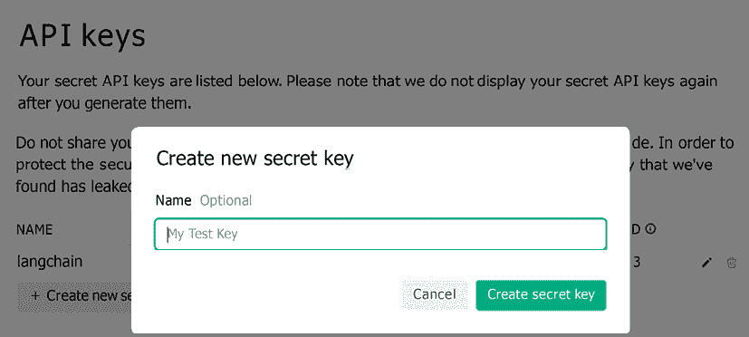

# 附录

本附录作为与 LangChain 集成的 LLM 主要提供商的实用参考指南。随着你使用本书中介绍的技术开发应用程序，你需要连接到各种模型提供商，每个提供商都有自己的身份验证机制、功能和集成模式。

我们将首先介绍主要 LLM 提供商的详细设置说明，包括 OpenAI、Hugging Face、Google 和其他。对于每个提供商，我们将指导创建账户、生成 API 密钥以及配置你的开发环境以使用 LangChain 服务的过程。然后，我们将通过一个实际实现示例来结束，该示例演示了如何处理超出 LLM 上下文窗口的内容——具体来说，使用 LangChain 的 map-reduce 技术总结长视频。这种模式可以适应各种需要处理大量文本、音频转录或其他内容的场景，这些内容无法适应单个 LLM 上下文。

# OpenAI

OpenAI 仍然是最受欢迎的 LLM 提供商之一，提供不同级别的模型，适用于各种任务，包括 GPT-4 和 GPT-o1。LangChain 提供了与 OpenAI API 的无缝集成，支持他们的传统完成模型和聊天模型。这些模型各自有不同的价格，通常是按令牌计费。

要使用 OpenAI 模型，我们首先需要获取一个 OpenAI API 密钥。要创建 API 密钥，请按照以下步骤操作：

1.  你需要在[`platform.openai.com/`](https://platform.openai.com/)创建一个登录。

1.  设置你的账单信息。

1.  你可以在**个人** | **查看 API 密钥**下看到 API 密钥。

1.  点击**创建新的密钥**并给它命名。

这是 OpenAI 平台上的样子：



图 A.1：OpenAI API 平台 – 创建新的密钥

点击**创建密钥**后，你应该会看到消息“API 密钥已生成”。你需要将密钥复制到剪贴板并保存，因为你将需要它。你可以将密钥设置为环境变量（**OPENAI_API_KEY**）或每次构建用于 OpenAI 调用的类时都传递它。

当你初始化模型时，可以指定不同的模型，无论是聊天模型还是 LLM。你可以在[`platform.openai.com/docs/models`](https://platform.openai.com/docs/models)看到模型列表。

OpenAI 提供了一套全面的与 LangChain 无缝集成的功能，包括：

+   通过 OpenAI API 的核心语言模型

+   文本嵌入模型的嵌入类

在本章中，我们将介绍模型集成的基础知识，而关于嵌入、助手和审查等专用功能的深入探索将在第四章和第五章中进行。

# Hugging Face

Hugging Face 在 NLP 领域是一个非常突出的参与者，在开源和托管解决方案方面有相当的影响力。该公司是一家法美公司，开发用于构建机器学习应用的工具。其员工开发和维护 Transformers Python 库，该库用于 NLP 任务，包括 Mistral 7B、BERT 和 GPT-2 等最先进和流行的模型的实现，并且与 PyTorch、TensorFlow 和 JAX 兼容。

除了他们的产品外，Hugging Face 还参与了诸如 BigScience Research Workshop 等倡议，在那里他们发布了一个名为 BLOOM 的开放 LLM，具有 1760 亿个参数。Hugging Face 还与 Graphcore 和 Amazon Web Services 等公司建立了合作伙伴关系，以优化其产品并使其可供更广泛的客户群使用。

LangChain 支持利用 Hugging Face Hub，该 Hub 提供对大量模型、各种语言和格式的数据集以及演示应用的访问。这包括与 Hugging Face 端点的集成，通过文本生成推理服务实现由文本生成推理服务驱动的文本生成推理。用户可以连接到不同的端点类型，包括免费的 Serverless Endpoints API 和针对企业工作负载的专用推理端点，这些端点支持自动扩展。

对于本地使用，LangChain 提供了与 Hugging Face 模型和管道的集成。`ChatHuggingFace`类允许在聊天应用中使用 Hugging Face 模型，而`HuggingFacePipeline`类则通过管道在本地运行 Hugging Face 模型。此外，LangChain 支持从 Hugging Face 加载嵌入模型，包括`HuggingFaceEmbeddings`、`HuggingFaceInstructEmbeddings`和`HuggingFaceBgeEmbeddings`。

`HuggingFaceHubEmbeddings`类允许利用 Hugging Face **文本嵌入推理**（**TEI**）工具包进行高性能提取。LangChain 还提供了一个`HuggingFaceDatasetLoader`，用于从 Hugging Face Hub 加载数据集。

要将 Hugging Face 作为模型提供者，您可以在[`huggingface.co/settings/profile`](https://huggingface.co/settings/profile)创建账户和 API 密钥。此外，您可以将令牌作为`HUGGINGFACEHUB_API_TOKEN`在您的环境中可用。

# Google

Google 提供两个主要平台以访问其 LLM，包括最新的 Gemini 模型：

### 1. Google AI 平台

Google AI 平台为开发者和用户提供了一个简单的设置，并可以访问最新的 Gemini 模型。要通过 Google AI 使用 Gemini 模型：

+   **Google 账户**：一个标准的 Google 账户就足以进行身份验证。

+   **API 密钥**：生成 API 密钥以验证您的请求。

    +   访问此页面以创建您的 API 密钥：[`ai.google.dev/gemini-api/docs/api-key`](https://ai.google.dev/gemini-api/docs/api-key)

    +   获取 API 密钥后，在您的开发环境中设置`GOOGLE_API_KEY`环境变量以验证您的请求（参见 OpenAI 的说明）。

### 2. Google Cloud Vertex AI

对于企业级功能和集成，Google 的 Gemini 模型可通过 Google Cloud 的 Vertex AI 平台获取。要通过 Vertex AI 使用模型：

1.  创建 Google Cloud 账户，需要接受服务条款并设置账单。

1.  安装 gcloud CLI 以与 Google Cloud 服务交互。请遵循[`cloud.google.com/sdk/docs/install`](https://cloud.google.com/sdk/docs/install)上的安装说明。

1.  运行以下命令进行身份验证并获取密钥令牌：

    ```py
    gcloud auth application-default login
    ```

1.  确保 Vertex AI API 已为您 Google Cloud 项目启用。

1.  您可以设置您的 Google Cloud 项目 ID——例如，使用`gcloud`命令：

    ```py
    gcloud config set project my-project
    ```

其他方法包括在初始化 LLM 时传递构造函数参数，使用`aiplatform.init()`，或设置 GCP 环境变量。

您可以在 Vertex 文档中了解更多关于这些选项的信息。

如果您尚未启用相关服务，您应该会收到一个有用的错误消息，该消息会指向正确的网站，您可以在该网站上点击**启用**。您必须根据偏好和可用性启用 Vertex 或生成语言 API。

LangChain 提供了与 Google 服务的集成，例如语言模型推理、嵌入、从不同来源的数据摄取、文档转换和翻译。

主要有两个集成包：

+   `langchain-google-vertexai`

+   `langchain-google-genai`

我们将使用 LangChain 推荐的`langchain-google-genai`包。设置很简单，只需要一个 Google 账户和 API 密钥。对于大型项目，建议迁移到`langchain-google-vertexai`。此集成提供了企业级功能，如客户加密密钥、虚拟私有云集成等，需要具有账单的 Google Cloud 账户。

如果你已遵循上一节中 GitHub 上的说明，你应该已经安装了`langchain-google-genai`包。

# 其他提供商

+   **Replicate**：您可以使用 GitHub 凭据在[`replicate.com/`](https://replicate.com/)进行身份验证。然后点击左上角的用户图标，您将找到 API 令牌——只需复制 API 密钥并将其作为`REPLICATE_API_TOKEN`在您的环境中可用。要运行更大的作业，您需要设置您的信用卡（在账单下）。

+   **Azure**：通过 GitHub 或 Microsoft 凭据进行身份验证，我们可以在[`azure.microsoft.com/`](https://azure.microsoft.com/)上创建 Azure 账户。然后我们可以在**认知服务** | **Azure OpenAI**下创建新的 API 密钥。

+   **Anthropic**：您需要设置`ANTHROPIC_API_KEY`环境变量。请确保您已在 Anthropic 控制台[`console.anthropic.com/`](https://console.anthropic.com/)上设置了计费并添加了资金。

# 总结长视频

在第三章中，我们展示了如何使用 map-reduce 方法总结长视频（不适合上下文窗口）。我们使用 LangGraph 设计了这样的工作流程。当然，您可以使用相同的方法处理任何类似的情况——例如，总结长文本或从长音频中提取信息。现在让我们只使用 LangChain 来完成同样的工作，因为这将是一个有用的练习，将帮助我们更好地理解框架的一些内部机制。

首先，`PromptTemplate`不支持媒体类型（截至 2025 年 2 月），因此我们需要手动将输入转换为消息列表。为了使用参数化链，作为一个解决方案，我们将创建一个 Python 函数，该函数接受参数（总是以名称提供）并创建要处理的消息列表。每个消息都指示 LLM 摘要视频的某个部分（通过将其分割为偏移间隔），这些消息可以并行处理。输出将是一个字符串列表，每个字符串都摘要了原始视频的子部分。

当您在 Python 函数声明中使用额外的星号（***）时，这意味着星号之后的参数应该只按名称提供。例如，让我们创建一个具有许多参数的简单函数，我们可以在 Python 中以不同的方式调用它，只需通过名称传递少量（或没有）参数：

```py
def test(a: int, b: int = 2, c: int = 3):
 print(f"a={a}, b={b}, c={c}")
 pass
test(1, 2, 3)
test(1, 2, c=3)
test(1, b=2, c=3)
test(1, c=3)
```

但如果您更改其签名，第一次调用将引发错误：

```py
def test(a: int, b: int = 2, *, c: int = 3):
 print(f"a={a}, b={b}, c={c}")
 pass
# this doesn't work any more: test(1, 2, 3)
```

如果您查看 LangChain 的源代码，您可能会看到很多这种情况。这就是我们决定更详细地解释它的原因。

现在，回到我们的代码。如果我们想将`video_uri`作为输入参数传递，我们仍然需要运行两个独立的步骤。当然，我们可以将这些步骤封装为一个 Python 函数，但作为替代方案，我们将所有内容合并为一个单一链：

```py
from langchain_core.runnables import RunnableLambda
create_inputs_chain = RunnableLambda(lambda x: _create_input_
messages(**x))
map_step_chain = create_inputs_chain | RunnableLambda(lambda x: map_chain.
batch(x, config={"max_concurrency": 3}))
summaries = map_step_chain.invoke({"video_uri": video_uri})
```

现在让我们将所有提供的摘要合并成一个单独的提示，并让一个 LLM 准备最终的摘要：

```py
def _merge_summaries(summaries: list[str], interval_secs: int = 600, **kwargs) -> str:
    sub_summaries = []
 for i, summary in enumerate(summaries):
        sub_summary = (
 f"Summary from sec {i*interval_secs} to sec {(i+1)*interval_secs}:"
 f"\n{summary}\n"
        )
        sub_summaries.append(sub_summary)
 return "".join(sub_summaries)
reduce_prompt = PromptTemplate.from_template(
 "You are given a list of summaries that"
 "of a video splitted into sequential pieces.\n"
 "SUMMARIES:\n{summaries}"
 "Based on that, prepare a summary of a whole video."
)
reduce_chain = RunnableLambda(lambda x: _merge_summaries(**x)) | reduce_prompt | llm | StrOutputParser()
final_summary = reduce_chain.invoke({"summaries": summaries})
```

要将所有内容组合在一起，我们需要一个链，它首先执行所有 MAP 步骤，然后是 REDUCE 阶段：

```py
from langchain_core.runnables import RunnablePassthrough
final_chain = (
    RunnablePassthrough.assign(summaries=map_step_chain).assign(final_ summary=reduce_chain)
    | RunnableLambda(lambda x: x["final_summary"])
)
result = final_chain.invoke({
 "video_uri": video_uri,
 "interval_secs": 300,
 "chunks": 9
})
```

让我们回顾一下我们做了什么。我们为视频的不同部分生成了多个摘要，然后将这些摘要作为文本传递给一个 LLM，并要求它生成最终的摘要。我们独立地为每个部分准备了摘要，然后将其合并，这使得我们克服了视频上下文窗口大小的限制，并通过并行化大大降低了延迟。另一种替代方法是所谓的**精炼**方法。我们从空摘要开始，逐步进行摘要，每次都向 LLM 提供一个视频的新片段和之前生成的摘要作为输入。我们鼓励读者自己构建这个功能，因为这将对代码进行相对简单的更改。
