# 第三章：理解自动代码生成技术

在本章中，我们将探讨以下关键主题：

+   什么是提示词？

+   单行提示词用于自动代码生成

+   多行提示词用于自动代码生成

+   思维链提示词用于自动代码生成

+   与代码助手聊天进行自动代码生成

+   自动代码生成的常见构建方法

随着大型语言模型（**LLM**）应用的增长，其中一种有趣的使用案例，基于用户评论的自动代码生成，已经变得流行。在过去的几年里，出现了多个针对开发者的代码助手，例如 GitHub Copilot、Codex、Pythia 和 Amazon Q Developer 等。这些代码助手可以用来获取代码推荐，在许多情况下，只需通过传递一些描述用户对代码要求的简单文本注释，就能从头生成无错误的代码。

许多这些代码助手现在由 LLM 支持。LLM 是在包括公共代码库在内的公共大型数据集上预训练的。这种对大量数据集的训练有助于代码助手生成更准确、相关的代码推荐。为了提高开发者的代码编写体验，这些代码助手不仅可以轻松集成到不同的**集成开发环境**（**IDE**）和代码编辑器中，而且还可以通过大多数云提供商提供的服务轻松获得，配置简单。

总体而言，自动代码生成是一个过程，其中开发者能够使用任何支持的代码编辑器，通过简单的纯文本注释与不同的代码助手进行交互，以实时获取不同支持编程语言的代码推荐。

在本章后面我们将更深入地探讨使用代码助手进行自动代码生成之前，让我们先看看与生成式 AI 相关的提示词的关键概念。

# 什么是提示词？

如前所述，LLM 是在公开可用的大型数据集上预训练的，这使得它们非常强大和多功能。这些 LLM 通常具有数十亿个参数，可以用于解决多种任务，无需额外训练。

用户只需提出相关上下文中的正确问题，就可以从 LLM 中获得最佳输出。作为 LLM 指令的纯文本注释/问题被称为**提示**，而用相应上下文提出正确问题的技术被称为**提示工程**。在与 LLM 交互时，提供精确的信息，并在需要时补充相关上下文，这对于获得最准确的结果非常重要。与代码助手交互也是如此，因为大多数代码助手都集成了 LLM。作为用户，在与代码助手交互时，您应提供简单、具体且相关的上下文提示，这有助于生成高精度的高质量代码。

下面的图示显示了代码助手与 LLM 的集成。

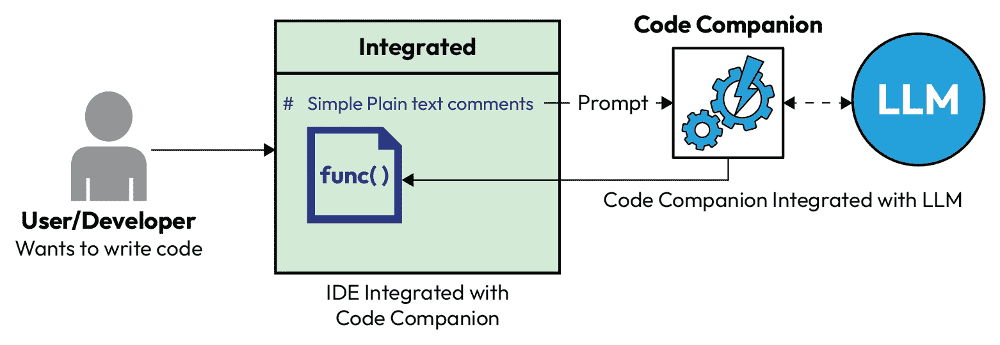

图 3.1 – 代码助手与 LLM 集成的概述

与代码助手交互以获得所需结果有多种方式。在以下章节中，我们将探讨其中的一些技术。为了说明这些技术，我们将利用在 JetBrains 的 PyCharm IDE 中设置的 Python 编程语言，该 IDE 已配置与亚马逊 Q 开发者一起使用（有关设置，请参阅*第二章*）。

注意

亚马逊 Q 开发者使用 LLM 在后台生成代码。LLM 本质上是非确定性的，因此您可能不会得到与代码快照中显示的完全相同的代码块。然而，从逻辑上讲，生成的代码应该满足要求。

# 单行提示符自动生成代码

单行提示符自动生成代码是指用户使用代码助手，在单行纯文本中指定要求，期望以自动化的方式生成相关的代码行。

以下是关于单行提示自动生成代码的一些关键点：

+   在单行提示技术中，用户不需要指定复杂的技术细节，而需要有效地以纯文本形式总结高层次的要求。

+   集成 LLM 的代码助手经过训练，能够理解这些单行提示，并将它们转换为可执行且几乎无错误的代码。

+   根据带有指令、上下文和具体要求的单行提示，代码助手将生成从单行到多行，再到更复杂的函数和类，以满足预期的功能需求。

+   当代码需求相对简单且可以容易地用一句话描述时，单行提示符自动生成代码非常有用。

+   与手动编写相同的代码相比，单行提示符自动生成代码可以显著减少时间。

+   由于自动代码生成的单行提示不需要太多的提示工程经验，它通常被那些几乎没有编码经验的用户使用。在纯文本中，他们可以提供代码应该做什么，而不是如何使用实际代码来实现它。

+   在大多数情况下，由于单行提示中使用了简单的要求，生成的代码可能不需要广泛的审查。

总结 – 自动代码生成的单行提示

总结来说，自动代码生成的单行提示是一种技术，用户使用纯文本格式的自然语言描述相对简单的代码要求；然后代码助手使用 LLM 自动生成单行或多行代码。这使得编码变得更加简单，并且更容易让更多人使用，特别是那些相对较少或没有编码经验或可能对特定编程语言新手的用户。

以下是一个在 PyCharm IDE 中使用 Amazon Q Developer 作为代码助手启用时的单行提示自动代码生成示例，后面是响应：

```py
Prompt:
# generate code to display hello world in python
```

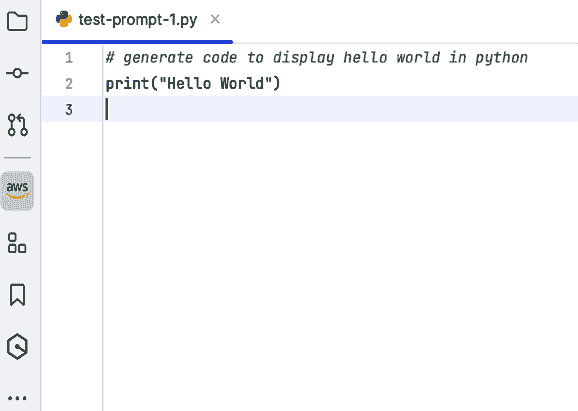

图 3.2 – 使用 PyCharm IDE 和 Amazon Q Developer 开发者工具的单行提示自动代码生成

注意到 Amazon Q Developer 生成了单行代码，因为我们的要求很简单，并且可以很容易地在单行提示中实现。我们将在下一章中查看更复杂的示例。在这一章中，我们只是解释自动代码生成的不同技术。

重要提示

您可能在书的第二部分中的一些提示和截图中发现错别字。我们故意没有纠正它们，以突出显示 Amazon Q Developer 即使在提示中的语法错误的情况下，也能理解所请求内容的潜在含义。

# 自动代码生成的多行提示

自动代码生成的多行提示是指用户可以在单个提示中使用自然语言文本定义要求，这些文本可以跨越多个句子。基于每个句子提供的信息，代码助手然后尝试理解它们之间的相关性，以便掌握要求并生成所需的代码。

代码助手将主要依赖于每个句子的关键短语；然后它将使用这些关键短语在所有句子之间形成关系。这指导代码助手使用 LLM 形成一系列代码行以满足要求。在大多数情况下，代码助手将生成多行代码。

下面是一些关于自动代码生成多行提示的关键点：

+   当代码要求相对复杂、有多个步骤且不能简单地在一句中描述时，多行提示自动代码生成非常有用，因为它可能需要更多的上下文。

+   代码助手使用多行提示中的每个句子来提取关键短语，然后使用 LLM 来理解句子和关键短语之间的关系。这生成了代码片段的解释和相应的相关性，以定义端到端代码需求。

+   由于需求复杂，通过提供多个简单、简洁的句子来提供上下文，通常可以更有效地实现更好的质量和更针对性的代码。这些句子可以提供如功能需求、架构约束和平台规范等详细信息。

+   由多行提示生成的代码更加定制化、详细且相对复杂，与单行提示相比。

+   生成的代码可能需要代码审查和彻底测试，并且根据需求复杂度，在升级到下一个项目生命周期之前可能需要进行一些代码优化。

+   多行提示用于自动代码生成需要很好地掌握提示工程。重要的是要包括关键细节，同时避免过于冗长或含糊不清，并理解生成的代码。因此，这项技术通常由有编码经验的用户使用。

+   代码的准确性高度依赖于用于生成代码的代码助手和 LLM 的成熟度/训练水平。

摘要 – 多行提示用于自动代码生成

总结来说，多行提示用于自动代码生成是一种技术，用户使用多个句子用普通自然语言文本描述相对复杂的代码目标。然后，代码助手可以使用这些句子中的关键短语来形成它们之间的关系，这有助于理解用户需求并将它们转化为多行代码。这需要一定程度的提示工程、代码审查经验，在某些情况下，还需要重写生成的代码。

以下是一个多行提示用于自动代码生成的示例。

我们将为以下需求使用自动生成的代码块：

1.  代码需要生成特定语言版本 – 在这种情况下，Python 3.6.0。

1.  代码需要读取`/user/data/input/sample.csv`文件。

1.  代码需要以特定名称`csv_data.`将数据加载到 pandas DataFrame 中。

1.  代码需要显示包含列标题的 50 行样本。

我们将提示写成如下：

```py
"""
Generate code in python 3.6.0 version.
Read CSV file from /user/data/input/sample.csv in a pandas dataframe named csv_data.
Use csv_data dataframe to display sample 50 records with corresponding column details.
"""
```

我们得到以下输出：

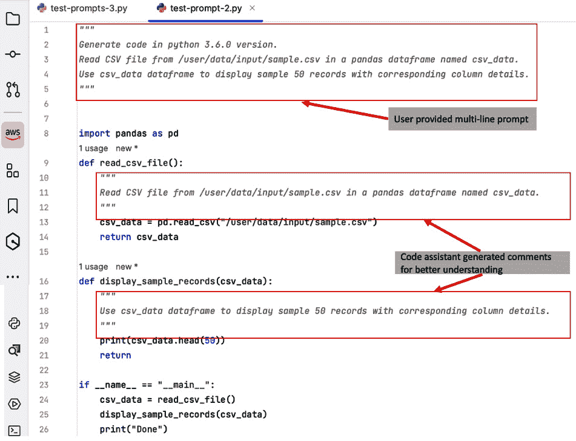

图 3.3 – 在 PyCharm IDE 中使用 Amazon Q Developer 的多行提示进行自动代码生成

注意到 Amazon Q Developer 在 PyCharm IDE 中使用了多行提示生成了多行代码，其中包含两个函数 – `read_csv_file()`用于读取 CSV 文件和`display_sample_records()`用于显示 50 条记录。然后，它创建了`__main__`来调用这两个函数以生成端到端脚本。

总体而言，前面的代码确实满足要求，但根据用户/企业偏好，可能需要一些修改和/或调整。在下一节中，我们将了解另一种适合经验丰富开发者的技术。当开发者熟悉代码流程并需要生成代码的帮助时，这项技术尤其有益。

# 思路链提示用于自动代码生成

自动代码生成的思路链提示是指用户使用单行或多行提示的组合来提供逐步指令的技术。代码助手随后使用 LLM 为每个步骤自动生成代码。用户可以使用多个自然语言提示，这些提示可以链接在一起来解决复杂需求。这些提示可以串联起来，引导模型生成相关的针对性代码。这是一种有效的技术，通过向代码助手逐个提供简单提示，将复杂的编码任务分解成更小的代码片段。代码助手可以使用每个提示生成更定制的代码片段。最终，所有代码片段都可以作为构建块来解决复杂需求。

下面是关于自动代码生成思路链提示的一些关键点：

+   思路链提示是一种技术，其中用户将复杂需求分解成更小、更易于管理的单行或多行提示。

+   思路链提示对于代码定制也很有用。用户可以通过在提示中提供特定信息，如生成具有相关变量名、特定函数名、逐步逻辑流程等的代码，有效地使用这项技术来获取定制代码。

+   代码助手利用 LLM（大型语言模型）的进步来生成满足每个单独提示的代码片段，这些片段作为最终端到端代码的一部分。

+   思路链提示可用于生成各种任务的代码，例如创建新项目、实现特定功能、定制代码以满足定制标准、提高灵活性、代码准确性以及代码组织。

+   生成的代码可能需要代码审查和集成测试，以验证所有单独的代码片段组合是否满足端到端需求。根据测试用例的结果，用户可能需要在晋升到下一个项目生命周期之前重新调整提示或重写一些代码块。

+   这种技术可以由经验更丰富的用户使用，因为他们主要负责追踪代码生成流程以实现最终目标。

+   整体代码的准确性高度依赖于用户提供的提示，因此用户需要具备一些提示工程背景，以生成准确的端到端代码。

摘要 – 思路链提示用于自动代码生成

总结来说，用于自动代码生成的思维链提示是一种技术，用户可以用更小、更简单、更易于管理的单行或多行纯自然语言文本提示来描述复杂的代码要求。代码助手使用每个提示根据提示中提供的信息生成特定的代码。最终，所有这些单个提示的输出组合生成最终的代码。这种技术在创建高度定制的代码方面非常有效。用户需要执行集成测试以验证代码是否满足端到端功能；根据测试用例的结果，用户可能需要调整提示和/或重写最终代码的一些代码片段。

下面是自动代码生成思维链提示的示例。

我们将使用自动生成的代码块和多个提示来完成以下要求：

1.  使用 Python 编程语言。

1.  代码必须检查 `/user/data/input/sample.csv` 文件是否存在。

1.  创建一个名为 `read_csv_file()` 的函数来读取 CSV 文件。同时，尝试使用 pandas 的特定 `read_csv` 来读取记录。

1.  使用 `read_csv_file()` 函数读取 `/user/data/input/sample.csv` 文件。

1.  显示文件中的 50 条记录的样本，包括相应的列详细信息。

让我们将前面的要求分解为三个单独的提示。

注意，为了简化，在这个例子中，我们将使用单行提示进行自动代码生成，但根据您的要求的复杂性，您可以组合单行和多行提示来实现思维链提示。代码助手根据提示生成多行代码，并附带相应的内联注释。这简化了用户对代码的理解。

下面是第一个提示和相应的输出：

```py
Prompt 1 :
# Generate code to Check if /user/data/input/sample.csv exists
```

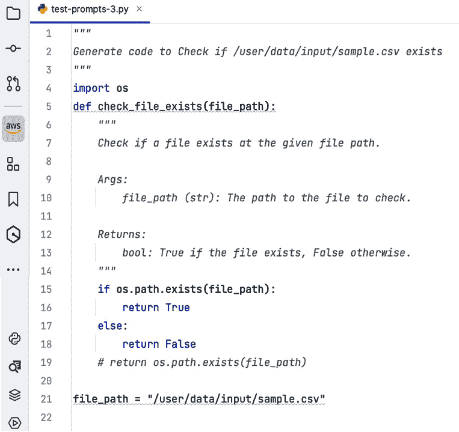

图 3.4 – 提示 1：在 PyCharm IDE 中使用 Amazon Q 开发者进行带有思维链提示的自动代码生成

注意到 Amazon Q 开发者编写了多行代码，其中包括一个名为 `check_file_exists()` 的函数，该函数有一个参数 `file_path`，用于获取文件路径，检查文件是否存在并返回 `True`/`False`。它还添加了下一个 `file_path` 变量，并赋予其 `/user/data/input/sample.csv` 路径的值。

下面是第二个提示和相应的输出：

```py
Prompt 2 :
# generate function read_csv_file() and read /user/data/input/sample.csv using pandas read_csv() method.
```

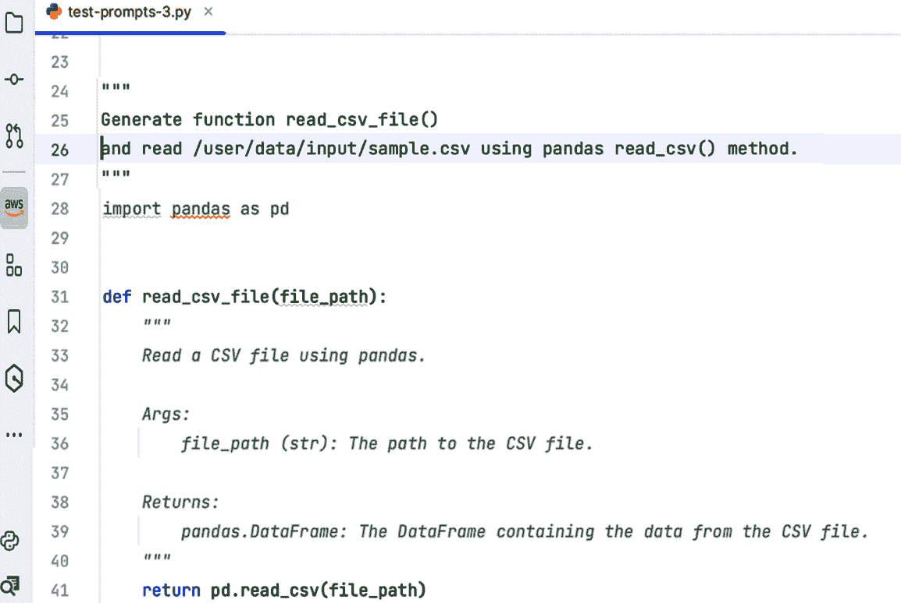

图 3.5 – 提示 2：在 PyCharm IDE 中使用 Amazon Q 开发者进行带有思维链提示的自动代码生成

在这里，也观察 Amazon Q Developer 创建了多行代码。按照指示，它创建了一个名为 `read_csv_file_file_exists()` 的函数，该函数有一个参数用于获取 `file_path`，并使用 `read_csv` 方法读取文件。

这里是第三个提示及其输出：

```py
Prompt 3 :
# Display sample 50 records with corresponding column details.
```

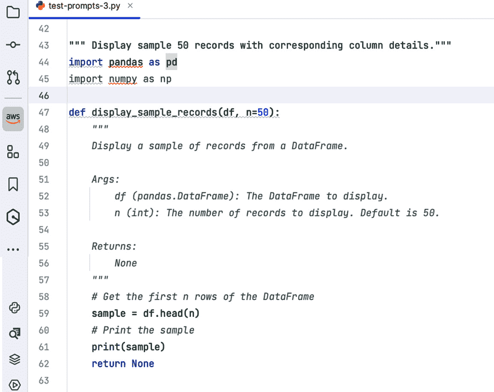

图 3.6 – 提示 3：在 PyCharm IDE 中使用 Amazon Q Developer 的思维链提示进行自动代码生成

最后，在这里，观察 Amazon Q Developer 如何使用 `display_sample_records()` 函数创建多行代码以显示 50 个样本记录。

让我们继续介绍自动代码生成的下一个技术。

# 与代码助手聊天进行自动代码生成

许多代码助手允许用户使用聊天式交互技术来获取代码推荐和自动生成无错误的代码。一些代码助手示例包括但不限于 Amazon Q Developer、ChatGPT 和 Copilot。就像向队友提问以获取推荐一样，用户可以与代码助手互动，提出问题并获得与问题相关的推荐/建议。此外，许多代码助手还会提供有关答案的逐步说明，并提供一些参考链接以获取更多上下文。用户可以查看详细信息，并可选择将代码集成到主程序中，或更新现有代码。

关于与代码助手聊天进行自动代码生成的一些关键点如下：

+   与代码助手聊天可以帮助用户实时进行问答式互动。

+   与代码助手聊天允许用户通过直接提问和用自然语言表达他们的需求来接收建议和推荐。

+   这种技术可以被任何经验水平的用户用来获取信息和建议，但理解并审查推荐代码需要一些经验。它可以用来获取各种复杂代码问题的响应，学习新技术，生成详细设计，检索整体架构细节，发现编码最佳实践和代码文档，执行调试任务，以及为生成的代码提供未来支持。

+   在编码过程中，类似于其他提示技术，它允许用户通过描述更小、更易于管理的逐步问题来生成代码，以描述复杂的需求。此外，代码助手跟踪问题和相应的答案，通过推荐最相关的选项来改善未来问题的回答。

+   在大多数情况下，用户负责审查和测试，以验证推荐的代码确实满足整体需求并集成到整体代码库中。

+   为了帮助用户理解代码，代码助手还提供了与答案相关的详细流程以及获取更多上下文的参考链接。

+   许多高级代码助手，如 Amazon Q Developer，也会从当前在 IDE 中打开的文件中收集上下文。它们自动检索有关所使用的编程语言和文件位置的信息，以提供更相关的答案。这有助于代码助手处理与更新现有代码、软件支持、软件开发、最佳实践等相关的问题。

+   代码的整体准确性高度依赖于用户提出相关且准确的问题的能力，并包含具体细节。

摘要 – 使用代码助手进行自动代码生成聊天

总结来说，任何经验水平的用户都可以利用与代码助手的聊天进行自动代码生成。这项技术涉及在实时中以问答方式与代码助手互动，以接收各种用例的建议和/或推荐，包括复杂代码、详细设计、整体架构、编码最佳实践、代码文档、未来支持、代码更新以及理解代码等。在大多数情况下，用户负责在编码阶段审查并将建议的代码集成到主代码库中。为了协助用户，代码助手可以提供与答案相关的流程细节以及获取更多上下文的参考链接。

以下是与代码助手进行自动代码生成聊天的通用示例。

需求是获取 Amazon Q Developer 的通用帮助，以了解如何调试 Python 函数的问题，特别是对于 `read_csv_file()` 函数：

```py
Q : How do I debug issues with my read_csv_file()python function?
```

我们得到以下结果：

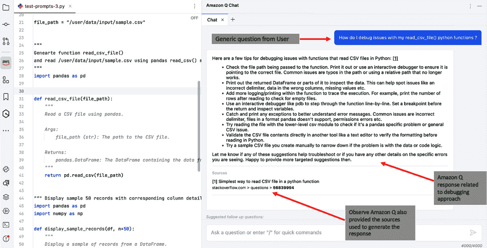

图 3.7 – 使用 Amazon Q Developer 与代码助手进行聊天以实现自动代码生成

下面是有关我们问题的逐步详细响应：

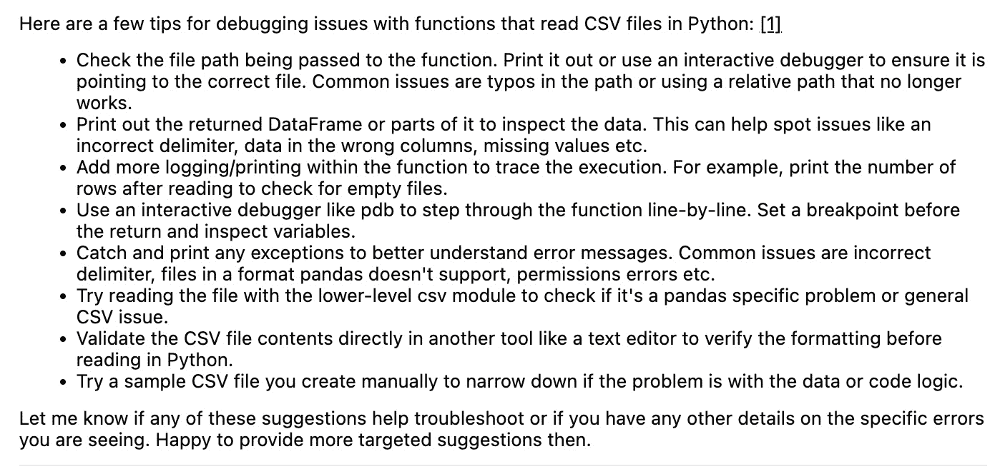

图 3.8 – 使用 Amazon Q Developer 与代码助手进行聊天以实现自动代码生成 – Amazon Q Developer 的响应

在响应的底部，注意 Amazon Q Developer 还提供了用于提供详细信息的来源：


图 3.9 – 使用 Amazon Q Developer 与代码助手进行聊天以实现自动代码生成 – Amazon Q Developer 的来源

为了使用户更方便，如果您只需将鼠标悬停在来源上，Amazon Q Developer 就会在同一窗口中显示来源的确切详细信息：

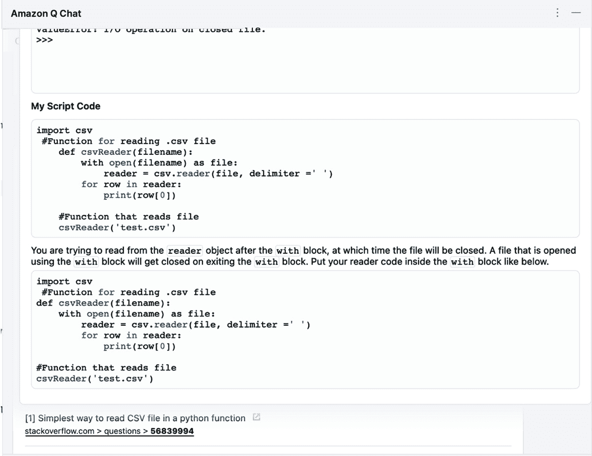

图 3.10 – 与代码助手聊天以实现自动代码生成 – 亚马逊 Q 开发者源细节

现在，让我们深入探讨自动代码生成的不同构建方法。

# 自动代码生成的常见构建方法

如前几节所述，不同经验水平的用户可以利用代码助手生成满足功能需求的代码。在本节中，我们将介绍一些有用的常见构建方法，这些方法取决于需求复杂度。我们将使用亚马逊 Q 开发者与 JetBrains 的 PyCharm IDE 的集成来展示代码助手如何帮助用户自动化生成代码片段和/或从系统中获取建议。

现在，让我们开始介绍在自动代码生成技术中使用的每种代码构建方法。

## 单行代码补全

利用 LLM 的代码助手可以跟踪用户提供的所有输入提示。在运行时，代码助手使用所有输入信息来建议相关的代码。这里是一个简单的演示，说明亚马逊 Q 开发者如何帮助用户实现单行代码补全。

当用户在亚马逊 Q 开发者启用的环境中开始编写代码时，它可以理解当前和之前输入的上下文。它将开始建议下一个代码块以完成现有行，或者推荐当前行之后可能跟随的下一行。以下截图突出了这种方法：

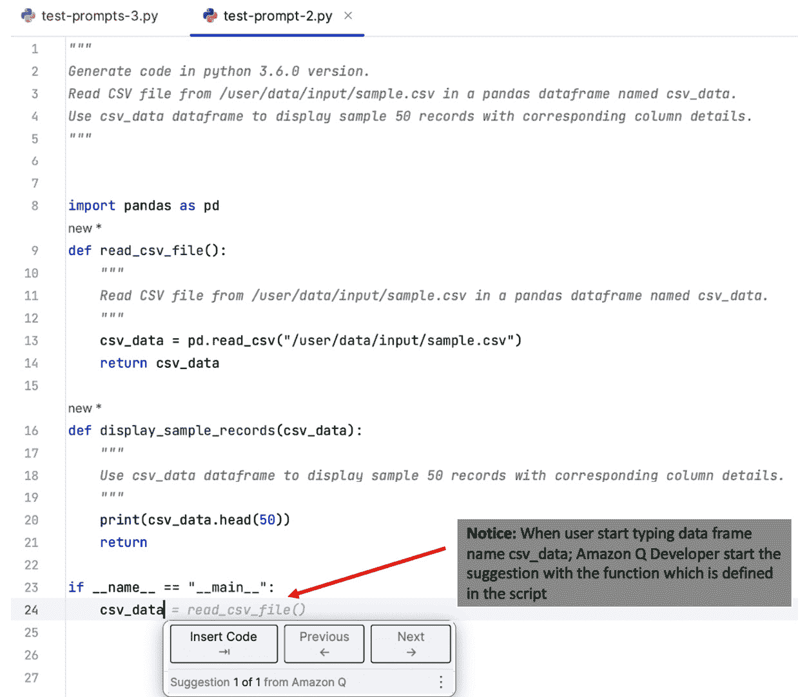

图 3.11 – 使用亚马逊 Q 开发者实现 PyCharm IDE 中的单行代码补全

注意，当用户开始输入 DataFrame 名称`csv_data`时，亚马逊 Q 开发者建议使用在脚本中定义的`read_csv_file()`函数。

## 完整功能生成

编程的基本构建块之一是函数。通常，函数是在程序中定义的、可重用的多行代码块，用于执行特定任务。除非被调用，否则函数不会运行。函数可以接受参数或参数，在脚本中调用时可以传递。可选地，函数可以返回数据给调用语句。代码助手可以帮助用户编写整个函数体。用户只需提供他们从函数中需要的功能信息，以及可选的编程语言，使用任何之前的自动代码生成技术即可。

现在，让我们看看用户如何自动生成一个函数的例子。

以下是一个简单的演示，说明亚马逊 Q 开发者如何帮助用户生成一个完整的功能：

1.  用户需要编写一个名为`read_csv()`的简单 Python 函数，该函数以`file_path`为参数，并返回 50 条记录的样本

1.  调用`read_csv()`函数从`/user/data/input/sample.csv`路径读取 CSV 文件

我们将使用思维链提示技术来生成前面的代码。以下是第一个提示及其输出：

```py
Prompt 1 :
"""
write a python function named read_csv() which takes file_path as a parameters and returns sample 50 records.
"""
```

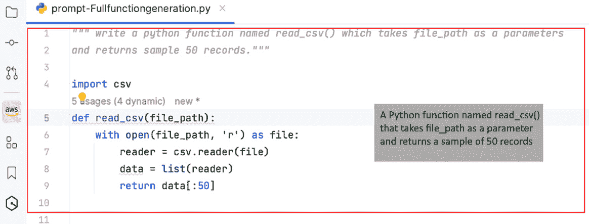

图 3.12 – 在 PyCharm IDE 中使用 Amazon Q Developer 生成函数 – 生成函数

仔细观察，正如单行提示中所述，Amazon Q Developer 创建了一个名为 `read_csv()` 的 Python 函数，该函数接受 `file_path` 作为参数，并返回 50 条记录的样本。

现在，让我们看看如何自动生成函数语句逻辑，然后是输出：

```py
Prompt 2 :
"""
call read_csv by passing file path as /user/data/input/sample.csv
"""
```

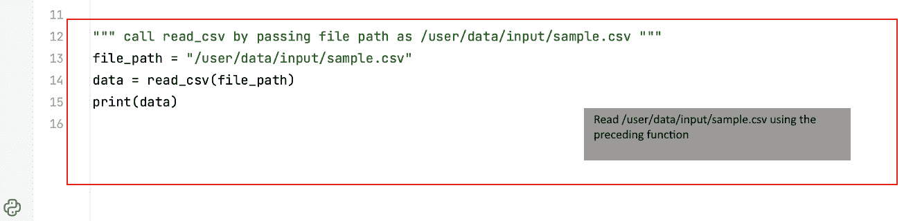

图 3.13 – 在 PyCharm IDE 中使用 Amazon Q Developer 完成完整函数生成 – 调用函数

仔细观察，正如 Amazon Q Developer 指示的那样，为 `read_csv()` 函数生成了调用逻辑，用于从 `/``user/data/input/sample.csv` 文件中读取数据。

## 块完成

在程序的逻辑流程中，用户需要根据条件运行某些代码块，或者需要在循环中运行某些行。实现这些功能最常用的代码块是 `if` 条件、`for` 循环、`while` 条件和 `try` 块。代码助手被训练来完成并建议编写这些条件和循环语句的代码。

现在，让我们看看 Amazon Q Developer 如何帮助用户在 *完整函数生成* 示例中（参考 *图 3**.13*）建议可能的 `if` 条件。由于 Amazon Q Developer 理解代码的上下文，它能够理解与 `read_csv()` 函数相关的功能。因此，在 `read_csv()` 函数内开始输入 `if` 以显示我们编写条件块的意图：

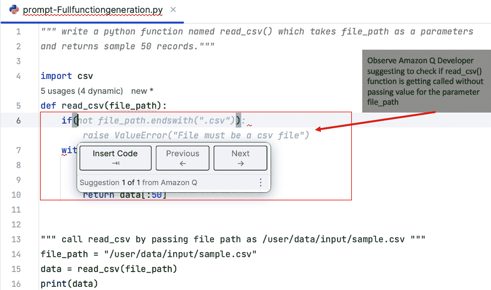

图 3.14 – 在 IDE 中使用 Amazon Q Developer 完成块

注意，一旦用户开始输入 `if`，Amazon Q Developer 就理解 `file_path` 是 `read_csv()` 函数的强制参数，并期望有一个 `.csv` 文件；基于这种理解，它建议添加一个错误处理条件来检查传递的参数是否具有 `.``csv` 文件扩展名。

## 行内推荐

通常，用户需求可能很复杂，用户可能无法通过组合多个提示来定义所有需求。在某些情况下，代码助手可能无法一次性生成用户期望的脚本。此外，如果用户决定更新现有代码，那么 Amazon Q Developer 提供逐行推荐。Amazon Q Developer 尝试理解脚本的上下文并预测可能逻辑上有用的相关下一行。

现在，让我们使用上一节“块完成”中的脚本（参考图 3.14）来检查亚马逊 Q 开发者是否可以推荐下一行代码。为了说明功能，让我们删除最后一行`print(data)`。然后，转到脚本的最后一行并按*Enter*；现在，亚马逊 Q 开发者将尝试预测脚本的下一个逻辑功能：

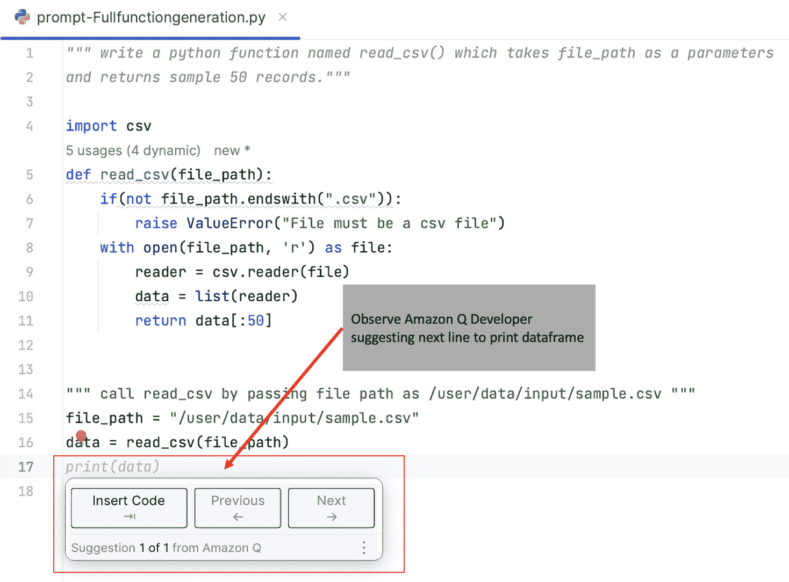

图 3.15 – 使用亚马逊 Q 开发者 IDE 中的逐行推荐

注意到，在这个脚本中，亚马逊 Q 开发者建议打印 DataFrame 语句，`print(data)`，这在我们从名为`data`的 DataFrame 中读取`sample.csv`文件时是有逻辑意义的。

## 参考现有代码

常见的最佳编码实践之一是使用同一代码库中不同文件中的现有函数。许多开发者喜欢创建可重用函数并将它们保存在一个公共文件中，以便在其他脚本中引用。代码助手理解库中现有的脚本和函数。这使得他们能够帮助用户推荐引用现有文件中函数的新代码。用户可以编写简单的单行提示，建议代码助手生成引用特定程序文件中现有函数的代码。

例如，亚马逊 Q 开发者有一些功能可以在生成新代码时交叉引用现有代码。假设用户已经将函数保存在`prompt-Fullfunctiongeneration.py`文件中（参考图 3.14）并想在新的脚本中使用现有的`read_csv`函数。以下是提示和输出：

```py
Prompt:
# read test.csv file using read_csv function from prompt-Fullfunctiongeneration.py file
```

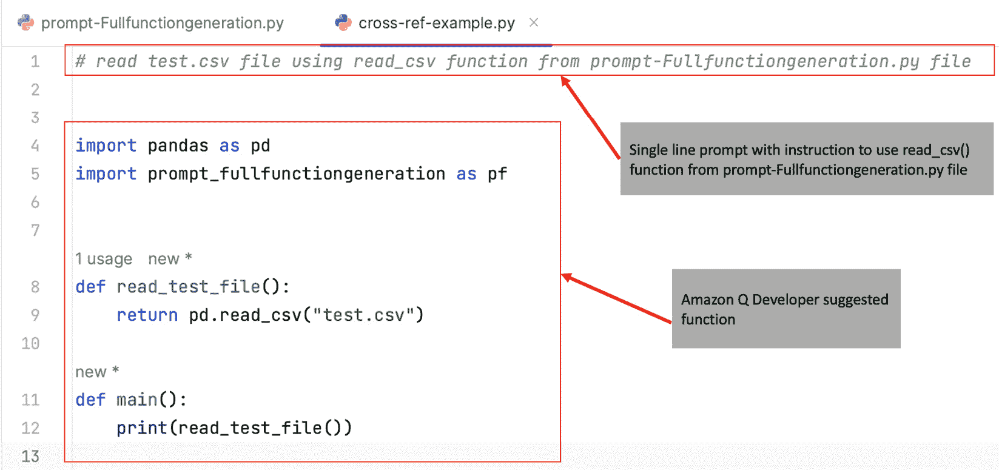

图 3.16 – 使用亚马逊 Q 开发者 IDE 中的现有代码交叉引用

注意到亚马逊 Q 开发者导入了`prompt_fullfunctiongeneration`中的所有功能，然后使用了`read_csv()`函数并生成代码来读取`test.csv`文件。

## 生成样本数据

在开发过程中，开发者通常需要样本数据，这些数据可能或可能不是现成的。代码助手可以帮助用户以不同的方式生成样本数据。我们将探讨亚马逊 Q 开发者帮助用户生成样本数据的几种方法。

假设用户已经有一些示例数据，并希望创建额外的记录以增加数据量。就像许多其他代码助手一样，Amazon Q Developer 理解现有示例数据的结构和格式，以生成下一个示例记录。在下面的示例示例中，用户有一个包含 `sr_nbr`、`name`、`age` 和 `city` 作为属性的 JSON 格式记录。一旦用户在第一个记录的末尾按下 *Enter* 键，Amazon Q Developer 将开始生成示例记录。以下截图突出了这一功能：

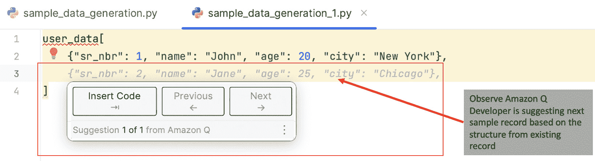

图 3.17 – 在 PyCharm IDE 中使用 Amazon Q Developer 生成示例数据

注意到 Amazon Q Developer 是根据现有记录的结构建议下一个示例记录，`{"sr_nbr": 2, "name": "Jane", "age": 25, "city": "Chicago"}`。

让我们考虑另一个示例，并假设用户没有示例数据集，但知道样本数据中需要的属性。用户需要创建固定数量的样本记录。在这种情况下，用户可以使用提示来生成样本数据。在下面的示例示例中，用户输入了一个提示来生成 50 条具有 `sr_nbr`、`name`、`age` 和 `city` 作为所需属性的 JSON 格式记录。使用此提示，Amazon Q Developer 建议了一个随机数据生成函数。

下面是提示和输出：

```py
Prompt:
"""
Generate 50 records for user_data json with sr_nbr, name, age, and city
"""
```

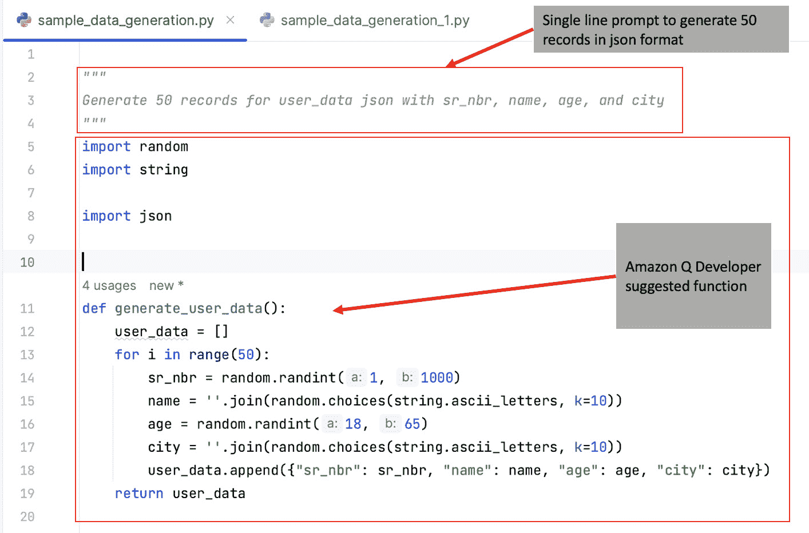

图 3.18 – 在 PyCharm IDE 中使用 Amazon Q Developer 生成示例数据 – 函数逻辑

注意到根据提示中的要求，Amazon Q Developer 生成了 `generate_user_data()` 函数，范围是 `50`，以生成具有 `sr_nbr`、`name`、`age` 和 `city` 属性的 JSON 文件格式的示例数据。

此外，如果您在函数末尾按下 *Enter* 键，您将观察到 Amazon Q Developer 将使用逐行建议来建议端到端代码，并将数据保存到 `user_data.json` 文件中。以下截图突出了这一功能：

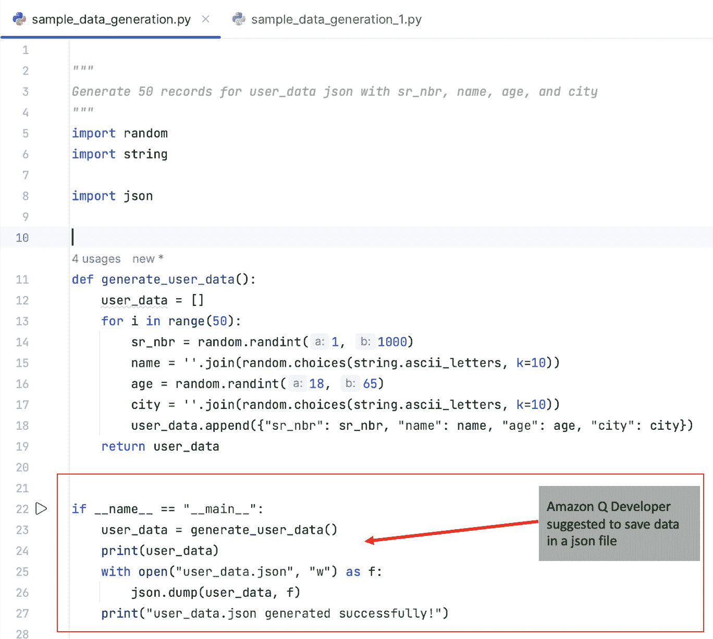

图 3.19 – 在 IDE 中使用 Amazon Q Developer 生成示例数据 – 脚本

## 编写单元测试

测试脚本是编码过程中的一个必要部分。测试代码需要在不同的阶段进行，例如在编码过程中或接近编码结束时进行单元测试，跨多个脚本的集成测试等等。让我们探讨代码助手提供的选项，以支持单元测试的创建。正如之前讨论的，代码助手可以理解脚本的上下文。这有助于开发者在创建单元测试时引用现有的程序文件。

假设用户想要为之前生成的代码创建单元测试以生成样本数据（参考 *图 3**.18*）。用户可以使用简单的单行提示来创建单元测试。Amazon Q Developer 可以分析函数文件中的代码并生成基本的单元测试用例。以下提示和输出展示了这一功能：

```py
Prompt:
"""
Create unit tests for the generate_user_data() function from sample_data_generation.py file
"""
```

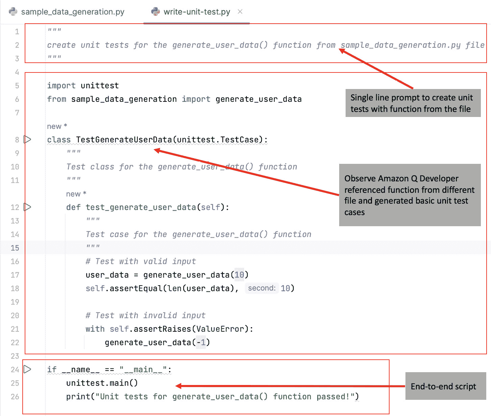

图 3.20 – 在 PyCharm IDE 中使用 Amazon Q Developer 编写单元测试

注意到 Amazon Q Developer 使用输入提示来引用 `sample_data_generation.py` 文件中的 `generate_user_data()` 函数，并根据功能生成了基本的单元测试用例。此外，它还创建了一个完整的端到端脚本，可以用来运行单元测试用例。

## 解释和记录代码

在项目的生命周期中，许多开发者对同一脚本进行工作以添加代码或更新现有代码。缺乏文档会使每个人都难以理解脚本中的端到端逻辑。为了帮助开发者理解现有代码，许多代码助手都有不同的机制来以自然语言和纯文本格式生成代码的解释。用户可以使用这些选项的结果来创建文档或将详细信息嵌入到脚本的注释部分。

Amazon Q Developer 可以帮助用户根据现有脚本生成文档。一旦脚本在 IDE 中打开，只需在 Q 的聊天会话中输入 `Explain` 命令。Amazon Q Developer 将分析整个脚本，并返回自然语言文本，解释脚本的功能。例如，让我们使用之前创建的脚本 `prompt-Fullfunctiongeneration.py`（参考 *图 3**.14*），并让 Amazon Q Developer 解释代码。

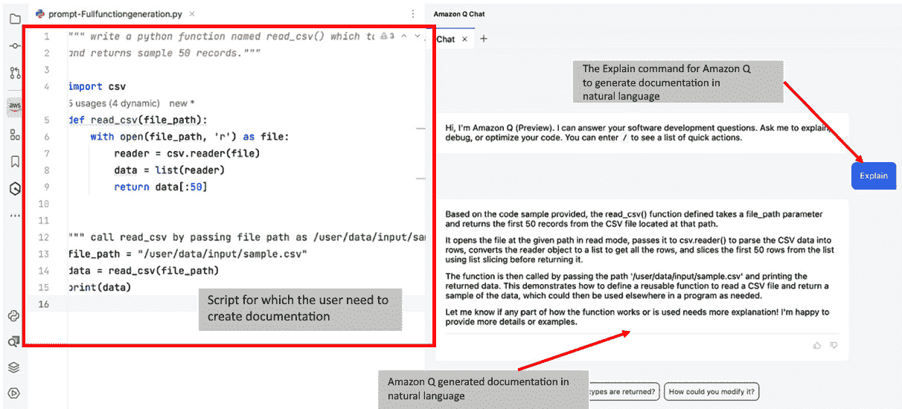

图 3.21 – 使用 Amazon Q Developer 接口在 PyCharm IDE 中记录代码

注意到用户不需要指定脚本名称，因为当您输入 `Explain` 命令时，Amazon Q Developer 可以自动使用编辑器中打开的脚本。以下截图突出了 Amazon Q Developer 提供的代码解释：

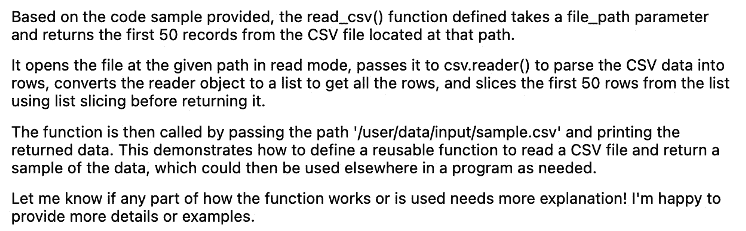

图 3.22 – 使用 Amazon Q Developer 在 IDE 中记录代码 – 文档

注意到，Amazon Q Developer 生成了自然语言的文档。它能够提供`read_csv()`函数的确切功能；然后，它解释说脚本使用了该函数来读取`/user/data/input/sample.csv`文件。这样，任何代码都可以轻松地被文档化，无需手动理解代码并输入整个解释，从而节省时间并提高生产力。

## 更新现有代码

与前面的例子类似，开发者通常会继承先前开发的代码。用户需要根据新可用的库和已知问题以及提高编码标准来更新代码。

通常，更新现有代码可以分为以下三个类别：

+   **重构**：用户需要更新现有代码以简化它，使其易于理解，并/或添加额外的异常来处理错误等

+   **修复**：用户需要更新现有代码以修复可能已知或未知的错误

+   **优化**：用户需要更新现有代码以提高执行效率和性能调优

为了帮助开发者完成上述任务，许多代码助手提供了选项。用户可以使用这些选项的结果来更新现有代码并提高编码标准。

让我们看看 Amazon Q Developer 如何帮助用户更新现有代码。类似于前面章节中讨论的`解释`命令，Amazon Q Developer 有`重构`、`修复`和`优化`命令。一旦脚本在 IDE 中打开，只需输入这些命令中的任何一个，就可以从 Amazon Q Developer 获得建议。根据代码质量，Amazon Q Developer 可以提供多个不同的建议，并直接提供一个选项将片段插入到现有脚本中。

如以下屏幕截图所示，让我们使用之前创建的脚本`prompt-Fullfunctiongeneration.py`（参考*图 3.15*），并让 Amazon Q Developer 重构代码：

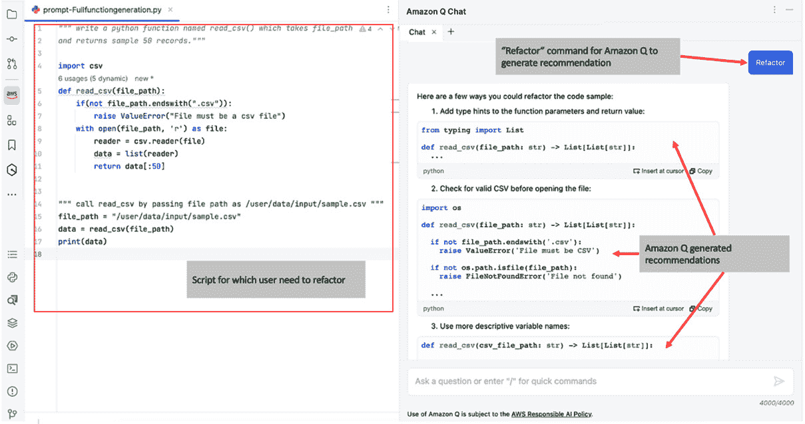

图 3.23 – 使用 Amazon Q Developer 界面在 PyCharm IDE 中更新现有代码：重构

注意到，当你在编辑器中输入`重构`指令时，Amazon Q Developer 可以自动使用打开的脚本，并建议在重构时考虑的多个建议。让我们在下一节中看看其中的一些。

在下面的屏幕截图中，Amazon Q Developer 建议向`file_path`函数参数添加提示，并将参数作为列表返回以提高整体可读性：

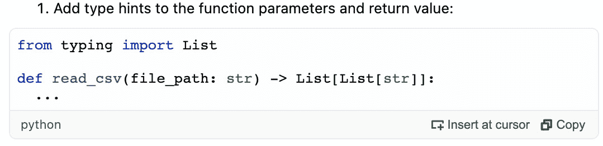

图 3.24 – 使用 Amazon Q Developer 界面在 PyCharm IDE 中更新现有代码：重构 2

如以下屏幕截图所示，Amazon Q Developer 建议为 `file_path` 参数添加额外的异常处理，以检查文件是否为 CSV 类型以及文件是否存在：

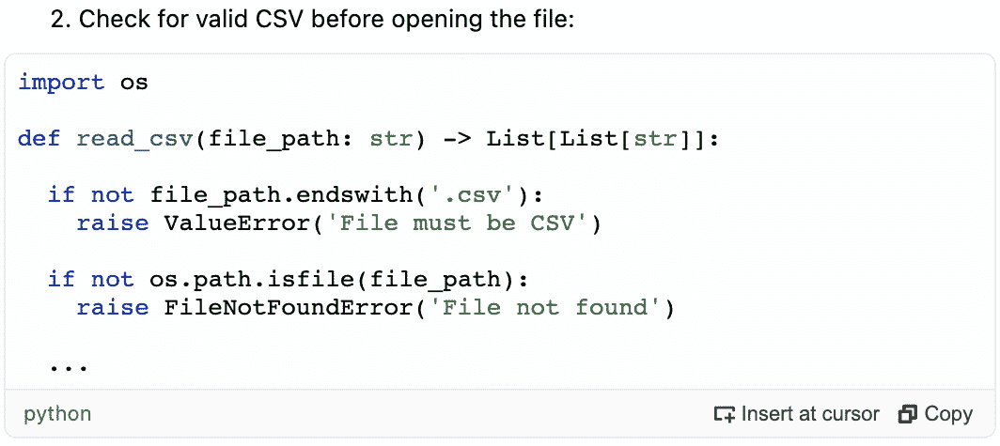

图 3.25 – 使用 Amazon Q Developer 接口在 PyCharm IDE 中更新现有代码：重构 3

我们将在 *第十二章* 中探索其他选项并深入探讨示例。

## 功能开发

代码助手可以通过用自然语言描述功能并指定关键词来帮助开发者开发功能。作为用户，您只需提供与功能功能相关的关键词/短语，代码助手就可以生成端到端的代码。

让我们看看 Amazon Q Developer 如何帮助用户开发功能。Amazon Q Developer 利用当前项目的上下文生成一个全面的实施计划，并指定必要的代码更改。要开始功能开发，用户只需在项目内打开一个文件并在 `/dev` 中输入 `/dev`。

例如，让我们让 Amazon Q Developer 实现二分查找功能。这在上面的屏幕截图中得到了突出显示：

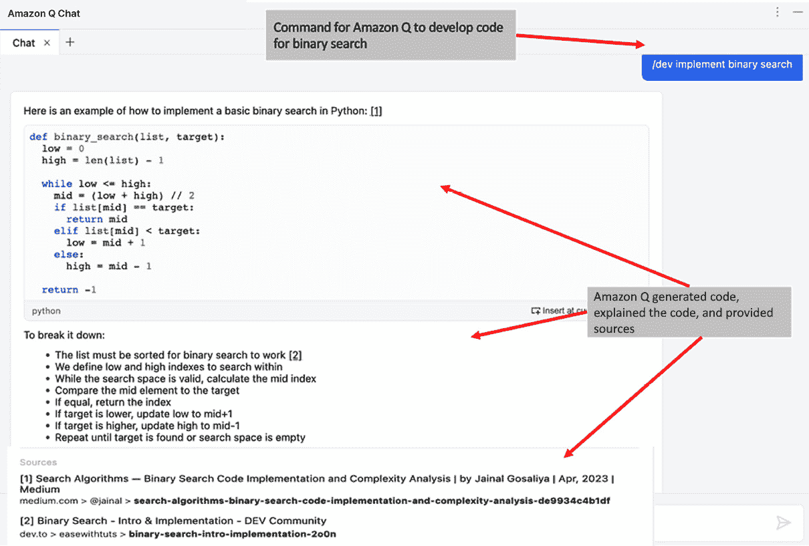

图 3.26 – 使用 Amazon Q Developer 接口在 PyCharm IDE 中进行功能开发

注意，根据命令，Amazon Q Developer 为二分查找功能生成了代码，提供了代码流/算法的详细信息，并引用了源代码以生成功能。

我们将在 *第十二章* 中深入探讨详细示例。

## 代码转换

在升级版本时，根据所使用的编程语言，用户可能需要在他们的代码中进行各种调整以确保与最新版本兼容。代码助手为开发者提供升级代码的帮助，帮助他们从旧版本过渡到最新版本。

例如，Amazon Q Developer 具有升级代码语言版本的能力。用户只需打开现有的旧版本代码，并在文件中使用 `/transform` 命令直接升级代码版本。

我们将在 *第十二章* 中通过示例深入探讨更多细节。

# 摘要

在本章中，我们介绍了代码助手与大型语言模型（LLM）的集成，以帮助用户进行自动代码生成。然后，我们探讨了三种常用的自动代码生成提示技术：单行提示、多行提示和思维链提示。我们为每种自动代码生成提示技术介绍了其潜在的应用场景、局限性以及所需的编程经验。示例代码示例使用了启用 Amazon Q Developer 的 JetBrains PyCharm IDE。此外，我们还介绍了自动代码生成过程中的“与代码助手聊天”技术，用户可以通过简单的问答式会话与代码助手互动。Amazon Q Developer 被用于获取编码/调试的一般性建议。

我们随后讨论了一些常见的代码生成构建方法，例如单行代码补全、完整功能生成、块补全、逐行推荐、生成示例数据、编写单元测试、解释和记录代码、更新现有代码、功能开发和代码转换。此外，我们还使用 Amazon Q Developer 在 JetBrains PyCharm IDE 中探索了这些功能，以支持最常见的代码构建方法。

接下来，我们将开始本书的**第二部分**。在这一部分，**第四章**至**第九章**将指导您了解 Amazon Q Developer 如何通过为许多支持的编程语言自动生成代码来提高开发者的生产力。根据您的专业或偏好，您可以自由地直接跳转到您最感兴趣的章节。

在下一章中，我们将深入探讨如何在 IDE 环境中利用这些技术和构建方法，特别是针对 Python 和 Java 语言。此外，我们还将借助 Amazon Q Developer 创建一个示例 Python 应用程序。

# 参考文献

+   Amazon Q Developer 单行代码补全：[`docs.aws.amazon.com/amazonq/latest/qdeveloper-ug/single-line-completion.html`](https://docs.aws.amazon.com/amazonq/latest/qdeveloper-ug/single-line-completion.html)

+   Amazon Q Developer 完整功能生成：[`docs.aws.amazon.com/amazonq/latest/qdeveloper-ug/full-function-generation.html`](https://docs.aws.amazon.com/amazonq/latest/qdeveloper-ug/full-function-generation.html)

+   Amazon Q Developer 块补全：[`docs.aws.amazon.com/amazonq/latest/qdeveloper-ug/code-block.html`](https://docs.aws.amazon.com/amazonq/latest/qdeveloper-ug/code-block.html)

+   Amazon Q Developer 逐行推荐：[`docs.aws.amazon.com/amazonq/latest/qdeveloper-ug/line-by-line-1.html`](https://docs.aws.amazon.com/amazonq/latest/qdeveloper-ug/line-by-line-1.html)

+   在 IDE 中与 Amazon Q Developer 开发者进行聊天：[`docs.aws.amazon.com/amazonq/latest/aws-builder-use-ug/q-in-IDE-chat.html`](https://docs.aws.amazon.com/amazonq/latest/aws-builder-use-ug/q-in-IDE-chat.html)

+   使用 Amazon Q Developer 解释和更新代码：[`docs.aws.amazon.com/amazonq/latest/aws-builder-use-ug/explain-update-code.html`](https://docs.aws.amazon.com/amazonq/latest/aws-builder-use-ug/explain-update-code.html)

+   使用 Amazon Q Developer 进行功能开发：[`docs.aws.amazon.com/amazonq/latest/aws-builder-use-ug/feature-dev.html`](https://docs.aws.amazon.com/amazonq/latest/aws-builder-use-ug/feature-dev.html)

+   使用 Amazon Q Developer 进行代码转换：[`docs.aws.amazon.com/amazonq/latest/aws-builder-use-ug/code-transformation.html`](https://docs.aws.amazon.com/amazonq/latest/aws-builder-use-ug/code-transformation.html)

+   Prompt 工程指南 – 生成代码：[`www.promptingguide.ai/applications/coding`](https://www.promptingguide.ai/applications/coding)
