# 第四章：通过自动代码生成提高 Python 和 Java 的编码效率

在本章中，我们将探讨以下关键主题：

+   天气数据分析用例概述

+   使用 Amazon Q 开发者为天气数据分析生成 Python 自动代码

+   使用 Amazon Q 开发者为天气数据分析生成 Java 自动代码

在上一章中，我们为不同的自动代码生成技术与其 AI 驱动的代码助手交互奠定了基础。我们讨论了常见的提示技术，如单行、多行、思维链和与代码助手聊天，以及常见的代码构建方法。

在本章中，我们将探讨如何使用 Amazon Q 开发者工具在多种集成开发环境（IDEs）中建议代码。我们将从开发者最常用的两种编程语言，Python 和 Java，开始，展示如何利用第 *3 章* 中的技术生成自动代码。我们还将看到 Amazon Q 开发者如何通过启用与代码助手进行聊天的技术，在代码开发过程中增加价值。

我们相信，通过一个示例应用程序展示 AI 驱动的代码助手的效率和易用性将具有影响力。

在下一节中，让我们首先定义我们将用于 Python 和 Java 脚本的示例用例。

# 天气数据分析用例概述

许多客户都渴望了解特定城市的天气模式，这对于众多应用都具有重要意义，并且可以被视为广泛应用中的关键数据源。企业中的天气数据应用可以在不同行业中服务于各种目的。

下面是一个概述，说明天气数据应用如何在某些企业中得到利用：

+   **风险管理及保险**：保险公司可以使用天气数据来评估和减轻与天气相关事件（如飓风、洪水或野火）相关的风险。通过分析历史天气模式和预报，保险公司可以更好地理解潜在风险并相应调整其政策。

+   **供应链优化**：天气数据可以通过提供可能影响运输、物流和分销网络的天气条件洞察来帮助优化供应链运营。企业可以使用天气预报来预测中断，并相应地优化路线和库存管理。

+   **能源管理**：能源公司可以利用天气数据来优化能源生产和分配。例如，可再生能源公司可以使用天气预报来预测太阳能或风能的生成，帮助他们更好地规划和管理工作资源。

+   **金融行业**：在金融行业，天气数据可以通过多种方式被利用来增强决策过程和改善风险管理策略。在零售银行业务中，天气模式直接影响消费者的行为和消费习惯，从而影响银行业务。此外，在房地产行业，天气数据具有很高的价值，尤其是在财产保险和抵押贷款方面。

+   **农业和农业**：农业企业可以利用天气数据优化作物规划、灌溉计划和害虫管理。通过分析天气模式和预报，农民可以做出基于数据的决策，以提高作物产量并最小化与天气相关事件相关的风险。

+   **零售和营销**：零售商可以利用天气数据优化营销活动和库存管理。例如，零售商可以根据天气预报调整促销和库存水平，以利用受天气条件影响的消费者行为变化。

+   **建筑和基础设施**：建筑公司可以利用天气数据更有效地规划建设项目并最小化与天气相关的延误。通过将天气预报整合到项目规划和调度中，建筑企业可以优化资源配置并降低项目风险。

+   **旅游和酒店业**：旅游和酒店业的企业可以利用天气数据优化运营并提升客户体验。例如，酒店和度假村可以根据天气预报调整定价和营销策略，以在有利天气条件下吸引更多游客。

总体而言，企业中的天气数据应用可以提供有价值的见解，帮助企业跨行业做出明智的决策，最终提高效率、降低风险和增强竞争力。有许多供应商，如 OpenWeatherMap、The Weather Company、AerisWeather、WeatherTAP、AccuWeather 和 Yahoo Weather，为企业和机构提供天气数据。

# 应用需求 – 天气数据分析

对于我们的应用，我们将使用 OpenWeatherMap 提供的天气数据，它提供了一套丰富的 API。通过**api.openweathermap.org**，您可以访问一个全面的天气信息来源，使您能够无缝地将实时和预测天气数据集成到您的应用中。OpenWeatherMap 的 API 提供了一系列的天气数据，包括当前天气状况、预报、历史数据等。无论您是在构建天气应用、优化物流还是规划户外活动，我们的 API 都能提供您做出明智决策所需的数据。

让我们定义这个简单且通用的应用的需求。我们将为 Python 和 Java 脚本使用相同的应用需求。

应用需求 – 天气数据分析

**业务需求**：分析师对获取国家和城市的天气预报感兴趣。他们希望看到可视化温度变化的图表。

**用户输入**：应用程序应接受用户输入的国家和城市名称作为参数。

**数据获取**：根据提供的输入，应用程序使用 API 密钥从 [`api.openweathermap.org/data/2.5/forecast`](http://api.openweathermap.org/data/2.5/forecast) 请求天气数据。

**数据表**：显示包含日期时间和相应华氏温度的表格。

**数据可视化**：创建简单的图表，根据从 OpenWeatherMap 获取的数据集绘制华氏温度和日期。

# 访问 OpenWeatherMap API 的先决条件

OpenWeatherMap 提供使用 API 调用请求数据的选项。作为先决条件，您需要创建一个账户。以下是步骤摘要；如需更多信息，请参考 [`openweathermap.org/`](https://openweathermap.org/)。

要从 OpenWeatherMap 获取天气数据，您需要遵循以下步骤：

1.  **注册**：访问 OpenWeatherMap 网站 ([`openweathermap.org/`](https://openweathermap.org/)) 并注册账户。注册并登录后，继续下一步。

1.  使用 `api.openweathermap.org` API 收集数据集。根据我们在本章中调用 API 的次数，它将保持在免费层。

1.  **获取 API 密钥**：您可以从账户仪表板生成 API 密钥或使用默认密钥。

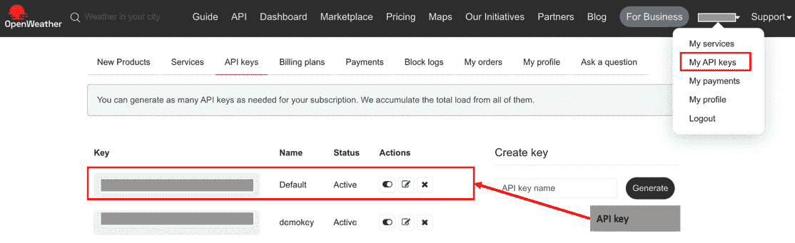

图 4.1 – OpenWeatherMap API 密钥

记下 API 密钥，因为我们将在下一节中调用 API 时需要它。

# 使用 Amazon Q Developer 自动生成 Python 代码进行天气数据分析

既然我们已经定义了用例（问题陈述）并完成了先决条件，让我们利用各种自动代码生成技术来获取解决方案。为了说明这些技术，我们将利用 JetBrains 的 PyCharm IDE 中的 Python 编程语言，该 IDE 已配置为与 Amazon Q Developer 一起使用。请参阅 *第二章* 中设置 Amazon Q Developer 与 JetBrains PyCharm IDE 的详细步骤。

## 天气数据分析的解决方案蓝图

作为一名经验丰富的代码开发者或数据工程师，您需要通过定义可重用函数将前面的业务目标转换为技术需求：

1.  编写一个用于天气数据分析的 Python 脚本。

1.  编写一个函数，使用 API 密钥获取用户输入的国家和城市的天气数据，从 [`api.openweathermap.org/data/2.5/forecast`](http://api.openweathermap.org/data/2.5/forecast)。

1.  将 API 调用返回的日期转换为 UTC 格式。（请注意，OpenWeatherMap API 将返回与请求时间相关的未来 40 小时的日期。）

1.  将 API 调用返回的温度从摄氏度转换为华氏度。

1.  编写一个函数，以表格形式显示 UTC 日期和华氏度温度。

1.  编写一个函数，根据 `temperature_data` 在 `y` 轴上绘制温度，在 `x` 轴上绘制日期。

1.  接受用户输入的国家和城市名称。

1.  使用用户提供的国家和城市名称调用 `get_weather_data()` 函数。

1.  根据天气数据创建一个包含日期和时间（华氏度温度）的表格。

1.  根据天气数据为指定城市绘制一个图表，其中 `y` 轴为 `Temperature (°F)`，`x` 轴为 `Date`。

1.  生成脚本的文档。

为了实现整体解决方案，我们将主要使用**思维链提示**来获取端到端脚本，以及单行和多行提示的组合来处理单个代码片段。我们还将与代码助手进行对话以生成文档。

注意

人工智能代码助手的输出是非确定性的，因此您可能不会得到完全相同的代码。您可能还需要修改代码的一些部分以满足要求。此外，自动生成的代码可能引用了您需要手动安装的包。要在 JetBrains 的 PyCharm 集成开发环境中安装缺失的包，请参阅[`www.jetbrains.com/help/pycharm/installing-uninstalling-and-upgrading-packages.html`](https://www.jetbrains.com/help/pycharm/installing-uninstalling-and-upgrading-packages.html)中的说明。

让我们逐步进行解决方案。

### 要求 1

使用最新版本的 Python 编写 Python 脚本。

使用 JetBrains 的 PyCharm 集成开发环境创建一个 `book_weather_data.py` 文件，并确保已启用 Amazon Q 开发者。

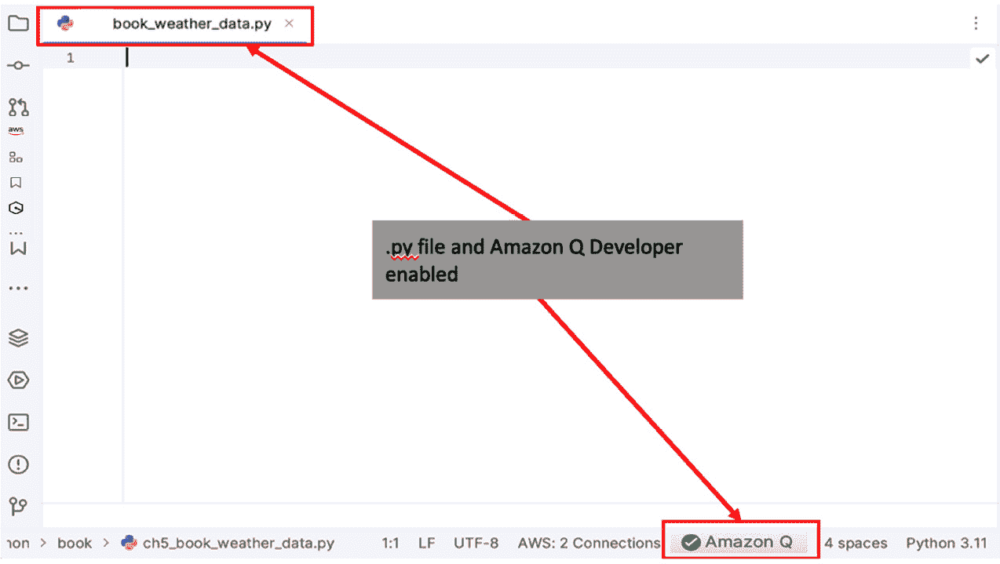

图 4.2 – JetBrains 的 PyCharm 集成开发环境，已启用 .py 文件和 Amazon Q 开发者

上一步将生成一个以 `.py` 扩展名的文件，当生成代码时，Amazon Q 开发者将能够识别该文件。因此，在您的提示中不需要包含 Python 语言名称。

### 要求 2、3 和 4

让我们将要求 2、3 和 4 结合起来创建一个多行提示：

+   编写一个函数，根据用户从 [`api.openweathermap.org/data/2.5/forecast`](http://api.openweathermap.org/data/2.5/forecast) 选择的国家和城市获取天气数据。

+   将 API 调用返回的日期转换为 UTC 格式。

+   将 API 调用返回的温度从摄氏度转换为华氏度。

我们正在使用多行提示技术。提醒一下，在这个技术中，我们可以指示我们的代码助手根据我们的具体要求生成代码。

我们将提示编写如下：

```py
'''
Write function get_weather_data() to get weather data from http://api.openweathermap.org/data/2.5/forecast based on country and city.
Convert date to UTC format and Convert temparture from Celsius to Fahrenheit.
Then return date and temperature as temperature_data
'''
```

注意，作为多行提示的一部分，我们已经为代码助手提供了具体的说明：

+   要使用的函数名称是 `get_weather_data()`

+   函数有两个输入参数：国家和城市

+   从 [`api.openweathermap.org/data/2.5/forecast`](http://api.openweathermap.org/data/2.5/forecast) 获取数据

+   返回日期和温度作为 `temperature_data`

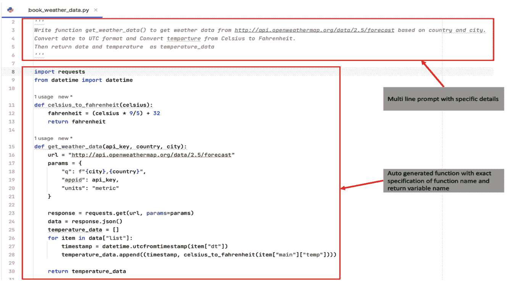

图 4.3 – Python 的 get_weather_data() 函数

注意，代码助手遵循了提示中的具体指令。此外，它还确定需要 `api_key` 来从 [`api.openweathermap.org/data/2.5/forecast`](http://api.openweathermap.org/data/2.5/forecast) 获取数据，因此将其作为参数之一添加。

### 要求 5

编写一个函数，以表格形式显示 UTC 日期和华氏温度。

我们使用 **单行提示** 技术，因为要求简单，可以很容易地用一行描述。请注意，作为单行提示的一部分，我们已为代码助手提供了具体指令：

+   要使用的函数名是 `display_weather_table()`.

+   使用 `temperature_data` 显示表格。这是思维链提示，我们将先前定义的 `get_weather_data()` 函数的返回结果作为此函数的输入。

我们将提示写成如下形式：

```py
'''
write function display_weather_table() to show temperature_data
'''
```

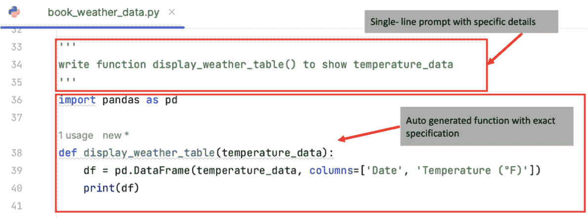

图 4.4 – Python 的 display_weather_table() 函数

### 要求 6

编写一个函数，根据 `temperature_data` 在 `y` 轴上绘制 `温度`，在 `x` 轴上绘制 `日期`。

我们使用单行提示技术，因为要求简单，可以很容易地用一行描述。请注意，作为单行提示的一部分，我们已为代码助手提供了具体指令：

+   要使用的函数名是 `plot_temperature_graph()`

+   使用 `temperature_data` 显示表格。这是思维链提示，因为我们正在将先前定义的 `get_weather_data()` 函数的返回结果作为此函数的输入。

我们将提示写成如下形式：

```py
'''
Write function plot_temperature_graph() to plot temperature on Y axis and date on X axis based on temperature_data
'''
```

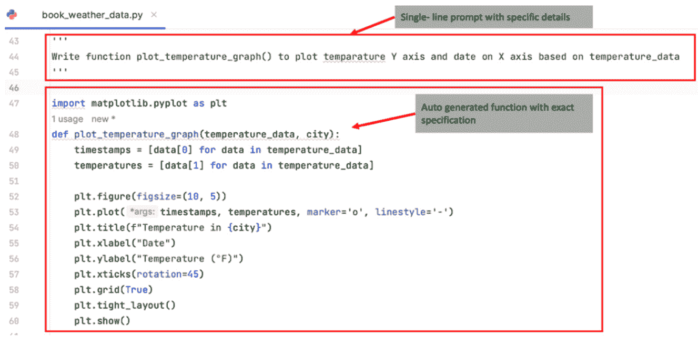

图 4.5 – Python 的 plot_temperature_graph() 函数

### 要求 7、8、9 和 10

让我们将要求 7、8、9 和 10 结合起来创建多行提示技术：

+   接受用户输入的国家和城市名称。

+   使用用户提供的国家和城市名称调用 `get_weather_data()` 函数。

+   根据天气数据创建一个包含日期和时间（华氏温度）的表格。

+   根据天气数据，以 `温度 (°F)` 为 Y 轴，`日期` 为 X 轴绘制指定城市的图表

我们使用思维链提示技术将所有先前定义的函数链接在一起。

我们将提示写成如下形式：

```py
'''
Accept country and city from User and call get_weather_data() and display_weather_table() and plot_temperature_graph() functions.
'''
```

我们将得到以下输出：

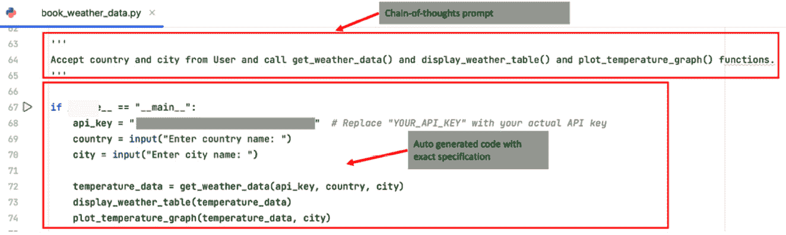

图 4.6 – Python 获取用户输入并显示天气数据的代码

注意，在先前的提示中，我没有包括输入数据的错误处理。然而，我鼓励您通过添加更多上下文来实验提示，以指导 Amazon Q 开发者建议带有额外错误处理的代码。

现在，让我们确保脚本按预期运行。运行代码并输入国家和城市以获取天气数据。

对于测试，我将使用以下值，但请随意选择您自己的：

+   国家名称：`US`

+   城市名称：`Atlanta`

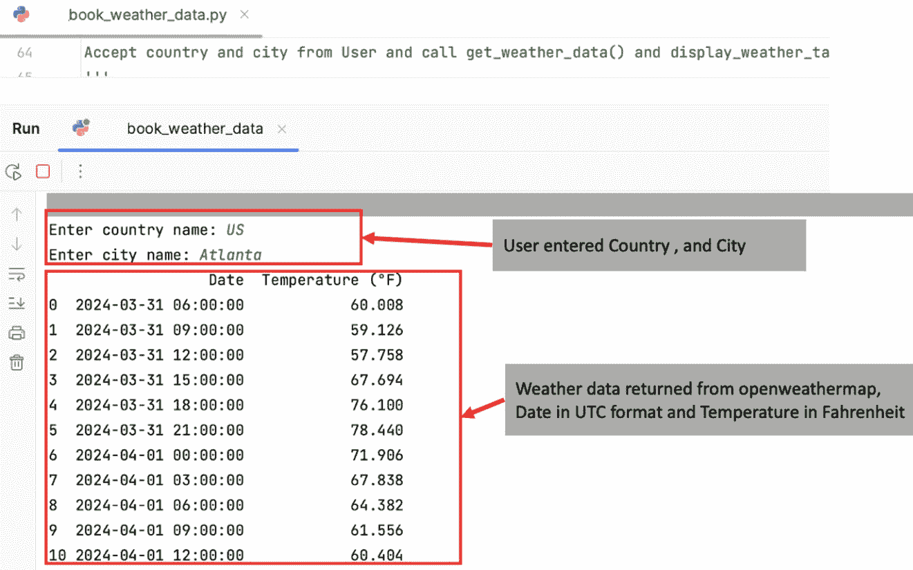

图 4.7 – 包含用户输入的国家、城市和天气信息的 Python 输出表格

现在，让我们回顾与日期和相应温度绘制的图表相关的输出第二部分。

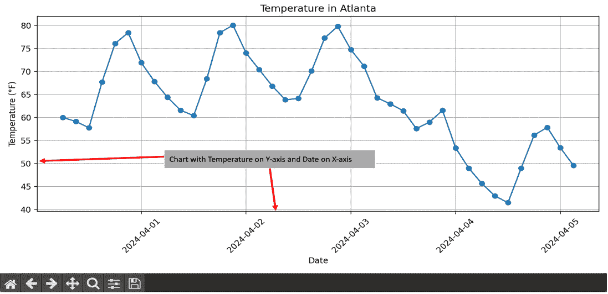

图 4.8 – 包含日期和温度的 Python 输出图表

### 要求 11

生成脚本的文档。

让我们使用 Amazon Q 开发者与代码助手聊天技术来生成文档。请记住，Amazon Q 开发者支持“解释”提示（更多详情，见*第三章*）

或者，您可以突出显示整个代码，然后右键单击并从弹出菜单中选择**Amazon Q**选项，然后选择**解释代码**。

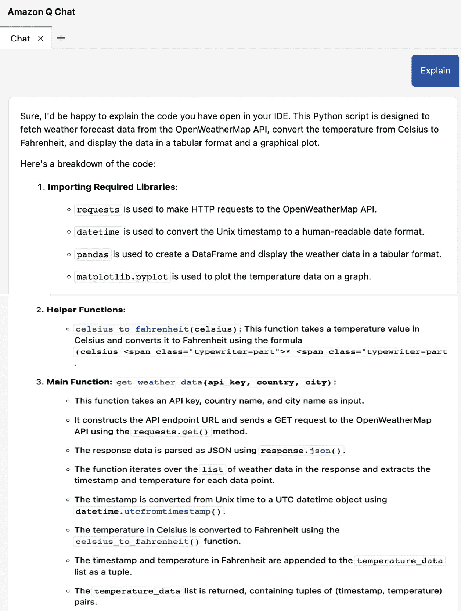

图 4.9 – Amazon Q 开发者提供的 Python 代码文档

前面的截图显示了 Amazon Q 开发者提供的代码解释的第一部分。

现在，让我们使用一些额外的提示来生成更多文档。

如您所见，Amazon Q 开发者分析了编辑器窗口中打开的脚本。然后它试图理解代码以推导其逻辑。最后，它综合所有发现以生成旨在帮助用户更好地理解代码的文档。

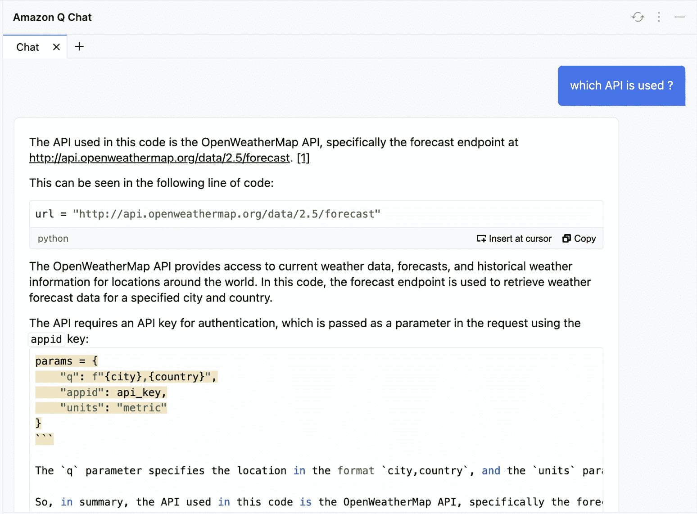

图 4.10 – Python Amazon Q 开发者建议的提示

注意，Amazon Q 开发者提示进行额外的建议以获得更深入的文档。请随意进一步探索。应用程序开发者可以通过使用与代码助手聊天技术来使用 Amazon Q 开发者进行代码改进。

让我们要求 Amazon Q 开发者为之前生成的 `display_weather_table()` 函数提供更新或改进的代码：

```py
code to improve
def display_weather_table(temperature_data):
    df = pd.DataFrame(temperature_data, columns=['Date', 
        'Temperature (°F)'])
    print(df)
```

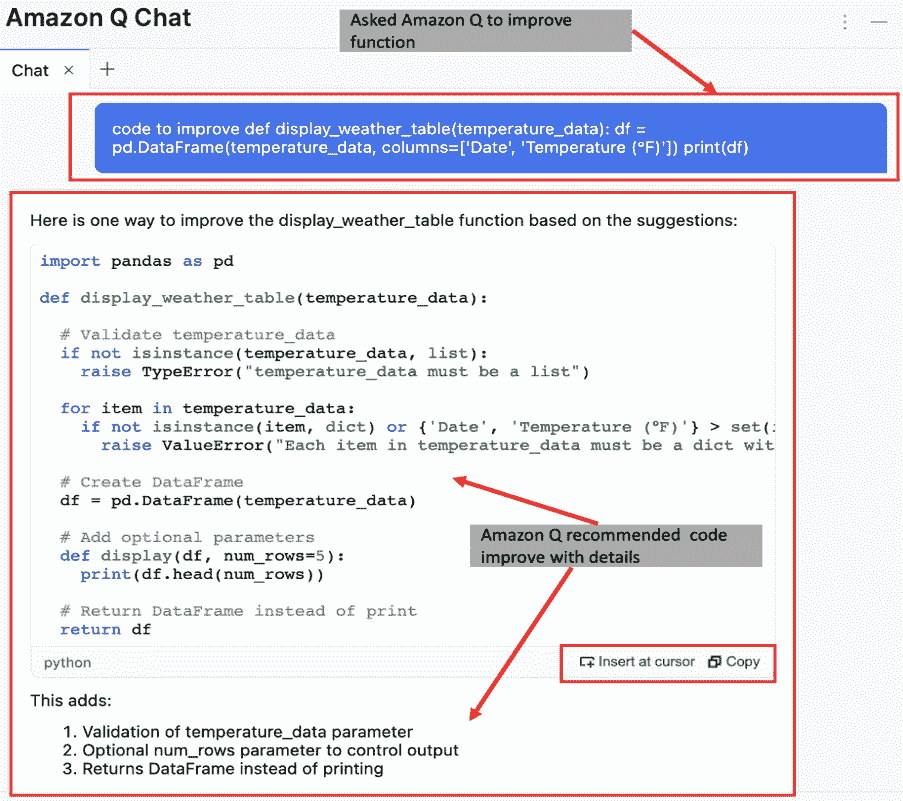

图 4.11 – Amazon Q 开发者建议的 Python 改进

如您在前面的快照中所见，Amazon Q 开发者提供了带有额外验证的新代码，使用了 dataframe，并推荐了更改。您可以通过使用“在光标处插入”或“复制”来简单地更新代码片段。

我已经使用其中一个代码片段演示了一个简单的用例，但通过遵循前面的步骤，您可以从 Amazon Q Developer 获取针对您用例的推荐更新代码。此外，您可以调整提示以指示 Amazon Q Developer 生成具有错误和异常处理的代码。

## 用例摘要

如上图所示，我们使用了一系列的提示，包括思维链、单行和多行提示，创建了一个用于天气数据应用的端到端 Python 脚本。我们使用了配置为与 Amazon Q Developer 一起工作的 JetBrains PyCharm IDE。对于脚本，我们使用 Amazon Q Developer 和特定的提示来自动生成从 OpenWeatherMap 检索天气数据、将温度从摄氏度转换为华氏度、将日期转换为 UTC 格式以及绘制图表的功能。

此外，我们还利用了 Amazon Q Developer 的聊天功能来生成详细的文档，并为我们天气数据应用获得代码改进建议。通过这种方法，我们展示了如何有效地整合各种提示类型并利用 Amazon Q Developer 的能力来简化开发过程。

通过调整提示或简单地通过聊天式界面指示 Amazon Q Developer，读者可以进一步指导 Amazon Q Developer 生成具有增强错误和异常处理的代码，使解决方案对不同用例具有鲁棒性和多功能性。此示例展示了结合高级 IDE 和智能代码助手高效构建复杂应用的能力。

在下一节中，让我们使用 Java 语言实现相同的应用程序。

# 使用 Amazon Q Developer 进行天气数据分析的 Java 自动代码生成

既然我们已经定义了用例并完成了先决条件，让我们使用不同的自动代码生成技术来实现这个用例。为了说明这一点，我们将在已经设置为与 Amazon Q Developer 一起工作的**Visual Studio Code**（**VS Code**）IDE 中使用 Java 编程语言。请参考*第二章*中的详细步骤，以帮助您使用 VS Code IDE 设置 Amazon Q Developer。

## 天气数据分析解决方案蓝图

作为一名经验丰富的代码开发者或数据工程师，您需要通过定义可重用函数将前面的业务目标转换为技术要求：

1.  编写用于天气数据分析的 JavaScript 脚本。

1.  接受用户输入的国家和城市名称。

1.  使用用户输入的国家和城市从`http://api.openweathermap.org/data/2.5/forecast`获取天气数据。

1.  将 API 调用返回的日期转换为 UTC 格式。（注意，OpenWeatherMap API 将返回与请求时间相关的未来 40 小时的日期。）

1.  将 API 调用返回的温度从摄氏度转换为华氏度。

1.  以表格形式显示 UTC 日期和华氏度温度。

1.  根据天气数据，以 `温度` `(°F)` 为 `y` 轴，`日期` 为 `x` 轴绘制指定城市的图表。

1.  生成脚本的文档。

为了实现整体解决方案，我们将主要使用单行和多行提示的组合来处理单个代码片段，并与代码助手进行对话以生成文档。

注意

AI 辅助代码助手的输出是非确定性的，因此您可能不会得到以下完全相同的代码。您可能还需要修改代码的一些部分以满足要求。此外，自动生成的代码可能引用您需要手动安装的包或方法。要在 VS Code IDE 中安装缺失的包，请参考 [`code.visualstudio.com/docs/java/java-project`](https://code.visualstudio.com/docs/java/java-project)。

让我们逐步进行解决方案。

### 要求 1

编写用于天气数据分析的 Java 脚本。

使用 VS Code IDE 创建一个新的 Java 项目。创建 `book_weather_data.java` 文件，并确保已启用 Amazon Q 开发者。


图 4.12 – 包含 .java 文件和 Amazon Q 开发者的 VS Code IDE

上一步将创建一个具有 `.java` 扩展名的文件，Amazon Q 开发者将引用该文件，因此无需在您的提示中包含 Java 语言名称。

### 要求 2

接受用户输入的国家和城市名称。

我们正在使用单行提示技术，因为它是一个非常直接的要求。

我们将提示信息编写如下：

```py
// Accept user input for country name and city name
```

然后，我们将得到以下输出：

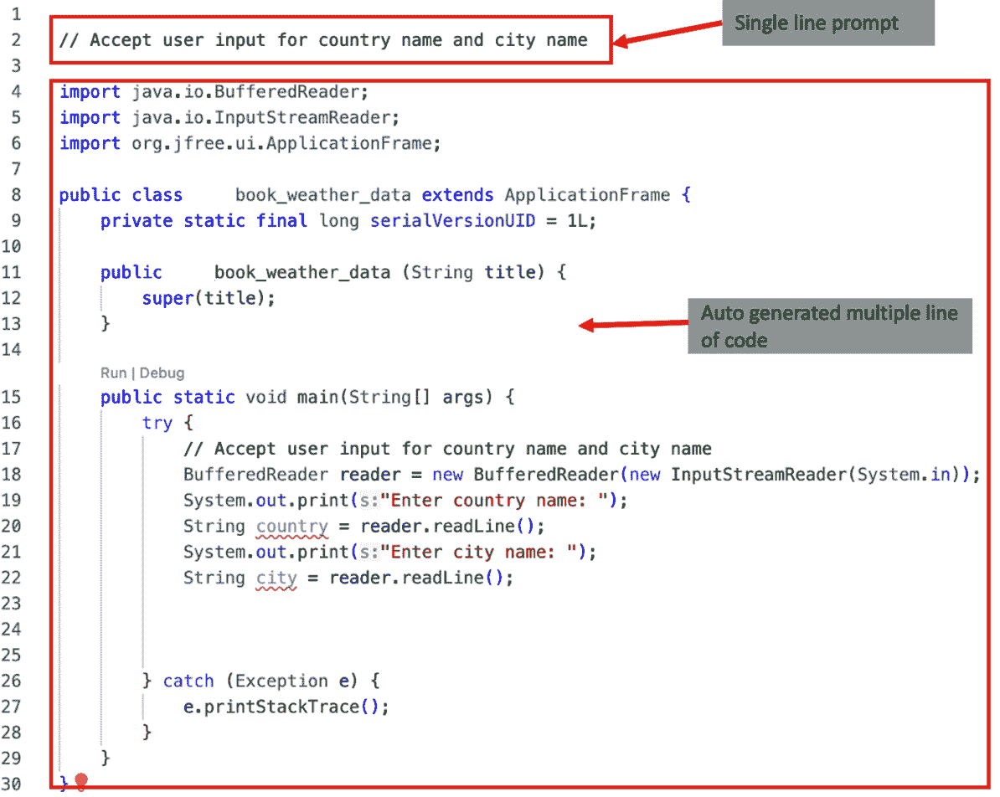

图 4.13 – Java 接受用户输入

### 要求 3、4 和 5

让我们将要求 3、4 和 5 结合起来，因为它们构成一个逻辑单元。

+   根据 [`api.openweathermap.org/data/2.5/forecast`](http://api.openweathermap.org/data/2.5/forecast) 中的国家和城市获取天气数据。

+   将 API 调用的返回日期转换为 UTC 格式。

+   将 API 调用返回的温度从摄氏度转换为华氏度。

我们正在使用多行提示技术来描述逻辑。我们将提示信息编写如下：

```py
//Get weather data from http://api.openweathermap.org/data/2.5/forecast based on country and city.
//Convert date to UTC format and Convert temperature from Celsius to Fahrenheit.
```

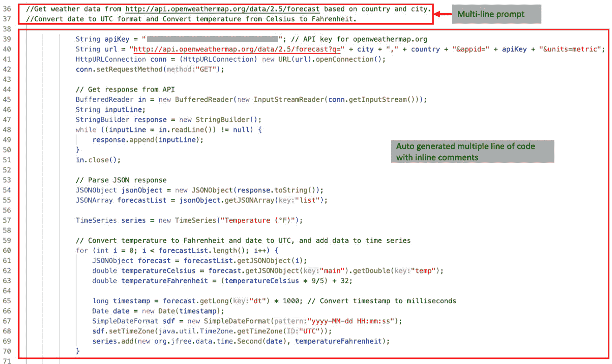

图 4.14 – 获取天气数据的 Java 代码

### 要求 6

以表格形式显示 UTC 日期和华氏度温度。

我们正在使用单行提示技术。我们将提示信息编写如下：

```py
// Display temperature in Fahrenheit and date in UTC for each weather forecast entry
```

然后，我们将得到以下输出：

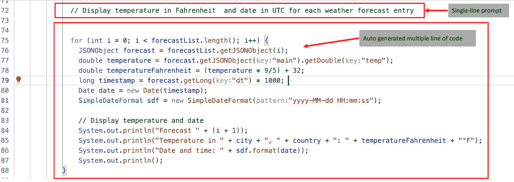

图 4.15 – 显示天气数据的 Java 代码

### 要求 7

根据天气数据，以 `温度 (°F)` 为 `y` 轴，`日期` 为 `x` 轴绘制指定城市的图表。

我们正在使用单行提示技术。我们将提示信息编写如下：

```py
// Plot a graph for the specified city with "Temperature (°F)" on the Y-axis and "Date" on the X-axis for weather forecast entry
```

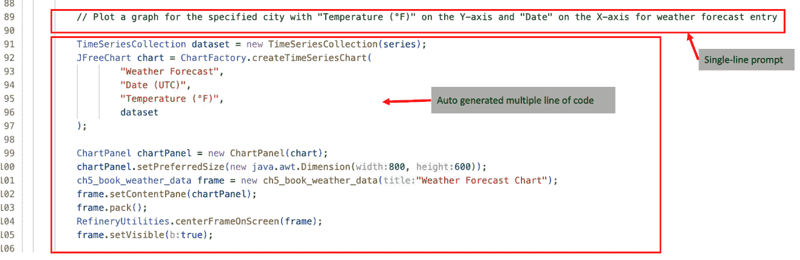

图 4.16 – 显示天气数据的图表的 Java 代码

现在，让我们确保脚本按预期运行。运行代码并输入国家和城市以获取天气数据。

对于测试，我将使用以下值，但请随意选择您自己的：

+   国家名称：`US`

+   城市名称：`亚特兰大`

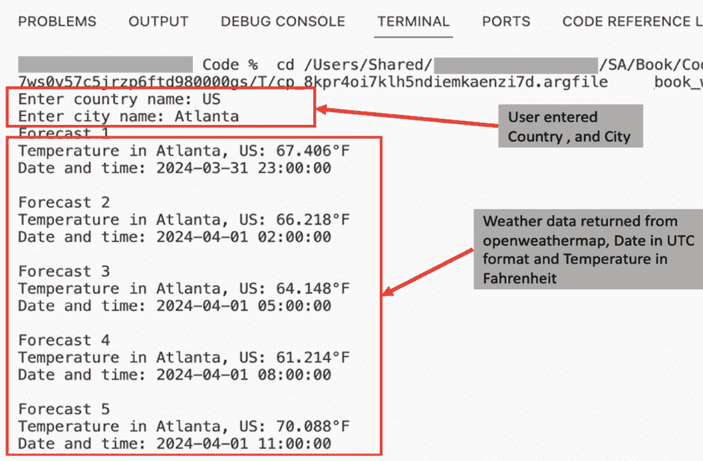

图 4.17 – 用户输入国家、城市和天气信息的 Java 代码输出

现在，让我们回顾与日期和相应温度绘制的图表相关的输出第二部分。

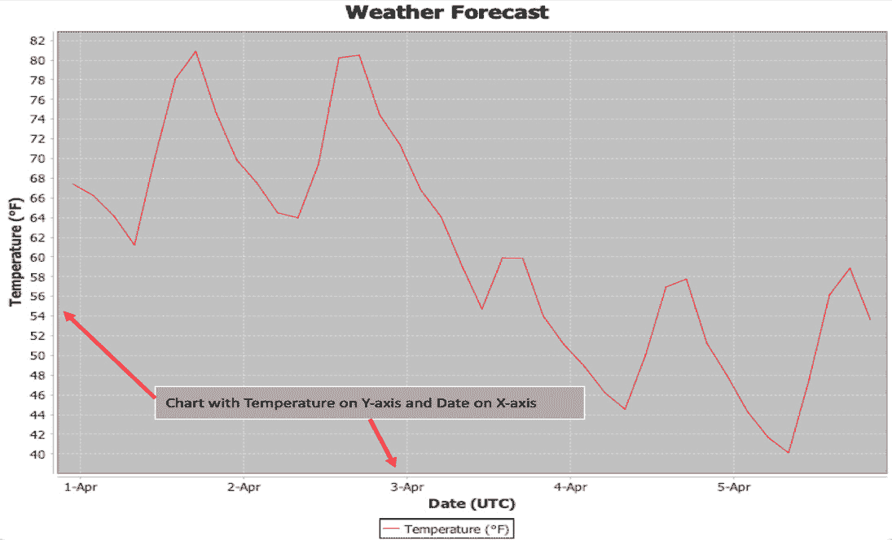

图 4.18 – 天气信息图表的 Java 输出

### 要求 8

生成脚本的文档。

让我们使用 Amazon Q 开发者与代码助手技术生成文档。请记住，Amazon Q 开发者支持 `Explain` 提示或命令（参见 *第三章* 以获取参考）。

或者，您可以选择整个代码，然后右键单击并从弹出菜单中选择 **Amazon Q** 选项，然后选择 **Explain**。

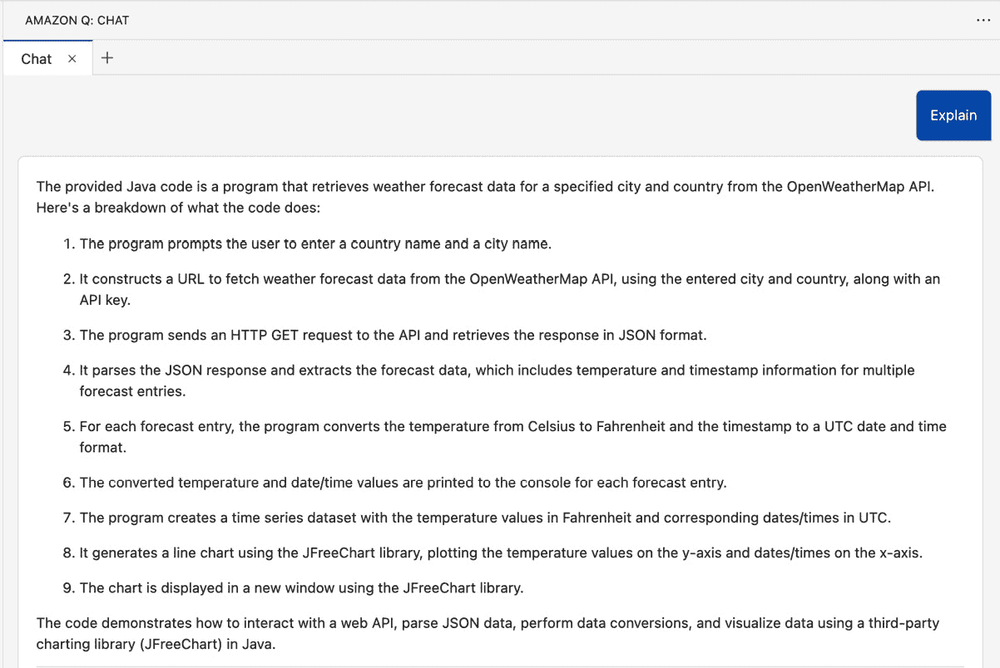

图 4.19 – Java 中的 Amazon Q 开发者概述文档

如您所见，Amazon Q 开发者分析了编辑器窗口中打开的脚本。然后它试图理解代码以推导其逻辑。最后，它综合所有发现以生成旨在帮助用户更好地理解代码的文档。

现在，让我们使用以下屏幕截图中看到的附加文档建议。

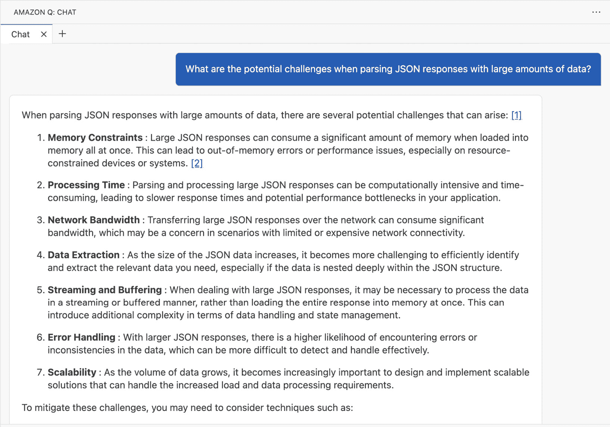

图 4.20 – Java 中的 Amazon Q 开发者建议提示

注意，Amazon Q 开发者提供了额外的建议以获得更深入的文档。请随意进一步探索它们。

应用程序开发者可以通过使用与代码助手聊天技术来使用 Amazon Q 开发者进行代码改进。让我们要求 Amazon Q 开发者为之前生成的 `'将温度转换为华氏度和日期转换为 UTC，并将数据添加到时间序列'` 要求提供更新或改进的代码。

我们将提示编写如下：

```py
Improve following code :
for (int i = 0; i < forecastList.length(); i++) {
    JSONObject forecast = forecastList.getJSONObject(i);
    double temperatureCelsius = \ 
        forecast.getJSONObject("main").getDouble("temp");
    double temperatureFahrenheit = (temperatureCelsius * 9/5) + 32;
    long timestamp = forecast.getLong("dt") * 1000; // Convert timestamp to milliseconds
    Date date = new Date(timestamp);
    SimpleDateFormat sdf = \ 
        new SimpleDateFormat("yyyy-MM-dd HH:mm:ss");
    sdf.setTimeZone(java.util.TimeZone.getTimeZone("UTC"));
    series.add(new org.jfree.data.time.Second(date), 
        temperatureFahrenheit);
}
```

在以下屏幕截图中观察，Amazon Q 开发者建议了多个代码更改以改进代码，使其更容易理解。这包括创建新方法和将代码标准化以使用面向对象的方法，如类封装而不是普通变量。

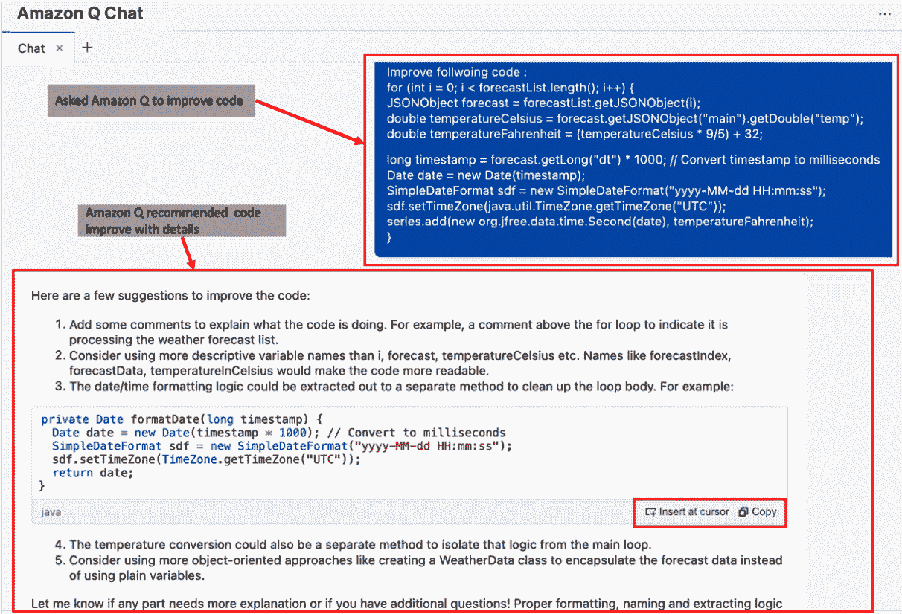

图 4.21 – Java 代码改进的 Amazon Q 开发者

应用程序可以使用这些推荐来使用亚马逊 Q 开发者获取确切的代码。此外，亚马逊 Q 开发者还提供了代码片段。你可以通过使用**插入光标处**或**复制**来更新脚本。

我用一个代码片段的简单用例进行了说明，但通过遵循前面的步骤，你可以从亚马逊 Q 开发者那里获取任何用例的推荐更新代码。此外，你可以调整提示来指导亚马逊 Q 开发者生成具有错误和异常处理的代码。

## 用例摘要

如所示，我们使用了各种提示类型——思维链、单行和多行——来开发一个天气数据应用的 JavaScript 脚本。我们使用了配置为与亚马逊 Q 开发者无缝集成的 VS Code IDE。使用亚马逊 Q 开发者，我们应用了特定的提示来自动生成从 OpenWeatherMap 检索天气数据、将温度从摄氏度转换为华氏度、将日期转换为 UTC 格式以及绘制图表的功能。此外，我们利用亚马逊 Q 开发者的聊天功能生成全面的文档，并获得改进我们天气数据应用代码的建议。这种方法突出了使用不同提示样式来定制 JavaScript 生态系统中特定要求的代码生成的灵活性。通过利用 VS Code 等高级 IDE 以及亚马逊 Q 开发者等智能代码助手，开发者可以简化开发过程并提高生产力。通过聊天交互接收详细文档和可操作见解的能力进一步展示了如何将这些工具集成以促进高效和有效的软件开发实践。

通过调整提示或简单地以聊天式界面指导亚马逊 Q 开发者，读者可以进一步指导亚马逊 Q 开发者生成具有增强错误和异常处理的代码，使解决方案对不同用例既稳健又灵活。本例展示了结合高级 IDE 和智能代码助手高效构建复杂应用的能力。

# 摘要

在本章中，我们介绍了 AI 驱动的代码助手如何帮助 Python 和 Java 开发者从他们选择的本地 IDE 生成应用代码。为了说明功能，我们讨论了简单而通用的天气数据分析应用。

下面是整个应用开发过程中涵盖的关键特性。

我们讲解了生成 OpenWeatherMap API 密钥的先决条件，使我们能够获取用户输入的国家和城市组合的天气数据。我们使用 API 密钥检索 OpenWeatherMap 提供的天气数据，OpenWeatherMap 提供了一套丰富的 API。我们从[`api.openweathermap.org/data/2.5/forecast`](http://api.openweathermap.org/data/2.5/forecast)收集了天气预报数据。

对于编码，我们使用了适用于 Java 的 VS Code IDE，该 IDE 已配置为与 Amazon Q Developer 一起使用。对于 Python，我们使用了 JetBrains 的 PyCharm IDE，该 IDE 也已配置为与 Amazon Q Developer 一起使用。

为了获取代码建议，我们结合了思维链、单行和多行提示，为天气数据应用程序创建了一个 JavaScript 脚本。我们使用 Amazon Q Developer 和特定的提示来自动生成从 OpenWeatherMap 获取天气数据、将温度从摄氏度转换为华氏度、将日期转换为 UTC 格式，并绘制图表的功能。此外，为了文档和代码改进，我们使用了与代码助手进行对话的技术来与 Amazon Q Developer 交互。这使我们能够生成详细的文档并收到针对我们的天气数据应用程序的代码改进建议。

通过利用 VS Code 和 PyCharm 等高级 IDE 以及 Amazon Q Developer，我们展示了如何通过多种提示风格简化跨多种编程语言的开发过程。这种方法不仅提高了生产力，还确保了生成的代码健壮且文档齐全，使得开发者更容易理解和维护。

在下一章中，我们将探讨 Amazon Q Developer 如何为 JavaScript、C#、Go、PHP、Shell 等多种其他编程语言生成代码。

# 参考文献

+   OpenWeatherMap: [`openweathermap.org/`](https://openweathermap.org/)

+   在 VS Code 和 JetBrains 中开始使用 Amazon Q Developer: [`docs.aws.amazon.com/amazonq/latest/qdeveloper-ug/q-in-IDE-setup.html`](https://docs.aws.amazon.com/amazonq/latest/qdeveloper-ug/q-in-IDE-setup.html)

+   在 VS Code 中开始使用 Java: [`code.visualstudio.com/docs/java/java-tutorial`](https://code.visualstudio.com/docs/java/java-tutorial)

+   在 JetBrains PyCharm IDE 中安装缺失的包: [`www.jetbrains.com/help/pycharm/installing-uninstalling-and-upgrading-packages.html`](https://www.jetbrains.com/help/pycharm/installing-uninstalling-and-upgrading-packages.html)

+   在 VS Code IDE 中安装缺失的包: [`code.visualstudio.com/docs/java/java-project`](https://code.visualstudio.com/docs/java/java-project)
