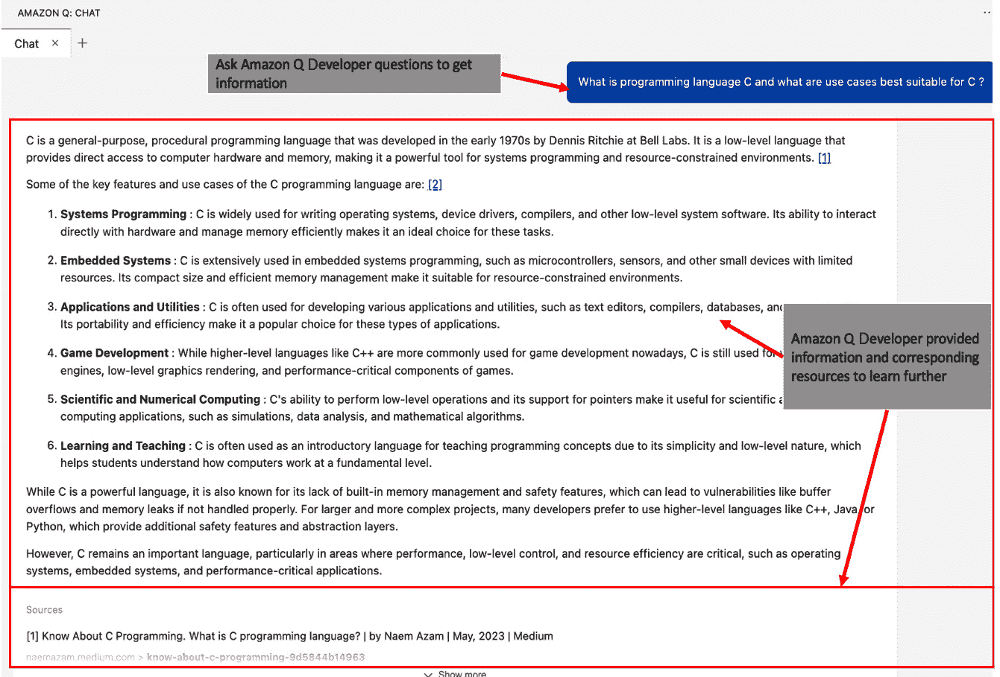
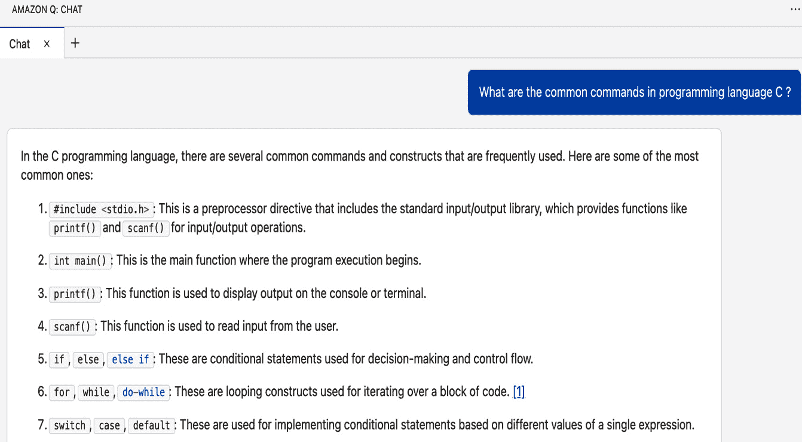
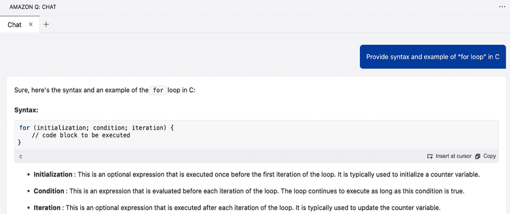
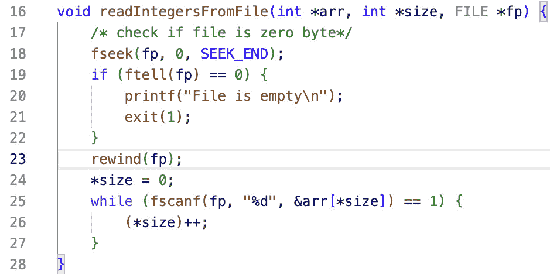
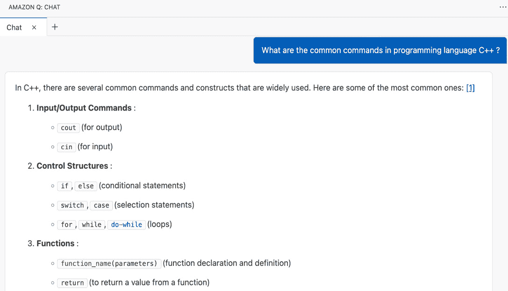
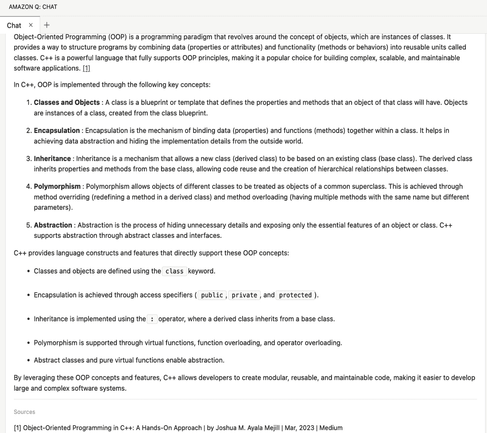
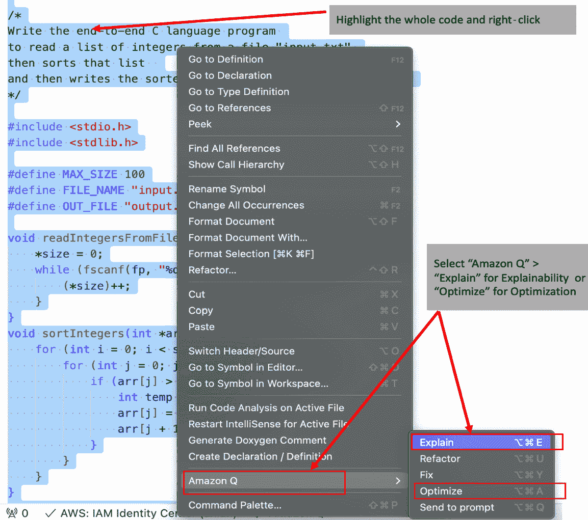

# 第五章：使用自动代码生成提高 C 和 C++ 的编码效率

在本章中，我们将探讨以下关键主题：

+   编程语言类别和基础语言的概述

+   使用 Amazon Q Developer 进行 C 的自动代码生成

+   使用 Amazon Q Developer 进行 C++ 的自动代码生成

+   使用 Amazon Q Developer 进行 C 和 C++ 代码可解释性和优化

在上一章中，我们探讨了如何使用 Amazon Q Developer 在 VS Code 和 PyCharm IDE 中建议代码。我们使用了开发者使用的两种最突出的编程语言，Python 和 Java，来演示如何使用提示技术以及利用与代码助手聊天技术生成自动代码。

在本章中，我们将首先探讨一些编程语言的类别。然后，我们将讨论基础编程语言的概述，然后重点关注软件行业中使用的两种主导语言：C 和 C++。我们将介绍如何将自动代码生成，特别是在 Amazon Q Developer 中，集成并供 C 和 C++ 开发者使用，以理解、学习语法以及自动生成代码。作为额外的好处，通过在不同编程语言之间标准化代码，这些工具可以增强代码的可读性、可维护性和在大规模项目中的互操作性。

# 编程语言类别和基础语言的概述

软件开发的格局在过去几十年中经历了巨大的变革。随着对强大、高效和可扩展应用程序的需求增长，编码过程的复杂性也随之增加。因此，出现了各种编码语言类别以满足这些多样化的需求。

基础语言，如 C 和 C++，为许多系统提供了基本构造。包括 HTML、CSS 和 JavaScript 在内的网络开发语言，为动态和交互式网络体验提供动力。数据库管理语言，如 SQL，对于处理大型数据集至关重要。系统管理和自动化语言，如 Python 和 Bash，简化了重复性任务并提高了运营效率。“基础设施即代码”（**IaC**）语言，如 Terraform 和 AWS CloudFormation，允许开发者通过代码管理和配置计算基础设施。

每个类别都针对特定的挑战，反映了现代技术生态系统的多面性。了解这些类别有助于开发者选择适合他们项目的正确工具，从而实现更有效的解决方案。

# 基础语言 C 和 C++，以及自动代码生成支持

C 和 C++ 是构成软件开发基础的编程语言，它们塑造了软件开发的格局。以其性能和对系统资源的控制而闻名，这些语言在系统编程、游戏开发和实时处理应用等各个领域都至关重要。然而，使 C 和 C++ 强大的正是它们的复杂性。手动内存管理、低级操作和复杂的语法使得在这些语言中编码容易出错且耗时。

为了减轻这些挑战并提高生产力，自动代码生成已成为一种变革性的解决方案。自动代码生成涉及使用高级工具根据预定义的模板或规范自动生成源代码。这种自动化可以显著减少编码中的手动工作量，减少错误，并标准化代码质量。在这个领域领先的工具之一是 Amazon Q Developer，它为 C 和 C++ 代码生成带来了强大的功能。如前几章所述，Amazon Q Developer 是一种创新工具，它利用人工智能和机器学习来帮助开发者编写代码。通过将 Amazon Q Developer 集成到开发工作流程中，程序员可以从中受益于其针对 C 和 C++ 定制的复杂代码生成功能。

使用 Amazon Q Developer 为 C 和 C++ 代码生成的主要优势之一是显著减少开发时间。编写样板代码，例如内存管理例程、数据结构和错误处理，可能会很繁琐且重复。Amazon Q Developer 可以提供建议来自动化这些任务，使开发者能够专注于学习和实施项目更复杂和更具创造性的方面。这不仅加速了开发过程，而且通过确保重复性任务得到一致且正确的处理，提高了整体代码质量。

此外，Amazon Q 有助于缩小对 C 和 C++ 新手开发者的知识差距。鉴于这些语言的复杂性和对细节的严格关注，学习曲线可能很陡峭。通过提供自动生成的代码示例和模板，Amazon Q 作为一种教育工具，帮助开发者更快地理解和采用正确的语法和编码约定。这一特性在教育环境和为新团队成员入职时尤其有益，因为它提供了理论概念在实际应用中的具体示例。

此外，Amazon Q Developer 配备了先进的调试和优化功能。它可以识别代码中的潜在问题并提出优化建议，确保生成的代码不仅正确，而且高效。这一特性在性能关键型应用中至关重要，在这些应用中，即使是微小的低效也可能产生重大影响。

现在，让我们深入探讨 Amazon Q Developer 如何帮助程序员。为了说明这一点，我将使用带有 VS Code 的 Amazon Q Developer 界面（有关 Amazon Q Developer 与 VS Code 的配置步骤，请参阅*第二章*，以及本章末尾的*参考文献*部分关于 VS Code 的 C/C++）。

注意

Amazon Q Developer 使用 LLMs，它们本质上是非确定性的，因此您可能不会得到与代码快照中显示的完全相同的答案或代码块。尝试更新您的提示以获得所需的推荐。然而，从逻辑上讲，生成的答案或代码应满足要求。

# 使用 Amazon Q Developer 进行 C 语言自动代码生成

首先，假设一位新程序员计划使用 C 语言，并且没有这方面的语言背景。让我们使用 Amazon Q Developer 的聊天式界面来教育这位程序员。

## C 语言基础

让我们了解 C 编程语言：

```py
Q: What is programming language C and what are use cases best suitable for C ?
```



图 5.1 – 以聊天方式了解 C 语言

如前截图所示，Amazon Q Developer 提供了 C 语言原始开发者的历史信息。然后，它通过分类总结 C 语言的常见用例，说明 C 语言在哪些方面表现卓越。此外，它还提供了进一步参考和学习的资源。

现在让我们来询问 C 程序员常用的命令：

```py
Q: What are the common commands in programming language C ?
```



图 5.2 – 了解常见的 C 程序员命令

我们不会详细讲解每个命令，但为了说明，如图中所示的部分截图，Amazon Q Developer 提供了 C 编程语言中常见命令和结构的几个示例。为了便于理解，它将它们分类为条件结构、循环结构、函数等组。此外，您还可以看到它提供了参考文献，供用户获取有关主题的更详细信息。

现在，让我们向 Amazon Q Developer 询问 `for` 循环的语法和示例：

```py
Q: Provide syntax and example of "for loop" in C
```



图 5.3 – 了解 for 循环

观察前后的截图，可以看到 Amazon Q Developer 提供了 `for` 循环的语法、细节和示例。


图 5.4 – for 循环示例

## C 语言端到端用例开发

现在，让我们转向示例用例，以展示 Amazon Q Developer 推荐代码的能力。为了说明这一点，我将使用 VS Code 脚本编辑器窗口的单行和多行提示。

假设我们想要编写一个 C 程序，从文件中读取一系列整数，对它们进行排序，并将排序后的列表写入另一个文件。这是一个非常常见的用例，可以看到 C 语言的多个功能。

让我们使用多行提示技术来实现前面的用例。

```py
Prompt:
/* Write the end-to-end C language program to read a list of integers from a file "input.txt" then sorts that list and then writes the sorted list to output file "output.txt"
*/
```


图 5.5 – C 程序示例快照

前一个截图显示了 Amazon Q Developer 提出的部分代码。Amazon Q Developer 生成的端到端 C 代码展示了 C 编程中的几个基本和高级概念，包括函数、数组、指针和文件 I/O 操作。它还添加了与 `"Error opening file"` 相关的错误处理。

现在我们使用交互式内联提示和思维链技术来增强代码。正如你在 `readIntegersFromFile()` 函数中看到的，Amazon Q Developer 已经添加了 `"Error opening file"`。现在，让我们指导它检查零字节文件。只需进入函数并使用以下单行提示技术：

```py
Prompt :
/* check if file is zero byte*/
```



图 5.6 – C 程序内联函数增强

如截图所示，基于我们的提示，Amazon Q Developer 添加了一个 `if` 条件来检查输入文件是否为零字节。如果文件为空，代码将优雅地退出，并显示 `"File is empty"` 消息和一个非零退出代码。

在下一节中，让我们探索 Amazon Q Developer 与 C++ 的功能。

# 使用 Amazon Q Developer 进行 C++ 自动代码生成

与前一个章节类似，让我们首先假设一位新程序员计划使用 C++，并且没有这个语言的基础。我们将使用来自 C 语言章节的类似聊天式界面提示，在 Amazon Q Developer 的帮助下学习 C++ 语言的基础。

## C++ 语言基础

让我们了解 C++ 编程语言：

```py
Q: What is programming language C++ and what are use cases best suitable for C++ ?
```


图 5.7 – 了解 C++ 编程

如前一个截图所示，Amazon Q Developer 提供了关于原始开发者的历史信息。然后，它通过分类总结出 C++ 语言擅长的常见用例。此外，它还提供了参考资料，供用户进一步参考和学习。

现在，让我们询问 C++ 程序员常用的命令：

```py
Q: What are the common commands in programming language C++?
```



图 5.8 – 了解常见程序员 C++ 命令

我们不会逐个命令讲解，只是为了说明，正如你在以下部分截图中所见，Amazon Q Developer 提供了 C++ 编程语言中常见命令和结构的几个类别。为了便于理解，它还包含了每个示例命令的一些常见快捷键。此外，你还可以看到它提供了参考资料，供用户获取有关主题的更详细信息。

根据提供的信息，你可以观察到 C++ 在面向对象编程（OOP）领域表现出色，因此让我们请 Amazon Q 开发者提供有关 C++ 对 OOP 支持的详细信息和示例：

```py
Q: What is Object-Oriented Programming and how C++ supports it ?
```



图 5.9 – 学习 C++ 面向对象编程

如前一个屏幕截图所示，Amazon Q 提供了面向对象编程（OOP）基础和关键概念，如类、对象、继承、封装和抽象的概述。它还包括相应的 C++ 构造，如 `class`、`public`、`private` 和 `protected`。

现在，让我们请 Amazon Q 开发者提供 `do...` `while` 循环的语法和示例：

```py
Q: Provide syntax and example of "do... while loop" in C++
```


图 5.10 – 学习 do…while 循环

观察前一个和后一个屏幕截图，Amazon Q 开发者提供了 `do...` `while` 循环的语法、细节和示例。

## 端到端 C++ 语言用例开发

现在，让我们转到示例用例，以展示 Amazon Q 开发者推荐代码的能力。为了说明，我将使用 VS Code 脚本编辑器窗口的单行和多行提示。 

假设我们想要编写一个 C++ 程序来开发一个新的操作系统内核，该内核可以控制系统资源，并具有处理复杂内存管理任务的能力。内核必须与硬件交互，管理进程，并确保在不同硬件架构上的稳定性。

让我们使用多行提示技术来实现前面的用例。

```py
Prompt:
/* Write an end to end executable C++ script
to develop a new operating system kernel, that can control over system resources and ability to handle complex memory management tasks. The kernel must interact with hardware, manage processes, and ensure stability across different hardware architectures.
*/
```


图 5.11 – 使用 Amazon Q 开发者编写 C++ 程序

前一个屏幕截图显示了 Amazon Q 开发者建议的部分代码。你可以观察到，端到端代码展示了 C++ 编程中的几个基本和高级概念，包括 OOP、类、向量、函数、错误处理等。

现在，让我们使用交互式内联提示和思维链技术来增强代码。正如你所见，`loadProcess()` 函数没有异常处理，因此让我们用单行提示技术指导它添加对空进程的异常处理：

```py
Prompt :
/* add exception handling for loadProcess */
```


图 5.12 – 提示 – C++ 程序示例快照

如截图所示，根据我们的提示，Amazon Q 开发者添加了一个 `nullptr` 条件来检查进程加载异常。如果遇到空指针，则代码会优雅地退出，并显示 `Error: process is` `null` 消息。

# 使用 Amazon Q 开发者进行 C 和 C++ 代码可解释性和优化

Amazon Q 提供了实现代码可解释性和优化的选项，适用于 C 和 C++。有关可解释性和优化的更多详细信息，请参阅 *第十二章*。

为了展示代码的可解释性和优化，我将使用为 C 语言生成的端到端代码。如图所示，只需突出显示整个代码，右键单击以打开弹出菜单，然后选择**亚马逊 Q**并选择**解释**以实现代码可解释性或选择**优化**以获取优化建议。



图 5.13 –C 和 C++程序的可解释性和优化

这将打开亚马逊 Q 开发者的聊天风格界面，并将整个代码移动到分析位置。对于可解释性，亚马逊 Q 开发者提供了关于每个函数和整体代码逻辑的详细信息。至于优化，亚马逊 Q 开发者提供了端到端优化的代码，您可以通过点击**插入到****光标**按钮直接将其插入到您的编辑器中。

除了 C 和 C++之外，亚马逊 Q 开发者还支持多种其他编程语言，如 C#、Go、Rust 等。这个领域正在进行许多改进，我们预计将会有更多语言的支持增强（请参阅本章末尾的*参考文献*部分）。

# 摘要

在本章中，我们了解到亚马逊 Q 开发者处于 C 和 C++等基础语言自动代码生成的最前沿，为开发者提供了一种简化的软件开发方法。通过直观的聊天风格界面，程序员与亚马逊 Q 开发者互动，全面探索这些语言。此外，我们还了解到该平台利用先进的提示技术来帮助生成代码片段或完整解决方案，自动化重复性任务，并确保代码结构的统一性。凭借对 C 和 C++编程的强大支持，亚马逊 Q 开发者有效地处理了包括函数、循环、数据结构和内存管理在内的各种任务。它遵循行业最佳实践，包括错误处理、缩进、命名约定和标准库的使用。我们了解到这种细致的方法提高了整体代码质量，并简化了维护工作。

亚马逊 Q 开发者的一个显著特点是它的解释功能，它使开发者能够深入了解现有代码的功能，正如我们在本章所学。这个工具不仅有助于理解，还促进了学习和技能的提升。通过自动化常规编码任务和提供优化建议，亚马逊 Q 开发者加速了开发周期，同时促进了代码的一致性和质量，正如我们在本章所探讨的。此外，该平台还作为一个教育资源，提供教程和实际示例，以支持开发者磨练技能并跟上行业标准。

总体而言，正如本章所述，Amazon Q 开发者使开发者能够更多地关注创新，而不是日常编码任务。它提高了跨项目的生产力，使其成为现代软件开发环境中效率与敏捷性的宝贵工具；这是本章的主要学习点。

在下一章中，我们将探讨如何使用 Amazon Q 开发者建议在网页开发语言如 JavaScript 和 PHP 中的代码。

# 参考文献

+   Visual Studio Code 中的 C/C++：[`code.visualstudio.com/docs/languages/cpp`](https://code.visualstudio.com/docs/languages/cpp)

+   在 IDE 中支持 Amazon Q 开发者的语言：[`docs.aws.amazon.com/amazonq/latest/qdeveloper-ug/q-language-ide-support.html`](https://docs.aws.amazon.com/amazonq/latest/qdeveloper-ug/q-language-ide-support.html)
