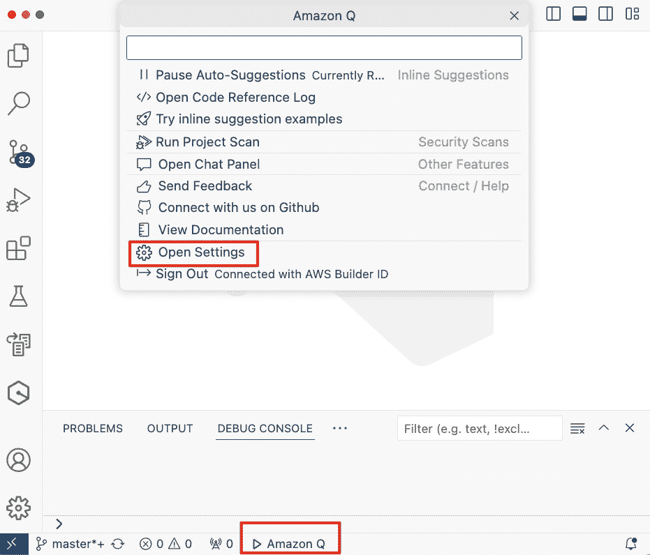
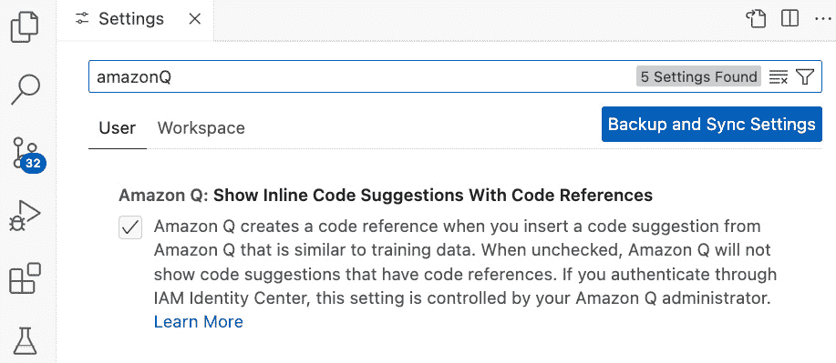
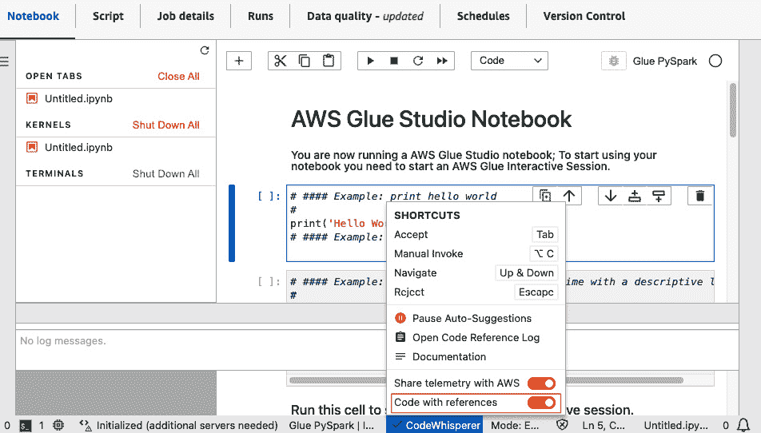
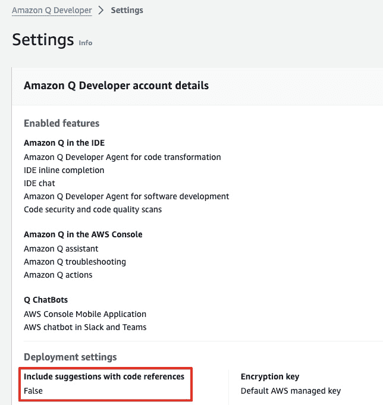
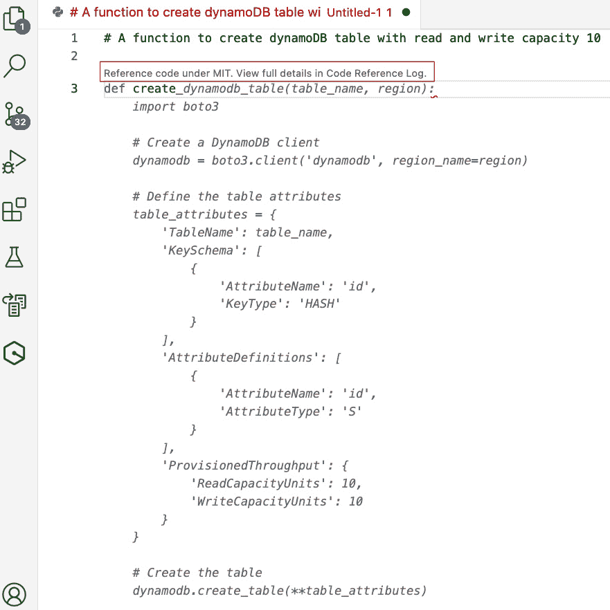
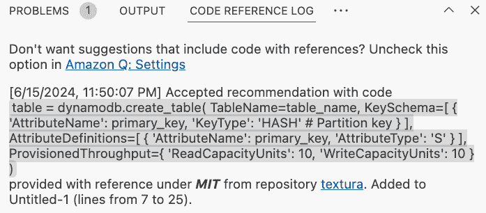

# 第十一章：理解代码引用

在本章中，我们将探讨以下关键主题：

+   什么是代码引用？

+   启用、禁用和退出代码引用

+   代码引用示例

本章将是一个简短的章节，但这个主题值得拥有自己的章节，以免被跳过。因此，让我们直接进入正题。

# 什么是代码引用？

开发引入了创新解决方案；然而，它也带来了遵守许可要求并确保适当归属的责任。未能遵守开源许可证可能导致法律和道德问题，可能损害整个项目的完整性。因此，对于开发者来说，准确识别和管理他们在项目中使用的任何开源代码至关重要。

开源软件许可证

开源许可的主题相当广泛，开源软件在多种许可证下分发，每种许可证都有不同的要求和权限。在本章中，我们不会深入探讨开源许可证的类型及其法律问题。我们鼓励所有开源软件用户在理解和遵守适用许可证方面进行尽职调查。

在其学习过程中，亚马逊 Q 开发者有时会使用开源项目进行训练。偶尔，其建议可能与训练数据中的特定部分非常相似。亚马逊 Q 标记出可能与公开可用代码相似的代码建议。这使得开发者能够查看开源项目仓库的 URL 及其许可证，通过适当添加必要的许可证归属，确保开源代码的负责任集成。

使用参考日志，您可以查看与训练数据相似的代码建议。此外，您还可以更新和编辑亚马逊 Q 提供的代码建议。

在我们通过示例了解代码引用之前，让我们快速看一下如何启用或禁用代码引用，如果需要，完全退出它们。

# 启用、禁用和退出代码引用

打开和关闭代码引用非常简单。不同的 IDE 或工具在亚马逊 Q 设置中都有一个启用/禁用标志。例如，如果您使用 VS Code，您可以从屏幕底部的亚马逊 Q 首选项选项中点击**打开设置**页面。

以下截图在 VS Code IDE 中突出了这一点。

图 11.1 – 亚马逊 Q 开发者 – 设置

一旦您打开**设置**页面，您就可以找到允许您启用和禁用带有代码引用选项的代码建议的复选框，如以下截图所示。

图 11.2 – 亚马逊 Q 开发者 – 启用/禁用代码引用

类似地，启用/禁用代码引用的选项也适用于其他 IDE 和 AWS 工具，其中可以集成 Amazon Q。例如，下面的屏幕截图显示了 AWS Glue Studio 笔记本中可用的**带引用的代码**切换开关。

图 11.3 – Amazon Q Developer – 在 AWS Glue Studio 笔记本中启用/禁用代码引用

如屏幕截图所示，CodeWhisperer 是其重新命名为 Amazon Q Developer 之前的旧名称。如果您想了解如何为其他 IDE 或工具启用和禁用它，例如我们在*第二章*中讨论过的，请参阅本章末尾的*参考文献*部分提供的链接。

有时，组织的管理员可能希望所有开发者都退出代码引用。这可以通过 Amazon Q 控制台设置页面完成，只有管理员才有权限在企业级别退出此设置。

下面的屏幕截图突出了 Amazon Q 控制台设置页面中的退出设置。要再次为所有开发者启用，只需将标志设置为**True**。

图 11.4 – Amazon Q Developer – 从所有中退出代码引用

现在我们通过 VS Code IDE 中的示例来查看代码引用的实际应用。

# 代码引用示例

考虑到您正在构建一个使用 Amazon DynamoDB 作为 NoSQL 数据库的项目。在整个项目过程中，您需要使用 Python 创建一个 DynamoDB 表。因此，您打开了一个支持 Amazon Q Developer 的 IDE；在我们的例子中，我们使用的是 VS Code。

在 IDE 中，我们输入一个提示来创建一个函数，允许 Amazon Q 为我们自动生成创建 DynamoDB 表的代码。当我们开始键入函数时，Amazon Q Developer 的自动建议不仅为我们提供代码建议，还提供了代码引用，顶部指示这个代码样本来自 MIT 许可的训练数据。

在下面的屏幕截图中，我们突出显示了 Amazon Q 提供的这个代码引用。

图 11.5 – Amazon Q Developer – 代码引用

现在，请记住，代码引用并不经常出现。它们仅在 Amazon Q 在其学习期间使用的特定代码建议来自训练数据时才会出现。因此，每次都很难复制它，因为不同的推荐实例可能不会总是基于训练中使用的来选择。

为了便于理解项目中所使用的所有代码引用，代码引用日志将进行统计，以便您可以基于其适当的使用进行分析并采取明智的行动。IDE 中的**代码引用日志**面板将显示所有代码引用。

以下截图在 VS Code IDE 中突出了这一点。

图 11.6 – Amazon Q 开发者 – VS Code IDE 中的代码引用日志

其他 IDE 和 AWS 工具也有类似的机制来跟踪代码引用。有关如何在其他工具中查看 Amazon Q 开发者提供的代码引用的完整列表，可以在*参考文献*部分的链接中找到。

这标志着关于代码引用的简短但重要章节的结束。

# 摘要

在本章中，我们介绍了代码引用是什么以及为什么它们很重要。然后我们探讨了如何从支持 Amazon Q 开发者的不同 IDE 和工具中启用和禁用代码引用。AWS 账户的管理员也可以选择退出代码引用，这样组织就可以控制是否希望开发者在其代码中查看和应用代码引用。

最后，通过一个示例，我们展示了代码引用如何在 IDE 中显示，因为 Amazon Q 开发者提出了一个在训练过程中意外使用的代码建议。所有代码引用也记录在代码引用日志中，以便于分析。

在下一章中，我们将向您介绍 Amazon Q 开发者的一些其他非常重要的功能，这些功能可以显著节省时间并提高开发者的生产力。

# 参考文献

Amazon Q 开发者代码引用：[`docs.aws.amazon.com/amazonq/latest/qdeveloper-ug/code-reference.html`](https://docs.aws.amazon.com/amazonq/latest/qdeveloper-ug/code-reference.html)
