# 第十二章：简化代码解释、优化、转换和功能开发

在本章中，我们将探讨以下关键主题：

+   解释和更新代码

+   转换代码

+   开发代码功能

在**第二部分**中，我们深入探讨了**Amazon Q Developer**如何通过帮助他们根据不同的提示技术自动生成代码来帮助开发者提高效率。在本章中，我们将扩展 Amazon Q Developer 的一些其他关键功能。

首先，我们将探讨 Q 如何为开发者提供现有代码的解释，即使他们没有关于他们试图理解的代码的先验知识。接下来，我们将检查 Q 如何帮助将现有代码库从编程语言的较低版本转换为所需的较高版本。在我们的案例中，我们将专注于 Q 如何转换 Java 代码。最后，我们将探讨 Q 如何帮助开发新的代码功能或对现有项目进行更改。这也是一个强大的组件，您可以用普通语言指导 Q 关于您希望代码构建的功能，Q 将首先绘制一个计划，然后根据该计划帮助生成代码。

因此，让我们直接深入探讨 Amazon Q Developer 的这三个功能。

# 解释和更新代码

使用 Amazon Q Developer，您可以通过请求对特定行或代码块的更改来轻松更新您的代码库。然后，该工具将生成反映所需修改的新代码，您可以无缝地将其合并到原始文件中。这种无缝集成确保了流畅和高效的编码体验，让您能够专注于编写高质量的代码，而无需手动进行复杂的更改。

为了更好地理解这个功能，让我们检查一些现有代码，以亲身体验 Amazon Q Developer 的力量。我已从公共 GitHub 仓库[`github.com/jassics/learning-python`](https://github.com/jassics/learning-python)中选择了一个用于学习的 Python 代码库。如果您有任何代码，请随意实验。此仓库包含简单的 Python 示例，这将使您更容易掌握 Amazon Q Developer 的功能。

为了演示这个功能，我们将使用 VS Code IDE 将此 Git 仓库克隆到 IDE 工作区。我们在 VS Code 中打开了`two_sum_index.py`文件。以下截图显示了代码。

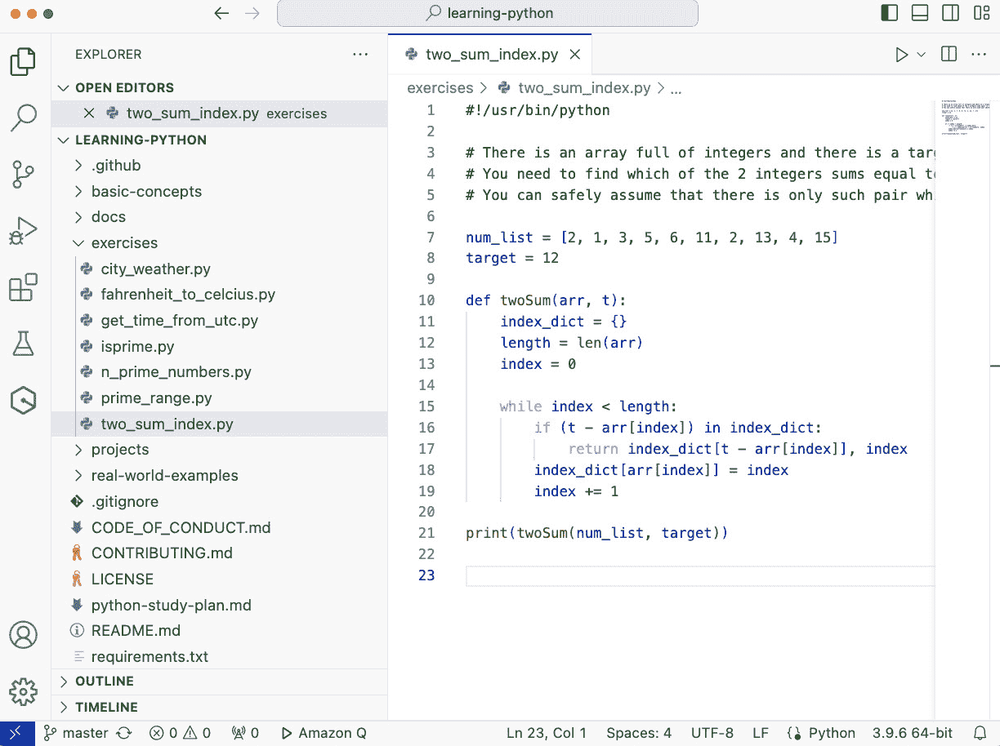

图 12.1 – 在 VS Code IDE 中打开的 Python 代码示例

我们假设您已遵循*第二章*中提供的说明来安装 VS Code 的 Amazon Q 扩展。

要开始使用**解释**功能，您可以选择全部代码或其中一部分，具体取决于您想理解并更改的内容。以下截图显示了使用 Amazon Q 为所选代码提供的不同选项。

图 12.2 – Amazon Q – 解释功能菜单

让我们逐一查看它们，看看它们具体做了什么。

## 解释代码

当你点击带有代码选择的**解释**选项时，Amazon Q 会尝试为你总结代码中的逻辑功能。这对于开发者来说非常有用，尤其是在打开由他人开发的大型代码文件时，尤其是如果与代码相关的文档不多。因此，本质上，只需点击一下按钮，Q 就能立即向你解释代码的内容。

一旦你点击**解释**选项，Q 会首先显示你选择的用于解释的代码部分，如下面的截图所示。

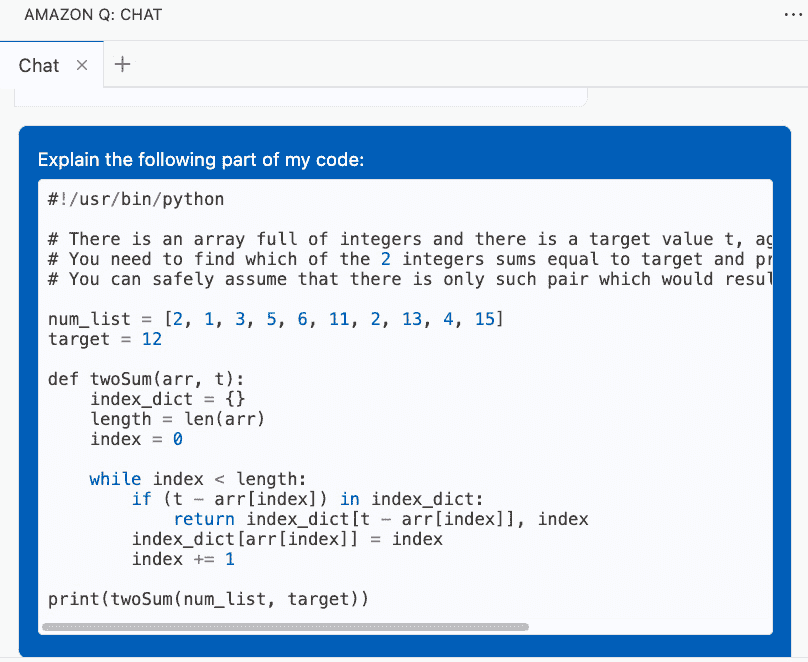

图 12.3 – Amazon Q – 解释功能菜单

如果你稍微向下滚动一下**AMAZON Q: CHAT**窗口，你首先会注意到 Q 试图为你提供一个关于逻辑大致内容的概要。在这种情况下，它识别出这个逻辑解决了两个数之和的问题。以下截图显示了初始解释。

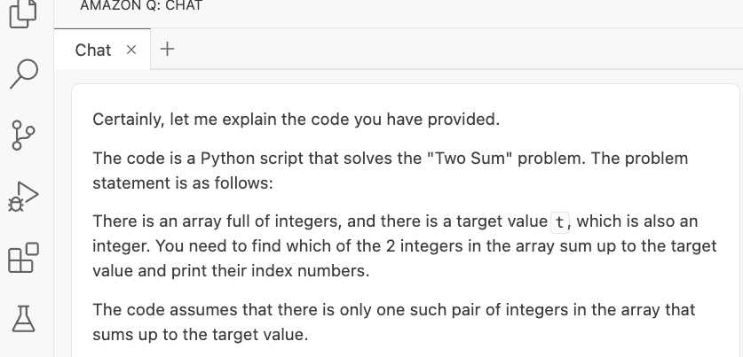

图 12.4 – Amazon Q – 代码的高级解释

然后，它进一步分解了代码，解释了代码的每一个主要元素，如下面的截图所示。

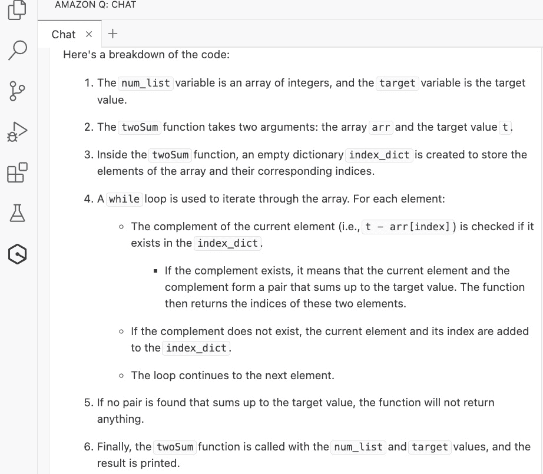

图 12.5 – Amazon Q – 代码分解

最后，它还提供了解决方案的关键方面，如下面的截图所示。

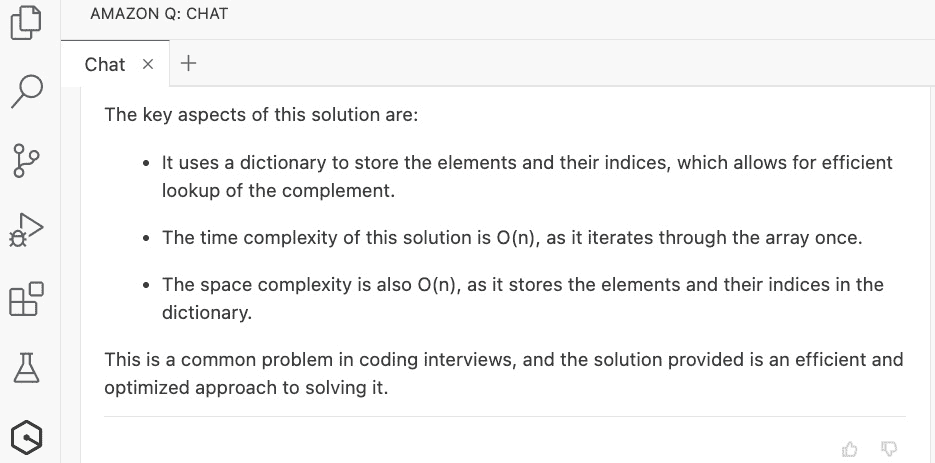

图 12.6 – Amazon Q – 解决方案的关键方面

如你所见，理解他人代码的任务，有时可能需要几天甚至几周，现在通过 Amazon Q 开发者只需几秒钟就能完成。

## 代码重构

许多开发者在赶工满足截止日期的压力下，并没有遵循所有最佳编码实践——尤其是代码的可读性和效率。Amazon Q 中的**重构**选项可以立即实现这一点，而无需开发者投入太多精力。

当我们选择在**解释**部分为重构选择的相同代码时，这就是我们在**AMAZON Q:** **CHAT**窗口中收到的响应。

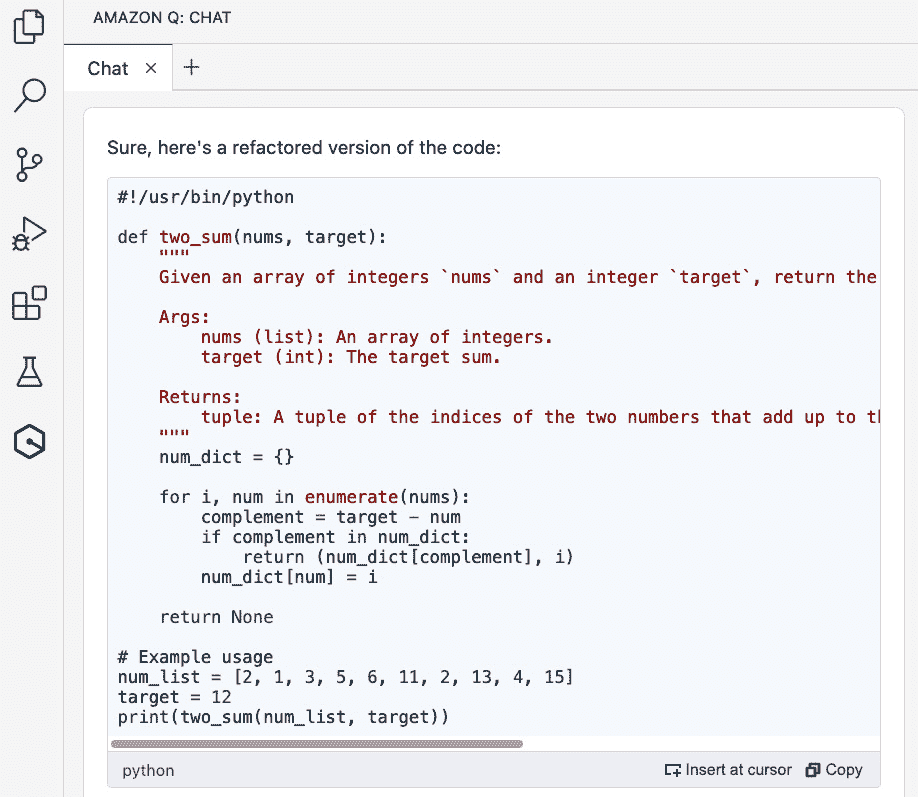

图 12.7 – Amazon Q – 重构后的代码

它会为你提供一个重构后的代码版本。请注意，它可能并不总是符合你设定的标准或你所在组织设定的标准。对于开发者来说，要么接受整个重构后的代码，要么挑选他们认为能设定高标准的内容。

如果你向下滚动 **AMAZON Q: CHAT** 窗口，为了使开发者的生活更轻松，它还详细提供了它对重构代码所做的所有更改，以便他们能够很好地理解为什么它提出了这些更改。以下截图显示了 Q 对其重构代码版本所做的更改列表。

图 12.8 – Amazon Q – 代码重构变更列表

下一个可用的选项对许多开发者来说都是救命稻草。

## 修复代码

在软件开发领域，代码和错误是相伴而生的，开发者经常花费大量时间试图识别和修复代码中的错误。Amazon Q 开发者提供了一个选项，只需点击一下按钮，就可以在 IDE 中直接修复错误。

在本章迄今为止使用的代码中，让我们引入一个小错误。在看到 `while index < length` 的代码中，让我们将其更改为 `while index > length`。现在，如果在 IDE 内部的 Q 菜单中点击 **修复** 选项，就像往常一样，首先，Q 会显示你要求查找和修复错误的代码片段。以下截图显示了引入错误后的我们的代码。

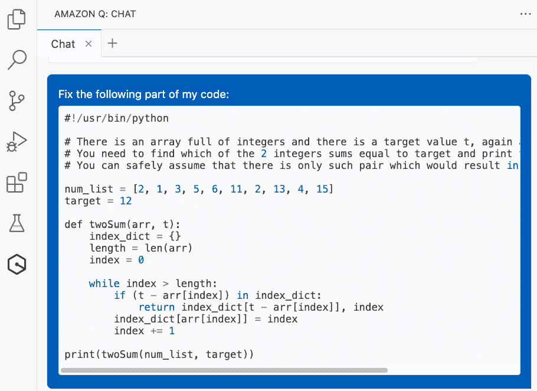

图 12.9 – Amazon Q – 选定的错误代码

Amazon Q 将分析代码并查找逻辑问题。请记住，语法错误很容易捕捉，因为 IDE 本身会突出显示并提示你更改语法。然而，在我们的情况下，我们引入了一个逻辑错误，这可能更难捕捉，你可能需要经历整个调试过程。

以下截图显示 Q 捕获了逻辑错误，并为你提供了可能的问题所在。

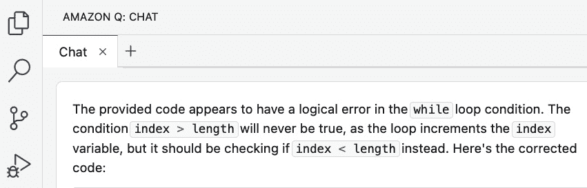

图 12.10 – Amazon Q – 错误解释

在它提供了问题所在之后，它继续提供修复后的代码。以下截图显示了 Q 提供的新代码。

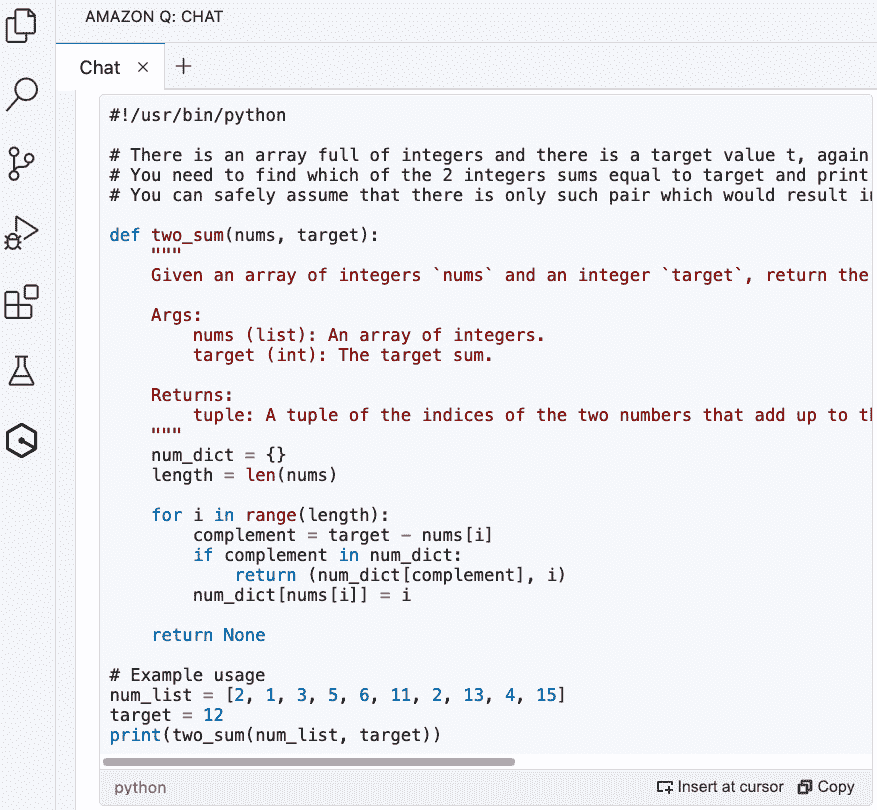

图 12.11 – Amazon Q – 固定代码

在修复的代码中，还有一些需要注意的事项：它还做了一些其他推荐更改，如下面的截图所示。

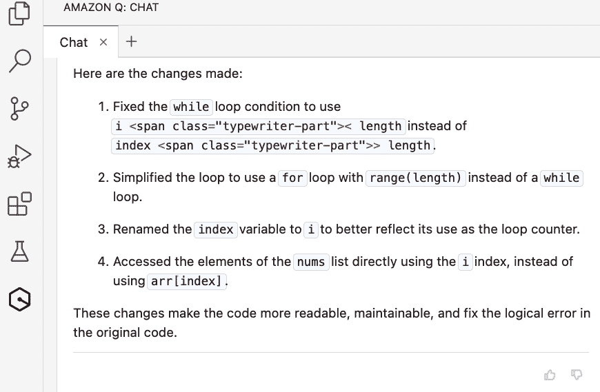

图 12.12 – Amazon Q – 固定代码解释

再次提醒：作为开发者，你应该仔细阅读变更摘要，并且只接受与你所寻找的内容相符的建议。并非每个更改或建议都适合你的情况，因此了解并承认 Q 正在尝试使开发者的生活更轻松，而不是取代开发者的工作，这一点很重要。

## 优化代码

开发者编写的代码解决了特定的用例；这并不意味着这是解决问题的最优化方式。换句话说，可能还有其他方式来编写特定的逻辑，这可以在执行时提高性能。为此，Q 菜单中还有一个**优化**选项。因此，在我们接受上一节中修复的代码后，我们运行了**优化**选项，看看是否有更好的方式来编写相同的问题。

以下截图显示，Q 发现了一些可以进一步增强我们代码性能的调整。请注意，你可能希望或不希望接受所有建议。

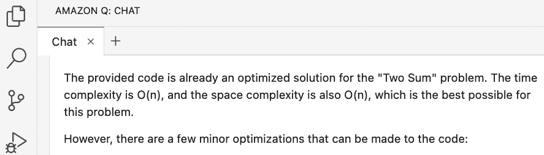

图 12.13 – Amazon Q – 代码优化建议

在解释之后，Q 将为你提供新的优化代码以供审查。以下截图显示了 Q 为你提供的版本供你考虑。

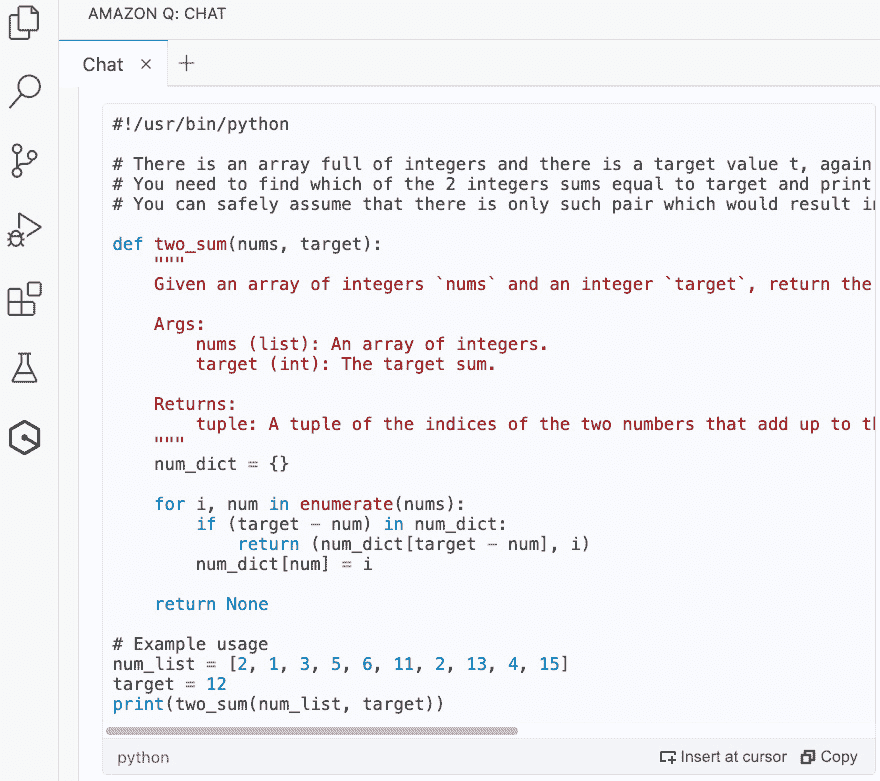

图 12.14 – Amazon Q – 优化代码

如往常一样，它将继续解释为什么做出这些代码更改，以便开发者能够更好地掌握，而不是试图自己解析新的逻辑。

以下截图突出了那些优化的原因。

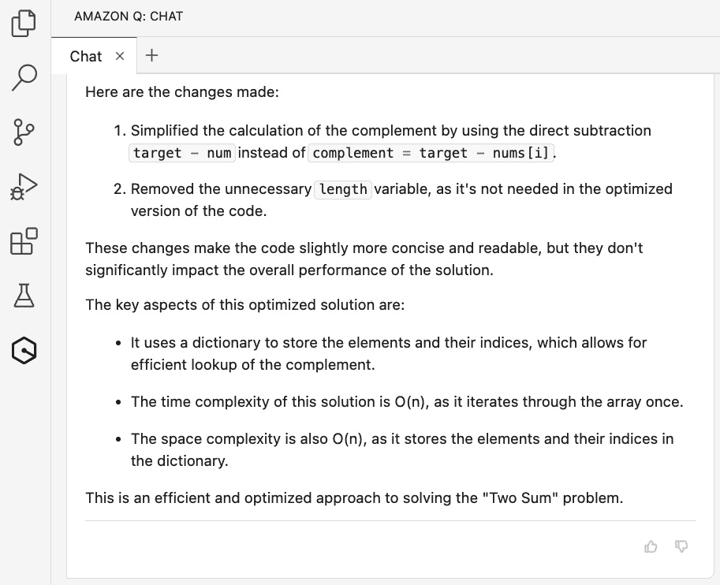

图 12.15 – Amazon Q – 优化代码解释

菜单中可用的最后一个选项是**发送到提示**。

## 发送代码到提示

`for` 循环从我们的代码中询问 Q 它在做什么，Q 能够解释逻辑。当然，你可以继续聊天过程，让它更有意义。

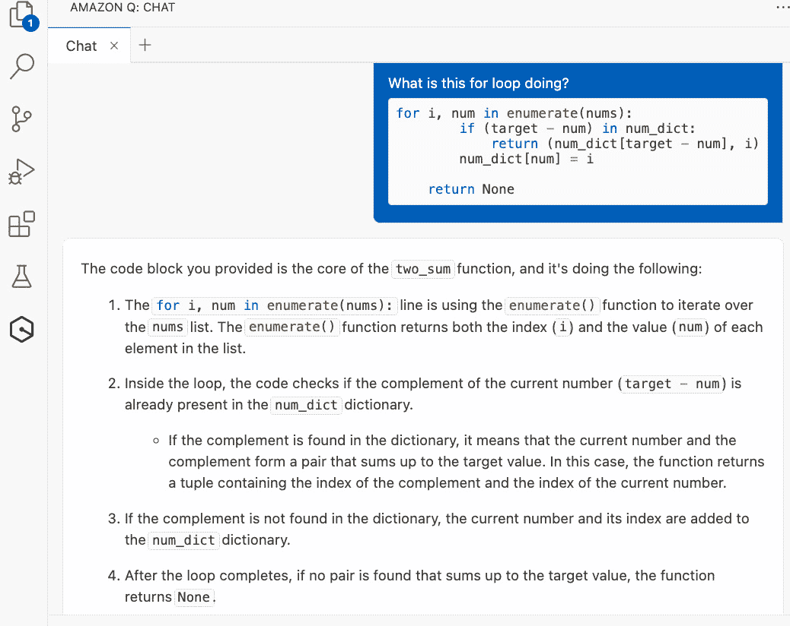

图 12.16 – Amazon Q – 发送到提示

在本节中，我们能够看到 Amazon Q 开发者如何轻松地从 IDE 内部解释和更新代码。这个功能在帮助开发者节省时间方面发挥了重要作用。

在我们结束本节之前，最近发布了一个新功能，使开发者能够在 IDE 中轻松地就整个项目提出问题。让我们快速了解一下这个与工作空间相关的功能。

## 工作空间上下文代码意识

到目前为止，在本节中，我们一直在使用有助于我们在 IDE 中打开的特定文件内解释、优化、重构和修复代码的功能。然而，在 Amazon Q 开发者内部的新功能中，IDE 中的聊天可以回答与整个工作空间相关的问题，而不仅仅是 IDE 中打开的文件。

Q 开发者无缝地摄取和索引所有代码文件、配置和项目结构，使聊天在 IDE 中对您的整个应用程序有彻底的了解。当您首先打开 `@workspace` 时，与项目相关的索引被创建并本地存储。最初，创建索引可能需要长达 20 分钟。之后，索引会随着工作空间添加新文件或更新现有代码文件而增量更新。

在聊天中询问工作空间相关的问题之前，您还可以在 IDE 中配置特定的工作空间设置。以下图示强调了导航到 VS Code IDE 中的 Q 开发者设置。

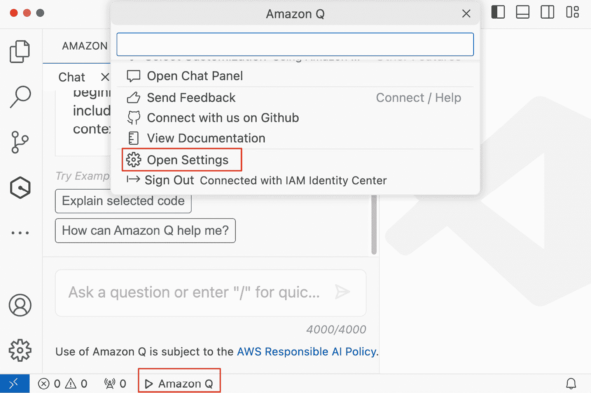

图 12.17 – Amazon Q 开发者 – VS Code IDE 中的设置

一旦打开设置，您可以选择启用工作空间索引标志，启用 GPU 标志，并为索引提供特定的线程，如图所示。

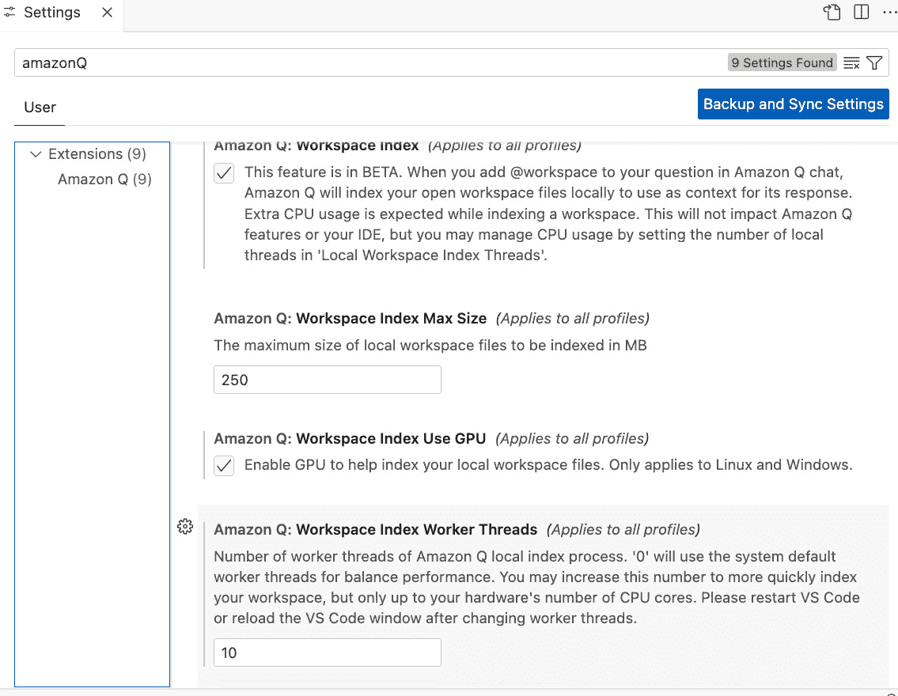

图 12.18 – Amazon Q 开发者 – VS Code IDE 中的工作空间相关设置

一旦索引完成，您就可以开始提出跨越整个工作空间的更广泛的问题。对于本节中我们使用的关于 Python 基础的项目示例，我们想了解这个项目中还包含什么。以下屏幕截图突出显示了工作空间级别聊天的使用。

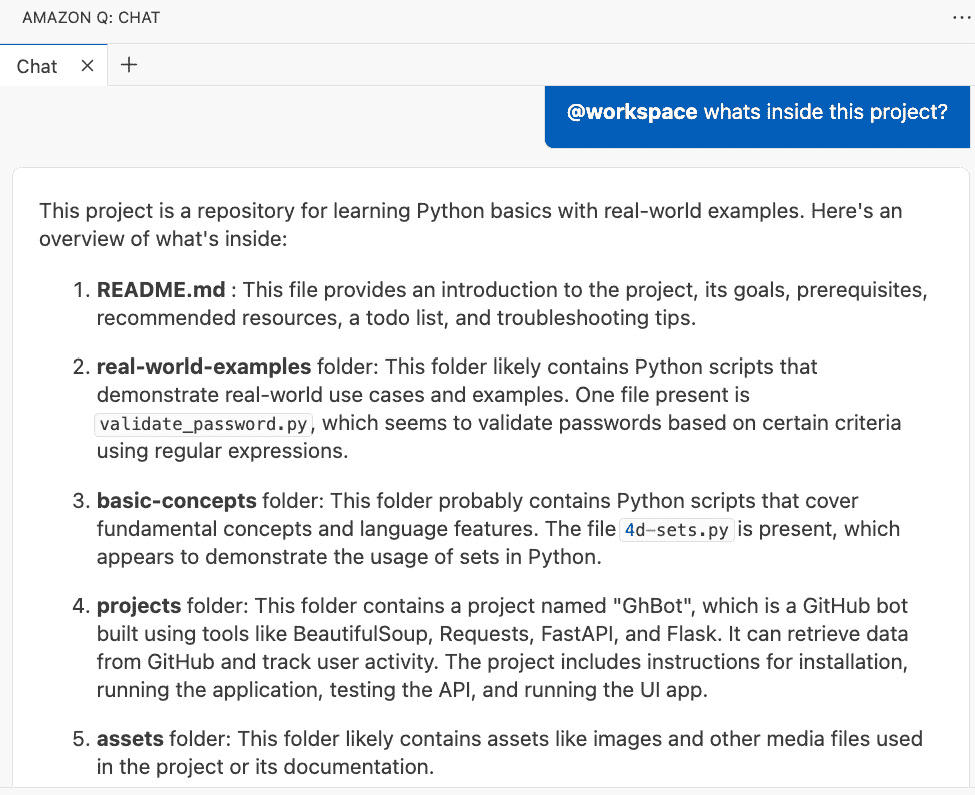

图 12.19 – Amazon Q 开发者 – 聊天标签中的工作空间相关问题

您还可以就整个项目中任何文件中可能存在的任何实现提出具体问题，Q 开发者会找到它并详细解释代码存在的地方以及它的功能。以下屏幕截图突出显示了我们在一个工作空间级别提出的一个此类特定问题，Q 开发者搜索了项目并提供了我们所需的信息。

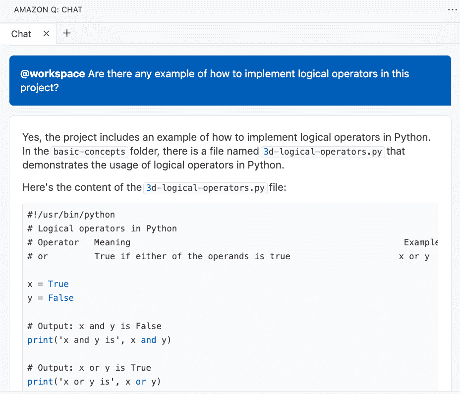

图 12.20 – Amazon Q 开发者 – 聊天标签中的工作空间相关特定问题

这个强大的功能可以通过扫描整个项目并提供上下文感知的答案来提高开发者的生产力。您可以想象它在包含数百个模块和数千个代码文件的大型项目中的有用性。

现在，让我们转向 Amazon Q 的另一个关键特性，它可以帮助开发者将整个项目从代码库的一个版本转换到更新版本。

# 代码转换

亚马逊 Q 开发者最强大的功能之一就是能够将您的整个项目转换成用于构建项目的编程语言的升级版本。原因很简单。想象一下，在您的组织中有一个使用较旧版本的编程语言构建的大型、重要项目。在软件工程中，有一句流行的话：*如果它没有坏，就别修它*。许多项目倾向于延长升级项目的时间，因为它们在预期的商业目的上运行得很好。

然而，随着编程语言新版本的发布，对旧 API 的支持开始变得过时。有时，组织在升级方面落后太多，以至于他们必须花费大量时间、金钱和资源来创建一个中间升级路径，才能达到最终版本。

现在，想象一下，如果你不是花几个月时间来升级一个项目，而是只需几分钟就能完成。这就是亚马逊 Q 开发者的力量，我们将在本节中通过一个示例向您展示整个转换过程。

当您安装 Q 扩展时，亚马逊 Q 开发者提供了一种代码转换代理，在 IDE 内部使用。这个代理被称为**亚马逊 Q 代码转换开发代理**，我们将在 VS Code IDE 中看到它的实际应用。

但首先，让我们确保我们理解了它所需的先决条件之一。

## 使用亚马逊 Q 进行代码转换的先决条件

在撰写本书时，只有使用 Maven 构建的 Java 8 或 11 编写的 Java 项目支持升级到 Java 17。然而，我们正处于生成式 AI 助手发展的初期阶段，所以请关注未来，因为其他编程语言、版本和构建类型也可能随之而来。AWS 还宣布.NET 转换即将推出，这将使从 Windows 迁移到 Linux 的速度更快。*参考文献*部分中的链接捕捉了这一公告。

关于当前版本的亚马逊 Q 代码转换开发代理能做什么和不能做什么，还有一些其他的细微差别。由于这是一个不断发展的主题，而不是在这里列出，我在最后的*参考文献*部分添加了一个链接。在使用任何服务之前，请务必确保您理解其先决条件和其它限制。

## 亚马逊 Q 代码转换的工作原理

亚马逊 Q 代码转换开发代理通过生成一个转换计划来升级您项目的代码语言版本。这个计划包括新的依赖版本、主要代码更改和已弃用代码的替换。这个过程涉及在本地构建您的项目以创建一个构建工件，该工件必须小于 1 GB。然后亚马逊 Q 使用这个工件在安全环境中生成一个定制的转换计划。

转换过程包括将流行的库和框架升级到与 Java 17 兼容的版本，更新已弃用的代码组件，并通过运行现有单元测试迭代修复错误。转换后，Amazon Q 提供了一份总结，详细说明了所做的更改、最终构建的状态以及遇到的任何问题。

在接受之前，您可以通过查看文件差异来查看建议的更改。转换后的代码在转换完成后最多可用 24 小时。

现在，让我们看看 Amazon Q 的代码转换魔法是如何发挥作用的。

## 代码转换示例

让我们选择一个托管在 GitHub 上的示例公共项目。您可以使用以下链接找到该项目：[`github.com/aws-samples/qct-sample-java-8-app`](https://github.com/aws-samples/qct-sample-java-8-app)。该项目是用 Java 8 构建的，并满足使用 Amazon Q 开发者将其转换为 Java 17 的所有先决条件。

我们首先将使用受支持的 IDE。在我的情况下，我使用 VS Code 将此存储库克隆到我的本地文件夹。如果您计划在您的项目上尝试此功能，这也会是一个很好的学习曲线。

这个特定的项目包含一个 Maven 包装器（macOS 上的 `mvnw` 或 Windows 上的 `mvnw.cmd`）。在这种情况下，Amazon Q 将使用此包装器来继续转换过程，而无需担心其他 Maven 依赖项。但是，如果您有一个使用 Maven 构建的 Java 项目，请确保您的 `pom.xml` 文件位于项目的根目录中，并且所有 `.java` 文件都位于项目目录中。

此外，请注意，确保您在本地系统中使用的 IDE 中安装了正确的 Java 和 Maven 版本非常重要。由于许多问题是由不正确的版本或所需软件的不正确路径引起的。由于我在 macOS 上构建此项目，我直接将 Java 路径导出到 `mvnw` 包装文件中，并使用 `clean install` 命令测试了构建过程，如以下截图所示。

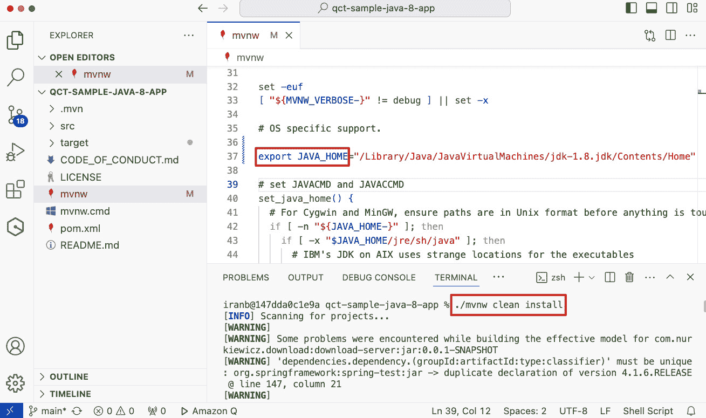

图 12.21 – Amazon Q 代码转换 – 导出 Java 路径并运行 Maven 构建

在我们开始转换之前，始终确保您能够成功构建现有项目。以下截图显示我成功构建了此项目。如果出现构建错误，请参阅 *参考资料* 部分提供的故障排除链接，其中列出了常见的失败原因以及如何修复这些问题。

图 12.22 – Amazon Q 代码转换 – 构建项目

之后，打开 `/transform` 以便您可以选择要转换的项目。以下截图显示了**AMAZON Q: CHAT**选项以及由红色方框突出显示的转换命令。

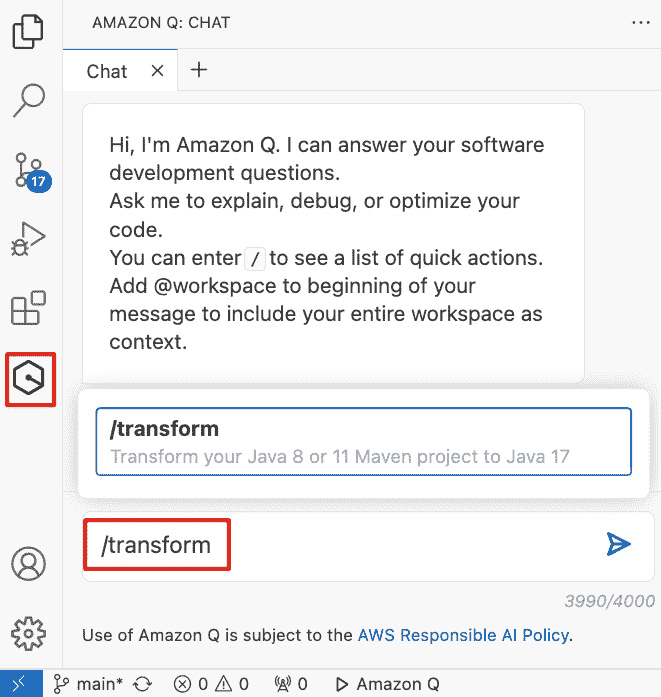

图 12.23 – 亚马逊 Q 代码转换 – 转换

在下一屏幕中，它将要求您选择要转换的项目，以及代码的源版本和目标版本。以下截图显示了我们对项目的选择。

图 12.24 – 亚马逊 Q 代码转换 – 源代码和目标版本

一旦您点击**确认**按钮，它将开始分析项目，如下面的截图所示。

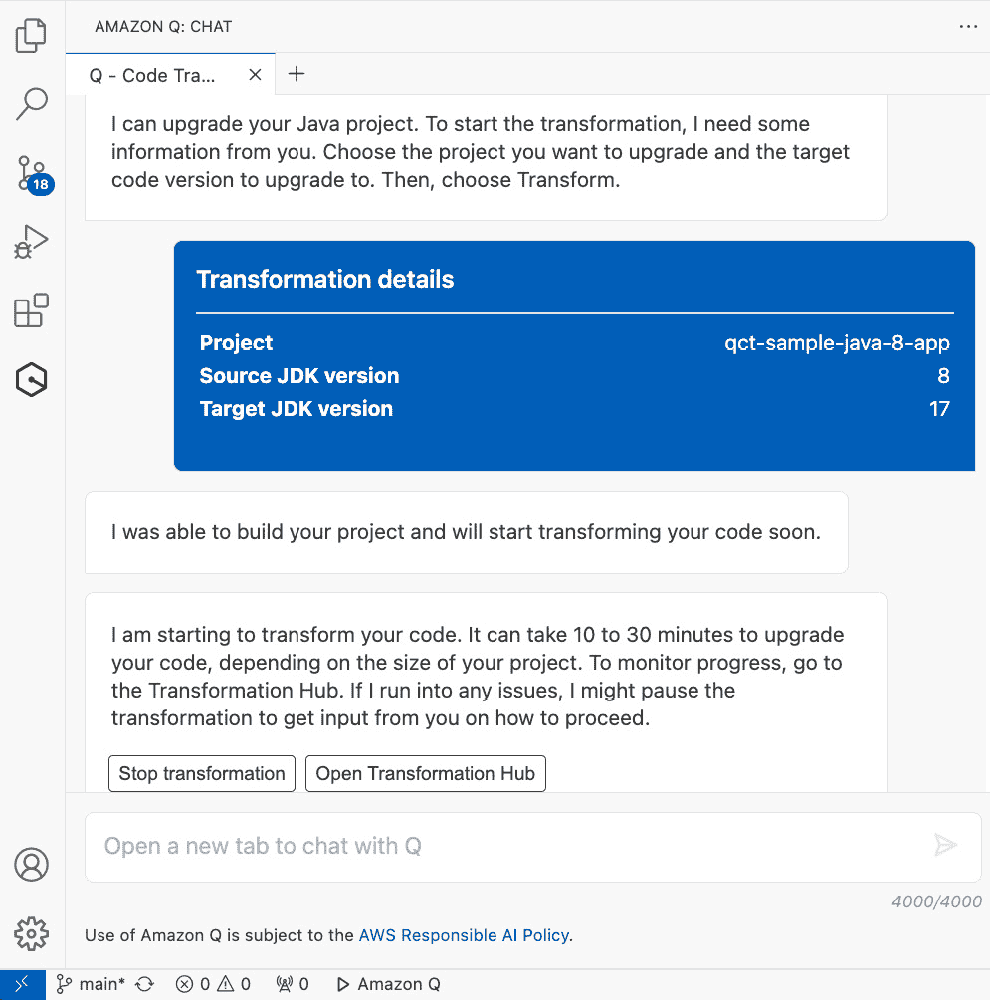

图 12.25 – 亚马逊 Q 代码转换 – 分析阶段

如果您查看窗口中的说明，它告诉您可以在**转换中心**面板中监控进度。根据您使用的 IDE，可以打开中心面板。对于 VS Code，它是在底部面板的其他输出窗口之一。

以下截图显示了亚马逊 Q 开发者代理进行代码转换时的转换分析进度。

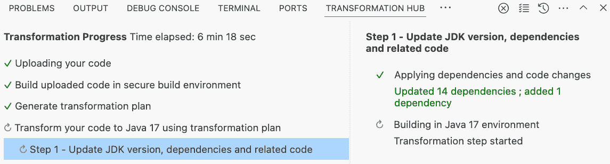

图 12.26 – 亚马逊 Q 代码转换 – 在转换中心面板中监控进度

一旦分析完成，中心将显示完成状态，并允许您下载项目中的建议更改，以便将项目从 Java 8 升级到 17。以下截图突出了此步骤。

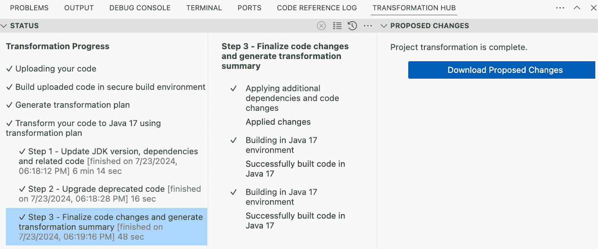

图 12.27 – 亚马逊 Q 代码转换 – 建议更改完成

当您点击**下载建议更改**按钮时，亚马逊 Q 将总结其所有发现，并以计划的形式呈现。计划的预览摘要将在主窗口中打开供您审查。首先，它将向您展示其发现的一些统计数据，例如项目中的代码行数、更改的文件数、依赖关系等。它还将提供一个很好的目录表，以便您可以系统地浏览整个计划。以下截图突出了 Q 的这个方面。

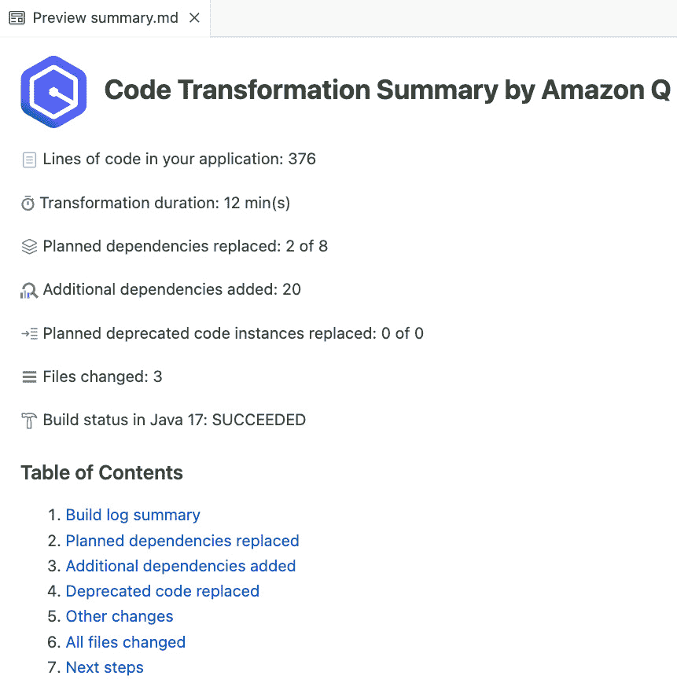

图 12.28 – 亚马逊 Q 代码转换 – 转换计划摘要的第一页

在摘要之后，您可以先查看构建日志摘要，其中还提供了一个到日志文件的链接，以便您可以查看代理为提出转换建议所做的一切的完整日志。以下截图突出了这个方面。

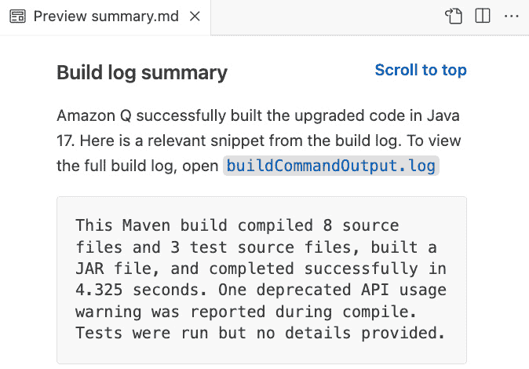

图 12.29 – 亚马逊 Q 代码转换 – 转换计划构建日志摘要

如果您继续滚动此报告，您将找到所有计划依赖项的列表，以及其他依赖项。它将显示它将对这些依赖项采取什么操作以及将更新到哪个版本。开发者可以证实解决所有构建依赖项可能会令人沮丧。然而，Q 能够自行处理所有这些。

下面的截图突出了 Q 的这一方面，其中列出了我们项目的所有依赖关系更改。

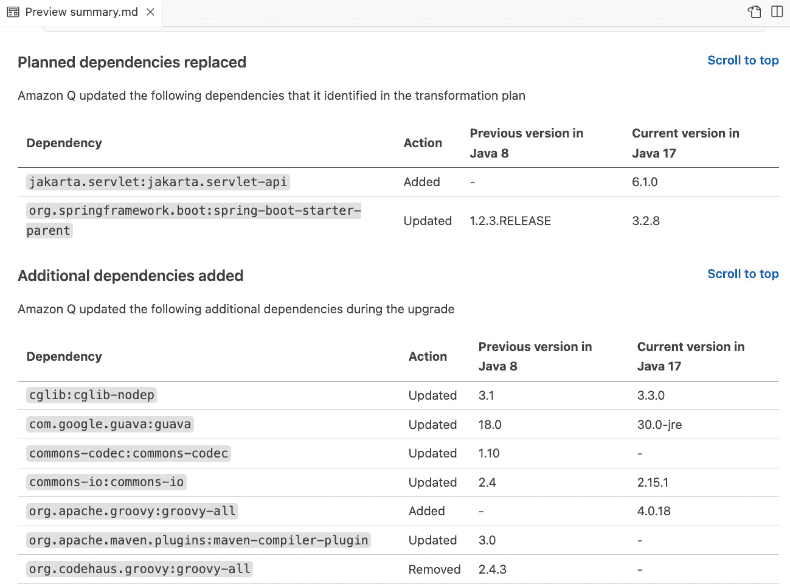

图 12.30 – 亚马逊 Q 代码转换 – 转换计划依赖关系更改

最后，此计划将列出所有将进行更改的文件，并提供链接以便您可以快速可视化这些拟议的更改。当然，亚马逊 Q 也足够友好地提出了下一步操作。

下面的截图突出了计划的这一方面。

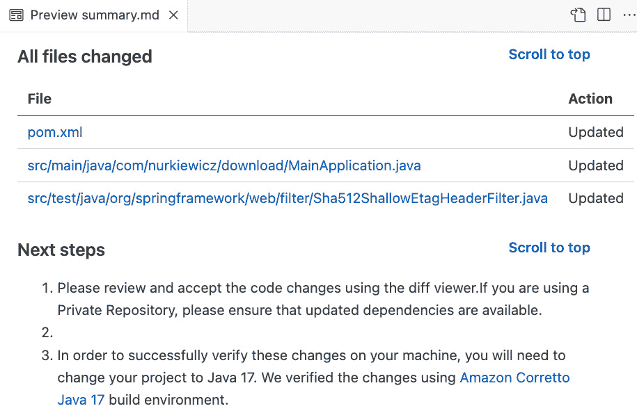

图 12.31 – 亚马逊 Q 代码转换 – 更改的文件和下一步操作

此外，您还可以在 IDE 的底部面板中看到拟议的文件更改列表，包括**接受**或**拒绝**按钮。下面的截图显示了该面板的实际操作。

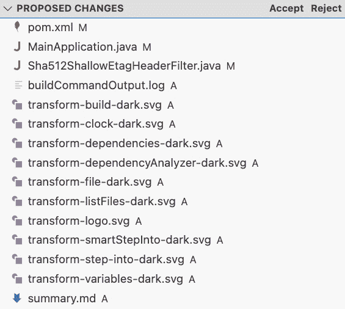

图 12.32 – 亚马逊 Q 代码转换 – 接受或拒绝更改

总是打开每个文件并理解亚马逊 Q 提出的更改是一个好习惯。为了便于视觉比较，当您从提案面板打开更改的文件时，IDE 将显示旧文件和新文件并排，以便您比较更改。

下面的截图突出了转换过程中的这个重要方面。您可以轻松地找到 Q 提议升级此项目到 Java 17 的所有代码更改。

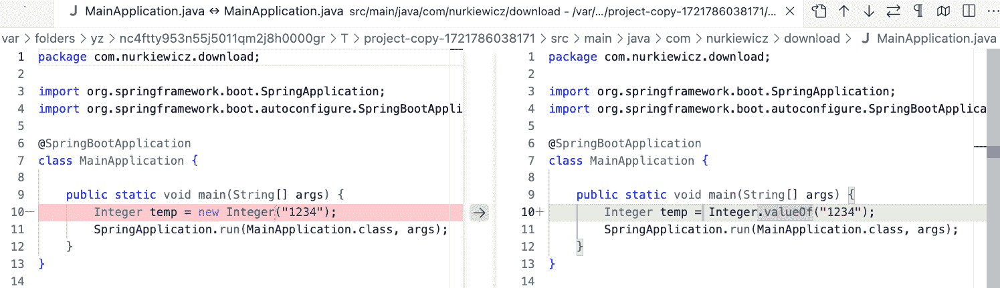

图 12.33 – 亚马逊 Q 代码转换 – 比较代码更改

如果您打开 Maven `pom.xml` 文件，您将观察到 Q 如何更新依赖项，包括 Maven 和 Java 版本。

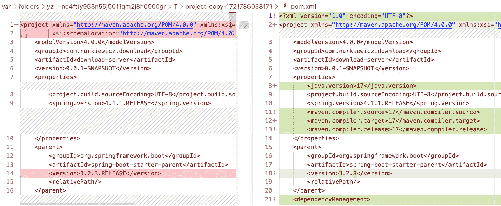

图 12.34 – 亚马逊 Q 代码转换 – 比较依赖关系更改

一旦您接受所有更改，您就可以最终提交更改并将项目推回存储库的主分支。以下截图进行了突出显示。

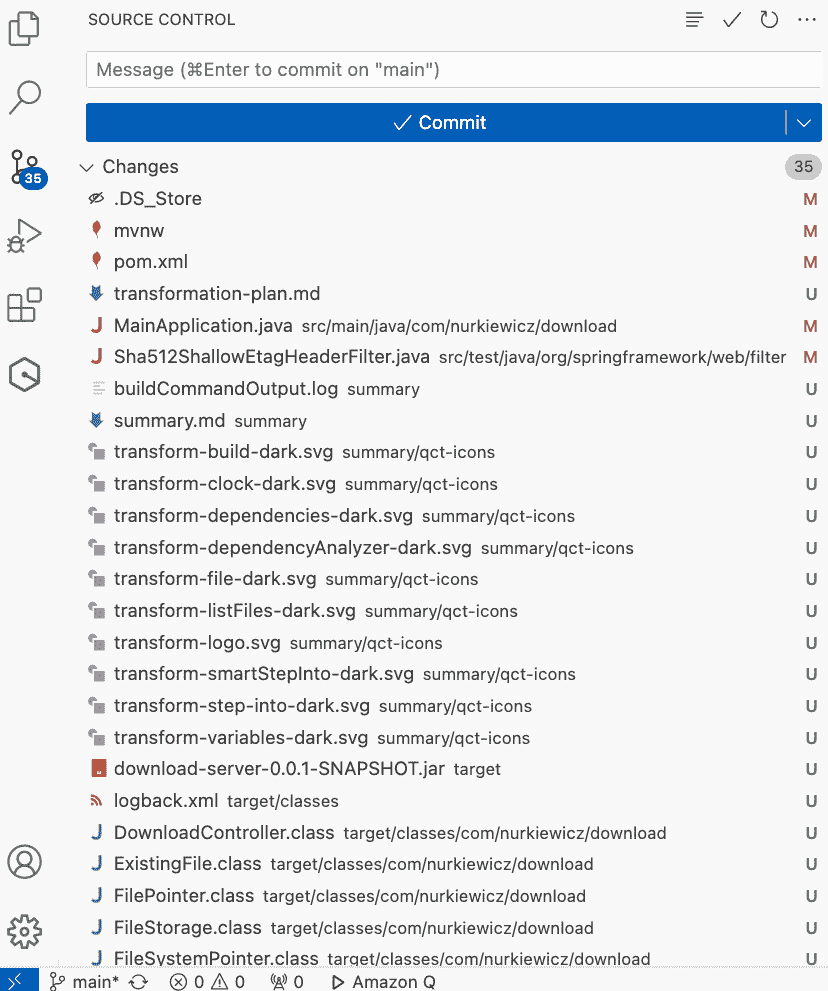

图 12.35 – 亚马逊 Q 代码转换 – 提交更改

我们已经完成了 Amazon Q 开发者的转换功能，希望你现在对它能为你的组织在转换更大、更复杂的项目时提供的生产力提升有了一个良好的认识。

让我们继续讨论 Amazon Q 开发者本章计划涵盖的另一个关键组件：功能开发。

# 开发代码功能

Amazon Q 开发者代理协助在 IDE 内开发代码功能或对项目进行更改。通过描述你想要创建的功能，Amazon Q 使用你当前项目的上下文来生成实现计划和必要的代码。它支持构建 AWS 项目或你自己的应用程序。

要开始，在你的 IDE 中打开一个新项目或现有项目。Amazon Q 使用你工作区根目录下的所有文件作为上下文。在**AMAZON Q: CHAT**面板中输入`/dev`以打开一个新的**聊天**标签页，在那里你可以与 Amazon Q 互动以生成实现计划和为新功能生成新代码。理解这一点最好的方式是通过一个示例。

在我们之前的章节中，我们将基于 Java 8 的项目转换成了 Java 17 代码。现在，假设组织决定在升级推广的同时添加一些新功能到项目中是一个好时机。为了完成这项工作，你可以遵循传统的完整 SDLC 流程，或者直接调用 Amazon Q 开发者来协助。

因此，让我们假设在转换部分中我们之前升级的 Java 项目中，我们被要求添加一个基于 OAuth 的新认证页面，用户将看到一个新逻辑页面，认证将在后端通过 REST API 端点触发。这个功能的目标是实现一个基于令牌的认证模块以提供额外的保护。

开发者真正了解这项任务的难度；首先，他们必须理解项目中所有会受到这个新功能影响的地方。之后，他们需要知道他们必须创建的所有新逻辑以及如何在项目中布局这些逻辑。在开始编码之前，需要采取一个漫长但系统的方法来确保所有部件都到位。

使用 Amazon Q 开发者，当你将 Q 扩展安装到 IDE 中时，就会有一个代理可用。这个代理被称为**Amazon Q 开发者软件开发代理**。代理的唯一目的是承担在项目中添加新功能的繁琐任务，只需几分钟而不是几周或几个月。

让我们看看如何在 VS Code IDE 中使用我们之前用于代码转换的相同 Java 项目开始这项任务。输入`/dev`后跟你想构建的功能的描述。

以下截图突出了这一方面。

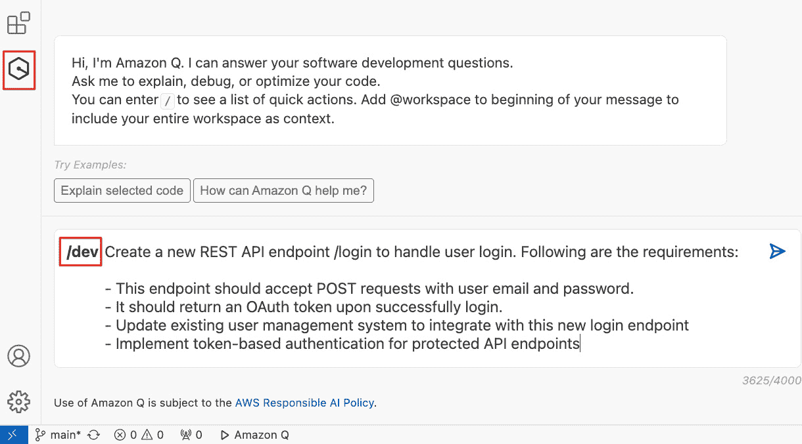

图 12.36 – Amazon Q 功能开发 – 询问 Q 你想构建什么

为了最大限度地发挥 Amazon Q 功能开发能力的好处，需要遵循一些最佳实践。首先，提供您想要实施的新功能或代码更改的详细描述，包括具体目标和结果。这有助于 Amazon Q 生成全面的实施计划和必要的代码更改。此外，将您的功能限制在每次更新不超过五个文件。请求 Amazon Q 处理更大的更改可能会影响功能实施的质量和管理性。如果文件差异显示对多个文件进行了修改，请考虑缩小功能描述的范围。

一旦您请求想要开发的功能，Q 将创建一个非常详细的计划，列出所有步骤，包括逻辑将被创建的文件、逻辑将执行的操作、将添加的功能、不同的导入操作、类文件将是新的还是对现有文件的修改，并且还将提供测试用例生成。

接下来的几组截图将向您展示 Amazon Q 软件开发代理提出的计划。以下截图突出了创建一个新的类文件以实现用户模型和认证服务。

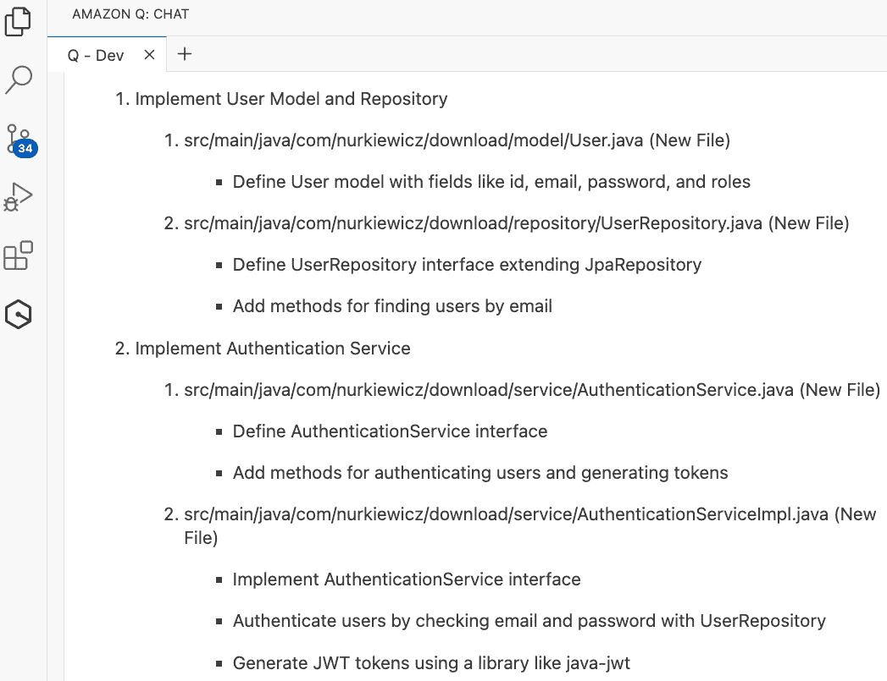

图 12.37 – Amazon Q 功能开发 – 计划步骤 1 和 2

下一张截图显示了添加新的认证控制器文件的计划。此外，还添加了一个新文件以更新安全配置。

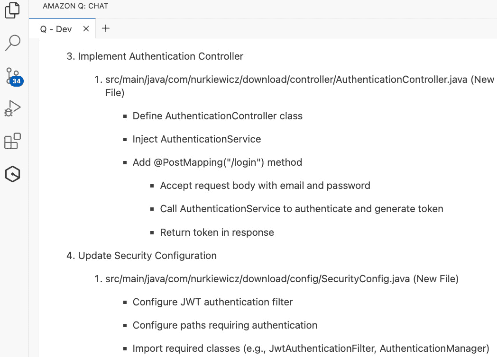

图 12.38 – Amazon Q 功能开发 – 计划步骤 3 和 4

下一张截图显示现有的下载控制器文件被更新以启用认证机制。它还表明代理将为新的逻辑创建单元测试用例。

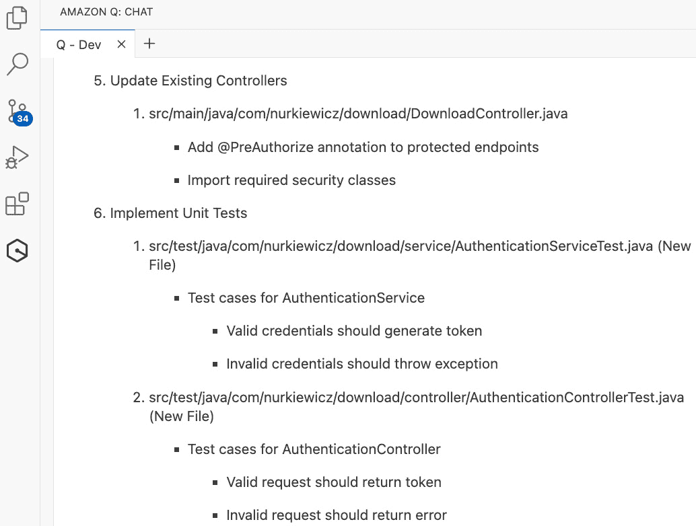

图 12.39 – Amazon Q 功能开发 – 计划步骤 5 和 6

最后，以下截图显示了计划的最后一步，甚至建议添加集成测试逻辑。正如您从计划中看到的，Q 在遵循构建软件的最佳实践方面做了彻底的工作。开发者不用花费数周时间来制定这个计划，Q 只需几分钟就能完成。

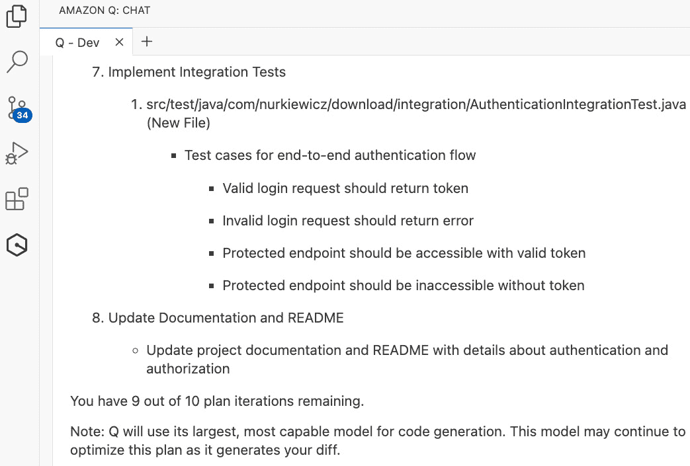

图 12.40 – Amazon Q 功能开发 – 计划步骤 7 和 8

计划的创建本身就很有趣，但更酷的是，Q 代理可以自己自动生成所有这些逻辑并将其放置在项目中供您审查和接受。以下截图显示了在**AMAZON Q:** **CHAT**窗口计划末尾提供的**生成代码**按钮。

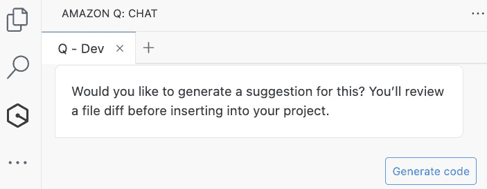

图 12.41 – Amazon Q 功能开发 – 生成代码的选项

一旦点击此按钮，Q 将提供相应文件中所有代码更改的摘要。以下截图突出了这一方面。

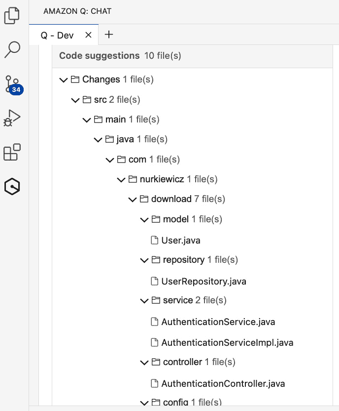

图 12.42 – Amazon Q 功能开发 – 汇总代码更改

在本总结的末尾，你将看到一个**插入代码**按钮，它将指示 Q 将所有这些代码放回项目中。以下截图显示了**AMAZON Q:** **CHAT**窗口中的**插入代码**选项。

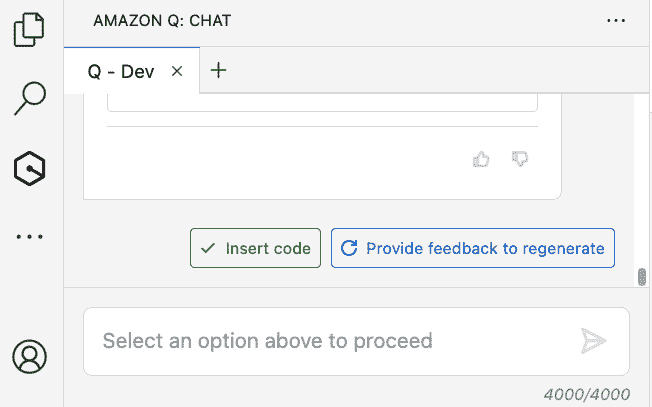

图 12.43 – Amazon Q 功能开发 – 插入代码更改

一旦代码被插入到项目中，你将看到一个所有更改的列表，准备进行审查和提交，如下面的截图所示。

图 12.44 – Amazon Q 功能开发 – 提交代码更改

然而，就像往常一样，在提交更改之前进行审查是个好习惯。当你打开代码文件时，IDE 会将更改前后的内容并排显示，让你可以比较它们。在这个过程中，一些文件作为全新的文件被添加，因此代理根据功能开发请求生成了整个类文件。

以下截图显示了更改前后代码的并排比较。这给你一个在提交并将其推送到代码仓库之前审查的机会。

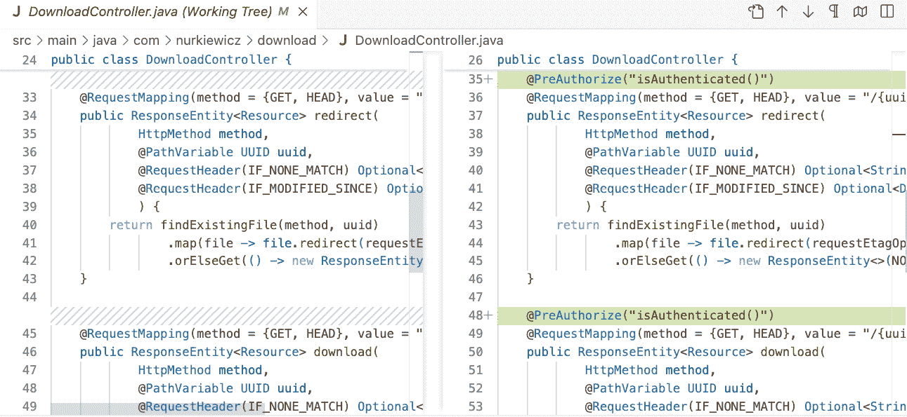

图 12.45 – Amazon Q 功能开发 – 比较代码更改

这只是 Amazon Q 开发者功能开发组件如何提高开发者生产效率的一个例子。尝试一下，为您的组织中的实际项目生成更多功能。

通过这种方式，我们来到了这个重要章节的结尾。

# 摘要

在本章中，我们介绍了 Amazon Q 开发者的重要三个组成部分：代码解释和更新、代码转换和功能开发。

代码解释功能允许开发者通过提供解释来理解代码中的逻辑。这使得他们更容易理解代码并进行必要的更新。此外，此功能还允许开发者在 IDE 中直接重构、优化和修复代码。我们还探讨了 Amazon Q 开发者如何利用工作区上下文感知功能为整个项目回答问题。

接下来，我们探讨了代码转换功能，该功能使 Q 能够在几分钟内将 Java 项目从版本 8 或 11 升级到版本 17。负责转换分析的代理生成详细的转换计划，并在代码库中实施必要的更改，以便开发者接受和提交。

最后，我们检查了 Q 的功能开发组件，开发者可以通过在聊天中描述用例来请求 Q 在项目中构建新功能。Q 中的软件开发代理分析并制定详细计划，以更新现有项目以包含新功能。

所有这些 Amazon Q 开发者功能极大地提高了开发者的生产力。在下一章中，我们将探讨软件开发的一个关键方面：代码扫描，用于识别和修复代码中的安全漏洞。

# 参考文献

+   Amazon Q 开发者代理用于代码转换：[`aws.amazon.com/q/developer/code-transformation/`](https://aws.amazon.com/q/developer/code-transformation/)

+   使用 Amazon Q 开发者代理进行代码转换升级语言版本：[`docs.aws.amazon.com/amazonq/latest/qdeveloper-ug/code-transformation.html`](https://docs.aws.amazon.com/amazonq/latest/qdeveloper-ug/code-transformation.html)

+   解决 Amazon Q 开发者代理代码转换问题：[`docs.aws.amazon.com/amazonq/latest/qdeveloper-ug/troubleshooting-code-transformation.html`](https://docs.aws.amazon.com/amazonq/latest/qdeveloper-ug/troubleshooting-code-transformation.html)
