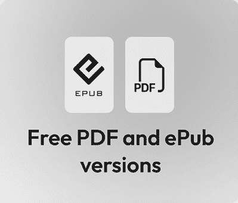

# 前言

**欢迎您使用 GitHub Copilot 进行编码相关工程任务的学习之旅。我们很兴奋地向您展示其工具集以及它是如何扩展我们常规工作流程的。**

**GitHub Copilot 对科技行业产生了深远的影响，从帮助工程师更快地实施代码更改到帮助利益相关者和产品所有者更轻松地描述他们的需求。无论您在编码方面有多少经验——GitHub Copilot 为每个人提供帮助，支持软件开发生命周期的所有阶段。这使得生成代码更改、添加测试以及编写部署管道变得更加容易。想要了解更多关于编码实践的知识？GitHub Copilot 是您的同行编程助手，可以向您解释所有这些内容。**

**利用 GPT-5、Gemini、Claude Sonnet 等基础语言模型，GitHub 在您最喜欢的编辑器中添加了众多智能功能，包括 VS Code、Eclipse、Visual Studio、JetBrains IDEs 等。除此之外，在 GitHub.com 上还有一个额外的支持领域，那里是工程过程发生的地方：从一般研究到问题创建，再到添加代码、提交拉取请求以及帮助调试您的管道问题。GitHub Copilot 将所有这些步骤整合到开发者工作流程中。**

**加入我们，了解有关 GitHub Copilot 的所有信息，我们将引导您通过作者在过去几年中用来培训数千名工程师的学习曲线。**

# 这本书面向谁

这本书适合任何从事应用创建工作并希望在现实世界的编码环境中利用 GitHub Copilot 的人。无论您是想要加快学习进程的初学者，还是希望提高生产力的资深工程师，本指南都展示了如何有效地使用 Copilot。

软件工程师、DevOps 专业人士、QA 专家和技术负责人将发现如何通过人工智能辅助工作流程简化编码、审查和交付。产品经理和其他协作人员也将了解如何利用 GitHub Copilot，他们自己也能从中受益。

# 本书涵盖内容

*第一章* ，*GitHub Copilot 解释*，概述了 GitHub Copilot 及其功能，从建议到聊天界面，并展示了它们如何影响我们的日常工程流程。

*第二章* ，*开始使用生成式 AI*，为理解生成式 AI 是什么以及它不是什么提供了基础——从语言模型的基础到这些功能如何应用于工程过程。

*第三章* ，*选择合适的 GitHub Copilot 订阅计划*，概述了您为 GitHub Copilot 可用的不同订阅选项以及为什么您会选择其中一个而不是另一个。

*第四章* ，*在您的 IDE 中精通 GitHub Copilot：内联建议、聊天和代理模式*，深入探讨了 GitHub Copilot 在您最喜欢的编辑器中的功能。

*第五章* ，*超越代码：使用 GitHub Copilot 进行调试、终端和协作*，介绍了在了解工具的主要功能之后的下一步，并展示了如何将智能集成到开发过程的其余部分。

*第六章* ，*在 GitHub.com 上与 GitHub Copilot 协作：问题、PR、审查和编码代理*，介绍了 GitHub.com 网页界面中内置的强大功能，例如在问题和拉取请求上进行协作，以及触发编码代理以让 GitHub Copilot 创建实现所需功能更新所需的代码更改。

*第七章* ，*使用模型上下文协议（MCP）扩展 GitHub Copilot*，展示了 MCP 服务器如何为代理模式中的聊天界面添加额外的上下文，以便您可以读取和写入外部系统。

*第八章* ，*GitHub Copilot 的学习曲线导航*，讨论了 GitHub Copilot 所具有的学习曲线，因为这不仅仅是你工具箱中的新工具。我们展示了如何应对学习曲线，以便你和你的团队成员能够充分利用 GitHub Copilot。

*第九章* ，*建立内部 GitHub Copilot 社区*，解释了我们人类如何通过观察他人使用我们拥有的工具来学习得最好，以及您如何围绕 GitHub Copilot 建立一个内部社区，以持续自我教育和解锁下一个熟练程度的层次。

*第十章* ，*改变叙事：用 AI 重新构思工程*，讨论了在工程流程中使用 AI 作为我们自身肌肉记忆的完全重连，以及如何以这种方式思考以获得 GitHub Copilot 的最大效益。

# 要充分利用这本书

您需要以下内容来阅读这本书：

+   对软件开发生命周期的基本理解

+   使用代码编辑器与您的代码库进行一些经验

+   在 GitHub.com 上使用问题和拉取请求流程

## 使用的约定

在本书中使用了多种文本约定。

`CodeInText`：表示文本中的代码单词、数据库表名、文件夹名、文件名、文件扩展名、路径名、虚拟 URL、用户输入以及 X/Twitter 用户名。例如：“您可以使用`/explain #symbol`来请求对光标下仅有的函数或符号的解释，而不是整个文件。”

代码块设置如下：

```py
test('generates password of correct length', () => {
  expect(generatePassword(10)).toHaveLength(10);
}); 
```

**粗体**：表示新术语、重要词汇或您在屏幕上看到的词汇。例如，菜单或对话框中的文字会以这种方式显示。例如：“在**权限**下，点击**添加权限**，然后选择**Copilot 请求**。”

警告或重要注意事项如下所示。

小贴士和技巧如下所示。

# 联系我们

我们始终欢迎读者的反馈。

**一般反馈**：如果您对本书的任何方面有疑问或有任何一般性反馈，请通过[customercare@packt.com](https://www.packtpub.com/en-us/help/contact)发送电子邮件，并在邮件主题中提及本书的标题。

**勘误表**：尽管我们已经尽一切努力确保内容的准确性，但错误仍然可能发生。如果您在这本书中发现了错误，我们将不胜感激，如果您能向我们报告，我们将非常感谢。请访问[`www.packt.com/submit-errata`](http://www.packt.com/submit-errata) ，点击**提交勘误**，并填写表格。

**盗版**：如果您在互联网上以任何形式发现我们作品的非法副本，如果您能提供位置地址或网站名称，我们将不胜感激。请通过`copyright@packt.com`与我们联系，并提供材料的链接。

**如果您想成为一名作者**：如果您在某个领域有专业知识，并且对撰写或参与书籍感兴趣，请访问[`authors.packt.com/`](http://authors.packt.com/)。

# 分享您的想法

一旦您阅读了《GitHub Copilot 手册》，我们很乐意听到您的想法！请[点击此处直接访问此书的亚马逊评论页面](https://packt.link/r/1806116634)并分享您的反馈。

您的评论对我们和科技社区非常重要，并将帮助我们确保我们提供高质量的内容。

# 与您的书籍一起获得免费福利

本书附带免费福利以支持您的学习。现在激活它们以获得即时访问（有关说明，请参阅“*如何解锁*”部分）。

这里是关于您购买后可以立即解锁的内容的快速概述：

| **PDF 和 ePub 副本** | **下一代基于 Web 的阅读器** |
| --- | --- |
|  |  |
|  | 访问此书的无 DRM PDF 副本，在任何设备上阅读。 |  | **多设备进度同步**：在任何设备上继续您上次停止的地方。 |
|  | 使用您喜欢的电子阅读器的无 DRM ePub 版本。 |  | **高亮和笔记**：捕捉想法并将阅读转化为持久的知识。 |
|  |  |  | **书签**：在需要时保存并重新访问关键部分。 |
|  |  |  | **深色模式**：通过切换到深色或棕褐色主题来减少眼睛疲劳。 |

|

## 如何解锁

扫描二维码（或访问 packtpub.com/unlock）。通过书名搜索此书，确认版本，然后按照页面上的步骤操作。 |  |

| **注意** *：请妥善保管您的发票。直接从 Packt 购买的商品不需要发票。* |
| --- |
