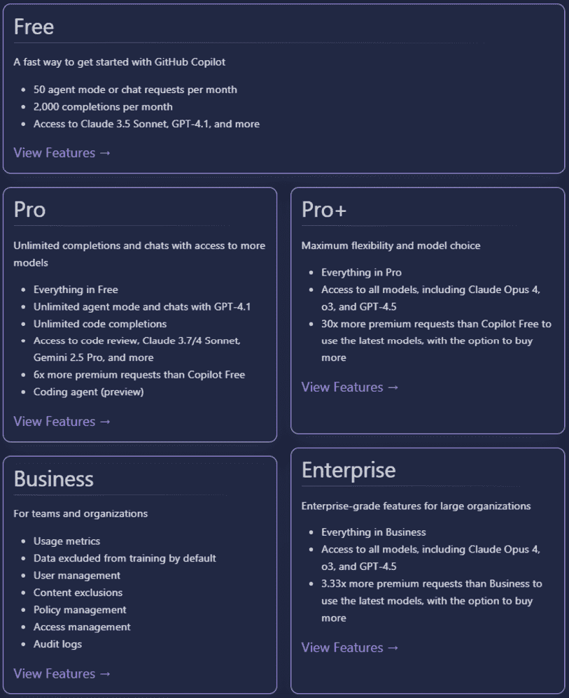
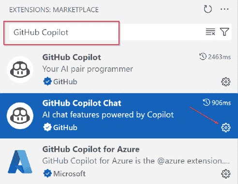
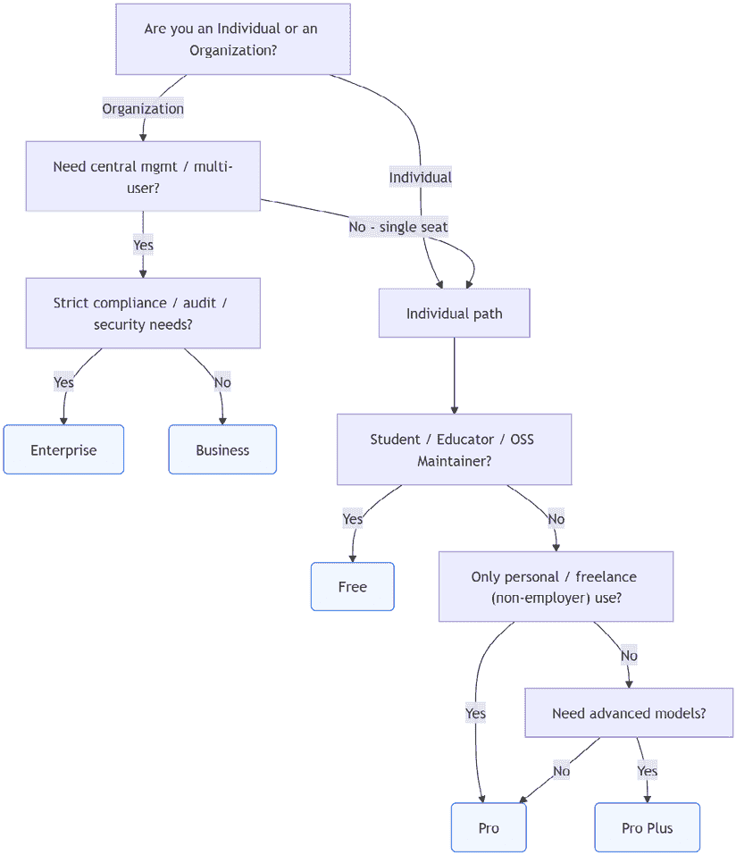
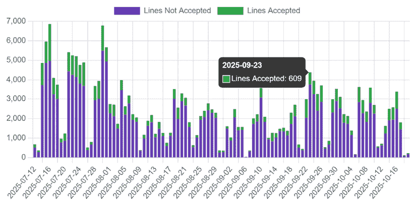
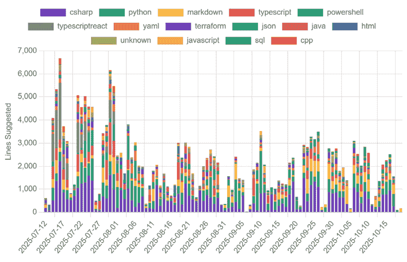
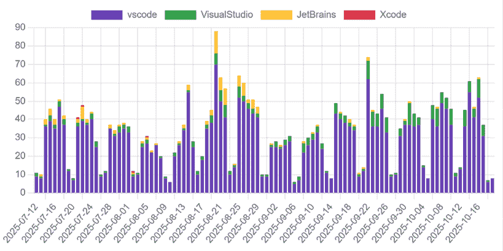
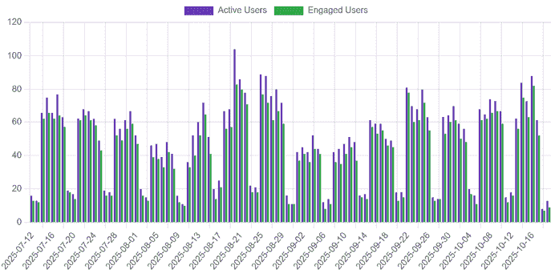
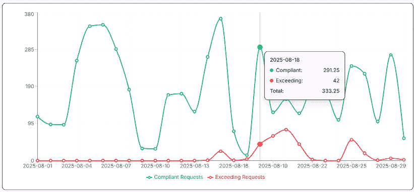

# 第三章：选择合适的 GitHub Copilot 计划

选择合适的 GitHub Copilot 计划不仅仅是勾选框的问题。它关乎将强大的 AI 工具与您的独特需求、工作流程以及许多情况下您组织对隐私、合规性和成本的要求相匹配。无论您是首次探索 GitHub Copilot，管理一个小团队，还是领导企业级的大规模推广，您选择的许可计划将直接塑造您与这个工具不断扩展的功能的体验。

在过去的几年里，GitHub Copilot 已经远远超出了其作为个人编码助手的起源。今天，它涵盖了多个订阅计划，每个计划都针对不同类型的用户和组织。随着 GitHub 继续添加新功能，如 Copilot Ask、编辑模式、代理模式和高级模型访问，了解每个计划包含哪些功能、限制是什么以及这些选择如何影响您日常工作和长期战略，比以往任何时候都更加重要。

在本章中，我们将以实用主义的方法来了解截至 2025 年 10 月（有关最新更新，请访问[`docs.github.com/en/copilot/get-started/plans`](https://docs.github.com/en/copilot/get-started/plans)）的 GitHub Copilot 许可选项。我们将详细探讨每个可用的计划——从免费、专业和专业+到企业级和商业级产品——解释功能集、目标用例以及任何关键限制或限制。您将看到每个计划的优点，可能存在的权衡，以及如何避免常见陷阱。

我们还将通过实际案例展示如何选择合适的许可选择可以简化您的流程，或者如果选择不当，可能会引入不必要的摩擦。在这个过程中，您将了解 GitHub 当前的定价和计费模式，包括访问高级模型的新概念“高级请求”，以及如何跟踪团队或组织内的使用情况。

本章将涵盖以下主题：

+   GitHub Copilot 计划概述

+   比较 GitHub Copilot 计划功能

+   审查目标用户和常见用例

+   理解 GitHub Copilot 的限制和限制

+   定价结构和计费考虑

+   选择合适的计划

+   了解最近和即将到来的变化

+   升级、降级和变更管理

+   使用仪表板和监控

在本章结束时，您将清楚地了解 GitHub Copilot 每个计划提供的功能，并准备好做出明智的决定，无论您是独立开发者、教育工作者，还是大型企业的一部分。

# GitHub Copilot 计划概述

随着 GitHub Copilot 的成熟，其订阅选项已扩展，以满足从个人爱好者到全球企业所有人的需求。截至 2025 年 10 月，有五种主要计划，每种计划都针对特定的受众和用例而设计。从高层次上了解这些计划将帮助您快速缩小关注范围，并理解即将到来的更详细比较。您可以在[`github-copilot.xebia.ms`](https://github-copilot.xebia.ms)查看概述，但本章将深入更多细节。

图 3.1：截至 2025 年 10 月的 Copilot 功能亮点

## 免费计划

**免费** 计划是 GitHub Copilot 的入门点，面向希望尝试 AI 驱动编码而不需要任何财务承诺的个人。此级别对经过验证的学生、教师和流行开源项目的维护者开放，以及任何希望有限尝试的人。免费计划提供了熟悉基本建议和聊天功能的基础，尽管在高级功能、使用限制和支持环境方面存在明显限制。

一个示例用户是正在处理课程作业的大学学生或寻找项目任务帮助的开源维护者。

**速率限制**，例如每月 2,000 次代码补全、每月 50 条聊天消息和每月 50 次高级请求，是该计划的重大限制。这些限制旨在确保所有免费计划用户都能公平和可靠地访问。它们有助于 GitHub 管理系统资源并防止滥用，同时仍然允许个人探索 GitHub Copilot 的核心功能。如果你经常达到这些限制，可能需要考虑一个提供更高配额和更多高级功能的付费计划。我们将在本章后面进一步解释这些限制和条款。

## Pro 计划

**Pro** 计划是最受欢迎的起点，适用于希望为个人或专业用途获得 GitHub Copilot 全部功能的个人开发者。通过 Pro 订阅，您可以在可预测的月度或年度价格下解锁更丰富的功能支持——包括多文件上下文、编辑模式和标准模型的优先访问权。Pro 用户可以在广泛的编辑器和 GitHub.com 网页界面中访问该工具，使其成为自由职业者、独立开发者和高级用户的理想选择。

一个示例用户是为客户或自己构建多个项目的自由开发者，希望简化他们的工作流程。

## Pro+ 计划

**Pro+** 计划是为了满足对高级 GitHub Copilot 功能的日益增长的需求而推出的，它位于 Pro 和 Business/Enterprise 之间。它包括 Pro 计划中的所有内容，以及增强对高级模型（如 GPT-4.1）和最新预览的访问权限，更高的使用阈值以及新的功能，如代理模式和高级 API 访问。除了每月更高的优质请求配额外，Pro+计划还增加了速率限制，让您可以更高效地工作，无需担心达到每日或每小时的使用上限。Pro+旨在针对高度活跃的开发者和小型团队，他们希望获得此工具的最佳功能，但不需要完整的业务级控制或合规性。

一个示例用户是管理多个活跃存储库的承包商或顾问，他们需要顶级 AI 支持以处理复杂或多模态工作流程。

优质请求是使用高级 AI 模型或特殊功能的操作，每个计划都包含每月配额。Pro+计划为这些请求提供了更高的配额。我们将在本章后面更详细地介绍优质请求的工作方式。

## 商业计划

**Business** 计划是为需要集中管理、安全控制和跨多个用户标准化 GitHub Copilot 使用的组织和团队设计的。此计划包括强大的管理工具、策略配置（如限制特定模型）、用量分析和隐私设置。订阅者可以微调其部署方式，监控团队采用情况，并设置隐私和合规性的界限，同时确保团队成员可以访问最新的生产力功能。

一个示例用户是中型公司中的软件开发团队，他们寻求改善项目中的监督并确保安全 AI 集成。

## 企业计划

**GitHub Copilot for Enterprise** 计划是针对需要高级管理控制和跨大型团队使用 Copilot 的最大灵活性的组织的顶级计划。此计划提供最高的优质请求配额、对新和高级 AI 模型的优先访问权限以及 Copilot 知识库。企业订阅者可以为 Copilot 设置组织范围内的策略、集中管理许可和座位分配，并访问详细的用量分析以跟踪采用率和参与度。企业计划旨在与**GitHub Enterprise**（**GHE**）平台提供的更广泛的治理、合规性和身份管理功能无缝集成，支持在最复杂的组织中安全且可扩展的 AI 采用。

一个示例用户是跨国公司工程部门，处理敏感数据并需要企业级 AI 采用控制。

许多高级管理功能——例如自动用户配置和取消配置、集中式审计日志和合规性控制——是更广泛的 GHE 平台的一部分。虽然这些功能并非 GitHub Copilot 本身所特有，但对于希望在大规模上管理 Copilot 使用、许可和安全性的组织来说，它们是必不可少的。了解 GitHub Copilot 计划功能和更广泛的 GHE 环境之间的区别，将有助于您在计划组织内采用时设定正确的期望。

这五个计划不仅仅是价格上的差异；它们代表了您或您的团队如何使用 GitHub Copilot 的不同方法。其中最重要的差异之一是每个计划中包含的增值请求限制——更高等级的方案提供对高级模型和功能的更大访问权限，支持更重的使用量和更复杂的工作流程。每个计划都平衡了对 Copilot 功能的访问、用例支持和您所需的级别、安全、隐私和行政控制。

在下一节中，我们将深入探讨，逐项比较每个计划所提供的内容（以及未提供的内容），以帮助您选择最适合您情况的方案。

# 比较 GitHub Copilot 计划功能

由于有五种不同的 GitHub Copilot 计划可供选择，最常见的问题之一是：每个计划实际上提供了哪些功能？答案并不总是显而易见，尤其是随着 GitHub 继续引入新的模式、模型和管理控制。本节提供了详细且最新的比较，让您可以一目了然地看到每个级别的包含内容。

## 核心功能

所有 GitHub Copilot 计划都提供对其基础功能的访问，但访问级别和支持的环境各不相同。以下是截至 2025 年 10 月，每个计划中您将发现的内容：

+   **聊天和建议**：所有计划都支持在您键入时提供 AI 驱动的代码建议，以及 GitHub Copilot Chat 进行对话式编码帮助。免费计划可能仅限于单文件建议和较短的聊天会话。

+   **编辑模式**：所有计划都提供此模式，允许您使用自然语言直接从编辑器重构、修复或转换代码，并可在编辑器旁边预览更改。

+   **代理模式**：IDE 中的代理模式在所有 Copilot 计划中可用，免费计划有每月请求限制，付费等级则无限制，组织可以通过策略允许或阻止用户使用 Copilot 功能。

+   **多文件和项目上下文**：所有 GitHub Copilot 计划都允许 AI 在生成建议时参考多个文件和更广泛的项目。免费用户获得有限的访问权限，这意味着 Copilot 一次查看的文件和代码较少。付费计划（专业版、专业增强版、企业版和团队版）允许 Copilot 分析更多文件和您项目的大部分内容，因此建议基于更广泛的代码上下文，尤其是在 VS Code 和 JetBrains 中。

+   **模型访问**：所有付费 GitHub Copilot 计划，包括 Pro、Pro+、Business 和 Enterprise，都包括对 GPT-4.1 和 GPT-4o 等模型的标准访问，无需额外付费请求。然而，Pro+和 Enterprise 用户可以获得更高每月的付费请求配额，这使他们能够使用高级功能，如 Copilot 代理模式、扩展和未来的预览模型。

+   **付费请求**：Pro+和 Enterprise 提供更大的付费模型请求配额，这对于依赖高级模型或每日使用量大的用户尤为重要。

+   **安全功能**：Business 和 Enterprise 计划解锁了符合监管要求的功能，例如使用策略和组织范围内的控制。

+   **API 访问**：API 访问（例如用于报告、使用仪表板或自动化）仅限于 Business 和 Enterprise 计划。目前个人计划不包括 API 访问。

+   **管理员和使用仪表板**：只有 Business 和 Enterprise 计划提供完整的仪表板，用于管理座位、审查使用情况和分析跨团队采用情况。

+   **IDE 和平台支持**：所有付费 GitHub Copilot 计划都支持最流行的开发环境，例如 VS Code、Visual Studio、JetBrains IDEs、Neovim 和 GitHub.com，没有任何限制。免费用户可能会根据 IDE 或环境面临使用限制和功能可用性降低。

## 功能矩阵

为了使这些区别清晰，以下表格总结了每个计划中可用的功能：

| 功能 | 免费版 | Pro | Pro+ | Business | Enterprise |
| --- | --- | --- | --- | --- | --- |
| 聊天和建议 | ✔* | ✔ | ✔ | ✔ | ✔ |
| 编辑模式 | ✔ | ✔ | ✔ | ✔ | ✔ |
| 代理模式 | ✔* | ✔ | ✔ | ✔ | ✔ |
| 多文件上下文 | ✔ | ✔ | ✔ | ✔ | ✔ |
| 模型选择（标准） | ✔* | ✔ | ✔ | ✔ | ✔ |
| 模型选择（高级） | — | — | ✔ | — | ✔ |
| 付费请求 | 50/月* | 300/月* | 1,500/月* | 300/月* | 1,000/月* |
| 安全/合规性控制 | — | — | — | ✔ | ✔ |
| API 访问 | — | — | — | ✔ | ✔ |
| 管理员/使用仪表板 | — | — | — | ✔ | ✔ |
| IDE 支持 | 部分支持 | ✔ | ✔ | ✔ | ✔ |

图 3.2：功能比较矩阵显示了截至 2025 年 10 月的计划功能（免费计划的功能可能受座位资格、使用上限或上下文限制，例如仅限单文件）

对于最新和最详细的功能分解，请始终参考 GitHub 官方的 GitHub Copilot 功能比较表，网址为[`github.com/features/copilot/plans`](https://github.com/features/copilot/plans)，因为功能和可用性可能会频繁变化。

## 新增功能或预览内容是什么？

GitHub 定期推出新功能，通常首先将它们作为预览发布给 Pro+或 Enterprise 计划，以下是一些示例，截至 2025 年 10 月：

+   **Copilot Chat 中的视觉输入**（公开预览）允许用户将截图或原型等图像粘贴或附加到 VS Code 和 Visual Studio 中的提示中，由 GPT-4o 提供支持。

+   扩展的**代理模式**功能——如多步推理、工具编排和 IDE 支持——将继续首先推出到 Pro+和企业版计划。

+   **高级请求**配额已为 Pro+和企业版提升，允许更频繁地使用高级功能，如代理模式和扩展。

当你看到某个功能被标记为*预览*或*早期访问*时，通常意味着它正在评估中，可能会随时间变化、受限或成为通用功能。这些功能可能有不同的许可条款，并且由于组织政策或支持要求，有时企业客户可能无法使用。

要查看哪些 Copilot 功能和预览可供您使用，在 Visual Studio Code 中，打开**设置** | **扩展** | （搜索）**GitHub Copilot** | **管理**（点击齿轮图标） | **设置**。这里您可以找到可用的选项和您组织设置的任何策略。

图 3.3：功能比较

关于功能和许可的最新详情，请参阅[`docs.github.com/en/copilot/get-started/github-copilot-features`](https://docs.github.com/en/copilot/get-started/github-copilot-features)。

## 最佳实践：选择重要的功能

很容易陷入最新的 GitHub Copilot 功能的诱惑中，但最有效的计划始终是符合您真实日常需求的计划。对于想要探索 GitHub Copilot 并了解它如何融入个人项目的个人用户，免费计划是一个坚实的起点。它提供基本的访问权限用于实验、学习和为开源项目做出贡献，但理解高级功能是有限的。

对于独立开发者、自由职业者或非常小的团队，Pro 和 Pro+计划提供了灵活性和功能性的最佳组合。Pro 为大多数编码任务提供强大的功能集，而 Pro+则解锁了更高的高级请求限制和高级模型的早期访问——对于那些需要更多功能但不需要大规模管理或企业控制的人来说是完美的。

商业和企业计划是为具有更复杂需求的大型组织设计的。这些计划支持集中管理、安全策略执行和高级使用分析。当你需要跨多个用户标准化 GitHub Copilot、执行合规性或大规模管理使用和许可时，它们是理想的。特别是，企业版对于需要自动化用户配置、高级审计日志和最严格的安全集成的组织来说是必要的。

简而言之，根据你的工作流程和规模来选择。如果你只是偶尔使用该工具，或用于非商业目的，请继续使用免费或专业版。如果你在组织层面管理开发或在处理敏感数据，请升级到企业版或企业版，以获得所需的工具和控制。始终查看每个计划包含的 premium 请求限制和功能访问权限，这样你就不会为不会使用的功能付费，也不会错过随着项目增长而需要的功能。

## 常见陷阱

在选择 GitHub Copilot 计划时，要注意这些常见的陷阱，它们可能会让团队和个人措手不及：

+   **假设功能一致性**：并非所有计划都包含每个新功能。在做出承诺之前，始终验证功能可用性，特别是如果你需要特定功能，如代理模式或 API 访问。

+   **依赖预览功能**：预览功能可能会在几乎没有通知的情况下被移除或更改。除非你已准备好应对变化，否则不要围绕预览功能构建关键任务的工作流程。

+   **忽视使用限制**：免费和低级计划可能会达到使用量或“高级请求”上限，尤其是在使用高级模型时。监控你的使用情况以避免意外中断。

理解 GitHub Copilot 计划之间的技术细节和功能差异只是故事的一半。要做出真正明智的选择，了解这些计划如何适应现实世界的情况很有帮助。每个开发者和组织都有独特的目标、团队结构和工作流程。在下一节中，我们将探讨具体的场景和用户配置文件，从学生和自由职业开发者到企业工程团队，以展示每个 GitHub Copilot 计划在实际中如何满足不同的需求。

# 审查目标用户和常见用例

GitHub Copilot 提供了多种计划，在考虑每个计划如何满足开发者、团队和组织的现实需求时，除了查看功能表之外还有帮助。合适的计划不仅关乎可能实现的功能，还关乎将工具与目标、工作流程和责任级别相匹配。在这里，你可以找到实用的配置文件和场景，说明每个计划如何与不同用户的需求相匹配。看到你的用例在这些示例中得到反映，可以帮助你锁定提供最佳价值和体验的计划。

## 免费计划

免费计划非常适合学生、教育工作者和希望借助 AI 学习、教学或回馈社区的精选开源维护者，但他们不需要每个高级功能。一些常见的用例包括以下内容：

+   一位正在撰写作业、尝试新语言或参加编码训练营的大学学生——使用它来获取建议和聊天，以便更快地理解不熟悉的代码

+   一位为课程准备示例代码或实验材料的教师，利用其聊天功能创建清晰的解释或调整代码以适应不同水平

+   使用其建议来简化文档更新或自动化简单代码清理的开源维护者

免费计划提供了免费提升技能的机会，但使用和功能限制可能使其不适合生产工作或大型项目。例如，免费计划限制了访问高级模型，并具有较低的每月请求配额。这些限制可能会在复杂任务中减慢您的速度，使大规模协作变得困难，并可能阻止您将 GitHub Copilot 完全集成到专业工作流程中。

## Pro 计划

此计划非常适合希望为个人或专业项目提供全面功能体验的独立开发者、自由职业者或爱好者。一些常见的用例包括以下内容：

+   自由职业的网页开发者使用此工具快速生成组件代码、编写测试或为多个客户重构旧脚本

+   独立应用程序创建者构建副项目，并利用编辑模式和多文件上下文进行更复杂的发展任务

+   学习新技术栈并依赖它来生成示例、建议最佳实践和填补知识空白的开发者

对于花费大量时间编码并希望提高生产力的任何人来说，Pro 版是一个很好的选择，它避免了团队管理的开销和复杂性。使用 Pro 版，您可以获得 GitHub Copilot 功能的慷慨访问权限，但如果您发现自己很快或频繁地达到高级请求限制或经常依赖高级模型，您可能需要考虑 Pro+版以获得更高的限制和更大的灵活性。在 Pro 版或更高版本的计划中，超出限制的请求按请求付费，每项高级请求 4 美分。

## Pro+计划

此计划非常适合高度活跃的专业人士、高级用户或顾问，他们需要优先访问高级模型、最新功能（例如代理模式）和更高的请求限制，但不需要完整的组织控制。一些常见的用例包括以下内容：

+   在多个、同时进行的项目上工作的合同开发者，这些项目需要高级模型（如 GPT-4o）进行代码生成、重构或多步工作流程自动化

+   为客户提供快速原型并利用代理模式自动化重复设置或迁移任务，并需要访问新功能预览的技术顾问

+   参与早期访问或预览计划并寻找 GitHub Copilot 提供的最新功能的开发者

Pro+版为希望访问尖端功能并能证明额外投资的个人和小团队提供“高级用户”体验。

## 商业计划

此计划非常适合需要集中管理、安全和使用分析的开发团队和中型组织，但不需要企业级合规性或最先进的自动化功能。一些常见的用例包括以下内容：

+   一家 SaaS 公司的产品工程团队使用它来标准化工作流程、分享最佳实践和监控使用趋势

+   一支 DevOps 团队管理多个存储库，并确保工具的使用与内部政策和指南保持一致

+   一家数字机构将工具推广到所有开发者，由 IT 管理员管理座位、配置策略控制和通过仪表板跟踪采用情况

商业版适用于重视控制、监督和能够在团队或部门级别管理 GitHub Copilot 的群体，而不需要大型企业的治理要求。

## 企业计划

此计划非常适合大型组织、受监管行业或需要强大治理、合规性和高级安全性的公司，同时可访问所有高级 GitHub Copilot 功能和自动化能力。一些常见用例包括以下内容：

+   一家全球银行的工程部门在组织范围内部署工具，执行严格的策略控制，并跟踪所有使用情况以符合行业标准。

+   企业 IT 团队将 GitHub Copilot 与其身份管理系统集成，以自动化用户配置和取消配置（参见先前的企业级功能）。他们还使用审计日志和组织范围内的使用仪表板来监控采用情况、执行合规性并维护开发团队的安全标准。

+   一家在监管约束下开发敏感软件的健康科技公司，需要最大程度地控制部署、高级模型访问和细粒度报告。

GitHub Copilot Enterprise 旨在满足具有复杂合规性、安全性和扩展要求的组织。它提供自动化用户配置、跨多个组织的集中式许可证和政策管理以及详细的审计日志等高级功能。这些功能超越了商业计划，使企业版非常适合受监管行业、大型团队或多组织环境。

## 用例比较

为了使这些配置文件更容易参考，请参阅以下摘要表：

| 计划 | 目标用户 | 典型用例 |
| --- | --- | --- |
| 免费版 | 学生、教师和开源用户 | 学习、教学、开源项目和个人项目 |
| 专业版 | 自由职业者、爱好者和个人 | 自由职业工作、副项目、代码重构和技能提升 |
| 专业版+ | 高级用户和顾问 | 高级建模、代理模式任务和重型/复杂开发工作流程 |
| 商业版 | 团队和小型/中型组织 | 团队管理、策略控制、使用跟踪、组织自动化和共享标准 |
| 企业版 | 大型组织和受监管行业 | 合规性和高级功能 |

图 3.4：按计划比较用户和用例

通过将这些角色和工作流程映射到每个计划，您可以更有信心地选择与您的目标、责任和工作环境相匹配的计划。如果您的需求随时间变化，您可以在计划之间切换——账单按比例和计量处理。此外，拥有 GitHub Enterprise 的组织可以将不同的 Copilot 计划分配给其伞下的各个组织，这为您提供了根据团队或业务单元的发展调整许可的灵活性。

理解哪种 GitHub Copilot 计划符合您的需求只是决策的一部分。每个计划都有自己的边界，有些明显，有些不明显，这些边界可能会影响您的日常工作流程、对功能的访问，甚至影响您管理账单或合规性的方式。提前了解这些实际限制可以帮助您避免意外，并为您自己和团队设定明确的期望。在下一节中，我们将深入探讨与每个计划相关的具体限制、约束和潜在的“陷阱”。这将帮助您在部署 GitHub Copilot 到您的环境中时，准确识别需要关注的特征或使用边界。

# 理解 GitHub Copilot 的限制和约束

虽然 GitHub Copilot 在所有计划中都提供强大的工具，但每个级别都有自己的边界——无论是与使用、功能访问、安全性还是工具如何集成到您的日常工作流程相关。了解这些限制将帮助您设定正确的期望，避免意外，并在您的需求变化时做出明智的决定。

## 使用上限和配额

每个 Copilot 计划都包含某种形式的使用限制，限制您可以使用某些功能。这些限制通常定义为使用上限（例如，您每天或每月可以生成的代码建议或聊天消息的最大数量）和更高级请求的配额。了解这些上限的形态及其工作原理对于避免中断至关重要，尤其是如果您依赖 Copilot 进行重要工作。

### 免费计划

免费计划包含最明显的限制。对代码建议、聊天会话和“高级”请求（这些请求提供对更高级 AI 模型的访问）的数量有严格的限制。用户可能会遇到每日或每月的使用限制，并且某些功能，如 Agent 模式或对高级模型的访问，可能根本不可用。一旦达到使用上限，建议和聊天将暂时不可用，直到每月限制重置。

### Pro 和 Pro+ 计划

Pro 用户享有更高的使用阈值，但即使在这里，也有“合理使用”限制，以防止对 GitHub 系统造成过度负载。例如，对 GitHub Copilot Chat 或 Edit Mode 的密集、连续使用可能会导致临时速率限制。

Pro+ 订阅者从更大的高级请求配额中受益，不太可能遇到每月限制，但这些限制并非没有限制。还重要的是要注意，GitHub 可能会根据服务需求或整体系统健康状况动态调整使用阈值。在平台使用量高的时期，使用 Pro+ 的限制可能会暂时降低，以确保所有用户的可靠性能。

### Business 和 Enterprise 计划

在组织中，GitHub Copilot 的使用受基于座位的许可和用量配额管理。管理员可以根据需要监控和重新分配座位，过度使用，尤其是高级功能的使用，可能会触发速率限制。对于企业客户来说，成功大规模推广 GitHub Copilot 不仅意味着购买足够的座位。这也意味着实施强有力的监督和管理。即使有慷慨的配额和管理工具，组织也需要明确的政策来管理座位分配、监控使用模式和处理对高级功能的访问。

Pro+ 和 Enterprise 计划为高级请求提供了更高的配额，这些请求是访问最先进模型（例如未来预览模型）所必需的。有关更多信息，请参阅后续部分，“高级请求：它们是什么以及为什么很重要”。

## 功能可用性和计划特定限制

每个 GitHub Copilot 计划提供不同的功能集和访问级别。以下是每个计划上可用的内容的概述：

+   **编辑模式**：对所有 GitHub Copilot 用户开放，包括免费层。

+   **代理模式**：对所有 GitHub Copilot 用户开放，包括免费层。

+   **高级模型访问**：Pro+、Enterprise 和一些预览计划可以提前或优先访问最新的模型（例如 GPT-4.5 和 GPT-4o）。Pro 用户可以访问高级模型，但不一定是最新或预览的模型。

+   **API 访问和管理仪表板**：仅适用于 Business 和 Enterprise 计划。Pro 或 Pro+ 计划的个人用户可以在 GitHub UI 中查看个人使用情况，但无法访问组织级别的仪表板或使用 API。

+   **安全和策略控制**：策略管理和合规设置功能仅在 Business 和 Enterprise 层级可用。

## 平台和环境限制

GitHub Copilot 的功能可能因您的编辑器、环境和组织的策略设置而异。以下是一些需要记住的重要限制：

+   **编辑器支持**：所有付费 GitHub Copilot 计划都支持流行的 IDE，如 VS Code、Visual Studio、JetBrains 和 Neovim。免费计划主要在 VS Code 和基于浏览器的环境中得到支持。

+   **平台限制**：某些功能（例如 GitHub Copilot Chat 在 GitHub.com 上或模型上下文协议支持）可能会根据您的计划和组织的策略设置启用或限制。例如，某些组织可能会在特定环境中阻止 GitHub Copilot 以符合隐私或安全要求。

+   **预览功能**：预览和早期访问功能可能会在没有太多通知的情况下被取消、限制或更改。依赖这些功能进行关键的生产工作是有风险的，因为它们的可用性无法保证。

## 座位、计费和合规限制

每个 GitHub Copilot 计划都有自己的座位、计费和合规规则。以下是您需要考虑的关键点：

+   **免费计划**：GitHub Copilot 为个人开发者提供有限的免费计划，包括经过验证的学生、教师和符合条件的开源维护者。

+   **商业和企业**：按用户每月计费。管理员必须积极管理座位分配，以避免为未使用的许可证付费。组织负责监控使用情况并确保符合内部和外部政策。

+   **计划变更和迁移**：降级到较低的计划或更换提供商可能会导致立即失去高级功能、高级配额或对某些模型的访问。始终提前计划和沟通任何变更。

## 常见陷阱

如果在选择或使用 GitHub Copilot 计划时忽略了一些关键细节，很容易遇到麻烦。请注意以下常见陷阱：

+   **忽略使用配额**：在项目进行中达到每日或每月上限可能会意外地中断您的流程。为了避免这种情况，请密切关注您的使用统计数据，尤其是如果您正在紧迫的截止日期或使用高级功能。设置日历提醒检查配额状态，或者如果您的组织支持，请要求管理员启用警报。保持积极主动有助于确保您不会措手不及。

+   **忽略计划差异**：假设所有付费计划都相同可能会导致混淆，尤其是在使用限制、模型访问和管理控制方面。GitHub Copilot Pro、Pro+、Business 和 Enterprise 之间的高级请求配额、模型预览和集中式仪表板等特性存在显著差异。虽然 IDE 中的 GitHub Agent Mode 对所有付费计划都可用，但 GitHub.com 上的 GitHub 编码代理仅包含在 Pro、Pro+、Business 和 Enterprise 中。了解这些区别对于选择真正符合您需求的计划至关重要。

+   **依赖预览功能**：围绕标记为*预览*的功能构建工作流程可能会适得其反，如果 GitHub 取消或更改访问权限。此外，GitHub 可能在预览功能普遍可用后开始对其计费，有时除了发布说明之外没有明确的公告。虽然通常适用合理的默认设置，但监控更新和您的账单记录很重要，以避免继续使用从免费预览过渡到付费附加功能的功能时出现意外费用。

+   **低估合规需求**：受监管行业的团队应确认其计划支持所有必需的政策控制和安全集成。

关于 GitHub Copilot 的最新功能和计划差异的详细信息，请参考前面提到的 Copilot 功能比较表。

在探索了每个 GitHub Copilot 计划的功能集和限制之后，了解这些选项如何影响您的预算和持续使用同样重要。定价并不总是直截了当，尤其是随着新功能（如付费请求和模型层级）的引入，因此在下文中，我们将从实际的角度探讨 GitHub Copilot 的定价和计费方式，针对每个计划进行说明。

# 定价结构和计费考虑因素

选择合适的 GitHub Copilot 计划不仅关乎功能，也是一个财务决策。了解每个计划的定价、包含的内容以及如何计费可以避免意外费用，并帮助您充分利用投资。本节解释了截至 2025 年 10 月的定价方式，包括如付费请求等关键概念以及可能影响您每月账单的因素。

## GitHub Copilot 计划的定价方式

GitHub Copilot 提供了多个定价层，以满足不同的需求和团队规模。以下是对每个计划结构和计费方式的快速概述：

+   **免费计划**：免费层对所有人均免费提供。

+   **专业和专业+计划**（每位用户每月 10 美元和 19 美元，分别）：两者均按用户每月计费。专业计划定价旨在为个人和自由职业者提供可负担性，而专业+计划则为希望有更高使用上限、高级模型访问和新功能（如代理模式）的强大用户提供了额外费用。

+   **商业计划**（每位用户每月 19 美元）：专为团队和组织设计，商业计划按座位每月或年度计费，包括管理功能、安全控制和集中计费。座位管理通过组织的 GitHub 账户处理，管理员可以根据需要添加或删除座位。

+   **企业计划**（每位用户每月 39 美元）：企业层提供了最先进的功能和管理控制，旨在满足复杂的组织、安全和合规要求。企业计划的定价通常基于数量、支持需求以及您的组织可能有的任何额外要求。

使用商业和企业计划，组织可以设定每月的 Copilot 预算以控制使用量并保持成本可预测。当使用量接近预算金额时，管理员会收到警报，以便在超出预算前进行审查和调整。

这里引用的价格截至 2025 年 10 月是正确的。请始终参考 [`github.com/features/copilot`](https://github.com/features/copilot) 以获取最新的定价、资格和功能定义，因为这些细节可能会频繁变化。

## 付费请求：它们是什么以及为什么很重要

随着 GitHub Copilot 的发展，高级请求已成为一个核心计费概念，特别是对于想要访问最新或最强大模型（未来预览）的用户。高级请求是一种有限资源，与标准建议或聊天消息分开计数。每次你使用由高级模型提供支持的功能或访问某些预览功能时，你都会消耗高级请求。

这些通常根据你的计划每月设定上限。

**高级请求**是一种成本较高的操作，通常涉及使用 GitHub Copilot 的高级模型或访问需要更多计算资源的特性（代理模式）。每次你使用高级模型或使用某些高级功能来启动“聊天回合”，就会从你的月度配额中扣除一个高级请求。

高级请求包含在 Pro+和 Enterprise 计划中（配额更高）。免费、Pro 和 Business 用户对于这些请求要么有非常有限的配额，要么完全没有。当你超出配额时，GitHub Copilot 将回退到标准模型或限制对高级功能的访问，直到配额重置。

如果你经常使用高级模型或功能，耗尽高级请求可能会导致性能或功能可用性的突然下降。通过使用使用仪表板进行监控并相应地规划非常重要。有关此方面的更多信息，请参阅后面的部分，*使用仪表板和监控*。

## 计费模型和考虑因素

当涉及到计费时，在使用 GitHub Copilot 计划时，有几个重要因素需要记住。以下是你应该了解的内容：

+   **月度计费**：GitHub Copilot 计划按用户每月计费，费用按计量和比例计算。这意味着你只需在计费期间支付活跃座位的费用，任何座位数的变动都会反映在你的月度账单中。

+   **座位管理**：商业和企业客户必须积极管理座位。及时移除不活跃用户可以防止不必要的费用。如果你在计费周期中添加或移除座位，费用通常按比例计算。

+   **试用期**：一些计划提供 30 天的试用期，之后将自动开始计费，除非取消。

+   **计划升级和降级**：升级立即生效，立即获得新功能的访问权限。降级或取消可能会导致立即失去高级功能或配额，因此请始终考虑你的工作流程来规划变更。

## 避免计费惊喜

为了避免意外费用或中断，了解你的 GitHub Copilot 使用情况和计费细节非常重要。以下是一些建议性的实用技巧：

+   **监控使用情况**：利用使用仪表板和计费页面来跟踪标准和高级请求的使用情况。这有助于防止意外的速率限制或超额使用。

+   **理解模型变化**：GitHub 偶尔会更新哪些模型被认为是“标准”或“高级”。如有疑问，请查阅官方文档，以了解哪些功能可能导致额外的使用或费用。

+   **账单支持**：商业和企业客户有权获得优先账单支持，以解决差异或解答有关座位分配、高级请求使用或发票详情的问题。

通过了解 GitHub Copilot 的计划和高级请求的计费方式，您可以向团队设定预期，避免不愉快的惊喜，并确保您对这一工具的投资带来最大价值。

迄今为止，您已经看到了选择正确的 GitHub Copilot 计划需要考虑多少变量——功能集、使用限制、高级请求和行政控制，仅举几个例子。在这么多因素需要权衡的情况下，自然想知道如何为自己、团队或组织做出最佳选择。在下一节中，我们将把决策过程分解为清晰、可操作的一步一步。

# 选择合适的计划

随着 GitHub Copilot 提供多种计划和不断发展的功能集，选择最佳选项可能会感到令人不知所措，尤其是在需求涵盖从个人编码项目到企业级采用的一切时。为了使这一选择更容易，本节提供了一个实用的、以场景驱动的评估需求并缩小选项范围的方法。

## 从您的首要目标开始

首先，明确您想通过 GitHub Copilot 实现什么：

+   您是在学习、探索或为开源做出贡献？

+   您是否需要支持自由职业者或副业项目？

+   您是否在管理团队或负责组织安全和合规性？

+   如果访问最新模型或高级功能（如代理模式）对您的工作至关重要？

对您的目标保持诚实将帮助您快速聚焦于最有可能带来价值的计划。

## 决策流程图：哪个计划适合您的需求？

为了帮助您可视化决策，请参阅以下流程图，它将引导您了解有关使用、环境和功能需求的问题：

图 3.5：计划决策流程图

为了快速参考，请参阅以下表格：

| 场景/需求 | 推荐计划 |
| --- | --- |
| 学习、教学或开源工作 | 免费版 |
| 个人开发者，个人/自由职业者使用 | Pro |
| 需要高级模型或代理模式 | Pro+ |
| 团队管理和策略控制 | 商业版 |
| 组织范围内的自动化、合规性和审计 | 企业 |

图 3.6：将场景映射到计划的表格。

## 选择最佳实践

选择正确的 GitHub Copilot 计划更容易，如果您采取深思熟虑、灵活的方法。考虑以下最佳实践：

+   **每年审查需求**：随着 GitHub Copilot 的发展，您的需求可能会发生变化。重新审视您的计划选择，以确保持续的价值。

+   **试点组测试**：组织可能从少数用户开始，以验证适用性后再进行扩展。

+   **保持最新状态**：功能集和计划边界会随着时间的推移而变化。在续订或扩展许可证之前，定期查阅 GitHub 的 Copilot 文档（[`github.com/features/copilot`](https://github.com/features/copilot)）。

+   **考虑未来增长**：如果您预期会增长，请选择一个允许轻松升级而不会中断工作流程的计划。例如，一家小型初创公司可能从为 10 名开发者设计的商业计划开始，但随着团队的扩大，选择一个支持无缝座位增加和快速升级的计划可以确保每个人都能无延迟地访问 Copilot，而不会出现管理上的麻烦。

通过从您的目标开始，并处理这些场景，您可以自信地选择适合您需求的计划，并准备好根据您的使用或组织的发展进行调整。但选择 GitHub Copilot 计划只是第一步——随着您的团队壮大、项目扩展或组织的安全要求发生变化，您的需求和优先级可能会演变。切换计划或调整座位数量不必造成干扰，但它确实需要一种深思熟虑的方法，以确保每个人都能访问正确的功能，并避免不必要的成本。

接下来，我们将展示处理升级、降级和计划迁移的简单方法，以确保访问保持稳定，成本得到控制。

# 保持对最新和即将到来的变化的关注

GitHub Copilot 是一个快速发展的产品。随着新的 AI 模型、功能和安全要求的出现，计划和功能会频繁更新。今天可用的内容明天可能会扩展或改变。为了充分利用您的订阅并避免意外的限制或账单变动，了解最新的更新和即将到来的变化非常重要。我们将在后面的章节中讨论如何保持与 GitHub Copilot 社区的连接，并跟上新发展的步伐。

## 如何找到最新信息

由于 GitHub Copilot 的功能和许可细节可能会迅速变化，保持最新的最佳方式是定期检查官方来源：

+   **GitHub Copilot 功能比较表**（[`github.com/features/copilot`](https://github.com/features/copilot)）：该页面会随着每个主要功能或计划变更而更新，提供每个计划包含内容的最可靠概述。

+   **发布说明和 GitHub 变更日志**（[`github.blog/changelog/`](https://github.blog/changelog/)）：GitHub 变更日志包括新功能、模型变更和预览计划公告的更新。

+   **Xebia 的 GitHub Copilot 更新网站**（[`github-copilot.xebia.ms/`](https://github-copilot.xebia.ms/)）：此资源提供针对现实世界团队的精选更新、技巧和指南。

+   **产品内通知**（[`github.com/features/copilot`](https://github.com/features/copilot)）：注意 GitHub.com、GitHub Copilot 侧边栏或您的 IDE 中的通知，因为 GitHub 经常在工具中直接宣布新功能或变更。

+   **GitHub Next**（[`githubnext.com/`](https://githubnext.com/)）：GitHub Next 是 GitHub 内部的一个创新实验室，探索和原型化软件开发未来的新想法。这个倡议汇集了工程师、研究人员和设计师，以实验新兴技术，开发尖端工具，并分享可能塑造下一代开发者工作流程的概念。

## 准备好即将推出的新功能

随着 GitHub Copilot 的增长，您可以期待持续的新功能流，通常伴随着计划要求、使用限制或计费的变化。以下将帮助您做好准备：

+   **加入预览版**：如果您的作品可以从早期访问中受益，加入 GitHub 预览或测试版程序，或者确保您的计划（Pro+ 或企业版）有资格加入。

+   **参与管理仪表板**：对于组织，监控使用情况仪表板可以揭示新功能的推出时间，并帮助发现潜在的采用障碍。

+   **沟通变更**：指派一个联系人（或“GitHub Copilot 推广者”）来监控变更并向团队传达关键更新，以免用户措手不及

+   **定期审查政策**：特别是在企业和受监管环境中，每个季度审查 GitHub Copilot 和 GitHub 安全/合规政策，以确保您的设置在选项更改时保持合规。

## 常见陷阱

如果您不关注 GitHub Copilot 的更新，很容易遇到问题。以下是一些需要避免的陷阱：

+   **依赖过时信息**：基于甚至几个月前的博客文章或文档做出决策可能导致错过重要的新功能。

+   **假设预览功能是永久的**：预览或早期访问功能可能会更改、转移到更高等级，甚至被取消。构建能够适应变化的流程。

+   **忽视沟通**：并非所有变更都在通讯或公告中突出显示。积极监控官方来源是确保您保持更新的唯一方法。

将 GitHub Copilot 功能页面（[`github.com/features/copilot`](https://github.com/features/copilot)）加入书签，并在做出任何重大采购、采用或工作流程决策之前查看。

保持最新状态确保您充分利用这个工具——最大化价值，最小化风险，并利用最新的 AI 驱动开发能力。现在，让我们看看在升级或降级您的计划时需要考虑的事项。

# 升级、降级和变更管理

随着您的需求变化，无论是扩大团队、寻求高级功能还是希望控制成本，您可能需要调整您的 GitHub Copilot 计划。许可灵活，但重要的是要深思熟虑地管理过渡，以避免中断、访问丢失或用户之间的混淆。本节解释了升级和降级的工作原理，概述了管理变化的最佳实践，并突出了常见陷阱，以帮助您保持顺畅的体验。

## 升级您的 GitHub 计划

升级通常可以解锁新功能、增加使用配额或扩展对高级模型和自动化工具的访问。以下是升级流程以及您在迁移到更高版本的 GitHub Copilot 计划时可以期待的内容：

+   **即时访问**：大多数升级（例如，从专业版升级到专业版+或从商业版升级到企业版）立即生效。一旦升级处理完成，用户即可获得新的功能，例如更高的保险费请求配额和高级模型。

+   **账单调整**：升级可能会触发对账周期剩余部分的按比例收费。如果您在月中升级，您只需为剩余时间付费。

+   **管理员控制**：对于组织，管理员可以通过 GitHub 组织设置批量升级座位。在推出新功能之前，始终与您的团队沟通，以避免混淆。

## 降级或取消您的计划

降级到较低级别的计划或完全取消在任何时候都是可能的，但了解即时影响很重要。以下是您降级或取消 GitHub Copilot 计划时会发生的情况，以便您知道可以期待什么：

+   **功能丢失**：降级将导致立即丢失新计划中不包括的高级功能。例如，从专业版+降级到专业版会减少保险费请求配额并限制高级模型的可访问性。这些变化立即生效，用户可能会立即注意到差异。

+   **配额重置**：任何未使用的保险费请求或管理仪表板功能在降级后将不再可用。

+   **账单**：降级通常在您当前的账单周期结束时生效，但某些功能会立即被移除。请始终检查您组织的账单门户以获取具体信息。

作为一项最佳实践，在计划降级之前通知用户，特别是如果工作流程依赖于高级功能。提供清晰的沟通，并在可能的情况下，为任何过渡问题提供支持渠道。

## 在个人和组织计划之间迁移

有时，用户开始使用个人许可证，后来迁移到组织（商业或企业）计划，反之亦然。以下是一些迁移提示：

+   **许可证转移**：在将用户从个人计划迁移到组织计划时，请确保在 GitHub 组织中正确分配座位。应取消个人许可证以避免双重收费。

+   **数据连续性**：虽然 GitHub Copilot 的建议和设置与您的 GitHub 账户相关联，但组织政策和使用分析是集中管理的。用户代码不会丢失，但访问管理仪表板或合规设置可能会改变。

+   **无缝入职**：使用批量邀请和用户配置工具来简化大规模迁移。

## 变更管理最佳实践

如果不谨慎管理，改变计划，尤其是在规模较大的情况下，可能会导致混淆。以下是一些最佳实践：

+   **提前规划**：在低活动期或关键项目截止日期之外安排计划变更

+   **明确沟通**：通知所有受影响的用户将发生什么变化，何时发生，以及可能获得或失去的功能

+   **提供培训**：如果正在引入新功能，提供培训或资源以帮助用户充分利用它们

+   **监控使用情况**：在任何变更之后，关注使用仪表板以尽早发现问题并收集反馈以进行进一步调整

## 常见陷阱

如果不谨慎，降级或更改计划可能会引入一些常见问题。请注意以下陷阱：

+   **突然失去功能**：未提前通知的降级可能会中断正在进行的工作，尤其是如果用户依赖于更多高级请求或高级模型等功能

+   **双重收费**：在迁移到组织许可证时忘记取消个人计划可能会导致为同一用户支付两次费用

+   **座位管理不当**：在组织变更后不回收未使用的座位会浪费预算

+   **沟通不足**：被功能或政策变化搞得措手不及的用户更有可能经历挫败感或生产力下降

在内部记录您的许可政策，并确保管理员和用户都知道如何请求更改或报告问题。GitHub 的官方文档始终是检查流程更新和计划特定细节的最佳位置。

如果处理得当，计划变更和迁移是扩展 GitHub Copilot 使用的常规部分。通过采取结构化方法，您可以确保平稳过渡并保持持续的生产力。

当您适应所选的 GitHub Copilot 计划时，重要的是要记住，产品和其许可选项始终在不断发展。新功能被引入，模型访问和配额可能会改变，并且价格结构可能会根据 GitHub 对用户需求和 AI 技术发展的响应而更新。保持自身信息更新是确保您的团队能够继续从 Copilot 中受益并避免任何意外或中断的最佳方式。

在下一节中，我们将探讨可用于跟踪使用的实际仪表板和关键指标。

# 使用仪表板和监控

一旦 GitHub Copilot 部署，了解其使用情况至关重要。监控使用情况有助于您了解采用情况，发现培训或优化的机会，并确保您不会遇到配额或账单意外。在本节中，我们介绍了几个仪表板和监控工具，解释了它们提供哪些见解，并展示了如何利用它们获得更好的结果。

这些仪表板中显示的所有数据均来自**GitHub Copilot 指标 API**，您可以直接查询以构建自己的自定义视图或将使用数据集成到内部报告系统中。

## 消费指标仪表板

消费指标仪表板是 Xebia 开发的工具示例，展示了 GitHub Copilot 使用指标如何以清晰和可操作的方式显示。虽然此仪表板对组织管理员和团队领导特别有价值，但它也可以帮助个人了解他们与 GitHub Copilot 的互动。请注意，这些指标侧重于用户与 GitHub Copilot 互动的频率和方式，而不是直接的生产力衡量标准。仪表板最好用于可视化采用趋势和模式，为您提供见解，了解 GitHub Copilot 如何融入您团队的总体工作流程，而不是试图量化产出或性能。

这是您可以在消费指标仪表板上找到的内容以及如何解释关键指标：

+   **未接受行与接受行**：理解影响的关键指标是建议行与接受行之间的比较，以及建议但未接受的行。这些数据不仅揭示了 GitHub Copilot 帮助的频率，还揭示了其建议可能偏离目标的地方。

+   **接受行**：显示开发者选择保留在其代码中的 GitHub Copilot 建议行数。高接受率通常意味着其输出与编码标准和用户意图一致。请注意，此指标仅显示建议的完整接受，因此当 GitHub Copilot 建议了 10 行，而用户只接受了 3 行时，此指标将显示为 0。

+   **未接受行**：反映被开发者拒绝、跳过或覆盖的建议。这里的高数值可以突出改进提示的机会、与项目模式不匹配或效果较差的区域。

定期审查接受和未接受的行有助于团队确定工具表现优异的地方以及可能存在摩擦的地方。如果某个特定文件、项目区域或语言显示接受率持续较低，可能需要重新审视提示工程策略或提供有针对性的培训。

图 3.7：未接受行与接受行

**要查看此图像的颜色**

使用随购买附赠的免费彩色 PDF 版。有关详细信息，请参阅*前言*中的“*随书免费优惠*”部分。

+   **按语言建议的行数**：显示哪些编程语言看到了最多的 GitHub Copilot 生成的建议。这有助于团队确定它产生最大影响的地方以及可能从进一步培训中受益的语言。

+   **按语言接受的行数百分比**：衡量用户接受 GitHub Copilot 建议的频率，按语言细分。高接受率可能表明该工具已很好地校准到您的代码库和实践，而较低的接受率可能表明需要改进提示或额外培训。

图 3.8：按语言接受的行数

+   **按日使用的 IDE**：跟踪每天哪些**集成开发环境**（**IDE**）处于活跃状态。这些数据可以突出采用趋势，帮助解决入职问题，并揭示哪些环境在您的用户中最受欢迎。

图 3.9：每天使用的 IDE

+   **IDE 询问的参与用户总数**：显示有多少用户正在积极与 GitHub Copilot 的**询问**功能互动，提供了关于对话式 AI 作为您开发工作流程一部分的采用情况的见解。

图 3.10：每天的总活跃用户与参与用户数

**查看此图像的彩色版本**

使用随购买附赠的免费彩色 PDF 版。有关详细信息，请参阅*前言*中的“*随书免费优惠*”部分。

定期审查此仪表板可以帮助您发现采用差距，优化入职流程，并确定 GitHub Copilot 提供最大价值的地方或可能需要额外支持或培训的地方。

很容易将仪表板统计数据，如建议的行数或接受率，视为开发者生产力的直接衡量标准，但事实很少如此简单。编写更多的代码并不总是意味着编写更好的代码，而且高 Copilot 使用率并不能保证更快或更高品质的结果。这些仪表板最好用于发现采用趋势、识别辅导机会并确保人们不会遇到限制或障碍。对于有意义的生产力洞察，要超越原始数字，关注数据背后的故事。开发者是否在交付有价值的特性？Copilot 是否使重复性任务更容易？团队是否更有效地协作？有关衡量和改进工程成果的更广泛框架，请参阅*GitHub 工程系统成功手册*：[`resources.github.com/engineering-system-success-playbook`](https://resources.github.com/engineering-system-success-playbook)。将仪表板用作对话的起点，而不是对绩效的最终评判。

## 高级请求使用分析器

随着高级请求成为 GitHub Copilot 计费和高级功能访问的核心，跟踪它们的消费对于组织和高级用户至关重要。

**高级请求使用分析器**是由 Xebia 开发的一个仪表板，旨在为组织和高级用户提供一个透明的视角，了解 GitHub Copilot 中高级请求的使用情况。通过展示用户、团队和整个组织的使用数据，这个工具帮助您跟踪高级功能的使用情况，识别趋势，并就许可和工作流程优化做出明智的决策。有关更多详情或尝试使用，请访问仪表板在线[`xebia.github.io/github-copilot-premium-reqs-usage/`](https://xebia.github.io/github-copilot-premium-reqs-usage/)。

这是高级请求使用分析器跟踪的内容以及它如何帮助您管理高级 Copilot 功能：

+   **按用户、团队或组织的高级请求使用情况**：它提供了关于已使用多少高级请求、谁在使用它们以及哪些功能或模型推动了这种消费的详细统计数据。

+   **聊天轮次分析**：与高级模型（“聊天轮次”）的每次互动都会从您的月度高级请求配额中扣除。分析器帮助您了解使用模式并预测何时可能达到配额。

+   **趋势和异常**：它能够发现使用量的峰值，这可能表明工作流程发生了变化或可能存在误用，从而能够主动管理您的投资。

图 3.11：高级请求使用分析仪表板

在您可以使用 GitHub Copilot 高级请求使用分析仪表板之前，您必须首先将组织的使用数据导出为 CSV 文件。为此，导航到**组织** | **设置** | **计费和许可** | **使用情况** | **获取使用报告**。从那里，选择**Copilot 高级请求使用报告**以下载所需的 CSV 文件。一旦您有了这个文件，将其上传到分析仪表板以可视化和跟踪您的高级请求消费。请注意，此导出仅显示当前计费周期，因此您需要将其存储以进行长期趋势分析。

定期监控可以帮助您避免在周期中途耗尽高级请求，历史数据支持在升级、降级或重新分配座位方面的更好决策。

## 网站更新由 Xebia 完成

对于希望查看所有最新 GitHub Copilot 功能、已知问题和实际技巧的组织或管理员，Xebia 的更新网站（[`github-copilot.xebia.ms/`](https://github-copilot.xebia.ms/)）提供了对 GitHub 官方仪表板的宝贵补充。

该网站跟踪功能发布、预览、错误修复和实用使用指南。它是“GitHub Copilot 的倡导者”的绝佳资源，他们管理推出或培训，并希望在不筛选更改日志的情况下保持团队更新。您应该

将链接作为功能推出、主要迁移或入职会议的快速参考。

## 仪表板使用最佳实践

要从您的使用仪表板中获得最大价值，请记住以下最佳实践：

+   **定期进行审查**：对于团队和组织，至少每月审查一次使用仪表板，以捕捉趋势和及早解决问题

+   **分享见解**：使用仪表板中的数据来庆祝胜利（例如，高接受率），识别 GitHub Copilot 的倡导者，并针对采用率较低的区域进行培训

+   **集成到入职流程中**：使用 IDE 和*询问*活动数据，帮助新用户入门并发现可能需要额外帮助的人

+   **注意瓶颈**：高级模型访问请求仪表板可以帮助避免在关键冲刺或演示期间出现访问不足的惊喜

## 常见陷阱

使用仪表板时，很容易忽略重要信号。注意这些常见陷阱：

+   **完全不监控**：没有定期的仪表板审查，很容易错过低采用率、高级请求过度使用或错失改进工作流程的机会

+   **只关注总数**：深入了解细节——按语言、按团队和按功能——以确定最有效和最无效的地方

+   **忽略趋势**：使用量或接受度的突然下降可能表明入职问题、需要立即注意的变更或技术障碍

不要等到用户抱怨配额或缺少功能时才行动。积极使用仪表板来发现和解决问题，以免它们干扰开发。

通过利用这些仪表板和监控工具，你可以最大化 GitHub Copilot 的价值，为你的团队提供有针对性的支持，并确保流畅、成本效益的 AI 驱动开发体验。

# 摘要

在本章中，你了解了截至 2025 年 10 月，GitHub Copilot 的许可在免费、Pro、Pro+、商务和企业之间的运作方式。你看到了每个计划包含的内容，高级请求和模型访问如何按级别不同，限制和限制在哪里适用，定价和按比例计费是如何工作的，以及如何使用实际场景和实用决策指南来选择计划。你还回顾了升级和降级路径，并学习了如何通过使用仪表板来跟踪采用情况。

通过了解许可环境，你可以选择正确的计划，最大化投资回报，并确保你的团队或组织高效工作。随着 GitHub Copilot 的持续发展，请返回本章和这里链接的资源，以确保你始终做出明智的、最新的决策。

正如你所看到的，选择正确的计划只是开始。你在日常工作中如何使用这个工具同样重要。现在你已经清楚地了解了许可情况，是时候探索 GitHub Copilot 在你的首选开发环境中的实际功能了。

在下一章中，我们将更详细地探讨使 GitHub Copilot 成为强大编码伴侣的基本功能。从代码补全和内联建议到自然语言编辑和代理模式，你将了解这些工具如何在流行的 IDE 中工作，以及如何在日常开发中充分利用它们。

# 常见问题

**Q: 哪个计划适合我或我的团队？**

A: 如果你是一名学生、教育工作者或开源软件维护者，请从免费计划开始。对于个人专业使用，通常 Pro 计划就足够了。升级到 Pro+以获得高级模型和更高的高级请求配额。对于需要政策控制、仪表板和集中计费团队的，商务计划是最佳选择。对于需要顶级安全、合规性和自动化的组织，企业级是明确的选择。

**Q: 计划之间主要的权衡是什么？**

A: 高级计划提供更慷慨的高级请求配额、增强的安全控制和使用监控工具，非常适合大型团队或受监管的环境。低级计划包括核心功能，如代理模式，但可能具有减少的请求限制和延迟访问预览模型或高级功能。

**Q: 我如何避免意外的计费或配额问题？**

A: 通过指标仪表板和高级请求使用分析器定期监控使用情况。了解你的计划中高级请求是如何工作的，并在任何升级或降级后审查计费设置。

**Q: 如果我达到使用量或高级请求上限会发生什么？**

答案：如果您超过每月高级功能请求配额，您可能会暂时失去访问某些高级功能，例如 Copilot 扩展、代码审查或新模型的预览（例如，Claude 或 GPT-4.5）。但是，您仍然可以访问标准模型，如 GPT-4.1 和 GPT-4o，以及核心功能，如 Copilot 聊天、代理模式以及代码补全将继续工作。您的配额每月重置，并且更高等级的计划提供更慷慨的限制。

**问：我能否轻松升级、降级或迁移计划？**

答案：是的。升级通常立即生效并添加功能/按比例收费。降级通常在账单周期结束时生效，并可能立即移除功能。请与您的团队沟通变更，并在关键项目窗口之外规划过渡。

**问：我在哪里可以找到有关 GitHub Copilot 功能和计划的最新信息？**

答案：请始终查看 GitHub Copilot 功能比较表[`github.com/features/copilot`](https://github.com/features/copilot)，GitHub 的官方变更日志[`github.blog/changelog/`](https://github.blog/changelog/)以及受信任的社区资源。预览功能和计划细节可能会频繁更改。

|

## 获取此书的 PDF 版本和独家额外内容

扫描二维码（或访问[packtpub.com/unlock](http://packtpub.com/unlock)）。通过书名搜索此书，确认版本，然后按照页面上的步骤操作。 |  |

| *注意：请保留您的发票。直接从 Packt 购买的产品不需要发票。* |
| --- |
