# 第五章：超越代码：使用 GitHub Copilot 进行调试、终端和协作

GitHub Copilot 已经远远超出了简单的代码补全工具。现代开发工作流程需要比代码片段和建议更多的东西；它们需要集成到 IDE 每个部分的上下文感知辅助。无论你是编写基础设施脚本、审查代码更改，还是追踪错误，这些集成都能帮助你以更少的摩擦从想法到实现。

本章将探讨使这一切成为可能的 IDE 功能。你将看到 Copilot 如何在终端和命令面板中工作，如何通过命令行扩展其范围，并在调试期间提供帮助。我们还将探索它如何总结本地更改、起草手动拉取请求注释，并协助其他保持项目进展的小但重要的任务。 

如果你曾经想要得到关于复杂 shell 命令的帮助，在审查差异时接收建议，在不离开 IDE 的情况下生成已提交更改的摘要，或者在调试时分析和修复错误，那么接下来的部分将很有用。这些示例不仅限于补全，还展示了 Copilot 如何整合到跨不同语言和堆栈的日常编码、脚本编写和测试流程中。

最后，虽然本章重点介绍 IDE 工作流程，但一些功能仅存在于 GitHub.com 上，例如自动拉取请求摘要和基于 Web 的审查工具。你将在*第六章*中了解更多关于这些内容。

在本章中，我们将涵盖以下主题：

+   终端和命令面板集成

+   GitHub Copilot CLI 功能

+   调试支持

+   其他 IDE 集成工具

+   现实世界的工作流程场景

# 终端和命令面板集成

随着现代开发超越仅编辑文件，终端成为工作流程的核心部分。无论你是在运行构建脚本、启动测试，还是管理云资源，终端往往是真正工作的发生地。GitHub Copilot 将 AI 辅助引入这个空间，使其在终端窗口和 IDE 的命令面板中均可用。

## 使用终端

在支持 IDEs 如 Visual Studio Code 中，GitHub Copilot 在内置终端中提供直接集成。这意味着你可以做以下事情：

+   求助编写 shell 命令或 PowerShell 脚本

+   获取难以理解的命令或错误的解释

+   生成一次性脚本来自动化常规任务

+   快速修复拼写错误或即时建议替代方案

你不必离开你的流程去查找标志、语法或最佳实践；只需使用 GitHub Copilot 在终端中提高你的生产力。

例如，假设你需要找到所有大于 50 MB 的`.log`文件并将它们存档。你可以打开 GitHub Copilot Chat（或使用命令面板）并输入以下内容：

```py
Write a PowerShell command to find all .log files over 50MB in the current directory and compress them as .tar.gz. 
```

然后，Copilot 会建议以下内容：

```py
 Get-ChildItem -Path . -Filter *.log | Where-Object { $_.Length -gt 50MB } | ForEach-Object {
    $tarName = "$($_.Name).tar.gz"
    tar -czf $tarName } 
```

然后，你可以复制、调整或直接运行该命令。如图 5.1 所示的按钮让你只需单击一下即可将生成的命令直接插入到你的终端中：

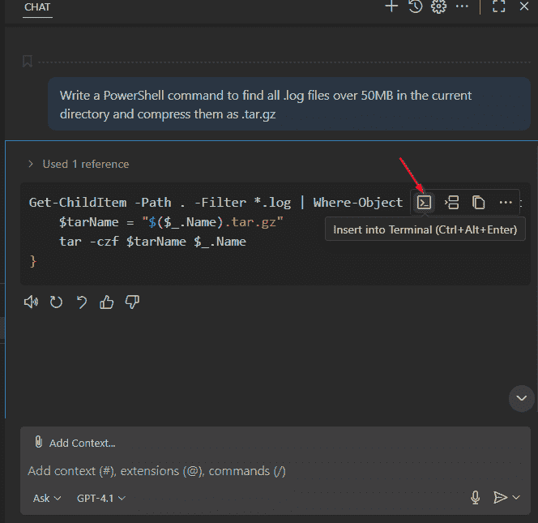

图 5.1：VS Code 终端，显示了一个提示和一个显示“插入到终端”的生成命令

## 使用命令面板

命令面板是 GitHub Copilot 在 IDE 内部展示其功能的另一种方式。这种集成仅限于 **Visual Studio Code** ( **VS Code** )。其他 IDE，如 Visual Studio 或 JetBrains 产品，不会以相同的方式通过命令面板暴露 Copilot。

使用命令面板，你可以执行以下操作：

+   触发 GitHub Copilot 生成、解释或重构命令和脚本

+   在终端中时，使用键盘快捷键启动 Copilot Chat 或代码操作

+   直接从面板中搜索 Copilot 特定的命令（例如 **Copilot：解释最后一个终端命令** 或 **Copilot：生成脚本**）

以这种方式使用命令面板对于在编辑代码和运行命令之间切换非常有用，而且不会打断你的工作流程。

以一个例子为例，假设你刚刚在终端中运行了一个复杂的 PowerShell 命令，不确定它做什么。与其在网上搜索，不如突出显示该命令，打开命令面板，并选择 **GitHub Copilot：解释终端选择**。解释将以普通语言出现，描述该命令正在做什么——在这种情况下，查找所有大于 50 MB 的 `.log` 文件并将它们压缩到 `.tar.gz` 归档中。

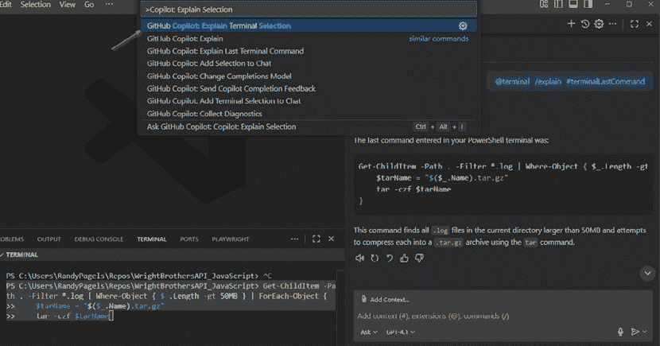

图 5.2：在 VS Code 中打开的命令面板，解释 PowerShell

## 最佳实践

当与命令或脚本一起工作时，为了获得最可靠的结果，请记住以下最佳实践：

+   **保持提示具体**：你的终端或命令面板提示越清晰，Copilot 的建议就越好。如果你想一行命令，就提出来；如果你想一个脚本，就说明。

+   **使用内联解释**：当你使用一个你不完全理解的命令时，在运行它之前让 GitHub Copilot 解释它，尤其是在处理文件删除或管理操作时。

+   **安全地链式命令**：GitHub Copilot 可以帮助链式多个命令（例如，在 Bash 或 PowerShell 中），但在执行任何具有广泛影响的操作之前，始终要审查建议。

## 需要避免的常见陷阱

虽然这些集成可以节省时间，但开发者也应该注意一些陷阱。记住这些常见的陷阱，以避免未来出现问题：

+   **未经审查就信任建议**：始终检查提出的命令，特别是那些删除文件或更改系统状态的命令。

+   **模糊的提示导致弱建议**：模糊的请求（如 `清理日志`）可能会错过重要细节。请明确目录、文件类型或日期范围。

+   **对敏感脚本的过度依赖**：不要仅依赖 GitHub Copilot 来生成生产脚本或涉及敏感数据的命令。始终添加额外的审查步骤。

终端和命令面板将 AI 辅助直接带入你的日常 shell 和 IDE 内部的脚本工作。它们最适合快速命令、解释和编辑，这些操作都保持在编辑器环境中。然而，有时你需要在 IDE 外部使用相同的支持，例如在独立脚本、管道或更广泛的自动化中。这就是 GitHub Copilot CLI 发挥作用的地方，它将这些功能扩展到任何终端会话，并使它们可用于集成到你的 CI/CD 工作流程中。

# GitHub Copilot CLI 功能

大多数开发者都是从 IDE 中的 GitHub Copilot 开始的，但你也可以直接从终端使用它。GitHub Copilot CLI 将编码代理带入你的 shell，这样你就可以生成脚本、解释命令、重构文件，并在不离开命令行的情况下对你的仓库进行推理。这自然地融入了日常的自动化和操作工作。

## 什么是 GitHub Copilot CLI？

GitHub Copilot CLI 在你的终端中与编码代理打开一个交互式会话。从这个会话开始，你可以做以下操作：

+   从自然语言生成 shell 命令和完整的脚本

+   解释或总结命令、差异和代码片段

+   对你工作目录中的文件提出编辑或重构建议（在运行之前你需要批准）

+   当认证后，询问你的 GitHub 工作，例如打开的拉取请求或分配的问题

## 设置 GitHub Copilot CLI 扩展

要开始使用，请确保你有以下内容：

+   激活的 GitHub Copilot 订阅

+   支持的环境（macOS、Windows 或 Linux）已安装 Git

+   Node.js 22+，npm 10+

然后，按照以下步骤操作：

1.  首先，输入以下命令以全局安装 CLI：

    ```py
     npm install -g @github/copilot 
    ```

1.  接下来，启动 CLI：

    ```py
    copilot 
    ```

1.  使用你的 GitHub 账户进行认证。如果你未登录，你将被提示使用会话中的斜杠命令：

    ```py
     /login 
    ```

1.  之后，命令行界面会打印一个简短代码并打开你的浏览器到 [github.com](https://github.com/) 。在浏览器中，你会看到一个要求你输入终端显示的代码的页面。输入它。

1.  之后，GitHub 会显示 GitHub Copilot 的 **授权** 页面。点击 **授权**。

1.  现在，回到终端。命令行界面确认你已经登录并且会话已准备就绪。

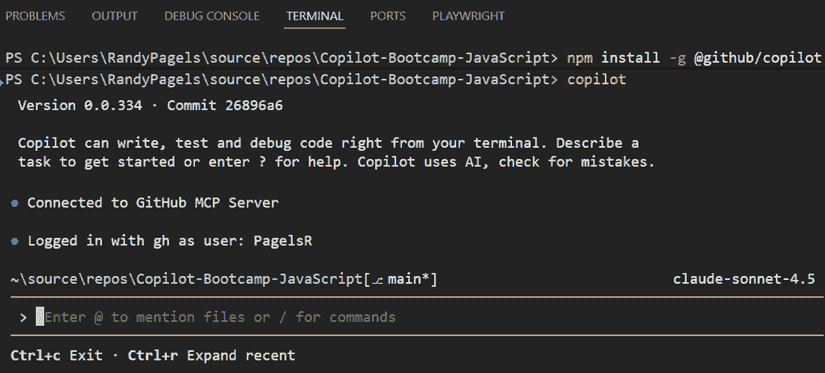

图 5.3：终端窗口打开，显示 Copilot CLI 提示

或者，如果你无法使用浏览器流程，你可以提供一个精细粒度的**个人访问令牌**（**PAT**）。这是一个你在 GitHub 上生成的令牌，允许工具以你的身份进行认证，而不使用你的密码。要创建具有正确权限的精细粒度 PAT，请按照以下步骤操作：

1.  前往 [`github.com/settings/personal-access-tokens/new`](https://github.com/settings/personal-access-tokens/new)。

1.  给令牌起一个名字，并（可选地）设置一个过期时间。

1.  在 **权限** 下，点击 **添加权限**，然后选择 **Copilot Requests**。

**Copilot Requests** 权限允许 CLI 向 GitHub Copilot 发送提示并代表你接收响应。除非你添加其他权限，否则它不会授予仓库、组织或代码写入权限。在此上下文中，Copilot CLI 仅需要此权限。

1.  生成令牌并将其复制。

1.  将令牌提供给 CLI 并设置一个环境变量——可以是 `GH_TOKEN` 或 `GITHUB_TOKEN`。我们建议你设置 `GH_TOKEN`，因为这是 CLI 首先寻找的。如果没有设置，CLI 将寻找 `GITHUB_TOKEN`。

这里有一些设置 `GH_TOKEN` 环境变量的示例：

```py
# macOS/Linux (bash/zsh)
export GH_TOKEN=ghp_yourFineGrainedTokenHere
copilot
# Windows PowerShell
$env:GH_TOKEN="ghp_yourFineGrainedTokenHere"
copilot 
```

注意，如果你同时设置了 `GH_TOKEN` 和 `GITHUB_TOKEN`，则 `GH_TOKEN` 优先。

还要注意，`GH_TOKEN` 和 `GITHUB_TOKEN` 是环境变量，而不是按钮。

1.  现在，启动 Copilot。

1.  作为可选步骤，选择一个模型。默认情况下，CLI 使用 Claude Sonnet 4.5，但若要切换模型，请输入 `/model`。然后，从可用选项中选择，例如 Claude Sonnet 4 或 GPT-5。

1.  最后，验证一切是否正常工作。你可以通过以下两种方式之一来完成此操作：

    +   输入 `help`

    +   请求一些简单的内容，例如 `解释这个命令：ls -la`

你应该看到一个描述命令和标志的响应。如果没有，请检查你是否已登录，以及 `GH_TOKEN` 或 `GITHUB_TOKEN` 是否设置正确。

要查看 GitHub Copilot CLI 可以做什么的最新列表，包括其可用命令、功能和可选的命令行标志（例如 `--explain`、`--json` 或 `--file`，这些标志会改变命令的运行方式），请访问官方文档 [`docs.github.com/en/copilot/concepts/agents/about-copilot-cli`](https://docs.github.com/en/copilot/concepts/agents/about-copilot-cli)。

## Copilot CLI 在实际应用中的真实示例

GitHub Copilot CLI 在两种日常场景中表现出色：它生成你需要的脚本，并解释你想要验证的命令。它还可以在认证后查询你的 GitHub 工作内容。

### 示例 1：自动化 CSV 备份和清理

GitHub Copilot CLI 特别适合自动化小型但重复的任务。想象一下，你想要将 `~/downloads` 文件夹中的所有 CSV 文件备份到 `~/archive` 文件夹，以清理不再需要的旧文件。而不是手动编写脚本，你可以要求 Copilot CLI 生成它：

```py
Write a bash script that moves all .csv files from ~/downloads to ~/archive and then deletes files older than 30 days in ~/archive. 
```

Copilot 会响应一个现成的 Bash 脚本：

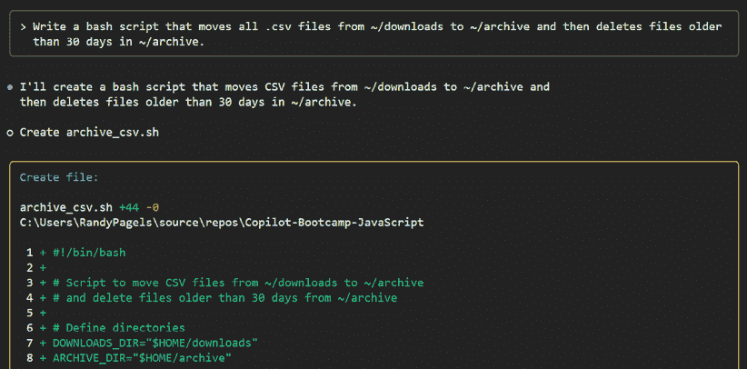

图 5.4：使用 GitHub Copilot CLI 生成用于归档和清理 CSV 文件的 Bash 脚本

在此阶段，选择你想要如何使用脚本。在会话 UI 中，你可以将其复制到剪贴板或要求 GitHub Copilot 为你编写文件。当你选择编写时，CLI 会显示一个确认提示（见 *图 5.5* ），询问是否现在编辑文件、批准整个会话的所有文件操作，或拒绝并给出新的指令。确认写入后，检查保存的文件，使其可执行，并根据需要运行或安排它。你还可以要求 GitHub Copilot 在执行之前解释脚本：

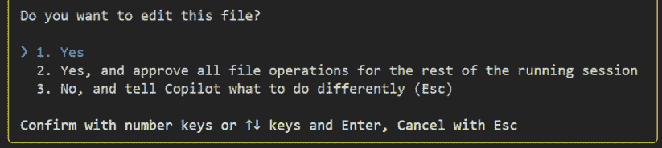

图 5.5：GitHub Copilot CLI 在写入或编辑文件之前请求确认

### 示例 2：解释 Git 命令

GitHub Copilot CLI 的另一个常见用途是理解你在脚本或文档中遇到的命令。无需在网上搜索或猜测，你可以要求 GitHub Copilot CLI 将其分解成通俗易懂的语言。例如，你在脚本或审阅笔记中看到一个紧凑的历史命令，想在运行之前确保它显示的内容：

```py
Explain this command: git log --graph --oneline --decorate origin/main..HEAD 
```

如 *图 5.6* 所示，Copilot 清晰地解释了命令的每个部分。GitHub Copilot 解释说 `git log` 打印提交历史，`--graph` 在左侧边栏绘制简单的分支图，`--oneline` 在单行上显示每个提交，包括简短的提交哈希和主题，`--decorate` 显示分支名称和标签等引用。`origin/main..HEAD` 范围限制输出为当前分支上的提交，但不包括 `origin/main`，这在你想在打开拉取请求或编写摘要之前审查分支添加的内容时很有用：

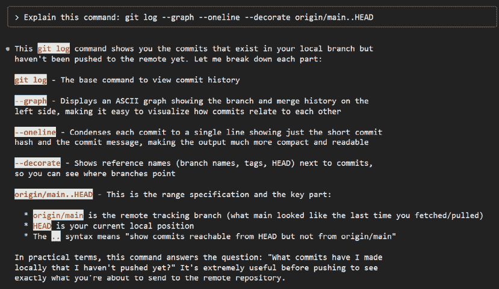


这在处理基础设施脚本或自动化脚本（非自己编写）时特别有帮助。与其在网上搜索或冒险使用不熟悉的命令，GitHub Copilot 会用通俗易懂的语言将这些命令分解，帮助你执行之前确切了解每个部分的作用。

### 示例 3：与 GitHub.com 交互

你还可以使用 CLI 直接查询 GitHub。一旦登录，你可以在终端之外询问你的开放拉取请求、分配的问题和其他工作。

要快速了解你跨存储库的活跃工作，请提出以下问题：

```py
List my open pull requests 
```

GitHub Copilot 返回你的开放拉取请求。为了缩小范围，包括存储库：

```py
List all open issues assigned to me in octocat/Hello-World 
```

你可以使用这些结果跳转到审阅或分类任务，而无需离开终端。

## 将 Copilot CLI 与自动化集成

假设您有一个反复出现的小型维护任务：存档 CSV 文件和修剪旧文件。与其手动编写和维护脚本，您可以让 GitHub Copilot CLI 起草它，审查结果，将其检入您的仓库，并让 GitHub Actions 按计划运行它。这展示了从快速本地提示到可靠、可重复的自动化的完整流程。以下是操作步骤：

1.  使用 GitHub Copilot CLI 生成脚本。启动会话后，请求并审查它：

    ```py
    Write a bash script named archive_csvs.sh that moves all .csv files
    from ~/downloads to ~/archive and deletes .csv files older than 30 days.
    Add basic error handling and simple logging. 
    ```

1.  将文件保存为 `./.github/scripts/archive_csvs.sh`：

    ```py
    #!/usr/bin/env bash set -euo pipefail SRC_DIR="${SRC_DIR:-$HOME/downloads}" DST_DIR="${DST_DIR:-$HOME/archive}" LOG="${LOG:-archive_csvs.log}" ... mv "$SRC_DIR"/.csv "$DST_DIR"/ 2>/dev/null || echo "No CSVs to move" find "$DST_DIR" -type f -name '.csv' -mtime +30 -delete -print echo "[$(date -Iseconds)] Done" | tee -a "$LOG" ... 
    ```

1.  接下来，使脚本可执行并将它提交到您的仓库，使其成为您版本控制工作流程的一部分。在您的终端中运行以下命令：

    ```py
    chmod +x .github/scripts/archive_csvs.sh
    git add .github/scripts/archive_csvs.sh
    git commit -m "Add archive_csvs.sh generated with GitHub Copilot CLI"
    git push 
    ```

1.  将其添加到名为 `.github/workflows/archive-csvs.yml` 的 GitHub Actions 工作流程中，该工作流程每晚运行：

    ```py
    ...
    name: Nightly CSV Archive
      on:
        schedule:
          - cron: "5 1 * * *"
        workflow_dispatch:
    jobs:
      archive:
      runs-on: ubuntu-latest
      steps:
      - uses: actions/checkout@v4
      - name: Run archive script
        run: ./.github/scripts/archive_csvs.sh
     ... 
    ```

您使用 GitHub Copilot CLI 一次来起草任务，将结果置于版本控制之下，并让 GitHub Actions 按计划运行它。工作在审查中保持可见，并且每次运行的行为都是一致的。

## 最佳实践

为了在日常工作和自动化中充分利用 Copilot CLI，请记住以下最佳实践：

+   **具体明确**：`Bash 脚本用于部署带有错误处理的 Docker 容器`比`编写部署脚本`更清晰

+   **运行前审查**：对文件、服务或凭据的更改要小心

+   **请求解释**：如果不确定，在执行前请求分解

+   **逐步采用**：首先使用 CLI 进行小型本地任务，然后标准化有效的工作

## 需要避免的常见陷阱

即使有自动化，CLI 也不是万无一失的。了解这些常见陷阱，以便您可以避免错误并确保工作流程的安全：

+   **模糊的提示**：不明确会导致结果不完整

+   **跳过审查**：不要在阅读之前直接将输出粘贴到 `sh` 或 `pwsh`

+   **过度自动化**：对于关键基础设施步骤，保持人工参与

GitHub Copilot CLI 将编码代理带到您的终端，让您可以生成脚本、解释命令，并快速查看您的 GitHub 工作。结合审查和一些谨慎的习惯，它自然地与您的 IDE 一起使用，帮助工作顺利进行，无需额外的上下文切换。

接下来，我们将焦点转回到集成开发环境（IDE）本身。除了编写和自动化之外，Copilot 还能在出现问题时提供帮助。在下一节中，您将看到 Copilot 如何通过解释堆栈跟踪、建议修复方案以及生成诊断代码来帮助识别根本原因。

# 调试支持

**调试**是开发周期中的关键阶段，通常也是耗时最长的阶段之一。GitHub Copilot 的 IDE 集成旨在帮助您不仅编写代码，还能理解和修复代码。GitHub Copilot 在整个调试过程中提供帮助：分析堆栈跟踪、建议修复、解释错误，甚至生成诊断脚本。本节展示了 Copilot 在您的 IDE 中的存在如何使故障排除不那么痛苦，更加高效。

## GitHub Copilot 在调试器中能做什么？

在支持的 IDE（如 Visual Studio Code）中，GitHub Copilot 可以在活动调试会话期间或检查错误日志和堆栈跟踪时调用。一些常见的工作流程包括以下内容：

+   **解释错误信息和堆栈跟踪**：突出显示一个错误或堆栈跟踪，并请求 GitHub Copilot 提供简单的语言解释

+   **建议修复错误**：提示 GitHub Copilot 根据失败的测试、异常或运行时错误推荐代码更改

+   **生成诊断代码**：请求脚本或函数以帮助隔离和重现错误（例如，额外的日志记录或输入验证）

+   **协助测试调试**：获取测试断言、边缘情况或如何重现失败的建议

### 示例 1：JavaScript 堆栈跟踪分析

考虑这样一个场景，您的 Node.js 应用程序在执行过程中崩溃。在 VS Code 的终端中，您会看到一个像这样的错误：

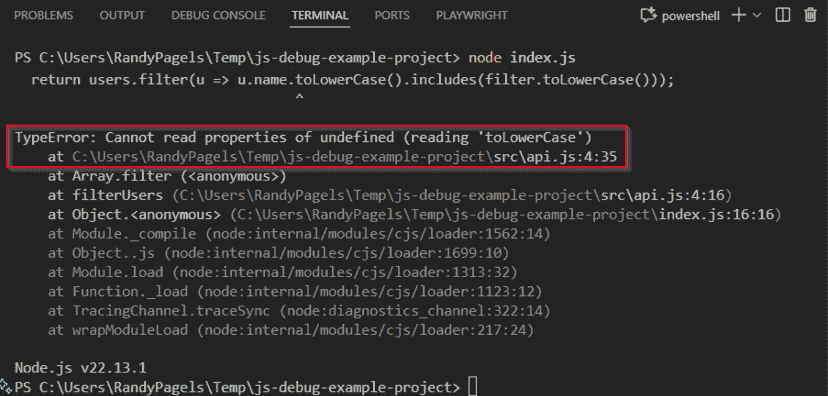

图 5.7：在 Node.js 运行期间 VS Code 终端显示的错误。选择堆栈跟踪进行解释，然后粘贴到 Copilot Chat 以获取诊断和修复

初看，这条消息并不很有帮助。您知道`toLowerCase`正在对`undefined`进行调用，但原因并不明显。为了使用 Copilot 进行调查，请执行以下操作：

+   如果您的设置中可用，请在终端中选择堆栈跟踪文本，打开命令面板，并运行**GitHub Copilot：解释终端选择**。

+   如果命令不可用，请从终端复制堆栈跟踪并将其粘贴到 Copilot Chat 中，然后使用以下提示：

    ```py
    Explain this error and suggest a fix. 
    ```

Copilot 解释说，过滤器参数有时是未定义的，因此调用`toLowerCase()`会抛出错误。然后它提出一个更安全的函数版本：

```py
// ...existing code...
// You can ask Copilot: "Suggest a safe version of filterUsers that avoids
// crashing when user.name or filter is missing." It would typically add
// guards like shown below.
function safeFilterUsers(users, filter) {
  if (!Array.isArray(users)) return [];
  if (typeof filter !== 'string') return users;
  const f = filter.toLowerCase();
  return users.filter(u => typeof u.name === 'string' && u.name.toLowerCase().includes(f));
}
// ...existing code... 
```

应用更改后，再次运行程序。错误已消失，行为正确，无论是否有过滤器值。

此示例演示了 GitHub Copilot 如何作为实时调试伴侣。通过分析堆栈跟踪并以简单语言解释根本原因，它弥合了令人困惑的错误信息和清晰的解决方案路径之间的差距。您不必猜测崩溃的原因，可以快速了解失败，应用有针对性的修复，并验证结果，所有这些都不需要离开您的 IDE。

### 示例 2：SQL 错误辅助

考虑这样一个情况，你正在编写一个针对 `employees` 表的查询，执行失败并显示以下消息：

```py
ERROR: column "employeeid" does not exist
LINE 1: SELECT employeeid, name FROM employees; 
```

到目前为止，你知道查询失败了，但错误信息本身并不能告诉你确切的原因。为了调查，你突出显示错误信息，并使用以下内容提示 Copilot：

```py
Explain and fix this SQL error. 
```

Copilot 解释说错误发生是因为 `employeeid` 列不存在于 `employees` 表中。它确定了两个可能的原因：

+   列名拼写错误（例如，应该是 `employee_id` 或 `id`）

+   该列不存在于表架构中

此外，它提供了修复步骤：

1.  检查 `employees` 表中的实际列名。

1.  更新你的查询以使用正确的列名。

*图 5.8* 显示了完整的 Copilot 响应以及解决 SQL 错误的进一步细节：

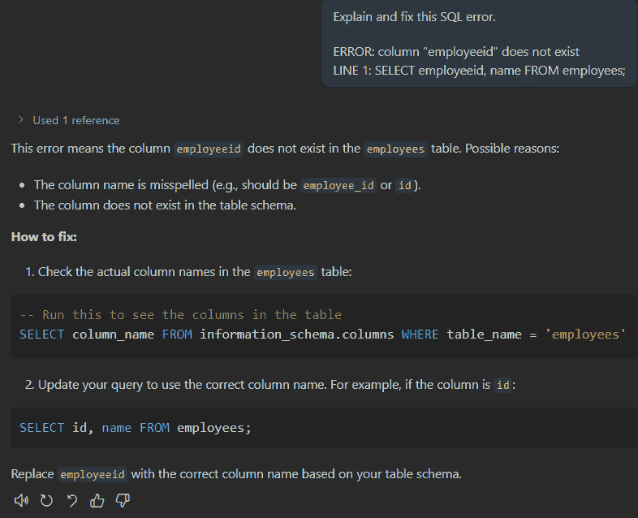

图 5.8：终端窗口解释和解决 SQL 错误

此示例演示了 GitHub Copilot 如何提供不仅仅是简单纠正的帮助。它不仅确定了可能的问题，还指导你验证架构，然后再应用修复。这种结构化的工作流程，解释错误，检查环境，然后更新代码，说明了为什么 GitHub Copilot 是一个有效的调试伙伴，减少了猜测，并帮助你更有信心地解决问题。

## 支持的语言和场景

Copilot 的调试帮助不仅限于单一语言或环境。它适用于广泛的编程语言、脚本工具和配置格式，包括以下内容：

+   JavaScript/TypeScript（Node.js、Web 应用）

+   Python

+   C#/F#

+   SQL（T-SQL、PostgreSQL 等）

+   PowerShell、Bash 和其他脚本语言

+   基础设施即代码（Bicep、YAML、Terraform 等）

+   CI/CD 管道定义

你可以在单个项目中混合使用这些技术。只要你的编辑器中有相关的上下文，Copilot 就会为你提供的任何内容或请求提供调试建议。

## 最佳实践

为了使 GitHub Copilot 的调试帮助既可靠又安全，在请求错误或堆栈跟踪的帮助时，请记住以下最佳实践：

+   **具体说明错误上下文**：你提供的信息越详细（完整的堆栈跟踪、失败的输入或测试场景），GitHub Copilot 的帮助就越精确

+   **请求解释和修复**：有时，最好的方法是先让 Copilot 解释，然后推荐修复方案——这有助于你理解，而不仅仅是修补

+   **验证所有建议**：在将 GitHub Copilot 的代码移至生产环境之前，始终在你的调试环境中测试 GitHub Copilot 的代码

## 需要避免的常见陷阱

虽然 Copilot 可以成为一个有价值的调试伙伴，但也要注意风险。在排查问题时，要小心这些常见的陷阱，以避免创建新的问题：

+   **盲目应用建议的修复方案**：始终理解为什么 GitHub Copilot 建议更改——一些建议可能只是掩盖了潜在问题。

+   **省略完整上下文**：GitHub Copilot 在“看到”相关的代码、配置和错误输出时工作得最好。尽可能多地在你的提示中包含信息。

+   **完全依赖 Copilot 进行调试**：人工智能擅长模式匹配和提出常见修复方案，但不要跳过复杂问题的根本原因分析。

调试是开发中最耗时的部分之一，Copilot 解释错误、提出修复方案和生成诊断代码的能力展示了人工智能如何在不取代人类判断的情况下加快这一过程。然而，一旦错误得到解决，开发通常继续到审查、测试和质量检查。在下一节中，我们将探讨其他 IDE 集成工具，其中 GitHub Copilot 帮助进行代码审查、手动拉取请求摘要、测试运行和分析工作流程，以保持项目健康和可维护。

# 其他 IDE 集成工具

不仅仅是编辑和调试，现代集成开发环境（IDE）还充当代码审查、测试和质量检查的中枢。GitHub Copilot 将这些领域扩展到其功能中，帮助你审查代码、起草摘要，并更高效地工作，即使你的团队不使用 GitHub.com 进行拉取请求。

## 手动拉取请求摘要和本地代码审查

团队以不同的方式审查代码。一些使用 GitHub.com 上的托管拉取请求工作流程，而另一些则更喜欢将审查完全保留在 IDE 中。GitHub Copilot 通过帮助你总结、分析和评论代码更改来支持这两种方法，无论你是本地工作还是通过**GitHub Pull Requests**扩展。

有两种主要方式可以利用这一点：

+   **手动本地审查**：在这个工作流程中，你突出显示差异、暂存更改或将片段粘贴到聊天界面。然后 Copilot 将生成与正在审查的代码直接相关的摘要或审查注释。

+   **与 GitHub Pull Requests 扩展的集成审查**：在这个工作流程中，你使用 VS Code 中的 GitHub Pull Requests 扩展来自动从暂存更改生成提交消息或审查笔记。这样，所有操作都在 IDE 内部完成，无需手动复制粘贴。

下面的子部分将详细说明每种方法，突出 Copilot 如何将其辅助功能与当前更改集相关联，以及集成扩展工作流程如何进一步简化审查。

使用 Copilot Chat 进行广泛的解释（例如，粘贴多文件差异以提供上下文）和本地代码审查进行当前更改集的集中分析。它们共同为你提供整体视图和精确细节。

### 手动本地审查

当本地工作时，暂存你的更改，然后在 **SOURCE CONTROL** 面板中点击 **生成提交消息**（参见 *图 5.9* 中用红色箭头突出显示的按钮）。GitHub Copilot 从暂存差异中创建一个摘要，你可以在提交之前编辑它，或者将其作为审查笔记重用。

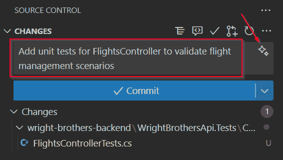

图 5.9：VS Code 中的 SOURCE CONTROL 面板显示生成提交消息按钮

GitHub Copilot 分析暂存差异并生成自然语言提交消息建议。你可以审查文本，如果提供的话，循环查看替代方案，或在其提交之前对其进行细化。这确保了你的提交消息解释了更改的目的，而不仅仅是修改了哪些文件。然后你可以直接最终确定提交，或者将摘要作为审查笔记与他人共享，无论你的团队使用的是哪种源代码控制系统。

除了生成提交消息外，你还可以针对特定代码行请求有针对性的审查帮助。在你的编辑器中突出显示新或修改的行，并提示 GitHub Copilot 对其进行潜在问题或边缘情况的审查。GitHub Copilot 可能会指出缺少空值检查、输入验证的机会或样式不一致。这为你提供了轻量级的反馈，无需打开完整的拉取请求，因此对于快速迭代或个人项目非常有用。

### 使用 GitHub Pull Requests 扩展进行集成审查

为了在 VS Code 中实现流畅的工作流程，请使用 **GitHub Pull Requests** 和 **Issues** 扩展。如图 *图 5.9* 所示（再次显示红色箭头），**SOURCE CONTROL** 面板包括 **生成提交消息**，它从暂存差异中草拟一个摘要。当你准备好打开拉取请求时，切换到 *图 5.10* 中显示的 **创建拉取请求** 视图。在那里，你可以审查生成的文本，调整标题和描述，然后点击 **创建**。屏幕还包括 **Copilot 代码审查**，这样你可以在提交之前运行 AI 审查：

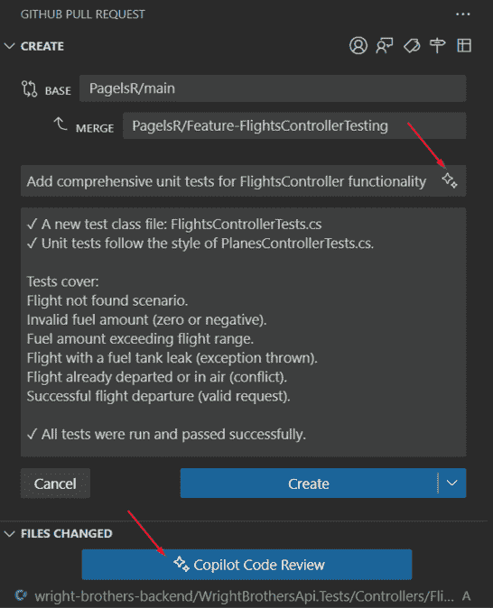

图 5.10：VS Code PR 扩展生成提交摘要

当在 VS Code 中使用相同扩展创建或更新拉取请求时，你还会注意到 **Copilot 代码审查** 按钮。点击它会在暂存或挂起的更改上运行 AI 审查。该工具提供内联注释，指出测试弱点，并提出改进建议，就像队友留下审查笔记一样。你可以在 *图 5.11* 中看到一个示例：

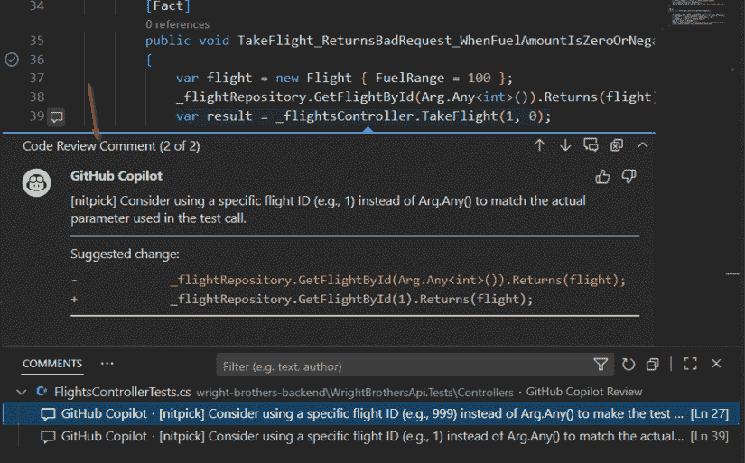

图 5.11：PR 扩展中的代码审查，显示带有内联注释的建议更改

以 GitHub Copilot 的反馈作为起点，然后根据团队的标准进行细化或调整。这样既实现了自动化，又有人工监督。

### 最佳实践

为了从 Copilot 的 IDE 集成工具中获得最大价值，并确保结果既有用又安全，请考虑以下最佳实践：

+   **仅粘贴相关差异**：为了获得最佳结果，请保持差异或代码变更的专注和针对性。

+   **请求摘要和审查**：尝试使用如“总结这些更改并列出可能的风险”之类的提示。

+   **集成到本地工作流程中**：使用 GitHub Copilot 与您首选的 Git GUI、终端或 IDE 差异工具一起使用。

### 需要避免的常见陷阱

虽然 Copilot 可以简化审查和总结，但有一些常见的陷阱可能会降低其有效性。请记住这些，以避免挫败感并获得更准确的结果：

+   **过于宽泛的差异**：大型的多文件差异可能会让 GitHub Copilot 应接不暇。将变更拆分成更小的部分，以便更好地总结。

+   **缺少上下文**：如果 GitHub Copilot 无法“看到”相关文件或依赖项，请提出更有针对性的问题或手动审查这些区域。

## 测试运行器和代码分析

测试和分析是确保软件保持可靠、可维护和安全的至关重要部分。GitHub Copilot 可以通过帮助您生成测试用例、加强现有覆盖率以及理解测试运行或静态分析工具通常令人难以承受的输出，在 IDE 内部支持这些任务。GitHub Copilot 并不是取代这些流程，而是加快它们，并提供上下文，以便您可以专注于重要的决策。

最常见的用途之一是从代码生成测试。如果你突出显示一个函数，并用如“使用 Jest 为此函数编写单元测试”或“使用 pytest 为此函数生成测试”之类的请求提示 Copilot，它将生成一个针对你选择的框架量身定制的测试文件。当你刚开始或想要快速覆盖基本案例然后再用更具体的场景进行细化时，这特别有帮助。

### 示例 1：生成测试用例

假设你已经在 Python 模块中添加了一个新函数。通过在编辑器中选择该函数并提示“使用 pytest 为此函数编写单元测试”，Copilot 会生成一个测试文件草稿。生成的测试可能包括对常见输入、边界条件和预期失败的断言。然后你可以根据项目需求对这些测试进行细化。这样可以节省时间，避免出现空白页问题，并为你提供一个快速的开始点来扩展。

GitHub Copilot 在处理分析输出时也有帮助。静态分析工具，如 ESLint 或 Pylint，擅长发现问题，但它们通常会产生长长的警告列表，难以优先排序。你不必逐行阅读，可以将输出粘贴到 Copilot Chat 中，并请求一个专注的摘要。

### 示例 2：总结分析结果

在对 JavaScript 项目运行 ESLint 后，你可能会将结果粘贴到 Copilot Chat 中，并提示`总结这些发现并推荐前三个修复方案`。Copilot 会识别最显著的问题，例如未使用的变量、性能不佳的函数或不一致的风格，并返回一组简洁的可操作建议。这样，你就不必被警告信息淹没，而是有一个优先级列表，你可以先处理这些更改。

这些场景共同说明了 Copilot 如何增强测试和分析。它加速了编写测试的过程，提出了你可能未曾考虑的改进建议，并帮助你从密集的输出中提取有意义的见解。通过直接集成到你的 IDE 中，Copilot 支持开发过程中的质量关注方面，确保新功能不仅快速交付，而且得到有效的测试和验证。

### 最佳实践

当与测试和分析工具一起使用 Copilot 时，为了最大限度地发挥其作用，请考虑以下最佳实践：

+   **将 Copilot 与现有工具配对**：使用 Copilot 来填补你的代码检查器、测试运行器或分析器未覆盖的空白。例如，如果你的代码检查器标记了一个反复出现的模式，Copilot 可以提出一个重构建议来一致地解决这个问题。

+   **请求具体内容**：如“为这个函数在 pytest 中建议额外的测试断言”这样的直接提示比“改进这些测试”这样的宽泛请求能产生更好的结果。

+   **使用 Copilot 来优先排序**：当静态分析产生数十个警告时，让 Copilot 识别首先需要关注的三个问题。这保持了你的工作流程的可管理性和行动导向。

### 需要避免的常见陷阱

虽然 Copilot 可以在测试和分析中作为一个有用的伙伴，但过度依赖或模糊的提示可能会削弱其有用性。请注意这些常见的陷阱：

+   **仅依赖生成的测试**：GitHub Copilot 的测试框架只是一个起点，很少提供完整的覆盖范围。始终要扩展和调整它们以满足你项目的需求。

+   **使用通用提示**：像“使这些测试更好”这样的宽泛请求往往会导致无用的结果。请明确指出你想要的编程语言、框架以及你希望改进的类型。

+   **将 Copilot 视为分析替代品**：GitHub Copilot 可以总结代码检查器的结果，但你仍然应该审查完整的报告，以检查可能随着时间的推移而积累的微小问题。

## 扩展点

扩展点是 IDE 中的一个功能，允许你自定义或扩展工具的行为方式。在 GitHub Copilot 的上下文中，扩展点允许你将 Copilot 的功能连接到其他工具，或者简化你在编辑器中与之交互的方式。这种灵活性使得 Copilot 感觉更像是一个原生的工作流程的一部分，而不是一个单独的附加组件。

扩展点很有用，因为它们允许你做以下事情：

+   将 Copilot 适应你的习惯。例如，你可以为`解释差异`创建一个键盘快捷键，这样在审查更改时，你只需按一个键就可以触发 Copilot，而不是每次都打开命令面板。

+   与其他扩展集成。许多开发者已经依赖于 GitLens 用于 Git 历史记录或 Docker 用于容器工作流程等工具。通过将这些工具与 Copilot 结合使用，你可以在查看 GitLens 注释时使用如`总结此文件的 history`之类的提示，将审查和分析保持在同一位置。

+   减少上下文切换。你不必手动将日志或差异复制到 Copilot Chat 中，可以使用快捷键或连接的工具将内容直接发送到 Copilot 进行解释或总结。

例如，假设你经常使用 GitHub Copilot 来总结失败的测试输出。在 VS Code 中，你可以添加一个键绑定，将*Ctrl* + *Alt* + *T*（或你喜欢的任何快捷键）映射到**GitHub Copilot：解释选择**命令。现在，每当测试失败时，你只需在终端中突出显示错误并按快捷键。Copilot 立即提供清晰的语言解释，而不会打断你的流程。

一些功能，如自动拉取请求摘要和基于 Web 的审查工具，仅限于 GitHub.com。我们将在*第六章*中详细探讨这些功能。

IDE 不仅仅是代码编辑器。它也是审查、测试和分析发生的地方。GitHub Copilot 生成提交摘要、本地或通过拉取请求扩展审查代码，以及协助测试和分析工作流程的能力展示了它如何集成到开发环境的许多部分。这些功能帮助开发者保持专注，减少上下文切换，并在工作发生的地方提供有用的反馈。

下一节将探讨这些功能在实际应用中的协同工作方式。我们将通过具体的示例来展示如何结合终端命令、CLI 自动化、调试支持和集成工具，以展示 GitHub Copilot 如何支持从开始到结束的日常开发全流程。

# 现实世界的工作流程场景

GitHub Copilot 的 IDE 集成功能的真正优势在于你在日常任务中使用它们时的协同作用。本节将终端辅助、GitHub Copilot CLI、调试、本地代码审查和测试支持结合到实际操作流程中，以便你可以看到这些功能如何结合以节省时间和减少上下文切换。

## 场景 1：从发现错误到修复和审查

想象一下你正在 IDE 的终端中运行集成测试并看到失败的测试。你该怎么办？

首先，调查错误。你可以做以下任何一项：

+   突出显示错误消息或失败的行，并使用内联提示`解释这个错误并建议一个修复方案`。此选项直接在上下文中提供解释并建议更新后的代码。

+   点击失败测试旁边的**修复测试失败**图标。此选项会自动分析失败并提出直接修复，无需输入提示。

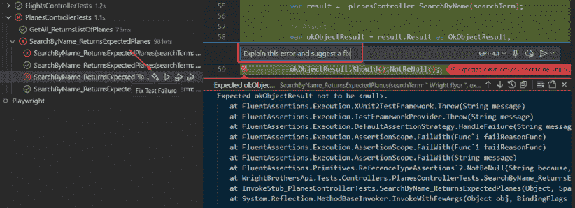

图 5.12：在调试失败的测试时，选择内联帮助解释和修复错误，或一键修复测试失败选项

接下来，使用 GitHub Copilot 的内联建议更新测试下的函数。代码修改后，在终端中重新运行测试套件。这次，测试成功通过。

最后，将你的本地 Git diff 复制到 GitHub Copilot Chat 中，并提示“为我的提交消息总结此更改”。Copilot 生成一个自然语言摘要，你可以对其进行修改并包含在提交中。这使历史记录清晰，并提高了团队的可视性。

这个工作流程展示了 Copilot 如何从头到尾简化调试过程。它解释了模糊的错误信息，提出了针对性的修复方案，甚至草拟了提交摘要，清晰地描述了变更。通过减少故障和解决之间的手动步骤，它使开发工作在更少的上下文切换中向前推进。

## 场景 2：基础设施自动化和 CI/CD 改进

想象你正在维护一个生成大量日志文件的服务，你希望在管道中自动化清理和安全检查。你将如何进行？

要开始，使用 GitHub Copilot CLI 从终端生成用于日志管理的可重用脚本。在会话中，输入以下提示：

```py
Create a Bash script to compress and delete .log files older than 14 days. 
```

GitHub Copilot 返回一个草稿脚本，该脚本压缩旧日志并删除超出保留窗口的文件。审查输出，进行任何必要的编辑，并将脚本保存到你的环境中使用：

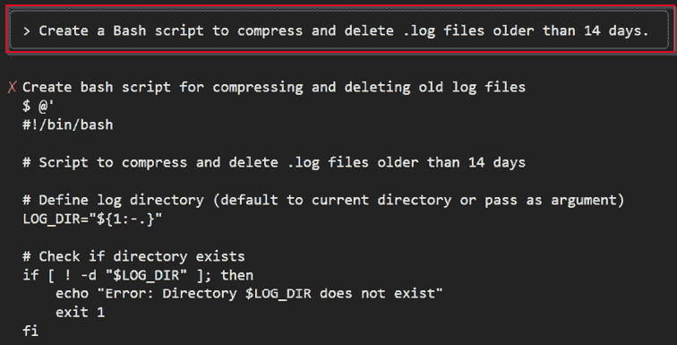

图 5.13：使用 GitHub Copilot CLI 生成自动化日志清理脚本

接下来，你想要通过安全扫描加强你的 GitHub Actions 管道。在 VS Code 中打开你的工作流程 YAML 文件，突出显示相关部分，并像以下这样提示 Copilot：

```py
Insert a step before deploy to scan code with Trivy. 
```

Copilot 提出一个结构良好的 YAML 块，用于运行 Trivy 扫描器。你插入新步骤，调整适合你环境的参数，并提交更改。

在推送到上游之前，你会在本地运行更新的工作流程（使用支持本地执行的运行器）。新的安全扫描步骤显示了一个依赖警告。你将输出粘贴到 Copilot Chat 中，并请求摘要。Copilot 用普通语言解释问题，并提出行动建议，例如更新受影响的库。

这个工作流程展示了 Copilot 如何从头到尾支持基础设施自动化。它生成你需要的脚本，帮助你更新 CI/CD 定义，并帮助你解释结果，所有这些都在同一个开发循环中完成。

## 场景 3：审查和记录功能分支

想象一下，你正在处理一个功能分支，并希望为其准备团队审查和文档。

首先，检出分支并预存你的更改。更改准备就绪后，在你的 IDE 中突出显示差异或关键文件，并按以下方式提示 GitHub Copilot：

```py
Summarize the main purpose and risks of this feature update. 
```

Copilot 生成一个自然语言摘要，捕捉变更的意图，以及潜在风险，例如性能影响或可能需要额外测试的区域。

接下来，将 GitHub Copilot 的草案改编成审查就绪的摘要。你可以将其用作手动拉取请求描述的基础，添加到你的提交历史中，或包含在项目文档中。这确保了你的工作得到清晰传达，即使你的团队不使用 GitHub.com 进行拉取请求。

最后，与你的团队分享 Copilot 的摘要和风险笔记。这为审查者提供了一个清晰的起点，突出了重要关注点，并提高了反馈质量。即使在托管拉取请求工作流程之外工作的团队，也能从对功能分支引入的内容进行简洁、一致的文档记录中受益。

此工作流程展示了 Copilot 如何帮助处理通常耗时较长的文档和审查变更的过程。它总结了功能的目的，识别潜在风险，并生成可供与团队成员分享的审查就绪笔记。即使在托管拉取请求工作流程之外，这也使得功能审查更快、更清晰、更容易沟通。

## 场景 4：端到端测试工作流程

想象一下，你正在构建和验证一个 API 端点，并确保它经过彻底测试。

首先，编写 `add()` 端点的函数。然后，在你的 IDE 中突出显示代码，并按如下方式提示 GitHub Copilot：

```py
Generate pytest tests for this endpoint. 
```

Copilot 生成一个包含客户端固定值和检查新任务是否正确添加的断言的测试文件草案。这为你提供了一个起点，随着功能的演变可以进行细化：

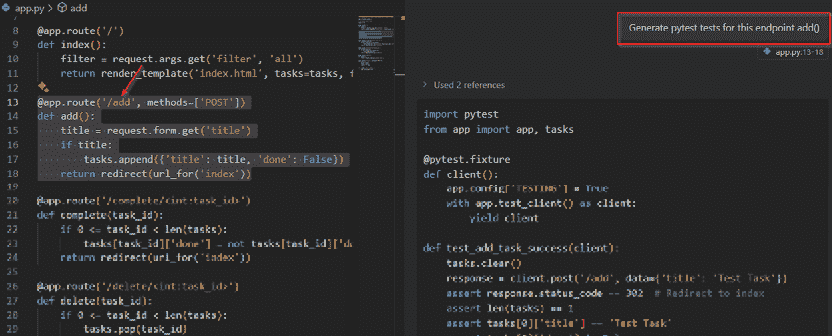

图 5.14：生成单元测试

接下来，运行生成的测试。当发生失败时，将错误输出复制到 GitHub Copilot Chat，并按如下方式提示：

```py
Explain why this test failed and suggest a fix. 
```

Copilot 分析失败原因，用通俗易懂的语言解释原因，并提出对代码或测试的具体调整建议。你应用这些建议，重新运行测试，并重复此过程，直到所有测试通过。

此工作流程展示了 Copilot 如何支持完整的测试周期。它有助于生成初始测试用例，阐明失败原因，并提出修复建议，从而减少从实现到可靠端到端验证所需的时间。

## 工作流程集成最佳实践

上述场景展示了 GitHub Copilot 如何支持开发的每个阶段，从调试和测试到自动化和审查。为了保持这种流程的一致性，在将 GitHub Copilot 集成到日常工作中时，请应用以下最佳实践：

+   **无缝迁移**：在编辑器、终端和代码审查步骤中使用 GitHub Copilot，将所有内容保持在同一位置

+   **每个阶段的提示**：从解释开始，然后转到修复，接着总结和回顾

+   **混合匹配语言**：Copilot 处理 JavaScript、Python、Bash、PowerShell、YAML、SQL、Bicep 等语言——为每个任务使用正确的工具

## 避免的常见陷阱

通过结合 Copilot 的编辑、脚本、调试、审查和自动化 IDE 集成，你可以更快地工作，并将注意力集中在解决问题上，而不是在工具之间切换。但没有任何工具是完美的。以下是你要注意的常见陷阱以及如何避免它们：

+   **跳过审查**：快速移动很好，但在提交之前，始终检查 Copilot 的输出是否存在错误或风险更改。

+   **没有测试**：首先在安全环境中运行生成的代码，以便在它们进入生产环境之前发现问题。

+   **模糊的提示**：“修复这段代码”太宽泛了。要具体，以便 Copilot 可以提供精确、有用的结果。

+   **缺少上下文**：包括相关的代码、差异或错误输出，以便 Copilot 可以看到全貌。

+   **忽略标准**：即使代码可以工作，也要确保它符合你团队的命名、格式和安全规则。

## 快速参考清单

在接受 GitHub Copilot 的建议之前，请问自己以下问题：

+   这个输出是否是我真正想要的？

+   运行、提交或分享是否安全？

+   我能否在本地测试和验证更改？

+   我是否审查了边缘情况的逻辑、命令或脚本？

+   风格和方法是否与我的团队/项目一致？

+   我是否提供了足够的信息以获得高质量的建议？

当有疑问时，将 GitHub Copilot 视为你的副驾驶，而不是驾驶员。进行审查、修改和测试。如果感觉有问题，请要求澄清或进一步分解问题。

# 摘要

你学习了如何在 IDE 和终端中操作 GitHub Copilot 以支持实际工作，而不仅仅是完成：从终端和命令面板进行提示，使用 GitHub Copilot CLI 生成和解释脚本，在调试时请求帮助以解释堆栈跟踪并提出修复方案，以及进行本地审查以生成清晰的提交信息和手动拉取请求摘要。你还看到了测试运行器和代码分析的实际操作，以及将这些元素联系起来的实际场景。这很重要，因为它让你保持在一个流程中。在运行之前审查建议，你可以以更少的上下文切换、更清晰的文档和更安全的执行来编写脚本、审查、测试和调试。

在下一章中，你将看到 GitHub Copilot 如何超越本地开发，增强在 GitHub.com 上的协作，其中它总结拉取请求、协助代码审查，并简化基于网络的自动化，以帮助团队更有效地一起工作。

|

## 获取本书的 PDF 版本和独家额外内容

扫描二维码（或访问[packtpub.com/unlock](http://packtpub.com/unlock)）。通过书名搜索此书，确认版本，然后按照页面上的步骤操作。 |  |

| *注意：请妥善保管您的发票。直接从 Packt 购买的商品不需要发票。* |
| --- |
