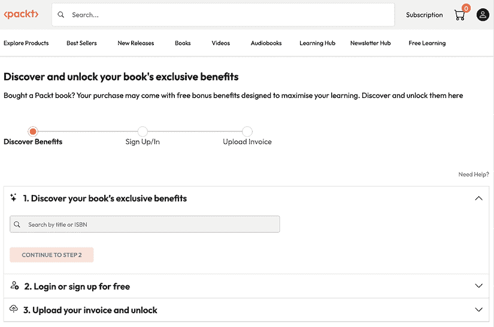

# 第十一章：解锁您的独家福利

您的这本书包含以下独家福利：

+    新一代 Packt 阅读器

+    免版税 PDF/ePub 下载

按照以下指南解锁它们。此过程只需几分钟，并且只需完成一次。

# 通过 3 个简单步骤解锁此书的免费福利

## 第 1 步

保持您的购买发票以备 *第 3 步* 使用。如果您有实体副本，请使用手机扫描并将其保存为 PDF、JPG 或 PNG 格式。

如需查找发票的帮助，请访问 [`www.packtpub.com/unlock-benefits/help`](https://www.packtpub.com/unlock-benefits/help) 。

**注意**：如果您直接从 Packt 购买此书，无需发票。完成 *第 2 步* 后，您即可立即访问您的专属内容。

|

## 第 2 步

扫描二维码或访问 packtpub.com/unlock 。 |  |

在打开的页面（类似于桌面上的 *图 11.1*），通过名称搜索此书并选择正确的版本。

图 11.1：桌面上的 Packt 解锁登录页面

## 第 3 步

选择您的书籍后，登录您的 Packt 账户或免费创建一个。然后上传您的发票（PDF、PNG 或 JPG，最大 10 MB）。按照屏幕上的说明完成此过程。

|

### 需要帮助？

如果您遇到困难需要帮助，请访问 [`www.packtpub.com/unlock-benefits/help`](https://www.packtpub.com/unlock-benefits/help) 以获取有关如何查找发票及其他详细问题的 FAQ。此二维码将带您到帮助页面。 |  |

**注意**：如果您仍然遇到问题，请联系 [customercare@packt.com](https://www.packtpub.com/en-us/help/contact) 。

[packtpub.com](http://packtpub.com)

订阅我们的在线数字图书馆，全面访问超过 7,000 本书和视频，以及行业领先的工具，帮助您规划个人发展并推进职业生涯。更多信息，请访问我们的网站。

# 为什么订阅？

+   使用来自 4,000 多位行业专业人士的实用电子书和视频，节省学习时间，多花时间编码

+   使用专为您定制的技能计划提高您的学习效果

+   每月免费获得一本电子书或视频

+   完全可搜索，便于快速访问关键信息

+   复制粘贴、打印和收藏内容

在 [www.packtpub.com](http://www.packtpub.com) 上，您还可以阅读一系列免费技术文章，订阅各种免费通讯，并享受 Packt 书籍和电子书的独家折扣和优惠。

# 您可能还会喜欢的其他书籍

如果您喜欢这本书，您可能对 Packt 的以下其他书籍也感兴趣：

**Django 5 By Example**

Antonio Melé

ISBN: 978-1-80512-545-7

+   使用各种 Django 模块利用最新功能解决特定问题

+   将第三方 Django 应用程序集成到您的项目中

+   使用 Redis、Postgres、Celery/RabbitMQ 和 Memcached 构建复杂的网络应用程序

+   使用 Docker Compose 为您的项目设置生产环境

+   使用 Django Rest Framework (DRF) 构建 RESTful API

**使用 HTML5 和 CSS 进行响应式网页设计**

Ben Frain

ISBN: 978-1-80324-271-2

+   使用媒体查询，包括对触摸/鼠标和颜色偏好的检测

+   学习 HTML 语义并编写可访问的标记

+   根据屏幕大小或分辨率提供不同的图像

+   编写最新的颜色函数，混合颜色，并选择最易于访问的颜色

+   在设计中使用 SVGs 以提供分辨率无关的图像

+   创建和使用 CSS 自定义属性，利用包括‘clamp’、‘min’和‘max’在内的新 CSS 函数

+   向 HTML 表单添加验证和界面元素

+   使用过滤器、阴影和动画增强界面元素

# Packt 正在寻找像您这样的作者

如果您有兴趣成为 Packt 的作者，请访问 [authors.packtpub.com](http://authors.packtpub.com) 并今天申请。我们已与成千上万的开发人员和科技专业人士合作，就像您一样，帮助他们将见解分享给全球科技社区。您可以提交一般申请，申请我们正在招募作者的特定热门话题，或提交您自己的想法。

# 分享您的想法

现在您已经完成了 *The GitHub Copilot Handbook*，我们非常希望听到您的想法！如果您从亚马逊购买了这本书，请[点击此处直接进入该书的亚马逊评论页面](https://packt.link/r/1806116634)并分享您的反馈或在该购买网站上留下评论。

您的评论对我们和科技社区非常重要，并将帮助我们确保我们提供高质量的内容。
