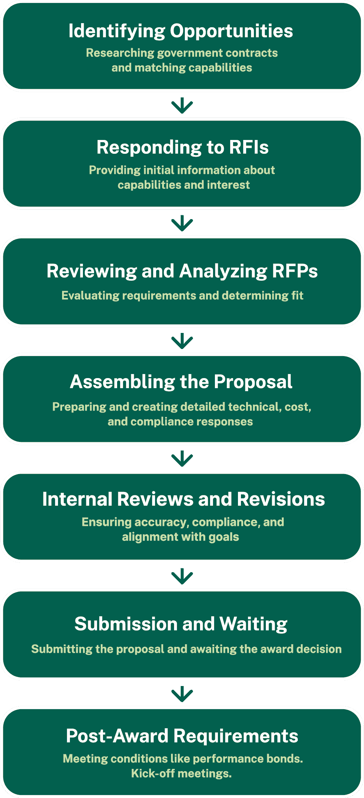
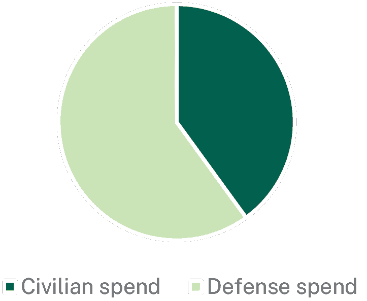
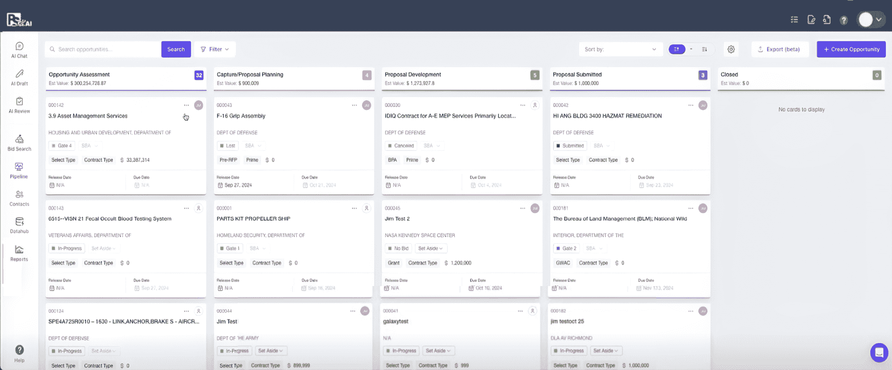
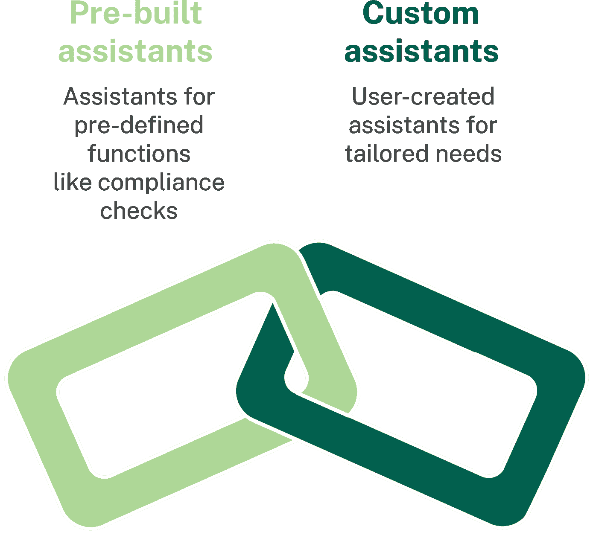
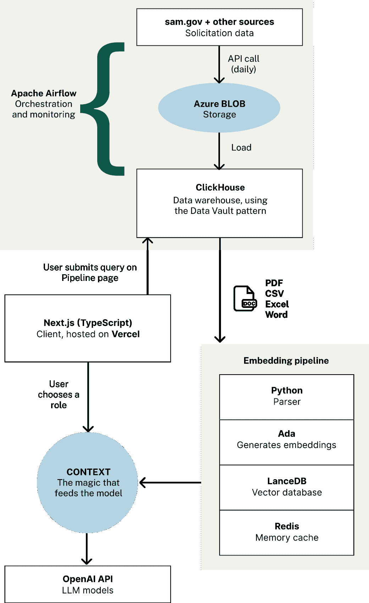
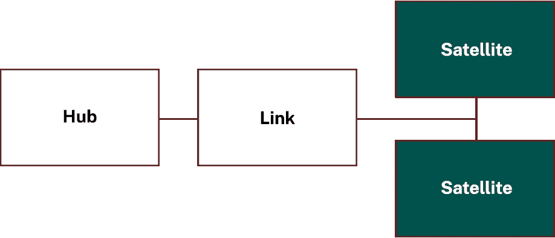
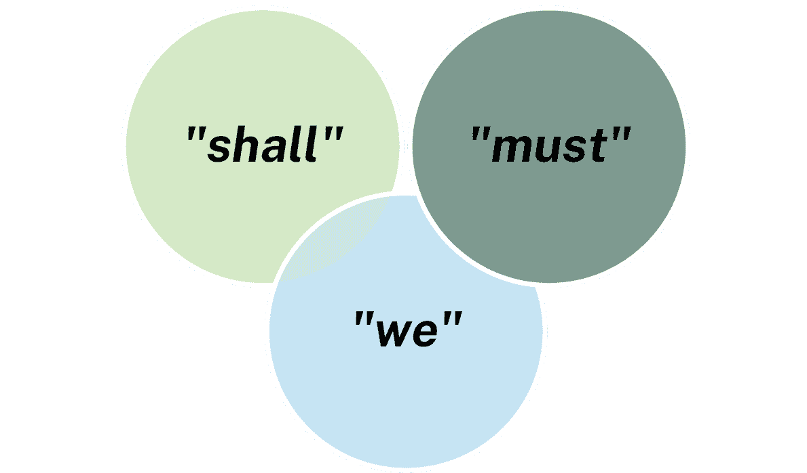
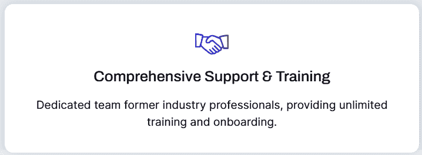
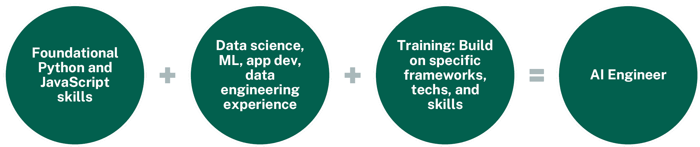
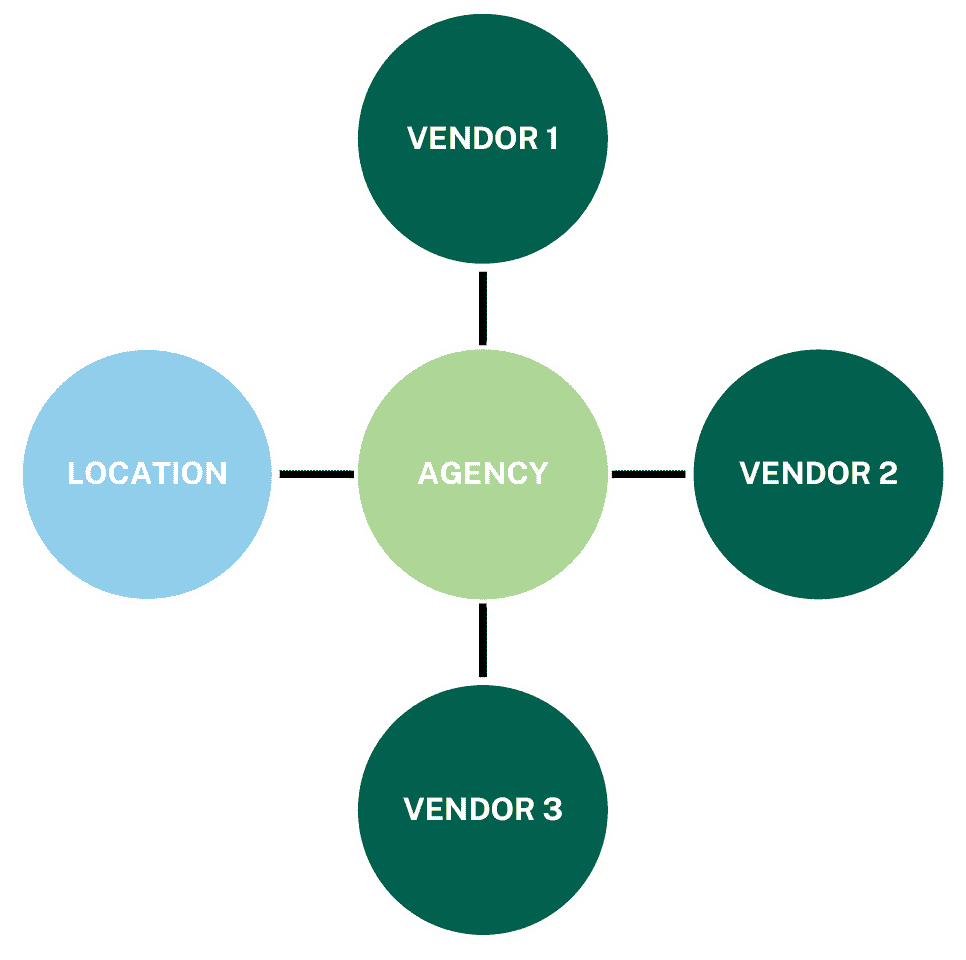

# 第二章

繁琐的政府合同流程

政府合同是政府实体（联邦、州或地方）从私营公司采购商品、服务或项目的流程。它为企业提供了获得大型、稳定的合同的机会，这些合同可以推动增长并建立信誉。然而，这个过程很复杂，需要承包商导航：

+   精细的要求

+   长时间的时间表

+   严格的合规标准

对流程复杂性的清晰分解意味着企业可以更好地评估他们所需的资源，以及旨在减少这些低效率的创新技术的价值。

第 1 步：识别机会

这个过程从识别政府招标中的机会开始。承包商必须筛选数据库以过滤 RFI 和 RFP。

图 1：政府机构发布的三种采购请求类型。有时，RFQ（报价请求）被用来补充或替代 RFI。

作为探索性文件，RFI（请求信息）寻求行业对潜在项目的反馈。企业评估这些信息以确定其能力与需求的匹配度，需要研究机构需求、市场状况和竞争对手。

RFI 通常被非常繁琐的界面所困。你必须将所有过滤器应用到表格中，点击网络应用程序的多个页面，并希望找到你需要的数据。这个过程本身就可能消耗大量的时间和资源。”

– 安东尼·布朗

根据[Order.co](https://www.order.co/blog/procurement/rfi-meaning/)，一个致力于采购自动化的组织，RFI 通常包括：

+   项目概述

+   执行时间框架

+   具体的项目细节

+   为感兴趣的供应商提供指导

+   更多信息的空间

第 2 步：回应 RFI

回应 RFI 需要通过起草深思熟虑的回应来展示行业专业知识，概述潜在的方法、技术和定价模型——通常在没有保证合同的情况下。这包括：

+   从专家那里收集意见

+   分析市场趋势

+   构建一个故事，将公司定位为可靠的合作伙伴

第 3 步：审查和分析 RFP（请求提案）

一旦发布 RFP，风险显著增加。RFP 详细说明了项目的确切要求，包括交付成果、时间表和合规期望。

承包商必须仔细审查这些文件，通常长达数百页，以确保他们理解每一个细节。这一步骤可能涉及创建合规矩阵，将 RFP 中的每个要求映射到公司打算如何解决它。遗漏任何细节都可能导致资格丧失。

合规矩阵

在[提案经理专业人员协会](https://www.apmp.org/)（APMP）合规矩阵[模板](https://www.responsive.io/blog/proposal-compliance-matrix/)中，描述为“通常使用”的列是：

+   章节页

+   章节或子章节标题

+   页面

+   要求（用主动语态陈述）

+   F（完全符合）

+   P（部分符合）

+   N（不符合）

+   响应参考（参考您作为响应提供的文档的名称和页码）

+   评论

APMP 是一个“国际认可的权威机构”，其使命是“成为受国际社区信任的领导者，为投标和提案开发专业人士提供服务”。它在全球 79 个国家拥有超过 14,100 名会员。

第 4 步：组装提案

制定提案是整个过程中最劳动密集的阶段之一。企业汇集作家、主题专家、图形设计师和法律顾问团队，以创建一个引人入胜且符合规定的回应。这包括：

+   内容创作：撰写详细说明公司如何满足机构需求，包括技术计划、时间表和成本结构。

+   合规文件：确保包括所有必要的认证、财务记录和监管要求。

+   视觉艺术品：创建支持材料，如甘特图、图表和建筑设计，以增强提案。

这是一个非常漫长的过程。有很多公司在试图证明他们是真正执行工作的合适人选。在某些情况下，这些征求可能需要一年或更长时间才能真正赢得。”

– 安东尼·布朗

第 5 步：内部审查和修订

在提交之前，提案要经过多轮内部审查，以确保准确性和合规性。团队仔细审查每个单词、数字和引用，以确保与 RFP 的要求一致。这个迭代过程通常涉及部门之间的重大来回，增加了时间表数周。

第 6 步：提交和等待

提交后，承包商将面临漫长的等待期，因为政府机构正在评估提案。在这段时间里，企业必须准备回答后续问题或请求额外文件。这一阶段可能需要数月时间，给公司的管道和资源规划带来不确定性。

第 7 步：获奖后的要求

赢得合同只是开始。承包商必须为整个项目生命周期中的严格监督和报告要求做好准备。从确保符合 CMMC 和 FedRAMP 等网络安全标准到管理持续审计，行政负担在获得奖项后仍然持续。每一步都对私营企业代表着一个重大的时间、精力和资源投资。

没有高效的工具或简化的流程，承包商常常发现自己被大量工作压得喘不过气来。这个延长的时间表往往延迟了收入生成并使资源紧张，使得政府承包成为一项高风险、高投入的事业。

图表 2：显示获得政府合同过程中耗时步骤的图表。

许多公司今天依赖一系列工具来管理政府征求和合同的复杂性。他们可能会使用 Salesforce 来跟踪流程，使用不同的平台来存储和起草文件，并引入多个主题专家来整合所有内容。这种碎片化的方法造成了低效和孤岛效应，使得组装、分析和采取关键信息变得困难。通过将 AI 集成到单一的工作流程中，流程可以简化——允许团队轻松生成甘特图、架构设计和详细分析。这是用智能、无缝的系统替换分散的工作流程。

– 安东尼·布朗

采购科学之数字

112 小时

或者为使用该平台的客户节省每份提案 6400 美元。

前 100 名

采购科学通常与排名前 100 的政府承包商合作。

1960 年代

他们最老的客户自 1960 年代以来一直存在，这意味着平台需要能够处理旧格式。

90%

客户在提案规划和生成阶段看到了 90%的效率提升。

为什么良好的采购是必不可少的以及资金去向何方

在 2023 财年，美国联邦政府“通过合同义务支出[7590 亿美元](https://files.gao.gov/multimedia/Federal_Government_Contracting/index.html)”。其中 60%的总额分配给了国防机构，其余 40%分配给了民用机构。

图表 3：显示分配给民用机构与国防机构的政府资金比例的饼图。

除了标准采购合同外，还有称为[其他交易](https://aaf.dau.edu/aaf/contracting-cone/ot/)（OTs）的法律工具。它们代表了更灵活的商业安排，用于研发或原型活动，在同年进一步花费了 157 亿美元。

美国政府问责办公室（GAO）网站强调了一个政府范围内的目标，即将大约四分之一的合同美元授予小企业——1953 年[小企业法](https://www.law.cornell.edu/uscode/text/15/chapter-14A)规定为 23%——目的是促进参与。这个配额为愿意采取措施优化其流程的小型企业提供了良好的机会，尽管对于 2025 年政府将如何看待小企业的发展存在一些不确定性。

按组织规模进行产品差异化

采购科学维护其获奖 AI 平台的两个版本：

+   Azure 政府云版本：针对大型政府承包商。

+   商业版本：面向小型企业，通常是那些员工人数少于 100 人且每年处理 50 次招标的企业。

然而，当前的定价模式是针对用户而非代币使用，这使得与小型公司的合作成本效益较低。因此，采购科学主要与联邦前 100 名承包商名单上的客户合作。提醒一下，商业模式对组织影响有直接影响，无论是偶然还是有意为之。

本报告将在后续章节深入探讨平台的细节。

采购中的欺诈和偏见

采购欺诈通常占[总民事欺诈追回金额不到 10%](https://www.hklaw.com/en/insights/publications/2024/03/government-contracts-enforcement-doj-publishes-fy-2023-false-claims)，根据[1863 年虚假索赔法](https://www.justice.gov/civil/false-claims-act)（FCA）。在国防方面，大约[20%的国防部正在进行的监察长调查](https://www.gao.gov/products/gao-21-309)与采购欺诈有关。虽然欺诈的规模比医疗保健领域——按 2023 财年[告密者](https://kkc.com/frequently-asked-questions/what-is-qui-tam/)告密者提起的案件数量衡量——小一个数量级，但它仍然构成了对纳税人资金的滥用，并损害了军事准备和公共安全。

海军国防欺诈的历史案例包括 2015 年的[肥伦德贿赂丑闻](https://www.theguardian.com/us-news/2024/nov/05/fat-leonard-sentenced-military-fraud)，以及 20 世纪 80 年代的 FBI 的[第三次风行动](https://www.fraud-magazine.com/article.aspx?id=4294990359)，当时有 50 多人被判有罪——包括 9 名政府官员和多家国防公司的高管——因为他们交换内部信息和非法恩惠。第三次风行动导致国会通过了一系列广泛的改革，包括 1984 年的[合同竞争法](https://www.congress.gov/bill/98th-congress/house-bill/5184)和 1988 年的[采购完整性法](https://www.justice.gov/jmd/procurement-integrity)，试图使竞争更加公平。1984 年的[联邦采购条例](https://www.acec.org/news/last-word-blog/post/long-ago-and-far-away-the-federal-acquisition-regulation-turns-40/)正式化了许多采购流程，包括使用 RFI。

在这些环境中，人工智能解决方案有天然的位置。例如：

+   检测欺诈：使用历史采购数据来识别与合法交易相关的模式，并在投标行为、定价和合同变更中标记异常。

+   减少偏见：匿名化申请并根据客观标准对供应商进行评分，最小化主观判断。

+   提高透明度：简化或总结复杂法律或技术文件，使采购对所有利益相关者更加易于访问。

如何考虑合规性

采购交易涉及广泛的商品和服务。固定翼飞机、导弹和专业的工程支持构成了[2023 财年最高国防支出](https://files.gao.gov/multimedia/Federal_Government_Contracting/index.html)的一部分，而药品、手术设备、贵金属和一般医疗服务则是民用支出中的主要部分。显然，企业必须保持强大的监管关注，才能胜任这些合同的履行。

安东尼·布朗，采购科学公司前数据与 AI 负责人，将合规性视为两个不同领域的结合：

+   数据敏感性：个人信息和敏感分类信息。

+   专有信息：客户数据，以及如何存储和处理这些数据而不违反联邦要求。

我们在联邦市场的客户基础大多与国防部合作，因此对这些要求的高度敏感性甚至超过了普通政府。以退伍军人协会这样的政府机构为例，其敏感性更高。”

– 安东尼·布朗

安全框架

安东尼熟悉采购科学公司必须遵守的众多安全要求。TechLeader 团队想知道这是否是他必须向客户提供必要保证的必要做法。

他在我们的采访中提到了几个方面：

+   SOC 2（系统和组织控制 2）

+   CMMC（网络安全成熟度模型认证）

+   FedRAMP（联邦风险和授权管理计划）

+   FIPS 140（联邦信息处理标准）

+   CUI（受控未分类信息）要求

+   HIPAA（健康保险可携带性和问责法案）

人们的普遍看法是我们必须遵守 SOC 2、CMMC 和 FedRAMP 的规定。”

– 安东尼·布朗

SOC 2 是一个[广泛的标准](https://soc2.co.uk/)，适用于任何处理客户数据的服务机构。CMMC 针对[国防部承包商](https://dodcio.defense.gov/cmmc/About/)，而 FedRAMP 则关注[联邦机构使用的云服务](https://www.gsa.gov/technology/government-it-initiatives/fedramp)。

欧盟的采购

在欧盟，公共机构每年在采购上花费约 2000 亿欧元。欧洲委员会（EC）网站[欧洲单一市场与经济](https://single-market-economy.ec.europa.eu/single-market/public-procurement_en)指出，在运输和教育等众多领域，公共部门是大多数买家的组成部分。首页还突出了欧洲委员会排除[俄罗斯等国家](https://ec.europa.eu/commission/presscorner/detail/en/ip_22_2332)参与欧盟采购合同的能力，作为制裁的一种方式。

最有利的投标（MAT）是欧盟用于奖励评估的框架，考虑因素包括创新、定价、质量和环境影响。欧盟企业有权在任何欧盟国家[竞争合同](https://europa.eu/youreurope/business/selling-in-eu/public-contracts/public-tendering-rules/index_en.htm)。

人工智能如何帮助加速流程

采购科学利用人工智能技术，特别是助手，来简化政府合同流程的各个阶段。

我们为这些特定任务构建了助手，每个流程部分都有。所以，无论是他们需要做的规划工作，还是[他们]需要生成如图表、图表、甘特图等工件，他们可以直接在[平台]内完成。”

– 安东尼·布朗

高级工作流程概述

在探索平台的技术之前，我们将分解它支持的核心理工作流步骤。

1.  调整人工智能：在入职期间，用户输入有关其行业和专业知识的详细信息，这些信息与分类法和知识库相关联。这使人工智能能够提供定制化的建议和行动。

1.  机会识别：平台的人工智能驱动的投标搜索利用一个集中式、每日更新的数据仓库，汇集来自[SAM.gov](https://sam.gov/)等来源的信息。机会以结构化格式显示，语义搜索使用户能够自然查询，避免复杂的导航并节省大量时间。

1.  资格认定：用户通过评估其与公司能力和战略目标的一致性来认定识别出的机会。人工智能分析上传的文件，如竞争情报和能力声明，以提供更深入的见解和可操作的建议。

1.  管道集成：一旦用户识别出相关的征求，他们就可以将其添加到他们的管道中。这个集中空间有助于组织任务、存储相关文档并为每个征求维护逻辑行动顺序。

1.  规划：采购科学通过协助用户组织时间表、分配资源以及定义提案步骤来促进规划。在分析上传的文档以优化策略和评估风险的同时，人工智能生成如甘特图和图表等工具。

1.  提案生成和微调：在采购科学的内容构建器中使用人工智能，用户可以创建具有合规分析、内容起草、图表创建、研究整合和快速 RFI 生成的简化流程的提案。该平台还支持迭代微调，通过协作人工智能工具使用户能够根据其策略和目标对提案进行精炼和调整。

1.  提交和提交后：最终提案可以以多种格式导出以供提交。提交后工具包括 AI 驱动的简报分析、抗议评估和模式跟踪，以提供未来改进的信息。

读者应注意这些工作流程步骤如何映射到本报告早期介绍的通用采购流程。

采购科学公司大约两年前成立，由政府承包商建立，为政府承包商服务。我们团队的大部分成员来自前政府承包公司，包括我们现在服务的部分客户。

我们的使命是简化政府招标流程——减少创建采购请求、响应信息请求和整个招标周期中涉及的繁琐程序。”

– 安东尼·布朗

深入了解投标搜索以识别机会

平台的投标搜索界面连接到一个集中的数据仓库，从各种来源拉取招标信息。结构化的表格格式显示关键细节，使用户能够快速评估机会。功能包括：

+   语义搜索：用户可以执行高级查询以查找特定信息或就招标提出问题，绕过繁琐的传统系统。“用户可以直接与平台互动，而不是浏览多个页面，”安东尼指出。

+   个性整合：知识图谱分类法将招标数据与行业和角色特定的洞察联系起来，帮助用户识别与其专业知识相符的机会。

一旦用户识别出相关的招标，他们就可以将其添加到他们的管道中。

深入了解管道管理

管道组织识别出的机会，并为下游任务如合规性和提案起草做好准备。

图表 4：授予人工智能平台的界面，显示“管道”标签。阶段包括机会评估、捕获/提案规划、提案开发、提案提交和关闭。

+   数据流：当机会被添加到管道中时，相关文档会被解析、嵌入和矢量化。这些过程使用 Python 和 LanceDB 等工具来实现高效的检索。

+   上下文中的管道：该管道与知识图谱集成，将机会数据与相关行业、角色和先前的洞察联系起来。这种上下文化确保在后续阶段所有相关信息都可用。

这种类似[看板](https://www.atlassian.com/agile/kanban/boards)的界面意味着用户可以以结构化的方式从研究过渡到规划和开发。

多代理编排

Procurement Sciences 使用多代理编排，其中不同的功能对应于各种 AI 辅助助手，通过内置提示进行操作，以实现不同过程之间的平稳过渡。

图表 5：获奖 AI 平台如何使用助手。

当用户输入有关提案关键方面的查询时，AI 可以立即根据提供的数据进行分析并生成见解。这些助手的输出直接显示在聊天中，系统允许用户将聊天输出移动到应用程序的其他区域，例如搜索征求或管理平台内的其他关键任务。

技术堆栈

Procurement Sciences 将其技术堆栈整合到云基础设施、数据管理系统和 AI 技术中——这些技术被选中以平衡安全性、可扩展性和性能。

关键决策：智能外包以保障云基础设施

该平台托管在 Azure Government Cloud（GCC High）上，以满足政府承包商的严格安全要求。这个安全和隔离的环境确保了与 FedRAMP、[ITAR](https://www.pmddtc.state.gov/ddtc_public/ddtc_public?id=ddtc_kb_article_page&sys_id=24d528fddbfc930044f9ff621f961987)和[DFARS](https://www.acquisition.gov/dfars)等框架的基线合规性，为政府承包商和其他有复杂合规性要求的组织提供保证。

我们不必自己提出基础设施或弄清楚如何使一切符合规范。通过在 Azure Government Cloud 中托管，我们能够实现许多这些要求。”

– Anthony Brown

利用现有客户基础设施

Azure Government Cloud 的额外好处是它已经被许多客户用来托管他们的内部网络和工具，如 Microsoft Office。这意味着 Procurement Sciences 可以确保他们的数据是安全的，并且与客户的现有 Government Cloud 处于“同一地区、同一区域、同一网络”。

Azure Government Cloud 的限制

由于云供应商需要对新模型进行安全性和安全性基准的审查，Azure Government Cloud 中不可用最新版本的模型。据 Anthony 说，“它们可能在商业云中普遍可用 7-8 个月，可能是一年后。”Azure OpenAI 服务在[2024 年 2 月](https://devblogs.microsoft.com/azuregov/azure-openai-service-now-available-in-azure-gov-cloud/)在 Azure Government 中可用，在[2023 年 1 月](https://siliconangle.com/2023/01/17/microsoft-makes-azure-openai-service-generally-available/)商业普遍可用之后。

供应商将测试模型如何处理提示注入，以及它是否可以被诱导产生不道德的输出。

Azure BLOB 存储用于安全存储与政府招标相关的文档和附件。这确保了数据的快速访问，同时保持[符合政府标准](https://learn.microsoft.com/en-us/azure/storage/common/storage-compliance-offerings)。

Kubernetes 支撑平台的可扩展性和租户管理。每个客户都在一个单租户实例中运行，以增强安全性。“这样，我们实际上可以逻辑上和物理上分隔每个租户进入的数据，我们的客户的数据不可能与其他公司的数据混合。”

图 6：如 Anthony 所描述的核心技术架构，所有服务均托管在 Azure Gov Cloud 的 Kubernetes 集群中。[图标](https://www.flaticon.com/free-icon/doc_13148548?term=microsoft+word&page=1&position=11&origin=search&related_id=13148548)由 Chanut-is-Industries 在 flaticon.com 创建。

反馈触点 2：

对本节有何快速反馈？](https://forms.office.com/e/dntxUZgT1b)

编程语言和框架

Python 被广泛用于如下任务：

+   从 SAM.gov 等来源批量加载招标

+   使用 Tika 等库解析文档和附件

+   构建数据管道和 AI 代理以支持市场情报功能

平台前端使用 TypeScript 和 JavaScript 构建，结合 Next.js，领先的 React 框架，并由 Vercel 提供服务。

数据管理和处理

ClickHouse 作为平台的高性能列式数据库，充当存储招标数据的数据仓库。它支持快速、高效的查询，如投标搜索。

Redis 作为嵌入管道的内存缓存，支持工作流事件管理，并确保高效的状态处理。

LanceDB 用作向量数据库来处理嵌入，通过将多个功能集成到单个工具中简化技术堆栈。

Apache Airflow 协调和监控数据管道，确保数据处理的平稳和可靠。

数据仓库建模

获奖的 AI 平台使用数据仓库建模来结构化其数据，支持可扩展性和可追溯性。

这种企业设计模式或模式由[三种类型的实体](https://www.databricks.com/glossary/data-vault)、枢纽、链接和卫星组成。

图 7：数据仓库建模。

+   枢纽代表业务实体，只包含它们的唯一标识符。例如，机构、供应商和合同。

+   链接定义了枢纽之间的关系。例如，供应商和招标之间的链接，或机构与合同之间的链接。

+   卫星存储与枢纽或链接相关的描述性属性和历史变化，使审计轨迹完整。例如，供应商或机构属性，或供应商随时间进行的投标修改。

数据仓库可扩展、灵活重构，与星型或雪花模式相比，减少了数据冗余。

Neo4j 用于构建知识图谱。这些图表示实体（如公司、机构和招标）之间的关系，为行业动态提供有价值的见解。

AI 模型和库

采购科学利用多个 OpenAI 模型以及 Anthropic 的 Claude 进行多样化任务：

+   GPT-4 与 Mermaid.js 等工具结合使用，用于生成图表（如甘特图和流程图）、起草提案内容，并提供语义搜索功能。

+   GPT-4o 和 GPT-4o Mini 处理短上下文提示，确保特定查询的高效处理。

+   OpenAI 的 ada-2 嵌入模型用于嵌入过程中的精确和高效数据向量化。

+   由于其高质量的输出和产生自然语言的能力，Anthropic 的 Claude 被优先用于撰写长文本。它还能处理更长的上下文，使其适合复杂的 RFP 和详细的回复。

这些模型的精确构成肯定会随时间而变化。关键思想是不同的模型具有不同的优势，采用者必须考虑。

其他工具和集成

Langfuse 用于监控和评估采购科学 AI 代理的性能，提供见解以优化和优化 AI 驱动的流程。

Salesforce 和 SharePoint（客户集成）：虽然不是采购科学内部技术堆栈的一部分，但 Salesforce 和 SharePoint 被认可为客户常用的平台。该平台设计为与这些平台有效集成，使用 REST API 和开源工具，允许用户管理专有信息并简化招标流程。

在解决方案背景下的 LLM

推断作为优势

在采购科学用例中，LLM 的优势来自于其推断未言明内容的能力。安东尼将 RFI 比作法律文件，其中内容以非常具体的方式书写，使用诸如应当、必须和我们的陈述。“这是一种法律语言，也是招标的一部分，因为它是一份[企业]承诺履行的合同。”

图 8：在招标中可能缺失的合同语言。

差异在于 RFI“可能不会说必须、应当或我们……但实际上确实如此”。RFI 会暗示某些内容是预期要求，而责任在于企业正确推断。

在获奖 AI 中的提示工程

已经有很多关于如何进行提示工程（包括在[供应商文档](https://platform.openai.com/docs/guides/prompt-engineering)和 TechLeader 的其他报告中）的讨论。以下是采购科学方法的大致轮廓，安东尼称之为“基本但有效”。

少样本提示：“如果我表示我想要一个 RFP 或 RFI 或某个特定部分，我会在提示中提供一个示例。”

不要给模型太多指令：模型的内存限制在这里是相关的。安东尼给出了一个例子：

+   不良的提示类型：“创建一个 RFI，并参考你需要引用的征求书。”

这个提示可以合理地创建一个 RFI 的 decent 概要，但每个单独的部分都不会达到预期的质量。

+   优秀的提示类型：“你将创建这个 RFI。这是你要扮演的角色类型。以下是你正在寻找的一些初始信息。以下是一些信息的示例。现在向用户提出这些问题。首先从这个问题开始。”

现在，模型开始与用户进行对话，并且只输出它被提供的相关上下文的部分。输出是针对特定任务的，而不是模型试图同时完成三个或四个任务。

我们经常自相矛盾。我们会要求某人完成一项任务，并给出[他们]如此多的信息，以至于任务的第一个部分可能与最后一个部分矛盾。我们试图将其缩小到可实现的范围内，以避免这些矛盾，并且我们不想在一个文档的部分中做太多事情——尤其是在这些语言模型的输出上下文有限的情况下。当你开始接近输出令牌限制时，这就是你得到幻觉的地方。”

– 安东尼·布朗

模型推理的演变

采购科学团队继续更新他们的应用程序如何与最新的 LLMs 交互。“我们注意到的是，随着模型及其推理能力的创新发生，提示可能不一定保持不变。”

定义推理

安东尼在我们的采访中对我们是否真正理解“推理”一词表示怀疑，他是否真的在“推理”。以下是一些探索答案的相关方向：

+   [思维链](https://openai.com/index/learning-to-reason-with-llms/)：这与人类的推理方式相似。思维链可以用于合规性或一致性目的的监控。

+   有意为之的论点：大型语言模型（LLMs）并不是“推理”问题，它们[基于概率预测答案](https://arxiv.org/abs/2210.13966)。

+   其他“推理”策略：自我一致性（运行多个解决方案并选择最频繁的答案）、[思维树](https://www.ibm.com/think/topics/tree-of-thoughts)（ToTs）、[程序辅助语言模型](https://arxiv.org/abs/2211.10435)（PALs）、推理任务的微调。

已知的 LLM 弱点：幻觉、抽象和反事实推理（无法可靠地想象其他现实）、长期推理（在多步或复杂的逻辑链中崩溃）、缺乏内部一致性（可以在同一对话中自相矛盾）。

百万美元的问题：如果它看起来像推理，表现得像推理，那么它是推理吗？

当你使用 o1 或 o1 预览时，与 3.5 和 4，甚至在某些情况下 4o 相同的提示可能产生不同的输出。”

– 安东尼·布朗

根据安东尼的说法，一些较新模型更先进的“推理”能力意味着提示可能会在翻译中丢失。“它实际上可能玩起了电话游戏；首先你说的话，在[推理]过程中以某种方式转换，然后最终得到一个你完全不想或预期的输出。”

事实上，像 Claude 3.7 Sonnet 和 DeepSeek 这样的工具可以明确地展示模型推理，展示它们对特定用户查询的[计划](https://www.lesswrong.com/posts/ywzLszRuGRDpabjCk/do-reasoning-models-use-their-scratchpad-like-we-do-evidence)。

这些推理模型正在制定自己的计划，不再需要人类在每个步骤中。因此，如果最初的提示以某种方式指导模型思考，“我将这样制定计划”，而你的原始提示实际上并没有关注以这种方式生成计划，你可能会得到不同的输出。”

– 安东尼·布朗

商业挑战

挑战 #1：注重安全的客户

采购科学发现，风险规避和限制已经嵌入到政府承包商文化中。员工可以在自己的时间里探索 LLM，但在工作时间，像 ChatGPT 这样的工具通常会被全面封锁，根据安东尼的经验，包括在他之前的公司中。他引用了客户提出的关于数据泄露的担忧：

+   “当我将文档与您的应用程序同步时，数据去哪里了？”

+   “我如何知道输出是事实性的？”

+   “我如何知道信息足够准确，可以用于 RFP，因为政府合同需要清晰和准确？”

安东尼声称，这种恐惧并不是针对 AI 的普遍采用，而是由于组织必须遵守的严格要求而产生的。

如果你的整个公司都是基于与政府签订合同来运作的，而你又没有遵守某些规定，并且这被证实是真实的，你可能会面临罚款、罚款等处罚。你可能会被禁止申请这些合同。所以，确实会有经济损失，对吧？确实会有关于业务实际上无法运营的恐惧。”

– 安东尼·布朗

解决方案 #1：一个大型客户成功团队

除了能够通过选择安全的托管服务提供商来向客户保证，这一点本报告已经涵盖，Procurement Sciences 还强调强大的支持存在是其关键差异化因素之一。“我们将通过指南、视频、培训、活动等方式帮助你了解如何与这项技术互动。”

图表 9：Procurement Sciences 网站上列出的一个独特卖点截图，位于“我们如何不同”部分。

这种支持包括每日网络研讨会，这些研讨会被录制并分发给客户。此外，应用程序本身还内置了指南，以特定任务的直接演练和预生成的提示的形式呈现，作为助手。“他们可以只需选择他们想要执行的任务的实际助手，而无需学习如何成为提示工程师。”

解决方案 #1：内置可追溯性

Procurement Sciences 采取了两个步骤，允许客户手动验证其应用程序输出的准确性：

+   RFI/RFP 通过合规矩阵输出逐节处理：这使得用户方便地手动检查他们的最终提案是否与 RFI 或 RFP 的相关部分相符，以查看 AI 是否遗漏了任何内容。

+   引用会在输出中显示：当生成输出时，应用程序会引用用于实现它的特定文档和上下文。这是已经内置到像谷歌的[NotebookLM](https://notebooklm.google/)这样的研究工具中的基本期望。

在内部，Procurement Sciences 团队也使用开源的 LLM 工程平台 [Langfuse](https://langfuse.com/)，根据给定的一组标准对准确性、完整性和幻觉进行评估。该平台使用对话 [跟踪](https://langfuse.com/docs/tracing) 来评估，例如，应用程序生成的图表的质量（“他们得到了图表还是图像？”）。这有助于团队了解差距在哪里以及如何做得更好，“无论是通过我们可以提供的提示来改进输出，还是根据用户在聊天中输入的意图以及与模型的交互中使用的工具。”

挑战 #2：人才招聘

安东尼还谈到了尝试在技术前沿招聘的困难，以及当“经验年数”不再是简单指标时，如何进行人才评估。

有些人可能涉猎了一些事情或者了解相邻的技术，但实际的手动开发年数有限。这是一个极具挑战性和竞争性的人才库。”

– 安东尼·布朗

一些更传统的招聘方法包括 12 步[顶级评估](https://topgrading.com/)和 4 步[WHO](https://whothebook.com/)。

灵感：神秘的招聘任务

选择一个候选人一无所知的领域（养蜂、战争、现场喜剧）并询问他们如何用 AI 进行革命。

要求候选人创造性地破解一个 AI 系统。

给候选人一个极其短暂的时间限制，让他们交付一个可工作的 AI 原型。

解决方案#2：识别基础技能并提供具有竞争力的薪资

安东尼介绍了路径的概念：尝试从申请者获取未来知识潜力的角度来评估他们。他筛选了那些在 Python 和 JavaScript 方面拥有扎实基础技能的人，“这些底层技术真正提供了所有这些能力”，因为他知道他们能够通过培训和在职学习在这个基础上继续发展。

同时，他准备提供具有竞争力的薪资，以便组建他们需要的团队。他成功的证明是：“我们已经能够招募到一些有经验的资深数据科学家和 AI 科学家，他们有构建多个应用的经验。这些事物的较小版本，我们能够将其组件化，然后作为一个完整的应用程序组合在一起。”

图 10：通往 AI 工程的路径。

结果和影响

以下采购科学客户的结果展示了在复杂、高风险工作流程中利用 AI 的更广泛潜力。

时间节省和效率提升

政府合同传统上是一个劳动密集型和时间密集型的过程。现在，AI 驱动的工具能够更快地完成这些任务：

+   RFI 生成仅需几分钟：过去需要长达六个月的过程，现在在 AI 驱动的自动化下仅需 15 分钟即可完成。

+   简化合规性分析：征求文件会自动分析，合规性要求被识别并结构化为矩阵，减少了对人工审查的依赖。

+   加速机会发现：语义搜索功能简化了相关合同的识别，消除了传统数据库导航的低效率。

安东尼声称，在整个规划和提案生成阶段，客户平均效率提高了 90%。

跨行业视角

安东尼认为采购科学解决方案的通用适用性适用于任何商业发展过程，并引用了识别、资格认定、规划、提案、赢得、接受和交付的常见阶段。

[Gartner 术语表](https://www.gartner.com/en/sales/glossary/business-development)将商业发展定义为“构建和实施增长机会的各种活动和流程，以创建可持续和盈利的业务。” [Salesforce 博客](https://www.salesforce.com/blog/business-development/)列举了以下增长机会的途径：

+   市场分析

+   战略伙伴关系

+   产品开发

+   并购（M&A）

+   新的资金

+   新兴技术

自动化只是市场渗透问题的部分解决方案，尤其是在某些行业。

| 行业特征 | 行业 |
| --- | --- |
| 高监管负担 | 医疗保健、金融、公用事业 |
| 资本密集型需求 | 制造业、房地产 |
| 深根的竞争对手 | 国防、电信 |

表格 1：新进入者可能难以进入的行业。

如 [HHI](https://www.investopedia.com/terms/h/hhi.asp) 或 [CR4](https://www.investopedia.com/terms/c/concentrationratio.asp) 这样的指标，通过观察特定行业中最大玩家的市场份额来作为竞争力的代理。一份 [2017 Statista 报告](https://www.statista.com/statistics/1340820/highest-concentration-ratio-us-2017/) 发现，具有最高 CR4（四公司集中度）的行业包括二级市场融资、深海客运和烟草制造。

对技术领导者的关键见解

花时间理解复杂工作流程中的步骤：集中式平台可以减少对旨在仅解决流程部分的不同工具的依赖。

合理地规划任务：预构建的、特定领域的 AI 提示可以映射到工作流程的每个步骤，代理在步骤之间交接。通过保持范围集中，令牌限制不会成为问题，并保持准确性和可靠性。

为风险意识强的客户提供合规性和可追溯性的优先级：自动合规矩阵将文档要求追溯到源头部分，确保可追溯性和信任。高级语言模型检测细微的要求，降低被淘汰的风险。

制定与现有客户平台集成的计划：使用像 Azure Government Cloud 这样的安全云环境确保遵守 FedRAMP 和 CMMC 等合规性要求。在采购科学的情况下，Azure Government Cloud 也已被其许多客户使用。

发挥 LLM 的优势：LLM 的推理能力——它们检测细微要求的能力——对于采购科学解决方案的成功以及针对不同用例采用不同的 LLM 模型至关重要。

考虑如何从数据中解锁有用的见解：AI 解决方案可以通过语义分析和动态知识图谱揭示独特的合同机会。新兴功能，如文本到 SQL 工具，有可能进一步增强市场情报和可视化。

反馈触点 3：

你觉得这一部分怎么样？](https://forms.office.com/e/dntxUZgT1b)

采购未来

目前，采购科学专注于确保工作流程中 RFP 生成部分的正确性，这是他们最初专业化的垂直领域。

安东尼强调了公司打算以下列方式扩展和演变其产品提供：

+   基于 AI 的数据可视化，具有文本到 SQL 的功能。这将使用户能够使用自然语言查询数据库并动态生成报告和图表。考虑的技术包括[Pandas AI](https://pandasai-docs.readthedocs.io/en/latest/)和[Waii AI](https://www.waii.ai/)。这还涉及构建一个语义层——一个行业术语的元数据存储，以便系统可以理解和将用户问题转换为结构化查询。

奖励人工智能的用户可能会提出的问题

这个特定竞争对手以这些代码和类别赢得了这种类型合同有多频繁？

这些特定机构与这些合同的价值是多少？

+   基于 AI 的合同执行支持代表了采购科学产品提供的另一个潜在扩展，将它们稳固地推进到采购工作流程的后期部分。

落地与扩展

加拿大和欧洲的国际扩张也列入了采购科学的计划。初步方法将是与那些已经在这些地区设有分部的现有大型客户合作——一种落地和扩展策略。

为了正确服务这些市场，采购科学需要在这些国家的特定云区域部署其应用程序，以确保符合当地法律。

这些采购流程在加拿大和欧洲可能会有细微差别。实际上，大部分工作将集中在数据管理上：你是如何处理数据的？应用在哪里？谁可以访问应用？确保我们有基于欧洲的资源，诸如此类。因此，这也有一个人员配备的组成部分。”

– 安东尼·布朗

采购中的知识图谱

知识图谱，或语义网络，是一种说明实体之间关系的图表，由 IBM 定义为“[对象、事件、情况或概念](https://www.ibm.com/think/topics/knowledge-graph)”。

图 11：一个非常简单的知识图谱，由实体节点和实体之间的关系边组成。

采购科学已经使用 Neo4j 创建政府采购实体的图表示，为他们的模型提供了有价值的背景。这些实体包括机构、公司、招标和合同地点。

为了发展这些能力，他们正在研究其他图 RAG 技术，如[LangChain](https://www.langchain.com/)和微软最近开源的[GraphRAG](https://github.com/microsoft/graphrag)。

用例：如果一家公司正在寻求合同，采购科学可以基于以下内容推荐潜在合作伙伴：

+   过去的表现

+   临近性

+   共享员工历史，例如识别现在在相关组织工作的前员工

安东尼指出，这些类型的隐藏关系在传统的数据库中并不总是显而易见，但可以通过基于图的网络分析揭示出来。

更普遍地，基于图模型可能在减轻采购偏见方面发挥关键作用。映射供应商、官员和合同结果之间的关系可能会揭示可疑的勾结、隐藏的联系或重复的不规则行为。

结论

采购科学选择专注于采购复杂工作流程的一部分，安全地交付，并给予客户支持足够的重视。人工智能是他们提供服务的核心部分；他们认真对待了在合规性不可协商的行业中使用 LLM 的利弊，并将其纳入他们的方法。他们成功的证明不仅在于他们能够证明的效率提升，还在于他们客户的概况。

对于其他技术领域的领导者，请考虑：

+   深度垂直专业知识作为竞争优势：利用内部知识构建直接解决行业特定痛点的解决方案。将技术专长与深刻的行业理解相结合具有战略优势。

+   人工智能作为显著效率提升的核心推动者：领导者应考虑如何将精准的人工智能应用在自身组织中带来类似的重大改进。

+   在受监管行业中的合规性和安全性：对于在或为高度监管的行业（如政府）运营的公司，对合规性和数据安全的关注至关重要。领导者必须意识到潜在的权衡，例如有限地访问最新技术。

+   以用户为中心的人工智能实施的必要性：认识到最终用户可能对人工智能不熟悉或存在风险规避，因此你可以确保技术提供有形的价值，而无需用户成为人工智能专家。

政府采购流程的突破具有全球影响，直接影响数百万人口，并塑造可能影响数十亿人的政策。在我们生态系统的关键部分（如医疗保健、供应链、金融、能源）的针对性努力将具有类似的广泛影响。

战略家的下一步行动

+   [告诉我们](https://forms.office.com/e/BruRPCcHgf): 这份报告错过了哪些细微差别？

+   [告诉贡献者](https://www.linkedin.com/in/anthonymbrown/): 你最不同意安东尼的地方在哪里？

+   回答你自己：在你的组织中，哪些团队将最能从生成式 AI 的转型中受益，哪些团队将最少受益？

视野开拓者的下一步

+   [告诉我们](https://forms.office.com/e/BruRPCcHgf): 你认为这次实施会产生哪些次级效应？

+   [告诉贡献者](https://www.linkedin.com/in/anthonymbrown/): 安东尼可以帮助你解决哪些问题？

+   回答你自己：目前在你组织中，你能做出的最高风险、最高回报的赌注是什么？

参考文献

+   德勤（2023）生成式 AI 可以帮助政府采购转型。可在：[`www2.deloitte.com/us/en/insights/industry/public-sector/automation-and-generative-ai-in-government/generative-ai-to-transform-government-procurement.html`](https://www2.deloitte.com/us/en/insights/industry/public-sector/automation-and-generative-ai-in-government/generative-ai-to-transform-government-procurement.html)（访问日期：2025 年 4 月 4 日）。

+   采购科学（2025）AI 用于政府合同采购 – 赢得更多投标。可在：[`procurementsciences.com/`](https://procurementsciences.com/)（访问日期：2025 年 4 月 4 日）。

+   Order.co（2025）信息请求（RFI）：含义和示例 – Order.co。可在：[`www.order.co/blog/procurement/rfi-meaning/`](https://www.order.co/blog/procurement/rfi-meaning/)（访问日期：2025 年 4 月 4 日）。

+   提案管理专业人员协会（APMP）（2025）提案管理专业人员协会 – APMP。可在：[`www.apmp.org/`](https://www.apmp.org/)（访问日期：2025 年 4 月 4 日）。

+   Responsive.io（n.d.）提案合规矩阵：它是什麼以及如何创建一个。可在：[`www.responsive.io/blog/proposal-compliance-matrix/`](https://www.responsive.io/blog/proposal-compliance-matrix/)（访问日期：2025 年 4 月 4 日）。

+   美国政府问责办公室（n.d.）联邦政府合同。可在：[`files.gao.gov/multimedia/Federal_Government_Contracting/index.html`](https://files.gao.gov/multimedia/Federal_Government_Contracting/index.html)（访问日期：2025 年 4 月 4 日）。

+   国防采购大学（n.d.）其他交易（OTs）。可在：[`aaf.dau.edu/aaf/contracting-cone/ot/`](https://aaf.dau.edu/aaf/contracting-cone/ot/)（访问日期：2025 年 4 月 4 日）。

+   康奈尔法学院法律信息研究所（n.d.）15 U.S. Code Chapter 14A - 小企业援助。可在：[`www.law.cornell.edu/uscode/text/15/chapter-14A`](https://www.law.cornell.edu/uscode/text/15/chapter-14A)（访问日期：2025 年 4 月 4 日）。

+   荷兰·基恩·科兰平托律师事务所（2024）政府合同执行：司法部发布 2023 财年虚假索赔法统计数据。可在以下链接获取：[`www.hklaw.com/en/insights/publications/2024/03/government-contracts-enforcement-doj-publishes-fy-2023-false-claims`](https://www.hklaw.com/en/insights/publications/2024/03/government-contracts-enforcement-doj-publishes-fy-2023-false-claims)（访问日期：2025 年 4 月 4 日）。

+   美国司法部（n.d.）虚假索赔法。可在以下链接获取：[`www.justice.gov/civil/false-claims-act`](https://www.justice.gov/civil/false-claims-act)（访问日期：2025 年 4 月 4 日）。

+   美国政府问责办公室（2021）GAO-21-309：联邦合同：存在改善机构如何管理使用 8(a)计划授予的单一来源合同的机会。可在以下链接获取：[`www.gao.gov/products/gao-21-309`](https://www.gao.gov/products/gao-21-309)（访问日期：2025 年 4 月 4 日）。

+   科恩·科恩·科兰平托律师事务所（n.d.）什么是 qui tam？可在以下链接获取：[`kkc.com/frequently-asked-questions/what-is-qui-tam/`](https://kkc.com/frequently-asked-questions/what-is-qui-tam/)（访问日期：2025 年 4 月 4 日）。

+   博格，J.（2024）‘肥伦纳德’在军事欺诈案中被判刑。卫报。可在以下链接获取：[`www.theguardian.com/us-news/2024/nov/05/fat-leonard-sentenced-military-fraud`](https://www.theguardian.com/us-news/2024/nov/05/fat-leonard-sentenced-military-fraud)（访问日期：2025 年 4 月 4 日）。

+   认证欺诈检查员协会（n.d.）理解采购欺诈。欺诈杂志。可在以下链接获取：[`www.fraud-magazine.com/article.aspx?id=4294990359`](https://www.fraud-magazine.com/article.aspx?id=4294990359)（访问日期：2025 年 4 月 4 日）。

+   美国国会（1984）H.R.5184 - 1984 年合同竞争法。可在以下链接获取：[`www.congress.gov/bill/98th-congress/house-bill/5184`](https://www.congress.gov/bill/98th-congress/house-bill/5184)（访问日期：2025 年 4 月 4 日）。

+   美国司法部（n.d.）采购诚信。可在以下链接获取：[`www.justice.gov/jmd/procurement-integrity`](https://www.justice.gov/jmd/procurement-integrity)（访问日期：2025 年 4 月 4 日）。

+   美国工程公司理事会（n.d.）很久以前，很遥远：联邦采购法规已满 40 年。可在以下链接获取：[`www.acec.org/news/last-word-blog/post/long-ago-and-far-away-the-federal-acquisition-regulation-turns-40/`](https://www.acec.org/news/last-word-blog/post/long-ago-and-far-away-the-federal-acquisition-regulation-turns-40/)（访问日期：2025 年 4 月 4 日）。

+   SOC2.co.uk（n.d.）英国 SOC 2 合规。可在以下链接获取：[`soc2.co.uk/`](https://soc2.co.uk/)（访问日期：2025 年 4 月 4 日）。

+   美国国防部首席信息官（n.d.）网络安全成熟度模型认证（CMMC）- 关于。可在以下链接获取：[`dodcio.defense.gov/cmmc/About/`](https://dodcio.defense.gov/cmmc/About/)（访问日期：2025 年 4 月 4 日）。

+   美国总务管理局 (n.d.) 联邦风险和授权管理计划（FedRAMP）。可在：[`www.gsa.gov/technology/government-it-initiatives/fedramp`](https://www.gsa.gov/technology/government-it-initiatives/fedramp)（访问日期：2025 年 4 月 4 日）。

+   欧洲委员会 (n.d.) 公共采购。可在：[`single-market-economy.ec.europa.eu/single-market/public-procurement_en`](https://single-market-economy.ec.europa.eu/single-market/public-procurement_en)（访问日期：2025 年 4 月 4 日）。

+   欧洲委员会 (2022) 公共采购：委员会提出措施以确保公平和竞争的欧盟公共采购市场。可在：[`ec.europa.eu/commission/presscorner/detail/en/ip_22_2332`](https://ec.europa.eu/commission/presscorner/detail/en/ip_22_2332)（访问日期：2025 年 4 月 4 日）。

+   英国政府 (n.d.) 评估竞争性投标。可在：[`www.gov.uk/government/publications/procurement-act-2023-guidance-documents-procure-phase/assessing-competitive-tenders-html#key-points-and-policy-intent`](https://www.gov.uk/government/publications/procurement-act-2023-guidance-documents-procure-phase/assessing-competitive-tenders-html#key-points-and-policy-intent)（访问日期：2025 年 4 月 4 日）。

+   欧洲联盟 (n.d.) 公共招标规则。可在：[`europa.eu/youreurope/business/selling-in-eu/public-contracts/public-tendering-rules/index_en.htm`](https://europa.eu/youreurope/business/selling-in-eu/public-contracts/public-tendering-rules/index_en.htm)（访问日期：2025 年 4 月 4 日）。

+   SAM.gov (n.d.) 奖励管理系统。可在：[`sam.gov/`](https://sam.gov/)（访问日期：2025 年 4 月 4 日）。

+   Atlassian (n.d.) 什么是看板？可在：[`www.atlassian.com/agile/kanban/boards`](https://www.atlassian.com/agile/kanban/boards)（访问日期：2025 年 4 月 4 日）。

+   美国国务院 (n.d.) 国防贸易管制局（DDTC）：知识库文章。可在：[`www.pmddtc.state.gov/ddtc_public/ddtc_public?id=ddtc_kb_article_page&sys_id=24d528fddbfc930044f9ff621f961987`](https://www.pmddtc.state.gov/ddtc_public/ddtc_public?id=ddtc_kb_article_page&sys_id=24d528fddbfc930044f9ff621f961987)（访问日期：2025 年 4 月 4 日）。

+   美国政府 (n.d.) 国防联邦采购条例补充（DFARS）。可在：[`www.acquisition.gov/dfars`](https://www.acquisition.gov/dfars)（访问日期：2025 年 4 月 4 日）。

+   微软 (2023) Azure OpenAI 服务现已在 Azure 政府云中提供。Azure 政府博客。可在：[`devblogs.microsoft.com/azuregov/azure-openai-service-now-available-in-azure-gov-cloud/`](https://devblogs.microsoft.com/azuregov/azure-openai-service-now-available-in-azure-gov-cloud/)（访问日期：2025 年 4 月 4 日）。

+   SiliconANGLE (2023) 微软推出 Azure OpenAI 服务全面上市。可在：[`siliconangle.com/2023/01/17/microsoft-makes-azure-openai-service-generally-available/`](https://siliconangle.com/2023/01/17/microsoft-makes-azure-openai-service-generally-available/)（访问日期：2025 年 4 月 4 日）。

+   Microsoft (n.d.) Azure 存储合规性产品。可在以下网址获取：[`learn.microsoft.com/en-us/azure/storage/common/storage-compliance-offerings`](https://learn.microsoft.com/en-us/azure/storage/common/storage-compliance-offerings) (访问日期：2025 年 4 月 4 日)。

+   Databricks (n.d.) 数据仓库。可在以下网址获取：[`www.databricks.com/glossary/data-vault`](https://www.databricks.com/glossary/data-vault) (访问日期：2025 年 4 月 4 日)。

+   OpenAI (n.d.) 提示工程。可在以下网址获取：[`platform.openai.com/docs/guides/prompt-engineering`](https://platform.openai.com/docs/guides/prompt-engineering) (访问日期：2025 年 4 月 4 日)。

+   OpenAI (n.d.) 使用 LLM 进行推理学习。可在以下网址获取：[`openai.com/index/learning-to-reason-with-llms/`](https://openai.com/index/learning-to-reason-with-llms/) (访问日期：2025 年 4 月 4 日)。

+   周杰，谢诗，赵华（2022）最少到最多提示使大型语言模型实现复杂推理。arXiv。可在以下网址获取：[`arxiv.org/abs/2210.13966`](https://arxiv.org/abs/2210.13966) (访问日期：2025 年 4 月 4 日)。

+   IBM (n.d.) 思维树。可在以下网址获取：[`www.ibm.com/think/topics/tree-of-thoughts`](https://www.ibm.com/think/topics/tree-of-thoughts) (访问日期：2025 年 4 月 4 日)。

+   姚思，赵杰，卡森，等（2022）思维树：大型语言模型的有意问题解决。arXiv。可在以下网址获取：[`arxiv.org/abs/2211.10435`](https://arxiv.org/abs/2211.10435) (访问日期：2025 年 4 月 4 日)。

+   LessWrong (n.d.) 推理模型是否像我们一样使用他们的便签？来自 LM 的证据。可在以下网址获取：[`www.lesswrong.com/posts/ywzLszRuGRDpabjCk/do-reasoning-models-use-their-scratchpad-like-we-do-evidence`](https://www.lesswrong.com/posts/ywzLszRuGRDpabjCk/do-reasoning-models-use-their-scratchpad-like-we-do-evidence) (访问日期：2025 年 4 月 4 日)。

+   Google (n.d.) NotebookLM。可在以下网址获取：[`notebooklm.google/`](https://notebooklm.google/) (访问日期：2025 年 4 月 4 日)。

+   Langfuse (n.d.) Langfuse：LLM 的可观察性。可在以下网址获取：[`langfuse.com/`](https://langfuse.com/) (访问日期：2025 年 4 月 4 日)。

+   Langfuse (n.d.) Langfuse 中的跟踪。可在以下网址获取：[`langfuse.com/docs/tracing`](https://langfuse.com/docs/tracing) (访问日期：2025 年 4 月 4 日)。

+   Smart & Bradford (n.d.) 顶级招聘法：经过验证的招聘方法。可在以下网址获取：[`topgrading.com/`](https://topgrading.com/) (访问日期：2025 年 4 月 4 日)。

+   Smart, G. (n.d.) 《谁》：招聘 A 方法。可在以下网址获取：[`whothebook.com/`](https://whothebook.com/) (访问日期：2025 年 4 月 4 日)。

+   Gartner (n.d.) 业务发展术语表。可在以下网址获取：[`www.gartner.com/en/sales/glossary/business-development`](https://www.gartner.com/en/sales/glossary/business-development) (访问日期：2025 年 4 月 4 日)。

+   Salesforce (n.d.) 业务发展指南。可在以下网址获取：[`www.salesforce.com/blog/business-development/`](https://www.salesforce.com/blog/business-development/) (访问日期：2025 年 4 月 4 日)。

+   Investopedia (n.d.) Herfindahl-Hirschman 指数（HHI）。可在以下网址获取：[`www.investopedia.com/terms/h/hhi.asp`](https://www.investopedia.com/terms/h/hhi.asp)（访问日期：2025 年 4 月 4 日）。

+   Investopedia (n.d.) 集中度。可在以下网址获取：[`www.investopedia.com/terms/c/concentrationratio.asp`](https://www.investopedia.com/terms/c/concentrationratio.asp)（访问日期：2025 年 4 月 4 日）。

+   Statista (n.d.) 美国 2017 年最高集中度。可在以下网址获取：[`www.statista.com/statistics/1340820/highest-concentration-ratio-us-2017/`](https://www.statista.com/statistics/1340820/highest-concentration-ratio-us-2017/)（访问日期：2025 年 4 月 4 日）。

+   PandasAI (n.d.) PandasAI 文档。可在以下网址获取：[`pandasai-docs.readthedocs.io/en/latest/`](https://pandasai-docs.readthedocs.io/en/latest/)（访问日期：2025 年 4 月 4 日）。

+   WAII (n.d.) WAII.ai – AI 创新之地。可在以下网址获取：[`www.waii.ai/`](https://www.waii.ai/)（访问日期：2025 年 4 月 4 日）。

+   IBM (n.d.) 知识图谱。可在以下网址获取：[`www.ibm.com/think/topics/knowledge-graph`](https://www.ibm.com/think/topics/knowledge-graph)（访问日期：2025 年 4 月 4 日）。

+   LangChain (n.d.) LangChain。可在以下网址获取：[`www.langchain.com/`](https://www.langchain.com/)（访问日期：2025 年 4 月 4 日）。

+   Microsoft (n.d.) GraphRAG。GitHub。可在以下网址获取：[`github.com/microsoft/graphrag`](https://github.com/microsoft/graphrag)（访问日期：2025 年 4 月 4 日）。
