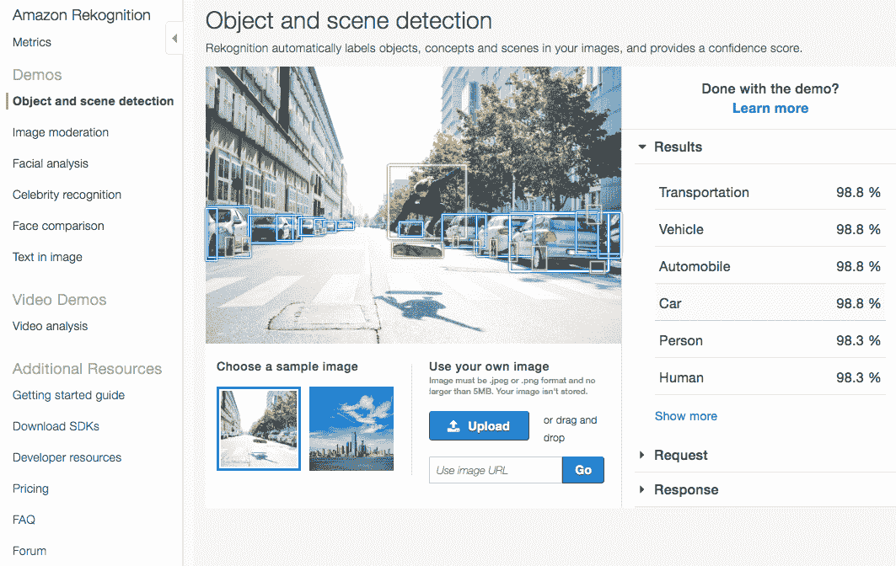

# 第一章：亚马逊网络服务上的人工智能简介

在本章中，我们将首先从一个高层次概述**人工智能**（**AI**）开始，包括其历史和广泛使用的方法。然后，我们将看看一些人工智能的应用，它们有潜力深刻改变我们的世界。随着对人工智能兴趣的增加，许多公司，包括亚马逊，都提供了丰富的工具和服务，帮助开发者创建智能化应用。我们将提供亚马逊网络服务（AWS）人工智能产品的高层次概述，并为如何最佳利用这些工具提供指导。作为一本实践性强的书籍，我们将迅速深入亚马逊网络服务的智能化应用开发。

我们将涵盖以下主题：

+   人工智能及其应用概览。

+   了解亚马逊网络服务在人工智能方面的不同产品。

+   如何设置亚马逊网络服务账户以及智能化应用开发环境。

+   获取亚马逊 Rekognition 及其他支持服务的实践经验。

+   开发我们的第一个智能化应用。

# 技术要求

本书的 GitHub 仓库，包含本章的源代码，可以在[`github.com/PacktPublishing/Hands-On-Artificial-Intelligence-on-Amazon-Web-Services`](https://github.com/PacktPublishing/Hands-On-Artificial-Intelligence-on-Amazon-Web-Services)找到。

# 什么是人工智能？

人工智能（AI）是一个总括性术语，描述了计算机科学的一个分支，旨在创建智能代理。人工智能领域高度技术化且专业化；其中包含了一整套理论、方法和技术，使计算机能够看（计算机视觉）、听（语音识别）、理解（自然语言处理）、说（文本转语音）以及思考（知识推理与规划）。

也许人工智能看起来是当下的流行词，但它自 1950 年代就已存在，当时模仿人脑的人工神经网络的早期工作激发了对思考机器的兴奋。尽管今天它在媒体中受到极大关注，但很难相信这个领域曾经历过两次“人工智能寒冬”，即对人工智能研究和发展的兴趣逐渐消退。如今，人工智能再次流行，得益于数据量的增加、存储成本的降低、算法的进步以及计算能力的提升。

人工智能最重要的子领域之一是**机器学习**（**ML**）。机器学习是人工智能中如此重要的一部分，以至于这两个术语如今经常被互换使用。机器学习是实现人工智能的最有前景的一组技术。这些技术为我们提供了一种通过自学习算法编程计算机的新方法，能够从数据中获取知识。我们可以训练机器学习模型，寻找模式并像人类一样得出结论。通过这些自学习算法，数据本身已经成为最有价值的资产。数据已成为各行业的竞争优势；它是新的知识产权。在类似的机器学习技术中（即便是较差的机器学习技术），最佳的数据将获胜。

旧的东西再次变得新颖。人工神经网络再次成为机器学习研究和开发的焦点。更多的数据、更强的计算能力以及新的算法，如反向传播，使得神经网络可以拥有许多隐藏层，这也被称为深度神经网络或深度学习。深度神经网络模型的准确度提高，在几年前几乎是不可能的。今天，深度学习是推动现代人工智能繁荣的重大突破。数据、软件和硬件的结合创造了一种新型智能代理，它们在获得与世界相关的丰富信息后，往往可以像人类一样看、听、理解、说话，甚至思考。

人工智能已成为技术领域的重要组成部分。无论大小企业，都在通过利用人工智能解决问题。人工智能的能力正在渗透到我们生活的各个方面，提升我们的记忆力、视力、认知能力等。大多数情况下，人工智能不会单独作为产品出售。相反，您已经使用的产品将通过人工智能得到改善，并成为智能化解决方案。对我们来说，最令人兴奋的是人工智能和机器学习技术与服务的普及。这些技术和服务的丰富性意味着从业者可以轻松利用人工智能，为影响我们生活、工作和娱乐方式的产品增添智能。

本书将帮助您成为一名人工智能从业者。我们将通过实践项目教您如何将人工智能能力嵌入软件解决方案所需的工具和技术。成功的智能化解决方案需要架构设计、软件工程和数据科学的结合。您将学习如何设计、开发、部署和维护具有人工智能能力的生产级软件解决方案。作为一名人工智能从业者，重要的是通过商业能力的视角看待人工智能，而不仅仅是技术视角。本书旨在将各种技能结合起来，帮助您培养直觉，以便设计出能够解决实际问题的优秀智能化解决方案。

# 人工智能的应用

我们的生活已经被 AI 应用深刻影响，包括我们如何搜索信息、购买商品、与他人交流等等。然而，我们仍处在这个智能软件文艺复兴的初期阶段。虽然许多惊人的 AI 应用已经存在，但我们不妨看看其中几个例子。

# 自动驾驶车辆

一个受到媒体广泛关注的 AI 应用是自动驾驶车辆，也称为自驾车。这些车辆能够感知周围的世界，并在几乎不需要人类干预的情况下驾驶。

这些自动驾驶车辆是传感器与 AI 技术的完美融合，二者结合创造了自动驾驶能力。为了开发自动驾驶能力，这些车辆已经在高速公路和地方道路上行驶了数百万英里，此外还在模拟中完成了更多的训练。来自各种传感器的数据，包括摄像头、雷达、激光雷达、声纳、GPS 等，被用于训练众多机器学习模型，以执行确保车辆在现实条件下安全行驶所需的感知与执行任务。最终的 AI 能力，如计算机视觉、物体检测、预测建模和障碍物避免算法，可以创建环境的复杂模型，使车载计算机能够理解，从而控制、规划路径和进行导航。

自动驾驶技术比人类驾驶员更不容易出错，并且有潜力拯救数十万人的生命免受车祸和事故的伤害。这项技术也可以成为无法自驾的人的出行方式，例如老年人或残疾人。撰写本文时，世界上并没有大规模部署的真正完全自动驾驶的车辆。我们甚至无法想象，这项技术将在未来几十年如何重新塑造我们的世界。

# 医疗保健中的 AI

AI 和机器学习正开始改变医疗行业。这些技术被用来改善诊断能力和临床决策，以加速许多疾病的检测与治疗。这些 AI 程序不仅仅是遵循预设的诊断流程来判断疾病。相反，AI 被*教会*识别特定医疗状况的症状，例如心律失常、糖尿病引起的视力丧失，甚至癌症。

医学影像是关于病人健康的丰富数据源。通过来自 X 光、MRI 和 CT 扫描的高分辨率图像，机器学习模型可以利用成千上万张带有特定医疗条件标签的示例图像进行训练。通过足够的示例，生成的机器学习模型能够以接近甚至超过人类医生的精确度诊断疾病。借助 AI 程序不知疲倦地分析宝贵的医学见解，它们可以帮助医生更快速、准确地做出诊断，从而让患者尽早接受治疗。

更深刻的是，最终的人工智能能力融合了帮助开发这些能力的最优秀医生和临床专家的知识和经验。一旦开发完成，这些能力可以被大规模复制并分发到初级保健办公室和门诊诊所，这些地方以前无法获得这种水平的医学专业知识。这可以通过早期发现和治疗疾病拯救成千上万的生命。它将对人们的生活产生深远的影响，尤其是在那些专业医生稀缺的地区。

# 个性化预测键盘

尽管在突破性的、革命性的甚至是登月级的人工智能应用中充满了兴奋，这些应用无疑将改变我们的世界，但你并不总是需要追求这些根本上困难的问题，就能用人工智能为我们的世界带来价值。

一个很好的例子是智能启用解决方案在最近现实世界问题中的应用——移动设备上的预测键盘。当触摸屏移动设备变得流行时，我们不得不学会在小型虚拟键盘上打字，通常是在移动中、用更少的手指并且面临更多的干扰。这些预测键盘通过建议我们可能想输入的单词和标点符号，帮助我们更快速地打字，从而减少了移动通信中的摩擦。

这些键盘的预测功能通常是通过机器学习和**自然语言处理**（**NLP**）技术构建的，结合了语言模型、定制词典和学习到的偏好，构成了它们的预测引擎。最好的预测引擎很可能是使用一种叫做**长短期记忆**（**LSTM**）的**递归神经网络**（**RNN**）来构建的。这些神经网络试图根据一段之前输入的文字预测下一个单词。成功预测的关键在于其速度和个性化。每次按键都会产生一个预测，因此预测引擎必须在移动硬件上运行得很快。这些预测引擎的设计目标是随着我们使用它们变得越来越智能；它们是人类参与的在线学习系统的良好例子。

虽然它们并没有拯救成千上万的生命，但这些预测键盘的用户却节省了万亿次的按键输入。我们就是喜欢这些智能启用的软件解决方案的优雅，它们应用了正确的人工智能技术来解决正确的问题。我们希望，通过本书中你将获得的技能和见解，你也能够找到优雅的人工智能应用来改善我们的生活。

# 为什么使用亚马逊云服务进行人工智能？

**亚马逊网络服务**（**AWS**）迄今为止是最大的、最全面的云计算平台。AWS 提供了一套广泛的按需云服务，包括计算、存储、数据库、网络、分析等多种服务。多年来，开发者利用这些服务以无法匹敌的规模和速度构建企业级软件解决方案，这种规模和速度是其他任何云计算平台都无法比拟的。

令人兴奋的是，AWS 还提供了大量的 AI 服务，提供预训练的 AI 能力，包括图像识别、自然语言处理（NLP）、语音识别和生成，以及对话代理。AWS 还提供 ML 服务，简化了通过 ML 和深度学习模型构建、训练和部署定制 AI 能力的过程。公司和开发者可以利用这些 AI 和 ML 服务，就像使用 AWS 的其他云计算服务一样轻松地为他们的软件解决方案增加智能。

然而，在 AWS 上开发智能解决方案的真正力量，在于开发者将 AWS 的 AI 和 ML 服务与其他 AWS 云计算生态系统结合使用。通过结合各种 AWS 服务，你将立即获得一个企业级云计算平台，具备高度可靠、可扩展和安全的基础设施。这使得你，作为 AI 从业者，能够轻松收集和处理大规模数据集，从而集成各种 AI 能力，快速原型化创意，并持续实验和迭代解决方案。

正如本书标题所示，这本书是一本实践指南。我们的目标是汇集设计和构建端到端 AI 解决方案所需的各种技能。这里的关键词是*技能*。我们不仅涵盖 AI 的重要概念，还帮助你通过众多实践项目将这些概念付诸实践。只有通过这些实际操作经验，你才能培养出设计良好的、智能化解决方案的直觉。本书中的项目可以部署到 AWS 云平台；你可以从中学习，可以增强它们，甚至可以向他人展示。

在庞大的 AWS 生态系统中工作将需要一个陡峭的学习曲线。新用户很容易被 AWS 提供的众多服务所压倒。在本书中，我们将教授你开发智能解决方案所需的模式和实践，以及 AWS 平台提供的众多服务。你将深入了解许多 AWS 服务及其**应用程序接口**（**APIs**）。你不仅将构建可工作的应用程序，还会理解使用这些服务和模式的选择。过程中，我们还将向你展示一些在 AWS 平台上工作的技巧和窍门。

AWS 由大量服务组成，并且仍在不断增长。关于这些服务的各种子集，已经有无数书籍和在线资源进行了深入探讨。在本书中，我们将重点介绍一些 AWS 服务，这些服务能够很好地协同工作，帮助您构建智能化应用程序。我们将涵盖大部分 ML 服务，以及计算、存储、网络和数据库等各种服务。请记住，本书无法涵盖这些服务的所有方面，更不用说涵盖每一项 AWS 服务了。

# AWS AI 产品概述

为了更好地理解 AWS AI 产品，我们可以将服务分为两个主要组。

下图展示了本书将涉及的 AWS AI 功能和 AWS ML 平台的子集，并按两个组进行组织：


AWS ML 服务的列表每年都在增加。例如，Amazon Personalize、Forecast、Textract 和 DeepRacer 在 *AWS re:Invent 2018* 大会上发布，并且当时是有限预览。这些服务在 2019 年中期左右开始对公众开放。

上图中的第一个组是 AWS AI 功能。这些服务是建立在 AWS 预训练的 AI 技术之上的。它们直接 *开箱即用*，为您的应用程序提供现成的智能。您无需理解这些技术背后的 AI 原理，也不需要维护托管它们的基础设施。AWS 已经为您完成了所有艰难的工作，并通过 API 提供这些 AI 功能。随着 AWS 不断改进这些功能，您的应用程序将自动变得更加智能，而您无需做任何额外的努力。这些托管服务能够快速提升您的应用程序，使得智能解决方案得以快速且经济地构建。

以下是这些 AWS AI 功能：

+   **Amazon Comprehend：** 一种使用机器学习（ML）技术分析文本中的洞察和关系的自然语言处理（NLP）服务。此技术使您的应用程序能够筛选大量非结构化文本，并挖掘出有价值的信息。这项服务可以执行各种任务，包括自动分类文档；识别实体，如公司名称、人物和地址；以及提取文本中的主题、关键短语和情感。

+   **Amazon Lex：** 一项用于通过语音或文本将对话界面集成到应用程序中的服务。这项功能使用深度学习技术，如 **自动语音识别**（**ASR**）和 **自然语言理解**（**NLU**），将语音转换为文本，并识别文本中的意图。这项技术与 Amazon Alexa 语音助手背后的技术相同，您也可以将这项技术嵌入到自己的应用程序中。

+   **Amazon Polly：** 一种将文本转换为逼真语音的服务，可以为您的应用程序增加人类语音。支持这项服务的文本转语音技术使用先进的深度学习技术，可以合成具有不同语言、性别和口音的语音。

+   **Amazon Rekognition：** 一种可以分析图像和视频以识别对象、人物、文本、场景和活动的服务。此服务还可以为各种应用程序提供精确的面部分析和识别。支持这项服务背后的深度学习技术已在数十亿张图像和视频上进行了训练，以在多种分析任务上实现高精度。

+   **Amazon Transcribe：** 一个提供语音到文本能力的 ASR 服务，可以为您的应用程序提供此技术。此技术允许您的应用程序分析存储的音频文件或实时音频流，并实时获取转录文本。

+   **AWS Translate：** 一种提供自然流畅语言翻译的神经机器翻译服务。这项服务由能够提供准确和自然音质翻译的深度学习模型支持。您甚至可以配置此服务以包括品牌名称、产品名称和其他自定义术语的自定义语言模型。

在前述图表中的第二组是 AWS ML 平台。这些服务是完全托管的基础架构和工具集，帮助开发人员通过 ML 构建和运行其自定义 AI 能力。AWS 提供开发构造并处理 ML 训练计算资源，以便更轻松地开发自定义 AI 能力。AI 从业者负责设计这些 AI 能力的内部工作原理。这可能包括：收集和清洗训练数据；选择 ML 库和算法；调整和优化 ML 模型；设计和开发接入 AI 能力的界面。利用 AWS ML 平台构建自定义 AI 能力肯定比使用托管 AI 服务更为复杂，但这组服务为您创建创新解决方案提供了最大的灵活性。

本书将涵盖的 AWS ML 平台是：**Amazon SageMaker**—一个完全托管的服务，涵盖整个 ML 工作流程。使用 SageMaker，您可以收集和处理训练数据；可以选择 ML 算法和 ML 库，包括 TensorFlow、PyTorch、MXNet、Scikit-learn 等；可以在 ML 优化的计算资源上训练 ML 模型；并可以调整和部署生成的模型，为您的应用程序提供专门创建的 AI 能力。

我们强烈建议您尽可能首先利用 AWS 托管的 AI 服务。只有在需要自定义 AI 能力时，才应使用 AWS AI ML 平台构建它们。

# 与 AWS 服务一起实践

不再废话，让我们动手操作一些 AWS 服务。本节中我们将使用的服务和执行的任务将为你在 AWS 上进行智能应用开发打下基础。

# 创建你的 AWS 账户

如果你还没有 AWS 账户，可以在[`aws.amazon.com/`](https://aws.amazon.com/)注册一个，然后点击**注册**按钮。你将看到以下屏幕：


你的 AWS 账户让你可以按需访问 AWS 上的所有服务。但不用担心——通过 AWS 的按使用付费定价模式，你只需为实际使用的服务付费，而且价格具有行业领先的亲民水平。如果这是你首次注册 AWS 账户，你的账户会自动获得 12 个月的免费套餐访问权限。免费套餐提供一定数量的 AWS 服务免费使用，包括计算、存储、数据库和 API 调用。免费套餐期满后，还有一些永不过期的免费资源。详情请访问[`aws.amazon.com/free`](https://aws.amazon.com/free)。

# 在 AWS 管理控制台中导航

现在，让我们熟悉一下 AWS 管理控制台。第一次登录 AWS 账户时，你将看到 AWS 管理控制台。它可能看起来像下面的截图：


AWS 管理控制台是一个网页界面，你可以在其中管理 AWS 云平台。通过这个控制台，你可以启动、监控和停止各种资源，例如云计算和云存储；你可以管理你的 AWS 账户设置，包括月度账单和细粒度访问控制；你甚至可以访问教育资源，帮助你入门使用 AWS 提供的各种服务。

AWS 管理控制台是你与 AWS 云平台交互的三种方式之一。其他两种方式分别是 AWS **命令行界面**（CLI）和 AWS **软件开发工具包**（SDK）。我们将在本章稍后讨论这两种方式。

# 查找 AWS 服务

在 AWS 管理控制台上，你可以点击控制台左上角的**服务**选项卡。在这里，你将看到按照组别组织的各种 AWS 服务。你也可以通过名称搜索服务；搜索通常是快速找到你所需服务的方式。

你的**服务**选项卡应该看起来像这样：


# 选择 AWS 区域

不是每个 AWS 服务都可以在每个 AWS 区域使用。AWS 是一个全球云基础设施，基于 AWS 区域的概念构建。AWS 区域是你可以运行云应用程序的世界上一个物理位置。根据你选择操作的区域，某些服务可能不可用。例如，在我们创建账户时，默认区域是 US East（Ohio）。在写作时，俄亥俄区域没有 Amazon Lex 服务。

如果某个服务在某个区域不可用，你会看到**区域不支持**的消息，类似于这样：


对于本书，我们建议你将区域更改为**US East**（**N. Virginia**），也就是**us-east-1**区域。这个北弗吉尼亚区域提供了所有 AWS 服务，而且是首批获得最新 AWS 服务的区域。

点击 AWS 账户名旁边的区域名称，选择北弗吉尼亚地区。这一步很重要，以确保本书中的示例和项目保持一致。**US East (N. Virginia)**区域是以下截图中的首选：


# 测试 Amazon Rekognition 服务

让我们尝试一下 AWS 托管的 AI 服务——Amazon Rekognition，感受一下 AWS 的 AI 能力：

1.  在**机器学习**下的服务列表中点击**Rekognition**，进入其主页。

1.  Rekognition 提供了一套视觉分析功能，用于分析图像和视频。通过 Rekognition，你可以快速为图像和视频中的物体、面孔和文字检测添加强大的功能。你无需理解这些功能背后的深度学习技术，就可以将它们添加到你的应用中。在本书中的实践项目中，我们将创建多个这样的应用，但现在，让我们通过其中一个演示，看看 Rekognition 的能力如何发挥作用。

1.  从 Amazon Rekognition 主页的左侧窗格中，点击**演示**部分下的**物体和场景检测**。

1.  AWS 已经提供了几张示例图片来展示 Rekognition 的强大功能。在其中一张图片中，你和我都可以轻松看到，一个滑板运动员正在一条路上做特技，路两侧停满了车。这对于计算机来说是一个相当繁忙的图像，进行分析并不容易。

1.  那么，Rekognition 的表现如何呢？Rekognition 已经为它检测到的物体画上了框，你可以将鼠标悬停在这些框上，以查看 Rekognition 认为每个物体是什么。

这是 Rekognition 演示页面，展示了滑板运动员图像的检测结果：



1.  在图像的右侧，在**结果**下，Rekognition 还提供了它检测到的所有物体的置信度水平。

在置信度等级下方还有**请求**和**响应**。实际上，这个演示页面实际上是在代表你调用 Rekognition 的对象和场景检测 API。如果你展开请求，它会显示有关 API 调用的一些细节：

```py
{
 "Image": {
   "S3Object": {
        "Bucket": "console-sample-images",
        "Name": "skateboard.jpg"
    }
   }
}
```

请求采用**JavaScript 对象表示法**（**JSON**）格式。请求指定要通过 Rekognition API 分析的图像。更具体地说，这是一个作为对象存储在 Amazon **简单存储服务**（**S3**）中的图像。从请求中可以看出，图像存储在 `console-sample-images` 桶中，名称为 `skateboard.jpg`。

这个演示应用程序使用 Amazon S3 服务来存储示例图像，Rekognition 可以直接分析存储在 S3 中的图像。在后续章节的许多项目中，我们也将利用这种模式。正如我们之前提到的，AWS 生态系统的强大之处在于其众多服务之间的互操作性。

响应也是 JSON 格式。响应包含了有关在示例图像中检测到的对象的许多信息。此信息包括对象的名称、检测的置信度，甚至是每个对象在图像中所在边界框的坐标。在我们的项目中，我们将学习如何处理这种 JSON 响应，以便在智能化应用程序中使用结果。

在这个演示中，你还可以上传自己的图像来测试 Rekognition。找一张图片试试看。当你将图片上传到演示页面时，你会注意到发送到 API 的请求稍有不同。在请求中，你会看到以下内容：

```py
{
   "Image": {
     "Bytes”: “...”
    }
}
```

这一次，上传的图像的原始字节直接发送到 Rekognition API，而不是指定 S3 中的图像。这个 Rekognition API 有多个变体：一个是引用 S3 对象，另一个是接受图像的原始字节。你选择哪个变体取决于你应用程序的性质。

# 使用 S3

Amazon S3 服务是 AWS 提供的首批服务之一。S3 提供安全、耐用、可扩展的对象存储，并且成本非常低。对象存储意味着你存储在 S3 中的内容是按文件级别进行访问的，而不是按块或字节级别进行访问。S3 是一个非常灵活的服务，具有多种使用模式。你可以在 [`aws.amazon.com/s3`](https://aws.amazon.com/s3) 上查看更多有关 Amazon S3 的信息。

让我们开始使用 Amazon S3 创建一个桶。你可以将桶视为一个文件夹，它可以存储无限数量的文件（对象）。

从 Amazon 管理控制台的左上角点击**服务**标签，然后在**存储**下点击或搜索**S3**，即可导航到 Amazon S3 的主页。如果这是你第一次使用 S3，你将看到一个类似于这个的页面：


在本书中，我们将在实践项目中大量使用 S3。我们将把 S3 用于三个主要目的。第一个目的是存储媒体文件和其他内容，以便其他 AWS 服务访问。许多 AWS AI 服务与 S3 紧密集成；例如，我们在 Rekognition 演示中看到了这种模式。第二个目的是使用 S3 托管整个静态网站，包括 HTML 文件、图像、视频和客户端 JavaScript。这使我们能够托管互动式 web 应用，而无需传统的 Web 服务器。第三个目的是将 S3 用作数据存储，用于收集、处理和分析任务，尤其是在训练我们自定义的机器学习模型时。

S3 存储类有多种，这些存储类已经针对不同的使用场景和成本层级进行了重新设计。对于您的企业级应用，您可能需要利用不同的存储类来平衡性能和成本。在本书中，我们将使用 Amazon S3 标准存储类进行通用存储。这是默认的存储类，足以满足本书中的项目需求。

点击 **创建桶** 按钮以创建一个新桶：


模型的第一屏要求提供三项信息：**桶名称**、**区域** 和 **从现有桶复制设置**。由于这是您的第一个桶，因此我们可以忽略第三项信息。

S3 桶名称必须是全球唯一的。这意味着您和其他人创建的每个桶名称都必须是唯一的。创建一个全球唯一的桶名称可能会很具挑战性；您不能指望像 `contents`、`website` 或 `data` 这样的名称仍然可用。S3 桶名称必须符合 DNS 标准，以便您可以遵循类似域名的命名模式。例如，如果我们选择 `aws.ai` 作为根域名，则可以创建诸如 `contents.aws.ai`、`website.aws.ai` 和 `data.aws.ai` 之类的桶名称以避免冲突。请考虑一下您希望使用的根域名。

您不需要拥有域名就能使用指定的根域名命名桶；不过，如果您拥有域名，最好将其作为根域名使用。

您还必须指定桶的区域。这将决定您的对象将在全球的哪个物理区域存储。AWS 各区域之间是完全隔离的设计。存储在一个区域的对象不能被运行在另一个区域的服务和应用访问。如果您的业务线有高性能要求，需要将应用和数据部署得离客户更近，这一点就非常重要。如果您的业务线必须遵守行业和政府规定，要求应用和数据必须位于某个特定地理位置，这一点同样重要。

对于本书中的项目，我们不需要担心这两个问题。因此，为了保持一致性，我们再次选择**美国东部（弗吉尼亚北部）**区域。

这是你创建后的**S3 存储桶**页面的样子，当然，存储桶名称会不同：


一旦创建了 S3 存储桶，点击**contents.aws.ai**存储桶。你将看到类似这样的界面：


在这个界面，你将能够上传文件到存储桶，配置存储桶属性，设置访问权限，并执行一些高级设置，比如生命周期规则和跨区域复制。我们稍后会回到这些设置，但现在请上传一些你想用 Rekognition 服务分析的照片。你可以点击**上传**按钮，或将照片直接拖放到页面上进行上传。我们现在可以将所有文件设置保持为默认。

恭喜你，刚刚将文件存储到 AWS 云平台，具有 99.999999999%的持久性和 99.99%的可用性！换句话说，如果你在 S3 中存储 10,000 个文件，按统计学来说，你将每 1000 万年丢失一个文件，而且所有文件在每年 525,600 分钟中的 525,547.4 分钟里都可以被你的应用程序访问。

# 身份与访问管理

我们接下来要看的 AWS 服务是**身份与访问管理**（**IAM**）。IAM 允许你安全地管理对其他 AWS 服务和资源的访问。AWS 提供企业级的安全性和访问控制，非常适合在云中构建生产级应用程序。然而，如果你是 AWS 新手，初次使用 IAM 可能会有些挑战。如果没有授予必要的访问权限，服务将直接拒绝执行所需的操作。我们将在本书中的项目中频繁使用 IAM，你将逐渐熟悉诸如用户、组和角色等概念，从而为你的应用程序提供所需的服务访问权限。

为了访问 IAM 主页，点击**安全、身份与合规性**下的**IAM**服务列表中的**IAM**，你将导航到其主页。IAM 主页应该类似这样：


IAM 仪表板为你提供 IAM 资源及其安全状态的概览。目前我们没有任何用户或组，但 AWS 默认创建了两个角色。

我们一直在使用根账户访问 AWS 管理控制台。默认情况下，这个账户只能访问 AWS 管理控制台；它无法通过程序化方式与 AWS 服务交互。我们现在创建一个具有程序化访问权限的新用户，供动手项目使用。

在左侧面板点击**用户**，然后点击**添加用户**按钮：


在输入所需的用户名后，确保只选择**Programmatic access**。编程访问将启用访问密钥 ID 和秘密访问密钥对。这个密钥对可以被 AWS API、CLI 和 SDK 使用。通常的做法是将每个用户限制为编程访问或 AWS 管理控制台访问。

在这里，我们创建了一个只有编程访问权限的`aws_ai`用户：


在下一屏幕上，我们还需要创建一个组来管理权限。我们建议将用户添加到一个或多个具有必要权限的组中，而不是直接将单独的权限和策略附加到用户。这种方式更容易管理权限，尤其是当你的组织中有很多用户需要不同权限时。

点击**Create group**按钮，位于**Add user to group**下，如下所示：


对于我们的组，命名为`Developer`，然后将**AdministratorAccess**策略附加到该组：


我们无需创建任何标签，因此只需审核并创建该用户。

为了简便起见，我们附加了一个功能强大的策略，允许完全访问 AWS 服务。对于你的生产环境，你需要更细致地管理权限和策略。在系统安全性方面，始终遵循最小权限原则。

用户创建完成后，你将看到**Success**屏幕：


在此屏幕上，你可以选择查看或下载我们之前提到的访问密钥对。这是唯一一次可以显示或下载密钥对，因此请将 CSV 文件下载到你的计算机上。稍后在本章节中，我们需要在使用 AWS CLI 和 AWS SDK 时用到这个密钥对。

访问密钥对相当于你的用户名和密码组合。务必不要与他人共享你的密钥对，因为它将授予他人访问你的 AWS 资源的权限，但账单却会由你来承担。另外，切勿在源代码中硬编码密钥对，并将其提交到公共源代码仓库。现在有一些自动化机器人会扫描代码库，寻找 AWS 密钥对，以窃取资源进行黑客攻击或加密货币挖掘。

恭喜你，你刚刚使用 IAM 服务创建了一个用户并将其添加到具有管理员权限的组！如果你返回到仪表板，你会看到我们已经将其添加到 IAM 资源中，并且在安全状态方面取得了进展：


我们强烈建议你完成安全状态部分剩余的两个步骤。第一个剩余步骤是激活 **多因素认证**（**MFA**）以保护你的根账户。激活 MFA 会增加根账户的安全性，要求任何人登录时必须同时提供根账户密码（你知道的东西）和来自身份验证设备的动态令牌（你拥有的东西），例如智能手机。第二个剩余步骤是设置 IAM 密码策略，以确保遵循安全的密码实践。你可以定义密码的长度、复杂度、过期期限等。

# 熟悉 AWS CLI

AWS CLI 是一个允许你通过在终端 shell 中发出命令与 AWS 服务交互的工具。在本章之前，我们通过基于 Web 的 AWS 管理控制台与一些 AWS 服务进行了交互。虽然 Web 控制台是新用户熟悉 AWS 的最简单界面，但在软件开发过程中使用起来可能会显得繁琐。通过 AWS CLI 工具，你可以获得与 Web 控制台相同的所有功能，但这些功能直接在终端 shell 中触手可得，而终端是你大多数开发工具所在的地方。这样，你的开发过程将更加流畅，无需频繁切换到浏览器。

AWS CLI 主要通过 Python 包管理器分发；因此，你需要先在开发机器上安装 Python。请注意，我们将在开发项目中使用 Python。按照说明安装 Python 非常重要，这样可以确保你以后开发环境的兼容性。

# 安装 Python

Python 可用于所有三大主流操作系统：macOS、Linux 和 Microsoft Windows。你可以在 [`www.python.org`](https://www.python.org) 上找到安装程序和文档。本书是针对 Python 3.7.x 或更高版本编写的（除非另有说明），建议你使用最新版本。

# 在 macOS 上安装 Python

虽然 Python 已经预安装在 macOS 上，但该版本的 Python 是 2.7。要安装更新版本的 Python，我们建议使用一种名为 Homebrew 的 macOS 包管理器。Homebrew 被誉为 macOS 缺失的包管理器；它简化了许多 macOS 软件包的安装，包括 Python。要安装 Homebrew，请按照其网站上的说明操作：[`brew.sh`](https://brew.sh)。在写作时，在终端中安装 Homebrew 的命令如下：

```py
$ /usr/bin/ruby -e "$(curl -fsSL https://raw.githubusercontent.com/Homebrew/install/master/install)"
```

安装完 Homebrew 后，我们可以使用以下终端命令安装最新版本的 Python 和 pip，后者是 Python 包管理系统：

```py
$ brew install python3
$ brew install pip3
```

使用终端命令检查最新的 Python 和 pip 版本是否已经正确链接到你的系统：

```py
$ python --version
$ pip --version
```

这些命令的输出应分别显示类似于 3.7+ 和 18.0+ 的版本号。

# 在 Linux 上安装 Python

有许多不同的 Linux 发行版可供选择。安装 Python 的指令可能会有所不同，具体取决于你的 Linux 发行版。一般来说，你应该首先检查系统中是否已安装 Python，可以在终端中运行以下命令：

```py
$ python --version
$ pip --version
```

如果没有安装 Python 或 pip，或安装了不同版本的 Python，可以通过 Linux 发行版的包管理器进行安装：

+   对于 Debian 衍生版本，如 Ubuntu，使用`apt`：

```py
$ sudo apt-get install python3 python3-pip
```

+   对于 Red Hat 衍生版本，如 Fedora，使用`yum`：

```py
$ sudo yum install python python-pip
```

+   对于 SUSE 衍生版本，使用`zypper`：

```py
$ sudo zypper install python3 python3-pip
```

# 在 Microsoft Windows 上安装 Python

设置 Python 环境有多种选择，具体取决于你使用的是 Microsoft Windows 10 还是较早版本的 Windows。

# Windows 10

如果你正在使用 Windows 10，我们强烈建议你安装**Windows Subsystem for Linux**（**WSL**）。WSL 允许你在 Windows 操作系统上运行你选择的 Linux 发行版。

首先，你需要启用 WSL，这是 Windows 10 中的一个可选功能。为此，请以管理员身份打开 PowerShell，并运行以下命令：

```py
> Enable-WindowsOptionalFeature -Online -FeatureName Microsoft-Windows-Subsystem-Linux
```

如果系统提示，请重新启动计算机。

接下来，你可以从 Windows 商店下载并安装你喜欢的 Linux 发行版。截至本文撰写时，WSL 可用的 Linux 发行版有五个：Ubuntu、OpenSUSE、SUSE Linux Enterprise Server、Debian GNU/Linux 和 Kali Linux。

一旦你安装了所需的 Linux 发行版，你就可以按照该发行版的 Python 安装说明进行操作。

# 早期版本的 Windows

如果你使用的是较早版本的 Windows，建议使用 Anaconda Python 发行版和包管理器。你可以在 [`www.anaconda.com/download`](https://www.anaconda.com/download) 找到 Anaconda 安装程序和相关文档。

# 安装 AWS CLI

一旦 Python 在你的开发机器上成功安装，我们就可以继续安装 AWS CLI。AWS CLI 主要通过 Python 包管理器`pip`进行分发，而我们刚刚安装了它。你可以使用以下命令来安装并验证 AWS CLI：

```py
$ pip install awscli
$ aws --version
```

请注意，AWS CLI 的命令是`aws`，尽管我们安装的软件包是`awscli`。

# 配置 AWS CLI

在使用 AWS CLI 之前，我们需要执行一些配置步骤。配置 AWS CLI 的最快方法是使用以下命令：

```py
$ aws configure
AWS Access Key ID [None]: <your access key>
AWS Secret Access Key [None]: <your secret key>
Default region name [None]: us-east-1
Default output format [None]: json
```

上述代码的解释如下：

+   我们需要输入的前两项是安全凭证，以便 CLI 可以代表你执行操作。这是我们在使用 IAM 服务创建新用户时下载的 CSV 文件中包含的密钥对。打开 CSV 文件并将访问密钥 ID 和密钥访问密钥复制并粘贴到配置命令提示符中。

+   接下来，对于默认区域名称，我们将在本书中保持一致，继续使用`us-east-1`。

+   最后，对于默认输出格式，输入 `json`。这将把 AWS CLI 的输出设置为 JSON 格式。

AWS 配置命令会在您的用户主目录中创建一个隐藏目录 `.aws`，例如在 macOS 和 Linux 上是`~/.aws`。在该目录中，会创建两个文件。一个是 `.aws/credentials`，其中包含以下代码：

```py
[default]
aws_access_key_id = YOUR_ACCESS_KEY
aws_secret_access_key = YOUR_SECRET_KEY
```

另一个文件是 `.aws/config`，其中包含以下代码：

```py
[default]
region = us-east-1
output = json
```

在您的系统上找到这些文件，并验证其内容。

如果您没有记录或下载访问密钥对，可以在 AWS 管理控制台中获取新的密钥对：

1.  在**安全、身份与合规**部分下，导航到**IAM**服务。

1.  在**IAM** **管理控制台**中，点击右侧窗格中的**用户**，然后点击您的用户名。

1.  在用户总结页面，点击**安全凭证**标签。

1.  在**访问密钥**部分，点击**创建访问密钥**按钮，系统将为您创建一个新的访问密钥。

1.  请记得在创建新密钥对后删除旧的密钥对。

这就是您的屏幕显示效果：


记得每次更改访问密钥时，都需要使用以下命令重新配置您的 AWS CLI：

```py
$ aws configure
```

输入您的安全凭证、默认区域和默认输出格式，如我们在初始 AWS CLI 配置中所述。

要测试 AWS CLI 是否配置正确，请执行以下命令：

```py
$ aws s3 ls
2018-12-01 18:01:20 contents.aws.ai
2018-12-01 18:01:49 data.aws.ai
2018-12-01 18:01:35 website.aws.ai
```

此命令将打印出您 AWS 账户中的所有 S3 桶。更具体地说，此命令列出了与访问密钥相关联的用户有权限查看的 S3 桶。记得我们之前配置 CLI 时使用的密钥对吗？它属于一个我们授予了管理员权限的用户。管理员策略中的一个权限允许该用户访问 S3。无论如何，您应该能够通过 AWS 管理控制台看到我们在本章前面部分创建的 S3 桶。

# 使用 AWS CLI 调用 Rekognition 服务

现在，让我们通过 AWS CLI 调用 Amazon Rekognition 的物体检测功能。这次，我们将在存储在 S3 桶中的图像上执行物体检测。我们将使用 Pexels 网站上的一张示例图片，Pexels 是一个拥有成千上万张免版税图片的网站。请下载 [`www.pexels.com/photo/animal-beagle-canine-close-up-460823/`](https://www.pexels.com/photo/animal-beagle-canine-close-up-460823/) 上的图像，并将其上传到 `contents` S3 桶。

在这里，我们可以看到一只可爱的比格犬小狗躺在看起来像是碎石床上的样子：


当您列出 `contents` 桶中的对象时，应该看到如下输出：

```py
$ aws s3 ls s3://<YOUR BUCKET>
2018-12-02 13:31:32     362844 animal-beagle-canine-460823.jpg
```

现在我们有了图像，可以通过以下 CLI 命令调用 Rekognition 的物体检测功能。请注意，我们必须用 `\` 转义 `{` 和 `}` 字符，并且在命令行中指定 S3 对象时，不能包含任何空格：

```py
$ aws rekognition detect-labels --image S3Object=\{Bucket=<YOUR BUCKET>,Name=animal-beagle-canine-460823.jpg\}
```

结果几乎瞬间返回：

```py
{
 "Labels": [
 {
 "Name": "Mammal",
 "Confidence": 98.9777603149414
 },
 {
 "Name": "Pet",
 "Confidence": 98.9777603149414
 },
 {
 "Name": "Hound",
 "Confidence": 98.9777603149414
 },
 {
 "Name": "Dog",
 "Confidence": 98.9777603149414
 },
 {
 "Name": "Canine",
 "Confidence": 98.9777603149414
 },
 {
 "Name": "Animal",
 "Confidence": 98.9777603149414
 },
 {
 "Name": "Beagle",
 "Confidence": 98.0347900390625
 },
 {
 "Name": "Road",
 "Confidence": 82.47952270507812
 },
 {
 "Name": "Gravel",
 "Confidence": 74.52912902832031
 },
 {
 "Name": "Dirt Road",
 "Confidence": 74.52912902832031
 }
 ]
}
```

输出为 JSON 格式，就像我们配置 CLI 输出一样。从输出中可以看到，Rekognition 服务检测到多个物体或标签。Rekognition 确信它检测到了狗，甚至识别出了这只狗的品种是比格犬！Rekognition 还检测到了图像中的碎石，这可能是泥土道路的一部分。当我们尝试 AWS 服务并查看输出结构时，AWS CLI 非常有用，它帮助我们了解开发应用程序时的输出结构。

# 使用 Python 进行 AI 应用程序开发

Python 是最受欢迎的编程语言之一。由于它在数据科学和机器学习社区中的广泛使用，Python 也是增长最快的编程语言之一。开发者和开源社区贡献了大量的附加库。这些库使 Python 开发者能够做几乎所有事情，从数据分析到深度神经网络，从简单脚本到 Web 应用程序开发。

对于 AI 和机器学习，Python 是事实上的标准语言。流行的 scikit-learn 库为开发者提供了访问许多有用机器学习算法的途径。还有许多深度神经网络的库，例如 MXNet 和 TensorFlow。

在本书中的每个动手项目中，我们都将使用 Python：

+   在本书的前半部分，我们将使用 AWS AI 服务创建智能解决方案。在这些项目中，我们将使用 Python 创建后端组件、API 和 Web 应用程序，让我们的智能创作得以实现。AWS 提供了一个名为 Boto 的 Python SDK。通过 Boto，我们可以从应用程序与所有 AWS 服务进行交互，包括托管的 AI 能力。

+   在本书的后半部分，我们将使用 AWS ML 服务训练自定义机器学习模型。在这些项目中，我们将使用 Python 处理数据、训练机器学习模型并部署智能功能。除了 Boto SDK，我们还将使用 AWS 的 SageMaker、**弹性 MapReduce**（**EMR**）等许多库。

# 设置 Python 开发环境

让我们从设置本地开发环境开始。由于我们在项目中构建的是端到端的解决方案，因此我们需要安装许多包和依赖项。我们所需要的包并不总是标准库的一部分。有时我们的项目需要特定版本的库才能使各个组件正常协作。因此，按照本章中描述的步骤安装这些包是非常重要的。

# 使用 Pipenv 设置 Python 虚拟环境

我们将使用 Python 虚拟环境来管理本书中的项目包。虚拟环境是一种 Python 化的方式，用于创建一个自包含的项目目录树，包含特定版本的 Python 和特定于项目的包组合。

使用 Python 虚拟环境有很多好处：

+   由于项目的所有包和依赖项都在配置文件中指定，因此其他开发人员可以轻松复制项目的开发环境；这在团队协作时非常有用。

+   即使你是独自工作，拥有一个虚拟环境也会帮助你在一台或多台计算机上为开发、测试和部署创建（并重建）环境。

+   虚拟环境还允许你创建独立的 Python 环境，在其中可以安装 Python 依赖项的并行副本。这样，我们就可以在同一台计算机上为不同项目保留不同的 Python 版本和包，而不会发生冲突。

Pipenv 是 Python 虚拟环境中的新兴工具，但它已被推崇为[python.org](https://www.python.org/)官方推荐的 Python 打包工具。要安装`pipenv`，我们将使用 Python 的包管理工具 Pip：

```py
$ pip install pipenv
$ pipenv --version
```

该命令将帮助你安装并验证`pipenv`。

# 创建你的第一个 Python 虚拟环境

现在我们已经安装了 Python 工具集，让我们通过创建一个可以与 AWS 云平台交互的 Python 项目来测试它。首先，让我们为项目创建一个名为`ObjectDetectionDemo`的目录。在该目录中，我们使用`pipenv`初始化一个 Python 3 虚拟环境，如下所示：

```py
$ mkdir ObjectDetectionDemo
$ cd ObjectDetectionDemo
$ pipenv --three
```

执行这些命令后，`ObjectDetectionDemo`目录将包含一个`Pipfile`。`Pipfile`是一个`pipenv`配置文件，指定了该项目的 Python 包及其依赖项。

接下来，我们为`ObjectDetectionDemo`项目指定并安装 AWS Python SDK，Boto：

```py
$ pipenv install boto3
```

可能需要几分钟的时间让 Pipenv 与 Python 包索引同步并安装`boto3`包及其依赖项。安装完成后，你的 Pipfile 应包含以下内容：

```py
[[source]]
url = "https://pypi.org/simple"
verify_ssl = true
name = "pypi"

[packages]
"boto3" = "*"

[requires]
python_version = "3.7"
```

如你所见，`boto3`在包部分下有一个条目。目前，版本号列为`*`，这意味着使用最新版本。如果需要，你可以将`*`替换为任何包的特定版本。

# 第一个使用 AWS SDK 的项目

现在，让我们编写第一个 Python 应用程序，检测存储在 S3 存储桶中的图像中的物体。为此，我们将利用`boto3`与 Amazon S3 服务和 Amazon Rekognition 服务进行交互：

你可以使用任何文本编辑器，或你喜欢的 Python **集成开发环境** (**IDE**) 来创建 Python 源文件。如果你没有偏好，建议你查看 JetBrains PyCharm，[`www.jetbrains.com/pycharm/`](https://www.jetbrains.com/pycharm/)，这是一款跨平台的 Python IDE，提供代码编辑、代码分析、图形调试器、集成单元测试和版本控制系统的集成。

1.  我们将创建的第一个源文件是 `storage_service.py`。在 `ObjectDetectionDemo` 目录中创建此源文件。以下是 `storage_service.py` 的 Python 代码：

```py
import boto3

class StorageService:
    def __init__(self):
        self.s3 = boto3.resource('s3')

    def get_all_files(self, storage_location):
        return self.s3.Bucket(storage_location).objects.all()
```

在这段代码中，请注意以下信息：

+   +   `storage_service.py` 包含一个 Python 类 `StorageService`，它封装了与 Amazon S3 交互的业务逻辑。

    +   该类仅实现了一个方法 `get_all_files()`，该方法返回由 `storage_location` 参数指定的存储桶中的所有对象。

    +   与 Amazon S3 相关的其他功能也可以在此文件中实现，例如列出存储桶、向存储桶上传文件等。

1.  接下来，我们将创建的源文件是 `recognition_service.py`。也在 `ObjectDetectionDemo` 目录中创建此源文件。以下是 `recognition_service.py` 的 Python 代码：

```py
import boto3

class RecognitionService:
    def __init__(self):
        self.client = boto3.client('rekognition')

    def detect_objects(self, storage_location, image_file):
        response = self.client.detect_labels(
            Image = {
                'S3Object': {
                    'Bucket': storage_location,
                    'Name': image_file
                }
            }
        )

        return response['Labels']
```

在这段代码中，请注意以下信息：

+   +   `recognition_service.py` 包含一个 Python 类 `RecognitionService`，它封装了与 Amazon Rekognition 服务交互的业务逻辑。

    +   该类仅实现了一个方法 `detect_objects()`，该方法调用 Rekognition 的检测标签 API，并返回响应中的标签。

    +   调用此方法的用户可以分别通过 `storage_location` 和 `image_file` 参数指定 S3 存储桶和文件名。

    +   与 Amazon Rekognition 相关的其他功能也可以在此文件中实现，例如文本检测、面部分析等。

1.  最后一个要创建的文件是 `object_detection_demo.py`。在 `ObjectDetectionDemo` 目录中创建此源文件。以下是 `object_detection_demo.py` 的 Python 代码：

```py
from storage_service import StorageService
from recognition_service import RecognitionService

storage_service = StorageService()
recognition_service = RecognitionService()

bucket_name = 'contents.aws.ai'

for file in storage_service.get_all_files(bucket_name):
    if file.key.endswith('.jpg'):
        print('Objects detected in image ' + file.key + ':')
        labels = recognition_service.detect_objects(file.bucket_name, file.key)

        for label in labels:
            print('-- ' + label['Name'] + ': ' + str(label['Confidence']))
```

在这段代码中，`object_detection_demo.py` 是一个 Python 脚本，它将我们两个服务的实现整合在一起，以便对存储在 S3 存储桶中的图像进行目标检测。

下面是描述演示应用程序流程的交互图：


请注意以下信息，所有这些内容都在前面的图中展示：

+   这个脚本调用 **StorageService** 来获取存储在 `contents.aws.ai` 存储桶中的所有 JPG 图像文件（你应该将其替换为自己的存储桶）。

+   在这里，为了简化，我们硬编码了存储桶名称，但你可以将存储桶名称作为参数传入，以使脚本更加通用。

+   然后，对于指定存储桶中的每个图像，脚本会调用我们的 **RecognitionService** 来执行物体检测，并返回检测到的标签。

+   脚本还会格式化并打印出这些标签，以及与检测到的物体相关的置信度分数。

请注意，我们在 **StorageService** 和 **RecognitionService** 中都使用了 `boto3`。`boto3` 对象管理我们项目代码与 AWS 服务之间的会话。这些会话是使用运行时环境中的可用凭证创建的。如果你在本地开发机器上运行脚本，那么 AWS 访问密钥对将从 `~/.aws/credentials` 文件中获取。我们将在后续章节中讨论如何在其他运行时环境中使用凭证。

为了简单起见，我们保持了项目代码的简洁和简单。我们将在后续的动手项目中增强这些 Python 类。

即使这只是一个演示项目，组织代码并实现关注点分离仍然是一个很好的实践。在本项目中，所有与 Amazon S3 服务交互的业务逻辑都封装在 `StorageService` 类中；与 Amazon Rekognition 服务交互的所有逻辑则封装在 `RecogntionService` 类中。随着项目规模和复杂度的增加，我们将看到这种设计实践的更多好处。

1.  现在，让我们通过进入虚拟环境的 shell，运行以下脚本：

```py
$ pipenv shell
```

在此命令中，请注意以下信息：

+   +   此命令在你的普通终端 shell 中启动一个带有 Python 虚拟环境的 shell。

    +   在虚拟环境 shell 中，我们指定并通过 `pipenv` 安装的 Python 版本和包都可供脚本使用。

1.  在虚拟环境中，通过以下命令调用 `object_detection_demo.py` 脚本：

```py
$ python object_detection_demo.py
```

该命令的输出应显示在指定的 S3 存储桶中检测到的物体：

```py
Objects detected in image animal-beagle-canine-460823.jpg:
-- Pet: 98.9777603149414
-- Hound: 98.9777603149414
-- Canine: 98.9777603149414
-- Animal: 98.9777603149414
-- Dog: 98.9777603149414
-- Mammal: 98.9777603149414
-- Beagle: 98.0347900390625
-- Road: 82.47952270507812
-- Dirt Road: 74.52912902832031
-- Gravel: 74.52912902832031
```

1.  记得通过 `exit` 命令退出虚拟环境并返回到正常的终端 shell：

```py
$ exit
```

恭喜你，你刚刚创建了第一个利用 AI 技术进行图像分析的智能应用程序，并且它运行在 AWS 平台上！坐下来好好想一想；只用几行代码，你就能够创建一个可以检测并识别我们世界中无数物体的软件。这就是你通过利用 AWS AI 服务所能获得的快速提升。

# 总结

在这一章中，我们了解到 AI 已经存在了很长时间，但由于机器学习（ML）的重新兴起，特别是人工神经网络的出现，它现在再次变得流行。我们查看了 AI 和 ML 的几个现实应用案例。我们概述了 AWS 提供的两大类 AI 产品；AWS AI 服务可以在开发智能应用时提供快速支持，而 AWS ML 平台则允许你构建针对特定应用的定制 AI 能力。我们建议你首先尝试利用 AWS 提供的 AI 服务，只有在你有特定需求并且具备数据竞争优势的情况下，才考虑开发定制的 AI 能力。

我们通过实践经验熟悉了 AWS 上的多个服务，包括 AI 服务和其他配套的云服务。我们还为 AI 应用设置了本地开发环境，包括 Python、AWS CLI 和 Python 虚拟环境。随后，我们使用 Amazon S3 和 Amazon Rekognition 服务创建了第一个智能化应用。

在下一章中，我们将深入探讨 AI 应用的组件和架构。我们将为许多即将进行的实践项目设立架构模板，更重要的是，我们将讨论该架构模板所基于的设计原则和决策。

# 参考资料

你可以访问以下链接获取更多关于 AWS 上 AI 的信息：

+   [`www.sciencenews.org/article/future-ai-may-diagnose-eye-problems`](https://www.sciencenews.org/article/future-ai-may-diagnose-eye-problems)

+   [`www.sas.com/en_us/insights/analytics/what-is-artificial-intelligence.html`](https://www.sas.com/en_us/insights/analytics/what-is-artificial-intelligence.html)

+   [`adage.com/article/cmo-strategy/google-backed-video-puts-viewers-a-driving-cars/312542/`](https://adage.com/article/cmo-strategy/google-backed-video-puts-viewers-a-driving-cars/312542/)

+   [`blog.swiftkey.com/whats-difference-predictive-keyboards-predictive-text/`](https://blog.swiftkey.com/whats-difference-predictive-keyboards-predictive-text/)

+   [`www.futurile.net/2013/10/03/virtualenv-and-virtualenvwrapper-for-python-development/`](http://www.futurile.net/2013/10/03/virtualenv-and-virtualenvwrapper-for-python-development/)
