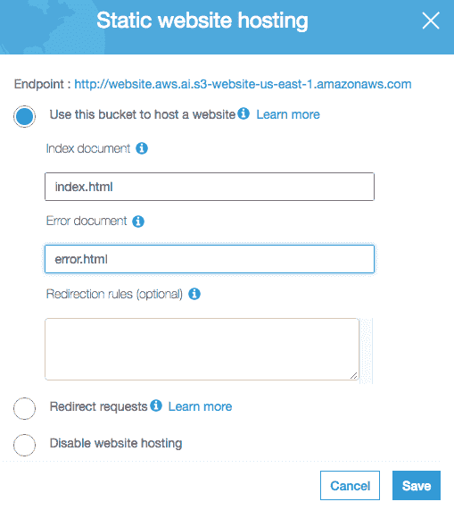
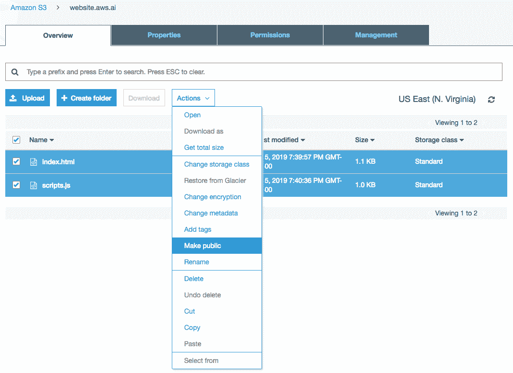

# 第二章：现代 AI 应用的构成

在这一章中，我们将讨论**人工智能**（**AI**）应用架构设计的重要性。首先，我们将介绍架构设计原则，然后为我们的动手项目创建一个参考架构。在本章中，我们将使用我们的参考架构及其组成部分重新创建 Amazon Rekognition 演示。我们将学习如何使用多个 AWS 工具和服务，以无服务器的方式构建我们的动手项目，然后将其部署到 AWS 云中。

本章将涵盖以下主题：

+   理解人工智能应用的成功因素

+   理解 AI 应用的架构设计原则

+   理解现代 AI 应用的架构

+   创建定制的 AI 能力

+   使用 AWS Chalice 在本地开发 AI 应用

+   开发演示应用的网页用户界面

# 技术要求

本书的 GitHub 仓库，包含本章节的源代码，可以在 [`github.com/PacktPublishing/Hands-On-Artificial-Intelligence-on-Amazon-Web-Services`](https://github.com/PacktPublishing/Hands-On-Artificial-Intelligence-on-Amazon-Web-Services) 找到。

# 理解人工智能应用的成功因素

让我们来讨论一下是什么使得 AI 应用成功，实际上，任何软件应用成功的关键也类似。有两个主要因素决定应用的成功：

+   第一个因素是应用是否能够真正解决某个特定问题。

+   第二个因素是应用实现的质量，即如何有效地将解决方案交付给问题。

基本上，我们讨论的是*构建什么*和*如何构建*这两个问题。要做到这两点都非常困难，在大多数情况下，成功的应用都需要这两个因素。

事实上，决定*构建什么*才是两者中更为重要的因素。如果我们在这一点上做错了，最终产品将是有缺陷的，无法提供问题的可行解决方案。不管架构有多么优雅，代码基础有多干净——一个有缺陷的产品最终都会失败。然而，决定*构建什么*往往不是一次性就能搞定的。这种信念是错误的——认为完美的解决方案可以提前设计出来。在许多情况下，你的目标客户甚至不知道他们需要什么或想要什么。成功的解决方案需要经过反复的产品开发迭代、客户反馈，并且需要大量的努力来完善产品需求。

这种需要反复迭代和实验的特性使得*如何构建*成为找到*构建什么*的一个重要因素。让一个应用程序工作并不需要大量技能。你总是可以通过坚定的决心和蛮力实现第一次迭代、第一次版本或第一次转型，应用程序就能工作。它可能不优雅，但至少能运行。然而，当第一次迭代不是问题的正确解决方案时，一个更优雅的架构和更干净的代码库将支持更快的迭代和转型，从而为你提供更多机会去找出*构建什么*。

# 理解 AI 应用程序的架构设计原则

构建优雅的应用程序并非易事，但构建优雅的 AI 应用程序可能更加困难。作为在快速变化的技术环境中工作的 AI 从业者，理解良好的架构设计原则并且对软件工艺充满热情是至关重要的，因为构建和维护能够适应快速发展的 AI 技术的应用程序需要不断的纪律性。良好的架构设计能够轻松适应变化。然而，不可能预测所有未来的变化。因此，我们需要依赖一套广泛接受的设计原则来指导我们构建良好的应用程序架构。现在我们一起来看看这些原则：

+   一个设计良好的应用程序应该建立在具有专注业务能力的小型服务之上。这里的“小型”并不一定意味着代码量少，而是小型服务应该遵循单一职责原则；即做好一件或非常少的事情。

+   这些小型服务更容易实现、测试和部署。它们也更容易复用，并且能够组合出更多的业务能力。

+   一个好的应用程序架构应该有明确的边界，以强制执行关注点分离。

+   应用程序的服务和组件应该通过隐藏内部实现细节来保持这种分离。

+   这种分离允许服务和组件在对应用程序其余部分的影响最小的情况下被替换，从而支持解决方案的更容易演化和改进。

如果你是软件架构设计的新手，好的设计和差的设计之间的区别可能看起来微妙。你需要大量的经验才能获得真正理解好设计所需的知识和技能。在本书中，我们将为你提供一些优雅设计的例子，它们是 AI 应用程序的良好起点。

# 理解现代 AI 应用程序的架构

定义清晰的架构设计是开发成功 AI 应用程序的必要步骤，我们推荐四个基本组成部分来构建它。

这四个组成部分如下：

+   **用户界面**：这是面向用户的组件，向最终用户提供应用程序的业务能力：

    +   它们也被称为前端。用户界面的例子包括网站、移动应用、可穿戴设备和语音助手界面。

    +   相同的应用程序可以通过选择不同的设备形态、交互方式和用户界面，提供不同的定制化用户体验。

    +   如何在网页上提供智能能力，与在可穿戴设备上提供智能能力的方式会有很大的不同。

作为一名 AI 从业者，一个重要的技能是设计用户体验，将你的智能能力传递给用户。做好这一部分是你的 AI 应用成功的最重要因素之一。

+   **协调层**：这些是公共 API，将被你的用户界面调用以提供业务能力：

    +   通常，这些 API 是通向后台的入口点。

    +   公共 API 应根据特定的界面和交互方式进行定制，以便为用户提供最佳体验。

    +   公共 API 将通过私有 API 调用一个或多个小型服务，以提供业务能力。

它们在组合多个底层能力以形成用户界面所需的更高层次能力中起到了协调作用。这些公共 API 还有其他名称，你可能听说过；比如，**前端的后端**（或**BFFs**）和体验 API。

+   **私有 API**：私有 API 定义了交互契约，公共 API 使用这些契约来访问更底层的服务：

    +   私有 API 封装了服务实现，这些实现提供特定的能力，以隐藏其详细信息。

    +   这些 API 在软件系统的可组合性和可替换性特性中发挥着关键作用。

    +   私有 API 是可以被多个应用组合和重用的通用能力接口。

    +   这些私有 API 遵循面向服务设计模式。你可能对这种模式比较熟悉，比如微服务架构和**面向服务架构**（或**SOA**）。

    +   它们应该以单一职责原则为设计基础。

一组设计良好的私有 API 对任何组织来说都是宝贵的资产和竞争优势。组织将能够迅速创新、改进并将解决方案推向市场。

+   **供应商/自定义服务**：这些是业务能力的实现，无论是 AI 还是其他：

    +   这些实现可以由供应商作为 Web 服务提供，或者托管在你的基础设施中。它们也可以是你所在组织构建的定制解决方案。

    +   这些服务有自己的 API，如 RESTful 端点或 SDK，私有 API 将通过它们来封装这些实现。

在本书中，我们将利用 Amazon 作为供应商，通过 *boto3* SDK 提供许多 Web 服务。稍后在本书中，我们还将教你如何使用 AWS 的机器学习服务构建自定义的 AI 能力，并将其作为 ML 模型通过 RESTful 接口进行部署。

下图展示了这些基本架构组件和层次的组织结构：


干净架构的关键是通过每一层之间定义明确的交互契约，保持这些组件的分离：

+   用户界面应该只知道编排层中的公共 API。

+   公共 API 应该只知道它们依赖的私有 API。

+   私有 API 应该只知道它们所封装的服务实现。

+   这是信息隐藏的原则，它在架构层面得到应用。

在架构层面强制执行这些逻辑边界有许多好处，例如，如果我们想切换到更好的供应商服务，我们只需创建一组新的私有 API 来封装新的供应商服务，同时保持与公共 API 相同的私有 API 契约（然后淘汰旧的私有 API）。这样，公共 API 和用户界面就不会受到这一变化的影响。这将把变化的影响限制在应用程序的特定部分。

我们今天使用的大多数应用程序由前端和后端组成。前端通常运行在浏览器或移动设备上，而后端则运行在云端或私有数据中心的服务器基础设施上。这里推荐的架构是这些类型应用程序的良好起点。还有一些更为专业化的应用程序，如嵌入式系统，可能需要不同的架构设计。我们在本书中不会深入讨论这些更专业化应用程序的架构需求。

# 创建自定义的 AI 能力

作为 AI 从业者，我们可以参与的有两个不同的开发生命周期：

+   AI 应用开发生命周期

+   AI 能力开发生命周期

通常，特别是在角色更加专业化的大型组织中，AI 从业者仅参与其中一个生命周期。即使你不参与其中一个生命周期，了解两个生命周期的基本内容对所有 AI 从业者都是有益的。

**AI 应用开发生命周期**涉及解决方案的迭代、用户体验的设计、应用架构的定义，以及各种业务能力的集成。这类似于传统的软件开发生命周期，但目的是将智能嵌入到解决方案中。

**AI 能力开发生命周期**涉及使用数据和机器学习技术开发智能能力。在 AI 能力开发生命周期中创建的数据产品可以集成到应用程序中作为 AI 能力或 AI 服务。换句话说，AI 能力开发生命周期产生了定制的 AI 能力，而 AI 应用开发生命周期则消耗这些能力。

这两个生命周期需要不同的技术和问题解决技能。以下图表提供了创建 AI 能力所需步骤的概述：


AI 能力是 AI 应用的核心。正如我们在第一章中提到的，*人工智能与亚马逊 Web 服务简介*，数据是新的知识产权。任何成功的组织都应该拥有明确的数据战略，用于收集、存储、处理和传播数据。原始和处理过的数据集应该安全地存放并在数据存储系统中提供，如数据库、数据湖和数据仓库。从这些数据存储中，数据科学家可以访问数据以支持他们正在处理的特定业务问题或问题的分析。部分分析结果将产生有价值的商业洞察，具有执行预测分析的潜力。通过这些洞察，数据科学家可以选择各种机器学习算法来训练机器学习模型，以执行自动化预测和决策，包括分类和回归分析。

一旦经过训练和调整，机器学习模型就可以作为 AI 服务进行部署，并提供接口供应用程序访问其智能。例如，Amazon SageMaker 允许我们训练机器学习模型，并将其作为具有 RESTful 端点的 Web 服务进行部署。最后，作为数据战略的一部分，应该收集从已部署 AI 服务中获取的反馈数据，以改进未来版本的 AI 服务。

正如我们在前一章中提到的，我们强烈建议您尽可能多地利用 AWS 等供应商现有的 AI 服务来为您的智能应用提供支持。每个 AWS AI 能力都经历了多个 AI 能力开发生命周期的迭代，并且使用了大量大多数组织无法访问的数据。如果您拥有真正的数据知识产权或需求尚未被供应商解决，构建您自己的 AI 能力才是有意义的。训练一个可以投入生产的机器学习模型需要大量的努力、技能和时间。

本书的第二部分将重点讨论 AI 应用开发生命周期，而第三部分将重点讨论 AI 能力开发生命周期。

# 与实践中的 AI 应用架构合作

在前一节中，我们推荐了现代 AI 应用程序的架构设计。在本节中，我们将定义用于实现推荐架构设计的具体技术和技术栈。在决定本书最佳选择时，我们评估了多个因素，包括简易性、学习曲线、行业趋势等。请记住，推荐架构设计可能有许多有效的技术选择和实施方法。

对于动手实施的 AI 应用开发项目，我们将采用以下架构和技术栈：


正如前面的图表所示，AI 应用项目将由我们前面讨论过的四个基本架构组件组成：

+   **用户界面**：我们将使用网页作为用户界面。我们将使用 HTML、CSS 和 JavaScript 开发相对简单的用户界面。HTML 和 CSS 将显示 UI 组件并处理用户输入。JavaScript 将通过编排层的公共 API 与服务器后端进行通信。项目网页将部署在 AWS S3 上作为静态网站，无需传统的 Web 服务器。这被称为无服务器，因为我们不需要管理和维护任何服务器基础设施。

我们使用普通的 HTML 和 JavaScript 来限制本书的范围。完成本书中的实际项目后，您应考虑使用 Angular、React 或 Vue 等单页 Web 应用程序框架来开发您的 Web 用户界面。

此外，AI 应用程序并不仅限于 Web 应用作为唯一选择。其他用户界面和模式，如移动设备或语音助手设备，有时可以提供更好的用户体验。我们建议您考虑如何修改应用设计以支持这些其他用户界面和模式。这些思想实验将帮助您为 AI 从业者构建设计能力。

+   **编排层**：我们将使用 AWS Chalice，这是一个用于 AWS 的 Python 无服务器微框架。Chalice 允许我们在其本地开发环境中快速开发和测试 Python 应用程序，然后轻松地将 Python 应用程序部署到 Amazon API Gateway 和 AWS Lambda 作为高可用性和可扩展性的无服务器后端。Amazon API Gateway 是一个完全托管的服务，将托管我们的公共 API 作为 RESTful 端点。API Gateway 将向 AWS Lambda 函数转发发往我们的公共 API 的 RESTful 请求，在那里我们的编排逻辑将被部署。AWS Lambda 是一种无服务器技术，允许我们在不预配或管理服务器的情况下运行代码。例如，当从 API Gateway 调用 Lambda 函数时，代码将自动触发并在 AWS 基础设施上运行。您只需支付消耗的计算资源。

+   **私有 API**：我们将把私有 API 打包为 Chalice 框架中的 Python 库。Chalice 允许我们通过将一些服务结构化为`Chalicelib`目录中的库，以模块化的方式编写代码。在我们的实际项目中，私有 API 是简单的 Python 类，具有明确定义的方法签名，以提供对服务实现的访问。在我们的项目中，公共 API 与私有 API 之间的边界是逻辑上的，而非物理上的；因此，必须注意确保架构层次的清晰性。

我们将在多个项目中重用一些私有 API。我们的重用机制类似于共享库。在较大的组织中，私有 API 通常作为 RESTful 端点进行部署，以便不同的应用程序可以轻松共享它们。

+   **供应商服务**：我们将利用 AWS 提供的各种能力。例如，我们需要开发这些智能应用，包括 AI 能力等。私有 API 将通过*boto3* SDK 访问云中的 AWS 服务。清晰的设计要求私有 API 将*boto3*和 AWS 实现细节完全封装并隐藏；公共 API 不应知道私有 API 使用了哪些供应商服务或自定义解决方案来提供这些能力。

# 对象检测器架构

我们将用我们自己的网页前端和 Python 后端重新创建*Amazon Rekognition*演示。首先，让我们理解一下我们即将开发的对象检测器应用程序的架构。

使用我们之前讨论的参考架构设计和技术栈，以下是对象检测器应用程序的架构：


用户将通过网页用户界面与对象检测器进行交互：

+   我们将提供一个网页用户界面供用户使用，以便他们查看对象检测演示。

+   网页用户界面将与包含唯一 RESTful 端点的协调层进行交互：Demo 对象检测端点。

+   该端点与存储服务和识别服务进行交互，以执行对象检测演示。

+   存储服务和识别服务分别通过*Boto3* SDK 调用 Amazon S3 和 Amazon Rekognition 服务。

# 对象检测器的组件交互

让我们理解一下对象检测器应用程序中各个组件之间的交互：


从用户的角度看，应用程序加载一张随机图片，并显示已检测到的物体（或标签）。演示工作流如下：

1.  对象检测器应用程序的网页界面调用 Demo 对象检测端点以启动演示。

1.  该端点调用存储服务以获取存储在指定 S3 存储桶中的文件列表。

1.  接收到文件列表后，端点会随机选择一个图像文件进行演示。

1.  然后，端点调用识别服务对选定的图像文件执行对象检测。

1.  接收对象标签后，端点将结果打包成 JSON 格式。

1.  最终，网页界面会显示随机选择的图像及其检测结果。

# 创建基础项目结构

接下来，让我们创建实际操作的项目结构。按照以下步骤创建架构和技术栈：

1.  在终端中，我们将创建根项目目录并使用以下命令进入该目录：

```py
$ mkdir ObjectDetector
$ cd ObjectDetector
```

1.  我们将通过创建一个名为`Website`的目录来为 Web 前端创建占位符。在此目录中，我们将有两个文件，`index.html`和`scripts.js`，如下所示：

```py
$ mkdir Website
$ touch Website/index.html
$ touch Website/scripts.js
```

1.  我们将在项目的根目录中使用`pipenv`创建一个 Python 3 虚拟环境。我们项目的 Python 部分需要两个包，`boto3`和`chalice`。我们可以使用以下命令安装它们：

```py
$ pipenv --three
$ pipenv install boto3
$ pipenv install chalice
```

1.  请记住，通过`pipenv`安装的 Python 包仅在我们激活虚拟环境时才可用。一种激活方法是使用以下命令：

```py
$ pipenv shell
```

1.  接下来，在仍处于虚拟环境中的情况下，我们将使用以下命令创建一个名为`Capabilities`的 AWS Chalice 项目作为编排层：

```py
$ chalice new-project Capabilities
```

该命令将在`ObjectDetector`目录下创建一个 Chalice 项目结构。Chalice 项目结构应该类似于以下内容：

```py
├── ObjectDetector/
 ├── Capabilities/
 ├── .chalice/
 ├── config.json
 ├── app.py
 ├── requirements.txt
...
```

在这个项目结构中，我们有以下内容：

+   `config.json`文件包含了将我们的 Chalice 应用程序部署到 AWS 的配置选项。

+   `app.py`文件是我们的主要 Python 文件，其中定义并实现了公共编排 API。

+   `requirements.txt`文件指定了应用程序部署到 AWS 时所需的 Python 包。这些包不同于我们使用 Pipenv 安装的包。Pipenv 安装的包是在本地开发环境中需要的；而`requirements.txt`文件中的包是应用程序在 AWS 云中运行时所需的。例如，AWS Chalice 在开发应用程序时是必需的，但一旦应用程序部署到 AWS 后，就不再需要它。

当我们在 AWS 云中运行项目时，`boto3`是必需的；不过，它已经在 AWS Lambda 运行时环境中提供，因此我们不需要在`requirements.txt`文件中显式指定它。但请记得在该文件中包含应用程序所需的其他 Python 包。

1.  现在，我们需要在`Capabilities`目录下的 Chalice 项目结构中创建一个`chalicelib` Python 包。Chalice 会自动将`chalicelib`中的任何 Python 文件包含在部署包中。我们将使用`chalicelib`来存放实现私有 API 的 Python 类。

要创建`chalicelib`包，请执行以下命令：

```py
cd Capabilities
mkdir chalicelib
touch chalicelib/__init__.py
cd ..
```

请注意，`__init__.py`使`chalicelib`成为一个合适的 Python 包。

我们应该有以下的项目目录结构：

```py
Project Structure
------------
├── ObjectDetector/
 ├── Capabilities/
 ├── .chalice/
 ├── config.json
 ├── chalicelib/
 ├── __init__.py
 ├── app.py
 ├── requirements.txt
 ├── Website/
 ├── index.html
 ├── script.js
 ├── Pipfile
 ├── Pipfile.lock
```

这是`ObjectDetector`应用程序的项目结构。它包含了我们之前定义的 AI 应用架构的所有层次。这个项目结构也是本书第二部分中所有实践项目的基础结构。

# 使用 AWS Chalice 在本地开发 AI 应用

首先，让我们实现提供通用功能的私有 API 和服务。我们将有两个服务，它们都应在`chalicelib`目录中创建：

1.  `StorageService`：`StorageService`类在`storage_service.py`文件中实现，通过`boto3`连接到 AWS S3，以便对应用程序所需的文件执行操作。

让我们实现`StorageService`，如下所示：

```py
import boto3

class StorageService:
    def __init__(self, storage_location):
        self.client = boto3.client('s3')
        self.bucket_name = storage_location

    def get_storage_location(self):
        return self.bucket_name

    def list_files(self):
        response = self.client.list_objects_v2(Bucket = self.bucket_name)

        files = []
        for content in response['Contents']:
            files.append({
                'location': self.bucket_name,
                'file_name': content['Key'],
                'url': "http://" + self.bucket_name + ".s3.amazonaws.com/" + content['Key']
            })
        return files
```

在这个类中，目前有一个构造函数和两个方法：

+   +   `__init__()`构造函数接受一个参数，`storage_location`。在`StorageService`的这个实现中，`storage_location`表示文件存储的 S3 桶。然而，我们故意给这个参数起了一个通用的名称，这样不同的`StorageService`实现可以使用 AWS S3 以外的其他存储服务。

    +   第一个方法，`get_storage_location()`，只是返回 S3 桶的名称作为`storage_location`。其他服务实现将使用此方法来获取通用的存储位置。

    +   第二个方法，`list_files()`，从指定的`storage_location`的 S3 桶中检索文件列表。然后，这些文件作为 Python 对象的列表返回。每个对象描述一个文件，包括其位置、文件名和 URL。

请注意，我们也在使用更通用的术语来描述文件，如位置、文件名和 URL，而不是桶、键和 s3 URL。此外，我们返回的是一个包含自定义 JSON 格式的新 Python 列表，而不是返回来自*boto3*的可用响应。这可以防止 AWS 的实现细节泄露到这个私有 API 的实现中。

`StorageService`中的设计决策是为了隐藏实现细节，避免暴露给其客户端。因为我们隐藏了`boto3`和 S3 的细节，我们可以自由地修改`StorageService`，使其能够使用其他 SDK 或服务来实现文件存储功能。

1.  `RecognitionService`：`RecognitionService`类在`recognition_service.py`文件中实现，通过`boto3`调用 Amazon Rekognition 服务，以执行图像和视频分析任务。

让我们实现`RecognitionService`，如下所示：

```py
import boto3

class RecognitionService:
    def __init__(self, storage_service):
        self.client = boto3.client('rekognition')
        self.bucket_name = storage_service.get_storage_location()

    def detect_objects(self, file_name):
        response = self.client.detect_labels(
            Image = {
                'S3Object': {
                    'Bucket': self.bucket_name,
                    'Name': file_name
                }
            }
        )

        objects = []
        for label in response["Labels"]:
            objects.append({
                'label': label['Name'],
                'confidence': label['Confidence']
            })
        return objects
```

在这个类中，目前有一个构造函数和一个方法：

+   +   `__init__()` 构造函数接受 `StorageService` 作为依赖项来获取必要的文件。这允许将新的 `StorageService` 实现注入并供 `RecognitionService` 使用；即，只要新的 `StorageService` 实现遵循相同的 API 契约。这被称为依赖注入设计模式，它使软件组件更具模块化、可重用性和可读性。

    +   `detect_objects()` 方法接受一个图像文件名，包括路径和名称部分，然后对指定的图像执行对象检测。此方法实现假设图像文件存储在 S3 桶中，并从 `boto3` SDK 调用 Rekognition 的 `detect_labels()` 函数。当 *boto3* 返回标签时，该方法会构造一个新的 Python 列表，列表中的每一项描述了检测到的对象及其检测的置信度。

注意，从方法的签名（参数和返回值）来看，它并没有暴露出使用 S3 和 Rekognition 服务的事实。这与我们在 `StorageService` 中使用的信息隐藏实践相同。

在 `RecognitionService` 中，我们本可以使用构造函数中传递的 `StorageService` 来获取实际的图像文件并对其进行检测。但我们直接通过 `detect_labels()` 函数传递图像文件的桶和名称。这种后者的实现方式利用了 AWS S3 和 Amazon Rekognition 的良好集成。关键点是私有 API 的契约支持这两种实现，而我们的设计决策选择了后者。

1.  `app.py`：接下来，让我们实现专为图像识别 Web 应用程序量身定制的公共 API。我们只需要一个公共 API 来演示应用程序。它应该在 Chalice 项目结构中的 `app.py` 文件中实现。

用以下代码块替换 `app.py` 中的现有内容。让我们理解该类的组件：

+   +   `demo_object_detection()` 函数使用 `StorageService` 和 `RecognitionService` 来执行其任务；因此，我们需要从 `chalicelib` 导入这些服务并创建这些服务的新实例。

    +   `storage_location` 被初始化为 `contents.aws.ai`，该位置包含我们在上一章上传的图像文件。你应将 `contents.aws.ai` 替换为你自己的 S3 桶。

    +   该函数使用 `@app.route('/demo-object-detection', cors = True)` 注解。这是 Chalice 用于定义一个名为 `/demo-object-detection` 的 RESTful 端点的特殊结构：

        +   Chalice 将此端点映射到 `demo_object_detection()` Python 函数。

        +   注解还将`cors`设置为 true，这通过在此端点的响应中添加特定的 HTTP 头部，启用了**跨源资源共享**（**CORS**）。这些额外的 HTTP 头部会告诉浏览器允许在一个源（域名）下运行的网页应用程序访问不同源（包括不同的域名、协议或端口号）上的资源。让我们看一下下面类中的实现：

Chalice 的注解语法可能对 Flask 开发者来说很熟悉。AWS Chalice 从 Flask 框架中借鉴了很多设计和语法。

```py
from chalice import Chalice
from chalicelib import storage_service
from chalicelib import recognition_service

import random

#####
# chalice app configuration
#####
app = Chalice(app_name='Capabilities')
app.debug = True

#####
# services initialization
#####
storage_location = 'contents.aws.ai'
storage_service = storage_service.StorageService(storage_location)
recognition_service = recognition_service.RecognitionService(storage_service)

@app.route('/demo-object-detection', cors = True)
def demo_object_detection():
    """randomly selects one image to demo object detection"""
    files = storage_service.list_files()
    images = [file for file in files if file['file_name'].endswith(".jpg")]
    image = random.choice(images)

    objects = recognition_service.detect_objects(image['file_name'])

    return {
        'imageName': image['file_name'],
        'imageUrl': image['url'],
        'objects': objects
    }
```

让我们详细讨论一下前面的代码：

+   +   `demo_object_detection()`函数从`StorageService`获取一个包含图像文件（扩展名为`.jpg`的文件）列表，并随机选择其中一个进行目标检测演示。

    +   随机选择在这里实现，以简化我们的演示应用程序，使其仅显示一张图像及其检测结果。

    +   一旦图像被随机选择，函数会调用`RecognitionService`中的`detect_objects()`，然后生成一个**JavaScript 对象表示法**（**JSON**）格式的 HTTP 响应。

    +   Chalice 会自动将响应对象包装在适当的 HTTP 头部、响应代码和 JSON 负载中。JSON 格式是我们前端与这个公共 API 之间的合同的一部分。

我们准备好在本地运行并测试应用程序的后端了。Chalice 提供了一个本地模式，其中包括一个本地 HTTP 服务器，您可以使用它来测试端点。

1.  在`pipenv`虚拟环境中，通过以下命令启动`chalice local`模式：

```py
$ cd Capabilities
$ chalice local
Restarting local dev server.
Found credentials in shared credentials file: ~/.aws/credentials
Serving on http://127.0.0.1:8000
```

现在，本地 HTTP 服务器已在终端输出的地址和端口号上运行，也就是`http://127.0.0.1:8000`。请记住，尽管我们在本地运行端点，但端点调用的服务通过`boto3` SDK 向 AWS 发出请求。

Chalice 的本地模式自动检测到了`~/.aws/credentials`文件中的 AWS 凭证。我们的服务实现会使用`boto3`中找到的密钥对，并使用相应用户的权限发出请求。如果该用户没有 S3 或 Rekognition 的权限，向端点发出的请求将会失败。

1.  现在，我们可以向本地服务器发出 HTTP 请求，以测试`/demo-object-detection`端点。例如，您可以使用 Unix 的`curl`命令，如下所示：

```py
$ curl http://127.0.0.1:8000/demo-object-detection
{"imageName":"beagle_on_gravel.jpg","imageUrl":"https://contents.aws.ai.s3.amazonaws.com/beagle_on_gravel.jpg","objects":[{"label":"Pet","confidence":98.9777603149414},{"label":"Hound","confidence":98.9777603149414},{"label":"Canine","confidence":98.9777603149414},{"label":"Animal","confidence":98.9777603149414},{"label":"Dog","confidence":98.9777603149414},{"label":"Mammal","confidence":98.9777603149414},{"label":"Beagle","confidence":98.0347900390625},{"label":"Road","confidence":82.47952270507812},{"label":"Dirt Road","confidence":74.52912902832031},{"label":"Gravel","confidence":74.52912902832031}]}
```

请注意，在这段代码中，我们只是将端点的 URL 路径附加到本地 HTTP 服务器运行的基本地址和端口号上。请求应该返回来自本地端点的 JSON 输出。

这是我们的网页用户界面将接收并用于向用户展示检测结果的 JSON 格式数据。

# 开发演示应用程序的网页用户界面

接下来，我们将在网站目录中的`index.html`和`script.js`文件中使用 HTML 和 JavaScript 创建一个简单的网页用户界面。

请参阅 `index.html` 文件中的代码，如下所示：

```py
<!doctype html>
<html lang="en"/>

<head>
    <meta charset="utf-8"/>
    <meta name="viewport" content="width=device-width, initial-scale=1.0"/>

    <title>Object Detector</title>

    <link rel="stylesheet" href="https://www.w3schools.com/w3css/4/w3.css">
    <link rel="stylesheet" href="https://www.w3schools.com/lib/w3-theme-blue-grey.css">
</head>

<body class="w3-theme-14" onload="runDemo()">
    <div style="min-width:400px">
        <div class="w3-bar w3-large w3-theme-d4">
            <span class="w3-bar-item">Object Detector</span>
        </div>

        <div class="w3-container w3-content">
            <p class="w3-opacity"><b>Randomly Selected Demo Image</b></p>
            <div class="w3-panel w3-white w3-card w3-display-container"
                style="overflow: hidden">
                <div style="float: left;">
                    
                </div>
                <div id="objects" style="float: right;">
                    <h5>Objects Detected:</h5>
                </div>
            </div>
        </div>
    </div>

    <script src="img/scripts.js"></script>
</body>

</html>
```

我们在这里使用标准的 HTML 标签，因此，任何熟悉 HTML 的人都应该能轻松跟随网页的代码。以下是几个值得注意的事项：

+   我们从 [www.w3schools.com](http://www.w3schools.com) 引入了几种 **层叠样式表** (**CSS**) 来使我们的网页界面比简单的 HTML 更加美观。HTML 标签中的大多数类都是在这些样式表中定义的。

+   带有 `image` ID 的 `` 标签将用于显示随机选择的演示图片。JavaScript 会使用这个 ID 来动态添加图片。

+   带有 `objects` ID 的 `<div>` 标签将用于显示在演示图片中检测到的对象。这个 ID 也将被 JavaScript 用来动态添加对象标签和置信度。

+   `scripts.js` 文件位于 HTML 文件的底部。这为该 HTML 页面添加了通过 JavaScript 实现的动态行为。

+   当 HTML 页面在浏览器中加载时，`scripts.js` 中的 `runDemo()` 函数会被调用。这是在 `index.html` 页面 `<body>` 标签中的 `onload` 属性实现的。

请参阅以下 `scripts.js` 文件的代码：

```py
"use strict";

const serverUrl = "http://127.0.0.1:8000";

function runDemo() {
    fetch(serverUrl + "/demo-object-detection", {
        method: "GET"
    }).then(response => {
        if (!response.ok) {
            throw response;
        }
        return response.json();
    }).then(data => {
        let imageElem = document.getElementById("image");
        imageElem.src = data.imageUrl;
        imageElem.alt = data.imageName;

        let objectsElem = document.getElementById("objects");
        let objects = data.objects;
        for (let i = 0; i < objects.length; i++) {
            let labelElem = document.createElement("h6");
            labelElem.appendChild(document.createTextNode(
                objects[i].label + ": " + objects[i].confidence + "%")
            );
            objectsElem.appendChild(document.createElement("hr"));
            objectsElem.appendChild(labelElem);
        }
    }).catch(error => {
        alert("Error: " + error);
    });
}
```

让我们详细讨论一下之前的代码：

+   脚本只有一个函数，`runDemo()`。这个函数通过 JavaScript 中可用的 Fetch API，向本地 HTTP 服务器上运行的 `/demo-object-detection` 端点发送 HTTP `GET` 请求。

+   如果本地端点的响应为 `ok`，则它会将负载转换为 JSON 对象，并将其传递到下一个处理块。

+   然后，`runDemo()` 函数会查找具有 `image` ID 的 HTML 元素，也就是 HTML 中的 `` 标签，并将 `src` 属性指定为端点返回的 `imageUrl`。记住，这个 `imageUrl` 是指向存储在 S3 中的图片文件的 URL。`` 标签的 `alt` 属性设置为 `imageName`。如果图片因某种原因无法加载，`imageName` 将显示给用户。

+   请注意，S3 中的图片必须设置为公共可读，网站才能显示该图片。如果你只看到 `alt` 文本，请重新检查图片是否对公众可读。

+   然后，`runDemo()` 函数会查找具有 `objects` ID 的 HTML 元素，也就是一个 `<div>` 标签，并为本地端点返回的每个对象附加一个 `<h6>` 标题元素，其中包括每个对象的标签和检测置信度。

现在，我们准备好查看这个网站的实际效果了。要在本地运行网站，只需在浏览器中打开 `index.html` 文件即可。你应该会看到一个类似以下截图的网页：


上传几个 JPEG 图像文件并刷新页面几次，看看对象检测演示如何运行；每次运行时，演示将选择存储在 S3 桶中的不同图像。`ObjectDetector` 应用程序虽然不如 Amazon Rekognition 演示那样花哨，但为自己创造了一个架构良好的 AI 应用程序而自豪吧！

本地 HTTP 服务器将持续运行，除非你明确停止它。要停止本地 HTTP 服务器，请进入正在运行 `chalice local` 的终端窗口，并按下 *Ctrl* + *C*。

`ObjectDetector` 应用程序的最终项目结构应如下所示：

```py
Project Organization
------------
├── ObjectDetector/
    ├── Capabilities/
        ├── .chalice/
            ├── config.json
        ├── chalicelib/
            ├── __init__.py
            ├── recognition_service.py
            ├── storage_service.py
        ├── app.py
        ├── requirements.txt
    ├── Website/
        ├── index.html
        ├── script.js
    ├── Pipfile
    ├── Pipfile.lock
```

现在是时候将我们的 AI 应用程序公开并部署到 AWS 云上了。

# 将 AI 应用程序后端通过 Chalice 部署到 AWS

使用 Chalice 部署到 AWS 非常简单而强大。Chalice 会自动将 `app.py` 中的端点注解转换为 HTTP 端点，并将它们作为公共 API 部署到 Amazon API Gateway。Chalice 还将 `app.py` 和 `chalicelib` 中的 Python 代码部署为 AWS Lambda 函数，然后将 API 网关端点作为触发器连接到这些 Lambda 函数。这种简易性就是我们选择 AWS Chalice 作为无服务器框架来开发实际项目的原因。

当我们在本地运行后端时，Chalice 会自动检测到我们开发环境中的 AWS 凭证，并将其提供给应用程序。那么，当应用程序在 AWS 中运行时，它将使用哪些凭证呢？Chalice 在部署过程中会自动为应用程序创建一个 AWS IAM 角色。然后，应用程序将以已授予该角色的权限运行。Chalice 可以自动检测所需的权限，但此功能在本文撰写时仍被视为实验性，并且与我们项目的结构不兼容。对于我们的项目，我们需要告诉 Chalice *不要* 为我们执行此分析，通过在项目结构的 `.chalice` 目录中的 `config.json` 文件中将 `autogen_policy` 设置为 `false` 来实现。以下是 `config.json` 文件：

```py
{
    "version": "2.0",
    "app_name": "Capabilities",
    "stages": {
        "dev": {
            "autogen_policy": false,
            "api_gateway_stage": "api"
        }
    }
}
```

请注意，在此配置中，`config.json` 中有一个 `dev` 阶段。Chalice 提供了将应用程序部署到多个环境的能力。不同的环境被成熟的软件组织用来以隔离的方式执行各种软件生命周期任务，如测试和维护。例如，我们有用于快速实验的开发（`dev`）环境，质量保证（`qa`）用于集成测试，用户验收测试（`uat`）用于业务需求验证，性能（`prof`）用于压力测试，产品（`prod`）用于来自最终用户的实时流量。

接下来，我们需要在 `.chalice` 目录中创建一个新文件 `policy-dev.json`，手动指定项目所需的 AWS 服务：

```py
{
    "Version": "2012-10-17",
        "Statement": [
        {
            "Effect": "Allow",
            "Action": [
                "logs:CreateLogGroup",
                "logs:CreateLogStream",
                "logs:PutLogEvents",
                "s3:*",
                "rekognition:*"
            ],
            "Resource": "*"
        }
    ]
}
```

在这里，我们指定了 S3 和 Rekognition，此外还包括一些权限，以允许项目将日志推送到 CloudWatch。

现在，我们准备好在 AWS Chalice 框架上部署后端了：

1.  在 `Capabilities` 目录中运行以下命令：

```py
$ chalice deploy
Creating deployment package.
Creating IAM role: Capabilities-dev
Creating lambda function: Capabilities-dev
Creating Rest API
Resources deployed:
 - Lambda ARN: arn:aws:lambda:us-east-1:<UID>:function:Capabilities-dev
 - Rest API URL: https://<UID>.execute-api.us-east-1.amazonaws.com/api/
```

部署完成后，Chalice 会在输出中显示一个类似 `https://<UID>.execute-api.us-east-1.amazonaws.com/api/` 的 RESTful API URL，其中 `<UID>` 是一个唯一标识符字符串。这是您的前端应用程序应该访问的服务器 URL，以连接到在 AWS 上运行的应用程序后端。

现在，您可以在 AWS 管理控制台的三个服务中验证 Chalice 部署的结果：

+   Amazon API Gateway

+   AWS Lambda

+   身份和访问管理

查看这些服务的控制台页面，看看 AWS Chalice 为我们的应用程序设置了什么。

1.  使用 `curl` 命令测试远程端点，命令如下。您应该会得到类似于我们在测试本地端点时的输出：

```py
$ curl https://<UID>.execute-api.us-east-1.amazonaws.com/api/demo-object-detection
{"imageName":"beagle_on_gravel.jpg","imageUrl":"https://contents.aws.ai.s3.amazonaws.com/beagle_on_gravel.jpg","objects":[{"label":"Pet","confidence":98.9777603149414},{"label":"Hound","confidence":98.9777603149414},{"label":"Canine","confidence":98.9777603149414},{"label":"Animal","confidence":98.9777603149414},{"label":"Dog","confidence":98.9777603149414},{"label":"Mammal","confidence":98.9777603149414},{"label":"Beagle","confidence":98.0347900390625},{"label":"Road","confidence":82.47952270507812},{"label":"Dirt Road","confidence":74.52912902832031},{"label":"Gravel","confidence":74.52912902832031}]}
```

恭喜！您刚刚部署了一个无服务器的 AI 应用后端，它具有高可用性和可扩展性，并运行在云端。

# 通过 AWS S3 部署静态网站

接下来，让我们将前端网页用户界面部署到 AWS S3。

我们在上一章节中创建的一个桶是用于网站托管的。让我们通过 AWS 管理控制台为其配置静态网站托管：

1.  导航到管理控制台中的 **Amazon S3** 服务并点击您的桶。

1.  在 **Properties** 选项卡中，如下图所示，点击 **Static website hosting** 卡片：


1.  当您点击 **Static website hosting** 卡片时，会弹出一个配置卡片。

1.  选择 **Use this bucket to host a website**，并分别在 **Index document** 和 **Error document** 字段中输入 `index.html` 和 `error.html`。

1.  复制配置页面上的 **Endpoint** URL，然后点击 **Save**。这个端点 URL 将是您的静态网站的公共地址：



1.  接下来，我们可以将 `index.html` 和 `scripts.js` 文件上传到这个 S3 桶。在上传之前，我们需要对 `scripts.js` 进行更改。请记住，网站现在将运行在云中，无法访问我们的本地 HTTP 服务器。

1.  将 `scripts.js` 文件中的本地服务器 URL 替换为我们后端部署的 URL，如下所示：

```py
"use strict";

const serverUrl = "https://<UID>.execute-api.us-east-1.amazonaws.com/api";
...
```

1.  最后，将 `index.html` 和 `scripts.js` 文件的权限设置为公开可读。为此，我们需要在 **Permissions** 选项卡下修改 S3 桶的权限。

1.  点击 **Public access settings** 按钮，取消选中所有四个复选框，然后输入 `confirm` 以确认这些更改。这将允许将此 S3 桶的内容公开访问，如下所示：


1.  现在，我们可以通过选择这两个文件，点击 **Actions**，然后点击 **Make public**，将文件设置为公开，如下图所示：



在浏览器中打开 S3 端点 URL。该 URL 应该类似于 `http://<BUCKET>.s3-website-us-east-1.amazonaws.com/`。

你的 `ObjectDetector` 网站现在已经在浏览器中运行，并且它正在与运行在 AWS 上的后端进行通信，以展示你的智能应用功能。前端和后端都是无服务器架构，且都运行在 AWS 云基础设施上，能够根据需求自动扩展。

恭喜你！你刚刚将一个端到端的 AI 应用开发并部署到 AWS 上！现在，你可以与任何拥有浏览器的人分享这个 AI 应用。

即使你新的 AWS 账户可能拥有免费层服务，你仍然应该限制与你共享网站 URL 和 API 端点的人员数量。如果所消耗的 AWS 资源超出免费层计划覆盖的额度，你将会被收费。

# 总结

在本章中，我们讨论了良好的架构设计对人工智能应用的重要性。我们为 Web 应用创建了一个参考架构设计，该设计将作为本书第二部分所有实践项目的模板。利用这个参考架构，我们通过 AWS 的多个工具和服务，以无服务器架构的方式重建了 Amazon Rekognition 演示应用。我们使用 AWS Chalice 和 *boto3* 构建了演示应用的后端，并利用 AWS S3 和 Amazon Rekognition 提供了业务功能。通过这个实践项目，我们向你展示了架构边界和良好设计如何促进灵活的应用开发与演化。我们还用 HTML、CSS 和 JavaScript 为演示应用构建了一个简单的 Web 用户界面。最后，我们将演示应用作为无服务器应用部署到 AWS 云上。

现在我们已经有了构建一个简单而优雅的智能应用的经验，准备好在本书第二部分使用相同的架构模板和工具集来构建更多的人工智能应用。

# 深入阅读

你可以参考以下链接获取有关现代 AI 应用架构的更多信息：

+   [`www.cs.nott.ac.uk/~pszcah/G51ISS/Documents/NoSilverBullet.html`](http://www.cs.nott.ac.uk/~pszcah/G51ISS/Documents/NoSilverBullet.html)

+   [`developer.mozilla.org/zh-CN/docs/Web/HTTP/CORS`](https://developer.mozilla.org/zh-CN/docs/Web/HTTP/CORS)
