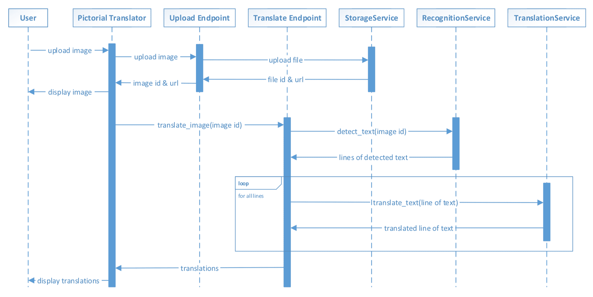
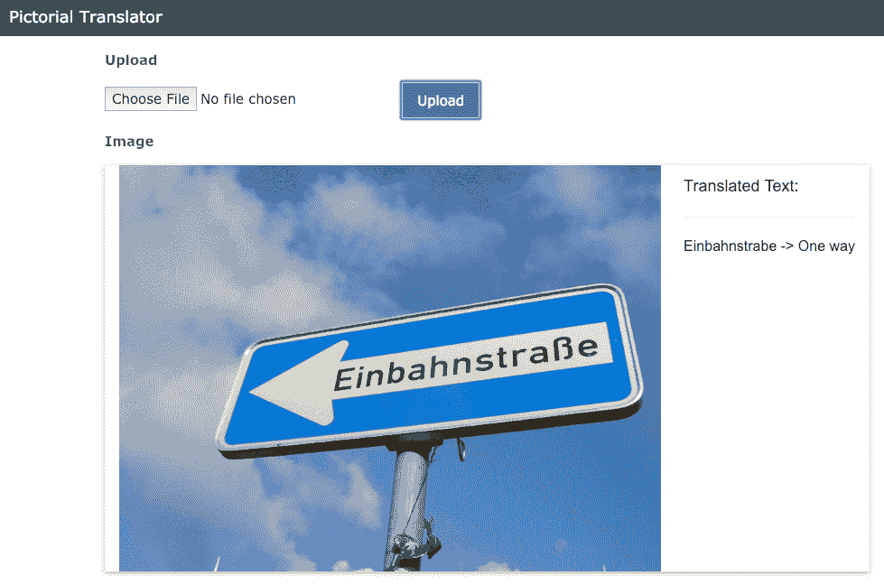

# 第三章：使用 Amazon Rekognition 和 Translate 检测与翻译文本

在本章中，我们将构建第一个**人工智能**（**AI**）应用程序，它解决一个现实问题，而不是一个理论展示。我们将构建一个可以翻译出现在图片中的外文文本的应用程序。我们将通过结合两个 AWS AI 服务——Amazon Rekognition 和 Amazon Translate 来实现这一目标。该应用程序将使用上一章介绍的参考架构。在这个实际项目中，我们不仅会为当前应用程序构建智能功能，还会将它们设计为可重用的组件，以便在未来的实际项目中利用。

我们将涵盖以下主题：

+   使用 Amazon Rekognition 检测图像中的文本

+   使用 Amazon Translate 进行文本翻译

+   将智能功能嵌入应用程序

+   使用 AWS 服务、RESTful API 和 Web 用户界面构建无服务器 AI 应用程序

+   讨论良好的设计实践，并将智能功能构建为可重用组件

# 让世界更小

在本书的这一部分，我们将通过实际项目开始构建智能化解决方案。这些项目不仅能让你熟悉亚马逊的 AI 服务，还将帮助你加强如何将智能功能嵌入应用程序，解决实际问题的直觉。我们将从一个可以让世界更小的应用程序开始。

当谷歌在其 Google Lens 移动应用中发布新功能时，用户只需将手机指向周围的物体，就能获取更多信息。Google Lens 本质上将搜索功能带入了现实世界。这个应用的一个特别用例是实时语言翻译文本。用户可以将相机对准街头标牌或餐厅菜单，并将翻译结果以增强现实摄像头的形式呈现在手机屏幕上。仅凭这一功能，就能让世界变得更加可接近。

我们将在实际项目中实现这一图像翻译功能，使用的是 AWS AI 服务。我们的应用程序，暂时称之为图像翻译器，将提供类似的翻译功能，尽管其用户界面比谷歌镜头简洁得多。

# 理解图像翻译器的架构

根据第二章《现代 AI 应用程序的结构》定义的架构模板，以下是图像翻译器的架构设计：


我们将为用户提供一个 Web 用户界面，用户可以上传包含外文文本的照片，然后查看该外文文本的翻译。Web 用户界面将与包含两个 RESTful 端点的**编排层**进行交互，用于处理图片上传和翻译：

+   **上传图片端点**将把图片上传委托给我们的**存储服务**：

    +   **存储服务**为**AWS S3**提供了一个抽象层，上传的照片将存储在其中，进行处理并从中显示。

+   **图像文本翻译端点**将把照片中文本的检测委托给我们的**识别服务**，并将检测到的文本翻译交给我们的**翻译服务**：

    +   **识别服务**为亚马逊 Rekognition 服务提供了一个抽象层，更具体地说，是 Rekognition 的文本检测功能。我们将我们的服务命名为**识别**，它更为通用，并且不会直接与**AWS Rekognition**绑定。

    +   **翻译服务**为亚马逊 Translate 服务提供了一个抽象层，用于执行语言翻译。

**服务实现**对一些读者来说可能显得有些多余。为什么不直接让端点与 AWS 服务通信，而是通过另一个抽象层进行通信呢？这种架构方式有许多好处。以下是一些示例：

+   在开发阶段，我们可以更轻松地构建和测试应用，而无需依赖 AWS 服务。在开发过程中，任何这些服务的存根或模拟实现都可以用于提高速度、降低成本和进行实验。这使我们能够更快地开发和迭代应用。

+   当其他提供更好存储、识别或翻译能力的服务出现时，我们的应用可以通过切换到具有相同抽象接口的新服务实现来使用这些能力。用户界面和端点无需修改即可利用这些更好的功能。这为我们的应用提供了更多的灵活性，以适应变化。

+   这使我们的代码库更具可组合性和可重用性。这些 AWS 服务提供的能力可以被其他应用重用。这些服务是模块化的包，比起协调端点，它们更容易重用。协调端点通常包含特定于应用的业务逻辑，限制了重用性。

# 《图像翻译器组件交互》

在我们深入实现之前，思考应用各个组件如何相互交互，以及我们的设计选择如何影响用户体验是非常重要的：



从用户的角度来看，应用提供了一个顺序的体验，包括上传图像、查看已上传图像和查看翻译文本。我们做出了设计决策，确保用户等待每张照片上传并处理完毕（而不是一次性批量上传多张照片）。考虑到我们的使用案例假设用户在物理位置等待翻译结果，以便做出决策或采取行动，这个设计决策对于我们的应用来说是合理的。

我们的 Pictorial Translator 应用与上传图像端点和`StorageService`的交互是直接的。用户的请求本质上会通过链条传递到 AWS S3 并返回。当然，存储能力由 AWS S3 提供，这一点在端点和应用程序之间通过抽象层进行了屏蔽。照片将存储在 S3 桶中，文本检测和翻译将在 S3 桶中执行。

翻译图像文本的端点简化了 Pictorial Translator 应用程序中的一些业务逻辑。Pictorial Translator 只是将图像 ID 发送到翻译图像文本的端点，然后接收图像中每一行文本的翻译。该端点在后台执行了几项操作。这个端点调用了`RecognitionService`中的`detect_text()`，对整个图像进行处理，然后多次调用翻译服务中的`translate_text()`，对检测到的每一行文本进行翻译。只有当检测到的文本行达到最低置信度阈值时，端点才会调用翻译服务。

在这里，我们做出了两个设计决策：

+   首先，我们在行级别进行文本翻译。这个想法是，现实世界中的文本并不总是处于相同的上下文中（例如，同一张照片中的多个街道标志），甚至可能不在同一种语言中。这个设计决策在现实世界中的结果需要被密切监控，以验证其用户体验。

+   其次，我们只翻译`RecognitionService`非常有信心的文本行。现实世界是复杂的，用户可能会上传包含与翻译任务无关的文本的照片（例如，远处的街道标志），或者上传不适合进行高质量文本检测的照片（例如，光线较差或焦距不清晰的照片）。我们不希望给用户带来不准确的翻译，因此我们的应用程序采取了仅翻译照片中高质量文本的做法。

这些是 AI 从业人员在开发智能应用程序时应该评估和验证的设计决策示例。拥有灵活的架构可以让你更快地进行迭代。

# 设置项目结构

我们将创建一个类似的基础项目结构，按照[第二章](https://cdp.packtpub.com/hands_on_artificial_intelligence_on_amazon_web_services/wp-admin/post.php?post=298&action=edit#post_299)中概述的步骤进行，*现代 AI 应用的结构*，包括`pipenv`、`chalice`和网页文件：

1.  在终端中，我们将创建`root`项目目录并输入以下命令：

```py
$ mkdir PictorialTranslator
$ cd PictorialTranslator
```

1.  我们将通过创建一个名为`Website`的目录来为网页前端创建占位符，并在该目录下创建两个文件`index.html`和`scripts.js`：

```py
$ mkdir Website
$ touch Website/index.html
$ touch Website/scripts.js
```

1.  我们将在项目的 `root` 目录下使用 `pipenv` 创建一个 Python 3 虚拟环境。项目的 Python 部分需要两个包，`boto3` 和 `chalice`。我们可以通过以下命令安装它们：

```py
$ pipenv --three
$ pipenv install boto3
$ pipenv install chalice
```

1.  请记住，通过 `pipenv` 安装的 Python 包只有在激活虚拟环境时才能使用。激活虚拟环境的一种方法是使用以下命令：

```py
$ pipenv shell
```

1.  接下来，在仍处于虚拟环境中时，我们将创建一个名为 `Capabilities` 的 AWS `chalice` 项目，并使用以下命令：

```py
$ chalice new-project Capabilities
```

1.  要创建 `chalicelib` Python 包，请执行以下命令：

```py
cd Capabilities
mkdir chalicelib
touch chalicelib/__init__.py
cd ..
```

Pictorial Translator 项目的结构应如下所示：

```py
Project Structure
------------
├── PictorialTranslator/
    ├── Capabilities/
        ├── .chalice/
            ├── config.json
        ├── chalicelib/
            ├── __init__.py
        ├── app.py
        ├── requirements.txt
    ├── Website/
        ├── index.html
        ├── script.js
    ├── Pipfile
    ├── Pipfile.lock
```

这是 Pictorial Translator 项目的结构。它包含了我们在 [第二章](https://cdp.packtpub.com/hands_on_artificial_intelligence_on_amazon_web_services/wp-admin/post.php?post=298&action=edit#post_299) 中定义的 AI 应用架构的用户界面、编排和服务实现层，*现代 AI 应用的结构*。

# 实现服务

现在我们知道要构建什么，让我们逐层实现这个应用程序，从服务实现开始。

# 识别服务 – 文本检测

我们将利用 Amazon Rekognition 服务提供图像文本检测的功能。首先，让我们使用 AWS CLI 进行此功能的测试。我们将使用一张德国街道标志的照片：


上述照片的来源是 [`www.freeimages.com/photo/german-one-way-street-sign-3-1446112`](https://www.freeimages.com/photo/german-one-way-street-sign-3-1446112)。

由于我们将使用 S3 存储照片，首先让我们将这张照片上传到 第一章 中创建的 S3 桶中，*Amazon Web Services 上的人工智能简介*。例如，我们将图片上传到 `contents.aws.ai` 桶。一旦上传，要使用 AWS CLI 对名为 `german_street_sign.jpg` 的照片执行文本检测，执行以下命令：

```py
$ aws rekognition detect-text --image S3Object=\{Bucket=contents.aws.ai,Name=german_street_sign.jpg\}
{
    "TextDetections": [
        {
            "DetectedText": "Einbahnstrabe",
            "Type": "LINE",
            "Id": 0,
            "Confidence": 99.16583251953125,
            "Geometry": {
                "BoundingBox": {
                    "Width": 0.495918333530426,
                    "Height": 0.06301824748516083,
                    "Left": 0.3853428065776825,
                    "Top": 0.4955403208732605
                },
                "Polygon": [
                    ...
                ]
            }
        },
        {
            "DetectedText": "Einbahnstrabe",
            "Type": "WORD",
            "Id": 1,
            "ParentId": 0,
            ...
        }
    ]
}
```

AWS CLI 是一个便捷的工具，用于检查 AWS 服务的输出格式：

+   在这里，我们看到了来自文本检测的 JSON 输出，部分输出在此为了简洁而被截断。

+   在最顶层，我们有一个由花括号 **{** 和 **}** 包围的对象。在这个顶层对象中，我们有一个名称-值对，名称为 `TextDetections`，值是一个由方括号 **[** 和 **]** 包围的数组。

+   在这个数组中，有零个或多个描述检测到的文本的对象。查看数组中的检测文本对象时，我们可以看到诸如 `DetectedText`、`Type`、`Id`、`Confidence` 和 `Geometry` 等信息。

在我们的照片中，只有一个单词。然而，Rekognition 在`TextDetections`数组中返回了两个对象。这是因为 Rekognition 返回了两种类型的`DetectedText`对象，分别是文本的`LINE`（行）和该行中的所有`WORD`（单词）对象。我们返回的两个对象分别表示`LINE`和该行中的单个`WORD`。注意这两个对象的类型不同，第二个对象（`WORD`）的 ParentId 引用了第一个对象（`LINE`）的 Id，显示了行与单词之间的父子关系。

我们还可以看到文本检测的`Confidence`级别，稍后我们将使用它来筛选哪些文本行需要翻译。Rekognition 对单词`Einbahnstrabe`非常有信心，其`Confidence`得分为`99.16583251953125`，最高分为 100。

`Geometry`名称/值对包含两个系统，用于描述检测到的文本在图像中的位置：


前面的图表解释了以下内容：

+   `BoundingBox`描述了一个粗略的矩形，表示文本所在的位置。该系统通过矩形左上角的坐标以及矩形的宽度和高度来描述`BoundingBox`。

+   这些坐标和测量值都以图像的比例表示。例如，如果图像的尺寸是 700 x 200 像素，并且服务返回了 left == 0.5 和 top == 0.25，那么矩形的左上角坐标为像素（350，50）；700 x 0.5 = 350，200 x 0.25 = 50。

+   `Polygon`描述了`BoundingBox`内的一组点，形成一个精细的多边形，围绕检测到的文本。每个点的*x*和 y 坐标也使用与`BoundingBox`坐标相同的比例系统。

`Geometry`中提供的信息对于执行如在图像中突出显示文本或在图像上叠加其他信息等任务非常有用。

Rekognition 文本检测在基于字母的语言（如英语、德语和法语）中表现良好，但在基于字符的语言（如中文、韩文和日文）中效果较差。这无疑限制了应用程序的使用场景。

通过这些对文本检测输出的洞察，让我们实现我们的`RecognitionService`。让我们创建一个名为`RecognitionService`的 Python 类，如以下位于`chalicelib`目录中的`recognition_service.py`文件所示：

```py
import boto3

class RecognitionService:
    def __init__(self, storage_service):
        self.client = boto3.client('rekognition')
        self.bucket_name = storage_service.get_storage_location()

    def detect_text(self, file_name):
        response = self.client.detect_text(
            Image = {
                'S3Object': {
                    'Bucket': self.bucket_name,
                    'Name': file_name
                }
            }
        )
        lines = []
        for detection in response['TextDetections']:
            if detection['Type'] == 'LINE':
                lines.append({
                    'text': detection['DetectedText'],
                    'confidence': detection['Confidence'],
                    'boundingBox': detection['Geometry']['BoundingBox']
                })

        return lines
```

在前面的代码中，以下内容适用：

+   构造函数`__init__()`为 Rekognition 服务创建一个`boto3`客户端。构造函数还接受一个`storage_location`参数，作为我们实现中的 S3 桶名称。

+   `detect_text()`方法调用`boto3` Rekognition 客户端的`detect_text()`函数，并传入 S3 桶名称和图像的文件键。然后，`detect_text()`方法处理`TextDetections`数组中的输出：

    +   在这里，我们只保留了 `LINE` 检测到的文本类型，对于每一行，我们存储 `DetectedText`、Confidence 对象以及 `BoundingBox` 坐标。

    +   任何使用 `detect_text()` 方法的 `RecognitionService` 客户端都将期望返回这些信息，作为一个包含字典（键值对映射）的 Python 列表，其中包含 `text`、`confidence` 和 `boundingBox`。

在这里，我们将 AWS SDK 的输入和输出格式适配为我们自己的 `RecognitionService` 接口契约。我们应用程序的其余部分将期望我们的 `RecognitionService` 方法参数和返回类型。我们本质上实现了适配器设计模式。即使我们将 AWS Rekognition 服务替换为其他服务，只要我们将新服务适配到我们的接口契约，我们的应用程序仍然可以与新服务交互，无需进一步修改。

有两种方式可以指定用于文本检测的图像：

+   一种方式是提供带有存储桶名称和对象键的 `S3Object`。

+   另一种方式是提供图像的原始位数据。

对于我们的应用程序，`S3Object` 方式效果更好。

# 翻译服务 – 翻译文本

我们将利用 Amazon Translate 服务提供语言翻译功能。再一次，让我们先通过 AWS CLI 进行一次测试体验。为了快速翻译，让我们复制上一节中检测到的文本 `Einbahnstrabe`，并执行以下命令：

```py
$ aws translate translate-text --text "Einbahnstrabe" --source-language-code auto --target-language-code en
{
    "TranslatedText": "One way",
    "SourceLanguageCode": "de",
    "TargetLanguageCode": "en"
}
```

我们使用了 `auto` 作为源语言，这意味着 Amazon Translate 会自动检测文本的语言。对于目标语言，我们选择了 `en` 表示英语。

Amazon Translate 服务的输出非常简单，它只是一个包含三个名称/值对的 JSON 对象。如我们所见，Amazon Translate 正确地判断出 `Einbahnstrabe` 是一个德语单词，它的英文翻译是 One way。这一定是一个 `One Way` 交通标志的照片。

对于源语言，`auto` 值非常方便。然而，存在一些情况，源语言无法以很高的置信度被确定。在这种情况下，AWS 会抛出 `DetectedLanguageLowConfidenceException` 异常。这个异常会包含最可能的源语言。如果您的应用程序可以容忍这种低置信度，您可以再次发起翻译请求，并在异常中指定源语言。

Amazon Translate 支持多种语言之间的翻译，并且语言对的数量还在不断增加。然而，在撰写本书时，仍然存在一些不支持的语言对。请查看 AWS 文档中支持的语言对列表（[`docs.aws.amazon.com/translate/latest/dg/pairs.html`](https://docs.aws.amazon.com/translate/latest/dg/pairs.html)）以获取最新信息。如果发出翻译一个不受支持的语言对的请求，AWS 将抛出 `UnsupportedLanguagePairException` 异常。

让我们创建一个名为`TranslationService`的 Python 类，如下所示，文件位于`chalicelib`目录中的`translation_service.py`文件中：

```py
import boto3

class TranslationService:
    def __init__(self):
        self.client = boto3.client('translate')

    def translate_text(self, text, source_language = 'auto', target_language = 'en'):
        response = self.client.translate_text(
            Text = text,
            SourceLanguageCode = source_language,
            TargetLanguageCode = target_language
        )

        translation = {
            'translatedText': response['TranslatedText'],
            'sourceLanguage': response['SourceLanguageCode'],
            'targetLanguage': response['TargetLanguageCode']
        }

        return translation
```

在前面的代码中，以下内容适用：

+   构造函数`__init__()`创建一个`boto3`客户端，或者被发送到翻译服务。

+   `translate_text()`方法调用`boto3`翻译客户端的`translate_text()`函数，并传入文本、源语言和目标语言。此方法的`source_language`和`target_language`参数默认值分别为`auto`和`en`。

+   `translate_text()`函数随后处理来自 AWS SDK 的输出，并将其返回为一个包含`translatedText`、`sourceLanguage`和`targetLanguage`键的 Python 字典。我们再次调整了 AWS SDK 的输入输出格式，以适应我们自己的*X*接口契约。

亚马逊翻译服务支持自定义术语的概念。此功能允许开发人员在翻译过程中设置自定义术语。这对于源文本中包含非标准语言的单词和短语的使用场景非常有用，比如公司名称、品牌和产品。例如，“Packt”不会被正确翻译。为纠正翻译，我们可以通过上传一个**逗号分隔值**（**CSV**）文件，在 AWS 账户中创建一个自定义术语映射，将“Packt”映射为在不同语言中的正确翻译，具体如下所示：

```py
en,fr,de,es
Packt, Packt, Packt, Packt
```

在翻译过程中，我们可以使用 TerminologyNames 参数指定一个或多个自定义术语。请参阅 AWS 文档，[`docs.aws.amazon.com/translate/latest/dg/how-custom-terminology.html`](https://docs.aws.amazon.com/translate/latest/dg/how-custom-terminology.html)，[了解更多详情。](https://docs.aws.amazon.com/translate/latest/dg/how-custom-terminology.html)

# 存储服务 – 上传文件

让我们创建一个名为`StorageService`的 Python 类，如下所示，文件位于`chalicelib`目录中的`storage_service.py`文件中：

```py
import boto3

class StorageService:
    def __init__(self, storage_location):
        self.client = boto3.client('s3')
        self.bucket_name = storage_location

    def get_storage_location(self):
        return self.bucket_name

    def upload_file(self, file_bytes, file_name):
        self.client.put_object(Bucket = self.bucket_name,
                               Body = file_bytes,
                               Key = file_name,
                               ACL = 'public-read')

        return {'fileId': file_name,
                'fileUrl': "http://" + self.bucket_name + ".s3.amazonaws.com/" + file_name}
```

在前面的代码中，以下内容适用：

+   构造函数`__init__()`创建一个`boto3`客户端，或者被发送到 S3 服务。构造函数还接收一个`storage_location`参数，作为我们实现中的 S3 桶名称。

+   `get_storage_location()`方法返回 S3 桶的名称作为`storage_location`。

+   `upload_file()`方法接收待上传文件的原始字节和文件名。该方法随后调用`boto3` S3 客户端的`put_object()`函数，传入桶名称、原始字节、密钥和**访问控制列表**（**ACL**）参数。

+   `upload_file()`的前三个参数不言自明。ACL 参数指定文件上传到 S3 桶后将是公开可读的。由于 S3 桶可以提供静态资源，例如图像和文件，因此我们将使用 S3 在 Web 用户界面中提供该图像。

+   我们的`upload_file()`方法返回文件名以及上传到 S3 的文件的 URL。由于 ACL 设置为`public-read`，任何拥有该 URL 的人都可以在互联网上查看此文件。

这个类及其前两个方法与我们在[第二章](https://cdp.packtpub.com/hands_on_artificial_intelligence_on_amazon_web_services/wp-admin/post.php?post=298&action=edit#post_299)《现代 AI 应用程序解剖》中实现的`StorageService`完全相同。我们在这里复制它们，是为了让每个动手项目都能独立运行，但本质上，我们只是向[第二章](https://cdp.packtpub.com/hands_on_artificial_intelligence_on_amazon_web_services/wp-admin/post.php?post=298&action=edit#post_299)《现代 AI 应用程序解剖》的`StorageService`实现中添加了`upload_file()`方法。

# 关于单元测试的建议

尽管单元测试超出了本书的范围，我们还是强烈建议，在开发智能化或其他类型的应用程序时，将编写单元测试作为一种习惯。每一层的应用程序都应该编写单元测试。单元测试应该经常运行，以执行功能并捕捉错误。逐层测试应用程序将通过缩小错误的搜索范围来减少调试的时间和精力。在本书的所有动手项目的开发过程中，我们编写了单元测试。作为示例，以下是我们为`TranslationService`编写的单元测试：

```py
return files
import os, sys
import unittest

from chalicelib import translation_service

class TranslationServiceTest(unittest.TestCase):
    def setUp(self):
        self.service = translation_service.TranslationService()

    def test_translate_text(self):
        translation = self.service.translate_text('Einbahnstrabe')
        self.assertTrue(translation)
        self.assertEqual('de', translation['sourceLanguage'])
        self.assertEqual('One way', translation['translatedText'])

if __name__ == "__main__":
    unittest.main()
```

这是一个简单的单元测试，但它确保了文本翻译在进入下一层之前能够正常工作。如果应用程序中的某些功能不正常，我们有理由相信，这不是由该服务实现引起的。

# 实现 RESTful 端点

现在服务已经实现，让我们进入编排层，使用 RESTful 端点。

用以下代码替换`Chalice`项目中的`app.py`文件内容：

```py
from chalice import Chalice
from chalicelib import storage_service
from chalicelib import recognition_service
from chalicelib import translation_service

#####
# chalice app configuration
#####
app = Chalice(app_name='Capabilities')
app.debug = True

#####
# services initialization
#####
storage_location = 'contents.aws.ai'
storage_service = storage_service.StorageService(storage_location)
recognition_service = recognition_service.RecognitionService(storage_service)
translation_service = translation_service.TranslationService()

#####
# RESTful endpoints
#####
...
```

在前面的代码中，以下内容适用：

+   前四行代码处理了`chalice`以及我们三个服务的导入。

+   接下来的两行代码声明了名称为`Capabilities`的`chalice`应用，并开启了调试标志。`debug`标志告诉 chalice 输出更多有用的信息，这在开发过程中很有帮助。当将应用程序部署到生产环境时，你可以将此标志设置为`False`。

+   接下来的四行代码定义了`storage_location`参数，指定为我们的 S3 桶，然后实例化我们的存储、识别和翻译服务。`storage_location`参数应替换为你的 S3 桶名称。

请记住，`storage_location` 参数比 S3 存储桶名称更具通用性。对于 `StorageService` 和 `RecognitionService`，该参数可以表示除 S3 存储桶之外的其他存储位置，例如 NFS 路径或资源 URI，具体取决于服务实现。这使得 `StorageService` 和 `RecognitionService` 可以更换底层的存储技术。然而，在此设计中，`StorageService` 和 `RecognitionService` 被耦合使用相同的存储技术。假设 `RecognitionService` 在执行文本检测任务时可以访问通过 `StorageService` 上传的文件。我们本可以设计 `StorageService` 返回图像的原始字节，然后将其传递给 `RecognitionService`。这种设计可以移除相同存储技术的限制，但它增加了复杂性和性能开销。设计时总是有取舍：作为 AI 从业者，你必须为你的具体应用做出取舍决策。

# 翻译图像文本端点

我们将从翻译图像文本端点开始。以下代码将继续 `app.py` 中的 Python 代码：

```py
...
import json

...
#####
# RESTful endpoints
####
@app.route('/images/{image_id}/translated-text', methods = ['POST'], cors = True)
def translate_image_text(image_id):
    """detects then translates text in the specified image"""
    request_data = json.loads(app.current_request.raw_body)
    from_lang = request_data['fromLang']
    to_lang = request_data['toLang']

    MIN_CONFIDENCE = 80.0

    text_lines = recognition_service.detect_text(image_id)

    translated_lines = []
    for line in text_lines:
        # check confidence
        if float(line['confidence']) >= MIN_CONFIDENCE:
            translated_line = translation_service.translate_text(line['text'], from_lang, to_lang)
            translated_lines.append({
                'text': line['text'],
                'translation': translated_line,
                'boundingBox': line['boundingBox']
            })

    return translated_lines
```

在前面的代码中，以下内容适用：

+   `translate_image_text()` 函数实现了 `RESTful` 端点。

+   在该函数上方的注释描述了可以访问此端点的 HTTP 请求。

+   在 `translate_image_text()` 函数中，我们首先获取包含源语言 `fromLang` 和目标语言 `toLang` 的请求数据，以进行翻译。

+   接下来，我们调用 `RecognitionService` 来检测图像中的文本，并将检测到的文本行存储在 `text_lines` 中。

+   然后，对于 `text_lines` 中的每一行文本，我们检查检测的置信度。如果置信度高于 `MIN_CONFIDENCE`（设置为 `80.0`），我们就会对该文本行进行翻译。

+   然后，我们将 `text`、`translation` 和 `boundingBox` 作为 JSON 返回给调用者（chalice 会自动将 `translated_line` 中的内容格式化为 JSON）。

以下是一个针对该 RESTful 端点的 HTTP 请求。按照 RESTful 约定，`/images` 路径被视为集合资源，而 `image_id` 指定了该集合中的某个特定图像：

```py
POST <server url>/images/{image_id}/translate-text
{
    fromLang: "auto",
    toLang: "en"
}
```

为了对 `/images/{image_id}` URL 中指定的特定图像执行操作，我们使用 `POST` HTTP 请求发起一个自定义的 `translate-text` 操作。请求体中作为 JSON 载荷的额外参数 `fromLang` 和 `toLang` 用来指定翻译的语言代码。为了读取这个 RESTful HTTP 请求，我们在 `<server url>` 上为 `images` 集合中的图像执行 `translate-text` 操作，并指定了 `image_id`。

让我们通过在 Python 虚拟环境中运行 `chalice local` 来测试此端点，如下所示，然后发出以下 `curl` 命令，并指定一个已经上传到我们 S3 存储桶中的图像：

```py
$ curl --header "Content-Type: application/json" --request POST --data '{"fromLang":"auto","toLang":"en"}' http://127.0.0.1:8000/images/german_street_sign.jpg/translate-text
[
 {
 "text": "Einbahnstrabe",
 "translation": {
 "translatedText": "One way",
 "sourceLanguage": "de",
 "targetLanguage": "en"
 },
 "boundingBox": {
 "Width": 0.495918333530426,
 "Height": 0.06301824748516083,
 "Left": 0.3853428065776825,
 "Top": 0.4955403208732605
 }
 }
]
```

这是我们的 Web 用户界面将接收的 JSON，并用于向用户显示翻译结果。

# 上传图像端点

我们将允许此端点的客户端使用 Base64 编码上传图像。通过 Base64 编码，我们可以将二进制数据（如图像和音频）转换为 ASCII 字符串格式，并进行反向转换。这种方法允许我们的应用程序使用 HTTP 请求中的 JSON 负载上传图像。别担心，你不需要了解 Base64 就能继续进行项目实现。

让我们看一下端点函数的代码：

```py
import base64
import json
...

@app.route('/images', methods = ['POST'], cors = True)
def upload_image():
    """processes file upload and saves file to storage service"""
    request_data = json.loads(app.current_request.raw_body)
    file_name = request_data['filename']
    file_bytes = base64.b64decode(request_data['filebytes'])

    image_info = storage_service.upload_file(file_bytes, file_name)

    return image_info
```

在上述代码中，以下内容适用：

+   `upload_image()` 函数实现了 RESTful 端点。它上面的注解描述了可以访问此端点的 HTTP 请求。

+   在 `upload_image()` 函数中，我们使用 Base64 解码 HTTP 请求中的 JSON 负载中的上传文件，然后通过我们的 `StorageService` 进行上传。

+   在这个函数中，我们将 `StorageService.upload_file()` 的输出以 JSON 格式返回给调用者。

以下是对该 RESTful 端点的 HTTP 请求。再次如下面的代码块所示，`/images` 在 RESTful 规范中被视为一个集合资源：

```py
POST <server url>/images
```

要在该集合中创建一个新资源，RESTful 规范使用 `POST` 方法向 `/images` 集合资源发送请求。

在 `chalice local` 运行时，使用以下 `curl` 命令来测试上传端点。我们通过 `echo` 命令将包括 Base64 编码的 JSON 负载发送到我们的端点。命令中指定的文件必须位于本地文件系统中：

```py
$ (echo -n '{"filename": "german_street_sign.jpg", "filebytes": "'; base64 /<file path>/german_street_sign.jpg; echo '"}') | curl --header "Content-Type: application/json" -d @- http://127.0.0.1:8000/images
{
   "fileId":"germany_street_sign.jpg",
   "fileUrl":"https://contents.aws.ai.s3.amazonaws.com/german_street_sign.jpg"
}

```

在上述代码中，以下内容适用：

+   这是我们的 Web 用户界面将接收到的 JSON。我们会收到一个 `fileId`；此 ID 可以用来指定 `/images` 集合资源中的上传图像。

+   我们还会得到一个 `fileUrl`，当前的 `StorageService` 实现返回文件的 S3 URL，但这个 `fileUrl` 是通用的，并未绑定到特定的服务。

+   我们将使用这个 `fileUrl` 在 Web 用户界面中显示图像。

此时，你可以去 S3 存储桶查看文件是否已经成功上传。

# 实现 Web 用户界面

接下来，让我们在 `Website` 目录中的 `index.html` 和 `script.js` 文件里创建一个简单的 Web 用户界面，使用 HTML 和 JavaScript。

这就是最终的 Web 界面样式：



# index.html

让我们创建一个 Web 用户界面，使用 `index.html` 文件，如下面的代码块所示：

```py
<!doctype html>
<html lang="en"/>

<head>
    <meta charset="utf-8"/>
    <meta name="viewport" content="width=device-width, initial-scale=1.0"/>

    <title>Pictorial Translator</title>

    <link rel="stylesheet" href="https://www.w3schools.com/w3css/4/w3.css">
    <link rel="stylesheet" href="https://www.w3schools.com/lib/w3-theme-blue-grey.css">
</head>

<body class="w3-theme-14">
    <div style="min-width:400px">
        <div class="w3-bar w3-large w3-theme-d4">
            <span class="w3-bar-item">Pictorial Translator</span>
        </div>

        <div class="w3-container w3-content">
            <p class="w3-opacity"><b>Upload</b></p>
            <input id="file" type="file" name="file" accept="image/*"/>
            <input class="w3-button w3-blue-grey" type="submit" value="Upload"
                   onclick="uploadAndTranslate()"/>

            <p class="w3-opacity"><b>Image</b></p>
            <div id="view" class="w3-panel w3-white w3-card w3-display-container"
                 style="display:none;">
                <div style="float: left;">
                    
                </div>
                <div style="float: right;">
                    <h5>Translated Text:</h5>
                    <div id="translations"/>
                </div>
            </div>
        </div>
    </div>

    <script src="img/scripts.js"></script>
</body>

</html>
```

我们在这里使用了标准的 HTML 标签，因此网页代码应该很容易理解。这里有一些要点：

+   我们使用了两个 `<input>` 标签，一个用于选择文件，另一个用于上传按钮。通常，`<input>` 标签用于 HTML 表单中，但我们在这里使用 JavaScript 函数 `uploadAndTranslate()`，当点击上传按钮时触发。

+   具有`image` ID 的``标签将用于显示上传的图像。JavaScript 将使用此 ID 动态添加图像。

+   具有`translations` ID 的`<div>`标签将用于显示检测到的文本行及其翻译。JavaScript 将使用此`id`动态添加文本和翻译。

# scripts.js

让我们按照以下示例创建`scripts.js`。JavaScript 函数与端点进行交互，构建了 Pictorial Translator 的整体用户体验。让我们看一下以下代码：

1.  首先，将`serverUrl`定义为`chalice local`的地址。

1.  我们还将定义一个新的`HttpError`来处理在 HTTP 请求过程中可能发生的异常。

1.  将此 JavaScript 类添加到`scripts.js`文件的末尾：

```py
"use strict";
const serverUrl = "http://127.0.0.1:8000";
...
class HttpError extends Error {
 constructor(response) {
        super(`${response.status} for ${response.url}`);
        this.name = "HttpError";
        this.response = response;
    }
}

```

1.  接下来，我们将在`scripts.js`中定义四个函数：

+   `uploadImage()`：该函数通过 Base64 编码上传图像到我们的`UploadImage()`端点。

+   `updateImage()`：该函数更新用户界面，使用 S3 URL 显示上传的图像。

+   `translateImage()`：该函数调用翻译图片文本的端点，将图像中检测到的文本进行翻译。

+   `updateTranslations()`：该函数更新用户界面，显示翻译后的文本。

这些是用户体验的顺序步骤。我们将它们拆分为单独的函数，以使 JavaScript 代码更加模块化和易于阅读。每个函数执行特定任务。

让我们看一下`uploadImage()`函数，如下代码块所示：

```py
async function uploadImage() {
    // encode input file as base64 string for upload
    let file = document.getElementById("file").files[0];
    let converter = new Promise(function(resolve, reject) {
        const reader = new FileReader();
        reader.readAsDataURL(file);
        reader.onload = () => resolve(reader.result
            .toString().replace(/^data:(.*,)?/, ''));
        reader.onerror = (error) => reject(error);
    });
    let encodedString = await converter;

    // clear file upload input field
    document.getElementById("file").value = "";

    // make server call to upload image
    // and return the server upload promise
    return fetch(serverUrl + "/images", {
        method: "POST",
        headers: {
            'Accept': 'application/json',
            'Content-Type': 'application/json'
        },
        body: JSON.stringify({filename: file.name, filebytes: encodedString})
    }).then(response => {
        if (response.ok) {
            return response.json();
        } else {
            throw new HttpError(response);
        }
    })
}
```

在前面的代码中，以下内容适用：

+   `uploadImage()`函数正在从`index.html`中的文件输入字段创建一个 Base64 编码的字符串。

    +   这个函数被声明为异步函数，因为我们需要等待文件被读取并编码。

    +   这个函数创建了一个 JavaScript `Promise`函数，使用`FileReader`来读取文件，然后通过`readAsDataURL()`函数将文件内容转换为 Base64。

+   这个函数在每次上传后清空文件输入字段，以便用户可以更轻松地上传另一张图片。

+   这个函数然后发送带有 JSON 负载的 POST HTTP 请求到我们的上传图片端点 URL，并返回`response.json`。

让我们看一下`updateImage()`函数，如下代码块所示：

```py
function updateImage(image) {
    document.getElementById("view").style.display = "block";

    let imageElem = document.getElementById("image");
    imageElem.src = image["fileUrl"];
    imageElem.alt = image["fileId"];

    return image;
}
```

在前面的代码中，以下内容适用：

+   `updateImage()`函数使得具有`view` ID 的`<div>`标签可见，以显示图片。

+   这个函数查找具有`image` ID 的``标签，并将`src`属性设置为存储在 S3 中的图像文件的 URL。

+   ``标签的`alt`属性设置为文件名，以防图像因某些原因无法加载。

`alt`属性使网页对更多用户更具可访问性，包括视力障碍者。有关网页可访问性的更多信息，请搜索`508 合规性`。

让我们看一下`translateImage()`函数，如下代码块所示：

```py
function translateImage(image) {
    // make server call to translate image
    // and return the server upload promise
    return fetch(serverUrl + "/images/" + image["fileId"] + "/translate-text", {
        method: "POST",
        headers: {
            'Accept': 'application/json',
            'Content-Type': 'application/json'
        },
        body: JSON.stringify({fromLang: "auto", toLang: "en"})
    }).then(response => {
        if (response.ok) {
            return response.json();
        } else {
            throw new HttpError(response);
        }
    })
}
```

在前面的代码中，以下内容适用：

+   `translateImage()` 函数向我们的 **Translate Image Text Endpoint** URL 发送 HTTP POST 请求，并附带 JSON 请求体。

+   然后，函数返回包含翻译文本的响应 JSON。

让我们来看一下 `annotateImage()` 函数，如下所示的代码块：

```py
function annotateImage(translations) {
    let translationsElem = document.getElementById("translations");
    while (translationsElem.firstChild) {
        translationsElem.removeChild(translationsElem.firstChild);
    }
    translationsElem.clear

    for (let i = 0; i < translations.length; i++) {
        let translationElem = document.createElement("h6");
        translationElem.appendChild(document.createTextNode(
            translations[i]["text"] + " -> " + translations[i]["translation"]["translatedText"]
        ));
        translationsElem.appendChild(document.createElement("hr"));
        translationsElem.appendChild(translationElem);
    }
}
```

在前面的代码中，以下内容适用：

+   `updateTranslations()` 函数找到 `translations` ID 的 `<div>` 标签，并删除先前图像中的任何现有翻译。

+   然后，为每一行文本的 `<div>` 标签添加一个新的 `<h6>` 标签，用于显示检测到的文本及其翻译。

这四个函数通过以下的 `uploadAndTranslate()` 函数组合在一起：

```py
function uploadAndTranslate() {
    uploadImage()
        .then(image => updateImage(image))
        .then(image => translateImage(image))
        .then(translations => annotateImage(translations))
        .catch(error => {
            alert("Error: " + error);
        })
}
```

注意观察 `uploadAndTranslate()` 函数中事件的执行顺序：

1.  如果 `updateImage()` 函数成功，则使用图像信息运行 `updateImage()`。

1.  然后，使用图像信息运行 `translateImage()` 函数。如果 `translateImage()` 函数成功，则运行 `updateTranslations()`。

1.  捕获链中的任何错误并在弹出框中显示。

Pictorial Translator 应用程序的最终项目结构应如下所示：

```py
├── Capabilities
│   ├── app.py
│   ├── chalicelib
│   │ ├── __init__.py
│   │ ├── recognition_service.py
│   │ ├── storage_service.py
│   │ └── translation_service.py
│   └── requirements.txt
├── Pipfile
├── Pipfile.lock
└── Website
    ├── index.html
    └── scripts.js

```

现在，我们已经完成了 Pictorial Translator 应用程序的实现。

# 将 Pictorial Translator 部署到 AWS

Pictorial Translator 应用程序的部署步骤与 第二章 中 Rekognition 演示的部署步骤相同，*现代 AI 应用程序的结构*；我们已经在此处包含了这些步骤以供完成：

1.  首先，让我们告诉 `chalice` 执行策略分析，通过在项目结构的 `.chalice` 目录中的 `config.json` 文件中将 `autogen_policy` 设置为 `false`：

```py
{
  "version": "2.0",
  "app_name": "Capabilities",
  "stages": {
    "dev": {
      "autogen_policy": false,
      "api_gateway_stage": "api"
    }
  }
}
```

1.  接下来，我们在 `.chalice` 目录中创建一个新的 `policy-dev.json` 文件，手动指定项目所需的 AWS 服务：

```py
{
 "Version": "2012-10-17",
 "Statement": [
 {
 "Effect": "Allow",
 "Action": [
 "logs:CreateLogGroup",
 "logs:CreateLogStream",
 "logs:PutLogEvents",
 "s3:*",
 "rekognition:*",
 "translate:*"
 ],
 "Resource": "*"
 }
 ]
}
```

1.  接下来，我们通过在 `Capabilities` 目录下运行以下命令，将 `chalice` 后端部署到 AWS：

```py
$ chalice deploy
Creating deployment package.
Creating IAM role: Capabilities-dev
Creating lambda function: Capabilities-dev
Creating Rest API
Resources deployed:
  - Lambda ARN: arn:aws:lambda:us-east-1:<UID>:function:Capabilities-dev
  - Rest API URL: https://<UID>.execute-api.us-east-1.amazonaws.com/api/
```

部署完成后，`chalice` 将输出一个类似 `https://<UID>.execute-api.us-east-1.amazonaws.com/api/` 的 RESTful API URL，其中 `<UID>` 标签是一个唯一标识符字符串。这是前端应用程序应访问的服务器 URL，以便连接运行在 AWS 上的应用程序后端。

1.  接下来，我们将把 `index.html` 和 `scripts.js` 文件上传到这个 S3 存储桶，并将权限设置为公开可读。在此之前，我们需要在 `scripts.js` 中进行以下更改。记住，网站现在将在云端运行，无法访问我们的本地 HTTP 服务器。将本地服务器的 URL 替换为来自后端部署的 URL：

```py
"use strict";

const serverUrl = "https://<UID>.execute-api.us-east-1.amazonaws.com/api";

...
```

现在，Pictorial Translator 应用程序已经可以让互联网中的所有人访问，缩小了我们的世界！

# 讨论项目增强的想法

在第二部分的每个动手项目结束时，我们提供了一些扩展智能应用的想法。以下是几个增强“图像翻译器”的想法：

+   为原文和翻译后的文本添加语音朗读功能。对原文进行语音朗读有助于用户学习外语；对翻译文本进行语音朗读可以帮助视障用户。AWS 提供了通过 Amazon Polly 服务生成语音的能力。

+   创建一个原生移动应用以提供更好的用户体验。例如，提供连续的相机扫描以实现实时的图像翻译。移动应用可以利用我们创建的相同两个端点。这个移动应用只是“图像翻译器”应用程序的另一个前端。

# 总结

在这一章中，我们构建了一个“图像翻译器”应用，用于翻译出现在图片中的文本。我们利用 Amazon Rekognition 首先检测图片中的文本行，然后利用 Amazon Translate 进行翻译。这是我们第一个智能应用解决方案，它解决了一个实际问题。通过动手项目构建这些解决方案有助于培养你用 AI 能力解决问题的直觉。在这个过程中，我们还讨论了必须根据应用的实际使用情况进行验证的解决方案设计决策和权衡。从架构的角度来看，我们不仅构建了一个可运行的应用，还以一种允许未来复用的方式构建了它，可以在以后的动手项目中加以利用。

在下一章中，我们将使用更多的 AWS AI 服务构建更多的智能应用。在积累了更多动手项目的经验之后，要特别注意我们架构设计决策所创造的复用机会。

# 进一步阅读

要了解更多有关使用 Amazon Rekognition 和 Amazon Translate 检测和翻译文本的信息，请参考以下链接：

+   [`www.androidauthority.com/google-lens-augmented-reality-785836/`](https://www.androidauthority.com/google-lens-augmented-reality-785836/)

+   [`docs.aws.amazon.com/rekognition/latest/dg/API_DetectText.html`](https://docs.aws.amazon.com/rekognition/latest/dg/API_DetectText.html)

+   [`www.cs.vu.nl/~eliens/assets/flex3/langref/flash/geom/Rectangle.html`](https://www.cs.vu.nl/~eliens/assets/flex3/langref/flash/geom/Rectangle.html)（矩形图像）

+   [`en.wikipedia.org/wiki/Base64`](https://en.wikipedia.org/wiki/Base64)
