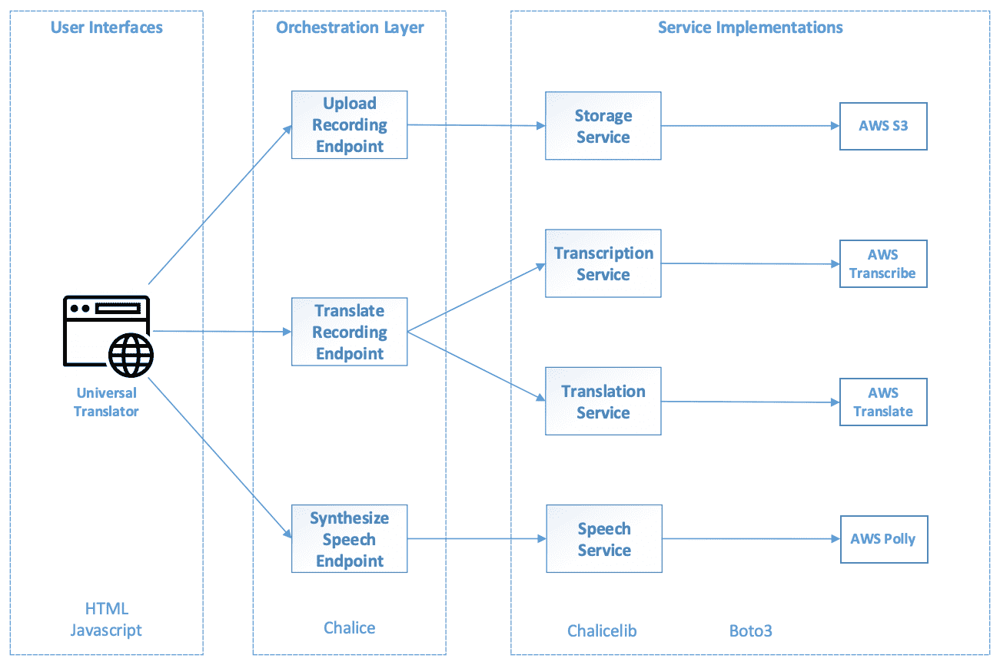

# 第四章：使用 Amazon Transcribe 和 Polly 执行语音转文本及反向操作

在本章中，我们将继续发展实现现实世界人工智能应用所需的技能和直觉。我们将构建一个能够将口语从一种语言翻译成另一种语言的应用程序。我们将利用 Amazon Transcribe 和 Amazon Polly 来执行语音转文本和文本转语音任务。我们还将展示我们的参考架构如何让我们重用在前一章项目中实现的服务。

我们将讨论以下主题：

+   使用 Amazon Transcribe 执行语音转文本

+   使用 Amazon Polly 进行文本转语音

+   使用 AWS 服务、RESTful API 和网页用户界面构建无服务器 AI 应用程序

+   在参考架构中重用现有的 AI 服务实现

+   讨论用户体验和产品设计决策

# 技术要求

本书的 GitHub 仓库，包含本章的源代码，可以在 [`github.com/PacktPublishing/Hands-On-Artificial-Intelligence-on-Amazon-Web-Services`](https://github.com/PacktPublishing/Hands-On-Artificial-Intelligence-on-Amazon-Web-Services) 找到。

# 科幻中的技术

谷歌最近进入耳机市场，推出了 Pixel Buds，这款耳机有一个独特的功能让评论员们惊艳。这些耳机能够实时翻译多种语言的对话。这听起来像科幻小说中的情节。让人想到的是《星际迷航》中的通用翻译器，它可以让星际舰队成员与几乎所有外星种族交流。尽管 Pixel Buds 没有科幻作品中的那种强大功能，但它们集成了一些令人惊叹的 **人工智能** (**AI**) 技术。这款产品展示了我们可以期待的 AI 能力，它能够帮助我们与更多地方的更多人沟通。

我们将使用 AWS AI 服务实现类似的对话翻译功能。我们的应用程序，谦虚地命名为通用翻译器，将提供多种语言之间的语音对语音翻译。然而，我们的通用翻译器并不是实时的，它仅支持几十种人类语言。

# 理解通用翻译器的架构

我们的通用翻译器应用程序将为用户提供一个网页用户界面，让他们可以录制一句话，并将该句子翻译成另一种语言。以下是我们应用程序架构设计，突出了各个层级和服务。我们之前项目中的层级和组件组织应该对你来说并不陌生：



在这个应用程序中，网页用户界面将与编排层中的三个 RESTful 端点进行交互：

+   **上传录音端点** 将把音频录制上传委托给我们的存储服务，该服务为 AWS S3 提供了一个抽象层。

+   **录音翻译端点**将使用 Amazon 转录服务和 Amazon 翻译服务。它首先获取音频录音的转录内容，然后将转录文本翻译成目标语言。转录服务和翻译服务分别抽象了 Amazon Transcribe 和 Amazon Translate 服务。

+   **语音合成端点**将把翻译后的文本的语音合成任务委托给语音服务，而该服务由 Amazon Polly 支持。

正如我们将在项目实现中看到的，翻译服务是从图像翻译项目中复用的，未做任何修改。此外，存储服务实现中的文件上传方法也复用了先前项目中的方法。分离编排层和服务实现的一个好处应该很明显：我们可以在编排层中将不同的服务实现拼接在一起，复用并重新组合，而无需修改。每个应用程序特有的业务逻辑在编排层中实现，而功能实现则不依赖于特定应用程序的业务逻辑。

# 通用翻译器的组件交互

下图展示了不同组件如何相互作用，以形成通用翻译应用的业务逻辑工作流：


以下内容是从用户的角度来看：

+   用户首先在网页用户界面中选择语音翻译的源语言和目标语言。

+   然后，用户使用屏幕上的控制录制一段简短的音频语音。

+   该录音可以从网页用户界面播放。用户可以使用播放功能检查语音录音的质量。

+   当用户对录音满意时，可以上传以进行翻译。

+   一段时间后，网页用户界面将同时显示转录文本和翻译文本。

+   最后，翻译文本的合成语音将通过网页用户界面提供音频播放。

我们决定将端到端的翻译过程分为三个主要步骤：

1.  上传音频录音。

1.  获取翻译文本。

1.  合成语音。

这一设计决策使得通用翻译器能够在翻译音频合成时，在网页用户界面中显示翻译文本。这样，应用不仅显得更为响应用户需求，而且用户在某些情况下也可以利用翻译文本，而无需等待音频合成完成。

# 设置项目结构

让我们按照第二章《现代 AI 应用的结构》中的步骤创建一个类似的基础项目结构，包括`pipenv`、`chalice`和网页文件：

1.  在终端中，我们将创建根项目目录，并使用以下命令进入该目录：

```py
$ mkdir UniversalTranslator
$ cd UniversalTranslator
```

1.  我们将通过创建一个名为 `Website` 的目录来为 Web 前端创建占位符，在该目录内创建 `index.html` 和 `scripts.js` 文件，如下所示：

```py
$ mkdir Website
$ touch Website/index.html
$ touch Website/scripts.js
```

1.  我们将在项目的 `root` 目录中使用 `pipenv` 创建一个 Python 3 虚拟环境。项目的 Python 部分需要两个包，`boto3` 和 `chalice`。我们可以使用以下命令安装它们：

```py
$ pipenv --three
$ pipenv install boto3
$ pipenv install chalice
```

1.  请记住，通过 `pipenv` 安装的 Python 包仅在我们激活虚拟环境时可用。我们可以通过以下命令来激活虚拟环境：

```py
$ pipenv shell
```

1.  接下来，在仍处于虚拟环境中时，我们将创建一个名为 `Capabilities` 的 AWS `chalice` 项目作为编排层，使用以下命令：

```py
$ chalice new-project Capabilities
```

1.  要创建 `chalicelib` Python 包，请执行以下命令：

```py
cd Capabilities
mkdir chalicelib
touch chalicelib/__init__.py
cd ..
```

通用翻译器的初始项目结构应如下所示：

```py
Project Structure
------------
├── UniversalTranslator/
    ├── Capabilities/
        ├── .chalice/
            ├── config.json
        ├── chalicelib/
            ├── __init__.py
        ├── app.py
        ├── requirements.txt
    ├── Website/
        ├── index.html
        ├── script.js
    ├── Pipfile
    ├── Pipfile.lock
```

这是通用翻译器的项目结构；它包含了用户界面、编排和服务实现层，这是我们在第二章《现代 AI 应用程序的结构》中定义的 AI 应用程序架构的一部分，*现代 AI 应用程序的解剖*。

# 实现服务

让我们分层实现这个应用程序，从包含通用翻译器核心 AI 功能的服务实现开始。

# 转录服务 – 语音转文本

在通用翻译器中，我们将把一种语言的口语翻译成另一种语言。翻译过程的第一步是知道哪些单词被说了。为此，我们将使用 Amazon Transcribe 服务。Amazon Transcribe 使用基于深度学习的**自动语音识别**（**ASR**）算法将语音转换为文本。

让我们使用 AWS CLI 来理解 Transcribe 服务是如何工作的。输入以下命令以启动转录：

```py
$ aws transcribe start-transcription-job
 --transcription-job-name <jobname>
 --language-code en-US
 --media-format wav
 --media MediaFileUri=https://s3.amazonaws.com/contents.aws.a/<audio file>.wav
 --output-bucket-name contents.aws.a
{
 "TranscriptionJob": {
 "TranscriptionJobName": "<jobname>",
 "TranscriptionJobStatus": "IN_PROGRESS",
 "LanguageCode": "en-US",
 "MediaFormat": "wav",
 "Media": {
 "MediaFileUri": "https://s3.amazonaws.com/<input bucket>/<audio file>.wav"
 },
 "CreationTime": 1552752370.771
 }
}
```

让我们了解前面命令中传递的参数：

+   作业名称必须是每个转录作业的唯一标识符。

+   语言代码告诉服务音频语言是什么。撰写本文时，支持的语言包括`"en-US"`、`"es-US"`、`"en-AU"`、`"fr-CA"`、`"en-GB"`、`"de-DE"`、`"pt-BR"`、`"fr-FR"` 和`"it-IT"`。

+   媒体格式指定了语音的音频格式；可能的值为 `"mp3"`、`"mp4"`、`"wav"` 和 `"flac"`。

+   媒体参数接受音频录音的 URI，例如，S3 URL。

+   输出存储桶名称指定了转录输出应存储在哪个 S3 存储桶中。

你需要将音频录音上传到 S3 存储桶中，以便该命令能够工作。你可以使用任何可用的软件工具录制音频片段，或者跳到本章的*语音服务*部分，了解如何使用 Amazon Polly 服务生成语音音频。

有趣的是，我们在此命令的输出中不会得到转录文本。实际上，我们可以看到我们刚启动的转录任务尚未完成。在输出中，`TranscriptionJobStatus`仍然是`IN_PROGRESS`。Amazon Transcribe 服务遵循异步模式，这通常用于长时间运行的任务。

那么，如何知道任务是否完成呢？有另一个命令，如下所示。我们可以执行此命令来检查刚刚启动的任务的状态：

```py
$ aws transcribe get-transcription-job --transcription-job-name <jobname>
{
 "TranscriptionJob": {
 "TranscriptionJobName": "<jobname>",
 "TranscriptionJobStatus": "COMPLETED",
 "LanguageCode": "en-US",
 "MediaSampleRateHertz": 96000,
 "MediaFormat": "wav",
 "Media": {
 "MediaFileUri": "https://s3.amazonaws.com/<input bucket>/<audio file>.wav"
 },
 "Transcript": {
 "TranscriptFileUri": "https://s3.amazonaws.com/<output bucket>/jobname.json"
 },
 "CreationTime": 1552752370.771,
 "CompletionTime": 1552752432.731,
 "Settings": {
 "ChannelIdentification": false
 }
 }
}
```

在上面的命令中：

+   `get-transcription-job`命令在这里接受一个参数，即我们启动任务时指定的唯一作业名称。

+   当任务状态变为`"COMPLETED"`时，`"TranscriptFileUri"`将指向我们之前指定的输出桶中的 JSON 输出文件。

这个 JSON 文件包含了实际的转录内容；下面是一个摘录：

```py
{
   "jobName":"jobname",
   "accountId":"...",
   "results":{
      "transcripts":[
         {
            "transcript":"Testing, testing one two three"
         }
      ],
      "items":[
         ...
      ]
   },
   "status":"COMPLETED"
}
```

这是我们在服务实现中需要解析的 JSON 输出，用于提取转录文本。

转录服务被实现为一个 Python 类：

+   构造函数`__init__()`创建了一个`boto3`客户端，用于连接转录服务。构造函数还接受存储服务作为依赖，以便后续使用。

+   `transcribe_audio()`方法包含了与 Amazon Transcribe 服务交互的逻辑。

+   `extract_transcript()`方法是一个辅助方法，包含了解析来自转录服务的转录 JSON 输出的逻辑。

```py
import boto3
import datetime
import time
import json

class TranscriptionService:
    def __init__(self, storage_service):
        self.client = boto3.client('transcribe')
        self.bucket_name = storage_service.get_storage_location()
        self.storage_service = storage_service

    def transcribe_audio(self, file_name, language):
        ...

    @staticmethod
    def extract_transcript(transcription_output):
        ...

```

在我们深入探讨`"transcribe_audio()"`和`"extract_transcript()"`方法的实现之前，首先让我们来看一下`boto3` SDK 中与转录相关的 API。

与 AWS CLI 命令一样，Amazon Transcribe 的 API 遵循相同的异步模式。我们可以通过`"TranscriptionJobName"`调用`"start_transcription_job()"`，这是转录任务的唯一标识符。此方法会启动转录过程；然而，当 API 调用完成时，它不会返回转录文本。`"start_transcription_job()"` API 调用的响应中还会返回一个`"TranscriptionJobStatus"`字段，其值可以是`"IN_PROGRESS"`、`"COMPLETED"`或`"FAILED"`中的一个。我们可以通过 API 调用`"get_transcritpion_job()"`并指定先前的`"TranscriptionJobName"`来检查任务的状态。

当任务完成时，转录文本会被放置在 S3 桶中。我们可以在调用`"start_transcription_job()"`时通过`"OutputBucketName"`指定一个 S3 桶，或者 Amazon Transcribe 会将转录输出放入一个默认的 S3 桶，并提供一个预签名的 URL 来访问转录文本。如果任务失败，`"start_transcription_job()"`或`"get_transcription_job()"`的响应中会有另一个`"FailureReason"`字段，提供任务失败的原因。

这种异步模式通常用于较长时间运行的过程。它允许调用者在等待过程完成的同时进行其他任务，之后再检查进度。可以类比在 Amazon.com 上订购商品的客户体验。客户不需要一直在网站上等待商品包装、发货和配送完成，而是会立即看到订单已成功下单的确认信息，并且可以稍后通过唯一的订单 ID 查询订单状态。

`TranscriptionService` 类中的 `"transcribe_audio()"` 方法解决了 Amazon Transcribe API 的异步模式：

```py
def transcribe_audio(self, file_name, language):
    POLL_DELAY = 5

    language_map = {
        'en': 'en-US',
        'es': 'es-US',
        'fr': 'fr-CA'
    }

    job_name = file_name + '-trans-' + datetime.datetime.now().strftime("%Y%m%d%H%M%S")

    response = self.client.start_transcription_job(
        TranscriptionJobName = job_name,
        LanguageCode = language_map[language],
        MediaFormat = 'wav',
        Media = {
            'MediaFileUri': "http://" + self.bucket_name + ".s3.amazonaws.com/" + file_name
        },
        OutputBucketName = self.bucket_name
    )

    transcription_job = {
        'jobName': response['TranscriptionJob']['TranscriptionJobName'],
        'jobStatus': 'IN_PROGRESS'
    }
    while transcription_job['jobStatus'] == 'IN_PROGRESS':
        time.sleep(POLL_DELAY)
        response = self.client.get_transcription_job(
            TranscriptionJobName = transcription_job['jobName']
        )
        transcription_job['jobStatus'] = response['TranscriptionJob']
                                                ['TranscriptionJobStatus']

    transcription_output = self.storage_service.get_file(job_name + '.json')
    return self.extract_transcript(transcription_output)
```

以下是对前面 `"transcribe_audio()"` 实现的概述：

+   我们使用一个简单的 Python 字典来存储三对语言代码。"en"、"es" 和 "fr" 是我们通用翻译器使用的语言代码，它们分别映射到 Amazon Transcribe 使用的语言代码 "en-US"、"es-US" 和 "fr-CA"。

+   这种映射仅限于三种语言，以简化我们的项目。然而，它展示了抽象语言代码的技术，这是我们的应用程序中第三方服务的实现细节。通过这种方式，无论底层的第三方服务如何，我们都可以始终标准化应用程序使用的语言代码。

+   我们为每个转录任务生成了一个独特的名称，叫做`"job_name"`。这个名称结合了音频文件名和当前时间的字符串表示。通过这种方式，即使在同一个文件上多次调用该方法，任务名称仍然保持唯一。

+   然后，方法调用 `"start_transcription_job()"`，传入唯一的 `"job_name"`、语言代码、媒体格式、录音所在的 S3 URI，最后是输出桶的名称。

+   即便 Transcribe API 是异步的，我们仍然设计了 `"transcribe_audio()"` 方法为同步方式。为了让我们的同步方法能够与 Transcribe 的异步 API 配合使用，我们添加了一个等待循环。该循环等待 `POLL_DELAY` 秒（设置为 5 秒），然后重复调用 `"get_transcription_job()"` 方法检查任务状态。当任务状态仍为 `"IN_PROGRESS"` 时，循环会继续运行。

+   最后，当任务完成或失败时，我们通过存储服务从指定的 S3 存储桶中获取 JSON 输出文件的内容。这也是我们在构造函数中需要将存储服务作为依赖的原因。接着，我们使用 `"extract_transcript()"` 辅助方法解析转录输出。

接下来，我们实现了之前由 `"transcribe_audio()"` 方法使用的 `"extract_transcript()"` 辅助方法来解析 Amazon Transcribe 的输出：

```py
@staticmethod
def extract_transcript(transcription_output):
    transcription = json.loads(transcription_output)

    if transcription['status'] != 'COMPLETED':
        return 'Transcription not available.'

    transcript = transcription['results']['transcripts'][0]['transcript']
    return transcript
```

我们之前已经见过使用 AWS CLI 发出的转录任务的 JSON 输出格式。这个辅助方法封装了解析该 JSON 输出的逻辑。它首先检查任务是否成功完成，如果没有，则方法返回一个错误信息作为转录文本；如果成功完成，则返回实际的转录文本。

# 翻译服务 – 翻译文本

就像在第三章，*使用 Amazon Rekognition 和 Translate 检测和翻译文本* 中的图像翻译应用程序一样，我们将利用 Amazon Translate 服务提供语言翻译功能。如前所述，我们可以重复使用在图像翻译项目中使用的相同翻译服务实现：

```py
import boto3

class TranslationService:
    def __init__(self):
        self.client = boto3.client('translate')

    def translate_text(self, text, source_language = 'auto', target_language = 'en'):
        response = self.client.translate_text(
            Text = text,
            SourceLanguageCode = source_language,
            TargetLanguageCode = target_language
        )

        translation = {
            'translatedText': response['TranslatedText'],
            'sourceLanguage': response['SourceLanguageCode'],
            'targetLanguage': response['TargetLanguageCode']
        }

        return translation
```

上面的代码与之前项目中的 `TranslationService` 实现完全相同。为了完整起见，我们在此包括此代码。如需更多关于其实现和设计选择的详细信息，请参考[第三章](https://cdp.packtpub.com/hands_on_artificial_intelligence_on_amazon_web_services/wp-admin/post.php?post=300&action=edit#post_298)，*使用 Amazon Rekognition 和 Translate 检测和翻译文本*。

# 语音服务 – 文本到语音

一旦我们获得翻译文本，就将利用 Amazon Polly 服务生成翻译的语音版本。

在我们深入实现之前，让我们使用以下 AWS CLI 命令生成一个简短的音频语音：

```py
$ aws polly start-speech-synthesis-task
 --output-format mp3
 --output-s3-bucket-name <bucket>
 --text "testing testing 1 2 3"
 --voice-id Ivy
{
 "SynthesisTask": {
 "TaskId": "e68d1b6a-4b7f-4c79-9483-2b5a5932e3d1",
 "TaskStatus": "scheduled",
 "OutputUri": "https://s3.us-east-1.amazonaws.com/<bucket>/<task id>.mp3",
 "CreationTime": 1552754991.114,
 "RequestCharacters": 21,
 "OutputFormat": "mp3",
 "TextType": "text",
 "VoiceId": "Ivy"
 }
}
```

该命令有四个必填参数：

+   输出格式是音频格式：

    +   对于音频流，可以是 `"mp3"`、`"ogg_vorbis"` 或 `"pcm"`。

    +   对于语音标记，这将是 `"json"`。

+   输出 S3 存储桶名称是生成的音频文件将被放置的地方。

+   该文本是用于文本到语音合成的文本。

+   语音 ID 指定了 Amazon Polly 提供的多种语音之一。语音 ID 间接指定了语言以及男女声。我们使用了 Ivy，这是美国英语的女性语音之一。

Amazon Polly 服务遵循与之前 Amazon Transcribe 相似的异步模式。要检查我们刚刚启动的任务状态，我们发出以下 AWS CLI 命令：

```py
$ aws polly get-speech-synthesis-task --task-id e68d1b6a-4b7f-4c79-9483-2b5a5932e3d1
{
 "SynthesisTask": {
 "TaskId": "e68d1b6a-4b7f-4c79-9483-2b5a5932e3d1",
 "TaskStatus": "completed",
 "OutputUri": "https://s3.us-east-1.amazonaws.com/<bucket>/<task id>.mp3",
 "CreationTime": 1552754991.114,
 "RequestCharacters": 21,
 "OutputFormat": "mp3",
 "TextType": "text",
 "VoiceId": "Ivy"
 }
}
```

在上述命令中，我们有以下内容：

+   `"get-speech-synthesis-task"` 命令只接受一个参数，即在 `"start-speech-synthesis-task"` 命令输出中返回的任务 ID。

+   当任务状态变为 `"completed"` 时，`"OutputUri"` 将指向我们之前指定的 S3 存储桶中生成的音频文件。

+   音频文件名是任务 ID 和指定音频格式文件扩展名的组合，例如，`"e68d1b6a-4b7f-4c79-9483-2b5a5932e3d1.mp3"` 表示 MP3 格式。

我们的语音服务实现是一个 Python 类，包含一个构造函数 `"__init__()"` 和一个名为 `synthesize_speech()` 的方法。其实现如下：

```py
import boto3
import time

class SpeechService:
    def __init__(self, storage_service):
        self.client = boto3.client('polly')
        self.bucket_name = storage_service.get_storage_location()
        self.storage_service = storage_service

    def synthesize_speech(self, text, target_language):
        POLL_DELAY = 5
        voice_map = {
            'en': 'Ivy',
            'de': 'Marlene',
            'fr': 'Celine',
            'it': 'Carla',
            'es': 'Conchita'
        }

        response = self.client.start_speech_synthesis_task(
            Text = text,
            VoiceId = voice_map[target_language],
            OutputFormat = 'mp3',
            OutputS3BucketName = self.bucket_name
        )

        synthesis_task = {
            'taskId': response['SynthesisTask']['TaskId'],
            'taskStatus': 'inProgress'
        }

        while synthesis_task['taskStatus'] == 'inProgress'\
                or synthesis_task['taskStatus'] == 'scheduled':
            time.sleep(POLL_DELAY)

            response = self.client.get_speech_synthesis_task(
                TaskId = synthesis_task['taskId']
            )

            synthesis_task['taskStatus'] = response['SynthesisTask']['TaskStatus']
            if synthesis_task['taskStatus'] == 'completed':
                synthesis_task['speechUri'] = response['SynthesisTask']['OutputUri']
                self.storage_service.make_file_public(synthesis_task['speechUri'])
                return synthesis_task['speechUri']

        return ''
```

构造函数创建了一个 Amazon Polly 服务的 `boto3` 客户端，并将 `StorageService` 作为依赖传入，以便后续使用。

在`synthesize_speech()`方法中，我们使用了 Python 的 `voice_map` 字典来存储五对语言代码。我们的通用翻译器应用支持的语言代码有`"en"`、`"de"`、`"fr"`、`"it"`和`"es"`。与语言代码不同，Amazon Polly 使用的是与语言及男女语音相关联的语音 ID。以下是 Polly 语音映射的一个摘录：

| **语言** | **女性 ID(s)** | **男性 ID(s)** |
| --- | --- | --- |
| 英语（英国）(en-GB) | Amy, Emma | Brian |
| 德语 (de-DE) | Marlene, Vicki | Hans |
| 法语 (fr-FR) | Celine, Lea | Mathieu |
| 意大利语 (it-IT) | Carla, Bianca | Giorgio |
| 西班牙语（欧洲）(es-ES) | Conchita, Lucia | Enrique |

该方法中的 `voice_map` 字典存储了通用翻译器所支持的每种语言的第一个女性语音 ID。这个设计选择是为了简化我们的项目实现。对于更精致的语音对语音翻译应用，开发者可以选择支持更多语言，并提供对不同语音的自定义。再次强调，`"voice_map"` 抽象了第三方服务的实现细节，即 Amazon Polly 的语音 ID，隔离了应用层的实现。

我们选择支持的语言并非完全随意。在这里，我们特意选择了美国英语、美国西班牙语和加拿大法语作为 Amazon Transcribe 的输入语音，并选择了 Amazon Polly 的欧洲变种作为输出语音。我们面向的客户群体是来自北美的游客，他们计划前往欧洲使用我们的通用翻译器，至少对于这个**最小可行产品**（**MVP**）版本而言。

Amazon Polly 服务的 API 遵循与其 AWS CLI 命令相同的异步模式，分别为 `"start_speech_synthesis_task()"` 和 `"get_speech_synthesis_task()"` API 调用。语音合成的实现与转录实现非常相似。我们再次调用 `"start_speech_synthesis_task()"` 方法来启动长时间运行的过程，然后使用 while 循环使我们的实现变得同步。这个循环等待 `POLL_DELAY` 秒（设置为 5 秒），然后调用 `"get_speech_synthesis_task()"` 方法来检查作业状态，状态可能为 `"scheduled"`、`"inProgress"`、`"completed"` 或 `"failed"`。当状态为 `"scheduled"` 或 `"inProgress"` 时，循环会继续运行。

请注意，即使在 AWS API 中，状态值在不同服务之间也不一致。我们的语音和转录服务将所有这些实现细节屏蔽在服务层之外。如果我们想要更换不同的语音或转录服务实现，相关更改将仅局限于服务实现层。

最后，当任务状态为 `"completed"` 时，我们会获取合成音频翻译的 S3 URI。默认情况下，S3 桶中的文件不会公开访问，我们的 Web 用户界面也无法播放音频翻译。因此，在返回 S3 URI 之前，我们使用了我们的存储服务方法 `"make_file_public()"` 将音频翻译设为公开。接下来，我们将查看在存储服务实现中是如何完成这一操作的。

# 存储服务 – 上传和检索文件

存储服务的实现大部分应与上一章中相似。`__init__()` 构造函数、`"get_storage_location()"` 方法和 `"upload_file()"` 方法与我们之前的实现完全相同。我们添加了两个新方法来扩展 `StorageService` 的功能。

这是完整的实现：

```py
import boto3

class StorageService:
    def __init__(self, storage_location):
        self.client = boto3.client('s3')
        self.bucket_name = storage_location

    def get_storage_location(self):
        return self.bucket_name

    def upload_file(self, file_bytes, file_name):
        self.client.put_object(Bucket = self.bucket_name,
                               Body = file_bytes,
                               Key = file_name,
                               ACL = 'public-read')

        return {'fileId': file_name,
                'fileUrl': "http://" + self.bucket_name + ".s3.amazonaws.com/" + file_name}

    def get_file(self, file_name):
        response = self.client.get_object(Bucket = self.bucket_name, Key = file_name)

        return response['Body'].read().decode('utf-8')

    def make_file_public(self, uri):
        parts = uri.split('/')
        key = parts[-1]
        bucket_name = parts[-2]

        self.client.put_object_acl(Bucket = bucket_name,
                                   Key = key,
                                   ACL = 'public-read')
```

让我们来看看这两个新类方法：

+   `get_file()` 方法接受文件名并返回该文件的内容作为字符串。我们通过使用 `boto3` S3 客户端，通过密钥（文件名）从桶名称（存储服务的存储位置）获取对象，并将文件内容解码为 UTF-8 字符串来实现这一点。

+   `make_file_public()` 方法接受一个文件 URI，并更改目标文件的**访问控制列表**（**ACL**），以允许公开访问。由于我们的存储服务是由 AWS S3 支持的，该方法假设 URI 是 S3 URI，并相应地解析它以提取桶名称和密钥。通过桶名称和密钥，它将对象的 ACL 更改为 `'public-read'`。

存储服务中的所有方法都设计得足够通用，以便它们更容易被不同的应用程序重用。

# 实现 RESTful 端点

现在服务已经实现，让我们继续探讨具有 RESTful 接口的编排层。由于所有实际工作都由服务实现完成，因此这些端点用于将功能拼接在一起，并为用户界面层提供 HTTP 访问以使用这些功能。因此，实施代码简洁且易于理解。

`app.py` 文件包含了 RESTful 端点的实现。以下是 `app.py` 中的一个代码片段，包含了导入、配置和初始化代码：

```py
from chalice import Chalice
from chalicelib import storage_service
from chalicelib import transcription_service
from chalicelib import translation_service
from chalicelib import speech_service

import base64
import json

#####
# chalice app configuration
#####
app = Chalice(app_name='Capabilities')
app.debug = True

#####
# services initialization
#####
storage_location = 'contents.aws.ai'
storage_service = storage_service.StorageService(storage_location)
transcription_service = transcription_service.TranscriptionService(storage_service)
translation_service = translation_service.TranslationService()
speech_service = speech_service.SpeechService(storage_service)

#####
# RESTful endpoints
#####
...
```

我们将在接下来的几节中详细讨论 `app.py` 中每个端点的实现。

# 翻译录音端点

翻译录音端点是一个 HTTP POST 端点，接收请求正文中的 JSON 参数。此端点接受录音 ID 作为参数，并通过 JSON 正文传递翻译的源语言和目标语言：

```py
@app.route('/recordings/{recording_id}/translate-text', methods = ['POST'], cors = True)
def translate_recording(recording_id):
    """transcribes the specified audio then translates the transcription text"""
    request_data = json.loads(app.current_request.raw_body)
    from_lang = request_data['fromLang']
    to_lang = request_data['toLang']

    transcription_text = transcription_service.transcribe_audio(recording_id, from_lang)

    translation_text = translation_service.translate_text(transcription_text,
                                                        target_language = to_lang)

    return {
        'text': transcription_text,
        'translation': translation_text
    }
```

该函数之上的注释描述了可以访问该端点的 HTTP 请求：

```py
POST <server url>/recordings/{recording_id}/translate-text
{
    "fromLang": <SOURCE LANGUAGE>,
    "toLang": <TARGET LANGUAGE>
}
```

让我们来看一下之前的代码：

+   `"transcribe_recording()"` 之上的注释描述了可以访问该端点的 HTTP POST 请求。

+   该函数首先获取包含源语言（`"fromLang"`）和目标语言（`"toLang"`）的请求数据，用于翻译。

+   `"transcribe_recording()"`函数调用转录服务转录音频录音。

+   接下来，该函数调用翻译服务翻译转录文本。

+   最后，这个函数返回一个包含转录文本和翻译信息的 JSON 对象。

让我们通过在 Python 虚拟环境中运行`chalice local`来测试这个端点，然后发出以下`curl`命令，指定已经上传到我们的 S3 桶中的音频片段：

```py
$ curl --header "Content-Type: application/json" --request POST --data '{"fromLang":"en","toLang":"de"}' http://127.0.0.1:8000/recordings/<recording id>/translate-text
[
 {
 "text": "<transcription>",
 "translation": {
 "translatedText": "<translation>",
 "sourceLanguage": "en",
 "targetLanguage": "de"
 }
 }
]
```

`<recording id>`标识我们 S3 桶中音频文件的文件名。

这是我们的网页用户界面将接收并用来显示翻译结果的 JSON 数据。

# 合成语音端点

合成语音端点是一个 HTTP POST 端点，接受请求体中的 JSON 参数。这个端点使用 JSON 传入目标语言和要转换为语音的文本。尽管 Universal Translator 设计用于翻译简短的短语，但用于执行文本到语音的文本可能会很长，这取决于应用程序。我们在这里使用 JSON 负载，而不是 URL 参数，因为 URL 的长度是有限制的。这个设计决策使得该端点将来可以更方便地用于其他应用程序。保持应用程序的 URL 简短清晰也是一个好习惯：

```py
@app.route('/synthesize_speech', methods = ['POST'], cors = True)
def synthesize_speech():
    """performs text-to-speech on the specified text / language"""
    request_data = json.loads(app.current_request.raw_body)
    text = request_data['text']
    language = request_data['language']

    translation_audio_url = speech_service.synthesize_speech(text, language)

    return {
        'audioUrl': translation_audio_url
    }
```

该函数上方的注释描述了可以访问此端点的 HTTP 请求：

```py
POST <server url>/synthesize_speech
{
    "text": <TEXT>,
    "language": <LANGUAGE>
}
```

在前面的代码中，我们有以下内容：

+   `synthesize_speech()`函数将请求体解析为 JSON 数据，以获取语音合成的文本和语言。

+   该函数随后调用语音服务的`synthesize_speech()`方法。

+   然后该函数返回音频文件的 URL。请记住，在` synthesize_speech()`返回之前，我们已经使这个音频文件对外公开可访问。

让我们通过在 Python 虚拟环境中运行`chalice local`来测试这个端点，然后发出以下`curl`命令来传递 JSON 负载：

```py
$ curl --header "Content-Type: application/json" --request POST --data '{"text":"Dies ist ein Test des Amazons Polly Service.","language":"de"}' http://127.0.0.1:8000/synthesize_speech
{
 "audioUrl": "https://s3.us-east-1.amazonaws.com/<bucket>/<task id>.mp3"
}
```

这是我们的网页用户界面将接收并用来更新翻译语音的音频播放器的 JSON 数据。

# 上传录音端点

这个端点本质上与[第三章](https://cdp.packtpub.com/hands_on_artificial_intelligence_on_amazon_web_services/wp-admin/post.php?post=300&action=edit#post_298)中的上传图像端点相同，*使用 Amazon Rekognition 和翻译检测和翻译文本*，*图像翻译器应用程序。它使用我们在项目中实现的两个相同的函数，没有修改。唯一的变化是`@app.route`注释，在那里我们创建了一个不同的 HTTP POST 端点`/recordings`，通过 Base64 编码进行上传：

```py
@app.route('/recordings', methods = ['POST'], cors = True)
def upload_recording():
    """processes file upload and saves file to storage service"""
    request_data = json.loads(app.current_request.raw_body)
    file_name = request_data['filename']
    file_bytes = base64.b64decode(request_data['filebytes'])

    file_info = storage_service.upload_file(file_bytes, file_name)

    return file_info
```

为了完整性，我们在这里包含了端点及其辅助函数的代码。有关它们实现的更多细节，请参考第三章，*使用 Amazon Rekognition 和 Translate 检测和翻译文本*。

# 实现网页用户界面

接下来，让我们在`Website`目录下的`index.html`和`scripts.js`文件中创建一个简单的网页用户界面。

这就是最终的网页界面样式：


在此应用程序中，用户首先在选择语言部分选择翻译的源语言和目标语言。然后，用户在录音部分录制简短的语音。在此部分，用户还可以播放录音以检查其质量。然后，翻译过程开始。当翻译文本可用时，它将在翻译文本部分显示给用户。接着，开始文本转语音生成过程。当生成的音频翻译可用时，音频播放器控制被启用，以允许播放翻译内容。

我们做出的设计决策是将每次翻译的步骤视为顺序执行，意味着一次只能执行一个翻译。每次端到端的翻译都会有一定的等待时间，主要是由于 Amazon Transcribe 和 Amazon Polly 服务的速度。我们有一些技术可以改善用户在等待期间的体验：

+   一个最重要的技术实际上是让用户知道应用程序正在处理。我们在翻译文本和翻译音频部分使用了加载指示器，表示应用程序正在处理。我们展示加载指示器的事实向用户暗示这些步骤不是即时完成的。

+   我们采用的另一种技术是将文本翻译和音频翻译步骤分开。尽管总的处理时间大致相同，用户可以看到进度和中间结果。从心理学角度看，这大大减少了用户对等待时间的感知。

+   我们还可以减少在转录服务和语音服务实现中的`POLL_DELAY`。目前，`POLL_DELAY`在两者中都设置为 5 秒。这会导致在处理完成后存在一些延迟，平均每步延迟 2.5 秒，总共约 5 秒的延迟。我们当然可以减少延迟。然而，这里存在一个权衡：较短的`POLL_DELAY`将导致更多的 AWS API 调用，分别是`"get_transcription_job()"`和`"get_speech_synthesis_task()"`函数。

+   最后，如果有可用的实时服务，我们可以使用它们来加速处理。例如，亚马逊的 Transcribe 现在支持名为流式转录（Streaming Transcription）的实时转录功能。此功能使得应用程序能够传入实时音频流并实时接收文本转录。不幸的是，在本文撰写时，该功能尚未在 Python AWS SDK 中提供。一个灵活的架构将使未来的服务实现（无论是基于 AWS 还是其他）能够更轻松地替换，从而推动应用程序的长期发展。

# index.html

以下是`index.html`文件。我们在这里使用了标准的 HTML 标签，因此网页的代码应该很容易理解：

```py
<!doctype html>
<html lang="en"/>

<head>
    <meta charset="utf-8"/>
    <meta name="viewport" content="width=device-width, initial-scale=1.0"/>

    <title>Universal Translator</title>

    <link rel="stylesheet" href="https://www.w3schools.com/w3css/4/w3.css">
    <link rel="stylesheet" href="https://www.w3schools.com/lib/w3-theme-blue-grey.css">
    <link rel="stylesheet" href="https://cdnjs.cloudflare.com/ajax/libs/font-awesome/4.7.0/css/font-awesome.min.css">
</head>

<body class="w3-theme-14">
    <div style="min-width:400px">
        <div class="w3-bar w3-large w3-theme-d4">
            <span class="w3-bar-item">Universal Translator</span>
        </div>

        ...
    </div>

    <script src="img/MediaStreamRecorder.js"></script>
   <script src="img/scripts.js"></script>
</body>

</html>
```

这个代码片段显示了网页用户界面的框架和标题：

+   除了在之前的项目中使用的 W3 样式表外，我们还包含了用于旋转图标的 Font-Awesome CSS。

+   在`index.html`的底部，我们包含了`MediaStreamRecorder.js`，用于实现网页用户界面的音频录制功能。

+   其余的`index.html`代码片段位于`<body>`内的顶级`<div>`标签中。

```py
    ...
        <div class="w3-container w3-content">
            <p class="w3-opacity"><b>Select Languages</b></p>
            <div class="w3-panel w3-white w3-card w3-display-container  
            w3-center">
                <div>
                    <b class="w3-opacity">From:</b>
                    <select id="fromLang">
                        <option value="en">English</option>
                        <option value="es">Spanish</option>
                        <option value="fr">French</option>
                    </select>
                    <hr>
                    <b class="w3-opacity">To:</b>
                    <select id="toLang">
                        <option value="de">German</option>
                        <option value="fr">French</option>
                        <option value="it">Italian</option>
                        <option value="es">Spanish</option>
                    </select>
                </div>
            </div>
        </div>

        <div class="w3-container w3-content">
            <p class="w3-opacity"><b>Record Audio</b></p>
            <div class="w3-panel w3-white w3-card w3-display-container 
            w3-center">
                <div>
                    <audio id="recording-player" controls>
                        Your browser does not support the audio  
                        element...
                    </audio>
                </div>
                <div>
                    <input type="button" id="record-toggle" 
                    value="Record"
                           onclick="toggleRecording()"/>
                    <input type="button" id="translate" 
                     value="Translate"
                           onclick="uploadAndTranslate()" disabled/>
                </div>
            </div>
        </div>
     ...
```

在这个代码片段中，我们有以下内容：

+   我们创建了网页用户界面的“选择语言”和“录制音频”部分。

+   在“选择语言”部分，我们将支持的`fromLang`和`toLang`硬编码在`dropdown`列表中。

+   在“录制音频”部分，我们使用了`<audio>`标签来创建一个音频播放器，并添加了几个输入按钮以控制录音和翻译功能。

+   大多数动态行为是在`scripts.js`中实现的。

要继续编辑`index.html`代码，请执行以下命令：

```py
...
        <div class="w3-container w3-content">
            <p class="w3-opacity"><b>Translation Text</b></p>
            <div class="w3-panel w3-white w3-card w3-display-container 
            w3-center">
                <p id="text-spinner" hidden>
                    <i class="fa fa-spinner w3-spin" style="font-
                    size:64px"></i>
                </p>
                <p class="w3-opacity"><b>Transcription:</b></p>
                <div id="transcription"></div>
                <hr>
                <p class="w3-opacity"><b>Translation:</b></p>
                <div id="translation"></div>
            </div>
        </div>

        <div class="w3-container w3-content">
            <p class="w3-opacity"><b>Translation Audio</b></p>
            <div class="w3-panel w3-white w3-card w3-display-container 
            w3-center">
                <p id="audio-spinner" hidden>
                    <i class="fa fa-spinner w3-spin" style="font-
                     size:64px"></i>
                </p>
                <audio id="translation-player" controls>
                    Your browser does not support the audio element...
                </audio>
            </div>
        </div>
...
```

在这个代码片段中，我们有以下内容：

+   我们创建了网页用户界面的“翻译文本”和“翻译音频”部分。

+   在“翻译文本”部分，我们放置了一个初始时隐藏的旋转图标，并且有几个`<div>`将用来显示翻译结果。

+   在“翻译音频”部分，我们放置了另一个初始时隐藏的旋转图标，以及一个音频播放器，用于播放翻译后的音频。

# scripts.js

以下是`scripts.js`文件。许多“通用翻译器”的动态行为是通过 JavaScript 实现的。`scripts.js`与端点进行交互，构建应用程序的整体用户体验：

```py
"use strict";

const serverUrl = "http://127.0.0.1:8000";

...

class HttpError extends Error {
    constructor(response) {
        super(`${response.status} for ${response.url}`);
        this.name = "HttpError";
        this.response = response;
    }
}
```

这个片段将`serverUrl`定义为`chalice local`的地址，并定义了`HttpError`来处理可能在 HTTP 请求中发生的异常：

```py
let audioRecorder;
let recordedAudio;

const maxAudioLength = 30000;
let audioFile = {};

const mediaConstraints = {
 audio: true
};

navigator.getUserMedia(mediaConstraints, onMediaSuccess, onMediaError);

function onMediaSuccess(audioStream) {
 audioRecorder = new MediaStreamRecorder(audioStream);
 audioRecorder.mimeType = "audio/wav";
 audioRecorder.ondataavailable = handleAudioData;
}

function onMediaError(error) {
 alert("audio recording not available: " + error.message);
}

function startRecording() {
 recordedAudio = [];
 audioRecorder.start(maxAudioLength);
}

function stopRecording() {
 audioRecorder.stop();
}

function handleAudioData(audioRecording) {
 audioRecorder.stop();
 audioFile = new File([audioRecording], "recorded_audio.wav", {type: "audio/wav"});

 let audioElem = document.getElementById("recording-player");
 audioElem.src = window.URL.createObjectURL(audioRecording);
}
```

这个代码片段遵循了[`github.com/intercom/MediaStreamRecorder`](https://github.com/intercom/MediaStreamRecorder)中推荐的音频录制实现，我们将不在此详细介绍。这里有一些细节需要注意：

+   Universal Translator 支持最多 30 秒的音频录制，长度由`maxAudioLength`常量定义。这个时长足以翻译简短的短语。

+   音频录制格式被设置为`audio/wav`，这是 Amazon Transcribe 支持的格式之一。

+   当音频录制完成后，我们执行两个任务：

    +   我们将录制的音频数据放入一个 JavaScript 文件对象中，文件名为`recorded_audio.wav`；这将是上传到 S3 的录音文件名。由于所有录音的文件名相同，因此上传新的录音时会替换掉之前上传的录音。

    +   我们在录音音频部分更新音频播放器，使用录音音频的 Object URL 进行播放。

```py
let isRecording = false;

function toggleRecording() {
    let toggleBtn = document.getElementById("record-toggle");
    let translateBtn = document.getElementById("translate");

    if (isRecording) {
        toggleBtn.value = 'Record';
        translateBtn.disabled = false;
        stopRecording();
    } else {
        toggleBtn.value = 'Stop';
        translateBtn.disabled = true;
        startRecording();
    }

    isRecording = !isRecording;
}
```

`scripts.js`中的`toggleRecording`函数使音频播放器下方的第一个输入按钮成为一个切换按钮。此切换按钮通过前面的`MediaStreamRecorder`实现开始或停止音频录制。

接下来，我们定义五个函数：

+   `uploadRecording()`：通过 Base64 编码将音频录音上传到我们的上传录音端点。

+   `translateRecording()`：调用我们的翻译录音端点来翻译音频录音。

+   `updateTranslation()`：更新翻译文本部分，显示返回的转录和翻译文本。

+   `synthesizeTranslation()`：调用我们的语音合成端点生成翻译文本的音频语音。

+   `updateTranslationAudio()`：更新翻译音频部分的音频播放器，将音频语音的 URL 加载进去以启用播放。

这些函数对应于翻译用户体验的顺序步骤。我们将它们拆分为单独的函数，使 JavaScript 代码更加模块化和可读；每个函数执行一个特定的任务。让我们逐个了解这些函数的实现细节。

让我们来看一下`uploadRecording()`函数，如下所示的代码块所示：

```py
async function uploadRecording() {
    // encode recording file as base64 string for upload
    let converter = new Promise(function(resolve, reject) {
        const reader = new FileReader();
        reader.readAsDataURL(audioFile);
        reader.onload = () => resolve(reader.result
            .toString().replace(/^data:(.*,)?/, ''));
        reader.onerror = (error) => reject(error);
    });
    let encodedString = await converter;

    // make server call to upload image
    // and return the server upload promise
    return fetch(serverUrl + "/recordings", {
        method: "POST",
        headers: {
            'Accept': 'application/json',
            'Content-Type': 'application/json'
        },
        body: JSON.stringify({filename: audioFile.name, filebytes: encodedString})
    }).then(response => {
        if (response.ok) {
            return response.json();
        } else {
            throw new HttpError(response);
        }
    })
}
```

在前面的代码中，我们有以下内容：

+   `uploadRecording()`函数通过将文件对象中的音频录音转换为 Base64 编码的字符串来创建上传数据。

+   该函数格式化 JSON 负载，以包括我们端点所期望的`filename`和`filebytes`。

+   然后，它向我们的上传录音端点 URL 发送 HTTP POST 请求，并返回 JSON 响应。

+   这与 Pictorial Translator 应用中的`uploadImage()`函数几乎相同，唯一的区别是文件来自音频录制器。

让我们来看一下`translateRecording()`函数，如下所示的代码块所示：

```py
let fromLang;
let toLang;

function translateRecording(audio) {
    let fromLangElem = document.getElementById("fromLang");
    fromLang = fromLangElem[fromLangElem.selectedIndex].value;
    let toLangElem = document.getElementById("toLang");
    toLang = toLangElem[toLangElem.selectedIndex].value;

    // start translation text spinner
    let textSpinner = document.getElementById("text-spinner");
    textSpinner.hidden = false;

    // make server call to transcribe recorded audio
    return fetch(serverUrl + "/recordings/" + audio["fileId"] + "/translate-text", {
        method: "POST",
        headers: {
            'Accept': 'application/json',
            'Content-Type': 'application/json'
        },
        body: JSON.stringify({fromLang: fromLang, toLang: toLang})
    }).then(response => {
        if (response.ok) {
            return response.json();
        } else {
            throw new HttpError(response);
        }
    })
}
```

在前面的代码中，我们有以下内容：

+   `translateRecording()`函数首先从网页用户界面的`fromLang`和`toLang`下拉菜单中获取语言的值。

+   该函数启动旋转器，向用户发出开始翻译过程的信号。然后它调用我们的翻译录音端点，并等待响应。

让我们来看一下`updateTranslation()`函数，如下代码块所示：

```py
function updateTranslation(translation) {
    // stop translation text spinner
    let textSpinner = document.getElementById("text-spinner");
    textSpinner.hidden = true;

    let transcriptionElem = document.getElementById("transcription");
    transcriptionElem.appendChild(document.createTextNode(translation["text"]));

    let translationElem = document.getElementById("translation");
    translationElem.appendChild(document.createTextNode(translation["translation"]
                                                        ["translatedText"]));

    return translation
}
```

在前面的代码中，以下内容适用：

+   当翻译录音端点响应时，`updateTranslation()`函数会隐藏旋转指示器。

+   该函数随后会更新`Translation Text`部分，包含转录和翻译文本。

让我们来看一下`synthesizeTranslation()`函数，如下代码块所示：

```py
function synthesizeTranslation(translation) {
    // start translation audio spinner
    let audioSpinner = document.getElementById("audio-spinner");
    audioSpinner.hidden = false;

    // make server call to synthesize translation audio
    return fetch(serverUrl + "/synthesize_speech", {
        method: "POST",
        headers: {
            'Accept': 'application/json',
            'Content-Type': 'application/json'
        },
        body: JSON.stringify({text: translation["translation"]["translatedText"], language: toLang})
    }).then(response => {
        if (response.ok) {
            return response.json();
        } else {
            throw new HttpError(response);
        }
    })
}
```

在前面的代码中，我们有如下内容：

+   `synthesizeTranslation()`函数启动旋转指示器，以通知用户开始进行语音合成过程。

+   该函数随后会调用语音合成端点并等待响应。请记住，该端点期望的是 JSON 参数，而这些参数在`fetch()`调用中设置。

让我们来看一下`updateTranslationAudio()`函数，如下代码块所示：

```py
function updateTranslationAudio(audio) {
    // stop translation audio spinner
    let audioSpinner = document.getElementById("audio-spinner");
    audioSpinner.hidden = true;

    let audioElem = document.getElementById("translation-player");
    audioElem.src = audio["audioUrl"];
}
```

在前面的代码中，我们有如下内容：

+   当语音合成端点响应时，`updateTranslationAudio()`函数会停止语音合成的旋转指示器。

+   该函数随后会使用合成的翻译音频的 URL 更新音频播放器。

所有前面提到的五个函数都通过`uploadAndTranslate()`函数将其串联在一起，如下所示：

```py
function uploadAndTranslate() {
    let toggleBtn = document.getElementById("record-toggle");
    toggleBtn.disabled = true;
    let translateBtn = document.getElementById("translate");
    translateBtn.disabled = true;

    uploadRecording()
        .then(audio => translateRecording(audio))
        .then(translation => updateTranslation(translation))
        .then(translation => synthesizeTranslation(translation))
        .then(audio => updateTranslationAudio(audio))
        .catch(error => {
            alert("Error: " + error);
        })

    toggleBtn.disabled = false;
}
```

注意`uploadAndTranslate()`函数中的事件顺序是多么清晰。作为该函数的最终步骤，我们启用了记录切换按钮，以便用户可以开始下一次翻译。

通用翻译器应用程序的最终项目结构应如下所示：

```py
├── Capabilities
│ ├── app.py
│ ├── chalicelib
│ │ ├── __init__.py
│ │ ├── speech_service.py
│ │ ├── storage_service.py
│ │ ├── transcription_service.py
│ │ └── translation_service.py
│ └── requirements.txt
├── Pipfile
├── Pipfile.lock
└── Website
    ├── index.html
    └── scripts.js
```

现在，我们已经完成了通用翻译器应用程序的实现。

# 将通用翻译器部署到 AWS

通用翻译器应用程序的部署步骤与前几章项目的部署步骤相同。我们在此包含它们以便完整性。

1.  首先，让我们通过在项目结构的`.chalice`目录中的`config.json`文件中将`"autogen_policy"`设置为`false`来告诉 Chalice 为我们执行策略分析：

```py
{
  "version": "2.0",
  "app_name": "Capabilities",
  "stages": {
    "dev": {
      "autogen_policy": false,
      "api_gateway_stage": "api"
    }
  }
}
```

1.  接下来，我们在`chalice`目录中创建一个新的文件`policy-dev.json`，手动指定项目需要的 AWS 服务：

```py
{
 "Version": "2012-10-17",
 "Statement": [
 {
 "Effect": "Allow",
 "Action": [
 "logs:CreateLogGroup",
 "logs:CreateLogStream",
 "logs:PutLogEvents",
 "s3:*",
 "translate:*",
 "transcribe:*",
 "polly:*"
 ],
 "Resource": "*"
 }
 ]
}
```

1.  接下来，我们通过在`Capabilities`目录中运行以下命令将 Chalice 后端部署到 AWS：

```py
$ chalice deploy
Creating deployment package.
Creating IAM role: Capabilities-dev
Creating lambda function: Capabilities-dev
Creating Rest API
Resources deployed:
  - Lambda ARN: arn:aws:lambda:us-east-1:<UID>:function:Capabilities-dev
  - Rest API URL: https://<UID>.execute-api.us-east-1.amazonaws.com/api/
```

部署完成后，Chalice 会输出一个类似于`https://<UID>.execute-api.us-east-1.amazonaws.com/api/`的 RESTful API URL，其中`<UID>`是一个唯一的标识符字符串。这就是前端应用程序应该访问的服务器 URL，用于连接在 AWS 上运行的应用程序后端。

1.  接下来，我们将`index.html`和`scripts.js`文件上传到这个 S3 桶中，并设置权限为公开可读。在此之前，我们需要在`scripts.js`中做如下更改。请记住，网站现在将在云端运行，并且无法访问我们的本地 HTTP 服务器。将本地服务器的 URL 替换为来自后端部署的 URL：

```py
"use strict";
const serverUrl = "https://<UID>.execute-api.us-east-1.amazonaws.com/api";
...
```

现在，通用翻译器应用程序可以通过互联网让每个人都能访问！

# 讨论项目增强想法

在第二部分的每个动手项目结束时，我们都会提供一些想法，以扩展智能启用应用程序。以下是增强通用翻译器的一些想法：

+   允许用户在应用程序中保存默认的源语言和输出语音偏好设置。用户可能会将母语作为源语言，并可能希望翻译后的语音与其性别和声音相匹配。

+   使用 Amazon Transcribe 的流式转录功能添加实时转录。此功能可以大大减少用户等待语音翻译的时间。在撰写本文时，Python SDK 尚不支持此功能，因此您的实现将需要使用其他 SDK。我们的架构确实支持多语言系统，即用多种语言编写的系统。

+   通用翻译器和图像翻译器都提供翻译功能。这两种翻译功能可以结合成一个单一的应用程序，供旅行者和学生使用，尤其是一个在现实世界中始终伴随用户的移动应用。

# 总结

在本章中，我们构建了一个通用翻译器应用程序，用于将口语从一种语言翻译成另一种语言。我们结合了来自 AWS AI 服务的语音转文本、语言翻译和文本转语音能力，包括 Amazon Transcribe、Amazon Translate 和 Amazon Polly。这个动手项目继续了我们作为 AI 从业者的旅程，培养了我们开发实际 AI 应用程序所需的技能和直觉。在这个过程中，我们还讨论了通用翻译器应用程序的用户体验和产品设计决策。此外，我们展示了在 第二章《现代 AI 应用程序的构成》定义的参考架构中，翻译服务和存储服务的干净代码重用，*现代 AI 应用程序的架构*。

在下一章，我们将利用更多的 AWS AI 服务来创建能够简化我们生活的解决方案。成为一名 AI 从业者不仅仅是了解使用哪些服务或 API，还需要具备将优秀的产品和架构设计与 AI 能力融合的技能。

# 参考文献

关于使用 Amazon Transcribe 和 Amazon Polly 进行语音转文本及反向操作的更多信息，请参考以下链接：

+   [`www.verizonwireless.com/wireless-devices/accessories/google-pixel-buds/`](https://www.verizonwireless.com/wireless-devices/accessories/google-pixel-buds/)

+   [`www.washingtonpost.com/news/the-switch/wp/2017/11/15/i-tried-out-googles-translating-headphones-heres-what-i-found/?utm_term=.1cef17d669e2`](https://www.washingtonpost.com/news/the-switch/wp/2017/11/15/i-tried-out-googles-translating-headphones-heres-what-i-found/?utm_term=.1cef17d669e2)

+   [`github.com/intercom/MediaStreamRecorder`](https://github.com/intercom/MediaStreamRecorder)
