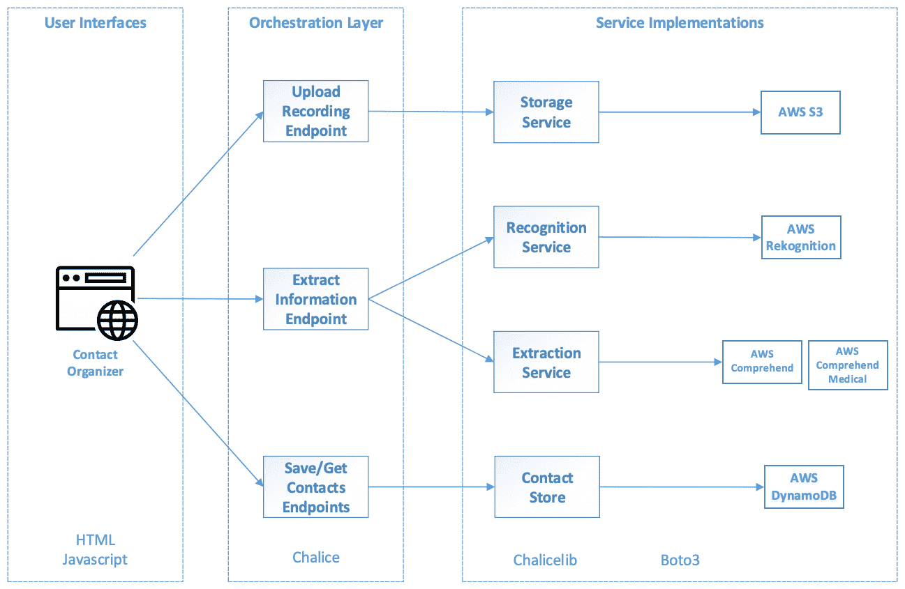
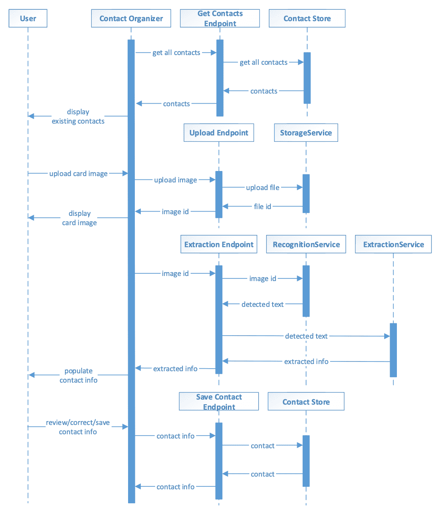
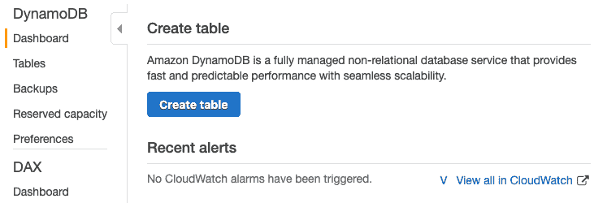
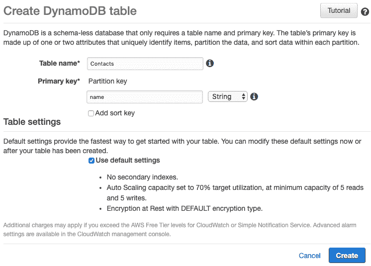
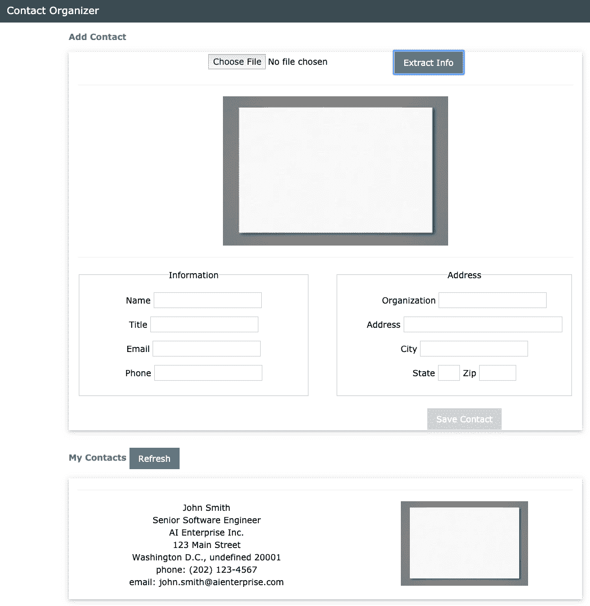

# 第五章：使用 Amazon Comprehend 提取文本中的信息

本章中，我们将构建一个应用程序，能够自动从名片照片中提取联系信息。通过这个应用程序，我们旨在通过自动化减少繁琐的手工工作。我们将使用 Amazon Rekognition 来检测名片照片中的文本，然后使用 Amazon Comprehend 提取结构化信息，如姓名、地址和电话号码。我们将展示自动化的目标并不总是完全的自主化；在解决方案中保持人的参与也具有一定的价值。

本章我们将涵盖以下主题：

+   了解人工智能在我们工作场所中的作用

+   使用 Amazon Comprehend 和 Amazon Comprehend Medical 执行信息提取

+   在 AWS DynamoDB 中存储和检索数据

+   使用 AWS 服务、RESTful API 和网页用户界面构建无服务器 AI 应用程序

+   在参考架构中重用现有的 AI 服务实现

+   讨论自动化解决方案中的人机协同界面设计

# 技术要求

本书的 GitHub 仓库，包含本章的源代码，可以在 [`github.com/PacktPublishing/Hands-On-Artificial-Intelligence-on-Amazon-Web-Services`](https://github.com/PacktPublishing/Hands-On-Artificial-Intelligence-on-Amazon-Web-Services) 找到。

# 与你的人工智能同事合作

**人工智能** (**AI**) 正在推动我们生活中自动化的进步。当大多数人想到智能自动化时，他们通常会想到智能温控器、吸尘机器人或自动驾驶汽车，这些都帮助我们过上更好的生活。我们也有巨大的机会利用智能自动化来帮助我们更高效地工作。人工智能可以在工作场所中补充人类劳动，为企业创造价值，促进经济增长，并将人类劳动转向创造性工作。一个迫切需要自动化进步的领域是手工的后勤处理过程。当我们存入支票、注册服务或在线购物时，仍然有许多任务是由人类在幕后完成的。

关于工作被自动化取代的担忧是存在的；然而，我们也观察到，当琐碎的工作被自动化时，工人的士气得到了改善。大多数手动后勤工作都是乏味且重复的。例如，有些人的工作是阅读多份文档，识别其中的某些信息，然后手动将信息输入计算机系统。这些后勤文档处理任务也被称为“旋转椅”过程，因为工人们不断在文件和计算机屏幕之间旋转椅子。我们可以利用 AI 来自动化文档处理过程，通过**光学字符识别**（**OCR**）读取文档，再利用**自然语言处理**（**NLP**）提取信息。

然而，自动化文档处理并非易事。纸质文档必须先进行扫描。根据文档图像的质量、文档结构的复杂性，甚至是文档中的手写文本，可能很难保证处理的准确性。对于某些业务环境和使用案例，任何低于 100%的准确性都是不可接受的。在这种情况下，自动化开发人员必须设计可支持人工干预的容错机制，以便在出现问题时，人工可以介入并接管处理。例如，自动化解决方案可以在银行存款过程中提取支票上的金额。如果该过程中的数据不准确，可能会对银行客户造成重大后果。为了确保正确的存款金额，自动化解决方案可以先提取金额，然后在存款完成之前将提取的金额展示给人工操作员进行确认。这个解决方案利用了 AI 技术来自动化任务，但也允许人在出错时进行干预。

在本章中，我们将实现一个名为“联系人管理器”的应用程序，用于自动化文档处理。更具体地说，该应用程序帮助我们从扫描的名片中提取联系人信息。为了确保准确性，我们的应用程序将提供一个“人机交互”用户界面，以便用户在保存信息之前，能够审核并更正自动提取的内容。这种“人机交互”用户界面是一种流行的方式，因为它通过人的判断来提高自动化的准确性。

# 了解联系人管理器架构

联系人管理器应用程序将为用户提供一个 Web 用户界面，用户可以通过该界面上传名片图像。应用程序将提取并分类联系人信息。然后，自动提取的联系人信息将在 Web 用户界面中显示给用户。用户可以在将其保存到永久联系人库之前，审查并更正这些信息。

以下图示展示了架构设计，重点突出联系组织器应用的各个层次和服务。以下架构设计现在应该很熟悉了；这些层次和组件遵循我们在第二章中定义的相同参考架构模板，*现代 AI 应用的构成*：



在这个应用中，Web 用户界面将与协调层中的三个 RESTful 端点进行交互：

+   **上传录音端点**将把图像上传委托给我们的**存储服务**。

+   **提取信息端点**将使用**识别服务**和**提取服务**：

    +   识别服务是从第三章中重用的，*使用 Amazon Rekognition 和 Translate 检测和翻译文本*，当时我们在讲解图像翻译器项目时使用过。

    +   提取服务将同时使用 Amazon Comprehend 和 Amazon Comprehend Medical 来提取和分类各种联系信息，如姓名、地址和电话号码。

+   **保存/获取联系人端点**将写入/读取**联系人存储**，其后端是 AWS DynamoDB NoSQL 数据库。

在联系组织器中，我们有几个机会可以重用我们在之前项目中已经实现的组件。在协调层中，我们可以重用上传录音端点。在服务实现层中，我们可以重用存储和识别服务。

# 联系组织器中的组件交互

以下交互图展示了联系组织器中应用组件之间的业务逻辑工作流程：



从用户的角度来看，我们有以下内容：

1.  当联系组织器 Web 用户界面首次加载时，它将获取并显示所有现有的联系人。

1.  用户随后可以通过 Web 用户界面上传名片照片。

1.  上传完成后，开始两个步骤：

    1.  上传的名片图像会显示在用户界面中。

    1.  自动化的联系信息提取过程已开始。

1.  当信息提取完成后，提取的信息会展示给用户，以供审核和修正。

1.  用户在审核并修正信息后，点击**保存**按钮后，联系信息可以被持久化。

我们设计了联系组织器，使其具有一个人机交互的用户界面，如下所示：

1.  上传的名片图像会重新显示给用户，以便他们查看原始联系信息。

1.  自动提取的联系信息也会与名片图像一起展示给用户。

1.  用户可以选择从用户界面中更改或修正任何提取的信息。

1.  用户必须明确点击“保存”按钮，作为确认联系信息正确的人的确认。

这个人机协作的用户界面也不应该仅仅是智能解决方案中的附加部分。我们评估此类界面设计的经验法则是，即使没有与用户界面一起存在的 AI 功能，解决方案也应该是完全可用的。

# 设置项目结构

创建一个类似于我们在[第二章](https://cdp.packtpub.com/hands_on_artificial_intelligence_on_amazon_web_services/wp-admin/post.php?post=301&action=edit#post_299)中概述的基础项目结构，*现代人工智能应用程序的结构*，包括`pipenv`、`chalice`和网页文件：

1.  在终端中，我们将创建`root`项目目录并进入该目录，使用以下命令：

```py
$ mkdir ContactOrganizer
$ cd ContactOrganizer
```

1.  我们将通过创建一个名为`Website`的目录来为 Web 前端创建占位符。在此目录中，我们将创建两个文件，`index.html`和`scripts.js`，如下代码所示：

```py
$ mkdir Website
$ touch Website/index.html
$ touch Website/scripts.js
```

1.  我们将在项目的根目录中创建一个 Python 3 虚拟环境，并使用`pipenv`。项目中的 Python 部分需要两个包，`boto3`和`chalice`。我们可以使用以下命令安装它们：

```py
$ pipenv --three
$ pipenv install boto3
$ pipenv install chalice
```

1.  请记住，通过`pipenv`安装的 Python 包仅在我们激活虚拟环境时才可用。实现这一点的一种方法是使用以下命令：

```py
$ pipenv shell
```

1.  接下来，仍在虚拟环境中，我们将创建一个名为`Capabilities`的 AWS Chalice 项目，作为协调层，使用以下命令：

```py
$ chalice new-project Capabilities
```

1.  要创建`chalicelib` Python 包，请执行以下命令：

```py
cd Capabilities
mkdir chalicelib
touch chalicelib/__init__.py
cd ..
```

“联系人组织器”的初始项目结构应如下所示：

```py
Project Structure
------------
├── ContactOrganizer/
    ├── Capabilities/
        ├── .chalice/
            ├── config.json
        ├── chalicelib/
            ├── __init__.py
        ├── app.py
        ├── requirements.txt
    ├── Website/
        ├── index.html
        ├── script.js
    ├── Pipfile
    ├── Pipfile.lock
```

这个“联系人组织器”项目结构包含了我们在[第二章](https://cdp.packtpub.com/hands_on_artificial_intelligence_on_amazon_web_services/wp-admin/post.php?post=301&action=edit#post_299)中定义的 AI 应用程序架构的用户界面、协调和服务实现层，*现代人工智能应用程序的结构*。

# 实现服务

让我们逐层实现联系人组织器，从包含关键 AI 功能的服务实现开始。我们在这个项目中需要的许多功能，如检测图像中的文本和处理文件上传，都在之前的项目中实现过。具有真正新功能的服务是提取服务和联系人存储。

# 识别服务 - 文本检测

再次，我们将利用 Amazon Rekognition 服务提供检测图像中文本的功能。我们可以重用我们在第三章的图像翻译项目中实现的相同 Recognition 服务，*使用 Amazon Rekognition 和 Translate 检测与翻译文本*，如下代码所示：

```py
import boto3

class RecognitionService:
    def __init__(self, storage_location):
        self.client = boto3.client('rekognition')
        self.bucket_name = storage_location

    def detect_text(self, file_name):
        response = self.client.detect_text(
            Image = {
                'S3Object': {
                    'Bucket': self.bucket_name,
                    'Name': file_name
                }
            }
        )

        lines = []
        for detection in response['TextDetections']:
            if detection['Type'] == 'LINE':
                lines.append({
                    'text': detection['DetectedText'],
                    'confidence': detection['Confidence'],
                    'boundingBox': detection['Geometry']['BoundingBox']
                })

        return lines
```

有关其实现和识别服务设计选择的更多细节，请参阅第三章，*使用 Amazon Rekognition 和 Translate 检测和翻译文本*。

有一个新的 Amazon Textract 服务，可以自动从扫描文档中提取文本和数据。Amazon Textract 可能在提取名片文本方面同样有效，但有一些需要考虑的事项。尽管名片类似于文档，但我们的应用程序处理的是名片的照片，而非扫描图像。

Amazon Textract 现在已全面推出；由于其文本提取能力，取代 AWS Rekognition 将是一个很好的功能增强练习，适合用于此动手项目。想一想，我们架构中哪些组件和交互会受到这种变化的影响。

# 提取服务 – 联系信息提取

我们将利用 Amazon Comprehend 来提取从名片上检测到的文本中的联系信息。首先，让我们使用 AWS CLI 探索该服务。

联系人组织者需要从我们的名片中提取信息。通常，名片上的文本包含个人的姓名、职位、组织、地址、电话号码、电子邮件等信息。

以下是一个虚构联系人的示例文本：

```py
AI Enterprise Inc.
John Smith
Senior Software Engineer
123 Main Street Washington D.C. 20001
john.smith@aienterprise.com
(202) 123-4567
```

让我们看看 Amazon Comprehend 能从这个示例文本中提取什么。执行以下 AWS CLI 命令：

```py
$ aws comprehend detect-entities --language-code en --text "AI Enterprise Inc. John Smith Senior Software Engineer 123 Main Street Washington D.C. 20001 john.smith@aienterprise.com (202) 123-4567"
{
    "Entities": [
        {
            "Score": 0.8652380108833313,
            "Type": "ORGANIZATION",
            "Text": "AI Enterprise Inc",
            ...
        },
        {
            "Score": 0.9714182019233704,
            "Type": "PERSON",
            "Text": "John Smith",
            ...
        },
        {
            "Score": 0.9006084203720093,
            "Type": "LOCATION",
            "Text": "123 Main Street Washington D.C.",
            ...
        },
        {
            "Score": 0.48333245515823364,
            "Type": "DATE",
            "Text": "20001",
            ...
        },
        {
            "Score": 0.998563826084137,
            "Type": "OTHER",
            "Text": "john.smith@aienterprise.com",
            ...
        },
        {
            "Score": 0.9999305009841919,
            "Type": "OTHER",
            "Text": "(202) 123-4567",
            ...
        }
    ]
}
```

Amazon Comprehend 提取了一些信息，包括组织（`ORGANIZATION`）、个人姓名（`PERSON`）和地址（`LOCATION`）。然而，AWS Comprehend 将电子邮件和电话号码提取为`OTHER`，错误地将邮政编码提取为`DATE`，并且未能提取职位信息。

尽管提取结果并不完美，但我们的联系人组织者应用程序仍然可以利用这些结果，减少用户的手动工作量。

有一种方法可以改进这些信息提取结果。亚马逊提供了 Comprehend 服务的另一个变种，称为 AWS Comprehend Medical。该变种专门用于从各种医学文档中提取信息。

其特点之一是提取**受保护的健康信息**（**PHI**），例如姓名、年龄、地址、电话号码和电子邮件。我们可以利用此功能来完成名片信息提取任务。

让我们看看这个功能在我们之前查看的相同示例文本上表现如何。执行以下 AWS CLI 命令：

```py
aws comprehendmedical detect-phi --text "AI Enterprise Inc. John Smith Software Engineer 123 Main Street Washington D.C. 20001 john.smith@aienterprise.com (202) 123-4567"
{
    "Entities": [
        {
            "Text": "AI Enterprise Inc",
            "Category": "PROTECTED_HEALTH_INFORMATION",
            "Type": "ADDRESS",
            ...
        },
        {
            "Text": "John Smith",
            "Category": "PROTECTED_HEALTH_INFORMATION",
            "Type": "NAME",
            ...
        },
        {
            "Text": "Software Engineer",
            "Category": "PROTECTED_HEALTH_INFORMATION",
            "Type": "PROFESSION",
            ...
        },
        {
            "Text": "123 Main Street Washington D.C. 20001",
            "Category": "PROTECTED_HEALTH_INFORMATION",
            "Type": "ADDRESS",
            ...
        },
        {
            "Text": "john.smith@aienterprise.com",
            "Category": "PROTECTED_HEALTH_INFORMATION",
            "Type": "EMAIL",
            ...
        },
        {
            "Text": "(202) 123-4567",
            "Category": "PROTECTED_HEALTH_INFORMATION",
            "Type": "PHONE_OR_FAX",
            ...
        }
    ]
}
```

Amazon Comprehend Medical 提取了与其非医学对应物大部分相同的信息。此外，它还提取了职位（`PROFESSION`）、电话号码（`PHONE_OR_FAX`）和电子邮件（`EMAIL`）。所提取的地址（`ADDRESS`）似乎比非医学变体更准确。当我们结合 Comprehend 服务的两个变体的结果时，我们能够提取典型商务卡上的联系信息。

有了这些见解，让我们来实现我们的抽取服务。我们将在`chalicelib`目录下的`extraction_service.py`文件中创建一个名为`ExtractionService`的 Python 类：

```py
import boto3
from collections import defaultdict
import usaddress

class ExtractionService:
    def __init__(self):
        self.comprehend = boto3.client('comprehend')
        self.comprehend_med = boto3.client('comprehendmedical')

    def extract_contact_info(self, contact_string):
        ...
```

此代码摘录显示了服务所需的导入以及构造函数方法，该方法为 Amazon Comprehend 和 Amazon Comprehend Medical 服务分别实例化了两个`boto3`客户端。

现在让我们看看如何使用这两个服务来实现`extract_contact_info()`方法：

```py
    def extract_contact_info(self, contact_string):
        contact_info = defaultdict(list)

        # extract info with comprehend
        response = self.comprehend.detect_entities(
            Text = contact_string,
            LanguageCode = 'en'
        )

        for entity in response['Entities']:
            if entity['Type'] == 'PERSON':
                contact_info['name'].append(entity['Text'])
            elif entity['Type'] == 'ORGANIZATION':
                contact_info['organization'].append(entity['Text'])

        # extract info with comprehend medical
        response = self.comprehend_med.detect_phi(
            Text = contact_string
        )

        for entity in response['Entities']:
            if entity['Type'] == 'EMAIL':
                contact_info['email'].append(entity['Text'])
            elif entity['Type'] == 'PHONE_OR_FAX':
                contact_info['phone'].append(entity['Text'])
            elif entity['Type'] == 'PROFESSION':
                contact_info['title'].append(entity['Text'])
            elif entity['Type'] == 'ADDRESS':
                contact_info['address'].append(entity['Text'])

        # additional processing for address
        address_string = ' '.join(contact_info['address'])
        address_parts = usaddress.parse(address_string)

        for part in address_parts:
            if part[1] == 'PlaceName':
                contact_info['city'].append(part[0])
            elif part[1] == 'StateName':
                contact_info['state'].append(part[0])
            elif part[1] == 'ZipCode':
                contact_info['zip'].append(part[0])

        return dict(contact_info)
```

在上述代码中，我们可以看到以下内容：

+   `extract_contact_info()`方法通过`boto3`调用了两个 Amazon Comprehend 变体。来自两个调用的结果被处理并存储在`contact_info`字典中。

+   `contact_info`被声明为`defaultdict(list)`，这是一种字典数据结构，其值默认为空列表。

实际上，对于给定类型，可能会提取多个结果。例如，单个商务卡可能提取两个电话号码。这可能出现三种情况，正如我们在使用案例中观察到的那样：

+   第一个原因适用于给定类型实际上存在多个信息片段的情况。例如，在商务卡上可能有电话号码和传真号码。

+   第二个原因是信息是较简单信息的组合。例如，许多职位实际上包括角色名称、职位级别和特长。

+   第三个原因是 Amazon Comprehend 服务在提取过程中可能出现的不准确性。例如，地址中的邮政编码可能被错误地分类为电话号码。

对两个 AWS Comprehend 变体的两次调用如下：

+   首次调用是对 Amazon Comprehend 客户端的`detect_entities()`函数。从响应中，我们将名称和组织存储在`contact_info`中。

+   第二次调用是对 Amazon Comprehend Medical 客户端的`detect_phi()`函数。从响应中，我们将电子邮件、电话号码、职位和地址存储在`contact_info`中。

如果每种类型存在多个结果，则将它们附加到`defaultdict(list)`数据结构中相应列表中。

AWS Comprehend 将地址提取为一个整体信息。然而，将地址的不同部分（如城市、州和邮政编码）分别存储会更加有用。这将使得联系人信息的组织、搜索和展示更加方便。在 `extract_contact_info()` 方法中，我们还使用了一个名为 `usaddress` 的 Python 包来尝试解析地址的各个子组件，并将它们单独存储在 `contact_info` 数据结构中。

最后，`extract_contact_info()` 方法将 `contact_info` 返回为一个标准的 Python 字典。

在联系人管理器应用中，用户上传名片照片。然后，应用使用 AWS Rekognition 尝试检测文本，并将检测到的文本传递给 AWS Comprehend 以尝试提取信息。地址还会经过一个后处理步骤，解析出城市、州和邮政编码。

我们可以将此过程视为一个由多个顺序步骤组成的管道；前一步的输出作为输入传递到下一步。就像一场传话游戏，最终的结果可能会因为任何步骤的输出质量而受到影响。提取的准确性取决于照片的质量、照片中文字检测的准确性、信息提取的准确性以及后处理的解析准确性。

# 联系人存储 – 保存和检索联系人

用户在联系人管理器中保存联系人信息后，应该能够检索到这些信息。检索数据需要数据持久性。

在联系人管理器中，我们将使用 AWS DynamoDB，这是一个高度可扩展的云端 NoSQL 数据库。DynamoDB 非常适合我们的无服务器架构，因为开发者不需要管理数据库服务器。相反，开发者可以创建会自动根据需求扩展的表格。我们将使用 DynamoDB 表格来存储和检索联系人信息。

让我们使用 AWS Web 控制台创建一个联系人表格：

1.  进入 DynamoDB 仪表盘页面并点击“创建表”按钮：



1.  在创建 DynamoDB 表格页面上，将表名设置为 Contacts，并将主键设置为 name。由于 DynamoDB 是一个 NoSQL 或文档数据库，我们不需要预先指定整个数据库表的模式：



1.  完成表格设置，选择“使用默认设置”选项并点击“创建”。

就这样！你刚刚创建了一个可以处理超过每天 10 万亿次请求的 Web 规模数据库。最棒的是，你无需管理它！

对于这个简单的项目，我们使用 AWS Web 控制台创建了一个数据库表。对于企业级应用程序，我们建议遵循符合**基础设施即代码**（**IaC**）的最佳实践，其中基础设施应通过代码或配置自动配置和管理，而不是通过 AWS Web 控制台等手动设置。

其中的好处包括从灾难性事件中快速恢复、快速实验新功能、以及记录系统环境设置等。Boto3 允许您编写 Python 代码来创建和配置 DynamoDB 表。AWS CloudFormation 还允许自动创建和配置 DynamoDB 以及更多 AWS 服务。

现在`Contacts`表已创建，让我们实现我们的`ContactStore`服务。在`chalicelib`目录下的`contact_store.py`文件中创建一个名为`ContactStore`的 Python 类：

```py
import boto3

class ContactStore:
    def __init__(self, store_location):
        self.table = boto3.resource('dynamodb').Table(store_location)

    def save_contact(self, contact_info):
        response = self.table.put_item(
            Item = contact_info
        )
        # should return values from dynamodb however,
        # dynamodb does not support ReturnValues = ALL_NEW
        return contact_info

    def get_all_contacts(self):
        response = self.table.scan()

        contact_info_list = []
        for item in response['Items']:
            contact_info_list.append(item)

        return contact_info_list
```

在前面的代码中，我们有以下内容：

+   构造函数`__init__()`为 DynamoDB 创建了一个`boto3`源，以便获取我们的`Contacts`表。构造函数接受一个名为`store_location`的参数，它在我们的实现中作为表名。

+   `save_contact()`方法接受一个包含联系信息的 Python 字典数据结构，并使用`put_item()`函数存储联系人，该函数接受要插入表中的项。

+   在`save_contact()`中，我们将`contact_info`数据对象返回给调用者。我们尝试遵循 RESTful API 约定：当 API 创建一个新资源（联系人）时，应返回更新后的资源（联系人）：

    +   RESTful 约定建议在创建资源后返回资源状态的新表示。例如，可能为资源创建了一个新的 ID。然而，`boto3`中的`put_item()`函数当前不会返回资源的新值。对于联系人管理器来说，这没有问题，因为我们选择使用“名称”作为联系人键或 ID。

+   `get_all_contacts()`方法通过`scan()`函数检索所有已保存到 DynamoDB 中的联系人。只提供表名的情况下，`scan()`函数将返回表中的所有项目。

# 存储服务——上传和检索文件

我们可以重用之前项目中`StorageService`的相同实现。我们仅提供当前项目所需的方法，如下所示：

```py
import boto3

class StorageService:
    def __init__(self, storage_location):
        self.client = boto3.client('s3')
        self.bucket_name = storage_location
    def upload_file(self, file_bytes, file_name):
        self.client.put_object(Bucket = self.bucket_name,
                               Body = file_bytes,
                               Key = file_name,
                               ACL = 'public-read')

        return {'fileId': file_name,
                'fileUrl': "http://" + self.bucket_name + ".s3.amazonaws.com/" + file_name}
```

有关实现和设计选择的更多细节，请参见第三章，*使用 Amazon Rekognition 和 Translate 检测和翻译文本*。

# 实现 RESTful 端点

让我们进入编排层，以便将我们在服务中实现的各种功能整合在一起。RESTful 端点为用户界面层提供了 HTTP 访问，以便访问业务功能。

正如我们之前所说，编排层应该简洁且易于理解。RESTful 端点应只关注编排服务，以形成更高层次的业务逻辑并处理 HTTP 协议细节。

评估编排层或 RESTful 端点在关注点分离方面是否设计良好的一种方法是检查包的导入。编排层是否需要导入来自服务的包？

例如，在我们的项目中，RESTful 端点是否导入了与 AWS 交互的 `boto3`？它们不应该。

通常，RESTful 端点会导入服务实现（`storage_service` 和 `recognition_service`）、与编程框架相关的包（`chalice`）以及与协议相关的包（`JSON` 和 `CGI`）。

用以下代码替换 Chalice 项目中的 `app.py` 内容：

```py
from chalice import Chalice
from chalicelib import storage_service
from chalicelib import recognition_service
from chalicelib import extraction_service
from chalicelib import contact_store

import base64
import json

#####
# chalice app configuration
#####
app = Chalice(app_name='Capabilities')
app.debug = True

#####
# services initialization
#####
storage_location = 'contents.aws.ai'
storage_service = storage_service.StorageService(storage_location)
recognition_service = recognition_service.RecognitionService(storage_location)
extraction_service = extraction_service.ExtractionService()
store_location = 'Contacts'
contact_store = contact_store.ContactStore(store_location)

#####
# RESTful endpoints
#####
...
```

前面的代码片段处理了所有包的导入、Chalice 应用配置以及我们四个服务的实例化。

# 提取图像信息端点

`extract_image_info()`函数实现了 RESTful 端点。使用以下代码继续在`app.py`中的 Python 代码：

```py
@app.route('/images/{image_id}/extract-info', methods = ['POST'], cors = True)
def extract_image_info(image_id):
    """detects text in the specified image then extracts contact information from the text"""
    MIN_CONFIDENCE = 70.0

    text_lines = recognition_service.detect_text(image_id)

    contact_lines = []
    for line in text_lines:
        # check confidence
        if float(line['confidence']) >= MIN_CONFIDENCE:
            contact_lines.append(line['text'])

    contact_string = '   '.join(contact_lines)
    contact_info = extraction_service.extract_contact_info(contact_string)

    return contact_info
```

该注释位于此函数上方，描述了可以访问此端点的 HTTP 请求：

```py
POST <server url>/images/{image_id}/extracted-info
```

在前面的代码中，我们有以下内容：

+   在 `extract_image_info()` 函数中，我们调用 `RecognitionService` 来检测图像中的文本，并将检测到的文本行存储在 `text_lines` 中。

+   然后，我们构建一个字符串 `contact_string`，其中包含所有检测到的文本行，且其置信度高于`MIN_CONFIDENCE`，该值被设置为`70.0`：

    +   这个 `contact_string` 是通过将检测到的文本行用三个空格连接起来构建的。我们选择三个空格作为分隔符，因为检测到的行更有可能是相关信息，我们通过额外的空格向提取服务提示这种关系。

+   然后，我们调用提取服务的`extract_contact_info()`方法并返回联系信息。请记住，`extract_contact_info()`不仅调用了 Amazon Comprehend 服务的两个变体，它还使用了`usaddress` Python 包来解析地址的各个部分。

让我们通过在 Python 虚拟环境中运行 `chalice local` 来测试这个端点，然后发出以下 `curl` 命令。接下来，我们将指定一个已经上传到 S3 存储桶中的图像：

```py
curl -X POST http://127.0.0.1:8000/images/<uploaded image>/extract-info
{
    "organization":[
        "<organization>"
    ],
    "name":[
        "<name>"
    ],
    "title":[
        "<title>"
    ],
    "address":[
        "<address>"
    ],
    "phone":[
        "<phone>"
    ],
    "email":[
        "<email>"
    ]
}
```

这是我们的 Web 用户界面将接收的 JSON，并用于向用户显示翻译内容。

# 保存联系人和获取所有联系人端点

保存联系人和获取所有联系人端点通过联系存储服务处理联系人信息的保存和检索：

```py
@app.route('/contacts', methods = ['POST'], cors = True)
def save_contact():
    """saves contact information to the contact store service"""
    request_data = json.loads(app.current_request.raw_body)

    contact = contact_store.save_contact(request_data)

    return contact

@app.route('/contacts', methods = ['GET'], cors = True)
def get_all_contacts():
    """gets all saved contacts in the contact store service"""
    contacts = contact_store.get_all_contacts()

    return contacts
```

它们的实现非常简单：

+   `save_contact()` 函数从请求体中的 JSON 参数获取联系人信息。此方法随后通过联系人存储保存该联系信息。以下代码是可以访问此端点的 HTTP 请求：

```py
POST <server url>/contacts
{
    "name": <NAME>,
    "organization": <ORGANIZATION>,
    "title": <TITLE>,
    "address": <ADDRESS>,
    "city": <CITY>,
    "state": <STATE>,
    "zip": <ZIP>,
    "phone": <PHONE>,
    "email": <EMAIL>
}
```

+   `get_all_contacts()`方法通过联系人存储检索所有已保存的联系人。以下代码是可以访问该端点的 HTTP 请求：

```py
GET <server url>/contacts
```

让我们通过一对`curl`命令来一起测试这些端点：

```py
$ curl --header "Content-Type: application/json" --request POST --data '{"name": "John Smith", "organization": "AI Enterprise Inc.", "title": "Senior Software Engineer", "address": "123 Main Street", "city": "Washington D.C.", "zip": "20001", "phone": "(202) 123-4567", "email": "john.smith@aienterprise.com"}’ http://127.0.0.1:8000/contacts
{
 "name":"John Smith",
 "Organization":
 ...

$ curl http://127.0.0.1:8000/contacts
[
 {
 "city":"Washington D.C.",
 "zip":"20001",
 "organization":"AI Enterprise Inc.",
 "address":"123 Main Street",
 "email":"john.smith@aienterprise.com",
 "phone":"(202) 123-4567",
 "name":"John Smith",
 "title":"Senior Software Engineer"
 }
]
```

我们可以看到以下内容：

+   第一个`POST`命令将联系人的表示作为响应返回，以符合 RESTful 规范。

+   第二个`GET`命令获取一个包含我们刚刚保存的联系人列表的联系人信息。

这些是用于与网页用户界面交互的 JSON 格式。

# 上传图像端点

我们正在重新使用来自 Pictorial Translator 项目的上传图像端点的相同实现。有关此代码片段的更多实现细节和设计选择，请参阅第三章，*使用 Amazon Rekognition 和 Translate 检测和翻译文本*：

```py
@app.route('/images', methods = ['POST'], cors = True)
def upload_image():
    """processes file upload and saves file to storage service"""
    request_data = json.loads(app.current_request.raw_body)
    file_name = request_data['filename']
    file_bytes = base64.b64decode(request_data['filebytes'])

    image_info = storage_service.upload_file(file_bytes, file_name)

    return image_info
```

现在，联系信息管理器的编排层已经完成。

# 实现网页用户界面

接下来，我们将在`index.html`和`scripts.js`文件中使用 HTML 和 JavaScript 创建一个简单的网页用户界面，并将它们放置在`Website`目录中。

以下截图显示了最终的网页用户界面：



在联系信息管理器中，用户上传名片的照片，应用程序会尽力检测卡片上的文字并提取其中的信息。然后，应用程序会用提取的信息填充输入框，供用户查看和修改。

如果针对某种类型提取了多项信息，联系信息管理器将用所有可用的信息填充该类型的输入框。例如，如果提取了多个电话号码，则电话号码输入框将填充所有可用的电话号码。

这个设计决策假设用户删除多余信息比输入缺失信息更容易。这个假设听起来是合理的；然而，它应该通过调查或用户研究来与应用程序的目标受众进行验证。为了使人机协作用户界面在竞争中稍占优势，需要微调这些设计决策。

尽管我们希望像联系信息管理器这样的应用程序能够自动提取并保存名片上的所有信息，但联系信息管理器的目的是尽可能减少繁琐的工作，同时仍然让用户参与，以确保信息的准确性。

人机协作用户界面还有另一个重要的好处。因为人类参与了纠正智能自动化所犯的错误，这是一个收集训练数据的机会，可以用于未来改进自动化技术。用户实际上是在为机器学习算法提供训练示例。记住，更好的数据总是能获胜！

# Index.html

我们这里使用的是标准的 HTML 标签，因此网页的代码应该容易理解：

```py
<!doctype html>
<html lang="en"/>

<head>
    <meta charset="utf-8"/>
    <meta name="viewport" content="width=device-width, initial-scale=1.0"/>

    <title>Contact Organizer</title>

    <link rel="stylesheet" href="https://www.w3schools.com/w3css/4/w3.css">
    <link rel="stylesheet" href="https://www.w3schools.com/lib/w3-theme-blue-grey.css">
</head>

<body class="w3-theme-14" onload="retrieveAndDisplayContacts()">
    <div style="min-width:400px">
        <div class="w3-bar w3-large w3-theme-d4">
            <span class="w3-bar-item">Contact Organizer</span>
        </div>

        ...

        <div class="w3-container w3-content">
            <p>
                <b class="w3-opacity">My Contacts</b>
                <input class="w3-button w3-blue-grey" type="submit"
                       value="Refresh" onclick="retrieveAndDisplayContacts()"/>
            </p>
            <div class="w3-panel w3-white w3-card w3-display-container w3-center">
                <div id="contacts"/>
            </div>
        </div>

    </div>

    <script src="img/scripts.js"></script>
</body>

</html>
```

该 HTML 代码片段包含了网页用户界面的顶部和底部部分：

+   当网页初次加载时，它会调用一个 JavaScript 函数，`retrieveAndDisplayContacts()`，从服务器加载现有联系人。此操作在`<body>`标签的 onload 属性中完成。

+   当联系人从服务器返回后，`retrieveAndDisplayContacts()` 函数会更新 `<div id="contacts"/>` 以向用户显示现有联系人。

+   该应用还为用户提供了一个刷新按钮，以便他们随时重新从服务器加载联系人：

```py
...
<div class="w3-container w3-content">
    <p class="w3-opacity"><b>Add Contact</b></p>
    <div class="w3-panel w3-white w3-card w3-display-container w3-center">
        <div>
            <input id="file" type="file" name="file" accept="image/*"/>
            <input class="w3-button w3-blue-grey" type="submit"
                   value="Extract Info" onclick="uploadAndExtract()"/>
            <hr>
        </div>
        <div id="view" style="display: none;">
            
            <hr>
        </div>
        <div class="w3-display-container w3-left" style="width:45%">
            <fieldset>
                <legend>Information</legend>
                <p>
                    <label for="name">Name</label>
                    <input id="name" type="text" name="name"/>
                </p>
                <p>
                    <label for="title">Title</label>
                    <input id="title" type="text" name="title"/>
                </p>
                <p>
                    <label for="email">Email</label>
                    <input id="email" type="email" name="email"/>
                </p>
                <p>
                    <label for="phone">Phone</label>
                    <input id="phone" type="tel" name="phone"/>
                </p>
            </fieldset>
        </div>
        <div class="w3-display-container w3-right" style="width:50%">
            <fieldset>
                <legend>Address</legend>
                <p>
                    <label for="organization">Organization</label>
                    <input id="organization" type="text" 
                     name="organization"/>
                </p>
                <p>
                    <label for="address">Address</label>
                    <input id="address" type="text" name="address" 
                     size="30"/>
                </p>
                <p>
                    <label for="city">City</label>
                    <input id="city" type="text" name="city"/>
                </p>
                <p>
                    <label for="state">State</label>
                    <input id="state" type="text" name="state" size="3"/>
                    <label for="zip">Zip</label>
                    <input id="zip" type="text" name="zip" size="6"/>
                </p>
            </fieldset>
            <br>
            <input class="w3-button w3-blue-grey" type="submit" id="save"
                   value="Save Contact" onclick="saveContact()" disabled/>
        </div>
    </div>
</div>
... 
```

该代码片段包含了联系人管理器的人工干预界面，以便添加新的联系人。

有几件事情需要指出，具体如下：

+   我们提供了一个类似于以往项目的图片上传界面。我们会向用户展示上传的名片图片。这样，用户可以在审查和修改联系人信息时查看名片。

+   我们为各种联系人信息类型提供了两个输入字段列。

+   我们为用户提供了一个保存联系人按钮，以便他们可以显式地保存联系人信息。保存联系人按钮在应用程序从服务器接收到提取的信息之前默认是禁用的。

# scripts.js

联系人管理器的 `scripts.js` 文件的第一部分是来自《图像翻译器》项目中图像上传的相同实现：

```py
"use strict";

const serverUrl = "http://127.0.0.1:8000";

class HttpError extends Error {
    constructor(response) {
        super(`${response.status} for ${response.url}`);
        this.name = "HttpError";
        this.response = response;
    }
}

async function uploadImage() {
    // encode input file as base64 string for upload
    let file = document.getElementById("file").files[0];
    let converter = new Promise(function(resolve, reject) {
        const reader = new FileReader();
        reader.readAsDataURL(file);
        reader.onload = () => resolve(reader.result
            .toString().replace(/^data:(.*,)?/, ''));
        reader.onerror = (error) => reject(error);
    });
    let encodedString = await converter;

    // clear file upload input field
    document.getElementById("file").value = "";

    // make server call to upload image
    // and return the server upload promise
    return fetch(serverUrl + "/images", {
        method: "POST",
        headers: {
            'Accept': 'application/json',
            'Content-Type': 'application/json'
        },
        body: JSON.stringify({filename: file.name, filebytes: encodedString})
    }).then(response => {
        if (response.ok) {
            return response.json();
        } else {
            throw new HttpError(response);
        }
    })
}

function updateImage(image) {
    document.getElementById("view").style.display = "block";

    let imageElem = document.getElementById("image");
    imageElem.src = image["fileUrl"];
    imageElem.alt = image["fileId"];

    return image;
}
```

在前面的代码中，我们实现了 `uploadImage()` 和 `updateImage()` 函数，我们将在后续使用到它们：

```py
function extractInformation(image) {
    // make server call to extract information
    // and return the server upload promise
    return fetch(serverUrl + "/images/" + image["fileId"] + "/extract-info", {
        method: "POST"
    }).then(response => {
        if (response.ok) {
            return response.json();
        } else {
            throw new HttpError(response);
        }
    })
}

function populateFields(extractions) {
    let fields = ["name", "title", "email", "phone", "organization", "address", "city", "state", "zip"];
    fields.map(function(field) {
        if (field in extractions) {
            let element = document.getElementById(field);
            element.value = extractions[field].join(" ");
        }
        return field;
    });
    let saveBtn = document.getElementById("save");
    saveBtn.disabled = false;
}

function uploadAndExtract() {
    uploadImage()
        .then(image => updateImage(image))
        .then(image => extractInformation(image))
        .then(translations => populateFields(translations))
        .catch(error => {
            alert("Error: " + error);
        })
}
```

在前面的代码片段中，我们实现了以下内容：

+   `extractInformation()` 函数，调用提取信息端点

+   `populateFields()` 函数，用于填充输入字段并提取联系人信息

+   `uploadAndExtract()` 函数与 `uploadImage()`、`updateImage()`、`extractInformation()` 和 `populateFields()` 函数连接在一起，组成了用户点击提取信息按钮时的业务逻辑流程：

```py
function saveContact() {
    let contactInfo = {};

    let fields = ["name", "title", "email", "phone", "organization", "address", "city", "state", "zip"];
    fields.map(function(field) {
        let element = document.getElementById(field);
        if (element && element.value) {
            contactInfo[field] = element.value;
        }
        return field;
    });
    let imageElem = document.getElementById("image");
    contactInfo["image"] = imageElem.src;

    // make server call to save contact
    return fetch(serverUrl + "/contacts", {
        method: "POST",
        headers: {
            'Accept': 'application/json',
            'Content-Type': 'application/json'
        },
        body: JSON.stringify(contactInfo)
    }).then(response => {
        if (response.ok) {
            clearContact();
            return response.json();
        } else {
            throw new HttpError(response);
        }
    })
}
```

在前面的代码片段中，发生了以下事情：

1.  `saveContact()` 函数从每个输入字段获取一个值，然后创建 `contactInfo` 数据结构。该函数随后将 `contactInfo` 数据发送到服务器以进行持久化存储。

1.  如果服务器的响应是 `ok`，则意味着联系人已被保存。

1.  然后，这个函数调用 `clearContact()` 函数来清空输入字段的值和图片显示。

以下是 `clearContact()` 辅助函数的代码：

```py
function clearContact() {
    let fields = ["name", "title", "email", "phone", "organization", "address", "city", "state", "zip"];
    fields.map(function(field) {
        let element = document.getElementById(field);
        element.value = "";
        return field;
    });

    let imageElem = document.getElementById("image");
    imageElem.src = "";
    imageElem.alt = "";

    let saveBtn = document.getElementById("save");
    saveBtn.disabled = true;
}
```

上述代码中的 `clearContact()` 辅助函数准备用户界面以处理另一张名片。让我们看一下以下代码：

```py
function retrieveContacts() {
    // make server call to get all contacts
    return fetch(serverUrl + "/contacts", {
        method: "GET"
    }).then(response => {
        if (response.ok) {
            return response.json();
        } else {
            throw new HttpError(response);
        }
    })
}

function displayContacts(contacts) {
    ...
}

function retrieveAndDisplayContacts() {
    retrieveContacts()
        .then(contacts => displayContacts(contacts))
        .catch(error => {
            alert("Error: " + error);
        })
}
```

在上述代码片段中，发生了以下情况：

1.  `retrieveContacts()` 函数调用服务器以获取所有现有联系人。

1.  `displayContacts()`函数获取联系人并在联系人管理器用户界面的底部显示它们。

1.  `retrieveAndDisplayContacts()`函数在网页界面初次加载或用户点击刷新按钮时，串联起业务逻辑流：

```py
function displayContacts(contacts) {
    let contactsElem = document.getElementById("contacts")
    while (contactsElem.firstChild) {
        contactsElem.removeChild(contactsElem.firstChild);
    }

    for (let i = 0; i < contacts.length; i++) {
        let contactElem = document.createElement("div");
        contactElem.style = "float: left; width: 50%";
        contactElem.appendChild(document.createTextNode(contacts[i]["name"]));
        contactElem.appendChild(document.createElement("br"));
        contactElem.appendChild(document.createTextNode(contacts[i]["title"]));
        contactElem.appendChild(document.createElement("br"));
        contactElem.appendChild(document.createTextNode(contacts[i]["organization"]));
        contactElem.appendChild(document.createElement("br"));
        contactElem.appendChild(document.createTextNode(contacts[i]["address"]));
        contactElem.appendChild(document.createElement("br"));
        contactElem.appendChild(document.createTextNode(
             contacts[i]["city"] + ", " + contacts[i]["state"] + " " + contacts[i]["zip"]
        ));
        contactElem.appendChild(document.createElement("br"));
        contactElem.appendChild(document.createTextNode("phone: " + contacts[i]["phone"]));
        contactElem.appendChild(document.createElement("br"));
        contactElem.appendChild(document.createTextNode("email: " + contacts[i]["email"]));

        let cardElem = document.createElement("div");
        cardElem.style = "float: right; width: 50%";
        let imageElem = document.createElement("img");
        imageElem.src = contacts[i]["image"];
        imageElem.height = "150";
        cardElem.appendChild(imageElem);

        contactsElem.appendChild(document.createElement("hr"));
        contactsElem.appendChild(contactElem);
        contactsElem.appendChild(imageElem);
        contactsElem.appendChild(document.createElement("hr"));
    }
}
```

这段代码展示了生成 HTML 以显示联系人列表、联系人信息和名片图像的详细过程。

如你在`displayContacts()`函数中所见，使用了大量的 JavaScript 代码来生成 HTML。将业务逻辑和显示逻辑混合使用是不推荐的做法。

我们强烈建议使用如 Angular、React 或 Vue 等 JavaScript 框架，更好地实现**模型视图控制**（**MVC**）设计模式来构建用户界面。为了限制本书的范围，我们别无选择，只能在实践项目中应对代码的丑陋。

# 将联系人管理器部署到 AWS

联系人管理器应用的部署步骤与我们之前涉及的其他项目的部署步骤相似，但略有不同。让我们开始吧：

1.  对于联系人管理器，我们需要向 AWS Lambda 环境添加额外的 Python 包。我们通过向`requirements.txt`文件中添加两个包来实现：

    +   `usaddress`包用于解析地址的各个部分，如城市、州、邮政编码等。

    +   这里指定了`boto3`包，因为我们需要特定的版本。在撰写时，AWS Lambda 环境中的`boto3`版本不支持`comprehendmedical`服务；我们需要为这个项目使用更新的版本：

```py
usaddress==0.5.10
boto3==1.9.224
```

1.  接下来，让我们通过将`"autogen_policy"`设置为`false`，在项目结构中的`.chalice`目录下的`config.json`文件中告诉 Chalice 为我们执行策略分析：

```py
{
  "version": "2.0",
  "app_name": "Capabilities",
  "stages": {
    "dev": {
      "autogen_policy": false,
      "api_gateway_stage": "api"
    }
  }
}
```

1.  接下来，我们在`.chalice`目录下创建一个新文件`policy-dev.json`，手动指定项目所需的 AWS 服务：

```py
{
 "Version": "2012-10-17",
 "Statement": [
 {
 "Effect": "Allow",
 "Action": [
 "logs:CreateLogGroup",
 "logs:CreateLogStream",
 "logs:PutLogEvents",
 "s3:*",
 "rekognition:*",
 "comprehend:*",
 "comprehendmedical:*",
 "dynamodb:*"
 ],
 "Resource": "*"
 }
 ]
}
```

1.  接下来，我们通过在`Capabilities`目录下运行以下命令将 Chalice 后端部署到 AWS：

```py
$ chalice deploy
Creating deployment package.
Creating IAM role: Capabilities-dev
Creating lambda function: Capabilities-dev
Creating Rest API
Resources deployed:
  - Lambda ARN: arn:aws:lambda:us-east-1:<UID>:function:Capabilities-dev
  - Rest API URL: https://<UID>.execute-api.us-east-1.amazonaws.com/api/
```

部署完成后，Chalice 会输出一个类似于`https://<UID>.execute-api.us-east-1.amazonaws.com/api/`的 RESTful API URL，其中`<UID>`是唯一的标识符字符串。这是你的前端应用应该访问的服务器 URL，后端应用则运行在 AWS 上。

1.  接下来，我们将把`index.html`和`scripts.js`文件上传到该 S3 存储桶，然后设置权限为`公开可读`。在此之前，我们需要对`scripts.js`进行如下修改。记住，网站现在将运行在云端，无法访问我们本地的 HTTP 服务器。请将本地服务器 URL 替换为我们后端部署的 URL：

```py
"use strict";

const serverUrl = "https://<UID>.execute-api.us-east-1.amazonaws.com/api";

...
```

现在，联系人管理器应用对所有人公开可访问。

如本章所述，联系人组织器向任何拥有该应用程序 URL 的人展示所有保存的联系人信息。我们不建议在互联网上公开任何个人可识别的信息。

保护这些信息的一种方法是为联系人组织器添加身份验证和授权功能。这些功能超出了本书的范围，但它们是该项目的有趣增强功能。

# 讨论项目增强的思路

在第二部分每个实践项目的结尾，我们为您提供了一些扩展我们智能应用程序的思路。以下是一些增强联系人组织器的想法：

+   使用 Amazon Textract 服务创建识别服务的另一种实现。Textract 提供了**光学字符识别**（**OCR**）功能，更适用于具有大量文本的文档。根据名片的外观、环境光照和照片质量，Textract 可能提供更好的文本检测性能。

+   我们为联系人组织器创建的智能功能和用户界面也可以应用于其他用例，例如从商业文档中提取数据、总结学校笔记和分类客户请求。原始文本甚至不需要来自图像；其他来源可以包括电子邮件、电话甚至社交媒体。想一想您可能在什么用例中使用类似的人工介入用户界面和智能功能。

# 总结

在本章中，我们构建了一个联系人组织器应用程序，可以从上传的名片照片中提取联系信息。我们使用了亚马逊 Comprehend 服务的两个变体——Amazon Comprehend 和 Amazon Comprehend Medical，来提取不同类型的联系信息。联系人组织器具有一个人工介入的用户界面，用户可以在将信息保存到联系人存储库之前，查看并修正自动提取的信息。我们注意到，人工介入的用户界面应该提供商业价值，即使解决方案中没有 AI 能力。作为 AI 从业者，我们并不总是需要提供完全自动化的解决方案——提供智能辅助解决方案也有其价值，只要设计得当，并且考虑到人的因素，它们通常更容易构建和维护。

在下一章中，我们将构建一个 AI 解决方案，能够通过自然对话界面与我们进行交流。我们将使用流行的 Alexa 智能音响中所使用的核心 AI 技术。

# 深入阅读

欲了解有关使用 Amazon Comprehend 从文本中提取信息的更多信息，请参考以下链接：

+   [`www.mckinsey.com/featured-insights/future-of-work/ai-automation-and-the-future-of-work-ten-things-to-solve-for`](https://www.mckinsey.com/featured-insights/future-of-work/ai-automation-and-the-future-of-work-ten-things-to-solve-for)

+   [`builtin.com/artificial-intelligence/examples-ai-in-industry`](https://builtin.com/artificial-intelligence/examples-ai-in-industry)
