# 第六章：使用 Amazon Lex 构建语音聊天机器人

在本章中，我们将构建一个聊天机器人，允许用户通过语音或文本对话搜索信息并执行操作。这个聊天机器人为人类与计算机的交互提供了更直观的界面。我们将使用 Amazon Lex 构建一个自定义的 AI 能力，理解自然语言中的请求，询问缺失的输入，并完成任务。我们将提供有关 Amazon Lex 开发范式的指导，包括其惯例和规范。

在本章中，我们将涵盖以下主题：

+   使用 Amazon Lex 构建对话式界面

+   使用 AWS Lambda 实现任务完成逻辑

+   在 Amazon Lex 自定义 AI 能力前添加 RESTful API

+   讨论对话式界面的设计问题

# 理解友好的人与计算机界面

智能个人助手，有时被称为**聊天机器人**，正在迅速出现在我们互动的越来越多的产品中。其中最显著的产品是智能音响，如 Amazon Echo 和 Google Home。用声音与机器互动曾经是科幻小说中的情节，如今，只需要对着 *Alexa* 或 *Hey Google* 说几句话，就能获得趣味事实和笑话。我们可以让这些智能助手执行的任务包括媒体控制、信息搜索、家庭自动化以及行政任务，如电子邮件、待办事项和提醒。

智能个人助手的能力可以集成到比智能音响更多种类的设备和平台中。这些平台包括移动操作系统，如 Android 和 iOS；即时通讯应用，如 Facebook Messenger；以及公司网站，如餐厅（接收订单）和银行（查询账户余额）。有两种主要的互动方式：通过文本或语音。这种智能助手能力是多种 AI 技术的结合。对于两种互动方式，都需要**自然语言处理**（**NLP**）来解释并匹配文本与支持的问题或命令。对于语音交互，则需要语音转文本和文本转语音技术，分别由 Amazon Transcribe 和 Amazon Polly 提供，这也是我们已经亲自体验过的技术。

这些智能助手可能看起来像是在执行诸如回答问题、下订单和自动化家庭的任务。但在幕后，这些任务几乎总是由传统的 API 和服务完成的。我们通过智能助手能力获得的，实际上是一个更灵活的人机接口。利用这一新能力并不仅仅是将一个华丽的语音界面加在现有应用程序上。在设计智能助手时，理解智能助手可以提供更好用户体验的使用场景和操作环境非常重要。并非所有应用程序都应该具备这样的界面；例如，要求精确输入或密集输出、噪音环境和长时间复杂的工作流程等使用场景。

在本章中，我们将实现一个智能助手，称为“联系助手”，用于搜索联系信息。该联系助手将与我们在第五章中为联系组织者项目创建的相同联系数据存储一起工作，*通过 Amazon Comprehend 提取文本中的信息*。我们还将在联系助手前端添加一个 RESTful API，使我们能够通过多个应用程序利用其功能。这个智能助手的设计方式使其在实际场景中非常有用，例如，当一位外地销售人员正在开车前往客户，并需要口头获取客户的联系信息时。与通过浏览器运行的 Web 应用程序进行搜索不同，这种使用场景更适合开发一个具有驾驶员友好用户界面的移动应用程序。虽然本书的范围不涉及该移动应用程序及其用户界面，但它可能会成为一些人有趣的动手项目。

# 联系助手架构

联系助手项目的架构包括以下内容：

+   编排层

+   服务实现层

以下架构不包括用户界面层，因为我们不会实现连接到联系助手的移动或 Web 应用程序。相反，我们将重点开发一个自定义 AI 能力，一个智能助手机器人，使用 Amazon Lex 平台。让我们来看一下以下架构的截图：

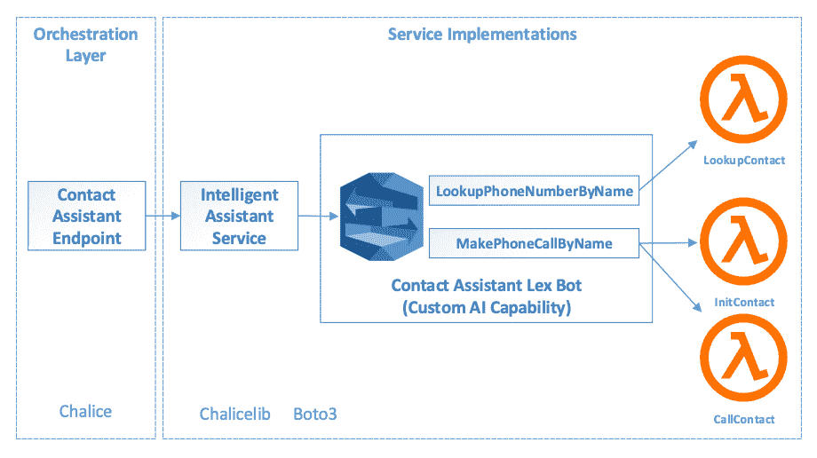

联系助手架构包括以下内容：

+   在编排层中，我们将构建一个**联系助手端点**，为访问我们联系助手的功能提供 RESTful 接口。

+   在服务实现层，我们将构建一个名为**智能助手服务**的服务，来屏蔽我们自定义 AI 能力的实现细节，包括其 Amazon Lex 实现细节。这样，当我们想用不同的聊天机器人技术重新实现联系人助手机器人时，只需要修改智能助手服务。

在前面的章节中，我们构建了自己的服务，例如识别服务和语音服务，分别连接到 AWS AI 能力，如 Rekognition 和 Polly。就像这些服务屏蔽了 AWS AI 服务的实现细节一样，智能助手服务也屏蔽了我们基于 Amazon Lex 构建的自定义 AI 能力的实现细节。

+   联系人助手机器人将能够执行两个任务，`LookupPhoneNumberByName` 和 `MakePhoneCallByName`。这个机器人利用 Amazon Lex 的底层 AI 能力来解释用户的口头命令，然后使用 AWS Lambda 函数执行任务，查找电话号码并拨打电话。

+   联系人助手将查找存储在与[第五章](https://cdp.packtpub.com/hands_on_artificial_intelligence_on_amazon_web_services/wp-admin/post.php?post=527&action=edit#post_301)《*使用 Amazon Comprehend 提取文本信息*》中相同的 DynamoDB 表中的联系人信息。在复用的精神下，我们将重新使用连接到 DynamoDB 表的联系人存储实现。更具体地说，Lambda 函数将把联系人搜索委托给联系人存储。联系人信息存储在 DynamoDB 表中的事实对联系人助手是透明的。

# 理解 Amazon Lex 开发范式

Amazon Lex 是一个用于构建智能助手或聊天机器人的开发平台。通过 Amazon Lex，我们正在构建自己的自定义智能助手能力。Lex 本身提供了许多 AI 能力，包括**自动语音识别**（**ASR**）和**自然语言理解**（**NLU**），这些能力对于构建对话界面非常有用。然而，开发人员必须遵循 Lex 的开发构造、约定和规范，才能利用这些底层的 AI 能力。

这些 Amazon Lex 对话界面是由 Lex 特定的构建模块构建的：

+   **机器人**：Lex 机器人可以通过自定义的对话界面执行一组相关任务。一个机器人将相关任务组织成一个单元，以便于开发、部署和执行。

    +   例如，为了让任务对应用程序可用，任务会被部署或发布为一个机器人，应用程序必须指定机器人名称才能访问可用的任务。

+   **意图**：意图表示用户希望执行的自动化任务。意图属于特定的 AWS 账户，而不是特定的机器人，可以被同一 AWS 账户中的不同机器人使用。这个设计决策使得意图更具可重用性。

+   **示例话语**：话语是用户可能用来触发自动化任务的自然语言输入，无论是键入还是说出。Amazon Lex 鼓励开发者提供多个话语，以使对话界面对用户更加灵活。

    +   例如，用户可能会说*今天的天气怎么样？*，或者*告诉我今天的天气？*来查询天气报告。Amazon Lex 使用先进的自然语言理解（NLU）来理解用户的意图。

    +   根据前面两个示例话语，Amazon Lex 还利用 NLU 功能处理话语的变化。即使没有提供完全相同的表达方式，Lex 也能理解*告诉我今天的天气怎么样？*。

+   **槽位**：自动化任务可能需要零个或多个槽位（参数）来完成。例如，日期和地点是获取用户感兴趣的天气报告时使用的参数。在对话界面中，Lex 会要求用户提供所有必需的槽位。

    +   例如，如果未指定位置，可以默认使用用户的家庭地址。

+   **槽位类型**：每个槽位都有一个类型。类似于编程语言中的参数类型，槽位类型限制了输入空间并简化了验证，从而使对话界面更加用户友好。特别是在口语交流中，了解槽位类型可以帮助 AI 技术更准确地判断输入的文本或语音。

    +   有许多内置的槽位类型，例如数字、城市、机场、语言和音乐家，仅举几例。开发者还可以创建特定于其应用程序的自定义槽位类型。

+   **提示和响应**：提示是 Lex 向用户提问，要求用户提供某个槽位的输入或确认已提供的输入。响应是向用户告知任务结果的消息，例如天气报告。

    +   对话界面的提示和响应设计应考虑使用场景、通信方式（文本或语音）和操作环境。设计应在不让用户感到负担的情况下获取用户确认。

+   **会话属性**：Amazon Lex 提供机制来保持上下文数据，这些数据可以在同一会话中的不同意图之间共享。

    +   例如，如果用户只请求了某个城市的天气报告，然后又提出问题*那里的交通怎么样？*，会话上下文应该能够推断出*那里*是指先前意图中提到的城市。此类上下文信息可以存储在 Lex 的会话属性中，供开发者构建更智能的机器人。

Amazon Lex 平台专注于构建对话接口；自动任务的执行则委托给 AWS Lambda。开发者可以使用两种内置的钩子类型来集成 Lambda 函数：

+   **Lambda 初始化和验证**：此钩子允许开发者编写 AWS Lambda 函数来验证用户输入。例如，Lambda 函数可以验证用户的输入，检查数据源并执行更复杂的业务逻辑。

+   **履行 Lambda 函数**：此钩子允许开发者编写 AWS Lambda 代码来执行任务。通过这个 Lambda 钩子，开发者可以利用 AWS 服务、API 端点等，编写用于检查天气、订购披萨、发送消息等任务的业务逻辑。

# 设置联系助手机器人

现在我们已经理解了 Amazon Lex 的开发范式和术语，接下来我们将通过构建一个具有对话界面和业务逻辑实现的机器人来应用它们。我们将使用 AWS 控制台构建联系助手。请按照以下步骤操作：

1.  导航至 Amazon Lex 页面并点击“创建”按钮。

1.  在“创建你的机器人”页面，选择“自定义机器人”以创建我们自己的机器人，而不是从示例机器人开始。

1.  在机器人名称字段中，输入 `ContactAssistant`。

1.  在输出语音（Output voice）中，选择 Joanna。目前，Lex 仅支持美式英语。

1.  在会话超时（Session timeout）字段中，输入 5 分钟。这是联系助手在关闭会话之前的最大空闲时间。

1.  对于 IAM 角色，保持默认设置为 AWSServiceRoleForLexBots。

1.  对 COPPA 选择“否”；这个联系助手是为一位旅行推销员设计的，而不是为儿童设计的。

1.  点击“创建”按钮。

在完成上述步骤后，“创建你的机器人”页面应具有以下设置：

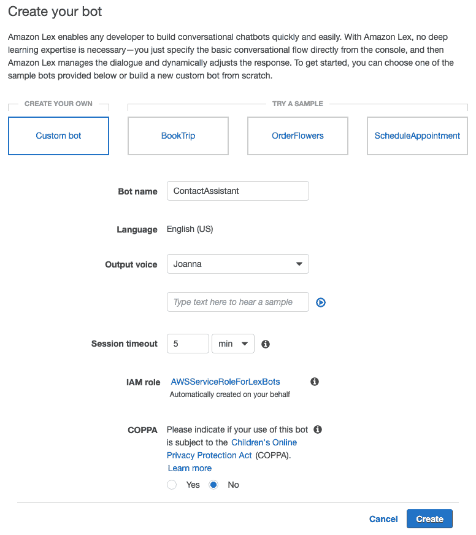

1.  一旦联系助手被创建，你将进入 Lex 的开发控制台，界面类似于下图所示：

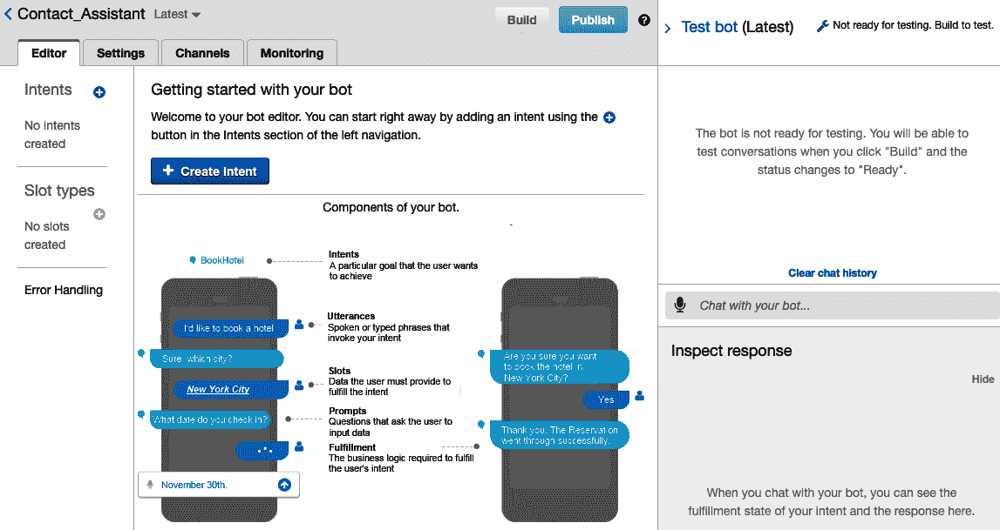

让我们先熟悉一下 Lex 开发控制台：

1.  机器人的名称可以在左上角找到，命名为 Contact_Assistant。

1.  在右上角有一对禁用的“构建”和“发布”按钮。

1.  在机器人名称和按钮下方是编辑器（Editor）、设置（Settings）、渠道（Channels）和监控（Monitoring）屏幕的标签。我们将在编辑器标签中进行大部分的机器人开发工作。

1.  选中编辑器标签后，我们看到联系助手中尚未添加任何意图（Intent）或槽类型（Slot types）。

1.  在屏幕的右上角，有一个可展开的“测试机器人”侧边栏（如图所示），展开后会显示一个聊天界面。该聊天界面用于向正在开发的机器人发出语音命令。目前，该聊天界面是禁用的，机器人需要先构建，并且至少创建一个意图（Intent）。

1.  最后，点击“创建意图”按钮来构建我们的第一个意图。

# LookupPhoneNumberByName 意图

我们的第一个意图允许用户通过说出联系人的名字和姓氏来查找该联系人的电话号码。这个意图本质上是一个构建在联系人存储之上的搜索功能，但它采用了对话式界面。

我们建议将每个意图设计为专注于一个狭窄的使用场景，并通过构建多个意图来扩展机器人的使用场景。

`LookupPhoneNumberByName` 意图有非常专注的输入和输出，但我们可以构建许多相关的意图，例如 `LookupAddressByName` 和 `LookupContactNamesByState`。即使我们可以将 `LookupPhoneNumberByName` 意图视为对数据源的搜索功能，它仍然需要不同的设计思维。

让我们在比较这个意图和更传统的网页应用搜索功能时，突出一些设计上的差异：

+   在网页界面中，我们会提供多个搜索参数，例如姓名、组织和地点。在对话式界面中，我们希望每个意图的搜索参数或输入尽量少。尤其是在语音聊天机器人中，提示和确认所有输入可能会显得繁琐。

+   在网页界面中，我们会返回关于联系人的许多信息并显示在屏幕上。在对话式界面中，我们需要考虑交互方式。如果这是一个文本聊天机器人，我们或许可以展示多条信息。但如果这是一个语音聊天机器人，那么向用户朗读大量信息可能会造成认知负担。

# `LookupPhoneNumberByName` 的示例话语和槽位

在设计新的意图时，所有相关方——不仅仅是开发人员——必须仔细思考用户与机器人之间的对话流程。我们先从示例话语开始。

智能助手很可能会替代现有的用户沟通渠道，例如打电话给客户代表、发送产品问题咨询邮件以及与技术支持人员进行文本聊天。通常做法是使用来自这些现有渠道的用户对话录音来设计智能助手的对话流程。这些录音能最准确地反映用户与产品的互动，它们是设计话语和提示的良好起点。

示例话语是调用意图以执行自动任务的短语。以下是我们 `LookupPhoneNumberByName` 意图的一些示例话语：

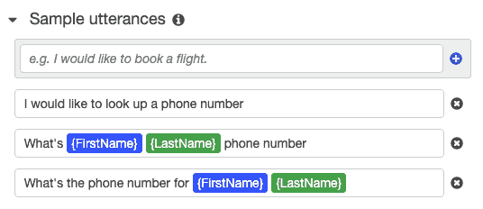

如我们在前面的截图中所见，两个示例话语自然地在对话流程中包含了槽位或输入参数 {FirstName} 和 {LastName}。这样，用户可以在触发任务时提供完成任务所需的部分或全部输入。

对于`LookupPhoneNumberByName`，我们需要同时提供{FirstName}和{LastName}来查找电话号码，因为这两个都是必填项。我们来看一下以下的插槽截图：

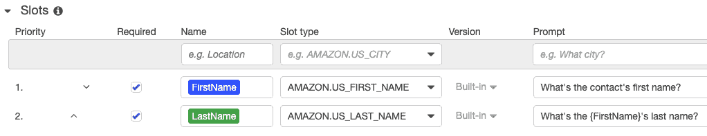

如前面的截图所示，对于插槽类型，有内置的 AMAZON.US_FIRST_NAME 和 AMAZON.US_LAST_NAME 类型。如前所述，为输入指定最相关和最具体的类型，可以大大简化自然语言理解和底层 AI 技术的值验证。

如果用户没有提供插槽的输入怎么办？例如，如果用户说了第一个样本话语，*我想查找一个电话号码*。每个插槽如果没有在调用话语中提供输入值，都必须有一个或多个提示来请求用户输入。对于`{FirstName}`和`{LastName}`，我们分别使用了`What's the contact's first name?`和`What's the {FirstName}'s last name?`。注意，`{LastName}`的提示中包含了`{FirstName}`的值。这可以让对话流程更加自然和人性化。

若要为插槽添加多个提示，请点击齿轮图标编辑插槽的设置。在这里，您可以添加其他提示，设置最大重试次数以获取此输入，并设置相应的表达式，如下所示：

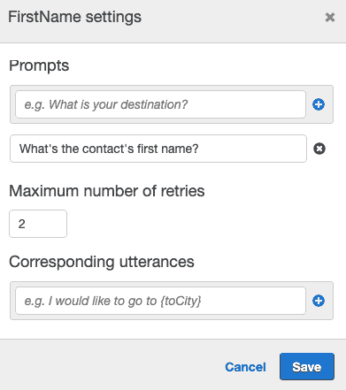

机器人将从这些提示中选择一个来请求用户输入插槽值。机器人会尝试这些提示最多两次，然后放弃。

# LookupPhoneNumberByName 的确认提示和响应

为了完成对话流程设计，让我们继续设计确认提示和响应。虽然这两者是可选的，但它们能极大地改善智能助手的行为和用户体验。

以下是一个确认提示的截图。确认提示是一个通知用户即将执行的操作的机会。此时，所有必填插槽和可能的可选插槽的值都已获取：

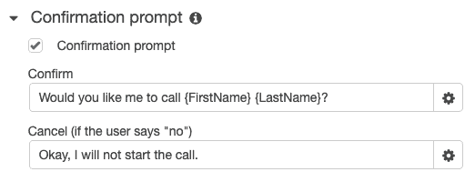

我们可以在确认消息中使用`{FirstName}`和`{LastName}`。在确认消息中回显`{FirstName}`和`{LastName}`的值是一个很好的设计，它能够确认机器人正确理解了用户输入。自然语言对话有时会产生歧义。让我们来看一个示例对话：

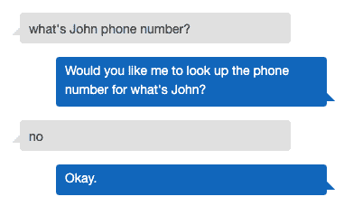

你发现问题了吗？我们其中一个示例话语是 What's {FirstName} {LastName} phone number。然而，用户在调用意图时没有提供`{LastName}`。我们的机器人将*what's*解释为`{FirstName}`，将`John`解释为`{LastName}`。通过在确认提示中回显输入值，用户可以注意到并纠正输入错误，然后再执行操作。

我们现在跳过任务的 Fulfillment 部分，直接进入响应部分。在以下截图中，`LookupPhoneNumberByName` 意图通过显示或朗读联系人的电话号码来完成任务：

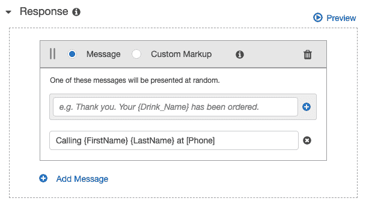`[Phone]` 是一个会话属性，用于保存联系人的电话号码。它将在 Fulfillment lambda 函数中设置。我们将在本章后续部分介绍其实现方式。

该意图用于查询信息。提供响应中的信息将使用户感到自然。也有一些意图会执行任务，而无需向用户提供信息。在这种情况下，仍然建议向用户反馈任务的结果。

现在，我们已经完成了第一个意图的对话接口。接下来，我们将实现 AWS Lambda 函数，来执行智能助手所要求的任务。

# 使用 AWS Lambda 执行 LookupPhoneNumberByName 的 Fulfillment

要执行与智能助手相关的任何完成操作，开发者需要调用 AWS Lambda 函数。*Fulfillment* 部分提供了一个钩子，用于现有的 lambda 函数。让我们实现一个名为 **LookupPhoneNumberByName** 的 lambda 函数，通过联系人的名字和姓氏来查找其电话号码。

与之前使用 AWS Chalice 开发和部署 lambda 代码以及 AWS 权限的项目不同，我们将使用 AWS Lambda 控制台页面来创建 `LookupPhoneNumberByName` 函数。以下是步骤：

1.  从 AWS 控制台导航到 AWS Lambda 服务，然后点击“创建函数”按钮。

1.  选择“从头开始创建”。我们将不使用任何蓝图或示例应用来实现 lambda 函数。

1.  将函数命名为 `LookupPhoneNumberByName`。

1.  选择 Python 3.7 运行时，以匹配我们其他动手项目的语言版本。

1.  选择“创建具有基本 Lambda 权限的新角色”来创建一个角色。稍后我们需要添加更多策略来连接其他 AWS 服务。

1.  点击“创建函数”按钮。

创建函数页面上的设置应该类似于以下截图：

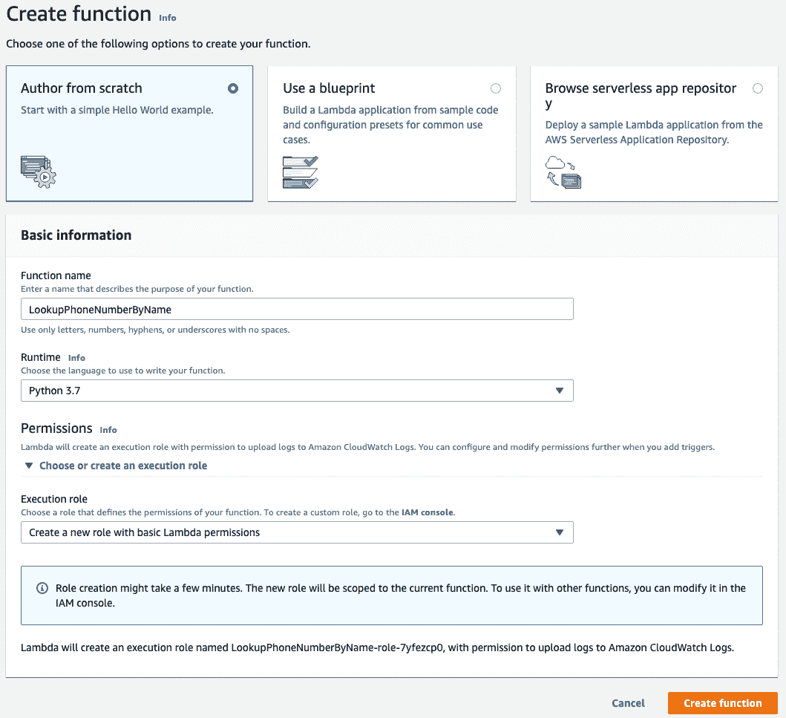

创建 lambda 函数及其执行角色后，您将看到一个类似以下的开发控制台：

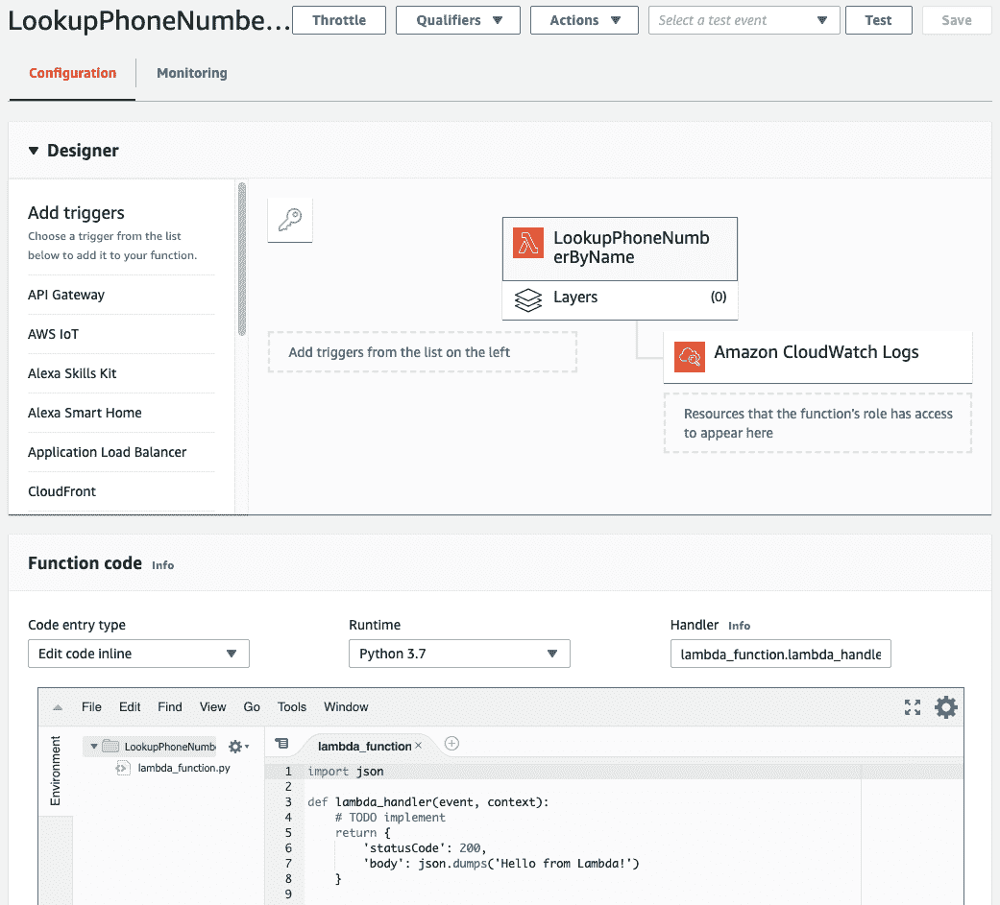

上述截图演示了以下内容：

+   在设计器部分，我们可以添加触发器来调用这个 lambda 函数。对于 Lex 机器人，我们无需选择触发器。

+   我们还看到，`LookupPhoneNumberByName` 函数有权限访问 CloudWatch 日志。该函数执行过程中产生的任何输出或错误消息将写入 CloudWatch，我们可以通过 CloudWatch 控制台页面查看这些日志。在开发和调试该函数时，这将非常有用。

+   在函数代码部分，我们可以选择“编辑代码内联”，修改函数运行时并更改 Handler 函数名称。Handler 函数指定了构成 Lambda 函数入口点的 Python 文件和函数名。

+   在三个 Lambda 配置字段下方，我们有内联代码编辑器。在这里，我们可以创建额外的源文件并编辑每个源文件的代码。

我们的 Lambda 函数需要与存储来自联系人管理应用的联系人信息的相同 DynamoDB 进行交互。我们可以利用现有的联系人存储，然后添加一个新函数来查询联系人信息，步骤如下：

1.  在内联编辑器的左侧面板中右键点击，然后选择“新建文件”。

1.  将文件命名为 `contact_store.py`。

1.  将 `contact_store.py` 的内容替换为 [第五章](https://cdp.packtpub.com/hands_on_artificial_intelligence_on_amazon_web_services/wp-admin/post.php?post=527&action=edit#post_301) 中的联系人存储实现，*使用 Amazon Comprehend 从文本中提取信息*。

1.  在现有函数实现后添加 `get_contact_by_name()`：

```py
import boto3

class ContactStore:
    def __init__(self, store_location):
        self.table = boto3.resource('dynamodb').Table(store_location)

    ...

    def get_contact_by_name(self, name):
        response = self.table.get_item(
            Key = {'name': name}
        )

        if 'Item' in response:
            contact_info = response['Item']
        else:
            contact_info = {}

        return contact_info

```

上述代码包含以下元素：

+   `get_contact_by_name()` 方法通过唯一标识符（即姓名）检索单个联系人。在该方法中，我们调用 DynamoDB 的 `get_item()` 函数。`get_item()` 的响应包含一个字典。如果项键存在，则我们会得到一个包含联系人信息的返回值。

+   在这里，我们通过键从 DynamoDB 表中获取一项。键是联系人姓名、名和姓，用空格分隔。此代码将在 Python 3.7 的 Lambda 运行时环境中执行。在该环境中，`boto3` 包已经安装。

# 用于 LookupPhoneNumberByName 的 DynamoDB IAM 角色

由于这段代码需要连接到 DynamoDB，我们需要为我们的 Lambda 函数的执行角色添加一个策略：

1.  从 AWS 控制台导航到 IAM 页面。

1.  点击左侧面板中的“角色”。

1.  在角色列表中，找到并点击用于我们 Lambda 函数的 LookupPhoneNumberByName-role-<unique id> 角色。

1.  点击“附加策略”按钮。

1.  找到并选择 AmazonDynamoDBFullAccess 策略，然后点击“附加策略”按钮。

现在，让我们看一下以下截图：

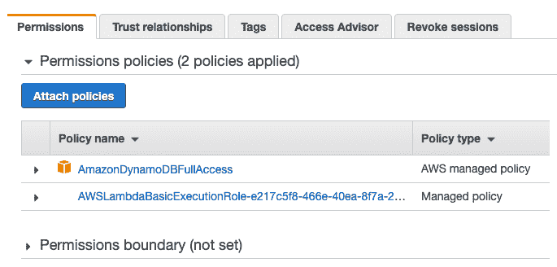

现在，我们的 `LookupPhoneNumberByName` Lambda 函数可以访问 DynamoDB。`AmazonDynamoDBFullAccess` 策略适用于我们的实操项目，但对于真实的生产应用，您应当调整该策略，以限制授予的权限数量。

# 用于 LookupPhoneNumberByName 的履行 Lambda 函数

在 Lambda 编辑器窗口中，打开现有的 `lambda_function.py` 文件，并将其内容替换为以下实现：

```py
import contact_store

store_location = 'Contacts'
contact_store = contact_store.ContactStore(store_location)

def lex_lambda_handler(event, context):
    intent_name = event['currentIntent']['name']
    parameters = event['currentIntent']['slots']
    attributes = event['sessionAttributes'] if event['sessionAttributes'] is not None else {}

    response = lookup_phone(intent_name, parameters, attributes)

    return response

def lookup_phone(intent_name, parameters, attributes):
    first_name = parameters['FirstName']
    last_name = parameters['LastName']

    # get phone number from dynamodb
    name = (first_name + ' ' + last_name).title()
    contact_info = contact_store.get_contact_by_name(name)

    if 'phone' in contact_info:
        attributes['Phone'] = contact_info['phone']
        attributes['FirstName'] = first_name
        attributes['LastName'] = last_name
        response = intent_success(intent_name, parameters, attributes)
    else:
        response = intent_failure(intent_name, parameters, attributes, 'Could not find contact information.')

    return response

# Amazon lex helper functions
...
```

在上述代码中，发生了以下情况：

+   我们首先用 DynamoDB 表 contacts 初始化联系人存储。

+   在 `lambda_handler()` 函数中，我们从传入的事件对象中提取意图名称、槽位和属性。当履行钩子被触发时，事件对象会传入我们的亚马逊 Lex 机器人。所有槽位输入值以及会话属性都会包含在此事件对象中。

+   `lambda_handler()` 然后调用 `lookup_phone()` 函数，该函数使用联系人存储来检索联系信息。

+   在 `lookup_phone()` 函数中，我们根据 `FirstName` 和 `LastName` 槽位值构建项目键。项目键必须是由空格分隔的 `FirstName` 和 `LastName`，并且需要正确的大写。

    +   例如，名字 `john` 和姓氏 `smith` 会生成项目键 `John Smith`；名字的每个部分的首字母都大写。

    +   我们使用 `title()` 函数确保正确的大写形式，无论用户如何输入名字。

如果我们能够通过这些名字查找到联系人，我们将把联系人的电话号码、名字和姓氏保存在会话属性中。这就是电话号码如何传回并在该意图的响应中显示或朗读的方式。稍后我们将解释为什么名字和姓氏会保存在会话属性中。

如果我们成功完成查找，我们会响应 `intent_success()`，否则我们会响应 `intent_failure()` 并附带解释信息。这些是封装了亚马逊 Lex 特定响应格式的助手函数。

# 亚马逊 Lex 助手函数

亚马逊 Lex 助手函数将响应格式化为 Lex 所期望的格式。这里有四个助手函数：

+   `intent_success()` 表示意图已经成功实现，并且任何会话属性都会作为 `sessionAttributes` 返回给 Lex。

+   `intent_failure()` 表示意图未能成功实现。此响应还包括一条解释信息。

+   `intent_elicitation()` 请求 Lex 机器人引导获取指定参数名称的值。此引导可能是由于缺少槽位值或槽位值无效。这一助手函数在我们创建自定义 `Lambda 初始化和验证` 逻辑时非常有用。

+   `intent_delegation()` 表示 Lambda 函数已经完成了它的任务，并指示 Lex 根据机器人配置选择下一步行动。

我们只使用了前两个助手函数来实现 `LookupPhoneNumberByName` 意图。以下是代码实现：

```py
# Amazon lex helper functions
def intent_success(intent_name, parameters, attributes):
    return {
        'sessionAttributes': attributes,
        'dialogAction': {
            'type': 'Close',
            'fulfillmentState': 'Fulfilled'
        }
    }

def intent_failure(intent_name, parameters, attributes, message):
    return {
        'dialogAction': {
            'type': 'Close',
            'fulfillmentState': 'Failed',
            'message': {
                'contentType': 'PlainText',
                'content': message
            }
        }
    }

def intent_delegation(intent_name, parameters, attributes):
    return {
        'sessionAttributes': attributes,
        'dialogAction': {
            'type': 'Delegate',
            'slots': parameters,

        }
    }

def intent_elicitation(intent_name, parameters, attributes, parameter_name):
    return {
        'sessionAttributes': attributes,
        'dialogAction': {
            'type': 'ElicitSlot',
            'intentName': intent_name,
            'slots': parameters,
            'slotToElicit': parameter_name
        }
    }
```

即使 `lambda_function.py` 文件相对较短，我们仍然应用了一些清晰代码的实践。我们将所有与 AWS Lambda 和亚马逊 Lex 相关的实现细节都组织到了 `lambda_handler()` 函数和亚马逊 Lex 助手函数中。

例如，如何从 Lambda 事件对象中获取槽位和响应格式以供 Amazon Lex 使用？这样，`lookup_phone()` 函数就不受这些平台特定细节的影响，因此更可能在其他平台上重用。`lookup_phone()` 函数只需要 `intent_name` 为字符串类型，参数和属性为字典类型。

通过点击 Lambda 开发控制台右上角的 Save 按钮保存 Lambda 函数实现。

# LookupPhoneNumberByName 的意图 Fulfillment

现在，让我们将此 Lambda 函数添加到 Fulfillment hook 中：

1.  转到 Amazon Lex 开发控制台，在 Fulfillment 部分，从 Lambda 函数列表中选择 LookupPhoneNumberByName，如下图所示：

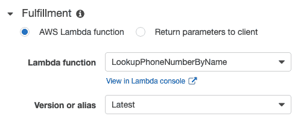

1.  如下图所示，Amazon Lex 会请求调用此 Lambda 函数的权限。点击 OK 以授予权限：

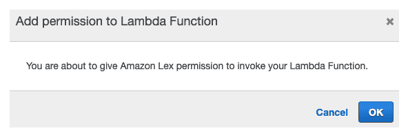

1.  在 Lex 开发控制台中，点击页面底部的 Save Intent 按钮，然后点击页面右上角的 Build 按钮。构建我们的第一个 Lex 机器人需要几秒钟时间。

# 测试 LookupPhoneNumberByName 的对话

现在，我们准备好构建并测试我们的第一个意图。在页面右侧的 Test bot 面板中，发出一些示例话语的变化，并与联系人助手进行对话。以下是一个示例对话：

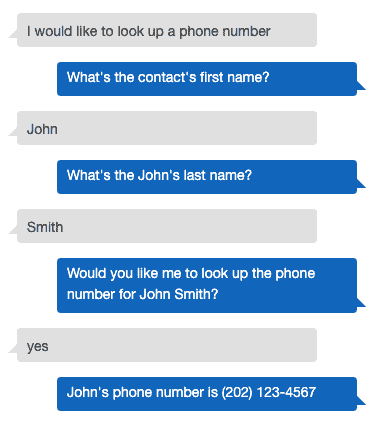

在前面的对话中，发生了以下情况：

+   话语中没有包含槽位，我们的联系人助手提示输入名字和姓氏

+   助手在继续执行 Fulfillment 之前确认了对 John Smith 的查询

+   响应中包含了联系人的名字和电话号码

现在，想想这个对话是如何进行的，无论是文本聊天还是语音对话。

这是另一个示例对话：

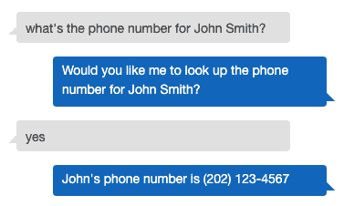

在前面的对话中，发生了以下情况：

+   话语中包含了两个必需的槽位

+   这次，我们的联系人助手只需要在继续执行 Fulfillment 和响应之前确认查询

+   用户也可以通过回答**no**来取消 Fulfillment

恭喜！你刚刚完成了第一个具有对话界面和 AWS Lambda Fulfillment 实现的智能助手。

测试机器人面板的聊天界面也支持语音输入。你可以使用麦克风图标通过语音发出话语和响应。


在测试机器人聊天界面中，Lex 的响应将始终以文本形式显示。

# MakePhoneCallByName 意图

接下来，我们将为我们的联系人助手创建第二个意图，命名为**MakePhoneCallByName**。从名字就可以看出，这个意图执行的任务是拨打电话给联系人。然而，在这个项目中我们不会实现电话拨打功能。

实现第二个意图的目标是演示智能助手的多个意图如何互相交互和协作。我们希望设计`MakePhoneCallByName`的对话界面，使其能够独立运行，同时也能够与`LookupPhoneNumberByName`意图协同工作。

为了使这种意图协作更具实用性，可以设想用户刚刚查找了某个联系人的电话号码，然后决定拨打该联系人的电话。第二个意图是否应该从头开始，要求提供姓氏和名字的插槽？还是说，考虑到之前的对话，知道用户想打电话给刚刚查找过的联系人，会更流畅自然呢？当然是后者。在`LookupPhoneNumberByName`成功执行后，用户如果说`Call him`或`Call her`，`MakePhoneCallByName`应该能够根据先前的对话上下文，知道`him`或`her`指的是谁。这时，会话属性就可以帮助保持上下文。

# 为`MakePhoneCallByName`创建的示例发声和 Lambda 初始化/验证

我们将通过点击左侧面板“Intents”旁边的蓝色加号按钮，从 Lex 开发控制台添加一个新的意图，具体步骤如以下截图所示：

1.  选择创建意图，命名为`MakePhoneCallByName`，然后点击添加。

1.  让我们为此意图创建一些示例发声。第一个发声**Call** {FirstName} {LastName}为两个必需插槽提供了值。对于其他发声，意图应该尽量从对话上下文中获取插槽值：

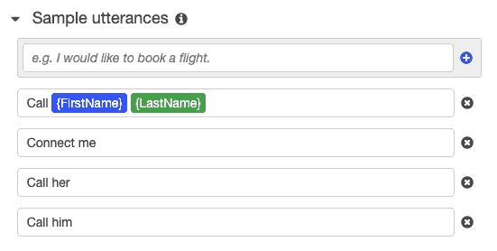

为了实现这一点，我们将使用来自 Amazon Lex 的第二种类型的 AWS Lambda 钩子——Lambda 初始化和验证。以下步骤将创建该钩子：

1.  在 Lambda 初始化和验证部分，勾选初始化和验证代码钩子的复选框。

1.  从 AWS 控制台进入 AWS Lambda 页面，创建一个名为`InitContact`的 Lambda 函数，选择 Python 3.7 环境。

1.  创建一个新的默认 Lambda 执行角色。我们不需要为此 Lambda 函数添加 AmazonDynamoDBFullAccess 策略。

1.  在内联函数代码编辑器中，用以下实现替换`lambda_function.py`文件的内容：

```py
def lex_lambda_handler(event, context):
    intent_name = event['currentIntent']['name']
    parameters = event['currentIntent']['slots']
    attributes = event['sessionAttributes'] if event['sessionAttributes'] is not None else {}

    response = init_contact(intent_name, parameters, attributes)

    return response

def init_contact(intent_name, parameters, attributes):
    first_name = parameters.get('FirstName')
    last_name = parameters.get('LastName')

    prev_first_name = attributes.get('FirstName')
    prev_last_name = attributes.get('LastName')

    if first_name is None and prev_first_name is not None:
        parameters['FirstName'] = prev_first_name

    if last_name is None and prev_last_name is not None:
        parameters['LastName'] = prev_last_name

    if parameters['FirstName'] is not None and parameters['LastName'] is not None:
        response = intent_delegation(intent_name, parameters, attributes)
    elif parameters['FirstName'] is None:
        response = intent_elicitation(intent_name, parameters, attributes, 'FirstName')
    elif parameters['LastName'] is None:
        response = intent_elicitation(intent_name, parameters, attributes, 'LastName')

    return response

# lex response helper functions
...
```

在上述代码中，发生了以下操作：

+   在`init_contact()`函数中，我们检查来自发声的插槽是否缺少`FirstName`和`LastName`。如果缺少，我们接着检查`FirstName`和`LastName`是否存在于会话属性中。

    +   你还记得我们在`LookupPhoneNumberByName`意图的 Fulfillment 实现中将`FirstName`和`LastName`保存到会话属性吗？我们在这里提取了那些保存的值。

+   如果`FirstName`和`LastName`都已设置，那么我们将返回一个委托响应给 Lex。

    +   委托响应告诉 Lex，初始化和验证已完成，机器人应根据其配置继续执行，包括 Fulfillment。

+   如果`FirstName`或`LastName`的值仍然缺失，那么我们将以诱导响应的方式进行回应。

    +   诱导响应将触发配置给机器人用于缺失插槽的提示。

保存 lambda 函数，然后返回到 Amazon Lex 开发控制台：

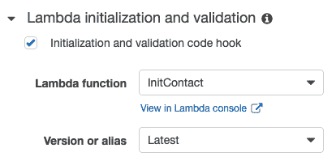

选择 InitContact 作为 Lambda 初始化和验证函数。

# MakePhoneCallByName 的插槽和确认提示

`MakePhoneCallByName`意图的插槽配置可以与`LookupPhoneNumberByName`的配置完全相同。请参见以下截图中的详细信息：

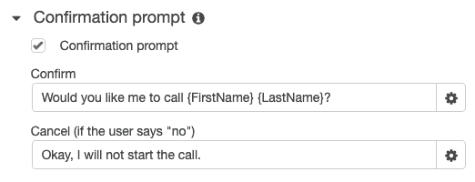

两个插槽都是必需的，并且被设置为内置的`AMAZON.US_FIRST_NAME`和`AMAZON.US_LAST_NAME`类型。

确认提示可以根据拨打电话的需求进行定制，如下图所示：

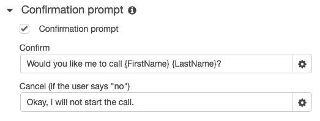

确认和取消消息都定制为`MakePhoneCallByName`意图。

# MakePhoneCallByName 的 Fulfillment 和响应

我们可以实现一个新的 lambda 函数来完成联系人查找和拨打电话的功能。但由于在这个项目中我们并不会真正拨打电话，所以 Fulfillment lambda 函数的业务逻辑与我们已经实现的联系人查找功能相同。

实际上，对于这个项目，Fulfillment 可以通过 LookupPhoneNumberByName lambda 函数来处理，如下图所示：

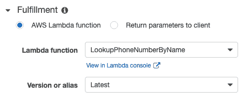

最后，响应配置也可以定制为进行电话拨打，如下所示：

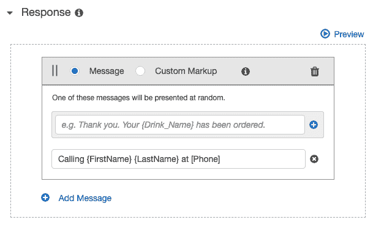

现在，点击 Lex 开发控制台底部的保存意图按钮，然后点击开发控制台右上角的构建按钮。

# MakePhoneCallByName 的测试对话

在页面右侧的测试机器人面板中，发布几个示例话语的不同版本，并与联系人助手进行对话。以下是一个示例对话：

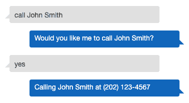

上述对话展示了`MakePhoneCallByName`意图可以独立运行，而无需先执行`LookupPhoneNumberByName`意图。

这是另一个示例对话：

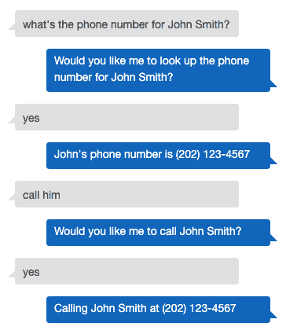

上述对话展示了上下文的强大作用：

+   用户首先通过`LookupPhoneNumberByName`意图请求了 John Smith 的电话号码。

+   然后，用户请求`call him`。

+   此时，我们的`InitContact` lambda 函数从会话属性中获取了`FirstName`和`LastName`，并确认 John Smith 是否是要联系的人。

    +   确认提示在这里非常重要，因为联系人助手正在推断联系人。我们不希望自动给错误的联系人打电话，最好先与用户确认再采取行动。

在发出下一个话语之前，点击“清除聊天历史记录”。这将清除会话及其存储的属性。继续以下示例对话：

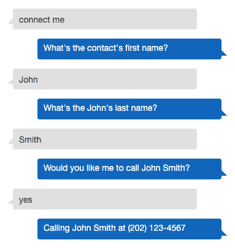

在这次对话中，发生了以下情况：

+   用户开始时没有提供任何槽位。然而，这次会话中并没有保存任何之前的对话上下文。

+   `InitContact` lambda 函数无法获取名字和姓氏，因此它通过意图激发请求进行响应。

+   测试我们的智能助手以处理所有可能的意图和话语组合非常重要。随着更多意图共享会话属性，这种质量保证变得更加困难。

恭喜！我们的联系人助手现在通过上下文感知变得更智能了。

# 部署联系人助手机器人

我们现在可以将联系人助手发布为自定义智能助手能力。

点击 Lex 开发控制台右上角的“发布”按钮，并将别名设置为“生产”：

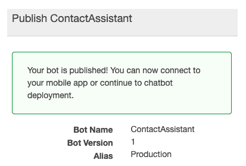

上述截图显示了联系人助手已经发布。一旦联系人助手发布，应用程序可以通过各种集成方式开始使用它，包括 boto3 SDK。

# 将联系人助手集成到应用程序中

接下来，我们将创建层来将联系人助手能力集成到应用程序中。如本章开始时所述，我们不会实现任何应用程序，我们只会实现服务和 RESTful 端点层。

与以前的动手项目一样，我们将使用 Python、Pipenv、Chalice 和 boto3 作为技术栈的一部分。让我们先创建项目结构。

1.  在终端中，我们将创建`root`项目目录并进入，使用以下命令：

```py
$ mkdir ContactAssistant
$ cd ContactAssistant
```

1.  我们将在项目的`root`目录下使用`Pipenv`创建一个 Python 3 虚拟环境。我们的 Python 项目部分需要两个包，`boto3` 和 `chalice`。我们可以通过以下命令安装它们：

```py
$ pipenv --three
$ pipenv install boto3
$ pipenv install chalice
```

1.  记住，通过`pipenv`安装的 Python 包只有在我们激活虚拟环境后才可用。一种方法是使用以下命令：

```py
$ pipenv shell
```

1.  接下来，在虚拟环境中，我们将创建一个名为 `Capabilities` 的 AWS Chalice 项目的编排层，使用以下命令：

```py
$ chalice new-project Capabilities
```

1.  要创建 `chalicelib` Python 包，发出以下命令：

```py
cd Capabilities
mkdir chalicelib
touch chalicelib/__init__.py
cd ..
```

初始项目结构应如下所示：

```py
Project Structure
------------
├── ContactAssistant/
 ├── Capabilities/
 ├── .chalice/
 ├── config.json
 ├── chalicelib/
 ├── __init__.py
 ├── app.py
 ├── requirements.txt
 ├── Pipfile
 ├── Pipfile.lock
```

项目结构与前几章中创建的结构略有不同。该项目结构包含编排层和服务实现层，但不包括 Web 用户界面。

# 智能助手服务实现

在当前实现中，联系人助手由 Lex 机器人支持，但良好的架构设计应该具有灵活性，能够轻松更换实现。该服务实现旨在将 Lex 实现的细节与客户端应用程序隔离开来。

在 `chalicelib` 中创建一个名为 `intelligent_assistant_service.py` 的 Python 文件，如下所示：

```py
import boto3

class IntelligentAssistantService:
    def __init__(self, assistant_name):
        self.client = boto3.client('lex-runtime')
        self.assistant_name = assistant_name

    def send_user_text(self, user_id, input_text):
        response = self.client.post_text(
            botName = self.assistant_name,
            botAlias = 'Production',
            userId = user_id,
            inputText = input_text
        )

 return response['message']
```

在前面的代码中，发生了以下操作：

+   `IntelligentAssistantService` 是一个通用实现，可以配置为与不同的智能助手一起使用，而不仅仅是联系人助手。

+   `__init__()` 构造函数接收助手名称，以便在创建时为特定的智能助手配置自身。构造函数为 `lex-runtime` 创建一个 `boto3` 客户端，用于与已发布的 Lex 机器人进行通信。

+   `IntelligentAssistantService` 实现了 `send_user_text()` 方法，用于向助手发送文本聊天消息。此方法接收来自应用程序的 `user_id` 和 `input_text`，并使用 `lex-runtime` 的 `post_text()` 函数发送输入文本。

    +   `user_id` 是由客户端应用程序创建的 ID。一个 Lex 机器人可以与多个不同的用户同时进行多个对话。该 `user_id` 标识一个用户；换句话说，它标识一个聊天会话。

还有一个来自 `lex-runtime` 的 `post_content()` 函数，用于发送文本和语音输入。除了 `botName`、`botAlias` 和 `userId` 外，`post_content()` 函数还需要设置 `contentType` 和 `inputStream` 参数。`contentType` 可以是音频或文本，支持几种音频格式。`inputStream` 包含音频或文本内容的字节流。

如果应用程序希望从 Lex 机器人接收音频响应，则应将 `accept` 参数设置为支持的音频输出格式之一。音频输入和输出格式是 Lex 的实现细节。任何音频输入和输出的格式转换应在此服务实现中执行，以隐藏这些细节给客户端应用程序。

# 联系人助手 RESTful 端点

让我们看看接下来的步骤：

1.  现在，让我们在 `app.py` 中快速构建一个 RESTful 端点来连接联系人助手。通过这种方式，我们可以使用 `curl` 命令测试我们的 `IntelligentAssistantService`：

```py
from chalice import Chalice
from chalicelib import intelligent_assistant_service

import json

#####
# chalice app configuration
#####
app = Chalice(app_name='Capabilities')
app.debug = True

#####
# services initialization
#####
assistant_name = 'ContactAssistant'
assistant_service = intelligent_assistant_service.IntelligentAssistantService(assistant_name)

#####
# RESTful endpoints
#####
@app.route('/contact-assistant/user-id/{user_id}/send-text', methods = ['POST'], cors = True)
def send_user_text(user_id):
    request_data = json.loads(app.current_request.raw_body)

    message = assistant_service.send_user_text(user_id, request_data['text'])

    return message
```

RESTful 端点的实现简短且简单：

+   初始化代码将我们的通用`IntelligentAssistantService`实现绑定到联系人助手

+   RESTful 端点本身通过 URL 接收`user_id`，并通过请求体中的 JSON 格式接收输入文本

1.  在终端中使用以下命令启动`chalice local`环境：

```py
$ chalice local
Restarting local dev server.
Found credentials in shared credentials file: ~/.aws/credentials
Serving on http://127.0.0.1:8000
```

1.  现在，我们可以使用`curl`命令与联系人助手进行对话：

```py
$ curl --header "Content-Type: application/json" --request POST --data '{"text": "Call John Smith"}' http://127.0.0.1:8000/contact-assistant/user-id/me/send-text
> Would you like me to call John Smith?

$ curl --header "Content-Type: application/json" --request POST --data '{"text": "Yes"}' http://127.0.0.1:8000/contact-assistant/user-id/me/send-text
> Calling John Smith at (202) 123-4567
```

在前述对话中，发生了以下情况：

+   第一个`curl`命令发出了意图`Call John Smith`，其中包括联系人名字和姓氏所需的两个槽位。

+   响应是来自联系人助手的确认，*您希望我拨打 John Smith 的电话吗？*

+   第二个`curl`命令通过回复*是*来继续对话。

+   然后，联系人助手回应，*正在拨打 John Smith 的电话，电话号码是(202) 123-4567*。

将利用联系人助手功能的应用程序将提供适当的用户界面，以最好地促进对话，例如，为旅行推销员设计的移动应用。该应用程序将通过 RESTful 端点传递用户与联系人助手之间的口头交流。

# 总结

在这一章中，我们构建了联系人助手，一个允许用户通过语音或文本对话界面搜索联系人信息的聊天机器人。我们使用 Amazon Lex 构建了联系人助手的对话界面。我们学习了 Amazon Lex 的开发范式，以构建定制的 AI 能力，涉及的概念包括意图、语句、提示和确认。联系人助手支持两个意图，`LookupPhoneNumberByName`和`MakePhoneCallByName`。这些意图的任务履行通过 AWS Lambda 实现。我们还通过使用 Amazon Lex 的会话属性设计了这两个意图，使其具有上下文感知能力；上下文感知减少了用户的认知负担，使得聊天机器人更加智能。

Amazon Lex 是我们在本书中介绍的最后一个 AWS AI 服务。在本书的下一部分，我们将介绍 AWS ML 服务，使用机器学习训练客户 AI 能力。

# 进一步阅读

有关使用 Amazon Lex 构建语音聊天机器人的更多信息，可以参考以下链接：

[`restechtoday.com/smart-speaker-industry/`](https://restechtoday.com/smart-speaker-industry/)

[`www.lifewire.com/amazon-alexa-voice-assistant-4152107`](https://www.lifewire.com/amazon-alexa-voice-assistant-4152107)

[`www.nngroup.com/articles/intelligent-assistants-poor-usability-high-adoption/`](https://www.nngroup.com/articles/intelligent-assistants-poor-usability-high-adoption/)
