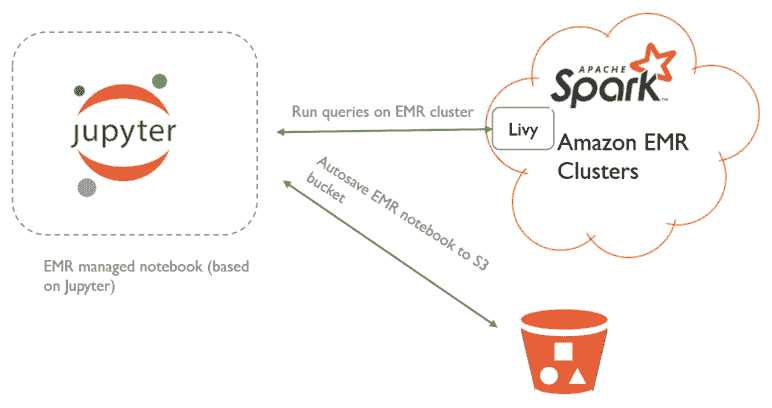
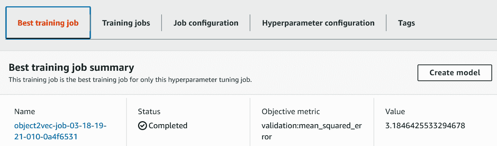

# 第七章：使用 Amazon SageMaker

在过去几章中，你已经了解了可用的**机器学习**（**ML**）API，它们解决了商业挑战。本章中，我们将深入探讨 AWS SageMaker——当机器学习 API 无法完全满足你的需求时，SageMaker 用于无缝地构建、训练和部署模型。SageMaker 通过抽象化计算和存储资源的复杂性，提升了数据科学家和机器学习工程师的生产力。

本章将涵盖的内容：

+   通过 Spark EMR 处理大数据

+   在 Amazon SageMaker 中进行训练

+   部署训练好的模型并运行推断

+   运行超参数优化

+   理解 SageMaker 实验服务

+   自带模型 – SageMaker、MXNet 和 Gluon

+   自带容器 – R 模型

# 技术要求

在接下来的章节中，我们将使用名为`goodbooks-10k`的书籍评分数据集来说明之前提到的所有主题。该数据集包含来自 53,424 个用户对 10,000 本书籍的 600 万条评分。有关 goodbooks-10k 数据集的更多详情，请访问[`www.kaggle.com/zygmunt/goodbooks-10k#books.csv`](https://www.kaggle.com/zygmunt/goodbooks-10k#books.csv)。

在与本章相关的[文件夹](https://github.com/PacktPublishing/Hands-On-Artificial-Intelligence-on-Amazon-Web-Services)中，你将找到两个 CSV 文件：

+   `ratings.csv`：包含书籍评分、用户 ID、书籍 ID 和评分信息

+   `books.csv`：包含书籍属性，包括标题

现在是时候整理大数据以创建建模数据集了。

# 通过 Spark EMR 进行大数据预处理

在 SageMaker 中执行模型的设计模式是读取存储在 S3 中的数据。大多数情况下，这些数据可能并不容易直接使用。如果所需数据集较大，在 Jupyter 笔记本中整理数据可能不切实际。在这种情况下，可以使用 Spark EMR 集群对大数据进行操作。

在 Jupyter 笔记本中清理大数据集时会出现内存溢出错误。我们的解决方案是使用 AWS EMR（弹性 MapReduce）集群进行分布式数据处理。Hadoop 将作为底层分布式文件系统，而 Spark 将作为分布式计算框架使用。

现在，为了对 EMR 集群执行命令来处理大数据，AWS 提供了 EMR 笔记本。EMR 笔记本提供了一个基于 Jupyter Notebook 的托管笔记本环境。用户可以通过这些笔记本交互地处理大数据，进行可视化并准备适合分析的数据集。数据工程师和数据科学家可以使用多种语言（如 Python、SQL、R 和 Scala）来处理大量数据。这些 EMR 笔记本也可以定期保存到持久数据存储（如 S3），以便稍后检索已保存的工作。Amazon EMR 架构的关键组件之一是 Livy 服务。Livy 是一个开源的 REST 接口，用于与 Spark 集群交互，无需 Spark 客户端。Livy 服务使 EMR 笔记本与安装了该服务的 EMR 集群之间能够进行通信。

以下架构图详细说明了 EMR 笔记本如何与 Spark EMR 集群通信以处理大数据：



现在我们已经了解了 EMR 集群如何与 EMR 笔记本交互处理大数据，接下来我们将开始创建 EMR 笔记本和集群，如下所示：

1.  在“服务”中导航到 Amazon EMR 并点击笔记本。

1.  在创建笔记本页面，输入笔记本名称和描述，如下所示截图：


1.  接下来，选择“创建集群”选项，输入集群名称，并选择实例类型和数量。如前面的截图所示，EMR 集群自带 Hadoop、Spark、Livy 和 Hive 应用程序。

1.  现在，让我们回顾一下 EMR 角色和 EC2 实例配置文件的策略，并输入 EMR 笔记本将保存的 S3 位置，如下所示：


从前面的可视化图中，我们可以看到以下内容：

+   EMR 角色用于授予 EMR 服务访问其他 AWS 服务（例如，EC2）的权限。

+   EMR EC2 实例配置文件进一步使得由 EMR 启动的 EC2 实例可以访问其他 AWS 服务（例如，S3）。

+   我们为 EMR 集群配置了适当的安全组，以允许 EMR 笔记本与 EMR 集群的主节点进行通信。

+   我们还为 EMR 集群分配了一个服务角色，以便它能够与其他 AWS 服务进行交互。

+   此外，EMR 笔记本在点击“保存”时会被保存到指定的 S3 位置。

1.  现在，点击“创建笔记本”以启动一个新的 EMR 笔记本。笔记本和集群将开始创建，如下所示：


1.  一旦 EMR 笔记本和集群创建完成，点击“打开”以打开笔记本。我们将使用 EMR 笔记本创建一个数据集，该数据集将通过 object2vec 算法向用户推荐书籍。object2vec 是一个内置的 SageMaker 算法，用于预测用户对书籍的亲和力。

在 EMR 笔记本中，我们做了以下五个步骤：

1.  读取评分和书籍的 CSV 文件。

1.  分析评分数据集，以了解每个用户和每本书的评分数量。

1.  过滤原始评分数据集，只包含评分，其中包括评分超过 1%的用户和至少有 2%用户评分的书籍。

1.  在评分数据集中为用户和书籍创建索引（从零开始）——这是训练`object2vec`算法所必需的。

1.  将处理后的评分数据集（包括书名）写入相关的 S3 存储桶，并以`parquet`格式存储。评分数据集将包含丰富的用户偏好历史，以及书籍的受欢迎程度。

在下面的代码块中，我们将把 600 万条评分数据减少到约 100 万条：

```py
# Filter ratings by selecting books that have been rated by at least 1200 users and users who have rated at least 130 books
fil_users = users.filter(F.col("count") >= 130)
fil_books = books.filter(F.col("count") >= 1200)
```

在前面的代码中，我们过滤了评分数据，保留了至少评分了 130 本书的用户和至少有 1200 个用户评分的书籍。

1.  一旦准备好评分数据集，我们将把它持久化到 S3 存储桶中，如下所示：


从前面的截图中可以理解以下内容：

+   由于数据在 EMR 集群上并行处理，输出包含多个`parquet`文件。

+   Apache Parquet 是 Apache Hadoop 生态系统中的一种开源压缩列式存储格式。

+   与传统的行式数据存储方式相比，Parquet 允许我们在存储和性能方面更加高效。

+   在将处理后的数据集存储到 S3 后，停止笔记本并终止集群，以避免不必要的费用。

现在，我们已经准备好理解内置的`object2vec`算法并开始训练模型。

# 在 Amazon SageMaker 中进行训练

让我们花几分钟时间理解一下`object2vec`算法是如何工作的。它是一种多用途算法，可以创建高维对象的低维嵌入。这一过程被称为维度约简，通常通过一种叫做**主成分分析**（**PCA**）的统计方法来实现。然而，Object2Vec 使用神经网络来学习这些嵌入。

这些嵌入的常见应用包括客户细分和产品搜索。在客户细分的情况下，相似的客户在低维空间中会彼此接近。客户可以通过多个属性进行定义，如姓名、年龄、家庭地址和电子邮件地址。关于产品搜索，由于产品嵌入捕捉到基础数据的语义，任何搜索词的组合都可以用来检索目标产品。这些搜索词的嵌入（语义）应与产品的嵌入相匹配。

让我们看看 Object2Vec 是如何工作的。

# 学习 Object2Vec 是如何工作的

Object2vec 可以学习对象对的嵌入。在我们的案例中，书籍的评分越高，用户与书籍之间的关系就越强。这个想法是，具有相似品味的用户往往会给相似的书籍更高的评分。Object2vec 通过使用用户和书籍的嵌入来近似书籍评分。用户与某些书籍的接近程度越高，用户对这些书籍的评分也会越高。我们为算法提供 `(user_ind` 和 `book_ind)` 对；对于每一对这样的组合，我们还提供一个 **标签**，告诉算法用户与书籍是否相似。在我们的案例中，**标签**就是书籍评分。因此，训练好的模型可以用来预测某个给定用户的书籍评分，例如用户从未评分过的书籍。

以下是 `object2vec` 工作原理的概念图：


从前面的图示中，我们可以看到以下内容：

+   我们可以看到，用户和项目或书籍的嵌入被拼接在一起，然后传递给 **多层感知机**（**MLP**）。

+   用户和书籍的嵌入是通过用户和书籍索引的独热编码表示生成的。

+   通过监督学习，MLP 可以学习网络的权重，这些权重可以用来预测用户-书籍对的评分或分数。

为了更好地理解 `object2vec` 的内部工作原理，请参见以下截图：


从前面的图示中，我们可以看到以下内容：

+   Object2vec 从使用独热编码（one-hot encoding）表示用户和书籍开始。具体来说，在我们的案例中，用户可以用大小为 12,347 的数组表示，这意味着数据集中总共有 12,347 个独特的用户。

+   用户 #1 可以通过在位置 1 上表示 1，而数组中的所有其他位置为 0 来表示。

+   书籍也可以以类似的方式表示。

+   现在是时候减少这些表示的维度了。因此，算法使用了一个嵌入层，包含 1,024 个神经元，每个神经元对应一个用户和一本书。

+   Object2vec 通过对 1,024 个用户嵌入神经元和 1,024 个项目嵌入神经元进行逐元素的乘法和减法操作，进一步提取额外的特征。

换句话说，用户和书籍的嵌入是以不同的方式进行比较的。总的来说，当所有前一层的神经元被合并时，我们将有 4,096 个神经元。然后，算法使用一个包含 256 个神经元的感知机层。这个感知机层与输出层的一个神经元完全连接。这个神经元将预测用户给书籍的评分。

现在是时候训练 Object2Vec 算法了

# 训练 Object2Vec 算法

现在我们已经理解了算法的工作方式，让我们深入了解训练过程：

1.  **数据处理**：以 JSON 行的形式输入数据；对数据进行随机打乱，以实现最佳性能。如您稍后将看到的，我们以`用户索引`、`书籍索引`、`标签=评分`的格式发送数据。

1.  **模型训练**：我们将训练数据和验证数据传递给算法。我们可以配置多个超参数来微调模型的性能。我们将在接下来的部分中回顾它们。我们的目标函数是最小化**均方误差**（**MSE**）。误差是标签（实际值）和预测评分之间的差异。

一旦模型训练完成，我们将其部署为推理端点。

在数据处理过程中，我们将执行以下操作：

1.  首先，我们将读取存储在 S3 存储桶中的 `parquet` 格式评分数据集，如下代码所示：

```py
s3 = s3fs.S3FileSystem()

s3_bucket = 's3://ai-in-aws1/'
input_prefix = 'Chapter7/object2vec/bookratings.parquet'
dataset_name = s3_bucket + input_prefix

df_bkRatngs = pq.ParquetDataset(dataset_name, filesystem=s3).read_pandas().to_pandas()
```

在前面的代码中，我们可以看到以下内容：

+   `s3fs` 是一个基于 boto3 的 Python 库，boto3 是 AWS 的 Python SDK。`s3fs` 提供了一个 S3 文件系统接口。

+   我们使用 `pyarrow` Python 库从指定的 S3 存储桶读取分区的 `parquet` 文件。

+   具体来说，我们通过传入数据集名称和文件系统，调用了 `ParquetDataset()` 函数。

1.  在读取数据集之后，我们会显示它，以确保数据被正确读取，如下图所示：


然后，我们以 `Object2Vec` 算法所需的格式加载数据框。对于每个用户-书籍对和评分标签，我们通过调用 `load_df_data()` 函数在数据列表中创建一个条目。有关详细信息，请参考本章附带的源代码。

在模型训练中，我们首先将数据集划分为训练集、验证集和测试集。对于每个数据集，我们调用 `write_data_list_to_jsonl()` 函数来创建 `.jsonl`（JSON 行）文件，这是 `object2vec` 所需的格式。以下截图展示了一个 `jsonl` 文件的示例：


1.  然后，我们将准备好的数据集上传到指定的 S3 存储桶。

1.  我们获取了 Object2Vec 算法的 Docker 镜像，如下所示：

```py
container = get_image_uri(boto3.Session().region_name, 'object2vec') 
```

在前面的代码中，我们可以看到以下内容：

+   为了获取 `object2vec` Docker 镜像的**统一资源标识符**（**URI**），我们通过传入本地 SageMaker 会话的区域名称和算法名称作为输入，调用了 `get_image_uri()` 函数。

+   `get_image_uri()` 函数是 SageMaker Python SDK 的一部分。

获取到 `object2vec` 算法的 `uri` 后，我们定义超参数，如下所示：

+   **编码器网络**：包括以下内容：

    +   `enc0_layers`：这是编码器网络中的层数。

    +   `enc0_max_seq_len`：这是发送到编码器网络的最大序列数（在本例中，仅发送一个用户序列到网络）。

    +   `enc0_network`: 这定义了如何处理嵌入。在这种情况下，由于我们一次处理一个用户嵌入，因此不需要聚合。

    +   `enc0_vocab_size`: 这定义了第一个编码器的词汇表大小。它表示数据集中用户的数量。

由于网络中有两个编码器，因此相同的超参数适用于编码器 1。对于编码器 1，词汇表大小需要适当定义，即数据集中书籍的数量——`enc1_vocab_size: 985`。

+   **MLP**: 这包括以下内容：

    +   `mlp_dim`: 这是 MLP 层中的神经元数量。在我们的实验中，我们将其设置为 256。

    +   `mlp_layers`: 这是 MLP 网络中的层数。在我们的实验中，我们使用的是单层。

    +   `mlp_activation`: 这是 MLP 层的激活函数。在我们的实验中，我们使用**修正线性单元**（**ReLU**）激活函数，以加速收敛并避免梯度消失问题。请注意，ReLU 激活函数由以下公式给出：。

+   **以下实例控制** `object2vec` **的训练过程：**

    +   `epochs`: 这是向后和向前传播的次数。在我们的实验中使用的是 10。

    +   `mini_batch_size`: 这是在更新权重之前处理的训练样本数量。我们使用 64。

    +   `early_stopping_patience`: 这是在停止之前执行的最大坏的 epoch 数（即损失没有改善的 epoch）。我们使用的是 2。

    +   `early_stopping_tolerance`: 这是在连续两个 epoch 之间，损失函数所需的改善量，只有在耐心 epoch 数结束后，训练才会继续。我们为该参数使用 0.01。

+   **其他** 包括以下内容：

    +   `optimizer`: 这是优化算法，用于找到最优的网络参数。在本实验中，我们使用自适应矩估计（也称为 Adam）。它为每个参数计算个别的学习率。与密集数据的特征或输入相比，稀疏数据的参数会进行较大的更新。此外，Adam 还会为每个参数计算个别的动量变化。请记住，在反向传播时，导航至正确的方向对加速收敛至关重要。动量变化有助于朝正确的方向导航。

    +   `output_layer`: 这定义了网络是分类器还是回归器。在这种情况下，由于网络试图学习评分，因此我们将输出层定义为均方误差（线性）。

在定义了超参数后，我们将 `object2vec` 估算器拟合到准备好的数据集（训练集和验证集），如下所示的代码：

```py
# create object2vec estimator
regressor = sagemaker.estimator.Estimator(container, role, train_instance_count=1, 
 train_instance_type='ml.m5.4xlarge', output_path=output_path, sagemaker_session=sess)

# set hyperparameters
regressor.set_hyperparameters(**static_hyperparameters)

# train and tune the model
regressor.fit(input_paths)
```

在前面的代码中，我们正在做以下操作：

1.  我们首先通过传递 Docker 镜像、当前执行角色、训练实例的数量和类型，以及当前的 `sagemaker` 会话来创建一个 `object2vec` 估算器。

1.  然后，使用 `set_hyperparameters()` 函数为新创建的 `object2vec` 评估器设置超参数。

1.  然后，我们使用 `Estimator` 对象的 `fit()` 函数将模型拟合到训练和验证数据集。

1.  训练持续时间取决于训练实例类型和实例数量。对于一个 `m5.4xlarge` 机器学习实例，完成 10 个周期花费了 2 小时。

要监视正在进行的训练作业，请导航到 SageMaker 服务左侧的 Training 部分。单击 Training Jobs，然后单击当前作业的作业名称。然后，导航到监控部分以查看训练作业的进度，如下截图所示：


正如在前面的截图中所示，随着训练 MSE 的减少，验证 MSE 也在减少，尽管在验证数据集中，误差的减少不及训练数据集的减少。通过此仪表板还可以监控训练吞吐量。

现在训练完成了，让我们将训练好的模型作为端点进行部署。

# 部署训练好的 Object2Vec 并进行推断

现在，让我们部署训练好的 `object2vec` 模型。SageMaker SDK 提供了方法，使我们可以无缝部署训练好的模型：

1.  首先，我们将使用 SageMaker `Estimator` 对象的 `create_model()` 方法从训练作业创建模型，如下所示的代码：

```py
from sagemaker.predictor import json_serializer, json_deserializer

# create a model using the trained algorithm
regression_model = regressor.create_model(serializer=json_serializer,
 deserializer=json_deserializer,content_type='application/json')
```

将序列化器和反序列化器类型传递给 `create_model()` 方法，在推断时用于负载。

1.  一旦模型创建完成，可以通过 SageMaker `Model` 对象的 `deploy()` 方法将其部署为端点，如下所示的代码：

```py
# deploy the model
predictor = regression_model.deploy(initial_instance_count=1, instance_type='ml.m4.xlarge')
```

在 `deploy()` 方法中，我们已指定启动托管端点所需的实例数量和类型。

1.  一旦 `object2vec` 模型部署为端点，我们可以导航到左侧导航菜单下的 Inference 分组下的 Endpoints 部分。可以在此查看部署端点的状态，如下截图所示：


现在 `object2vec` 端点已准备就绪，让我们进行推断。

1.  通过传递端点名称以及输入和输出的序列化和反序列化类型，我们将创建 `RealTimePredictor` 对象（SageMaker Python SDK）。请参阅以下代码，了解如何初始化 `RealTimePredictor` 对象：

```py
from sagemaker.predictor import RealTimePredictor, json_serializer, json_deserializer

predictor = RealTimePredictor(endpoint='object2vec-2019-08-23-21-59-03-344', sagemaker_session=sess, serializer=json_serializer, deserializer=json_deserializer, content_type='application/json')
```

您可以更改端点名称以反映您当前的端点（`RealTimePredictor` 对象的第一个参数）。

1.  然后我们调用 `RealTimePredictor` 的 `predict()` 方法，如下所示的代码：

```py
# Send data to the endpoint to get predictions

prediction = predictor.predict(test_data)
print("The mean squared error on test set is %.3f" %get_mse_loss(prediction, test_label))
```

在前面的代码中，请记住，`test_data`应该是一个`object2vec`可以处理的格式。我们使用`data_list_to_inference_format()`函数将测试数据转换为两个组件：实例和标签。有关此函数的详细信息，请参阅本章相关的源代码。请查看以下截图，了解测试数据的结构：


如上图所示，`in0`（输入 0）和`in1`（输入 1）的索引分别应为用户和书籍的索引。至于测试标签，我们为每个关联的用户-书籍对生成一个评分数据列表，如下图所示：


如上图所示，我们将测试数据集中的前 100 个用户-书籍对传递给`RealTimePredictor`的`predict()`方法。结果是 MSE 为 0.110。

1.  现在，让我们将这个 MSE 与通过简单方法计算书籍评分的 MSE 进行比较：

+   **基准 1**：对于测试数据集中的每个用户-书籍对，计算评分，即所有用户的平均书籍评分，如下代码所示：

```py
train_label = [row['label'] for row in copy.deepcopy(train_list)]
bs1_prediction = round(np.mean(train_label), 2)
print("The validation mse loss of the Baseline 1 is {}".format(get_mse_loss(len(test_label)*[bs1_prediction], test_label)))
```

为了计算所有用户的平均评分，我们执行以下操作：

+   +   我们遍历训练数据集中的所有评分，以创建标签列表`train_label`。

    +   `train_label`接着被用来计算均值。为了计算 MSE，在`get_mse_loss()`函数中，从`test_label`中的每个评分中减去所有用户的平均评分。

    +   然后将误差平方，并在所有测试用户中求平均。有关详细信息，请参阅附带的源代码。这个选项的 MSE 为 1.13。

+   **基准 2**：对于测试数据集中的每个用户-书籍对，我们计算评分，即该用户的平均书籍评分（即该用户所有评分书籍的平均评分），如下代码所示：

```py
def bs2_predictor(test_data, user_dict):
  test_data = copy.deepcopy(test_data['instances'])
  predictions = list()
  for row in test_data:
    userID = int(row["in0"][0])

```

在`bs2_predictor()`函数中，我们将测试数据和来自训练数据集的用户字典作为输入。对于测试数据中的每个用户，如果该用户存在于训练数据集中，我们计算该用户评分的所有书籍的平均评分。如果该用户不存在于训练数据集中，我们就获取所有用户的平均评分，如下代码所示：

```py
    if userID in user_dict:
      local_books, local_ratings = zip(*user_dict[userID])
      local_ratings = [float(score) for score in local_ratings]
      predictions.append(np.mean(local_ratings))
    else:
      predictions.append(bs1_prediction)

   return predictions

```

在前面的`bs2_predictor()`函数中，`zip(*)`函数用于返回每个用户的书籍和评分列表。`bs1_prediction`是训练数据集中所有用户的平均评分。这个选项的 MSE 为 0.82。

如我们所见，`object2vec`的 MSE 为 0.110，优于基准模型：

+   **基准 1 MSE**：1.13，其中预测的书籍评分是所有用户的全局平均书籍评分

+   **基准 2 MSE**：0.82，其中预测的书籍评分是用户的平均书籍评分

现在我们已经训练并评估了内置的 SageMaker 算法 `object2vec`，是时候了解 SageMaker 提供的功能，以便我们能够自动化超参数调优。

# 运行超参数优化（HPO）

数据科学家通常需要花费大量时间和实验才能找到适合最佳模型性能的超参数集。这个过程大多依赖于试错法。

尽管 `GridSearch` 是数据科学家传统上使用的技术之一，但它面临维度灾难问题。例如，如果我们有两个超参数，每个超参数有五个可能的值，那么我们需要计算目标函数 25 次（5 x 5）。随着超参数数量的增加，计算目标函数的次数呈指数级增长。

随机搜索通过随机选择超参数的值来解决这个问题，而不是对每一个超参数组合进行穷举搜索。Bergstra 等人发表的 [论文](http://jmlr.csail.mit.edu/papers/volume13/bergstra12a/bergstra12a.pdf) 认为，超参数空间的随机搜索比网格搜索更有效。

这个理念是，一些参数对目标函数的影响远小于其他参数。这一点通过网格搜索中每个参数选择的值的数量得到体现。随机搜索使得在多次试验下可以探索每个参数的更多值。以下是一个示意图，展示了网格搜索和随机搜索之间的区别：


如前面的截图所示，在随机搜索中，我们可以测试更多重要参数的值，从而通过训练模型提升性能。

这两种技术都没有自动化超参数优化过程。**超参数优化**（**HPO**），来自 SageMaker，自动化了选择最佳超参数组合的过程。以下是该工具的工作原理：


请看以下几点：

+   HPO 使用贝叶斯技术，逐步选择超参数组合来训练算法。

+   HPO 根据模型的性能和所有历史步骤中超参数的配置，选择下一组超参数。

+   此外，它还使用一个 *采集函数* 来确定下一个最佳机会，从而降低成本函数。

+   在指定的迭代次数后，您将获得一个最佳的超参数配置，从而生成最佳模型。

对于 `object2vec` 算法，让我们选择我们想要调整的超参数：

+   `learning_rate`：控制神经网络中权重优化的速度

+   `dropout`：在前向和反向传播中，忽略的神经元百分比

+   `enc_dim`：用于生成用户/项目嵌入的神经元数量

+   `mlp_dim`：MLP 层中神经元的数量

+   `weight_decay`：防止过拟合的因子（L2 正则化——使权重按指定的因子衰减）

我们将使用`sagemaker` Python SDK 中的`HyperparameterTuner`类来创建调优作业。调优作业的目标是减少验证数据集的 MSE。根据您的预算和时间，您可以选择运行的训练作业数量。在这种情况下，我选择运行 10 个作业，并且每次只运行一个作业。您也可以选择并行运行多个作业。

要实例化超参数调优作业，我们需要执行以下操作：

+   定义要调优的超参数并指定目标函数，如下代码所示：

```py
tuning_job_name = "object2vec-job-{}".format(strftime("%d-%H-%M-%S", gmtime())) 

hyperparameters_ranges = { 
"learning_rate": ContinuousParameter(0.0004, 0.02),
"dropout": ContinuousParameter(0.0, 0.4),
"enc_dim": IntegerParameter(1000, 2000),
"mlp_dim": IntegerParameter(256, 500), 
"weight_decay": ContinuousParameter(0, 300) }

objective_metric_name = 'validation:mean_squared_error'
```

如前面的代码所示，我们定义了每个超参数的范围。对于目标函数，我们指定其为验证数据集中的均方误差：

+   定义一个估算器来训练`object2vec`模型。

+   通过传递估算器、目标函数及其类型，以及要运行的最大作业数，来定义`HyperparameterTuner`作业，如下所示：

```py
tuner = HyperparameterTuner(regressor, objective_metric_name, hyperparameters_ranges, objective_type='Minimize', max_jobs=5, max_parallel_jobs=1)
```

`HyperparameterTuner`对象以估算器（名为`regressor`）作为输入之一。该估算器应初始化超参数，以及要启动的实例数量和类型。请参见本章的相关源代码。

+   将调优器拟合到训练集和验证集数据集，如以下代码所示：

```py
tuner.fit({'train': input_paths['train'], 'validation': input_paths['validation']}, job_name=tuning_job_name, include_cls_metadata=False)
tuner.wait()
```

对于`hyperparameterTuner`的`fit`方法，我们传递了训练和验证数据集的位置。我们等待调优器完成所有作业的运行。

下图显示了由`HyperparameterTuner`执行的一些训练作业，它们使用了不同的超参数集：


对于每个作业，您可以查看所使用的超参数以及目标函数的值。

要查看具有最低 MSE 的最佳作业，请导航到最佳作业标签，如下图所示：



作业执行后，您可以对超参数优化的结果进行分析，以回答一些问题，例如，随着调优作业的执行，MSE 如何变化？您还可以查看 MSE 与正在调优的超参数（例如学习率、丢弃率、权重衰减、编码器和`mlp`的维度数量）之间是否存在相关性。

在以下代码中，我们绘制了随着训练作业的执行，MSE 如何变化：

```py
objTunerAnltcs = tuner.analytics()
dfTuning = objTunerAnltcs.dataframe(force_refresh=False)
p = figure(plot_width=500, plot_height=500, x_axis_type = 'datetime') 
p.circle(source=dfTuning, x='TrainingStartTime', y='FinalObjectiveValue')
show(p)
```

在前面的代码中，我们从`HyperparameterTuner`创建了一个分析对象，该对象是我们之前创建的。然后，我们从分析对象中获取一个 DataFrame——该 DataFrame 包含了所有由调优器执行的训练作业的元数据。接着，我们将均方误差（MSE）与时间进行绘图。

在下图中，我们跟踪了 MSE 如何随训练时间变化：


如你所见，图表波动较大。如果你增加训练任务的数量，也许超参数调优任务会收敛。

现在是时候了解 SageMaker 的另一个重要特性了，那就是实验服务或搜索功能。

# 理解 SageMaker 实验服务

使用 SageMaker Search 进行实验管理的目标是加速模型的开发和实验阶段，提高数据科学家和开发人员的生产力，同时缩短机器学习解决方案的整体上市时间。

机器学习生命周期（持续实验与调优）表明，当你启动新学习算法的训练以提升模型性能时，你会进行超参数调优。在每次调优迭代中，你都需要检查模型性能如何提升。

这导致了成百上千个实验和模型版本。整个过程减缓了最终优化模型的选择。此外，监控生产模型的性能至关重要。如果模型的预测性能下降，了解真实数据与训练和验证过程中使用的数据有何不同非常重要。

SageMaker 的 Search 通过提供以下功能，解决了我们之前提到的所有挑战：

+   **组织、跟踪和评估模型训练实验**：创建获胜模型的排行榜，记录模型训练运行，并通过训练损失、验证准确率等性能指标比较模型。

+   **无缝搜索并检索最相关的训练运行**：可以按关键属性搜索的运行，这些属性可以是训练任务名称、状态、开始时间、最后修改时间、失败原因等。

+   **跟踪已部署模型在实时环境中的来源**：跟踪使用的训练数据、指定的超参数值、模型的表现以及已部署模型的版本。

让我们来说明 SageMaker Search 的特点：

1.  在 Amazon SageMaker 服务的左侧导航栏中，导航到 Search。

1.  搜索使用`object2vec`算法进行的实验：

    1.  在 Search 面板中，选择 Property 下的 AlgorithmSpecification.TrainingImage。

    1.  在 Operator 下，选择 Contains。

    1.  在 Value 下，选择 object2vec，如下代码所示：


你也可以通过编程方式使用`boto3`（AWS 的 Python SDK）搜索实验，如下所示：

```py
sgmclient = boto3.client(service_name='sagemaker')
results = sgmclient.search(**search_params)
```

在前面的代码中，我们通过传递服务名称实例化了`sagemaker`客户端。

1.  然后，我们将通过传递搜索参数来调用 SageMaker 客户端的搜索功能，如下代码所示：

```py
search_params={ "MaxResults": 10, "Resource": "TrainingJob",
"SearchExpression": {
 "Filters": [{"Name": "AlgorithmSpecification.TrainingImage","Operator": "Equals","Value": "Object2Vec"}]},
 "SortBy": "Metrics.validation:mean_squared_error",
 "SortOrder": "Descending"}
```

在前面的代码块中，我们定义了搜索参数，如要搜索的资源类型、显示的最大结果数、搜索表达式、排序方式和顺序。我们将已定义的搜索参数传递给 SageMaker 客户端的搜索函数，以检索结果：

**要找到获胜的训练作业**，请执行以下操作：

1.  搜索实验，如前所述。我们可以根据多个属性进行搜索，例如与`TrainingJob`、`TuningJob`、`AlgorithmSpecification`、`InputDataConfiguration`和`ResourceConfiguration`相关的字段。

1.  检索相关实验后，我们可以根据目标指标对其进行排序，以找到获胜的训练作业。

**要** **部署最佳模型**，请按照以下步骤操作：

1.  单击获胜的训练作业，然后点击顶部的“创建模型”按钮。

1.  指定模型工件的位置和推理镜像的注册路径等详细信息，以创建一个模型。模型创建后，导航到 SageMaker 服务的推理部分（左侧导航菜单）下的“模型”。

1.  您将看到两个选项：创建批处理转换作业和创建端点。对于实时推理，点击“创建端点”并提供配置详细信息。

要跟踪已部署模型的 lineage（继承关系），请执行以下操作：

1.  在左侧导航窗格中选择端点，并选择获胜模型的端点。

1.  向下滚动到端点配置设置，以找到用于创建端点的训练作业的超链接。

1.  单击超链接后，您应该能看到有关模型和训练作业的详细信息，如下图所示：


您还可以通过编程方式跟踪已部署模型的 lineage：

1.  使用 `boto3` 通过调用 SageMaker 客户端的 `describe_endpoint_config()` 函数来获取端点配置。

1.  从配置中选择模型名称以检索模型数据 URL。

1.  从模型数据 URL 检索训练作业。通过这样做，我们可以从已部署的端点追溯到训练作业。

现在，让我们关注 SageMaker 如何让数据科学家将自己的机器学习和深度学习库引入 AWS。

# 带上您自己的模型 – SageMaker、MXNet 和 Gluon

本节重点介绍 SageMaker 如何允许您将自己的深度学习库引入 Amazon Cloud，并仍然利用 SageMaker 的生产力特性，自动化大规模的训练和部署。

我们将引入的深度学习库是 Gluon：

+   Gluon 是由 AWS 和 Microsoft 共同创建的开源深度学习库。

+   该库的主要目标是允许开发者在云端构建、训练和部署机器学习模型。

过去，关于推荐系统进行了大量研究。特别是，深度结构化语义模型试图捕捉来自属性的信息，例如产品图片、标题和描述。从这些附加特征中提取语义信息将解决推荐系统中的冷启动问题。换句话说，当给定用户的消费历史较少时，推荐系统可以建议与用户购买的最少产品相似的产品。

让我们看看如何通过 `gluonnlp` 库提供的预训练词嵌入，在 SageMaker 中找到与用户喜欢的书籍相似的书籍，即推荐与用户喜欢的书籍标题在语义上相似的书籍。

为此，我们将查看本章前面部分中使用的相同书籍评分数据集：

1.  让我们先安装必要的依赖：

    +   `mxnet`：这是一个深度学习框架。

    +   `gluonnlp`：这是一个建立在 MXNet 之上的开源深度学习库，用于**自然语言处理**（**NLP**）。

    +   `nltk`：这是一个 Python 自然语言工具包。

1.  接下来，我们将读取在 *Amazon SageMaker 中进行训练* 部分创建的过滤后的书籍评分数据集。然后，我们将从数据集中获取唯一的书名。

1.  从每个书名中删除带有标点符号、数字和其他特殊字符的单词，只保留包含字母的单词，如下代码所示：

```py
words = []

for i in df_bktitles['BookTitle']:
    tokens = word_tokenize(i)
    words.append([word.lower() for word in tokens if word.isalpha()])
```

在前面的代码块中，我们可以看到以下内容：

+   我们遍历每个书名，并通过调用 `nltk.tokenize` 中的 `word_tokenize()` 函数来创建词元。

+   对于每个书名，我们通过调用 `isapha()` 方法检查单词字符串，确保只保留包含字母的单词。最终，我们得到了一个名为 `words` 的词元列表的列表。

1.  接下来，我们将计算所有书名中词元的频率，如下所示：

```py
counter = nlp.data.count_tokens(itertools.chain.from_iterable(words))
```

在前面的代码中，我们可以看到以下内容：

+   为了计算词元的频率，我们通过传递单词列表调用了 `gluonnlp.data` 中的 `count_tokens()` 函数。

+   `counter` 是一个字典，包含词元（键）和相关的频率（值）。

1.  加载通过 fastText 训练的预训练词嵌入向量——fastText 是 Facebook AI 研究实验室开发的一个库，用于学习词嵌入。然后，将词嵌入与书名中的每个单词关联，示例如下：

```py
vocab = nlp.Vocab(counter)
fasttext_simple = nlp.embedding.create('fasttext', source='wiki.simple')
vocab.set_embedding(fasttext_simple)
```

在前面的代码块中，我们可以看到以下内容：

+   我们通过实例化 `Vocab` 类，创建了可以与词元嵌入相关联的词元索引。

+   然后，我们通过将嵌入类型设置为 `fasttext` 来实例化词/词元嵌入。

+   我们调用了 `Vocab` 对象的 `set_embedding()` 方法，将预训练的词嵌入附加到每个词元上。

1.  现在，我们通过对单个词嵌入进行平均处理来创建书名的嵌入，示例如下：

```py
for title in words:
title_arr = ndarray.mean(vocab.embedding[title], axis=0, keepdims=True)
title_arr_list = np.append(title_arr_list, title_arr.asnumpy(), axis=0)
```

在前面的代码中，我们可以看到以下内容：

+   我们遍历了每个书名，并通过对书名中所有单词的嵌入进行平均来计算它的嵌入。这是通过调用 `ndarray` 对象的 `mean()` 方法实现的，`ndarray` 是一个 *n* 维数组。

+   然后，我们通过使用 `numpy` 模块的 `append()` 方法创建了一个标题嵌入数组 `title_arr_list`。

1.  现在是时候绘制书名了——首先，我们将把嵌入的维度从 300 维减少到 2。请注意，`title_arr_list` 的形状是 978 x 300。这意味着数组包含 978 个独特的书名，每个书名由一个 300 维的向量表示。我们将使用 **T-分布随机邻域嵌入**（**TSNE**）算法来减少维度，同时保留原始含义——即在高维空间中的书名之间的距离将与在低维空间中的距离相同。为了将书名投射到低维空间，我们实例化 `sklearn` 库中的 `TSNE` 类，如下代码所示：

```py
tsne = TSNE(n_components=2, random_state=0)
Y = tsne.fit_transform(title_arr_list)
```

在前面的代码块中，我们调用了 `TSNE` 对象的 `fit_transform()` 方法，以返回转换后的嵌入版本。

在我们获取转换后的嵌入后，我们将做一个散点图，其中一个维度位于 *x* 轴，另一个维度位于 *y* 轴，如下图所示：


书名的接近性意味着它们在语义上是相似的。例如，像 *Room* 和 *A Room with a View* 这样的标题似乎都在讨论同一个主题——房间。这些标题在低维空间中彼此相近。

在本节中，您学习了如何通过 MXNet 深度学习库将预训练的 fastText 词嵌入引入 SageMaker。您还可以从头开始训练使用 MXNet 深度学习库构建的神经网络。SageMaker 的相同功能，如训练和部署，适用于内置算法和自定义算法。

现在我们已经介绍了如何将您的机器学习和/或深度学习库引入 SageMaker，接下来是如何带入您自己的容器。

# 带入您自己的容器——R 模型

在本节中，我们将展示如何将您自己的 Docker 容器引入 Amazon SageMaker。特别地，我们将重点讨论如何在 Amazon SageMaker 中无缝地训练和托管 R 模型。数据科学家和机器学习工程师可以在 SageMaker 中重用他们在 R 中已经完成的工作，而不是重新发明轮子来使用 SageMaker 的内置算法构建 ML 模型。

以下是有关 AWS 不同组件如何相互作用以训练和托管 R 模型的架构：


为了遵循前面的架构图，我们从 Amazon **弹性容器注册表**（**ECR**）开始：

1.  我们创建了一个包含底层操作系统、训练推荐算法所需的先决条件和 R 代码（用于训练和评分**基于用户的协同过滤**（**UBCF**）推荐算法）的 Docker 镜像。

1.  创建的 Docker 镜像随后发布到 Amazon ECR。请记住，无论是 SageMaker 内建算法还是自定义算法的训练数据，都位于 S3 存储桶中。

1.  要启动 SageMaker 中的训练任务，您需要指定训练数据的位置和训练镜像的 Docker 注册路径（在 ECR 中）。

1.  在训练过程中，会触发适当的 R 函数来训练 UBCF 算法。训练发生在 SageMaker 的机器学习计算实例上。

1.  结果训练好的模型称为模型工件，保存在 S3 存储桶的指定位置。

至于托管训练后的模型，SageMaker 需要两项内容：

+   模型工件

+   推断镜像的 Docker 注册路径

要创建推断端点，必须执行以下操作：

1.  SageMaker 将通过传递 R 模型的推断镜像 Docker 注册路径和模型工件来创建模型。

1.  一旦创建了 SageMaker 模型，SageMaker 会通过实例化 Docker 推断镜像来启动机器学习计算实例。

1.  计算实例将提供用于推断的 R 代码，作为一个 RESTful API。

在这一部分中，我们将查看在本章前面部分使用的相同书籍评分数据集——goodbooks-10k。我们的目标是向不在训练数据集中的用户推荐排名前五的书籍。我们将使用`recommenderlab` R 包来衡量用户之间的余弦距离（UBCF）。对于目标用户，我们将从训练集中根据余弦相似度选择 10 个用户/邻居。

为了估算目标用户的前五个书籍推荐，UBCF 算法使用两项内容：

+   目标用户对某些书籍的偏好

+   训练后的模型

在训练好的模型的帮助下，我们将为目标用户以前未评分的书籍计算评分。然后，向给定用户推荐评分最高的五本书（在数据集中的所有书籍中）。训练好的模型会为所有书籍和训练数据集中的所有用户填充评分，如下所示：


在训练过程中，UBCF 会计算缺失的评分。假设我们要填充用户 A 的缺失评分。用户 A 只对**书籍#1**（**BK1**）和**书籍#3**（**BK3**）进行了评分。为了计算书籍 2、4 和 5 的评分，UBCF 算法会执行以下操作：

+   它计算用户 A 与训练数据集中其他用户之间的余弦相似度。为了计算用户 A 与 B 之间的相似度，我们执行以下操作：

1.  如果用户 A 和 B 有共同评分的书籍，则通过书籍的评分进行乘法计算。

1.  将这些评分添加到所有共享书籍中。

1.  然后，将结果除以由用户 A 和 B 表示的向量的范数。

+   给定用户 B 到 E 相对于 A 的相似度评分，通过计算用户 B 到 E 给定的该书评分的加权平均值，来计算用户 A 对某本新书的评分：

1.  例如，要计算用户 A 对书籍 #2 的评分，我们将用户 B 对书籍 #2 给出的评分 3 乘以相似度评分 0.29，然后将用户 C 对书籍 #2 给出的评分 4 乘以相似度评分 0.73。最后，将这两个因子相加。

1.  然后，我们将相似度评分 0.29 和 0.73 相加。

1.  最后，我们用 1 除以 2 得到结果。

现在我们已经查看了 SageMaker 中自定义容器的训练和托管架构，并讨论了使用案例，让我们开始实现：

1.  第一步是通过突出显示运行 R 代码所需的要求来定义 Dockerfile。要求包括操作系统、R 版本、R 包以及用于训练和推理的 R 逻辑的位置。创建并将 Docker 镜像发布到 **EC2 容器注册表**（**ECR**）。

以下 Dockerfile 定义了训练和托管 R 模型的规格：

```py
FROM ubuntu:16.04

RUN apt-get -y update --allow-unauthenticated && apt-get install -y --no-install-recommends \
 wget \
 r-base \
 r-base-dev \
 ca-certificates
```

在前面的代码块中，我们可以看到以下内容：

+   我们定义了要安装的 Ubuntu 操作系统的版本。

+   我们还指定了需要安装 R。

+   此外，我们还指定了 `Recommender` 算法所需的 R 包，如以下代码所示：

```py
RUN R -e "install.packages(c('reshape2', 'recommenderlab', 'plumber', 'dplyr', 'jsonlite'), quiet = TRUE)"

COPY Recommender.R /opt/ml/Recommender.R
COPY plumber.R /opt/ml/plumber.R

ENTRYPOINT ["/usr/bin/Rscript", "/opt/ml/Recommender.R", "--no-save"]
```

在前面的代码中，我们可以看到以下内容：

+   我们将训练（`Recommender.R`）和推理（`plumber.R`）代码复制到适当的位置。

+   后续我们指定了一个入口点（运行的代码），在 Docker 镜像实例化后执行。

既然 Dockerfile 已经编译完成，接下来是创建 Docker 镜像并将其推送到 ECR，如下所示：

```py
Docker build -t ${algorithm_name}.
Docker tag ${algorithm_name} ${fullname}
Docker push ${fullname}
```

在前面的代码中，我们可以看到以下内容：

+   为了在本地构建 Docker 镜像，我们通过将镜像名称传递给本地的 SageMaker 实例来运行 `Docker build` 命令。

+   本地目录（`"."`）中的 Dockerfile 被利用。

+   在标记 Docker 镜像后，我们通过 `Docker push` 命令将其推送到 ECR。

1.  下一步是创建一个 SageMaker 训练作业，列出训练数据集、最新的用于训练的 Docker 镜像和基础设施规格。训练作业的模型工件会存储在相关的 S3 存储桶中。这与在 SageMaker 上运行任何训练作业非常相似。

让我们了解一下训练过程中触发的 R 函数：

+   请记住，`Recommender.R` 代码会在启动机器学习计算实例进行训练时执行。

+   根据传递的命令行参数，`train()` 函数或 `serve()` 函数会被执行，如下所示：

```py
args <- commandArgs()
if (any(grepl('train', args))) {
 train()}
if (any(grepl('serve', args))) {
 serve()}
```

+   如果命令行参数包含 `train` 关键字，则执行 `train()` 函数。对于 `serve` 关键字，逻辑也是一样的。

在训练过程中，SageMaker 将训练数据集从 S3 存储桶复制到 ML 计算实例。我们准备好模型拟合的训练数据后，通过指定训练集中的用户数量、推荐算法类型以及输出类型（如前 N 本书推荐）来调用`Recommender`方法（`recommenderlab` R 包），如下所示：

```py
rec_model = Recommender(ratings_mat[1:n_users], method = "UBCF", param=list(method=method, nn=nn))
```

在上述代码块中，我们可以看到以下内容：

+   我们在 270 名用户和 973 本书上训练模型。

+   整个数据集包含 275 名用户。

请参考本章附带的源代码。一旦 UBCF 算法训练完成，生成的模型将保存在 ML 计算实例的指定位置，然后推送到 S3 存储桶中的指定位置（模型输出路径）。

1.  第三步是将训练好的模型作为端点（RESTful API）进行托管。SageMaker 在配置端点之前需要先创建模型。训练过程中的模型工件和 Docker 镜像是定义 SageMaker 模型所必需的。请注意，用于训练的 Docker 镜像也用于推理。SageMaker 端点需要输入 ML 计算实例的基础设施规格以及 SageMaker 模型。同样，为自定义容器创建 SageMaker 端点的过程与内置算法的过程相同。

让我们理解在推理过程中触发的 R 函数。

当 SageMaker 在推理时发送 `serve` 命令时，以下 R 函数将被执行，如下所示：

```py
# Define scoring function
serve <- function() {
 app <- plumb(paste(prefix, 'plumber.R', sep='/'))
 app$run(host='0.0.0.0', port=8080)}
```

在上述代码中，我们可以看到以下内容：

+   我们使用了 plumber R 包，将 R 函数转化为 REST 端点。

+   需要转化为 REST API 的 R 函数会加上适当的注释。

+   我们使用了`plumb()`方法将`plumber.R`代码作为一个端点托管。

对于每个发送到端点的 HTTP 请求，将调用相应的函数，如下所示：

```py
load(paste(model_path, 'rec_model.RData', sep='/'), verbose = TRUE)
pred_bkratings <- predict(rec_model, ratings_mat[ind], n=5)
```

在上述代码中，我们可以看到以下内容：

+   +   在推理时，我们通过调用 `load()` 方法并传递模型工件的路径来加载训练好的模型。

    +   然后，我们通过指定训练好的模型名称、新的用户向量或书籍偏好以及推荐书籍数量来调用`predict()`方法。

    +   请注意，评分矩阵 `ratings_mat` 包含所有 275 名用户及其对书籍的评分（若存在）。在本例中，我们关注的是用户 #272。请记住，在本节的数据集中，我们共有 275 名用户和 973 本书。

1.  第四步是运行模型推理，如下所示：

```py
payload = ratings.to_csv(index=False) 

response = runtime.invoke_endpoint(EndpointName='BYOC-r-endpoint-<timestamp>', ContentType='text/csv', Body=payload)

result = json.loads(response['Body'].read().decode())

```

在上述代码中，我们可以看到以下内容：

+   我们将包含 275 名用户的完整数据集捕获在名为 **payload** 的 CSV 文件中。

+   然后，我们将 payload 文件作为输入传递给 SageMaker 运行时的 `invoke_endpoint()` 方法，同时传递端点名称和内容类型。

端点将返回结果，如下所示：


通过这样做，我们看到了将自己的容器带到 SageMaker 来训练和托管模型的无缝体验，同时可以重用用其他语言编写的训练和评分（推理）逻辑。

# 摘要

在本章中，你已经学会了如何处理大数据，创建适合分析的数据集。你还看到 SageMaker 如何自动化机器学习生命周期的大部分步骤，使你能够无缝地构建、训练和部署模型。此外，我们还展示了一些生产力功能，如超参数优化和实验服务，这些功能使数据科学家能够进行多次实验并部署最终的优胜模型。最后，我们还讨论了如何将自己的模型和容器带入 SageMaker 生态系统。通过将基于开源机器学习库的模型带入，我们可以轻松地基于开源框架构建解决方案，同时仍能利用平台的所有功能。类似地，通过引入自己的容器，我们可以轻松地将用其他编程语言（除了 Python）编写的解决方案移植到 SageMaker。

学习上述所有关于 Amazon SageMaker 的内容使数据科学家和机器学习工程师能够减少将机器学习解决方案推向市场的时间。

在下一章，我们将介绍如何创建训练和推理流水线，以便能够训练和部署模型，以高效地运行推理（通过创建可重用的组件）。

# 进一步阅读

有关在 SageMaker 中工作时的扩展示例和详细信息，请参阅以下 AWS 博客：

+   [`github.com/awslabs/amazon-sagemaker-examples`](https://github.com/awslabs/amazon-sagemaker-examples)

+   [`aws.amazon.com/blogs/machine-learning/introduction-to-amazon-sagemaker-object2vec/`](https://aws.amazon.com/blogs/machine-learning/introduction-to-amazon-sagemaker-object2vec/)

+   [`aws.amazon.com/blogs/machine-learning/amazon-sagemaker-now-comes-with-new-capabilities-for-accelerating-machine-learning-experimentation/`](https://aws.amazon.com/blogs/machine-learning/amazon-sagemaker-now-comes-with-new-capabilities-for-accelerating-machine-learning-experimentation/)
