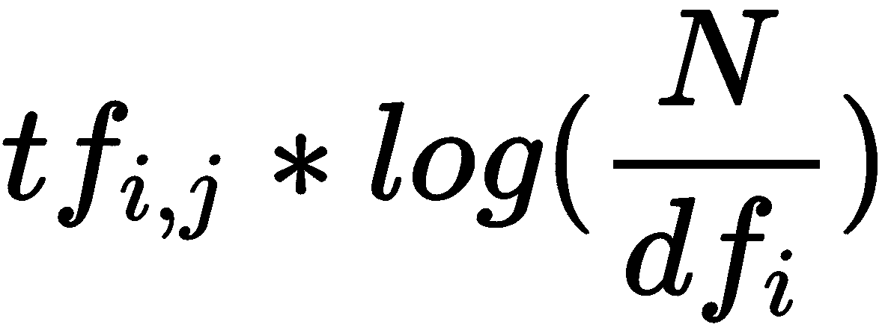

# 第八章：创建机器学习推理管道

用于处理数据以进行模型训练的数据转换逻辑与用于准备数据进行推理的数据转换逻辑是相同的。重复相同的逻辑是冗余的。

本章的目标是带领您了解如何使用 SageMaker 和其他 AWS 服务创建 **机器学习**（**ML**）管道，这些管道能够处理大数据、训练算法、部署训练好的模型并进行推理，同时在模型训练和推理过程中使用相同的数据处理逻辑。

在本章中，我们将覆盖以下主题：

+   理解 SageMaker 中推理管道的架构

+   使用 Amazon Glue 和 SparkML 创建特征

+   通过在 SageMaker 中训练 NTM 来识别主题

+   在 SageMaker 中进行在线推理，而不是批量推理

让我们来看看本章的技术要求。

# 技术要求

为了说明本章将要涵盖的概念，我们将使用 [ABC Millions Headlines](https://www.kaggle.com/therohk/million-headlines) 数据集。该数据集包含大约一百万条新闻标题。在与本章相关的 [github](https://github.com/PacktPublishing/Hands-On-Artificial-Intelligence-on-Amazon-Web-Services/tree/master/Ch10_InferencePipeline_SageMaker/million-headlines-data) 仓库中，您应该能找到以下文件：

+   [abcnews-date-text.zip](https://github.com/PacktPublishing/Hands-On-Artificial-Intelligence-on-Amazon-Web-Services/blob/master/Ch10_InferencePipeline_SageMaker/million-headlines-data/abcnews-date-text.zip): 输入数据集

+   [libraries-mleap](https://github.com/PacktPublishing/Hands-On-Artificial-Intelligence-on-Amazon-Web-Services/tree/master/Ch10_InferencePipeline_SageMaker/million-headlines-data/libraries-mleap): MLeap 库（包括 `.jar` 文件和 `.jar` 的 Python 包装器）

让我们从查看推理管道的架构开始。

# 理解 SageMaker 中推理管道的架构

我们正在构建的推理管道有三个主要组件：

+   数据预处理

+   模型训练

+   数据预处理（来自 *步骤 1*）和推理

以下是架构图——我们将要演示的步骤适用于大数据：


在管道的第一步，我们通过 AWS Glue 在 Apache Spark 上执行数据处理逻辑。Glue 服务通过 SageMaker Notebook 实例进行调用。

Amazon Glue 是一个完全托管的无服务器 **提取、转换和加载**（**ETL**）服务，用于处理大数据。ETL 作业运行在 Apache Spark 环境中，Glue 负责配置并按需扩展执行作业所需的资源。

数据处理逻辑，在我们的案例中，包括从每个新闻头条中创建标记/单词，去除停用词，并计算给定头条中每个单词的频率。ETL 逻辑被序列化为 MLeap 包，可以在推理时用于数据处理。序列化后的 SparkML 模型和处理过的输入数据都存储在 S3 桶中。

MLeap 是一个开源 Spark 包，旨在序列化 Spark 训练的转换器。序列化模型用于将数据转换为所需格式。

在第二步中，**神经主题模型**（**NTM**）算法将在处理过的数据上进行训练，以发现主题。

在*第 3 步*中，SparkML 和训练后的 NTM 模型一起用于创建管道模型，该模型用于按指定顺序执行模型。SparkML 提供一个 docker 容器，而 NTM docker 容器则作为实时模型预测的端点。相同的管道模型也可以用于批处理模式下运行推理，即一次处理多个新闻头条，为每个头条发现主题。

现在是时候全面深入了解*第 1 步*——如何从 SageMaker 笔记本实例调用 Amazon Glue 进行大数据处理。

# 使用 Amazon Glue 和 SparkML 创建特征

为了在大数据环境中创建特征，我们将使用 PySpark 编写数据预处理逻辑。该逻辑将作为 Python 文件`abcheadlines_processing.py`的一部分。在回顾逻辑之前，我们需要先走一遍一些前置条件。

# 走一遍前置条件

1.  为 Amazon Glue 服务提供 SageMaker 执行角色访问权限，具体如下：


通过运行 SageMaker 会话对象的 get_execution_role()方法来获取 SageMaker 执行角色

1.  在 IAM 仪表板上，点击左侧导航栏的“角色”并搜索该角色。点击目标角色，进入其摘要页面。点击信任关系标签，添加`AWS Glue`作为附加信任实体。点击“编辑信任关系”并将以下条目添加到`"Service"`键下：“glue.amazonaws.com”。

1.  将 MLeap 二进制文件上传到 S3 桶的适当位置，具体如下。这些二进制文件可以在本章的源代码中找到：

```py
python_dep_location = sess.upload_data(path='python.zip', bucket=default_bucket, key_prefix='sagemaker/inference-pipeline/dependencies/python')   

jar_dep_location = sess.upload_data(path='mleap_spark_assembly.jar', bucket=default_bucket, key_prefix='sagemaker/inference-pipeline/dependencies/jar') 
```

1.  我们将使用 SageMaker 会话对象的`upload_data()`方法将 MLeap 二进制文件上传到 S3 桶的适当位置。我们将需要`MLeap` Java 包和 Python 包装器 MLeap 来序列化 SparkML 模型。同样，我们将把输入数据，即[abcnews-date-text.zip](https://github.com/PacktPublishing/Hands-On-Artificial-Intelligence-on-Amazon-Web-Services/blob/master/Ch10_InferencePipeline_SageMaker/million-headlines-data/abcnews-date-text.zip)，上传到 S3 桶中的相关位置。

现在，我们将回顾`abcheadlines_processing.py`中的数据预处理逻辑。

# 使用 PySpark 进行数据预处理

下面的数据预处理逻辑在一个 Spark 集群上执行。让我们逐步进行：

1.  我们将首先收集由 SageMaker Notebook 实例发送的参数，如下所示：

```py
args = getResolvedOptions(sys.argv, ['S3_INPUT_BUCKET',
 'S3_INPUT_KEY_PREFIX',
 'S3_INPUT_FILENAME',
 'S3_OUTPUT_BUCKET',
 'S3_OUTPUT_KEY_PREFIX',
 'S3_MODEL_BUCKET',
 'S3_MODEL_KEY_PREFIX'])
```

我们将使用 AWS Glue 库中的 `getResolvedOptions()` 实用函数来读取由 SageMaker Notebook 实例发送的所有参数。

1.  接下来，我们将读取新闻标题，如下所示：

```py
abcnewsdf = spark.read.option("header","true").csv(('s3://' + os.path.join(args['S3_INPUT_BUCKET'], args['S3_INPUT_KEY_PREFIX'], args['S3_INPUT_FILENAME'])))
```

我们使用 `spark`，即活动的 SparkSession，来读取包含相关新闻标题的 `.csv` 文件。

1.  接下来，我们检索 10% 的标题，并定义数据转换。我们可以使用 Apache Spark 进行分布式计算处理所有 1,000,000 条新闻标题。然而，我们将通过使用数据集的样本从 SageMaker Notebook 实例中演示使用 AWS Glue 的背后概念：

```py
abcnewsdf = abcnewsdf.limit(hdl_fil_cnt) 

tok = Tokenizer(inputCol="headline_text", outputCol="words") 
swr = StopWordsRemover(inputCol="words", outputCol="filtered")
ctv = CountVectorizer(inputCol="filtered", outputCol="tf", vocabSize=200, minDF=2)
idf = IDF(inputCol="tf", outputCol="features")
```

`hdl_fil_cnt` 是总新闻标题数的 10%。`abcnewsdf` 包含约 100,000 条新闻标题。我们使用 `pyspark.ml.feature` 中的 `Tokenizer`、`StopWordsRemover`、`CountVectorizer`，以及 **逆文档频率** (**IDF**) 转换器和估计器对象来转换标题文本，如下所示：

1.  首先，`Tokenizer` 将标题文本转换为单词列表。

1.  第二，`StopWordsTokenizer` 从 `Tokenizer` 生成的单词列表中移除停用词。

1.  第三，`CountVectorizer` 使用前一步骤的输出来计算词频。

1.  最后，IDF，一个估计器，计算每个单词的逆文档频率因子（IDF 由  给出，其中  是标题 j 中术语 i 的词频，N 是总标题数，以及

     是包含术语 i 的标题数）。标题中独特的单词比那些在其他标题中频繁出现的单词更重要。

关于在 Spark ML 中的 `Estimator` 和 `Transformer` 对象的更多信息，请参阅 Spark 的文档 [`spark.apache.org/docs/latest/ml-pipeline.html`](https://spark.apache.org/docs/latest/ml-pipeline.html)。

1.  接下来，我们将所有转换器和估计器阶段连接成一个流水线，并将标题转换为特征向量。特征向量的宽度为 200，由 `CountVectorizer` 定义：

```py
news_pl = Pipeline(stages=[tok, swr, ctv, idf])
news_pl_fit = news_pl.fit(abcnewsdf)
news_ftrs_df = news_pl_fit.transform(abcnewsdf)
```

在前面的代码中，我们使用 `pyspark.ml` 中的 `Pipeline` 对象将数据转换过程连接起来。我们还在 `Pipeline` 对象 `news_pl` 上调用了 `fit()` 方法，以创建 `PipelineModel`。`news_pl_fit` 将学习每个新闻标题中单词的 IDF 因子。当在 `news_pl_fit` 上调用 `transform()` 方法时，输入的标题将被转换为特征向量。每个标题将由一个长度为 200 的向量表示。`CountVectorizer` 按照所有标题中单词的频率排序，选择频率最高的前 200 个单词。请注意，处理后的标题将存储在 `features` 列中，这是 IDF 估算器阶段 `outputCol` 参数所指示的。

1.  现在我们将保存结果特征向量为 `.csv` 格式，如下所示：

```py
news_save = news_formatted.select("result")
news_save.write.option("delimiter", "\t").mode("append").csv('s3://' + os.path.join(args['S3_OUTPUT_BUCKET'], args['S3_OUTPUT_KEY_PREFIX']))
```

为了将处理后的标题保存为 `.csv` 格式，`features` 列需要以简单的字符串格式存储。CSV 文件格式不支持在列中存储数组或列表。我们将定义一个用户自定义函数 `get_str`，将特征向量转换为逗号分隔的 tf-idf 数字字符串。请参阅本章附带的源代码以获取更多细节。最终的 `news_save` DataFrame 将作为 `.csv` 文件保存到 S3 存储桶的指定位置。以下截图显示了 `.csv` 文件的格式：


1.  同样，我们还将把词汇表保存到一个单独的文本文件中。

1.  现在是时候序列化 `news_pl_fit` 并将其推送到 S3 存储桶，如下所示：

```py
 SimpleSparkSerializer().serializeToBundle(news_pl_fit, "jar:file:/tmp/model.zip", news_ftrs_df)
s3.Bucket(args['S3_MODEL_BUCKET']).upload_file('/tmp/model.tar.gz', file_name)
```

在前面的代码块中，我们使用 MLeap `pyspark` 库中的 `SimpleSparkSerializer` 对象的 `serializetoBundle()` 方法来序列化 `news_pl_fit`。我们将在上传到 S3 存储桶之前，将序列化后的模型格式从 `.zip` 转换为 `tar.gz` 格式。

现在让我们通过 AWS Glue 作业来执行 `abcheadlines_processing.py` 脚本。

# 创建 AWS Glue 作业

现在我们将使用 `Boto3` 创建一个 Glue 作业，`Boto3` 是 AWS 的 Python SDK。该 SDK 允许 Python 开发人员创建、配置和管理 AWS 服务。

让我们创建一个 Glue 作业，并提供以下规格：

```py
response = glue_client.create_job(
    Name=job_name,
    Description='PySpark job to featurize the ABC News Headlines dataset',
    Role=role,
    ExecutionProperty={
        'MaxConcurrentRuns': 1
    }, 
```

在前面的代码块中，我们通过传入作业名称、描述和角色，调用 AWS Glue 客户端的 `create_job()` 方法。我们还指定了要执行的并发数。

现在让我们看一下 Glue 发送到 Spark 集群的命令：

```py
Command={
'Name': 'glueetl',
'ScriptLocation': script_location
},
```

在前面的代码中，我们定义了命令名称和包含数据预处理逻辑的 Python 脚本的位置，即 `abcheadlines_processing.py`。

现在我们来看看需要配置哪些二进制文件，以便序列化 SparkML 模型：

```py
DefaultArguments={
'--job-language': 'python',
'--extra-jars' : jar_dep_location,
'--extra-py-files': python_dep_location
},)
```

在前面的代码中，我们定义了默认语言，以便我们可以预处理大数据，指定了 MLeap `.jar` 文件的存放位置以及 MLeap 的 Python 包装器。

既然我们已经创建了 Glue 作业，让我们来执行它：

```py
job_run_id = glue_client.start_job_run(JobName=job_name,
                                       Arguments = {
                                        '--S3_INPUT_BUCKET': s3_input_bucket,
                                        '--S3_INPUT_KEY_PREFIX': s3_input_key_prefix,
                                        '--S3_INPUT_FILENAME': s3_input_fn, 
                                        '--S3_OUTPUT_BUCKET': s3_output_bucket,
                                        '--S3_OUTPUT_KEY_PREFIX': s3_output_key_prefix,
                                        '--S3_MODEL_BUCKET': s3_model_bucket,
                                        '--S3_MODEL_KEY_PREFIX': s3_model_key_prefix
                                       })
```

我们通过传递之前创建的 Glue 作业的名称，以及定义输入和位置的参数，调用 AWS Glue 客户端的`start_job_run()`方法。

我们可以通过以下方式获取 Glue 作业的状态：

```py
job_run_status = glue_client.get_job_run(JobName=job_name,RunId=job_run_id)['JobRun']['JobRunState']
```

我们将收到以下输出：


我们调用 AWS Glue 客户端的`get_job_run()`方法，并传入我们想检查其状态的 Glue 作业的名称。

要检查 AWS Glue 作业的状态，您还可以通过“服务”菜单导航到 AWS Glue 服务。在左侧导航菜单中的 ETL 部分，点击作业。选择一个作业名称以查看该 Glue 作业的详细信息：


现在，我们将通过拟合 NTM 到 ABC 新闻头条数据集来揭示其中的主题。

# 通过在 SageMaker 中训练 NTM 来识别主题

执行以下步骤来训练 NTM 模型：

1.  从指定的 S3 桶的输出文件夹中读取处理后的 ABC 新闻头条数据集，如下所示：

```py
abcnews_df = pd.read_csv(os.path.join('s3://', s3_output_bucket, f.key))
```

我们使用来自 pandas 库的`read_csv()`函数将处理后的新闻头条读取到 DataFrame 中。DataFrame 包含 110,365 条头条和 200 个单词。

1.  然后，我们将数据集分成三部分——训练集、验证集和测试集，如下所示：

```py
vol_train = int(0.8 * abcnews_csr.shape[0])

train_data = abcnews_csr[:vol_train, :] 
test_data = abcnews_csr[vol_train:, :]

vol_test = test_data.shape[0]
val_data = test_data[:vol_test//2, :]
test_data = test_data[vol_test//2:, :]
```

在前面的代码块中，我们将 80%的数据用于训练，10%用于验证，剩余 10%用于测试。

1.  将训练集、验证集和测试集数据集上传到 S3 桶上的适当位置。我们还需要将 AWS Glue 作业创建的词汇文本文件上传到辅助路径。SageMaker 的内置算法使用辅助路径提供训练时的额外信息。在本例中，我们的词汇包含 200 个单词。然而，前一部分的特征向量不知道单词的名称；它确实知道单词的索引。因此，在 NTM 训练完成后，为了使 SageMaker 能够输出与主题对应的重要单词，它需要一个词汇文本文件。

1.  下一步是通过将计算实例的数量和类型以及 Docker NTM 镜像传递给 SageMaker 会话，定义 SageMaker 中的 NTM Estimator 对象。Estimators 是适合数据的学习模型。

1.  现在我们准备好训练 NTM 算法，如下所示：

```py
ntm_estmtr_abc.fit({'train': s3_train, 'validation': s3_val, 'auxiliary': s3_aux})
```

为了训练 NTM 算法，我们使用`ntm` Estimator 对象的`fit()`方法，并传入训练集、测试集和辅助数据集的位置。由于我们有一整章内容，第九章，*发现文本集合中的主题*，专门讲解如何理解 NTM 算法的工作原理，因此我们将保存模型训练的详细信息，稍后再处理。

1.  以下是模型的输出——我们已经配置了模型，使其能够检索五个主题：

```py
International Politics and Conflict
[0.40, 0.94] defends decision denies war anti pm warns un bush report iraq calls public australia minister backs wins tas plans chief

Sports and Crime
[0.52, 0.77] clash top win world tour test pakistan back record cup killed title final talks england set australia us still pm

Natural Disasters and Funding
[0.45, 0.90] urged indigenous water power take call lead boost final residents get wa act funds england centre fire help plan funding

Protest and Law Enforcement
[0.51, 0.72] new record says found strike set win cup south police fire us go pay court plan rise australia bid deal

Crime
[0.54, 0.93] charged dies murder man charges crash death dead car two woman accident face charge found attack police injured court sydney
```

每个主题的开头有两个数字——kld 和 recons。我们将在下一章详细讨论这两个损失。但是目前，理解第一个比例反映了创建嵌入式新闻标题的损失，而第二个比例反映了重建损失（即从嵌入中创建标题）。损失越小，主题聚类的效果越好。

对于我们发现的每个主题，我们根据词语分组手动标注这些主题。

现在我们准备好查看推理模式。推理可以在实时模式和批量模式下获得。

# 在 SageMaker 中运行在线推理与批量推理

在现实世界的生产场景中，我们通常会遇到两种情况：

+   在实时或在线模式下运行推理

+   批量或离线模式下运行推理

为了说明这一点，假设使用推荐系统作为 Web 或移动应用的一部分，当你想根据应用内活动来个性化商品推荐时，可以使用实时推理。应用内活动，如浏览过的商品、购物车中但未结账的商品等，可以作为输入发送到在线推荐系统。

另一方面，如果你希望在客户与 Web 或移动应用进行交互之前就向他们展示商品推荐，那么你可以将与其历史消费行为相关的数据发送到离线推荐系统，从而一次性为整个客户群体获得商品推荐。

让我们看看如何运行实时预测。

# 通过推理管道创建实时预测

在本节中，我们将构建一个管道，重用序列化的 SparkML 模型进行数据预处理，并使用训练好的 NTM 模型从预处理的标题中提取主题。SageMaker 的 Python SDK 提供了`Model`、`SparkMLModel`和`PipelineModel`等类，用于创建推理管道，进行特征处理，并使用训练好的算法对处理后的数据进行评分。

让我们逐步讲解如何创建一个可以用于实时预测的端点：

1.  从 NTM 训练作业（我们在上一节中创建的那个）创建`Model`，如下所示：

```py
ntm_model = Model(model_data=modeldataurl, image=container)
```

在这里，我们创建了`Model`对象，该对象位于`sagemaker.model`模块中。我们传入训练好的 NTM 模型的位置以及 NTM 推理镜像的 Docker 注册路径。

1.  创建一个表示学习到的数据预处理逻辑的 SparkML `Model`，如下所示：

```py
sparkml_data = 's3://{}/{}/{}'.format(s3_model_bucket, s3_model_key_prefix, 'model.tar.gz')
sparkml_model = SparkMLModel(model_data=sparkml_data, env={'SAGEMAKER_SPARKML_SCHEMA' : schema_json})
```

我们将`sparkml_data`定义为来自`pyspark.ml`包的序列化`PipelineModel`的位置。请记住，`PipelineModel`包含三个变换器（`Tokenizer`、`StopWordsRemover`和`CountVectorizer`）和一个估算器（IDF），这些都是我们在上一节中进行的数据预处理中用到的。然后，我们通过传入训练好的 Spark `PipelineModel`的位置和推理输入数据的模式，创建一个`SparkMLModel`对象`sparkml_model`。

1.  创建一个`PipelineModel`，将`SparkMLModel`（数据预处理）和`ntm_model`按顺序组合如下：

```py
sm_model = PipelineModel(name=model_name, role=role, models=[sparkml_model, ntm_model])
```

我们通过传递模型名称、`sagemaker`执行角色和我们要执行的模型序列，来从`sagemaker.pipeline`模块创建一个`PipelineModel`对象。

1.  现在是时候部署`PipelineModel`了，如下所示：

```py
sm_model.deploy(initial_instance_count=1, instance_type='ml.c4.xlarge', endpoint_name=endpoint_name)
```

我们将调用`sm_model`上的`deploy()`方法，将模型部署为一个端点。我们需要将托管端点所需的实例数量和类型，以及端点名称，传递给部署的模型。

现在是时候将测试数据集中的一个样本头条新闻传递给新创建的端点了。让我们一步一步地了解这些步骤：

1.  首先，我们从`sagemaker.predictor`模块创建一个`RealTimePredictor`对象，如下所示：

```py
predictor = RealTimePredictor(endpoint=endpoint_name, sagemaker_session=sess, serializer=json_serializer,
 content_type=CONTENT_TYPE_JSON, accept=CONTENT_TYPE_CSV)
```

我们通过传递先前创建的端点名称、当前的 SageMaker 会话、序列化器（定义如何在将数据传输到端点时对输入数据进行编码）以及请求和响应的内容类型，来定义`RealTimePredictor`对象。

1.  然后我们调用`RealTimePredictor`对象`predictor`的`predict()`方法，如下所示：

```py
predictor.predict(payload)
```

我们调用`predictor`的`predict()`方法，该方法已初始化为`RealTimePredictor`对象，通过将测试数据集中的一个样本头条新闻作为`json`负载的一部分传递，如下所示：

```py
payload = {
    "schema": {
        "input": [
        {
            "name": "headline_text",
            "type": "string"
        }, 
    ],
    "output": 
        {
            "name": "features",
            "type": "double",
            "struct": "vector"
        }
    },
    "data": [
        ["lisa scaffidi public hearing possible over expenses scandal"]
            ]

}
```

`payload`变量包含两个键：`schema`和`data`。`schema`键包含`SparkMLModel`的输入和输出结构，而`data`键包含我们希望发现其主题的一个样本头条新闻。如果我们选择覆盖在初始化`SparkMLModel`时指定的 SageMaker `sparkml`架构，我们可以传递新的架构。以下是评分新闻头条后的输出：

```py
{"predictions":[{"topic_weights":[0.5172129869,0.0405323133,0.2246916145,0.1741439849,0.0434190407]}]}
```

我们可以看到，头条新闻有三个显著的主题：国际政治与冲突，其次是与资金/支出相关的挑战，最后是执法。

一点背景——Lisa Scaffidi 曾是西澳大利亚珀斯市市长。她因不当使用职权而被控—未能申报价值数万美元的礼品和旅行。因此，这条头条新闻恰如其分地涵盖了多个主题：国际政治与冲突（51%），随后是与资金/支出相关的挑战（22%），然后是执法（17%）。

现在让我们来看一下如何为一批头条新闻推断主题。

# 通过推理管道创建批量预测

在本节中，我们将焦点从实时预测转向批量预测。为了满足将训练好的模型部署到离线模式的需求，SageMaker 提供了 Batch Transform。Batch Transform 是一个新发布的高性能和高吞吐量特性，能够对整个数据集进行推理。输入和输出数据都存储在 S3 桶中。*Batch Transform*服务负责管理必要的计算资源，以便使用训练好的模型对输入数据进行评分。

以下图示显示了 *批量转换* 服务是如何工作的：


在前面的图示中，我们可以看到以下步骤：

1.  批量转换服务通过代理摄取大量输入数据（来自 S3 存储桶）。

1.  批量转换代理的角色是协调训练模型与 S3 存储桶之间的通信，在那里存储输入和输出数据。

1.  一旦请求数据对代理可用，它就会将其发送到训练好的模型，模型会转换新闻标题并生成主题。

1.  由中介代理产生的推理或主题将被返回存储到指定的 S3 存储桶中。

让我们逐步了解如何运行一个批量转换任务：

1.  定义存储输入和输出数据的 S3 存储桶路径，以及我们在上一节中创建的 `PipelineModel` 的名称。`PipelineModel` 的名称可以通过编程方式或通过 AWS 控制台获取（导航到左侧导航面板中的 SageMaker 服务；然后，在推理部分，点击模型）。

1.  从 `sagemaker.transformer` 模块创建一个 `Transformer` 对象，如下所示：

```py
transformer = sagemaker.transformer.Transformer(
 model_name = model_name,
 instance_count = 1,
 instance_type = 'ml.m4.xlarge',
 strategy = 'SingleRecord',
 assemble_with = 'Line',
 output_path = output_data_path,
 base_transform_job_name='serial-inference-batch',
 sagemaker_session=sess,
 accept = CONTENT_TYPE_CSV
)
```

在这里，我们定义运行管道模型所需的计算资源，例如 EC2 实例类型和数量。然后，我们定义并组装策略，即如何批量处理记录（单条或多条记录）以及如何组装输出。还提供了当前 SageMaker 会话和由 `accept` 定义的输出内容类型。

1.  调用我们在前一步创建的转换器对象的 `transform()` 方法，如下所示：

```py
transformer.transform(data = input_data_path,
                      job_name = job_name,
                      content_type = CONTENT_TYPE_CSV, 
                      split_type = 'Line')
```

我们定义输入数据的路径、批量转换任务的名称、输入内容类型，以及如何分隔输入记录（在这种情况下，新闻标题按行分隔）。接下来，我们等待对所有输入数据进行批量推理。以下是产生的输出的摘录：


记住，我们已经涉及了五个主题：国际政治与冲突、体育与犯罪、自然灾害与资金、抗议与执法、以及犯罪。对于每个新闻标题，NTM 算法会预测该标题包含主题 1 至 5 的概率。因此，每个标题将由五个主题的混合组成。

例如，在 *印尼警方称枪击事件导致阿扎哈里死亡* 的标题中，犯罪相关的主题占主导地位。这些主题非常相关，因为该标题涉及的是 2002 年巴厘岛爆炸事件的幕后策划者阿扎哈里的谋杀。

通过完成本节，我们已经成功查看了两种在 SageMaker 中运行推理的不同模式。

# 总结

在本章中，我们学习了如何重用数据预处理逻辑进行训练和推理，以及如何执行在线推理与离线推理的区别。我们首先了解了机器学习推理流水线的架构。然后，我们使用 ABC 新闻头条数据集，通过 AWS Glue 和 SparkML 演示大数据处理。接着，我们通过将 NTM 算法应用于处理后的新闻头条，发现了新闻的主题。最后，我们通过利用相同的数据预处理逻辑进行推理，讲解了实时推理与批处理推理的区别。通过推理流水线，数据科学家和机器学习工程师可以提高机器学习解决方案的上市速度。

在下一章，我们将深入探讨**神经主题模型**（**NTMs**）。

# 深入阅读

以下阅读材料旨在增强你对本章所涵盖内容的理解：

+   **Spark 中的流水线模型**：[`blog.insightdatascience.com/spark-pipelines-elegant-yet-powerful-7be93afcdd42`](https://blog.insightdatascience.com/spark-pipelines-elegant-yet-powerful-7be93afcdd42)

+   **批量变换**：[`docs.aws.amazon.com/sagemaker/latest/dg/how-it-works-batch.html`](https://docs.aws.amazon.com/sagemaker/latest/dg/how-it-works-batch.html)

+   **主题建模**：[`medium.com/ml2vec/topic-modeling-is-an-unsupervised-learning-approach-to-clustering-documents-to-discover-topics-fdfbf30e27df`](https://medium.com/ml2vec/topic-modeling-is-an-unsupervised-learning-approach-to-clustering-documents-to-discover-topics-fdfbf30e27df)

+   **Spark 中的变换器**：[`spark.apache.org/docs/1.6.0/ml-guide.html#transformers`](https://spark.apache.org/docs/1.6.0/ml-guide.html#transformers)
