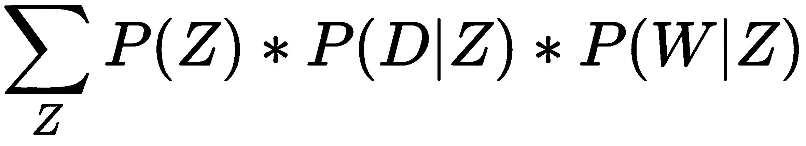

# 第九章：在文本集合中发现主题

理解文本的一个最有用的方法是通过主题。学习、识别和提取这些主题的过程叫做主题建模。理解文本中的广泛主题有许多应用。它可以在法律行业中用于从合同中提取主题。（与其人工审核大量合同中的某些条款，不如通过无监督学习自动提取主题或模式）。此外，它还可以在零售行业中用于识别社交媒体对话中的广泛趋势。这些广泛的趋势可以用于产品创新——如在线上和实体店推出新商品、告知其他人商品种类等。

在本章中，我们将学习如何从长文本中合成主题（即文本长度超过 140 个字符）。我们将回顾主题建模的技术，并理解**神经主题模型**（**NTM**）的工作原理。接着，我们将探讨在 SageMaker 中训练和部署 NTM 的方法。

在本章中，我们将讨论以下主题：

+   回顾主题建模技术

+   了解神经主题模型的工作原理

+   在 SageMaker 中训练 NTM

+   部署 NTM 并运行推理

# 技术要求

为了说明本章的概念，我们将使用**词袋模型**（[`archive.ics.uci.edu/ml/datasets/bag+of+words`](https://archive.ics.uci.edu/ml/datasets/bag+of+words)）数据集，该数据集来自**UCI 机器学习库**（[`archive.ics.uci.edu/ml`](http://archive.ics.uci.edu/ml)）。该数据集包含有关 Enron 电子邮件的信息，如电子邮件 ID、单词 ID 及其出现次数，即某个特定单词在给定电子邮件中出现的次数。

在与本章相关的 GitHub 仓库中([`github.com/PacktPublishing/Hands-On-Artificial-Intelligence-on-Amazon-Web-Services/tree/master/Ch9_NTM`](https://github.com/PacktPublishing/Hands-On-Artificial-Intelligence-on-Amazon-Web-Services/tree/master/Ch9_NTM))，你应该能够找到以下文件：

+   `docword.enron.txt.gz` ([`github.com/PacktPublishing/Hands-On-Artificial-Intelligence-on-Amazon-Web-Services/blob/master/Ch9_NTM/data/docword.enron.txt.gz`](https://github.com/PacktPublishing/Hands-On-Artificial-Intelligence-on-Amazon-Web-Services/blob/master/Ch9_NTM/data/docword.enron.txt.gz)[)：] 包含电子邮件 ID 和单词 ID

+   `vocab.enron.txt` ([`github.com/PacktPublishing/Hands-On-Artificial-Intelligence-on-Amazon-Web-Services/tree/master/Ch9_NTM/data/vocab.enron.txt`](https://github.com/PacktPublishing/Hands-On-Artificial-Intelligence-on-Amazon-Web-Services/tree/master/Ch9_NTM/data/vocab.enron.txt))：包含数据集中的实际单词

我们先从回顾主题建模技术开始。

# 回顾主题建模技术

在这一部分，我们将讨论几种线性和非线性学习技术，涉及主题建模。线性技术包括潜在语义分析（两种方法——奇异向量分解和非负矩阵分解）、概率潜在语义分析和潜在狄利克雷分配。另一方面，非线性技术包括 LDA2Vec 和神经变分文档模型。

在**潜在语义分析**（**LSA**）的情况下，主题是通过将文档近似为较少数量的主题向量来发现的。一组文档通过文档-词矩阵表示：

+   在其最简单的形式中，文档词矩阵由原始计数组成，即给定词在给定文档中出现的频率。由于这种方法没有考虑每个词在文档中的重要性，我们用**tf-idf**（**词频-逆文档频率**）分数替代原始计数。

+   通过 tf-idf，出现在特定文档中频繁出现但在其他文档中出现较少的词将具有较高的权重。由于文档-词矩阵是稀疏且嘈杂的，必须通过降维来获取文档和词之间通过主题形成的有意义关系。

+   降维可以通过截断**SVD**（**奇异值分解**）完成，其中文档-词矩阵被分解为三个不同的矩阵，即文档主题（*U*）、词-主题（*V*）和奇异值矩阵（*S*），其中奇异值表示主题的强度，如下图所示：


这种分解是唯一的。为了在低维空间中表示文档和词，只选择*T*个最大的奇异值（如前图所示的矩阵子集），并且只保留*U*和*V*的前*T*列。*T*是一个超参数，可以调整以反映我们想要找到的主题数量。在线性代数中，任何*m x n*矩阵*A*都可以按如下方式分解：

+   ，其中*U*称为左奇异向量，*V*称为右奇异向量，*S*称为**奇异值矩阵**。

有关如何计算奇异值以及给定矩阵的左奇异向量和右奇异向量的信息，请参考[`machinelearningmastery.com/singular-value-decomposition-for-machine-learning/`](https://machinelearningmastery.com/singular-value-decomposition-for-machine-learning/) [直观解释——从 SVD 重构矩阵](https://machinelearningmastery.com/singular-value-decomposition-for-machine-learning/)。

+   因此，我们得到了，。

除了 SVD 外，你还可以通过(**非负矩阵分解** (**NMF**))进行矩阵分解。NMF 属于线性代数算法，用于识别数据中的潜在结构。两个非负矩阵用于近似文档-词项矩阵，如下图所示（术语和单词可以互换使用）：


让我们比较并对比 LSA 的不同线性技术，并查看一种提供更多灵活性的 LSA 变体：

+   NMF 与 SVD 的区别在于，使用 SVD 时，我们可能会得到负的组件（左侧和/或右侧）矩阵，这在解释文本表示时并不自然。而 NMF 则生成非负的表示，用于执行 LSA。

+   LSA 的缺点通常是它有较少可解释的主题和效率较低的表示。此外，它是一个线性模型，不能用于建模非线性依赖关系。潜在主题的数量受矩阵秩的限制。

**概率 LSA** (**pLSA**)：pLSA 的整体思想是找到一个潜在主题的概率模型，该模型能够生成我们可以观察到的文档和单词。因此，联合概率，也就是文档和单词组合的概率，![]，可以写成如下：

 = 

这里，*D* = 文档，*W* = 单词，*Z* = 主题。

让我们看看 pLSA 是如何工作的，并举例说明它在某些情况下并不充分：

+   我们可以看到，pLSA 与 LSA 的相似之处在于，*P(Z)*对应于一个奇异值矩阵，*P(D|Z)*对应于一个左奇异向量，而*P(W|Z)*则对应于 SVD 中的一个右奇异向量。

+   这种方法的最大缺点是，我们无法轻易地将其推广到新文档。LDA 解决了这个问题。

**潜在狄利克雷分配** (**LDA**)：虽然 LSA 和 pLSA 用于语义分析或信息检索，但 LDA 用于主题挖掘。简单来说，你基于文档集合中的词频来揭示主题：

+   对于一组文档，你指定你想要揭示的主题数量。这个数字可以根据 LDA 在未见文档上的表现进行调整。

+   然后，你对文档进行标记化，移除停用词，保留在语料库中出现一定次数的单词，并进行词干化处理。

+   首先，对于每个单词，你分配一个随机主题。然后你通过文档计算主题混合，即每个主题在文档中出现的次数。你还要计算主题中每个单词在语料库中的混合，即每个单词在该主题中出现的次数。

+   迭代/遍历 1：对于每个单词，在遍历整个语料库后，你将重新分配一个主题。主题的重新分配是根据每个文档的其他主题分配来进行的。假设一个文档的主题分布为：主题 1 - 40%，主题 2 - 20%，主题 3 - 40%，并且文档中的第一个单词被分配到主题 2。该单词在这些主题中（即整个语料库）出现的频率如下：主题 1 - 52%，主题 2 - 42%，主题 3 - 6%。在文档中，我们将该单词从主题 2 重新分配到主题 1，因为该单词代表主题 1（40%*52%）的概率高于主题 2（20%*42%）。这个过程会在所有文档中重复进行。经过遍历 1 后，你将覆盖语料库中的每个单词。

+   我们对整个语料库进行几轮遍历或迭代，直到不再需要重新分配。

+   最终，我们会得到一些指定的主题，每个主题由关键词表示。

到目前为止，我们已查看了用于主题建模的线性技术。现在，是时候将注意力转向非线性学习了。神经网络模型用于主题建模，具有更大的灵活性，允许增加新的功能（例如，为输入/目标单词创建上下文单词）。

**Lda2vec** 是 word2vec 和 LDA 模型的超集。它是 skip-gram word2vec 模型的一种变体。Lda2vec 可以用于多种应用，如预测给定单词的上下文单词（称为枢轴或目标单词），包括学习用于主题建模的主题向量。

Lda2vec 类似于 **神经变分文档模型**（**NVDM**），用于生成主题嵌入或向量。然而，NVDM 采用了更为简洁和灵活的主题建模方法，通过神经网络创建文档向量，而完全忽视了单词之间的关系。

**NVDM**（**神经变分文档模型**）是一种灵活的生成文档建模过程，我们通过主题学习多个文档表示（因此，NVDM 中的 *变分*——意味着多个——一词）：

+   NVDM 基于 **变分自编码器**（**VAE**）框架，该框架使用一个神经网络对文档集合进行编码（即编码器），另一个神经网络对文档的压缩表示进行解码（即解码器）。这个过程的目标是寻找在语料库中近似信息的最佳方式。自编码器通过最小化两种类型的损失进行优化：

    +   **解码损失**（**重构误差**）：通过主题嵌入重构原始文档。

    +   **编码损失**（**Kullback-Leibler 或 KL 散度**）：构建输入文档或主题嵌入的随机表示。KL 散度衡量在编码文档的词袋表示时丢失的信息。

现在，让我们深入了解神经主题模型（NTM），这是 AWS 实现的 NVDM。尽管 AWS 提供了一个现成可用的 API——AWS Comprehend，用于发现主题，但 NTM 算法提供了细粒度的控制和灵活性，可以从长文本中挖掘主题。

# 了解神经主题模型的工作原理

如前所述，**神经主题模型**（**NTM**）是一个生成型文档模型，可以生成文档的多种表示。它生成两个输出：

+   文档的主题混合

+   一组解释主题的关键词，涵盖整个语料库中的所有主题

NTM 基于 **变分自编码器**（Variational Autoencoder）架构。下图展示了 NTM 的工作原理：


让我们逐步解释这个图示：

+   NTM 由两个组件组成——编码器和解码器。在编码器中，我们有一个 **多层感知器**（**MLP**）网络，它接收文档的词袋表示，并创建两个向量，一个是均值向量 ，另一个是标准差向量 。直观地讲，均值向量控制编码输入的中心位置，而标准差控制中心周围的区域。由于从该区域生成的样本每次都会有所不同，解码器将学习如何重构输入的不同潜在编码。

MLP 是一种前馈 **人工神经网络**（**ANNs**）类别。它由至少三层节点组成：输入层、输出层和隐藏层。除了输入节点外，每个节点都是一个使用非线性激活函数的神经元。

+   第二个组件是解码器，它通过独立生成单词来重构文档。网络的输出层是一个 Softmax 层，通过重构主题词矩阵来定义每个单词按主题的概率。矩阵中的每一列表示一个主题，每一行表示一个单词。矩阵中某一列的值表示该主题下单词分布的概率。

Softmax 解码器使用多项式逻辑回归，我们考虑不同主题的条件概率。这个变换实际上是一个标准化的指数函数，用于突出最大值并抑制远低于最大值的值。

NTM 通过减少重构误差和 KL 散度，以及调整网络的学习权重和偏差来进行优化。因此，NTM 是一个灵活的神经网络模型，适用于主题挖掘和生成可解释的主题。现在，是时候在 SageMaker 中查看如何训练 NTM 了。

# 在 SageMaker 中训练 NTM

在这一部分，我们将使用 NTM（主题模型）对 Enron 邮件进行训练，以产生话题。这些邮件是在 Enron（一家因财务损失于 2007 年停止运营的美国能源公司）与其他与其有业务往来的各方之间交换的。

数据集包含 39,861 封邮件和 28,101 个独特的单词。我们将使用这些邮件的一个子集——3,986 封邮件和 17,524 个独特单词。另外，我们将创建一个文本文件`vocab.txt`，以便 NTM 模型可以报告某个话题的单词分布。

在开始之前，确保`docword.enron.txt.gz`和`vocab.enron.txt`文件已经上传到本地 SageMaker 计算实例中的一个名为`data`的文件夹。请按照以下步骤操作：

1.  创建一个邮件的词袋表示，步骤如下：

```py
pvt_emails = pd.pivot_table(df_emails, values='count', index='email_ID', columns=['word_ID'], fill_value=0)
```

在前面的代码中，我们使用了 pandas 库中的`pivot_table()`函数来对邮件进行透视，使得邮件 ID 成为索引，单词 ID 成为列。透视表中的值表示单词的词频。该透视表包含 3,986 个邮件 ID 和 17,524 个单词 ID。

1.  现在，让我们将词频乘以**逆文档频率**（**IDF**）因子。我们的假设是，出现在一封邮件中并且在其他邮件中出现频率较低的单词，对于发现话题很重要，而那些在所有邮件中频繁出现的单词可能对发现话题不重要。

IDF 的计算公式如下：

```py
dict_IDF = {name: np.log(float(no_emails) / (1+len(bag_of_words[bag_of_words[name] > 0]))) for name in bag_of_words.columns}
```

IDF 公式如下所示：，其中 N 是数据集中邮件的数量，是包含单词*i*的文档数量。

在这一步结束时，将创建一个新的 DataFrame，表示透视后的邮件及其 tf-idf 值。

1.  现在，我们将从邮件的词袋表示中创建一个压缩稀疏行矩阵，步骤如下：

```py
sparse_emails = csr_matrix(pvt_emails, dtype=np.float32)
```

在前面的代码中，我们使用了`scipy.sparse`模块中的`csr_matrix()`函数来高效表示邮件矩阵。使用压缩稀疏行矩阵，您可以仅对非零值进行操作，并且计算时占用更少的内存。压缩稀疏行矩阵使用行指针指向行号，列索引标识该行中的列，以及给定行指针和列索引的值。

1.  按照如下方式将数据集分成训练集、验证集和测试集：

```py
vol_train = int(0.8 * sparse_emails.shape[0])

# split train and test
train_data = sparse_emails[:vol_train, :] 
test_data = sparse_emails[vol_train:, :] 

vol_test = test_data.shape[0]
val_data = test_data[:vol_test//2, :]
test_data = test_data[vol_test//2:, :]
```

我们将 80%的邮件用于训练，10%用于验证，剩余的 10%用于测试。

1.  将邮件从压缩稀疏行矩阵转换为 RecordIO 封装的 Protobuf 格式，步骤如下：

```py
data_bytes = io.BytesIO()
smamzc.write_spmatrix_to_sparse_tensor(array=sprse_matrix[begin:finish], file=data_bytes, labels=None)
data_bytes.seek(0)
```

**Protobuf 格式**，也称为**协议缓冲区**，是来自 Google 的一种协议，用于序列化或编码结构化数据。虽然 JSON、XML 和 Protobuf 可以互换使用，但 Protobuf 比其他格式更为增强，并支持更多的数据类型。RecordIO 是一种文件格式，用于在磁盘上存储序列化数据。其目的是将数据存储为一系列记录，以便更快地读取。在底层，RecordIO 使用 Protobuf 来序列化结构化数据。

对于分布式训练，我们将训练数据集分成若干部分用于分布式训练。更多细节请参考本章附带的源代码。`sagemaker.amazon.common`中的`write_spmatrix_to_sparse_tensor()`函数用于将每个部分从稀疏行矩阵格式转换为稀疏张量格式。该函数以稀疏行矩阵作为输入，同时指定一个二进制流，将 RecordIO 记录写入其中。然后，我们通过调用`seek()`方法将流的位置重置到流的开始位置——这对于从文件开头读取数据至关重要。

1.  将训练集和验证集上传到 S3 存储桶，方法如下：

```py
 file_name = os.path.join(prefix, fname_template.format(i))
 boto3.resource('s3').Bucket(bucket).Object(file_name).upload_fileobj(data_bytes)
```

1.  我们将文件名提供给二进制流，并指定 S3 存储桶的名称，该存储桶用于存储训练数据集。我们调用 S3 对象的`upload_fileobj()`方法，将二进制数据上传到指定位置。

1.  现在，我们初始化 SageMaker 的`Estimator`对象，为训练做准备，方法如下：

```py
ntm_estmtr = sagemaker.estimator.Estimator(container,
 role,
 train_instance_count=2,
 train_instance_type='ml.c4.xlarge',
 output_path=output_path,
 sagemaker_session=sess)
```

1.  估算器对象`ntm_estmtr`是通过传入 NTM 镜像的 Docker 注册表路径、SageMaker 执行角色、训练实例的数量和类型以及输出位置来创建的。由于我们启动的计算实例数量为两个，因此我们将进行分布式训练。在分布式训练中，数据被划分，并在多个数据块上并行进行训练。

1.  现在，让我们定义 NTM 算法的超参数，方法如下：

```py
num_topics = 3
vocab_size = 17524 # from shape from pivoted emails DataFrame
ntm_estmtr.set_hyperparameters(num_topics=num_topics, 
 feature_dim=vocab_size, 
 mini_batch_size=30, 
 epochs=150, 
 num_patience_epochs=5, 
 tolerance=.001)
```

让我们来看看在前面的代码中指定的超参数：

+   +   `feature_dim`：表示特征向量的大小。它设置为词汇表的大小，即 17,524 个单词。

    +   `num_topics`：表示要提取的主题数量。我们在这里选择了三个主题，但可以根据模型在测试集上的表现进行调整。

    +   `mini_batch_size`：表示在更新权重之前要处理的训练样本数量。我们在这里指定了 30 个训练样本。

    +   `epochs`：表示进行的前向和反向传递的次数。

    +   `num_patience_epochs`：表示在停止之前执行的最大无效 epoch 数量（即损失没有改善的 epoch）。

    +   `optimizer`：这表示用于优化网络权重的算法。我们使用的是 Adadelta 优化算法。自适应 Delta 梯度是**Adagrad**（**自适应梯度**）的增强版本，其中学习率根据梯度更新的滚动窗口与所有过去的梯度更新进行比较而减小。

    +   `tolerance`：这表示损失函数变化的阈值——如果在最后指定的耐心周期数内损失变化低于此阈值，则训练会提前停止。

1.  将包含词汇或数据集单词的文本文件上传到辅助路径/频道。这是用于在训练过程中向 SageMaker 算法提供附加信息的通道。

1.  将 NTM 算法拟合到训练集和验证集，如下所示：

```py
ntm_estmtr.fit({'train': s3_train, 'validation': s3_val, 'auxiliary': s3_aux})
```

1.  对于训练，我们通过传递初始化的`S3_input`对象（来自`sagemaker.session`模块）来调用`ntm_estmtr`对象的`fit()`方法。`s3_train`、`s3_val`和`s3_aux`对象提供训练、验证和辅助数据集的位置，以及它们的文件格式和分布类型。

现在，让我们来看看分布式训练的结果：

+   查看第一个机器学习计算实例的训练输出，如下所示：


请记住，总共有 3,188 个训练示例。由于我们为训练启动了两个计算实例，在第一个实例上，我们使用了 2,126 个示例进行训练。

+   查看第二个训练实例的结果，如下所示：


在第二个计算实例上，我们使用剩余的 1,062 个示例进行训练。

+   接下来，我们将报告模型在验证数据集上的表现。关于训练数据集的度量标准，请参阅本章附带的源代码。

现在，让我们看看训练模型的验证结果。该模型在 390 个数据点上进行评估，这些数据点属于验证数据集。具体来说，我们将关注以下度量标准：

+   **词嵌入主题一致性度量**（**WETC**）：这衡量每个主题中顶部单词的语义相似性。一个高质量的模型将在低维空间中将顶部单词聚集在一起。为了在低维空间中定位单词，使用了来自 GloVe（全球词向量）的预训练词嵌入。

+   **主题唯一性**（**TU**）：这衡量生成主题的唯一性。该度量与一个单词在所有主题中出现的次数成反比。例如，如果一个单词只出现在一个主题中，则该主题的唯一性很高（即 1）。然而，如果一个单词出现在五个主题中，则唯一性度量为 0.2（1 除以 5）。为了计算所有主题的主题唯一性，我们将所有主题的 TU 度量取平均值。

+   困惑度（logppx）是衡量概率模型预测样本（验证数据集）效果的统计指标。训练后，计算训练模型在验证数据集上的困惑度（训练模型在验证数据集上的表现）。困惑度越低越好，因为这最大化了验证数据集的准确性。

+   总损失（total）是 Kullback-Leibler 散度损失和重建损失的组合。

记住，神经主题模型通过最小化损失，在多个轮次中进行优化，方法如下：

+   **Kullback-Leibler 散度损失**（**kld**）：构建了一个电子邮件（主题嵌入）的随机表示，涉及相对熵，这是一种度量概率分布之间差异的方法，也就是代理概率分布。

+   **重建损失**（**recons**）：从主题嵌入中重建原始电子邮件。

以下截图显示了验证结果，并列出了所有定义的损失类型：


+   **总**损失为**8.47**，其中 0.19 定义为**kld**损失，**8.28**定义为**重建**损失。

+   从前面的截图中，我们可以看到，在三个主题中，**词嵌入主题一致性**（**WETC**）为**.26**，**主题唯一性**（**TU**）为**0.73**，**困惑度**（**logppx**）为**8.47**（与**总**损失相同）。

+   通过矩形框突出显示了三个主题及其定义的单词。

现在，到了将训练好的 NTM 模型部署为终端节点的时候了。

# 部署训练好的 NTM 模型并运行推理

在本节中，我们将部署 NTM 模型，运行推理，并解释结果。让我们开始吧：

1.  首先，我们将训练好的 NTM 模型部署为终端节点，如下所示：

```py
ntm_predctr = ntm_estmtr.deploy(initial_instance_count=1, instance_type='ml.m4.xlarge')
```

在前面的代码中，我们调用 SageMaker Estimator 对象`ntm_estmtr`的`deploy()`方法来创建终端节点。我们传递了部署模型所需的实例数量和类型。NTM Docker 镜像用于创建终端节点。SageMaker 需要几分钟时间来部署模型。以下截图显示了已配置的终端节点：


你可以通过导航到 SageMaker 服务，进入左侧导航窗格，在推理部分下找到并点击**终端节点**，查看你创建的端点。

1.  指定测试数据的请求和响应内容类型，如下所示：

```py
ntm_predctr.content_type = 'text/csv'
ntm_predctr.serializer = csv_serializer
ntm_predctr.deserializer = json_deserializer
```

在前面的代码中，`ntm_estmtr`的`deploy()`方法返回一个`RealTimePredictor`对象（来自`sagemaker.predictor`模块）。我们将测试数据的输入内容类型和反序列化器（响应的内容类型）分配给我们创建的`RealTimePredictor`对象`ntm_predctr`。

1.  现在，我们准备测试数据集以进行推理，如下所示：

```py
test_data = np.array(test_data.todense())
```

在前面的代码中，我们使用 numpy Python 库将测试数据格式从压缩稀疏行矩阵转换为稠密数组。

1.  然后，我们调用`ntm_predctr`的`predict()`方法进行推理，如下所示：

```py
results = ntm_predctr.predict(test_data[1:6])
topic_wts_res = np.array([prediction['topic_weights'] for prediction in results['predictions']])
```

在前面的代码中，我们传递了测试数据集中前五封邮件进行推理。然后，我们浏览预测结果，创建了一个多维的主题权重数组，其中行表示邮件，列表示主题。

1.  现在，我们解释结果，如下所示：

```py
df_tpcwts=pd.DataFrame(topic_wts_res.T)
```

在前面的代码中，我们转置了`topic_wts_res`，一个多维数组，创建了一个数据框`df_tpcwts`，使得每一行表示一个主题。然后我们绘制主题，如下所示：

```py
df_tpcwts.plot(kind='bar', figsize=(16,4), fontsize=fnt_sz)
plt.ylabel('Topic % Across Emails', fontsize=fnt_sz)
plt.xlabel('Topic Number', fontsize=fnt_sz)
```

在 x 轴上，我们绘制了主题编号，在 y 轴上，我们绘制了每个主题所代表的邮件百分比，如下所示：


从前面的图表中可以明显看出，主题 0 在所有五封邮件中的占比不到 10%。然而，主题 1 和主题 2 在邮件中具有不同程度的主导地位——大约 70%的第 4 封邮件由主题 1 表示，而大约 60%的第 5 封邮件由主题 2 表示。

现在，让我们看一下每个主题的词云。了解每个主题的词汇混合非常重要，这样我们就能知道哪些词语在描述特定主题时占主导地位。让我们开始吧：

1.  下载已训练的模型，如下所示：

```py
boto3.resource('s3').Bucket(bucket).download_file(model_path, 'downloaded_model.tar.gz')
```

在前面的代码中，我们从由`model_path`变量指定的路径下载了一个已训练的 NTM 模型（该路径在创建估算器时指定，`ntm_estmtr`）。

1.  现在，我们从已训练的模型中获取主题-词矩阵，如下所示：

```py
model_dict = mx.ndarray.load('params')
# Retrieve word distribution for each of the latent topics
W = model_dict['arg:projection_weight'] 
```

在前面的代码中，我们提取了 NTM 模型`downloaded_model.tar.gz`，加载了学习到的参数`params`。请记住，模型输出层的大小与数据集中单词（词汇）的数量相同。然后，我们创建了一个多维的 mxnet 数组*W*，按主题加载单词权重。W 的形状为 17,524 x 3，其中 17,524 行表示单词，3 列表示主题。

1.  对每个主题，运行 softmax 函数计算单词权重，如下所示：

```py
pvals = mx.nd.softmax(mx.nd.array(W[:, ind])).asnumpy()
```

在前面的代码中，我们对每个主题的单词权重运行 softmax 函数，将其值映射到 0 和 1 之间。每个主题中单词的概率和应当等于 1。请记住，softmax 层是 NTM 网络的输出层，它强调最大的值，并抑制离最大值较远的值。

1.  按主题绘制词云，如下所示：


如我们所见，**Topic0**主要由单词*resource*和*pending*定义，而**Topic1**主要由单词*instruction*、*andor*和*notification*定义。

基于每个主题中排名靠前的单词，我们可以确定邮件中讨论的主题：

+   **Topic0**（**访问 Enron IT 应用**）：资源待请求创建接受管理员本地类型永久 nahoutrdhoustonpwrcommonelectric nahoutrdhoustonpwrcommonpower2region 审批 kobra 点击应用日期目录读取风险尾部。

+   **Topic1**（**能源交易**）：Andor 指令通知储备购买责任来源禁止订单证券基于情报降级强大公司网站征询隐私点击覆盖。

+   **Topic2**（**包括对 IT 应用和能源交易的访问**）：请求资源待创建审批类型应用日期尾目录接受管理员翻转永久对手方头部点击交换 kobra 风险。

在本节中，我们学习了如何解读主题建模的结果。现在，让我们总结本章中我们所学到的所有概念。

# 总结

在本章中，我们回顾了主题建模技术，包括线性和非线性学习方法。我们通过讨论其架构和内部机制，解释了 SageMaker 中的 NTM 如何工作。我们还探讨了 NTM 模型的分布式训练，其中数据集被分成多个块进行并行训练。最后，我们将训练好的 NTM 模型部署为端点并运行推理，解读了 Enron 邮件中的主题。对于任何数据科学家来说，从大量非结构化数据中提取信息和主题至关重要。SageMaker 中的 NTM 提供了一种灵活的方法来实现这一点。

在下一章中，我们将讲解如何使用 SageMaker 进行图像分类。

# 进一步阅读

关于主题建模技术——LDA 的参考文献，请访问[`blog.echen.me/2011/08/22/introduction-to-latent-dirichlet-allocation/`](http://blog.echen.me/2011/08/22/introduction-to-latent-dirichlet-allocation/)。

如果你想直观地理解 VAE，可以查看以下链接：

+   [`jaan.io/what-is-variational-autoencoder-vae-tutorial/`](https://jaan.io/what-is-variational-autoencoder-vae-tutorial/)

+   [`towardsdatascience.com/intuitively-understanding-variational-autoencoders-1bfe67eb5daf`](https://towardsdatascience.com/intuitively-understanding-variational-autoencoders-1bfe67eb5daf)

关于神经变分推断在文本处理中的参考文献，请访问[`arxiv.org/pdf/1511.06038.pdf`](https://arxiv.org/pdf/1511.06038.pdf)。
