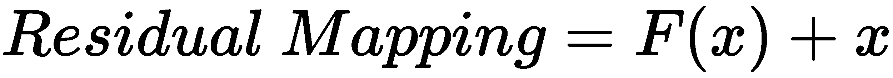
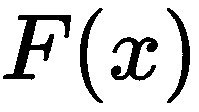
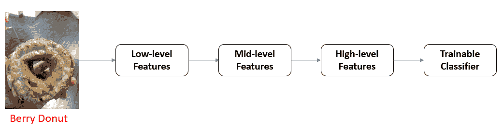
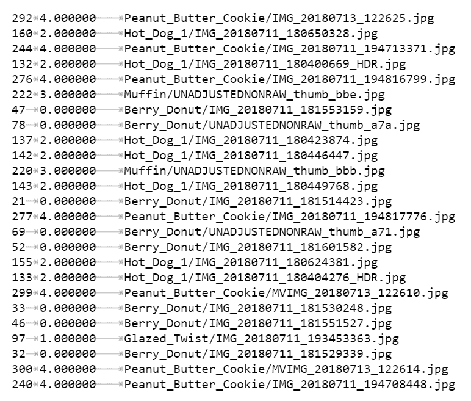
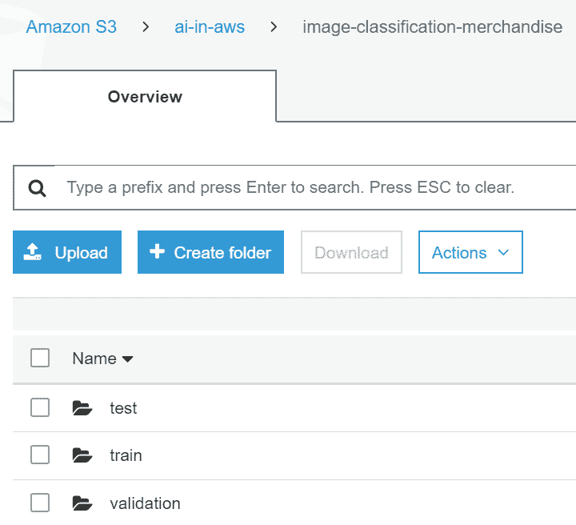
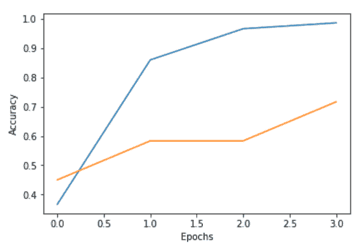
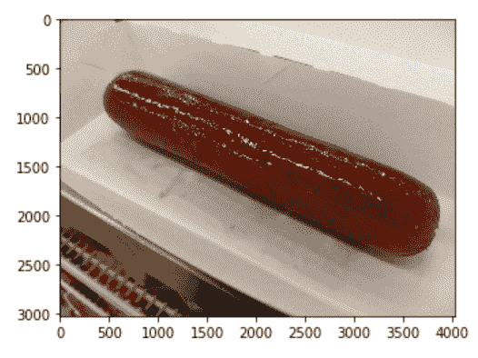
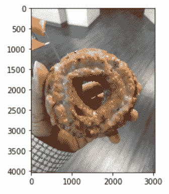
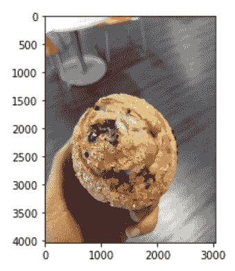
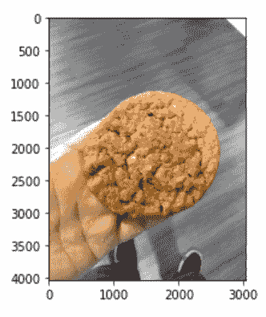

# 第十章：使用 Amazon SageMaker 进行图像分类

图像分类是过去五年中最重要的研究领域之一。这并不令人惊讶，因为成功地分类图像解决了许多不同行业的业务问题。例如，整个自动驾驶汽车行业依赖于图像分类和物体检测模型的准确性。

在本章中，我们将探讨 Amazon SageMaker 如何大大简化图像分类问题。除了收集丰富的图像集进行训练外，我们还将学习如何指定超参数（算法内部的参数）、训练 Docker 镜像，并使用基础设施规范进行训练。

在本章中，我们将讨论以下内容：

+   了解卷积神经网络和残差网络

+   通过迁移学习进行图像分类

+   通过批量变换对图像进行推断

# 技术要求

请使用以下链接查看本章的源代码：[`github.com/PacktPublishing/Hands-On-Artificial-Intelligence-on-Amazon-Web-Services`](https://github.com/PacktPublishing/Hands-On-Artificial-Intelligence-on-Amazon-Web-Services)。

# 了解卷积神经网络和残差网络

SageMaker 图像分类算法是 **残差网络**（**ResNets**）的实现。在深入了解算法的细节之前，让我们简要了解一下 **卷积神经网络**（**CNN**）和 ResNet，以及它们是如何从图像中学习模式的。

像其他神经网络一样，CNN 由输入层、隐藏层和输出层组成。这些网络有可学习的参数，称为权重和偏差。通过适当的优化器（例如 **随机梯度下降**（**SGD**））与反向传播，权重和偏差可以进行调整。然而，任何前馈人工神经网络与 CNN 之间的区别在于，CNN 中的隐藏层是卷积层。每个卷积层由一个或多个过滤器组成。这些过滤器的任务是识别输入图像中的模式。

这些过滤器可以具有不同的形状，范围从 1 x 1 到 3 x 3 等等，并且它们是以随机权重进行初始化的。当输入图像通过卷积层时，每个过滤器将滑过每个 3 x 3 像素块（以 3 x 3 过滤器为例），直到整个图像被覆盖。这种滑动被称为卷积。在卷积过程中，过滤器权重与 3 x 3 块中的像素值进行点积，从而学习图像的特征。CNN 的初始层学习基本的几何形状，如边缘和圆形，而后续层学习更复杂的物体，如眼睛、耳朵、羽毛、喙、猫和狗。

随着卷积神经网络的加深，随着我们堆叠更多层来学习复杂特征，消失梯度问题也随之而来。换句话说，在训练过程中，一些神经元会失效（不会激活），导致消失梯度问题。这种情况发生在激活函数接收到具有不同分布的输入时（例如，如果你将黑白猫的图像与彩色猫的图像传递给网络，输入的原始像素属于不同的分布，从而导致消失梯度问题）。如果我们将神经元输出限制在接近零的范围内，就能确保每一层都会将有效的梯度传递回前一层。

为了解决卷积神经网络带来的挑战，深度残差学习将前一层学到的内容与浅层模型学到的内容相结合：

**

这里，** 是一个卷积层或浅层模型，而  是前一层。

残差网络在解决卷积神经网络的挑战时，是一种进行图像分类时的最佳方法。在下一部分，我们将探讨迁移学习作为逐步训练已训练图像分类模型的一种方法。

# 通过迁移学习在 Amazon SageMaker 中对图像进行分类

图像分类的关键挑战之一是大型训练数据集的可用性。例如，为了创建类似 Amazon Go 的体验，电子商务零售商可能已经在大量图像上训练了他们的机器学习算法。当我们没有涵盖所有现实世界场景的图像时——这些场景包括一天中的时间（亮度）、目标物品周围的环境以及物品角度——我们就无法训练出在现实环境中表现良好的图像分类算法。此外，构建一个对当前数据集最优的卷积神经网络架构需要付出大量的努力。这些考虑因素从卷积层的数量到批处理大小，再到优化器和丢弃率，都需要进行反复试验和调整，才能得到一个最优的模型迭代。

因为图像分类需要大量的图像来训练卷积网络，当训练数据集较小时，可以采用另一种方法来对图像进行分类。迁移学习允许你将已经训练好的模型的知识应用于不同但相关的问题。我们可以重用一个经过百万张图像训练的预训练深度学习模型的权重，并通过新的/自定义的数据集对网络进行微调，这些数据集是针对我们业务案例特有的。通过迁移学习，低级几何特征，如边缘，已经能够被一个预训练的 ResNet-18（18 层网络）识别。然而，对于中级到高级特征学习，顶部的**全连接**（**FC**）层会被重新初始化为随机权重。然后，通过新数据对整个网络进行微调——随机权重通过将训练数据传入网络并使用优化技术（例如，带有反向传播的随机梯度下降）进行调整。

在本章中，我们将采用 SageMaker 的图像分类算法，以迁移学习模式对一些面包店和快餐项目进行分类。我们将使用 Amazon SageMaker 提供的预训练 ResNet-18。图像分类算法实现了 ResNet 来对图像进行分类。我们可以从头开始训练 ResNet，或者使用预训练的网络。由于我们有一个小的图像数据集来进行训练，我们将使用 Amazon SageMaker 提供的 18 层预训练 ResNet。我们还可以尝试使用 ResNet50，一个 50 层的残差网络，以确定哪个网络的性能更好。通常，深层网络比浅层网络表现更好，因为它们能够更好地表示图像。然而，考虑到输入图像的类型和复杂性，结果可能会有所不同。

我们的新数据集包含约 302 张图像，涵盖五个类别（热狗、莓果甜甜圈、糖霜扭结、松饼和花生酱饼干）。每个类别包含 40 到 90 张图像，涵盖不同的角度，以及亮度、对比度和尺寸。

图像分类器从一个预训练的 ResNet 中学习图像的低级特征，并通过使用新的数据集训练相同的 ResNet-18 来学习高级特征。以下是 SageMaker 的图像分类算法如何学习一只莓果甜甜圈的特征——低级、中级和高级——的示意图：



到目前为止，我们已经回顾了迁移学习是什么以及何时适用。我们还简要描述了将要提供给 SageMaker 图像分类算法的图像数据集。现在，来准备好图像数据集进行训练。

# 为图像分类创建输入

Amazon SageMaker 的图像分类算法通过两种内容类型接受文件模式下的图像，分别是：

+   RecordIO（application/`x-recordio`）

+   图像（image/`.png`、image/`.jpeg` 和 application/`x-image`）

在本章中，我们将使用 RecordIO 格式。**RecordIO** 是一种用于高效表示图像并以紧凑格式存储它们的二进制格式。训练和验证图像以压缩格式提供，作为本章相关源代码的一部分。

为了为我们的训练和验证数据集创建 RecordIO 文件，我们将执行以下操作：

+   提取 `.zip` 文件，包括训练和验证文件（通过 `extract_zipfile` 函数）

+   为训练和验证创建列表文件（通过 `create_listfile` 函数）

+   创建用于训练和验证的 Record IO 文件（通过 `create_recordio` 函数）

有关这些函数的定义，请参阅随附的源代码文件夹：

```py
# Extract training and validation zipped folders to merch_data/<train/val>

extract_zipfile(bucket, train_key, rel_train_path)
extract_zipfile(bucket, val_key, rel_val_path)

# Create List files (./merch_data)
create_listfile(rel_train_path, listfile_train_prefix) #data path, prefix path
create_listfile(rel_val_path, listfile_val_prefix)

# # Create RecordIO file
# data path --> prefix path (location of list file)
# mxnet's im2rec.py uses ./merch_data folder to locate .lst files for train and val
# mxnet's im2rec.py uses ./merch_data/<train/val> as data path
# list files are used to create recordio files

create_recordio(rel_train_path, listfile_train_prefix)
create_recordio(rel_val_path, listfile_val_prefix)
```

为了为训练和验证数据集创建 RecordIO 格式，我们需要创建一个列表文件，列出图像索引，后面跟着图像分类（注意我们有五类图像）和图像本身的位置。我们需要为训练和验证数据集中的每张图像定义这些属性。为了创建图像的列表文件，我们将使用 MXNet 的 **im2rec**（**图像转 RecordIO**）模块，MXNet 是一个用于训练和部署深度学习模型的开源深度学习库。

以下代码片段展示了如何使用 `im2rec` 模块创建列表文件。为了创建列表文件，`im2rec` 需要图像的位置：

```py
# Create List file for all images present in a directory

def create_listfile(data_path, prefix_path):
    """
    input: location of data -- path and prefix
    """

    # Obtain the path of im2rec.py on the current ec2 instance
    im2rec_path = mx.test_utils.get_im2rec_path()

    with open(os.devnull, 'wb') as devnull:
        subprocess.check_call(['python', im2rec_path, '--list', '--recursive', prefix_path, data_path], stdout=devnull) 
```

`create_listfile()` 函数产生如下输出。以下是示例列表文件的摘录：



从我们创建的列表文件中，我们通过 RecordIO 格式生成图像的压缩表示——同样使用 MXNet 的 im2rec 模块。

我们将上传前述的训练和验证数据集（`.rec` 文件）到 S3 存储桶。此外，我们还将把测试图像单独上传到测试文件夹，而不是上传到训练和验证图像文件夹。请参阅随附的源代码文件夹。以下截图显示了 S3 存储桶及相关数据集：



现在我们已经准备好了所有用于训练和推理的数据集，接下来我们准备定义图像分类算法的参数。

# 定义用于图像分类的超参数

在将模型拟合到训练和验证数据集之前，我们需要指定两类参数：

+   训练任务的参数

+   特定于算法的超参数

训练任务的参数处理输入和输出配置，包括要提供的基础设施类型。

为了训练任务配置，我们需要执行以下步骤：

1.  首先，我们需要定义图像分类的 Docker 镜像和训练输入模式（文件模式与管道模式。管道模式是 SageMaker 工具包中的新功能，数据输入会实时传送到算法容器中，无需在训练前下载）。

1.  接下来，我们定义训练输出的位置（`S3OutputPath`），以及要配置的 EC2 实例的数量和类型，以及超参数。

1.  接下来，我们指定*训练*和*验证*通道，这些通道将作为训练和验证数据的位置。至于分布式训练，目前该算法只支持`fullyreplicated`模式，其中数据会被复制到每台机器上。

以下超参数是算法特定的：

+   `num_layers`：网络的层数。在此示例中，我们将使用默认的 18 层。

+   `image_shape`：图像维度（*宽度 x 高度*）。

+   `num_training_samples`：训练数据点的总数。在我们的案例中，这个值为`302`。

+   `num_classes`：类别数。对于我们的数据集，这是 5。我们将对五个商品进行分类。

+   `mini_batch_size`：每个小批量使用的训练样本数。在单机多 GPU 设置中，每个 GPU 处理`mini_batch_size`/GPU 数量的样本。在分布式训练中，当涉及多个机器时，实际批量大小是`machines` * `mini_batch_size`。

+   `epochs`：训练分类算法所需的迭代次数。

+   `learning_rate`：这定义了反向传播时应该采取多大的步长以减少损失。在迁移学习的情况下，我们将采取较小的步长，以便可以逐步训练预训练的网络。

在以下代码中，我们定义了每个超参数的值：

```py
# The algorithm supports multiple network depth (number of layers). They are 18, 34, 50, 101, 152 and 200
# For this training, we will use 18 layers

num_layers = 18
image_shape = "3,224,224" # Number of channels for color image, Number of rows, and columns (blue, green and red)
num_training_samples = 302 # number of training samples in the training set
num_classes = 5 # specify the number of output classes
mini_batch_size = 60 # batch size for training
epochs = 4  # number of epochs
learning_rate = 0.01 #learning rate
top_k=2
# Since we are using transfer learning, we set use_pretrained_model to 1 so that weights can be initialized with pre-trained weights
use_pretrained_model = 1
```

现在是训练时间：我们将提供作为输入定义的*训练参数*，并将其传递给 SageMaker 的`create_training_job`方法。SageMaker 服务通过`boto3`调用，`boto3`是一个 Amazon Web Services 的 Python SDK。创建训练任务后，我们可以检查其状态。

使用以下代码在 SageMaker 中创建训练任务：

```py
# create the Amazon SageMaker training job
sagemaker = boto3.client(service_name='sagemaker')
sagemaker.create_training_job(**training_params)

# confirm that the training job has started
status = sagemaker.describe_training_job(TrainingJobName=job_name)['TrainingJobStatus']
print('Training job current status: {}'.format(status))

Output:
Training job current status: InProgress
Training job ended with status: Completed
```

现在，我们将绘制结果图来评估 ResNet-18 的训练和验证准确度。我们希望确保没有过拟合网络——即当训练准确度增加时，验证准确度下降的情况。让我们看一下以下的图表：



训练结果可以在 CloudWatch 日志中查看。上面的表示是训练期间，训练集和验证集准确度变化的可视化图。以下代码解释了上面图中蓝色和橙色线条的含义：

```py
Training: Blue Line -- trn_acc[0.366667, 0.86, 0.966667, 0.986667]

Validation: Orange Line -- val_acc[0.45, 0.583333, 0.583333, 0.716667] 
```

如我们所见，训练后的 ResNet 模型已从快餐和面包店图像中学习到了足够的模式。我们已将训练好的模型部署用于推理。

# 通过 Batch Transform 执行推理

在本节中，我们将以批量模式分类一些测试数据集中的图像。由于我们希望一次分类多张图片，因此我们将创建一个 Batch Transform 作业。请参阅第八章，*创建机器学习推理管道*，以了解何时以及如何使用 Batch Transform 作业。

在创建 Batch Transform 作业之前，我们需要配置训练好的模型。

在以下代码片段中，我们将执行以下操作：

1.  我们将通过调用 SageMaker 服务的 `create_model()` 函数来创建一个训练好的模型（`boto3`，即 AWS Python SDK，用于配置与 SageMaker 服务的低级接口）。

1.  我们将把图像分类算法的 Docker 镜像和训练好的模型路径传递给这个函数：

```py
info = sage.describe_training_job(TrainingJobName=job_name)
# Get S3 location of the model artifacts
model_data = info['ModelArtifacts']['S3ModelArtifacts']
print(model_data)
# Get the docker image of image classification algorithm
hosting_image = get_image_uri(boto3.Session().region_name, 'image-classification')
primary_container = {
    'Image': hosting_image,
    'ModelDataUrl': model_data,
}
# Create model 
create_model_response = sage.create_model(
    ModelName = model_name,
    ExecutionRoleArn = role,
    PrimaryContainer = primary_container)
print(create_model_response['ModelArn'])
```

1.  现在训练好的模型已配置完成，我们需要创建一个 Batch Transform 作业。

我们将指定转换输入、输出和资源来配置 Batch Transform 作业。以下是定义：

+   +   转换输入定义了图像的位置和格式。

    +   转换输出定义了推理结果的位置。

    +   转换资源定义了要配置的实例数量和类型。

在以下代码片段中，我们通过将作业规格作为 `request` JSON 文件的一部分传递，调用 SageMaker 服务的 `create_transform_job` 函数：

```py
sagemaker = boto3.client('sagemaker')
sagemaker.create_transform_job(**request)

print("Created Transform job with name: ", batch_job_name)

while(True):
    response = sagemaker.describe_transform_job(TransformJobName=batch_job_name)
    status = response['TransformJobStatus']
    if status == 'Completed':
        print("Transform job ended with status: " + status)
        break
    if status == 'Failed':
        message = response['FailureReason']
        print('Transform failed with the following error: {}'.format(message))
        raise Exception('Transform job failed') 
    time.sleep(30) 
```

1.  在之前的代码中，我们使用了 SageMaker 服务的 `describe_transform_job()` 函数来获取 Batch Transform 作业的状态。前面的代码将返回以下消息：

```py
Created Transform job with name: merch-classification-model-2019-03-13-11-59-13
Transform job ended with status: Completed
```

现在是回顾结果的时候了。让我们导航到 S3 存储桶中的 Batch Transform 输出和测试数据集文件夹，以查看结果。对于测试数据集中的每张图片，我们将打印其最高分类概率，也就是训练好的模型将输入图像分类为：

1.  测试数据集中的第一张图片是一只热狗，如下图所示。训练好的模型以 92% 的概率识别这只热狗。

以下是预测结果，即标签：`Hot_Dog_1`，概率：`0.92`：



1.  第二张图片是一只浆果甜甜圈，如下图所示。训练好的模型以 99% 的概率识别这张截图为浆果甜甜圈：



1.  第三张图片是一个松饼，如下图所示。训练好的模型以 66% 的概率将以下截图识别为松饼：



1.  然而，在第四张图片的情况下，训练好的模型并未正确识别图像。虽然实际图像是花生酱饼干，但模型将其误识别为松饼。这里有一个有趣的地方是，这个饼干看起来像松饼：



正如我们所见，在四张图像中，有三张被正确分类。为了提高模型的准确性，我们可以考虑调整超参数并收集大量的快餐和烘焙食品图像。因此，迁移学习被用来通过使用特定应用场景的图像来逐步训练预训练的图像分类模型。

# 总结

在本章中，我们回顾了卷积神经网络和残差网络的概述。此外，我们还展示了如何使用 SageMaker 的图像分类算法来识别快餐和烘焙食品图像。具体来说，我们回顾了训练图像分类算法的过程，包括为其提供基础设施；创建用于训练和验证数据集的压缩图像格式（RecordIO）；以及提供格式化数据集以进行模型拟合。在推理方面，我们使用了 SageMaker 的批量转换功能，一次性对多个图像进行分类。

最重要的是，我们学会了如何将迁移学习应用于图像分类。这种技术在你没有大量训练数据的情况下尤为强大。

在下一章，你将学习如何使用 SageMaker 的 DeepAR 算法预测零售销售——这是深度学习应用于解决真实商业挑战的另一个案例。

# 进一步阅读

+   **SageMaker 中的 MXNet 估算器**：[`medium.com/devseed/use-label-maker-and-amazon-sagemaker-to-automatically-map-buildings-in-vietnam-a63090fb399f`](https://medium.com/devseed/use-label-maker-and-amazon-sagemaker-to-automatically-map-buildings-in-vietnam-a63090fb399f)

+   **梯度消失**：[`towardsdatascience.com/intuit-and-implement-batch-normalization-c05480333c5b`](https://towardsdatascience.com/intuit-and-implement-batch-normalization-c05480333c5b)

+   **AWS SageMaker 实验室**：[`github.com/awslabs/amazon-sagemaker-examples`](https://github.com/awslabs/amazon-sagemaker-examples)
