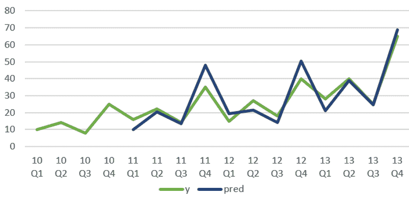

# 第十一章：使用深度学习和自回归进行销售预测

需求预测是许多行业的关键，如航空公司、零售、电信和医疗保健。不准确和不精确的需求预测会导致错失销售和客户，显著影响组织的底线。零售商面临的一个主要挑战是如何有效地管理基于多种内部和外部因素的库存。库存管理是一个复杂的商业问题——产品需求会根据地点、天气、促销活动、节假日、星期几、特殊事件以及其他外部因素（如门店人口统计数据、消费者信心和失业率）发生变化。

在本章中，我们将研究传统的时间序列预测技术（如 ARIMA 和指数平滑）与基于神经网络的技术有何不同。我们还将讨论 DeepAR 如何工作，并探讨其模型架构。

以下是本章将要涵盖的主题：

+   理解传统时间序列预测

+   理解 DeepAR 模型的工作原理

+   通过 DeepAR 理解模型销售

+   销售预测与评估

# 技术要求

在接下来的部分中，我们将使用[零售](https://www.kaggle.com/manjeetsingh/retaildataset)数据集，其中包含约 45 家门店的销售数据，来说明 DeepAR 如何根据假期、促销和宏观经济指标（如失业率）等多个因素预测未来销售。

在与本章相关的[文件夹](https://github.com/PacktPublishing/Hands-On-Artificial-Intelligence-on-Amazon-Web-Services)中，您将找到三个 CSV 文件：

+   **特征数据集**：此数据集包含与门店相关的区域活动数据。

+   **销售数据集**：此数据集包含 2010 年至 2012 年间的历史销售数据，覆盖了 143 周。

+   **门店数据集**：此数据集包含关于 45 家门店的匿名化信息，包括门店类型和大小。

请参考以下 GitHub 链接获取本章的源代码：

[`github.com/PacktPublishing/Hands-On-Artificial-Intelligence-on-Amazon-Web-Services`](https://github.com/PacktPublishing/Hands-On-Artificial-Intelligence-on-Amazon-Web-Services)

现在是时候理解传统的时间序列预测技术了。

# 理解传统时间序列预测

让我们从研究传统的时间序列预测技术开始，具体来说是 ARIMA 和指数平滑方法，以便在简单的使用案例中建模需求。我们将研究 ARIMA 如何利用历史销售数据和预测误差来估算销售。此外，我们还将回顾指数平滑如何处理历史销售数据中的不规则性，并捕捉趋势和季节性变化来预测销售。

# 自回归积分滑动平均（ARIMA）

ARIMA 是一种时间序列分析技术，用于捕捉单变量数据中的不同时间结构。为了对时间序列数据建模，对数据进行差分处理，使其平稳。差分技术是指对每个数据点（不包括第一个数据点），用当前数据点减去前一个数据点。此技术使得时间序列的概率分布的均值和方差在时间上保持不变，从而使得未来值的预测更加可靠。使用特定数量的滞后预测和预测误差来建模时间序列。该数量会通过迭代调整，直到残差与目标（销售预测）不相关，或者数据中的所有信号都已被捕捉。

让我们解析 ARIMA，看看其基本组成部分——自回归、差分和移动平均：

+   **自回归项的数量**：这些项建立了特定数量历史数据点与当前数据点之间的关系，也就是说，它利用历史需求来估算当前需求。

+   **非季节性差分的数量**：这些通过差分使时间序列数据变得平稳。我们假设，如果过去几次时间步长中的需求差异非常小，未来的需求将与历史需求相似。

+   **移动平均项的数量（滞后预测误差）**：这些项考虑了预测误差——实际需求与预测需求之间的差异——或者特定数量的历史数据点。

让我们看一下 ARIMA 方程，既有文字描述也有数学表达形式：

*需求预测 = 常数项 + 自回归项 + 滚动平均项*


这里是 ARIMA 工作原理的可视化表示：


在 ARIMA 模型中，AR 项为正，而 MA 项为负；换句话说，自回归项对需求产生正面影响，而滞后误差的移动平均则对需求产生负面影响。

# 指数平滑

ARIMA 的另一种替代方法是指数平滑技术，这也是一种用于单变量数据的时间序列预测方法，其中忽略了随机噪声，揭示了潜在的时间结构。尽管它与 ARIMA 类似，都是将过去的观测值加权求和来进行需求预测，但加权应用的方法不同——它并不是对过去的观测值赋予相等的权重，而是对滞后的观测值应用指数衰减的权重。换句话说，最近的观测值比历史数据更为相关。指数平滑用于进行短期预测，我们假设未来的模式和趋势将与当前的模式和趋势相似。

以下是三种类型的指数平滑方法：

+   **单一指数平滑**：顾名思义，这种技术不考虑季节性或趋势。它需要一个单一参数，alpha ()，来控制平滑程度。低 alpha 表示数据中没有不规则性，意味着最新的观察值被赋予较低的权重。

+   **双重指数平滑**：这种技术支持单变量序列中的趋势。除了控制最近观察值与历史观察值之间的重要性外，还使用一个额外的因子来控制趋势对需求预测的影响。趋势可以是乘法型的也可以是加法型的，并通过平滑因子  来控制。

+   **三重指数平滑**：此方法支持季节性。另一个新参数，gamma ()，用于控制季节性因素对需求预测的影响。

下图展示了不同类型的指数平滑方法之间的区别：


在上面的图示中，我们可以看到以下内容：

+   通过单一指数平滑预测在时刻 *t* 的需求，基于时刻 *t-1* 处的估计需求和预测误差（实际需求—估计需求）。

+   在双重指数平滑的情况下，需求通过捕捉趋势和历史数据来进行预测。我们在这里使用两个平滑因子，数据和平滑趋势（以下是双重指数平滑如何捕捉趋势的可视化图示）：


+   对于三重指数平滑，我们还通过一个名为季节性平滑因子的第三个平滑因子来考虑季节性。请参见下图，它展示了季节性高峰和低谷，以及趋势：



这种方法的问题在于它将过去的销售数据视为未来销售的指标。此外，这些方法都是针对单一时间序列的预测技术。正如前面所详细说明的那样，可能会有其他因素影响当前和未来的销售情况，如天气、促销、星期几、节假日和特殊事件。

让我们来看一下如何利用 SageMaker 的 DeepAR 模型来建模多变量时间序列，定义输出变量（需求）与输入变量（包括历史销售数据、促销、天气和一天中的时间）之间的非线性关系。

# DeepAR 模型是如何工作的

Sagemaker 提供的 DeepAR 算法是一个通用的深度学习模型，能够学习多个相关时间序列中的需求。与传统的预测方法不同，传统方法是针对单个时间序列进行建模，而 DeepAR 则可以建模成千上万甚至百万个相关时间序列。

例如，在数据中心预测服务器负载，或预测零售商提供的所有产品的需求，或预测各个家庭的能源消耗。该方法的独特之处在于，能够利用大量关于类似或相关时间序列的过去行为数据来预测单个时间序列。这种方法解决了传统技术所面临的过拟合问题，以及所需的时间和劳动密集型的手动特征工程和模型选择步骤。

DeepAR 是一种基于自回归神经网络的预测方法，它通过数据集中所有时间序列的历史数据学习全局模型。DeepAR 使用**长短期记忆**（**LSTM**），一种**递归神经网络**（**RNN**），来建模时间序列。RNN 的主要思想是捕捉顺序信息。与普通神经网络不同，输入（和输出）是相互依赖的。因此，RNN 具有记忆功能，能够捕捉到迄今为止所估算的信息。以下是展开的 RNN 示意图——为了记住已学习的信息，在每一步中，隐藏状态的计算不仅基于当前输入，还基于先前的隐藏状态：

*递归神经网络和随着时间步展开的顺序学习示意图。来源：Nature；图片来源* *[WildML](http://www.wildml.com/2015/09/recurrent-neural-networks-tutorial-part-1-introduction-to-rnns/)*[.](http://www.wildml.com/2015/09/recurrent-neural-networks-tutorial-part-1-introduction-to-rnns/)

让我们更详细地解释一下：

+   在时间*t*时输入。

+   **![]**是在时间*t*时的隐藏状态。这个状态是基于之前的隐藏状态和当前输入计算得出的，在![]中，*f*是激活函数。

+   *![]*是在时间*t*时的输出，![]。激活函数，*f*，根据具体应用可能有所不同。例如，当我们需要预测输入属于哪个类别时，会使用 softmax 激活函数——换句话说，是否检测到的图像是一只猫、一只狗还是一只长颈鹿。

+   网络权重，*U*，*V*，和*W*，在所有时间步中保持不变。

RNN 在不同领域有着有趣的应用，举例如下：

+   **自然语言处理**：从生成图像描述到生成文本，再到机器翻译，RNN 可以作为生成模型。

+   **自动驾驶汽车**：它们用于进行动态面部分析。

+   **时间序列**：RNN 广泛应用于计量经济学（金融和趋势监测）和需求预测。

然而，普通的 RNN 由于最近数据和较老数据之间的间隙，无法学习长期依赖关系。而 LSTM 则可以解决这个问题：LSTM 的内层单元通过特殊的结构——**门控**（输入、遗忘和输出）——能够不变地携带信息。通过这些单元，LSTM 可以控制保留或删除的信息。

现在让我们看看 DeepAR 的模型架构，即 LSTM 网络。

# 模型架构

DeepAR 算法采用 LSTM 网络和概率模型来识别时间序列数据中的非线性结构，并提供预测的概率估计。

该模型是自回归的，它将上一个时间步的观察值作为输入。它也是递归的，因为它在下一个时间步使用网络的先前输出作为输入。在训练阶段，网络在每个时间步的隐藏状态或编码状态是基于当前协变量、先前的观察值和先前的网络输出计算的。然后，隐藏状态用于计算概率模型的参数，以描述时间序列的行为（例如，产品需求）。

换句话说，我们假设需求是一个随机变量，服从特定的概率分布。一旦我们有了可以通过一组参数（如均值和方差）定义的概率模型，就可以用来估计预测值。DeepAR 使用 Adam 优化器——一种随机梯度下降算法——来优化给定高斯模型参数的训练数据的最大对数似然性。通过这种方法，我们可以推导（优化）概率模型参数和 LSTM 参数，以准确估计预测。

以下图示展示了 DeepAR 算法的工作原理：


如上图所示，**最大似然估计**（**MLE**）用于估计两组参数，前提是输入数据集中的所有时间序列都已给出：

+   **RNN 的参数**：这些参数或 RNN 网络的隐藏状态用于计算高斯参数。

+   **高斯模型的参数**：高斯参数用于提供预测的概率估计。

MLE 是通过利用所有时间序列的数据计算的，*i*，其中*i*从 1 到*N*，也就是说，可能有*N*个不同的产品，其需求是你试图估计的。*T*表示时间序列的长度。

有关最大似然估计（MLE）的更多信息，请参阅这篇[文章](https://www.analyticsvidhya.com/blog/2018/07/introductory-guide-maximum-likelihood-estimation-case-study-r/)。

# 到达最佳网络权重

时间序列或观测数据作为训练的一部分输入 DeepAR。在每个时间步，当前的协变量、先前的观测值以及先前的网络输出都会被使用。该模型使用**时间反向传播**（**BPTT**）在每次迭代后计算梯度下降。特别地，Adam 优化器被用来进行 BPTT。通过随机梯度下降算法 Adam，我们通过反向传播得到了最优的网络权重。

在每个时间步*t*，网络的输入包括协变量，；上一个时间步的目标，；以及上一个网络输出，。然后，网络输出，，用于计算高斯参数，以最大化观察输入数据集的概率。

以下视觉图示说明了序列到序列的学习过程，其中编码器将历史时间序列中的需求模式进行封装，并将相同的数据（）作为输入传递给解码器。解码器的功能是根据来自编码器的输入来预测需求：

*来源：使用自回归递归网络的概率预测（**[link](https://arxiv.org/abs/1704.04110)**）*

对于预测，将时间序列的历史数据，，输入到预测范围中，之后在预测范围内，采样并反馈至下一点，直到预测范围结束，。

DeepAR 通过联合学习所有时间序列的历史行为，产生精确的预测分布。此外，概率预测在不确定性下提供最优决策，而非点估计。

# 通过 DeepAR 理解模型销售

如本章介绍所述，零售商的库存管理是一项复杂的活动。节假日、特殊事件和降价促销会对商店的表现产生重大影响，进而影响商店内部各个部门的表现。

Kaggle [数据集](https://www.kaggle.com/manjeetsingh/retaildataset)包含 45 家商店的历史销售数据，每个商店属于特定类型（位置和表现）和规模。零售商全年进行几次促销降价。这些降价活动通常发生在节假日之前，如超级碗、劳动节、感恩节和圣诞节。

# 数据集简要描述

让我们简要考虑一下我们即将建模的数据集：

+   **特征数据：**这是与商店相关的区域活动数据：

    +   **商店**：每个商店的数字化商店 ID。

    +   **Date**: 商店的重要日期。

    +   **Fuel price**: 当前燃油价格。

    +   **Markdowns**: 在零售商店中，你从原始标价中获得的商品折扣。

    +   **CPI**（**消费者物价指数**）：衡量一篮子消费品和服务（如交通、食品和医疗）的加权平均价格的指数。

    +   **Unemployment**: 当前失业率。

    +   **IsHoliday**: 特定日期是否为假期。

+   **Sales data**: 这是覆盖 2010 年到 2012 年三年的历史销售数据，共 143 周的销售数据：

    +   **Store**: 每个商店的数字化商店 ID。

    +   **Dept**: 每个部门的数字化部门 ID。

    +   **Date**: 商店的重要日期。

    +   **Weekly sales**: 每周销售额，用于衡量每个商店的销售表现。

    +   **IsHoliday**: 特定日期是否为假期。

+   **Store data**: 这是 45 个商店的匿名信息，包括商店的类型和规模：

    +   **Store**: 每个商店的数字化商店 ID。

    +   **Type**: 商店的类型。

    +   **Size**: 商店的规模。

+   **Model Input and Output**: 现在让我们来看一下输入和输出格式，包括 SageMaker DeepAR 算法的超参数。

算法有两个输入通道，并通过这两个通道输入训练和测试 JSON。训练 JSON 仅包含 134 周的销售数据，而测试 JSON 包含全部 143 周的销售数据。

以下是训练 JSON 的结构：

```py
Training JSON {
Start: The starting date of weekly sales
Target: Weekly sales
Cat: Category or Department used to group sales
Dynamic_feat: Dynamic features used to explain variation in sales. Beyond holidays, these features can include price, promotion and other covariates.
}
{"start":"2010-01-01 00:00:00","target":[19145.49, 17743.27, 14700.85, 20092.86, 17884.43, 19269.09, 22988.12, 17679.72, 16876.61, 14539.77, 16026.23, 14249.85, 15474.07, 22464.57, 19075.56, 20999.38, 18139.89, 13496.23, 15361.65, 16164.48, 15039.44, 14077.75, 16733.58, 16552.23, 17393.2, 16608.36, 21183.71, 16089.01, 18076.54, 19378.51, 15001.62, 14691.15, 19127.39, 17968.37, 20380.96, 29874.28, 19240.27, 17462.27, 17327.15, 16313.51, 20978.94, 28561.95, 19232.34, 20396.46, 21052.61, 30278.47, 47913.44, 17054.1, 15355.95, 15704.19, 15193.36, 14040.86, 13720.49, 17758.99, 24013.25, 24157.54, 22574.19, 12911.72, 20266.06, 18102.13, 21749.04, 22252.73, 21672.82, 15231.31, 16781.35, 14919.64, 15948.11, 17263.32, 16859.26, 13326.75, 17929.47, 15888.17, 13827.35, 16180.46, 22720.76, 15347.18, 15089.43, 14016.56, 17147.61, 14301.9, 16951.62, 16623.8, 19349.35, 24535.59, 18402.46, 19320.64, 20048.28, 14622.65, 19402.27, 19657.79, 18587.11, 20878.24, 19686.7, 23664.29, 20825.85, 27059.08, 15693.12, 29177.6, 45362.67, 20011.27, 13499.62, 15187.32, 16988.52, 14707.59, 20127.86, 23249.25, 20804.15, 19921.62, 16096.04, 18055.34, 17727.24, 16478.45, 16117.33, 15082.89, 15050.07, 17302.59, 20399.83, 17484.31, 14056.35, 16979.18, 17279.4, 14494.48, 14661.37, 13979.33, 13476.7, 18898.57, 13740.2, 15684.97, 15266.29, 16321.69, 15728.07, 17429.51, 17514.05, 20629.24], 
"cat":[15], "dynamic_feat":[[0, 0, 0, 0, 0, 0, 0, 0, 0, 0, 0, 0, 0, 0, 0, 0, 0, 0, 0, 0, 0, 0, 0, 0, 0, 0, 0, 0, 0, 0, 0, 0, 0, 0, 1, 0, 0, 0, 0, 0, 0, 1, 1, 0, 0, 0, 0, 1, 0, 0, 0, 0, 0, 0, 0, 0, 0, 0, 0, 0, 0, 0, 0, 0, 0, 0, 0, 0, 0, 0, 0, 0, 0, 0, 0, 0, 0, 0, 0, 0, 0, 0, 1, 0, 0, 0, 0, 0, 0, 0, 0, 1, 0, 0, 0, 1, 0, 0, 0, 1, 0, 0, 0, 0, 0, 0, 0, 0, 0, 0, 0, 0, 0, 0, 0, 0, 0, 0, 0, 0, 0, 0, 0, 0, 0, 1, 0, 0, 0, 0, 0, 0, 0, 0, 0, 0, 0, 1, 0, 0, 0, 0, 0]]}
```

在上面的结构中，我们可以看到以下内容：

+   `start`: 每周销售的开始日期。

+   `target`: 用于排序后的每周销售数据。

+   `cat`: 用于分组时间序列的类别。

+   `Dynamic_feat`: 包括动态特征，用于考虑影响销售的因素，如假期。

测试 JSON 的格式与训练 JSON 相同。我们来看看以下代码：

```py
Test JSON {"start":"2010-01-01 00:00:00","target":[19145.49, 17743.27, 14700.85, 20092.86, 17884.43, 19269.09, 22988.12, 17679.72, 16876.61, 14539.77, 16026.23, 14249.85, 15474.07, 22464.57, 19075.56, 20999.38, 18139.89, 13496.23, 15361.65, 16164.48, 15039.44, 14077.75, 16733.58, 16552.23, 17393.2, 16608.36, 21183.71, 16089.01, 18076.54, 19378.51, 15001.62, 14691.15, 19127.39, 17968.37, 20380.96, 29874.28, 19240.27, 17462.27, 17327.15, 16313.51, 20978.94, 28561.95, 19232.34, 20396.46, 21052.61, 30278.47, 47913.44, 17054.1, 15355.95, 15704.19, 15193.36, 14040.86, 13720.49, 17758.99, 24013.25, 24157.54, 22574.19, 12911.72, 20266.06, 18102.13, 21749.04, 22252.73, 21672.82, 15231.31, 16781.35, 14919.64, 15948.11, 17263.32, 16859.26, 13326.75, 17929.47, 15888.17, 13827.35, 16180.46, 22720.76, 15347.18, 15089.43, 14016.56, 17147.61, 14301.9, 16951.62, 16623.8, 19349.35, 24535.59, 18402.46, 19320.64, 20048.28, 14622.65, 19402.27, 19657.79, 18587.11, 20878.24, 19686.7, 23664.29, 20825.85, 27059.08, 15693.12, 29177.6, 45362.67, 20011.27, 13499.62, 15187.32, 16988.52, 14707.59, 20127.86, 23249.25, 20804.15, 19921.62, 16096.04, 18055.34, 17727.24, 16478.45, 16117.33, 15082.89, 15050.07, 17302.59, 20399.83, 17484.31, 14056.35, 16979.18, 17279.4, 14494.48, 14661.37, 13979.33, 13476.7, 18898.57, 13740.2, 15684.97, 15266.29, 16321.69, 15728.07, 17429.51, 17514.05, 20629.24, 17730.73, 18966.48, 20781.46, 22979.73, 16402.34, 20037.44, 18535.65, 16809.01, 19275.43], "cat":[15], "dynamic_feat":[[0, 0, 0, 0, 0, 0, 0, 0, 0, 0, 0, 0, 0, 0, 0, 0, 0, 0, 0, 0, 0, 0, 0, 0, 0, 0, 0, 0, 0, 0, 0, 0, 0, 0, 1, 0, 0, 0, 0, 0, 0, 1, 1, 0, 0, 0, 0, 1, 0, 0, 0, 0, 0, 0, 0, 0, 0, 0, 0, 0, 0, 0, 0, 0, 0, 0, 0, 0, 0, 0, 0, 0, 0, 0, 0, 0, 0, 0, 0, 0, 0, 0, 1, 0, 0, 0, 0, 0, 0, 0, 0, 1, 0, 0, 0, 1, 0, 0, 0, 1, 0, 0, 0, 0, 0, 0, 0, 0, 0, 0, 0, 0, 0, 0, 0, 0, 0, 0, 0, 0, 0, 0, 0, 0, 0, 1, 0, 0, 0, 0, 0, 0, 0, 0, 0, 0, 0, 1, 0, 0, 0, 0, 0]]
```

DeepAR 支持一系列超参数。以下是一些关键超参数的列表。详细列表请参阅亚马逊文档[这里](https://docs.aws.amazon.com/sagemaker/latest/dg/deepar_hyperparameters.html)：

+   **Time frequency**: 表示时间序列是按小时、按周、按月还是按年进行的。

+   **Context length**: 算法在训练时需要查看的过去时间步长数量。

+   **Prediction length**: 需要预测的数据点数量。

+   **Number of cells**: 每个隐藏层中使用的神经元数量。

+   **Number of layers**: 隐藏层的数量。

+   **Likelihood function**: 由于每周销售额是实际值，我们将选择高斯模型。

+   **epochs**: 训练数据的最大遍历次数。

+   **Mini batch size**: 训练过程中使用的小批量的大小。

+   **Learning rate**: 损失优化的速度。

+   **Dropout rate**: 每次迭代中未更新的隐藏神经元的百分比。

+   **提前停止耐心值**：当指定数量的训练周期（那些损失未改进的周期）没有取得改进时，训练将停止。

+   **推理**：对于给定的部门，我们发送了 134 周的历史销售数据，以及该部门类别和假期标志，涵盖了所有的周。

以下是来自模型端点的示例 JSON 输出。由于 DeepAR 生成概率预测，输出包含来自高斯分布的多个销售样本。这些样本的均值和分位数（50%和 90%）也会被报告，如下所示：

```py
{
   "predictions": [
       {
           "quantiles": { 
               "0.9": [...],
               "0.5": [...]
           },
           "samples": [...],
           "mean": [...]
       }
   ]
}
```

我们刚刚回顾了 DeepAR 算法对于具有历史每周销售数据的商品的输入和输出示例。

DeepAR 还提供了独特的功能，能够处理现实世界时间序列问题中的复杂性。对于新商品或产品，时间序列的长度将短于具有完整销售历史的常规商品。DeepAR 能够捕捉新商品或产品首次观察的距离。由于该算法在多个时间序列中学习商品需求，它甚至可以估计新推出商品的需求——所有时间序列中的每周销售长度不需要保持一致。此外，算法还能够处理缺失值，缺失值将被替换为“Nan”。

以下截图是 DeepAR 输入和输出多样性的可视化表示：


如前所示，通过对所有新商品（年龄）和常规商品进行建模，可以生成每周销售的概率预测（销售时间序列），同时输入商品类别（商品嵌入）和其他特征（价格和促销）。

# 探索性数据分析

尽管有 45 家商店，但我们将选择其中一家商店，即商店编号 20，来分析三年来不同部门的业绩。这里的主要思想是，使用 DeepAR，我们可以学习不同部门商品的销售情况。

在 SageMaker 中，通过生命周期配置，我们可以在笔记本实例启动之前自定义安装 Python 包。这避免了在执行笔记本之前手动追踪所需的包。

为了探索零售销售数据，我们需要安装最新版本 0.9.0 的`seaborn`。

在 SageMaker 中，点击笔记本下的生命周期配置：

1.  在开始笔记本下，输入命令以升级`seaborn` Python 包，如下所示：


1.  通过点击笔记本实例，选择操作，然后选择更新设置，编辑笔记本设置。

1.  在“更新设置”生命周期配置部分下，选择新创建的生命周期配置的名称。

该选项使 SageMaker 能够在笔记本实例可用之前管理所有 Python 的前置条件，如下所示：


让我们合并销售、商店和特征的 CSV 文件数据：

1.  我们将导入关键的 Python 库，如下所示：

```py
import numpy #library to compute linear algebraic equations
import pandas as pd
import matplotlib.pyplot as plt
import seaborn as sns
```

1.  让我们将`.csv`文件读取到 Python 数据框中，如下所示：

```py
features = pd.read_csv('Features data set.csv')
sales = pd.read_csv('sales data-set.csv')
stores = pd.read_csv('stores data-set.csv')
```

1.  让我们看一下每个创建的数据框的形状，如下所示：

```py
features.shape #There are 8,190 store, date and holiday combinations
sales.shape #There are 421,570 sales transactions
stores.shape #There are 45 stores in question
```

1.  现在，合并`features`数据框与`sales`和`stores`，创建一个包含所有所需信息的数据框，如下所示：

```py
merged_df = features.merge(sales, on=['Store', 'Date', 'IsHoliday']).merge(stores, on=['Store'])
merged_df.head()
```

1.  将`IsHoliday`转换为数值型，并将`Date`字段转换为`pandas`日期格式，如下所示：

```py
merged_df = features.merge(sales, on=['Store', 'Date', 'IsHoliday']).merge(stores, on=['Store'])
merged_df.head()
```

1.  使用以下代码将合并后的数据集写入`.csv`文件：

```py
merged_df.to_csv('retailsales.csv')
```

1.  现在，让我们看看可能影响销售额的每个关键因素（`Temperature`、`Fuel_Price`、`Unemployment`和`CPI`）的分布情况，如下所示：

```py
#Create a figure and a set of subplots
f, ax = plt.subplots(4, figsize=(15, 15)) #f=figure; ax=axes
sns.distplot(merged_df.Temperature, ax=ax[0])
sns.distplot(merged_df.Fuel_Price, ax=ax[1])
sns.distplot(merged_df.Unemployment, ax=ax[2])
sns.distplot(merged_df.CPI, ax=ax[3])
```

我们使用`seaborn` Python 库绘制数据集中`Temperature`、`Fuel_Price`、`Unemployment`和`CPI`的分布情况。让我们看看以下输出：


从前面的分布可以看出，销售发生时的温度大多在 60 到 80 度之间。同时，在大多数销售活动期间，燃油价格大约在$2.75 到$3.75 之间：


从前面的可视化中可以看出，在大多数销售活动期间，失业率在 6%到 9%之间。至于 CPI，销售活动发生在低 CPI 和高 CPI 水平下。

现在我们已经查看了每个关键特征的分布，接下来让我们看看它们与每周销售额的相关性：

1.  首先，让我们看一下销售额（目标）与每个解释变量之间的散点图——`Holidays`、`Temperature`、`CPI`、`Unemployment`和`Store Type`：

```py
f, ax = plt.subplots(6, figsize=(20,20))
sns.scatterplot(x="Fuel_Price", y="Weekly_Sales", data=merged_df, ax=ax[0])
sns.scatterplot(x="Temperature", y="Weekly_Sales", data=merged_df, ax=ax[1])

```

在前面的代码中，我们绘制了销售额与燃油价格和销售额与温度之间的散点图。让我们分析一下燃油价格和温度如何与销售额相关：


1.  从前面的可视化中可以明显看出，燃油价格在$3.25 到$3.75 之间时，每周销售额较高。而温度在 50 到 65 度之间时，每周销售额较高。

现在，让我们将假期与否和 CPI 与销售额进行绘图，如以下代码所示：

```py
sns.scatterplot(x="IsHoliday", y="Weekly_Sales", data=merged_df, ax=ax[2])
sns.scatterplot(x="CPI", y="Weekly_Sales", data=merged_df, ax=ax[3])
```

让我们看一下假期与否以及 CPI 如何影响销售额，如下截图所示：


1.  看起来假期销售额高于非假期销售额。同时，CPI 对每周销售额似乎没有明显的影响。

现在，让我们将`Unemployment`和`Store Type`与销售额进行绘图，如以下代码所示：

```py
sns.scatterplot(x="Unemployment", y="Weekly_Sales", data=merged_df, ax=ax[4])
sns.scatterplot(x="Type", y="Weekly_Sales", data=merged_df, ax=ax[5])
```

让我们看看销售额如何随着失业率和商店类型的变化而变化，如下截图所示：


从前面的可视化中可以看出，当失业率较低（7 到 8.5 之间）时，每周销售额较高，而 B 类型商店的每周销售额似乎较高。

1.  其次，让我们查看所有特征的热图，找出哪些特征会影响销售额。我们将绘制一个热图，查看销售额与多个销售预测因子之间的相关性。

以下截图是数据集中数值属性的热图——我们从数据集中删除了商店和部门字段，因为它们是分类变量：


从散点图和热图中，可以明显看出以下几点：

+   Markdown 格式的文本会出现在节假日期间。

+   节假日期间销售额较高。

+   B 类商店产生更高的销售额。

+   更低的燃油价格（在$3 到$3.75 之间）会带来更高的销售额。

+   理想的温度（在 50 到 65 度之间）会带来更高的销售额。

在我们进一步建模的过程中，我们将选择表现最好的商店——商店 20，来建模不同部门和不同年份的销售情况。对于时间序列中的每个时间步，我们还将传递该日期是否为假期的标识。

# 数据预处理

让我们从准备建模所需的数据集开始：

+   创建一个名为 `retailsales.py` 的模块，用于创建 DeepAR 可以用于训练和验证的 JSON 文件。

+   创建一个名为 `salesinference.py` 的模块，用于构建推理数据并获取和绘制预测结果。

有关模块的详细信息，请参阅本章相关的源代码。

为了将代码模块化以测试 DeepAR，我们将把 `retailsales` 和 `salesinference` 两个模块打包。为了打包这些模块，我们将创建 `__init__.py` 文件来导入这些模块，然后创建 `setup.py` 文件，详细说明需要安装的先决条件包。

接下来是 DeepAR 项目的文件夹结构：

```py
DeepAR project structure.
Project Organization
------------
    ├── notebooks/            <- All notebooks are residing here.
    ├── data/                 <- Input data is residing here
    ├── deepar/               <- Python package with source code of this project.
      ├──retailsales.py       <- Creating training and testing datasets for DeepAR.
      ├──salesinference.py    <- Preparing data for predictions, obtaining and plotting predictions from DeepAR
    ├── README.md             <- The top-level README for developers using this project.
    ├── setup.py              <- Defines pre-requisite packages to install and distribute package.
```

让我们看看接下来的步骤：

1.  在 `setup.py` 文件中，我们将定义需要安装的先决条件包：

```py
import os
from setuptools import setup, find_packages

def read(fname):
    return open(os.path.join(os.path.dirname(__file__), fname)).read()

setup(
    name="deepar",
    description="DeepAR project structure.",
    author="<your-name>",
    packages=find_packages(exclude=['data', 'figures', 'output', 'notebooks']),\
    long_description=read('README.md'),
)
```

1.  在 `_init_.py` 文件中，我们将导入之前定义的 `retailsales` 和 `salesinference` 模块：

```py
from . import retailsales
from . import salesinference
```

1.  我们现在将安装这个包，以便在训练 DeepAR 时使用这些模块：

```py
#Navidate to deep-ar directory to install the deepar package containing commonly used functions
path = ".."
os.chdir(path)

#install predefined functions
!pip install .

#Navigate to the parent directory to train the DeepAR model
# org_path = ".."
# os.chdir(org_path)
```

现在我们已经准备好了所有需要的包来预处理每周的销售数据。预处理不仅包括将分类数据转换为数值数据，还包括按照 DeepAR 算法要求的 JSON 格式创建训练和测试数据。

# 训练 DeepAR 模型

在本节中，我们将为每周销售数据拟合 DeepAR 模型。让我们从准备训练和测试数据集（JSON 格式）开始。

让我们来看一下以下代码，展示了如何创建 `json` 行：

```py
import deepar as da

train_key      = 'deepar_sales_training.json'
test_key       = 'deepar_sales_test.json'
#Prediction and context length for training the DeepAR model
prediction_length = 9

salesfn = 'data/store20_sales.csv'
salesdf = da.retailsales.prepareSalesData(salesfn)
testSet = da.retailsales.getTestSales(salesdf, test_key)
trainingSet = da.retailsales.getTrainSales(salesdf, train_key, prediction_length)
```

在上面的代码块中，我们已经创建了用于训练和测试的数据集的 JSON 行：

+   `prepareSalesData()` 函数用于选择在所有 143 周内都有销售的部门。此步骤确保数据中没有缺失值。虽然 DeepAR 能够处理缺失值，但我们尽量简化问题，只考虑几乎每周都有销售的部门。

+   我们使用部门编号来分组或分类时间序列，以供 DeepAR 算法使用。此分组将由 DeepAR 用来按部门进行需求预测。

+   `getTestSales()` 函数用于为测试数据集创建 JSON 行。

+   `getTrainSales()` 函数则用于为训练数据集创建 JSON 行，该数据集是测试数据集的一个子集。对于每个部门，我们将截取由预测长度决定的最后九周的销售数据。

现在，我们将查看将 `json` 文件上传到 S3 存储桶的代码，如下所示：

```py
bucket         = 'ai-in-aws'
prefix         = 'sagemaker/deepar-weekly-sales'

train_prefix   = '{}/{}'.format(prefix, 'train')
test_prefix    = '{}/{}'.format(prefix, 'test')
output_prefix  = '{}/{}'.format(prefix, 'output')

sagemaker_session = sagemaker.Session()

train_path = sagemaker_session.upload_data(train_key, bucket=bucket, key_prefix=train_prefix)
test_path = sagemaker_session.upload_data(test_key, bucket=bucket, key_prefix=test_prefix)
```

在前面的代码中，通过 Sagemaker 会话对象（Sagemaker Python SDK）中的 `upload_data()` 函数将新创建的 `json` 文件上传到指定的 S3 存储桶。

我们将通过以下代码获得 DeepAR Docker 镜像的 URI：

```py
role = get_execution_role()
output_path = r's3://{0}/{1}'.format(bucket, output_prefix)

container = get_image_uri(boto3.Session().region_name, 'forecasting-deepar')

deepAR = sagemaker.estimator.Estimator(container,
                                   role,
                                   train_instance_count=1,
                                   train_instance_type='ml.c4.xlarge',
                                   output_path=output_path,
                                   sagemaker_session=sagemaker_session)
```

在前面的代码块中，我们可以看到以下内容：

+   `get_image_uri()` 函数来自 SageMaker 估算器对象，用于获取 DeepAR Docker 镜像的 `uri`。

+   一旦获得 `uri`，便会创建 DeepAR 估算器。

+   构造函数参数包括 Docker 镜像 `uri`、执行角色、训练实例类型和数量，以及 `outpath` 保存训练后的算法和 SageMaker 会话的路径。

超参数用于配置学习或训练过程。让我们来看一下以下代码中使用的 `hyperparameters`：

```py
hyperparameters = {
    "time_freq": 'W',
    "context_length": prediction_length, 
    "prediction_length": prediction_length,
    "num_cells": "40", 
    "num_layers": "2", 
    "likelihood": "gaussian",
    "epochs": "300", 
    "mini_batch_size": "32", 
    "learning_rate": "0.00001",
    "dropout_rate": "0.05", 
    "early_stopping_patience": "10" 
}
deepAR.set_hyperparameters(**hyperparameters) 
```

在前面的代码中，我们遇到了以下超参数：

+   `learning_rate`：定义训练过程中权重更新的速度。

+   `dropout_rate`：为了避免过拟合，在每次迭代中，会随机选择一部分隐藏神经元不进行更新。

+   `num_cells`：定义每个隐藏层中使用的单元格数量。

+   `num_layers`：定义 RNN 中的隐藏层数。

+   `time_freq`：定义时间序列的频率。

+   `epochs`：定义训练数据的最大遍历次数。

+   `context_length`：定义回溯期——我们在预测之前会查看多少个数据点。

+   `prediction_length`：定义要预测的数据点数量。

+   `mini_batch_size`：定义权重更新的频率——即在处理指定数量的数据点后更新权重。

在下面的代码中，我们将 `deepAR` 拟合到训练数据集：

```py
data_channels = {"train": train_path, "test": test_path}\
deepAR.fit(inputs=data_channels)
```

在前面的代码中，我们可以看到以下内容：

+   我们将训练和测试 JSON 文件的路径传递到 S3 存储桶中。

+   测试数据集用于评估模型的性能。

+   对于训练，我们在 DeepAR 估算器上调用了 `fit()` 函数。

以下是训练 DeepAR 的输出：

```py
#test_score (algo-1, RMSE): 7307.12501604
#test_score (algo-1, mean_wQuantileLoss): 0.198078
#test_score (algo-1, wQuantileLoss[0.1]): 0.172473
#test_score (algo-1, wQuantileLoss[0.2]): 0.236177
#test_score (algo-1, wQuantileLoss[0.3]): 0.236742
#test_score (algo-1, wQuantileLoss[0.4]): 0.190065
#test_score (algo-1, wQuantileLoss[0.5]): 0.1485
#test_score (algo-1, wQuantileLoss[0.6]): 0.178847
#test_score (algo-1, wQuantileLoss[0.7]): 0.223082
#test_score (algo-1, wQuantileLoss[0.8]): 0.226312
#test_score (algo-1, wQuantileLoss[0.9]): 0.170508
```

如前面的输出所示，**均方根误差** (**RMSE**) 被用作评估最佳表现模型的指标。

我们已经成功地在我们的训练数据集上训练了 DeepAR 模型，该数据集包含 134 周的每周销售数据。为了将训练数据拟合到模型，我们已经定义了 S3 存储桶中训练和测试 JSON 文件的位置。此外，我们还定义了超参数来控制学习或拟合过程。然后，将表现最好的模型（基于最低 RMSE——即预测销售额尽可能接近实际销售额）进行保存。

# 销售预测与评估

在这一部分，训练好的模型将被部署，以便我们可以预测给定部门未来九周的每周销售额。

让我们来看一下下面的代码：

```py
deepAR_predictor = deepAR.deploy(initial_instance_count=1, instance_type='ml.m4.xlarge')
```

在前面的代码中，`deepAR` 估算器的 `deploy` 函数用于将模型托管为一个端点。托管实例的数量和类型应通过以下参数指定：

+   `initial_instance_count`

+   `instance_type`

为了评估模型性能，我们使用了部门编号 90，如下面的代码所示：

```py
#Predict last 9 weeks of a department and compare to ground truth

deepAR_predictor.content_type = 'application/json'
dept = 90

prediction_data = da.salesinference.buildInferenceData(dept, trainingSet, testSet)
#print(prediction_data)
result = deepAR_predictor.predict(prediction_data)

y_mean, y_q1, y_q2, y_sample = da.salesinference.getInferenceSeries(result)
print("Predicted Sales: ", y_mean)
print("Actual Sales: ", list(testSet[dept]['Weekly_Sales'][134:]))

da.salesinference.plotResults(prediction_length, result, truth=True, truth_data=testSet[dept]['Weekly_Sales'][134:], truth_label='truth')
```

在前面的代码中，我们可以看到以下内容：

+   `buildInferencedata()` 函数用于准备 JSON 格式的时间序列数据。我们通过给定部门，列出整个 143 周的假期、134 周的每周销售数据以及对应的商品类别，来构建推断数据。这里的目标是估计最后九周的销售额，其中 `9` 是预测的长度。

以下是 `buildInferenceData` 函数生成的 JSON 示例：


+   SageMaker 预测器对象用于推断。

+   `getInferenceSeries()` 函数用于解析来自 DeepAR 算法的 JSON 结果，识别平均销售额、10 百分位销售额和 90 百分位销售额。请注意，使用高斯分布，DeepAR 生成了未来九周的每周销售的 100 个样本。因此，10 百分位和 90 百分位的销售额表示预测期内每周销售的下限和上限。

+   从端点返回的结果将通过 `plotResults()` 函数与实际销售进行对比并绘制。对于九周中的每一周，我们将查看平均销售额、实际销售额、样本销售额、10 百分位销售额和 90 百分位销售额。

如下所示，平均估计销售额接近实际销售额，这表明 DeepAR 算法已经充分捕捉到了不同部门的销售需求。更改部门编号，以评估所有部门的模型性能。因此，概率性销售估计使我们能够比点估计更准确地估算需求。以下是前面代码的输出：

```py
Predicted Sales:  [92707.65625, 101316.90625, 86202.3984375, 87715.5625, 95967.359375, 101363.71875, 106354.90625, 94017.921875, 103476.71875]

Actual Sales:  [100422.86, 94987.08, 90889.75, 115695.71, 100372.02, 96616.19, 93460.57, 99398.64, 105059.88]
```

在下图中，我们可以看到以下内容：

+   蓝线表示未来九周预测的平均销售额。

+   紫线则反映了实际销售情况。

+   这两条线足够接近，表明模型在捕捉销售模式（考虑了假期和历史每周销售）方面做得相当不错：


我们只看了 20 个门店的销售数据。然而，你可以通过在类别列表中加入门店编号来训练所有门店的销售数据——对于训练集和测试集中的每个时间序列，包含以下代码：

```py
"cat": [department number, store number] 
```

通过覆盖不同产品和门店的大量时间序列，我们本可以实现更好的性能。

# 总结

在本章中，我们简要介绍了单变量时间序列预测技术，如 ARIMA 和指数平滑。然而，由于需求受多个变量影响，建模多变量序列变得至关重要。DeepAR 使得建模多变量序列成为可能，并提供了概率预测。虽然在某些情况下点估计可以起作用，但概率估计能够提供更好的数据，帮助做出更优决策。该算法通过生成一个全局模型，跨多个时间序列进行训练。每个项目或产品在多个门店和部门中都会有自己的每周销售数据。训练后的模型会考虑新推出的项目、每个项目的缺失销售数据以及多个能够解释销售的预测变量。借助 LSTM 网络和高斯似然函数，SageMaker 中的 DeepAR 提供了灵活的需求预测方法。此外，我们还通过 SageMaker Python SDK，介绍了模型的训练、选择、托管和推断过程。

现在，既然我们已经体验了 SageMaker 在大规模需求预测中的能力，在下一章中，我们将介绍模型监控与治理，并了解为何模型在生产中会退化。

# 进一步阅读

各种单变量时间序列预测方法概览：

+   [`machinelearningmastery.com/exponential-smoothing-for-time-series-forecasting-in-Python/`](https://machinelearningmastery.com/exponential-smoothing-for-time-series-forecasting-in-python/)

+   [`towardsdatascience.com/unboxing-arima-models-1dc09d2746f8`](https://towardsdatascience.com/unboxing-arima-models-1dc09d2746f8)

DeepAR 算法如何工作的详细信息：

+   [`docs.aws.amazon.com/sagemaker/latest/dg/deepar_how-it-works.html`](https://docs.aws.amazon.com/sagemaker/latest/dg/deepar_how-it-works.html)

DeepAR 推断格式的详细信息：

+   [`docs.aws.amazon.com/sagemaker/latest/dg/deepar-in-formats.html`](https://docs.aws.amazon.com/sagemaker/latest/dg/deepar-in-formats.html)
