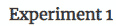
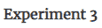

# 第十二章：模型准确度退化与反馈循环

本章将通过广告点击转化的示例来介绍模型性能退化的概念。我们的目标是识别那些导致移动应用下载的广告点击。在这种情况下，广告是用于推广移动应用的。

为了应对模型性能的退化，我们将学习关于**反馈循环**的内容，即当新数据可用时，我们重新训练模型并评估模型性能的管道。因此，训练后的模型会不断更新，以适应输入数据或训练数据中的变化模式。反馈循环在基于模型输出做出明智的商业决策时非常重要。如果训练后的模型无法充分捕捉动态数据中的模式，它可能会产生次优的结果。

本章将涵盖以下主题：

+   监控退化性能的模型

+   开发一个用于训练数据演变的案例——广告点击转化

+   创建机器学习反馈循环

# 技术要求

本书的 GitHub 仓库包含本章的源代码，可以在 [`github.com/PacktPublishing/Hands-On-Artificial-Intelligence-on-Amazon-Web-Services`](https://github.com/PacktPublishing/Hands-On-Artificial-Intelligence-on-Amazon-Web-Services) 找到。

# 监控退化性能的模型

在实际场景中，部署的机器学习模型会随着时间的推移而退化性能。以欺诈检测为例，模型可能无法捕捉到不断变化的欺诈行为。由于欺诈者会随着时间的推移调整他们的方法和流程来规避系统，因此对于欺诈检测引擎来说，使用最新的反映异常行为的数据重新训练是非常重要的。请看下图：


上图展示了模型在生产环境中部署后，如何在预测性能上发生退化。作为另一个例子，在推荐系统中，客户的偏好会根据多种上下文和环境因素不断变化。因此，个性化引擎需要捕捉这种变化的偏好，并向客户呈现最相关的建议。

# 开发一个用于训练数据演变的案例——广告点击转化

欺诈风险几乎存在于每个行业，例如航空公司、零售、金融服务等。在在线广告中，欺诈风险尤其高。对于投资数字营销的公司来说，控制广告点击中的欺诈性点击非常重要。如果在线广告渠道中充斥着欺诈行为，广告成本可能变得不可承受。本章将通过移动应用的广告点击数据，预测哪些点击可能带来应用下载。通过这一预测，移动应用开发者能够更有效地分配在线营销预算。

广告点击行为是非常动态的。这种行为随时间、地点和广告渠道的变化而变化。欺诈者可以开发软件来自动点击移动应用广告，并隐藏点击的身份——点击可能来自多个 IP 地址、设备、操作系统和渠道。为了捕捉这种动态行为，重新训练分类模型以涵盖新的和新兴的模式变得非常重要。如果我们希望准确确定哪些点击将导致应用下载，实现反馈回路至关重要。例如，如果某些点击发生在最后一刻，来自相同的 IP 地址，并且间隔几分钟，则这些点击可能不会导致应用下载。然而，如果这些点击发生在工作时间，来自不同的 IP 地址，并且分布在整天，那么它们将会导致应用下载。

下图描述了广告点击行为，以及二元结果——是否下载了移动应用：


根据用户如何点击广告——使用了哪种设备、操作系统或渠道、点击时间以及所点击的应用，点击可能会或可能不会转化为移动应用下载。我们将利用这种动态点击行为来说明机器学习中反馈回路的重要性。

# 创建机器学习反馈回路

在本节中，我们将演示随着新数据的到来，如何通过重新训练分类模型来提升模型性能；即预测哪些广告点击将导致移动应用下载。

我们已经创建了一个合成/人工数据集，模拟了在四天（周一至周四；2018 年 7 月 2 日至 7 月 5 日）内发生的 240 万个点击。数据集可以在此找到：[`github.com/PacktPublishing/Hands-On-Artificial-Intelligence-on-Amazon-Web-Services/tree/master/Ch12_ModelPerformanceDegradation/Data`](https://github.com/PacktPublishing/Hands-On-Artificial-Intelligence-on-Amazon-Web-Services/tree/master/Ch12_ModelPerformanceDegradation/Data)

数据集包含以下元素：

+   `ip`: 点击的 IP 地址

+   `app`: 移动应用类型

+   `device`: 点击来源的设备类型（例如，iPhone 6 Plus，iPhone 7）

+   `os`: 点击来源的操作系统类型

+   `channel`: 点击来源的渠道类型

+   `click_time`: 点击的时间戳（UTC）

+   `is_downloaded`: 需要预测的目标，表示应用程序是否已下载

获取最新和最完整的数据是一个挑战。数据湖和数据仓库环境通常会滞后一天（24 小时）。当预测周四接近结束时发生的点击是否会导致应用下载时，确保拥有截至周四的最新数据是至关重要的，且要排除我们正在评分的点击数据，以便进行模型训练。

为了理解反馈循环的意义，我们将训练一个基于树的模型（XGBoost）来预测导致应用下载的广告点击的概率。我们将进行三个不同的实验：

+   **实验 1**：使用周一的点击数据进行训练，并预测/评分部分周四的点击数据（来自当天晚些时候的点击）。

+   **实验 2**：假设我们在数据湖环境中有更多数据可供使用，以重新训练分类模型。我们将使用周一、周二和周三的点击数据进行训练，并预测/评分部分周四的点击数据。

+   **实验 3**：类似地，我们将使用周一、周二、周三和部分周四的点击数据进行训练，并预测/评分部分周四的点击数据。

在每次迭代或实验中，你将看到以下内容：

+   分类模型的表现通过**曲线下面积**（**AUC**）来衡量，AUC 通过绘制真正率与假正率来计算。

+   随机分类器的 AUC 为 0.5。

+   对于一个最佳模型，AUC 应该接近 1。

+   换句话说，真正率（你正确识别的应用下载比例）应当高于假正率（那些未导致应用下载的点击，但被错误识别为会导致应用下载的比例）。

现在，我们需要加载和探索数据，以确定预测应用下载的最佳指标。

# 探索数据

亚马逊 SageMaker 提供了内置工具和能力来创建包含反馈循环的机器学习管道。由于机器学习管道在第八章中已经介绍过，*创建机器学习推理管道*，在这里我们将重点关注反馈循环的重要性。我们开始吧：

1.  安装相关的 Python 包，并设置 S3 存储桶中训练、验证和模型输出的路径，如下所示：

```py
!pip install pyarrow
!pip install joblib
!pip install xgboost
#Read the dataset from S3 bucket
s3_bucket = 'ai-in-aws'
s3_prefix = 'Click-Fraud'

s3_train_prefix = os.path.join(s3_prefix, 'train')
s3_val_prefix = os.path.join(s3_prefix, 'val')
s3_output_prefix = os.path.join(s3_prefix, 'output')

s3_train_fn = 'train_sample.csv.zip'
```

1.  从本地 SageMaker 实例读取准备好的合成数据集，如以下代码所示：

```py
file_name = 'ad_track_day' fn_ext = '.csv'
num_days = 4
dict_of_ad_trk_df = {}

for i in range(1, num_days+1):
dict_of_ad_trk_df[file_name+str(i)] = pd.read_csv(file_name+str(i)+fn_ext) 
```

1.  我们将现在探索数据，以便准备以下特征：

    +   **广告点击的来源，即** `ip`、`device` 和 `os`

    +   **它们何时到达，即** `day` 和 `hr`

    +   **它们是如何到达的，即** `channel`

    +   结合何时、何地和如何

1.  为每个实验创建数据块。我们将使用`pandas`库按天汇总广告点击数据，如以下代码所示：

```py
df_ckFraud_exp1 = pd.concat([dict_of_ad_trk_df[key] for key in ["ad_track_day1"]], ignore_index=True)

df_ckFraud_exp2 = pd.concat([dict_of_ad_trk_df[key] for key in ["ad_track_day1", "ad_track_day2", "ad_track_day3"]], ignore_index=True)

df_ckFraud_exp3 = pd.concat([dict_of_ad_trk_df[key] for key in ["ad_track_day1", "ad_track_day2", "ad_track_day3", "ad_track_day4"]], ignore_index=True)
```

让我们了解最常见的因素，如应用类型、设备、渠道、操作系统和点击来源的 IP 地址，是否能导致应用下载。

流行的应用（由相关广告点击数定义）在未下载与已下载时并不相同。换句话说，虽然某些移动应用广告经常被点击，但它们不一定是那些最终被下载的应用。

**周一的热门应用**：让我们绘制应用下载与未下载时，广告点击数的分布，如下方代码所示：

```py
%matplotlib inline
plot_clickcnt_ftr(df_ckFraud_exp1, 'app', '1') 
```

关于此代码中`plot_clickcnt_ftr()`函数的定义，请参见本章相关的源代码。第一个条形图显示了应用未下载时的情况，而第二个条形图则反映了应用已下载时的情况：


正如我们之前所见，应用 12、3、9 和 15 是在未下载时最受欢迎的前四个应用。另一方面，应用 19、34、29 和 9 是在广告点击导致下载时最受欢迎的应用。

**周一的热门设备**：现在让我们绘制设备在应用下载与未下载时的广告点击数分布，如下方代码所示：

```py
%matplotlib inline
plot_clickcnt_ftr(df_ckFraud_exp1, 'device', '1') 
```

同样的主题依然成立；在点击未导致应用下载和点击导致应用下载时，流行设备的差异，如以下输出所示：


即使在操作系统和渠道方面，这一主题依然存在。因此，值得注意的是，某些设备、操作系统和渠道来源的广告点击可能会提示应用下载。也有可能的是，来自受欢迎渠道、操作系统或设备的点击，针对热门应用的下载转化率较高。受欢迎就意味着点击量大。

# 创建特征

现在我们已经探索了数据，接下来是创建一些特征。让我们从查看数据中的分类变量开始。

每个类别列的唯一 ID，即`app`、`device`、`os`和`channel`，本身并不有用。例如，对于基于树的模型而言，较低的应用 ID 并不优于较高的应用 ID，反之亦然。因此，我们将计算这些分类变量的频率，如下代码所示：

```py
def encode_cat_ftrs(df_ckFraud):
cat_ftrs = ['app','device','os','channel']

for c in cat_ftrs:
df_ckFraud[c+'_freq'] = df_ckFraud[c].map(df_ckFraud.groupby(c).size() / df_ckFraud.shape[0])
return df_ckFraud
```

1.  首先，我们创建一个名为`cat_ftrs`*.* 的分类变量列表。我们对每一个分类变量都这样做。

1.  我们通过将来自某一变量的点击数除以数据集中总的点击数来计算频率。

对于这些实验，我们调用`encode_cat_ftrs()`函数为所有分类变量创建与频率相关的特征，如下所示：

```py
df_ckFraud_exp1 = encode_cat_ftrs(df_ckFraud_exp1)
df_ckFraud_exp2 = encode_cat_ftrs(df_ckFraud_exp2)
df_ckFraud_exp3 = encode_cat_ftrs(df_ckFraud_exp3)
```

1.  现在让我们来看一下与时间相关的特征。我们将从`click_time`列创建各种与时间相关的特征，即`day`、`hour`、`minute`和`second`。这些特征可能有助于根据星期几和一天中的小时来揭示点击模式。

从`datetime`列中，我们提取`day`、`hour`、`minute`和`second`，如下所示：

```py
def create_date_ftrs(df_ckFraud, col_name):
"""
create day, hour, minute, second features
"""
df_ckFraud = df_ckFraud.copy()

df_ckFraud['day'] = df_ckFraud[col_name].dt.day.astype('uint8') ## dt is accessor object for date like properties
df_ckFraud['hour'] = df_ckFraud[col_name].dt.hour.astype('uint8')
df_ckFraud['minute'] = df_ckFraud[col_name].dt.minute.astype('uint8')
df_ckFraud['second'] = df_ckFraud[col_name].dt.second.astype('uint8')

return df_ckFraud
```

1.  我们使用`datetime`列的`dt`访问器对象来获取与时间相关的特征。就像在每个与实验相关的数据集上调用`encode_cat_ftrs`一样，我们将在每个数据集上调用`create_date_ftrs`。

1.  最后，让我们创建反映点击来自`何时`和`何地`的特征。因此，我们将通过以下方式统计点击次数：

+   +   IP 地址、日期和小时

    +   IP 地址、渠道和小时

    +   IP 地址、操作系统和小时

    +   IP 地址、应用程序和小时

    +   IP 地址、设备和小时

关于用于按每种组合统计点击次数的函数`count_clicks`的详细信息，请参阅与本章相关的源代码。`count_clicks`在每个与实验相关的数据集上被调用。

现在让我们看看经过特征工程处理后的准备数据集：


如你所见，我们已经拥有所有工程特征：


在前面的截图中，我们有：

+   +   每次广告点击的`day`、`hour`、`minute`和`second`

    +   `app`、`device`、操作系统（`os`）和渠道频率

    +   按`时间`（`time`）、`地点`（`os`、`device`和`ip`地址）以及`方式`（`channel`）统计的点击次数

1.  现在让我们看看这些特征之间是如何相互关联的。我们将使用相关矩阵来查看所有属性之间的关系，如下所示的代码所示：

```py
# Correlation
df_ckFraud_exp1.corr()
```

以下是通过`pandas` DataFrame 的`corr`函数生成的相关矩阵的一部分：


如我们所见，应用类型、来自设备和渠道的点击比例，以及某个应用的点击比例是预测应用下载的关键指标。为每个实验绘制热图也表明这些观察结果是有效的。有关更多信息，请参阅与本章相关的源代码。

# 使用亚马逊的 SageMaker XGBoost 算法对广告点击数据进行分类

为了理解反馈循环的意义，我们将训练一个基于树的模型（XGBoost），以预测广告点击是否会导致应用下载的概率。

对于所有这些实验，我们有一个测试数据集。它包含广告点击数据，以及在星期四晚些时候下载的应用程序——当天最后的 120,000 次点击。让我们开始吧：

1.  我们将从第三个数据集中选择 5% 的点击数据，该数据集包含了周一、周二、周三和周四的点击数据。第三个数据集按时间排序，因此我们选择了周四生成的最后 120,000 个点击，具体代码如下所示：

```py
# Sort by hour, minute and second --> pick the last 5% of records
test_data = df_ckFraud_exp3.sort_values(['day', 'hour', 'minute', 'second'], ascending=False).head(n=120000)

```

1.  我们还需要重新排列所有实验的数据集，使得`is_downloaded`，我们的目标变量，成为数据集中的第一列。SageMaker XGBoost 算法要求这种格式。

1.  现在我们需要重新排列测试数据集，如下所示：

```py
# Rearrange test data so that is_downloaded is the first column
test_data = pd.concat([test_data['is_downloaded'], test_data.drop(['is_downloaded'], axis=1)], axis=1)
```

1.  对于每个实验，我们将首先创建训练集和验证集。

1.  我们将把当前实验数据拆分为训练集和验证集，具体代码如下：

```py
train_data, validation_data = np.split(current_experiment.sample(frac=1, random_state=4567), [int(0.7 * len(current_experiment))])
```

1.  我们使用 NumPy 的 split 函数来完成此操作。70% 的数据用于训练，30% 的数据用于验证。

1.  一旦我们准备好训练集、验证集和测试集，我们将它们上传到 S3。有关详细信息，请参阅本章相关的源代码。

现在是准备模型训练的时候了。为了训练 XGBoost 模型，定义了以下超参数（这里只报告了一部分）。详细信息请参阅 AWS 文档（[`docs.aws.amazon.com/sagemaker/latest/dg/xgboost_hyperparameters.html`](https://docs.aws.amazon.com/sagemaker/latest/dg/xgboost_hyperparameters.html)）：

+   +   `max_depth`：树的根节点与叶节点之间的最大层数。

    +   `eta`：学习率。

    +   `gamma`：只有当分裂后能显著减少损失函数时，节点才会被分裂。Gamma 指定了进行分裂所需的最小损失减少值。

    +   `min_child_weight`：用于控制树的复杂性和每个子节点所需的最小实例权重总和。如果未达到此阈值，则树的分裂将停止。

    +   `subsample`：每棵树随机采样的观测值比例。

    +   `colsample_bytree`：每棵树随机采样的列的比例。

    +   `scale_pos_weight`：数据集高度不平衡，其中有大量点击（> 90%）没有导致应用下载。为了解决这个问题，使用 `scale_pos_weight` 超参数来给那些导致应用下载的点击赋予更大的权重。这些点击在数据集中被严重低估。

    +   `alpha`：正则化参数，用于防止过拟合。Alpha 用于实现 L1 正则化，其中叶节点权重的总和是正则化项（目标函数的一部分）。

    +   `lambda`：用于控制 L2 正则化，其中权重的平方和是正则化项的一部分。

1.  然后，我们定义了一些 XGBoost 算法的超参数，如下所示：

```py
xgb.set_hyperparameters(max_depth=4,
 eta=0.3,
 gamma=0,
 min_child_weight=6, 
 colsample_bylevel = 0.8,
 colsample_bytree = 0.8,
 subsample=0.8,
 silent=0,
 scale_pos_weight=scale_pos_weight,
 objective='binary:logistic',
 num_round=100)
```

尽管大多数超参数的默认值被接受，但有些在这里被显式定义。例如，`min_child_weight`被设置为`6`，而默认值是`1`。这意味着一个叶节点在进一步拆分之前，应该包含足够数量的实例或数据点。这些值可以根据特定数据进行调整。**超参数优化**（**HPO**）可以使用 SageMaker 来自动化寻找最优超参数值的过程。

1.  现在，我们将拟合 XGBoost 算法到实验数据（训练数据和验证数据），如下所示的代码：

```py
xgb.fit({'train': s3_input_train, 'validation': s3_input_validation})
```

调用 XGBoost 估算器模块（SageMaker Python SDK）的`fit()`函数进行模型训练。训练和验证数据集的位置作为输入传递给模型训练。

一旦训练完成，训练好的模型将保存到指定的位置（S3 桶中）。我们需要为每个实验重复相同的训练步骤。最终，我们将得到三个训练好的模型。

# 评估模型性能

在本节中，我们将评估三个训练模型的性能。我们的假设是，第一个模型在星期一和星期二的点击数据上训练，但对于星期四后期的应用下载预测能力较弱，相比之下第二和第三个模型的表现会更好。类似地，第二个模型（基于星期一到星期三的点击数据训练）的表现将不如第三个模型（基于星期一到大部分星期四的点击数据训练）。

我们将首先分析每个模型认为重要的特征，如下所示的代码：

```py
exp_lst = ['exp1', 'exp2', 'exp3']
for exp in exp_lst:
   model_file = os.path.join(sm_output_loc, exp, s3_output_fn)
    plot_ftr_imp(model_file)
```

上述代码的解释如下：

1.  首先，我们检索每个实验的训练模型位置。

1.  然后，我们将位置传递给`plot_ftr_imp()`函数，以创建一个显示特征重要性的图表。为了绘制特征重要性，函数执行以下操作：

+   +   从`.tar`文件中提取训练模型

    +   加载 XGBoost 模型

    +   对加载的模型调用`plot_importance()`函数

下图显示了三个训练模型的特征重要性，从左侧的第一个模型开始：

|  |  |  |
| --- | --- | --- |
|  |  |  |

如我们所见，随着更多数据的加入，大多数关键预测因子的相对重要性保持不变，但它们的重要性顺序发生了变化。要查看映射后的特征，请查看以下图表：


XGBoost 会对输入数据集中的特征进行编号，其中第一列是目标变量，而特征从第二列开始排序。

1.  现在我们将评估三个实验的性能。让我们按照以下代码将所有三个训练好的模型作为端点进行部署：

```py
model_loc = os.path.join(data_loc, s3_output_fn)
xgb_model = Model(model_data=model_loc, image=container, role=role)
xgb_model.deploy(initial_instance_count=1, instance_type='ml.m4.xlarge')
```

在上面的代码中，对于每个实验，要将训练后的模型部署为端点，我们将执行以下操作：

+   1.  首先，我们将从存储位置（S3 桶）中检索训练好的模型。

    1.  然后，我们将通过传递训练好的模型、XGBoost 算法的 Docker 镜像以及 SageMaker 的执行角色来创建一个 SageMaker 模型。

    1.  最后，我们将调用新创建的 XGBoost 模型对象的`deploy`方法。我们将传递 EC2 实例的数量以及实例类型给 deploy 函数。

以下截图显示了训练后的模型部署后创建的端点：


1.  要查看已部署的模型，请导航到 SageMaker 服务并展开推理部分。在该部分下，点击端点（Endpoints）以查看端点名称、创建时间、状态和最后更新时间。

现在是时候预测星期四最后 120,000 次点击的应用下载量了。

我们将为此创建一个`RealTimePredictor`对象，如下代码所示：

```py
 xgb_predictor = sagemaker.predictor.RealTimePredictor(endpoint, sagemaker_session=sess, serializer=csv_serializer, deserializer=None, content_type='text/csv', accept=None)
```

`RealTimePredictor`对象通过传递`endpoint`的名称、当前的`sagemaker`会话和`content`类型来创建。

1.  收集测试数据的`predictions`，如下所示：

```py
predictions[exp_lst[ind]] = xgb_predictor.predict(test_data.as_matrix()[:10000, 1:]).decode('utf-8')
```

1.  如我们所见，我们通过传递前 10,000 个数据点击，调用`RealTimePredictor`（SageMaker Python SDK）的预测方法。

现在，我们准备将预测结果与实际的应用下载量进行比较。我们使用`sklearn`库中的`confusion_matrix`模块来获取真正例率和假正例率。我们还使用`sklearn`中的`roc_auc_score`和`accuracy_score`模块分别计算曲线下面积和准确度。

以下是每个实验的输出：


以下是 AUC，展示了所有实验的性能：


如我们所见，**Experiment2**的表现优于**Experiment1**，而**Experiment3**的表现最好，因为它具有最高的**AUC**。在**Experiment3**中，真正例率相对于**Experiment1**和**Experiment2**更高，假正例率较低。准确度在所有实验中保持不变。由于 AUC 不依赖于测试数据集的类分布，它是衡量模型区分能力的重要指标。另一方面，准确率、召回率和精度等指标可能会随着测试集的变化而变化。

因此，在训练好的模型部署到生产环境后，在模型运行期间寻求反馈非常重要。随着数据模式的变化和新数据的出现，重新训练和调整模型以达到最佳性能变得尤为关键。

# 总结

在本章中，我们了解了为何监控模型的性能下降至关重要。为说明这一观点，我们使用了一个合成数据集，该数据集捕捉了移动应用下载的广告点击行为。首先，我们探索了数据，以理解应用下载和广告点击之间的关系。然后，我们通过多维度聚合现有点击特征来创建特征。接下来，我们创建了三个不同的数据集，并在这些数据集上进行三次实验，以说明随着新数据的到来，模型性能的恶化问题。随后，我们为每个实验拟合了 XGBoost 模型。最后，我们评估了所有实验的性能，得出结论，表现最佳的模型是那个考虑了最新点击行为的模型。

因此，在机器学习生命周期中实施反馈循环对于保持和提升模型性能，以及充分实现业务目标至关重要，无论是用于欺诈检测还是捕捉用户偏好以供推荐使用。

在下一章，也就是最后一章，我们将总结本书中学习的所有概念，并重点介绍一些来自亚马逊网络服务的机器学习和深度学习服务，值得进一步探索。

# 进一步阅读

欲了解更多有关模型准确性下降和反馈循环的信息，请参考以下链接：[`docs.aws.amazon.com/sagemaker/latest/dg/xgboost_hyperparameters.html`](https://docs.aws.amazon.com/sagemaker/latest/dg/xgboost_hyperparameters.html)。
