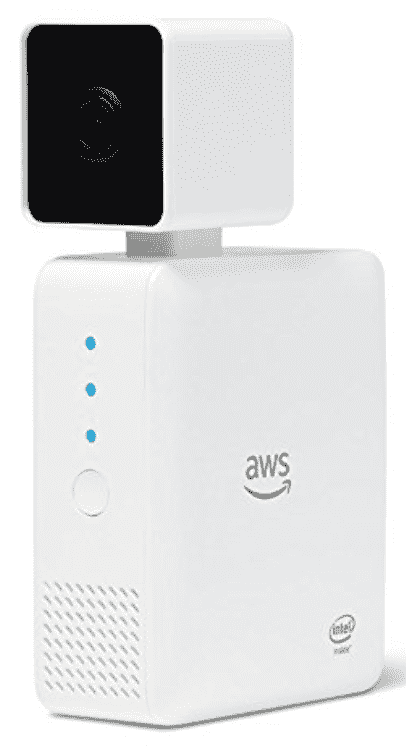
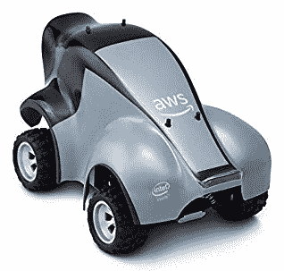
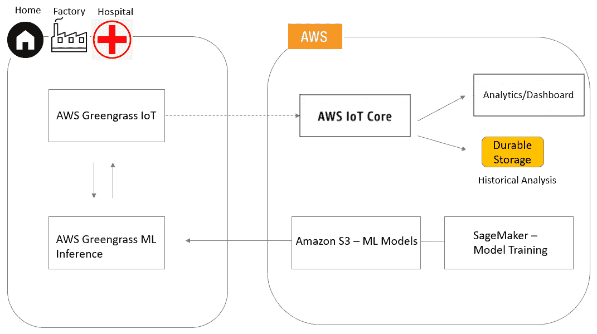

# 第十三章：接下来是什么？

在前面的章节中，正如本书标题所示，我们采用了实践操作的方式，帮助你成为更好的 AI 实践者。通过本书中的实践项目，你掌握了将 AWS AI 能力嵌入应用程序以及使用 AWS ML 平台创建定制 AI 能力的技能。更重要的是，你培养了设计良好的、智能增强的解决方案的直觉，这些解决方案能够帮助解决现实世界中的问题。这些项目不仅让你了解了多种 AI 技术，还展示了 AI 可以应用于的各种问题领域和商业背景。作为 AI 从业者，重要的是要从业务能力的角度看待 AI，而不仅仅是技术。

在本章中，我们将讨论以下主题：

+   总结第一部分学习的概念

+   总结第二部分学习的概念

+   总结第三部分学习的概念

+   总结第四部分学习的概念

+   接下来是什么？

# 总结第一部分学习的概念

在第一部分，我们向你介绍了 AWS 提供的各种 AI 服务，并将它们分为两类：

+   AI 服务

+   ML 平台

我们的建议是，首先在你的解决方案开发中利用 AWS 托管的 AI 服务，如 Rekognition、Translate 和 Comprehend。只有在需要定制 AI 能力时，才应通过 AWS ML 平台，如 SageMaker，来构建它们。这种方法将提高你的市场速度和智能应用的投资回报率。我们还解释了，在 AWS 上开发智能解决方案的真正优势是将 AWS 的 AI 服务与 AWS 云计算生态系统中的其他服务（如 S3、DynamoDB 和 EMR）结合起来。

我们还讨论了 AI 应用程序的架构设计，以及如何通过良好的架构设计实现快速迭代和适应市场变化。我们为第二部分的实践项目制定了架构设计模板，并向你展示了我们在第三部分中构建的定制 AI 能力如何轻松集成到该架构中。这个架构模板可以被采纳并修改，用于构建你下一个基于 AWS AI 服务或定制 AI 能力的智能解决方案。

# 总结第二部分学习的概念

在第二部分，我们通过以下方式集中讨论了将 AI 能力嵌入应用程序：

+   我们使用了许多 AWS 托管的 AI 服务，构建了多个端到端的智能解决方案。

+   我们向你介绍了 AWS SDK，boto3，用于与云服务及其基础设施进行交互。

+   我们使用了 AWS Chalice 框架来开发和部署无服务器应用程序到 API Gateway 和 AWS Lambda。

+   我们使用了 HTML、CSS 和 JavaScript 来构建这些解决方案的用户界面。

+   在此过程中，我们分享了在 AWS 上开发、测试、维护和演化 AI 应用程序的一些技巧和窍门。

在第三章，*使用 Amazon Rekognition 和 Translate 检测和翻译文本*中，我们构建了一个图像翻译器，既能检测图像中的文本，还能将其翻译成任何语言（在我们的项目中是英语）。这个应用程序可以被前往外国的旅行者或希望与现实世界互动的视障人士使用。

在第四章，*使用 Amazon Transcribe 和 Polly 进行语音转文本及反向操作*中，我们构建了一个名为“Universal Translator”的简单应用，能够促进说不同语言的人的口头交流。这个应用程序可以被旅行者、学生等使用。

在第五章，*使用 Amazon Comprehend 从文本中提取信息*中，我们构建了一个联系人组织器，帮助自动化从名片图片中提取联系信息。我们引入了人工干预的概念，以提高端到端解决方案的准确性。这种类型的应用程序有助于减少许多后台任务中的人工工作，让员工能够专注于更具创意的任务。

在第六章，*使用 Amazon Lex 构建语音聊天机器人*中，我们构建了一个智能助手——联系人助手，能够通过对话界面搜索联系人信息。这个智能助手不仅通过自然语言理解我们，它还记住对话的上下文，使得界面更加流畅。这些类型的智能助手界面改善了我们许多日常任务，例如信息搜索、沟通、提醒等。

# 总结我们在第三部分中学到的概念。

在第三部分中，我们重点介绍了如何利用 SageMaker 训练和部署机器学习模型，包括内置模型和自定义模型，以解决那些无法通过 AWS AI 服务轻松解决的商业问题。

我们从第七章，*使用 Amazon SageMaker 工作*开始，学习了如何处理大型数据集、进行训练以及在 SageMaker 中优化超参数。

+   此外，我们还探讨了 SageMaker 如何使得运行多个实验并部署最佳表现模型进行推理变得无缝。

+   我们还展示了如何将自己的模型和容器带到 SageMaker，这样就能轻松利用诸如模型训练、部署和大规模推理等功能。

在第八章，*创建机器学习推理管道*中，我们学习了如何通过 Glue 进行数据预处理，Glue 是一个无服务器 ETL AWS 服务。构建了一个机器学习管道，能够重用数据预处理逻辑进行训练和推理。我们还学习了如何将机器学习管道应用于实时和批量预测。

在第九章，*发现文本集合中的主题*，我们回顾了各种方法——线性和非线性——以便在文本集合中发现主题。然后，我们深入探讨了如何通过内置的 NTM 算法（变分自编码器）处理主题建模。我们通过*恩龙邮件*的示例数据集，解释了 SageMaker 中的模型训练、部署和推理步骤。

在第十章，*深度学习与自动回归的销售预测*，我们探讨了传统时间序列预测方法（如指数平滑法和 ARIMA）与更灵活、更可扩展的方法（如自回归递归网络）之间的差异。然后，我们研究了 SageMaker 中的 DeepAR 算法如何利用多种因素（如假期、促销和失业率）来建模零售销售。

在第十一章，*使用 Amazon SageMaker 进行图像分类*，我们回顾了卷积神经网络和残差网络的目的。接着，我们介绍了通过迁移学习增量学习的概念。我们还解释了如何通过迁移学习对烘焙物品进行分类，即使只有少量图像数据集。

# 总结我们在第四部分学到的概念

在第四部分，也就是第十二章，*模型精度下降与反馈循环*，我们通过广告点击转化数据集定义了模型性能退化的概念。我们阐述了反馈循环的概念，以及为什么它在建模动态广告点击行为时变得如此重要。然后，我们演示了通过反馈循环，模型性能在预测广告点击是否会导致应用下载时的提升。

# 接下来是什么？

我们已经涵盖了许多人工智能的概念和技术，但通过这本书，我们仅仅触及了这一广阔而深刻领域的表面。掌握了必要的人工智能技能和直觉之后，AI 从业者接下来该做什么呢？以下是我们的一些建议，帮助你更全面地探索这一不断发展的领域。

# 物理世界中的人工智能

作为 AI 从业者，提升自己的一个方法是拓宽自己在不同人工智能应用领域的经验。一个不断增长的 AI 应用领域旨在将人工智能能力与物理世界中的传感器和执行器相结合。这类物理世界应用的例子包括家庭自动化、智能工厂、自动驾驶汽车和机器人。对于一些 AI 从业者来说，构建物理机器、车辆和机器人可能会让人感到畏惧。幸运的是，AWS 提供了多个产品，可以让你更轻松地开始这一类 AI 应用。

# AWS DeepLens

AWS DeepLens 是一款物理设备，内置摄像头、计算、存储和互联网连接，并将其封装成一个小型设备。结合其他 AWS AI 服务和工具，当你想要获取深度学习应用的实践经验时，DeepLens 成为一个强大的平台。请看下面的屏幕截图，展示了 AWS DeepLens：

让我们来谈谈 DeepLens 的一些显著特点：

+   DeepLens 可以拍摄**高清**（**HD**）图像和视频，并且具备足够的处理能力来实时处理高清晰度视频。

+   AI 从业者可以通过 AWS AI 服务快速启动 DeepLens 项目。例如，它与 Amazon Rekognition 集成，能够分析摄像头拍摄的图像和视频。

+   DeepLens 完全可以通过 AWS Lambda 编程，调用广泛的功能和连接到互联网的执行器。

+   DeepLens 还支持使用 Amazon SageMaker 训练的定制机器学习模型。

+   AI 从业者可以选择包括 TensorFlow 和 Caffe 在内的广泛深度学习框架来训练机器学习模型，并在 DeepLens 的车载推理引擎上运行它们。

+   这些定制的机器学习模型可以通过几次点击或 API 调用轻松部署到 DeepLens 上。

通过阅读本书，你已经熟悉了我们刚才提到的许多工具，并且已经掌握了开始使用 AWS DeepLens 所需的许多技能。凭借这个强大的平台，AI 从业者可以构建一系列广泛的应用。几个示例应用包括家庭安全、鸟类观察、交通监控、送货通知、家庭自动化等等。结合其他传感器和执行器，可能性是无限的。

# AWS DeepRacer

AWS DeepRacer 是一款 1/18^(th) 比例的赛车，集成了摄像头、加速度计和陀螺仪；它还配备了计算、存储和互联网连接功能。DeepRacer 旨在帮助 AI 从业者通过自动驾驶赛车获取强化学习的实践经验。强化学习是机器学习（ML）的一个分支，旨在创建智能体，通过优化奖励函数来学习，而不是通过示例学习（监督学习）或数据的固有结构（无监督学习）。这种 AI 技术已被用于训练智能体进行跑步、驾驶和玩游戏。例如，Google 的 AlphaGo 程序使用这种机器学习技术，并击败了世界顶级围棋选手。以下是 AWS DeepRacer 的展示：

DeepRacer 将以下 AI 能力带入现实世界：

+   通过使用摄像头和其他车载传感器，AI 从业者可以开发强化学习模型来控制 DeepRacer 的油门和转向。

+   DeepRacer 配备了一个 3D 赛车模拟器，便于开发和测试其 AI 赛车能力。

+   与 DeepLens 类似，DeepRacer 也与 AWS AI 服务和云基础设施集成。

+   你可以使用 Amazon SageMaker 来训练强化学习模型，并轻松将它们部署到你的赛车上。

+   甚至还有一个 DeepRacer 联赛，用于测试你为赛车开发的任何 AI 赛车能力，并有机会赢得奖品和荣耀。

基于此平台构建的应用程序也不必仅限于赛车。通过安装在轮子上的相机，有许多可选的应用场景，例如家庭监控、宠物训练和物品配送。我们敢打赌，DeepDrone 曾经在 AWS 中被提出过。

# 物联网与 AWS IoT Greengrass

为了让 AI 应用在物理世界中正常运作，需要在边缘端具备 AI 能力。

AWS IoT Greengrass 让连接的设备能够与其他设备和云应用无缝且安全地互动。Greengrass 为 AI 应用带来了许多好处，包括以下几点：

+   它在你希望基于本地事件和数据做出反应时，带来了更快的响应时间，而无需访问云端。

+   它通过减少边缘与云之间数据传输的带宽需求，提升了运行 IoT 的成本效益。

+   通过在本地处理和匿名化敏感信息，简化了某些行业（如医疗保健）中的数据安全和隐私保护。

AWS IoT Greengrass 还可以将 AI 能力扩展到边缘设备，从而创建智能边缘。以下架构图展示了边缘设备如何在本地运行机器学习推理，然后通过 Greengrass Core 连接到 AWS IoT Core，将消息或推理发送到云端进行进一步分析：

在这种架构中，我们可以看到以下内容：

+   在 Amazon SageMaker 中训练的模型会保存在 S3 存储桶中。

+   在边缘生成的数据通过本地 Lambda 函数由这些训练过的模型进行评分。

+   AWS Greengrass 的核心控制了边缘和云之间的通信，包括安全性、消息传递和离线计算操作。

+   AWS IoT Core，另一方面，协调与其他 AWS 服务的连接，即持久存储或分析。

通过利用边缘智能架构，可以解决多个商业问题。以自动驾驶车辆为例，需要一个智能边缘来引导汽车绕过本地环境，而不受网络延迟的影响。如果你是制造业企业，通过在边缘运行机器学习推理，可以在本地预测机械设备的使用寿命，并采取即时措施以提高安全性。在医疗健康应用中，敏感的医疗信息可以在本地使用，以低延迟进行智能诊断，而不需要将患者的隐私风险暴露在云端。

# 你自己领域中的人工智能

作为 AI 从业者的另一种成长方式是深入探讨特定领域或业务领域。一个好的方法是将 AI 应用于你有专业知识或兴趣的领域。你比任何人都更清楚该选择哪个领域。

在这个选定的领域，你会发现一组特定的商业问题，然后发展相关的 AI 技能，以解决这些问题。你所在领域的问题可能需要计算机视觉、自然语言处理、语音识别、知识推理，或者这些技术的组合。作为 AI 从业者，你将进一步发展这些 AI 技术中的更专业技能。

在这个选定的领域，你可能已经知道一些你希望解决的现有问题，或者你可能需要发现新的问题来解决。发现并定义这些问题是获得相较于其他 AI 通才的竞争优势的关键。然而，开始这条道路时，我们建议你从与该领域相关的小型实践项目开始。就像本书的建议一样，你应该通过实际操作来发展你的直觉，即使这只是复制你所在领域的现有解决方案。随着时间的推移，你将逐渐积累解决相关问题的更好见解。

# 总结

本书涵盖了 AWS 中各种 AI 基础知识，重点介绍了 AI 应用开发、预定义的 AI API、模型构建、训练、部署、管理和通过 ML 管道进行实验。我们建议了两种方法，帮助你继续在 AWS 上作为 AI 从业者发展，即广度发展或深度发展。希望你在阅读（并完成）本书的过程中获得了乐趣，并且已经准备好通过 AWS 与人工智能相关的服务解决具有挑战性的商业问题。
