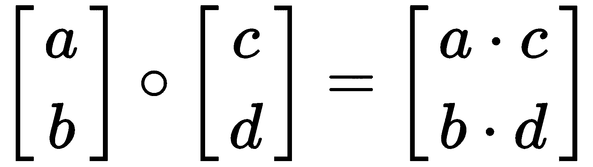
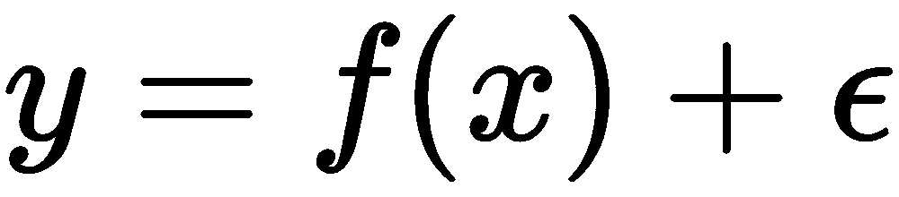

# 第二章：机器学习基础

**人工智能**（**AI**）根植于数学和统计学。在创建**人工神经网络**（**ANN**）时，我们在表示线性空间的数据上进行数学运算；从本质上讲，它是应用数学和统计学。机器学习算法不过是函数逼近；它们试图找到输入与正确输出之间的映射关系。我们使用代数方法来创建能够学习这些映射关系的算法。

几乎所有机器学习都可以通过一个相对简单的公式来表示；将数据集和模型结合起来，再加上适用于数据集和模型的损失函数与优化技术。本节旨在回顾理解*AI 底层原理*所必需的基本数学工具和技术。

在本章中，我们将回顾线性代数和概率内容，然后进入基本和基础机器学习算法与系统的构建，最后介绍可以在未来所有方法中使用的优化技术。虽然我们在本章及后续章节中将使用数学符号和表达式，但我们将重点将这些概念转化为 Python 代码。通常，Python 比数学表达式更易读易懂，能够帮助读者更快入门。

在本章中，我们将涵盖以下主题：

+   应用数学基础

+   概率论

+   构建基础机器学习算法

# 技术要求

在本章中，我们将使用 Python 3 和 scikit-learn 科学计算包。你可以通过在终端或命令行中运行 `pip install sklearn` 来安装该包。

# 应用数学基础

当我们谈到与深度学习和 AI 相关的数学时，我们通常指的是线性代数。线性代数是一个连续数学的分支，涉及到向量空间的研究以及在向量空间中进行的运算。如果你还记得小学时学过的代数，代数通常处理未知变量。线性代数则是将这种研究扩展到具有任意维度的线性系统，这使得它成为一种连续数学的形式。

AI 依赖于张量这一基本构建块。在 AI 中，这些数学对象存储着在人工神经网络（ANN）中运作所需的信息；它们是 AI 中广泛使用的数据结构。正如我们将看到的，张量有一个**秩**，它本质上告诉我们数据的**索引**（即数据的行列数）。

尽管深度学习中的许多问题并不是严格的线性问题，*但矩阵和张量的基本构建块仍然是 ANN 中解决、优化和逼近问题的主要数据结构*。

想看看线性代数如何从编程角度帮助我们吗？看看下面的代码块：

```py
import numpy as np
## Element-wise multiplication without utilizing linear algebra techniques

x = [1,2,3]
y = [4,5,6]

product = []
for i in range(len(x)):
    product.append(x[i]*y[i])

## Element-wise multiplication utilizing linear algebra techniques

x = np.array([1,2,3])
y = np.array([4,5,6])
x * y
```

我们可以通过简单利用 NumPy 内建的线性代数函数来消除繁琐的循环。当你想到 AI 时，成千上万的操作必须在应用程序的运行时进行计算，线性代数的构建块也能帮助我们在编程上更高效。在接下来的部分中，我们将回顾这些基本概念，包括数学符号和 Python 代码。

以下示例将使用 Python 包 NumPy；`import numpy as np`

# 构建块 —— 标量、向量、矩阵和张量

在接下来的部分中，我们将介绍在 AI 应用中广泛使用的线性代数基本对象类型；**标量**、**向量**、**矩阵**和**张量**。

# 标量

**标量**只是单一的**实数**，可以是整数或浮动小数。在 Python 中，我们通过简单地赋值来创建标量：

```py
my_scalar = 5
my_scalar = 5.098
```

# 向量

**向量**是单维的整数数组。从几何学角度来看，它们存储的是从一个点出发的变化方向和大小。当我们在接下来的几页中讨论**主成分分析**（**PCA**）时，您将看到向量如何在机器学习算法中起作用。在 Python 中，向量作为 `numpy array` 对象创建：

```py
my_vector = np.array([5,6])
```

向量可以通过几种方式来书写：


# 矩阵

**矩阵**是包含行和列的二维数字列表。通常，矩阵中的行用 *i* 表示，列用 *j* 表示。

矩阵表示为：


我们可以像创建向量一样，轻松在 Python 中创建矩阵，作为 NumPy 数组：

```py
matrix = np.array([[5,6], [6,9]])
```

唯一的区别是，我们向数组中添加了一个额外的向量来创建矩阵。

# 张量

虽然你可能以前听说过向量和矩阵，但**张量**这个名称可能对你来说是新的。张量是广义的矩阵，它们有不同的大小或*秩*，用来衡量它们的维度。

张量是三维（或更多）列表；你可以将它们视为一种多维数字对象，例如立方体。张量具有独特的传递性和形式；如果一个张量变换了另一个实体，它自己也必须发生变化。任何秩为 2 的张量都可以表示为矩阵，但并非所有矩阵都是自动的秩为 2 的张量。一个张量必须具备这种传递性。正如我们接下来会看到的，这在下一章的神经网络中将会发挥作用。我们可以在 Python 中创建如下所示的张量：

```py
tensor = [[[1,2,3,4]],[[2,5,6,3]],[[7,6,3,4]]] ...
```

# 矩阵运算

人工神经网络（ANN）的基本运算基于矩阵运算。在这一部分，我们将回顾理解 ANN 机制所需掌握的基本运算。

# 标量运算

标量操作涉及向量（或矩阵）和标量。要对矩阵执行标量操作，只需将标量应用于矩阵中的每个元素：


在 Python 中，我们只需要做以下操作：

```py
vector = np.array([[1,2], [1,2]])new_vector = vector + 2
```

# 逐元素操作

在逐元素操作中，位置非常重要。对应位置的值会被结合起来形成一个新的值。

要加法和/或减法矩阵或向量：


在 Python 中：

```py
vector_one = np.array([[1,2],[3,4]])
vector_two = np.array([[5,6],[7,8]])
    a + b
    ## You should see:
        array([[ 6, 8],[10, 12]])
        array([[ 6, 8],[10, 12]])
     a - b
     ## You should see:
         array([[-4, -4], [-4, -4]])
```

我们可以在向量上执行两种形式的乘法操作：**点积** 和 **哈达玛积**。

点积是乘法的一个特例，根植于更大的几何学理论中，这些理论被广泛应用于物理学和计算科学中。它是一个更一般的数学原理的特例，称为**内积**。在使用两个向量的点积时，输出是一个标量：


点积是机器学习中的重要工具。想象一个基本操作：假设我们在做一个简单的分类问题，想要判断一张图像是包含猫还是狗。如果我们用神经网络来做这个分类，它的表现将如下：


这里，*y* 是我们的分类结果，表示猫或狗。我们通过利用表示为 *f* 的网络来确定 *y*，其中输入是 *x*，而 *w* 和 *b* 分别表示权重和偏置因素（不用担心，我们将在接下来的章节中更详细地解释这些内容！）。我们的 *x* 和 *w* 都是矩阵，我们需要输出一个标量 ，它代表猫或狗。我们只能通过对 *w* 和  进行点积来实现这一点。

回到我们的例子，如果这个函数输入的是一张未知的图像，计算点积可以告诉我们新向量与猫向量 (*a*) 或狗向量 (*b*) 的方向相似度，通过它们之间的角度来衡量（）：


如果向量更接近猫向量 (a) 的方向，我们会将图像分类为包含猫。如果它更接近狗向量 (b) 的方向，我们会将图像分类为包含狗。在深度学习中，这种情境的更复杂版本会反复执行；这是人工神经网络（ANNs）工作的核心。

在 Python 中，我们可以通过使用 `numpy` 中的内建函数 `np.dot()` 来计算两个向量的点积：

```py
## Dot Product
vector_one = np.array([1,2,3])
vector_two = np.array([2,3,4])
np.dot(vector_one,vector_two) ## This should give us 20
```

另一方面，哈达玛积输出的是一个向量：



Hadamard 积是逐元素运算，这意味着新矩阵中的每个数字都是来自前一个矩阵中数字的标量倍数。回到 Python，我们可以使用简单的`*`操作符轻松执行此操作：

```py
vector_one = np.array([1,2,3])
vector_two = np.array([2,3,4])
vector_one * vector_two
## You should see:
array([ 2,  6, 12])
```

既然我们已经了解了基本的矩阵运算，接下来让我们看看概率论如何在人工智能领域帮助我们。

# 基本统计学和概率理论

**概率**，即用于建模不确定场景的数学方法，是支撑人工智能算法的基础，帮助我们理解系统应该如何推理。那么，什么是概率呢？我们将其定义如下：

*概率是一个频率，表示为样本大小 n 的分数* [1]。

简单来说，概率是对不确定性的数学研究。在这一部分，我们将介绍概率空间和概率分布的基础知识，以及解决简单问题的有用工具。

# 概率空间与一般理论

当讨论概率时，通常会提到某个**事件**发生的概率。例如，今天会下雨吗？苹果的价格会上涨还是下跌？在机器学习的背景下，概率告诉我们诸如评论被分类为正面或负面，或者信用卡是否会发生欺诈交易等事件的可能性。我们通过定义所谓的**概率空间**来衡量概率。概率空间是对某些事件概率的*如何*与*为什么*的度量。概率空间由三个特征定义：

1.  样本空间，告诉我们可能的结果或情况

1.  一组定义明确的事件；例如两个欺诈性的信用卡交易

1.  每个事件的概率度量

虽然概率空间是一个值得单独研究的主题，但为了更好地理解，我们将坚持这个基本定义。

在概率论中，**独立性**的概念至关重要。独立性是指一个随机变量的值不受另一个随机变量值的影响。这在深度学习中是一个重要假设，因为非独立的特征往往会相互交织，并影响我们模型的预测能力。

在统计学中，关于事件的数据集合称为**样本**，它是从一个称为**总体**的理论数据超集中抽取的，整体代表了关于某个分组或事件的所有已知信息。例如，如果我们在街头对人们进行政治观点 A 或政治观点 B 的调查，我们将从总体中生成一个**随机样本**，总体是我们进行调查的城市、州或国家的所有人。

假设我们想使用这个样本来预测一个人持有两种政治观点之一的可能性，但我们主要对支持政治观点 A 的事件参与者进行了调查。在这种情况下，我们可能会有一个**偏倚样本**。在抽样时，重要的是要采取随机样本，以减少偏倚，否则我们使用样本进行的任何统计分析或建模也将存在偏倚。

# 概率分布

你可能见过类似下面的图表；它显示了数据集中的值以及这些值出现的次数。这被称为**变量的分布**。在这个特定的例子中，我们通过使用**直方图**来显示分布，直方图显示了变量的**频率**：


在这一部分，我们关注一种特定类型的分布，称为**概率** **分布**。当我们讨论概率分布时，我们在谈论随机变量取某个特定值的可能性，我们通过将前面频率的值进行划分来创建一个分布……

# 概率质量函数

**概率质量函数** (**PMFs**)是离散分布。该分布的随机变量可以取有限个值：


PMF 与我们通常看到的分布有些不同，这是因为它们的有限性。

# 概率密度函数

**概率密度函数** (**PDFs**)是连续分布；来自该分布的值可以取无限多个值。例如，参见以下图像：


你可能见过类似的东西；它是**标准正态分布**或**高斯分布**的概率密度函数。

# 条件概率与联合概率

**条件概率**是指在已知*y*发生的情况下，*x*发生的概率。它是概率论中推理不确定性的关键工具之一。假设我们在谈论你中奖的概率，假设今天是晴天。也许你觉得今天很幸运！我们如何将这个写成概率表达式呢？它将是你中奖的概率*A*，给定今天是晴天的概率*B*，因此是*P(A|B)*。

**联合概率**是指两件事同时发生的概率：你中奖*并且*那天是晴天的概率是多少？

# 联合概率链式法则

联合概率在人工智能领域中非常重要；它是**生成模型**背后的机制，这些模型能够复制声音、图片和其他非结构化信息。这些模型学习现象的联合概率分布。它们生成给定对象或事件的所有可能值。链式法则是一种评估两个变量联合概率的技术。正式写作如下：


# 条件概率的贝叶斯定理

**贝叶斯**定理是机器学习领域中概率论的另一个基本原则。它允许我们通过反转事件的条件来计算某个事件发生的条件概率。贝叶斯定理的正式表达式为：


让我们使用贝叶斯定理来解决一个简单的条件概率问题。在下表中，我们看到一个患者接触到疾病的可能性：

|  | **疾病 (1%)** | **无疾病 (99%)** |
| --- | --- | --- |
| 测试阳性 | 80% | 9.6% |
| 测试阴性 | 20% | 90.4% |

我们如何解读这个表格？*x*轴告诉我们患病人群的百分比；如果你得了病，你就明确地位于“疾病”列。基于这个条件，*y*轴则表示你测试为阳性或阴性的可能性，这取决于你是否真正患病。

现在，假设我们得到了一个阳性测试结果；那么我们实际患病的概率是多少呢？我们可以使用贝叶斯公式来解答：


我们的答案是 7.8%，即在阳性测试结果的情况下，实际患病的概率为：

在以下代码中，我们可以看到如何基于可能性来运用贝叶斯公式建模这些条件事件。在机器学习和人工智能中，这在建模情境或分类物体时非常有用。条件概率问题也涉及到判别模型，我们将在**生成对抗网络**一节中讨论这些模型：

```py
.p_diseasePos = 0.8 ## Chance of having the disease given a positive result
p_diseaseNeg = 0.2 ## Chance of having the disease given a negative result
p_noPos = 0.096
p_noNeg = 0.904
p_FalsePos = (.80 * .01) + (.096 * .99)
p_disease_given_pos = (.80 * .01) / p_FalsePos
print(p_disease_given_pos)
```

记住：进行乘法运算时，操作类型是非常重要的。我们可以使用哈达玛积（Hadamard 积）来乘以两个大小相等的向量或矩阵，输出将是另一个大小相等的向量或矩阵。在需要单个数字输出的情况下，我们使用点积（dot product）。点积在机器学习和深度学习中至关重要；在神经网络中，输入作为矩阵或向量传递到每一层，然后与另一个权重矩阵相乘，这构成了基础网络操作的核心。

概率分布及其基于这些分布的计算在机器学习领域依赖于贝叶斯思维。正如我们在后续章节中将看到的，人工智能中一些最具创新性的网络直接依赖于这些分布和贝叶斯定理的核心概念。回想一下，概率分布主要有两种形式：离散变量的概率质量函数（PMFs），以及连续变量的概率密度函数（PDFs）；累计分布函数（CDF）也适用于任何随机变量。

贝叶斯定理实际上启发了一个独立的统计学分支，称为**贝叶斯统计**。到目前为止，我们讨论的是**频率统计**，它通过可重复事件的观测空间来衡量概率。另一方面，**贝叶斯概率**衡量信念的程度；即根据当前可用的信息，一个事件发生的可能性有多大？随着我们在接下来的章节中深入探讨人工神经网络（ANNs），这将变得非常重要。

# 构建基本的机器学习算法

如上一章所提到的，机器学习这个术语是在第一次 AI 寒冬之后提出的。如今，我们通常认为机器学习是深度学习和人工神经网络（ANNs）等领域的总称。

大多数机器学习解决方案可以分为**分类**问题或**回归**问题。分类问题是指输出变量是类别性的，例如欺诈与非欺诈。回归问题是指输出是连续的，例如金额或网站访问量。具有数值输出的问题可以是类别性的，但通常会转化为类别输出，如头等舱和二等舱。

在机器学习中...

# 监督学习算法

监督算法依赖于人工知识来完成任务。假设我们有一个与贷款偿还相关的数据集，包含多个人口统计指标，以及贷款是否还款的信息：

| **收入** | **年龄** | **婚姻状况** | **地点** | **存款** | **是否已还款** |
| --- | --- | --- | --- | --- | --- |
| $90,000 | 28 | 已婚 | 德克萨斯州奥斯汀 | $50,000 | y |

被称为**目标**的“已还款”列告诉我们贷款是否已经还清——它是我们想要预测的内容。包含申请人背景信息的数据被称为数据集的**特征**。在监督学习中，算法会根据特征来学习如何预测目标，换句话说，哪些指标能大概率地预测申请人是否会还款？在数学上，这一过程表现如下：



在这里，我们可以说我们的标签  *是输入特征*  的一个函数，再加上一些由于数据集自然产生的误差 。我们知道某一组特征很可能会产生某种结果。在监督学习中，我们设置一个算法来*学习*什么样的函数能够正确地将特征与结果进行映射。

为了说明有监督学习是如何工作的，我们将使用机器学习领域中的一个著名示例玩具数据集——鸢尾花数据集。它显示了四个特征：花萼长度、花萼宽度、花瓣长度和花瓣宽度。在这个数据集中，我们的目标变量（有时称为**标签**）是*名称*。该数据集可以在与本章对应的 GitHub 代码库中找到：

```py
import pandas as pd
data = pd.read_csv("iris.csv")
data.head()
```

上述代码生成了以下输出：


现在我们已经准备好了数据，让我们开始一些有监督学习吧！

# 随机森林

**随机森林**是最常用的有监督学习算法之一。虽然它们既可以用于分类任务，也可以用于回归任务，但我们将专注于前者。随机森林是**集成方法**的一个例子，它通过聚合多个模型的输出，从而构建一个性能更强的模型。有时，你会听到它被称为将**弱学习器**组合成**强学习器**。

在 Python 中设置一个随机森林分类器非常简单，只需要借助 scikit-learn 库。首先，我们导入模块并设置数据。我们在这里不需要进行数据清洗，因为鸢尾花数据集已经经过预处理。

在训练机器学习算法之前，...

# 无监督学习算法

无监督学习算法在没有明确人工干预或标注的情况下，自主学习数据的特性。在人工智能领域，无监督学习技术通常学习生成数据集的概率分布。这些算法，如**自编码器**（我们将在本书后面讲解），对于许多任务非常有用，尤其是当我们对数据缺乏足够的信息，无法使用传统的有监督学习方法时。

PCA 是一种无监督的特征提取方法。它通过组合输入变量，使我们能够剔除那些对我们提供信息量最少的变量。之后，我们会得到一组彼此独立的新变量，这使得它们在基础线性模型中变得易于使用。

人工智能应用的根本问题之一是**维度灾难**。这种现象发生在数据中的**维度**数量很高时，使得学习算法难以有效执行。主成分分析（PCA）可以帮助缓解这个问题。PCA 是我们所说的**降维**的主要示例之一，它帮助我们将高维特征空间（大量数据属性）转化为低维特征空间（仅保留重要特征）。

降维可以通过两种主要方式进行：**特征消除**和**特征提取**。而特征消除可能涉及从数据集中任意去除特征，特征提取（PCA 就是一种形式）则为我们提供了更直观的降维方式。那么，它是如何工作的呢？简而言之：

+   我们创建一个描述所有数据之间关系的矩阵（相关矩阵或协方差矩阵）

+   我们将这个矩阵分解为独立的成分，称为**特征值**和**特征向量**，它们描述了我们数据的方向和大小。

+   然后，我们将原始数据转换或投影到这些成分上。

让我们手动分解这个过程，以在 Python 中说明这个过程。我们将使用与监督学习示例中相同的 Iris 数据集。首先，我们将创建相关矩阵：

```py
features = (features - features.mean()) / features.std()

corr_matrix = np.corrcoef(data.values.T)
corr_matrix.corr()
```

输出应该如下所示：


我们的相关矩阵包含了每个矩阵元素之间相互关系的信息。这种关联记录在为算法提供信息时至关重要。较大的变异性通常表示有信号，而缺乏变异性则表示噪音。某一方向上的变异性越大，越能被检测到。接下来，我们将创建我们的`eigen_values`和`eigen_vectors`：

```py
eigen_values, eigen_vectors = np.linalg.eig(corr_matrix)
```

输出应该如下所示：


特征向量和特征值成对出现；每个特征向量代表数据的方向，特征值告诉我们在该方向上存在多少变异。在 PCA 中，我们希望理解哪些输入对数据的变异性贡献最大（即：它们解释了多少数据）。通过计算特征向量及其对应的特征值，我们可以开始理解数据集中最重要的内容。

我们现在希望按从高到低的顺序对特征向量/特征值对进行排序。

```py

eigenpairs = [[eigen_values[i], eigen_vectors[:,i]] for i in range(len(eigen_vectors))]

eigenpairs.sort(reverse=True)
```

最后，我们需要将这些对投影到*低维空间*。这是 PCA 的降维部分：

```py
projection = np.hstack((eigenpairs[0][1].reshape(eig_vectors.shape[1],1),
                                  eigenpairs[1][1].reshape(eig_vectors.shape[1],1)))
```

然后，我们将对原始数据进行这一转换：

```py
transform = features.dot(projection)
```

我们可以将成分相互绘制出来：

```py
fig = plt.figure(figsize=(8,8))

ax = fig.gca()
ax = sns.regplot(transform.iloc[:,0], transform.iloc[:,1],fit_reg=False, scatter_kws={'s':70}, ax=ax)

ax.set_xlabel('principal component 1', fontsize=10)
ax.set_ylabel('principal component 2', fontsize=10)

for tick in ax.xaxis.get_major_ticks():
    tick.label.set_fontsize(12) 

for tick in ax.yaxis.get_major_ticks():
    tick.label.set_fontsize(12) 

ax.set_title('Pricipal Component 1 vs Principal Component 2\n', fontsize=15)

plt.show()
```

你应该看到如下图所示：


那么，我们什么时候应该使用 PCA 呢？当以下情况成立时使用 PCA：

+   你是否有高维数据（太多的变量）并且想要一种逻辑的方式来减少它们？

+   你是否需要确保你的变量彼此独立？

然而，PCA 的一个缺点是它使得底层数据变得更加不透明，从而影响了它的可解释性。除了 PCA 和我们前面描述的 k-means 聚类模型之外，其他常见的非深度学习无监督学习算法包括：

+   K-means 聚类

+   层次聚类

+   混合模型

# 基本调优

那么，你已经建立了一个模型，现在该怎么办？可以收工了吗？很可能，你的模型仍然需要一些优化。机器学习过程的关键部分是优化我们的算法和方法。在本节中，我们将介绍优化的基本概念，并将在接下来的章节中继续学习调优方法。

有时，当我们的模型在新数据上的表现不好时，可能与它们**过拟合**或**欠拟合**有关。让我们介绍一些可以用来防止这种情况发生的方法。首先，我们来看一下之前训练的随机森林分类器。在你的笔记本中，调用 `predict` 方法，并将 `x_test` 数据传递进去以获得一些 ...

# 过拟合和欠拟合

**过拟合** 是当算法将训练数据学得*过于完美*，以至于无法准确预测新数据时发生的现象。过拟合的模型学习了训练集中的小细节，并且无法很好地进行泛化。举个例子，可以把它想象成你正在学习一门新语言。你不是学习这门语言的一般形式，比如西班牙语，而是从南美的一个偏远地区学会了它的本地方言，包括所有当地的俚语。如果你去西班牙，试图说这种西班牙语，可能会让当地人感到困惑！ 欠拟合则是完全相反的情况；你没有学够西班牙语，无法有效沟通。从建模的角度来看，欠拟合的模型不够复杂，无法很好地泛化到新数据。

过拟合和欠拟合是与机器学习中的**偏差**/**方差**权衡现象相关的：

+   **偏差** 是你的模型在尝试近似预测时学习到的误差。理解模型是现实世界的简化版本，模型中的偏差是从尝试创建这一简化版本时所产生的误差。

+   **方差** 是你的误差如何根据输入数据的变化而变化的程度。它衡量了你的模型对输入数据复杂性的敏感度。

减少偏差的方法是增加模型的复杂性，尽管这样会增加方差并导致过拟合。另一方面，为了减少方差，我们可以通过简化模型来让其更好地进行泛化，尽管这会导致更高的偏差。如你所见，我们无法同时实现低偏差和低方差！一个好的模型应该在偏差和方差之间取得平衡。对抗过拟合有两种方法：交叉验证和正则化。我们现在将简要介绍交叉验证方法，并在第四章，*你的第一个人工神经网络*中，回到正则化部分，当我们开始构建第一个 ANN 时。

# K 折交叉验证

你已经见过一种交叉验证的形式；将一部分数据隔离出来是我们可以使用的最简单形式的交叉验证。虽然这通常是一种良好的实践，但有时它可能会将一些重要特征排除在训练集之外，从而在测试时导致性能不佳。为了解决这个问题，我们可以通过一种叫做**k**-**折交叉验证**的技术进一步优化标准的交叉验证。

在 k 折交叉验证中，我们的数据集被平均划分为*k*个部分，由用户选择。作为经验法则，通常你应该选择 k = 5 或 k = 10，以获得最佳性能。然后模型将被训练并测试*k*次。在每次训练过程中，其中一个*k*数据段将作为验证集...

# 超参数优化

除了防止过拟合，我们还可以通过搜索最佳的**模型超参数**组合来优化模型。超参数是配置变量，它告诉模型使用哪些方法，而**模型参数**则是在训练过程中学习到的——我们将在接下来的章节中详细了解这些内容。超参数是程序化地添加到模型中的，并且在 Python 中的所有建模包中都可以找到。在我们之前构建的随机森林模型中，例如，`n_estimators`是一个超参数，它告诉模型构建多少棵树。搜索导致最佳模型性能的超参数组合的过程被称为**超参数调优**。

在 Python 中，我们可以通过对超参数的潜在值进行穷举搜索来调优超参数，这种方法称为**网格搜索**。让我们通过导入`GrisSearchCV`，使用我们的随机森林模型来看如何在 Python 中实现这一点：

```py
from sklearn.model_selection import GridSearchCV

parameters = {
 'n_estimators': [100, 500, 1000],
 'max_features': [2, 3, 4],
 'max_depth': [90, 100, 110, 120],
 'min_samples_split': [6, 10, 14],
 'min_samples_leaf': [2, 4, 6], 
}
```

在这种情况下，我们将向网格搜索传递一些不同的超参数进行检查；你可以在分类器的文档中阅读它们的作用（[`scikit-learn.org/stable/modules/generated/sklearn.ensemble.RandomForestClassifier.html`](http://scikit-learn.org/stable/modules/generated/sklearn.ensemble.RandomForestClassifier.html)）。

为了创建搜索，我们只需初始化它：

```py
search = GridSearchCV(estimator = rf_classifier, param_grid = parameters, cv = 3)
```

然后我们可以将其应用于数据：

```py
search.fit(x_train, y_train)
search.best_params_
```

如果我们想要检查最佳参数组合的性能，我们可以通过在测试数据上评估它，轻松地在 sklearn 中实现：

```py
best = search.best_estimator_
accuracy = evaluate(best, x_test, y_test)
```

超参数调优搜索可以应用于我们将在接下来的章节中使用的神经网络模型。

# 摘要

机器学习，进一步说，深度学习，其核心依赖于线性代数和统计学的基本构件。向量、矩阵和张量为我们在机器学习算法中表示输入数据和参数提供了手段，而它们之间的计算则是这些算法的核心操作。同样，分布和概率帮助我们在机器学习中对数据和事件进行建模。

我们还讨论了两类算法，这些算法将影响我们在后续章节中如何看待人工神经网络（ANNs）：监督学习方法和无监督学习方法。在监督学习中，我们为算法提供一组特征和标签，它会学习如何适当地映射某些特征组合...
