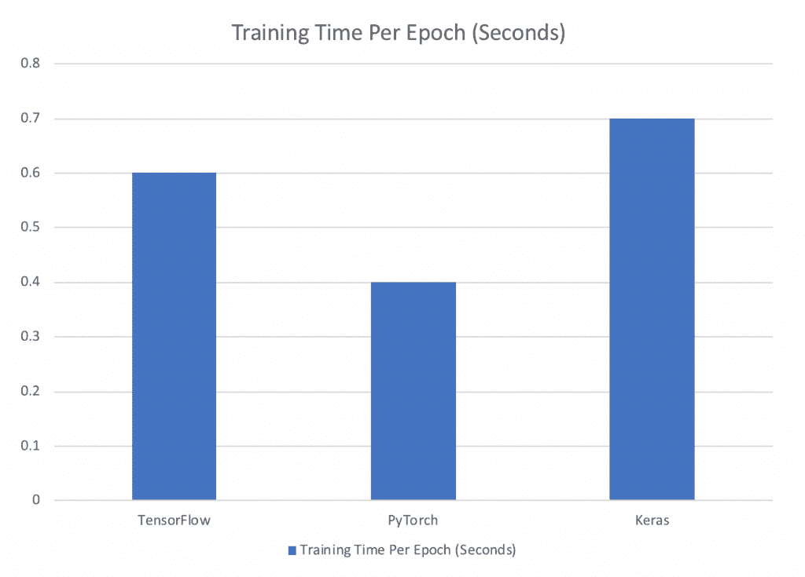
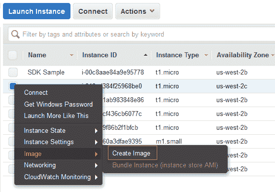
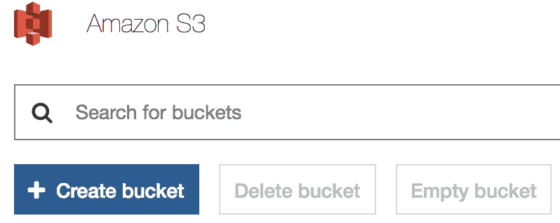
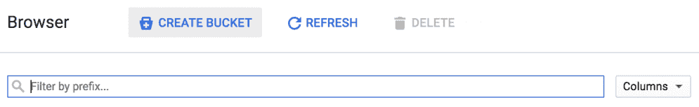

# 第三章：平台和其他必需品

在本章中，我们将讨论重要的库和框架，以便开始**人工智能**（**AI**）。我们将介绍三种最流行的深度学习框架——TensorFlow、PyTorch 和 Keras——的基本功能，展示如何在每个框架中启动和运行，因为我们将在接下来的章节中使用它们。我们将涉及用于 AI 的计算，并讨论如何通过 GPU 和其他先进的存储单元来改进它。最后，我们将讨论两种流行的深度学习云计算框架的基础知识：AWS 和 Google Cloud。

本章将涵盖以下主题：

+   Python 中深度学习的基本库：TensorFlow、PyTorch 和 Keras

+   用于 AI 的 CPU、GPU 和计算框架

+   AWS 和 Google Cloud 的基础知识

# 技术要求

我们将在 Python 3 中使用 TensorFlow、PyTorch 和 Keras 进行工作。建议您的计算机上配备 NVIDIA GPU。建议以下模型：

+   GTX 1080 Ti

+   GTX 1070

+   GTX 1060

如果您没有 NVIDIA GPU，请按照 *云计算* 部分的提示在 AWS 上使用 GPU 实例。

您还必须拥有 AWS 和 Google Cloud 账户；两者均免费，您可以在各自的网站上注册。

# TensorFlow、PyTorch 和 Keras

在本节中，我们将介绍三种最流行的深度学习框架：TensorFlow、PyTorch 和 Keras。虽然我们将了解每个包的基本功能，但作为我们实践学习 AI 的一部分，我们将在后续章节中学习每个框架特定的深度学习功能。

# TensorFlow

**TensorFlow** 是最流行、最贡献的深度学习库。最初由 Google Brain 开发，用于 Google 自己的 AI 产品，2015 年开源以来已成为深度学习的标准。TensorFlow 是 Google 自己的所有基于深度学习的产品的基础，如 Google 翻译和 Google Cloud 平台的机器学习 API。Google 特意设置 TensorFlow 以便并行化，因此在分布式环境中表现非常出色。

TensorFlow 提供了 Python、C++、Java 等的 API；然而，在本书中，我们将继续使用 Python。可以通过简单的 `pip install tensorflow` 命令从 PyPy 安装 TensorFlow。

# 基本构建块

如您可能从名称中猜到的那样，TensorFlow 依赖于我们在前一章中学到的张量的代数概念。从输入数据到参数，所有东西都存储在 TensorFlow 中的张量中。因此，TensorFlow 拥有其自己的函数来处理 NumPy 通常处理的许多基本操作。

在 TensorFlow 中编写张量时，实际上我们是在编写一个数组结构。记得数组如何可以是一个秩为 1 的张量吗？这正是我们在前面的例子中传递的内容。如果我们想传递一个秩为 3 的张量，我们只需写 `x = tf.constant([1,2,3,4],[5,6,7,8],[9,10,11,12])`。你会注意到，我们在下面的代码中定义了常量；这些只是 TensorFlow 中三种数据结构中的一种：

+   **常量**：定义的不可改变的值

+   **占位符**：将在 TensorFlow **会话**中赋值的对象

+   **变量**：与常量类似，只是值可以改变

好的，回到代码。如果我们运行以下代码块，我们将得到一个 **TensorFlow 对象**，看起来像张量（`"Mul:0"`，`shape=(4,)`，`dtype=int32`）。

```py
## Import Tensorflow at tf for simplicity
import tensorflow as tf

## Define two constants 
const1 = tf.constant([4])
const2 = tf.constant([5])

## Multiply the constants
product = tf.multiply(const1, const2)
```

为什么？因为 TensorFlow 基于 **会话** 的概念运行。TensorFlow 的底层代码是用 C++ 编写的，会话允许高层的 TensorFlow 包与低层的 C++ 运行时进行通信。

在运行 TensorFlow 会话之前，我们需要告诉它初始化我们声明的所有变量，然后运行初始化程序## 在 TensorFlow 中，我们必须先初始化一个会话对象

```py
## Variable Initializer
init = initialize_all_variables()

## Initialize the session
sess = tf.Session()
sess.run(init)

## Run the session
print(sess.run(product)) 

## Close the session
sess.close()
```

TensorFlow 中最后一个重要的概念是 **作用域**。作用域帮助我们控制模型中的各个操作块：

```py
with tf.name_scope("my_scope"):
            ## Define two constants 
            const1 = tf.constant([4])
            const2 = tf.constant([5])

            ## Multiply the constants
            product = tf.multiply(const1, const2)
```

就这样！我们已经成功地在 TensorFlow 中执行了第一个操作。在接下来的章节中，我们将学习更多关于 TensorFlow 在构建 **人工神经网络（ANNs）** 中的深入操作。

# TensorFlow 图

TensorFlow 最重要和强大的功能之一是它的图。当你定义了前面描述的三种 TensorFlow 数据结构之一时，你会自动将一个 **节点** 和一个 **边** 添加到图中。节点代表操作，边代表张量，因此如果我们执行基本的乘法运算，如前面的例子中所示，`const1` 和 `const2` 将表示图中的边，`tf.multiply` 将表示一个节点，而 `product` 将表示该节点的输出边。TensorFlow 的图是 **静态** 的，这意味着我们不能在运行时更改它。

记住，ANN（人工神经网络）执行数百次计算；在每一步计算和解释时会极其消耗计算资源。TensorFlow 图...

# PyTorch

**PyTorch** 是一个较新的但正在快速发展的深度学习库，基于用于 Facebook 深度学习算法的 Torch 框架。与 TensorFlow 不同，PyTorch 不是一个编译到底层语言的封装器，而是直接用 Python 编写，模仿 Python 的原生语法。如果你有过 Python 编程经验，PyTorch 会让你感觉非常熟悉。

可以通过以下命令轻松安装 PyTorch：

```py
conda install pytorch torchvision -c pytorch
```

目前，PyTorch 没有 Windows 版本，这可能会使一些用户无法使用。

# 基本构建块

和 TensorFlow 一样，PyTorch 以张量形式表示数据。Torch 张量被定义为标准数据类型，如`torch.FloatTensor()`、`torch.charTensor()`和`torch.intTensor()`。如前所述，PyTorch 中的操作非常符合 Python 的风格。为了重复我们在前面 TensorFlow 中执行的相同乘法操作：

```py
import torch x = torch.IntTensor([4])y = torch.IntTensor([5])product = x * y
```

由于其原生的 Python 风格，PyTorch 允许标准的 numpy 数组与 PyTorch 张量之间的轻松互动。在两者之间切换非常容易：

```py
import torch import numpy as np## Create a numpy arraynumpy_array = np.random.randn(20,20)##Convert the numpy array to a pytorch tensorpytorch_tensor ...
```

# PyTorch 图

PyTorch 看起来更符合 Python 风格，因为它具有**动态图计算结构**。由于 Python 是一种解释型语言，意味着操作是在运行时执行的，PyTorch 的图形功能旨在通过允许我们在运行时修改图中的变量来复制这一点。简单来说，PyTorch 的图是在你实际执行代码时创建的，而不像 TensorFlow 那样预先静态定义。架构上，这意味着你实际上可以在训练过程中改变网络架构，这使得 PyTorch 能够适应更多前沿、动态的架构。

# Keras

**Keras**是目前最为高级的深度学习库，通常是人们在 AI 之旅中开始的地方。尽管本书将重点介绍使用 TensorFlow 的应用，但由于 Keras 的普及性和易用性，介绍它是非常重要的。

由谷歌的 François Chollet 编写，Keras 是一个可以在 TensorFlow 或其他库（如 Apache、MXNet 或 Theano）之上运行的封装库。像其他库一样，可以通过在终端或命令行中运行`pip install keras`来通过 PyPy 安装。功能上，它与 scikit-learn 的工作方式非常相似，因此是那些希望尽快动手实践深度学习的人的热门库。

像 PyTorch 一样，Keras 的设计旨在...

# 基本构建块

由于 Keras 被设计为一个模型级别的库，它不包含像 PyTorch 或基础 TensorFlow 那样进行基本操作的方法。相反，它利用 TensorFlow 作为后端。因此，它的基本操作与 TensorFlow 的基本操作相同：

```py
import keras.backend as K
x = K.constant(5)
y = K.constant(6)
product = x * y

```

Keras 也使用与 TensorFlow 相同的图结构。我们将在下一章的*你的第一个人工神经网络*中学习更多关于 Keras 模型构建的方法。

# 总结

那么，最好的库是什么呢？正如你在以下截图中看到的，一个基准测试将 PyTorch 与其他深度学习库进行比较时，PyTorch 牢牢占据了领先地位：



最终，你选择的库主要取决于个人偏好；不过，一般来说：

+   **Keras**：最适合初学者或那些希望在 ANN 上做*快速粗糙*工作的用户

+   **TensorFlow**：广泛使用，有很多优秀的代码库和教程可以在线获取，并且在云计算机镜像和各种计算框架中有广泛的集成。

+   **PyTorch**：提供卓越的速度和易用性，但仍然在开发中，...

# 云计算基础

通常，本地 GPU 集群并不总是可用或实际可行。更多时候，许多企业正在将它们的 AI 应用程序迁移到云端，利用像 **亚马逊云服务**（**AWS**）或 **谷歌云平台**（**GCP**）这样的流行云服务提供商。当我们谈论云时，我们实际上是在谈论作为服务提供的数据库和计算资源。像 AWS 和 GCP 这样的云解决方案提供商在全球各地拥有数据中心，远程存储数据并运行计算任务。当你的数据在云中，或者你在云中运行程序时，实际上是在这些数据中心之一运行或存储。在云计算术语中，我们将这些数据中心或数据中心集群称为 **区域**。

云服务分为三种不同的提供结构：

+   **基础设施即服务**（**IaaS**）：原始计算和网络资源，你可以用来构建基础设施，像在本地一样

+   **平台即服务**（**PaaS**）：托管服务，隐藏了基础设施组件

+   **软件即服务**（**SaaS**）：完全托管的解决方案，如在线电子邮件

在本节中，我们将讨论 IaaS 解决方案和 PaaS 解决方案。虽然云服务提供商确实为 AI 提供 SaaS 解决方案，但它们对我们需求来说过于高层。在本节中，我们将讨论你需要利用云计算能力的基本工具。在本章的最后，我们将在 *维护 AI 应用程序* 一节中更详细地讨论云计算。

# AWS 基础

**AWS** 是市场上最受欢迎的云计算提供商。在本节中，我们将探索云端设置的基础知识，包括创建和连接 EC2 实例（亚马逊的主要云计算框架），以及如何在云中设置虚拟机。

我们还将简要介绍如何利用亚马逊的批量存储组件 S3。虽然 AWS 提供了多种机器学习服务，但我们将专注于如何利用 AWS 云计算架构为你的 AI 系统提供支持。

# EC2 和虚拟机

AWS 系统的构建模块是 **弹性云计算**（**EC2**）实例；它是一个虚拟服务器，允许你在云中运行应用程序。在本章中，EC2 将是我们云计算工作的基础。对于开发者和数据科学家，亚马逊提供了一套名为 **亚马逊机器镜像**（**AMI**）的虚拟机，其中预装了你所需的一切，以便在云中开始深度学习。就我们的目的而言，亚马逊有一个 Ubuntu AMI 以及一个亚马逊 Linux 发行版 AMI，预装了 Python 3 和 TensorFlow、PyTorch 和 Keras。

要开始使用 EC2 进行深度学习，我们只需按照几个步骤操作：

1.  登录到您的 Amazon Web Services 账户。

1.  在搜索栏中搜索 EC2 并选择该服务以打开新的控制台。

1.  选择“启动实例”按钮并在 AWS 市场中搜索 AWS 深度学习 AMI。您可以选择 Ubuntu 版本或 Amazon Linux。

1.  选择一个 GPU 实例来运行您的镜像。我们建议选择 G2 或 P2 实例。每一页都选择“下一步”，直到到达“配置安全组”页面。在“源”下，选择“我的 IP”以仅允许使用您的 IP 地址访问。

1.  点击“启动实例”。

1.  创建一个新的私钥并将其保存在本地；这将帮助您稍后连接到您的实例。

现在，您应该已经设置好并准备好使用您的 AMI。如果您在 AWS 账户中已经有一个正在运行的 EC2 实例，选择该实例，然后右键点击“镜像”选项，选择“创建镜像”：



按照提示选择“创建镜像”。之后，您可以通过选择 EC2 -> AMIs 来找到该 AMI，位于主资源管理工具栏下。如果您仍然看不到您的 AMI，可以在 AWS 网站上找到更详细的说明：[`docs.aws.amazon.com/toolkit-for-visual-studio/latest/user-guide/tkv-create-ami-from-instance.html`](https://docs.aws.amazon.com/toolkit-for-visual-studio/latest/user-guide/tkv-create-ami-from-instance.html)。

要使用您的新虚拟机，首先在 AWS 上启动实例。此处通过使用以下命令初始化 `ssh`（确保您在刚刚下载的 `pem` 密钥文件所在的目录）：

```py
cd /Users/your_username/Downloads/
ssh -L localhost:8888:localhost:8888 -i <your .pem file name> ubuntu@<Your instance DNS>
```

一旦您连接了终端或命令行，就可以像在本地计算机上使用命令行一样使用该界面。

# S3 存储

**Amazon 简单存储服务**（**Amazon S3**），是 AWS 的大规模云存储解决方案。S3 被设计为简单、便宜且高效——它的工作方式就像您计算机上的本地目录一样。这些存储位置被称为**存储桶**，可以存储最多 5 TB 的数据。

要设置 S3，登录到您的 AWS 控制台，找到 S3 服务，然后点击“创建存储桶”。



您可以设置权限，控制谁可以访问 S3 存储桶中的数据，以便在需要限制访问时进行管理。

# AWS Sagemaker

SageMaker 是 Amazon 提供的完全托管的云机器学习服务。作为**平台即服务**（**PaaS**）产品，SageMaker 是部署机器学习模型的最简单方式之一。与竞争对手不同，Amazon SageMaker 仅运行 Python 2.7。SageMaker 在云中处理机器学习服务有两个选项：

1.  在托管的 Jupyter notebook 中创建并训练您的模型

1.  从 Docker 化版本的模型开始训练

在接下来的章节中，我们将深入探讨如何使用 SageMaker 训练和部署模型。

# Google Cloud Platform 基础

虽然 AWS 是云市场的主要玩家，并且已经占据了一段时间的市场主导地位，但在过去几年中，**Google Cloud Platform**（**GCP**）逐渐获得了人气，尤其是在机器学习领域。你可以通过访问[`cloud.google.com/free/`](https://cloud.google.com/free/)并进入控制台，免费注册 GCP。请记住，你需要一个 Google 用户账户，例如 Gmail 账户，才能注册 Google 服务。尽管很多小任务可以在平台的免费层级中完成，GCP 也为新用户提供了 $300.00 的信用额度以帮助入门。

GCP 中的所有服务都在项目的框架下运行。项目是用于组织计算工具、用户和访问权限，以及计费的工具…

# GCP 云存储

云存储是一个简单的、桶式结构的存储选项，类似于 AWS S3。像 AWS 一样，GCP 云存储可容纳最多 5 TB 的数据。与 AWS 或 Microsoft Azure 等竞争对手不同，GCP 的云存储在大文件的上传和下载速度上大约比竞争对手快三倍。云存储还拥有市场上最快的 **吞吐量**。吞吐量是一个云概念，衡量在特定时间内处理的数据量——简而言之，就是数据处理的速度。当创建依赖于流数据的某些应用时，这一点至关重要。云存储还支持创建跨服务区域的桶，这有助于提高数据的容错性和可用性。

要设置一个 Cloud 存储桶，请登录 GCP 控制台，搜索存储，然后点击创建存储桶：



除了标准的计算和存储服务外，GCP 还有另一个工具——ML 引擎，它为机器学习模型提供无缝的训练和部署操作。

# GCP Cloud ML 引擎

Google Cloud Platform 的 Cloud ML Engine 相当于 AWS SageMaker。作为一个托管 PaaS，Cloud ML 处理机器学习算法的训练和部署过程。如果你在想——那像 AWS 上的基础计算服务 EC2 呢？GCP 也有类似服务。Compute Engine 是 GCP 对 Amazon EC2 的回应；它提供基础的、可扩展的云计算服务。虽然我们可以使用 Compute Engine 来搭建 AI 平台，但 GCP 已经使得通过 Cloud ML Engine 构建变得异常简单，因此我们将不会涵盖基础的 Compute Engine。

让我们深入了解细节。Cloud ML 引擎允许你：

+   在本地进行测试并在云端训练 scikit-learn 和 TensorFlow 模型

+   创建可重训练的…

# CPUs、GPUs 和其他计算框架

AI 的进步始终与我们的计算能力密切相关。在本节中，我们将讨论用于驱动 AI 应用程序的 CPUs 和 GPUs，以及如何设置系统以支持加速的 GPU 处理。

计算机中的主要计算硬件被称为 **中央处理单元** (**CPU**)，CPU 设计用于一般计算任务。虽然本地 CPU 可以用来训练深度学习模型，但你可能会发现训练过程中计算机会长时间卡顿。训练 AI 应用时，使用 CPU 的“表亲”——**图形处理单元** (**GPU**) 更加聪明。GPU 设计用于并行处理，正如人工神经网络（ANN）进行并行处理一样。正如我们在上一章中学到的，AI 应用需要大量的线性代数运算，而这些正是视频游戏所需要的运算类型。最初为游戏行业设计的 GPU，提供了成千上万个核心来处理这些运算，并进行并行化处理。这样，GPU 自然适合于构建深度学习算法。

在选择用于深度学习应用的 GPU 时，我们需要关注三个主要特征：

+   **处理能力**：GPU 的计算速度；定义为 *核心数* x *速度*

+   **内存**：GPU 处理不同大小数据的能力

+   **RAM**：你可以在任何给定时刻在 GPU 上处理的数据量

本节将重点介绍使用最受欢迎的深度学习 GPU 品牌——**NVIDIA**，其 CUDA 工具包让开箱即用的深度学习变得非常简单。作为 NVIDIA 的主要竞争对手，Radeon AMD GPU 使用一个名为 **OpenCL** 的工具包，而该工具包与大多数深度学习库的兼容性并不是开箱即用的。尽管 AMD GPU 提供了价格合理的强大硬件，但为了更顺利地上手，最好选择 NVIDIA 产品。

如果你的计算机没有 GPU 或者有其他 GPU，建议你利用 AWS 上的 GPU 实例来跟随本教程的步骤。

# 安装 GPU 库和驱动程序

现在，让我们为构建 AI 应用程序设置计算机。如果你希望在本地计算机上执行此任务，建议你安装 Windows 或 Linux 发行版。不幸的是，大多数 macOS 不支持 GPU，因此我们在本节中不会涉及 macOS。如果你的计算机没有 NVIDIA GPU，请按照以下步骤操作。如果你有 NVIDIA GPU，你可以选择跟随 AWS 部分，或者跳到以下部分。

如果你不确定是否拥有 NVIDIA GPU，可以使用以下终端命令检查其是否存在：

```py
lspci -nnk | grep -i nvidia
```

# 使用 Linux (Ubuntu)

Linux 和 AI 就像天作之合。当你在 Android 手机上与 Google Assistant 对话，或者在 Windows 设备上与 Cortana 对话，抑或是在电视上看 Watson 如何赢得《危险边缘》游戏的那一局时，这一切都基于 Linux。

当我们在本章讨论 Linux 时，我们指的是一种特定的发行版，叫做 **Ubuntu**，它是 Linux 操作系统中最受欢迎的发行版之一。推荐你使用旧版的、更稳定的 Ubuntu（版本 14.04），虽然它会对你的 AI 应用产生很好的效果，但它肯定没有标准的 Windows 操作系统那么稳定。

如果你想在本地机器上使用 Ubuntu，查看 Ubuntu 的教程，了解如何在 Windows 机器上安装它（[`tutorials.ubuntu.com/tutorial/tutorial-ubuntu-on-windows#0`](https://tutorials.ubuntu.com/tutorial/tutorial-ubuntu-on-windows#0)）。如果你没有 PC 或者想设置虚拟实例，AWS 有一个很棒的教程（[`aws.amazon.com/getting-started/tutorials/launch-a-virtual-machine/`](https://aws.amazon.com/getting-started/tutorials/launch-a-virtual-machine/)），帮助你一步步完成设置：

1.  要在 Ubuntu 上开始使用 GPU 深度学习，我们首先需要安装 GPU 驱动程序。在此示例中，我们将使用 `wget` 和 `chmod` 来获取并设置读写权限：

```py
wget http://us.download.nvidia.com/XFree86/Linuxx86_64/367.44/NVIDIA-Linux-x86_64-367.44.run

sudo chmod +x NVIDIA-Linux-x86_64-367.35.run
./NVIDIA-Linux-x86_64-367.35.run --silent
```

1.  安装完成后，你可以通过运行简单的 `nvidia-smi` 命令检查安装是否成功。

1.  接下来，让我们安装 NVIDIA CUDA。CUDA 是一个 NVIDIA 软件包，它允许我们在 GPU 上运行 TensorFlow 模型：

```py
wget"http://developer.download.nvidia.com/compute/cuda/repos/ubuntu1604/x86_64/cuda-repo-ubuntu1604_8.0.44-1_amd64.deb"
## Install the drivers
sudo chmod +x cuda_7.5.18_linux.run
./cuda_7.5.18_linux.run --driver --silent
./cuda_7.5.18_linux.run --toolkit --silent
./cuda_7.5.18_linux.run --samples --silent

```

1.  接下来，让我们将库添加到系统路径中：

```py
echo ‘export LD_LIBRARY_PATH=”$LD_LIBRARY_PATH:/usr/local/cuda/lib64:/usr/local/cuda/extras/CUPTI/lib64"’ >> ~/.bashrc
```

1.  最后，我们需要安装一个更高级别的软件包，叫做 cuNN，这是一个位于 CUDA 之上的特定库，为典型的深度学习操作提供高度优化的过程：

```py
sudo scp cudnn-7.0-linux-x64-v4.0-prod.tgz
```

1.  最后一步是将文件移动到正确的位置：

```py
tar -xzvf cudnn-7.0-linux-x64-v4.0-prod.tgz
cp cuda/lib64/* /usr/local/cuda/lib64/
cp cuda/include/cudnn.h /usr/local/cuda/include/
```

1.  就这样，我们在 Ubuntu 上已经为 GPU 加速做好了准备。我们的最后一步是简单地安装支持 GPU 的 TensorFlow 版本，并使用 Python 3：

```py
pip3 install tensorflow-gpu
```

# 在 Windows 上

要在 Windows 上为深度学习设置 GPU，你必须运行 Windows 7 或更高版本。你可以通过 **Windows 设备管理器** 中的 **显示适配器** 部分验证是否拥有支持 CUDA 的 GPU。在这里，你会找到显卡的厂商名称和型号。

1.  要查看你拥有什么类型的 GPU，打开命令行并运行：

```py
control /name Microsoft.DeviceManager
```

1.  如果你没有为你的 NVIDIA GPU 安装驱动程序，或者想要更新驱动程序，你可以在 NVIDIA 网站上根据你的设备找到正确的驱动程序：[`www.nvidia.com/Download/index.aspx?lang=en-us`](http://www.nvidia.com/Download/index.aspx?lang=en-us)。

1.  接下来，去 NVIDIA 网站获取 CUDA 工具包（[`developer.nvidia.com/cuda-downloads`](https://developer.nvidia.com/cuda-downloads)）。选择 **CUDA 版本 ...**

# 基本的 GPU 操作

现在我们的 GPU 已经为深度学习做好了设置，让我们学习如何使用它们。在 TensorFlow 中，GPU 以字符串的形式表示：

+   `/cpu:0`：你机器的 CPU

+   `/device:GPU:0`：你机器的 GPU，如果有的话

+   `/device:GPU:1`：你机器的第二个 GPU，依此类推

**分布式训练**是指跨多个 GPU 训练网络的做法，它正成为 AI 领域中训练模型的越来越常见的方法。TensorFlow、Keras 和 PyTorch 都支持分布式训练。

**日志记录**是 TensorFlow 中的一项操作，用于将特定的命令集分配给系统上的特定 GPU 或 CPU。通过日志记录，我们还可以**并行化**我们的操作，这意味着我们可以同时跨多个 GPU 分配训练任务。为了做到这一点，我们使用一个简单的循环结构：

```py
my_list = []
## Iterate through the available GPUs
for device in ['/gpu:0', '/gpu:1']:
    ## Utilize the TensorFlow device manager
    with tf.device(device):
        x = tf.constant([1,2,3], shape=[1,3])
        y = tf.constant([1,2,3],shape [3,1]) 
        my_list.append(tf.matmul(x, y))

    with tf.device('/cpu:0'):
        sum_operation = tf.add(x,y)

    ## Run everything through a session
    sess = tf.Session(config=tf.ConfigProto(log_device_placement=True))
    sess.run(sum_operation)

```

我们首先创建一个空集，并使用迭代器将矩阵乘法过程分配到两个 GPU 上：GPU1 和 GPU2。另一个过程，即简单的加法，被分配给我们的 CPU。然后，我们将这两个过程都通过 TensorFlow 会话执行，正如我们之前所做的那样。

请记住，这种设备管理适用于本地设备，云架构的管理方式是不同的。

# 未来—TPU 及更多

Google 最近发布了一款名为**张量处理单元**（**TPU**）的新硬件，专门为 AI 应用设计。这些 TPU 提供比 CPU 或 GPU 高 15 到 30 倍的性能，并且在每瓦性能上高出 30 到 80 倍。大规模生产级 AI 应用中的权重数量可以从五百万到一亿不等，而这些 TPU 在执行这些操作时表现出色。

TPU 专门为 TensorFlow 处理量身定制，目前可在 Google Cloud 上使用。如果你有兴趣探索它们的功能，GCP 提供了一个很棒的教程（[`cloud.google.com/tpu/docs/quickstart`](https://cloud.google.com/tpu/docs/quickstart)）来帮助你入门。

# 总结

AI 平台和方法的领域非常广泛；在本章中，我们概述了 AI 领域中一些最有前景且广受好评的技术。对于深度学习包，我们了解了 TensorFlow、PyTorch 和 Keras。TensorFlow 由 Google 发布，是深度学习库中最受欢迎和最强大的一个。它利用会话和静态图来编译其底层的 C++代码。另一方面，PyTorch 是一个较新的库，采用动态图进行运行时执行，这使得它的使用感觉更像是原生 Python。最后，Keras 是一个高层次的库，运行在 TensorFlow 之上，适用于创建不需要太多定制的简单网络。

我们还讨论了云计算，利用 AWS 作为最流行的云计算服务，其主要的工作组件是 EC2 实例和 S3 桶。EC2 由虚拟服务器组成，可以用于扩展人工智能应用程序，在没有硬件或不需要硬件的情况下运行。S3，亚马逊的简单存储服务，使我们能够存储运行应用程序所需的数据和其他资源。最后，我们讲解了如何为你的计算机和编程语言启用 GPU 加速深度学习。在下一章，我们将通过创建我们的第一个人工神经网络（ANNs）来应用这些知识。

在下一章，我们将把第二章《*机器学习基础*》中学到的基本知识与本章的平台注册知识结合起来，创建我们的第一个人工神经网络（ANNs）。
