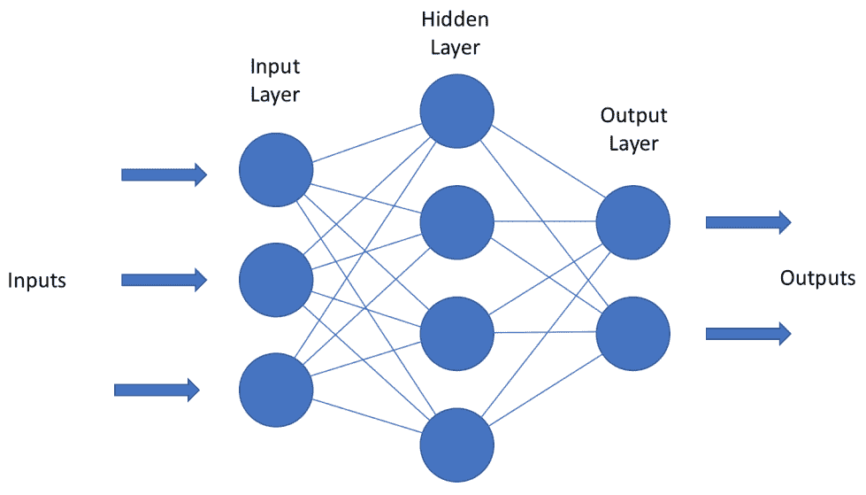

# 第四章：你的第一个人工神经网络

在过去几章中，我们学习了机器学习的基础知识，并了解了如何设置我们的环境来创建**人工智能**（**AI**）应用程序。现在，既然我们已经掌握了基础知识，是时候将我们的知识付诸实践了。

在这一章中，我们将重点关注：

+   如何构建基本的 AI 应用程序，从构建一个基本的前馈网络开始，使用 TensorFlow。

+   我们将讨论**人工神经网络**（**ANNs**）的基本元素，并编写一个基本的前馈网络示例来进行说明。

ANN 使我们能够定义复杂的非线性问题，随着我们深入研究真正的深度学习机制，你将开始看到 AI 应用程序的强大之处...

# 技术要求

我们将使用在前一章中开发的支持 GPU 的 TensorFlow 环境。你将需要：

+   Python 3.6

+   GPU TensorFlow

+   PyTorch

# 网络构建模块

ANN 的最基本形式被称为**前馈网络**，有时也叫**多层感知器**。这些模型虽然本质上很简单，但包含了我们将要研究的各种类型的 ANN 的核心构建模块。

从本质上讲，前馈神经网络不过是一个**有向图**；层与层之间没有回归连接的循环，信息仅仅是顺着图向前流动。传统上，当这些网络被展示时，你会看到它们如下面的图所示：



一个前馈神经网络

在这种最基本的形式下，ANN 通常是...

# 网络层

**输入层**由我们传递给神经网络的特征组成。如果我们的输入是一个*10 x 10*像素的图像，那么我们将有 100 个输入单元。输入层实际上并不执行任何操作，但它是输入层和隐藏层之间的连接，这一点非常重要。

我们的输入层连接对输入向量执行线性变换，并将变换结果传递给隐藏层，通过隐藏层，这些结果通过**激活函数**进行转化。一旦我们完成这一计算，我们将结果传递给隐藏层。**隐藏层**是我们激活函数所在的位置，我们的网络可以有任意数量的隐藏层。隐藏层之所以被称为“隐藏层”，是因为它们计算的值在训练集中是看不见的；它们的任务是将网络的输入转化为输出层可以使用的东西。它们让我们能够学习数据集中的更复杂特征。

最后一层隐藏层的输出被发送到最终层，即**输出层**。输出层是我们网络中的最后一层，它将隐藏层的结果转化为你想要的输出形式，可以是二分类、实数等。我们通过利用特殊类型的激活函数来完成这一转化。一般来说：

+   对于分类问题，我们通常会使用一种叫做**softmax**的函数。

+   对于回归任务，我们将使用**线性**函数。

你选择激活函数的方式确实取决于你的**损失函数**，因为我们希望在训练过程中，损失函数的导数易于计算。

# 神经网络的命名和大小设置

我们通过网络中**全连接层**的数量来称呼网络，减去输入层。因此，下面的图示中的网络将是一个二层神经网络。单层网络则没有输入层；有时，你会听到逻辑回归被描述为单层网络的特殊情况，使用了**sigmoid**激活函数。当我们特别谈到深度神经网络时，指的是具有多个隐藏层的网络，如下图所示：


网络通常按其拥有的参数数量来衡量大小...

# 在我们的 MNIST 示例中设置网络参数

看看我们的 MNIST 示例，现在我们可以设置整体网络参数。我们将`input_layer_size`定义为输入数据的大小，即`784`。这将给出输入层中的神经元数量。参数`hidden_one`和`hidden_two`将定义隐藏层中的神经元数量。同时，`number_classes`会构建输出层，即输入数据可以被分类为的潜在类别数量：

```py
## Size of the input data
input_layer_size = 784 

## Define the size of the hidden layers; We want them to be smaller than the input
hidden_layer_one = 256
hidden_layer_two = 256 

## Size of the potential output classes
number_classes = 10 
```

总的来说，这些参数将根据`MNIST`数据集的形状，定义我们网络的输入层和输出层的大小。

# 激活函数

**激活函数**是使神经网络能够实现其功能的基础：以非线性方式将输入转换为所需的输出。因此，它们通常被称为**非线性函数**。结合我们之前学到的知识，在神经网络中，我们计算输入（*X*）与相应权重（*w*）的乘积和，并对其应用激活函数*f*（*x*），以获取该层的输出，并将其作为输入传递给下一层。

如果没有非线性函数，一个单元就只是一个简单的线性函数，我们的网络就会像线性回归一样。当我们思考传统的分析模型，比如线性回归或支持向量机时，...

# 历史上流行的激活函数

你常常会看到的三种激活函数是`sigmoid`、`tanh`和**修正线性单元**（**ReLU**）函数。尽管这些函数很受欢迎，但每个函数的使用都有一些常见的局限性。

在 2010 年代初期，使用 sigmoid 或 tanh 激活函数在网络的全连接层中非常流行。尽管 sigmoid 已经不太流行，但你仍然可能会看到它们。它们的值被限制在 0 和 1 之间（即：它们可以表示该范围内的任何值）。

```py
import math
import numpy as np 

def sigmoid(x):
 s_out = []
 for item in x:
     s_out.append(1/(1+math.exp(-item)))
 return s_out
```

我们可以轻松地在 Python 中绘制一个`sigmoid`函数来看看：

```py
x = np.arange(-10., 10., 0.2)
f = sigmoid(x)
plt.plot(f,sig)
plt.show()
```


该函数也可以在 TensorFlow 中简单地通过`tf.sigmoid`来调用。`tanh`是一个非常类似的函数；它只是 sigmoid 的一个缩放版本：

```py
import numpy as np
import matplotlib.pyplot as plt

tanh = np.tanh(np.arange(-5, 5, .1))

fig = plt.figure()
ax = fig.add_subplot(111)
ax.plot(np.arange(-5, 5, .1), tanh)
ax.set_ylim([-1.0, 1.0])
ax.set_xlim([-5,5])
plt.show()
```


同样，`tanh`函数也可以在 TensorFlow 中通过`tf.tanh`来调用。

这两者都容易遇到梯度消失问题**。**`sigmoid`和`tanh`都容易出现所谓的**饱和**问题。当这些函数在两端饱和时，如果初始化的权重过大，梯度会变得接近零，导致饱和。

`sigmoid`和`tanh`函数本质上是有界的——它们有最大值和最小值。当非线性函数的输出值接近这些界限时，就会发生饱和。与`sigmoid`不同，`tanh`总是以零为中心，因此不太容易发生饱和。因此，在选择激活函数时，总是推荐使用`tanh`而非`sigmoid`。

由于这些激活函数的特殊性，2000 年代末期开始使用一种新的函数，称为**ReLU**：


ReLU 是一个简单且高效的非线性函数，它计算最大值：


ReLU 由于其线性和非饱和的特性，以及计算效率，使得收敛（即误差率较小）变得更快。ReLU 使用零矩阵，这比 sigmoid 或 tanh 函数所使用的指数运算要高效得多，有时使得其计算速度比 tanh 快多达六倍。然而，ReLU 也会遇到一个问题，即*死亡神经元问题*。当大梯度与不合适的权重更新相结合，导致 ReLU 函数输出零梯度时，非线性函数会在训练中“死亡”，这是由于学习率过大所致。像其他激活函数一样，ReLU 在 TensorFlow 中可以通过`tf.nn.relu`来调用。

近年来，实践者们已经放弃了`sigmoid`和`tanh`函数，转而基于 ReLU 创建了更稳定的方法。

# 现代激活函数方法

近年来，已经对 ReLU 函数做出了几种修改，以解决死亡神经元问题并增强其鲁棒性。最著名的解决方法是**Leaky ReLU**。Leaky ReLU 为 ReLU 函数引入了一个小斜率，以保持潜在的死神经元通过允许小的**梯度**保持神经元活跃。Leaky ReLU 函数在 TensorFlow 中可以这样使用：

```py
tf.nn.leaky_relu(features,alpha=0.2,name=None)
```

另一种变体，**参数化整流线性单元**（**PreLU**），进一步改进了这一点，使得小梯度成为一个可以在训练过程中调整的参数。与预定义函数的斜率不同，斜率变成了一个可以适应的参数，因此...

# 权重和偏差因子

人工神经网络的两个关键部分是权重和偏置。这些元素帮助我们压缩和拉伸我们的非线性函数，以帮助我们更好地逼近目标函数。

**权重**在神经网络的每次变换中都起作用，帮助我们拉伸一个函数。它们本质上改变了非线性函数的陡峭度。**偏置因子**也是人工神经网络的重要组成部分；你可能已经在本章中展示的图示中注意到了它们。偏置因子是允许我们将激活函数左右移动的值，帮助我们最接近一个自然函数。

这个在实际中是如何工作的呢？假设你有一个简单的两神经元设置，如下图所示：


让我们看看将权重引入其中如何改变函数。在 Python 中，我们可以将其表示为一个简单的设置，它接收输入数据 `x`，一个权重矩阵 `w`，计算它们之间的点积，并通过一个非线性函数：

```py
def single_output(x, w):
        return np.tanh(np.dot(x, w))
```

然后我们可以用不同的权重值运行函数，并绘制它的输出：

```py
x = np.arange(-5, 5, .1)
f1 = single_output(x, 0.5)
f2 = single_output(x, 1.0)
f3 = single_output(x, 2.0)
plt.plot(x,f1)
plt.plot(x,f2)
plt.plot(x,f3)
plt.show()
```

如果你运行此代码，你应该能看到如下图表：


正如你所看到的，简单的权重因子正在根据其大小弯曲我们的 sigmoid 函数！现在，假设你希望当输入为 5 时，网络的输出为 0.5。借助偏置因子，我们可以实现类似的变换：


在 Python 中，我们只需添加偏置因子来偏移输出：

```py
def single_output(x, w, b):
 return np.tanh(np.dot(x, w) + b)
```

运行以下代码，查看不同的偏置值如何将曲线从左右方向偏移；我们将所有权重设置为 1，以便清楚地看到偏移效果：

```py
x = np.arange(-5, 5, .1)
f1 = single_output(x, 1.0, 2.0)
f2 = single_output(x, 1.0, 1.0)
f3 = single_output(x, 1.0, -2.0)
f4 = single_output(x, 1.0, 0.0)
plt.plot(x,f1)
plt.plot(x,f2)
plt.plot(x,f3)
plt.plot(x,f4)
plt.show()
```

代码应产生如下曲线。正如你在下图所看到的，我们已经将曲线进行了偏移，以便它更好地逼近我们想要的函数：


在神经网络的训练过程中，权重和偏置会被更新。学习调整权重和偏置的目标之一是使我们网络中的变换结果尽可能接近真实值。

# 在我们的 MNIST 示例中使用权重和偏置

让我们回到 MNIST 示例。根据之前定义的网络参数，我们来设置权重和偏置。我们将输入层与第一隐藏层之间的连接权重表示为 `w1`，第一隐藏层与第二隐藏层之间的权重表示为 `w*2*`，第二隐藏层与输出层之间的权重表示为 `w_out`*。*注意权重是如何跟踪给定层数据的输入大小和输出大小的：

```py
weights = { 'w1': tf.Variable(tf.random_normal([input_layer_size, hidden_layer_one])), 'w2': tf.Variable(tf.random_normal([hidden_layer_one, hidden_layeR_two])),  'w_out': tf.Variable(tf.random_normal([hidden_layer_two, number_classes])) ...
```

# 损失函数

**损失函数**是神经网络的另一个重要组成部分，它衡量我们预测值与真实值之间的差异。

我们倾向于将函数看作是数学表达式；它们确实是这样，但它们也有形状和表面，或者说拓扑。拓扑本身是数学的一个分支内容，内容太多，不适合本书，但重要的要点是这些函数具有波峰波谷的拓扑，就像真实的拓扑图一样：


在人工智能领域，在创建神经网络时，我们试图找到这些损失函数中的最小点，称为**全局最小值**。这代表了我们实际值与预测值之间误差最小的点。达到全局最小值的过程称为**收敛**。

损失函数有两种变体：

+   **凸损失函数**：曲线向下的损失函数，例如碗的形状。这些损失函数是找到全局最小值的最简单方式。

+   **非凸损失函数**：看起来像前面的例子，具有许多波峰波谷。这些损失函数在寻找局部最小值时是最困难的。

非凸损失函数比较复杂，因为它们可能存在两个问题，称为**局部最小值**和**鞍点**。局部最小值顾名思义，就是损失函数中的低谷，它们不是整个拓扑结构中的最低点：


鞍点是拓扑中梯度等于零的区域。学习算法会在这些点上卡住，接下来我们将讨论如何通过神经网络的核心学习算法：**梯度下降**来解决这个问题。

那么，我们如何为网络选择损失函数呢？我们试图解决的问题将决定我们应选择哪个损失函数。选择合适的损失函数可能是一个耗时的任务，所以目前我们先关注一些通用规则。我们可以从使用**均方误差**（**MSE**）损失函数来处理回归问题开始。

# 使用损失函数进行简单回归

线性回归是我们可以实现的最简单的模型之一；你可能在自己的工作中已经使用过它。简单回归尝试找到两个线性分布变量的**最佳拟合线**。我们可以将之前学到的关于权重、偏差和损失函数的所有原则应用到简单回归中，看看它们是如何协同工作的。

现在，让我们回到损失函数。MSE 衡量观察值的实际值与预测值之间的平均平方差。输出是一个单一数字，表示当前权重集的成本或得分：

让我们在 TensorFlow 中开发一个线性回归模型，看看`loss`函数是如何工作的……

# 使用交叉熵进行二分类问题

尽管我们可以使用均方误差（MSE）解决回归问题，但分类问题则需要使用不同类型的损失函数。为此，我们使用一个叫做**交叉熵**的函数。交叉熵衡量的是分类模型的性能，该模型的输出值介于 0 和 1 之间。低交叉熵意味着预测的分类与实际分类相似。相反，高交叉熵则意味着预测的分类与实际分类不同。

它也被称为**伯努利负对数似然**和**二元交叉熵**：

```py
def CrossEntropy(yHat, y):
    if yHat == 1:
         return -log(y)
    else:
        return -log(1 - y)
```

为具有多个正确答案的分类问题定义`损失`函数可能会更棘手；在接下来的章节中，我们将介绍多类分类。我们还会在本书的最后部分讨论如何定制你的`损失`函数。

# 在我们的 MNIST 示例中定义损失函数

由于我们有一个基本的二分类任务——识别数字，我们将利用`交叉熵`作为我们的`损失`函数。我们可以通过 TensorFlow 中内置的函数轻松实现它：

```py
loss = tf.reduce_mean(tf.nn.softmax_cross_entropy_with_logits(network_output, y))
```

# 随机梯度下降

**梯度下降**是我们找到损失函数全局最小值的方式，它也是神经网络学习的过程。在梯度下降中，我们计算每个**梯度**的值，即损失函数的斜率。这有助于我们达到最小值。可以把它想象成盲 fold 下山；你唯一能到达山底的方法就是感知地面的斜坡。在梯度下降中，我们利用微积分来“感觉”地面的斜率，确保我们正朝着最小值的正确方向前进。

在传统的梯度下降中，我们必须计算每个传入网络的样本的损失，这会导致大量冗余的计算。

我们可以通过利用一种叫做**随机梯度下降**的方法来减轻这种冗余。随机梯度下降实际上是最简单的优化方法之一，巧合的是，它也出奇地有效。通常在深度学习中，我们处理的是高维数据。与普通的梯度下降不同，使用随机梯度下降时，我们可以通过每次采样一个数据点的损失，来近似计算梯度，从而减少冗余。

# 学习率

由于随机梯度下降是随机抽样的，因此我们在损失函数的表面上的位置会到处跳动！我们可以通过减小一个叫做**学习率**的参数来缓解这种情况。学习率是一个叫做**超参数**的东西，它控制着网络的训练过程。学习率控制我们根据损失函数的梯度调整网络权重的幅度。换句话说，它决定了我们在尝试达到全局最小值时下降的速度。值越小，我们下降得越慢，就像图中右侧描述的那样。可以想象把轮胎缓慢地滚下山坡——...

# 在我们的 MNIST 示例中使用 Adam 优化器

**自适应梯度下降法**（**Adam**）采用初始学习率，并自适应地计算对其的更新。Adam 存储过去平方梯度和过去梯度的指数衰减平均值，这相当于测量类似动量的东西。这帮助我们在训练过程中防止过冲或不足。

Adam 可以通过以下命令行轻松地在 TensorFlow 中实现：

```py
tf.train.AdamOptimizer(learning_rate=learning_rate).minimize(loss_func)
```

`tf.train` 类包含了不同的优化器，这些优化器在运行时执行，并包含 TensorFlow 版本的 Adam 优化器；它将我们最初定义的 `learning_rate` 作为一个参数。然后我们调用 `minimize` 方法，并将其传递给我们的 `loss` 函数，将我们的学习过程封装成一个叫做 `optimizer` 的对象。

# 正则化

回想一下第二章，《机器学习基础》一章中提到的，*过拟合*和*欠拟合*发生在机器学习模型过度学习其训练数据集，或者没有足够学习它时。人工神经网络也不能避免这个问题！过拟合通常发生在神经网络中，因为它们的参数数量对于训练数据来说过于庞大。换句话说，模型对于其训练的数据量来说过于复杂。

防止我们网络中过拟合的一种方法是通过一种叫做**正则化**的技术。正则化通过缩小模型的参数来创建一个较不复杂的模型，从而减少过拟合。假设我们有一个损失...

# 训练过程

训练是我们教会神经网络学习的过程，并且这个过程在我们的代码中是程序化控制的。回顾一下，第二章 *机器学习基础* 中提到的，AI 世界中有两种学习方式：监督学习和无监督学习。通常，大多数人工神经网络是监督学习者，它们通过**训练集**进行学习。神经网络中一个训练周期的单元被称为**周期（epoch）**。在一个周期结束时，您的网络已接触到数据集中的每个数据点一次。在一个周期结束时，周期被定义为在第一次设置网络时的**超参数**。每个周期包含两个过程：**正向传播**和**反向传播**。

在一个周期内，我们有**迭代**，它告诉我们有多少比例的数据已经通过了正向传播和反向传播。例如，如果我们有一个包含 1,000 个数据点的数据集，并且将它们全部一次性通过正向传播和反向传播，那么我们就有一个周期内的一个迭代；然而，有时为了加快训练速度，我们希望将数据分成更小的批次进行处理，所以我们对数据进行**小批量处理**。我们可以将 1,000 点的数据集分成四个迭代，每个迭代包含 250 个数据点，所有这些都发生在同一个周期内。

# 将所有内容整合在一起

现在，我们已经讲解了基本前馈神经网络的所有元素，是时候开始将这些部分组装起来了。我们首先要做的是定义我们的**超参数**。我们将训练网络 50 个周期，每次将 100 个样本的批次输入到网络中。在每个周期结束时，`batch_size` 参数将告诉网络打印出当前的损失值以及网络的准确度：

```py
## Network Parametersepochs = 15batch_size = 100display_step = 1
```

接下来，我们将为我们的 MNIST 数据特征 (*x*) 和正确标签 (*y*) 创建`占位符`，我们将在构建网络时使用这些占位符来表示数据：

```py
 # Create the Variablesx = tf.placeholder("float", None, ...
```

# 正向传播

正向传播是信息在训练阶段通过我们网络流动的过程。在我们详细讲解这个过程之前，让我们回到之前的 MNIST 示例。首先，我们需要初始化我们之前创建的前馈网络。为了做到这一点，我们可以简单地创建该函数的实例，并为其提供输入占位符，以及权重和偏置字典：

```py
network_output = feedforward_network(x, weights, biases)
```

这个模型实例会被传入我们之前定义的`loss`函数中：

```py
loss_func = tf.reduce_mean(tf.nn.softmax_cross_entropy_with_logits(logits=network_output, labels=y))
```

然后，这些数据会被传递到我们定义的优化器中：

```py
training_procedure = tf.train.AdamOptimizer(learning_rate=learning_rate).minimize(loss_func)
```

有了这些定义，你可以开始理解为什么占位符在 TensorFlow 中如此重要。输入占位符，以及随机初始化的权重和偏置，为 TensorFlow 构建模型提供了基础。如果没有这些，占位符，程序将无法知道如何编译网络，因为它无法理解输入、输出、权重和偏置值。

训练在 TensorFlow 中幕后进行，因此我们手动走一遍这个过程，以更好地理解背后的原理。最简单的来说，前向传播就是通过加权矩阵相乘并加上偏置单元，再通过激活函数处理。让我们看一下以下单一单元的示例，其中 *X1*:*X3* 代表我们的输入层（加上偏置值），而空的单元代表隐藏层中的节点：


记住，我们的输入和权重都是矩阵，因此我们将它们的乘法表示为**点积**。我们将这些值相加，得到结果，如下图所示：。最后，我们将该操作的结果传入隐藏层的激活函数。

假设我们使用 ReLU 作为隐藏层单元的激活函数，那么我们的单元计算如下：


该函数的输出随后会被第二组权重矩阵乘以，就像我们对第一层输出所做的那样。这个过程可以根据网络中隐藏层的数量反复进行：


网络的最后一层通常包含一个激活函数，如 softmax，用于输出预测值。在整个过程中，我们计算该次传递的误差，然后通过一个叫做**反向传播**的过程将误差反馈到网络中。

# 反向传播

**反向传播**（或称**反向传播算法**）是我们在 AI 应用中使用的核心学习算法，学习它将对构建和调试神经网络至关重要。**反向传播**是**误差反向传播**的缩写，它是人工神经网络（ANNs）计算预测错误的方式。

你可以把它看作是我们之前讨论的梯度下降优化算法的补充。回想一下，ANNs 的核心目标是学习一组权重参数，帮助它们逼近一个能够复制训练数据的函数。反向传播衡量每个训练周期后误差的变化，而梯度下降则尝试优化误差。反向传播计算梯度...

# 前向传播和反向传播与 MNIST

记住，在 TensorFlow 中，要运行训练过程，我们需要通过一个会话来执行计算。首先，让我们打开一个新的训练会话。

1.  在 TensorFlow 中，在我们进入训练过程之前，我们需要将模型类初始化为一个对象，并通过`tf.global_variables_initializer()`命令将所有的变量占位符加载到线上：

```py
with tf.Session() as sess:
    ## Initialize the variable
    sess.run(tf.global_variables_initializer())
```

1.  现在，我们可以编写训练过程的核心部分，也就是我们所说的训练循环。我们将根据模型的训练周期数来定义这个循环。在其中，我们首先对输入数据进行批处理；我们的模型不能也不应该一次性处理所有数据，因此我们通过之前定义的批次大小 100 来定义输入样本的总量。因此，在这 15 个训练周期中，我们会每次处理 100 个训练样本：

```py
for epoch in range(epochs):

     ## Batch the incoming data
     total_batch = int(mnist.train.num_examples/batch_size) 
```

1.  在同一个循环内，我们将创建另一个按批次运行训练过程的循环。我们将为 x 和 y 数据创建一个批次，并通过一个运行训练过程并计算损失的 TensorFlow 会话处理这些示例：

```py
for batch in range(total_batch):
            batch_x, batch_y = mnist.train.next_batch(batch_size)

            _, loss = sess.run([training_procedure, loss_func], feed_dict={x: batch_x, y: batch_y})                  
```

1.  到目前为止，我们已经定义了训练 TensorFlow 模型所需的最基本内容。除了训练过程本身，你通常还会看到一个过程，用于跟踪当前损失值以及准确度指标，以便我们知道模型训练得有多好（或者多差）。为此，我们将在之前定义的批处理循环的基础上定义一个新的循环，使其在每个训练周期结束时运行。在其中，我们通过运行网络的输出通过一个 `softmax` 函数来获取该周期的预测。Softmax 函数会输出每个样本属于某个类别的概率，在分类问题中非常常见：

```py
if epoch % display == 0:
            pred = tf.nn.softmax(network_output) 
```

1.  一旦我们得到了这些概率，我们需要从通过 softmax 返回的张量中选择最高的概率。幸运的是，TensorFlow 为我们提供了一个非常简便的函数 `tf.argmax`。有了它，我们就可以将其与实际的 y 值进行比较，看看我们应该期待的结果：

```py
correct_prediction = tf.equal(tf.argmax(pred, 1), tf.argmax(y, 1))
```

1.  一旦我们得到了正确的预测，我们可以计算 `accuracy`，保存模型检查点，并返回当前周期、损失函数的值以及该步骤的模型准确度：

```py
accuracy = tf.reduce_mean(tf.cast(correct_prediction, "float"))

saver.save(sess, save_model)

print("Epoch:", '%04d' % (epoch+1), "loss {:.9f}".format(loss), "Accuracy:", accuracy.eval({x: mnist.test.images, y: mnist.test.labels}))
```

1.  在训练过程结束时，你应该看到如下输出：


现在我们已经设置好网络并训练完成，让我们来看一下几个可以帮助我们检查训练进展的工具。

# 管理 TensorFlow 模型

TensorBoard 是一个内置于 TensorFlow 的工具，它可以在训练过程中可视化网络参数的值。它还可以帮助可视化数据，并运行几种探索性分析算法。它帮助你通过一个简单、易于使用的图形界面探索底层的 TensorFlow 图。

一旦一个 TensorFlow 模型经过训练，比如之前定义的 MNIST 示例，TensorFlow 允许我们创建一个叫做 **模型摘要** 的东西。摘要，正如你可能猜到的，是模型的简洁版本，包含了我们使用 TensorBoard 所需的关键要素。

1.  为了创建一个摘要，我们首先需要初始化 `writer`；我们将在前面插入这一行...

# 保存模型检查点

在 TensorFlow 中，检查点是一个包含训练过程中计算的模型权重和梯度的二进制文件。如果你想加载一个模型进行进一步训练，或者在训练的某个时刻访问模型，我们可以保存并恢复包含所有必要训练信息的检查点。为了保存一个检查点，我们可以使用 TensorFlow 提供的保存工具：

```py
save_model = os.path.join(job_dir, 'saved_mnist.ckpt')
saver = tf.train.Saver()
```

然后，在训练周期中，我们可以定期通过调用 `saver` 来保存检查点：

```py
saver.save(sess, save_model)
```

请注意，你可以选择将模型检查点保存到你希望的任何目录中。TensorFlow saver 将创建三个文件：

+   一个 `.meta` 文件，描述保存图的结构

+   一个 `.data` 文件，存储图中所有变量的值（权重和梯度）

+   一个 `.index` 文件，用于标识特定的检查点

要从 TensorFlow 模型的检查点重新加载模型，我们需要加载元图，然后在 TensorFlow 会话中恢复图中变量的值。这里，`meta_dir` 是 `.meta` 文件的位置，`restore_dir` 是 `.data` 文件的位置：

```py
init = tf.global_variables_initializer()
saver = tf.train.import_meta_graph(meta_dir)
with tf.Session() as sess:
    sess.run(init)
    saver.restore(sess, restore_dir)
```

TensorFlow 检查点只能用于训练，不能用于部署模型。部署模型有一个单独的过程，我们将在第十三章《部署与维护 AI 应用程序》中详细讲解。

# 总结

前馈网络是一类基础且重要的网络。本章帮助我们学习了神经网络的基本构建模块，也将为后续的网络主题提供帮助。

前馈神经网络最适合表示为有向图；信息沿一个方向流动，并通过矩阵乘法和激活函数进行转换。在人工神经网络（ANN）中，训练周期被分为若干个 epoch，每个 epoch 包含一个前向传播和一个反向传播。在前向传播中，信息从输入层流入，通过与输出层及其激活函数的连接进行转换，并通过输出层函数生成我们所需的输出形式；如概率等。
