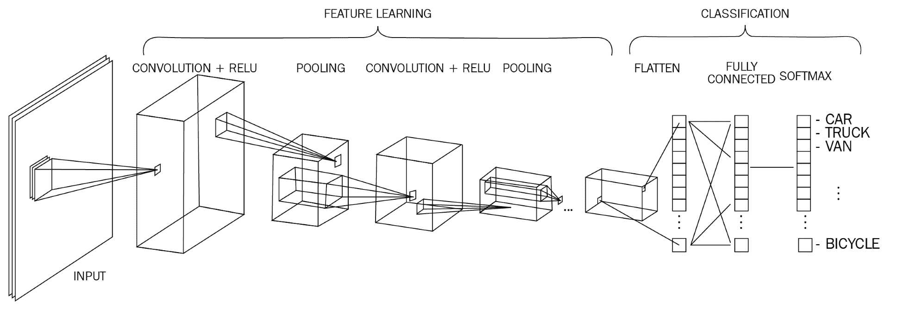
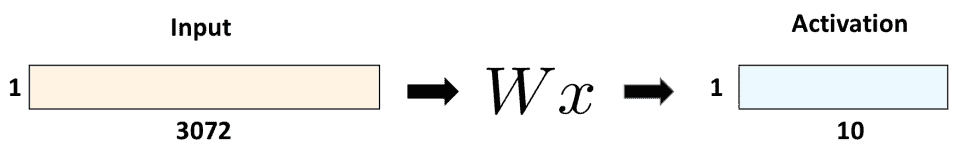
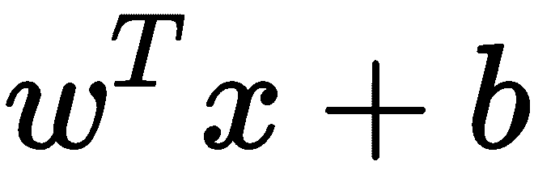
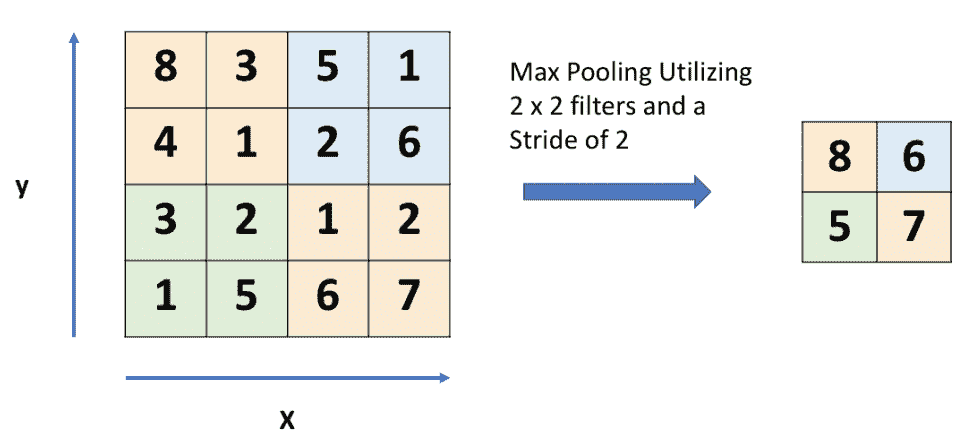
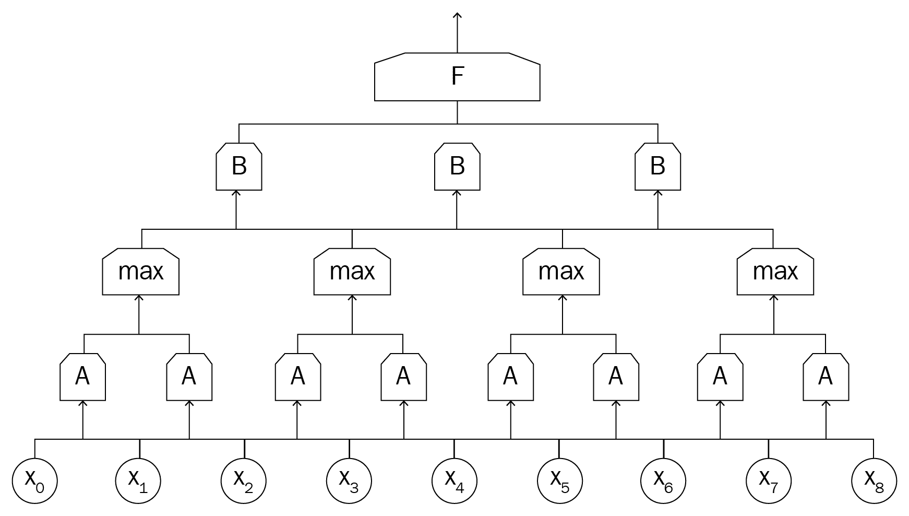
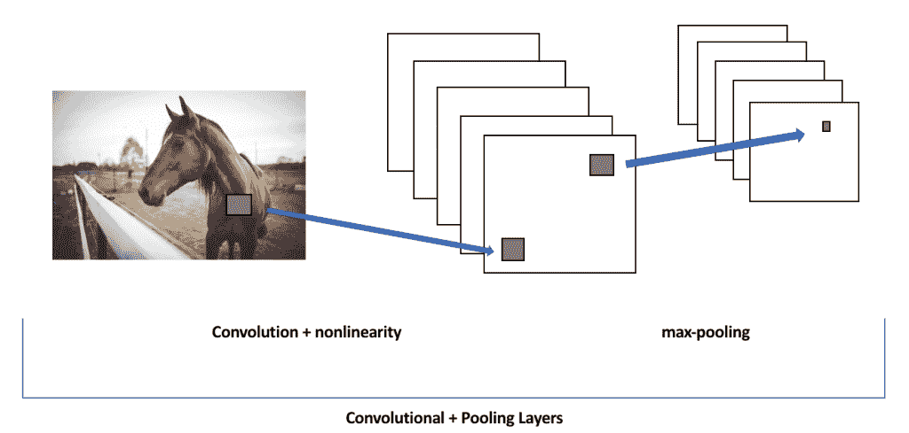
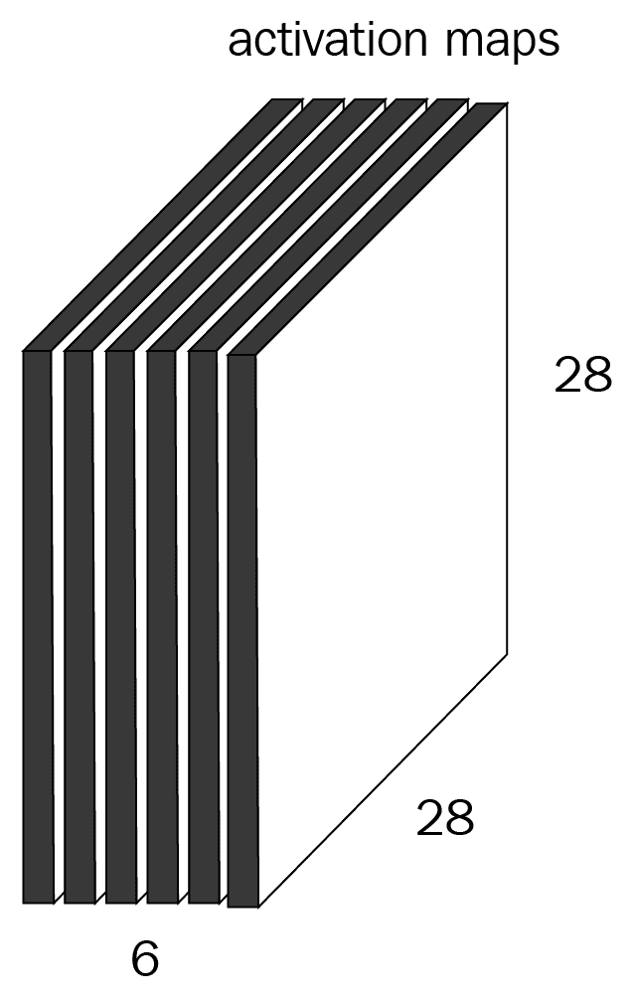
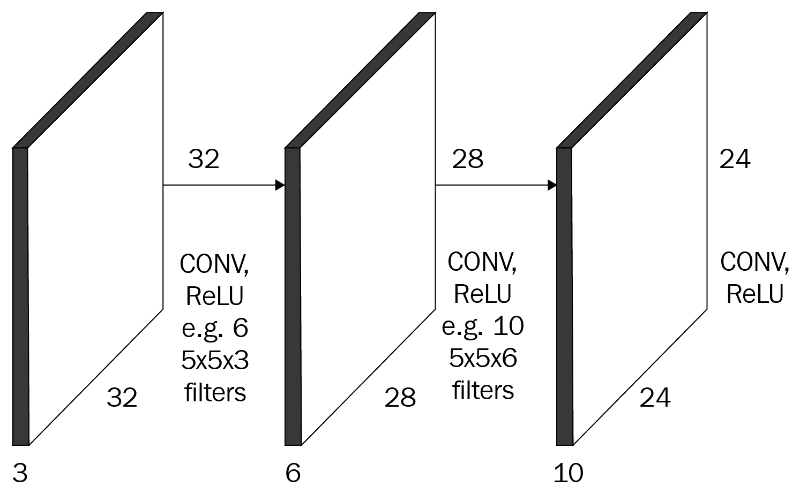
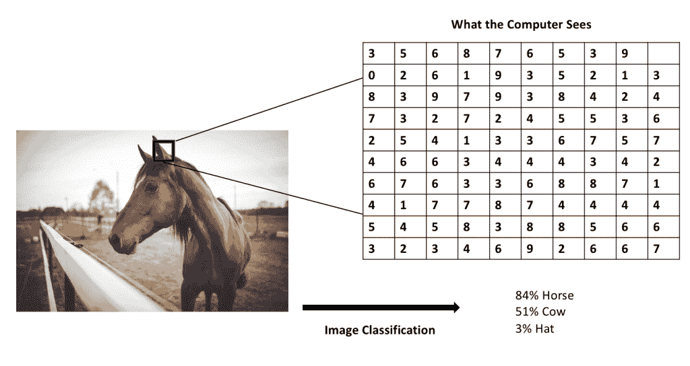

# 第五章：卷积神经网络

**卷积神经网络**（**CNN**），或称**ConvNets**，是前馈网络的一个特殊类别；它们主要用于计算机视觉任务，但也已被应用于其他具有非结构化数据的领域，例如自然语言处理。由于它们是前馈网络，它们与我们刚刚学习的简单网络非常相似；信息沿着一个方向传递，且由层、权重和偏差组成。

CNN 是 Facebook 用于图像标签、亚马逊用于产品推荐、以及自动驾驶汽车用于识别视野中物体的图像识别方法。在本章中，我们将讨论使 CNN 不同于标准前馈网络的功能，并举一些示例说明如何将其应用于多种任务。

在本章中，我们将讨论以下主题：

+   卷积

+   池化层

+   完整的卷积神经网络

+   用于图像标签的卷积神经网络

# CNN 概述

CNN 是深度学习历史上最具影响力的网络类别之一。由 Yann LeCun（现为**Facebook** **人工智能研究**负责人）发明，CNN 在 2012 年迎来了真正的突破，当时 Alex Krizhevsky 引入了深度卷积神经网络。

普通的神经网络在处理图像时扩展性较差；卷积神经网络（CNN）通过在网络的输入层添加一个或多个卷积层来改进传统的前馈神经网络。这些卷积层特别设计用来处理二维输入，例如图像甚至声音，如下图所示：

如你所见...

# 卷积层

假设我们有一个图像识别程序来识别图像中的物体，比如之前提到的例子。现在想象一下，用标准的前馈网络来分类图像有多困难；图像中的每个像素都会成为一个特征，并且必须通过网络传递，每个像素都有一套自己的参数。我们的参数空间会非常大，并且很可能会耗尽计算能力！图像在技术上只是高维向量，处理图像需要一些特殊的方法。

如果我们尝试用基础的前馈网络来完成这个任务，会发生什么呢？我们回想一下，基础的前馈网络是作用在向量空间上的。我们从图像开始，图像由独立的像素组成。假设我们的图像是 32×32 像素，输入到卷积层的数据将是*32 x 32 x 3*，其中*3*表示图像的 RGB 色彩尺度。要将其转化为向量空间，我们将得到一个*3072 x 1*的向量来表示整张图像：

假设我们的网络有**10**个神经元单元；使用简单的前馈模型，仅权重矩阵就会有**30,720**个可学习参数。CNN 通过其卷积层来缓解这个问题以及其他问题。

卷积层在创建 CNN 时有四个参数需要定义：

+   滤波器的数量，*K*

+   每个滤波器的大小，*F*

+   步幅，*S*

+   零填充的数量，*P*

在下一部分，我们将逐一讲解这些内容，并看看它们如何在网络结构中发挥作用。

# 层的参数和结构

卷积层使我们能够保持原始图像的尺寸，从而提高学习特征的能力并减少计算负担。它们通过使用一种叫做**滤波器**的东西来实现这一点，滤波器在图像上滑动，通过计算点积来学习特征。例如，CNN 的第一层的一个典型滤波器可能具有*5 x 5 x 3*的大小（即，*5*像素的宽度和高度，*3*是因为图像有三种颜色通道，RGB）。

在数学上，操作如下：

在这里，*w* 代表我们的滤波器，但它也代表我们的可学习权重。我们对输入滤波器进行转置，...

# 池化层

卷积层通常与**池化层**交替使用，池化层会下采样前一个卷积层的输出，以减少我们需要计算的参数量。这些层的一个特定形式，**最大池化层**，已经成为最广泛使用的变体。一般来说，最大池化层告诉我们，特征是否出现在卷积层所查看的区域内；它会在特定区域中寻找最显著的值（最大值），并将该值作为该区域的表示，如下所示：

最大池化层帮助后续的卷积层集中关注数据的更大部分，从而提供特征的抽象，帮助减少过拟合以及我们需要学习的超参数的数量，最终减少计算成本。这种自动特征选择的形式也通过防止网络过于关注图像的特定区域，帮助防止过拟合。

# 全连接层

CNN 的**全连接层**与普通前馈网络的全连接层工作方式相同。这个层将从图像中提取的输出映射到我们从网络中期望的输出，比如图像的标签：

在上面的图示中，我们的输入由蓝色节点表示，这些输入被送入第一个卷积层 A。接着是一个最大池化层、第二个卷积层，最后是全连接层，它将我们的输出转化为人类可读的输出。与普通前馈网络一样，我们通常会使用交叉熵损失函数来进行分类任务……

# 训练过程

当我们连接卷积层时，一个名为**感受野**或**滤波器大小**的超参数使得我们不必将单元连接到整个输入，而是专注于学习某一特定特征。我们的卷积层通常是从简单到复杂地学习特征。第一层通常学习低级特征，下一层学习中级特征，最后一层卷积层学习高级特征。这个过程的美妙之处在于，我们并没有明确告诉网络在这些不同层次上学习不同的特征；它通过训练过程以这种方式学习区分任务：

当我们经历这一过程时，我们的网络将生成一个二维的**激活图**，以跟踪特定滤波器在给定位置的响应。网络将学习保留那些在遇到形状边缘或物体的颜色时激活的滤波器。有时，这些滤波器可能会学到线条或更小的拼图部分，或者可能会学习图像的某些子部分，例如前面图中的马耳朵。每个特定卷积层的滤波器都会生成单独的激活图。如果我们有六个滤波器用于图像，我们将得到六个激活图，每个图聚焦于图像中的不同部分：

我们的卷积层将成为一系列堆叠的单独层，这些层之间插入了 ReLU 激活函数。我们通常在这里使用 ReLU 或 Leaky ReLU，以提高训练速度：

在这些卷积层之间，我们加入了最大池化层。这些结合了卷积和最大池化的层的输出将传递到一个全连接层，该层包含我们用于分类和其他任务的变换。一旦完成前向传播，误差将像在普通前馈网络中一样通过网络进行反向传播。

# CNN 用于图像标注

让我们用新的 CNN 知识来测试一下。我们将通过 CNN 的一个最常见的任务——图像分类。

在一个图像分类任务中，我们的马会查看给定的图像，并确定某个物体是图像的概率。在下面的例子中，图像宽 248 像素，高 400 像素，并且有三个颜色通道：**红色**、**绿色**和**蓝色**（**RGB**）。因此，图像由*248 x 400 x 3*个数字组成，总共有 297,600 个数字。我们的任务是将这些数字转化为一个单一的分类标签；这匹马*是*吗？

虽然这对...来说可能是一个简单的任务

# 总结

卷积神经网络在解决许多计算机视觉任务中具有开创性作用。在本章中，我们了解了这些网络与我们基本的前馈网络有何不同，它们的结构是什么，以及我们如何使用它们。卷积神经网络主要用于计算机视觉任务，尽管它们也可以适应用于其他非结构化领域，例如自然语言处理和音频信号处理。

卷积神经网络（CNN）由卷积层和池化层交替组成，所有这些层的输出都连接到一个全连接层**。** 卷积神经网络通过使用滤波器对图像进行迭代。滤波器有大小和步长，步长决定了它们在输入图像上迭代的速度。通过利用零填充技术，可以更好地保证输入的一致性。

在下一章，我们将学习另一类重要的网络，称为**递归神经网络**。
