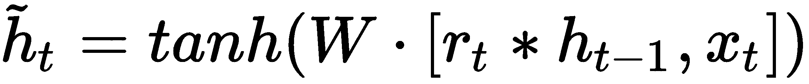
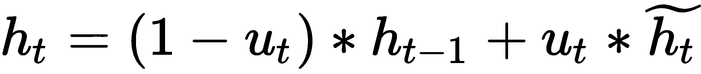

# 第六章：循环神经网络

**循环神经网络** (**RNNs**) 是最灵活的网络形式，并且广泛应用于 **自然语言处理** (**NLP**)、金融服务以及其他多个领域。普通的前馈网络及其卷积变种接收固定的输入向量并输出固定的向量；它们假设所有输入数据相互独立。而 RNN 则是处理向量序列并输出向量序列的网络，能够帮助我们处理多种令人兴奋的数据类型。RNN 实际上是图灵完备的，它们能够模拟任意任务，因此从人工智能科学家的角度来看，RNN 是非常有吸引力的模型。

在本章中，我们将介绍...

# 技术要求

本章将使用 Python 3 中的 TensorFlow。对应的代码可以在本书的 GitHub 仓库中找到。

# RNN 的构建模块

当我们思考人类如何思考时，我们不仅仅是一次性观察某个情境；我们会根据情境的上下文不断更新我们的思维。想象一下读书：每一章都是由多个单词组成的，这些单词构成了它的意义。普通的前馈网络不会将序列作为输入，因此很难对像自然语言这样的非结构化数据进行建模。而 RNN 可以帮助我们实现这一点。

# 基本结构

RNN 与其他网络的区别在于它们具有递归结构；它们在时间上是递归的。RNN 利用递归循环，使得信息能够在网络中保持。我们可以把它们看作是同一个网络的多个副本，信息在每次迭代中不断传递。如果没有递归，一个需要学习 10 个单词的句子的 RNN 就需要 10 个连接的相同层，每个单词一个。RNN 还在网络中共享参数。回想过去几章中我们提到的，在复杂的层次结构中，我们网络的参数数量可能会变得非常庞大。通过递归和参数共享，我们能够更有效地学习越来越长的序列结构，同时最小化需要学习的总参数量。

基本上，循环网络接收来自序列的项，并对其进行递归迭代。在下面的图示中，我们的序列 *x* 被输入到网络中：


RNN 具有记忆或**隐藏状态**，帮助它们管理和学习复杂的知识；我们用变量*h*表示它们。这些隐藏状态捕捉来自前一次传递的重要信息，并将其存储以供后续使用。RNN 的隐藏状态在初始时被设置为零，并在训练过程中不断更新。每次 RNN 的传递称为**时间步骤**；如果我们有一个 40 字符的序列，那么我们的网络就会有 40 个时间步骤。在每个 RNN 时间步骤中，网络会接受输入序列*x*并返回一个输出向量*y*以及更新后的隐藏状态。在第一次初始时间步骤之后，隐藏状态*h*也会与输入*x*一起，在每个新的时间步骤传递给网络。网络的输出是最后一个时间步骤之后隐藏状态的值。

虽然 RNN 是递归的，但我们可以轻松地将它们展开，绘制出它们在每个时间步骤的结构。我们可以将 RNN 看作一个框架，而不是一个黑盒，我们可以拆解它的内容，检查其内部工作原理：


在前面的图示中，我们的 RNN 被表示为函数*f*，我们将权重*w*应用到这个函数上，就像在任何其他神经网络中一样。然而，在 RNN 中，我们称这个函数为**递归公式**，它看起来大致如下：


这里，*h[t]*表示我们的新状态，它将是单一时间步骤的输出。*h[t-1]*表示我们的前一个状态，而*x*是来自序列的输入数据。这个递归公式会应用于序列中的每个元素，直到我们用完时间戳。

让我们通过在 TensorFlow 中构建基本的 RNN 来应用并分析它的工作原理。

# 普通递归神经网络

让我们一起走过基本 RNN 的架构；为了说明，我们将创建一个基本 RNN，预测序列中的下一个字母。作为训练数据，我们将使用莎士比亚《哈姆雷特》开头的段落。我们先将这个`corpus`保存为一个变量，以便在网络中使用。

```py
corpus = "Hamlet was the only son of the King of Denmark. He loved his father and mother dearly--and was happy in the love of a sweet lady named Ophelia. Her father, Polonius, was the King's Chamberlain. While Hamlet was away studying at Wittenberg, his father died. Young Hamlet hastened home in great grief to hear that a serpent had stung the King, and that he was dead. The young Prince had loved ...
```

# 一对多

图像描述是**一对多**情境的一个例子。我们输入一个表示该图像的单一向量，并输出图像的变长描述。一对多情境在每个时间步骤输出标签、单词或其他输出：


音乐生成是另一种一对多情境的例子，其中我们输出一组变长的音符。

# 多对一

在情感分析等任务中，我们关注的是网络的单一且最终的隐藏状态。我们称这种情况为**多对一**情境。当我们到达最后一个时间步骤时，我们输出一个分类或其他值，这个值在计算图中由*yt*表示：


多对一情境也可以用于诸如音乐流派标签等任务，其中网络输入音符并预测流派。

# 多对多

如果我们想对视频中某个人的表情进行分类，或许标注某个时刻的场景，甚至进行语音识别，我们会使用**多对多**架构。多对多架构能够接收变长的输入序列，同时输出变长的序列：


在每个步骤中都会计算一个输出向量，我们可以在序列的每一步计算各自的损失。通常，在显式标注任务中，我们会使用 softmax 损失函数。最终的损失将是这些单独损失的总和。

# 时间反向传播

RNN 使用一种叫做**时间反向传播**的特殊变种，属于常规反向传播的一部分。像常规反向传播一样，这个过程通常会在 TensorFlow 中为我们处理；然而，值得注意的是，它与标准的前馈网络反向传播有所不同。

回顾一下，RNN 使用相同网络的小*副本*，每个副本都有自己的权重和偏差项。当我们在 RNN 中进行反向传播时，我们会在每个时间步计算梯度，并在计算损失时对整个网络的梯度进行求和。我们将有一个来自每个时间步的权重梯度，并且 *W* 的最终梯度将是这些梯度的总和……

# 存储单元——LSTM 和 GRU

虽然常规的 RNN 理论上可以接收长序列的信息，比如完整的文档，但它们在*回顾*信息时存在限制，无法回溯得太远。为了解决这个问题，研究人员开发了传统 RNN 的变种，使用了一种叫做**记忆单元**的单元，帮助网络*记住*重要信息。它们是为了解决传统 RNN 模型中的消失梯度问题而开发的。有两种主要的 RNN 变体利用了记忆单元架构，分别是**GRU** 和 **LSTM**。这两种架构是目前应用最广泛的 RNN 架构，因此我们会稍微关注它们的机制。

# LSTM

LSTM 是一种特殊形式的 RNN，擅长学习长期依赖关系。LSTM 由 Hochreiter 和 Schmidhuber 在 1997 年提出，LSTM 拥有多个不同的层，信息会通过这些层来帮助它保留重要的信息并丢弃其他信息。与普通的循环网络不同，LSTM 不仅有一个标准的隐藏状态 *h[t]*，还有一个专属于 LSTM 单元的状态，称为**单元状态**，我们将用 *c[t]* 表示。LSTM 的这些状态能够通过**门控机制**进行更新或调整。这些门控机制帮助控制信息通过单元的处理，包括一个激活函数和基本的**逐点操作**，比如向量乘法。

# GRU

GRU 是在 2014 年作为对经典 LSTM 单元的全新改进而提出的。与 LSTM 的四个独立门不同，GRU 将遗忘门和输入门合并成一个更新门；你可以这样理解：没有被写入的内容就会被遗忘。它还将 LSTM 中的细胞状态 *c[t]* 与整体的隐藏状态 *h[t]* 合并。在一个周期结束时，GRU 暴露出整个隐藏状态：

+   **更新门**：更新门将遗忘门和输入门结合起来，本质上表明，未被写入记忆的内容会被遗忘。更新门接受我们的输入数据 *x* 并将其与隐藏状态相乘。这个表达式的结果随后与权重矩阵相乘，并通过一个 sigmoid 函数：


+   **重置门**：重置门的功能类似于 LSTM 中的输出门。它决定了什么内容以及多少内容会被写入记忆中。从数学上讲，它与更新门是相同的：


+   **记忆门**：一个 tanh 操作，实际上将重置门的输出存储到记忆中，类似于 LSTM 中的写入门。重置门的结果与原始输入结合，并通过记忆门来计算一个暂定的隐藏状态：



我们的最终状态是通过将暂定隐藏状态与更新门的输出进行操作来计算的：



GRU 的性能与 LSTM 相似；GRU 真正的优势在于由于其简化的结构，计算效率更高。在语言建模任务中，例如我们将在后面的章节中创建的智能助手，GRU 往往在数据较少的情况下表现更好。

# 使用 RNN 进行序列处理

现在我们已经了解了 RNN 的组件，接下来我们来探讨一下我们可以用它们做什么。在这一部分，我们将讨论两个主要示例：**机器翻译** 和 **生成图像描述**。在本书的后面部分，我们将利用 RNN 构建各种端到端系统。

# 神经机器翻译

机器翻译是一个序列到序列的问题；你会经常看到这些网络被描述为**序列到序列**（或**Seq2Seq**）模型。与传统的特征工程和 n-gram 计数技术不同，神经机器翻译将整个句子的意义映射到一个单一的向量，然后基于该单一的意义向量生成翻译。

**机器翻译**模型依赖于人工智能中的一个重要概念，即**编码器**/**解码器**范式。简而言之：

+   **编码器**解析输入并输出输入的压缩向量表示。我们通常使用 GRU 或 LSTM 来完成这个任务

+   **解码器**接收压缩后的表示，并从中推断出新的序列。

这些概念对于理解生成对抗网络（GAN）至关重要，我们将在接下来的章节中学习。该网络的第一部分充当编码器，解析你的英文句子；它表示该句子的英文摘要。

从架构上看，神经机器翻译网络是多对一和一对多的，它们背靠背排列，正如下图所示：


这是谷歌用于 Google Translate 的相同架构。

# 注意力机制

**神经机器翻译**（**NMT**）模型面临与一般 RNN 相同的长期依赖性问题。尽管我们看到 LSTM 能够缓解大部分这种行为，但在长句子中仍然会出现问题。特别是在机器翻译中，句子的翻译很大程度上依赖于编码器网络的隐藏状态所包含的信息量，我们必须确保这些最终状态尽可能丰富。我们通过一种叫做**注意力机制**的方式解决了这个问题。

注意力机制允许解码器根据上下文和到目前为止生成的内容选择输入句子的某些部分。我们利用一个叫做**上下文向量**的向量来存储来自...

# 生成图片描述

循环神经网络（RNN）也可以处理那些需要将固定输入转换为可变序列的问题。图片描述处理输入固定的图片，并输出该图片的完全可变描述。这些模型利用卷积神经网络（CNN）来输入图片，然后将 CNN 的输出传递给 RNN，RNN 会逐字生成描述：


我们将构建一个基于 Flicker 30 数据集的神经网络描述模型，该数据集由加利福尼亚大学伯克利分校提供，你可以在本章对应的 GitHub 仓库中找到。在这个案例中，我们会利用预训练的图像嵌入来节省时间；然而，你也可以在相应的 GitHub 仓库中找到端到端模型的示例。

1.  让我们从导入开始：

```py
import math
import os
import tensorflow as tf
import numpy as np
import pandas as pd

import tensorflow.python.platform
from keras.preprocessing import sequence
```

1.  接下来，让我们从你从仓库下载的文件中加载图像数据。首先，我们定义一个路径来存放这些图像。

```py
captions = 'image_captions.token'
features = 'features.npy'
```

1.  接下来，我们可以加载图像和各种描述。我们将这些描述和图像称为“描述”和“图像”。

```py
annotations = pd.read_table(captions, sep='\t', header=None, names=['image', 'caption'])
images = np.load(features,'r'), 
captions = annotations['caption'].values
```

1.  接下来，我们需要存储每个单词出现次数的计数：

```py
occuranceDict = {} ## This Dictionary will store the occurance count of our words 
wordCount = 0 ## wordCount is a value that we will use to keep track of the number of occurances of a word
```

1.  首先，我们需要构建一个词汇表；我们需要对描述进行一些预处理。可以参考以下代码：

```py
def ConstructVocab(captions):
    '''Function to Construct the Vocab that we will be generating from'''

    occuranceDict = {} ## This Dictionary will store the occurance count of our words 
    wordCount = 0 ## wordCount is a valuee that we will use to keep track of the number of occurances of a word

    ## Iterate over the captions to split them into individuals words to construct the vocab
    for item in captions: 
        wordCount += 1

        for word in item.lower().split(' '):
            occuranceDict[word] = occuranceDict.get(word, 0) + 1

    vocab = [word for word in occuranceDict if occuranceDict[word] >= 20]

    ## Set a dictionary to set a word for each index
    IndexesToWords = {} ## 
    ixtoword[0] = '.' 

    ## Set a dictionary to the indexes of each word at each steps
    WordsToIndexes = {}
    WordsToIndexes['#START#'] = 0 
    index = 1

    ## Iterate over the words in the vocab to store them and index their position. 
    for word in vocab:
      WordstoIndexes[word] = index 
      IndexestoWords[index] = word
      index += 1

    ## Set the wordcount for the occurance dictionary
    occuranceDict['.'] = wordCount

    ## Initiative the word bias vectors
    biasVector = np.array([1.0*occuranceDict[IndexestoWords[i]] for i in IndexestoWords])
    biasVector = biasVector / np.sum(biasVector) 
    biasVector = np.log(biasVector)
    biasVector = biasVector - np.max(biasVector) 

    ## Return the dictionarties, as well as the bias vector
    return WordstoIndexes, IndexestoWords,         biasVector.astype(np.float32)
```

1.  现在我们可以构建模型了。按照下面的注释理解每个部分的作用：

```py
def captionRNN():
    ''' RNN for Image Captioning '''

    ## Define our Networks Parameters
    dim_embed = 256
    dim_hidden = 256
    dim_in = 4096
    batch_size = 128
    momentum = 0.9
    n_epochs = 150

    ## Initialize the embedding distribution and bias factor as a random uniform distribution. 
    captionEmbedding = tf.Variable(tf.random_uniform([n_words, dim_embed], -0.1, 0.1))
    captionBias = tf.Variable(tf.zeros([dim_embed]))

    ## Initialize the embedding distribution and bias for the images 
    imgEmbedding = tf.Variable(tf.random_uniform([dim_in, dim_hidden], -0.1, 0.1))
    imgBias = tf.Variable(tf.zeros([dim_hidden]))

    ## Initialize the encodings for the words
    wordEncoding = tf.Variable(tf.random_uniform([dim_hidden, n_words], -0.1, 0.1))
    wordBias = tf.Variable(init_b)

    ## Initialize the variables for our images 
    img = tf.placeholder(tf.float32, [batch_size, dim_in]) ## Placeholder for our image variables
    capHolder = tf.placeholder(tf.int32, [batch_size, n_lstm_steps]) ## Placeholder for our image captions
    mask = tf.placeholder(tf.float32, [batch_size, n_lstm_steps]) 

    ## Compute an initial embedding for the LSTM
    imgEmbedding = tf.matmul(img, imgEmbedding) + imgBias

    ## Initialize the LSTM and its starting state
    lstm = tf.contrib.rnn.BasicLSTMCell(dim_hidden)
    state = self.lstm.zero_state(batch_size, dtype=tf.float32)

    ## Define a starting loss
    totalLoss = 0.0
```

1.  现在，我们将为模型训练这个循环：

```py
 ## Training Cycle for the Model
    with tf.variable_scope("RNN"):
        for i in range(n_lstm_steps): 
            ## Tell the model to utilizing the embedding corresponding to the appropriate caption, 
            ## if not, utilize the image at the first embedding
            if i > 0:
                current_embedding = tf.nn.embedding_lookup(captionEmbedding, capHolder[:,i-1]) + captionBias
                tf.get_variable_scope().reuse_variables()
            else:
                current_embedding = imgEmbedding

            out, state = lstm(current_embedding, state) ## Output the current embedding and state from the LSTM

            if i > 0:

                labels = tf.expand_dims(capHolder[:, i], 1)
                ix_range = tf.range(0, batch_size, 1) ## get the index range
                indexes = tf.expand_dims(ix_range, 1) ## get the indexes
                concat = tf.concat([indexes, labels],1) ## Concatonate the indexes with their labels

                ## Utilizng a "One Hot" encoding scheme for the labels
                oneHot = tf.sparse_to_dense(concat, tf.stack([batch_size, n_words]), 1.0, 0.0) 

                ## Run the results through a softmax function to generate the next word 
                logit = tf.matmul(out, wordEncoding) + wordBias

                ## Utilizing Cross Entropy as our Loss Function
                crossEntropyLoss = tf.nn.softmax_cross_entropy_with_logits(logits=logit, labels=oneHot)
                crossEntropyLoss = crossEntropyLoss * mask[:,i]

                ## Tell Tensorflow to reduce our loss
                loss = tf.reduce_sum(crossEntropyLoss)

                ## Add the loss at each iteration to our total loss 
                totalLoss = totalLoss + loss

        totalLoss = totalLoss / tf.reduce_sum(mask[:,1:])

        return totalLoss, img, capHolder, mask
```

在训练过程中，我们利用一个独立的权重矩阵来帮助模型处理图像信息，并在每个 RNN 时间步周期中使用该权重矩阵来接收图像信息。

在每个步骤中，我们的 RNN 将计算网络词汇表中所有分数的分布，从该分布中抽取最可能的词，并将该词作为下一个 RNN 时间步的输入。这些模型通常是端到端训练的，这意味着 RNN 和 CNN 的反向传播是同时进行的。在这种情况下，我们只需要关注我们的 RNN：

```py
def trainNeuralCaption(learning_rate=0.0001):
 '''Function to train the Neural Machine Translation Model '''

 ## Initialize a Tensorflow Session
 sess = tf.InteractiveSession()

 ## Load the images and construct the vocab using the functions we described above
 images, captions = load_images('path/to/captions', 'path/to/features')
 WordstoIndexes, IndexestoWords, init_b = constructVocab(captions)

 ## Store the indexes
 index = (np.arange(len(images)).astype(int))
 np.random.shuffle(index) 
 n_words = len(WordstoIndexes)
 maxlen = np.max( [x for x in map(lambda x: len(x.split(' ')), captions) ] )
```

现在，让我们初始化标题 RNN 模型并开始构建模型。相关代码如下：

```py

 ## Initialize the Caption RNN model function and build the model 
 nc = neuralCaption(dim_in, dim_hidden, dim_embed, batch_size, maxlen+2, n_words, init_b)
 loss, image, sentence, mask = nc.build_model()

 ## Define our timestep and the overall learning rate
 global_step = tf.Variable(0,trainable=False)
 learning_rate = tf.train.exponential_decay(learning_rate, global_step, int(len(index)/batch_size), 0.95)

 ## Utilize Adam as our optimization function 
 train_op = tf.train.AdamOptimizer(learning_rate).minimize(loss)

 ## Initialize all our variables
 tf.global_variables_initializer().run()

 ## Run the training cucle
 for epoch in range(n_epochs):
 for start, end in zip( range(0, len(index), batch_size), range(batch_size, len(index), batch_size)):

 ## Current Images and Captions
 currentImages = images[index[start:end]]
 currentCaptions = captions[index[start:end]]
 current_caption_ind = [x for x in map(lambda cap: [WordstoIndexes[word] for word in cap.lower().split(' ')[:-1] if word in WordstoIndezes], current_captions)]

 ## Pad the incoming sequences
 current_caption_matrix = sequence.pad_sequences(current_caption_ind, padding='post', maxlen=maxlen+1)
 current_caption_matrix = np.hstack( [np.full( (len(current_caption_matrix),1), 0), current_caption_matrix] )

 current_mask_matrix = np.zeros((current_caption_matrix.shape[0], current_caption_matrix.shape[1]))
 nonzeros = np.array([x for x in map(lambda x: (x != 0).sum()+2, current_caption_matrix )])

 for ind, row in enumerate(current_mask_matrix):
 row[:nonzeros[ind]] = 1

 ## Run the operations in a TensorFlow session 
 _, currentLoss = sess.run([train_op, loss], feed_dict={
 image: current_feats.astype(np.float32),
 sentence : current_caption_matrix.astype(np.int32),
 mask : current_mask_matrix.astype(np.float32)
 })

 print("Loss: ", currentLoss)
```

最后，我们需要做的就是训练模型；我们可以通过简单地调用`training`函数来实现：

```py
 trainNeuralCaption()
```

通常，你可能会看到许多用于文本生成的 RNN 变体，被称为**字符**-**级别 RNN**，或**ChaRnn**。建议避免使用字符级别的 RNN 模型。

# RNN 的扩展

在过去的几年里，普通 RNN 有很多扩展。这里列出的并不是所有 RNN 领域的重大进展，但我们将回顾其中几个最值得注意的：双向 RNN 和 NTM。

# 双向 RNN

近年来，研究人员对传统 RNN 结构进行了若干改进。**双向 RNN**的出现是基于这样一个想法：它们不仅可以依赖序列中之前的信息，还可以依赖之后的信息。从结构上讲，双向 RNN 只是两个堆叠在一起的 RNN，它们的输出是每个单独网络的隐藏状态的组合。

# 神经图灵机

**神经图灵机**（**NTM**）是一种 RNN 形式，由 DeepMind 的 Alex Graves 于 2014 年开发。与具有内部状态的 LSTM 不同，NTM 具有外部记忆，这增加了它们处理复杂计算任务的能力。

NTM 由两个主要组件组成：**控制器**和**记忆库**。

+   **NTM 控制器**：NTM 中的控制器就是神经网络本身；它管理输入和记忆之间的信息流，并学习如何在整个过程中管理自己的记忆。

+   **NTM 记忆库**：实际的外部记忆，通常以张量形式表示

只要内存足够，NTM 就可以通过简单地更新其自身的记忆来反映算法，从而复制任何算法。其架构...

# 摘要

RNN 是我们推理文本输入的主要手段，并且有多种形式。在本章中，我们学习了 RNN 的递归结构，以及使用记忆单元的特殊版本。RNN 广泛应用于各种类型的序列预测，如生成音乐、文本、图像描述等。

RNN 与前馈网络不同，它们具有递归性；RNN 的每一步都依赖于网络在上一个状态下的记忆，以及其自身的权重和偏置因素。因此，普通的 RNN 在处理长期依赖问题时表现不佳；它们很难记住超过特定时间步数的序列。GRU 和 LSTM 利用记忆门控机制来控制它们记住和忘记的内容，从而克服了许多 RNN 在处理长期依赖时遇到的问题。带有注意力机制的 RNN/CNN 混合体在分类任务中实际上提供了最先进的性能。我们将在第九章中创建一个，*智能助手的深度学习*，讲解如何创建一个基本的智能代理。

在下一章，我们将超越 RNN，进入最激动人心的网络类别之一——**生成网络**，在这里我们将学习如何使用未标记的数据，以及如何从零开始生成图像和画作。
