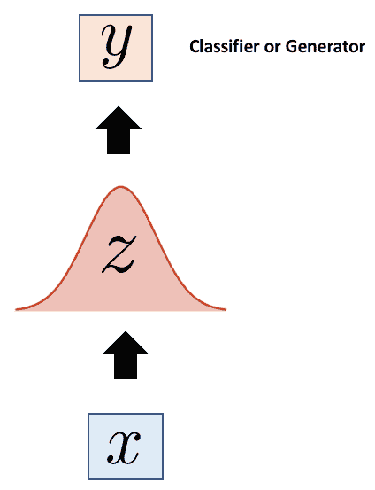

# 第七章：生成模型

生成模型是推动计算机理解世界的最有前景的方向。它们是真正的无监督模型，能够执行许多当前被认为是**人工智能**（**AI**）前沿的任务。生成模型之所以不同，正如其名称所示：它们生成数据。主要集中在计算机视觉任务上，这类网络有能力创造新的人脸、新的手写字，甚至是绘画作品。

在本节中，我们将介绍生成模型及其基础，特别关注两种最受欢迎的模型类型：**变分自编码器**（**VAE**）和**生成对抗网络**（**GAN**），你将学习到...

# 技术要求

在本章中，我们将使用 Python 3。你需要安装以下包：

+   NumPy

+   TensorFlow

+   PyTorch

如果你的机器支持 GPU，参考第三章《平台与其他基本要素》，这将非常有帮助。

# 走向 AI – 生成模型

生成模型是一类完全不同于我们目前所讨论的神经网络。我们到目前为止讨论的网络都是前馈网络。CNN 和 RNN 都是判别性网络，它们试图对数据进行分类。给定特定的输入，它们可以预测类别或其他标签。生成模型则相反，它们尝试在给定标签的情况下预测特征。它们通过拥有一个比学习的数据量小得多的参数集来实现这一点，这迫使它们以高效的方式理解数据的基本本质。

生成模型有两种主要类型，VAE 和 GAN。首先，我们将从生成模型的动机开始...

# 自编码器

自编码器及其编码器/解码器框架是生成模型的灵感来源。它们是一种自监督的表示学习技术，通过该技术，网络学习输入内容，以便像输入数据一样生成新的数据。在这一部分，我们将了解它们的架构和用途，作为对它们启发的生成网络的入门介绍。

# 网络架构

自编码器通过接受输入并生成一个较小的向量表示，来*重构其自身输入*。它们通过使用编码器对传入数据施加信息瓶颈，然后利用解码器基于该表示重建输入数据。这个方法基于这样一个理念：数据中存在*结构*（即关联等），这些结构是存在的，但并不容易被察觉。自编码器是自动学习这些关系的一种方式，而无需显式地进行学习。

在结构上，自编码器由**输入层**、**隐藏层**和**输出层**组成，如下图所示：

编码器学习保留尽可能多的相关信息……

# 构建自编码器

如果你认为重建输出的任务似乎没有什么用处，那你不是唯一一个这样想的人。我们究竟用这些网络做什么呢？自编码器帮助在没有已知标签特征的情况下提取特征。为了说明这一点，下面我们通过一个使用 TensorFlow 的示例来演示。我们将在这里重建 MNIST 数据集，稍后我们将比较标准自编码器和变分自编码器在同一任务上的表现。

让我们从导入库和数据开始。MNIST 数据集本身就包含在 TensorFlow 中，所以我们可以很方便地导入它：

```py
import tensorflow as tf
import numpy as np

from tensorflow.examples.tutorials.mnist import input_data
mnist = input_data.read_data_sets("/tmp/data/", one_hot=True)
```

为了简便起见，我们可以使用 `tf.layers` 库来构建自编码器。我们希望自编码器的架构遵循卷积/反卷积模式，其中解码器的输入层与输入大小相匹配，随后的层将数据压缩成越来越小的表示。解码器将是相同架构的反转，首先从小的表示开始，然后逐步变大。

将所有代码整合在一起后，它应该看起来像下面这样：


让我们从编码器开始；我们首先定义一个初始化器来初始化权重和偏置项，然后将编码器定义为一个接受输入 x 的函数。接着，我们将使用 `tf.layers.dense` 函数来创建标准的全连接神经网络层。编码器将有三层，第一层的大小与输入数据的维度（`784`）相匹配，随后每一层会逐渐变小：

```py
initializer = tf.contrib.layers.xavier_initializer()

def encoder(x):
    input_layer = tf.layers.dense(inputs=x, units=784, activation=tf.nn.relu,
                                 kernel_initializer=initializer, bias_initializer=initializer 
                                 )
    z_prime = tf.layers.dense(inputs=input_layer, units=256, activation=tf.nn.relu,
                             kernel_initializer=initializer, bias_initializer=initializer
                             )
    z = tf.layers.dense(inputs=z_prime, units=128, activation=tf.nn.relu,
                       kernel_initializer=initializer, bias_initializer=initializer
                       )
    return z
```

接下来，让我们构建解码器；它将使用与编码器相同的层类型和初始化器，只不过这次我们反转了这些层，解码器的第一层最小，最后一层最大。

```py
def decoder(x):
    x_prime_one = tf.layers.dense(inputs=x, units=128, activation=tf.nn.relu,
                                 kernel_initializer=initializer, bias_initializer=initializer
                                 )
    x_prime_two = tf.layers.dense(inputs=x_prime_one, units=256, activation=tf.nn.relu,
                                 kernel_initializer=initializer, bias_initializer=initializer
                                 )
    output_layer = tf.layers.dense(inputs=x_prime_two, units=784, activation=tf.nn.relu,
                                  kernel_initializer=initializer, bias_initializer=initializer
                                  )
    return output_layer
```

在开始训练之前，让我们定义一些在训练循环中需要用到的超参数。我们将定义输入的大小、学习率、训练步数、训练周期的批次大小，以及我们希望多频繁地显示训练进度信息。

```py
input_dim = 784 
learning_rate = 0.001
num_steps = 1000
batch_size = 256
display = 1
```

然后，我们将定义输入数据的占位符，以便能够编译模型：

```py
x = tf.placeholder("float", [None, input_dim])
```

接下来，我们将编译模型和优化器，就像你在上一章中看到的那样：

```py
# Construct the full autoencoder
z = encoder(x)

## x_prime represents our predicted distribution
x_prime = decoder(z) 

# Define the loss function and the optimizer
loss = tf.reduce_mean(tf.pow(x - x_prime, 2))
optimizer = tf.train.RMSPropOptimizer(learning_rate).minimize(loss)
```

最后，我们将编写训练循环的代码。到这一点为止，这些内容对你来说应该比较熟悉了；启动 TensorFlow 会话，并在每个 epoch/批次中迭代，计算每个点的损失和准确率：

```py
with tf.Session() as sess:
    sess.run(tf.global_variables_initializer())

    ## Training Loop
    for i in range(1, num_steps+1):

        ## Feed Batches of MNIST Data
        batch_x, _ = mnist.train.next_batch(batch_size)

        ## Run the Optimization Process
        _, l = sess.run([optimizer, loss], feed_dict={x: batch_x})

        ## Display the loss at every 1000 out of 30,000 steps
        if i % display == 0 or i == 1:
            print('Step %i: Loss: %f' % (i, l))
```

对于这个具体示例，我们将额外添加一些内容；一个方法来将重建的图像与其原始版本并排显示。请记住，这段代码仍然包含在训练会话中，只是位于训练循环之外：

```py
    n = 4
    canvas_orig = np.empty((28 * n, 28 * n))
    canvas_recon = np.empty((28 * n, 28 * n))

    for i in range(n):

        batch_x, _ = mnist.test.next_batch(n)

        # Encode and decode each individual written digit
        g = sess.run(decoder, feed_dict={x: batch_x})

        # Display original images
        for j in range(n):

            # Draw the original digits
            canvas_orig[i * 28:(i + 1) * 28, j * 28:(j + 1) * 28] = batch_x[j].reshape([28, 28])

        # Display reconstructed images
        for j in range(n):

            # Draw the reconstructed digits
            canvas_recon[i * 28:(i + 1) * 28, j * 28:(j + 1) * 28] = g[j].reshape([28, 28])

    # Plot the original image vs the reconstructed images. 
    print("Original Images")
    plt.figure(figsize=(n, n))
    plt.imshow(canvas_orig, origin="upper", cmap="gray")
    plt.show()

    print("Reconstructed Images")
    plt.figure(figsize=(n, n))
    plt.imshow(canvas_recon, origin="upper", cmap="gray")
    plt.show()
```

训练后，您应该得到类似以下的结果，左侧是实际数字，右侧是重建的数字：


那么我们在这里做了什么？通过在无标签的数字上训练自编码器，我们完成了以下工作：

+   学习了数据集的潜在特征，且无需明确的标签

+   成功地学习了数据的分布，并从该分布中从头重建了图像

现在，假设我们想进一步开展工作，生成或分类我们还没有见过的新数字。为此，我们可以去掉解码器并附加一个分类器或生成器网络：



因此，编码器变成了初始化监督训练模型的一种方式。标准自编码器已在各种任务中得到应用。在本章的补充代码中，我们将演示一个示例，展示如何使用自编码器进行视觉异常检测。

# 变分自编码器

**变分自编码器**（**VAE**）基于标准自编码器的思想构建，是强大的生成模型，也是学习复杂分布的一种最流行的无监督方法。VAE 是基于贝叶斯推断的**概率模型**。概率模型正如其名所示：

*概率模型将随机变量和概率分布纳入事件或现象的模型中。*

变分自编码器（VAE）和其他生成模型是概率性的，因为它们试图学习一个分布，并利用该分布进行后续的采样。尽管所有生成模型都是概率模型，但并非所有概率模型都是生成模型。

概率结构的...

# 结构

像标准自编码器一样，变分自编码器（VAE）采用相同的编码器/解码器框架，但除了这一点，它们在数学上与其名称所示的有所不同。VAE 在指导网络时采取了概率的视角：


我们的**编码器**和**解码器**网络都在从其输入数据中生成分布。编码器从其训练数据生成一个分布，**Z**，然后这个分布成为解码器的输入分布。解码器接收这个分布，**Z**，并尝试从中重建原始分布，**X**。

# 编码器

编码器通过首先将其先验定义为标准正态分布来生成其分布。然后，在训练期间，这个分布会更新，解码器稍后可以轻松地从这个分布中进行采样。VAEs 中编码器和解码器在输出两个向量而不是一个方面是独特的：一个均值向量*μ*，另一个标准差向量*σ*。这些帮助定义了我们生成分布的限制。直观地说，均值向量控制输入的编码应该在哪里集中，而标准差控制编码可能从均值中变化的程度。编码器的这种约束迫使网络学习一个分布，从而...

# 解码器

像标准自动编码器一样，VAE 中的解码器是一个反向卷积网络，或者是一个反卷积网络。在处理解码时，数据是从生成过程中随机采样的，使得 VAE 成为少数可以直接从概率分布中采样而无需马尔可夫链蒙特卡洛方法的模型之一。由于随机生成过程的结果，我们从每次通过生成的编码将是数据的不同表示，同时保持相同的均值和标准差。这有助于解码器的采样技术；因为所有编码都是从相同的分布生成的，解码器学习到一个潜在数据点及其周围点都是同一类的成员。这使得解码器学会如何从类似但略有不同的编码中生成。

# 训练和优化 VAEs

VAEs 利用负对数似然损失作为它们的重构损失，以衡量在解码器重构阶段丢失了多少信息。如果解码器不能令输入令人满意地重构，则会产生大的重构损失。VAEs 还引入了称为**Kullback**–**Leibler**（**KL**）散度的东西到它们的损失函数中。KL 散度简单地衡量两个概率分布的差异程度；换句话说，它们彼此有多不同。我们希望最小化目标分布的均值和标准差与标准正态分布的 KL 距离。当均值为零且标准差为一时，它被正确地最小化。对数似然...

# 利用 VAE

我们可以在 TensorFlow 中构建一个变分自动编码器，以查看它与它更简单的标准自动编码器表亲的比较。在本节中，我们将使用相同的 MNIST 数据集，以便我们可以跨方法标准化我们的比较。让我们通过利用它来生成基于`MNIST`数据集的手写体来构建一个 VAE。将*x*视为每个我们试图学习的个体字符中的潜在特征，*z*为这些字符中的潜在特征。

首先，让我们从我们的导入开始：

```py
import numpy as np
import tensorflow as tf
from tensorflow.examples.tutorials.mnist import input_data
```

和之前一样，我们可以直接从 TensorFlow 库中导入`'MNIST_data'`：

```py
mnist = input_data.read_data_sets('MNIST_data', one_hot=True)
```

接下来，我们可以开始构建编码器。我们将继续使用之前相同的`tf.layers`包。在这里，我们的编码器看起来与之前的示例相似，我们的层会接收输入并逐渐压缩该输入，直到生成潜在的分布，*z*：

```py
def encoder(x):

    input_layer = tf.layers.dense(inputs=x, units=784, activation=tf.nn.elu,
                                 kernel_initializer=initializer, bias_initializer=initializer,
                                 name='input_layer'
                                 )

    hidden_1 = tf.layers.dense(inputs=input_layer, units=256, activation=tf.nn.elu,
                             kernel_initializer=initializer, bias_initializer=initializer
                             )

    hidden_2 = tf.layers.dense(inputs=hidden_1, units=128, activation=tf.nn.elu,
                       kernel_initializer=initializer, bias_initializer=initializer
                       )
```

然而，在这里我们开始偏离标准自编码器了。虽然编码器中的最后一层会给出代表我们数据的潜在 z 分布，但我们需要计算和的值，这些值将有助于定义该分布。我们可以通过创建两个新的层来实现这一点，这两个层接收潜在的分布 z，并输出`mu`和`sigma`的值：

```py
mu = tf.layers.dense(inputs=z, units=10, activation=None)
sigma = tf.layers.dense(inputs=z, units=10, activation=None)
```

接下来，我们将使用这些值来计算编码器的 KL 散度，最终将其用于构建我们的最终损失函数：

```py
kl_div = -0.5 * tf.reduce_sum( 1 + sigma - tf.square(mu) - tf.exp(sigma), axis=1)

kl_div = tf.reduce_mean(latent_loss)
```

现在我们来创建变分自编码器的解码器部分；我们将创建一个反卷积模式，反转编码器的维度。所有这些将包含在一个名为`decoder(z)`的函数中：

```py
def decoder(z, initializer):
    layer_1 = fully_connected(z, 256, scope='dec_l1', activation_fn=tf.nn.elu, 
                             kernel_initializer=initializer, bias_initializer=initializer
                             )
    layer_2 = fully_connected(layer_1, 384, scope='dec_l2', activation_fn=tf.nn.elu,
                             kernel_initializer=initializer, bias_initializer=initializer
                             )
    layer_3 = fully_connected(layer_2, 512, scope='dec_l3', activation_fn=tf.nn.elu,
                             kernel_initializer=initializer, bias_initializer=initializer
                             )
    dec_out = fully_connected(layer_3, input_dim, scope='dec_l4', activation_fn=tf.sigmoid,
                             kernel_initializer=initializer, bias_initializer=initializer
                             )
```

在解码器函数下，我们将使用解码器的输出计算重建损失：

```py
epsilon = 1e-10

rec_loss = -tf.reduce_sum(x * tf.log(epsilon + dec_out) + (1 - x) * tf.log(epsilon + 1 - dec_out), axis=1)

rec_loss = tf.reduce_mean(rec_loss)
```

和往常一样，我们将在初始化模型之前准备好训练参数。我们将定义学习率、训练批量大小、训练轮数、输入维度和总训练样本的大小：

```py
learning_rate = 1e-4
batch_size = 100
epochs = 100
input_dim = 784 
num_sample = 55000
n_z = 10
```

我们还将定义输入数据的占位符`x`：

```py
x = tf.placeholder(name='x', dtype='float', shape=[None, input_dim])
```

在开始训练之前，我们将初始化模型、损失函数和`optimizer`：

```py
## initialize the models
z, kl_div = encoder(x)
dec_out, rec_loss = decoder(x)

## Calculate the overall model loss term
loss = tf.reduce_mean(rec_loss + kl_div)

## Create the optimizer
optimizer = tf.train.AdamOptimizer(learning_rate).minimize(loss)

## Create the weight initializer
initializer = tf.contrib.layers.xavier_initializer()
```

最后，我们可以运行实际的训练过程。这将类似于我们已经构建和体验过的训练过程：

```py
with tf.Session() as sess:
    sess.run(tf.global_variables_initializer())

    for epoch in range(epochs):
        for iter in range(num_sample // batch_size):

            batch_x = mnist.train.next_batch(batch_size)

            _, l, rl, ll = sess.run([optimizer, loss, rec_loss, kl_div], feed_dict={x: batch_x[0]})

        if epoch % 5 == 0:
            print('[Epoch {}] Total Loss: {}, Reconstruction Loss: {}, Latent Loss: {}'.format(epoch, l, rl, ll))
```

最后，我们可以使用以下代码生成从新训练的模型中生成的新样本：

```py
z = np.random.normal(size=[batch_size, n_z])
x_generated = x_hat = self.sess.run(dec_out, feed_dict={z: z})

n = np.sqrt(batch_size).astype(np.int32)
I_generated = np.empty((h*n, w*n))
for i in range(n):
    for j in range(n):
        I_generated[i*h:(i+1)*h, j*w:(j+1)*w] = x_generated[i*n+j, :].reshape(28, 28)

plt.figure(figsize=(8, 8))
plt.imshow(I_generated, cmap='gray')
```

最终，你应该能得到如下所示的图像，左侧是原始数字，右侧是生成的数字：


观察一下生成的数字比原始自编码器清晰了多少：


现在，让我们看看如何通过 GAN 进一步推进这个过程。

# 生成对抗网络

生成对抗网络（**GAN**）是一类由 Ian Goodfellow 在 2014 年提出的网络。在 GAN 中，两个神经网络相互对抗作为敌人，采用**演员**-**评论员模型**，其中一个是创造者，另一个是审查者。创造者，称为**生成器网络**，试图创建能欺骗审查者（判别器网络）的样本。这两者之间相互博弈，生成器网络创造越来越逼真的样本，而判别器网络则变得越来越擅长识别这些样本。总结来说：

+   生成器试图最大化判别器将其输出判断为真实的概率，...

# 判别器网络

图像相关的 GAN 中的判别器网络是一个标准的卷积神经网络。它接收一张图片并输出一个数字，告诉我们这张图片是*真实*的还是*伪造*的。判别器接收图像并学习该图像的属性，以便它能成为一个良好的*判定者*，来判断生成器的输出。在 TensorFlow 中，我们可以将`discriminator`创建为一个函数，然后在后续的 TensorFlow 会话中运行它。这个框架和你在前面章节中看到的自编码器和变分自编码器差不多；我们将使用更高级的`tf.layers` API 来创建三个主要网络层和一个输出层。每个主网络层之后，我们会添加一个 dropout 层来进行正则化。最后一层会稍微不同，因为我们想对输出进行压缩。为此，我们将使用一个 sigmoid 激活函数，给出最终的输出，判断一张图片是否被认为是伪造的：

```py
def discriminator(x, initializer, dropout_rate):

    layer_1 = tf.layers.dense(x, units=1024, activation=tf.nn.relu, kernel_initializer=initializer,
                              bias_initializer=initializer, name='input_layer')
    dropout_1 = tf.layers.dropout(inputs=layer_1, rate=dropout_rate, training=True)

    layer_2 = tf.layers.dense(dropout_1, units=512, activation=tf.nn.relu, kernel_initializer=initializer,
                              bias_initializer=initializer, name='disc_layer_1')
    dropout_2 = tf.layers.dropout(inputs=layer_2, rate=dropout_rate, training=True)

    layer_3 = tf.layers.dense(dropout_2, units=256, activation=tf.nn.relu, kernel_initializer=initializer,
                              bias_initializer=initializer, name='disc_layer_2')
    dropout_3 = tf.layers.dropout(inputs=layer_3, rate=dropout_rate, training=True)

    output_layer = tf.layers.dense(dropout_3, units=1, activation=tf.sigmoid, kernel_initializer=initializer,
                              bias_initializer=initializer, name='disc_output')

    return output_layer
```

现在我们已经定义了判别器，接下来我们继续讨论生成器。

# 生成器网络

你可以将 GAN 中的`generator`部分看作是一个逆卷积神经网络。和 VAE 一样，它使用通用的正态分布，唯一的区别是它通过上采样该分布来生成图像。这个分布代表我们的先验，并且在训练过程中随着 GAN 生成的图像变得越来越真实，判别器也无法判断其真假时，分布会不断更新。

在每一层之间，我们使用`ReLu`激活函数和`batch_normalization`来稳定每一层的输出。随着判别器开始检查`generator`的输出，`generator`会不断调整它抽样的分布，以便与目标分布更好地匹配。代码看起来会相当...

# 训练 GAN

GAN（生成对抗网络）容易训练，但由于其训练过程中存在许多不稳定的动态，优化起来较为困难。为了训练一个 GAN，我们在高维训练分布的子样本上训练生成器；由于这种分布本身并不存在，我们最初从标准正态（高斯）分布中进行采样。

生成器和判别器在一个最小最大游戏中共同训练，使用一个目标函数，也称为`minimax`函数：


让我们稍微解析一下。这个函数告诉我们发生了什么。首先来看一下第一个表达式的初始部分：


符号表示期望值，所以我们说判别器对于从实际分布中提取的真实图像的期望输出*x*将是：


同样，下面是第二个表达式：


它告诉我们，从生成分布中抽取的假图像，判别器的期望输出将是：


判别器希望最大化()目标函数，使得其对于真实数据*D(x)*的输出尽可能接近 1，而对于假数据*D(G(z))*的输出尽可能接近 0。与此同时，生成器则寻求相反的目标，最小化()目标函数，使得*D(x)*的输出尽可能接近 0，而*D(G(z))*的输出尽可能接近 1。数学上，这是生成器和判别器相互对抗的方式。

在训练 GAN 时，我们训练以最小化目标函数，使生成器能够获胜。我们希望生成器能够创建足够真实的例子来欺骗判别器。为此，我们并行训练和优化判别器和生成器，使用梯度上升法。在每次训练迭代中，我们会先在小批次中训练判别器网络，然后再在小批次中训练生成器网络，在这两种模式之间交替进行。判别器的梯度上升计算如下：


同时训练判别器和生成器可能会具有挑战性。如果我们尝试实际最小化生成器的损失函数，如下所示，我们将遇到一些问题：


如果我们查看`minimax`函数的图示，我们可以理解这是为什么：


优化过程寻找梯度信号，这些信号或多或少地告诉梯度下降该走哪条路。在`minimax`函数中，梯度下降的最大信号位于右侧，但我们实际上希望它学习位于函数左侧的值，在那里它被最小化为零，并且生成器成功欺骗了判别器。然而，随着生成器的优化，它将偏离最优点，导致我们远离应该到达的位置。为了解决这个问题，我们可以反转生成器的范式。我们可以让它专注于它做错的事情，而不是专注于它做对的事情：


通过最大化生成器的目标，我们实际上是在最大化错误的可能性。然而，这种并行训练过程仍然可能不稳定，稳定 GAN 仍然是当前非常活跃的研究领域。

让我们回到 TensorFlow 的过程。我们将从定义网络的训练参数开始：

```py
learning_rate = 0.0002
batch_size = 100
epochs = 100
dropout_rate=0.5

```

接下来，我们需要定义我们的占位符，既包括输入`x`，也包括生成器将从中生成的`z`分布：

```py
z = tf.placeholder(tf.float32, shape=(None, 100))
x = tf.placeholder(tf.float32, shape=(None, 784))
```

和之前一样，我们将创建一个 Glorot `Initializer`来初始化我们的权重和偏置值：

```py
initializer = tf.contrib.layers.xavier_initializer()
```

一旦我们拥有了所有这些内容，我们就可以开始实际定义我们的网络部分了。你会注意到，在判别器部分，我们使用了一个叫做作用域（scope）的东西。作用域允许我们重复使用 TensorFlow 图中的项而不会产生错误——在这种情况下，我们想要在连续两次中使用判别器函数中的变量，所以我们使用了 TensorFlow 提供的`tf.variable_scope`函数。两者之间，我们只需使用`scope.reuse_variables()`函数来告诉 TensorFlow 我们在做什么：

```py
G = generator(z, initializer)

with tf.variable_scope('discriminator_scope') as scope:
    disc_real = discriminator(x, initializer, 0.5)
    scope.reuse_variables()
    disc_fake = discriminator(G, initializer, 0.5)
```

最后，我们将为生成器和判别器定义损失函数，并设置优化器：

```py
epsilon = 1e-2
disc_loss = tf.reduce_mean(-tf.log(disc_real + epsilon) - tf.log(1 - disc_fake + epsilon))
gen_loss = tf.reduce_mean(-tf.log(disc_fake + epsilon))

disc_optim = tf.train.AdamOptimizer(lr).minimize(disc_loss)
gen_optim = tf.train.AdamOptimizer(lr).minimize(gen_loss)
```

然后，我们可以像前两个示例那样运行训练周期。你会看到的唯一两个不同点是，我们运行了两个优化过程，一个针对生成器，一个针对判别器：

```py
with tf.Session() as sess:
    sess.run(tf.global_variables_initializer()) 
    for epoch in range(epochs):

        ## Define the loss to update as a list
        gen_loss = []
        disc_loss = []

        ## Run the training iteration
        for iter in range(training_data.shape[0] // batch_size):

            ## Batch the input for the discriminator
            x_prime = training_data[iter*batch_size:(iter+1)*batch_size]
            z_prime = np.random.normal(0, 1, (batch_size, 100))

            ## Run the discriminator session
            _, DLoss = sess.run([disc_optim, disc_loss], {x: x_prime, z: z_prime, drop_out: 0.3})
            disc_loss.append(DLoss)

            ## Run the generator session 
            z_prime = np.random.normal(0, 1, (batch_size, 100))
            _, GLoss = sess.run([gen_optim, gen_loss], {z: z_prime, drop_out: 0.3})
            gen_loss.append(GLoss)

        if epoch % 5 == 0:
            print('[%d/%d] - loss_d: %.3f, loss_g: %.3f' % ((epoch + 1), epochs, np.mean(D_losses), np.mean(G_losses)))
```

GANs 的计算开销相当大，因此训练该网络可能需要一段时间，除非你使用 Web 服务平台进行扩展。

如你所见，我们迄今为止运行的所有模型都是相互依赖的。即使是像 GANs 这样的先进生成模型，我们也可以使用某些方法来快速高效地创建强大的神经网络和更大的 AI 应用。

# 其他形式的生成模型

尽管我们只介绍了两种生成模型，但在文献中你可能会遇到许多不同类型的生成模型。以下图表并非详尽无遗，但它提供了关于现有生成模型类型的一个总体概览：


让我们来详细分析一下：

+   **显式密度模型**：直接从概率分布建模我们的数据。我们显式地定义概率并求解它。

+   **隐式密度模型**：学会从概率分布中采样，而无需定义该分布是什么

在显式密度模型中，我们有**可解密度**模型和**近似密度...**

# 完全可见的信念网络

完全可见的信念网络是一类显式密度模型，也是深度信念网络的一种形式。它们使用链式法则将概率分布！[](img/f74fdadd-39f8-4b3b-a292-aea743773a22.png) 分解成一个向量上的每个成员的乘积，如下所示：！[](img/1b1c3bcf-cf33-4ca8-88e2-8be9f01139e0.png)。总的来说，它的公式是：


这个家族中最流行的模型是 PixelCNN，它是一个**自回归**生成模型。像素通过将图像生成问题转化为序列建模问题来处理图像生成问题，在这种方法中，下一像素的值由所有先前生成的像素值决定。网络一次扫描一个像素，并预测可能的像素值的条件分布。我们希望根据网络看到的最后几个像素给每个像素图像分配一个概率。例如，如果我们看的是与之前例子相同的马匹图像，我们将持续预测接下来预期的像素值如下所示：


基于我们已看到的特征，下一像素是否仍会包含马耳朵，还是会是背景？虽然它们的训练周期比 GAN 更稳定，但这些网络的最大问题是它们生成新样本的速度极慢；模型必须完全重新运行才能生成新样本。它们还会阻塞执行，意味着它们的过程不能并行运行。

# 隐马尔可夫模型

隐马尔可夫模型是一种**马尔可夫模型**，它本身是**动态贝叶斯网络**的一个子类。马尔可夫模型用于建模随机变化的系统，称为**马尔可夫过程**，也称为**马尔可夫链**。简而言之，马尔可夫过程是一系列事件，其中事件发生的概率仅依赖于前一个事件。

马尔可夫链如下所示：


在这个简单的链中，有三个状态，通过圆圈表示。我们接着有从一个状态过渡到另一个状态的概率，以及停留在当前状态的概率。马尔可夫链的经典例子是...

# 博尔兹曼机

博尔兹曼机是一类通用模型，输入为二进制向量，并且单元为每个二进制向量分配一个概率分布。正如下图所示，每个单元都依赖于其他所有单元：


Boltzmann 机使用一种叫做**能量函数**的东西，这与损失函数类似。对于任何给定的向量，特定状态的概率与每个能量函数值成正比。为了将其转换为实际的概率分布，需要对分布进行重新归一化，但这个问题又变成了另一个难以解决的问题。蒙特卡洛方法在这里再次被用作抽样的替代方案，从而使得 Boltzmann 机成为一种基于蒙特卡洛的方法。

假设我们有通过二进制特征表示的文档。Boltzmann 机可以帮助我们判断某个特定的单词或短语是否来自特定的文档。我们还可以使用 Boltzmann 机进行大规模复杂系统中的异常检测。它们在一定程度上表现良好，尽管在高维空间中这种方法效果不佳。

# 摘要

在这一章中，我们学习了人工智能中一些最令人兴奋的网络：变分自编码器和生成对抗网络（GANs）。这些网络都依赖于相同的基本概念——压缩数据，然后再从压缩后的数据中生成内容。你会记得这两种网络都是概率模型，意味着它们依赖于从概率分布中推断来生成数据。我们通过示例展示了这两种网络，并展示了如何使用它们来生成新图像。

除了学习这些令人兴奋的新技术外，最重要的是你学到了高级网络的构建块可以被分解成更小、更简单且重复的部分。当你思考……

# 参考文献

1.  [statisticshowto.com](http://www.statisticshowto.com/)

1.  图片摘自 Ian Goodfellow, 《GANs 教程》，2017
