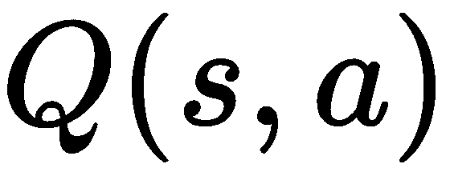
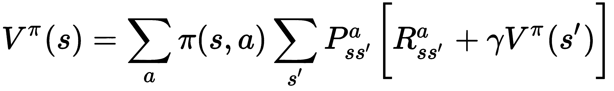
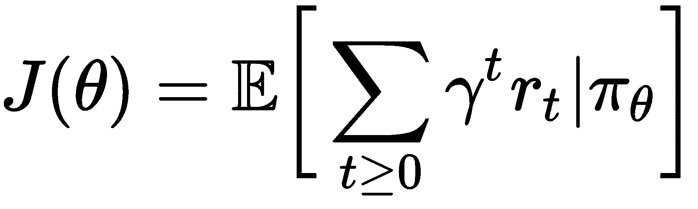

# 第八章：强化学习

与生成对抗网络一起，强化学习算法是目前**人工智能**（**AI**）领域最为显著的进展。多年来，计算机科学家一直在努力创建能够像人类一样感知并对环境作出反应的算法和机器。强化学习就是这一努力的体现，它带来了广受欢迎的 AlphaGo 和自动驾驶汽车。在本章中，我们将介绍强化学习的基础，为本书后续章节中创建更先进的人工智能智能体打下基础。

强化学习发挥了人类从经验中学习的思想。像生成模型一样，它基于**评估反馈**进行学习。与指导性反馈不同...

# 技术要求

在本章中，我们将使用 Python 中的 TensorFlow。同时，我们还将使用 OpenAI gym 来测试我们的算法。

OpenAI gym 是一个用于开发和测试强化学习算法的开源工具包。它是用 Python 编写的，提供了从 Atari 游戏到机器人仿真等多种环境。当我们在本章及后续章节中开发强化学习算法时，gym 将为我们提供可以测试的环境，而这些环境通常是我们自己构建起来非常复杂的。

你将需要 macOS 或 Linux 环境来运行 gym。你可以通过运行一个简单的`pip install`命令来安装 gym：

```py
pip install gym
```

现在你应该已经安装了 gym！如果遇到错误，可能是依赖问题。请检查官方 gym GitHub 仓库以获取最新的依赖项（[`github.com/openai/gym`](https://github.com/openai/gym)）。

# 强化学习原理

强化学习基于从与周围环境的互动中学习，并因此奖励在环境中采取的正面行动的概念。在强化学习中，我们将我们的算法称为**智能体**，因为它对周围的世界采取行动：


当智能体采取行动时，依据它是否采取了*正确*的行动，它会获得奖励或惩罚。我们在强化学习中的目标是让智能体学会采取能够最大化其从环境中获得的奖励的行动。这些概念并不新颖；事实上，它们已经存在...

# 马尔可夫过程

强化学习的核心是**马尔可夫决策过程**（**MDP**）。马尔可夫过程是随机事件的串联，其中事件发生的未来概率由最近事件的概率决定。它们通过在过程中特别添加奖励和决策扩展了基本的马尔可夫链。强化学习的基本问题可以建模为一个 MDP。**马尔可夫模型**是一类广泛应用于解决 MDP 问题的模型。

**马尔可夫模型**依赖于一个非常重要的属性，称为**马尔可夫性质**，即在马尔可夫过程中的当前状态完全表征并解释了那个时刻世界的状态；我们需要了解的关于预测未来事件的一切都依赖于我们当前所处的过程。例如，以下的马尔可夫过程模型描述了股市在任何给定时刻的状态。共有三种状态——**牛市**、**熊市**或**停滞市场**——以及在每个**状态**中停留或转换到另一个状态的相应概率：


导航马尔可夫决策过程（MDP）的实体称为**代理**。在这个例子中，代理就是股市本身。我们可以通过 SAP 记住马尔可夫过程的参数：

+   **可能的状态集**（**S**）：代理在任何给定时刻可能处于的状态。我们在强化学习中谈论的状态指的就是这个。

+   **可能的行动集**（**A**）：代理在其环境中可以采取的所有可能的行动。这些是状态之间的连接线；在两个状态之间可以发生哪些行动？

+   **转移概率**（**P**）：转移到任何给定新状态的概率。

任何强化学习代理的目标是通过最大化它从采取特定行动中获得的**奖励**来解决给定的 MDP。

# 奖励

正如我们之前提到的，强化学习算法的目标是最大化它们潜在的未来奖励。在深度学习术语中，我们称之为预期**奖励**。在强化学习算法的训练过程中，每个时间步骤*t*，我们希望最大化回报*R*：


我们的最终奖励是每个时间步骤中所有预期奖励的总和——我们称之为**累积奖励**。在数学上，我们可以将上述方程式写作：


理论上，这个过程可以永远持续下去；终止...

# 策略

策略，简单来说，就是行动的方式；你的工作或教育机构有关于你如何、何时以及做什么事情的政策。在强化学习的语境下，这个术语没有区别。我们使用策略将状态映射到强化学习代理可以采取的潜在行动。数学上来说，强化学习中的策略用希腊字母π表示，它们告诉代理在给定的状态下应该采取什么行动。让我们通过一个简单的 MDP 来检验这一点；假设你熬夜到很晚，感到困倦，但也许你正沉浸在一部好电影中。你是继续清醒还是去睡觉？在这个场景中，我们会有三个状态：

+   你最初的困倦状态

+   充分休息

+   睡眠不足

每个状态都有与其相关的转移概率和奖励，这些基于采取的行动。


例如，假设你决定熬夜。在这种情况下，你会发现自己处于**不睡觉**的转移状态。从这里，你只能去一个地方——100%的概率进入**睡眠不足**状态。

如果你睡觉了，那么你有 90%的概率会恢复精力，10%的概率还是会感到疲倦。你也有可能因为没有睡得好而回到疲劳的状态。在这种情况下，我们希望选择那些能最大化奖励的行动（睡觉）。你脑海中告诉你去睡觉的声音就是策略。

我们的目标是学习一个策略 ()，使得网络的奖励最大化；我们称之为**最优策略**。在这种情况下，最优策略是**确定性的**，意味着在每个状态下都有一个明确的最优行动可采取。策略也可以是**随机的**，即从中可以抽取一个行动的分布。

强化学习代理可以**在策略内**或**在策略外**学习；当算法在策略内时，它通过所有代理的行动来学习策略，包括它可能采取的探索性行动。它改进了*现有策略*。在策略外学习是指*偏离之前的策略*，换句话说，是评估或学习一个与原始策略不同的策略。在本章后面，我们将讨论两种不同的强化学习方法——一种是**在策略内**的（策略梯度），另一种是**在策略外**的（Q 学习）。

为了帮助我们的算法学习最优策略，我们使用**价值函数**。

# 价值函数

价值函数帮助我们衡量在某些状态下的预期奖励；它表示在任何给定状态下，遵循某个策略的预期累计奖励。强化学习领域使用两种类型的价值函数；**状态价值函数** *V*(*s*) 和 **行动价值函数** 。

状态价值函数描述了在遵循某个策略时，一个状态的价值。它是代理在某一状态*s*下，遵循策略π时，预期获得的回报。这个函数会给我们代理在开始遵循某个策略时，在状态*s*下的预期奖励：

让我们分解一下这个函数...

# 贝尔曼方程

作为强化学习领域最重要的方程之一，贝尔曼方程是解决强化学习问题的基石。贝尔曼是应用数学家，他开发了这个方程，它不仅仅是一个方程，更像是一个优化条件，用来模拟代理在某一时刻决策的奖励，基于该决策可能带来的预期选择和奖励。贝尔曼方程可以为状态值函数或动作值函数推导：




像往常一样，让我们分解这些方程式。我们将重点关注状态值函数。首先，我们有每个状态/行动对的所有策略的总和：


接下来，我们有转移概率；它是处于状态*s*，采取行动*a*，并最终到达状态的概率！[](img/825e8573-ef10-4033-8474-2e48bda6425a.png)：


接下来是我们之前讨论的累计奖励：


最后，我们有该函数的折扣值：


总的来说，我们描述了整个强化学习过程；我们希望找到一个满足贝尔曼方程的状态值函数或动作值函数。这里缺少一个关键部分；我们如何在实践中解决这个问题？一种选择是使用一种叫做**动态规划**的方法，它也是贝尔曼本人开发的优化方法。使用动态规划求解最优策略的一种方法是使用**值迭代法**。通过这种方式，我们将贝尔曼方程作为一个迭代更新函数。我们希望通过强制执行贝尔曼方程从 Q 收敛到 Q*：


让我们看看这在 Python 中是如何工作的，通过尝试解决推车倒立摆问题。通过值迭代法，我们从一个随机值函数开始，然后通过迭代过程找到改进的值函数，直到我们得到一个最优值函数。

我们可以尝试在推车倒立摆问题上进行这个操作。让我们导入`gym`并先生成一个随机的值函数：

```py
import gym
import numpy as np

def gen_random_policy():
 return (np.random.uniform(-1,1, size=4), np.random.uniform(-1,1))
```

接下来，让我们把策略转化为行动：

```py
def policy_to_action(env, policy, obs):
 if np.dot(policy[0], obs) + policy[1] > 0:
 return 1
 else:
 return 0
```

最后，我们可以运行训练过程：

```py
def run_episode(env, policy, t_max=1000, render=False):
 obs = env.reset()
 total_reward = 0
 for i in range(t_max):
 if render:
 env.render()
 selected_action = policy_to_action(env, policy, obs)
 obs, reward, done, _ = env.step(selected_action)
 total_reward += reward
 if done:
 break
 return total_reward

if __name__ == '__main__':
 env = gym.make('CartPole-v0')

 n_policy = 500
 policy_list = [gen_random_policy() for _ in range(n_policy)]

 scores_list = [run_episode(env, p) for p in policy_list]

 print('Best policy score = %f' %max(scores_list))

 best_policy= policy_list[np.argmax(scores_list)]
 print('Running with best policy:\n')
 run_episode(env, best_policy, render=True)
```

虽然在这种简单的环境中值迭代方法有效，但当我们将其应用于更大、更复杂的环境时，很快就会遇到问题。因为我们必须单独计算每个状态/值对的值，许多未结构化的输入（如图像）变得庞大得难以处理。想象一下，如果每次我们的强化学习算法试图进行一次动作时，都需要为高级视频游戏中的每一个像素计算这个函数，那将是多么昂贵！

正因为如此，我们使用深度学习方法来为我们进行这些计算。深度神经网络可以充当函数逼近器。主要有两种方法，分别是**深度 Q 学习**和**策略梯度**。

# Q–学习

Q 学习是一种利用动作值函数或 Q 函数来解决任务的强化学习方法。在本节中，我们将讨论传统的 Q 学习和深度 Q 学习。

标准 Q 学习基于 Q 表的核心概念。你可以将 Q 表看作一个参考表；每一行代表一个状态，每一列代表一个动作。表中的值是针对特定的动作和状态组合所获得的预期未来奖励。从程序步骤上，我们做如下操作：

1.  初始化 Q 表

1.  选择一个动作

1.  执行动作

1.  测量获得的奖励

1.  更新 Q 值

让我们逐步解析这些步骤，以更好地理解算法。…

# 策略优化

**策略优化方法**是 Q 学习和价值函数逼近的替代方法。这些方法不是学习状态/动作对的 Q 值，而是通过计算梯度直接学习一个将状态映射到动作的策略π。从根本上讲，对于像优化问题这样的搜索，策略方法是一种从潜在的政策动作的随机分布中学习正确策略的手段。因此，我们的网络架构稍作调整，以直接学习策略：


因为每个状态都有一组可能的动作分布，所以优化问题变得更简单。我们不再需要为特定动作计算精确的奖励。回想一下，深度学习方法依赖于“回合”这一概念。在深度强化学习中，每个回合代表一场游戏或任务，而**轨迹**代表游戏或任务中的某些动作或方向。我们可以将轨迹定义为状态/动作/奖励组合的路径，用希腊字母 tau (*Τ*)表示：


想象一个机器人学习走路；如果我们使用 Q 学习或其他动态规划方法来完成这个任务，我们的算法需要精确地学习如何为每个可能的轨迹中的每个关节动作分配奖励。算法需要学习时机、如何弯曲机器人的肢体角度，等等。通过直接学习策略，算法可以简单地专注于当机器人走路时，如何移动机器人的脚。

在使用策略梯度方法时，我们可以像使用 Q 学习那样简单地定义一个个体策略；我们的策略是未来折扣奖励的期望总和：



因此，我们网络的目标是*最大化*某个策略，*J*，以最大化我们期望的未来奖励：


学习策略的一种方法是使用梯度方法，因此得名*策略*梯度。由于我们希望找到最大化奖励的策略，我们在潜在策略的分布上执行与梯度下降相反的操作——*梯度上升*：


新神经网络的参数成为我们策略的参数，因此通过执行梯度上升并更新网络参数，变为。完整推导策略梯度超出了本书的范围，但让我们简要介绍一些策略梯度方法在实际中的高级概念。请看以下的景观；有三条潜在路径和三种可能的最终奖励：


策略梯度方法旨在增加采取通向最高奖励路径的概率。从数学上讲，标准的策略梯度方法如下所示：


和往常一样，让我们稍微分解一下。我们可以从以下几点开始：我们的梯度，*g*，是梯度期望值与某一给定动作/状态对的策略的对数相乘，再乘以**优势**。优势即为动作价值函数减去状态价值函数：


在实现中，传统的策略梯度方法仍然会遇到问题。一个特别显著的问题被称为“信用分配问题”，即从一个长时间交互轨迹中获得的奖励信号发生在轨迹的末尾。策略梯度方法很难确定是哪一步动作导致了这个奖励，并且难以*分配信用*给该动作。

策略梯度是一类可以围绕这一思想构建的算法的概述。优化这些方法的关键在于各个优化过程的细节。在接下来的部分，我们将探讨几种改进传统策略梯度方法的方式。

# 策略优化的扩展

计算策略梯度的一种常见方法是**Reinforce** **算法**。Reinforce 是一种蒙特卡洛策略梯度方法，它使用似然比来估计给定点上策略的价值。该算法可能导致较高的方差。

传统的策略梯度方法可能会比较具有挑战性，因为它们对步长参数的选择极其敏感。步长过大会使得正确的策略被噪声压倒——步长过小则训练变得异常缓慢。我们的下一类强化学习算法，**近端策略优化**（**PPO**），旨在解决策略梯度的这一短板。PPO 是一类新的强化学习算法，旨在...

# 总结

在本章中，我们学习了强化学习的重要基础，它是人工智能领域中最为显著的实践之一。

强化学习基于智能体在环境中行动的概念，并根据它所观察到的周围环境做出决策。智能体的行为由策略优化方法或动态规划方法指导，这些方法帮助它学习如何与环境互动。当我们更注重探索和离策略学习时，我们使用动态规划方法。另一方面，当我们面临密集的、连续的问题空间且只想优化我们关心的内容时，我们使用策略优化方法。

在接下来的章节中，我们将探讨强化学习在多个现实世界中的应用。
