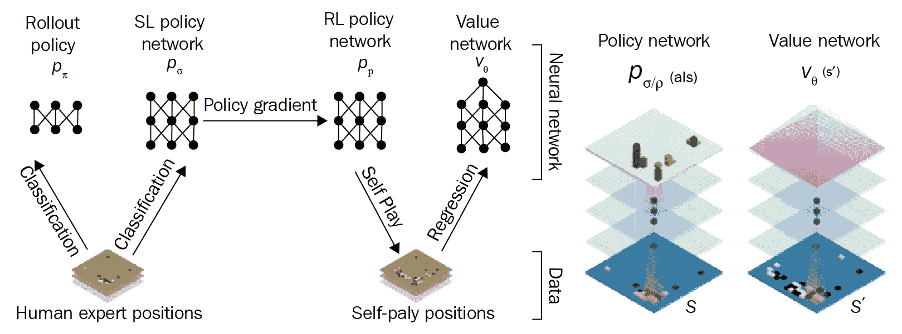
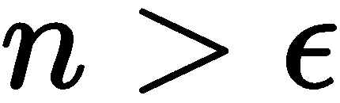

# 第十章：游戏 AI 的深度学习

在过去几年中，**人工智能**（**AI**）最显著的应用之一就是游戏领域，尤其是随着 AlphaGo 和 AlphaGo Zero 的成功，游戏类 AI 成为公众广泛关注的话题。在本章中，我们将实现两种基本的游戏 AI 版本；一种用于视频游戏，另一种用于棋盘游戏。我们主要会使用强化学习方法作为我们的核心方法。我们还将介绍一些目前存在的最先进的游戏 AI 背后的方法。

在本章中，将涵盖以下主题：

+   游戏树与基本博弈论

+   构建一个 AI 代理来玩井字游戏

+   构建...

# 技术要求

在本章中，我们将使用以下内容：

+   TensorFlow

+   OpenAI Gym

强烈建议你在训练本章中的模型时，能够使用 GPU，无论是在自己的机器上还是通过云服务平台。

# 介绍

AI 最近在游戏领域引起了广泛关注。创造 AlphaGo 的 Google 研究团队 DeepMind 一直提倡在游戏应用中使用强化学习方法。越来越多的视频游戏公司开始使用深度学习方法来开发其 AI 玩家。那么，我们从哪里开始，AI 在游戏领域的发展又将走向何方呢？

传统上，游戏 AI 系统由一系列硬编码规则组成，覆盖了 AI 应对的各种行为。你是否曾玩过一些老旧的冒险游戏、第一人称射击游戏或策略游戏，其中的 AI 玩家显然是根据硬编码策略运作的？这些 AI 通常...

# 棋盘游戏的网络

当我们谈论为游戏设计算法时，实际上是在谈论为特定类型的游戏创建算法，这种游戏被称为**有限的二人零和顺序游戏**。这实际上就是在说：

+   两个独立角色之间的互动情境（一个游戏）

+   在任何时刻，两方玩家的互动方式是有限的

+   游戏是零和的，这意味着游戏的最终状态导致其中一方完全获胜

+   游戏是顺序进行的，这意味着角色按顺序一个接一个地进行移动

本节中，我们将介绍一些经典的游戏类型示例，如井字游戏、国际象棋和围棋。由于为围棋这样的棋盘游戏创建和训练一个算法将是一个巨大的任务，出于时间和计算约束，我们将在一个有限步骤且更为合理的游戏中创建一个代理：国际象棋。在本节中，我们将介绍一些游戏 AI 背后的基本概念，并通过 Python 示例演示不同的策略。

# 理解游戏树

如果你熟悉**博弈论**，你就知道有一整个数学分支致力于理解和分析游戏。在计算机科学的世界里，我们可以通过将游戏简化为一个决策树结构来分析它，这就是**博弈树**。博弈树是一种描绘棋盘游戏中可能走法和状态的方法。让我们以井字游戏的博弈树为例，如下所示：


这棵树展示了基于某一特定起始点的所有可能组合和游戏结果。从一个节点到另一个节点的移动表示**一步棋**，棋步持续进行...

# AlphaGo 和智能游戏 AI

虽然 MCTS 已经是游戏 AI 的基石，但正是 DeepMind 的 AlphaGo 程序将游戏 AI 带入了现代时代。AlphaGo 及其衍生版本（AlphaGo Zero 和 AlphaGo Master）是利用 MCTS 来玩极其复杂的古老中国围棋的游戏 AI 系统。围棋有 10⁷⁶¹种可能的棋局组合，创造一个可以玩这款游戏的系统成为了 AI 领域的一个里程碑。它甚至成为了一部同名的广受关注的纪录片的主题。

AlphaGo 结合了 MCTS 和深度学习方法，使得 AlphaGo 程序变得非凡。DeepMind 训练了深度神经网络，类似于我们在本书中学习的那种，来学习游戏状态，并有效地引导 MCTS 以更智能的方式进行搜索。这个网络会查看棋盘的当前状态，以及之前的棋步，决定接下来该下什么棋。DeepMind 在 AlphaGo 中的主要创新是使用深度神经网络来理解游戏的状态，然后利用这种理解来智能地引导 MCTS 的搜索。系统的架构方式使得 AlphaGo 能够自我学习游戏，首先通过观看人类下棋，其次通过与自己对弈并纠正之前的错误。

该架构实际上使用了两种不同的神经网络：策略网络和价值网络：

+   **价值网络**：通过近似价值函数来减少 MCTS 搜索的深度。

+   **策略网络**：通过模拟未来的行动来减少 MCTS 搜索的广度。策略网络从实际的人类围棋游戏中学习，并据此发展出策略：



让我们深入了解这两者，以理解系统是如何工作的。

# AlphaGo 策略网络

策略网络的目标是捕捉并理解棋盘上玩家的一般行动，以帮助 MCTS 在搜索过程中引导算法朝向有前景的行动；这减少了**搜索的广度**。在架构上，策略网络分为两部分：一个监督学习策略网络和一个强化学习策略网络。

第一个网络，监督网络，是一个 13 层的**卷积神经网络**（**CNN**）。它通过观察人类在游戏中进行的动作进行训练——准确来说是 3000 万次——并根据特定状态输出每个动作的概率分布。我们将这种类型的监督学习称为**行为克隆**。

...

# AlphaGo 价值网络

价值网络被用来通过引导 MCTS 朝向某些节点来减少系统玩法中的误差。它有助于减少**搜索的深度**。AlphaGo 价值网络通过与自己进行更多的对局来进行训练，以优化从策略网络学到的策略，方法是通过估算价值函数，特别是行动价值函数。回顾一下第八章，*强化学习*，行动价值函数描述了在特定状态下采取某个行动的价值。它衡量的是从一对状态和行动中得到的累积奖励；对于给定的状态和我们采取的行动，这会增加多少奖励？它让我们假设，如果在第一步采取不同的行动，而不是代理人可能希望做的，然后在之后遵循策略，会发生什么。行动价值函数通常也被称为**Q**-**函数**，因为我们用 Q 来表示它：


网络通过利用来自策略网络的噪声版本的策略并回归棋盘状态与游戏结果，来逼近价值函数。

该网络使用我们在第八章中学习的强化算法进行训练，*强化学习*。如果你还记得，Reinforce 是一种蒙特卡洛策略梯度方法，使用似然比来估计某一点上的策略价值。Reinforce 算法试图最大化预期奖励，因此整个系统有两个目标：像专业人类玩家一样玩游戏，同时尝试赢得比赛。

# AlphaGo 在行动中

我们已经讨论了 AlphaGo 如何帮助选择行动，现在让我们回到任何游戏系统的核心：游戏树。虽然 AlphaGo 利用了游戏树和 MCTS，作者们创造了一个变种，称为*异步策略*和*价值 MCTS*（APV-MCTS）。与我们之前讨论的标准 MCTS 不同，APV-MCTS 通过两种不同的指标来决定扩展和评估哪个节点：

+   价值网络的结果

+   蒙特卡洛模拟的结果

这些方法的结果与混合参数λ相结合。然后，算法根据在初始监督学习阶段获得的概率选择一个动作。虽然使用这些概率似乎有些反直觉……

# 视频游戏的网络

到目前为止，我们已经学习了如何使用强化学习方法来玩桌面游戏，利用 UCT 和 MCTS；现在，让我们看看在视频游戏中我们能做些什么。在第八章《强化学习》中，我们看到如何使用强化学习方法来完成诸如 OpenAI 倒立摆挑战之类的基本任务。在这一节中，我们将重点关注一组更困难的游戏：经典的雅达利视频游戏，这些游戏已成为深度学习任务的标准基准。

你可能在想——*我们不能将使用在倒立摆环境中的方法扩展到雅达利游戏中吗？* 其实可以，但我们需要处理的输入信息要多得多。在雅达利环境中，实际上在任何视频游戏环境中，网络的输入都是单个像素。与倒立摆的四个简单控制变量不同，我们现在处理的是 100,800 个变量（210 * 160 * 3）。因此，这些网络的复杂性和训练时间可能会更高。在这一节中，我们将尽量简化网络，使其更容易学习和训练。

我们将使用 OpenAI Gym 环境来模拟雅达利游戏《太空入侵者》：


对于那些不熟悉《太空入侵者》的朋友来说，概念很简单——你（屏幕底部的绿色火箭）必须在外星飞船摧毁你之前摧毁它们。外星飞船会用导弹攻击你，你也可以反击。谷歌的 DeepMind 最早在他们的论文《用深度强化学习玩雅达利》*Playing Atari with Deep Reinforcement Learning*中将《太空入侵者》作为基准任务提出，这也真正推动了将雅达利游戏作为基准任务，用智能体击败的概念。

我们将构建一个叫做**深度 Q 网络**的东西，我们在第八章《强化学习》中提到过它。在下一节中，我们将进一步探讨在该章节中涵盖的许多基本 Q 学习内容。话不多说——让我们开始吧！

# 构建深度 Q 网络

深度 Q 网络最早由 DeepMind 在他们的论文《通过深度强化学习实现人类级别的控制》*Human-level control through deep reinforcement learning*中提出，该论文发表在英国科学期刊《Nature》上，现在通常被称为*Nature 论文*。深度 Q 学习的目标是创建一个能够从高维输入（如视频游戏）中学习策略的 AI 代理。在我们的案例中，我们希望构建一个能够通过基本任务并向更困难任务推进的深度 Q 网络。

深度 Q 网络通过使用人工神经网络作为值逼近器来逼近 Q 值，而不是使用 Q 表单独计算它们。网络的输入将是一堆预处理过的帧，接下来...

# 利用目标网络

让我们回顾一下 Q-函数优化过程：


你可能会注意到，这个函数有一个独特的属性，那就是它是递归的；一组 Q 值依赖于另一组 Q 值的值。这在训练中会成为一个问题；如果我们改变一组值，就会改变另一组值。简单来说，当我们接近目标 Q 值时，Q 值会变得更远。它就像是在你快要完成比赛时不断把终点线往后移！

为了解决这个问题，Q 网络每经过 10,000 次迭代就会创建一个自身的副本，称为**目标网络**，它将表示目标 Q 值。我们可以通过在 TensorFlow 中创建一个目标网络变量来实现这一点，首先用类初始化，然后在 TensorFlow 会话中运行：

```py
## def contained under  __init__(self, actions): ##

## Initialize the base network
self.inputVal, self.QValue = self.deepQarchitecture()

## Initialize the target network
self.inputValT, self.QValueT = self.deepQarchitecture()
```

至于 10,000 次迭代，我们在开始构建 DQN 类时已经定义了`self.update_time = 10000`。

# 经验回放缓冲区

虽然我们在第八章中简要提到过，*强化学习*，但现在让我们深入探讨一下经验回放缓冲区的技术细节。经验回放是一种受生物启发的工具，它在每个时间步骤的过程中存储智能体的经验。具体来说，它在每个时间步骤存储[状态、动作、奖励、下一个状态]的配对：


与其在状态-动作对发生时立即运行 Q 学习，经验回放将这些对在它们被发现时存储起来。经验回放缓冲区有两个作用：

+   通过存储并随机抽样来记住过去的经验

+   减少经验被...的机会

# 选择动作

到目前为止，我们已经告诉网络遵循我们为其初始化的随机权重，但并没有给它指导，告诉它如何决定采取哪些动作来更新这些权重。在第八章中使用的策略方法，比如我们在*强化学习*中的应用，以及之前的井字棋案例，Q-learning 方法的目标是通过逼近 Q 函数的值，而不是直接学习策略。那么，我们该怎么做呢？

深度 Q 网络使用一种叫做**探索**的策略来决定采取什么动作。如果我们不使用这种策略，网络可能只会局限于游戏的最基本层次，因为它不会知道哪些动作能够帮助它提升！

为了解决这个问题，我们将采用一种叫做 **∈-贪婪** 的策略。这种策略通过基于两种方法选择学习的动作；首先，选择那些为我们的模型提供最高奖励（最大 Q 值）的方法；其次，以 ∈ 的概率随机选择方法。在这种策略中，我们使用一个基本的不等式：



我们将 epsilon 变量设置为 1，并从一个分布中抽取随机数。如果这个数字不满足不等式并且小于 epsilon，我们的代理将**探索**这个空间，这意味着它会寻求更多关于它当前所在位置的信息，从而开始选择状态/动作对，以便我们可以计算 Q 值。如果数字实际上大于 epsilon，我们将**利用**我们已经知道的信息来选择一个 Q 值进行计算。算法以较高的∈开始，并在训练过程中按固定量减少其值。我们称这个过程为**退火**。在原始的 DeepMind 论文中，研究人员使用了这种策略，在前百万帧内将 epsilon 从 1 退火到 0.1，然后在之后保持 0.1。让我们回顾一下我们在本节开始时初始化的参数：

```py
self.starting_ep = 1.0
self.ending_ep = 0.1
```

你会注意到我们使用了这些确切的规格。在网络的测试阶段，epsilon 将会显著降低，因此更偏向于利用策略。

让我们在 Python 中实现这个策略，并仔细研究它的机制。我们将定义一个名为 `getAction` 的函数，它位于我们的 `deepQ` 类中：

```py
def select(self):
    ## Select a Q Value from the Base Q Network
    QValue = self.QValue.eval(feed_dict = {self.iputVal:[self.currentState]})[0]
    ## Initialize actions as zeros
    action = np.zeros(self.action)
    action_index = 0
    ## If this timestep is the first, start with a random action
    if self.timeStep % 1 == 0:
      ##
      if random.random() <= self.starting_ep:
        a_index = random.randrange(self.action)
        action[a_index] = 1
      else:
        action_index = np.argmax(QValue)
        action[action_index] = 1
    else:
      action[0] = 1
```

我们还将调整我们的 epsilon 值：

```py
## Anneal the value of epsilon
    if self.starting_ep > self.ending_ep and self.timeStep > self.observe:
      self.starting_ep -= (self.starting_ep - self.ending_ep) / self.explore
```

现在我们已经定义了大部分网络，接下来我们进入训练阶段。

# 训练方法

首先，让我们定义我们的训练方法。我们将这个函数命名为 `trainingPipeline`；它将接受一个动作输入以及一个 *y* 输入，*y* 代表目标 Q 值，我们将其在这里定义为占位符，并根据这些动作/状态对计算 Q 值：


我们将使用**均方误差** (**MSE**) 损失函数并进行计算，利用预测的 Q 值减去实际的 Q 值。最后，你可能会注意到我们使用了一个你可能不太熟悉的优化器，RMSProp。它是一种自适应学习率优化器，类似于 Adam，由 Geoffrey Hinton 提出。我们将...

# 训练网络

我们将给我们的训练函数起一个简单的名字：`train`。首先，我们将从回放记忆中输入小批次的数据：

```py
def train(self):
    ''' Training procedure for the Q Network'''

    minibatch = random.sample(self.replayBuffer, 32)
    stateBatch = [data[0] for data in minibatch]
    actionBatch = [data[1] for data in minibatch]
    rewardBatch = [data[2] for data in minibatch]
    nextBatch = [data[3] for data in minibatch]
```

接下来，我们将计算每个批次的 Q 值：

```py
batch = []
    qBatch = self.QValueT.eval(feed_dict = {self.inputValT: nextBatch})
    for i in range(0, 32):
      terminal = minibatch[i][4]
      if terminal:
        batch.append(rewardBatch[i])
      else:
        batch.append(rewardBatch[i] + self.gamma * np.max(qBatch[i]))
```

现在，让我们将这些内容结合起来，使用我们的训练方法。我们将使用之前定义的 `trainStep` 变量并运行训练周期。我们将输入三个变量作为输入；目标 Q 值，一个动作和一个状态：

```py
self.trainStep.run(feed_dict={
      self.yInput : batch,
      self.actionInput : actionBatch,
      self.inputVal : stateBatch
      })
```

我们将定义一个处理函数来为我们保存网络权重和状态。虽然我们在本章中没有明确介绍保存器的定义，但你可以在 GitHub 仓库中的完整代码中找到它：

```py
## Save the network on specific iterations
    if self.timeStep % 10000 == 0:
      self.saver.save(self.session, './savedweights' + '-atari', global_step = self.timeStep)
```

最后，让我们定义一个循环来将经验回放添加到其中：

```py
  def er_replay(self, nextObservation, action, reward, terminal):
    newState = np.append(nextObservation, self.currentState[:,:,1:], axis = 2)
    self.replayMemory.append((self.currentState, action, reward, newState, terminal))
    if len(self.replayBuffer) > 40000:
      self.replayBuffer.popleft()
    if self.timeStep > self.explore:
      self.trainQNetwork()

    self.currentState = newState
    self.timeStep += 1
```

我们已经组装好了网络，接下来让我们开始运行它！

# 运行网络

现在，让我们进入我们一直期待的时刻！让我们导入`gym`、NumPy、我们的深度 Q 网络文件以及一些处理函数：

```py
import cv2import sysfrom deepQ import deepQimport numpy as npimport gym
```

我们将定义我们的代理类为`Atari`，并使用该类初始化环境、网络和动作：

```py
class Atari:    def __init__(self):    self.env = gym.make('SpaceInvaders-v0')    self.env.reset()    self.actions = self.env.action_space.n    self.deepQ = deepQ(self.actions)    self.action0 = 0
```

我们的深度 Q 网络无法直接处理 Atari 游戏，因此我们需要编写一些预处理代码来处理视频输入。我们将这个函数称为`preprocess`，它将接收一个单一的游戏观察：

```py
def preprocess(self,observation): ...
```

# 总结

在本章中，我们学到了很多东西，从如何实现 MCTS 方法来玩棋盘游戏，到创建一个先进的网络来玩 Atari 游戏，甚至了解了著名的 AlphaGo 系统背后的技术。让我们回顾一下我们所学到的内容。

强化学习方法已成为创建游戏 AI 的主要工具。无论是为现实生活中的棋盘游戏创建系统，还是为视频游戏创建系统，我们在第八章《强化学习》中学到的关于策略、Q 学习等基本概念，构成了这些复杂 AI 系统的基础。当我们为棋盘游戏创建 AI 时，我们依赖于游戏树的基本构建块，并使用 MCTS 来模拟从该游戏树中产生的各种游戏结果。对于像 AlphaGo 和棋类 AI 这样的更高级系统，我们利用神经网络来帮助指导 MCTS，并使其模拟更为有效。

在视频游戏 AI 方面，我们可以利用策略梯度方法或 Q 学习方法。在本章中，我们学习了如何利用后者的一种变体——深度 Q 学习来玩 Atari 游戏《太空入侵者》。深度 Q 学习通过使用目标网络和经验回放缓冲区等技术，改进了基本的 Q 学习，从而提升了性能。

在我们接下来的机器人深度学习章节中，我们将更深入地探讨强化学习方法如何创造智能系统。
