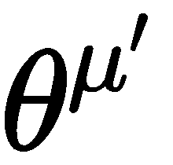

# 第十二章：机器人学中的深度学习

到目前为止，我们已经学习了如何构建一个智能聊天机器人，它可以像人类一样玩棋盘游戏，并从股市数据中提取洞察。在本章中，我们将进入许多人眼中认为 **人工智能** (**AI**) 所代表的领域：自我学习的机器人。在 第八章，*强化学习* 章节中，您学习了强化学习的所有内容，以及如何利用这些方法处理基本任务。在本章中，我们将学习如何将这些方法应用于机器人的运动控制。

在本章中，我们将使用 GPU 来帮助训练这些强大的算法。如果您的计算机没有 GPU 支持，建议您使用 AWS 或 Google Cloud 来提供更多的计算能力。

本章将涵盖以下主题：

1.  设置您的环境

1.  设置深度确定性策略梯度模型

1.  演员-评论家网络

1.  DDPG 及其实现

# 技术要求

在本章中，我们将使用 TensorFlow 和 OpenAI gym 环境，因此您需要在计算机上安装以下程序：

+   TensorFlow

+   OpenAI gym

# 介绍

传统机器人技术，被称为 **机器人过程自动化**，是自动化物理任务的过程，这些任务通常由人类完成。类似于 **机器学习** 这一术语涵盖了多种方法和方法论，包括深度学习方法；机器人学涵盖了各种各样的技术和方法。一般来说，我们可以将这些方法分为两类：**传统方法** 和 **人工智能方法**。

传统的机器人控制编程通常需要以下几个步骤：

1.  **测量**：机器人从传感器接收数据，以确定为完成特定任务应该采取的行动。

1.  **推理**：机器人相对于其环境的方位是基于传感器接收到的数据。

1.  **建模**：在每个动作状态下建模机器人必须做什么以完成一个动作。

1.  **控制**：编写低级控制代码，例如模型用于控制机器人运动的转向机制。

1.  **模型部署**：检查模型在实际环境中如何工作，这些环境是为其创建的。

在传统的机器人开发中，这些方法是硬编码的。然而，通过深度学习，我们可以创建能够从头到尾学习动作的算法，从而消除该过程中的第*2*到第*4*步，并显著缩短开发成功机器人所需的时间。更重要的是，深度学习技术具有泛化能力；我们无需为特定任务的变化编程动作，而是可以教会算法学习对该任务的普适响应。近年来，这种人工智能方法在机器人领域取得了突破，允许开发出更为先进的机器人。

由于机器人市场中零部件和控制系统缺乏一致性，设计和创建物理机器人可能是一个艰巨的任务。2018 年 2 月，OpenAI 在其训练环境中加入了虚拟模拟机器人手臂，开启了无数新应用和开发的大门。这些虚拟环境使用物理环境模拟器，允许我们立即开始测试机器人控制算法，而无需采购昂贵且不一致的零部件。

# 设置你的环境

我们将利用 OpenAI 的 gym 环境，这是我们在第八章《强化学习》中学习的内容，来创建一个智能机器人手臂。OpenAI 基于 Fetch 机器人手臂创建了一个虚拟环境，成为第一个完全虚拟化的机器人算法测试空间：


你应该已经安装了这些环境，因为我们在第十一章《金融深度学习》中安装了 gym 环境。我们只需再添加两个包来让这个机器人环境运行起来：

```py
brew install cmake openmpi
```

`cmake`和`openmpi`都是为提高计算效率而设计的...

# MuJoCo 物理引擎

MuJoCo 是一个虚拟环境，模拟现实物理环境，用于测试智能算法。这是 Google DeepMind、OpenAI 等领先 AI 研究者用来教虚拟机器人执行任务、虚拟人类以及蜘蛛等任务的环境。特别是 Google，在 2017 年发布了一段虚拟人类自学跑步和跳跃的视频，引起了广泛关注，展示了强化学习技术的应用：


MuJoCo 是一个付费许可程序，但它提供 30 天的免费试用，我们将使用这个试用期来完成我们的任务。如果你是学生，可以免费获得 MuJoCo 的永久许可证，用于个人项目。以下是获取 MuJoCo 并设置 AI 应用环境的几个步骤：

1.  从 MuJoCo 网站下载二进制文件

1.  注册 MuJoCo 的免费试用

1.  将你的许可证密钥放入`~|.mujoco|mjkey.txt`文件夹中

1.  安装 MuJoCo 的 Python 包

这可能看起来有些繁琐，但它确实让我们能够使用 AI 界最前沿的模拟器。如果你在这些步骤中遇到问题，我们将在本书的 GitHub 仓库中保持最新的帮助文档。现在，让我们一起来完成这些步骤。

# 下载 MuJoCo 二进制文件

首先，下载 MuJoCo 程序本身。访问 [`www.roboti.us/index.html`](https://www.roboti.us/index.html) 并下载与您的操作系统对应的[`mjpro150`](https://www.roboti.us/index.htm) 文件。您也可以通过命令行使用以下代码来下载：

```py
cd ~mkdir .mujococd .mujococurl https://www.roboti.us/download/mjpro150_osx.zip
```

# 注册 MuJoCo 的免费试用

按照以下步骤注册 MuJoCo 的免费试用：

1.  下载完 MuJoCo 的二进制文件后，访问 [`www.roboti.us/license.html`](https://www.roboti.us/license.html) 注册免费试用。您应该会看到以下注册 MuJoCo 的提示框：


1.  看看计算机 ID 框右侧的蓝色链接吗？您需要下载与您的操作系统对应的链接。这将生成一个 MuJoCo 密钥，用于跟踪您的计算机和试用。如果您使用的是 macOS，可以通过以下代码下载并获取密钥：

```py
curl https://www.roboti.us/getid/getid_osx
sudo ./getid_osx
```

1.  如果您使用的是 Linux 机器，可以通过以下代码下载 MuJoCo 密钥：

```py
wget https://www.roboti.us/getid/getid_linux
sudo ./getid_linux
```

一旦您获得了密钥，将其放入提示框中。您应该会收到一封包含许可证的电子邮件，这将使您能够使用 MuJoCo。

# 配置 MuJoCo 文件

接下来，您需要配置您的访问文件。您应该会通过电子邮件收到来自 MuJoCo 的许可证密钥。一旦收到，请将其放入以下文件夹，以便程序能够访问：

```py
~/.mujoco/mjkey.txt
```

# 安装 MuJoCo Python 包

最后，我们需要安装 MuJoCo Python 包，这将允许 Python 与该程序进行交互。我们可以通过简单的 `pip install` 来完成：

```py
pip install mujoco-py
```

您现在应该可以访问最强大的机器人测试虚拟环境。如果在此过程中遇到任何问题，请记得您可以随时通过本书的 GitHub 仓库访问最新的故障排除页面。

# 设置深度确定性策略梯度模型

在第八章《*强化学习*》中，我们学习了如何使用策略优化方法处理连续动作空间。策略优化方法通过优化环境中采取的行动直接学习，如下图所示：


记住，策略梯度方法是**离策略**的，这意味着它们在某一时刻的行为不一定反映它们所遵循的策略。这些策略梯度算法使用**策略迭代**，评估给定的策略并跟随策略梯度来学习最优策略。...

# 经验重放缓冲区

接下来，让我们像在第十一章《*金融深度学习*》中一样创建经验重放缓冲区，在那一章中，我们研究了如何为游戏创建深度学习模型。

# 事后经验重放

为了改善机器人运动，OpenAI 的研究人员于 2018 年发布了一篇关于一种名为 **后视经验回放**（**HER**）的技术的论文，旨在克服在 **稀疏环境** 中训练强化学习算法时出现的问题。回想一下 第八章，*强化学习*，为一个智能体选择合适的奖励可以决定该智能体的表现成败。以下这种轶事通常是由于不良奖励函数的结果：

有一个朋友正在训练一个模拟的机器人手臂，让它伸向桌子上方的一个点。结果发现，这个点是相对于桌子定义的，而桌子并没有固定在任何地方。学习到的策略是猛烈地撞击桌子，导致桌子...

# 演员-评论员网络

DDPG 模型依赖于演员-评论员框架，该框架用于学习策略，而不需要一遍又一遍地计算价值函数。

演员-评论员模型是强化学习中的基础框架。它们是 **生成对抗网络**（**GANs**）的基础和灵感来源，后者我们在 第七章 *生成模型* 中学到过。

正如你可能已经猜到的，这些演员-评论员模型由两个部分组成：

+   **行动者**：估计策略函数

+   **评论员**：估计价值函数

这个过程如字面所示；演员模型尝试模仿一个动作，而评论员模型则批评演员模型以帮助其改善表现。让我们以机器人的应用为例；机器人运动的目标是创建一个模拟人类能力的机器人。在这种情况下，演员会想观察人类的动作以进行模仿，评论员则帮助引导机器人演员变得更像人类。通过演员-评论员模型，我们只是将这一范式转换成数学公式。总体来说，演员-评论员过程如下所示：


每个这些网络都有自己的损失函数。

# 行动者

演员网络也被称为 **目标策略网络**。演员通过使用小批量的梯度下降进行训练。它的损失由以下函数定义：


这里，*s* 表示从回放缓冲区采样的状态。

# 评论员

评论员的输出是动作价值函数 Q (^(s,a)) 的估计值，因此你可能会看到评论员网络有时被称为 **动作**-**价值函数近似器**。它的工作是帮助行动者适当地近似动作价值函数。

评论员模型与我们在第十章《游戏学习深度学习》中看到的 Q 函数近似器非常相似。评论员生成一个**时间差异**（**TD**）误差，用于更新其梯度。TD 误差帮助算法减少由高度相关数据预测时出现的方差。DDPG 利用目标网络，就像在第十章《游戏学习深度学习》中一样，只不过目标是通过利用演员的输出计算出来的：


这个目标网络为 TD 误差计算生成目标，并充当正则化器。我们来分解一下：

+   代表了我们的 TD 误差。

+   r^i 代表从某个动作中获得的奖励。

+   共同代表了演员和评论员模型的目标！[](img/40dd12d0-0706-4931-aece-ceefb112ba0d.png)。回忆一下！[](img/f57fbccf-3122-44dc-ba49-4ad5bbb6f6cb.png)（gamma）代表了**折扣因子**。记住，折扣因子可以是介于 0 和 1 之间的任何值，表示当前奖励和未来奖励之间的相对重要性。所以，我们的目标变成了演员/评论员模型输出与混合参数的乘积。

+   代表演员网络的目标；它表示目标是状态*s*的函数，给定一个特定的策略。

+   同样，我们也可以说，演员网络的输出依赖于评论员网络，表示评论员网络的权重为。

评论员尝试最小化它自己的损失函数：


# 深度确定性策略梯度

**深度确定性策略梯度**（**DDPG**）有一个自然扩展，通过将用于近似演员和评论员的前馈神经网络替换为递归神经网络。这个扩展称为**递归确定性策略梯度**算法（**RDPG**），并在 N. Heess、J. J. Hunt、T. P. Lillicrap 和 D. Silver 的论文中进行了讨论。*基于记忆的控制与递归神经网络*，2015 年。

循环评论员和演员通过**时间反向传播**（**BPTT**）进行训练。对有兴趣的读者，论文可以从[`arxiv.org/abs/1512.04455`](https://arxiv.org/abs/1512.04455)下载。

# DDPG 的实现

本节将展示如何使用 TensorFlow 实现演员-评论员架构。代码结构几乎与上一章展示的 DQN 实现相同。

`ActorNetwork`是一个简单的多层感知机（MLP），它将观察状态作为输入：

```py
class ActorNetwork:

    def __init__(self, input_state, output_dim, hidden_layers, activation=tf.nn.relu):

        self.x = input_state
        self.output_dim = output_dim
        self.hidden_layers = hidden_layers
        self.activation = activation

        with tf.variable_scope('actor_network'):
            self.output = self._build()
            self.vars = tf.get_collection(tf.GraphKeys.TRAINABLE_VARIABLES, 
                                          tf.get_variable_scope().name)

    def _build(self):

        layer = self.x
        init_b = tf.constant_initializer(0.01)

        for i, num_unit in enumerate(self.hidden_layers):
            layer = dense(layer, num_unit, init_b=init_b, name='hidden_layer_{}'.format(i))

        output = dense(layer, self.output_dim, activation=self.activation, init_b=init_b, name='output')
        return output
```

构造函数需要四个参数：`input_state`、`output_dim`、`hidden_layers`和`activation`。`input_state`是一个表示观察状态的张量。`output_dim`是动作空间的维度。`hidden_layers`指定了隐藏层的数量和每层的单元数。`activation`表示输出层的激活函数。

`CriticNetwork`也是一个多层感知机（MLP），对于经典控制任务来说已经足够：

```py
class CriticNetwork:

    def __init__(self, input_state, input_action, hidden_layers):

        assert len(hidden_layers) >= 2
        self.input_state = input_state
        self.input_action = input_action
        self.hidden_layers = hidden_layers

        with tf.variable_scope('critic_network'):
            self.output = self._build()
            self.vars = tf.get_collection(tf.GraphKeys.TRAINABLE_VARIABLES, 
                                          tf.get_variable_scope().name)

    def _build(self):

        layer = self.input_state
        init_b = tf.constant_initializer(0.01)

        for i, num_unit in enumerate(self.hidden_layers):
            if i != 1:
                layer = dense(layer, num_unit, init_b=init_b, name='hidden_layer_{}'.format(i))
            else:
                layer = tf.concat([layer, self.input_action], axis=1, name='concat_action')
                layer = dense(layer, num_unit, init_b=init_b, name='hidden_layer_{}'.format(i))

        output = dense(layer, 1, activation=None, init_b=init_b, name='output')
        return tf.reshape(output, shape=(-1,))
```

网络将状态和动作作为输入。它首先将状态映射到一个隐藏的特征表示，然后将该表示与动作拼接，接着通过若干隐藏层。输出层生成与输入相对应的 Q 值。

演员-评论家网络将演员网络和评论家网络结合在一起：

```py
class ActorCriticNet:

    def __init__(self, input_dim, action_dim, 
                 critic_layers, actor_layers, actor_activation, 
                 scope='ac_network'):

        self.input_dim = input_dim
        self.action_dim = action_dim
        self.scope = scope

        self.x = tf.placeholder(shape=(None, input_dim), dtype=tf.float32, name='x')
        self.y = tf.placeholder(shape=(None,), dtype=tf.float32, name='y')

        with tf.variable_scope(scope):
            self.actor_network = ActorNetwork(self.x, action_dim, 
                                              hidden_layers=actor_layers, 
                                              activation=actor_activation)

            self.critic_network = CriticNetwork(self.x, 
                                                self.actor_network.get_output_layer(),
                                                hidden_layers=critic_layers)

            self.vars = tf.get_collection(tf.GraphKeys.TRAINABLE_VARIABLES, 
                                          tf.get_variable_scope().name)
            self._build()

    def _build(self):

        value = self.critic_network.get_output_layer()

        actor_loss = -tf.reduce_mean(value)
        self.actor_vars = self.actor_network.get_params()
        self.actor_grad = tf.gradients(actor_loss, self.actor_vars)
        tf.summary.scalar("actor_loss", actor_loss, collections=['actor'])
        self.actor_summary = tf.summary.merge_all('actor')

        critic_loss = 0.5 * tf.reduce_mean(tf.square((value - self.y)))
        self.critic_vars = self.critic_network.get_params()
        self.critic_grad = tf.gradients(critic_loss, self.critic_vars)
        tf.summary.scalar("critic_loss", critic_loss, collections=['critic'])
        self.critic_summary = tf.summary.merge_all('critic')
```

构造函数需要六个参数，分别是：`input_dim`和`action_dim`是状态空间和动作空间的维度。`critic_layers`和`actor_layers`指定评论家网络和演员网络的隐藏层。`actor_activation`表示演员网络输出层的激活函数。`scope`是用于`scope` TensorFlow 变量的作用域名称。

构造函数首先创建一个`self.actor_network`演员网络的实例，输入为`self.x`，其中`self.x`表示当前状态。然后，它使用以下输入创建一个评论家网络的实例：`self.actor_network.get_output_layer()`作为演员网络的输出，`self.x`作为当前状态。给定这两个网络，构造函数调用`self._build()`来构建我们之前讨论的演员和评论家的损失函数。演员损失是`-tf.reduce_mean(value)`，其中`value`是评论家网络计算的 Q 值。评论家损失是`0.5 * tf.reduce_mean(tf.square((value - self.y)))`，其中`self.y`是目标网络计算的预测目标值的张量。

`ActorCriticNet`类提供了在给定当前状态的情况下计算动作和 Q 值的函数，即`get_action`和`get_value`。它还提供了`get_action_value`，该函数在给定当前状态和代理采取的动作的情况下计算`状态-动作值`函数：

```py
class ActorCriticNet:

    def get_action(self, sess, state):
        return self.actor_network.get_action(sess, state)

    def get_value(self, sess, state):
        return self.critic_network.get_value(sess, state)

    def get_action_value(self, sess, state, action):
        return self.critic_network.get_action_value(sess, state, action)

    def get_actor_feed_dict(self, state):
        return {self.x: state}

    def get_critic_feed_dict(self, state, action, target):
        return {self.x: state, self.y: target, 
                self.critic_network.input_action: action}

    def get_clone_op(self, network, tau=0.9):
        update_ops = []
        new_vars = {v.name.replace(network.scope, ''): v for v in network.vars}
        for v in self.vars:
            u = (1 - tau) * v + tau * new_vars[v.name.replace(self.scope, '')]
            update_ops.append(tf.assign(v, u))
        return update_ops
```

因为 DPG 的架构几乎与 DQN 相同，所以在本章中没有展示回放记忆和优化器的实现。更多细节，请参考上一章或访问我们的 GitHub 仓库（[`github.com/PacktPublishing/Python-Reinforcement-Learning-Projects`](https://github.com/PacktPublishing/Python-Reinforcement-Learning-Projects)）。通过将这些模块结合在一起，我们可以实现用于确定性策略梯度算法的`DPG`类：

```py
class DPG:

    def __init__(self, config, task, directory, callback=None, summary_writer=None):

        self.task = task
        self.directory = directory
        self.callback = callback
        self.summary_writer = summary_writer

        self.config = config
        self.batch_size = config['batch_size']
        self.n_episode = config['num_episode']
        self.capacity = config['capacity']
        self.history_len = config['history_len']
        self.epsilon_decay = config['epsilon_decay']
        self.epsilon_min = config['epsilon_min']
        self.time_between_two_copies = config['time_between_two_copies']
        self.update_interval = config['update_interval']
        self.tau = config['tau']

        self.action_dim = task.get_action_dim()
        self.state_dim = task.get_state_dim() * self.history_len
        self.critic_layers = [50, 50]
        self.actor_layers = [50, 50]
        self.actor_activation = task.get_activation_fn()

        self._init_modules()
```

这里，`config`包含 DPG 的所有参数，例如训练的批次大小和学习率。`task`是某个经典控制任务的实例。在构造函数中，通过调用`_init_modules`函数初始化了回放内存、Q 网络、目标网络和优化器：

```py
    def _init_modules(self):
        # Replay memory
        self.replay_memory = ReplayMemory(history_len=self.history_len, 
                                          capacity=self.capacity)
        # Actor critic network
        self.ac_network = ActorCriticNet(input_dim=self.state_dim, 
                                         action_dim=self.action_dim, 
                                         critic_layers=self.critic_layers, 
                                         actor_layers=self.actor_layers, 
                                         actor_activation=self.actor_activation,
                                         scope='ac_network')
        # Target network
        self.target_network = ActorCriticNet(input_dim=self.state_dim, 
                                             action_dim=self.action_dim, 
                                             critic_layers=self.critic_layers, 
                                             actor_layers=self.actor_layers, 
                                             actor_activation=self.actor_activation,
                                             scope='target_network')
        # Optimizer
        self.optimizer = Optimizer(config=self.config, 
                                   ac_network=self.ac_network, 
                                   target_network=self.target_network, 
                                   replay_memory=self.replay_memory)
        # Ops for updating target network
        self.clone_op = self.target_network.get_clone_op(self.ac_network, tau=self.tau)
        # For tensorboard
        self.t_score = tf.placeholder(dtype=tf.float32, shape=[], name='new_score')
        tf.summary.scalar("score", self.t_score, collections=['dpg'])
        self.summary_op = tf.summary.merge_all('dpg')

    def choose_action(self, sess, state, epsilon=0.1):
        x = numpy.asarray(numpy.expand_dims(state, axis=0), dtype=numpy.float32)
        action = self.ac_network.get_action(sess, x)[0]
        return action + epsilon * numpy.random.randn(len(action))

    def play(self, action):
        r, new_state, termination = self.task.play_action(action)
        return r, new_state, termination

    def update_target_network(self, sess):
        sess.run(self.clone_op)
```

`choose_action`函数根据演员-评论家网络的当前估计和观察到的状态选择一个动作。

请注意，受`epsilon`控制的高斯噪声被加入以进行探索。

`play`函数将动作提交给模拟器，并返回模拟器的反馈。`update_target_network`函数根据当前的演员-评论家网络更新目标网络。

要开始训练过程，可以调用以下函数：

```py
    def train(self, sess, saver=None):

        num_of_trials = -1
        for episode in range(self.n_episode):
            frame = self.task.reset()
            for _ in range(self.history_len+1):
                self.replay_memory.add(frame, 0, 0, 0)

            for _ in range(self.config['T']):
                num_of_trials += 1
                epsilon = self.epsilon_min + \
                          max(self.epsilon_decay - num_of_trials, 0) / \
                          self.epsilon_decay * (1 - self.epsilon_min)
                if num_of_trials % self.update_interval == 0:
                    self.optimizer.train_one_step(sess, num_of_trials, self.batch_size)

                state = self.replay_memory.phi(frame)
                action = self.choose_action(sess, state, epsilon) 
                r, new_frame, termination = self.play(action)
                self.replay_memory.add(frame, action, r, termination)
                frame = new_frame

                if num_of_trials % self.time_between_two_copies == 0:
                    self.update_target_network(sess)
                    self.save(sess, saver)

                if self.callback:
                    self.callback()
                if termination:
                    score = self.task.get_total_reward()
                    summary_str = sess.run(self.summary_op, feed_dict={self.t_score: score})
                    self.summary_writer.add_summary(summary_str, num_of_trials)
                    self.summary_writer.flush()
                    break
```

在每个回合中，它调用`replay_memory.phi`来获取当前状态，并调用`choose_action`函数根据当前状态选择一个动作。这个动作通过调用`play`函数提交到模拟器中，模拟器返回相应的奖励、下一个状态和终止信号。然后，`(当前状态, 动作, 奖励, 终止)`转换被存储到回放内存中。每当执行`update_interval`步（默认`update_interval = 1`）时，演员-评论家网络会使用从回放内存中随机采样的一批转换进行训练。每经过`time_between_two_copies`步，目标网络会更新，Q 网络的权重将被保存到硬盘中。

训练步骤后，可以调用以下函数来评估我们训练的智能体的性能：

```py
    def evaluate(self, sess):

        for episode in range(self.n_episode):
            frame = self.task.reset()
            for _ in range(self.history_len+1):
                self.replay_memory.add(frame, 0, 0, 0)

            for _ in range(self.config['T']):
                print("episode {}, total reward {}".format(episode, 
                                                           self.task.get_total_reward()))

                state = self.replay_memory.phi(frame)
                action = self.choose_action(sess, state, self.epsilon_min) 
                r, new_frame, termination = self.play(action)
                self.replay_memory.add(frame, action, r, termination)
                frame = new_frame

                if self.callback:
                    self.callback()
                    if termination:
                        break
```

# 总结

在本章中，我们扩展了在第八章中获得的有关*强化学习*的知识，学习了 DDPG、HER，以及如何将这些方法结合起来创建一个能够独立控制机器人手臂的强化学习算法。

我们用来解决游戏挑战的深度 Q 网络在离散空间中工作；当构建适用于更流畅运动任务（如机器人或自动驾驶汽车）的算法时，我们需要一种能够处理连续动作空间的算法。为此，使用策略梯度方法，它直接从一组动作中学习一个策略。我们可以通过使用经验回放缓冲区来改进这一学习过程，它存储了过去的正向经验，以便在训练过程中进行采样……

# 参考文献

*Python 强化学习项目*，Sean Saito，Yang Wenzhuo，和 Rajalingappaa Shanmugamani，[`www.packtpub.com/big-data-and-business-intelligence/python-reinforcement-learning-projects`](https://www.packtpub.com/big-data-and-business-intelligence/python-reinforcement-learning-projects)。
