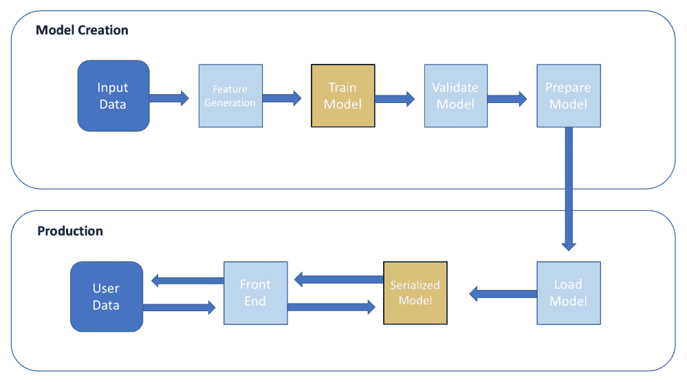
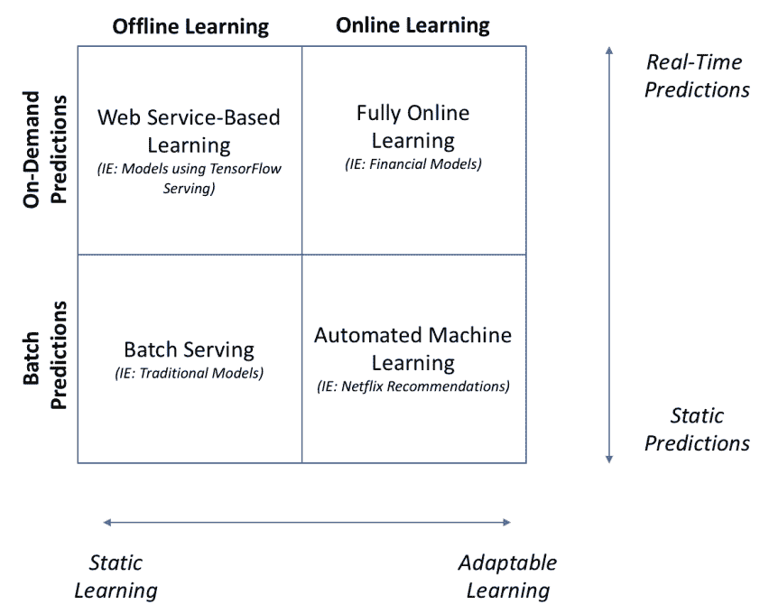
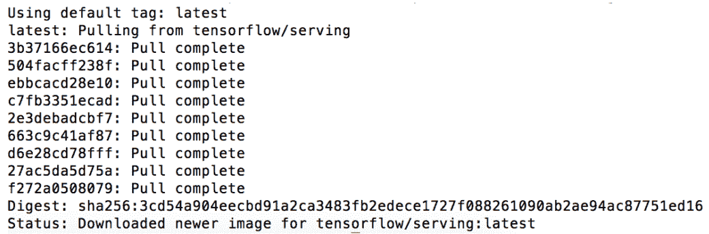
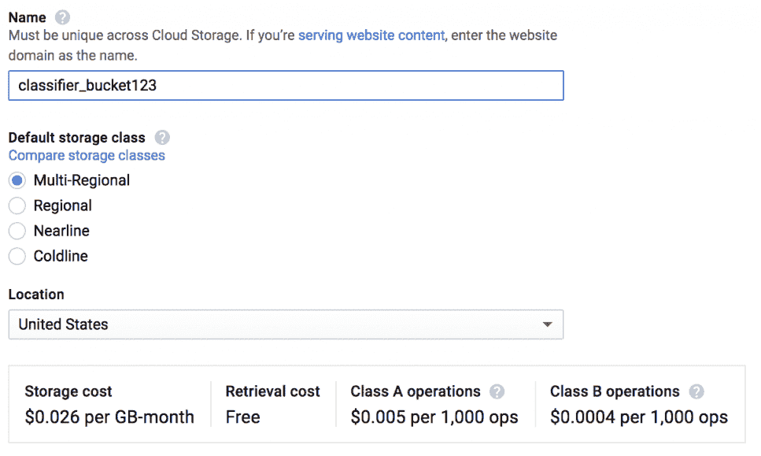

# 第十三章：部署与维护 AI 应用

在本书中，我们已经了解了如何创建**人工智能**（**AI**）应用以执行各种任务。尽管编写这些应用本身是一项不小的成就，但它通常只是将模型转化为可用生产系统所需工作的一个小部分。对于许多从业者来说，深度学习模型的工作流通常在验证阶段结束。你已经创建了一个表现非常好的网络；我们完成了吗？

数据科学家和机器学习工程师从发现阶段到部署阶段处理应用的情况变得越来越普遍。根据谷歌的说法，构建应用程序所需的时间中，超过 60-70% 的时间用于...

# 技术要求

本章虽然包含了一些通常是 DevOps 工程师工作的一部分的内容，但我们会根据需要了解的程度涉及这些工具和话题，并参考其他资源和工具，以帮助您更深入地学习相关话题。本章将使用以下内容：

+   TensorFlow

+   PyTorch

+   Docker，一个用于部署我们模型的容器化服务

+   亚马逊 Web 服务或谷歌云平台作为云提供商

+   Kubernetes 入门知识

# 介绍

AI 应用的部署与维护不仅仅是一个单一的动作；它是一个过程。在这一部分，我们将通过创建**深度学习部署架构**来在云中创建可持续的应用。这些架构将帮助我们创建端到端的系统：**深度学习系统**。

在许多机器学习/AI 应用中，典型的项目流程和工作流可能类似于以下内容：



训练过程是严格离线的，序列化的模型会推送到云端，并通过 API 与用户交互。这些过程通常会给我们带来几个不同的...

# 部署您的应用

那么，部署一个模型意味着什么呢？部署是一个涵盖广泛的术语，指的是将一个经过测试和验证的模型从本地计算机中拿出来，并在一个可持续的环境中进行设置，使其可以访问。部署有多种方式可以处理；在本章中，我们将重点介绍您应该了解的知识和最佳实践，以帮助您将模型投入生产。

您选择的部署架构取决于几个因素：

+   您的模型是否在一个环境中训练，并在另一个环境中进行生产化？

+   您期望您的模型被调用多少次以进行预测？

+   您的数据是随时间变化的，还是静态的？您是否需要处理大量的数据流入？

每个问题可以通过将我们的模型选择选项分为两个类别来回答。我们可以根据模型的服务位置以及训练方式来划分模型。下图展示了这些选项的矩阵，以及每种方法的成本和收益：



在一个与部署环境分离的特定数据上训练的模型，称为 **离线模型**，而在其部署环境中主动从新数据中学习的模型，称为 **在线模型**。

离线模型最简单的服务形式称为 **批量服务**。如果你是数据科学家或来自学术界，可能非常熟悉这种模型。批量服务就是将静态数据集输入到模型中，然后获取预测结果。通常，你可能会在本地机器上做这个，可能通过 Jupyter Notebook 或仅仅通过从终端或命令提示符运行脚本。在大多数情况下，我们希望我们的模型能够为更多用户所访问，因此我们将其封装成一个 **Web 服务**。

在线模型更难以管理，因为处理数据流和潜在的坏输入数据时可能会出现复杂问题。微软著名的 Tay Twitter 机器人就是一个完全在线学习模型的例子，它接受推文作为输入，迅速变得种族主义和粗俗。管理这些模型变得复杂，因为训练过程是开放的，必须采取许多防护措施来确保模型不会偏离预期输出太远。

自动化机器学习模型则变得越来越流行。它们有控制的输入，但会主动重新训练以考虑新的数据。想想 Netflix 的推荐系统——它通过根据你浏览和观看活动生成的数据进行训练，积极响应你的行为。

现在我们已经了解了我们的生态系统，让我们开始学习如何使用 TensorFlow 设置一个常见的 Web 服务部署架构。如果你不感兴趣手动部署过程，只想使用部署服务，可以跳过下一部分。

# 使用 TensorFlow Serving 部署模型

一般来说，在部署模型时，我们希望将模型的内部机制通过 HTTP 接口与公众隔离。对于传统的机器学习模型，我们会将序列化的模型包装在像 Flask 这样的部署框架中，创建一个 API，然后从那里提供我们的模型服务。这可能会导致依赖关系、版本控制和性能等一系列问题，因此，我们将使用由 TensorFlow 作者提供的工具，叫做 **TensorFlow Serving**。这个工具启动一个小型服务器，运行 TensorFlow 模型并提供访问接口。

TensorFlow Serving 实现了一种特定类型的远程过程调用，称为 **GPRC**。在计算机科学中，远程过程...

# 使用 Docker

由于我们将把模型部署到云端，我们需要某种机制来运行模型。虽然我们可以在 AWS 上启动一个虚拟机，但这对于我们的需求来说有点过头，而且有许多更简单（且更便宜）的方法可以帮助我们。

相反，我们将使用一种称为**容器**的工具。容器是一种轻量级的虚拟化技术，包含了运行应用程序所需的所有必要运行时包和方法。最流行的容器服务被称为**Docker**。

虽然我们不会在这里讲解 Docker 的安装过程，但你可以按照官方安装指南来安装 Docker：

1.  创建一个 **Docker 镜像**

1.  从 Docker 镜像创建一个**容器**

1.  在容器中构建 TensorFlow Serving

Docker 镜像的配置定义在一个叫做 **Docker 文件** 的文件中。TensorFlow Serving 给我们提供了这些文件，一个用于利用 CPU，另一个用于利用 GPU。

谷歌的 TensorFlow 团队维护了一个适用于 TensorFlow Serving 的 Docker 镜像，可以直接使用：

1.  一旦你安装了 Docker，可以通过终端或命令提示符中的 `docker pull` 命令轻松获取：

```py
docker pull tensorflow/serving
```

你应该会看到一系列类似以下的消息：



1.  一旦你下载了 Docker 镜像，就可以继续在该镜像上创建一个容器。我们可以通过运行构建命令轻松完成：

```py
## Builds a docker container from the image
docker build --pull -t $USER/tensorflow-serving-devel -f tensorflow_serving/tools/docker/Dockerfile.devel .
```

构建 Docker 容器可能需要一段时间——别担心，这是正常的。

1.  一旦容器构建完成，继续运行容器：

```py
## Run the container; we'll name it nn_container
docker run --name=nn_container -it $USER/tensorflow-serving-devel
```

1.  现在你应该可以访问 Docker 容器的 shell。接下来，我们将在容器中下载实际的 TensorFlow Serving 文件：

```py
 git clone -b r1.6 https://github.com/tensorflow/serving
 cd serving
```

1.  最后，我们需要在容器中安装 TensorFlow 模型服务器。模型服务器将实际为我们的模型提供服务：

```py
bazel build -c opt tensorflow_serving/model_servers:tensorflow_model_server
```

一旦我们有了一个容器，环境就配置好了。接下来要做的是将我们保存的模型放入 Docker 容器中。

当你退出 Docker 容器的 shell 时，容器会关闭。如果你想再次启动容器，可以在容器的目录中运行 `docker start -i nn_container` 命令。

让我们创建一个目录来放置我们的模型。还在容器的命令行中时，使用以下命令创建一个新目录：

```py
mkdir model_serving
```

接下来，我们将把保存的模型上传到这个目录。从你之前保存分类器的地方，运行以下命令。你需要将 `output_directory` 替换为 TensorFlow SavedModel 二进制文件所在的子文件夹。

```py
docker cp ./output_directory nn_container:/model_serving
```

让我们尝试为模型提供服务。在 Docker 容器中运行以下命令：

```py
tensorflow_model_server --port=9000 --model_name=nn --model_base_path=/model_serving/binaries &> nn_log &
```

您的模型现在应该在本地运行，使用 TensorFlow 服务。然而，我们还没有完成，因为在部署到云端后，我们需要创建一种模型可以与请求交互的方式。为此，我们需要创建一个称为**客户端**的东西，它是一个小程序，作为模型与外部世界交流的门卫。

# 构建 TensorFlow 客户端

最后，我们需要构建一个客户端来与我们的 TensorFlow 模型进行交互。构建一个自定义客户端来与您的模型进行交互，这有点超出了本书的范围，因此我们在对应的 GitHub 存储库中提供了这个功能：

1.  请继续使用以下代码下载它：

```py
pip install git+ssh://git@github.com/PacktPublishing/hands-On-Artificial-Intelligence-for-Beginners/tf-client.git
```

1.  让我们尝试使用客户端向模型发送请求：

```py
from predict_client.prod_client import ProdClientclient = ProdClient('localhost:9000', 'simple', 1)req_data = [{'in_tensor_name': 'a', 'in_tensor_dtype': 'DT_INT32', 'data': 2}]client.predict(req_data)
```

这里发生了什么？

+   第一行导入了客户端本身，...

# 使用 Google Cloud Platform 进行训练和部署

对于更简单的部署过程，我们可以使用**Google Cloud Platform**（**GCP**）将 TensorFlow SavedModel 部署到生产环境。在本节中，我们将介绍如何使用 GCP 来训练和部署模型的基础知识。

GCP 目前提供了最简单和易于使用的接口之一，用于训练和部署模型。如果您有兴趣尽快将模型投入生产，GCP 通常是您的选择。具体来说，我们将使用 Cloud ML 服务，这是对我们刚刚学习过的 AWS SageMaker 的一个补充。Cloud ML 目前能够直接运行 TensorFlow、Scikit-learn 和 XGBoost，虽然您可以手动添加自己的包。与 SageMaker 相比，由于该库与 Google 集成，Cloud ML 能够更快地接收 TensorFlow 的自动更新，因此建议您用于基于 TensorFlow 的应用程序。

在开始之前，让我们设置一个新的 Google Cloud 存储桶，作为我们应用程序的基础。请登录您的 GCP 账号，找到 Cloud Storage，然后点击创建存储桶。您应该看到一个类似以下内容的屏幕：



这个存储桶将作为我们数据、模型、训练检查点和模型二进制文件的临时存储区。继续将我们一直在使用的`creditcard.csv`文件上传到这个存储桶中，我们很快就会用到它！

接下来，让我们准备好在 GCP 上训练我们的模型，我们需要添加几行代码，以便它可以从命令行运行。在之前包含模型代码的脚本中，我们将其添加到底部：

```py
if __name__ == '__main__':
    parser = argparse.ArgumentParser()
    parser.add_argument(
      '--job-dir',
      help='GCS location to write checkpoints and export models'
     )
    parser.add_argument(
      '--train-file',
      help='GCS or local paths to training data'
      )
     args, unknown = parser.parse_known_args()
     c = SimpleClassifier()
     c.train_model(**args.__dict__)
```

此脚本将使我们能够通过命令行传递模型的唯一参数`job_dir`。要查看完整的 GCP 就绪代码，请查看本章 GitHub 中的`simple_classifier.py`脚本。一旦您设置好 Cloud Storage 和脚本，我们就可以开始训练和部署！

# 在 GCP 上训练

Google 通过允许我们训练模型、存储模型并以最少的代码进行部署，简化了整个深度学习训练/部署过程。在我们开始在云端训练之前，先在本地训练我们的模型，确保一切按预期工作。首先，我们需要设置一些环境变量。最重要的是，我们需要将文件放入特定的结构中，以便与 Cloud ML 一起训练。在本章的 `GitHub` 文件夹中查找训练文件夹，你将找到正确的文件结构。你看到的 `__init__.py` 文件将告诉 GCP，我们的文件是一个可执行的 Python 程序。

首先，我们将定义一个作业目录，这应该是你的 `simple_classifier.py ...` 文件所在的文件夹。

# 在 GCP 上部署在线学习

当我们将 TensorFlow SavedModel 部署到 GCP 平台时，我们需要将整个 SavedModel 目录上传到 GCP 上的存储位置，或者像之前一样在云端进行训练。无论你选择哪种方法，你的 TensorFlow 模型二进制文件都应存储在 Google Cloud Storage 中。

你的模型二进制文件将是训练后创建的最终文件，并将具有 `.pb` 扩展名。

为了开始我们的部署过程，我们首先需要创建一个部署的模型对象。你可以通过以下命令创建它：

```py
gcloud ml-engine models create "deployed_classifier"
```

接下来，我们将创建一个环境变量，让 GCP 知道我们的保存模型二进制文件的位置：

```py
DEPLOYMENT_SOURCE="gs://classifier_bucket123/classifier_model/binaries"
```

现在，我们只需要运行如下命令，我们的分类器就会被部署！请记住，部署需要几分钟的时间来配置：

```py
gcloud ml-engine versions create "version1"\
    --model "deployed_classifier" --origin $DEPLOYMENT_SOURCE --runtime-version 1.9
```

正如你所见，我们通过几行代码完成了前面一整节内容的工作；像 AWS SageMaker 和 Google Cloud ML 这样的平台作为服务在建模过程中节省了大量时间。

现在，让我们尝试从我们的模型中获取预测。在请求预测之前，我们需要设置一些变量。输入数据文件将是一个包含一行数据的 json 文件。为了简便起见，我们已经将数据集中的一行作为 `test.json` 包含在 `GitHub` 文件夹中：

```py
MODEL_NAME="deployed_classifier"
INPUT_DATA_FILE="test.json"
VERSION_NAME="version1"
```

最后，运行预测请求：

```py
gcloud ml-engine predict --model $MODEL_NAME \
                   --version $VERSION_NAME \
                   --json-instances $INPUT_DATA_FILE
```

恭喜！你的模型现在已托管在云端。你应该会看到一个返回的 json 对象，其中包含两种潜在分类的概率：欺诈或非欺诈。虽然之前的 `gcloud` 命令非常适合发出单个请求，但我们通常希望将请求作为 Web 应用的一部分返回。在下一部分，我们将演示如何通过一个简单的 Flask 应用来做到这一点。

# 使用 API 进行预测

要开始，您需要创建一个 Google Cloud 服务账户密钥，以便您的应用程序能够访问该模型。请访问链接 [`console.cloud.google.com/apis/credentials/serviceaccountkey`](https://console.cloud.google.com/apis/credentials/serviceaccountkey)，并创建一个新账户。记得将密钥下载为 JSON 文件。要连接到 GCP，您需要将账户凭证设置为 GCP 可以访问的环境变量。请将其位置设置为环境变量：

```py
GOOGLE_APPLICATION_CREDENTIALS = your_key.json
```

让我们创建一个名为 `predict.py` 的脚本（你可以在 `chapter` 文件夹中找到完整的脚本）。首先，我们将导入一些 Google 库，允许我们的程序连接到 API。`GoogleCredentials` 将帮助我们发现 ...

# 扩展您的应用程序

可扩展性是指系统处理越来越多工作负载的能力。当我们创建一个系统或程序时，我们希望确保它是可扩展的，以便在接收到过多请求时不会崩溃。扩展可以通过两种方式进行：

+   **扩展上行**：提升现有工作节点的硬件配置，例如从 CPU 升级到 GPU。

+   **扩展外部**：将工作负载分配给多个工作节点。Spark 是一个常用的框架来实现这一点。

扩展上行可以像将模型迁移到更大云实例一样简单。在本节中，我们将专注于如何分布 TensorFlow，以便扩展我们的应用程序。

# 使用分布式 TensorFlow 扩展计算能力

如果我们希望扩展计算资源怎么办？我们可以将 TensorFlow 进程分布到多个工作节点上，从而加速和简化训练。实际上，有三种框架可以用来分布 TensorFlow：*原生分布式 TensorFlow*、*TensorFlowOnSpark* 和 *Horovod*。在本节中，我们将专注于原生分布式 TensorFlow。

在分布式处理领域，我们可以采用两种方法来分配模型的计算负载，即**模型并行**和**数据并行**：

+   **模型并行**：将模型的训练层分布到多个设备上。

+   **数据并行**：将整个模型分布到多个设备上 ...

# 测试和维护您的应用程序

无论是在线学习还是离线学习，我们都应该建立系统和安全检查机制，及时告知我们模型的预测结果，甚至是关键部署架构是否出现问题。这里的测试指的是对输入、输出和错误进行硬编码检查，以确保我们的模型按照预期执行。在标准软件测试中，对于每一个输入，都应该有一个定义好的输出。但在机器学习领域，由于模型的输出会受到多种因素的影响，输出结果会有变动——这对于标准测试程序来说并不理想，是吗？在本节中，我们将讨论机器学习代码的测试过程，并探讨最佳实践。

一旦部署，AI 应用程序还需要维护。像 Jenkins 这样的 DevOps 工具可以帮助确保在将新版本的模型推送到生产环境之前通过测试。虽然我们当然不期望你作为机器学习工程师去创建开发管道，但我们将在本节中回顾其基本原理，以便你熟悉最佳实践。

# 测试深度学习算法

AI 社区在采用适当的测试程序方面严重滞后。一些最先进的 AI 公司依赖人工检查，而不是对他们的算法进行自动化测试。你已经在本书中进行了一种测试形式；通过交叉验证我们的模型，使用训练集、测试集和验证集来确保一切按预期工作。在本节中，我们将重点讨论 **单元测试**，它旨在以尽可能小的计算单元测试软件。换句话说，我们要测试算法的各个小部分，以确保更大的平台能够顺利运行。

测试我们的算法有助于我们追踪 **非**-**破坏性 bug**，这些 bug 已经变得无处不在……

# 总结

构建 AI 应用程序不仅仅是模型构建的基础内容 —— 它还涉及将模型部署到云端的生产环境中，在那里它们得以持久化。在这一章中，我们讨论了如何将一个经过验证的 TensorFlow 模型部署到云端的生产环境中。我们还讨论了如何扩展这些模型，以及如何测试你的应用程序的弹性。

在将 TensorFlow 应用程序从开发环境迁移到生产环境时，第一步是创建一个可以存储在云中的 TensorFlow SavedModel。从这里开始，有几个服务可以帮助简化你的部署过程，包括 AWS Lambda 和 Google Cloud ML Engine。

应用程序可以通过纵向或横向扩展来获得更多的计算能力和更快的处理速度。通过纵向扩展，我们为算法提供更大的计算资源；通过横向扩展，我们一次性为应用程序提供更多的资源。记住，已部署到生产环境的模型也应进行测试，基本的测试，如单元测试，可以帮助防止你的整个应用程序崩溃！

我们现在已经到达本书的结尾。随着你逐章学习，我希望你已经意识到深度学习为人工智能领域创造的激动人心的可能性。尽管毫无疑问，许多这些主题的研究将继续进行，并且新的方法将会被创造和使用，但你在本书中学到的基本概念将始终保持不变，为未来的突破性工作奠定基础。谁知道呢，也许进行这些突破性工作的人就是你！

# 参考文献

1.  提到 Quora

1.  TensorFlow 客户端引用
