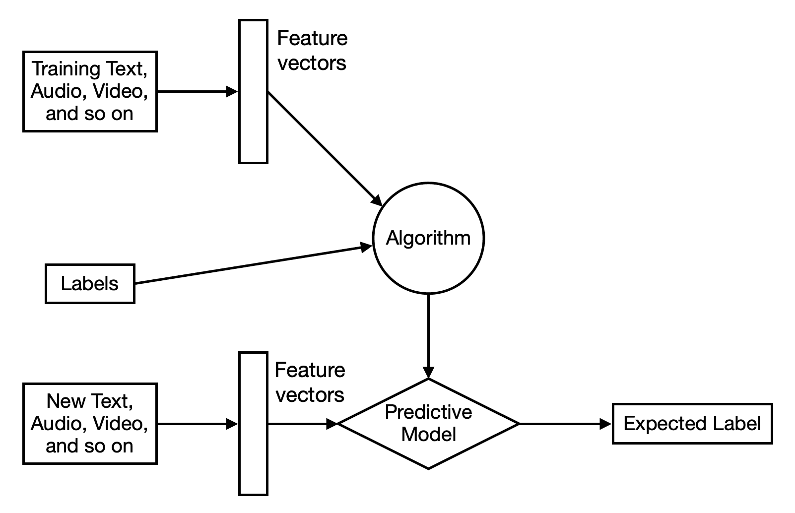
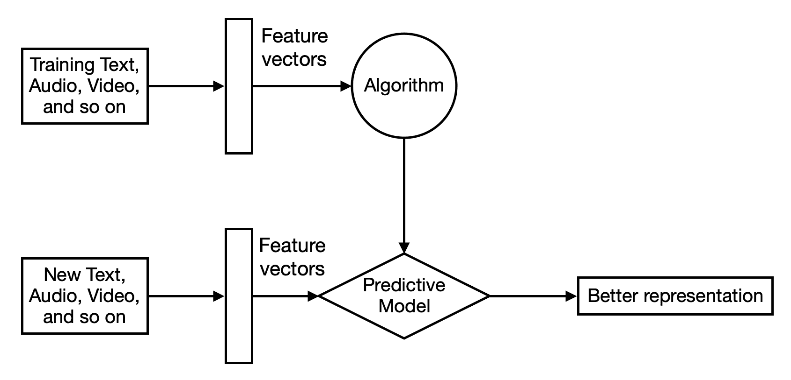
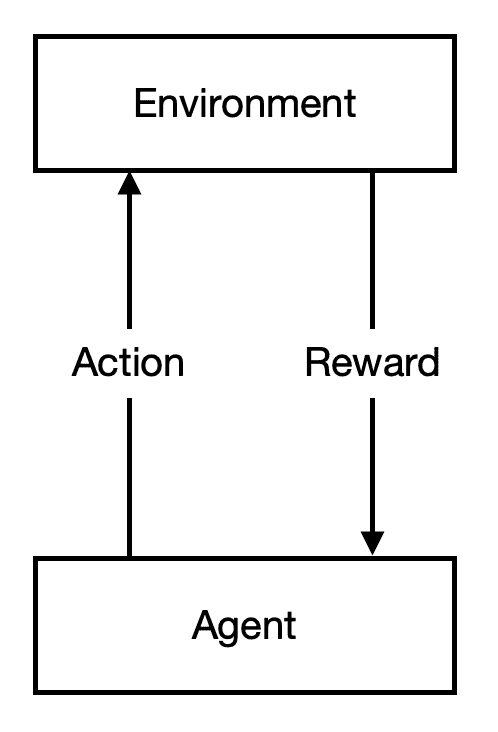
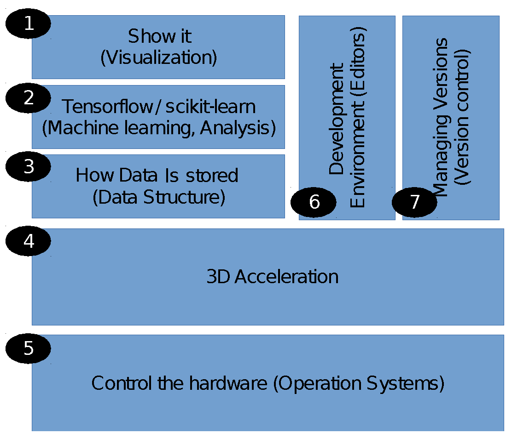
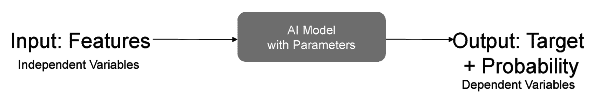
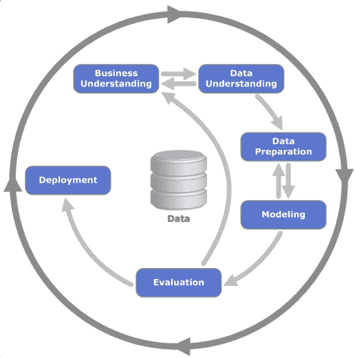

# 第一章：人工智能在银行业中的重要性

**人工智能**，通常被称为**AI**，是一项非常强大的技术。精心实施 AI 可以在自动化业务功能方面创造奇迹。AI 具有通过应用改变各种行业的能力。随着计算机系统的不断发展，它们变得非常强大。因此，机器也变得非常强大，并且能够轻松地执行许多复杂的任务。例如，**光学字符识别**（**OCR**）是一项即使是个人计算机也能在软件的帮助下轻松完成的任务。然而，OCR 需要智能才能将图像中的点转化为字符。因此，在理想情况下，OCR 将被视为 AI 的一个领域。然而，正因为机器的强大，我们往往不将其视为 AI 的应用。

在本章中，我们的重点是理解什么是 AI 及其在银行业中的应用。银行业是一个极其多样化和复杂的行业。为了简化复杂的银行业务功能，银行业需要不断提供先进的技术解决方案。正如福布斯最近的分析所示([`www.forbes.com/sites/forbestechcouncil/2018/12/05/how-artificial-intelligence-is-helping-financial-institutions/#2e989fae460a`](https://www.forbes.com/sites/forbestechcouncil/2018/12/05/how-artificial-intelligence-is-helping-financial-institutions/#2e989fae460a))，AI 在各种银行流程中的实施将在 2030 年之前为行业节省超过 1 万亿美元。因此，银行业将在不久的将来从 AI 系统中受益最大。

我们将从 AI 和银行业作为一个行业的简要介绍开始。在这里，我们将定义如何在软件系统中实施 AI 的方法。我们还将了解银行业如何从 AI 的应用中受益。完成本章之前，还有许多其他主题需要讨论。因此，不如直接跳入内容，而不是简单地讨论你可以从本章中期待什么！

本章将重点讨论以下主题：

+   什么是 AI？

+   了解银行业

+   便捷银行服务的重要性

+   AI 在银行业中的应用

# 什么是 AI？

AI，也称为**机器智能**，是关于创造能够展示通常由人类表现的自然智能的机器。约翰·麦卡锡在 1955 年创造了*人工智能*这一术语。

AI 已经经历了两次寒冬：一次是在 1970 年代，随着**国防高级研究计划局**（**DARPA**）([`www.darpa.mil/`](https://www.darpa.mil/))，当时被称为**ARPA**，减少了资金支持；另一次是主要 IT 公司如德州仪器（[`www.ti.com/`](http://www.ti.com/))和施乐（[`www.xerox.com/`](https://www.xerox.com/)）放弃了专家系统的应用。

从某种程度上来说，人工智能有助于将决策过程从人类转移到机器上，这基于预定义的规则。在计算机科学领域，人工智能也被定义为智能代理的研究。智能代理是任何能够从环境中学习并根据所学做出决策以最大化实现其预定目标概率的设备。

人工智能能够解决广泛的各种问题。这些问题包括但不限于简单的数学难题、从一个地点到另一个地点的最佳路线、理解人类语言，以及处理大量的研究数据以生成有意义的报告。以下是系统必须具备的一些能力以及每项能力的简要描述：

+   **推理**：解决难题和进行基于逻辑的推断的能力

+   **知识表示**：处理研究人员和专家收集的知识的能力

+   **规划**：设定目标并定义成功实现目标的方式的能力

+   **学习**：通过经验来改进算法的能力

+   **自然语言处理**（**NLP**）：理解人类语言的能力

+   **感知**：利用传感器和设备，如摄像头、麦克风等，获取足够的信息来理解和解释环境中的不同特征的能力

+   **运动**：移动的能力

## 机器是如何学习的？

让我们快速了解一下机器学习的基础知识。机器可以使用三种方法来进行学习：监督学习、无监督学习和强化学习，具体如下所示：

+   **监督学习**基于挖掘有标签的训练数据的概念。训练数据表示为由提供的输入（也称为**特征向量**—这是一个数字向量，可以将输入数据作为特征用数字表示）和预期的输出数据（也称为**标签**）组成的一对。每对数据都会附上一个标签。下图展示了监督学习方法：

+   **无监督学习**基于一种情况，即训练数据在没有任何数据背后信息的情况下提供，这意味着训练数据没有标签。无监督学习算法将尝试为这些训练数据找到隐藏的意义。下图展示了无监督学习方法：

+   **强化学习**是一种没有训练数据的机器学习技术。这种方法基于两样东西——一个代理和给予该代理的奖励。代理预计会根据其经验获得奖励。下图展示了强化学习方法：

## 实施 AI 的软硬件要求

开源运动（将在*可及银行业务的重要性*部分讨论）推动了软件开发。该运动与硬件的改进（例如，GPU、CPU、存储和网络硬件）相伴而行。同时，也得到了无数英雄的支持，他们致力于改善硬件性能和互联网连接性。这些技术人员已经将 AI 算法开发到能够接近人类性能的程度。

以下图表展示了每当我们实施软件进行机器学习项目时应考虑的典型技术栈：

以下表格细分了贡献于前述图表中不同软件组件的几项关键技术：

| **序号** | **组件** | **软件/包名称** | **软件/包描述** |
| --- | --- | --- | --- |
| 1 | 用户界面/应用程序编程接口 | API/Python | API：应用程序编程接口是一种接口，允许程序通过互联网协议与其他程序进行交互。与 UI 相比，API 是为机器人设计的。它将用于从本书的各个编程章节中的数据源提取数据，在这些章节中，我们将为开放银行项目创建消费者银行服务。 |
| 2 | 机器学习与分析 | TensorFlow, scikit-learn, 和 ImageNet | 谷歌的 TensorFlow ([`www.tensorflow.org/`](https://www.tensorflow.org/)) 自 2017 年起成为深度学习领域最受欢迎的框架之一。Scikit-learn ([`scikit-learn.org/stable/`](https://scikit-learn.org/stable/)) 是一个方便的机器学习包，提供了许多有用的功能，用于机器学习管道中。TensorFlow 和 Keras ([`keras.io/`](https://keras.io/)) 将在我们处理深度神经网络时使用，而在处理较为简单的网络和数据准备工作时，我们将使用 scikit-learn。这些库将在全书中使用，从第二章到第九章，用于构建机器学习模型。ImageNet ([`www.image-net.org/`](http://www.image-net.org/)) 由普林斯顿大学于 2009 年创建，旨在帮助研究人员基于数据集测试和构建深度学习模型，从而推动了基于深度学习网络的图像识别研究。我们将在第六章中将图像识别网络转化为识别股票趋势的模型，*使用特雷诺尔·布莱克模型和 ResNet 进行自动化投资组合管理*。 |
| 3 | 数据结构 | Pandas 和 NumPy | Pandas ([`pandas.pydata.org/`](https://pandas.pydata.org/))和 NumPy ([`www.numpy.org/`](http://www.numpy.org/))是允许 Python 操作数据的数据结构。它们在本书的编码示例中被广泛使用。这些库是 Python 在数据科学家中流行的关键原因之一。这些库在第二章到第九章中都有使用。 |
| 4 | 3D 加速 | Nvidia | 如果在 TensorFlow 的后端使用 3D 加速（如 Nvidia 提供的软件和硬件([`www.nvidia.com/en-us/`](https://www.nvidia.com/en-us/)))，那么与 Keras 相关的计算性能，例如在第三章中找到的编码，*使用特征和强化学习自动化银行决策*，将会得到增强。驱动程序将有助于提高 GPU 性能的某些元素。 |
| 5 | 操作系统 | Ubuntu | 这是一个免费的开源操作系统，兼容我们在本书中将使用的大多数 Python 库。可以说，它是 AI 社区的首选操作系统。 |
| 6 | 编程语言和开发环境 | Python 和 IDLE | Python 编程是 AI 的语言。Python 的诞生得益于 1999 年 DARPA 的资助，旨在提供一种通用的、易于阅读的编程语言。它是开源的。IDLE 是 Python 包中的一个开发环境，它允许编写、调试和运行程序。然而，开发者可以使用更多的环境来编写代码，例如 Jupyter Notebook、Spyder 等。我们将使用 Python 和**集成开发与学习环境**（**IDLE**）来简化代码开发（你可以在[`docs.python.org/3/library/idle.html`](https://docs.python.org/3/library/idle.html)找到它们）。 |
| 7 | 版本控制 | GitHub | GitHub 是最受欢迎的基于云的协作网站之一。它的实现得益于云技术的普及，这些技术使得可扩展的计算和存储成为可能。我们的代码库将在这里存储和交换。 |

在我们简要介绍了将贯穿本书的工具、技术和包之后，接下来我们将探索 AI 的一个重要领域——深度学习。以下部分将详细解释深度学习和神经网络。

### 神经网络与深度学习

除了开源运动之外，神经网络的研究突破对改进 AI 算法的决策准确性起到了重要作用。你可以参考*Deep Learning*（[`www.deeplearningbook.org/`](https://www.deeplearningbook.org/)）由 Ian Goodfellow、Yoshua Benjio 和 Aaron Courville 提供更为数学化和正式的介绍，以及*Deep Learning with Keras*（[`www.packtpub.com/big-data-and-business-intelligence/deep-learning-keras?utm_source=github&utm_medium=repository&utm_campaign=9781787128422`](https://www.packtpub.com/big-data-and-business-intelligence/deep-learning-keras?utm_source=github&utm_medium=repository&utm_campaign=9781787128422)）由 Antonio Gulli 和 Sujit Pal 提供开发人员简洁分析。

深度学习是机器学习的一个特殊子领域或分支。深度学习方法灵感来自于一种模仿人脑的计算机系统，称为**神经网络**。

银行通过移动或网络应用程序聊天机器人进行在线客户支持是深度学习在银行业中的一个很好的例子。这些应用程序（即聊天机器人）在理解客户请求、偏好和兴趣的上下文方面非常强大。聊天机器人连接到与数据存储交互的后端应用程序。根据客户的输入或服务选择，聊天机器人向客户呈现各种可选的子服务。

聊天机器人或深度学习应用程序工作在层次结构中。它可以类比学习语言。例如，一旦一个人通过严格学习如何唯一地识别每个字母来掌握字母表，他们就有资格进入下一层复杂性——单词。这个人将开始学习小词和长词。掌握了单词后，这个人将开始组成句子，理解不同层次复杂性的语法概念。一旦他们达到这个层次结构的顶部，这个人就能掌握这门语言了。

你可能已经注意到，在每个阶段或层次的层次结构中，学习变得更加复杂。每一层都是基于从前一层复杂性中获得的学习或知识构建的。这就是深度学习的工作方式。程序不断学习，基于从前一层接收到的知识形成更多复杂层次的新知识。分层复杂性正是"深度"一词的来源。深度学习是一种无监督学习，因此比监督学习快得多。

深度学习的主要影响在于，模型的性能更好，因为它可以容纳更复杂的推理。我们希望金融决策能够准确执行。这意味着在平衡银行客户利益的同时，更有效地给股东合理的回报。

我们期望智能机器做到的事情就像**输入**、**处理**和**输出**一样简单，如下图所示：

在大多数金融应用场景中，我们部署的是监督学习，这类似于训练动物的过程——在这里，你为正确的结果提供奖励，并对错误的结果进行惩罚。这就是为什么我们需要有结果（即目标变量）来进行训练的原因。

## 实现 AI 的硬件要求

在为银行设置硬件预算时，你需要确保它包含正确的配置。这将使你能够在财务成果或市场时间方面交付承诺的结果，尤其是现在你即将从零开始建立一家银行！

鉴于银行面临的经济压力相当大，你最好确保每一分钱都能发挥作用。为了实现这一点，我们需要了解硬件对 AI 的贡献，以确保我们拥有正确的资源。

### 图形处理单元

除了软件和算法，使用**图形处理单元**（**GPU**）和**固态硬盘**（**SSD**）有助于加速机器学习。GPU 和 SSD 的使用使得计算机能够进行智能思考。

GPU 是一个专门设计的电路，能够以并行的方式处理计算。这适用于计算机图形处理，其中每个像素需要同时处理，以生成完整的图像。为了形象化这一点，假设有 10 个像素需要处理。我们可以依次处理这 10 个像素，或者我们可以同时处理它们，通过 10 个并行进程。

CPU 具有每个像素快速处理的独特优势，而 GPU 则具有多个线程，可以同时处理平面数据。CPU 和 GPU 都能进行不同程度的并行数据处理。下表展示了顺序数据处理和并行数据处理的区别：

| **顺序数据处理** | **并行数据处理** |
| --- | --- |
|  |  |
| 数据按顺序输入，这需要更长时间来完成计算。 | 数据并行输入，这提高了处理时间。 |

除了擅长处理图像外，GPU 还被用于深度学习。虽然深度学习描述了神经网络的层数，但深度神经网络通常被认为具有广泛的记录和许多变量来描述输入。

当与 GPU 一起使用时，固态硬盘（SSD）还可以提高读取和写入数据到 CPU/GPU 进行处理的速度。

### 固态硬盘

机器学习的另一个硬件要求是称为 SSD 的存储设备。传统的硬盘通过机械马达将读写头放置在磁带或磁盘的指定位置。与此不同，SSD 使用电流在电路上读写数据，无需马达的移动。将马达的机械运动与电流进行比较，SSD 的数据检索速度比传统硬盘快 20 倍。

对于运筹学的学生来说，比较这两者就像识别硬件容量一样简单——这类似于我们如何设计一个工厂——找出容量并尽量减少瓶颈！

## 建模方法——CRISP-DM

**CRISP-DM** 指的是 **跨行业数据挖掘标准过程**。数据挖掘是探索大量数据以识别模式的过程，这些模式将应用于下一组数据，从而生成期望的结果。为了创建本书中的模型，我们将使用 CRISP-DM 建模方法。这将帮助我们保持实施机器学习项目的统一方法。以下图表展示了在机器学习项目中使用 CRISP-DM 方法执行项目的过程：

如您在前面的图表中所看到的，CRISP-DM 方法有多个阶段。我们可以如下详细解释它们：

1.  **商业理解**：这一阶段涉及定义项目的商业目标。在这一阶段，你需要澄清与核心商业目标相关的问题。例如，一个核心商业目标可能是预测客户何时离开某个特定网站，使用客户与该网站互动的历史数据。需要澄清的相关问题可能是当前的支付界面是否是客户离开网站的原因。商业成功标准也会在项目执行的这一阶段被明确。

1.  **数据理解**：这一阶段涉及理解在数据库或数据存储中挖掘的历史数据。数据会根据其大小、格式、数量、记录数、与商业相关的重要性、字段、数据来源等方面进行分析。

1.  **数据准备**：这一阶段涉及将数据的质量提升到机器学习算法所需的处理水平。数据准备的例子包括将数据格式化为所需的格式，将数字四舍五入到可接受的精度，以及准备派生属性。

1.  **建模**：这一阶段涉及选择要应用的建模技术或算法。建模算法用于找到一个函数，当输入应用时，能够生成期望的输出。

1.  **评估**：这一阶段涉及评估在前一阶段构建的训练模型的准确性。根据需要对模型进行修正，以提高效率和准确性。

1.  **部署**：这一阶段涉及定义训练模型在实际环境中针对新数据进行部署的策略。模型会被监控以确保其准确性。

在大致介绍了什么是人工智能、机器如何学习以及人工智能实现的方法之后，现在是时候将银行业作为一个行业来审视了。在接下来的部分，我们将探讨银行业的不同类型以及该行业所面临的挑战。

# 了解银行业

银行业被定义为一个专注于通过特定方法持有某些类型的金融资产的经济部门，这些方法可以使这些资产在一段时间内财务增长。银行业由政府或类似机构所施加的规则进行监管。

著名作家和金融顾问**斯蒂芬·瓦尔德兹**在他的著作《*全球金融市场导论*》中描述了全球金融市场中的不同类型的银行业务（请访问[`www.macmillanihe.com/companion/Valdez-Introduction-To-Global-Financial-Markets-8th-Edition/about-this-book/`](https://www.macmillanihe.com/companion/Valdez-Introduction-To-Global-Financial-Markets-8th-Edition/about-this-book/)）。这些类型包括商业银行、投资银行、证券公司、资产管理、保险和影子银行。

这些类型的银行业务是为了满足各种客户的需求，从大型组织到个人客户。以下是根据客户需求对这些不同类型银行的描述：

+   **商业银行**可以是零售型（服务消费者）或批发型（服务企业）。本质上，银行专注于从储户那里接受存款，并通过收取利息将其贷给借款人。商业银行的成功依赖于其评估借款人贷款风险的能力。任何未能准确评估风险的行为都可能导致破产，因为未能将资金偿还给储户。许多银行在金融危机中倒闭，包括美国的华盛顿互惠银行。

+   **投资银行**包括咨询业务和证券交易业务。咨询业务涉及公司买卖，也称为**并购**（**M&A**）、债务和股本融资（例如，将公司上市到纽约证券交易所）以及证券交易业务。证券交易业务涉及股票、固定收益、商品和货币的交易。证券交易中，买方愿意购买证券，卖方愿意出售证券，而经纪人则促进证券的买卖。

咨询业务依赖于通过整合或分拆企业来为公司创造价值。这一过程优化了并购活动中的组织表现。它还将客户的资本成本优化为一种标准化的借款结构（例如债券）。客户可以通过发行新股或取消现有公司股份（股权）来向金融市场参与者进行更多投资。

所有上述活动通过市场参与者对公司进行正确评估创造价值，这些评估由情绪和更理性的考虑推动。

+   **资产管理** 包括各种类型的基金——共同基金、交易所交易基金、对冲基金、私募股权等。资产管理公司通过不同的投资策略（买卖决策的结合）投资于各种金融资产和公司的不同生命周期阶段。这个行业中的一个关键决策也属于适当估值的范畴，涉及投资的未来价值。

资产管理参与者渴望通过创造回报来满足各种目的，从资产价值的保护到增值。他们通常被称为**买方**，代表资产所有者，而帮助买方的银行服务被称为**卖方**，通常包括证券销售（面对客户，收集订单）、交易（执行订单）和研究（评估证券）。

+   **保险** 包括一般保险和人寿保险。人寿保险保护买方免受死亡风险（死亡后果），非人寿保险则涵盖其他所有风险，例如灾难损失、行李丢失、火箭或船只丢失（例如，埃隆·马斯克的 SpaceX 损失）以及由于黑客或病毒造成的系统故障等。

保险的核心功能是估算借款人的风险状况。另一方面，产生投资回报以弥补损失的能力也可能很重要。保险公司的投资表现越强，其能够提供的保险定价就越具竞争力，竞争力也就越强。这也是伯克希尔哈撒韦能够提供具有竞争力保险定价的原因之一——由于其卓越的投资表现。

+   **消费者银行业务** 由消费者债务的资产规模所代表，重点是抵押贷款、汽车贷款、个人贷款以及我们在生活的不同阶段可能需要的信用卡业务。

+   **影子银行** 是一种涉及常规银行体系以外活动的借贷结算方式。它指的是替代投资基金，例如比特币投资基金、证券经纪商、以及为消费者提供贷款的消费金融和抵押贷款公司。

## 银行业相对于世界经济的规模

通过将金融行业的庞大规模与全球生产的年收入进行对比，我们可以对全球如何利用银行服务来维持运作有一个清晰的认识。然而，仅仅通过展示这些统计数据显得有些抽象。我们可以假设世界是一个人。金融在这个人的生活中扮演着什么角色？以下是一些需要考虑的要点：

+   **年收入**：根据世界银行的衡量，全球经济的生产力和收入在 2018 年为 86 万亿美元。大约五分之一（19%）的年收入来自跨境贸易（出口贸易额为 15 万亿美元）。

+   **财富**：全球个人的年收入大约相当于 4.4 年的年度 GDP。年度 GDP 的详细数据可以在本节末尾的表格中找到。年收入的信息来源于多个渠道，通过将活动与 GDP 规模进行对比得出。这 4.6 年可以细分如下：

+   该资产经理已工作 0.9 年。

+   已存入银行 0.9 年。

+   在股市中已有 0.8 年。

+   该人通过信用/借贷获得了 2.3 年的资金（其中 1.17 年来自债务，1.0 年来自银行贷款，0.5 年来自影子银行，0.03 年来自消费信贷）。

当然，这是对全球财富的简化处理；有些数据可能被重复计算，股市数据可能包括上市公司存入银行的存款，这部分已被计入银行负债。然而，鉴于我们希望了解各种金融活动的相对规模及其重要性，我们只是采用了简化的方法，将数字呈现出来。

+   **保险**：为了防范来自生产或投资活动中的各种不利风险，全球个人年收入的 6%被用于购买保险，保险金额覆盖其 1.45 倍的收入。保费将用于购买基础金融资产，以产生收入来抵消任何不利风险。

+   **衍生品**：作为风险防护工具，除了购买保险外，银行还可以提供衍生品作为金融工具来提供风险防护。术语*衍生品*指的是两方在某些基础资产条件下达成支付或接收经济利益的协议。基础资产的种类包括**固定收益**、**货币**到**商品**（**FICC**）。

固定收益包括利率和信用衍生品。货币指的是外汇衍生品，商品指的是商品衍生品。外汇以 87 万亿美元的未结清敞口位居第二，这大致等于全球 GDP。商品、信用和股票衍生品的份额较小，每个约占 GDP 的 2%至 9%。在将衍生品视为风险保护工具时，我们排除了一个叫做利率**场外交易**（**OTC**）的衍生品形式，它相当于年收入的 6 倍——这一数额远超过我们财富所需的年收入来提供保护。实际上，一些投资者将利率 OTC 作为投资工具。我们将这一工具排除在整体的保险理解之外。OTC 指的是银行与银行客户之间的双边协议。

另一种形式的协议是交易所交易协议，指的是银行客户通过集中交换平台买卖产品。我没有包含太多交易所交易的数字，但在这一点中提到的外汇、商品、信用和股票等数据，旨在展示这些领域的相对规模。

下表列出了 GDP 数据：

|  | **2018 年单位：万亿美元** | **GDP 占比** |
| --- | --- | --- |
| **收入** | **75.87** | **100%** |
| 全球 GDP（全球年收入） | 75.87 | 100.00% |
| 全球出口量 | 14.64 | 19.00% |
| **财富** | **332.46** | **438%** |
| 全球资产管理 | 69.1 | 91.00% |
| 全球银行负债（包括存款） | 58.93 | 78.00% |
| 全球股市 | 79.24 | 104.00% |
| 全球债务市场 | 57.49 | 76.00% |
| 银行贷款 | 29.7 | 39.00% |
| 影子银行 | 34 | 45.00% |
| 全球消费债务 | 4 | 5.00% |
| **全球保险**（**新保费收入**） | **4.73** | **6.00%** |
| **保险覆盖**—**衍生品**（**不包括利率 OTC**） | **110.15** | **145.00%** |
| 全球外汇 OTC + 交易所交易衍生品 | 87.41 | 115.00% |
| 商品 OTC 合约 | 1.86 | 2.00% |
| 信用 OTC 衍生品 | 9.58 | 13.00% |
| 股票挂钩合约 | 6.57 | 9.00% |
| 利率 OTC 合约 | 461.98 | 609.00% |

所有数据均为 2018 年全年数据，除非另有说明。GDP 和股市规模来自世界银行；出口贸易数据来自世界贸易组织；新保费收入数据来自瑞士再保险 Sigma 2018 年报告；全球资产管理规模来自 BCG 全球资产管理 2018 年报告；所有银行、债务和衍生品统计数据来自国际清算银行。

## 银行业务客户

金融行业的客户包括从事储蓄和贷款活动的存款人和借款人。在进行商业银行业务活动时，例如跨境支付或贸易融资，他们被称为**申请人**（资金发送方）和**受益人**（资金接收方）。

如果客户参与投资银行、证券和资产管理活动，他们被称为**投资者**，或通常称为**客户**。为了保护保险产品的购买者免受潜在风险，购买者被称为**投保人**，而该物品被称为**保险标的**。在发生风险并且需要/可能需要保险公司赔偿的情况下，得到赔偿的人被称为**受益人**。

非金融企业是所有金融活动的真正企业客户，应被视为经济学的真正参与者。它们储存多余的现金，并为消费者生产商品和服务。

我希望明确强调的一点是，金融是一项服务，服务于真实经济。那么，为什么金融部门的增长超过了实际经济的增长呢？根据切凯蒂和卡鲁比的观点，过度的金融会损害经济的实际增长。也就是说，它夺走了那些能够为真实经济做出贡献的高质量研究和开发人才。因此，人才的流失会对生产要素产生负面影响。你可以在[`www.bis.org/publ/work490.pdf`](https://www.bis.org/publ/work490.pdf)了解更多相关信息。

# 可获得银行服务的重要性

就像电力和水一样，银行服务应该像公共事业一样广泛且容易获取。只有当我们使银行更加高效时，才能使其更具普及性，并使更多人受益。银行是一项服务，旨在充分利用资本/资金，为储蓄者和/或需要资本来提高生产力、以既定风险和回报进行生活的人们创造回报。

我们希望做的事情是与罗伯特·J·希勒（Robert J. Shiller）在其著作《金融与美好社会》（*Finance and the Good Society*）中的观点保持一致，他在书中指出，信息技术在金融领域中的必要性，以帮助我们实现目标。更进一步的做法是利用开放源代码方法和应用程序来解决银行业的可访问性挑战。开放源代码软件解决方案往往具有成本效益、强大和安全的特点。

为了使银行业务更加普及，其中一个最重要的措施是拥有大量数据。这将使决策更加高效和透明，从而有助于降低银行决策的成本。我们将在下一节讨论开放源代码数据的必要性。由于竞争激烈的银行市场，随着高效银行的崛起，银行服务的价格将逐渐下降，市场份额较大的银行将占据主导地位。

一旦在金融行业实施，人工智能将对该行业产生三方面的影响——重复性工作的消失，人工智能增强人的效率，以及通过如模型构建等新兴的 AI 相关工作创造就业。在这三者中，工作减少和效率提高将影响现有工作，而工作创造则将影响未来的人才和就业市场。

随着自动化和效率的提升，现有的工作将发生变化并受到影响。机器将比人类更高效地完成日常任务。然而，为了管理、监控、维护和提升由机器或 AI 执行的任务，行业将需要懂得银行业务和 AI 技术的技术性功能型专业人才。

## 开源软件和数据

过去 20 年左右，技术发展的速度相当迅猛，这得益于开源运动。它始于 Linux，随后是 ImageNet。ImageNet 提供了大量的训练数据。这些训练数据促进了从事 AI 算法研究的技术人员的活动。技术人员利用 Python、R、scikit-learn、TensorFlow 等编程语言编写的开源库开发了深度学习和神经网络算法。

虽然开源方法鼓励软件开发，但 AI 的另一个关键成分是数据。寻找实用的开放数据是一个挑战。而银行则面临将数据谨慎且安全地转化为机器可训练数据集的挑战，以确保不违反客户信任银行时的隐私规定。

今天，在金融和银行领域，客户保密性仍然是开放数据以便更广泛研究的一个关键障碍。实际问题可能比我们在开放数据领域看到的更复杂。打开存储在数据库中的数据可能是一个实际步骤，而开放图像数据，如文档、音频文件或语音对话等，可能会面临挑战，因为这些数据一旦被遮盖或修改，可能会系统性地丢失一些信息。

实际上，实施银行实际应用的主要成本来自数据订阅。数据收集和聚合的成本是本书中将要讨论的一个主要挑战。我们社会如何应对这一问题并激励商业部门去解决它，值得进一步讨论，超出了本书的范畴。秉持这种精神，本书的代码是开源的。

## 如果一个优秀的银行家能完成工作，为什么还需要 AI 呢？

让我们考虑一个单一的金融任务——在融资市场中匹配资本需求。这是一个高度重复的数字匹配任务。在这里，很明显，计算机将更适合这个工作。

使用人工智能的目标是让机器完成目前由人类执行的任务，但效率更高。许多人好奇，人工智能在银行业的应用是否会影响行业从业人员的工作。

请记住，目标不是取代人类，而是增强当前人类的能力以提高生产力，这一直是技术在人类文明历史中的目标。人类在确定准确概率方面较弱，正如丹尼尔·卡尼曼在 2013 年 4 月 2 日发布的心理学研究论文《思考，快与慢》中所述。因此，没有计算机的帮助，做出概率决策是非常具有挑战性的。

# 人工智能在银行业的应用

根据麦肯锡全球研究院的报告（[`www.mckinsey.com/~/media/mckinsey/industries/advanced%20electronics/our%20insights/how%20artificial%20intelligence%20can%20deliver%20real%20value%20to%20companies/mgi-artificial-intelligence-discussion-paper.ashx`](https://www.mckinsey.com/~/media/mckinsey/industries/advanced%20electronics/our%20insights/how%20artificial%20intelligence%20can%20deliver%20real%20value%20to%20companies/mgi-artificial-intelligence-discussion-paper.ashx))，13 个行业中，金融服务排名第三，其后依次是高科技、电信以及汽车和组装行业。

由于麦肯锡报告未提及银行业的应用案例，经过一些研究后，我们或许可以看看人工智能在以下四种方式中创造价值，如下表所示：

+   **项目**：预测和预期需求，优化采购，减少库存（资本）。

+   **生产**：以更低的成本或更高的质量提供服务。

+   **促销**：为合适的客户在合适的时间提供合适价格和合适信息的优惠。

+   **提供**：丰富、个性化且便捷的用户体验。

让我们来看看每个金融参与者如何将人工智能应用于以下几个方面，如下表所示：

| **参与者** | **项目：更好的预测** | **生产：更低的处理成本** | **促销：个性化优惠** | **提供：便捷性** |
| --- | --- | --- | --- | --- |
| 商业银行 | 优化资金需求。 | 通过人工智能，贸易融资处理可以自动化，从而提高效率。 | 人工智能可以提供实时的进出口融资报价，随着货物流转到不同的利益相关者，不同的风险类型和等级也能得到体现。 | 使用自然语言处理（NLP）技术的聊天机器人提升客户服务。 |
| 投资银行 | 企业估值。 | 通过人工智能，识别市场情绪，可以更快、更便宜地获得市场信号。 | 人工智能可以通过自动匹配满足资产卖方和买方的需求。 | 移动化的劳动力，随时获取信息。 |
| 资产管理 | 资产估值与优化。 | 人工智能可以通过自动化交易和投资组合平衡来提供帮助。 | 人工智能可以向客户推荐投资。 | 快速便捷的投资组合更新。 |
| 消费者银行 | 制定实际的储蓄计划。 | 个性化机器人顾问可以在没有人工帮助的情况下从收据中获取数据。 | 人工智能可以理解消费者何时需要融资或投资产品。 | 使用智能机器人全天候为客户服务。 |

从整体来看，我们现在可以看到数据是如何在金融领域中被用来进行智能决策的：更多的数据点和更高的交换速度可以大大降低金融成本。更详细的例子将在接下来的章节中提供。

我们如何实现这一更低的成本呢？从本质上讲，我们通过减少在银行服务某一方面生产上花费的时间来实现。

## **人工智能对银行盈利能力的影响**

为了让你了解人工智能对银行盈利能力的影响，我们从两个角度来看一些简单的估算：模型准确性的提升和模型运行/训练所花费的时间。

在过去的 10 年里，时钟频率和核心数量提高了十倍，从大约 300 个核心增加到大约 3000 个核心。

我将十年前我接触的浅层机器学习或统计模型与今天看到的深度神经网络进行了比较。神经网络的模型准确性从大约 80%提升到 90%以上，提升率为 12.5%。下表显示了内存数据速率、总线宽度和内存大小的改进：

| **年份** | **处理器** | **核心时钟** | **内存数据速率** | **内存总线宽度** | **内存大小** |
| --- | --- | --- | --- | --- | --- |
| 2007 | 8800 Ultra[42] | 612 MHz | 2.16 GHz | 384 bit | 768 MB |
| 2018 | Titan X[43] | 1417 MHz | 10 GHz | 384 bit | 12 GB |
| 2018 | GeForce RTX 2080 Ti | 1545 MHz | 14 GHz | 352 bit | 11 GB GDDR6 |

以下表格突出了银行领域的改进：

| **领域** | **改进** | **银行领域** |
| --- | --- | --- |
| **预测**：更好的预测 | 模型预测准确性提高了 15%。 | 风险模型，定价 |
| **产生**：更低的处理成本 | 自动化率为 50%。 | 运营 |
| **推广**：个性化优惠 | 模型预测准确性提高了 15%。 | 风险模型，定价 |
| **提供**：便捷 | 如果所有流程都自动化，延迟将减少 50%。 | 运营 |

如果银行的成本收入比约为 70%，那么自动化率可能将这一比例降低一半，降至 35%。然而，技术投资的成本将占到另外 5-10%，在人工智能普及后，目标的成本收入比将从 40%提高到 45%。这一变化对发达国家的银行影响更大，因为与新兴市场相比，劳动力成本相当高。

提高预测准确性将进一步降低银行预测能力的成本，这反过来将使风险成本降低 15%。我个人认为，对于发达国家，风险成本占总体资产的 50 个**基点** (**bps**)，在银行风险成本降低 15%的情况下，不会对其盈利能力产生显著影响。

预测准确性和便利性的提高将提升银行的可达性，这意味着它们可以进入一个过去认为不可行的更大市场。也就是说，股本回报率并未反映这一影响；相反，它将在银行的规模和市场资本化中体现出来。考虑到更广泛的覆盖范围，预计将带来 15%的改善。

总的来说，回报率提高了 80%，从 7.9%的**股本回报率** (**ROE**) 提升至 14.5%。然而，对于系统性重要银行，将会有额外的资本要求，从 11%逐步提高到 12%，这将使整体的 ROE 在目标 AI 适应阶段下降到 13.3%，所有法规都将得到落实。

# 总结

我们在本章开始时解释了人工智能的概念。人工智能是一种使机器执行人类能够完成的任务的技术，如天气预测、预算预测等。它使机器能够基于数据进行学习。我们了解了人工智能的各种技术，如机器学习和深度学习。随后，我们探讨了银行领域中的复杂过程。如果我们能实现自动化，就能降低银行业的成本。我们还了解了可达性银行的重要性。接着，我们探讨了人工智能在银行业中的应用及其带来的积极影响，并通过一些数据加以支持。

在下一章中，我们将继续探讨人工智能在银行业中的应用。作为下一步，章节将重点介绍时间序列分析与预测。它将使用各种 Python 库，如 scikit-learn，来进行时间序列分析。章节还将解释如何衡量基于机器学习的预测准确性。该章节内容丰富，将教你如何将财务比率与机器学习模型结合使用。这将为你提供一个更深入的了解，展示机器学习模型如何应用于解决银行问题。
